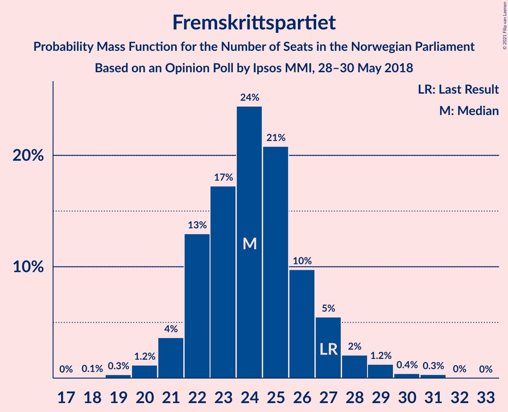
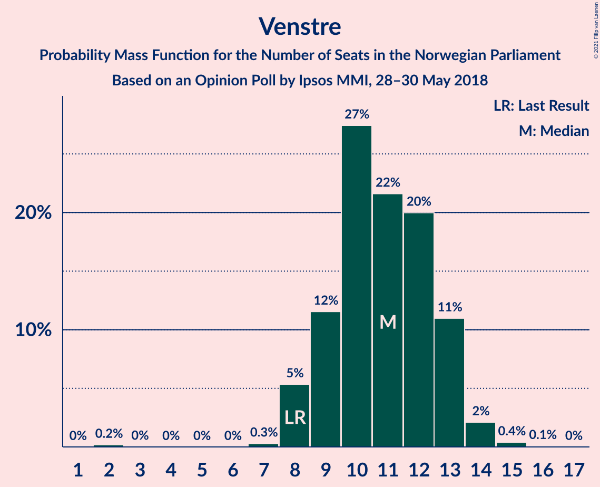
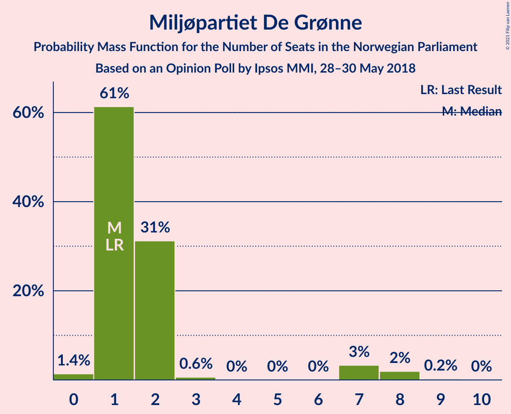
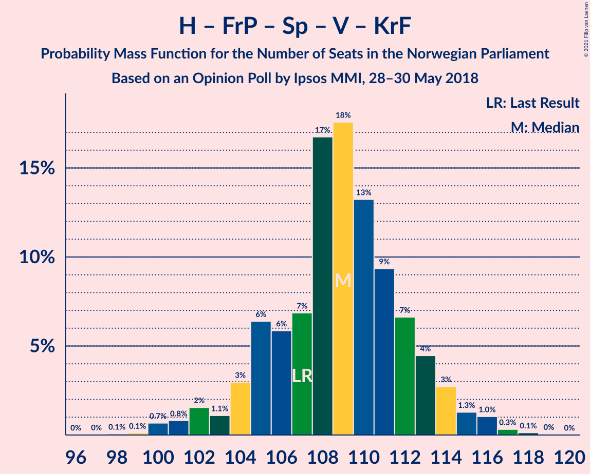
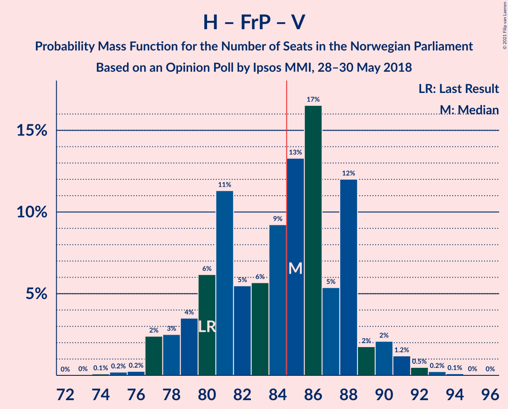
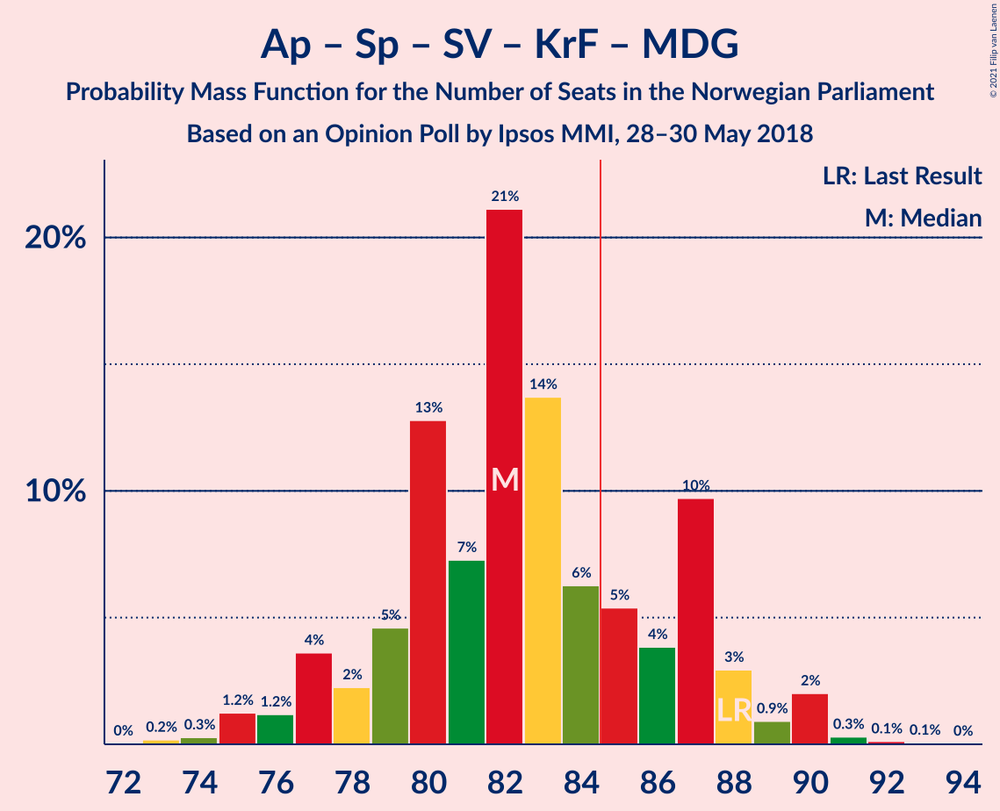

# Opinion Poll by Ipsos MMI, 28–30 May 2018

<a href="#voting-intentions">Voting Intentions</a> | <a href="#seats">Seats</a> | <a href="#coalitions">Coalitions</a> | <a href="#technical-information">Technical Information</a>

## Voting Intentions

### Confidence Intervals

| Party | Last Result | Poll Result | 80% Confidence Interval | 90% Confidence Interval | 95% Confidence Interval | 99% Confidence Interval |
|:-----:|:-----------:|:-----------:|:-----------------------:|:-----------------------:|:-----------------------:|:-----------------------:|
| Høyre | 25.0% | 27.1% | 25.2–29.0% |24.7–29.5% |24.3–30.0% |23.5–30.9% |
| Arbeiderpartiet | 27.4% | 22.9% | 21.2–24.7% |20.7–25.3% |20.3–25.7% |19.5–26.6% |
| Fremskrittspartiet | 15.2% | 13.5% | 12.2–15.1% |11.8–15.5% |11.5–15.9% |10.9–16.6% |
| Senterpartiet | 10.3% | 11.1% | 9.9–12.5% |9.5–12.9% |9.2–13.3% |8.7–14.0% |
| Sosialistisk Venstreparti | 6.0% | 7.7% | 6.7–8.9% |6.4–9.3% |6.1–9.6% |5.7–10.2% |
| Venstre | 4.4% | 5.9% | 5.0–7.0% |4.7–7.3% |4.5–7.6% |4.1–8.1% |
| Kristelig Folkeparti | 4.2% | 3.8% | 3.1–4.8% |2.9–5.0% |2.8–5.3% |2.5–5.7% |
| Rødt | 2.4% | 3.2% | 2.6–4.1% |2.4–4.3% |2.2–4.5% |2.0–5.0% |
| Miljøpartiet De Grønne | 3.2% | 3.0% | 2.4–3.8% |2.2–4.1% |2.1–4.3% |1.8–4.7% |

*Note:* The poll result column reflects the actual value used in the calculations. Published results may vary slightly, and in addition be rounded to fewer digits.

## Seats

### Confidence Intervals

| Party | Last Result | Median | 80% Confidence Interval | 90% Confidence Interval | 95% Confidence Interval | 99% Confidence Interval |
|:-----:|:-----------:|:------:|:-----------------------:|:-----------------------:|:-----------------------:|:-----------------------:|
| <a href="#høyre">Høyre</a> | 45 | 49 | 44–54 |44–54 |44–54 |42–56 |
| <a href="#arbeiderpartiet">Arbeiderpartiet</a> | 49 | 42 | 39–45 |38–46 |37–46 |36–47 |
| <a href="#fremskrittspartiet">Fremskrittspartiet</a> | 27 | 25 | 22–26 |22–27 |21–28 |20–30 |
| <a href="#senterpartiet">Senterpartiet</a> | 19 | 20 | 18–22 |17–23 |17–24 |16–25 |
| <a href="#sosialistisk-venstreparti">Sosialistisk Venstreparti</a> | 11 | 14 | 12–15 |11–16 |11–17 |10–18 |
| <a href="#venstre">Venstre</a> | 8 | 10 | 9–12 |8–14 |8–14 |8–15 |
| <a href="#kristelig-folkeparti">Kristelig Folkeparti</a> | 8 | 3 | 3–8 |2–9 |1–9 |1–10 |
| <a href="#rødt">Rødt</a> | 1 | 2 | 1–8 |1–8 |1–8 |1–8 |
| <a href="#miljøpartiet-de-grønne">Miljøpartiet De Grønne</a> | 1 | 1 | 1–7 |1–7 |0–8 |0–8 |

### Høyre

*For a full overview of the results for this party, see the [Høyre](party-høyre.html) page.*

| Number of Seats | Probability | Accumulated | Special Marks |
|:---------------:|:-----------:|:-----------:|:-------------:|
| 41 | 0.1% | 100% |  |
| 42 | 1.2% | 99.9% |  |
| 43 | 0.8% | 98.7% |  |
| 44 | 9% | 98% |  |
| 45 | 2% | 89% | Last Result |
| 46 | 9% | 87% |  |
| 47 | 19% | 78% |  |
| 48 | 5% | 59% |  |
| 49 | 23% | 54% | Median |
| 50 | 11% | 31% |  |
| 51 | 0.8% | 20% |  |
| 52 | 3% | 19% |  |
| 53 | 5% | 16% |  |
| 54 | 11% | 12% |  |
| 55 | 0.3% | 0.9% |  |
| 56 | 0.5% | 0.6% |  |
| 57 | 0.1% | 0.2% |  |
| 58 | 0% | 0% |  |

### Arbeiderpartiet

*For a full overview of the results for this party, see the [Arbeiderpartiet](party-arbeiderpartiet.html) page.*

| Number of Seats | Probability | Accumulated | Special Marks |
|:---------------:|:-----------:|:-----------:|:-------------:|
| 34 | 0.1% | 100% |  |
| 35 | 0.2% | 99.9% |  |
| 36 | 0.3% | 99.7% |  |
| 37 | 3% | 99.4% |  |
| 38 | 5% | 97% |  |
| 39 | 9% | 91% |  |
| 40 | 7% | 83% |  |
| 41 | 16% | 75% |  |
| 42 | 20% | 59% | Median |
| 43 | 4% | 39% |  |
| 44 | 15% | 35% |  |
| 45 | 14% | 19% |  |
| 46 | 4% | 5% |  |
| 47 | 0.8% | 1.2% |  |
| 48 | 0.1% | 0.4% |  |
| 49 | 0.1% | 0.2% | Last Result |
| 50 | 0.1% | 0.1% |  |
| 51 | 0% | 0% |  |

### Fremskrittspartiet

*For a full overview of the results for this party, see the [Fremskrittspartiet](party-fremskrittspartiet.html) page.*

| Number of Seats | Probability | Accumulated | Special Marks |
|:---------------:|:-----------:|:-----------:|:-------------:|
| 18 | 0.1% | 100% |  |
| 19 | 0.1% | 99.9% |  |
| 20 | 1.3% | 99.8% |  |
| 21 | 2% | 98% |  |
| 22 | 10% | 97% |  |
| 23 | 14% | 87% |  |
| 24 | 22% | 73% |  |
| 25 | 26% | 51% | Median |
| 26 | 15% | 24% |  |
| 27 | 7% | 9% | Last Result |
| 28 | 1.2% | 3% |  |
| 29 | 0.9% | 2% |  |
| 30 | 0.2% | 0.6% |  |
| 31 | 0.2% | 0.4% |  |
| 32 | 0.1% | 0.2% |  |
| 33 | 0% | 0% |  |

### Senterpartiet

*For a full overview of the results for this party, see the [Senterpartiet](party-senterpartiet.html) page.*

| Number of Seats | Probability | Accumulated | Special Marks |
|:---------------:|:-----------:|:-----------:|:-------------:|
| 15 | 0.3% | 100% |  |
| 16 | 1.1% | 99.7% |  |
| 17 | 8% | 98.5% |  |
| 18 | 19% | 90% |  |
| 19 | 19% | 71% | Last Result |
| 20 | 23% | 52% | Median |
| 21 | 6% | 29% |  |
| 22 | 17% | 24% |  |
| 23 | 3% | 6% |  |
| 24 | 3% | 4% |  |
| 25 | 0.4% | 0.8% |  |
| 26 | 0.3% | 0.5% |  |
| 27 | 0.2% | 0.2% |  |
| 28 | 0% | 0% |  |

### Sosialistisk Venstreparti

*For a full overview of the results for this party, see the [Sosialistisk Venstreparti](party-sosialistiskvenstreparti.html) page.*

| Number of Seats | Probability | Accumulated | Special Marks |
|:---------------:|:-----------:|:-----------:|:-------------:|
| 9 | 0.1% | 100% |  |
| 10 | 1.2% | 99.9% |  |
| 11 | 5% | 98.6% | Last Result |
| 12 | 18% | 94% |  |
| 13 | 12% | 76% |  |
| 14 | 26% | 65% | Median |
| 15 | 32% | 39% |  |
| 16 | 4% | 7% |  |
| 17 | 2% | 3% |  |
| 18 | 1.0% | 1.2% |  |
| 19 | 0.2% | 0.2% |  |
| 20 | 0% | 0% |  |

### Venstre

*For a full overview of the results for this party, see the [Venstre](party-venstre.html) page.*

| Number of Seats | Probability | Accumulated | Special Marks |
|:---------------:|:-----------:|:-----------:|:-------------:|
| 2 | 0.1% | 100% |  |
| 3 | 0% | 99.9% |  |
| 4 | 0% | 99.8% |  |
| 5 | 0% | 99.8% |  |
| 6 | 0% | 99.8% |  |
| 7 | 0.1% | 99.8% |  |
| 8 | 6% | 99.7% | Last Result |
| 9 | 27% | 93% |  |
| 10 | 21% | 67% | Median |
| 11 | 28% | 46% |  |
| 12 | 9% | 18% |  |
| 13 | 2% | 9% |  |
| 14 | 5% | 6% |  |
| 15 | 1.2% | 1.4% |  |
| 16 | 0.3% | 0.3% |  |
| 17 | 0% | 0% |  |

### Kristelig Folkeparti

*For a full overview of the results for this party, see the [Kristelig Folkeparti](party-kristeligfolkeparti.html) page.*

| Number of Seats | Probability | Accumulated | Special Marks |
|:---------------:|:-----------:|:-----------:|:-------------:|
| 0 | 0.4% | 100% |  |
| 1 | 4% | 99.6% |  |
| 2 | 4% | 96% |  |
| 3 | 54% | 92% | Median |
| 4 | 0% | 38% |  |
| 5 | 0% | 38% |  |
| 6 | 0% | 38% |  |
| 7 | 7% | 38% |  |
| 8 | 24% | 31% | Last Result |
| 9 | 4% | 7% |  |
| 10 | 2% | 2% |  |
| 11 | 0.2% | 0.2% |  |
| 12 | 0% | 0% |  |

### Rødt

*For a full overview of the results for this party, see the [Rødt](party-rødt.html) page.*

| Number of Seats | Probability | Accumulated | Special Marks |
|:---------------:|:-----------:|:-----------:|:-------------:|
| 1 | 24% | 100% | Last Result |
| 2 | 54% | 76% | Median |
| 3 | 0% | 22% |  |
| 4 | 0% | 22% |  |
| 5 | 0% | 22% |  |
| 6 | 0.1% | 22% |  |
| 7 | 9% | 22% |  |
| 8 | 13% | 13% |  |
| 9 | 0.2% | 0.3% |  |
| 10 | 0.1% | 0.1% |  |
| 11 | 0% | 0% |  |

### Miljøpartiet De Grønne

*For a full overview of the results for this party, see the [Miljøpartiet De Grønne](party-miljøpartietdegrønne.html) page.*

| Number of Seats | Probability | Accumulated | Special Marks |
|:---------------:|:-----------:|:-----------:|:-------------:|
| 0 | 5% | 100% |  |
| 1 | 48% | 95% | Last Result, Median |
| 2 | 34% | 47% |  |
| 3 | 0.3% | 13% |  |
| 4 | 0% | 13% |  |
| 5 | 0% | 13% |  |
| 6 | 0% | 13% |  |
| 7 | 9% | 13% |  |
| 8 | 3% | 3% |  |
| 9 | 0.2% | 0.2% |  |
| 10 | 0% | 0% |  |

## Coalitions

### Confidence Intervals

| Coalition | Last Result | Median | Majority? | 80% Confidence Interval | 90% Confidence Interval | 95% Confidence Interval | 99% Confidence Interval |
|:---------:|:-----------:|:------:|:---------:|:-----------------------:|:-----------------------:|:-----------------------:|:-----------------------:|
| Høyre – Fremskrittspartiet – Senterpartiet – Venstre – Kristelig Folkeparti | 107 | 107 | 100% | 104–113 | 102–114 | 102–115 | 100–115 |
| Høyre – Fremskrittspartiet – Venstre – Kristelig Folkeparti – Miljøpartiet De Grønne | 89 | 90 | 96% | 85–95 | 85–96 | 83–99 | 81–99 |
| Høyre – Fremskrittspartiet – Venstre – Kristelig Folkeparti | 88 | 88 | 88% | 84–93 | 84–95 | 81–97 | 80–97 |
| Høyre – Fremskrittspartiet – Venstre | 80 | 83 | 38% | 79–87 | 79–89 | 77–90 | 76–92 |
| Arbeiderpartiet – Senterpartiet – Sosialistisk Venstreparti – Kristelig Folkeparti – Miljøpartiet De Grønne | 88 | 83 | 35% | 77–87 | 75–88 | 75–88 | 73–90 |
| Arbeiderpartiet – Senterpartiet – Sosialistisk Venstreparti – Rødt – Miljøpartiet De Grønne | 81 | 81 | 12% | 76–85 | 74–85 | 72–88 | 72–89 |
| Arbeiderpartiet – Senterpartiet – Sosialistisk Venstreparti – Rødt | 80 | 79 | 4% | 74–84 | 73–84 | 70–86 | 70–88 |
| Arbeiderpartiet – Senterpartiet – Sosialistisk Venstreparti – Miljøpartiet De Grønne | 80 | 79 | 1.4% | 72–82 | 72–82 | 70–83 | 70–85 |
| Arbeiderpartiet – Senterpartiet – Sosialistisk Venstreparti | 79 | 76 | 0.2% | 71–80 | 70–80 | 68–81 | 68–84 |
| Høyre – Fremskrittspartiet | 72 | 73 | 0% | 69–77 | 69–78 | 68–79 | 66–82 |
| Arbeiderpartiet – Senterpartiet – Kristelig Folkeparti – Miljøpartiet De Grønne | 77 | 68 | 0% | 62–74 | 62–75 | 62–75 | 59–77 |
| Arbeiderpartiet – Senterpartiet – Kristelig Folkeparti | 76 | 67 | 0% | 61–71 | 61–72 | 60–72 | 58–75 |
| Høyre – Venstre – Kristelig Folkeparti | 61 | 63 | 0% | 59–68 | 58–69 | 57–71 | 55–72 |
| Arbeiderpartiet – Senterpartiet | 68 | 62 | 0% | 58–65 | 57–65 | 55–66 | 55–71 |
| Arbeiderpartiet – Sosialistisk Venstreparti | 60 | 56 | 0% | 52–60 | 50–60 | 50–60 | 50–62 |
| Senterpartiet – Venstre – Kristelig Folkeparti | 35 | 34 | 0% | 32–39 | 32–40 | 29–41 | 28–44 |

### Høyre – Fremskrittspartiet – Senterpartiet – Venstre – Kristelig Folkeparti

| Number of Seats | Probability | Accumulated | Special Marks |
|:---------------:|:-----------:|:-----------:|:-------------:|
| 97 | 0% | 100% |  |
| 98 | 0.1% | 99.9% |  |
| 99 | 0% | 99.9% |  |
| 100 | 2% | 99.8% |  |
| 101 | 0.5% | 98% |  |
| 102 | 7% | 98% |  |
| 103 | 0.4% | 91% |  |
| 104 | 2% | 91% |  |
| 105 | 16% | 89% |  |
| 106 | 17% | 73% |  |
| 107 | 7% | 57% | Last Result, Median |
| 108 | 7% | 49% |  |
| 109 | 6% | 42% |  |
| 110 | 3% | 36% |  |
| 111 | 15% | 33% |  |
| 112 | 4% | 18% |  |
| 113 | 7% | 14% |  |
| 114 | 1.5% | 6% |  |
| 115 | 4% | 5% |  |
| 116 | 0.1% | 0.4% |  |
| 117 | 0.2% | 0.3% |  |
| 118 | 0% | 0.1% |  |
| 119 | 0% | 0% |  |

### Høyre – Fremskrittspartiet – Venstre – Kristelig Folkeparti – Miljøpartiet De Grønne

| Number of Seats | Probability | Accumulated | Special Marks |
|:---------------:|:-----------:|:-----------:|:-------------:|
| 80 | 0.2% | 100% |  |
| 81 | 1.1% | 99.8% |  |
| 82 | 0.7% | 98.7% |  |
| 83 | 0.9% | 98% |  |
| 84 | 0.9% | 97% |  |
| 85 | 6% | 96% | Majority |
| 86 | 1.4% | 90% |  |
| 87 | 8% | 89% |  |
| 88 | 8% | 80% | Median |
| 89 | 8% | 72% | Last Result |
| 90 | 21% | 64% |  |
| 91 | 10% | 43% |  |
| 92 | 5% | 33% |  |
| 93 | 10% | 28% |  |
| 94 | 8% | 18% |  |
| 95 | 0.9% | 10% |  |
| 96 | 5% | 9% |  |
| 97 | 0.5% | 4% |  |
| 98 | 0.4% | 3% |  |
| 99 | 3% | 3% |  |
| 100 | 0.1% | 0.1% |  |
| 101 | 0.1% | 0.1% |  |
| 102 | 0% | 0% |  |

### Høyre – Fremskrittspartiet – Venstre – Kristelig Folkeparti

| Number of Seats | Probability | Accumulated | Special Marks |
|:---------------:|:-----------:|:-----------:|:-------------:|
| 79 | 0.2% | 100% |  |
| 80 | 2% | 99.7% |  |
| 81 | 1.1% | 98% |  |
| 82 | 0.5% | 97% |  |
| 83 | 1.0% | 97% |  |
| 84 | 8% | 96% |  |
| 85 | 10% | 88% | Majority |
| 86 | 5% | 77% |  |
| 87 | 16% | 72% | Median |
| 88 | 10% | 56% | Last Result |
| 89 | 21% | 46% |  |
| 90 | 6% | 26% |  |
| 91 | 4% | 20% |  |
| 92 | 3% | 16% |  |
| 93 | 3% | 12% |  |
| 94 | 0.7% | 9% |  |
| 95 | 5% | 8% |  |
| 96 | 0.5% | 3% |  |
| 97 | 3% | 3% |  |
| 98 | 0.2% | 0.2% |  |
| 99 | 0% | 0% |  |

### Høyre – Fremskrittspartiet – Venstre

| Number of Seats | Probability | Accumulated | Special Marks |
|:---------------:|:-----------:|:-----------:|:-------------:|
| 73 | 0.1% | 100% |  |
| 74 | 0.1% | 99.9% |  |
| 75 | 0% | 99.9% |  |
| 76 | 0.4% | 99.8% |  |
| 77 | 2% | 99.4% |  |
| 78 | 1.0% | 97% |  |
| 79 | 7% | 97% |  |
| 80 | 7% | 89% | Last Result |
| 81 | 12% | 83% |  |
| 82 | 13% | 70% |  |
| 83 | 7% | 57% |  |
| 84 | 11% | 49% | Median |
| 85 | 7% | 38% | Majority |
| 86 | 14% | 31% |  |
| 87 | 10% | 17% |  |
| 88 | 1.3% | 7% |  |
| 89 | 2% | 6% |  |
| 90 | 2% | 4% |  |
| 91 | 0.2% | 2% |  |
| 92 | 1.2% | 1.3% |  |
| 93 | 0.1% | 0.1% |  |
| 94 | 0% | 0.1% |  |
| 95 | 0% | 0% |  |

### Arbeiderpartiet – Senterpartiet – Sosialistisk Venstreparti – Kristelig Folkeparti – Miljøpartiet De Grønne

| Number of Seats | Probability | Accumulated | Special Marks |
|:---------------:|:-----------:|:-----------:|:-------------:|
| 73 | 1.1% | 100% |  |
| 74 | 0.1% | 98.9% |  |
| 75 | 4% | 98.8% |  |
| 76 | 0.8% | 95% |  |
| 77 | 9% | 94% |  |
| 78 | 0.3% | 85% |  |
| 79 | 2% | 84% |  |
| 80 | 10% | 82% | Median |
| 81 | 8% | 73% |  |
| 82 | 14% | 65% |  |
| 83 | 7% | 51% |  |
| 84 | 9% | 44% |  |
| 85 | 13% | 35% | Majority |
| 86 | 8% | 22% |  |
| 87 | 6% | 14% |  |
| 88 | 6% | 8% | Last Result |
| 89 | 0.5% | 2% |  |
| 90 | 0.9% | 1.3% |  |
| 91 | 0.3% | 0.4% |  |
| 92 | 0.1% | 0.1% |  |
| 93 | 0% | 0% |  |

### Arbeiderpartiet – Senterpartiet – Sosialistisk Venstreparti – Rødt – Miljøpartiet De Grønne

| Number of Seats | Probability | Accumulated | Special Marks |
|:---------------:|:-----------:|:-----------:|:-------------:|
| 71 | 0.2% | 100% |  |
| 72 | 3% | 99.8% |  |
| 73 | 0.5% | 97% |  |
| 74 | 5% | 97% |  |
| 75 | 0.7% | 92% |  |
| 76 | 3% | 91% |  |
| 77 | 3% | 88% |  |
| 78 | 4% | 84% |  |
| 79 | 6% | 80% | Median |
| 80 | 21% | 74% |  |
| 81 | 10% | 54% | Last Result |
| 82 | 16% | 44% |  |
| 83 | 5% | 28% |  |
| 84 | 10% | 23% |  |
| 85 | 8% | 12% | Majority |
| 86 | 1.0% | 4% |  |
| 87 | 0.5% | 3% |  |
| 88 | 1.1% | 3% |  |
| 89 | 2% | 2% |  |
| 90 | 0.2% | 0.3% |  |
| 91 | 0% | 0% |  |

### Arbeiderpartiet – Senterpartiet – Sosialistisk Venstreparti – Rødt

| Number of Seats | Probability | Accumulated | Special Marks |
|:---------------:|:-----------:|:-----------:|:-------------:|
| 68 | 0.1% | 100% |  |
| 69 | 0.1% | 99.9% |  |
| 70 | 3% | 99.9% |  |
| 71 | 0.4% | 97% |  |
| 72 | 0.5% | 97% |  |
| 73 | 5% | 96% |  |
| 74 | 0.9% | 91% |  |
| 75 | 8% | 90% |  |
| 76 | 10% | 82% |  |
| 77 | 5% | 72% |  |
| 78 | 10% | 67% | Median |
| 79 | 21% | 57% |  |
| 80 | 8% | 36% | Last Result |
| 81 | 8% | 28% |  |
| 82 | 8% | 20% |  |
| 83 | 1.4% | 11% |  |
| 84 | 6% | 10% |  |
| 85 | 0.9% | 4% | Majority |
| 86 | 0.9% | 3% |  |
| 87 | 0.7% | 2% |  |
| 88 | 1.1% | 1.3% |  |
| 89 | 0.2% | 0.2% |  |
| 90 | 0% | 0% |  |

### Arbeiderpartiet – Senterpartiet – Sosialistisk Venstreparti – Miljøpartiet De Grønne

| Number of Seats | Probability | Accumulated | Special Marks |
|:---------------:|:-----------:|:-----------:|:-------------:|
| 69 | 0.2% | 100% |  |
| 70 | 4% | 99.8% |  |
| 71 | 0.5% | 96% |  |
| 72 | 8% | 95% |  |
| 73 | 1.0% | 87% |  |
| 74 | 10% | 86% |  |
| 75 | 2% | 76% |  |
| 76 | 6% | 75% |  |
| 77 | 6% | 69% | Median |
| 78 | 13% | 63% |  |
| 79 | 17% | 50% |  |
| 80 | 12% | 33% | Last Result |
| 81 | 6% | 21% |  |
| 82 | 9% | 14% |  |
| 83 | 3% | 5% |  |
| 84 | 0.3% | 2% |  |
| 85 | 0.9% | 1.4% | Majority |
| 86 | 0.3% | 0.5% |  |
| 87 | 0.1% | 0.2% |  |
| 88 | 0% | 0.1% |  |
| 89 | 0% | 0% |  |

### Arbeiderpartiet – Senterpartiet – Sosialistisk Venstreparti

| Number of Seats | Probability | Accumulated | Special Marks |
|:---------------:|:-----------:|:-----------:|:-------------:|
| 66 | 0.1% | 100% |  |
| 67 | 0.1% | 99.9% |  |
| 68 | 3% | 99.9% |  |
| 69 | 1.3% | 97% |  |
| 70 | 4% | 96% |  |
| 71 | 6% | 92% |  |
| 72 | 1.4% | 86% |  |
| 73 | 15% | 85% |  |
| 74 | 7% | 70% |  |
| 75 | 7% | 63% |  |
| 76 | 8% | 56% | Median |
| 77 | 16% | 48% |  |
| 78 | 15% | 32% |  |
| 79 | 5% | 18% | Last Result |
| 80 | 10% | 12% |  |
| 81 | 1.2% | 3% |  |
| 82 | 0.5% | 2% |  |
| 83 | 0.1% | 1.1% |  |
| 84 | 0.8% | 1.0% |  |
| 85 | 0.1% | 0.2% | Majority |
| 86 | 0.1% | 0.1% |  |
| 87 | 0% | 0% |  |

### Høyre – Fremskrittspartiet

| Number of Seats | Probability | Accumulated | Special Marks |
|:---------------:|:-----------:|:-----------:|:-------------:|
| 63 | 0.1% | 100% |  |
| 64 | 0.1% | 99.9% |  |
| 65 | 0.3% | 99.9% |  |
| 66 | 0.3% | 99.5% |  |
| 67 | 1.4% | 99.2% |  |
| 68 | 2% | 98% |  |
| 69 | 8% | 95% |  |
| 70 | 8% | 87% |  |
| 71 | 11% | 80% |  |
| 72 | 12% | 69% | Last Result |
| 73 | 19% | 57% |  |
| 74 | 6% | 38% | Median |
| 75 | 7% | 31% |  |
| 76 | 7% | 24% |  |
| 77 | 11% | 17% |  |
| 78 | 1.5% | 6% |  |
| 79 | 3% | 4% |  |
| 80 | 0.5% | 2% |  |
| 81 | 0.6% | 1.2% |  |
| 82 | 0.5% | 0.6% |  |
| 83 | 0% | 0.1% |  |
| 84 | 0% | 0% |  |

### Arbeiderpartiet – Senterpartiet – Kristelig Folkeparti – Miljøpartiet De Grønne

| Number of Seats | Probability | Accumulated | Special Marks |
|:---------------:|:-----------:|:-----------:|:-------------:|
| 58 | 0% | 100% |  |
| 59 | 0.6% | 99.9% |  |
| 60 | 0.1% | 99.3% |  |
| 61 | 2% | 99.2% |  |
| 62 | 8% | 98% |  |
| 63 | 3% | 90% |  |
| 64 | 3% | 87% |  |
| 65 | 0.9% | 83% |  |
| 66 | 13% | 83% | Median |
| 67 | 2% | 70% |  |
| 68 | 20% | 68% |  |
| 69 | 4% | 48% |  |
| 70 | 10% | 44% |  |
| 71 | 1.3% | 34% |  |
| 72 | 19% | 32% |  |
| 73 | 2% | 13% |  |
| 74 | 3% | 11% |  |
| 75 | 6% | 8% |  |
| 76 | 0.7% | 1.3% |  |
| 77 | 0.3% | 0.5% | Last Result |
| 78 | 0.1% | 0.3% |  |
| 79 | 0.1% | 0.2% |  |
| 80 | 0.1% | 0.1% |  |
| 81 | 0% | 0% |  |

### Arbeiderpartiet – Senterpartiet – Kristelig Folkeparti

| Number of Seats | Probability | Accumulated | Special Marks |
|:---------------:|:-----------:|:-----------:|:-------------:|
| 55 | 0.1% | 100% |  |
| 56 | 0% | 99.9% |  |
| 57 | 0.1% | 99.9% |  |
| 58 | 0.7% | 99.8% |  |
| 59 | 0.1% | 99.2% |  |
| 60 | 2% | 99.1% |  |
| 61 | 10% | 97% |  |
| 62 | 3% | 87% |  |
| 63 | 1.5% | 84% |  |
| 64 | 4% | 83% |  |
| 65 | 13% | 79% | Median |
| 66 | 5% | 65% |  |
| 67 | 22% | 60% |  |
| 68 | 15% | 38% |  |
| 69 | 3% | 24% |  |
| 70 | 11% | 21% |  |
| 71 | 2% | 10% |  |
| 72 | 6% | 8% |  |
| 73 | 0.8% | 2% |  |
| 74 | 0.2% | 1.1% |  |
| 75 | 0.6% | 0.9% |  |
| 76 | 0.1% | 0.3% | Last Result |
| 77 | 0% | 0.2% |  |
| 78 | 0.1% | 0.2% |  |
| 79 | 0% | 0% |  |

### Høyre – Venstre – Kristelig Folkeparti

| Number of Seats | Probability | Accumulated | Special Marks |
|:---------------:|:-----------:|:-----------:|:-------------:|
| 54 | 0.1% | 100% |  |
| 55 | 1.1% | 99.9% |  |
| 56 | 0.7% | 98.8% |  |
| 57 | 1.3% | 98% |  |
| 58 | 6% | 97% |  |
| 59 | 0.8% | 91% |  |
| 60 | 3% | 90% |  |
| 61 | 12% | 87% | Last Result |
| 62 | 2% | 75% | Median |
| 63 | 24% | 73% |  |
| 64 | 6% | 49% |  |
| 65 | 12% | 43% |  |
| 66 | 12% | 30% |  |
| 67 | 3% | 18% |  |
| 68 | 10% | 15% |  |
| 69 | 0.5% | 5% |  |
| 70 | 0.4% | 5% |  |
| 71 | 4% | 5% |  |
| 72 | 0.8% | 0.9% |  |
| 73 | 0.1% | 0.1% |  |
| 74 | 0% | 0.1% |  |
| 75 | 0% | 0% |  |

### Arbeiderpartiet – Senterpartiet

| Number of Seats | Probability | Accumulated | Special Marks |
|:---------------:|:-----------:|:-----------:|:-------------:|
| 53 | 0% | 100% |  |
| 54 | 0.4% | 99.9% |  |
| 55 | 3% | 99.6% |  |
| 56 | 0.7% | 97% |  |
| 57 | 4% | 96% |  |
| 58 | 10% | 92% |  |
| 59 | 6% | 82% |  |
| 60 | 8% | 76% |  |
| 61 | 3% | 68% |  |
| 62 | 23% | 65% | Median |
| 63 | 8% | 42% |  |
| 64 | 18% | 35% |  |
| 65 | 12% | 16% |  |
| 66 | 1.3% | 4% |  |
| 67 | 0.9% | 2% |  |
| 68 | 0.3% | 2% | Last Result |
| 69 | 0.3% | 1.3% |  |
| 70 | 0.2% | 0.9% |  |
| 71 | 0.7% | 0.8% |  |
| 72 | 0% | 0.1% |  |
| 73 | 0.1% | 0.1% |  |
| 74 | 0% | 0% |  |

### Arbeiderpartiet – Sosialistisk Venstreparti

| Number of Seats | Probability | Accumulated | Special Marks |
|:---------------:|:-----------:|:-----------:|:-------------:|
| 47 | 0.1% | 100% |  |
| 48 | 0.2% | 99.9% |  |
| 49 | 0.1% | 99.6% |  |
| 50 | 7% | 99.5% |  |
| 51 | 1.3% | 93% |  |
| 52 | 3% | 92% |  |
| 53 | 7% | 88% |  |
| 54 | 21% | 81% |  |
| 55 | 5% | 60% |  |
| 56 | 18% | 56% | Median |
| 57 | 5% | 38% |  |
| 58 | 6% | 33% |  |
| 59 | 11% | 27% |  |
| 60 | 15% | 17% | Last Result |
| 61 | 1.1% | 2% |  |
| 62 | 0.2% | 0.6% |  |
| 63 | 0.4% | 0.5% |  |
| 64 | 0.1% | 0.1% |  |
| 65 | 0% | 0% |  |

### Senterpartiet – Venstre – Kristelig Folkeparti

| Number of Seats | Probability | Accumulated | Special Marks |
|:---------------:|:-----------:|:-----------:|:-------------:|
| 27 | 0.4% | 100% |  |
| 28 | 0.5% | 99.6% |  |
| 29 | 2% | 99.2% |  |
| 30 | 0.6% | 97% |  |
| 31 | 1.2% | 96% |  |
| 32 | 14% | 95% |  |
| 33 | 14% | 81% | Median |
| 34 | 18% | 67% |  |
| 35 | 10% | 49% | Last Result |
| 36 | 8% | 39% |  |
| 37 | 19% | 31% |  |
| 38 | 2% | 12% |  |
| 39 | 4% | 10% |  |
| 40 | 2% | 6% |  |
| 41 | 3% | 4% |  |
| 42 | 0.5% | 2% |  |
| 43 | 0.7% | 1.2% |  |
| 44 | 0.2% | 0.5% |  |
| 45 | 0.3% | 0.4% |  |
| 46 | 0% | 0% |  |

## Technical Information

### Opinion Poll

+ **Polling firm:** Ipsos MMI
+ **Commissioner(s):** —
+ **Fieldwork period:** 28–30 May 2018

### Calculations

+ **Sample size:** 939
+ **Simulations done:** 131,072
+ **Error estimate:** 4.76%

