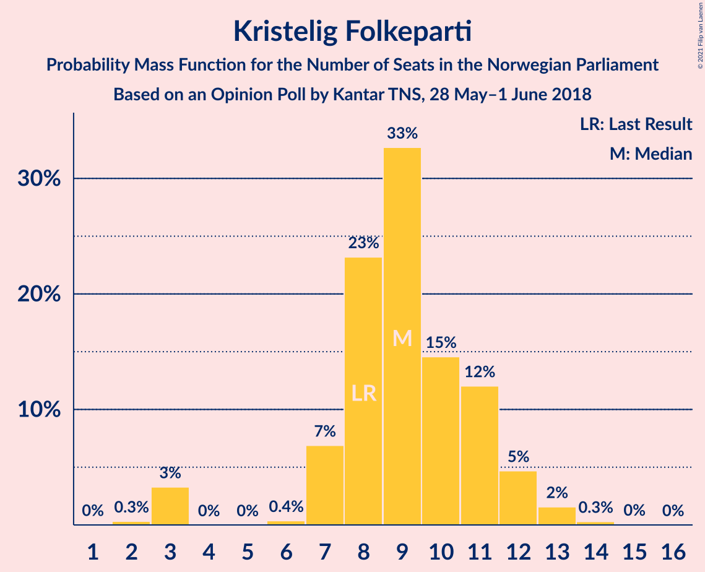
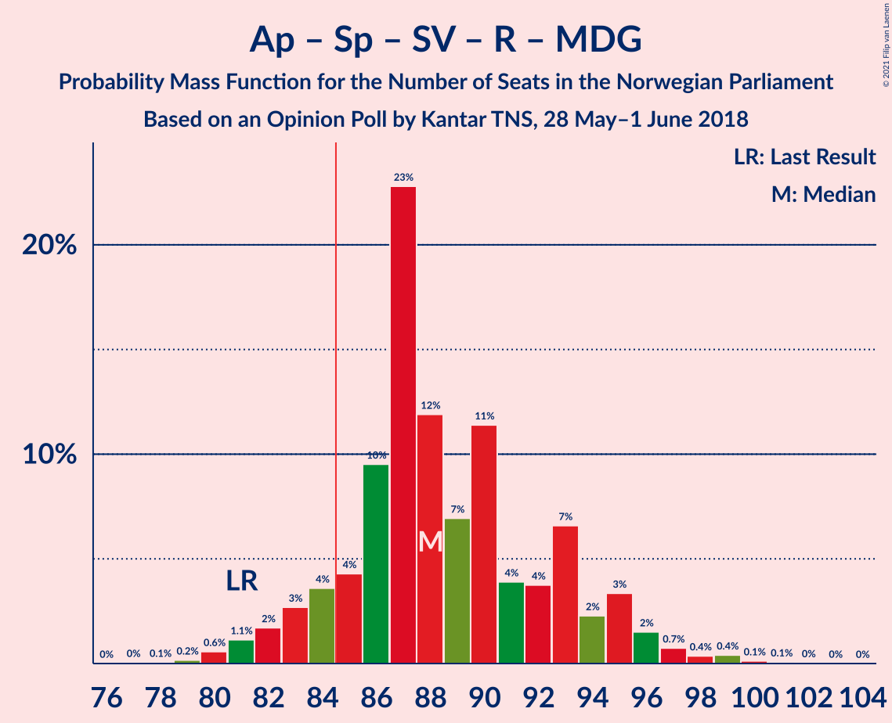
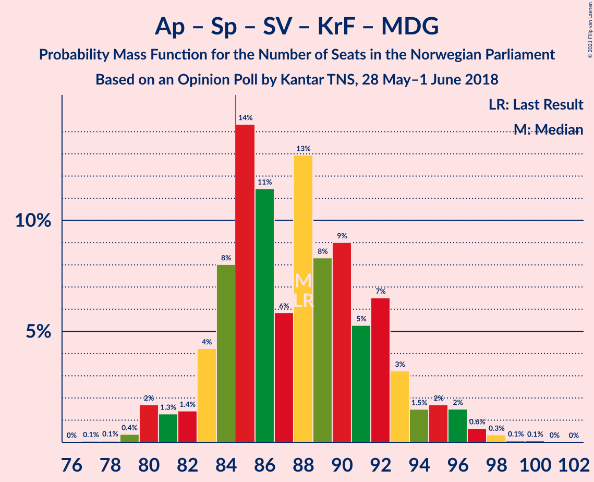
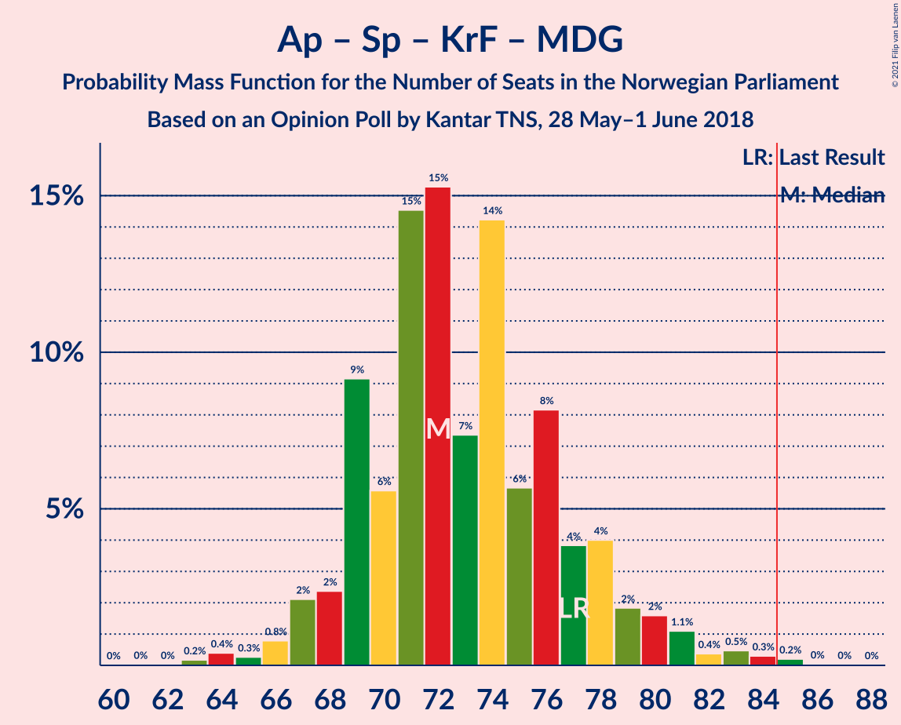
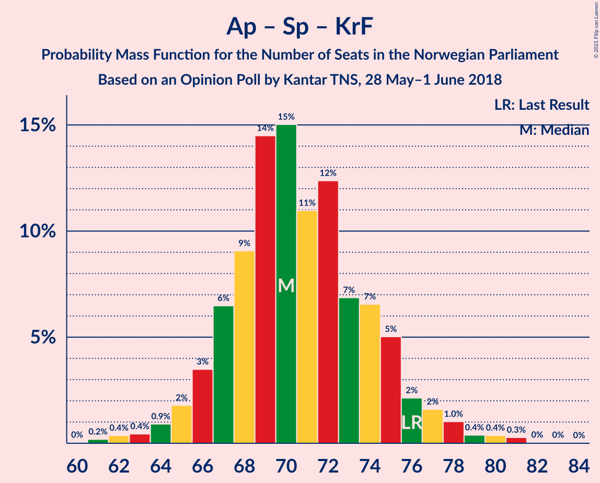
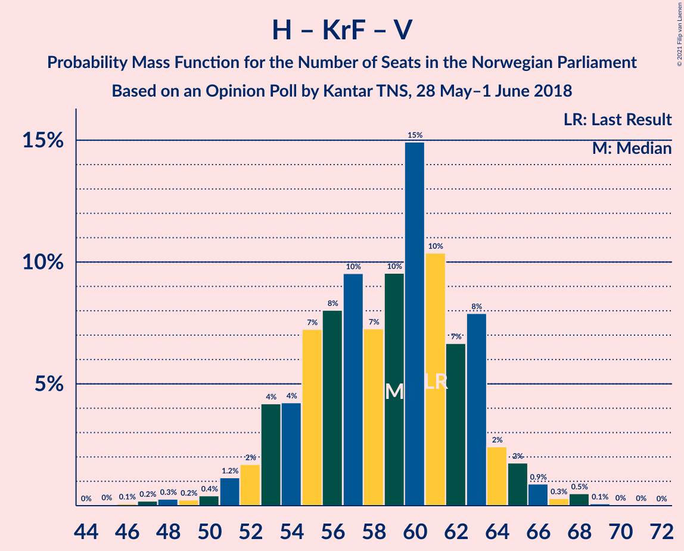

# Opinion Poll by Kantar TNS, 28 May–1 June 2018

<a href="#voting-intentions">Voting Intentions</a> | <a href="#seats">Seats</a> | <a href="#coalitions">Coalitions</a> | <a href="#technical-information">Technical Information</a>

## Voting Intentions

### Confidence Intervals

| Party | Last Result | Poll Result | 80% Confidence Interval | 90% Confidence Interval | 95% Confidence Interval | 99% Confidence Interval |
|:-----:|:-----------:|:-----------:|:-----------------------:|:-----------------------:|:-----------------------:|:-----------------------:|
| Høyre | 25.0% | 24.5% | 22.5–26.6% |22.0–27.2% |21.5–27.7% |20.6–28.7% |
| Arbeiderpartiet | 27.4% | 23.4% | 21.5–25.5% |20.9–26.1% |20.5–26.6% |19.6–27.6% |
| Fremskrittspartiet | 15.2% | 12.4% | 10.9–14.0% |10.5–14.5% |10.2–14.9% |9.5–15.8% |
| Senterpartiet | 10.3% | 11.3% | 9.9–12.9% |9.5–13.4% |9.2–13.8% |8.6–14.6% |
| Sosialistisk Venstreparti | 6.0% | 8.5% | 7.3–9.9% |7.0–10.3% |6.7–10.7% |6.1–11.4% |
| Rødt | 2.4% | 5.6% | 4.7–6.9% |4.4–7.2% |4.2–7.5% |3.8–8.2% |
| Kristelig Folkeparti | 4.2% | 5.2% | 4.3–6.4% |4.1–6.8% |3.9–7.1% |3.5–7.7% |
| Venstre | 4.4% | 4.4% | 3.6–5.6% |3.4–5.9% |3.2–6.2% |2.8–6.8% |
| Miljøpartiet De Grønne | 3.2% | 3.2% | 2.5–4.2% |2.3–4.5% |2.2–4.8% |1.9–5.3% |

*Note:* The poll result column reflects the actual value used in the calculations. Published results may vary slightly, and in addition be rounded to fewer digits.

## Seats

### Confidence Intervals

| Party | Last Result | Median | 80% Confidence Interval | 90% Confidence Interval | 95% Confidence Interval | 99% Confidence Interval |
|:-----:|:-----------:|:------:|:-----------------------:|:-----------------------:|:-----------------------:|:-----------------------:|
| <a href="#høyre">Høyre</a> | 45 | 44 | 39–47 |37–49 |36–51 |35–53 |
| <a href="#arbeiderpartiet">Arbeiderpartiet</a> | 49 | 42 | 39–45 |38–46 |36–48 |34–48 |
| <a href="#fremskrittspartiet">Fremskrittspartiet</a> | 27 | 22 | 19–26 |18–26 |17–27 |16–28 |
| <a href="#senterpartiet">Senterpartiet</a> | 19 | 18 | 16–24 |15–26 |15–26 |14–27 |
| <a href="#sosialistisk-venstreparti">Sosialistisk Venstreparti</a> | 11 | 15 | 12–17 |12–19 |11–20 |10–20 |
| <a href="#rødt">Rødt</a> | 1 | 10 | 8–12 |7–13 |7–13 |2–14 |
| <a href="#kristelig-folkeparti">Kristelig Folkeparti</a> | 8 | 9 | 7–11 |3–12 |3–13 |3–14 |
| <a href="#venstre">Venstre</a> | 8 | 7 | 2–10 |2–10 |2–11 |2–12 |
| <a href="#miljøpartiet-de-grønne">Miljøpartiet De Grønne</a> | 1 | 2 | 1–7 |1–8 |0–8 |0–9 |

### Høyre

*For a full overview of the results for this party, see the [Høyre](party-høyre.html) page.*

| Number of Seats | Probability | Accumulated | Special Marks |
|:---------------:|:-----------:|:-----------:|:-------------:|
| 34 | 0.1% | 100% |  |
| 35 | 0.5% | 99.9% |  |
| 36 | 2% | 99.5% |  |
| 37 | 4% | 97% |  |
| 38 | 3% | 94% |  |
| 39 | 9% | 90% |  |
| 40 | 6% | 82% |  |
| 41 | 4% | 75% |  |
| 42 | 11% | 71% |  |
| 43 | 4% | 60% |  |
| 44 | 25% | 56% | Median |
| 45 | 12% | 31% | Last Result |
| 46 | 8% | 19% |  |
| 47 | 3% | 11% |  |
| 48 | 2% | 8% |  |
| 49 | 1.5% | 6% |  |
| 50 | 2% | 4% |  |
| 51 | 2% | 3% |  |
| 52 | 0.1% | 0.7% |  |
| 53 | 0.2% | 0.7% |  |
| 54 | 0.4% | 0.4% |  |
| 55 | 0% | 0% |  |

### Arbeiderpartiet

*For a full overview of the results for this party, see the [Arbeiderpartiet](party-arbeiderpartiet.html) page.*

| Number of Seats | Probability | Accumulated | Special Marks |
|:---------------:|:-----------:|:-----------:|:-------------:|
| 33 | 0.5% | 100% |  |
| 34 | 0.1% | 99.5% |  |
| 35 | 0.1% | 99.5% |  |
| 36 | 2% | 99.3% |  |
| 37 | 1.0% | 97% |  |
| 38 | 2% | 97% |  |
| 39 | 18% | 95% |  |
| 40 | 12% | 76% |  |
| 41 | 13% | 64% |  |
| 42 | 17% | 51% | Median |
| 43 | 7% | 34% |  |
| 44 | 14% | 28% |  |
| 45 | 5% | 13% |  |
| 46 | 4% | 8% |  |
| 47 | 1.2% | 4% |  |
| 48 | 2% | 3% |  |
| 49 | 0.2% | 0.5% | Last Result |
| 50 | 0.1% | 0.2% |  |
| 51 | 0.1% | 0.2% |  |
| 52 | 0% | 0.1% |  |
| 53 | 0% | 0% |  |

### Fremskrittspartiet

*For a full overview of the results for this party, see the [Fremskrittspartiet](party-fremskrittspartiet.html) page.*

| Number of Seats | Probability | Accumulated | Special Marks |
|:---------------:|:-----------:|:-----------:|:-------------:|
| 14 | 0% | 100% |  |
| 15 | 0.2% | 99.9% |  |
| 16 | 1.0% | 99.7% |  |
| 17 | 3% | 98.7% |  |
| 18 | 4% | 96% |  |
| 19 | 6% | 91% |  |
| 20 | 12% | 85% |  |
| 21 | 8% | 73% |  |
| 22 | 17% | 65% | Median |
| 23 | 8% | 48% |  |
| 24 | 13% | 39% |  |
| 25 | 14% | 26% |  |
| 26 | 9% | 12% |  |
| 27 | 1.3% | 3% | Last Result |
| 28 | 1.1% | 1.4% |  |
| 29 | 0.2% | 0.4% |  |
| 30 | 0.1% | 0.1% |  |
| 31 | 0% | 0% |  |

### Senterpartiet

*For a full overview of the results for this party, see the [Senterpartiet](party-senterpartiet.html) page.*

| Number of Seats | Probability | Accumulated | Special Marks |
|:---------------:|:-----------:|:-----------:|:-------------:|
| 13 | 0.2% | 100% |  |
| 14 | 0.6% | 99.8% |  |
| 15 | 6% | 99.2% |  |
| 16 | 9% | 93% |  |
| 17 | 20% | 84% |  |
| 18 | 15% | 64% | Median |
| 19 | 15% | 48% | Last Result |
| 20 | 5% | 33% |  |
| 21 | 4% | 28% |  |
| 22 | 8% | 24% |  |
| 23 | 5% | 16% |  |
| 24 | 4% | 11% |  |
| 25 | 1.2% | 7% |  |
| 26 | 4% | 6% |  |
| 27 | 1.1% | 1.4% |  |
| 28 | 0.3% | 0.3% |  |
| 29 | 0% | 0% |  |

### Sosialistisk Venstreparti

*For a full overview of the results for this party, see the [Sosialistisk Venstreparti](party-sosialistiskvenstreparti.html) page.*

| Number of Seats | Probability | Accumulated | Special Marks |
|:---------------:|:-----------:|:-----------:|:-------------:|
| 9 | 0.3% | 100% |  |
| 10 | 2% | 99.7% |  |
| 11 | 2% | 98% | Last Result |
| 12 | 11% | 96% |  |
| 13 | 19% | 85% |  |
| 14 | 12% | 67% |  |
| 15 | 15% | 55% | Median |
| 16 | 9% | 40% |  |
| 17 | 23% | 31% |  |
| 18 | 3% | 8% |  |
| 19 | 2% | 5% |  |
| 20 | 3% | 3% |  |
| 21 | 0.1% | 0.2% |  |
| 22 | 0% | 0% |  |

### Rødt

*For a full overview of the results for this party, see the [Rødt](party-rødt.html) page.*

| Number of Seats | Probability | Accumulated | Special Marks |
|:---------------:|:-----------:|:-----------:|:-------------:|
| 1 | 0% | 100% | Last Result |
| 2 | 0.8% | 100% |  |
| 3 | 0% | 99.2% |  |
| 4 | 0% | 99.2% |  |
| 5 | 0% | 99.2% |  |
| 6 | 0.9% | 99.2% |  |
| 7 | 7% | 98% |  |
| 8 | 7% | 91% |  |
| 9 | 14% | 84% |  |
| 10 | 23% | 70% | Median |
| 11 | 26% | 47% |  |
| 12 | 14% | 21% |  |
| 13 | 5% | 7% |  |
| 14 | 1.2% | 1.5% |  |
| 15 | 0.2% | 0.2% |  |
| 16 | 0.1% | 0.1% |  |
| 17 | 0% | 0% |  |

### Kristelig Folkeparti

*For a full overview of the results for this party, see the [Kristelig Folkeparti](party-kristeligfolkeparti.html) page.*

| Number of Seats | Probability | Accumulated | Special Marks |
|:---------------:|:-----------:|:-----------:|:-------------:|
| 2 | 0.3% | 100% |  |
| 3 | 7% | 99.7% |  |
| 4 | 0% | 92% |  |
| 5 | 0% | 92% |  |
| 6 | 0.8% | 92% |  |
| 7 | 8% | 92% |  |
| 8 | 23% | 84% | Last Result |
| 9 | 14% | 61% | Median |
| 10 | 22% | 46% |  |
| 11 | 18% | 24% |  |
| 12 | 3% | 6% |  |
| 13 | 3% | 3% |  |
| 14 | 0.6% | 0.7% |  |
| 15 | 0% | 0.1% |  |
| 16 | 0% | 0% |  |

### Venstre

*For a full overview of the results for this party, see the [Venstre](party-venstre.html) page.*

| Number of Seats | Probability | Accumulated | Special Marks |
|:---------------:|:-----------:|:-----------:|:-------------:|
| 1 | 0.2% | 100% |  |
| 2 | 28% | 99.8% |  |
| 3 | 2% | 71% |  |
| 4 | 0% | 70% |  |
| 5 | 0% | 70% |  |
| 6 | 1.4% | 70% |  |
| 7 | 27% | 68% | Median |
| 8 | 19% | 42% | Last Result |
| 9 | 12% | 22% |  |
| 10 | 8% | 11% |  |
| 11 | 2% | 3% |  |
| 12 | 0.6% | 0.7% |  |
| 13 | 0% | 0.1% |  |
| 14 | 0% | 0% |  |

### Miljøpartiet De Grønne

*For a full overview of the results for this party, see the [Miljøpartiet De Grønne](party-miljøpartietdegrønne.html) page.*

| Number of Seats | Probability | Accumulated | Special Marks |
|:---------------:|:-----------:|:-----------:|:-------------:|
| 0 | 3% | 100% |  |
| 1 | 45% | 97% | Last Result |
| 2 | 34% | 51% | Median |
| 3 | 0.1% | 17% |  |
| 4 | 0% | 17% |  |
| 5 | 0% | 17% |  |
| 6 | 1.0% | 17% |  |
| 7 | 7% | 16% |  |
| 8 | 7% | 9% |  |
| 9 | 2% | 2% |  |
| 10 | 0.1% | 0.1% |  |
| 11 | 0% | 0% |  |

## Coalitions

### Confidence Intervals

| Coalition | Last Result | Median | Majority? | 80% Confidence Interval | 90% Confidence Interval | 95% Confidence Interval | 99% Confidence Interval |
|:---------:|:-----------:|:------:|:---------:|:-----------------------:|:-----------------------:|:-----------------------:|:-----------------------:|
| Høyre – Fremskrittspartiet – Senterpartiet – Kristelig Folkeparti – Venstre | 107 | 101 | 100% | 94–104 | 93–107 | 92–108 | 90–109 |
| Arbeiderpartiet – Senterpartiet – Sosialistisk Venstreparti – Rødt – Miljøpartiet De Grønne | 81 | 88 | 84% | 83–95 | 83–96 | 82–96 | 79–98 |
| Arbeiderpartiet – Senterpartiet – Sosialistisk Venstreparti – Kristelig Folkeparti – Miljøpartiet De Grønne | 88 | 87 | 64% | 83–92 | 81–94 | 80–96 | 79–99 |
| Arbeiderpartiet – Senterpartiet – Sosialistisk Venstreparti – Rødt | 80 | 86 | 61% | 82–91 | 79–92 | 79–94 | 78–96 |
| Høyre – Fremskrittspartiet – Kristelig Folkeparti – Venstre – Miljøpartiet De Grønne | 89 | 83 | 39% | 78–87 | 77–90 | 75–90 | 73–91 |
| Høyre – Fremskrittspartiet – Kristelig Folkeparti – Venstre | 88 | 81 | 16% | 74–86 | 73–86 | 73–87 | 71–90 |
| Arbeiderpartiet – Senterpartiet – Sosialistisk Venstreparti – Miljøpartiet De Grønne | 80 | 77 | 10% | 73–85 | 73–85 | 72–87 | 70–90 |
| Arbeiderpartiet – Senterpartiet – Sosialistisk Venstreparti | 79 | 75 | 0.5% | 72–80 | 71–81 | 71–83 | 69–85 |
| Arbeiderpartiet – Senterpartiet – Kristelig Folkeparti – Miljøpartiet De Grønne | 77 | 72 | 0.3% | 67–78 | 66–80 | 66–82 | 64–83 |
| Høyre – Fremskrittspartiet – Venstre | 80 | 72 | 0% | 66–76 | 65–78 | 63–78 | 61–80 |
| Arbeiderpartiet – Senterpartiet – Kristelig Folkeparti | 76 | 70 | 0% | 66–75 | 65–77 | 64–77 | 63–81 |
| Høyre – Fremskrittspartiet | 72 | 66 | 0% | 59–70 | 59–72 | 56–73 | 55–76 |
| Arbeiderpartiet – Senterpartiet | 68 | 60 | 0% | 57–65 | 56–66 | 56–68 | 54–71 |
| Høyre – Kristelig Folkeparti – Venstre | 61 | 59 | 0% | 53–64 | 51–65 | 51–66 | 47–68 |
| Arbeiderpartiet – Sosialistisk Venstreparti | 60 | 56 | 0% | 52–61 | 52–63 | 51–63 | 49–64 |
| Senterpartiet – Kristelig Folkeparti – Venstre | 35 | 34 | 0% | 30–41 | 25–41 | 22–43 | 22–46 |

### Høyre – Fremskrittspartiet – Senterpartiet – Kristelig Folkeparti – Venstre

| Number of Seats | Probability | Accumulated | Special Marks |
|:---------------:|:-----------:|:-----------:|:-------------:|
| 89 | 0.3% | 100% |  |
| 90 | 0.2% | 99.7% |  |
| 91 | 0.7% | 99.5% |  |
| 92 | 3% | 98.8% |  |
| 93 | 2% | 96% |  |
| 94 | 4% | 94% |  |
| 95 | 7% | 90% |  |
| 96 | 3% | 83% |  |
| 97 | 11% | 80% |  |
| 98 | 6% | 70% |  |
| 99 | 5% | 63% |  |
| 100 | 7% | 58% | Median |
| 101 | 17% | 52% |  |
| 102 | 15% | 35% |  |
| 103 | 6% | 20% |  |
| 104 | 5% | 14% |  |
| 105 | 2% | 10% |  |
| 106 | 2% | 7% |  |
| 107 | 1.0% | 5% | Last Result |
| 108 | 2% | 4% |  |
| 109 | 2% | 2% |  |
| 110 | 0% | 0.2% |  |
| 111 | 0.1% | 0.2% |  |
| 112 | 0% | 0.1% |  |
| 113 | 0% | 0.1% |  |
| 114 | 0% | 0% |  |

### Arbeiderpartiet – Senterpartiet – Sosialistisk Venstreparti – Rødt – Miljøpartiet De Grønne

| Number of Seats | Probability | Accumulated | Special Marks |
|:---------------:|:-----------:|:-----------:|:-------------:|
| 75 | 0.1% | 100% |  |
| 76 | 0% | 99.9% |  |
| 77 | 0% | 99.9% |  |
| 78 | 0.1% | 99.9% |  |
| 79 | 0.4% | 99.8% |  |
| 80 | 0.8% | 99.5% |  |
| 81 | 0.9% | 98.6% | Last Result |
| 82 | 2% | 98% |  |
| 83 | 8% | 95% |  |
| 84 | 4% | 88% |  |
| 85 | 12% | 84% | Majority |
| 86 | 14% | 72% |  |
| 87 | 7% | 58% | Median |
| 88 | 4% | 51% |  |
| 89 | 8% | 46% |  |
| 90 | 11% | 38% |  |
| 91 | 3% | 27% |  |
| 92 | 8% | 24% |  |
| 93 | 2% | 17% |  |
| 94 | 4% | 14% |  |
| 95 | 2% | 10% |  |
| 96 | 6% | 8% |  |
| 97 | 0.7% | 2% |  |
| 98 | 0.9% | 1.2% |  |
| 99 | 0.1% | 0.3% |  |
| 100 | 0% | 0.3% |  |
| 101 | 0.1% | 0.2% |  |
| 102 | 0% | 0.1% |  |
| 103 | 0.1% | 0.1% |  |
| 104 | 0% | 0% |  |

### Arbeiderpartiet – Senterpartiet – Sosialistisk Venstreparti – Kristelig Folkeparti – Miljøpartiet De Grønne

| Number of Seats | Probability | Accumulated | Special Marks |
|:---------------:|:-----------:|:-----------:|:-------------:|
| 77 | 0.1% | 100% |  |
| 78 | 0.1% | 99.9% |  |
| 79 | 1.1% | 99.8% |  |
| 80 | 3% | 98.7% |  |
| 81 | 2% | 96% |  |
| 82 | 2% | 94% |  |
| 83 | 15% | 92% |  |
| 84 | 13% | 77% |  |
| 85 | 6% | 64% | Majority |
| 86 | 5% | 58% | Median |
| 87 | 10% | 53% |  |
| 88 | 4% | 43% | Last Result |
| 89 | 13% | 39% |  |
| 90 | 3% | 27% |  |
| 91 | 4% | 23% |  |
| 92 | 10% | 19% |  |
| 93 | 3% | 9% |  |
| 94 | 2% | 7% |  |
| 95 | 1.4% | 4% |  |
| 96 | 0.9% | 3% |  |
| 97 | 1.4% | 2% |  |
| 98 | 0.1% | 0.6% |  |
| 99 | 0.4% | 0.6% |  |
| 100 | 0.1% | 0.2% |  |
| 101 | 0% | 0.1% |  |
| 102 | 0% | 0% |  |

### Arbeiderpartiet – Senterpartiet – Sosialistisk Venstreparti – Rødt

| Number of Seats | Probability | Accumulated | Special Marks |
|:---------------:|:-----------:|:-----------:|:-------------:|
| 72 | 0% | 100% |  |
| 73 | 0% | 99.9% |  |
| 74 | 0% | 99.9% |  |
| 75 | 0.1% | 99.9% |  |
| 76 | 0.1% | 99.8% |  |
| 77 | 0.1% | 99.8% |  |
| 78 | 1.1% | 99.6% |  |
| 79 | 4% | 98.5% |  |
| 80 | 3% | 94% | Last Result |
| 81 | 1.2% | 92% |  |
| 82 | 10% | 90% |  |
| 83 | 6% | 80% |  |
| 84 | 13% | 74% |  |
| 85 | 11% | 61% | Median, Majority |
| 86 | 8% | 51% |  |
| 87 | 9% | 43% |  |
| 88 | 12% | 34% |  |
| 89 | 5% | 22% |  |
| 90 | 4% | 17% |  |
| 91 | 6% | 13% |  |
| 92 | 4% | 8% |  |
| 93 | 1.3% | 4% |  |
| 94 | 2% | 3% |  |
| 95 | 0.2% | 0.7% |  |
| 96 | 0.2% | 0.5% |  |
| 97 | 0.2% | 0.4% |  |
| 98 | 0% | 0.1% |  |
| 99 | 0% | 0.1% |  |
| 100 | 0.1% | 0.1% |  |
| 101 | 0% | 0% |  |

### Høyre – Fremskrittspartiet – Kristelig Folkeparti – Venstre – Miljøpartiet De Grønne

| Number of Seats | Probability | Accumulated | Special Marks |
|:---------------:|:-----------:|:-----------:|:-------------:|
| 69 | 0.1% | 100% |  |
| 70 | 0% | 99.9% |  |
| 71 | 0% | 99.9% |  |
| 72 | 0.2% | 99.9% |  |
| 73 | 0.2% | 99.6% |  |
| 74 | 0.2% | 99.5% |  |
| 75 | 2% | 99.3% |  |
| 76 | 1.4% | 97% |  |
| 77 | 4% | 96% |  |
| 78 | 6% | 92% |  |
| 79 | 4% | 87% |  |
| 80 | 5% | 83% |  |
| 81 | 12% | 78% |  |
| 82 | 9% | 66% |  |
| 83 | 8% | 57% |  |
| 84 | 11% | 49% | Median |
| 85 | 13% | 39% | Majority |
| 86 | 6% | 26% |  |
| 87 | 10% | 20% |  |
| 88 | 1.2% | 10% |  |
| 89 | 3% | 8% | Last Result |
| 90 | 4% | 6% |  |
| 91 | 1.1% | 1.5% |  |
| 92 | 0.1% | 0.4% |  |
| 93 | 0.1% | 0.2% |  |
| 94 | 0.1% | 0.2% |  |
| 95 | 0% | 0.1% |  |
| 96 | 0% | 0.1% |  |
| 97 | 0% | 0.1% |  |
| 98 | 0% | 0% |  |

### Høyre – Fremskrittspartiet – Kristelig Folkeparti – Venstre

| Number of Seats | Probability | Accumulated | Special Marks |
|:---------------:|:-----------:|:-----------:|:-------------:|
| 66 | 0.1% | 100% |  |
| 67 | 0% | 99.9% |  |
| 68 | 0.1% | 99.9% |  |
| 69 | 0% | 99.8% |  |
| 70 | 0.1% | 99.7% |  |
| 71 | 0.9% | 99.7% |  |
| 72 | 0.7% | 98.8% |  |
| 73 | 6% | 98% |  |
| 74 | 2% | 92% |  |
| 75 | 4% | 90% |  |
| 76 | 2% | 86% |  |
| 77 | 8% | 83% |  |
| 78 | 3% | 76% |  |
| 79 | 11% | 73% |  |
| 80 | 8% | 62% |  |
| 81 | 4% | 54% |  |
| 82 | 7% | 49% | Median |
| 83 | 14% | 42% |  |
| 84 | 12% | 28% |  |
| 85 | 4% | 16% | Majority |
| 86 | 8% | 12% |  |
| 87 | 2% | 5% |  |
| 88 | 0.9% | 2% | Last Result |
| 89 | 0.8% | 1.3% |  |
| 90 | 0.4% | 0.5% |  |
| 91 | 0.1% | 0.2% |  |
| 92 | 0% | 0.1% |  |
| 93 | 0% | 0.1% |  |
| 94 | 0.1% | 0.1% |  |
| 95 | 0% | 0% |  |

### Arbeiderpartiet – Senterpartiet – Sosialistisk Venstreparti – Miljøpartiet De Grønne

| Number of Seats | Probability | Accumulated | Special Marks |
|:---------------:|:-----------:|:-----------:|:-------------:|
| 69 | 0.3% | 100% |  |
| 70 | 0.2% | 99.7% |  |
| 71 | 0.8% | 99.5% |  |
| 72 | 1.4% | 98.7% |  |
| 73 | 9% | 97% |  |
| 74 | 13% | 89% |  |
| 75 | 5% | 76% |  |
| 76 | 13% | 71% |  |
| 77 | 9% | 58% | Median |
| 78 | 5% | 49% |  |
| 79 | 7% | 44% |  |
| 80 | 6% | 37% | Last Result |
| 81 | 11% | 31% |  |
| 82 | 5% | 20% |  |
| 83 | 3% | 15% |  |
| 84 | 2% | 12% |  |
| 85 | 5% | 10% | Majority |
| 86 | 2% | 5% |  |
| 87 | 1.2% | 3% |  |
| 88 | 0.6% | 1.3% |  |
| 89 | 0.1% | 0.7% |  |
| 90 | 0.3% | 0.6% |  |
| 91 | 0.1% | 0.3% |  |
| 92 | 0.1% | 0.1% |  |
| 93 | 0% | 0% |  |

### Arbeiderpartiet – Senterpartiet – Sosialistisk Venstreparti

| Number of Seats | Probability | Accumulated | Special Marks |
|:---------------:|:-----------:|:-----------:|:-------------:|
| 66 | 0% | 100% |  |
| 67 | 0.2% | 99.9% |  |
| 68 | 0.2% | 99.7% |  |
| 69 | 1.0% | 99.6% |  |
| 70 | 1.0% | 98.6% |  |
| 71 | 3% | 98% |  |
| 72 | 13% | 94% |  |
| 73 | 10% | 81% |  |
| 74 | 10% | 71% |  |
| 75 | 16% | 61% | Median |
| 76 | 5% | 45% |  |
| 77 | 10% | 40% |  |
| 78 | 6% | 29% |  |
| 79 | 6% | 24% | Last Result |
| 80 | 11% | 17% |  |
| 81 | 3% | 6% |  |
| 82 | 0.5% | 3% |  |
| 83 | 1.3% | 3% |  |
| 84 | 1.0% | 1.5% |  |
| 85 | 0.1% | 0.5% | Majority |
| 86 | 0.1% | 0.4% |  |
| 87 | 0.1% | 0.3% |  |
| 88 | 0% | 0.2% |  |
| 89 | 0% | 0.1% |  |
| 90 | 0% | 0.1% |  |
| 91 | 0.1% | 0.1% |  |
| 92 | 0% | 0% |  |

### Arbeiderpartiet – Senterpartiet – Kristelig Folkeparti – Miljøpartiet De Grønne

| Number of Seats | Probability | Accumulated | Special Marks |
|:---------------:|:-----------:|:-----------:|:-------------:|
| 61 | 0.1% | 100% |  |
| 62 | 0.1% | 99.9% |  |
| 63 | 0.1% | 99.9% |  |
| 64 | 0.7% | 99.7% |  |
| 65 | 0.3% | 99.1% |  |
| 66 | 4% | 98.7% |  |
| 67 | 9% | 95% |  |
| 68 | 5% | 86% |  |
| 69 | 7% | 80% |  |
| 70 | 11% | 73% |  |
| 71 | 9% | 62% | Median |
| 72 | 13% | 53% |  |
| 73 | 7% | 40% |  |
| 74 | 5% | 33% |  |
| 75 | 8% | 29% |  |
| 76 | 2% | 21% |  |
| 77 | 5% | 18% | Last Result |
| 78 | 3% | 13% |  |
| 79 | 4% | 9% |  |
| 80 | 1.4% | 5% |  |
| 81 | 0.6% | 4% |  |
| 82 | 2% | 3% |  |
| 83 | 1.1% | 2% |  |
| 84 | 0.1% | 0.4% |  |
| 85 | 0.1% | 0.3% | Majority |
| 86 | 0.2% | 0.2% |  |
| 87 | 0% | 0% |  |

### Høyre – Fremskrittspartiet – Venstre

| Number of Seats | Probability | Accumulated | Special Marks |
|:---------------:|:-----------:|:-----------:|:-------------:|
| 58 | 0.1% | 100% |  |
| 59 | 0% | 99.9% |  |
| 60 | 0.1% | 99.9% |  |
| 61 | 0.3% | 99.7% |  |
| 62 | 0.7% | 99.5% |  |
| 63 | 2% | 98.8% |  |
| 64 | 1.3% | 97% |  |
| 65 | 2% | 96% |  |
| 66 | 12% | 94% |  |
| 67 | 2% | 82% |  |
| 68 | 2% | 81% |  |
| 69 | 7% | 79% |  |
| 70 | 7% | 73% |  |
| 71 | 5% | 66% |  |
| 72 | 18% | 61% |  |
| 73 | 2% | 42% | Median |
| 74 | 12% | 40% |  |
| 75 | 11% | 28% |  |
| 76 | 9% | 18% |  |
| 77 | 4% | 9% |  |
| 78 | 4% | 6% |  |
| 79 | 0.8% | 2% |  |
| 80 | 0.6% | 1.0% | Last Result |
| 81 | 0.3% | 0.4% |  |
| 82 | 0% | 0.1% |  |
| 83 | 0% | 0.1% |  |
| 84 | 0% | 0.1% |  |
| 85 | 0% | 0% | Majority |

### Arbeiderpartiet – Senterpartiet – Kristelig Folkeparti

| Number of Seats | Probability | Accumulated | Special Marks |
|:---------------:|:-----------:|:-----------:|:-------------:|
| 59 | 0.1% | 100% |  |
| 60 | 0.2% | 99.9% |  |
| 61 | 0% | 99.8% |  |
| 62 | 0.2% | 99.7% |  |
| 63 | 1.3% | 99.5% |  |
| 64 | 3% | 98% |  |
| 65 | 2% | 96% |  |
| 66 | 15% | 93% |  |
| 67 | 9% | 79% |  |
| 68 | 5% | 70% |  |
| 69 | 15% | 65% | Median |
| 70 | 14% | 50% |  |
| 71 | 9% | 36% |  |
| 72 | 5% | 27% |  |
| 73 | 7% | 22% |  |
| 74 | 5% | 15% |  |
| 75 | 3% | 10% |  |
| 76 | 2% | 7% | Last Result |
| 77 | 4% | 6% |  |
| 78 | 0.4% | 2% |  |
| 79 | 0.4% | 1.3% |  |
| 80 | 0.4% | 1.0% |  |
| 81 | 0.5% | 0.5% |  |
| 82 | 0% | 0.1% |  |
| 83 | 0% | 0.1% |  |
| 84 | 0% | 0% |  |

### Høyre – Fremskrittspartiet

| Number of Seats | Probability | Accumulated | Special Marks |
|:---------------:|:-----------:|:-----------:|:-------------:|
| 54 | 0.1% | 100% |  |
| 55 | 2% | 99.8% |  |
| 56 | 0.4% | 98% |  |
| 57 | 0.7% | 97% |  |
| 58 | 1.3% | 97% |  |
| 59 | 5% | 95% |  |
| 60 | 2% | 90% |  |
| 61 | 8% | 88% |  |
| 62 | 4% | 80% |  |
| 63 | 4% | 76% |  |
| 64 | 14% | 72% |  |
| 65 | 4% | 58% |  |
| 66 | 4% | 54% | Median |
| 67 | 17% | 49% |  |
| 68 | 8% | 32% |  |
| 69 | 9% | 24% |  |
| 70 | 9% | 15% |  |
| 71 | 1.4% | 7% |  |
| 72 | 3% | 5% | Last Result |
| 73 | 0.5% | 3% |  |
| 74 | 0.1% | 2% |  |
| 75 | 0.1% | 2% |  |
| 76 | 2% | 2% |  |
| 77 | 0% | 0% |  |

### Arbeiderpartiet – Senterpartiet

| Number of Seats | Probability | Accumulated | Special Marks |
|:---------------:|:-----------:|:-----------:|:-------------:|
| 51 | 0.1% | 100% |  |
| 52 | 0% | 99.9% |  |
| 53 | 0.1% | 99.9% |  |
| 54 | 0.8% | 99.9% |  |
| 55 | 0.7% | 99.0% |  |
| 56 | 8% | 98% |  |
| 57 | 2% | 90% |  |
| 58 | 12% | 88% |  |
| 59 | 16% | 76% |  |
| 60 | 12% | 60% | Median |
| 61 | 10% | 48% |  |
| 62 | 8% | 38% |  |
| 63 | 11% | 30% |  |
| 64 | 5% | 20% |  |
| 65 | 5% | 14% |  |
| 66 | 4% | 9% |  |
| 67 | 2% | 5% |  |
| 68 | 2% | 3% | Last Result |
| 69 | 0.2% | 1.4% |  |
| 70 | 0.4% | 1.2% |  |
| 71 | 0.5% | 0.8% |  |
| 72 | 0% | 0.3% |  |
| 73 | 0.2% | 0.3% |  |
| 74 | 0% | 0.1% |  |
| 75 | 0% | 0% |  |

### Høyre – Kristelig Folkeparti – Venstre

| Number of Seats | Probability | Accumulated | Special Marks |
|:---------------:|:-----------:|:-----------:|:-------------:|
| 46 | 0.2% | 100% |  |
| 47 | 0.3% | 99.7% |  |
| 48 | 0.1% | 99.5% |  |
| 49 | 0.2% | 99.4% |  |
| 50 | 0.5% | 99.2% |  |
| 51 | 5% | 98.7% |  |
| 52 | 4% | 94% |  |
| 53 | 6% | 90% |  |
| 54 | 6% | 84% |  |
| 55 | 4% | 79% |  |
| 56 | 5% | 74% |  |
| 57 | 7% | 69% |  |
| 58 | 10% | 62% |  |
| 59 | 14% | 52% |  |
| 60 | 7% | 38% | Median |
| 61 | 7% | 31% | Last Result |
| 62 | 10% | 25% |  |
| 63 | 3% | 14% |  |
| 64 | 5% | 11% |  |
| 65 | 3% | 6% |  |
| 66 | 0.9% | 3% |  |
| 67 | 1.2% | 2% |  |
| 68 | 0.2% | 0.6% |  |
| 69 | 0.3% | 0.4% |  |
| 70 | 0% | 0% |  |

### Arbeiderpartiet – Sosialistisk Venstreparti

| Number of Seats | Probability | Accumulated | Special Marks |
|:---------------:|:-----------:|:-----------:|:-------------:|
| 47 | 0% | 100% |  |
| 48 | 0% | 99.9% |  |
| 49 | 0.6% | 99.9% |  |
| 50 | 0.7% | 99.3% |  |
| 51 | 3% | 98.6% |  |
| 52 | 6% | 95% |  |
| 53 | 3% | 89% |  |
| 54 | 7% | 87% |  |
| 55 | 9% | 79% |  |
| 56 | 28% | 71% |  |
| 57 | 16% | 42% | Median |
| 58 | 5% | 27% |  |
| 59 | 6% | 22% |  |
| 60 | 1.5% | 15% | Last Result |
| 61 | 5% | 14% |  |
| 62 | 0.8% | 9% |  |
| 63 | 7% | 8% |  |
| 64 | 0.3% | 0.7% |  |
| 65 | 0.2% | 0.4% |  |
| 66 | 0% | 0.2% |  |
| 67 | 0% | 0.1% |  |
| 68 | 0.1% | 0.1% |  |
| 69 | 0% | 0% |  |

### Senterpartiet – Kristelig Folkeparti – Venstre

| Number of Seats | Probability | Accumulated | Special Marks |
|:---------------:|:-----------:|:-----------:|:-------------:|
| 20 | 0.1% | 100% |  |
| 21 | 0% | 99.9% |  |
| 22 | 3% | 99.9% |  |
| 23 | 0% | 97% |  |
| 24 | 2% | 97% |  |
| 25 | 0.1% | 95% |  |
| 26 | 0.4% | 95% |  |
| 27 | 0.2% | 95% |  |
| 28 | 1.1% | 94% |  |
| 29 | 3% | 93% |  |
| 30 | 7% | 90% |  |
| 31 | 3% | 83% |  |
| 32 | 11% | 80% |  |
| 33 | 15% | 69% |  |
| 34 | 13% | 55% | Median |
| 35 | 4% | 42% | Last Result |
| 36 | 7% | 38% |  |
| 37 | 7% | 31% |  |
| 38 | 5% | 24% |  |
| 39 | 2% | 19% |  |
| 40 | 7% | 17% |  |
| 41 | 6% | 10% |  |
| 42 | 1.5% | 5% |  |
| 43 | 2% | 3% |  |
| 44 | 0.7% | 2% |  |
| 45 | 0.1% | 0.8% |  |
| 46 | 0.5% | 0.6% |  |
| 47 | 0% | 0.1% |  |
| 48 | 0.1% | 0.1% |  |
| 49 | 0% | 0% |  |

## Technical Information

### Opinion Poll

+ **Polling firm:** Kantar TNS
+ **Commissioner(s):** —
+ **Fieldwork period:** 28 May–1 June 2018

### Calculations

+ **Sample size:** 744
+ **Simulations done:** 131,072
+ **Error estimate:** 4.13%

