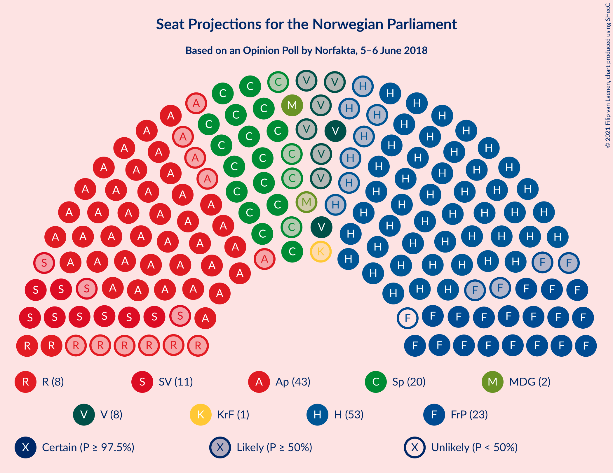
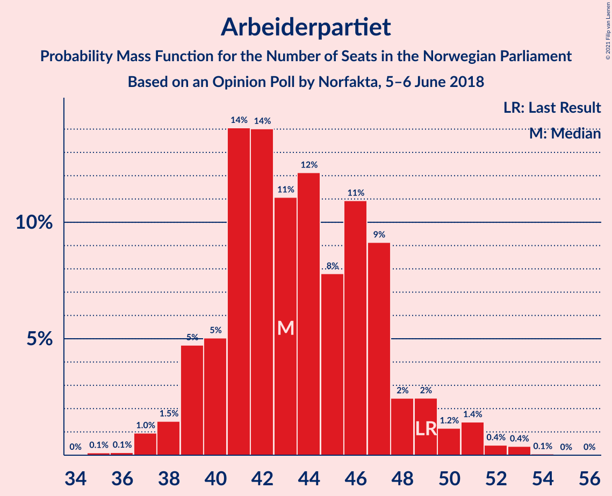
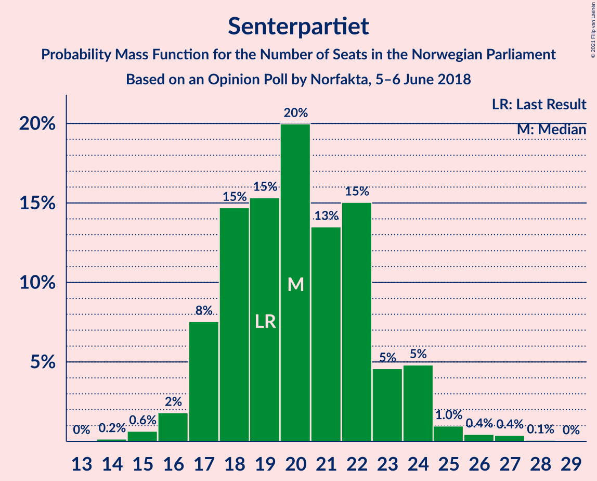
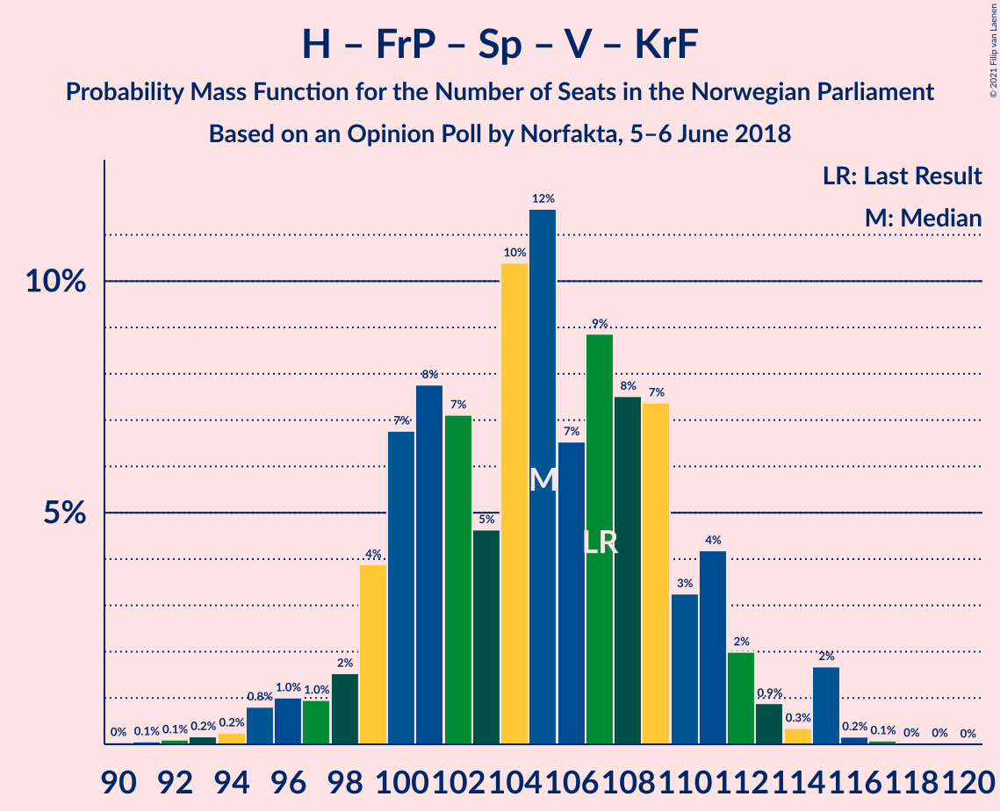
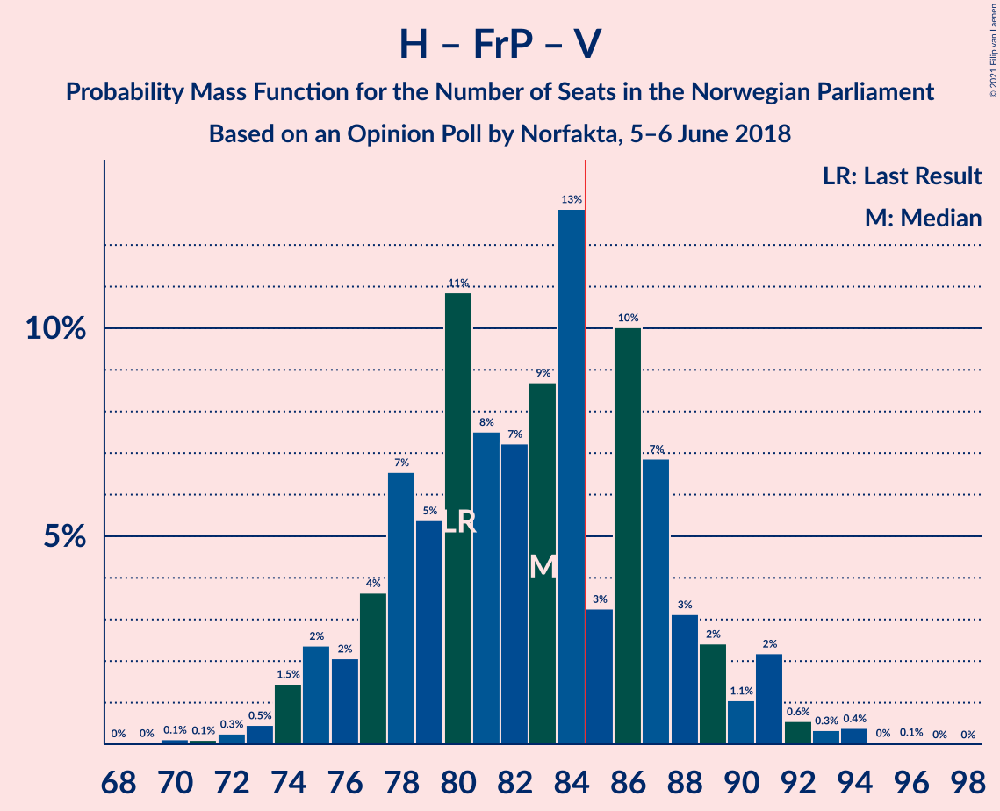
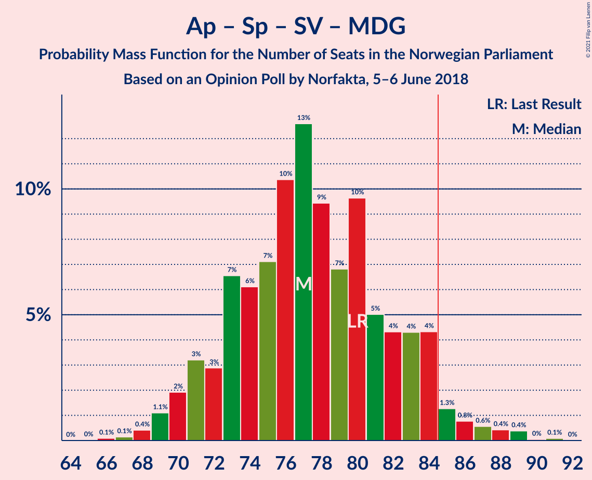
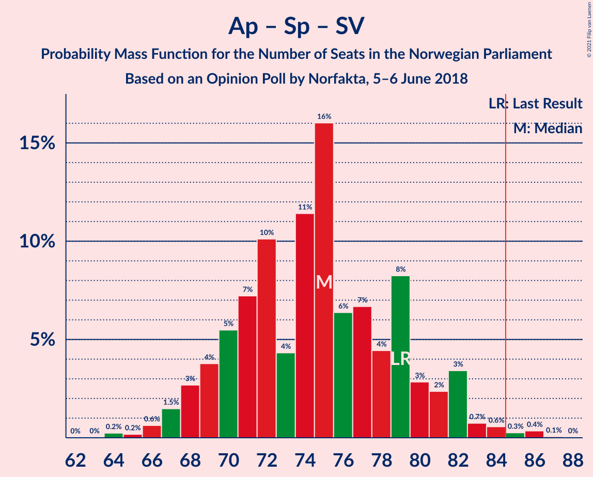
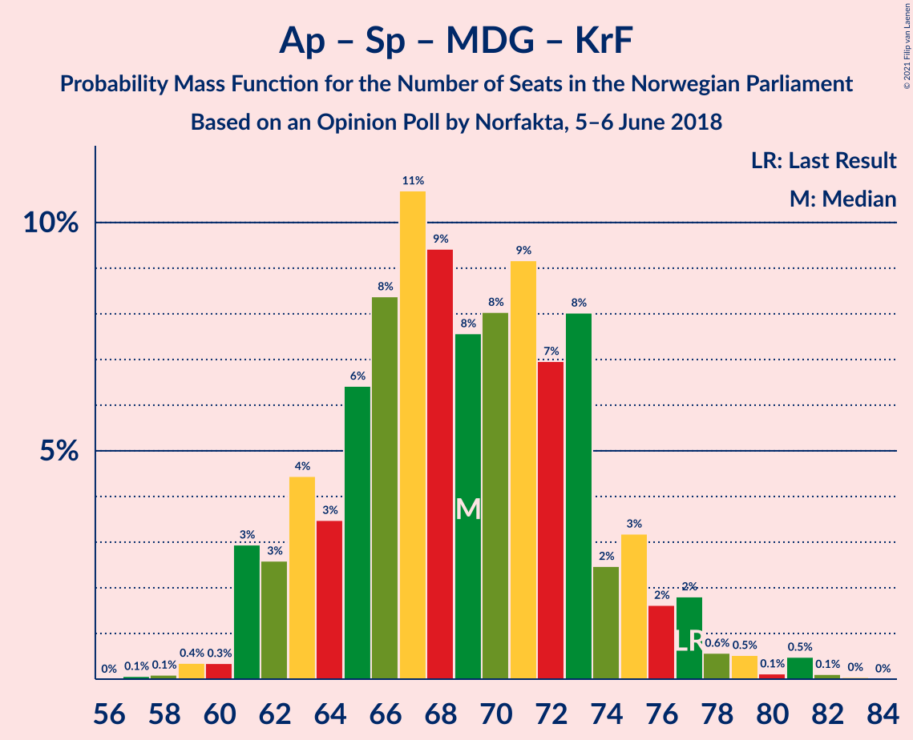
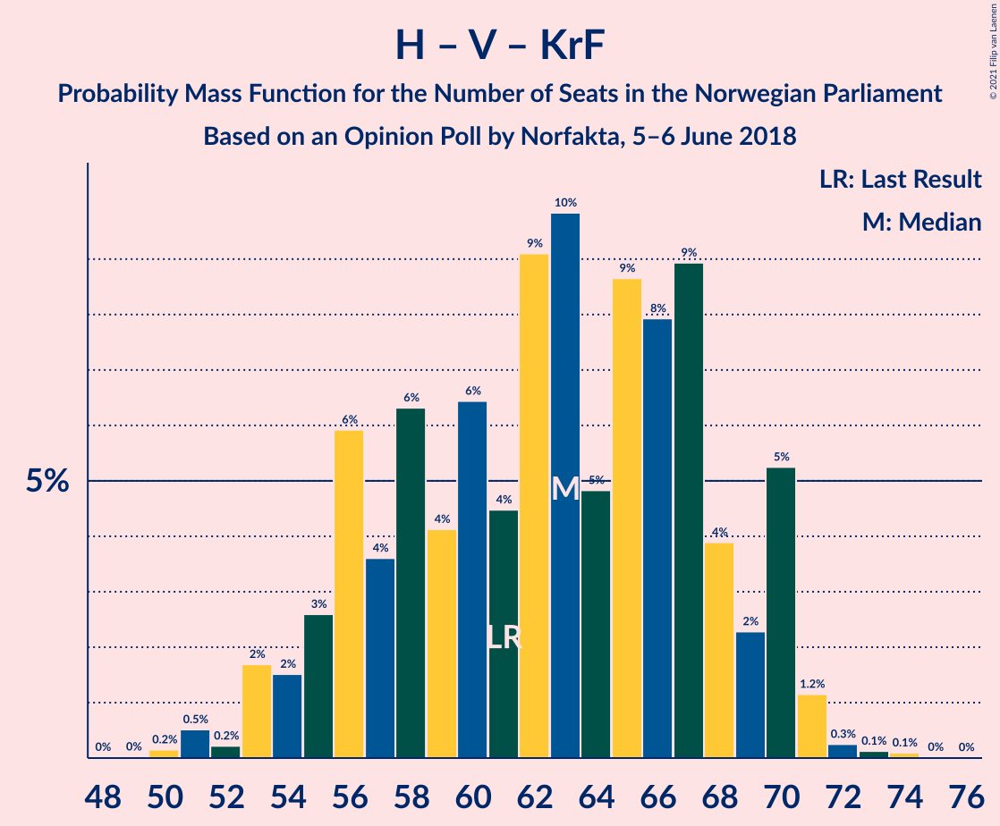
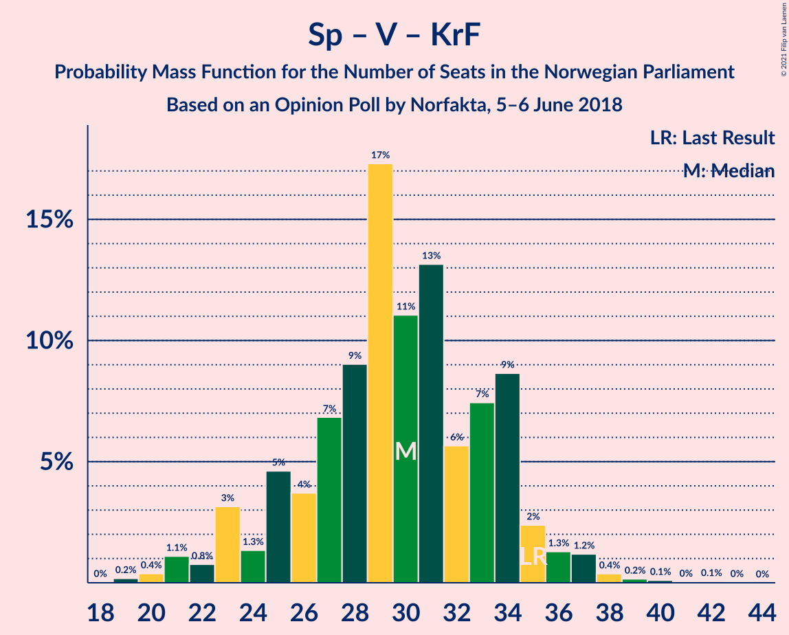

# Opinion Poll by Norfakta, 5–6 June 2018

<a href="#voting-intentions">Voting Intentions</a> | <a href="#seats">Seats</a> | <a href="#coalitions">Coalitions</a> | <a href="#technical-information">Technical Information</a>

## Voting Intentions

### Confidence Intervals

| Party | Last Result | Poll Result | 80% Confidence Interval | 90% Confidence Interval | 95% Confidence Interval | 99% Confidence Interval |
|:-----:|:-----------:|:-----------:|:-----------------------:|:-----------------------:|:-----------------------:|:-----------------------:|
| Høyre | 25.0% | 29.4% | 27.4–31.6% |26.8–32.2% |26.3–32.7% |25.4–33.7% |
| Arbeiderpartiet | 27.4% | 24.1% | 22.2–26.2% |21.7–26.7% |21.3–27.2% |20.4–28.2% |
| Fremskrittspartiet | 15.2% | 12.5% | 11.1–14.1% |10.7–14.6% |10.4–15.0% |9.7–15.8% |
| Senterpartiet | 10.3% | 11.2% | 9.9–12.8% |9.5–13.2% |9.2–13.6% |8.6–14.4% |
| Sosialistisk Venstreparti | 6.0% | 6.1% | 5.1–7.3% |4.8–7.6% |4.6–8.0% |4.2–8.6% |
| Venstre | 4.4% | 4.5% | 3.7–5.6% |3.5–6.0% |3.3–6.2% |2.9–6.8% |
| Rødt | 2.4% | 4.4% | 3.6–5.5% |3.4–5.8% |3.2–6.1% |2.9–6.7% |
| Miljøpartiet De Grønne | 3.2% | 3.4% | 2.7–4.4% |2.5–4.7% |2.3–4.9% |2.1–5.4% |
| Kristelig Folkeparti | 4.2% | 3.0% | 2.4–4.0% |2.2–4.2% |2.0–4.5% |1.8–5.0% |

*Note:* The poll result column reflects the actual value used in the calculations. Published results may vary slightly, and in addition be rounded to fewer digits.

## Seats

### Confidence Intervals

| Party | Last Result | Median | 80% Confidence Interval | 90% Confidence Interval | 95% Confidence Interval | 99% Confidence Interval |
|:-----:|:-----------:|:------:|:-----------------------:|:-----------------------:|:-----------------------:|:-----------------------:|
| <a href="#høyre">Høyre</a> | 45 | 53 | 48–56 |47–57 |46–59 |45–61 |
| <a href="#arbeiderpartiet">Arbeiderpartiet</a> | 49 | 46 | 42–47 |41–47 |39–48 |37–52 |
| <a href="#fremskrittspartiet">Fremskrittspartiet</a> | 27 | 24 | 19–25 |18–25 |17–26 |16–27 |
| <a href="#senterpartiet">Senterpartiet</a> | 19 | 22 | 18–23 |17–24 |17–24 |16–26 |
| <a href="#sosialistisk-venstreparti">Sosialistisk Venstreparti</a> | 11 | 10 | 9–12 |8–14 |8–14 |8–15 |
| <a href="#venstre">Venstre</a> | 8 | 8 | 2–9 |2–10 |2–10 |2–13 |
| <a href="#rødt">Rødt</a> | 1 | 8 | 2–10 |2–10 |2–11 |1–11 |
| <a href="#miljøpartiet-de-grønne">Miljøpartiet De Grønne</a> | 1 | 1 | 1–7 |1–8 |1–9 |1–10 |
| <a href="#kristelig-folkeparti">Kristelig Folkeparti</a> | 8 | 1 | 1–3 |1–7 |0–7 |0–8 |

### Høyre

*For a full overview of the results for this party, see the [Høyre](party-høyre.html) page.*

| Number of Seats | Probability | Accumulated | Special Marks |
|:---------------:|:-----------:|:-----------:|:-------------:|
| 43 | 0.1% | 100% |  |
| 44 | 0.1% | 99.9% |  |
| 45 | 2% | 99.8% | Last Result |
| 46 | 1.4% | 98% |  |
| 47 | 6% | 97% |  |
| 48 | 15% | 91% |  |
| 49 | 3% | 75% |  |
| 50 | 2% | 73% |  |
| 51 | 4% | 70% |  |
| 52 | 8% | 66% |  |
| 53 | 37% | 58% | Median |
| 54 | 3% | 20% |  |
| 55 | 2% | 17% |  |
| 56 | 10% | 15% |  |
| 57 | 1.4% | 5% |  |
| 58 | 0.9% | 4% |  |
| 59 | 1.2% | 3% |  |
| 60 | 0.2% | 2% |  |
| 61 | 1.2% | 2% |  |
| 62 | 0.2% | 0.3% |  |
| 63 | 0% | 0.1% |  |
| 64 | 0% | 0.1% |  |
| 65 | 0% | 0.1% |  |
| 66 | 0% | 0% |  |

### Arbeiderpartiet

*For a full overview of the results for this party, see the [Arbeiderpartiet](party-arbeiderpartiet.html) page.*

| Number of Seats | Probability | Accumulated | Special Marks |
|:---------------:|:-----------:|:-----------:|:-------------:|
| 36 | 0.2% | 100% |  |
| 37 | 0.8% | 99.8% |  |
| 38 | 0.7% | 99.0% |  |
| 39 | 2% | 98% |  |
| 40 | 1.3% | 97% |  |
| 41 | 4% | 96% |  |
| 42 | 8% | 92% |  |
| 43 | 9% | 84% |  |
| 44 | 9% | 75% |  |
| 45 | 5% | 66% |  |
| 46 | 17% | 61% | Median |
| 47 | 42% | 45% |  |
| 48 | 2% | 3% |  |
| 49 | 0.4% | 1.3% | Last Result |
| 50 | 0.2% | 1.0% |  |
| 51 | 0.1% | 0.7% |  |
| 52 | 0.5% | 0.7% |  |
| 53 | 0.1% | 0.2% |  |
| 54 | 0.1% | 0.1% |  |
| 55 | 0% | 0% |  |

### Fremskrittspartiet

*For a full overview of the results for this party, see the [Fremskrittspartiet](party-fremskrittspartiet.html) page.*

| Number of Seats | Probability | Accumulated | Special Marks |
|:---------------:|:-----------:|:-----------:|:-------------:|
| 15 | 0% | 100% |  |
| 16 | 2% | 99.9% |  |
| 17 | 1.4% | 98% |  |
| 18 | 2% | 97% |  |
| 19 | 6% | 94% |  |
| 20 | 2% | 88% |  |
| 21 | 6% | 86% |  |
| 22 | 9% | 80% |  |
| 23 | 9% | 71% |  |
| 24 | 17% | 62% | Median |
| 25 | 42% | 45% |  |
| 26 | 2% | 3% |  |
| 27 | 0.9% | 1.3% | Last Result |
| 28 | 0.1% | 0.4% |  |
| 29 | 0.2% | 0.3% |  |
| 30 | 0% | 0.1% |  |
| 31 | 0% | 0% |  |

### Senterpartiet

*For a full overview of the results for this party, see the [Senterpartiet](party-senterpartiet.html) page.*

| Number of Seats | Probability | Accumulated | Special Marks |
|:---------------:|:-----------:|:-----------:|:-------------:|
| 14 | 0% | 100% |  |
| 15 | 0.4% | 99.9% |  |
| 16 | 0.4% | 99.5% |  |
| 17 | 5% | 99.2% |  |
| 18 | 23% | 94% |  |
| 19 | 4% | 71% | Last Result |
| 20 | 5% | 66% |  |
| 21 | 4% | 61% |  |
| 22 | 47% | 57% | Median |
| 23 | 2% | 10% |  |
| 24 | 6% | 8% |  |
| 25 | 0.5% | 2% |  |
| 26 | 1.0% | 1.5% |  |
| 27 | 0.3% | 0.5% |  |
| 28 | 0.2% | 0.2% |  |
| 29 | 0% | 0% |  |

### Sosialistisk Venstreparti

*For a full overview of the results for this party, see the [Sosialistisk Venstreparti](party-sosialistiskvenstreparti.html) page.*

| Number of Seats | Probability | Accumulated | Special Marks |
|:---------------:|:-----------:|:-----------:|:-------------:|
| 2 | 0.1% | 100% |  |
| 3 | 0% | 99.9% |  |
| 4 | 0% | 99.9% |  |
| 5 | 0% | 99.9% |  |
| 6 | 0% | 99.9% |  |
| 7 | 0.2% | 99.9% |  |
| 8 | 6% | 99.6% |  |
| 9 | 7% | 93% |  |
| 10 | 48% | 86% | Median |
| 11 | 12% | 38% | Last Result |
| 12 | 16% | 25% |  |
| 13 | 3% | 9% |  |
| 14 | 5% | 6% |  |
| 15 | 0.7% | 0.8% |  |
| 16 | 0.1% | 0.1% |  |
| 17 | 0% | 0% |  |

### Venstre

*For a full overview of the results for this party, see the [Venstre](party-venstre.html) page.*

| Number of Seats | Probability | Accumulated | Special Marks |
|:---------------:|:-----------:|:-----------:|:-------------:|
| 2 | 11% | 100% |  |
| 3 | 0.7% | 89% |  |
| 4 | 0% | 88% |  |
| 5 | 0% | 88% |  |
| 6 | 0.2% | 88% |  |
| 7 | 7% | 88% |  |
| 8 | 53% | 80% | Last Result, Median |
| 9 | 21% | 28% |  |
| 10 | 5% | 7% |  |
| 11 | 0.6% | 2% |  |
| 12 | 1.1% | 2% |  |
| 13 | 0.6% | 0.6% |  |
| 14 | 0% | 0% |  |

### Rødt

*For a full overview of the results for this party, see the [Rødt](party-rødt.html) page.*

| Number of Seats | Probability | Accumulated | Special Marks |
|:---------------:|:-----------:|:-----------:|:-------------:|
| 1 | 1.1% | 100% | Last Result |
| 2 | 44% | 98.9% |  |
| 3 | 0% | 55% |  |
| 4 | 0% | 55% |  |
| 5 | 0% | 55% |  |
| 6 | 0% | 55% |  |
| 7 | 5% | 55% |  |
| 8 | 16% | 50% | Median |
| 9 | 24% | 34% |  |
| 10 | 6% | 10% |  |
| 11 | 4% | 5% |  |
| 12 | 0.2% | 0.3% |  |
| 13 | 0% | 0% |  |

### Miljøpartiet De Grønne

*For a full overview of the results for this party, see the [Miljøpartiet De Grønne](party-miljøpartietdegrønne.html) page.*

| Number of Seats | Probability | Accumulated | Special Marks |
|:---------------:|:-----------:|:-----------:|:-------------:|
| 0 | 0.1% | 100% |  |
| 1 | 55% | 99.9% | Last Result, Median |
| 2 | 32% | 45% |  |
| 3 | 1.3% | 13% |  |
| 4 | 0% | 12% |  |
| 5 | 0% | 12% |  |
| 6 | 0.2% | 12% |  |
| 7 | 5% | 12% |  |
| 8 | 4% | 6% |  |
| 9 | 2% | 3% |  |
| 10 | 0.6% | 0.7% |  |
| 11 | 0.1% | 0.1% |  |
| 12 | 0% | 0% |  |

### Kristelig Folkeparti

*For a full overview of the results for this party, see the [Kristelig Folkeparti](party-kristeligfolkeparti.html) page.*

| Number of Seats | Probability | Accumulated | Special Marks |
|:---------------:|:-----------:|:-----------:|:-------------:|
| 0 | 3% | 100% |  |
| 1 | 70% | 97% | Median |
| 2 | 5% | 27% |  |
| 3 | 13% | 22% |  |
| 4 | 0% | 9% |  |
| 5 | 0% | 9% |  |
| 6 | 0% | 9% |  |
| 7 | 7% | 9% |  |
| 8 | 2% | 2% | Last Result |
| 9 | 0.3% | 0.4% |  |
| 10 | 0% | 0% |  |

## Coalitions

### Confidence Intervals

| Coalition | Last Result | Median | Majority? | 80% Confidence Interval | 90% Confidence Interval | 95% Confidence Interval | 99% Confidence Interval |
|:---------:|:-----------:|:------:|:---------:|:-----------------------:|:-----------------------:|:-----------------------:|:-----------------------:|
| Høyre – Fremskrittspartiet – Senterpartiet – Venstre – Kristelig Folkeparti | 107 | 106 | 100% | 100–109 | 99–110 | 98–112 | 94–115 |
| Høyre – Fremskrittspartiet – Venstre – Miljøpartiet De Grønne – Kristelig Folkeparti | 89 | 88 | 69% | 81–91 | 81–92 | 79–94 | 77–97 |
| Arbeiderpartiet – Senterpartiet – Sosialistisk Venstreparti – Rødt – Miljøpartiet De Grønne | 81 | 82 | 45% | 80–90 | 79–92 | 79–93 | 74–93 |
| Høyre – Fremskrittspartiet – Venstre – Kristelig Folkeparti | 88 | 87 | 55% | 79–89 | 77–90 | 76–90 | 76–95 |
| Arbeiderpartiet – Senterpartiet – Sosialistisk Venstreparti – Rødt | 80 | 81 | 31% | 78–88 | 77–88 | 75–90 | 72–92 |
| Høyre – Fremskrittspartiet – Venstre | 80 | 83 | 46% | 78–86 | 75–87 | 74–89 | 73–92 |
| Arbeiderpartiet – Senterpartiet – Sosialistisk Venstreparti – Miljøpartiet De Grønne – Kristelig Folkeparti | 88 | 81 | 7% | 77–84 | 76–86 | 74–87 | 71–90 |
| Arbeiderpartiet – Senterpartiet – Sosialistisk Venstreparti – Miljøpartiet De Grønne | 80 | 80 | 2% | 74–82 | 70–83 | 70–84 | 68–87 |
| Arbeiderpartiet – Senterpartiet – Sosialistisk Venstreparti | 79 | 78 | 0.3% | 71–80 | 68–81 | 68–82 | 66–84 |
| Høyre – Fremskrittspartiet | 72 | 76 | 0.7% | 70–78 | 70–80 | 69–81 | 67–85 |
| Arbeiderpartiet – Senterpartiet – Miljøpartiet De Grønne – Kristelig Folkeparti | 77 | 71 | 0% | 67–72 | 65–74 | 63–76 | 61–79 |
| Arbeiderpartiet – Senterpartiet – Kristelig Folkeparti | 76 | 69 | 0% | 63–70 | 62–71 | 60–72 | 57–75 |
| Høyre – Venstre – Kristelig Folkeparti | 61 | 62 | 0% | 56–67 | 54–70 | 53–71 | 53–73 |
| Arbeiderpartiet – Senterpartiet | 68 | 67 | 0% | 60–69 | 60–69 | 59–70 | 56–73 |
| Arbeiderpartiet – Sosialistisk Venstreparti | 60 | 57 | 0% | 51–58 | 50–60 | 49–60 | 47–63 |
| Senterpartiet – Venstre – Kristelig Folkeparti | 35 | 31 | 0% | 27–33 | 25–34 | 23–36 | 21–37 |

### Høyre – Fremskrittspartiet – Senterpartiet – Venstre – Kristelig Folkeparti

| Number of Seats | Probability | Accumulated | Special Marks |
|:---------------:|:-----------:|:-----------:|:-------------:|
| 91 | 0% | 100% |  |
| 92 | 0% | 99.9% |  |
| 93 | 0.1% | 99.9% |  |
| 94 | 0.9% | 99.9% |  |
| 95 | 0.2% | 98.9% |  |
| 96 | 0.3% | 98.8% |  |
| 97 | 0.8% | 98% |  |
| 98 | 0.7% | 98% |  |
| 99 | 4% | 97% |  |
| 100 | 16% | 93% |  |
| 101 | 8% | 77% |  |
| 102 | 3% | 70% |  |
| 103 | 3% | 67% |  |
| 104 | 1.4% | 64% |  |
| 105 | 5% | 63% |  |
| 106 | 10% | 58% |  |
| 107 | 2% | 48% | Last Result |
| 108 | 5% | 46% | Median |
| 109 | 36% | 41% |  |
| 110 | 1.1% | 6% |  |
| 111 | 0.7% | 5% |  |
| 112 | 3% | 4% |  |
| 113 | 0.3% | 1.0% |  |
| 114 | 0.2% | 0.8% |  |
| 115 | 0.2% | 0.6% |  |
| 116 | 0.1% | 0.4% |  |
| 117 | 0.3% | 0.3% |  |
| 118 | 0% | 0% |  |

### Høyre – Fremskrittspartiet – Venstre – Miljøpartiet De Grønne – Kristelig Folkeparti

| Number of Seats | Probability | Accumulated | Special Marks |
|:---------------:|:-----------:|:-----------:|:-------------:|
| 75 | 0% | 100% |  |
| 76 | 0% | 99.9% |  |
| 77 | 1.4% | 99.9% |  |
| 78 | 0% | 98% |  |
| 79 | 3% | 98% |  |
| 80 | 0.7% | 96% |  |
| 81 | 6% | 95% |  |
| 82 | 2% | 89% |  |
| 83 | 6% | 87% |  |
| 84 | 12% | 81% |  |
| 85 | 4% | 69% | Majority |
| 86 | 3% | 65% |  |
| 87 | 1.1% | 62% | Median |
| 88 | 36% | 61% |  |
| 89 | 7% | 25% | Last Result |
| 90 | 3% | 18% |  |
| 91 | 5% | 15% |  |
| 92 | 5% | 10% |  |
| 93 | 2% | 5% |  |
| 94 | 0.4% | 3% |  |
| 95 | 1.1% | 2% |  |
| 96 | 0.5% | 1.3% |  |
| 97 | 0.3% | 0.8% |  |
| 98 | 0.1% | 0.5% |  |
| 99 | 0.1% | 0.4% |  |
| 100 | 0.3% | 0.3% |  |
| 101 | 0% | 0% |  |

### Arbeiderpartiet – Senterpartiet – Sosialistisk Venstreparti – Rødt – Miljøpartiet De Grønne

| Number of Seats | Probability | Accumulated | Special Marks |
|:---------------:|:-----------:|:-----------:|:-------------:|
| 70 | 0.3% | 100% |  |
| 71 | 0% | 99.7% |  |
| 72 | 0% | 99.7% |  |
| 73 | 0.1% | 99.7% |  |
| 74 | 0.1% | 99.6% |  |
| 75 | 0.3% | 99.4% |  |
| 76 | 0.2% | 99.1% |  |
| 77 | 0.9% | 98.9% |  |
| 78 | 0.2% | 98% |  |
| 79 | 7% | 98% |  |
| 80 | 0.9% | 91% |  |
| 81 | 5% | 90% | Last Result |
| 82 | 36% | 85% |  |
| 83 | 3% | 48% |  |
| 84 | 1.3% | 46% |  |
| 85 | 4% | 45% | Majority |
| 86 | 3% | 41% |  |
| 87 | 20% | 38% | Median |
| 88 | 3% | 18% |  |
| 89 | 1.4% | 14% |  |
| 90 | 6% | 13% |  |
| 91 | 1.4% | 7% |  |
| 92 | 3% | 5% |  |
| 93 | 2% | 3% |  |
| 94 | 0.1% | 0.4% |  |
| 95 | 0.1% | 0.3% |  |
| 96 | 0.1% | 0.2% |  |
| 97 | 0.1% | 0.1% |  |
| 98 | 0% | 0% |  |

### Høyre – Fremskrittspartiet – Venstre – Kristelig Folkeparti

| Number of Seats | Probability | Accumulated | Special Marks |
|:---------------:|:-----------:|:-----------:|:-------------:|
| 72 | 0.1% | 100% |  |
| 73 | 0.1% | 99.9% |  |
| 74 | 0.1% | 99.8% |  |
| 75 | 0.1% | 99.7% |  |
| 76 | 2% | 99.6% |  |
| 77 | 3% | 97% |  |
| 78 | 1.4% | 95% |  |
| 79 | 6% | 93% |  |
| 80 | 1.4% | 87% |  |
| 81 | 3% | 86% |  |
| 82 | 20% | 82% |  |
| 83 | 3% | 62% |  |
| 84 | 4% | 59% |  |
| 85 | 1.3% | 55% | Majority |
| 86 | 3% | 54% | Median |
| 87 | 36% | 52% |  |
| 88 | 5% | 15% | Last Result |
| 89 | 0.9% | 10% |  |
| 90 | 7% | 9% |  |
| 91 | 0.2% | 2% |  |
| 92 | 0.9% | 2% |  |
| 93 | 0.2% | 1.1% |  |
| 94 | 0.3% | 0.9% |  |
| 95 | 0.1% | 0.6% |  |
| 96 | 0.1% | 0.4% |  |
| 97 | 0% | 0.3% |  |
| 98 | 0% | 0.3% |  |
| 99 | 0.3% | 0.3% |  |
| 100 | 0% | 0% |  |

### Arbeiderpartiet – Senterpartiet – Sosialistisk Venstreparti – Rødt

| Number of Seats | Probability | Accumulated | Special Marks |
|:---------------:|:-----------:|:-----------:|:-------------:|
| 69 | 0.3% | 100% |  |
| 70 | 0.1% | 99.7% |  |
| 71 | 0.1% | 99.6% |  |
| 72 | 0.3% | 99.5% |  |
| 73 | 0.5% | 99.2% |  |
| 74 | 1.1% | 98.7% |  |
| 75 | 0.4% | 98% |  |
| 76 | 2% | 97% |  |
| 77 | 5% | 95% |  |
| 78 | 5% | 90% |  |
| 79 | 3% | 85% |  |
| 80 | 7% | 82% | Last Result |
| 81 | 36% | 75% |  |
| 82 | 1.1% | 39% |  |
| 83 | 3% | 38% |  |
| 84 | 4% | 35% |  |
| 85 | 12% | 31% | Majority |
| 86 | 6% | 19% | Median |
| 87 | 2% | 13% |  |
| 88 | 6% | 11% |  |
| 89 | 0.7% | 5% |  |
| 90 | 3% | 4% |  |
| 91 | 0% | 2% |  |
| 92 | 1.4% | 2% |  |
| 93 | 0% | 0.1% |  |
| 94 | 0% | 0.1% |  |
| 95 | 0% | 0% |  |

### Høyre – Fremskrittspartiet – Venstre

| Number of Seats | Probability | Accumulated | Special Marks |
|:---------------:|:-----------:|:-----------:|:-------------:|
| 70 | 0.1% | 100% |  |
| 71 | 0.1% | 99.9% |  |
| 72 | 0.2% | 99.8% |  |
| 73 | 0.2% | 99.6% |  |
| 74 | 3% | 99.4% |  |
| 75 | 2% | 97% |  |
| 76 | 0.5% | 94% |  |
| 77 | 2% | 94% |  |
| 78 | 8% | 92% |  |
| 79 | 3% | 84% |  |
| 80 | 4% | 81% | Last Result |
| 81 | 19% | 76% |  |
| 82 | 4% | 58% |  |
| 83 | 6% | 54% |  |
| 84 | 2% | 48% |  |
| 85 | 4% | 46% | Median, Majority |
| 86 | 35% | 42% |  |
| 87 | 2% | 6% |  |
| 88 | 0.5% | 4% |  |
| 89 | 3% | 4% |  |
| 90 | 0.1% | 1.1% |  |
| 91 | 0.5% | 1.0% |  |
| 92 | 0.1% | 0.6% |  |
| 93 | 0.1% | 0.5% |  |
| 94 | 0.1% | 0.4% |  |
| 95 | 0% | 0.3% |  |
| 96 | 0.3% | 0.3% |  |
| 97 | 0% | 0% |  |

### Arbeiderpartiet – Senterpartiet – Sosialistisk Venstreparti – Miljøpartiet De Grønne – Kristelig Folkeparti

| Number of Seats | Probability | Accumulated | Special Marks |
|:---------------:|:-----------:|:-----------:|:-------------:|
| 68 | 0.1% | 100% |  |
| 69 | 0.1% | 99.9% |  |
| 70 | 0% | 99.8% |  |
| 71 | 0.6% | 99.8% |  |
| 72 | 0.2% | 99.2% |  |
| 73 | 0.7% | 99.0% |  |
| 74 | 0.9% | 98% |  |
| 75 | 2% | 97% |  |
| 76 | 2% | 96% |  |
| 77 | 7% | 94% |  |
| 78 | 6% | 86% |  |
| 79 | 16% | 80% |  |
| 80 | 3% | 64% | Median |
| 81 | 38% | 60% |  |
| 82 | 3% | 22% |  |
| 83 | 9% | 19% |  |
| 84 | 4% | 11% |  |
| 85 | 1.5% | 7% | Majority |
| 86 | 0.5% | 5% |  |
| 87 | 3% | 5% |  |
| 88 | 0.6% | 2% | Last Result |
| 89 | 0.3% | 1.4% |  |
| 90 | 0.9% | 1.1% |  |
| 91 | 0.1% | 0.2% |  |
| 92 | 0% | 0.1% |  |
| 93 | 0% | 0% |  |

### Arbeiderpartiet – Senterpartiet – Sosialistisk Venstreparti – Miljøpartiet De Grønne

| Number of Seats | Probability | Accumulated | Special Marks |
|:---------------:|:-----------:|:-----------:|:-------------:|
| 66 | 0.1% | 100% |  |
| 67 | 0% | 99.9% |  |
| 68 | 0.4% | 99.9% |  |
| 69 | 0.4% | 99.4% |  |
| 70 | 4% | 99.0% |  |
| 71 | 0.5% | 95% |  |
| 72 | 0.6% | 94% |  |
| 73 | 3% | 93% |  |
| 74 | 3% | 91% |  |
| 75 | 3% | 87% |  |
| 76 | 2% | 84% |  |
| 77 | 6% | 82% |  |
| 78 | 17% | 76% |  |
| 79 | 5% | 59% | Median |
| 80 | 37% | 54% | Last Result |
| 81 | 3% | 18% |  |
| 82 | 5% | 15% |  |
| 83 | 5% | 10% |  |
| 84 | 3% | 5% |  |
| 85 | 0.8% | 2% | Majority |
| 86 | 0.4% | 1.0% |  |
| 87 | 0.2% | 0.6% |  |
| 88 | 0.2% | 0.4% |  |
| 89 | 0.1% | 0.1% |  |
| 90 | 0% | 0.1% |  |
| 91 | 0% | 0% |  |

### Arbeiderpartiet – Senterpartiet – Sosialistisk Venstreparti

| Number of Seats | Probability | Accumulated | Special Marks |
|:---------------:|:-----------:|:-----------:|:-------------:|
| 62 | 0.1% | 100% |  |
| 63 | 0% | 99.9% |  |
| 64 | 0% | 99.9% |  |
| 65 | 0.3% | 99.9% |  |
| 66 | 0.2% | 99.6% |  |
| 67 | 0.8% | 99.4% |  |
| 68 | 5% | 98.6% |  |
| 69 | 2% | 94% |  |
| 70 | 1.4% | 92% |  |
| 71 | 4% | 91% |  |
| 72 | 5% | 87% |  |
| 73 | 4% | 82% |  |
| 74 | 3% | 78% |  |
| 75 | 3% | 75% |  |
| 76 | 16% | 72% |  |
| 77 | 6% | 56% |  |
| 78 | 3% | 50% | Median |
| 79 | 36% | 48% | Last Result |
| 80 | 5% | 11% |  |
| 81 | 1.1% | 6% |  |
| 82 | 4% | 5% |  |
| 83 | 0.5% | 1.3% |  |
| 84 | 0.5% | 0.8% |  |
| 85 | 0.1% | 0.3% | Majority |
| 86 | 0.1% | 0.2% |  |
| 87 | 0.1% | 0.1% |  |
| 88 | 0% | 0% |  |

### Høyre – Fremskrittspartiet

| Number of Seats | Probability | Accumulated | Special Marks |
|:---------------:|:-----------:|:-----------:|:-------------:|
| 64 | 0% | 100% |  |
| 65 | 0.1% | 99.9% |  |
| 66 | 0.2% | 99.8% |  |
| 67 | 0.3% | 99.6% |  |
| 68 | 0.3% | 99.3% |  |
| 69 | 2% | 99.0% |  |
| 70 | 8% | 97% |  |
| 71 | 4% | 90% |  |
| 72 | 17% | 86% | Last Result |
| 73 | 5% | 69% |  |
| 74 | 7% | 64% |  |
| 75 | 7% | 57% |  |
| 76 | 5% | 51% |  |
| 77 | 3% | 46% | Median |
| 78 | 35% | 43% |  |
| 79 | 2% | 8% |  |
| 80 | 1.2% | 6% |  |
| 81 | 3% | 5% |  |
| 82 | 0.2% | 1.4% |  |
| 83 | 0.4% | 1.2% |  |
| 84 | 0.1% | 0.8% |  |
| 85 | 0.2% | 0.7% | Majority |
| 86 | 0.1% | 0.4% |  |
| 87 | 0.3% | 0.3% |  |
| 88 | 0% | 0% |  |

### Arbeiderpartiet – Senterpartiet – Miljøpartiet De Grønne – Kristelig Folkeparti

| Number of Seats | Probability | Accumulated | Special Marks |
|:---------------:|:-----------:|:-----------:|:-------------:|
| 58 | 0.1% | 100% |  |
| 59 | 0% | 99.8% |  |
| 60 | 0.3% | 99.8% |  |
| 61 | 1.3% | 99.5% |  |
| 62 | 0.5% | 98% |  |
| 63 | 0.6% | 98% |  |
| 64 | 0.6% | 97% |  |
| 65 | 2% | 97% |  |
| 66 | 2% | 95% |  |
| 67 | 12% | 93% |  |
| 68 | 6% | 81% |  |
| 69 | 16% | 75% |  |
| 70 | 5% | 60% | Median |
| 71 | 37% | 55% |  |
| 72 | 9% | 17% |  |
| 73 | 4% | 9% |  |
| 74 | 2% | 5% |  |
| 75 | 0.5% | 3% |  |
| 76 | 0.9% | 3% |  |
| 77 | 0.6% | 2% | Last Result |
| 78 | 0.1% | 1.3% |  |
| 79 | 1.0% | 1.2% |  |
| 80 | 0% | 0.2% |  |
| 81 | 0% | 0.2% |  |
| 82 | 0.1% | 0.1% |  |
| 83 | 0% | 0% |  |

### Arbeiderpartiet – Senterpartiet – Kristelig Folkeparti

| Number of Seats | Probability | Accumulated | Special Marks |
|:---------------:|:-----------:|:-----------:|:-------------:|
| 55 | 0.1% | 100% |  |
| 56 | 0.1% | 99.9% |  |
| 57 | 0.4% | 99.8% |  |
| 58 | 0.1% | 99.5% |  |
| 59 | 0.6% | 99.4% |  |
| 60 | 2% | 98.8% |  |
| 61 | 0.8% | 96% |  |
| 62 | 4% | 96% |  |
| 63 | 3% | 92% |  |
| 64 | 3% | 89% |  |
| 65 | 12% | 86% |  |
| 66 | 4% | 74% |  |
| 67 | 10% | 70% |  |
| 68 | 9% | 60% |  |
| 69 | 4% | 51% | Median |
| 70 | 40% | 47% |  |
| 71 | 4% | 7% |  |
| 72 | 1.5% | 3% |  |
| 73 | 1.2% | 2% |  |
| 74 | 0.2% | 0.8% |  |
| 75 | 0.2% | 0.5% |  |
| 76 | 0.2% | 0.3% | Last Result |
| 77 | 0% | 0.1% |  |
| 78 | 0.1% | 0.1% |  |
| 79 | 0% | 0% |  |

### Høyre – Venstre – Kristelig Folkeparti

| Number of Seats | Probability | Accumulated | Special Marks |
|:---------------:|:-----------:|:-----------:|:-------------:|
| 51 | 0% | 100% |  |
| 52 | 0.1% | 99.9% |  |
| 53 | 4% | 99.9% |  |
| 54 | 1.3% | 96% |  |
| 55 | 1.0% | 95% |  |
| 56 | 6% | 94% |  |
| 57 | 4% | 88% |  |
| 58 | 12% | 84% |  |
| 59 | 4% | 73% |  |
| 60 | 5% | 69% |  |
| 61 | 2% | 64% | Last Result |
| 62 | 38% | 62% | Median |
| 63 | 5% | 24% |  |
| 64 | 1.3% | 19% |  |
| 65 | 3% | 18% |  |
| 66 | 3% | 14% |  |
| 67 | 2% | 11% |  |
| 68 | 2% | 9% |  |
| 69 | 0.8% | 7% |  |
| 70 | 2% | 6% |  |
| 71 | 4% | 5% |  |
| 72 | 0.3% | 0.8% |  |
| 73 | 0.5% | 0.5% |  |
| 74 | 0% | 0% |  |

### Arbeiderpartiet – Senterpartiet

| Number of Seats | Probability | Accumulated | Special Marks |
|:---------------:|:-----------:|:-----------:|:-------------:|
| 54 | 0% | 100% |  |
| 55 | 0.2% | 99.9% |  |
| 56 | 0.4% | 99.7% |  |
| 57 | 0.9% | 99.4% |  |
| 58 | 0.8% | 98% |  |
| 59 | 2% | 98% |  |
| 60 | 7% | 95% |  |
| 61 | 6% | 89% |  |
| 62 | 3% | 82% |  |
| 63 | 2% | 79% |  |
| 64 | 13% | 77% |  |
| 65 | 4% | 64% |  |
| 66 | 6% | 60% |  |
| 67 | 9% | 54% |  |
| 68 | 3% | 45% | Last Result, Median |
| 69 | 40% | 42% |  |
| 70 | 1.5% | 3% |  |
| 71 | 0.2% | 1.3% |  |
| 72 | 0.3% | 1.1% |  |
| 73 | 0.6% | 0.8% |  |
| 74 | 0.1% | 0.2% |  |
| 75 | 0% | 0.1% |  |
| 76 | 0.1% | 0.1% |  |
| 77 | 0% | 0% |  |

### Arbeiderpartiet – Sosialistisk Venstreparti

| Number of Seats | Probability | Accumulated | Special Marks |
|:---------------:|:-----------:|:-----------:|:-------------:|
| 44 | 0% | 100% |  |
| 45 | 0% | 99.9% |  |
| 46 | 0.2% | 99.9% |  |
| 47 | 0.3% | 99.7% |  |
| 48 | 0.4% | 99.4% |  |
| 49 | 2% | 99.0% |  |
| 50 | 5% | 97% |  |
| 51 | 2% | 92% |  |
| 52 | 3% | 90% |  |
| 53 | 9% | 87% |  |
| 54 | 11% | 78% |  |
| 55 | 3% | 67% |  |
| 56 | 4% | 64% | Median |
| 57 | 35% | 60% |  |
| 58 | 17% | 25% |  |
| 59 | 1.4% | 7% |  |
| 60 | 3% | 6% | Last Result |
| 61 | 0.3% | 2% |  |
| 62 | 1.2% | 2% |  |
| 63 | 0.7% | 0.9% |  |
| 64 | 0.1% | 0.2% |  |
| 65 | 0.1% | 0.1% |  |
| 66 | 0% | 0% |  |

### Senterpartiet – Venstre – Kristelig Folkeparti

| Number of Seats | Probability | Accumulated | Special Marks |
|:---------------:|:-----------:|:-----------:|:-------------:|
| 20 | 0.1% | 100% |  |
| 21 | 2% | 99.8% |  |
| 22 | 0.1% | 98% |  |
| 23 | 1.2% | 98% |  |
| 24 | 2% | 97% |  |
| 25 | 1.1% | 95% |  |
| 26 | 2% | 94% |  |
| 27 | 5% | 92% |  |
| 28 | 14% | 87% |  |
| 29 | 3% | 73% |  |
| 30 | 8% | 70% |  |
| 31 | 43% | 62% | Median |
| 32 | 6% | 19% |  |
| 33 | 7% | 13% |  |
| 34 | 3% | 6% |  |
| 35 | 0.9% | 4% | Last Result |
| 36 | 2% | 3% |  |
| 37 | 0.3% | 0.7% |  |
| 38 | 0.1% | 0.4% |  |
| 39 | 0.1% | 0.3% |  |
| 40 | 0% | 0.2% |  |
| 41 | 0.1% | 0.1% |  |
| 42 | 0% | 0% |  |

## Technical Information

### Opinion Poll

+ **Polling firm:** Norfakta
+ **Commissioner(s):** —
+ **Fieldwork period:** 5–6 June 2018

### Calculations

+ **Sample size:** 792
+ **Simulations done:** 131,072
+ **Error estimate:** 2.23%

