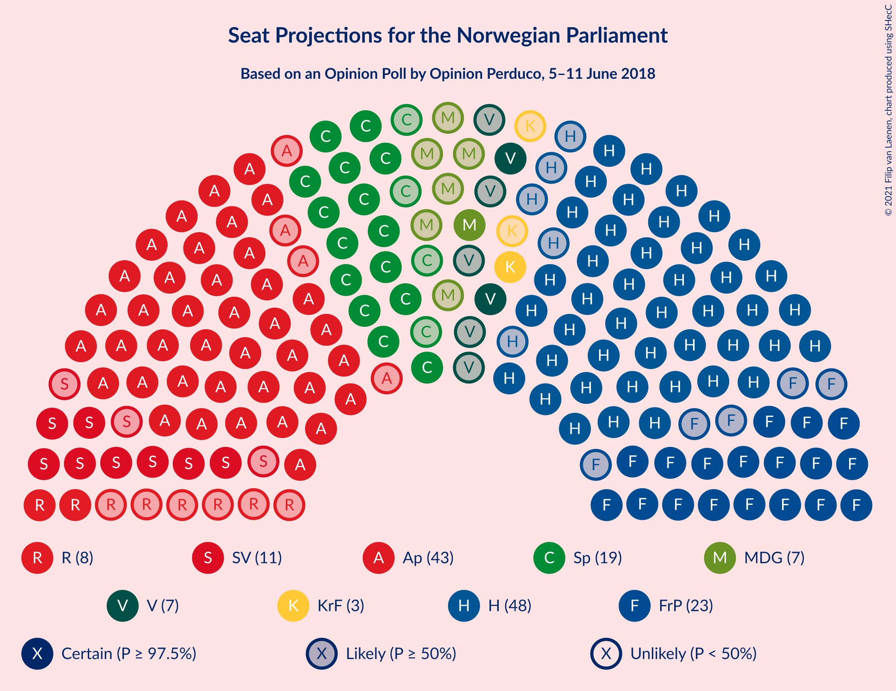
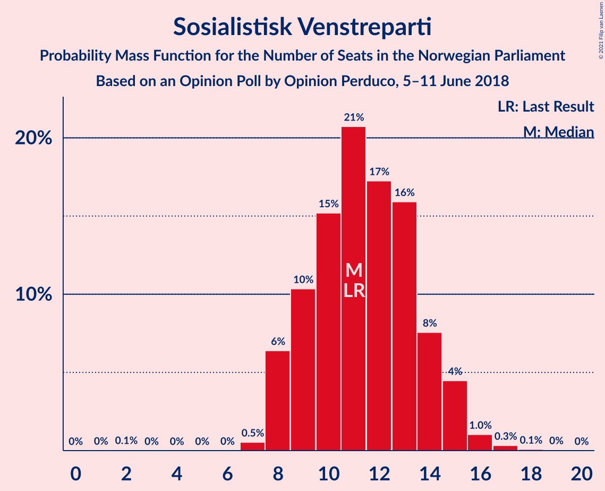
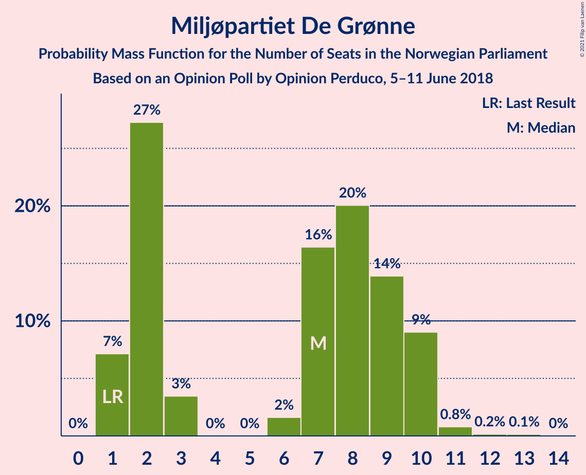
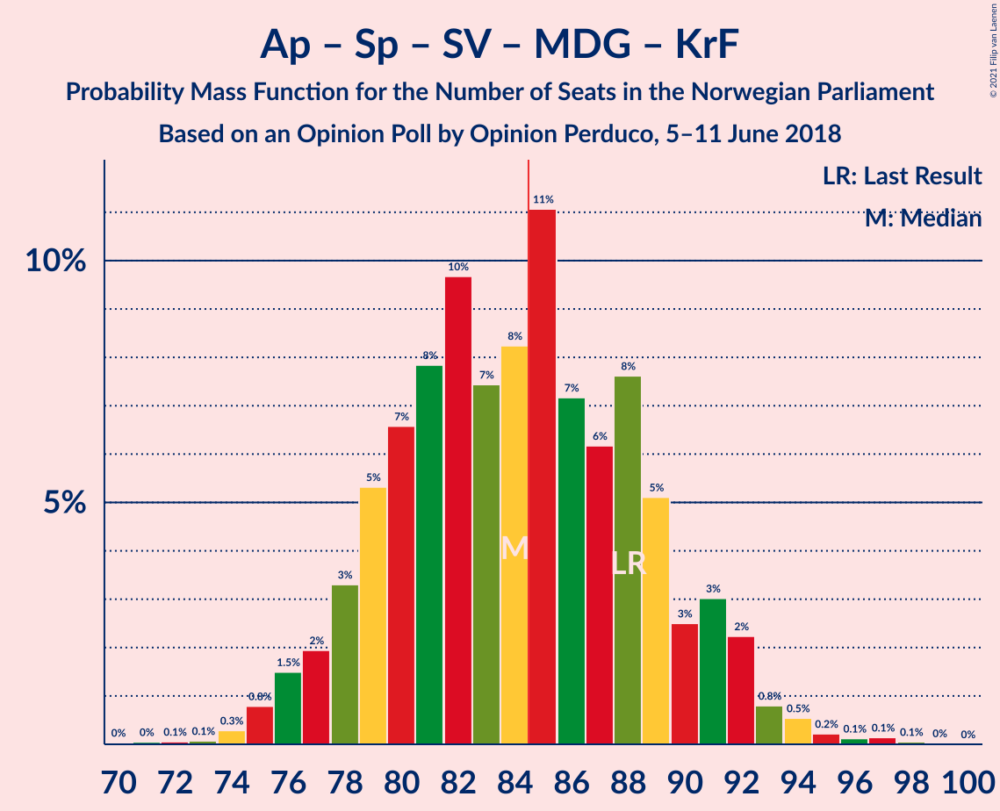
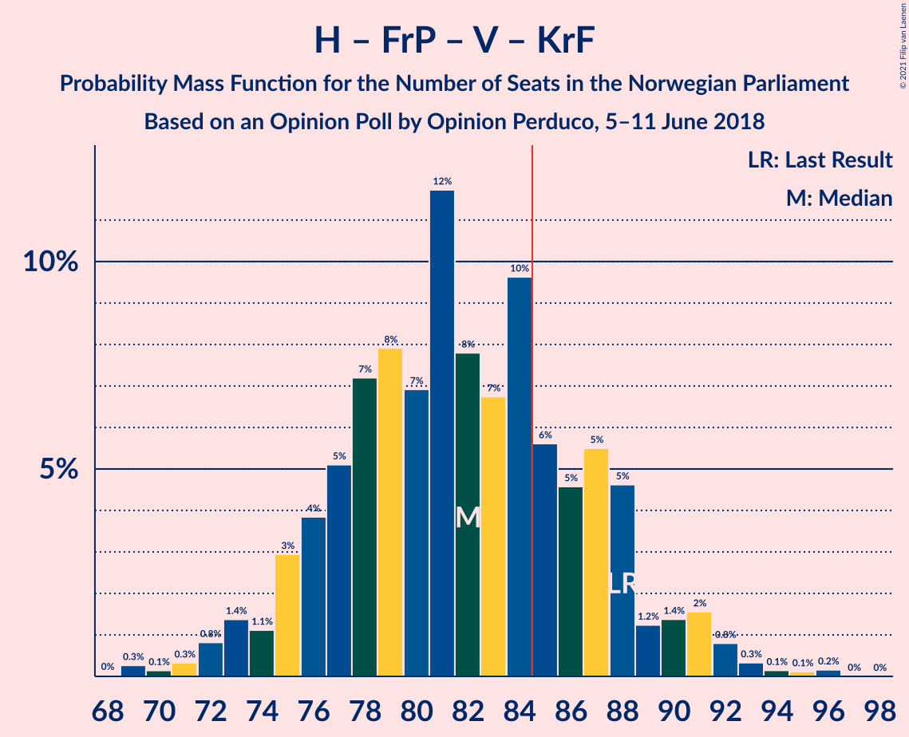
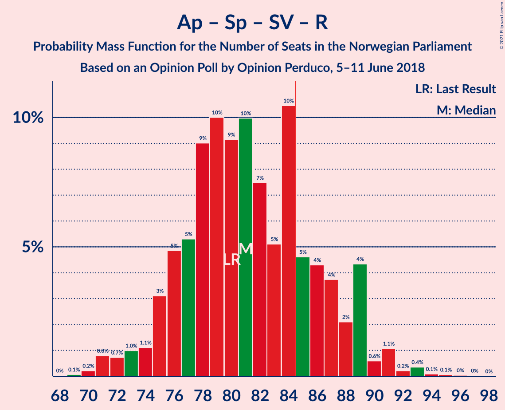
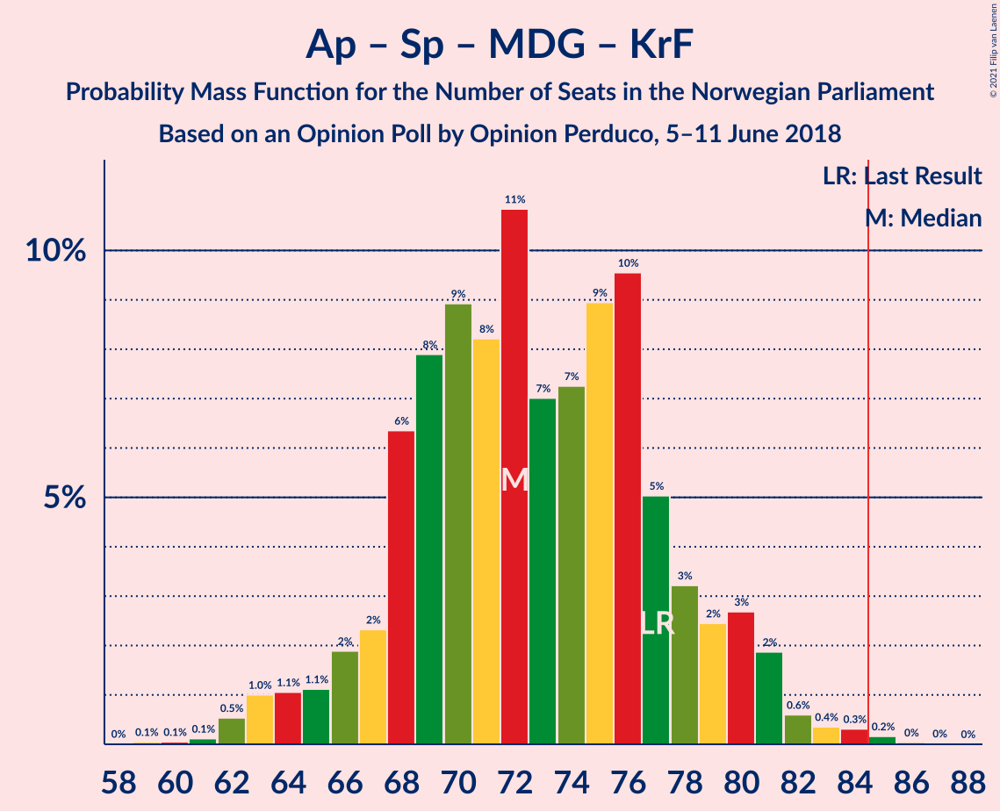
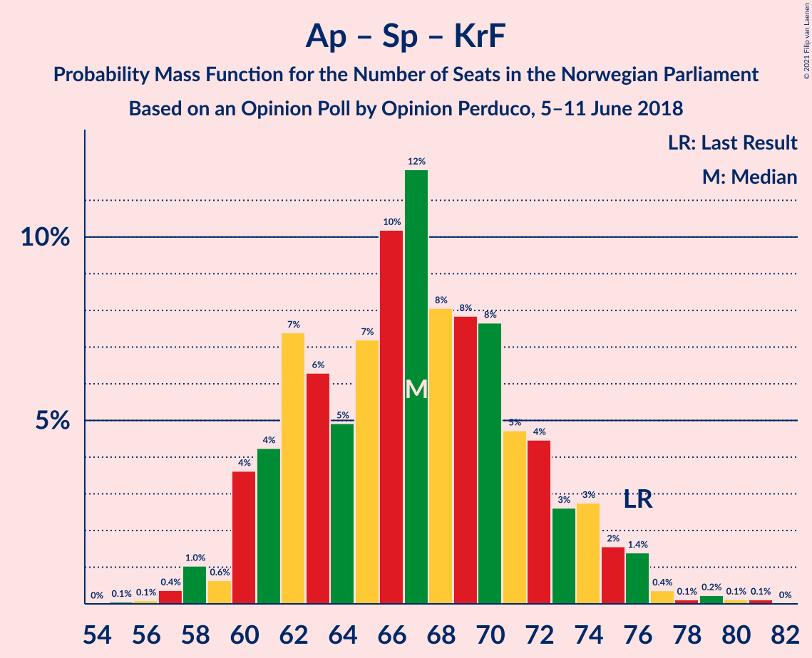
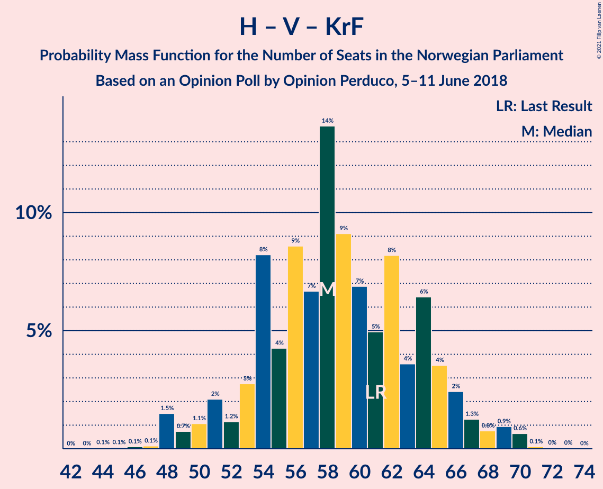
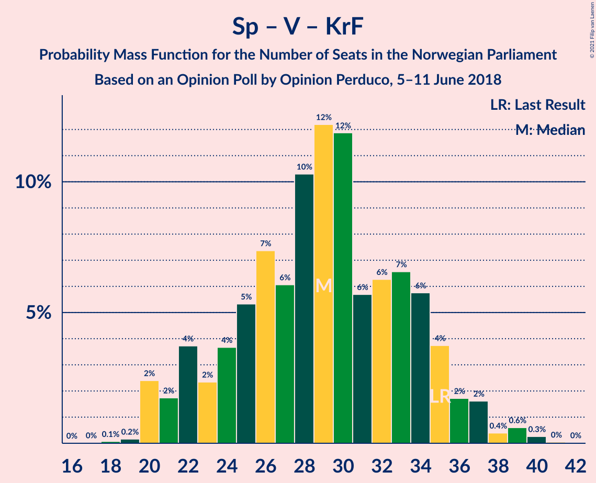

# Opinion Poll by Opinion Perduco, 5–11 June 2018

<a href="#voting-intentions">Voting Intentions</a> | <a href="#seats">Seats</a> | <a href="#coalitions">Coalitions</a> | <a href="#technical-information">Technical Information</a>

## Voting Intentions

### Confidence Intervals

| Party | Last Result | Poll Result | 80% Confidence Interval | 90% Confidence Interval | 95% Confidence Interval | 99% Confidence Interval |
|:-----:|:-----------:|:-----------:|:-----------------------:|:-----------------------:|:-----------------------:|:-----------------------:|
| Høyre | 25.0% | 27.2% | 25.1–29.4% |24.5–30.0% |24.0–30.6% |23.0–31.7% |
| Arbeiderpartiet | 27.4% | 24.0% | 22.0–26.2% |21.4–26.8% |21.0–27.3% |20.0–28.4% |
| Fremskrittspartiet | 15.2% | 12.9% | 11.4–14.7% |11.0–15.2% |10.6–15.6% |10.0–16.5% |
| Senterpartiet | 10.3% | 10.6% | 9.3–12.3% |8.9–12.7% |8.6–13.2% |7.9–14.0% |
| Sosialistisk Venstreparti | 6.0% | 6.5% | 5.4–7.8% |5.1–8.2% |4.9–8.6% |4.4–9.3% |
| Rødt | 2.4% | 4.7% | 3.9–5.9% |3.6–6.3% |3.4–6.6% |3.0–7.2% |
| Miljøpartiet De Grønne | 3.2% | 4.2% | 3.3–5.3% |3.1–5.6% |2.9–5.9% |2.6–6.5% |
| Venstre | 4.4% | 4.2% | 3.3–5.3% |3.1–5.6% |2.9–5.9% |2.6–6.5% |
| Kristelig Folkeparti | 4.2% | 3.7% | 3.0–4.8% |2.7–5.2% |2.6–5.4% |2.2–6.0% |

*Note:* The poll result column reflects the actual value used in the calculations. Published results may vary slightly, and in addition be rounded to fewer digits.

## Seats

### Confidence Intervals

| Party | Last Result | Median | 80% Confidence Interval | 90% Confidence Interval | 95% Confidence Interval | 99% Confidence Interval |
|:-----:|:-----------:|:------:|:-----------------------:|:-----------------------:|:-----------------------:|:-----------------------:|
| <a href="#høyre">Høyre</a> | 45 | 48 | 45–54 |44–54 |43–54 |41–57 |
| <a href="#arbeiderpartiet">Arbeiderpartiet</a> | 49 | 43 | 40–45 |40–47 |39–48 |37–51 |
| <a href="#fremskrittspartiet">Fremskrittspartiet</a> | 27 | 23 | 20–26 |19–27 |17–28 |16–30 |
| <a href="#senterpartiet">Senterpartiet</a> | 19 | 18 | 16–22 |15–22 |15–22 |14–24 |
| <a href="#sosialistisk-venstreparti">Sosialistisk Venstreparti</a> | 11 | 11 | 9–14 |9–15 |8–15 |7–16 |
| <a href="#rødt">Rødt</a> | 1 | 9 | 2–11 |2–11 |2–11 |2–12 |
| <a href="#miljøpartiet-de-grønne">Miljøpartiet De Grønne</a> | 1 | 8 | 2–10 |2–10 |1–10 |1–11 |
| <a href="#venstre">Venstre</a> | 8 | 7 | 2–9 |2–10 |2–10 |2–12 |
| <a href="#kristelig-folkeparti">Kristelig Folkeparti</a> | 8 | 3 | 2–9 |2–9 |1–9 |1–11 |

### Høyre

*For a full overview of the results for this party, see the [Høyre](party-høyre.html) page.*

| Number of Seats | Probability | Accumulated | Special Marks |
|:---------------:|:-----------:|:-----------:|:-------------:|
| 38 | 0.1% | 100% |  |
| 39 | 0.2% | 99.9% |  |
| 40 | 0.2% | 99.7% |  |
| 41 | 0.3% | 99.5% |  |
| 42 | 0.5% | 99.2% |  |
| 43 | 2% | 98.7% |  |
| 44 | 4% | 97% |  |
| 45 | 11% | 93% | Last Result |
| 46 | 6% | 82% |  |
| 47 | 10% | 76% |  |
| 48 | 31% | 66% | Median |
| 49 | 6% | 36% |  |
| 50 | 5% | 29% |  |
| 51 | 4% | 24% |  |
| 52 | 2% | 20% |  |
| 53 | 5% | 18% |  |
| 54 | 11% | 13% |  |
| 55 | 0.8% | 2% |  |
| 56 | 0.8% | 1.5% |  |
| 57 | 0.4% | 0.7% |  |
| 58 | 0.2% | 0.3% |  |
| 59 | 0.1% | 0.1% |  |
| 60 | 0% | 0% |  |

### Arbeiderpartiet

*For a full overview of the results for this party, see the [Arbeiderpartiet](party-arbeiderpartiet.html) page.*

| Number of Seats | Probability | Accumulated | Special Marks |
|:---------------:|:-----------:|:-----------:|:-------------:|
| 34 | 0% | 100% |  |
| 35 | 0% | 99.9% |  |
| 36 | 0.1% | 99.9% |  |
| 37 | 0.8% | 99.8% |  |
| 38 | 1.0% | 99.0% |  |
| 39 | 2% | 98% |  |
| 40 | 18% | 96% |  |
| 41 | 14% | 78% |  |
| 42 | 14% | 64% |  |
| 43 | 22% | 50% | Median |
| 44 | 16% | 28% |  |
| 45 | 4% | 13% |  |
| 46 | 1.0% | 8% |  |
| 47 | 3% | 7% |  |
| 48 | 2% | 4% |  |
| 49 | 0.5% | 2% | Last Result |
| 50 | 0.6% | 1.3% |  |
| 51 | 0.3% | 0.7% |  |
| 52 | 0.1% | 0.4% |  |
| 53 | 0.2% | 0.3% |  |
| 54 | 0.1% | 0.1% |  |
| 55 | 0% | 0% |  |

### Fremskrittspartiet

*For a full overview of the results for this party, see the [Fremskrittspartiet](party-fremskrittspartiet.html) page.*

| Number of Seats | Probability | Accumulated | Special Marks |
|:---------------:|:-----------:|:-----------:|:-------------:|
| 14 | 0.1% | 100% |  |
| 15 | 0.1% | 99.9% |  |
| 16 | 1.1% | 99.7% |  |
| 17 | 2% | 98.6% |  |
| 18 | 2% | 97% |  |
| 19 | 3% | 95% |  |
| 20 | 5% | 92% |  |
| 21 | 7% | 87% |  |
| 22 | 17% | 80% |  |
| 23 | 23% | 63% | Median |
| 24 | 11% | 40% |  |
| 25 | 15% | 28% |  |
| 26 | 4% | 14% |  |
| 27 | 7% | 10% | Last Result |
| 28 | 2% | 3% |  |
| 29 | 0.3% | 1.0% |  |
| 30 | 0.3% | 0.8% |  |
| 31 | 0.3% | 0.4% |  |
| 32 | 0% | 0.1% |  |
| 33 | 0% | 0% |  |

### Senterpartiet

*For a full overview of the results for this party, see the [Senterpartiet](party-senterpartiet.html) page.*

| Number of Seats | Probability | Accumulated | Special Marks |
|:---------------:|:-----------:|:-----------:|:-------------:|
| 13 | 0.3% | 100% |  |
| 14 | 0.7% | 99.7% |  |
| 15 | 7% | 99.0% |  |
| 16 | 20% | 92% |  |
| 17 | 21% | 72% |  |
| 18 | 8% | 50% | Median |
| 19 | 6% | 42% | Last Result |
| 20 | 6% | 37% |  |
| 21 | 19% | 30% |  |
| 22 | 9% | 11% |  |
| 23 | 1.2% | 2% |  |
| 24 | 0.8% | 1.1% |  |
| 25 | 0.1% | 0.3% |  |
| 26 | 0.1% | 0.2% |  |
| 27 | 0% | 0.1% |  |
| 28 | 0.1% | 0.1% |  |
| 29 | 0% | 0% |  |

### Sosialistisk Venstreparti

*For a full overview of the results for this party, see the [Sosialistisk Venstreparti](party-sosialistiskvenstreparti.html) page.*

| Number of Seats | Probability | Accumulated | Special Marks |
|:---------------:|:-----------:|:-----------:|:-------------:|
| 7 | 0.5% | 100% |  |
| 8 | 2% | 99.5% |  |
| 9 | 17% | 97% |  |
| 10 | 15% | 81% |  |
| 11 | 23% | 66% | Last Result, Median |
| 12 | 26% | 43% |  |
| 13 | 6% | 17% |  |
| 14 | 4% | 11% |  |
| 15 | 6% | 7% |  |
| 16 | 0.6% | 0.9% |  |
| 17 | 0.2% | 0.3% |  |
| 18 | 0% | 0.1% |  |
| 19 | 0% | 0% |  |

### Rødt

*For a full overview of the results for this party, see the [Rødt](party-rødt.html) page.*

| Number of Seats | Probability | Accumulated | Special Marks |
|:---------------:|:-----------:|:-----------:|:-------------:|
| 1 | 0.4% | 100% | Last Result |
| 2 | 20% | 99.6% |  |
| 3 | 0% | 79% |  |
| 4 | 0% | 79% |  |
| 5 | 0% | 79% |  |
| 6 | 0% | 79% |  |
| 7 | 6% | 79% |  |
| 8 | 8% | 73% |  |
| 9 | 34% | 65% | Median |
| 10 | 19% | 31% |  |
| 11 | 10% | 11% |  |
| 12 | 1.2% | 2% |  |
| 13 | 0.3% | 0.4% |  |
| 14 | 0% | 0% |  |

### Miljøpartiet De Grønne

*For a full overview of the results for this party, see the [Miljøpartiet De Grønne](party-miljøpartietdegrønne.html) page.*

| Number of Seats | Probability | Accumulated | Special Marks |
|:---------------:|:-----------:|:-----------:|:-------------:|
| 1 | 5% | 100% | Last Result |
| 2 | 18% | 95% |  |
| 3 | 1.4% | 77% |  |
| 4 | 0% | 76% |  |
| 5 | 0% | 76% |  |
| 6 | 0.3% | 76% |  |
| 7 | 18% | 75% |  |
| 8 | 15% | 57% | Median |
| 9 | 30% | 43% |  |
| 10 | 12% | 13% |  |
| 11 | 0.7% | 0.9% |  |
| 12 | 0.2% | 0.2% |  |
| 13 | 0.1% | 0.1% |  |
| 14 | 0% | 0% |  |

### Venstre

*For a full overview of the results for this party, see the [Venstre](party-venstre.html) page.*

| Number of Seats | Probability | Accumulated | Special Marks |
|:---------------:|:-----------:|:-----------:|:-------------:|
| 1 | 0.1% | 100% |  |
| 2 | 44% | 99.9% |  |
| 3 | 0.2% | 56% |  |
| 4 | 0% | 56% |  |
| 5 | 0% | 56% |  |
| 6 | 0.3% | 56% |  |
| 7 | 8% | 55% | Median |
| 8 | 33% | 48% | Last Result |
| 9 | 8% | 15% |  |
| 10 | 5% | 7% |  |
| 11 | 1.4% | 2% |  |
| 12 | 0.6% | 0.6% |  |
| 13 | 0% | 0% |  |

### Kristelig Folkeparti

*For a full overview of the results for this party, see the [Kristelig Folkeparti](party-kristeligfolkeparti.html) page.*

| Number of Seats | Probability | Accumulated | Special Marks |
|:---------------:|:-----------:|:-----------:|:-------------:|
| 0 | 0.4% | 100% |  |
| 1 | 4% | 99.6% |  |
| 2 | 12% | 95% |  |
| 3 | 37% | 83% | Median |
| 4 | 0% | 46% |  |
| 5 | 0% | 46% |  |
| 6 | 4% | 46% |  |
| 7 | 8% | 42% |  |
| 8 | 23% | 34% | Last Result |
| 9 | 9% | 11% |  |
| 10 | 2% | 2% |  |
| 11 | 0.5% | 0.5% |  |
| 12 | 0% | 0% |  |

## Coalitions

### Confidence Intervals

| Coalition | Last Result | Median | Majority? | 80% Confidence Interval | 90% Confidence Interval | 95% Confidence Interval | 99% Confidence Interval |
|:---------:|:-----------:|:------:|:---------:|:-----------------------:|:-----------------------:|:-----------------------:|:-----------------------:|
| Høyre – Fremskrittspartiet – Senterpartiet – Venstre – Kristelig Folkeparti | 107 | 102 | 100% | 96–105 | 93–107 | 92–112 | 90–113 |
| Arbeiderpartiet – Senterpartiet – Sosialistisk Venstreparti – Rødt – Miljøpartiet De Grønne | 81 | 88 | 75% | 82–92 | 79–93 | 78–97 | 73–99 |
| Høyre – Fremskrittspartiet – Miljøpartiet De Grønne – Venstre – Kristelig Folkeparti | 89 | 89 | 91% | 85–93 | 83–93 | 80–96 | 75–98 |
| Arbeiderpartiet – Senterpartiet – Sosialistisk Venstreparti – Miljøpartiet De Grønne – Kristelig Folkeparti | 88 | 84 | 49% | 79–89 | 77–91 | 77–92 | 74–94 |
| Høyre – Fremskrittspartiet – Venstre – Kristelig Folkeparti | 88 | 81 | 25% | 77–87 | 76–90 | 72–91 | 70–96 |
| Arbeiderpartiet – Senterpartiet – Sosialistisk Venstreparti – Rødt | 80 | 80 | 9% | 76–84 | 76–86 | 73–89 | 71–94 |
| Arbeiderpartiet – Senterpartiet – Sosialistisk Venstreparti – Miljøpartiet De Grønne | 80 | 79 | 10% | 73–84 | 72–86 | 72–86 | 70–91 |
| Høyre – Fremskrittspartiet – Venstre | 80 | 78 | 3% | 73–82 | 70–83 | 68–85 | 67–88 |
| Arbeiderpartiet – Senterpartiet – Miljøpartiet De Grønne – Kristelig Folkeparti | 77 | 73 | 0.3% | 68–77 | 66–79 | 62–81 | 62–84 |
| Arbeiderpartiet – Senterpartiet – Sosialistisk Venstreparti | 79 | 72 | 0.1% | 67–76 | 67–77 | 66–80 | 65–84 |
| Høyre – Fremskrittspartiet | 72 | 71 | 0% | 67–76 | 66–76 | 65–78 | 62–82 |
| Arbeiderpartiet – Senterpartiet – Kristelig Folkeparti | 76 | 66 | 0% | 61–70 | 60–72 | 60–73 | 58–77 |
| Arbeiderpartiet – Senterpartiet | 68 | 61 | 0% | 57–64 | 57–65 | 57–69 | 55–70 |
| Høyre – Venstre – Kristelig Folkeparti | 61 | 58 | 0% | 53–64 | 51–67 | 50–69 | 49–70 |
| Arbeiderpartiet – Sosialistisk Venstreparti | 60 | 54 | 0% | 50–58 | 49–59 | 49–60 | 47–64 |
| Senterpartiet – Venstre – Kristelig Folkeparti | 35 | 28 | 0% | 24–34 | 22–35 | 22–37 | 20–39 |

### Høyre – Fremskrittspartiet – Senterpartiet – Venstre – Kristelig Folkeparti

| Number of Seats | Probability | Accumulated | Special Marks |
|:---------------:|:-----------:|:-----------:|:-------------:|
| 87 | 0% | 100% |  |
| 88 | 0.1% | 99.9% |  |
| 89 | 0.2% | 99.8% |  |
| 90 | 1.3% | 99.7% |  |
| 91 | 0.3% | 98% |  |
| 92 | 1.3% | 98% |  |
| 93 | 2% | 97% |  |
| 94 | 2% | 95% |  |
| 95 | 0.9% | 93% |  |
| 96 | 8% | 92% |  |
| 97 | 21% | 84% |  |
| 98 | 2% | 63% |  |
| 99 | 3% | 62% | Median |
| 100 | 2% | 58% |  |
| 101 | 5% | 57% |  |
| 102 | 21% | 52% |  |
| 103 | 5% | 31% |  |
| 104 | 6% | 26% |  |
| 105 | 12% | 20% |  |
| 106 | 1.5% | 8% |  |
| 107 | 3% | 7% | Last Result |
| 108 | 0.9% | 4% |  |
| 109 | 0.2% | 3% |  |
| 110 | 0.4% | 3% |  |
| 111 | 0% | 3% |  |
| 112 | 2% | 3% |  |
| 113 | 0.8% | 1.1% |  |
| 114 | 0.1% | 0.2% |  |
| 115 | 0.1% | 0.2% |  |
| 116 | 0.1% | 0.1% |  |
| 117 | 0% | 0% |  |

### Arbeiderpartiet – Senterpartiet – Sosialistisk Venstreparti – Rødt – Miljøpartiet De Grønne

| Number of Seats | Probability | Accumulated | Special Marks |
|:---------------:|:-----------:|:-----------:|:-------------:|
| 73 | 0.8% | 100% |  |
| 74 | 0.2% | 99.2% |  |
| 75 | 0.1% | 99.0% |  |
| 76 | 0.1% | 98.8% |  |
| 77 | 0.1% | 98.7% |  |
| 78 | 3% | 98.6% |  |
| 79 | 1.0% | 96% |  |
| 80 | 0.6% | 95% |  |
| 81 | 0.5% | 94% | Last Result |
| 82 | 7% | 94% |  |
| 83 | 9% | 87% |  |
| 84 | 3% | 78% |  |
| 85 | 8% | 75% | Majority |
| 86 | 9% | 67% |  |
| 87 | 3% | 58% |  |
| 88 | 34% | 55% |  |
| 89 | 8% | 22% | Median |
| 90 | 1.0% | 14% |  |
| 91 | 2% | 13% |  |
| 92 | 2% | 11% |  |
| 93 | 5% | 9% |  |
| 94 | 0.5% | 4% |  |
| 95 | 0.3% | 4% |  |
| 96 | 0.8% | 3% |  |
| 97 | 1.3% | 3% |  |
| 98 | 0.5% | 1.2% |  |
| 99 | 0.5% | 0.7% |  |
| 100 | 0.1% | 0.2% |  |
| 101 | 0% | 0% |  |

### Høyre – Fremskrittspartiet – Miljøpartiet De Grønne – Venstre – Kristelig Folkeparti

| Number of Seats | Probability | Accumulated | Special Marks |
|:---------------:|:-----------:|:-----------:|:-------------:|
| 73 | 0.2% | 100% |  |
| 74 | 0.1% | 99.8% |  |
| 75 | 0.3% | 99.7% |  |
| 76 | 0.1% | 99.4% |  |
| 77 | 0.1% | 99.3% |  |
| 78 | 0.9% | 99.2% |  |
| 79 | 0.3% | 98% |  |
| 80 | 0.7% | 98% |  |
| 81 | 2% | 97% |  |
| 82 | 0.7% | 96% |  |
| 83 | 1.0% | 95% |  |
| 84 | 3% | 94% |  |
| 85 | 7% | 91% | Majority |
| 86 | 2% | 84% |  |
| 87 | 2% | 82% |  |
| 88 | 17% | 79% |  |
| 89 | 16% | 62% | Last Result, Median |
| 90 | 15% | 46% |  |
| 91 | 6% | 31% |  |
| 92 | 4% | 25% |  |
| 93 | 16% | 20% |  |
| 94 | 0.9% | 4% |  |
| 95 | 0.7% | 3% |  |
| 96 | 0.5% | 3% |  |
| 97 | 1.1% | 2% |  |
| 98 | 0.9% | 1.0% |  |
| 99 | 0% | 0.2% |  |
| 100 | 0.1% | 0.1% |  |
| 101 | 0% | 0.1% |  |
| 102 | 0% | 0% |  |

### Arbeiderpartiet – Senterpartiet – Sosialistisk Venstreparti – Miljøpartiet De Grønne – Kristelig Folkeparti

| Number of Seats | Probability | Accumulated | Special Marks |
|:---------------:|:-----------:|:-----------:|:-------------:|
| 70 | 0.1% | 100% |  |
| 71 | 0% | 99.9% |  |
| 72 | 0% | 99.9% |  |
| 73 | 0.2% | 99.8% |  |
| 74 | 0.1% | 99.6% |  |
| 75 | 0.7% | 99.5% |  |
| 76 | 0.4% | 98.8% |  |
| 77 | 3% | 98% |  |
| 78 | 3% | 95% |  |
| 79 | 10% | 92% |  |
| 80 | 2% | 82% |  |
| 81 | 7% | 80% |  |
| 82 | 15% | 72% |  |
| 83 | 2% | 58% | Median |
| 84 | 7% | 56% |  |
| 85 | 8% | 49% | Majority |
| 86 | 3% | 41% |  |
| 87 | 23% | 38% |  |
| 88 | 4% | 16% | Last Result |
| 89 | 5% | 12% |  |
| 90 | 1.3% | 7% |  |
| 91 | 0.8% | 5% |  |
| 92 | 3% | 4% |  |
| 93 | 0.3% | 2% |  |
| 94 | 0.9% | 1.3% |  |
| 95 | 0.2% | 0.4% |  |
| 96 | 0.2% | 0.3% |  |
| 97 | 0% | 0.1% |  |
| 98 | 0% | 0% |  |

### Høyre – Fremskrittspartiet – Venstre – Kristelig Folkeparti

| Number of Seats | Probability | Accumulated | Special Marks |
|:---------------:|:-----------:|:-----------:|:-------------:|
| 69 | 0.1% | 100% |  |
| 70 | 0.5% | 99.8% |  |
| 71 | 0.5% | 99.3% |  |
| 72 | 1.3% | 98.8% |  |
| 73 | 0.8% | 97% |  |
| 74 | 0.3% | 97% |  |
| 75 | 0.5% | 96% |  |
| 76 | 5% | 96% |  |
| 77 | 2% | 91% |  |
| 78 | 2% | 89% |  |
| 79 | 1.0% | 87% |  |
| 80 | 8% | 86% |  |
| 81 | 34% | 78% | Median |
| 82 | 3% | 45% |  |
| 83 | 9% | 42% |  |
| 84 | 8% | 33% |  |
| 85 | 3% | 25% | Majority |
| 86 | 9% | 22% |  |
| 87 | 7% | 13% |  |
| 88 | 0.5% | 6% | Last Result |
| 89 | 0.6% | 6% |  |
| 90 | 1.0% | 5% |  |
| 91 | 3% | 4% |  |
| 92 | 0.1% | 1.4% |  |
| 93 | 0.1% | 1.3% |  |
| 94 | 0.1% | 1.2% |  |
| 95 | 0.2% | 1.0% |  |
| 96 | 0.8% | 0.8% |  |
| 97 | 0% | 0% |  |

### Arbeiderpartiet – Senterpartiet – Sosialistisk Venstreparti – Rødt

| Number of Seats | Probability | Accumulated | Special Marks |
|:---------------:|:-----------:|:-----------:|:-------------:|
| 68 | 0% | 100% |  |
| 69 | 0.1% | 99.9% |  |
| 70 | 0% | 99.9% |  |
| 71 | 0.9% | 99.8% |  |
| 72 | 1.1% | 99.0% |  |
| 73 | 0.5% | 98% |  |
| 74 | 0.7% | 97% |  |
| 75 | 0.9% | 97% |  |
| 76 | 16% | 96% |  |
| 77 | 4% | 79% |  |
| 78 | 6% | 75% |  |
| 79 | 15% | 69% |  |
| 80 | 16% | 54% | Last Result |
| 81 | 17% | 38% | Median |
| 82 | 2% | 20% |  |
| 83 | 2% | 18% |  |
| 84 | 7% | 16% |  |
| 85 | 3% | 9% | Majority |
| 86 | 1.0% | 6% |  |
| 87 | 0.7% | 5% |  |
| 88 | 2% | 4% |  |
| 89 | 0.7% | 3% |  |
| 90 | 0.3% | 2% |  |
| 91 | 0.9% | 2% |  |
| 92 | 0.1% | 0.8% |  |
| 93 | 0.1% | 0.7% |  |
| 94 | 0.3% | 0.5% |  |
| 95 | 0.1% | 0.3% |  |
| 96 | 0.2% | 0.2% |  |
| 97 | 0% | 0% |  |

### Arbeiderpartiet – Senterpartiet – Sosialistisk Venstreparti – Miljøpartiet De Grønne

| Number of Seats | Probability | Accumulated | Special Marks |
|:---------------:|:-----------:|:-----------:|:-------------:|
| 67 | 0.2% | 100% |  |
| 68 | 0% | 99.8% |  |
| 69 | 0.1% | 99.7% |  |
| 70 | 0.3% | 99.7% |  |
| 71 | 1.1% | 99.4% |  |
| 72 | 5% | 98% |  |
| 73 | 5% | 93% |  |
| 74 | 4% | 88% |  |
| 75 | 6% | 84% |  |
| 76 | 7% | 78% |  |
| 77 | 8% | 71% |  |
| 78 | 4% | 64% |  |
| 79 | 25% | 60% |  |
| 80 | 1.3% | 35% | Last Result, Median |
| 81 | 4% | 34% |  |
| 82 | 8% | 30% |  |
| 83 | 2% | 21% |  |
| 84 | 10% | 19% |  |
| 85 | 1.1% | 10% | Majority |
| 86 | 6% | 9% |  |
| 87 | 0.9% | 2% |  |
| 88 | 0.1% | 1.3% |  |
| 89 | 0.4% | 1.2% |  |
| 90 | 0.2% | 0.8% |  |
| 91 | 0.5% | 0.6% |  |
| 92 | 0.1% | 0.1% |  |
| 93 | 0% | 0% |  |

### Høyre – Fremskrittspartiet – Venstre

| Number of Seats | Probability | Accumulated | Special Marks |
|:---------------:|:-----------:|:-----------:|:-------------:|
| 64 | 0.2% | 100% |  |
| 65 | 0% | 99.8% |  |
| 66 | 0.1% | 99.8% |  |
| 67 | 0.8% | 99.6% |  |
| 68 | 2% | 98.8% |  |
| 69 | 0.9% | 97% |  |
| 70 | 2% | 96% |  |
| 71 | 1.3% | 94% |  |
| 72 | 1.1% | 93% |  |
| 73 | 17% | 92% |  |
| 74 | 2% | 74% |  |
| 75 | 3% | 72% |  |
| 76 | 4% | 69% |  |
| 77 | 9% | 65% |  |
| 78 | 19% | 56% | Median |
| 79 | 12% | 37% |  |
| 80 | 12% | 25% | Last Result |
| 81 | 2% | 14% |  |
| 82 | 2% | 11% |  |
| 83 | 6% | 10% |  |
| 84 | 1.2% | 4% |  |
| 85 | 0.8% | 3% | Majority |
| 86 | 1.2% | 2% |  |
| 87 | 0.1% | 0.8% |  |
| 88 | 0.3% | 0.7% |  |
| 89 | 0% | 0.4% |  |
| 90 | 0% | 0.4% |  |
| 91 | 0.1% | 0.3% |  |
| 92 | 0.2% | 0.2% |  |
| 93 | 0% | 0% |  |

### Arbeiderpartiet – Senterpartiet – Miljøpartiet De Grønne – Kristelig Folkeparti

| Number of Seats | Probability | Accumulated | Special Marks |
|:---------------:|:-----------:|:-----------:|:-------------:|
| 59 | 0.1% | 100% |  |
| 60 | 0% | 99.9% |  |
| 61 | 0.3% | 99.8% |  |
| 62 | 3% | 99.6% |  |
| 63 | 0.3% | 97% |  |
| 64 | 0.3% | 96% |  |
| 65 | 0.7% | 96% |  |
| 66 | 1.0% | 95% |  |
| 67 | 3% | 94% |  |
| 68 | 2% | 91% |  |
| 69 | 11% | 89% |  |
| 70 | 8% | 78% |  |
| 71 | 5% | 70% |  |
| 72 | 3% | 64% | Median |
| 73 | 19% | 62% |  |
| 74 | 4% | 43% |  |
| 75 | 9% | 39% |  |
| 76 | 16% | 30% |  |
| 77 | 6% | 14% | Last Result |
| 78 | 1.5% | 8% |  |
| 79 | 2% | 6% |  |
| 80 | 0.9% | 5% |  |
| 81 | 3% | 4% |  |
| 82 | 0.1% | 1.3% |  |
| 83 | 0.3% | 1.2% |  |
| 84 | 0.6% | 0.9% |  |
| 85 | 0.2% | 0.3% | Majority |
| 86 | 0% | 0.1% |  |
| 87 | 0% | 0.1% |  |
| 88 | 0% | 0% |  |

### Arbeiderpartiet – Senterpartiet – Sosialistisk Venstreparti

| Number of Seats | Probability | Accumulated | Special Marks |
|:---------------:|:-----------:|:-----------:|:-------------:|
| 62 | 0.1% | 100% |  |
| 63 | 0% | 99.9% |  |
| 64 | 0% | 99.8% |  |
| 65 | 0.7% | 99.8% |  |
| 66 | 4% | 99.1% |  |
| 67 | 6% | 96% |  |
| 68 | 0.6% | 90% |  |
| 69 | 7% | 89% |  |
| 70 | 21% | 82% |  |
| 71 | 3% | 61% |  |
| 72 | 14% | 58% | Median |
| 73 | 9% | 44% |  |
| 74 | 17% | 35% |  |
| 75 | 4% | 18% |  |
| 76 | 6% | 14% |  |
| 77 | 3% | 8% |  |
| 78 | 1.3% | 5% |  |
| 79 | 0.7% | 4% | Last Result |
| 80 | 1.1% | 3% |  |
| 81 | 0.5% | 2% |  |
| 82 | 0.3% | 1.5% |  |
| 83 | 0.6% | 1.2% |  |
| 84 | 0.5% | 0.6% |  |
| 85 | 0% | 0.1% | Majority |
| 86 | 0.1% | 0.1% |  |
| 87 | 0% | 0% |  |

### Høyre – Fremskrittspartiet

| Number of Seats | Probability | Accumulated | Special Marks |
|:---------------:|:-----------:|:-----------:|:-------------:|
| 60 | 0.1% | 100% |  |
| 61 | 0.2% | 99.9% |  |
| 62 | 0.3% | 99.7% |  |
| 63 | 0.9% | 99.5% |  |
| 64 | 0.4% | 98.6% |  |
| 65 | 3% | 98% |  |
| 66 | 4% | 96% |  |
| 67 | 2% | 92% |  |
| 68 | 5% | 90% |  |
| 69 | 9% | 85% |  |
| 70 | 6% | 76% |  |
| 71 | 25% | 69% | Median |
| 72 | 10% | 45% | Last Result |
| 73 | 6% | 35% |  |
| 74 | 4% | 29% |  |
| 75 | 10% | 25% |  |
| 76 | 10% | 15% |  |
| 77 | 1.3% | 4% |  |
| 78 | 2% | 3% |  |
| 79 | 0.1% | 2% |  |
| 80 | 0.6% | 1.4% |  |
| 81 | 0.2% | 0.8% |  |
| 82 | 0.3% | 0.5% |  |
| 83 | 0% | 0.2% |  |
| 84 | 0.2% | 0.2% |  |
| 85 | 0% | 0% | Majority |

### Arbeiderpartiet – Senterpartiet – Kristelig Folkeparti

| Number of Seats | Probability | Accumulated | Special Marks |
|:---------------:|:-----------:|:-----------:|:-------------:|
| 55 | 0.1% | 100% |  |
| 56 | 0% | 99.9% |  |
| 57 | 0.2% | 99.8% |  |
| 58 | 0.3% | 99.6% |  |
| 59 | 0.5% | 99.3% |  |
| 60 | 5% | 98.8% |  |
| 61 | 6% | 94% |  |
| 62 | 2% | 88% |  |
| 63 | 7% | 86% |  |
| 64 | 8% | 79% | Median |
| 65 | 13% | 71% |  |
| 66 | 13% | 58% |  |
| 67 | 24% | 45% |  |
| 68 | 5% | 22% |  |
| 69 | 5% | 17% |  |
| 70 | 3% | 12% |  |
| 71 | 1.3% | 9% |  |
| 72 | 4% | 7% |  |
| 73 | 0.8% | 3% |  |
| 74 | 0.5% | 2% |  |
| 75 | 1.0% | 2% |  |
| 76 | 0.1% | 0.9% | Last Result |
| 77 | 0.6% | 0.8% |  |
| 78 | 0.2% | 0.2% |  |
| 79 | 0% | 0.1% |  |
| 80 | 0% | 0% |  |

### Arbeiderpartiet – Senterpartiet

| Number of Seats | Probability | Accumulated | Special Marks |
|:---------------:|:-----------:|:-----------:|:-------------:|
| 52 | 0.1% | 100% |  |
| 53 | 0.1% | 99.9% |  |
| 54 | 0% | 99.8% |  |
| 55 | 0.5% | 99.8% |  |
| 56 | 1.0% | 99.3% |  |
| 57 | 9% | 98% |  |
| 58 | 9% | 90% |  |
| 59 | 23% | 81% |  |
| 60 | 4% | 57% |  |
| 61 | 10% | 53% | Median |
| 62 | 14% | 42% |  |
| 63 | 13% | 28% |  |
| 64 | 9% | 16% |  |
| 65 | 2% | 7% |  |
| 66 | 1.2% | 5% |  |
| 67 | 0.6% | 4% |  |
| 68 | 0.6% | 3% | Last Result |
| 69 | 1.1% | 3% |  |
| 70 | 0.9% | 1.4% |  |
| 71 | 0.2% | 0.5% |  |
| 72 | 0.1% | 0.3% |  |
| 73 | 0% | 0.3% |  |
| 74 | 0.2% | 0.2% |  |
| 75 | 0% | 0% |  |

### Høyre – Venstre – Kristelig Folkeparti

| Number of Seats | Probability | Accumulated | Special Marks |
|:---------------:|:-----------:|:-----------:|:-------------:|
| 46 | 0% | 100% |  |
| 47 | 0.1% | 99.9% |  |
| 48 | 0.2% | 99.9% |  |
| 49 | 2% | 99.6% |  |
| 50 | 1.1% | 98% |  |
| 51 | 2% | 97% |  |
| 52 | 0.5% | 95% |  |
| 53 | 5% | 94% |  |
| 54 | 3% | 89% |  |
| 55 | 1.4% | 87% |  |
| 56 | 4% | 85% |  |
| 57 | 5% | 81% |  |
| 58 | 28% | 76% | Median |
| 59 | 12% | 48% |  |
| 60 | 4% | 36% |  |
| 61 | 0.7% | 32% | Last Result |
| 62 | 13% | 31% |  |
| 63 | 5% | 19% |  |
| 64 | 5% | 14% |  |
| 65 | 1.3% | 9% |  |
| 66 | 0.8% | 7% |  |
| 67 | 3% | 7% |  |
| 68 | 1.0% | 4% |  |
| 69 | 1.3% | 3% |  |
| 70 | 2% | 2% |  |
| 71 | 0.1% | 0.3% |  |
| 72 | 0.2% | 0.2% |  |
| 73 | 0% | 0% |  |

### Arbeiderpartiet – Sosialistisk Venstreparti

| Number of Seats | Probability | Accumulated | Special Marks |
|:---------------:|:-----------:|:-----------:|:-------------:|
| 45 | 0% | 100% |  |
| 46 | 0.4% | 99.9% |  |
| 47 | 0.5% | 99.6% |  |
| 48 | 0.4% | 99.1% |  |
| 49 | 7% | 98.6% |  |
| 50 | 4% | 92% |  |
| 51 | 10% | 88% |  |
| 52 | 11% | 78% |  |
| 53 | 12% | 67% |  |
| 54 | 21% | 54% | Median |
| 55 | 9% | 33% |  |
| 56 | 10% | 24% |  |
| 57 | 3% | 15% |  |
| 58 | 6% | 12% |  |
| 59 | 2% | 6% |  |
| 60 | 0.6% | 3% | Last Result |
| 61 | 1.3% | 2% |  |
| 62 | 0.4% | 1.2% |  |
| 63 | 0.2% | 0.8% |  |
| 64 | 0.4% | 0.5% |  |
| 65 | 0.1% | 0.2% |  |
| 66 | 0% | 0.1% |  |
| 67 | 0% | 0% |  |

### Senterpartiet – Venstre – Kristelig Folkeparti

| Number of Seats | Probability | Accumulated | Special Marks |
|:---------------:|:-----------:|:-----------:|:-------------:|
| 18 | 0.1% | 100% |  |
| 19 | 0.1% | 99.8% |  |
| 20 | 0.8% | 99.7% |  |
| 21 | 1.2% | 98.9% |  |
| 22 | 6% | 98% |  |
| 23 | 0.7% | 92% |  |
| 24 | 1.1% | 91% |  |
| 25 | 8% | 90% |  |
| 26 | 23% | 82% |  |
| 27 | 8% | 59% |  |
| 28 | 2% | 50% | Median |
| 29 | 2% | 49% |  |
| 30 | 7% | 46% |  |
| 31 | 4% | 40% |  |
| 32 | 4% | 36% |  |
| 33 | 17% | 32% |  |
| 34 | 8% | 15% |  |
| 35 | 3% | 7% | Last Result |
| 36 | 0.6% | 4% |  |
| 37 | 3% | 4% |  |
| 38 | 0.3% | 0.8% |  |
| 39 | 0.1% | 0.5% |  |
| 40 | 0.4% | 0.4% |  |
| 41 | 0% | 0.1% |  |
| 42 | 0% | 0% |  |

## Technical Information

### Opinion Poll

+ **Polling firm:** Opinion Perduco
+ **Commissioner(s):** —
+ **Fieldwork period:** 5–11 June 2018

### Calculations

+ **Sample size:** 696
+ **Simulations done:** 131,072
+ **Error estimate:** 3.19%

