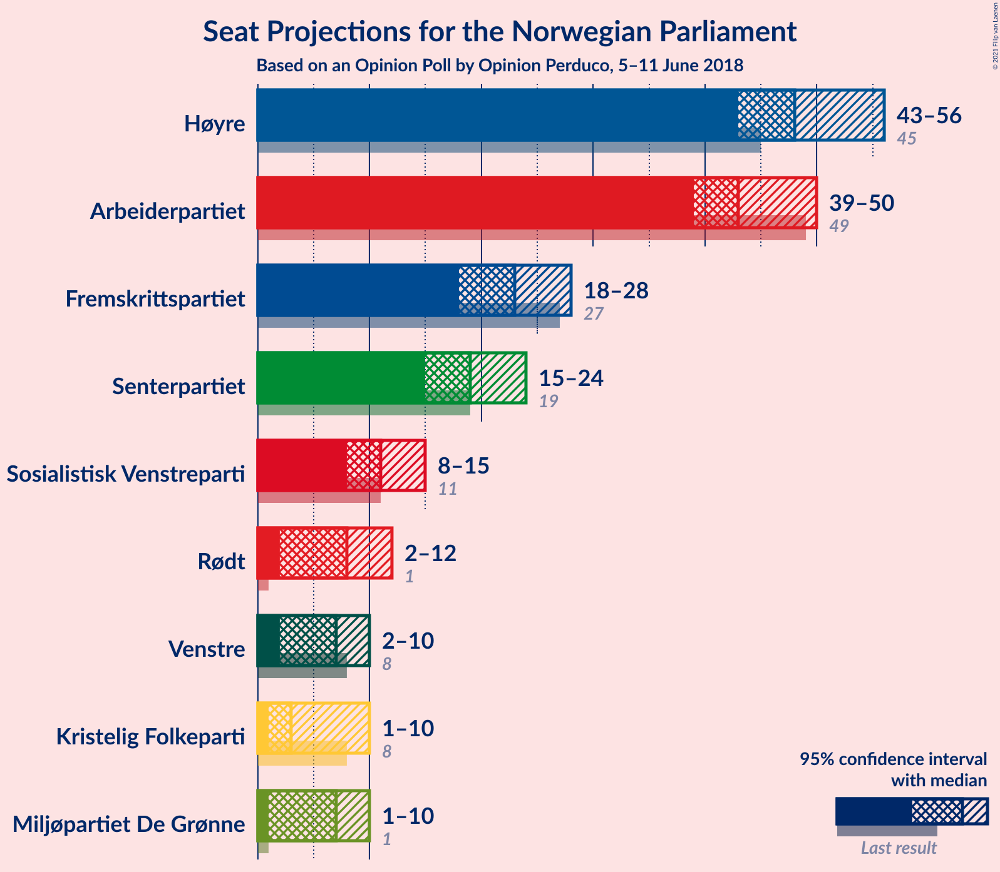
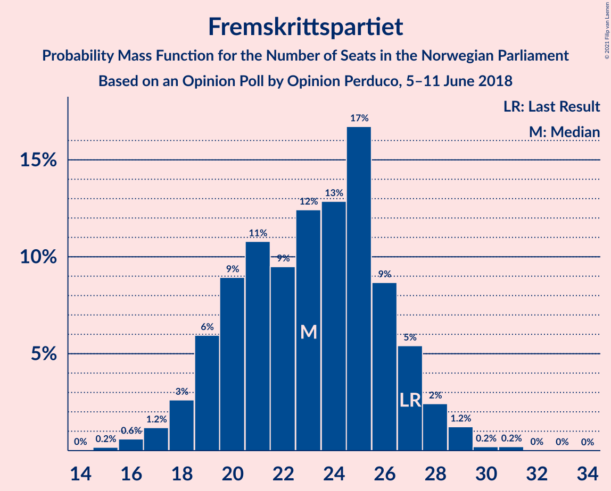
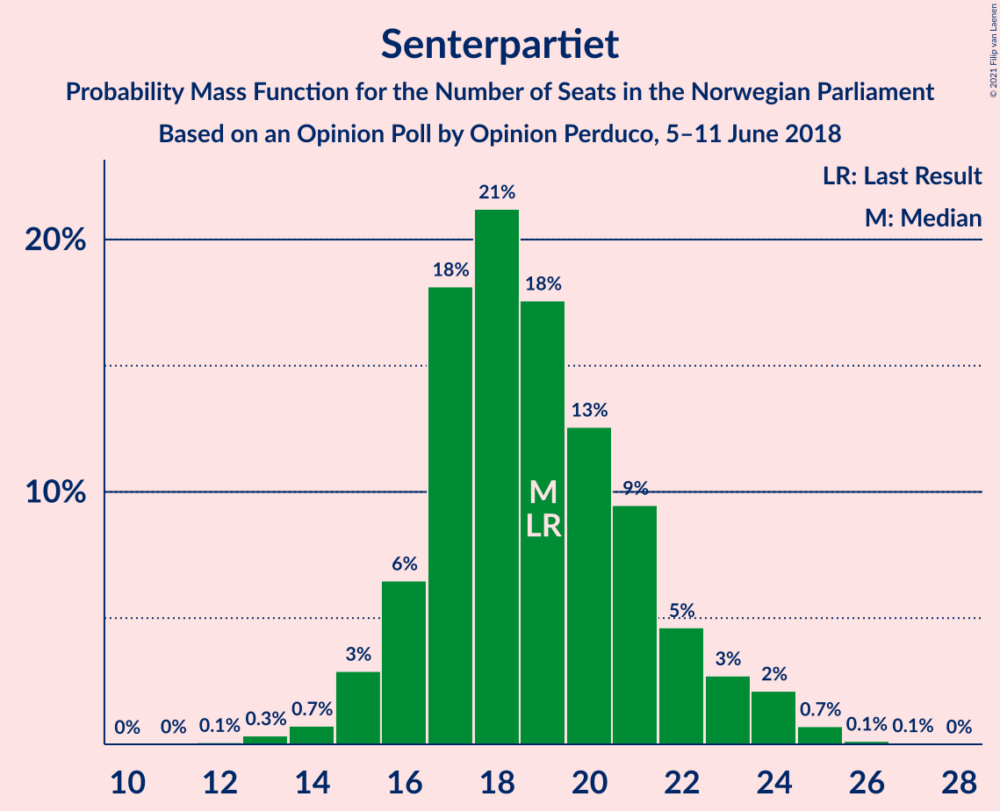
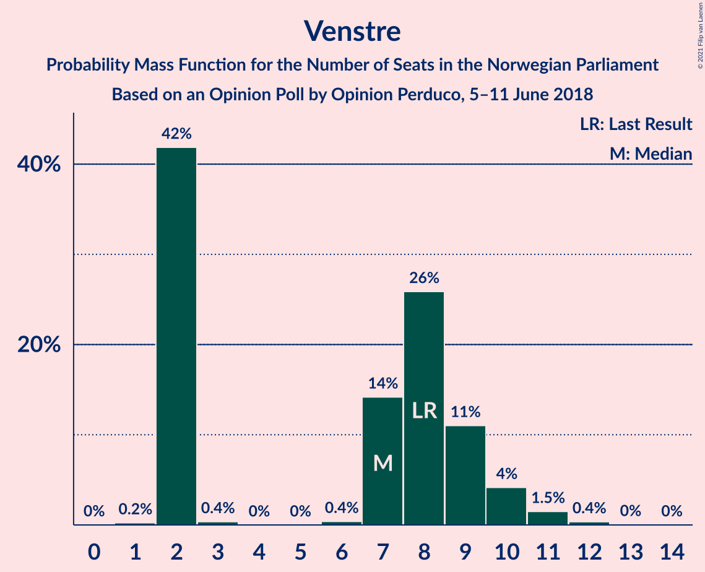
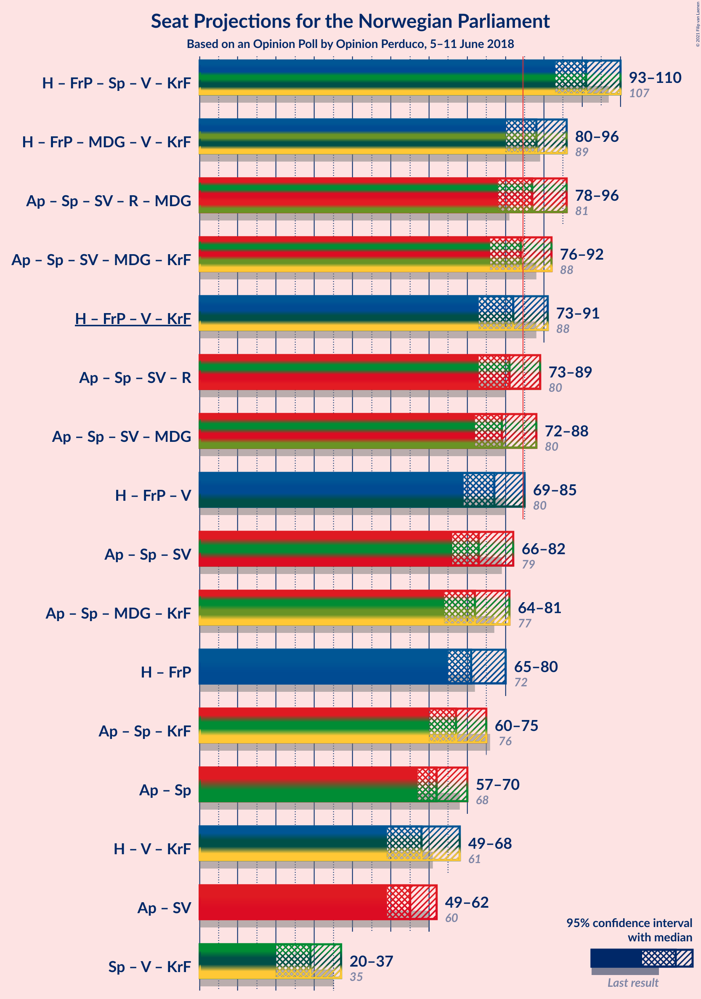
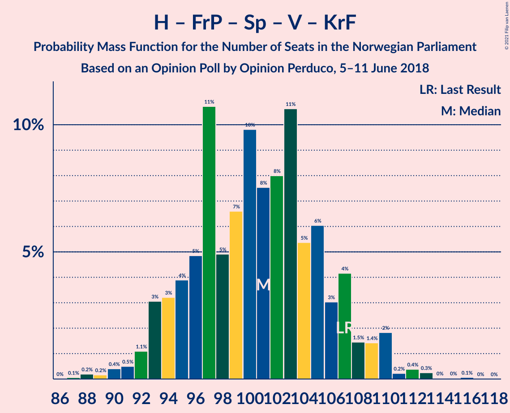
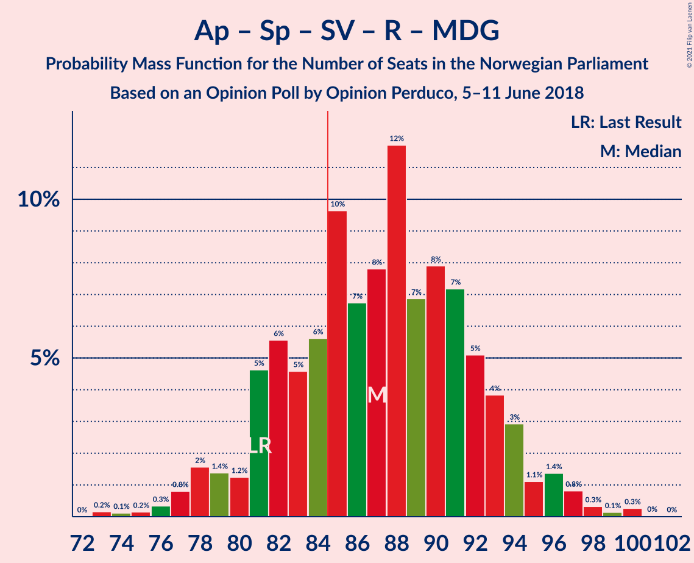
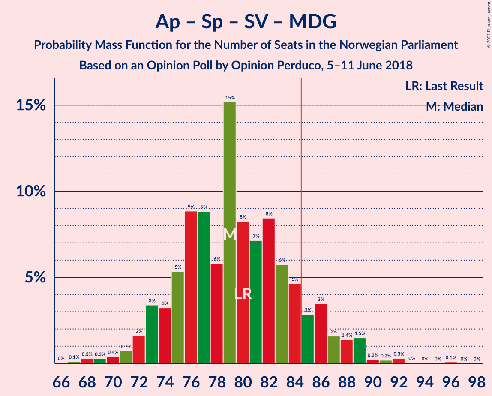

# Opinion Poll by Opinion Perduco, 5–11 June 2018

<a href="#voting-intentions">Voting Intentions</a> | <a href="#seats">Seats</a> | <a href="#coalitions">Coalitions</a> | <a href="#technical-information">Technical Information</a>

## Voting Intentions

### Confidence Intervals

| Party | Last Result | Poll Result | 80% Confidence Interval | 90% Confidence Interval | 95% Confidence Interval | 99% Confidence Interval |
|:-----:|:-----------:|:-----------:|:-----------------------:|:-----------------------:|:-----------------------:|:-----------------------:|
| Høyre | 25.0% | 27.2% | 25.1–29.4% |24.5–30.0% |24.0–30.6% |23.0–31.7% |
| Arbeiderpartiet | 27.4% | 24.0% | 22.0–26.2% |21.4–26.8% |21.0–27.3% |20.0–28.4% |
| Fremskrittspartiet | 15.2% | 12.9% | 11.4–14.7% |11.0–15.2% |10.6–15.6% |10.0–16.5% |
| Senterpartiet | 10.3% | 10.6% | 9.3–12.3% |8.9–12.7% |8.6–13.2% |7.9–14.0% |
| Sosialistisk Venstreparti | 6.0% | 6.5% | 5.4–7.8% |5.1–8.2% |4.9–8.6% |4.4–9.3% |
| Rødt | 2.4% | 4.7% | 3.9–5.9% |3.6–6.3% |3.4–6.6% |3.0–7.2% |
| Miljøpartiet De Grønne | 3.2% | 4.2% | 3.3–5.3% |3.1–5.6% |2.9–5.9% |2.6–6.5% |
| Venstre | 4.4% | 4.2% | 3.3–5.3% |3.1–5.6% |2.9–5.9% |2.6–6.5% |
| Kristelig Folkeparti | 4.2% | 3.7% | 3.0–4.8% |2.7–5.2% |2.6–5.4% |2.2–6.0% |

*Note:* The poll result column reflects the actual value used in the calculations. Published results may vary slightly, and in addition be rounded to fewer digits.

## Seats

### Confidence Intervals

| Party | Last Result | Median | 80% Confidence Interval | 90% Confidence Interval | 95% Confidence Interval | 99% Confidence Interval |
|:-----:|:-----------:|:------:|:-----------------------:|:-----------------------:|:-----------------------:|:-----------------------:|
| <a href="#høyre">Høyre</a> | 45 | 48 | 44–53 |43–54 |43–56 |40–58 |
| <a href="#arbeiderpartiet">Arbeiderpartiet</a> | 49 | 43 | 40–48 |40–49 |39–50 |37–52 |
| <a href="#fremskrittspartiet">Fremskrittspartiet</a> | 27 | 23 | 19–26 |19–27 |18–28 |16–29 |
| <a href="#senterpartiet">Senterpartiet</a> | 19 | 19 | 16–22 |16–23 |15–24 |14–25 |
| <a href="#sosialistisk-venstreparti">Sosialistisk Venstreparti</a> | 11 | 11 | 9–14 |8–15 |8–15 |7–16 |
| <a href="#rødt">Rødt</a> | 1 | 8 | 2–11 |2–11 |2–12 |2–12 |
| <a href="#miljøpartiet-de-grønne">Miljøpartiet De Grønne</a> | 1 | 7 | 2–10 |1–10 |1–10 |1–11 |
| <a href="#venstre">Venstre</a> | 8 | 7 | 2–9 |2–10 |2–10 |2–11 |
| <a href="#kristelig-folkeparti">Kristelig Folkeparti</a> | 8 | 3 | 1–9 |1–9 |1–10 |0–10 |

### Høyre

*For a full overview of the results for this party, see the [Høyre](party-høyre.html) page.*

| Number of Seats | Probability | Accumulated | Special Marks |
|:---------------:|:-----------:|:-----------:|:-------------:|
| 38 | 0.1% | 100% |  |
| 39 | 0.2% | 99.9% |  |
| 40 | 0.6% | 99.7% |  |
| 41 | 0.7% | 99.2% |  |
| 42 | 0.8% | 98% |  |
| 43 | 3% | 98% |  |
| 44 | 5% | 94% |  |
| 45 | 7% | 89% | Last Result |
| 46 | 11% | 82% |  |
| 47 | 11% | 71% |  |
| 48 | 11% | 60% | Median |
| 49 | 13% | 49% |  |
| 50 | 9% | 36% |  |
| 51 | 7% | 27% |  |
| 52 | 6% | 20% |  |
| 53 | 7% | 14% |  |
| 54 | 2% | 7% |  |
| 55 | 2% | 4% |  |
| 56 | 1.4% | 3% |  |
| 57 | 0.6% | 1.2% |  |
| 58 | 0.4% | 0.6% |  |
| 59 | 0.1% | 0.2% |  |
| 60 | 0.1% | 0.1% |  |
| 61 | 0% | 0% |  |

### Arbeiderpartiet

*For a full overview of the results for this party, see the [Arbeiderpartiet](party-arbeiderpartiet.html) page.*

| Number of Seats | Probability | Accumulated | Special Marks |
|:---------------:|:-----------:|:-----------:|:-------------:|
| 34 | 0% | 100% |  |
| 35 | 0.1% | 99.9% |  |
| 36 | 0.1% | 99.9% |  |
| 37 | 0.7% | 99.7% |  |
| 38 | 1.0% | 99.0% |  |
| 39 | 2% | 98% |  |
| 40 | 8% | 96% |  |
| 41 | 15% | 88% |  |
| 42 | 14% | 73% |  |
| 43 | 15% | 59% | Median |
| 44 | 10% | 44% |  |
| 45 | 15% | 34% |  |
| 46 | 3% | 19% |  |
| 47 | 5% | 16% |  |
| 48 | 5% | 11% |  |
| 49 | 3% | 6% | Last Result |
| 50 | 1.1% | 3% |  |
| 51 | 0.8% | 2% |  |
| 52 | 0.6% | 1.1% |  |
| 53 | 0.2% | 0.5% |  |
| 54 | 0.1% | 0.2% |  |
| 55 | 0.1% | 0.1% |  |
| 56 | 0% | 0% |  |

### Fremskrittspartiet

*For a full overview of the results for this party, see the [Fremskrittspartiet](party-fremskrittspartiet.html) page.*

| Number of Seats | Probability | Accumulated | Special Marks |
|:---------------:|:-----------:|:-----------:|:-------------:|
| 15 | 0.2% | 100% |  |
| 16 | 0.6% | 99.8% |  |
| 17 | 1.2% | 99.2% |  |
| 18 | 3% | 98% |  |
| 19 | 6% | 95% |  |
| 20 | 9% | 89% |  |
| 21 | 11% | 81% |  |
| 22 | 9% | 70% |  |
| 23 | 12% | 60% | Median |
| 24 | 13% | 48% |  |
| 25 | 17% | 35% |  |
| 26 | 9% | 18% |  |
| 27 | 5% | 10% | Last Result |
| 28 | 2% | 4% |  |
| 29 | 1.2% | 2% |  |
| 30 | 0.2% | 0.5% |  |
| 31 | 0.2% | 0.3% |  |
| 32 | 0% | 0.1% |  |
| 33 | 0% | 0% |  |

### Senterpartiet

*For a full overview of the results for this party, see the [Senterpartiet](party-senterpartiet.html) page.*

| Number of Seats | Probability | Accumulated | Special Marks |
|:---------------:|:-----------:|:-----------:|:-------------:|
| 12 | 0.1% | 100% |  |
| 13 | 0.3% | 99.9% |  |
| 14 | 0.7% | 99.5% |  |
| 15 | 3% | 98.8% |  |
| 16 | 6% | 96% |  |
| 17 | 18% | 89% |  |
| 18 | 21% | 71% |  |
| 19 | 18% | 50% | Last Result, Median |
| 20 | 13% | 32% |  |
| 21 | 9% | 20% |  |
| 22 | 5% | 10% |  |
| 23 | 3% | 6% |  |
| 24 | 2% | 3% |  |
| 25 | 0.7% | 1.0% |  |
| 26 | 0.1% | 0.2% |  |
| 27 | 0.1% | 0.1% |  |
| 28 | 0% | 0% |  |

### Sosialistisk Venstreparti

*For a full overview of the results for this party, see the [Sosialistisk Venstreparti](party-sosialistiskvenstreparti.html) page.*

| Number of Seats | Probability | Accumulated | Special Marks |
|:---------------:|:-----------:|:-----------:|:-------------:|
| 2 | 0.1% | 100% |  |
| 3 | 0% | 99.9% |  |
| 4 | 0% | 99.9% |  |
| 5 | 0% | 99.9% |  |
| 6 | 0% | 99.9% |  |
| 7 | 0.5% | 99.9% |  |
| 8 | 6% | 99.4% |  |
| 9 | 10% | 93% |  |
| 10 | 15% | 83% |  |
| 11 | 21% | 67% | Last Result, Median |
| 12 | 17% | 47% |  |
| 13 | 16% | 29% |  |
| 14 | 8% | 14% |  |
| 15 | 4% | 6% |  |
| 16 | 1.0% | 1.5% |  |
| 17 | 0.3% | 0.5% |  |
| 18 | 0.1% | 0.1% |  |
| 19 | 0% | 0.1% |  |
| 20 | 0% | 0% |  |

### Rødt

*For a full overview of the results for this party, see the [Rødt](party-rødt.html) page.*

| Number of Seats | Probability | Accumulated | Special Marks |
|:---------------:|:-----------:|:-----------:|:-------------:|
| 1 | 0.3% | 100% | Last Result |
| 2 | 18% | 99.7% |  |
| 3 | 0% | 81% |  |
| 4 | 0% | 81% |  |
| 5 | 0% | 81% |  |
| 6 | 0.6% | 81% |  |
| 7 | 10% | 81% |  |
| 8 | 23% | 71% | Median |
| 9 | 21% | 48% |  |
| 10 | 16% | 27% |  |
| 11 | 7% | 11% |  |
| 12 | 4% | 4% |  |
| 13 | 0.3% | 0.4% |  |
| 14 | 0.1% | 0.1% |  |
| 15 | 0% | 0% |  |

### Miljøpartiet De Grønne

*For a full overview of the results for this party, see the [Miljøpartiet De Grønne](party-miljøpartietdegrønne.html) page.*

| Number of Seats | Probability | Accumulated | Special Marks |
|:---------------:|:-----------:|:-----------:|:-------------:|
| 1 | 7% | 100% | Last Result |
| 2 | 27% | 93% |  |
| 3 | 3% | 66% |  |
| 4 | 0% | 62% |  |
| 5 | 0% | 62% |  |
| 6 | 2% | 62% |  |
| 7 | 16% | 61% | Median |
| 8 | 20% | 44% |  |
| 9 | 14% | 24% |  |
| 10 | 9% | 10% |  |
| 11 | 0.8% | 1.1% |  |
| 12 | 0.2% | 0.3% |  |
| 13 | 0.1% | 0.2% |  |
| 14 | 0% | 0% |  |

### Venstre

*For a full overview of the results for this party, see the [Venstre](party-venstre.html) page.*

| Number of Seats | Probability | Accumulated | Special Marks |
|:---------------:|:-----------:|:-----------:|:-------------:|
| 1 | 0.2% | 100% |  |
| 2 | 42% | 99.7% |  |
| 3 | 0.4% | 58% |  |
| 4 | 0% | 58% |  |
| 5 | 0% | 58% |  |
| 6 | 0.4% | 58% |  |
| 7 | 14% | 57% | Median |
| 8 | 26% | 43% | Last Result |
| 9 | 11% | 17% |  |
| 10 | 4% | 6% |  |
| 11 | 1.5% | 2% |  |
| 12 | 0.4% | 0.4% |  |
| 13 | 0% | 0.1% |  |
| 14 | 0% | 0% |  |

### Kristelig Folkeparti

*For a full overview of the results for this party, see the [Kristelig Folkeparti](party-kristeligfolkeparti.html) page.*

| Number of Seats | Probability | Accumulated | Special Marks |
|:---------------:|:-----------:|:-----------:|:-------------:|
| 0 | 0.6% | 100% |  |
| 1 | 11% | 99.4% |  |
| 2 | 12% | 88% |  |
| 3 | 37% | 76% | Median |
| 4 | 0% | 40% |  |
| 5 | 0% | 40% |  |
| 6 | 1.3% | 40% |  |
| 7 | 13% | 39% |  |
| 8 | 15% | 26% | Last Result |
| 9 | 7% | 11% |  |
| 10 | 3% | 3% |  |
| 11 | 0.4% | 0.4% |  |
| 12 | 0.1% | 0.1% |  |
| 13 | 0% | 0% |  |

## Coalitions

### Confidence Intervals

| Coalition | Last Result | Median | Majority? | 80% Confidence Interval | 90% Confidence Interval | 95% Confidence Interval | 99% Confidence Interval |
|:---------:|:-----------:|:------:|:---------:|:-----------------------:|:-----------------------:|:-----------------------:|:-----------------------:|
| Høyre – Fremskrittspartiet – Senterpartiet – Venstre – Kristelig Folkeparti | 107 | 101 | 100% | 95–106 | 93–108 | 93–110 | 90–112 |
| Høyre – Fremskrittspartiet – Miljøpartiet De Grønne – Venstre – Kristelig Folkeparti | 89 | 88 | 78% | 82–93 | 80–94 | 80–96 | 76–98 |
| Arbeiderpartiet – Senterpartiet – Sosialistisk Venstreparti – Rødt – Miljøpartiet De Grønne | 81 | 87 | 74% | 81–93 | 80–94 | 78–96 | 76–98 |
| Arbeiderpartiet – Senterpartiet – Sosialistisk Venstreparti – Miljøpartiet De Grønne – Kristelig Folkeparti | 88 | 84 | 47% | 79–89 | 78–91 | 76–92 | 74–95 |
| Høyre – Fremskrittspartiet – Venstre – Kristelig Folkeparti | 88 | 82 | 26% | 76–88 | 75–89 | 73–91 | 71–93 |
| Arbeiderpartiet – Senterpartiet – Sosialistisk Venstreparti – Rødt | 80 | 81 | 22% | 76–87 | 75–89 | 73–89 | 71–93 |
| Arbeiderpartiet – Senterpartiet – Sosialistisk Venstreparti – Miljøpartiet De Grønne | 80 | 79 | 12% | 74–85 | 73–87 | 72–88 | 69–91 |
| Høyre – Fremskrittspartiet – Venstre | 80 | 77 | 5% | 71–83 | 70–85 | 69–85 | 67–87 |
| Arbeiderpartiet – Senterpartiet – Sosialistisk Venstreparti | 79 | 73 | 0.9% | 69–79 | 67–81 | 66–82 | 65–87 |
| Arbeiderpartiet – Senterpartiet – Miljøpartiet De Grønne – Kristelig Folkeparti | 77 | 72 | 0.3% | 68–78 | 66–80 | 64–81 | 62–84 |
| Høyre – Fremskrittspartiet | 72 | 71 | 0.1% | 67–77 | 66–78 | 65–80 | 62–81 |
| Arbeiderpartiet – Senterpartiet – Kristelig Folkeparti | 76 | 67 | 0% | 61–72 | 60–74 | 60–75 | 57–79 |
| Arbeiderpartiet – Senterpartiet | 68 | 62 | 0% | 58–67 | 57–68 | 57–70 | 54–73 |
| Høyre – Venstre – Kristelig Folkeparti | 61 | 58 | 0% | 54–64 | 51–66 | 49–68 | 48–70 |
| Arbeiderpartiet – Sosialistisk Venstreparti | 60 | 55 | 0% | 51–60 | 50–61 | 49–62 | 47–64 |
| Senterpartiet – Venstre – Kristelig Folkeparti | 35 | 29 | 0% | 23–34 | 22–35 | 20–37 | 20–39 |

### Høyre – Fremskrittspartiet – Senterpartiet – Venstre – Kristelig Folkeparti

| Number of Seats | Probability | Accumulated | Special Marks |
|:---------------:|:-----------:|:-----------:|:-------------:|
| 87 | 0.1% | 100% |  |
| 88 | 0.2% | 99.9% |  |
| 89 | 0.2% | 99.7% |  |
| 90 | 0.4% | 99.6% |  |
| 91 | 0.5% | 99.2% |  |
| 92 | 1.1% | 98.7% |  |
| 93 | 3% | 98% |  |
| 94 | 3% | 94% |  |
| 95 | 4% | 91% |  |
| 96 | 5% | 87% |  |
| 97 | 11% | 83% |  |
| 98 | 5% | 72% |  |
| 99 | 7% | 67% |  |
| 100 | 10% | 60% | Median |
| 101 | 8% | 50% |  |
| 102 | 8% | 43% |  |
| 103 | 11% | 35% |  |
| 104 | 5% | 24% |  |
| 105 | 6% | 19% |  |
| 106 | 3% | 13% |  |
| 107 | 4% | 10% | Last Result |
| 108 | 1.5% | 6% |  |
| 109 | 1.4% | 4% |  |
| 110 | 2% | 3% |  |
| 111 | 0.2% | 1.0% |  |
| 112 | 0.4% | 0.8% |  |
| 113 | 0.3% | 0.4% |  |
| 114 | 0% | 0.1% |  |
| 115 | 0% | 0.1% |  |
| 116 | 0.1% | 0.1% |  |
| 117 | 0% | 0% |  |

### Høyre – Fremskrittspartiet – Miljøpartiet De Grønne – Venstre – Kristelig Folkeparti

| Number of Seats | Probability | Accumulated | Special Marks |
|:---------------:|:-----------:|:-----------:|:-------------:|
| 73 | 0% | 100% |  |
| 74 | 0.1% | 99.9% |  |
| 75 | 0.1% | 99.9% |  |
| 76 | 0.4% | 99.8% |  |
| 77 | 0.2% | 99.4% |  |
| 78 | 1.1% | 99.2% |  |
| 79 | 0.6% | 98% |  |
| 80 | 4% | 98% |  |
| 81 | 2% | 93% |  |
| 82 | 4% | 91% |  |
| 83 | 4% | 87% |  |
| 84 | 5% | 83% |  |
| 85 | 10% | 78% | Majority |
| 86 | 5% | 68% |  |
| 87 | 7% | 63% |  |
| 88 | 10% | 55% | Median |
| 89 | 9% | 45% | Last Result |
| 90 | 10% | 36% |  |
| 91 | 9% | 26% |  |
| 92 | 5% | 17% |  |
| 93 | 5% | 12% |  |
| 94 | 3% | 7% |  |
| 95 | 1.1% | 4% |  |
| 96 | 1.0% | 3% |  |
| 97 | 0.7% | 2% |  |
| 98 | 0.8% | 1.1% |  |
| 99 | 0.2% | 0.3% |  |
| 100 | 0.1% | 0.1% |  |
| 101 | 0% | 0% |  |

### Arbeiderpartiet – Senterpartiet – Sosialistisk Venstreparti – Rødt – Miljøpartiet De Grønne

| Number of Seats | Probability | Accumulated | Special Marks |
|:---------------:|:-----------:|:-----------:|:-------------:|
| 73 | 0.2% | 100% |  |
| 74 | 0.1% | 99.8% |  |
| 75 | 0.2% | 99.7% |  |
| 76 | 0.3% | 99.6% |  |
| 77 | 0.8% | 99.2% |  |
| 78 | 2% | 98% |  |
| 79 | 1.4% | 97% |  |
| 80 | 1.2% | 95% |  |
| 81 | 5% | 94% | Last Result |
| 82 | 6% | 90% |  |
| 83 | 5% | 84% |  |
| 84 | 6% | 79% |  |
| 85 | 10% | 74% | Majority |
| 86 | 7% | 64% |  |
| 87 | 8% | 57% |  |
| 88 | 12% | 50% | Median |
| 89 | 7% | 38% |  |
| 90 | 8% | 31% |  |
| 91 | 7% | 23% |  |
| 92 | 5% | 16% |  |
| 93 | 4% | 11% |  |
| 94 | 3% | 7% |  |
| 95 | 1.1% | 4% |  |
| 96 | 1.4% | 3% |  |
| 97 | 0.8% | 2% |  |
| 98 | 0.3% | 0.8% |  |
| 99 | 0.1% | 0.5% |  |
| 100 | 0.3% | 0.3% |  |
| 101 | 0% | 0.1% |  |
| 102 | 0% | 0% |  |

### Arbeiderpartiet – Senterpartiet – Sosialistisk Venstreparti – Miljøpartiet De Grønne – Kristelig Folkeparti

| Number of Seats | Probability | Accumulated | Special Marks |
|:---------------:|:-----------:|:-----------:|:-------------:|
| 70 | 0% | 100% |  |
| 71 | 0% | 99.9% |  |
| 72 | 0.1% | 99.9% |  |
| 73 | 0.1% | 99.8% |  |
| 74 | 0.3% | 99.8% |  |
| 75 | 0.8% | 99.5% |  |
| 76 | 1.5% | 98.7% |  |
| 77 | 2% | 97% |  |
| 78 | 3% | 95% |  |
| 79 | 5% | 92% |  |
| 80 | 7% | 87% |  |
| 81 | 8% | 80% |  |
| 82 | 10% | 72% |  |
| 83 | 7% | 63% | Median |
| 84 | 8% | 55% |  |
| 85 | 11% | 47% | Majority |
| 86 | 7% | 36% |  |
| 87 | 6% | 29% |  |
| 88 | 8% | 22% | Last Result |
| 89 | 5% | 15% |  |
| 90 | 3% | 10% |  |
| 91 | 3% | 7% |  |
| 92 | 2% | 4% |  |
| 93 | 0.8% | 2% |  |
| 94 | 0.5% | 1.1% |  |
| 95 | 0.2% | 0.6% |  |
| 96 | 0.1% | 0.4% |  |
| 97 | 0.1% | 0.2% |  |
| 98 | 0.1% | 0.1% |  |
| 99 | 0% | 0% |  |

### Høyre – Fremskrittspartiet – Venstre – Kristelig Folkeparti

| Number of Seats | Probability | Accumulated | Special Marks |
|:---------------:|:-----------:|:-----------:|:-------------:|
| 68 | 0% | 100% |  |
| 69 | 0.3% | 99.9% |  |
| 70 | 0.1% | 99.7% |  |
| 71 | 0.3% | 99.5% |  |
| 72 | 0.8% | 99.2% |  |
| 73 | 1.4% | 98% |  |
| 74 | 1.1% | 97% |  |
| 75 | 3% | 96% |  |
| 76 | 4% | 93% |  |
| 77 | 5% | 89% |  |
| 78 | 7% | 84% |  |
| 79 | 8% | 77% |  |
| 80 | 7% | 69% |  |
| 81 | 12% | 62% | Median |
| 82 | 8% | 50% |  |
| 83 | 7% | 42% |  |
| 84 | 10% | 36% |  |
| 85 | 6% | 26% | Majority |
| 86 | 5% | 20% |  |
| 87 | 5% | 16% |  |
| 88 | 5% | 10% | Last Result |
| 89 | 1.2% | 6% |  |
| 90 | 1.4% | 5% |  |
| 91 | 2% | 3% |  |
| 92 | 0.8% | 2% |  |
| 93 | 0.3% | 0.8% |  |
| 94 | 0.1% | 0.4% |  |
| 95 | 0.1% | 0.3% |  |
| 96 | 0.2% | 0.2% |  |
| 97 | 0% | 0% |  |

### Arbeiderpartiet – Senterpartiet – Sosialistisk Venstreparti – Rødt

| Number of Seats | Probability | Accumulated | Special Marks |
|:---------------:|:-----------:|:-----------:|:-------------:|
| 69 | 0.1% | 100% |  |
| 70 | 0.2% | 99.9% |  |
| 71 | 0.8% | 99.7% |  |
| 72 | 0.7% | 98.9% |  |
| 73 | 1.0% | 98% |  |
| 74 | 1.1% | 97% |  |
| 75 | 3% | 96% |  |
| 76 | 5% | 93% |  |
| 77 | 5% | 88% |  |
| 78 | 9% | 83% |  |
| 79 | 10% | 74% |  |
| 80 | 9% | 64% | Last Result |
| 81 | 10% | 55% | Median |
| 82 | 7% | 45% |  |
| 83 | 5% | 37% |  |
| 84 | 10% | 32% |  |
| 85 | 5% | 22% | Majority |
| 86 | 4% | 17% |  |
| 87 | 4% | 13% |  |
| 88 | 2% | 9% |  |
| 89 | 4% | 7% |  |
| 90 | 0.6% | 2% |  |
| 91 | 1.1% | 2% |  |
| 92 | 0.2% | 0.8% |  |
| 93 | 0.4% | 0.6% |  |
| 94 | 0.1% | 0.2% |  |
| 95 | 0.1% | 0.1% |  |
| 96 | 0% | 0.1% |  |
| 97 | 0% | 0% |  |

### Arbeiderpartiet – Senterpartiet – Sosialistisk Venstreparti – Miljøpartiet De Grønne

| Number of Seats | Probability | Accumulated | Special Marks |
|:---------------:|:-----------:|:-----------:|:-------------:|
| 66 | 0% | 100% |  |
| 67 | 0.1% | 99.9% |  |
| 68 | 0.3% | 99.8% |  |
| 69 | 0.3% | 99.5% |  |
| 70 | 0.4% | 99.3% |  |
| 71 | 0.7% | 98.9% |  |
| 72 | 2% | 98% |  |
| 73 | 3% | 97% |  |
| 74 | 3% | 93% |  |
| 75 | 5% | 90% |  |
| 76 | 9% | 85% |  |
| 77 | 9% | 76% |  |
| 78 | 6% | 67% |  |
| 79 | 15% | 61% |  |
| 80 | 8% | 46% | Last Result, Median |
| 81 | 7% | 38% |  |
| 82 | 8% | 31% |  |
| 83 | 6% | 22% |  |
| 84 | 5% | 16% |  |
| 85 | 3% | 12% | Majority |
| 86 | 3% | 9% |  |
| 87 | 2% | 5% |  |
| 88 | 1.4% | 4% |  |
| 89 | 1.5% | 2% |  |
| 90 | 0.2% | 0.9% |  |
| 91 | 0.2% | 0.7% |  |
| 92 | 0.3% | 0.5% |  |
| 93 | 0% | 0.2% |  |
| 94 | 0% | 0.1% |  |
| 95 | 0% | 0.1% |  |
| 96 | 0.1% | 0.1% |  |
| 97 | 0% | 0% |  |

### Høyre – Fremskrittspartiet – Venstre

| Number of Seats | Probability | Accumulated | Special Marks |
|:---------------:|:-----------:|:-----------:|:-------------:|
| 64 | 0.1% | 100% |  |
| 65 | 0% | 99.9% |  |
| 66 | 0.1% | 99.9% |  |
| 67 | 0.4% | 99.8% |  |
| 68 | 2% | 99.3% |  |
| 69 | 1.1% | 98% |  |
| 70 | 2% | 97% |  |
| 71 | 5% | 94% |  |
| 72 | 2% | 90% |  |
| 73 | 7% | 87% |  |
| 74 | 6% | 80% |  |
| 75 | 9% | 75% |  |
| 76 | 9% | 66% |  |
| 77 | 9% | 57% |  |
| 78 | 10% | 48% | Median |
| 79 | 11% | 38% |  |
| 80 | 7% | 28% | Last Result |
| 81 | 5% | 20% |  |
| 82 | 4% | 16% |  |
| 83 | 5% | 11% |  |
| 84 | 2% | 7% |  |
| 85 | 4% | 5% | Majority |
| 86 | 0.8% | 1.5% |  |
| 87 | 0.2% | 0.7% |  |
| 88 | 0.2% | 0.5% |  |
| 89 | 0.1% | 0.3% |  |
| 90 | 0.1% | 0.2% |  |
| 91 | 0% | 0.1% |  |
| 92 | 0.1% | 0.1% |  |
| 93 | 0% | 0% |  |

### Arbeiderpartiet – Senterpartiet – Sosialistisk Venstreparti

| Number of Seats | Probability | Accumulated | Special Marks |
|:---------------:|:-----------:|:-----------:|:-------------:|
| 62 | 0% | 100% |  |
| 63 | 0.1% | 99.9% |  |
| 64 | 0.1% | 99.8% |  |
| 65 | 0.8% | 99.7% |  |
| 66 | 2% | 98.9% |  |
| 67 | 2% | 97% |  |
| 68 | 3% | 95% |  |
| 69 | 7% | 91% |  |
| 70 | 8% | 84% |  |
| 71 | 8% | 76% |  |
| 72 | 9% | 68% |  |
| 73 | 11% | 59% | Median |
| 74 | 10% | 48% |  |
| 75 | 6% | 39% |  |
| 76 | 8% | 33% |  |
| 77 | 9% | 25% |  |
| 78 | 5% | 17% |  |
| 79 | 4% | 12% | Last Result |
| 80 | 2% | 8% |  |
| 81 | 3% | 6% |  |
| 82 | 0.7% | 3% |  |
| 83 | 0.7% | 2% |  |
| 84 | 0.4% | 1.3% |  |
| 85 | 0.1% | 0.9% | Majority |
| 86 | 0.1% | 0.8% |  |
| 87 | 0.6% | 0.7% |  |
| 88 | 0% | 0.1% |  |
| 89 | 0% | 0% |  |

### Arbeiderpartiet – Senterpartiet – Miljøpartiet De Grønne – Kristelig Folkeparti

| Number of Seats | Probability | Accumulated | Special Marks |
|:---------------:|:-----------:|:-----------:|:-------------:|
| 59 | 0.1% | 100% |  |
| 60 | 0.1% | 99.9% |  |
| 61 | 0.1% | 99.9% |  |
| 62 | 0.5% | 99.8% |  |
| 63 | 1.0% | 99.2% |  |
| 64 | 1.1% | 98% |  |
| 65 | 1.1% | 97% |  |
| 66 | 2% | 96% |  |
| 67 | 2% | 94% |  |
| 68 | 6% | 92% |  |
| 69 | 8% | 85% |  |
| 70 | 9% | 78% |  |
| 71 | 8% | 69% |  |
| 72 | 11% | 60% | Median |
| 73 | 7% | 50% |  |
| 74 | 7% | 43% |  |
| 75 | 9% | 35% |  |
| 76 | 10% | 26% |  |
| 77 | 5% | 17% | Last Result |
| 78 | 3% | 12% |  |
| 79 | 2% | 9% |  |
| 80 | 3% | 6% |  |
| 81 | 2% | 3% |  |
| 82 | 0.6% | 2% |  |
| 83 | 0.4% | 0.9% |  |
| 84 | 0.3% | 0.6% |  |
| 85 | 0.2% | 0.3% | Majority |
| 86 | 0% | 0.1% |  |
| 87 | 0% | 0.1% |  |
| 88 | 0% | 0% |  |

### Høyre – Fremskrittspartiet

| Number of Seats | Probability | Accumulated | Special Marks |
|:---------------:|:-----------:|:-----------:|:-------------:|
| 60 | 0.1% | 100% |  |
| 61 | 0.1% | 99.9% |  |
| 62 | 0.3% | 99.8% |  |
| 63 | 0.8% | 99.4% |  |
| 64 | 1.0% | 98.6% |  |
| 65 | 2% | 98% |  |
| 66 | 4% | 95% |  |
| 67 | 4% | 91% |  |
| 68 | 7% | 87% |  |
| 69 | 9% | 80% |  |
| 70 | 7% | 71% |  |
| 71 | 16% | 64% | Median |
| 72 | 7% | 48% | Last Result |
| 73 | 12% | 41% |  |
| 74 | 8% | 29% |  |
| 75 | 6% | 21% |  |
| 76 | 5% | 15% |  |
| 77 | 4% | 10% |  |
| 78 | 2% | 6% |  |
| 79 | 1.1% | 4% |  |
| 80 | 2% | 3% |  |
| 81 | 1.0% | 1.5% |  |
| 82 | 0.3% | 0.5% |  |
| 83 | 0.1% | 0.2% |  |
| 84 | 0.1% | 0.1% |  |
| 85 | 0.1% | 0.1% | Majority |
| 86 | 0% | 0% |  |

### Arbeiderpartiet – Senterpartiet – Kristelig Folkeparti

| Number of Seats | Probability | Accumulated | Special Marks |
|:---------------:|:-----------:|:-----------:|:-------------:|
| 55 | 0.1% | 100% |  |
| 56 | 0.1% | 99.9% |  |
| 57 | 0.4% | 99.8% |  |
| 58 | 1.0% | 99.5% |  |
| 59 | 0.6% | 98% |  |
| 60 | 4% | 98% |  |
| 61 | 4% | 94% |  |
| 62 | 7% | 90% |  |
| 63 | 6% | 83% |  |
| 64 | 5% | 76% |  |
| 65 | 7% | 71% | Median |
| 66 | 10% | 64% |  |
| 67 | 12% | 54% |  |
| 68 | 8% | 42% |  |
| 69 | 8% | 34% |  |
| 70 | 8% | 26% |  |
| 71 | 5% | 19% |  |
| 72 | 4% | 14% |  |
| 73 | 3% | 9% |  |
| 74 | 3% | 7% |  |
| 75 | 2% | 4% |  |
| 76 | 1.4% | 2% | Last Result |
| 77 | 0.4% | 1.0% |  |
| 78 | 0.1% | 0.6% |  |
| 79 | 0.2% | 0.5% |  |
| 80 | 0.1% | 0.3% |  |
| 81 | 0.1% | 0.2% |  |
| 82 | 0% | 0% |  |

### Arbeiderpartiet – Senterpartiet

| Number of Seats | Probability | Accumulated | Special Marks |
|:---------------:|:-----------:|:-----------:|:-------------:|
| 52 | 0% | 100% |  |
| 53 | 0.1% | 99.9% |  |
| 54 | 0.3% | 99.8% |  |
| 55 | 0.4% | 99.5% |  |
| 56 | 1.4% | 99.0% |  |
| 57 | 3% | 98% |  |
| 58 | 8% | 95% |  |
| 59 | 12% | 87% |  |
| 60 | 9% | 75% |  |
| 61 | 10% | 66% |  |
| 62 | 10% | 56% | Median |
| 63 | 13% | 45% |  |
| 64 | 9% | 32% |  |
| 65 | 6% | 24% |  |
| 66 | 5% | 17% |  |
| 67 | 5% | 12% |  |
| 68 | 3% | 8% | Last Result |
| 69 | 2% | 5% |  |
| 70 | 1.0% | 3% |  |
| 71 | 0.6% | 2% |  |
| 72 | 0.6% | 2% |  |
| 73 | 0.8% | 1.0% |  |
| 74 | 0.1% | 0.2% |  |
| 75 | 0.1% | 0.1% |  |
| 76 | 0% | 0% |  |

### Høyre – Venstre – Kristelig Folkeparti

| Number of Seats | Probability | Accumulated | Special Marks |
|:---------------:|:-----------:|:-----------:|:-------------:|
| 44 | 0.1% | 100% |  |
| 45 | 0.1% | 99.9% |  |
| 46 | 0.1% | 99.9% |  |
| 47 | 0.1% | 99.8% |  |
| 48 | 1.5% | 99.7% |  |
| 49 | 0.7% | 98% |  |
| 50 | 1.1% | 97% |  |
| 51 | 2% | 96% |  |
| 52 | 1.2% | 94% |  |
| 53 | 3% | 93% |  |
| 54 | 8% | 90% |  |
| 55 | 4% | 82% |  |
| 56 | 9% | 78% |  |
| 57 | 7% | 69% |  |
| 58 | 14% | 63% | Median |
| 59 | 9% | 49% |  |
| 60 | 7% | 40% |  |
| 61 | 5% | 33% | Last Result |
| 62 | 8% | 28% |  |
| 63 | 4% | 20% |  |
| 64 | 6% | 16% |  |
| 65 | 4% | 10% |  |
| 66 | 2% | 6% |  |
| 67 | 1.3% | 4% |  |
| 68 | 0.8% | 3% |  |
| 69 | 0.9% | 2% |  |
| 70 | 0.6% | 0.8% |  |
| 71 | 0.1% | 0.2% |  |
| 72 | 0% | 0.1% |  |
| 73 | 0% | 0.1% |  |
| 74 | 0% | 0% |  |

### Arbeiderpartiet – Sosialistisk Venstreparti

| Number of Seats | Probability | Accumulated | Special Marks |
|:---------------:|:-----------:|:-----------:|:-------------:|
| 44 | 0% | 100% |  |
| 45 | 0.1% | 99.9% |  |
| 46 | 0.2% | 99.9% |  |
| 47 | 0.5% | 99.7% |  |
| 48 | 1.2% | 99.2% |  |
| 49 | 3% | 98% |  |
| 50 | 4% | 95% |  |
| 51 | 9% | 91% |  |
| 52 | 7% | 82% |  |
| 53 | 9% | 74% |  |
| 54 | 15% | 66% | Median |
| 55 | 9% | 51% |  |
| 56 | 11% | 42% |  |
| 57 | 10% | 31% |  |
| 58 | 7% | 21% |  |
| 59 | 3% | 14% |  |
| 60 | 4% | 10% | Last Result |
| 61 | 3% | 7% |  |
| 62 | 1.4% | 3% |  |
| 63 | 0.8% | 2% |  |
| 64 | 0.8% | 1.2% |  |
| 65 | 0.1% | 0.4% |  |
| 66 | 0.2% | 0.3% |  |
| 67 | 0% | 0.1% |  |
| 68 | 0% | 0.1% |  |
| 69 | 0% | 0% |  |

### Senterpartiet – Venstre – Kristelig Folkeparti

| Number of Seats | Probability | Accumulated | Special Marks |
|:---------------:|:-----------:|:-----------:|:-------------:|
| 18 | 0.1% | 100% |  |
| 19 | 0.2% | 99.9% |  |
| 20 | 2% | 99.7% |  |
| 21 | 2% | 97% |  |
| 22 | 4% | 96% |  |
| 23 | 2% | 92% |  |
| 24 | 4% | 90% |  |
| 25 | 5% | 86% |  |
| 26 | 7% | 81% |  |
| 27 | 6% | 73% |  |
| 28 | 10% | 67% |  |
| 29 | 12% | 57% | Median |
| 30 | 12% | 45% |  |
| 31 | 6% | 33% |  |
| 32 | 6% | 27% |  |
| 33 | 7% | 21% |  |
| 34 | 6% | 14% |  |
| 35 | 4% | 8% | Last Result |
| 36 | 2% | 5% |  |
| 37 | 2% | 3% |  |
| 38 | 0.4% | 1.4% |  |
| 39 | 0.6% | 1.0% |  |
| 40 | 0.3% | 0.4% |  |
| 41 | 0% | 0.1% |  |
| 42 | 0% | 0% |  |

## Technical Information

### Opinion Poll

+ **Polling firm:** Opinion Perduco
+ **Commissioner(s):** —
+ **Fieldwork period:** 5–11 June 2018

### Calculations

+ **Sample size:** 696
+ **Simulations done:** 1,048,576
+ **Error estimate:** 2.55%

