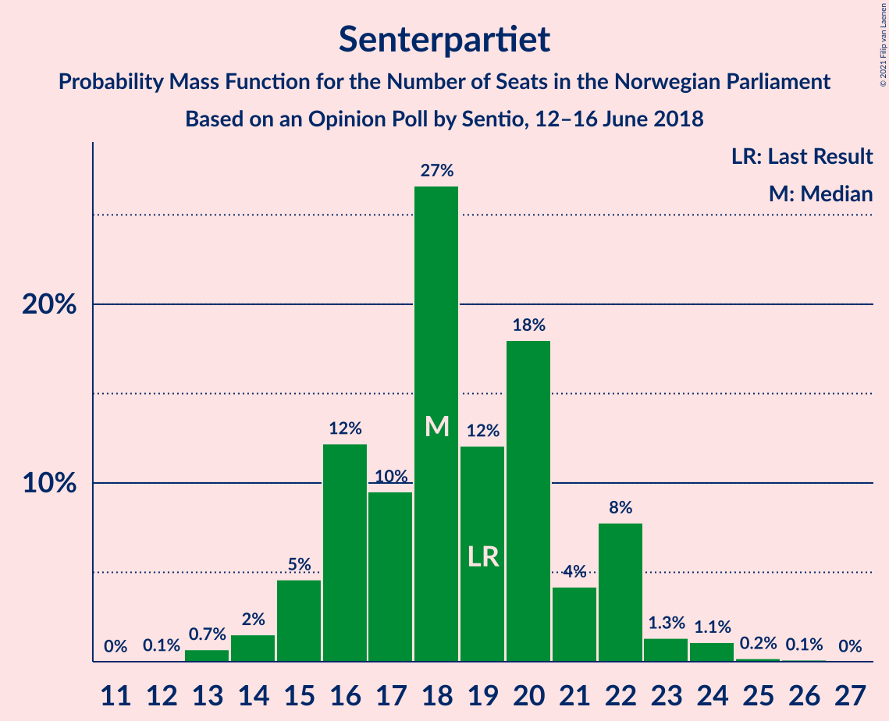
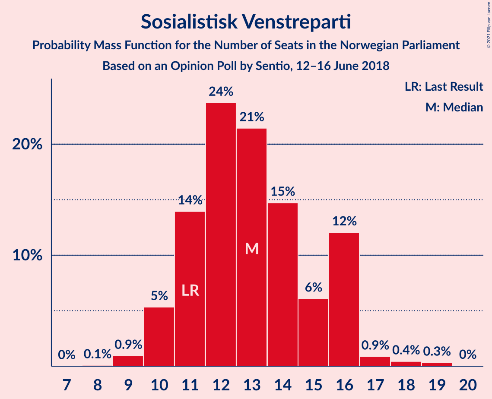
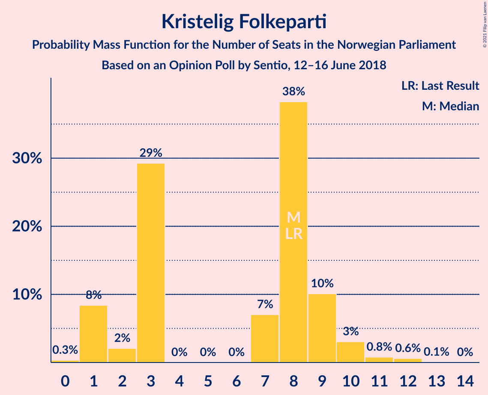
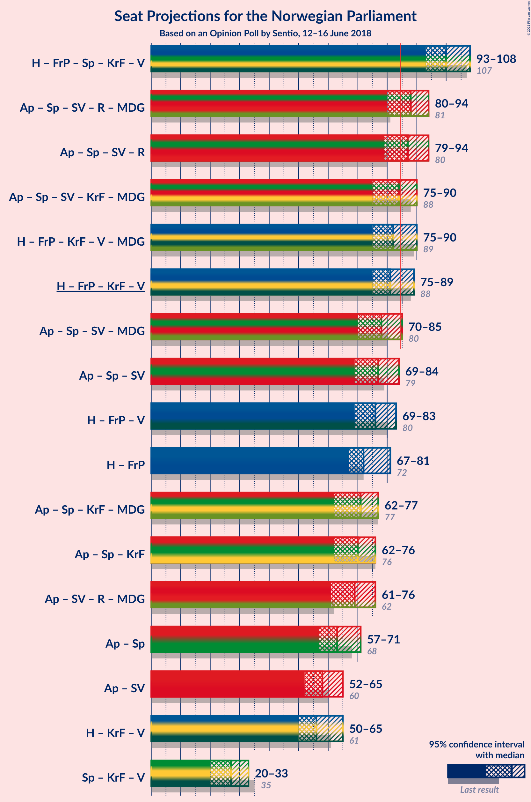
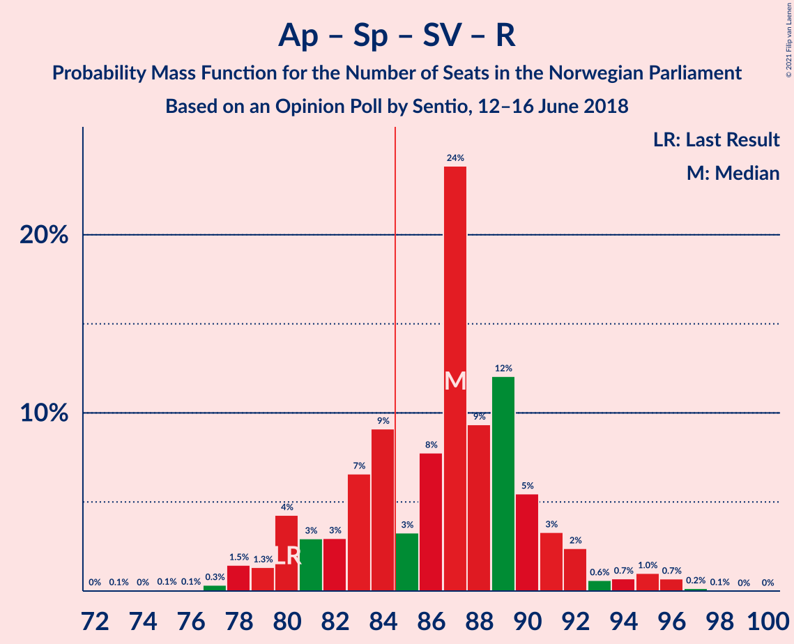
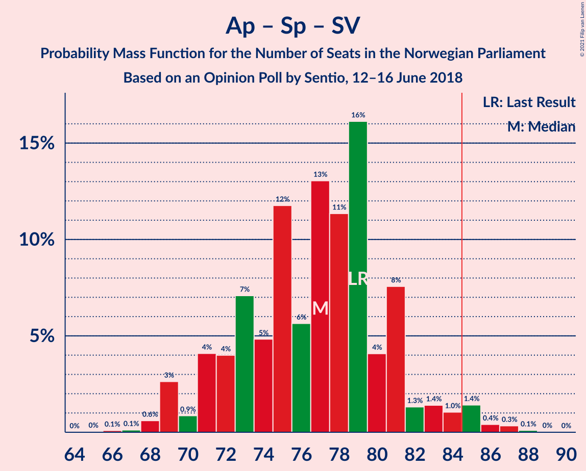
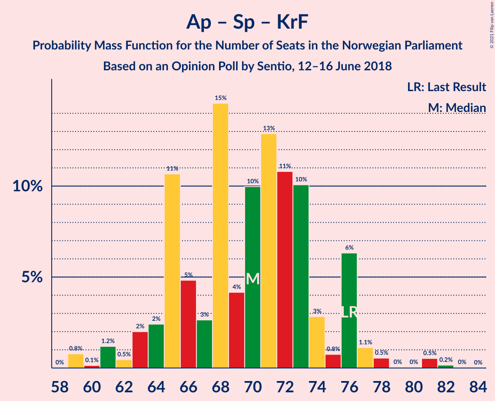
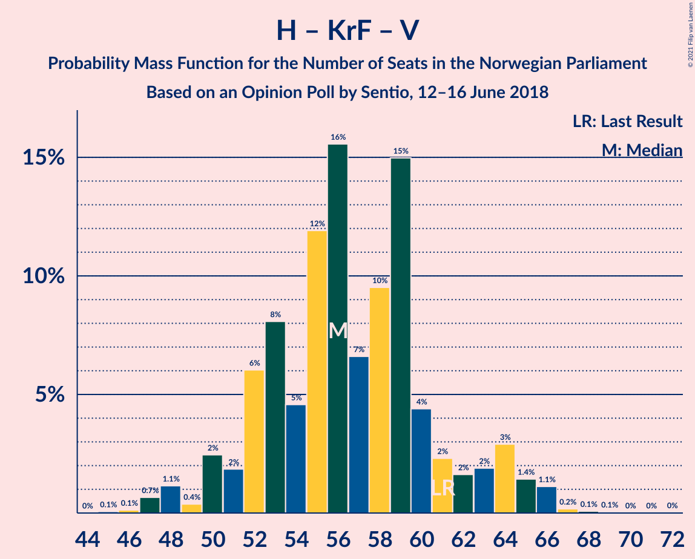

# Opinion Poll by Sentio, 12–16 June 2018

<a href="#voting-intentions">Voting Intentions</a> | <a href="#seats">Seats</a> | <a href="#coalitions">Coalitions</a> | <a href="#technical-information">Technical Information</a>

## Voting Intentions

### Confidence Intervals

| Party | Last Result | Poll Result | 80% Confidence Interval | 90% Confidence Interval | 95% Confidence Interval | 99% Confidence Interval |
|:-----:|:-----------:|:-----------:|:-----------------------:|:-----------------------:|:-----------------------:|:-----------------------:|
| Høyre | 25.0% | 27.0% | 24.9–29.2% |24.3–29.8% |23.8–30.4% |22.9–31.5% |
| Arbeiderpartiet | 27.4% | 25.1% | 23.1–27.3% |22.6–28.0% |22.1–28.5% |21.1–29.6% |
| Fremskrittspartiet | 15.2% | 13.9% | 12.4–15.7% |11.9–16.2% |11.6–16.7% |10.9–17.6% |
| Senterpartiet | 10.3% | 10.2% | 8.9–11.8% |8.5–12.3% |8.2–12.7% |7.6–13.5% |
| Sosialistisk Venstreparti | 6.0% | 7.2% | 6.1–8.7% |5.8–9.1% |5.5–9.4% |5.1–10.1% |
| Rødt | 2.4% | 5.3% | 4.3–6.5% |4.1–6.9% |3.8–7.2% |3.4–7.8% |
| Kristelig Folkeparti | 4.2% | 4.1% | 3.3–5.3% |3.1–5.6% |2.9–5.9% |2.5–6.4% |
| Venstre | 4.4% | 3.1% | 2.4–4.1% |2.2–4.4% |2.1–4.7% |1.8–5.2% |
| Miljøpartiet De Grønne | 3.2% | 2.1% | 1.6–3.0% |1.4–3.3% |1.3–3.5% |1.1–4.0% |

*Note:* The poll result column reflects the actual value used in the calculations. Published results may vary slightly, and in addition be rounded to fewer digits.

## Seats

### Confidence Intervals

| Party | Last Result | Median | 80% Confidence Interval | 90% Confidence Interval | 95% Confidence Interval | 99% Confidence Interval |
|:-----:|:-----------:|:------:|:-----------------------:|:-----------------------:|:-----------------------:|:-----------------------:|
| <a href="#høyre">Høyre</a> | 45 | 47 | 45–53 |43–54 |42–55 |40–56 |
| <a href="#arbeiderpartiet">Arbeiderpartiet</a> | 49 | 45 | 41–51 |41–51 |40–51 |39–54 |
| <a href="#fremskrittspartiet">Fremskrittspartiet</a> | 27 | 25 | 23–28 |22–30 |21–30 |19–31 |
| <a href="#senterpartiet">Senterpartiet</a> | 19 | 18 | 16–20 |15–21 |15–23 |13–24 |
| <a href="#sosialistisk-venstreparti">Sosialistisk Venstreparti</a> | 11 | 12 | 11–15 |11–16 |10–16 |9–18 |
| <a href="#rødt">Rødt</a> | 1 | 11 | 8–12 |2–12 |2–12 |2–13 |
| <a href="#kristelig-folkeparti">Kristelig Folkeparti</a> | 8 | 8 | 1–9 |1–9 |1–10 |1–11 |
| <a href="#venstre">Venstre</a> | 8 | 2 | 1–8 |1–8 |1–8 |0–9 |
| <a href="#miljøpartiet-de-grønne">Miljøpartiet De Grønne</a> | 1 | 1 | 0–1 |0–2 |0–2 |0–7 |

### Høyre

*For a full overview of the results for this party, see the [Høyre](party-høyre.html) page.*

| Number of Seats | Probability | Accumulated | Special Marks |
|:---------------:|:-----------:|:-----------:|:-------------:|
| 39 | 0.1% | 100% |  |
| 40 | 0.5% | 99.9% |  |
| 41 | 0.8% | 99.4% |  |
| 42 | 1.4% | 98.6% |  |
| 43 | 4% | 97% |  |
| 44 | 3% | 94% |  |
| 45 | 8% | 91% | Last Result |
| 46 | 31% | 82% |  |
| 47 | 2% | 52% | Median |
| 48 | 13% | 49% |  |
| 49 | 17% | 36% |  |
| 50 | 2% | 19% |  |
| 51 | 4% | 17% |  |
| 52 | 1.4% | 12% |  |
| 53 | 5% | 11% |  |
| 54 | 0.9% | 6% |  |
| 55 | 4% | 5% |  |
| 56 | 0.3% | 0.7% |  |
| 57 | 0.1% | 0.4% |  |
| 58 | 0.1% | 0.2% |  |
| 59 | 0% | 0.1% |  |
| 60 | 0% | 0.1% |  |
| 61 | 0.1% | 0.1% |  |
| 62 | 0% | 0% |  |

### Arbeiderpartiet

*For a full overview of the results for this party, see the [Arbeiderpartiet](party-arbeiderpartiet.html) page.*

| Number of Seats | Probability | Accumulated | Special Marks |
|:---------------:|:-----------:|:-----------:|:-------------:|
| 37 | 0.1% | 100% |  |
| 38 | 0.1% | 99.9% |  |
| 39 | 1.2% | 99.8% |  |
| 40 | 1.1% | 98.6% |  |
| 41 | 8% | 97% |  |
| 42 | 11% | 89% |  |
| 43 | 5% | 78% |  |
| 44 | 13% | 73% |  |
| 45 | 28% | 60% | Median |
| 46 | 6% | 32% |  |
| 47 | 4% | 27% |  |
| 48 | 5% | 23% |  |
| 49 | 4% | 18% | Last Result |
| 50 | 3% | 14% |  |
| 51 | 9% | 12% |  |
| 52 | 0.6% | 2% |  |
| 53 | 1.1% | 2% |  |
| 54 | 0.5% | 0.7% |  |
| 55 | 0% | 0.2% |  |
| 56 | 0.1% | 0.1% |  |
| 57 | 0% | 0% |  |

### Fremskrittspartiet

*For a full overview of the results for this party, see the [Fremskrittspartiet](party-fremskrittspartiet.html) page.*

| Number of Seats | Probability | Accumulated | Special Marks |
|:---------------:|:-----------:|:-----------:|:-------------:|
| 18 | 0.1% | 100% |  |
| 19 | 1.1% | 99.9% |  |
| 20 | 0.7% | 98.8% |  |
| 21 | 2% | 98% |  |
| 22 | 3% | 96% |  |
| 23 | 5% | 94% |  |
| 24 | 8% | 89% |  |
| 25 | 46% | 81% | Median |
| 26 | 9% | 35% |  |
| 27 | 13% | 26% | Last Result |
| 28 | 6% | 14% |  |
| 29 | 2% | 7% |  |
| 30 | 4% | 5% |  |
| 31 | 1.3% | 2% |  |
| 32 | 0.2% | 0.3% |  |
| 33 | 0.1% | 0.1% |  |
| 34 | 0% | 0.1% |  |
| 35 | 0% | 0% |  |

### Senterpartiet

*For a full overview of the results for this party, see the [Senterpartiet](party-senterpartiet.html) page.*

| Number of Seats | Probability | Accumulated | Special Marks |
|:---------------:|:-----------:|:-----------:|:-------------:|
| 12 | 0.1% | 100% |  |
| 13 | 0.8% | 99.9% |  |
| 14 | 1.1% | 99.1% |  |
| 15 | 4% | 98% |  |
| 16 | 7% | 94% |  |
| 17 | 12% | 87% |  |
| 18 | 46% | 75% | Median |
| 19 | 5% | 29% | Last Result |
| 20 | 15% | 25% |  |
| 21 | 6% | 10% |  |
| 22 | 1.0% | 4% |  |
| 23 | 0.6% | 3% |  |
| 24 | 2% | 2% |  |
| 25 | 0.3% | 0.4% |  |
| 26 | 0.1% | 0.1% |  |
| 27 | 0% | 0% |  |

### Sosialistisk Venstreparti

*For a full overview of the results for this party, see the [Sosialistisk Venstreparti](party-sosialistiskvenstreparti.html) page.*

| Number of Seats | Probability | Accumulated | Special Marks |
|:---------------:|:-----------:|:-----------:|:-------------:|
| 8 | 0.1% | 100% |  |
| 9 | 0.8% | 99.9% |  |
| 10 | 3% | 99.0% |  |
| 11 | 13% | 96% | Last Result |
| 12 | 34% | 83% | Median |
| 13 | 26% | 49% |  |
| 14 | 7% | 23% |  |
| 15 | 7% | 16% |  |
| 16 | 7% | 8% |  |
| 17 | 0.8% | 1.5% |  |
| 18 | 0.4% | 0.7% |  |
| 19 | 0.3% | 0.3% |  |
| 20 | 0% | 0% |  |

### Rødt

*For a full overview of the results for this party, see the [Rødt](party-rødt.html) page.*

| Number of Seats | Probability | Accumulated | Special Marks |
|:---------------:|:-----------:|:-----------:|:-------------:|
| 1 | 0% | 100% | Last Result |
| 2 | 5% | 100% |  |
| 3 | 0% | 95% |  |
| 4 | 0% | 95% |  |
| 5 | 0% | 95% |  |
| 6 | 0% | 95% |  |
| 7 | 2% | 95% |  |
| 8 | 12% | 92% |  |
| 9 | 17% | 80% |  |
| 10 | 12% | 63% |  |
| 11 | 25% | 50% | Median |
| 12 | 23% | 26% |  |
| 13 | 2% | 2% |  |
| 14 | 0.2% | 0.2% |  |
| 15 | 0% | 0.1% |  |
| 16 | 0% | 0% |  |

### Kristelig Folkeparti

*For a full overview of the results for this party, see the [Kristelig Folkeparti](party-kristeligfolkeparti.html) page.*

| Number of Seats | Probability | Accumulated | Special Marks |
|:---------------:|:-----------:|:-----------:|:-------------:|
| 0 | 0.1% | 100% |  |
| 1 | 12% | 99.9% |  |
| 2 | 2% | 88% |  |
| 3 | 22% | 86% |  |
| 4 | 0% | 64% |  |
| 5 | 0% | 64% |  |
| 6 | 0% | 64% |  |
| 7 | 1.4% | 64% |  |
| 8 | 50% | 63% | Last Result, Median |
| 9 | 9% | 13% |  |
| 10 | 2% | 3% |  |
| 11 | 1.0% | 1.4% |  |
| 12 | 0.3% | 0.4% |  |
| 13 | 0.1% | 0.1% |  |
| 14 | 0% | 0% |  |

### Venstre

*For a full overview of the results for this party, see the [Venstre](party-venstre.html) page.*

| Number of Seats | Probability | Accumulated | Special Marks |
|:---------------:|:-----------:|:-----------:|:-------------:|
| 0 | 0.5% | 100% |  |
| 1 | 13% | 99.5% |  |
| 2 | 72% | 87% | Median |
| 3 | 1.1% | 15% |  |
| 4 | 0% | 14% |  |
| 5 | 0% | 14% |  |
| 6 | 0% | 14% |  |
| 7 | 3% | 14% |  |
| 8 | 10% | 11% | Last Result |
| 9 | 0.9% | 1.1% |  |
| 10 | 0.1% | 0.2% |  |
| 11 | 0.1% | 0.1% |  |
| 12 | 0% | 0% |  |

### Miljøpartiet De Grønne

*For a full overview of the results for this party, see the [Miljøpartiet De Grønne](party-miljøpartietdegrønne.html) page.*

| Number of Seats | Probability | Accumulated | Special Marks |
|:---------------:|:-----------:|:-----------:|:-------------:|
| 0 | 25% | 100% |  |
| 1 | 69% | 75% | Last Result, Median |
| 2 | 6% | 7% |  |
| 3 | 0.4% | 1.0% |  |
| 4 | 0% | 0.6% |  |
| 5 | 0% | 0.6% |  |
| 6 | 0% | 0.6% |  |
| 7 | 0.6% | 0.6% |  |
| 8 | 0.1% | 0.1% |  |
| 9 | 0% | 0% |  |

## Coalitions

### Confidence Intervals

| Coalition | Last Result | Median | Majority? | 80% Confidence Interval | 90% Confidence Interval | 95% Confidence Interval | 99% Confidence Interval |
|:---------:|:-----------:|:------:|:---------:|:-----------------------:|:-----------------------:|:-----------------------:|:-----------------------:|
| Høyre – Fremskrittspartiet – Senterpartiet – Kristelig Folkeparti – Venstre | 107 | 100 | 100% | 97–105 | 94–106 | 93–108 | 92–109 |
| Arbeiderpartiet – Senterpartiet – Sosialistisk Venstreparti – Rødt – Miljøpartiet De Grønne | 81 | 88 | 79% | 81–90 | 81–92 | 80–95 | 78–97 |
| Arbeiderpartiet – Senterpartiet – Sosialistisk Venstreparti – Rødt | 80 | 87 | 66% | 81–90 | 80–92 | 79–94 | 77–96 |
| Arbeiderpartiet – Senterpartiet – Sosialistisk Venstreparti – Kristelig Folkeparti – Miljøpartiet De Grønne | 88 | 84 | 30% | 79–87 | 78–89 | 75–90 | 74–93 |
| Høyre – Fremskrittspartiet – Kristelig Folkeparti – Venstre – Miljøpartiet De Grønne | 89 | 82 | 33% | 79–88 | 77–89 | 75–90 | 73–92 |
| Høyre – Fremskrittspartiet – Kristelig Folkeparti – Venstre | 88 | 81 | 21% | 79–88 | 77–88 | 74–89 | 72–91 |
| Arbeiderpartiet – Senterpartiet – Sosialistisk Venstreparti – Miljøpartiet De Grønne | 80 | 77 | 3% | 72–81 | 70–83 | 70–85 | 69–87 |
| Arbeiderpartiet – Senterpartiet – Sosialistisk Venstreparti | 79 | 76 | 3% | 71–81 | 69–82 | 69–85 | 68–87 |
| Høyre – Fremskrittspartiet – Venstre | 80 | 76 | 1.0% | 72–80 | 72–82 | 70–83 | 68–85 |
| Høyre – Fremskrittspartiet | 72 | 72 | 0.2% | 69–78 | 67–80 | 67–81 | 65–82 |
| Arbeiderpartiet – Senterpartiet – Kristelig Folkeparti – Miljøpartiet De Grønne | 77 | 71 | 0% | 66–74 | 65–76 | 62–77 | 61–79 |
| Arbeiderpartiet – Senterpartiet – Kristelig Folkeparti | 76 | 70 | 0% | 65–74 | 64–75 | 61–76 | 61–78 |
| Arbeiderpartiet – Senterpartiet | 68 | 63 | 0% | 58–69 | 58–69 | 58–71 | 56–73 |
| Arbeiderpartiet – Sosialistisk Venstreparti | 60 | 57 | 0% | 55–63 | 52–64 | 52–65 | 50–69 |
| Høyre – Kristelig Folkeparti – Venstre | 61 | 56 | 0% | 52–62 | 50–64 | 48–65 | 47–66 |
| Senterpartiet – Kristelig Folkeparti – Venstre | 35 | 28 | 0% | 21–32 | 21–33 | 20–34 | 17–36 |

### Høyre – Fremskrittspartiet – Senterpartiet – Kristelig Folkeparti – Venstre

| Number of Seats | Probability | Accumulated | Special Marks |
|:---------------:|:-----------:|:-----------:|:-------------:|
| 89 | 0.2% | 100% |  |
| 90 | 0.1% | 99.8% |  |
| 91 | 0% | 99.7% |  |
| 92 | 2% | 99.7% |  |
| 93 | 1.0% | 98% |  |
| 94 | 2% | 97% |  |
| 95 | 0.9% | 95% |  |
| 96 | 3% | 94% |  |
| 97 | 10% | 91% |  |
| 98 | 6% | 82% |  |
| 99 | 24% | 75% |  |
| 100 | 12% | 51% | Median |
| 101 | 3% | 39% |  |
| 102 | 16% | 36% |  |
| 103 | 4% | 20% |  |
| 104 | 3% | 16% |  |
| 105 | 7% | 13% |  |
| 106 | 2% | 6% |  |
| 107 | 0.7% | 4% | Last Result |
| 108 | 1.1% | 3% |  |
| 109 | 2% | 2% |  |
| 110 | 0.1% | 0.3% |  |
| 111 | 0% | 0.2% |  |
| 112 | 0.1% | 0.2% |  |
| 113 | 0.1% | 0.1% |  |
| 114 | 0% | 0.1% |  |
| 115 | 0% | 0.1% |  |
| 116 | 0.1% | 0.1% |  |
| 117 | 0% | 0% |  |

### Arbeiderpartiet – Senterpartiet – Sosialistisk Venstreparti – Rødt – Miljøpartiet De Grønne

| Number of Seats | Probability | Accumulated | Special Marks |
|:---------------:|:-----------:|:-----------:|:-------------:|
| 72 | 0.1% | 100% |  |
| 73 | 0% | 99.9% |  |
| 74 | 0% | 99.9% |  |
| 75 | 0.1% | 99.9% |  |
| 76 | 0.1% | 99.9% |  |
| 77 | 0.2% | 99.8% |  |
| 78 | 0.1% | 99.5% |  |
| 79 | 1.3% | 99.4% |  |
| 80 | 2% | 98% |  |
| 81 | 7% | 96% | Last Result |
| 82 | 3% | 89% |  |
| 83 | 4% | 86% |  |
| 84 | 3% | 82% |  |
| 85 | 12% | 79% | Majority |
| 86 | 3% | 67% |  |
| 87 | 3% | 63% | Median |
| 88 | 26% | 60% |  |
| 89 | 16% | 34% |  |
| 90 | 9% | 18% |  |
| 91 | 3% | 9% |  |
| 92 | 1.4% | 6% |  |
| 93 | 2% | 5% |  |
| 94 | 0.9% | 3% |  |
| 95 | 0.6% | 3% |  |
| 96 | 0.4% | 2% |  |
| 97 | 1.2% | 1.5% |  |
| 98 | 0.2% | 0.3% |  |
| 99 | 0% | 0% |  |

### Arbeiderpartiet – Senterpartiet – Sosialistisk Venstreparti – Rødt

| Number of Seats | Probability | Accumulated | Special Marks |
|:---------------:|:-----------:|:-----------:|:-------------:|
| 72 | 0.1% | 100% |  |
| 73 | 0% | 99.9% |  |
| 74 | 0.1% | 99.9% |  |
| 75 | 0% | 99.9% |  |
| 76 | 0.1% | 99.8% |  |
| 77 | 0.3% | 99.7% |  |
| 78 | 1.2% | 99.4% |  |
| 79 | 2% | 98% |  |
| 80 | 5% | 96% | Last Result |
| 81 | 5% | 91% |  |
| 82 | 4% | 86% |  |
| 83 | 4% | 83% |  |
| 84 | 12% | 78% |  |
| 85 | 4% | 66% | Majority |
| 86 | 2% | 63% | Median |
| 87 | 24% | 61% |  |
| 88 | 16% | 37% |  |
| 89 | 5% | 20% |  |
| 90 | 9% | 15% |  |
| 91 | 1.3% | 7% |  |
| 92 | 1.4% | 5% |  |
| 93 | 0.9% | 4% |  |
| 94 | 0.6% | 3% |  |
| 95 | 0.8% | 2% |  |
| 96 | 1.2% | 1.5% |  |
| 97 | 0.2% | 0.3% |  |
| 98 | 0.1% | 0.1% |  |
| 99 | 0% | 0% |  |

### Arbeiderpartiet – Senterpartiet – Sosialistisk Venstreparti – Kristelig Folkeparti – Miljøpartiet De Grønne

| Number of Seats | Probability | Accumulated | Special Marks |
|:---------------:|:-----------:|:-----------:|:-------------:|
| 73 | 0.1% | 100% |  |
| 74 | 2% | 99.9% |  |
| 75 | 0.7% | 98% |  |
| 76 | 0.9% | 97% |  |
| 77 | 0.8% | 96% |  |
| 78 | 5% | 95% |  |
| 79 | 4% | 90% |  |
| 80 | 4% | 86% |  |
| 81 | 6% | 82% |  |
| 82 | 16% | 76% |  |
| 83 | 6% | 60% |  |
| 84 | 23% | 54% | Median |
| 85 | 4% | 30% | Majority |
| 86 | 12% | 26% |  |
| 87 | 5% | 14% |  |
| 88 | 1.3% | 9% | Last Result |
| 89 | 5% | 7% |  |
| 90 | 1.1% | 3% |  |
| 91 | 0.6% | 2% |  |
| 92 | 0.3% | 1.0% |  |
| 93 | 0.3% | 0.7% |  |
| 94 | 0.3% | 0.4% |  |
| 95 | 0% | 0.1% |  |
| 96 | 0% | 0.1% |  |
| 97 | 0.1% | 0.1% |  |
| 98 | 0% | 0% |  |

### Høyre – Fremskrittspartiet – Kristelig Folkeparti – Venstre – Miljøpartiet De Grønne

| Number of Seats | Probability | Accumulated | Special Marks |
|:---------------:|:-----------:|:-----------:|:-------------:|
| 71 | 0.1% | 100% |  |
| 72 | 0.2% | 99.9% |  |
| 73 | 1.2% | 99.7% |  |
| 74 | 0.8% | 98.5% |  |
| 75 | 0.6% | 98% |  |
| 76 | 0.9% | 97% |  |
| 77 | 1.4% | 96% |  |
| 78 | 1.3% | 95% |  |
| 79 | 9% | 93% |  |
| 80 | 5% | 85% |  |
| 81 | 16% | 79% |  |
| 82 | 24% | 63% |  |
| 83 | 2% | 39% | Median |
| 84 | 4% | 37% |  |
| 85 | 12% | 33% | Majority |
| 86 | 4% | 22% |  |
| 87 | 3% | 17% |  |
| 88 | 5% | 14% |  |
| 89 | 5% | 9% | Last Result |
| 90 | 2% | 4% |  |
| 91 | 1.2% | 2% |  |
| 92 | 0.3% | 0.6% |  |
| 93 | 0.1% | 0.3% |  |
| 94 | 0% | 0.2% |  |
| 95 | 0.1% | 0.1% |  |
| 96 | 0% | 0.1% |  |
| 97 | 0.1% | 0.1% |  |
| 98 | 0% | 0% |  |

### Høyre – Fremskrittspartiet – Kristelig Folkeparti – Venstre

| Number of Seats | Probability | Accumulated | Special Marks |
|:---------------:|:-----------:|:-----------:|:-------------:|
| 71 | 0.2% | 100% |  |
| 72 | 1.2% | 99.7% |  |
| 73 | 0.4% | 98.5% |  |
| 74 | 0.6% | 98% |  |
| 75 | 0.9% | 97% |  |
| 76 | 2% | 97% |  |
| 77 | 1.4% | 95% |  |
| 78 | 3% | 94% |  |
| 79 | 9% | 91% |  |
| 80 | 16% | 82% |  |
| 81 | 26% | 65% |  |
| 82 | 3% | 40% | Median |
| 83 | 3% | 37% |  |
| 84 | 12% | 33% |  |
| 85 | 3% | 21% | Majority |
| 86 | 4% | 18% |  |
| 87 | 3% | 14% |  |
| 88 | 7% | 11% | Last Result |
| 89 | 2% | 4% |  |
| 90 | 1.3% | 2% |  |
| 91 | 0.1% | 0.6% |  |
| 92 | 0.2% | 0.5% |  |
| 93 | 0.1% | 0.2% |  |
| 94 | 0% | 0.1% |  |
| 95 | 0% | 0.1% |  |
| 96 | 0% | 0.1% |  |
| 97 | 0.1% | 0.1% |  |
| 98 | 0% | 0% |  |

### Arbeiderpartiet – Senterpartiet – Sosialistisk Venstreparti – Miljøpartiet De Grønne

| Number of Seats | Probability | Accumulated | Special Marks |
|:---------------:|:-----------:|:-----------:|:-------------:|
| 67 | 0.1% | 100% |  |
| 68 | 0.3% | 99.9% |  |
| 69 | 0.9% | 99.6% |  |
| 70 | 5% | 98.7% |  |
| 71 | 3% | 94% |  |
| 72 | 2% | 91% |  |
| 73 | 1.3% | 89% |  |
| 74 | 9% | 87% |  |
| 75 | 3% | 78% |  |
| 76 | 23% | 75% | Median |
| 77 | 4% | 52% |  |
| 78 | 16% | 48% |  |
| 79 | 4% | 32% |  |
| 80 | 11% | 28% | Last Result |
| 81 | 8% | 17% |  |
| 82 | 3% | 9% |  |
| 83 | 1.4% | 6% |  |
| 84 | 1.3% | 5% |  |
| 85 | 0.8% | 3% | Majority |
| 86 | 2% | 2% |  |
| 87 | 0.7% | 0.9% |  |
| 88 | 0% | 0.2% |  |
| 89 | 0.1% | 0.2% |  |
| 90 | 0% | 0% |  |

### Arbeiderpartiet – Senterpartiet – Sosialistisk Venstreparti

| Number of Seats | Probability | Accumulated | Special Marks |
|:---------------:|:-----------:|:-----------:|:-------------:|
| 66 | 0.1% | 100% |  |
| 67 | 0.1% | 99.9% |  |
| 68 | 1.1% | 99.8% |  |
| 69 | 5% | 98.7% |  |
| 70 | 0.3% | 94% |  |
| 71 | 4% | 93% |  |
| 72 | 2% | 90% |  |
| 73 | 9% | 88% |  |
| 74 | 5% | 79% |  |
| 75 | 23% | 74% | Median |
| 76 | 4% | 51% |  |
| 77 | 14% | 47% |  |
| 78 | 5% | 34% |  |
| 79 | 9% | 28% | Last Result |
| 80 | 3% | 20% |  |
| 81 | 10% | 16% |  |
| 82 | 1.1% | 6% |  |
| 83 | 2% | 5% |  |
| 84 | 0.3% | 3% |  |
| 85 | 2% | 3% | Majority |
| 86 | 0.2% | 0.9% |  |
| 87 | 0.5% | 0.7% |  |
| 88 | 0.1% | 0.2% |  |
| 89 | 0% | 0% |  |

### Høyre – Fremskrittspartiet – Venstre

| Number of Seats | Probability | Accumulated | Special Marks |
|:---------------:|:-----------:|:-----------:|:-------------:|
| 63 | 0.1% | 100% |  |
| 64 | 0% | 99.9% |  |
| 65 | 0% | 99.9% |  |
| 66 | 0.1% | 99.9% |  |
| 67 | 0.2% | 99.8% |  |
| 68 | 0.6% | 99.6% |  |
| 69 | 1.3% | 99.0% |  |
| 70 | 0.9% | 98% |  |
| 71 | 2% | 97% |  |
| 72 | 12% | 95% |  |
| 73 | 22% | 83% |  |
| 74 | 4% | 61% | Median |
| 75 | 5% | 57% |  |
| 76 | 10% | 52% |  |
| 77 | 6% | 42% |  |
| 78 | 13% | 36% |  |
| 79 | 1.3% | 23% |  |
| 80 | 13% | 22% | Last Result |
| 81 | 2% | 9% |  |
| 82 | 2% | 6% |  |
| 83 | 3% | 4% |  |
| 84 | 0.5% | 1.5% |  |
| 85 | 0.5% | 1.0% | Majority |
| 86 | 0.2% | 0.5% |  |
| 87 | 0.2% | 0.3% |  |
| 88 | 0% | 0.1% |  |
| 89 | 0.1% | 0.1% |  |
| 90 | 0% | 0% |  |

### Høyre – Fremskrittspartiet

| Number of Seats | Probability | Accumulated | Special Marks |
|:---------------:|:-----------:|:-----------:|:-------------:|
| 61 | 0.1% | 100% |  |
| 62 | 0% | 99.9% |  |
| 63 | 0.1% | 99.9% |  |
| 64 | 0.2% | 99.8% |  |
| 65 | 0.4% | 99.6% |  |
| 66 | 0.8% | 99.2% |  |
| 67 | 4% | 98% |  |
| 68 | 2% | 94% |  |
| 69 | 3% | 93% |  |
| 70 | 4% | 90% |  |
| 71 | 29% | 86% |  |
| 72 | 9% | 57% | Last Result, Median |
| 73 | 4% | 48% |  |
| 74 | 9% | 43% |  |
| 75 | 6% | 34% |  |
| 76 | 13% | 28% |  |
| 77 | 0.9% | 14% |  |
| 78 | 5% | 14% |  |
| 79 | 3% | 9% |  |
| 80 | 2% | 5% |  |
| 81 | 3% | 4% |  |
| 82 | 0.7% | 1.0% |  |
| 83 | 0% | 0.3% |  |
| 84 | 0.1% | 0.3% |  |
| 85 | 0% | 0.2% | Majority |
| 86 | 0.1% | 0.2% |  |
| 87 | 0.1% | 0.1% |  |
| 88 | 0% | 0% |  |

### Arbeiderpartiet – Senterpartiet – Kristelig Folkeparti – Miljøpartiet De Grønne

| Number of Seats | Probability | Accumulated | Special Marks |
|:---------------:|:-----------:|:-----------:|:-------------:|
| 59 | 0% | 100% |  |
| 60 | 0.3% | 99.9% |  |
| 61 | 2% | 99.7% |  |
| 62 | 0.2% | 98% |  |
| 63 | 0.6% | 97% |  |
| 64 | 1.2% | 97% |  |
| 65 | 1.2% | 96% |  |
| 66 | 6% | 94% |  |
| 67 | 8% | 89% |  |
| 68 | 5% | 80% |  |
| 69 | 11% | 76% |  |
| 70 | 13% | 64% |  |
| 71 | 5% | 52% |  |
| 72 | 21% | 47% | Median |
| 73 | 12% | 26% |  |
| 74 | 4% | 14% |  |
| 75 | 4% | 10% |  |
| 76 | 3% | 6% |  |
| 77 | 0.8% | 3% | Last Result |
| 78 | 1.1% | 2% |  |
| 79 | 0.4% | 0.8% |  |
| 80 | 0.1% | 0.4% |  |
| 81 | 0% | 0.3% |  |
| 82 | 0% | 0.3% |  |
| 83 | 0.2% | 0.3% |  |
| 84 | 0.1% | 0.1% |  |
| 85 | 0% | 0% | Majority |

### Arbeiderpartiet – Senterpartiet – Kristelig Folkeparti

| Number of Seats | Probability | Accumulated | Special Marks |
|:---------------:|:-----------:|:-----------:|:-------------:|
| 58 | 0% | 100% |  |
| 59 | 0.2% | 99.9% |  |
| 60 | 0.1% | 99.7% |  |
| 61 | 2% | 99.6% |  |
| 62 | 0.1% | 97% |  |
| 63 | 0.7% | 97% |  |
| 64 | 3% | 97% |  |
| 65 | 4% | 93% |  |
| 66 | 8% | 89% |  |
| 67 | 4% | 81% |  |
| 68 | 15% | 77% |  |
| 69 | 2% | 62% |  |
| 70 | 13% | 60% |  |
| 71 | 22% | 47% | Median |
| 72 | 10% | 25% |  |
| 73 | 5% | 15% |  |
| 74 | 4% | 10% |  |
| 75 | 1.2% | 6% |  |
| 76 | 3% | 5% | Last Result |
| 77 | 1.0% | 2% |  |
| 78 | 0.4% | 0.8% |  |
| 79 | 0% | 0.4% |  |
| 80 | 0.1% | 0.4% |  |
| 81 | 0% | 0.3% |  |
| 82 | 0.2% | 0.3% |  |
| 83 | 0.1% | 0.1% |  |
| 84 | 0% | 0% |  |

### Arbeiderpartiet – Senterpartiet

| Number of Seats | Probability | Accumulated | Special Marks |
|:---------------:|:-----------:|:-----------:|:-------------:|
| 53 | 0.1% | 100% |  |
| 54 | 0.1% | 99.9% |  |
| 55 | 0.1% | 99.8% |  |
| 56 | 0.5% | 99.7% |  |
| 57 | 1.4% | 99.2% |  |
| 58 | 8% | 98% |  |
| 59 | 2% | 90% |  |
| 60 | 10% | 88% |  |
| 61 | 3% | 79% |  |
| 62 | 6% | 76% |  |
| 63 | 27% | 69% | Median |
| 64 | 12% | 42% |  |
| 65 | 6% | 30% |  |
| 66 | 0.9% | 24% |  |
| 67 | 7% | 23% |  |
| 68 | 3% | 16% | Last Result |
| 69 | 9% | 12% |  |
| 70 | 0.7% | 4% |  |
| 71 | 2% | 3% |  |
| 72 | 0.9% | 2% |  |
| 73 | 0.3% | 0.6% |  |
| 74 | 0.1% | 0.3% |  |
| 75 | 0.2% | 0.2% |  |
| 76 | 0% | 0% |  |

### Arbeiderpartiet – Sosialistisk Venstreparti

| Number of Seats | Probability | Accumulated | Special Marks |
|:---------------:|:-----------:|:-----------:|:-------------:|
| 49 | 0% | 100% |  |
| 50 | 1.0% | 99.9% |  |
| 51 | 0.8% | 98.9% |  |
| 52 | 5% | 98% |  |
| 53 | 0.6% | 93% |  |
| 54 | 2% | 92% |  |
| 55 | 12% | 90% |  |
| 56 | 5% | 79% |  |
| 57 | 36% | 74% | Median |
| 58 | 2% | 38% |  |
| 59 | 6% | 36% |  |
| 60 | 4% | 30% | Last Result |
| 61 | 6% | 26% |  |
| 62 | 3% | 19% |  |
| 63 | 11% | 17% |  |
| 64 | 1.2% | 5% |  |
| 65 | 2% | 4% |  |
| 66 | 0.7% | 2% |  |
| 67 | 0.7% | 1.4% |  |
| 68 | 0% | 0.7% |  |
| 69 | 0.6% | 0.7% |  |
| 70 | 0% | 0% |  |

### Høyre – Kristelig Folkeparti – Venstre

| Number of Seats | Probability | Accumulated | Special Marks |
|:---------------:|:-----------:|:-----------:|:-------------:|
| 45 | 0.1% | 100% |  |
| 46 | 0.2% | 99.9% |  |
| 47 | 0.9% | 99.7% |  |
| 48 | 2% | 98.8% |  |
| 49 | 0.5% | 97% |  |
| 50 | 3% | 96% |  |
| 51 | 1.3% | 93% |  |
| 52 | 10% | 92% |  |
| 53 | 2% | 82% |  |
| 54 | 4% | 80% |  |
| 55 | 12% | 76% |  |
| 56 | 27% | 64% |  |
| 57 | 1.3% | 37% | Median |
| 58 | 5% | 36% |  |
| 59 | 13% | 31% |  |
| 60 | 4% | 18% |  |
| 61 | 1.2% | 14% | Last Result |
| 62 | 3% | 13% |  |
| 63 | 2% | 10% |  |
| 64 | 5% | 8% |  |
| 65 | 0.4% | 3% |  |
| 66 | 2% | 2% |  |
| 67 | 0.1% | 0.2% |  |
| 68 | 0% | 0.1% |  |
| 69 | 0.1% | 0.1% |  |
| 70 | 0% | 0% |  |

### Senterpartiet – Kristelig Folkeparti – Venstre

| Number of Seats | Probability | Accumulated | Special Marks |
|:---------------:|:-----------:|:-----------:|:-------------:|
| 17 | 0.7% | 100% |  |
| 18 | 0.1% | 99.3% |  |
| 19 | 0.3% | 99.2% |  |
| 20 | 2% | 98.9% |  |
| 21 | 12% | 97% |  |
| 22 | 3% | 86% |  |
| 23 | 6% | 83% |  |
| 24 | 2% | 76% |  |
| 25 | 4% | 74% |  |
| 26 | 3% | 71% |  |
| 27 | 5% | 67% |  |
| 28 | 30% | 62% | Median |
| 29 | 12% | 32% |  |
| 30 | 5% | 20% |  |
| 31 | 3% | 15% |  |
| 32 | 3% | 12% |  |
| 33 | 6% | 9% |  |
| 34 | 2% | 3% |  |
| 35 | 0.4% | 1.0% | Last Result |
| 36 | 0.2% | 0.5% |  |
| 37 | 0.1% | 0.3% |  |
| 38 | 0.2% | 0.2% |  |
| 39 | 0% | 0.1% |  |
| 40 | 0% | 0% |  |

## Technical Information

### Opinion Poll

+ **Polling firm:** Sentio
+ **Commissioner(s):** —
+ **Fieldwork period:** 12–16 June 2018

### Calculations

+ **Sample size:** 704
+ **Simulations done:** 131,072
+ **Error estimate:** 1.92%

