# Opinion Poll by Norstat, 19–25 June 2018

<a href="#voting-intentions">Voting Intentions</a> | <a href="#seats">Seats</a> | <a href="#coalitions">Coalitions</a> | <a href="#technical-information">Technical Information</a>

## Voting Intentions

### Confidence Intervals

| Party | Last Result | Poll Result | 80% Confidence Interval | 90% Confidence Interval | 95% Confidence Interval | 99% Confidence Interval |
|:-----:|:-----------:|:-----------:|:-----------------------:|:-----------------------:|:-----------------------:|:-----------------------:|
| Høyre | 25.0% | 27.8% | 26.0–29.8% |25.5–30.3% |25.1–30.8% |24.2–31.7% |
| Arbeiderpartiet | 27.4% | 21.5% | 19.8–23.3% |19.4–23.8% |19.0–24.2% |18.2–25.1% |
| Fremskrittspartiet | 15.2% | 13.6% | 12.3–15.1% |11.9–15.6% |11.6–16.0% |10.9–16.7% |
| Senterpartiet | 10.3% | 10.7% | 9.5–12.1% |9.2–12.5% |8.9–12.9% |8.4–13.6% |
| Sosialistisk Venstreparti | 6.0% | 7.5% | 6.5–8.8% |6.3–9.1% |6.0–9.4% |5.6–10.0% |
| Venstre | 4.4% | 5.1% | 4.3–6.1% |4.1–6.4% |3.9–6.7% |3.5–7.2% |
| Rødt | 2.4% | 4.9% | 4.1–5.9% |3.9–6.2% |3.7–6.5% |3.3–7.0% |
| Kristelig Folkeparti | 4.2% | 4.3% | 3.5–5.2% |3.3–5.5% |3.1–5.7% |2.8–6.2% |
| Miljøpartiet De Grønne | 3.2% | 2.6% | 2.0–3.4% |1.8–3.6% |1.7–3.8% |1.5–4.2% |

*Note:* The poll result column reflects the actual value used in the calculations. Published results may vary slightly, and in addition be rounded to fewer digits.

## Seats

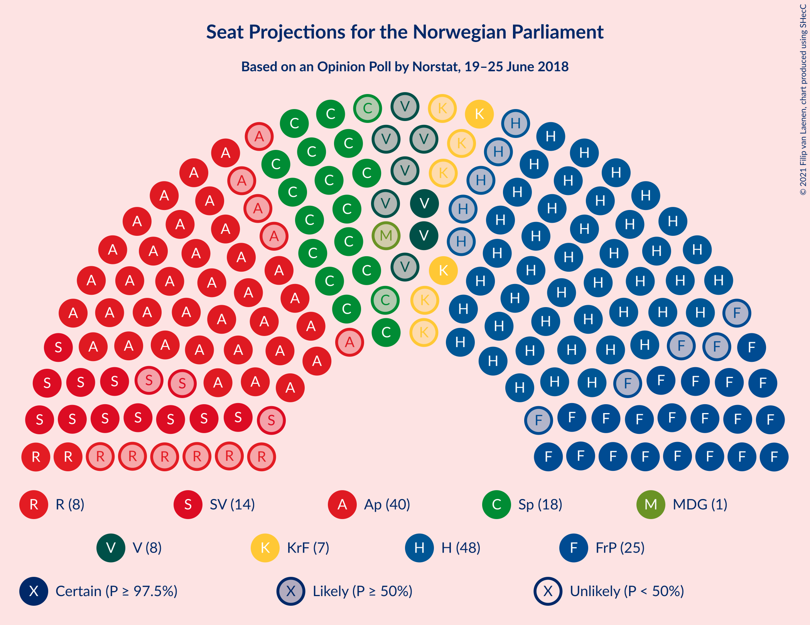

### Confidence Intervals

| Party | Last Result | Median | 80% Confidence Interval | 90% Confidence Interval | 95% Confidence Interval | 99% Confidence Interval |
|:-----:|:-----------:|:------:|:-----------------------:|:-----------------------:|:-----------------------:|:-----------------------:|
| <a href="#høyre">Høyre</a> | 45 | 49 | 45–52 |44–54 |43–55 |43–56 |
| <a href="#arbeiderpartiet">Arbeiderpartiet</a> | 49 | 40 | 37–42 |36–43 |35–43 |32–45 |
| <a href="#fremskrittspartiet">Fremskrittspartiet</a> | 27 | 25 | 21–27 |21–27 |20–28 |18–30 |
| <a href="#senterpartiet">Senterpartiet</a> | 19 | 18 | 17–21 |16–22 |16–22 |15–24 |
| <a href="#sosialistisk-venstreparti">Sosialistisk Venstreparti</a> | 11 | 14 | 11–15 |11–16 |11–16 |10–18 |
| <a href="#venstre">Venstre</a> | 8 | 9 | 7–11 |7–11 |2–12 |2–13 |
| <a href="#rødt">Rødt</a> | 1 | 8 | 7–11 |2–11 |2–11 |2–12 |
| <a href="#kristelig-folkeparti">Kristelig Folkeparti</a> | 8 | 7 | 3–9 |2–9 |2–10 |1–11 |
| <a href="#miljøpartiet-de-grønne">Miljøpartiet De Grønne</a> | 1 | 1 | 1–2 |0–2 |0–2 |0–7 |

### Høyre

*For a full overview of the results for this party, see the [Høyre](party-høyre.html) page.*

| Number of Seats | Probability | Accumulated | Special Marks |
|:---------------:|:-----------:|:-----------:|:-------------:|
| 41 | 0.1% | 100% |  |
| 42 | 0.1% | 99.9% |  |
| 43 | 2% | 99.7% |  |
| 44 | 3% | 97% |  |
| 45 | 4% | 94% | Last Result |
| 46 | 8% | 90% |  |
| 47 | 10% | 82% |  |
| 48 | 15% | 72% |  |
| 49 | 15% | 57% | Median |
| 50 | 9% | 42% |  |
| 51 | 14% | 33% |  |
| 52 | 9% | 19% |  |
| 53 | 4% | 9% |  |
| 54 | 3% | 6% |  |
| 55 | 2% | 3% |  |
| 56 | 0.6% | 1.1% |  |
| 57 | 0.3% | 0.5% |  |
| 58 | 0.1% | 0.2% |  |
| 59 | 0.1% | 0.1% |  |
| 60 | 0% | 0% |  |

### Arbeiderpartiet

*For a full overview of the results for this party, see the [Arbeiderpartiet](party-arbeiderpartiet.html) page.*

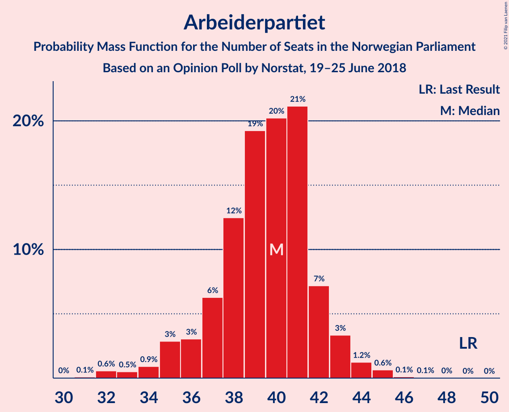

| Number of Seats | Probability | Accumulated | Special Marks |
|:---------------:|:-----------:|:-----------:|:-------------:|
| 30 | 0% | 100% |  |
| 31 | 0.1% | 99.9% |  |
| 32 | 0.6% | 99.9% |  |
| 33 | 0.5% | 99.3% |  |
| 34 | 0.9% | 98.8% |  |
| 35 | 3% | 98% |  |
| 36 | 3% | 95% |  |
| 37 | 6% | 92% |  |
| 38 | 12% | 86% |  |
| 39 | 19% | 73% |  |
| 40 | 20% | 54% | Median |
| 41 | 21% | 34% |  |
| 42 | 7% | 13% |  |
| 43 | 3% | 5% |  |
| 44 | 1.2% | 2% |  |
| 45 | 0.6% | 0.8% |  |
| 46 | 0.1% | 0.2% |  |
| 47 | 0.1% | 0.1% |  |
| 48 | 0% | 0% |  |
| 49 | 0% | 0% | Last Result |

### Fremskrittspartiet

*For a full overview of the results for this party, see the [Fremskrittspartiet](party-fremskrittspartiet.html) page.*

| Number of Seats | Probability | Accumulated | Special Marks |
|:---------------:|:-----------:|:-----------:|:-------------:|
| 17 | 0.1% | 100% |  |
| 18 | 0.4% | 99.9% |  |
| 19 | 0.8% | 99.5% |  |
| 20 | 4% | 98.7% |  |
| 21 | 6% | 95% |  |
| 22 | 8% | 89% |  |
| 23 | 13% | 81% |  |
| 24 | 13% | 68% |  |
| 25 | 36% | 56% | Median |
| 26 | 10% | 20% |  |
| 27 | 7% | 10% | Last Result |
| 28 | 2% | 4% |  |
| 29 | 1.0% | 2% |  |
| 30 | 0.5% | 0.7% |  |
| 31 | 0.1% | 0.2% |  |
| 32 | 0.1% | 0.1% |  |
| 33 | 0% | 0% |  |

### Senterpartiet

*For a full overview of the results for this party, see the [Senterpartiet](party-senterpartiet.html) page.*

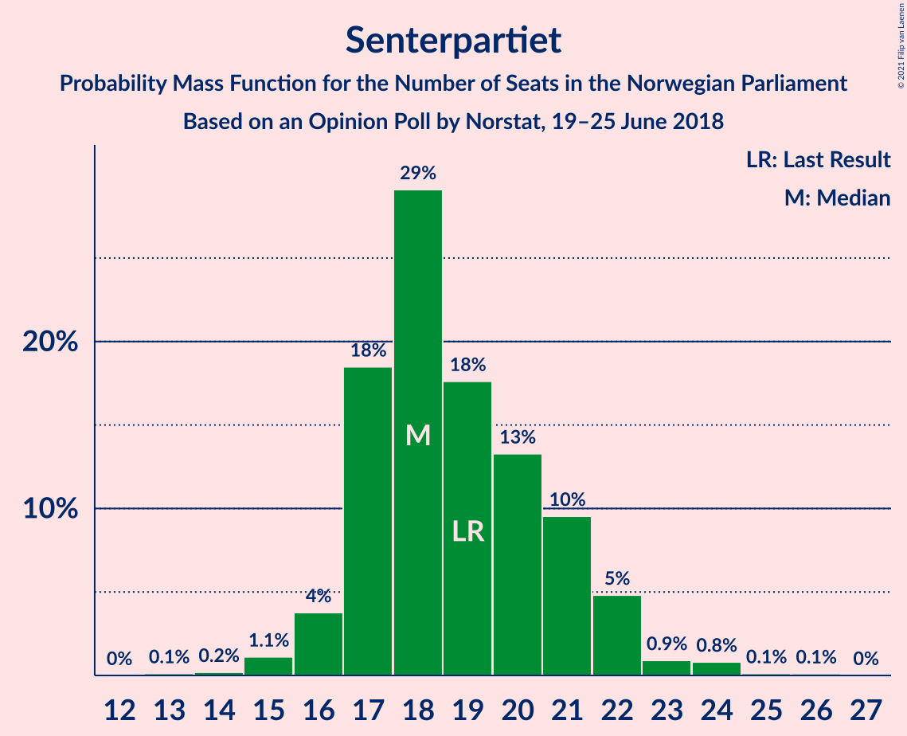

| Number of Seats | Probability | Accumulated | Special Marks |
|:---------------:|:-----------:|:-----------:|:-------------:|
| 13 | 0.1% | 100% |  |
| 14 | 0.2% | 99.9% |  |
| 15 | 1.1% | 99.7% |  |
| 16 | 4% | 98.6% |  |
| 17 | 18% | 95% |  |
| 18 | 29% | 76% | Median |
| 19 | 18% | 47% | Last Result |
| 20 | 13% | 30% |  |
| 21 | 10% | 16% |  |
| 22 | 5% | 7% |  |
| 23 | 0.9% | 2% |  |
| 24 | 0.8% | 1.0% |  |
| 25 | 0.1% | 0.2% |  |
| 26 | 0.1% | 0.1% |  |
| 27 | 0% | 0% |  |

### Sosialistisk Venstreparti

*For a full overview of the results for this party, see the [Sosialistisk Venstreparti](party-sosialistiskvenstreparti.html) page.*

| Number of Seats | Probability | Accumulated | Special Marks |
|:---------------:|:-----------:|:-----------:|:-------------:|
| 9 | 0.2% | 100% |  |
| 10 | 2% | 99.7% |  |
| 11 | 17% | 98% | Last Result |
| 12 | 16% | 81% |  |
| 13 | 14% | 64% |  |
| 14 | 26% | 50% | Median |
| 15 | 18% | 24% |  |
| 16 | 4% | 6% |  |
| 17 | 2% | 2% |  |
| 18 | 0.6% | 0.7% |  |
| 19 | 0.1% | 0.1% |  |
| 20 | 0% | 0% |  |

### Venstre

*For a full overview of the results for this party, see the [Venstre](party-venstre.html) page.*

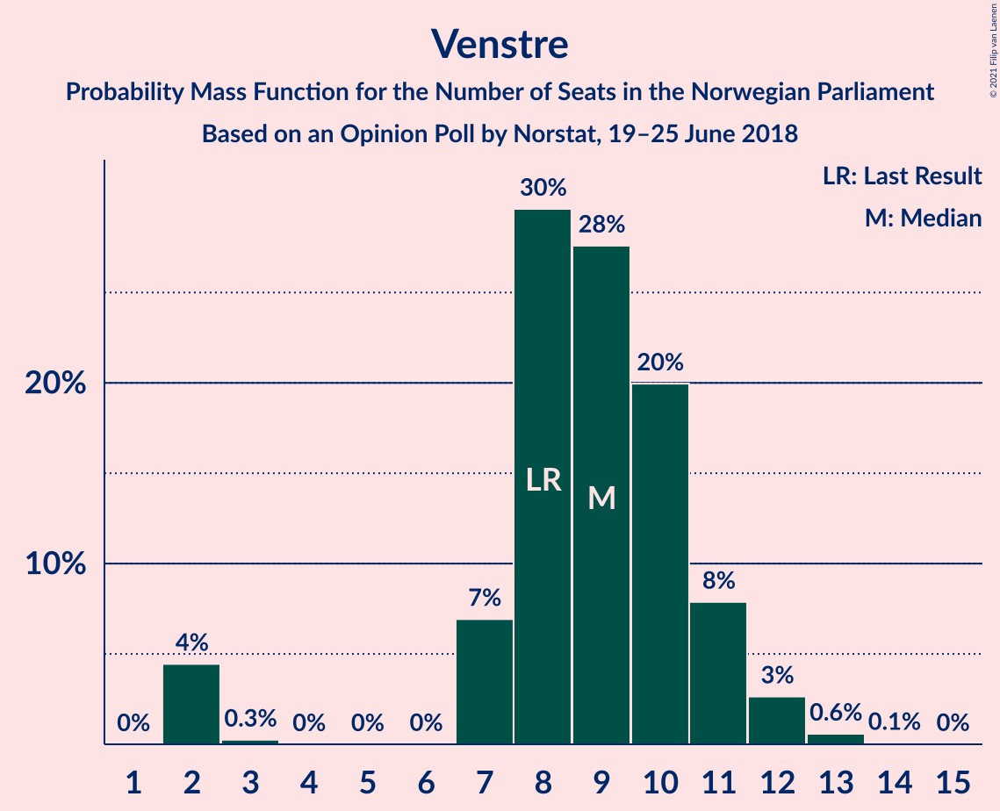

| Number of Seats | Probability | Accumulated | Special Marks |
|:---------------:|:-----------:|:-----------:|:-------------:|
| 2 | 4% | 100% |  |
| 3 | 0.3% | 96% |  |
| 4 | 0% | 95% |  |
| 5 | 0% | 95% |  |
| 6 | 0% | 95% |  |
| 7 | 7% | 95% |  |
| 8 | 30% | 88% | Last Result |
| 9 | 28% | 59% | Median |
| 10 | 20% | 31% |  |
| 11 | 8% | 11% |  |
| 12 | 3% | 3% |  |
| 13 | 0.6% | 0.7% |  |
| 14 | 0.1% | 0.1% |  |
| 15 | 0% | 0% |  |

### Rødt

*For a full overview of the results for this party, see the [Rødt](party-rødt.html) page.*

| Number of Seats | Probability | Accumulated | Special Marks |
|:---------------:|:-----------:|:-----------:|:-------------:|
| 1 | 0.1% | 100% | Last Result |
| 2 | 8% | 99.9% |  |
| 3 | 0% | 92% |  |
| 4 | 0% | 92% |  |
| 5 | 0% | 92% |  |
| 6 | 0% | 92% |  |
| 7 | 19% | 92% |  |
| 8 | 26% | 73% | Median |
| 9 | 18% | 47% |  |
| 10 | 18% | 29% |  |
| 11 | 10% | 11% |  |
| 12 | 0.8% | 1.1% |  |
| 13 | 0.2% | 0.2% |  |
| 14 | 0% | 0% |  |

### Kristelig Folkeparti

*For a full overview of the results for this party, see the [Kristelig Folkeparti](party-kristeligfolkeparti.html) page.*

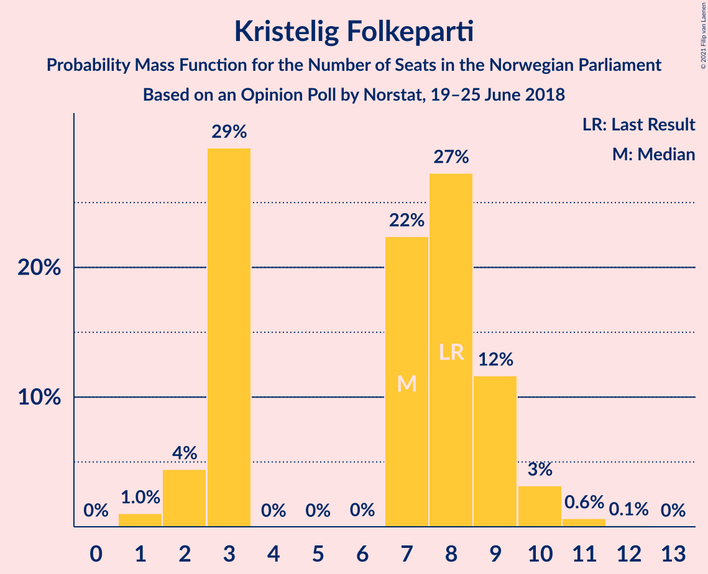

| Number of Seats | Probability | Accumulated | Special Marks |
|:---------------:|:-----------:|:-----------:|:-------------:|
| 1 | 1.0% | 100% |  |
| 2 | 4% | 99.0% |  |
| 3 | 29% | 95% |  |
| 4 | 0% | 65% |  |
| 5 | 0% | 65% |  |
| 6 | 0% | 65% |  |
| 7 | 22% | 65% | Median |
| 8 | 27% | 43% | Last Result |
| 9 | 12% | 16% |  |
| 10 | 3% | 4% |  |
| 11 | 0.6% | 0.8% |  |
| 12 | 0.1% | 0.1% |  |
| 13 | 0% | 0% |  |

### Miljøpartiet De Grønne

*For a full overview of the results for this party, see the [Miljøpartiet De Grønne](party-miljøpartietdegrønne.html) page.*

| Number of Seats | Probability | Accumulated | Special Marks |
|:---------------:|:-----------:|:-----------:|:-------------:|
| 0 | 8% | 100% |  |
| 1 | 78% | 92% | Last Result, Median |
| 2 | 13% | 13% |  |
| 3 | 0.1% | 0.8% |  |
| 4 | 0% | 0.7% |  |
| 5 | 0% | 0.7% |  |
| 6 | 0.1% | 0.7% |  |
| 7 | 0.5% | 0.6% |  |
| 8 | 0.1% | 0.1% |  |
| 9 | 0% | 0% |  |

## Coalitions

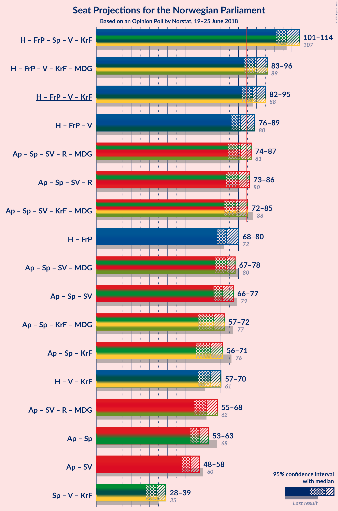

### Confidence Intervals

| Coalition | Last Result | Median | Majority? | 80% Confidence Interval | 90% Confidence Interval | 95% Confidence Interval | 99% Confidence Interval |
|:---------:|:-----------:|:------:|:---------:|:-----------------------:|:-----------------------:|:-----------------------:|:-----------------------:|
| Høyre – Fremskrittspartiet – Senterpartiet – Venstre – Kristelig Folkeparti | 107 | 107 | 100% | 103–111 | 102–113 | 101–114 | 100–116 |
| Høyre – Fremskrittspartiet – Venstre – Kristelig Folkeparti – Miljøpartiet De Grønne | 89 | 89 | 93% | 85–94 | 83–94 | 83–96 | 82–98 |
| Høyre – Fremskrittspartiet – Venstre – Kristelig Folkeparti | 88 | 88 | 82% | 84–93 | 82–93 | 82–95 | 80–97 |
| Høyre – Fremskrittspartiet – Venstre | 80 | 81 | 26% | 78–86 | 77–88 | 76–89 | 73–91 |
| Arbeiderpartiet – Senterpartiet – Sosialistisk Venstreparti – Rødt – Miljøpartiet De Grønne | 81 | 81 | 18% | 76–85 | 76–87 | 74–87 | 72–89 |
| Arbeiderpartiet – Senterpartiet – Sosialistisk Venstreparti – Rødt | 80 | 80 | 7% | 75–84 | 75–86 | 73–86 | 71–87 |
| Arbeiderpartiet – Senterpartiet – Sosialistisk Venstreparti – Kristelig Folkeparti – Miljøpartiet De Grønne | 88 | 78 | 4% | 75–83 | 73–84 | 72–85 | 70–88 |
| Høyre – Fremskrittspartiet | 72 | 73 | 0.1% | 69–77 | 68–78 | 68–80 | 66–82 |
| Arbeiderpartiet – Senterpartiet – Sosialistisk Venstreparti – Miljøpartiet De Grønne | 80 | 73 | 0% | 68–77 | 68–78 | 67–78 | 64–80 |
| Arbeiderpartiet – Senterpartiet – Sosialistisk Venstreparti | 79 | 71 | 0% | 67–75 | 67–77 | 66–77 | 63–79 |
| Arbeiderpartiet – Senterpartiet – Kristelig Folkeparti – Miljøpartiet De Grønne | 77 | 66 | 0% | 62–70 | 60–71 | 57–72 | 57–74 |
| Arbeiderpartiet – Senterpartiet – Kristelig Folkeparti | 76 | 64 | 0% | 61–68 | 59–69 | 56–71 | 56–72 |
| Høyre – Venstre – Kristelig Folkeparti | 61 | 64 | 0% | 60–68 | 58–69 | 57–70 | 56–72 |
| Arbeiderpartiet – Sosialistisk Venstreparti – Rødt – Miljøpartiet De Grønne | 62 | 62 | 0% | 58–66 | 56–67 | 55–68 | 53–69 |
| Arbeiderpartiet – Senterpartiet | 68 | 58 | 0% | 55–62 | 54–62 | 53–63 | 51–65 |
| Arbeiderpartiet – Sosialistisk Venstreparti | 60 | 53 | 0% | 49–56 | 48–57 | 48–58 | 45–59 |
| Senterpartiet – Venstre – Kristelig Folkeparti | 35 | 34 | 0% | 30–37 | 29–38 | 28–39 | 25–41 |

### Høyre – Fremskrittspartiet – Senterpartiet – Venstre – Kristelig Folkeparti

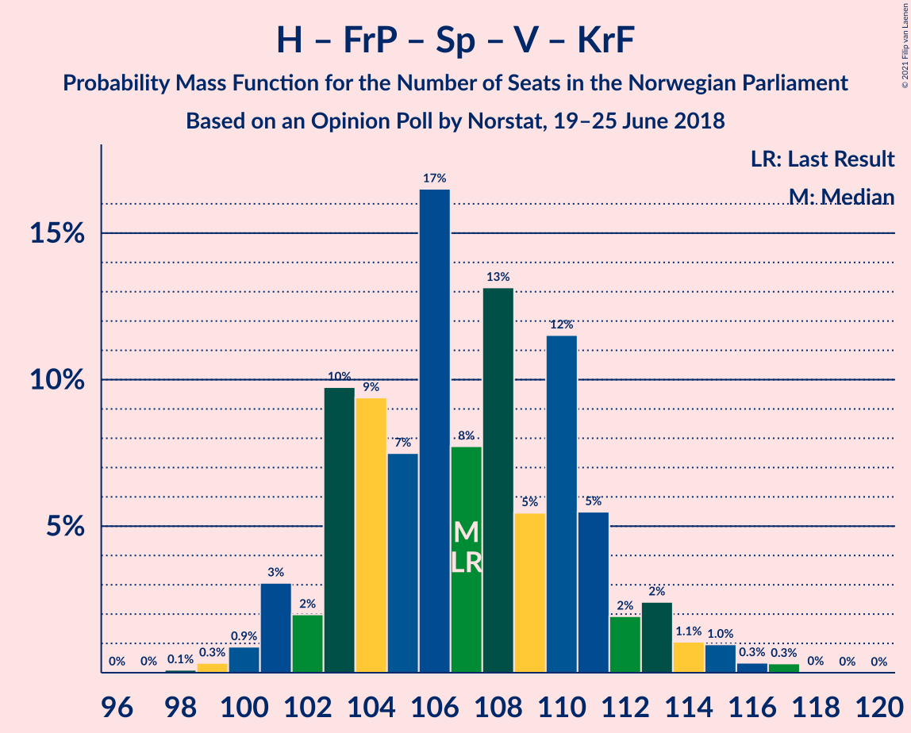

| Number of Seats | Probability | Accumulated | Special Marks |
|:---------------:|:-----------:|:-----------:|:-------------:|
| 97 | 0% | 100% |  |
| 98 | 0.1% | 99.9% |  |
| 99 | 0.3% | 99.8% |  |
| 100 | 0.9% | 99.5% |  |
| 101 | 3% | 98.6% |  |
| 102 | 2% | 96% |  |
| 103 | 10% | 94% |  |
| 104 | 9% | 84% |  |
| 105 | 7% | 74% |  |
| 106 | 17% | 67% |  |
| 107 | 8% | 50% | Last Result |
| 108 | 13% | 43% | Median |
| 109 | 5% | 30% |  |
| 110 | 12% | 24% |  |
| 111 | 5% | 13% |  |
| 112 | 2% | 7% |  |
| 113 | 2% | 5% |  |
| 114 | 1.1% | 3% |  |
| 115 | 1.0% | 2% |  |
| 116 | 0.3% | 0.7% |  |
| 117 | 0.3% | 0.4% |  |
| 118 | 0% | 0.1% |  |
| 119 | 0% | 0% |  |

### Høyre – Fremskrittspartiet – Venstre – Kristelig Folkeparti – Miljøpartiet De Grønne

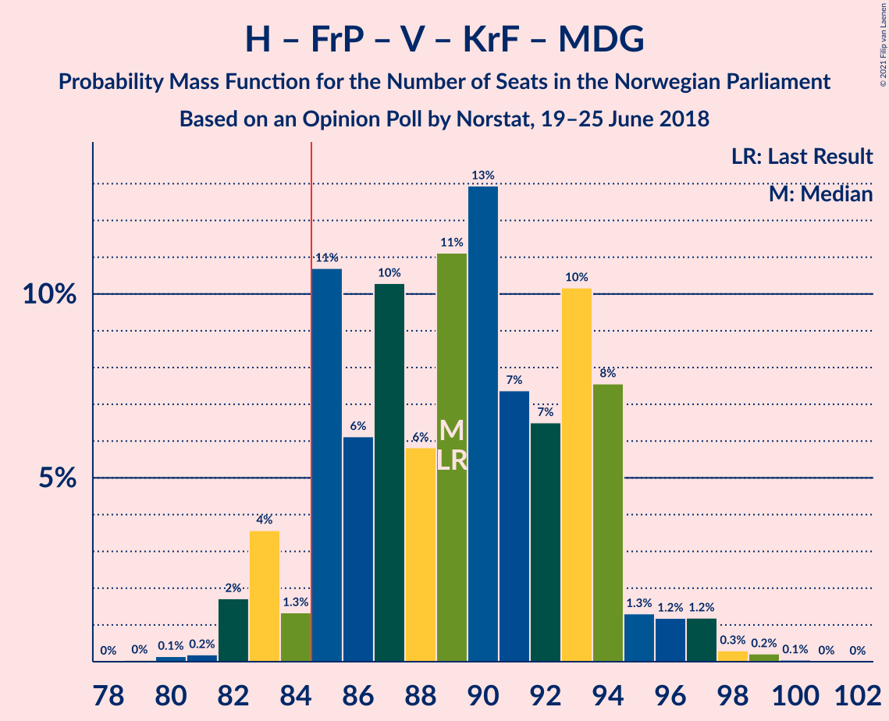

| Number of Seats | Probability | Accumulated | Special Marks |
|:---------------:|:-----------:|:-----------:|:-------------:|
| 79 | 0% | 100% |  |
| 80 | 0.1% | 99.9% |  |
| 81 | 0.2% | 99.8% |  |
| 82 | 2% | 99.6% |  |
| 83 | 4% | 98% |  |
| 84 | 1.3% | 94% |  |
| 85 | 11% | 93% | Majority |
| 86 | 6% | 82% |  |
| 87 | 10% | 76% |  |
| 88 | 6% | 66% |  |
| 89 | 11% | 60% | Last Result |
| 90 | 13% | 49% |  |
| 91 | 7% | 36% | Median |
| 92 | 7% | 29% |  |
| 93 | 10% | 22% |  |
| 94 | 8% | 12% |  |
| 95 | 1.3% | 4% |  |
| 96 | 1.2% | 3% |  |
| 97 | 1.2% | 2% |  |
| 98 | 0.3% | 0.6% |  |
| 99 | 0.2% | 0.3% |  |
| 100 | 0.1% | 0.1% |  |
| 101 | 0% | 0% |  |

### Høyre – Fremskrittspartiet – Venstre – Kristelig Folkeparti

| Number of Seats | Probability | Accumulated | Special Marks |
|:---------------:|:-----------:|:-----------:|:-------------:|
| 78 | 0% | 100% |  |
| 79 | 0.2% | 99.9% |  |
| 80 | 0.3% | 99.7% |  |
| 81 | 2% | 99.4% |  |
| 82 | 3% | 98% |  |
| 83 | 5% | 95% |  |
| 84 | 9% | 90% |  |
| 85 | 6% | 82% | Majority |
| 86 | 11% | 75% |  |
| 87 | 5% | 65% |  |
| 88 | 12% | 59% | Last Result |
| 89 | 11% | 47% |  |
| 90 | 8% | 36% | Median |
| 91 | 7% | 28% |  |
| 92 | 10% | 21% |  |
| 93 | 8% | 12% |  |
| 94 | 1.3% | 4% |  |
| 95 | 1.1% | 3% |  |
| 96 | 1.0% | 2% |  |
| 97 | 0.4% | 0.6% |  |
| 98 | 0.1% | 0.2% |  |
| 99 | 0.1% | 0.1% |  |
| 100 | 0% | 0% |  |

### Høyre – Fremskrittspartiet – Venstre

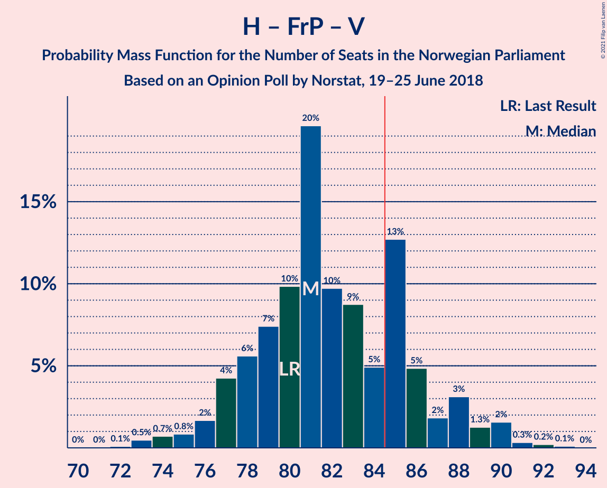

| Number of Seats | Probability | Accumulated | Special Marks |
|:---------------:|:-----------:|:-----------:|:-------------:|
| 71 | 0% | 100% |  |
| 72 | 0.1% | 99.9% |  |
| 73 | 0.5% | 99.8% |  |
| 74 | 0.7% | 99.4% |  |
| 75 | 0.8% | 98.7% |  |
| 76 | 2% | 98% |  |
| 77 | 4% | 96% |  |
| 78 | 6% | 92% |  |
| 79 | 7% | 86% |  |
| 80 | 10% | 79% | Last Result |
| 81 | 20% | 69% |  |
| 82 | 10% | 49% |  |
| 83 | 9% | 40% | Median |
| 84 | 5% | 31% |  |
| 85 | 13% | 26% | Majority |
| 86 | 5% | 13% |  |
| 87 | 2% | 8% |  |
| 88 | 3% | 7% |  |
| 89 | 1.3% | 3% |  |
| 90 | 2% | 2% |  |
| 91 | 0.3% | 0.7% |  |
| 92 | 0.2% | 0.3% |  |
| 93 | 0.1% | 0.1% |  |
| 94 | 0% | 0% |  |

### Arbeiderpartiet – Senterpartiet – Sosialistisk Venstreparti – Rødt – Miljøpartiet De Grønne

| Number of Seats | Probability | Accumulated | Special Marks |
|:---------------:|:-----------:|:-----------:|:-------------:|
| 70 | 0.1% | 100% |  |
| 71 | 0.1% | 99.9% |  |
| 72 | 0.4% | 99.8% |  |
| 73 | 1.0% | 99.4% |  |
| 74 | 1.1% | 98% |  |
| 75 | 1.4% | 97% |  |
| 76 | 8% | 96% |  |
| 77 | 10% | 88% |  |
| 78 | 7% | 79% |  |
| 79 | 8% | 72% |  |
| 80 | 11% | 64% |  |
| 81 | 12% | 53% | Last Result, Median |
| 82 | 5% | 40% |  |
| 83 | 11% | 35% |  |
| 84 | 6% | 25% |  |
| 85 | 9% | 18% | Majority |
| 86 | 5% | 10% |  |
| 87 | 3% | 5% |  |
| 88 | 2% | 2% |  |
| 89 | 0.3% | 0.6% |  |
| 90 | 0.2% | 0.3% |  |
| 91 | 0% | 0.1% |  |
| 92 | 0% | 0% |  |

### Arbeiderpartiet – Senterpartiet – Sosialistisk Venstreparti – Rødt

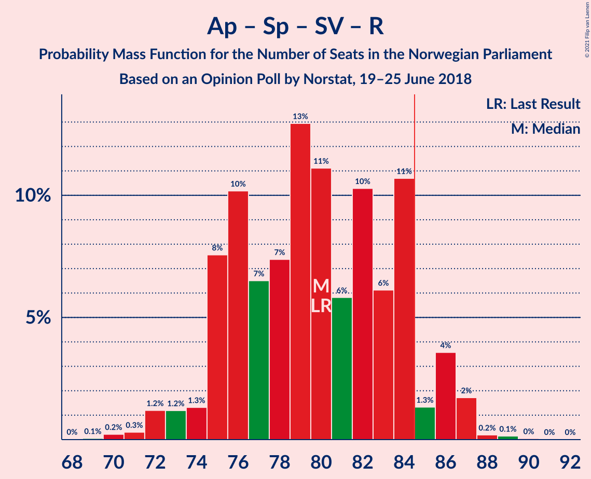

| Number of Seats | Probability | Accumulated | Special Marks |
|:---------------:|:-----------:|:-----------:|:-------------:|
| 69 | 0.1% | 100% |  |
| 70 | 0.2% | 99.9% |  |
| 71 | 0.3% | 99.7% |  |
| 72 | 1.2% | 99.4% |  |
| 73 | 1.2% | 98% |  |
| 74 | 1.3% | 97% |  |
| 75 | 8% | 96% |  |
| 76 | 10% | 88% |  |
| 77 | 7% | 78% |  |
| 78 | 7% | 71% |  |
| 79 | 13% | 64% |  |
| 80 | 11% | 51% | Last Result, Median |
| 81 | 6% | 40% |  |
| 82 | 10% | 34% |  |
| 83 | 6% | 24% |  |
| 84 | 11% | 18% |  |
| 85 | 1.3% | 7% | Majority |
| 86 | 4% | 6% |  |
| 87 | 2% | 2% |  |
| 88 | 0.2% | 0.4% |  |
| 89 | 0.1% | 0.2% |  |
| 90 | 0% | 0.1% |  |
| 91 | 0% | 0% |  |

### Arbeiderpartiet – Senterpartiet – Sosialistisk Venstreparti – Kristelig Folkeparti – Miljøpartiet De Grønne

| Number of Seats | Probability | Accumulated | Special Marks |
|:---------------:|:-----------:|:-----------:|:-------------:|
| 68 | 0.2% | 100% |  |
| 69 | 0.1% | 99.8% |  |
| 70 | 2% | 99.7% |  |
| 71 | 0.5% | 98% |  |
| 72 | 2% | 98% |  |
| 73 | 1.3% | 95% |  |
| 74 | 2% | 94% |  |
| 75 | 3% | 92% |  |
| 76 | 12% | 89% |  |
| 77 | 14% | 77% |  |
| 78 | 14% | 64% |  |
| 79 | 6% | 50% |  |
| 80 | 15% | 44% | Median |
| 81 | 8% | 28% |  |
| 82 | 10% | 21% |  |
| 83 | 2% | 11% |  |
| 84 | 4% | 8% |  |
| 85 | 2% | 4% | Majority |
| 86 | 1.1% | 2% |  |
| 87 | 0.6% | 1.2% |  |
| 88 | 0.4% | 0.5% | Last Result |
| 89 | 0.1% | 0.2% |  |
| 90 | 0.1% | 0.1% |  |
| 91 | 0% | 0% |  |

### Høyre – Fremskrittspartiet

| Number of Seats | Probability | Accumulated | Special Marks |
|:---------------:|:-----------:|:-----------:|:-------------:|
| 64 | 0.1% | 100% |  |
| 65 | 0.3% | 99.9% |  |
| 66 | 0.7% | 99.5% |  |
| 67 | 1.1% | 98.8% |  |
| 68 | 4% | 98% |  |
| 69 | 5% | 94% |  |
| 70 | 9% | 89% |  |
| 71 | 8% | 80% |  |
| 72 | 15% | 73% | Last Result |
| 73 | 13% | 58% |  |
| 74 | 11% | 44% | Median |
| 75 | 6% | 33% |  |
| 76 | 13% | 27% |  |
| 77 | 4% | 14% |  |
| 78 | 5% | 10% |  |
| 79 | 2% | 5% |  |
| 80 | 0.7% | 3% |  |
| 81 | 1.0% | 2% |  |
| 82 | 1.2% | 1.5% |  |
| 83 | 0.1% | 0.3% |  |
| 84 | 0.1% | 0.1% |  |
| 85 | 0% | 0.1% | Majority |
| 86 | 0% | 0% |  |

### Arbeiderpartiet – Senterpartiet – Sosialistisk Venstreparti – Miljøpartiet De Grønne

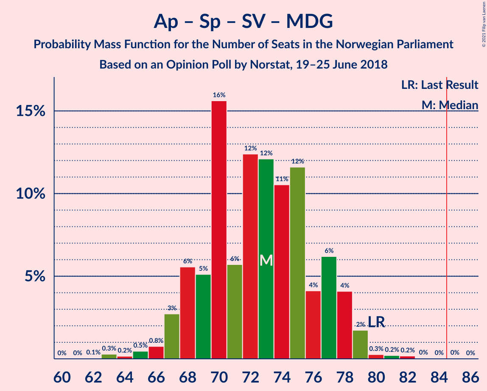

| Number of Seats | Probability | Accumulated | Special Marks |
|:---------------:|:-----------:|:-----------:|:-------------:|
| 62 | 0.1% | 100% |  |
| 63 | 0.3% | 99.9% |  |
| 64 | 0.2% | 99.7% |  |
| 65 | 0.5% | 99.5% |  |
| 66 | 0.8% | 99.0% |  |
| 67 | 3% | 98% |  |
| 68 | 6% | 96% |  |
| 69 | 5% | 90% |  |
| 70 | 16% | 85% |  |
| 71 | 6% | 69% |  |
| 72 | 12% | 64% |  |
| 73 | 12% | 51% | Median |
| 74 | 11% | 39% |  |
| 75 | 12% | 29% |  |
| 76 | 4% | 17% |  |
| 77 | 6% | 13% |  |
| 78 | 4% | 7% |  |
| 79 | 2% | 2% |  |
| 80 | 0.3% | 0.8% | Last Result |
| 81 | 0.2% | 0.5% |  |
| 82 | 0.2% | 0.3% |  |
| 83 | 0% | 0.1% |  |
| 84 | 0% | 0.1% |  |
| 85 | 0% | 0% | Majority |

### Arbeiderpartiet – Senterpartiet – Sosialistisk Venstreparti

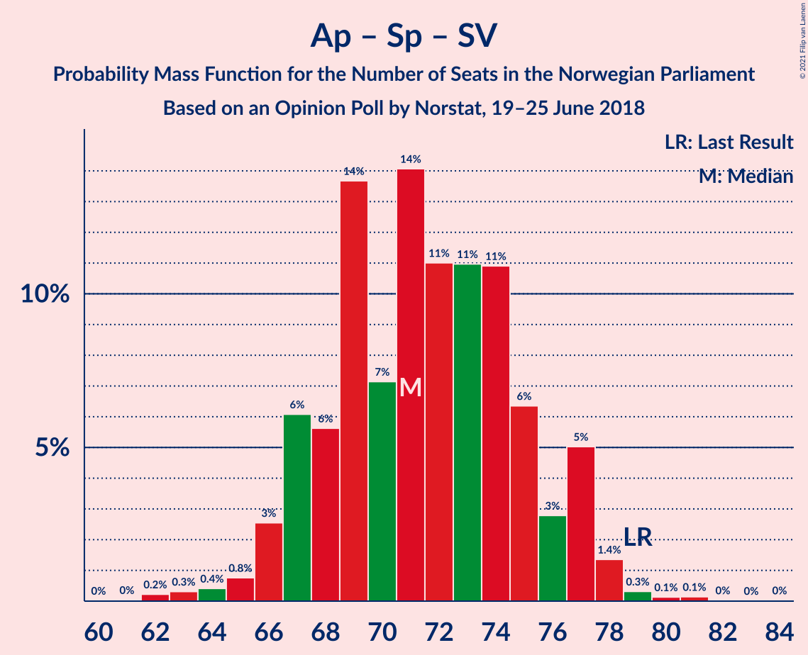

| Number of Seats | Probability | Accumulated | Special Marks |
|:---------------:|:-----------:|:-----------:|:-------------:|
| 61 | 0% | 100% |  |
| 62 | 0.2% | 99.9% |  |
| 63 | 0.3% | 99.7% |  |
| 64 | 0.4% | 99.4% |  |
| 65 | 0.8% | 99.0% |  |
| 66 | 3% | 98% |  |
| 67 | 6% | 96% |  |
| 68 | 6% | 90% |  |
| 69 | 14% | 84% |  |
| 70 | 7% | 70% |  |
| 71 | 14% | 63% |  |
| 72 | 11% | 49% | Median |
| 73 | 11% | 38% |  |
| 74 | 11% | 27% |  |
| 75 | 6% | 16% |  |
| 76 | 3% | 10% |  |
| 77 | 5% | 7% |  |
| 78 | 1.4% | 2% |  |
| 79 | 0.3% | 0.7% | Last Result |
| 80 | 0.1% | 0.4% |  |
| 81 | 0.1% | 0.2% |  |
| 82 | 0% | 0.1% |  |
| 83 | 0% | 0% |  |

### Arbeiderpartiet – Senterpartiet – Kristelig Folkeparti – Miljøpartiet De Grønne

| Number of Seats | Probability | Accumulated | Special Marks |
|:---------------:|:-----------:|:-----------:|:-------------:|
| 54 | 0.1% | 100% |  |
| 55 | 0.1% | 99.9% |  |
| 56 | 0.2% | 99.8% |  |
| 57 | 3% | 99.6% |  |
| 58 | 0.8% | 97% |  |
| 59 | 0.8% | 96% |  |
| 60 | 1.1% | 95% |  |
| 61 | 3% | 94% |  |
| 62 | 5% | 91% |  |
| 63 | 4% | 86% |  |
| 64 | 13% | 82% |  |
| 65 | 18% | 69% |  |
| 66 | 20% | 50% | Median |
| 67 | 9% | 30% |  |
| 68 | 5% | 21% |  |
| 69 | 5% | 17% |  |
| 70 | 6% | 11% |  |
| 71 | 2% | 6% |  |
| 72 | 2% | 3% |  |
| 73 | 1.2% | 2% |  |
| 74 | 0.3% | 0.6% |  |
| 75 | 0.1% | 0.2% |  |
| 76 | 0.1% | 0.1% |  |
| 77 | 0% | 0% | Last Result |

### Arbeiderpartiet – Senterpartiet – Kristelig Folkeparti

| Number of Seats | Probability | Accumulated | Special Marks |
|:---------------:|:-----------:|:-----------:|:-------------:|
| 53 | 0.1% | 100% |  |
| 54 | 0.1% | 99.9% |  |
| 55 | 0.2% | 99.8% |  |
| 56 | 3% | 99.6% |  |
| 57 | 0.8% | 97% |  |
| 58 | 0.9% | 96% |  |
| 59 | 1.3% | 95% |  |
| 60 | 3% | 94% |  |
| 61 | 5% | 91% |  |
| 62 | 6% | 86% |  |
| 63 | 12% | 80% |  |
| 64 | 20% | 69% |  |
| 65 | 19% | 49% | Median |
| 66 | 9% | 30% |  |
| 67 | 5% | 20% |  |
| 68 | 6% | 16% |  |
| 69 | 5% | 10% |  |
| 70 | 2% | 5% |  |
| 71 | 1.4% | 3% |  |
| 72 | 0.9% | 1.3% |  |
| 73 | 0.2% | 0.4% |  |
| 74 | 0.1% | 0.2% |  |
| 75 | 0% | 0.1% |  |
| 76 | 0% | 0% | Last Result |

### Høyre – Venstre – Kristelig Folkeparti

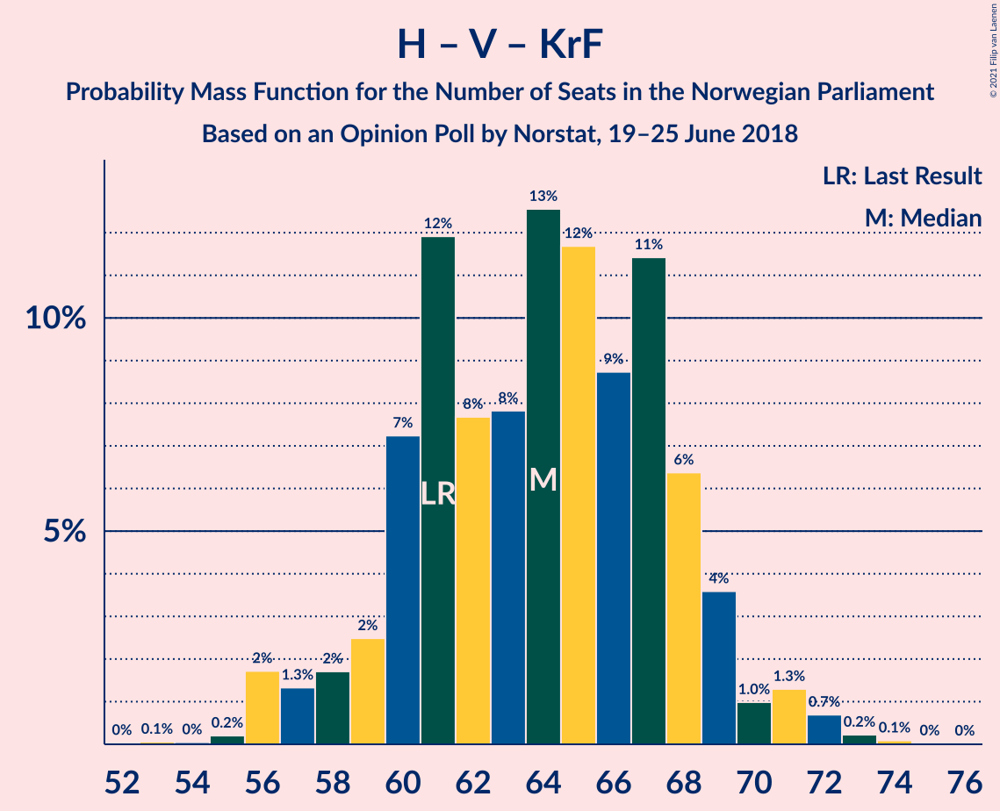

| Number of Seats | Probability | Accumulated | Special Marks |
|:---------------:|:-----------:|:-----------:|:-------------:|
| 53 | 0.1% | 100% |  |
| 54 | 0% | 99.9% |  |
| 55 | 0.2% | 99.8% |  |
| 56 | 2% | 99.6% |  |
| 57 | 1.3% | 98% |  |
| 58 | 2% | 97% |  |
| 59 | 2% | 95% |  |
| 60 | 7% | 92% |  |
| 61 | 12% | 85% | Last Result |
| 62 | 8% | 73% |  |
| 63 | 8% | 66% |  |
| 64 | 13% | 58% |  |
| 65 | 12% | 45% | Median |
| 66 | 9% | 33% |  |
| 67 | 11% | 25% |  |
| 68 | 6% | 13% |  |
| 69 | 4% | 7% |  |
| 70 | 1.0% | 3% |  |
| 71 | 1.3% | 2% |  |
| 72 | 0.7% | 1.1% |  |
| 73 | 0.2% | 0.4% |  |
| 74 | 0.1% | 0.1% |  |
| 75 | 0% | 0.1% |  |
| 76 | 0% | 0% |  |

### Arbeiderpartiet – Sosialistisk Venstreparti – Rødt – Miljøpartiet De Grønne

| Number of Seats | Probability | Accumulated | Special Marks |
|:---------------:|:-----------:|:-----------:|:-------------:|
| 51 | 0% | 100% |  |
| 52 | 0.3% | 99.9% |  |
| 53 | 0.3% | 99.6% |  |
| 54 | 1.0% | 99.3% |  |
| 55 | 1.1% | 98% |  |
| 56 | 2% | 97% |  |
| 57 | 2% | 95% |  |
| 58 | 6% | 93% |  |
| 59 | 12% | 87% |  |
| 60 | 5% | 76% |  |
| 61 | 13% | 70% |  |
| 62 | 8% | 57% | Last Result |
| 63 | 17% | 50% | Median |
| 64 | 7% | 33% |  |
| 65 | 9% | 26% |  |
| 66 | 10% | 16% |  |
| 67 | 2% | 6% |  |
| 68 | 3% | 4% |  |
| 69 | 0.9% | 1.4% |  |
| 70 | 0.3% | 0.5% |  |
| 71 | 0.1% | 0.2% |  |
| 72 | 0% | 0.1% |  |
| 73 | 0% | 0% |  |

### Arbeiderpartiet – Senterpartiet

| Number of Seats | Probability | Accumulated | Special Marks |
|:---------------:|:-----------:|:-----------:|:-------------:|
| 49 | 0.1% | 100% |  |
| 50 | 0.2% | 99.9% |  |
| 51 | 0.6% | 99.7% |  |
| 52 | 1.1% | 99.2% |  |
| 53 | 2% | 98% |  |
| 54 | 3% | 96% |  |
| 55 | 4% | 93% |  |
| 56 | 14% | 89% |  |
| 57 | 13% | 75% |  |
| 58 | 20% | 62% | Median |
| 59 | 10% | 42% |  |
| 60 | 10% | 32% |  |
| 61 | 11% | 21% |  |
| 62 | 7% | 10% |  |
| 63 | 2% | 4% |  |
| 64 | 0.6% | 1.5% |  |
| 65 | 0.5% | 0.9% |  |
| 66 | 0.2% | 0.4% |  |
| 67 | 0.1% | 0.2% |  |
| 68 | 0% | 0.1% | Last Result |
| 69 | 0% | 0% |  |

### Arbeiderpartiet – Sosialistisk Venstreparti

| Number of Seats | Probability | Accumulated | Special Marks |
|:---------------:|:-----------:|:-----------:|:-------------:|
| 43 | 0.2% | 100% |  |
| 44 | 0.1% | 99.7% |  |
| 45 | 0.3% | 99.6% |  |
| 46 | 0.5% | 99.3% |  |
| 47 | 1.2% | 98.8% |  |
| 48 | 3% | 98% |  |
| 49 | 6% | 95% |  |
| 50 | 6% | 89% |  |
| 51 | 19% | 83% |  |
| 52 | 8% | 64% |  |
| 53 | 15% | 56% |  |
| 54 | 14% | 42% | Median |
| 55 | 15% | 28% |  |
| 56 | 5% | 13% |  |
| 57 | 4% | 8% |  |
| 58 | 3% | 4% |  |
| 59 | 0.7% | 1.0% |  |
| 60 | 0.3% | 0.4% | Last Result |
| 61 | 0.1% | 0.1% |  |
| 62 | 0% | 0.1% |  |
| 63 | 0% | 0% |  |

### Senterpartiet – Venstre – Kristelig Folkeparti

| Number of Seats | Probability | Accumulated | Special Marks |
|:---------------:|:-----------:|:-----------:|:-------------:|
| 22 | 0% | 100% |  |
| 23 | 0.1% | 99.9% |  |
| 24 | 0.1% | 99.9% |  |
| 25 | 1.2% | 99.8% |  |
| 26 | 0.3% | 98.6% |  |
| 27 | 0.6% | 98% |  |
| 28 | 2% | 98% |  |
| 29 | 3% | 96% |  |
| 30 | 5% | 93% |  |
| 31 | 11% | 88% |  |
| 32 | 6% | 77% |  |
| 33 | 15% | 71% |  |
| 34 | 22% | 56% | Median |
| 35 | 11% | 34% | Last Result |
| 36 | 9% | 23% |  |
| 37 | 7% | 14% |  |
| 38 | 4% | 8% |  |
| 39 | 2% | 4% |  |
| 40 | 1.2% | 2% |  |
| 41 | 0.5% | 0.9% |  |
| 42 | 0.3% | 0.4% |  |
| 43 | 0.1% | 0.1% |  |
| 44 | 0% | 0% |  |

## Technical Information

### Opinion Poll

+ **Polling firm:** Norstat
+ **Commissioner(s):** —
+ **Fieldwork period:** 19–25 June 2018

### Calculations

+ **Sample size:** 941
+ **Simulations done:** 1,048,576
+ **Error estimate:** 1.83%

