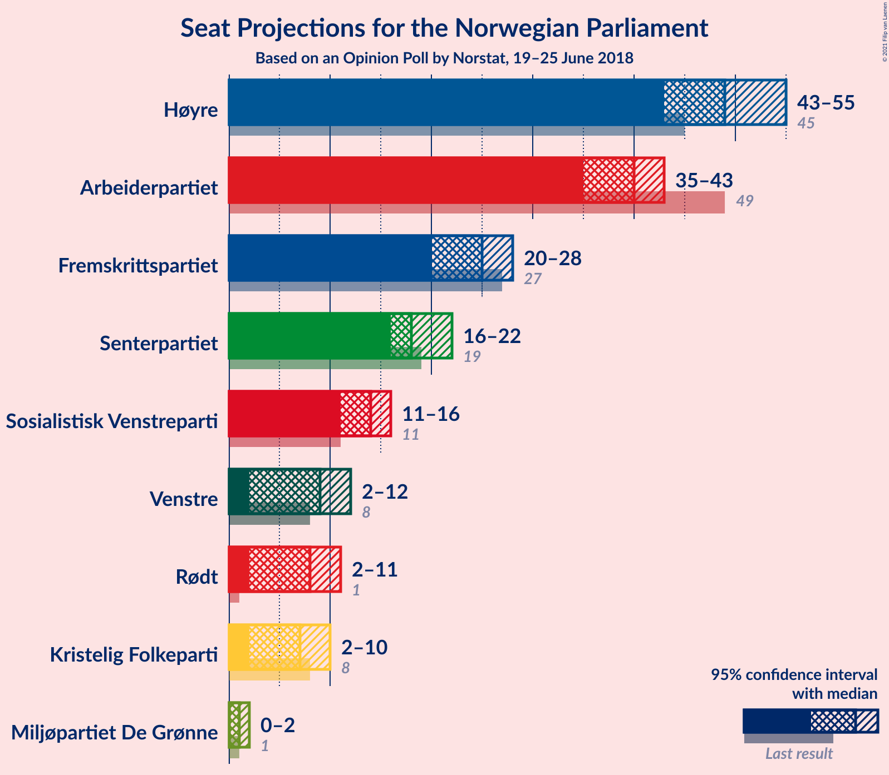
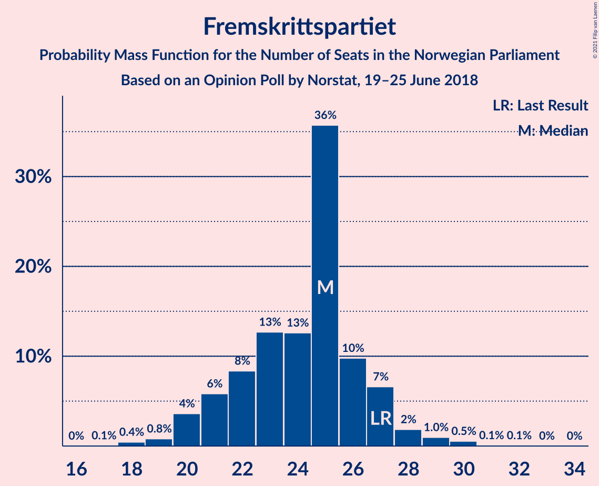
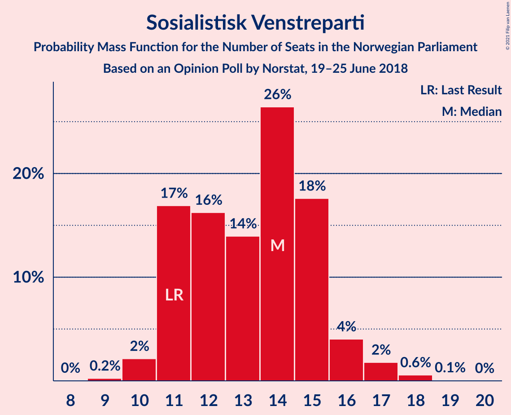
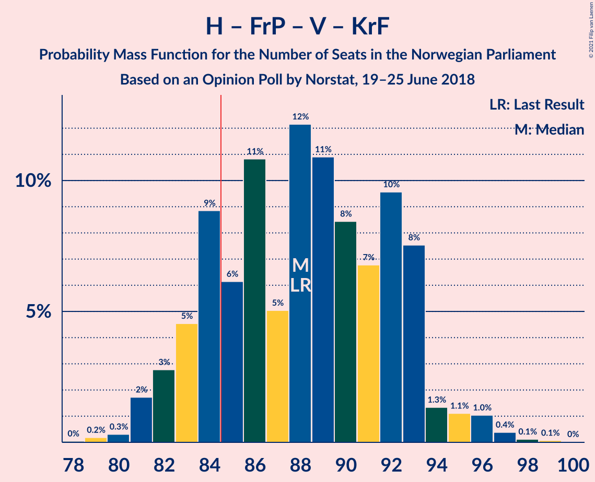
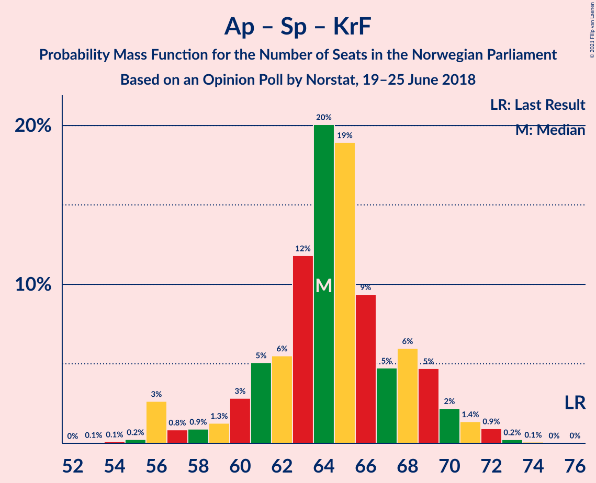
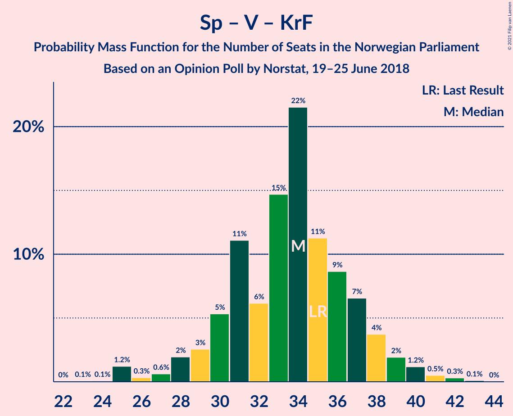

# Opinion Poll by Norstat, 19–25 June 2018

<a href="#voting-intentions">Voting Intentions</a> | <a href="#seats">Seats</a> | <a href="#coalitions">Coalitions</a> | <a href="#technical-information">Technical Information</a>

## Voting Intentions

### Confidence Intervals

| Party | Last Result | Poll Result | 80% Confidence Interval | 90% Confidence Interval | 95% Confidence Interval | 99% Confidence Interval |
|:-----:|:-----------:|:-----------:|:-----------------------:|:-----------------------:|:-----------------------:|:-----------------------:|
| Høyre | 25.0% | 27.8% | 26.0–29.8% |25.5–30.3% |25.1–30.8% |24.2–31.7% |
| Arbeiderpartiet | 27.4% | 21.5% | 19.8–23.3% |19.4–23.8% |19.0–24.2% |18.2–25.1% |
| Fremskrittspartiet | 15.2% | 13.6% | 12.3–15.1% |11.9–15.6% |11.6–16.0% |10.9–16.7% |
| Senterpartiet | 10.3% | 10.7% | 9.5–12.1% |9.2–12.5% |8.9–12.9% |8.4–13.6% |
| Sosialistisk Venstreparti | 6.0% | 7.5% | 6.5–8.8% |6.3–9.1% |6.0–9.4% |5.6–10.0% |
| Venstre | 4.4% | 5.1% | 4.3–6.1% |4.1–6.4% |3.9–6.7% |3.5–7.2% |
| Rødt | 2.4% | 4.9% | 4.1–5.9% |3.9–6.2% |3.7–6.5% |3.3–7.0% |
| Kristelig Folkeparti | 4.2% | 4.3% | 3.5–5.2% |3.3–5.5% |3.1–5.7% |2.8–6.2% |
| Miljøpartiet De Grønne | 3.2% | 2.6% | 2.0–3.4% |1.8–3.6% |1.7–3.8% |1.5–4.2% |

*Note:* The poll result column reflects the actual value used in the calculations. Published results may vary slightly, and in addition be rounded to fewer digits.

## Seats

### Confidence Intervals

| Party | Last Result | Median | 80% Confidence Interval | 90% Confidence Interval | 95% Confidence Interval | 99% Confidence Interval |
|:-----:|:-----------:|:------:|:-----------------------:|:-----------------------:|:-----------------------:|:-----------------------:|
| <a href="#høyre">Høyre</a> | 45 | 48 | 46–53 |45–53 |44–53 |43–57 |
| <a href="#arbeiderpartiet">Arbeiderpartiet</a> | 49 | 39 | 35–42 |35–42 |34–43 |32–45 |
| <a href="#fremskrittspartiet">Fremskrittspartiet</a> | 27 | 25 | 23–27 |21–27 |21–29 |19–29 |
| <a href="#senterpartiet">Senterpartiet</a> | 19 | 18 | 17–20 |16–21 |16–22 |14–24 |
| <a href="#sosialistisk-venstreparti">Sosialistisk Venstreparti</a> | 11 | 13 | 12–15 |11–16 |10–16 |9–18 |
| <a href="#venstre">Venstre</a> | 8 | 9 | 8–10 |7–11 |7–11 |2–12 |
| <a href="#rødt">Rødt</a> | 1 | 9 | 7–11 |2–11 |2–11 |2–12 |
| <a href="#kristelig-folkeparti">Kristelig Folkeparti</a> | 8 | 7 | 3–9 |3–9 |2–9 |1–11 |
| <a href="#miljøpartiet-de-grønne">Miljøpartiet De Grønne</a> | 1 | 1 | 1 |0–2 |0–2 |0–7 |

### Høyre

*For a full overview of the results for this party, see the [Høyre](party-høyre.html) page.*

| Number of Seats | Probability | Accumulated | Special Marks |
|:---------------:|:-----------:|:-----------:|:-------------:|
| 41 | 0.1% | 100% |  |
| 42 | 0.2% | 99.9% |  |
| 43 | 1.0% | 99.6% |  |
| 44 | 3% | 98.7% |  |
| 45 | 4% | 96% | Last Result |
| 46 | 18% | 92% |  |
| 47 | 1.4% | 74% |  |
| 48 | 34% | 73% | Median |
| 49 | 11% | 39% |  |
| 50 | 3% | 28% |  |
| 51 | 5% | 25% |  |
| 52 | 4% | 20% |  |
| 53 | 13% | 15% |  |
| 54 | 0.6% | 2% |  |
| 55 | 0.5% | 1.3% |  |
| 56 | 0.2% | 0.8% |  |
| 57 | 0.4% | 0.6% |  |
| 58 | 0.1% | 0.2% |  |
| 59 | 0% | 0.1% |  |
| 60 | 0% | 0% |  |

### Arbeiderpartiet

*For a full overview of the results for this party, see the [Arbeiderpartiet](party-arbeiderpartiet.html) page.*

| Number of Seats | Probability | Accumulated | Special Marks |
|:---------------:|:-----------:|:-----------:|:-------------:|
| 31 | 0% | 100% |  |
| 32 | 0.5% | 99.9% |  |
| 33 | 0.8% | 99.4% |  |
| 34 | 3% | 98.7% |  |
| 35 | 12% | 96% |  |
| 36 | 1.3% | 84% |  |
| 37 | 11% | 83% |  |
| 38 | 14% | 72% |  |
| 39 | 22% | 58% | Median |
| 40 | 11% | 35% |  |
| 41 | 12% | 24% |  |
| 42 | 8% | 12% |  |
| 43 | 3% | 4% |  |
| 44 | 0.7% | 2% |  |
| 45 | 1.0% | 1.1% |  |
| 46 | 0.1% | 0.2% |  |
| 47 | 0.1% | 0.1% |  |
| 48 | 0% | 0% |  |
| 49 | 0% | 0% | Last Result |

### Fremskrittspartiet

*For a full overview of the results for this party, see the [Fremskrittspartiet](party-fremskrittspartiet.html) page.*

| Number of Seats | Probability | Accumulated | Special Marks |
|:---------------:|:-----------:|:-----------:|:-------------:|
| 17 | 0.1% | 100% |  |
| 18 | 0.1% | 99.9% |  |
| 19 | 0.8% | 99.9% |  |
| 20 | 2% | 99.1% |  |
| 21 | 3% | 98% |  |
| 22 | 4% | 95% |  |
| 23 | 4% | 91% |  |
| 24 | 15% | 87% |  |
| 25 | 49% | 72% | Median |
| 26 | 9% | 23% |  |
| 27 | 10% | 14% | Last Result |
| 28 | 2% | 4% |  |
| 29 | 2% | 3% |  |
| 30 | 0.2% | 0.3% |  |
| 31 | 0.1% | 0.1% |  |
| 32 | 0% | 0% |  |

### Senterpartiet

*For a full overview of the results for this party, see the [Senterpartiet](party-senterpartiet.html) page.*

| Number of Seats | Probability | Accumulated | Special Marks |
|:---------------:|:-----------:|:-----------:|:-------------:|
| 13 | 0.1% | 100% |  |
| 14 | 0.4% | 99.9% |  |
| 15 | 1.1% | 99.5% |  |
| 16 | 6% | 98% |  |
| 17 | 9% | 92% |  |
| 18 | 39% | 84% | Median |
| 19 | 14% | 45% | Last Result |
| 20 | 21% | 31% |  |
| 21 | 5% | 10% |  |
| 22 | 3% | 4% |  |
| 23 | 0.4% | 1.2% |  |
| 24 | 0.6% | 0.8% |  |
| 25 | 0.1% | 0.2% |  |
| 26 | 0.1% | 0.1% |  |
| 27 | 0% | 0% |  |

### Sosialistisk Venstreparti

*For a full overview of the results for this party, see the [Sosialistisk Venstreparti](party-sosialistiskvenstreparti.html) page.*

| Number of Seats | Probability | Accumulated | Special Marks |
|:---------------:|:-----------:|:-----------:|:-------------:|
| 9 | 0.5% | 100% |  |
| 10 | 2% | 99.5% |  |
| 11 | 2% | 97% | Last Result |
| 12 | 42% | 95% |  |
| 13 | 16% | 53% | Median |
| 14 | 17% | 37% |  |
| 15 | 13% | 19% |  |
| 16 | 4% | 6% |  |
| 17 | 1.4% | 2% |  |
| 18 | 0.6% | 0.7% |  |
| 19 | 0.1% | 0.1% |  |
| 20 | 0% | 0% |  |

### Venstre

*For a full overview of the results for this party, see the [Venstre](party-venstre.html) page.*

| Number of Seats | Probability | Accumulated | Special Marks |
|:---------------:|:-----------:|:-----------:|:-------------:|
| 2 | 2% | 100% |  |
| 3 | 0.5% | 98% |  |
| 4 | 0% | 98% |  |
| 5 | 0% | 98% |  |
| 6 | 0% | 98% |  |
| 7 | 7% | 98% |  |
| 8 | 35% | 91% | Last Result |
| 9 | 11% | 57% | Median |
| 10 | 37% | 46% |  |
| 11 | 6% | 9% |  |
| 12 | 2% | 2% |  |
| 13 | 0.4% | 0.5% |  |
| 14 | 0.1% | 0.1% |  |
| 15 | 0% | 0% |  |

### Rødt

*For a full overview of the results for this party, see the [Rødt](party-rødt.html) page.*

| Number of Seats | Probability | Accumulated | Special Marks |
|:---------------:|:-----------:|:-----------:|:-------------:|
| 1 | 0% | 100% | Last Result |
| 2 | 8% | 100% |  |
| 3 | 0% | 92% |  |
| 4 | 0% | 92% |  |
| 5 | 0% | 92% |  |
| 6 | 0% | 92% |  |
| 7 | 4% | 92% |  |
| 8 | 32% | 88% |  |
| 9 | 7% | 56% | Median |
| 10 | 15% | 49% |  |
| 11 | 32% | 34% |  |
| 12 | 1.1% | 1.4% |  |
| 13 | 0.3% | 0.3% |  |
| 14 | 0% | 0% |  |

### Kristelig Folkeparti

*For a full overview of the results for this party, see the [Kristelig Folkeparti](party-kristeligfolkeparti.html) page.*

| Number of Seats | Probability | Accumulated | Special Marks |
|:---------------:|:-----------:|:-----------:|:-------------:|
| 1 | 1.3% | 100% |  |
| 2 | 3% | 98.7% |  |
| 3 | 28% | 96% |  |
| 4 | 0% | 68% |  |
| 5 | 0% | 68% |  |
| 6 | 0.1% | 68% |  |
| 7 | 34% | 68% | Median |
| 8 | 20% | 34% | Last Result |
| 9 | 11% | 13% |  |
| 10 | 1.3% | 2% |  |
| 11 | 0.7% | 0.9% |  |
| 12 | 0.2% | 0.2% |  |
| 13 | 0% | 0% |  |

### Miljøpartiet De Grønne

*For a full overview of the results for this party, see the [Miljøpartiet De Grønne](party-miljøpartietdegrønne.html) page.*

| Number of Seats | Probability | Accumulated | Special Marks |
|:---------------:|:-----------:|:-----------:|:-------------:|
| 0 | 6% | 100% |  |
| 1 | 84% | 94% | Last Result, Median |
| 2 | 8% | 9% |  |
| 3 | 0.1% | 0.8% |  |
| 4 | 0% | 0.7% |  |
| 5 | 0% | 0.7% |  |
| 6 | 0.2% | 0.7% |  |
| 7 | 0.4% | 0.6% |  |
| 8 | 0.1% | 0.1% |  |
| 9 | 0% | 0% |  |

## Coalitions

### Confidence Intervals

| Coalition | Last Result | Median | Majority? | 80% Confidence Interval | 90% Confidence Interval | 95% Confidence Interval | 99% Confidence Interval |
|:---------:|:-----------:|:------:|:---------:|:-----------------------:|:-----------------------:|:-----------------------:|:-----------------------:|
| Høyre – Fremskrittspartiet – Senterpartiet – Venstre – Kristelig Folkeparti | 107 | 108 | 100% | 104–110 | 102–112 | 101–114 | 99–117 |
| Høyre – Fremskrittspartiet – Venstre – Kristelig Folkeparti – Miljøpartiet De Grønne | 89 | 89 | 95% | 86–93 | 85–94 | 83–96 | 82–99 |
| Høyre – Fremskrittspartiet – Venstre – Kristelig Folkeparti | 88 | 88 | 93% | 85–92 | 84–93 | 82–95 | 80–97 |
| Høyre – Fremskrittspartiet – Venstre | 80 | 81 | 33% | 78–88 | 77–88 | 76–88 | 73–91 |
| Arbeiderpartiet – Senterpartiet – Sosialistisk Venstreparti – Rødt – Miljøpartiet De Grønne | 81 | 81 | 7% | 77–84 | 76–85 | 74–87 | 72–88 |
| Arbeiderpartiet – Senterpartiet – Sosialistisk Venstreparti – Rødt | 80 | 80 | 5% | 76–83 | 75–84 | 73–86 | 70–87 |
| Arbeiderpartiet – Senterpartiet – Sosialistisk Venstreparti – Kristelig Folkeparti – Miljøpartiet De Grønne | 88 | 77 | 6% | 70–84 | 70–85 | 70–86 | 69–87 |
| Høyre – Fremskrittspartiet | 72 | 73 | 0.1% | 70–78 | 68–78 | 68–79 | 66–82 |
| Arbeiderpartiet – Senterpartiet – Sosialistisk Venstreparti – Miljøpartiet De Grønne | 80 | 71 | 0% | 67–76 | 67–77 | 67–78 | 65–79 |
| Arbeiderpartiet – Senterpartiet – Sosialistisk Venstreparti | 79 | 70 | 0% | 66–75 | 66–76 | 66–77 | 63–78 |
| Arbeiderpartiet – Senterpartiet – Kristelig Folkeparti – Miljøpartiet De Grønne | 77 | 65 | 0% | 57–70 | 57–71 | 57–72 | 57–73 |
| Arbeiderpartiet – Senterpartiet – Kristelig Folkeparti | 76 | 64 | 0% | 56–69 | 56–70 | 56–71 | 55–72 |
| Høyre – Venstre – Kristelig Folkeparti | 61 | 63 | 0% | 61–67 | 59–69 | 57–69 | 56–72 |
| Arbeiderpartiet – Senterpartiet | 68 | 57 | 0% | 53–60 | 53–61 | 52–63 | 51–64 |
| Arbeiderpartiet – Sosialistisk Venstreparti | 60 | 51 | 0% | 48–56 | 48–57 | 47–58 | 45–60 |
| Senterpartiet – Venstre – Kristelig Folkeparti | 35 | 33 | 0% | 31–37 | 30–38 | 29–39 | 27–40 |

### Høyre – Fremskrittspartiet – Senterpartiet – Venstre – Kristelig Folkeparti

| Number of Seats | Probability | Accumulated | Special Marks |
|:---------------:|:-----------:|:-----------:|:-------------:|
| 97 | 0.1% | 100% |  |
| 98 | 0.1% | 99.9% |  |
| 99 | 0.4% | 99.8% |  |
| 100 | 0.7% | 99.5% |  |
| 101 | 2% | 98.7% |  |
| 102 | 3% | 97% |  |
| 103 | 2% | 94% |  |
| 104 | 8% | 93% |  |
| 105 | 8% | 85% |  |
| 106 | 20% | 76% |  |
| 107 | 2% | 56% | Last Result, Median |
| 108 | 24% | 54% |  |
| 109 | 13% | 30% |  |
| 110 | 8% | 17% |  |
| 111 | 4% | 9% |  |
| 112 | 0.8% | 6% |  |
| 113 | 2% | 5% |  |
| 114 | 2% | 3% |  |
| 115 | 0.6% | 2% |  |
| 116 | 0.3% | 1.0% |  |
| 117 | 0.7% | 0.8% |  |
| 118 | 0% | 0% |  |

### Høyre – Fremskrittspartiet – Venstre – Kristelig Folkeparti – Miljøpartiet De Grønne

| Number of Seats | Probability | Accumulated | Special Marks |
|:---------------:|:-----------:|:-----------:|:-------------:|
| 79 | 0% | 100% |  |
| 80 | 0.1% | 99.9% |  |
| 81 | 0.2% | 99.9% |  |
| 82 | 1.0% | 99.6% |  |
| 83 | 2% | 98.7% |  |
| 84 | 1.5% | 97% |  |
| 85 | 3% | 95% | Majority |
| 86 | 3% | 93% |  |
| 87 | 6% | 90% |  |
| 88 | 3% | 84% |  |
| 89 | 36% | 81% | Last Result |
| 90 | 16% | 45% | Median |
| 91 | 4% | 29% |  |
| 92 | 15% | 26% |  |
| 93 | 3% | 11% |  |
| 94 | 4% | 8% |  |
| 95 | 1.0% | 4% |  |
| 96 | 1.3% | 3% |  |
| 97 | 0.3% | 2% |  |
| 98 | 1.0% | 2% |  |
| 99 | 0.5% | 0.6% |  |
| 100 | 0.1% | 0.1% |  |
| 101 | 0% | 0% |  |

### Høyre – Fremskrittspartiet – Venstre – Kristelig Folkeparti

| Number of Seats | Probability | Accumulated | Special Marks |
|:---------------:|:-----------:|:-----------:|:-------------:|
| 78 | 0% | 100% |  |
| 79 | 0.1% | 99.9% |  |
| 80 | 0.4% | 99.9% |  |
| 81 | 0.8% | 99.5% |  |
| 82 | 2% | 98.7% |  |
| 83 | 1.3% | 97% |  |
| 84 | 3% | 96% |  |
| 85 | 3% | 93% | Majority |
| 86 | 6% | 90% |  |
| 87 | 3% | 83% |  |
| 88 | 36% | 80% | Last Result |
| 89 | 17% | 45% | Median |
| 90 | 3% | 28% |  |
| 91 | 15% | 25% |  |
| 92 | 4% | 10% |  |
| 93 | 3% | 7% |  |
| 94 | 0.9% | 4% |  |
| 95 | 1.3% | 3% |  |
| 96 | 0.3% | 2% |  |
| 97 | 1.3% | 1.4% |  |
| 98 | 0.1% | 0.2% |  |
| 99 | 0.1% | 0.1% |  |
| 100 | 0% | 0% |  |

### Høyre – Fremskrittspartiet – Venstre

| Number of Seats | Probability | Accumulated | Special Marks |
|:---------------:|:-----------:|:-----------:|:-------------:|
| 71 | 0.1% | 100% |  |
| 72 | 0% | 99.9% |  |
| 73 | 0.4% | 99.9% |  |
| 74 | 0.4% | 99.5% |  |
| 75 | 0.4% | 99.1% |  |
| 76 | 1.4% | 98.7% |  |
| 77 | 6% | 97% |  |
| 78 | 2% | 91% |  |
| 79 | 5% | 89% |  |
| 80 | 4% | 84% | Last Result |
| 81 | 41% | 80% |  |
| 82 | 3% | 39% | Median |
| 83 | 2% | 37% |  |
| 84 | 2% | 35% |  |
| 85 | 12% | 33% | Majority |
| 86 | 2% | 21% |  |
| 87 | 2% | 19% |  |
| 88 | 15% | 17% |  |
| 89 | 0.5% | 2% |  |
| 90 | 0.8% | 2% |  |
| 91 | 0.6% | 0.9% |  |
| 92 | 0.2% | 0.3% |  |
| 93 | 0.1% | 0.1% |  |
| 94 | 0.1% | 0.1% |  |
| 95 | 0% | 0% |  |

### Arbeiderpartiet – Senterpartiet – Sosialistisk Venstreparti – Rødt – Miljøpartiet De Grønne

| Number of Seats | Probability | Accumulated | Special Marks |
|:---------------:|:-----------:|:-----------:|:-------------:|
| 70 | 0.1% | 100% |  |
| 71 | 0.1% | 99.9% |  |
| 72 | 1.3% | 99.8% |  |
| 73 | 0.3% | 98.5% |  |
| 74 | 1.3% | 98% |  |
| 75 | 0.9% | 97% |  |
| 76 | 3% | 96% |  |
| 77 | 4% | 93% |  |
| 78 | 15% | 90% |  |
| 79 | 3% | 75% |  |
| 80 | 17% | 72% | Median |
| 81 | 36% | 55% | Last Result |
| 82 | 3% | 20% |  |
| 83 | 6% | 17% |  |
| 84 | 3% | 10% |  |
| 85 | 3% | 7% | Majority |
| 86 | 1.3% | 4% |  |
| 87 | 2% | 3% |  |
| 88 | 0.8% | 1.3% |  |
| 89 | 0.4% | 0.5% |  |
| 90 | 0.1% | 0.1% |  |
| 91 | 0% | 0.1% |  |
| 92 | 0% | 0% |  |

### Arbeiderpartiet – Senterpartiet – Sosialistisk Venstreparti – Rødt

| Number of Seats | Probability | Accumulated | Special Marks |
|:---------------:|:-----------:|:-----------:|:-------------:|
| 69 | 0.1% | 100% |  |
| 70 | 0.5% | 99.9% |  |
| 71 | 1.0% | 99.4% |  |
| 72 | 0.3% | 98% |  |
| 73 | 1.3% | 98% |  |
| 74 | 1.0% | 97% |  |
| 75 | 4% | 96% |  |
| 76 | 3% | 92% |  |
| 77 | 15% | 89% |  |
| 78 | 4% | 74% |  |
| 79 | 16% | 71% | Median |
| 80 | 36% | 55% | Last Result |
| 81 | 3% | 19% |  |
| 82 | 6% | 16% |  |
| 83 | 3% | 10% |  |
| 84 | 3% | 7% |  |
| 85 | 1.5% | 5% | Majority |
| 86 | 2% | 3% |  |
| 87 | 1.0% | 1.3% |  |
| 88 | 0.2% | 0.4% |  |
| 89 | 0.1% | 0.1% |  |
| 90 | 0% | 0.1% |  |
| 91 | 0% | 0% |  |

### Arbeiderpartiet – Senterpartiet – Sosialistisk Venstreparti – Kristelig Folkeparti – Miljøpartiet De Grønne

| Number of Seats | Probability | Accumulated | Special Marks |
|:---------------:|:-----------:|:-----------:|:-------------:|
| 67 | 0.1% | 100% |  |
| 68 | 0.2% | 99.9% |  |
| 69 | 0.2% | 99.7% |  |
| 70 | 12% | 99.5% |  |
| 71 | 0.6% | 88% |  |
| 72 | 0.3% | 87% |  |
| 73 | 3% | 87% |  |
| 74 | 3% | 84% |  |
| 75 | 1.1% | 81% |  |
| 76 | 11% | 80% |  |
| 77 | 22% | 69% |  |
| 78 | 10% | 48% | Median |
| 79 | 4% | 37% |  |
| 80 | 14% | 33% |  |
| 81 | 3% | 20% |  |
| 82 | 3% | 16% |  |
| 83 | 1.2% | 13% |  |
| 84 | 6% | 12% |  |
| 85 | 0.7% | 6% | Majority |
| 86 | 2% | 5% |  |
| 87 | 2% | 2% |  |
| 88 | 0.2% | 0.3% | Last Result |
| 89 | 0.1% | 0.1% |  |
| 90 | 0% | 0% |  |

### Høyre – Fremskrittspartiet

| Number of Seats | Probability | Accumulated | Special Marks |
|:---------------:|:-----------:|:-----------:|:-------------:|
| 64 | 0.2% | 100% |  |
| 65 | 0.1% | 99.8% |  |
| 66 | 0.2% | 99.7% |  |
| 67 | 0.7% | 99.4% |  |
| 68 | 5% | 98.7% |  |
| 69 | 1.2% | 94% |  |
| 70 | 8% | 93% |  |
| 71 | 14% | 85% |  |
| 72 | 4% | 72% | Last Result |
| 73 | 32% | 68% | Median |
| 74 | 2% | 37% |  |
| 75 | 12% | 35% |  |
| 76 | 2% | 23% |  |
| 77 | 5% | 21% |  |
| 78 | 12% | 17% |  |
| 79 | 3% | 4% |  |
| 80 | 0.4% | 1.4% |  |
| 81 | 0.5% | 1.1% |  |
| 82 | 0.4% | 0.6% |  |
| 83 | 0.1% | 0.2% |  |
| 84 | 0.1% | 0.2% |  |
| 85 | 0.1% | 0.1% | Majority |
| 86 | 0% | 0% |  |

### Arbeiderpartiet – Senterpartiet – Sosialistisk Venstreparti – Miljøpartiet De Grønne

| Number of Seats | Probability | Accumulated | Special Marks |
|:---------------:|:-----------:|:-----------:|:-------------:|
| 62 | 0.1% | 100% |  |
| 63 | 0.1% | 99.9% |  |
| 64 | 0.3% | 99.8% |  |
| 65 | 0.3% | 99.6% |  |
| 66 | 1.3% | 99.3% |  |
| 67 | 12% | 98% |  |
| 68 | 2% | 86% |  |
| 69 | 3% | 84% |  |
| 70 | 24% | 81% |  |
| 71 | 11% | 57% | Median |
| 72 | 14% | 46% |  |
| 73 | 10% | 33% |  |
| 74 | 4% | 22% |  |
| 75 | 7% | 18% |  |
| 76 | 3% | 11% |  |
| 77 | 5% | 9% |  |
| 78 | 3% | 4% |  |
| 79 | 0.8% | 1.3% |  |
| 80 | 0.2% | 0.5% | Last Result |
| 81 | 0.1% | 0.3% |  |
| 82 | 0.1% | 0.1% |  |
| 83 | 0% | 0% |  |

### Arbeiderpartiet – Senterpartiet – Sosialistisk Venstreparti

| Number of Seats | Probability | Accumulated | Special Marks |
|:---------------:|:-----------:|:-----------:|:-------------:|
| 61 | 0.1% | 100% |  |
| 62 | 0.1% | 99.9% |  |
| 63 | 0.5% | 99.8% |  |
| 64 | 0.1% | 99.4% |  |
| 65 | 1.4% | 99.3% |  |
| 66 | 12% | 98% |  |
| 67 | 4% | 86% |  |
| 68 | 3% | 82% |  |
| 69 | 21% | 79% |  |
| 70 | 12% | 58% | Median |
| 71 | 15% | 46% |  |
| 72 | 10% | 31% |  |
| 73 | 4% | 22% |  |
| 74 | 6% | 18% |  |
| 75 | 4% | 12% |  |
| 76 | 4% | 8% |  |
| 77 | 3% | 4% |  |
| 78 | 0.9% | 1.3% |  |
| 79 | 0.2% | 0.4% | Last Result |
| 80 | 0.1% | 0.2% |  |
| 81 | 0.1% | 0.1% |  |
| 82 | 0% | 0% |  |

### Arbeiderpartiet – Senterpartiet – Kristelig Folkeparti – Miljøpartiet De Grønne

| Number of Seats | Probability | Accumulated | Special Marks |
|:---------------:|:-----------:|:-----------:|:-------------:|
| 54 | 0.1% | 100% |  |
| 55 | 0% | 99.9% |  |
| 56 | 0.3% | 99.9% |  |
| 57 | 11% | 99.5% |  |
| 58 | 1.2% | 88% |  |
| 59 | 0.6% | 87% |  |
| 60 | 2% | 87% |  |
| 61 | 6% | 85% |  |
| 62 | 1.5% | 79% |  |
| 63 | 1.0% | 78% |  |
| 64 | 11% | 77% |  |
| 65 | 29% | 66% | Median |
| 66 | 16% | 37% |  |
| 67 | 3% | 21% |  |
| 68 | 5% | 18% |  |
| 69 | 2% | 13% |  |
| 70 | 6% | 11% |  |
| 71 | 2% | 6% |  |
| 72 | 1.2% | 3% |  |
| 73 | 2% | 2% |  |
| 74 | 0.1% | 0.3% |  |
| 75 | 0% | 0.2% |  |
| 76 | 0.1% | 0.1% |  |
| 77 | 0% | 0% | Last Result |

### Arbeiderpartiet – Senterpartiet – Kristelig Folkeparti

| Number of Seats | Probability | Accumulated | Special Marks |
|:---------------:|:-----------:|:-----------:|:-------------:|
| 53 | 0.1% | 100% |  |
| 54 | 0% | 99.9% |  |
| 55 | 0.4% | 99.8% |  |
| 56 | 11% | 99.5% |  |
| 57 | 1.2% | 88% |  |
| 58 | 0.9% | 87% |  |
| 59 | 3% | 86% |  |
| 60 | 3% | 83% |  |
| 61 | 2% | 80% |  |
| 62 | 1.4% | 77% |  |
| 63 | 12% | 76% |  |
| 64 | 26% | 64% | Median |
| 65 | 19% | 38% |  |
| 66 | 2% | 19% |  |
| 67 | 4% | 18% |  |
| 68 | 2% | 13% |  |
| 69 | 6% | 11% |  |
| 70 | 2% | 5% |  |
| 71 | 1.1% | 3% |  |
| 72 | 2% | 2% |  |
| 73 | 0.1% | 0.2% |  |
| 74 | 0.1% | 0.1% |  |
| 75 | 0% | 0% |  |
| 76 | 0% | 0% | Last Result |

### Høyre – Venstre – Kristelig Folkeparti

| Number of Seats | Probability | Accumulated | Special Marks |
|:---------------:|:-----------:|:-----------:|:-------------:|
| 53 | 0.2% | 100% |  |
| 54 | 0% | 99.7% |  |
| 55 | 0.1% | 99.7% |  |
| 56 | 0.9% | 99.6% |  |
| 57 | 2% | 98.7% |  |
| 58 | 1.2% | 97% |  |
| 59 | 2% | 96% |  |
| 60 | 4% | 94% |  |
| 61 | 9% | 90% | Last Result |
| 62 | 5% | 82% |  |
| 63 | 30% | 76% |  |
| 64 | 8% | 46% | Median |
| 65 | 11% | 38% |  |
| 66 | 14% | 27% |  |
| 67 | 4% | 13% |  |
| 68 | 2% | 9% |  |
| 69 | 5% | 7% |  |
| 70 | 0.7% | 2% |  |
| 71 | 0.9% | 2% |  |
| 72 | 0.3% | 0.7% |  |
| 73 | 0.2% | 0.4% |  |
| 74 | 0.1% | 0.2% |  |
| 75 | 0% | 0.1% |  |
| 76 | 0% | 0% |  |

### Arbeiderpartiet – Senterpartiet

| Number of Seats | Probability | Accumulated | Special Marks |
|:---------------:|:-----------:|:-----------:|:-------------:|
| 50 | 0.2% | 100% |  |
| 51 | 0.6% | 99.8% |  |
| 52 | 3% | 99.3% |  |
| 53 | 12% | 97% |  |
| 54 | 2% | 85% |  |
| 55 | 3% | 83% |  |
| 56 | 10% | 81% |  |
| 57 | 26% | 71% | Median |
| 58 | 14% | 44% |  |
| 59 | 5% | 30% |  |
| 60 | 15% | 25% |  |
| 61 | 5% | 10% |  |
| 62 | 2% | 5% |  |
| 63 | 3% | 3% |  |
| 64 | 0.3% | 0.7% |  |
| 65 | 0.3% | 0.5% |  |
| 66 | 0.1% | 0.2% |  |
| 67 | 0.1% | 0.1% |  |
| 68 | 0% | 0% | Last Result |

### Arbeiderpartiet – Sosialistisk Venstreparti

| Number of Seats | Probability | Accumulated | Special Marks |
|:---------------:|:-----------:|:-----------:|:-------------:|
| 42 | 0.1% | 100% |  |
| 43 | 0.1% | 99.9% |  |
| 44 | 0% | 99.9% |  |
| 45 | 0.3% | 99.8% |  |
| 46 | 1.0% | 99.5% |  |
| 47 | 1.5% | 98% |  |
| 48 | 12% | 97% |  |
| 49 | 5% | 85% |  |
| 50 | 12% | 80% |  |
| 51 | 21% | 68% |  |
| 52 | 17% | 46% | Median |
| 53 | 3% | 30% |  |
| 54 | 4% | 27% |  |
| 55 | 9% | 23% |  |
| 56 | 7% | 13% |  |
| 57 | 3% | 6% |  |
| 58 | 1.1% | 3% |  |
| 59 | 1.1% | 2% |  |
| 60 | 0.8% | 0.9% | Last Result |
| 61 | 0.1% | 0.1% |  |
| 62 | 0% | 0% |  |

### Senterpartiet – Venstre – Kristelig Folkeparti

| Number of Seats | Probability | Accumulated | Special Marks |
|:---------------:|:-----------:|:-----------:|:-------------:|
| 23 | 0.1% | 100% |  |
| 24 | 0% | 99.9% |  |
| 25 | 0.2% | 99.9% |  |
| 26 | 0.1% | 99.6% |  |
| 27 | 0.3% | 99.5% |  |
| 28 | 1.2% | 99.2% |  |
| 29 | 1.4% | 98% |  |
| 30 | 2% | 97% |  |
| 31 | 13% | 95% |  |
| 32 | 9% | 81% |  |
| 33 | 29% | 73% |  |
| 34 | 9% | 43% | Median |
| 35 | 11% | 35% | Last Result |
| 36 | 4% | 23% |  |
| 37 | 12% | 20% |  |
| 38 | 4% | 8% |  |
| 39 | 4% | 4% |  |
| 40 | 0.3% | 0.8% |  |
| 41 | 0.2% | 0.5% |  |
| 42 | 0.1% | 0.3% |  |
| 43 | 0.2% | 0.2% |  |
| 44 | 0% | 0% |  |

## Technical Information

### Opinion Poll

+ **Polling firm:** Norstat
+ **Commissioner(s):** —
+ **Fieldwork period:** 19–25 June 2018

### Calculations

+ **Sample size:** 941
+ **Simulations done:** 131,072
+ **Error estimate:** 1.51%

