# Opinion Poll by Ipsos MMI, 25–27 June 2018

<a href="#voting-intentions">Voting Intentions</a> | <a href="#seats">Seats</a> | <a href="#coalitions">Coalitions</a> | <a href="#technical-information">Technical Information</a>

## Voting Intentions

### Confidence Intervals

| Party | Last Result | Poll Result | 80% Confidence Interval | 90% Confidence Interval | 95% Confidence Interval | 99% Confidence Interval |
|:-----:|:-----------:|:-----------:|:-----------------------:|:-----------------------:|:-----------------------:|:-----------------------:|
| Høyre | 25.0% | 27.9% | 26.1–29.9% |25.6–30.4% |25.2–30.9% |24.3–31.9% |
| Arbeiderpartiet | 27.4% | 22.2% | 20.5–24.0% |20.1–24.5% |19.7–25.0% |18.9–25.9% |
| Fremskrittspartiet | 15.2% | 13.5% | 12.1–15.0% |11.8–15.5% |11.5–15.8% |10.8–16.6% |
| Senterpartiet | 10.3% | 11.4% | 10.1–12.8% |9.8–13.2% |9.5–13.6% |8.9–14.3% |
| Sosialistisk Venstreparti | 6.0% | 7.1% | 6.1–8.3% |5.9–8.7% |5.6–8.9% |5.2–9.6% |
| Kristelig Folkeparti | 4.2% | 4.7% | 3.9–5.7% |3.7–6.0% |3.5–6.2% |3.2–6.7% |
| Venstre | 4.4% | 3.9% | 3.2–4.9% |3.0–5.1% |2.9–5.4% |2.6–5.9% |
| Rødt | 2.4% | 3.8% | 3.1–4.8% |2.9–5.0% |2.8–5.3% |2.5–5.7% |
| Miljøpartiet De Grønne | 3.2% | 2.4% | 1.9–3.2% |1.8–3.4% |1.6–3.6% |1.4–4.1% |

*Note:* The poll result column reflects the actual value used in the calculations. Published results may vary slightly, and in addition be rounded to fewer digits.

## Seats

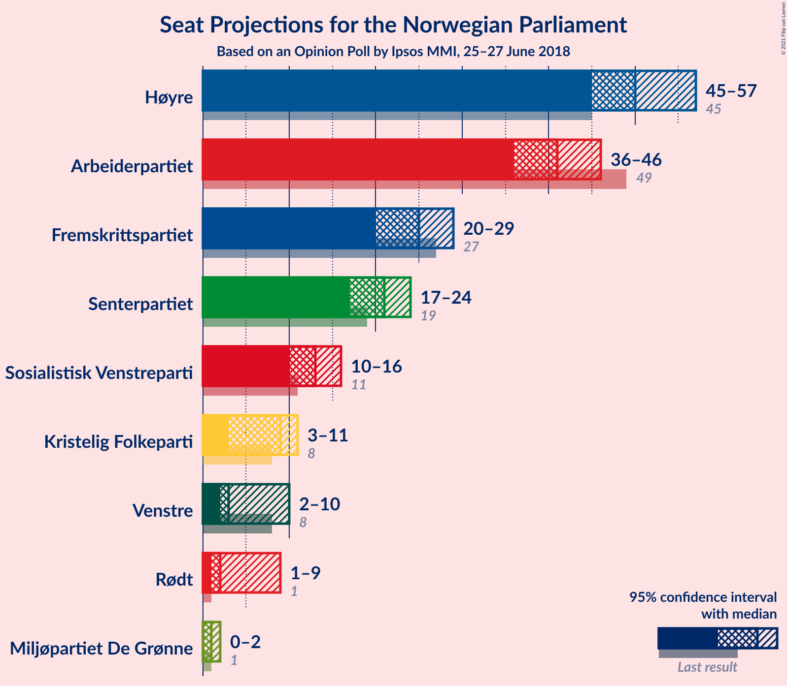

### Confidence Intervals

| Party | Last Result | Median | 80% Confidence Interval | 90% Confidence Interval | 95% Confidence Interval | 99% Confidence Interval |
|:-----:|:-----------:|:------:|:-----------------------:|:-----------------------:|:-----------------------:|:-----------------------:|
| <a href="#høyre">Høyre</a> | 45 | 50 | 47–54 |46–55 |45–56 |44–59 |
| <a href="#arbeiderpartiet">Arbeiderpartiet</a> | 49 | 42 | 40–45 |38–45 |37–46 |35–47 |
| <a href="#fremskrittspartiet">Fremskrittspartiet</a> | 27 | 25 | 21–28 |20–28 |20–29 |18–30 |
| <a href="#senterpartiet">Senterpartiet</a> | 19 | 20 | 17–23 |17–24 |17–25 |17–26 |
| <a href="#sosialistisk-venstreparti">Sosialistisk Venstreparti</a> | 11 | 13 | 11–15 |10–16 |9–16 |9–17 |
| <a href="#kristelig-folkeparti">Kristelig Folkeparti</a> | 8 | 8 | 3–10 |3–11 |3–11 |2–12 |
| <a href="#venstre">Venstre</a> | 8 | 2 | 2–9 |2–9 |2–9 |2–10 |
| <a href="#rødt">Rødt</a> | 1 | 7 | 2–9 |2–9 |2–10 |1–10 |
| <a href="#miljøpartiet-de-grønne">Miljøpartiet De Grønne</a> | 1 | 1 | 0–2 |0–2 |0–2 |0–7 |

### Høyre

*For a full overview of the results for this party, see the [Høyre](party-høyre.html) page.*

| Number of Seats | Probability | Accumulated | Special Marks |
|:---------------:|:-----------:|:-----------:|:-------------:|
| 42 | 0.1% | 100% |  |
| 43 | 0.2% | 99.9% |  |
| 44 | 1.1% | 99.7% |  |
| 45 | 2% | 98.5% | Last Result |
| 46 | 5% | 96% |  |
| 47 | 5% | 92% |  |
| 48 | 20% | 87% |  |
| 49 | 6% | 67% |  |
| 50 | 12% | 60% | Median |
| 51 | 7% | 48% |  |
| 52 | 23% | 41% |  |
| 53 | 6% | 18% |  |
| 54 | 6% | 12% |  |
| 55 | 3% | 6% |  |
| 56 | 2% | 3% |  |
| 57 | 0.3% | 2% |  |
| 58 | 0.7% | 1.3% |  |
| 59 | 0.3% | 0.5% |  |
| 60 | 0.1% | 0.2% |  |
| 61 | 0.1% | 0.1% |  |
| 62 | 0% | 0% |  |

### Arbeiderpartiet

*For a full overview of the results for this party, see the [Arbeiderpartiet](party-arbeiderpartiet.html) page.*

| Number of Seats | Probability | Accumulated | Special Marks |
|:---------------:|:-----------:|:-----------:|:-------------:|
| 33 | 0% | 100% |  |
| 34 | 0.3% | 99.9% |  |
| 35 | 0.5% | 99.7% |  |
| 36 | 0.9% | 99.2% |  |
| 37 | 2% | 98% |  |
| 38 | 2% | 96% |  |
| 39 | 3% | 94% |  |
| 40 | 21% | 91% |  |
| 41 | 4% | 70% |  |
| 42 | 16% | 66% | Median |
| 43 | 25% | 50% |  |
| 44 | 6% | 24% |  |
| 45 | 15% | 18% |  |
| 46 | 2% | 3% |  |
| 47 | 0.3% | 0.6% |  |
| 48 | 0.2% | 0.3% |  |
| 49 | 0% | 0.1% | Last Result |
| 50 | 0% | 0.1% |  |
| 51 | 0.1% | 0.1% |  |
| 52 | 0% | 0% |  |

### Fremskrittspartiet

*For a full overview of the results for this party, see the [Fremskrittspartiet](party-fremskrittspartiet.html) page.*

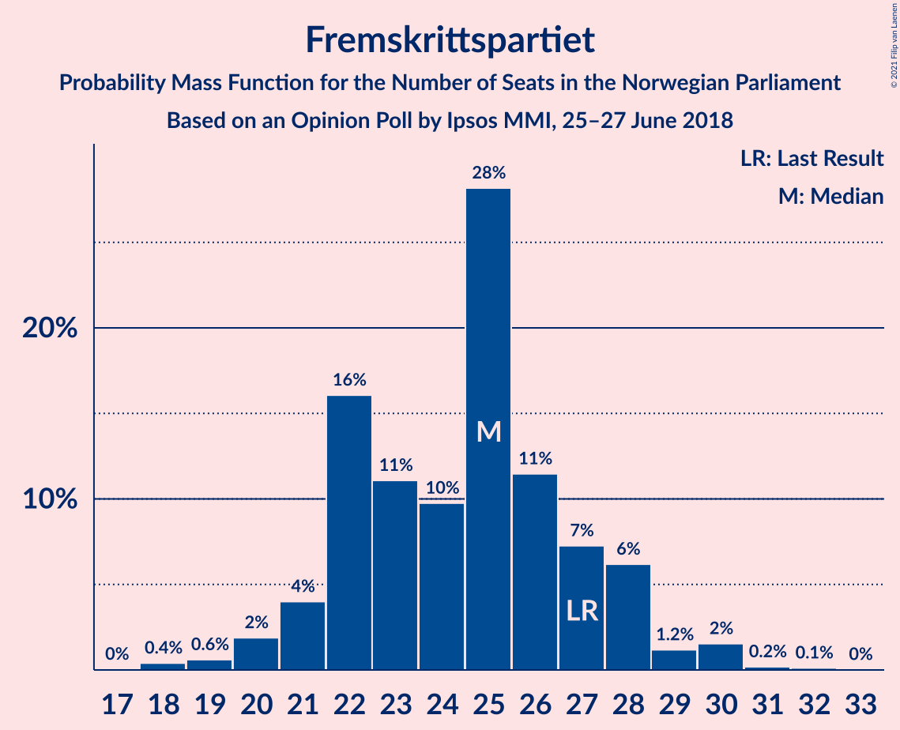

| Number of Seats | Probability | Accumulated | Special Marks |
|:---------------:|:-----------:|:-----------:|:-------------:|
| 18 | 1.0% | 100% |  |
| 19 | 0.3% | 98.9% |  |
| 20 | 7% | 98.6% |  |
| 21 | 2% | 92% |  |
| 22 | 9% | 89% |  |
| 23 | 5% | 80% |  |
| 24 | 14% | 75% |  |
| 25 | 35% | 61% | Median |
| 26 | 4% | 26% |  |
| 27 | 4% | 22% | Last Result |
| 28 | 15% | 18% |  |
| 29 | 2% | 3% |  |
| 30 | 0.5% | 0.9% |  |
| 31 | 0.3% | 0.4% |  |
| 32 | 0.1% | 0.2% |  |
| 33 | 0% | 0.1% |  |
| 34 | 0.1% | 0.1% |  |
| 35 | 0% | 0% |  |

### Senterpartiet

*For a full overview of the results for this party, see the [Senterpartiet](party-senterpartiet.html) page.*

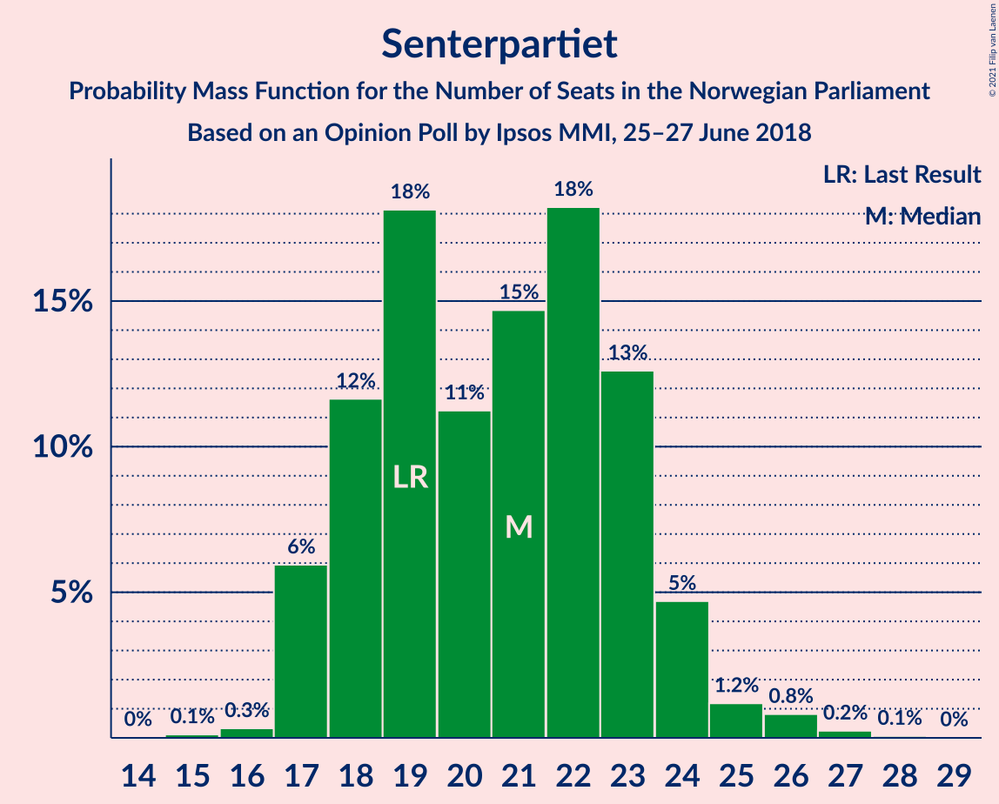

| Number of Seats | Probability | Accumulated | Special Marks |
|:---------------:|:-----------:|:-----------:|:-------------:|
| 15 | 0% | 100% |  |
| 16 | 0.2% | 99.9% |  |
| 17 | 25% | 99.7% |  |
| 18 | 6% | 74% |  |
| 19 | 13% | 68% | Last Result |
| 20 | 10% | 56% | Median |
| 21 | 11% | 46% |  |
| 22 | 24% | 34% |  |
| 23 | 2% | 11% |  |
| 24 | 6% | 9% |  |
| 25 | 2% | 3% |  |
| 26 | 0.9% | 1.3% |  |
| 27 | 0.3% | 0.4% |  |
| 28 | 0% | 0% |  |

### Sosialistisk Venstreparti

*For a full overview of the results for this party, see the [Sosialistisk Venstreparti](party-sosialistiskvenstreparti.html) page.*

| Number of Seats | Probability | Accumulated | Special Marks |
|:---------------:|:-----------:|:-----------:|:-------------:|
| 8 | 0.1% | 100% |  |
| 9 | 3% | 99.9% |  |
| 10 | 7% | 97% |  |
| 11 | 12% | 91% | Last Result |
| 12 | 12% | 79% |  |
| 13 | 30% | 67% | Median |
| 14 | 26% | 38% |  |
| 15 | 3% | 11% |  |
| 16 | 6% | 8% |  |
| 17 | 1.5% | 2% |  |
| 18 | 0.4% | 0.4% |  |
| 19 | 0% | 0% |  |

### Kristelig Folkeparti

*For a full overview of the results for this party, see the [Kristelig Folkeparti](party-kristeligfolkeparti.html) page.*

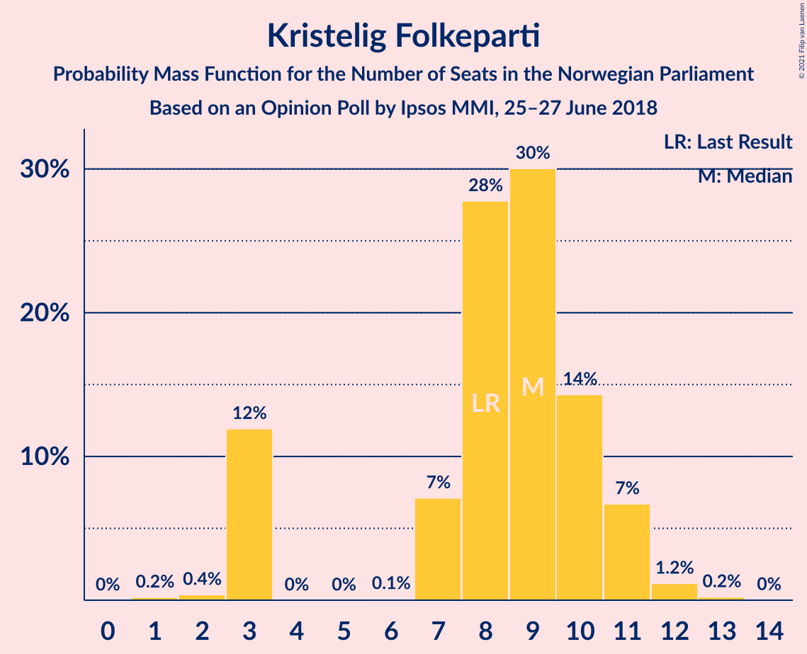

| Number of Seats | Probability | Accumulated | Special Marks |
|:---------------:|:-----------:|:-----------:|:-------------:|
| 1 | 0.4% | 100% |  |
| 2 | 0.2% | 99.6% |  |
| 3 | 15% | 99.3% |  |
| 4 | 0% | 84% |  |
| 5 | 0% | 84% |  |
| 6 | 0% | 84% |  |
| 7 | 7% | 84% |  |
| 8 | 47% | 77% | Last Result, Median |
| 9 | 15% | 30% |  |
| 10 | 8% | 15% |  |
| 11 | 6% | 7% |  |
| 12 | 0.5% | 0.7% |  |
| 13 | 0.2% | 0.2% |  |
| 14 | 0.1% | 0.1% |  |
| 15 | 0% | 0% |  |

### Venstre

*For a full overview of the results for this party, see the [Venstre](party-venstre.html) page.*

| Number of Seats | Probability | Accumulated | Special Marks |
|:---------------:|:-----------:|:-----------:|:-------------:|
| 1 | 0.1% | 100% |  |
| 2 | 55% | 99.9% | Median |
| 3 | 8% | 45% |  |
| 4 | 0% | 37% |  |
| 5 | 0% | 37% |  |
| 6 | 4% | 37% |  |
| 7 | 5% | 33% |  |
| 8 | 14% | 28% | Last Result |
| 9 | 12% | 15% |  |
| 10 | 2% | 2% |  |
| 11 | 0.2% | 0.4% |  |
| 12 | 0.1% | 0.1% |  |
| 13 | 0% | 0% |  |

### Rødt

*For a full overview of the results for this party, see the [Rødt](party-rødt.html) page.*

| Number of Seats | Probability | Accumulated | Special Marks |
|:---------------:|:-----------:|:-----------:|:-------------:|
| 1 | 2% | 100% | Last Result |
| 2 | 37% | 98% |  |
| 3 | 0% | 61% |  |
| 4 | 0% | 61% |  |
| 5 | 0% | 61% |  |
| 6 | 0.2% | 61% |  |
| 7 | 41% | 61% | Median |
| 8 | 10% | 20% |  |
| 9 | 6% | 10% |  |
| 10 | 4% | 4% |  |
| 11 | 0.3% | 0.3% |  |
| 12 | 0% | 0% |  |

### Miljøpartiet De Grønne

*For a full overview of the results for this party, see the [Miljøpartiet De Grønne](party-miljøpartietdegrønne.html) page.*

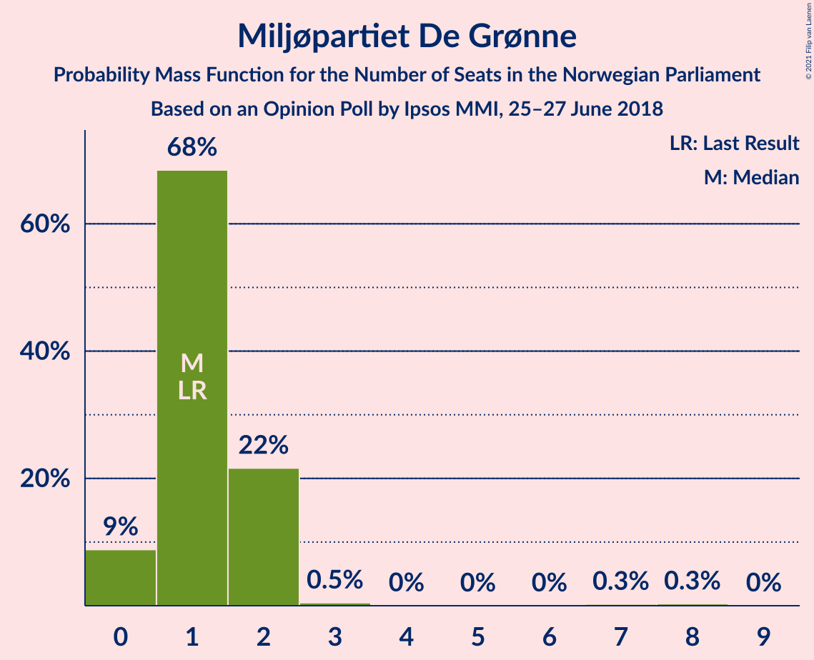

| Number of Seats | Probability | Accumulated | Special Marks |
|:---------------:|:-----------:|:-----------:|:-------------:|
| 0 | 11% | 100% |  |
| 1 | 77% | 89% | Last Result, Median |
| 2 | 10% | 11% |  |
| 3 | 0.5% | 1.2% |  |
| 4 | 0% | 0.7% |  |
| 5 | 0% | 0.6% |  |
| 6 | 0% | 0.6% |  |
| 7 | 0.2% | 0.6% |  |
| 8 | 0.4% | 0.5% |  |
| 9 | 0% | 0% |  |

## Coalitions

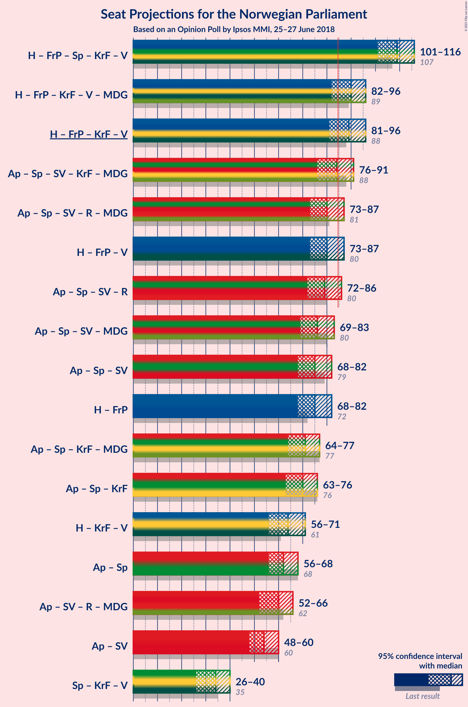

### Confidence Intervals

| Coalition | Last Result | Median | Majority? | 80% Confidence Interval | 90% Confidence Interval | 95% Confidence Interval | 99% Confidence Interval |
|:---------:|:-----------:|:------:|:---------:|:-----------------------:|:-----------------------:|:-----------------------:|:-----------------------:|
| Høyre – Fremskrittspartiet – Senterpartiet – Kristelig Folkeparti – Venstre | 107 | 107 | 100% | 104–111 | 103–113 | 102–114 | 99–117 |
| Høyre – Fremskrittspartiet – Kristelig Folkeparti – Venstre – Miljøpartiet De Grønne | 89 | 88 | 89% | 84–92 | 83–93 | 83–96 | 79–98 |
| Høyre – Fremskrittspartiet – Kristelig Folkeparti – Venstre | 88 | 87 | 79% | 84–91 | 82–92 | 82–95 | 78–97 |
| Arbeiderpartiet – Senterpartiet – Sosialistisk Venstreparti – Kristelig Folkeparti – Miljøpartiet De Grønne | 88 | 83 | 45% | 78–89 | 75–89 | 75–91 | 75–94 |
| Arbeiderpartiet – Senterpartiet – Sosialistisk Venstreparti – Rødt – Miljøpartiet De Grønne | 81 | 82 | 19% | 76–85 | 75–87 | 74–87 | 71–90 |
| Høyre – Fremskrittspartiet – Venstre | 80 | 79 | 5% | 76–83 | 74–85 | 74–86 | 72–89 |
| Arbeiderpartiet – Senterpartiet – Sosialistisk Venstreparti – Rødt | 80 | 81 | 11% | 75–85 | 74–86 | 73–86 | 70–89 |
| Arbeiderpartiet – Senterpartiet – Sosialistisk Venstreparti – Miljøpartiet De Grønne | 80 | 76 | 1.4% | 71–81 | 69–81 | 68–82 | 68–85 |
| Høyre – Fremskrittspartiet | 72 | 75 | 0.8% | 71–79 | 68–80 | 68–81 | 68–86 |
| Arbeiderpartiet – Senterpartiet – Sosialistisk Venstreparti | 79 | 75 | 0.1% | 70–80 | 68–80 | 67–81 | 67–84 |
| Arbeiderpartiet – Senterpartiet – Kristelig Folkeparti – Miljøpartiet De Grønne | 77 | 70 | 0% | 65–76 | 64–76 | 64–78 | 63–78 |
| Arbeiderpartiet – Senterpartiet – Kristelig Folkeparti | 76 | 69 | 0% | 64–75 | 64–75 | 63–76 | 61–77 |
| Høyre – Kristelig Folkeparti – Venstre | 61 | 62 | 0% | 58–68 | 57–69 | 57–69 | 54–72 |
| Arbeiderpartiet – Senterpartiet | 68 | 61 | 0% | 58–67 | 57–67 | 56–68 | 55–69 |
| Arbeiderpartiet – Sosialistisk Venstreparti | 60 | 55 | 0% | 51–58 | 50–58 | 49–60 | 47–62 |
| Senterpartiet – Kristelig Folkeparti – Venstre | 35 | 32 | 0% | 27–38 | 27–38 | 24–40 | 24–43 |

### Høyre – Fremskrittspartiet – Senterpartiet – Kristelig Folkeparti – Venstre

| Number of Seats | Probability | Accumulated | Special Marks |
|:---------------:|:-----------:|:-----------:|:-------------:|
| 97 | 0.1% | 100% |  |
| 98 | 0.3% | 99.9% |  |
| 99 | 0.8% | 99.6% |  |
| 100 | 0.2% | 98.8% |  |
| 101 | 1.1% | 98.7% |  |
| 102 | 0.8% | 98% |  |
| 103 | 3% | 97% |  |
| 104 | 21% | 93% |  |
| 105 | 12% | 72% | Median |
| 106 | 9% | 61% |  |
| 107 | 7% | 52% | Last Result |
| 108 | 17% | 45% |  |
| 109 | 10% | 28% |  |
| 110 | 5% | 18% |  |
| 111 | 4% | 14% |  |
| 112 | 3% | 9% |  |
| 113 | 3% | 6% |  |
| 114 | 2% | 4% |  |
| 115 | 0.5% | 2% |  |
| 116 | 0.2% | 1.2% |  |
| 117 | 0.6% | 1.1% |  |
| 118 | 0.3% | 0.4% |  |
| 119 | 0% | 0.2% |  |
| 120 | 0.1% | 0.1% |  |
| 121 | 0% | 0% |  |

### Høyre – Fremskrittspartiet – Kristelig Folkeparti – Venstre – Miljøpartiet De Grønne

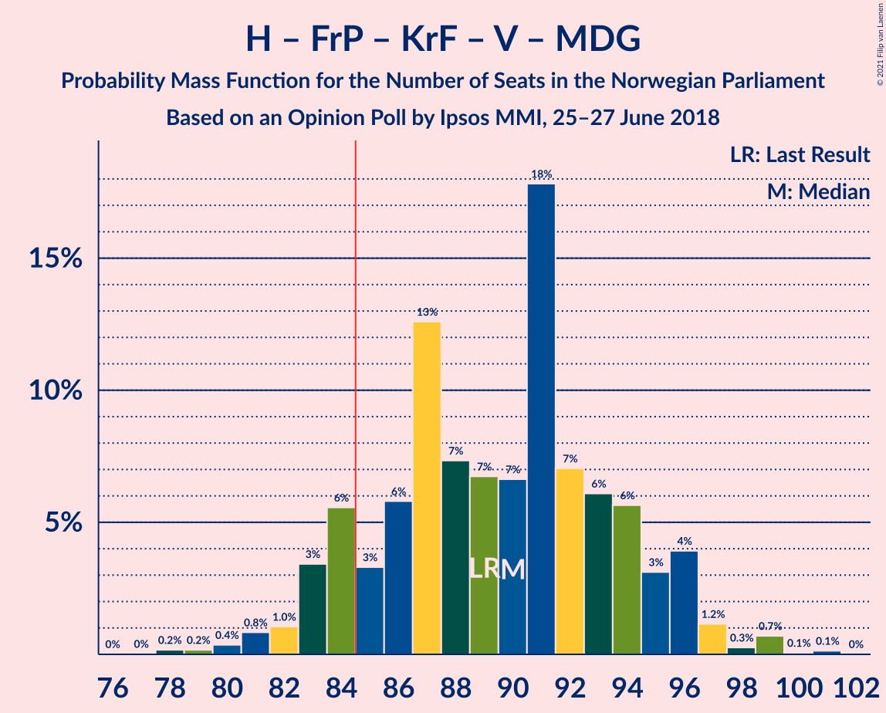

| Number of Seats | Probability | Accumulated | Special Marks |
|:---------------:|:-----------:|:-----------:|:-------------:|
| 77 | 0% | 100% |  |
| 78 | 0.1% | 99.9% |  |
| 79 | 0.4% | 99.9% |  |
| 80 | 0.2% | 99.5% |  |
| 81 | 1.0% | 99.3% |  |
| 82 | 0.6% | 98% |  |
| 83 | 5% | 98% |  |
| 84 | 4% | 92% |  |
| 85 | 8% | 89% | Majority |
| 86 | 7% | 80% | Median |
| 87 | 17% | 73% |  |
| 88 | 20% | 56% |  |
| 89 | 12% | 36% | Last Result |
| 90 | 6% | 25% |  |
| 91 | 5% | 19% |  |
| 92 | 5% | 13% |  |
| 93 | 3% | 8% |  |
| 94 | 0.7% | 5% |  |
| 95 | 1.5% | 4% |  |
| 96 | 1.1% | 3% |  |
| 97 | 0.8% | 2% |  |
| 98 | 0.3% | 0.8% |  |
| 99 | 0.2% | 0.4% |  |
| 100 | 0.2% | 0.2% |  |
| 101 | 0% | 0% |  |

### Høyre – Fremskrittspartiet – Kristelig Folkeparti – Venstre

| Number of Seats | Probability | Accumulated | Special Marks |
|:---------------:|:-----------:|:-----------:|:-------------:|
| 76 | 0% | 100% |  |
| 77 | 0.1% | 99.9% |  |
| 78 | 0.4% | 99.9% |  |
| 79 | 0.3% | 99.5% |  |
| 80 | 1.0% | 99.2% |  |
| 81 | 0.6% | 98% |  |
| 82 | 4% | 98% |  |
| 83 | 2% | 93% |  |
| 84 | 12% | 92% |  |
| 85 | 7% | 79% | Median, Majority |
| 86 | 16% | 72% |  |
| 87 | 20% | 56% |  |
| 88 | 12% | 36% | Last Result |
| 89 | 6% | 24% |  |
| 90 | 4% | 18% |  |
| 91 | 8% | 14% |  |
| 92 | 2% | 6% |  |
| 93 | 1.1% | 5% |  |
| 94 | 0.7% | 3% |  |
| 95 | 0.8% | 3% |  |
| 96 | 1.1% | 2% |  |
| 97 | 0.4% | 0.7% |  |
| 98 | 0.2% | 0.4% |  |
| 99 | 0.1% | 0.2% |  |
| 100 | 0% | 0% |  |

### Arbeiderpartiet – Senterpartiet – Sosialistisk Venstreparti – Kristelig Folkeparti – Miljøpartiet De Grønne

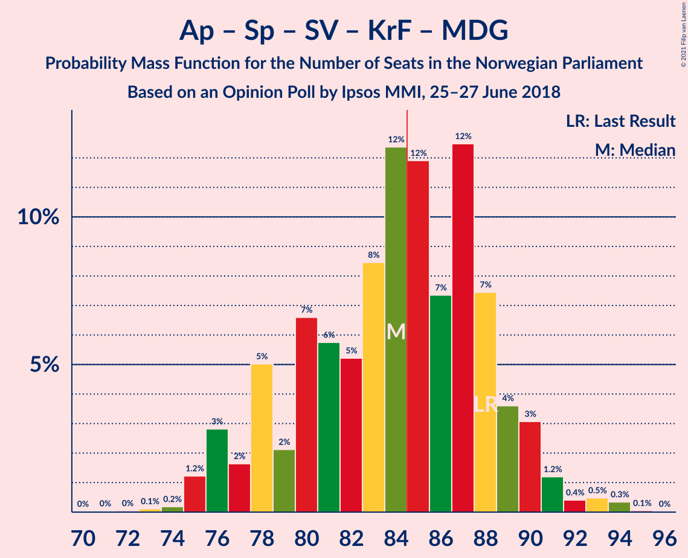

| Number of Seats | Probability | Accumulated | Special Marks |
|:---------------:|:-----------:|:-----------:|:-------------:|
| 72 | 0.1% | 100% |  |
| 73 | 0.2% | 99.9% |  |
| 74 | 0.1% | 99.7% |  |
| 75 | 5% | 99.6% |  |
| 76 | 0.5% | 94% |  |
| 77 | 1.1% | 94% |  |
| 78 | 6% | 93% |  |
| 79 | 2% | 87% |  |
| 80 | 9% | 85% |  |
| 81 | 2% | 76% |  |
| 82 | 4% | 74% |  |
| 83 | 20% | 70% |  |
| 84 | 5% | 50% | Median |
| 85 | 8% | 45% | Majority |
| 86 | 12% | 37% |  |
| 87 | 7% | 24% |  |
| 88 | 0.4% | 17% | Last Result |
| 89 | 13% | 17% |  |
| 90 | 1.3% | 4% |  |
| 91 | 1.3% | 3% |  |
| 92 | 0.2% | 2% |  |
| 93 | 0.1% | 1.5% |  |
| 94 | 1.3% | 1.4% |  |
| 95 | 0.1% | 0.1% |  |
| 96 | 0% | 0% |  |

### Arbeiderpartiet – Senterpartiet – Sosialistisk Venstreparti – Rødt – Miljøpartiet De Grønne

| Number of Seats | Probability | Accumulated | Special Marks |
|:---------------:|:-----------:|:-----------:|:-------------:|
| 68 | 0% | 100% |  |
| 69 | 0% | 99.9% |  |
| 70 | 0.2% | 99.9% |  |
| 71 | 0.5% | 99.8% |  |
| 72 | 0.5% | 99.2% |  |
| 73 | 1.1% | 98.7% |  |
| 74 | 2% | 98% |  |
| 75 | 5% | 96% |  |
| 76 | 2% | 91% |  |
| 77 | 2% | 89% |  |
| 78 | 8% | 87% |  |
| 79 | 4% | 79% |  |
| 80 | 6% | 75% |  |
| 81 | 8% | 69% | Last Result |
| 82 | 20% | 61% |  |
| 83 | 16% | 41% | Median |
| 84 | 7% | 25% |  |
| 85 | 11% | 19% | Majority |
| 86 | 2% | 8% |  |
| 87 | 4% | 6% |  |
| 88 | 0.5% | 2% |  |
| 89 | 0.8% | 1.4% |  |
| 90 | 0.1% | 0.6% |  |
| 91 | 0.4% | 0.4% |  |
| 92 | 0% | 0.1% |  |
| 93 | 0% | 0% |  |

### Høyre – Fremskrittspartiet – Venstre

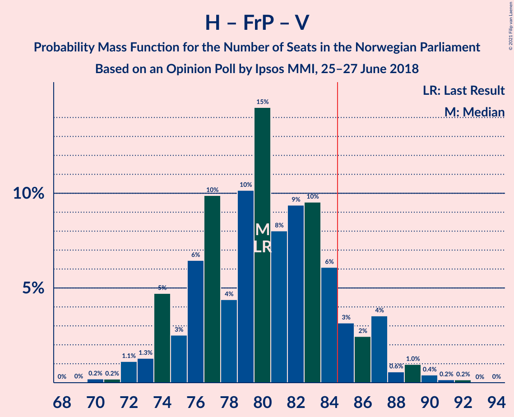

| Number of Seats | Probability | Accumulated | Special Marks |
|:---------------:|:-----------:|:-----------:|:-------------:|
| 69 | 0.1% | 100% |  |
| 70 | 0.1% | 99.9% |  |
| 71 | 0.1% | 99.8% |  |
| 72 | 0.5% | 99.7% |  |
| 73 | 2% | 99.2% |  |
| 74 | 5% | 98% |  |
| 75 | 1.4% | 93% |  |
| 76 | 9% | 92% |  |
| 77 | 7% | 83% | Median |
| 78 | 14% | 75% |  |
| 79 | 21% | 61% |  |
| 80 | 6% | 41% | Last Result |
| 81 | 12% | 35% |  |
| 82 | 10% | 23% |  |
| 83 | 6% | 13% |  |
| 84 | 2% | 7% |  |
| 85 | 2% | 5% | Majority |
| 86 | 1.2% | 3% |  |
| 87 | 0.6% | 2% |  |
| 88 | 0.4% | 2% |  |
| 89 | 0.9% | 1.1% |  |
| 90 | 0.1% | 0.2% |  |
| 91 | 0% | 0.1% |  |
| 92 | 0% | 0.1% |  |
| 93 | 0% | 0% |  |

### Arbeiderpartiet – Senterpartiet – Sosialistisk Venstreparti – Rødt

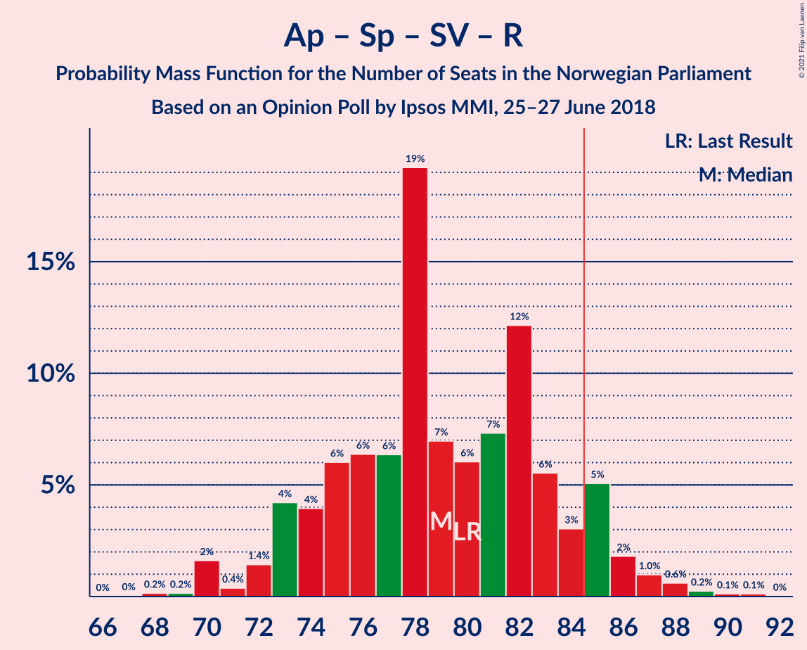

| Number of Seats | Probability | Accumulated | Special Marks |
|:---------------:|:-----------:|:-----------:|:-------------:|
| 67 | 0% | 100% |  |
| 68 | 0% | 99.9% |  |
| 69 | 0.3% | 99.9% |  |
| 70 | 0.6% | 99.7% |  |
| 71 | 0.4% | 99.1% |  |
| 72 | 0.8% | 98.7% |  |
| 73 | 2% | 98% |  |
| 74 | 5% | 96% |  |
| 75 | 1.2% | 90% |  |
| 76 | 4% | 89% |  |
| 77 | 5% | 85% |  |
| 78 | 6% | 80% |  |
| 79 | 6% | 74% |  |
| 80 | 8% | 68% | Last Result |
| 81 | 20% | 61% |  |
| 82 | 17% | 41% | Median |
| 83 | 6% | 24% |  |
| 84 | 8% | 18% |  |
| 85 | 4% | 11% | Majority |
| 86 | 5% | 7% |  |
| 87 | 0.5% | 2% |  |
| 88 | 0.8% | 1.3% |  |
| 89 | 0.1% | 0.5% |  |
| 90 | 0.4% | 0.4% |  |
| 91 | 0% | 0% |  |

### Arbeiderpartiet – Senterpartiet – Sosialistisk Venstreparti – Miljøpartiet De Grønne

| Number of Seats | Probability | Accumulated | Special Marks |
|:---------------:|:-----------:|:-----------:|:-------------:|
| 65 | 0% | 100% |  |
| 66 | 0.1% | 99.9% |  |
| 67 | 0.3% | 99.8% |  |
| 68 | 4% | 99.6% |  |
| 69 | 0.9% | 95% |  |
| 70 | 1.3% | 94% |  |
| 71 | 4% | 93% |  |
| 72 | 5% | 89% |  |
| 73 | 2% | 84% |  |
| 74 | 7% | 82% |  |
| 75 | 25% | 75% |  |
| 76 | 8% | 50% | Median |
| 77 | 6% | 42% |  |
| 78 | 15% | 36% |  |
| 79 | 2% | 21% |  |
| 80 | 2% | 19% | Last Result |
| 81 | 13% | 17% |  |
| 82 | 2% | 4% |  |
| 83 | 0.6% | 2% |  |
| 84 | 0.5% | 2% |  |
| 85 | 1.3% | 1.4% | Majority |
| 86 | 0% | 0.1% |  |
| 87 | 0.1% | 0.1% |  |
| 88 | 0% | 0.1% |  |
| 89 | 0% | 0% |  |

### Høyre – Fremskrittspartiet

| Number of Seats | Probability | Accumulated | Special Marks |
|:---------------:|:-----------:|:-----------:|:-------------:|
| 65 | 0% | 100% |  |
| 66 | 0.1% | 99.9% |  |
| 67 | 0.3% | 99.9% |  |
| 68 | 6% | 99.6% |  |
| 69 | 1.0% | 93% |  |
| 70 | 2% | 92% |  |
| 71 | 8% | 91% |  |
| 72 | 6% | 83% | Last Result |
| 73 | 8% | 77% |  |
| 74 | 5% | 69% |  |
| 75 | 14% | 64% | Median |
| 76 | 15% | 50% |  |
| 77 | 19% | 35% |  |
| 78 | 4% | 15% |  |
| 79 | 4% | 11% |  |
| 80 | 2% | 7% |  |
| 81 | 3% | 5% |  |
| 82 | 0.4% | 2% |  |
| 83 | 0.4% | 1.4% |  |
| 84 | 0.2% | 1.0% |  |
| 85 | 0.1% | 0.8% | Majority |
| 86 | 0.6% | 0.7% |  |
| 87 | 0% | 0.1% |  |
| 88 | 0% | 0% |  |

### Arbeiderpartiet – Senterpartiet – Sosialistisk Venstreparti

| Number of Seats | Probability | Accumulated | Special Marks |
|:---------------:|:-----------:|:-----------:|:-------------:|
| 64 | 0% | 100% |  |
| 65 | 0.1% | 99.9% |  |
| 66 | 0.3% | 99.8% |  |
| 67 | 4% | 99.6% |  |
| 68 | 1.4% | 95% |  |
| 69 | 2% | 94% |  |
| 70 | 5% | 92% |  |
| 71 | 4% | 88% |  |
| 72 | 2% | 83% |  |
| 73 | 6% | 81% |  |
| 74 | 24% | 75% |  |
| 75 | 7% | 51% | Median |
| 76 | 9% | 44% |  |
| 77 | 14% | 35% |  |
| 78 | 3% | 21% |  |
| 79 | 1.5% | 19% | Last Result |
| 80 | 14% | 17% |  |
| 81 | 1.5% | 4% |  |
| 82 | 0.5% | 2% |  |
| 83 | 0.2% | 2% |  |
| 84 | 1.3% | 1.4% |  |
| 85 | 0% | 0.1% | Majority |
| 86 | 0.1% | 0.1% |  |
| 87 | 0% | 0% |  |

### Arbeiderpartiet – Senterpartiet – Kristelig Folkeparti – Miljøpartiet De Grønne

| Number of Seats | Probability | Accumulated | Special Marks |
|:---------------:|:-----------:|:-----------:|:-------------:|
| 60 | 0.1% | 100% |  |
| 61 | 0.1% | 99.9% |  |
| 62 | 0.3% | 99.8% |  |
| 63 | 2% | 99.5% |  |
| 64 | 4% | 98% |  |
| 65 | 6% | 94% |  |
| 66 | 2% | 88% |  |
| 67 | 2% | 85% |  |
| 68 | 8% | 83% |  |
| 69 | 21% | 75% |  |
| 70 | 5% | 53% |  |
| 71 | 3% | 49% | Median |
| 72 | 5% | 46% |  |
| 73 | 11% | 40% |  |
| 74 | 12% | 29% |  |
| 75 | 1.0% | 18% |  |
| 76 | 13% | 17% |  |
| 77 | 1.1% | 4% | Last Result |
| 78 | 2% | 3% |  |
| 79 | 0.1% | 0.3% |  |
| 80 | 0.1% | 0.2% |  |
| 81 | 0% | 0.1% |  |
| 82 | 0.1% | 0.1% |  |
| 83 | 0% | 0% |  |

### Arbeiderpartiet – Senterpartiet – Kristelig Folkeparti

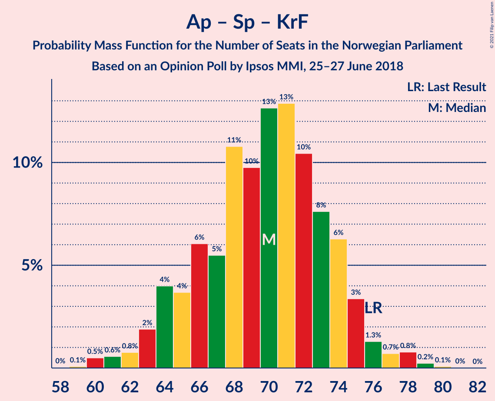

| Number of Seats | Probability | Accumulated | Special Marks |
|:---------------:|:-----------:|:-----------:|:-------------:|
| 59 | 0% | 100% |  |
| 60 | 0.1% | 99.9% |  |
| 61 | 0.3% | 99.8% |  |
| 62 | 2% | 99.5% |  |
| 63 | 0.7% | 98% |  |
| 64 | 10% | 97% |  |
| 65 | 3% | 87% |  |
| 66 | 4% | 85% |  |
| 67 | 6% | 81% |  |
| 68 | 21% | 75% |  |
| 69 | 6% | 54% |  |
| 70 | 4% | 48% | Median |
| 71 | 4% | 44% |  |
| 72 | 11% | 40% |  |
| 73 | 13% | 30% |  |
| 74 | 0.4% | 17% |  |
| 75 | 14% | 16% |  |
| 76 | 0.3% | 3% | Last Result |
| 77 | 2% | 2% |  |
| 78 | 0.1% | 0.2% |  |
| 79 | 0.1% | 0.1% |  |
| 80 | 0% | 0.1% |  |
| 81 | 0.1% | 0.1% |  |
| 82 | 0% | 0% |  |

### Høyre – Kristelig Folkeparti – Venstre

| Number of Seats | Probability | Accumulated | Special Marks |
|:---------------:|:-----------:|:-----------:|:-------------:|
| 52 | 0.2% | 100% |  |
| 53 | 0.2% | 99.7% |  |
| 54 | 1.1% | 99.6% |  |
| 55 | 0.2% | 98% |  |
| 56 | 0.1% | 98% |  |
| 57 | 5% | 98% |  |
| 58 | 15% | 93% |  |
| 59 | 1.0% | 79% |  |
| 60 | 6% | 78% | Median |
| 61 | 6% | 71% | Last Result |
| 62 | 22% | 66% |  |
| 63 | 7% | 44% |  |
| 64 | 17% | 36% |  |
| 65 | 3% | 19% |  |
| 66 | 4% | 17% |  |
| 67 | 2% | 13% |  |
| 68 | 4% | 11% |  |
| 69 | 5% | 7% |  |
| 70 | 0.5% | 2% |  |
| 71 | 0.3% | 1.2% |  |
| 72 | 0.5% | 0.9% |  |
| 73 | 0.1% | 0.4% |  |
| 74 | 0.1% | 0.3% |  |
| 75 | 0.2% | 0.2% |  |
| 76 | 0% | 0% |  |

### Arbeiderpartiet – Senterpartiet

| Number of Seats | Probability | Accumulated | Special Marks |
|:---------------:|:-----------:|:-----------:|:-------------:|
| 53 | 0.1% | 100% |  |
| 54 | 0.2% | 99.9% |  |
| 55 | 1.1% | 99.7% |  |
| 56 | 2% | 98.6% |  |
| 57 | 6% | 97% |  |
| 58 | 4% | 91% |  |
| 59 | 4% | 88% |  |
| 60 | 21% | 84% |  |
| 61 | 14% | 63% |  |
| 62 | 8% | 49% | Median |
| 63 | 2% | 41% |  |
| 64 | 16% | 39% |  |
| 65 | 5% | 22% |  |
| 66 | 1.0% | 17% |  |
| 67 | 13% | 16% |  |
| 68 | 2% | 4% | Last Result |
| 69 | 1.1% | 1.3% |  |
| 70 | 0.1% | 0.2% |  |
| 71 | 0.1% | 0.1% |  |
| 72 | 0.1% | 0.1% |  |
| 73 | 0% | 0% |  |

### Arbeiderpartiet – Sosialistisk Venstreparti

| Number of Seats | Probability | Accumulated | Special Marks |
|:---------------:|:-----------:|:-----------:|:-------------:|
| 44 | 0% | 100% |  |
| 45 | 0% | 99.9% |  |
| 46 | 0.1% | 99.9% |  |
| 47 | 0.3% | 99.8% |  |
| 48 | 2% | 99.4% |  |
| 49 | 2% | 98% |  |
| 50 | 6% | 96% |  |
| 51 | 3% | 90% |  |
| 52 | 8% | 87% |  |
| 53 | 9% | 80% |  |
| 54 | 11% | 71% |  |
| 55 | 11% | 60% | Median |
| 56 | 8% | 50% |  |
| 57 | 25% | 42% |  |
| 58 | 12% | 17% |  |
| 59 | 1.1% | 5% |  |
| 60 | 2% | 4% | Last Result |
| 61 | 0.2% | 2% |  |
| 62 | 1.3% | 2% |  |
| 63 | 0.1% | 0.2% |  |
| 64 | 0.1% | 0.1% |  |
| 65 | 0% | 0% |  |

### Senterpartiet – Kristelig Folkeparti – Venstre

| Number of Seats | Probability | Accumulated | Special Marks |
|:---------------:|:-----------:|:-----------:|:-------------:|
| 22 | 0.1% | 100% |  |
| 23 | 0.3% | 99.9% |  |
| 24 | 2% | 99.6% |  |
| 25 | 0.1% | 97% |  |
| 26 | 0.5% | 97% |  |
| 27 | 22% | 97% |  |
| 28 | 2% | 75% |  |
| 29 | 2% | 73% |  |
| 30 | 7% | 71% | Median |
| 31 | 7% | 64% |  |
| 32 | 18% | 57% |  |
| 33 | 8% | 39% |  |
| 34 | 1.4% | 31% |  |
| 35 | 4% | 30% | Last Result |
| 36 | 9% | 26% |  |
| 37 | 1.2% | 17% |  |
| 38 | 11% | 16% |  |
| 39 | 2% | 5% |  |
| 40 | 0.7% | 3% |  |
| 41 | 0.1% | 2% |  |
| 42 | 1.1% | 2% |  |
| 43 | 0.7% | 0.8% |  |
| 44 | 0.1% | 0.1% |  |
| 45 | 0% | 0% |  |

## Technical Information

### Opinion Poll

+ **Polling firm:** Ipsos MMI
+ **Commissioner(s):** —
+ **Fieldwork period:** 25–27 June 2018

### Calculations

+ **Sample size:** 941
+ **Simulations done:** 131,072
+ **Error estimate:** 1.51%

