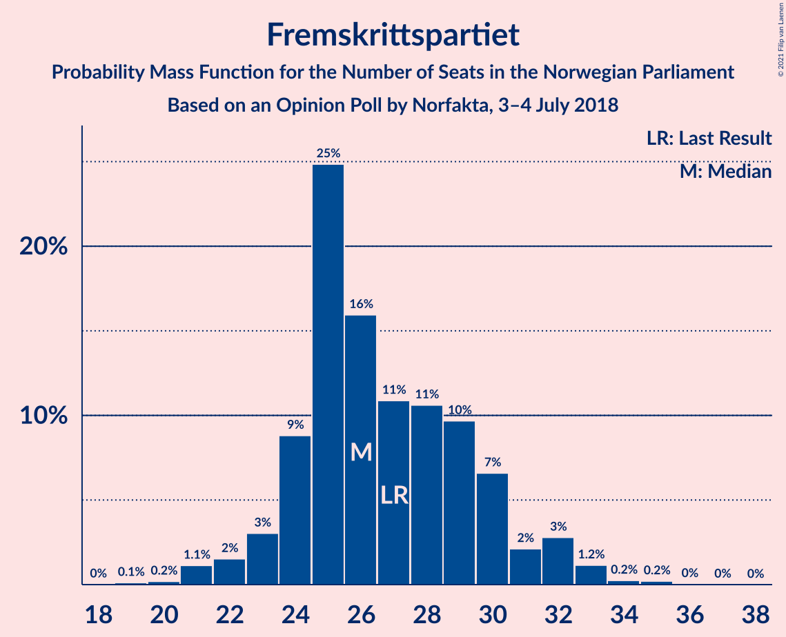
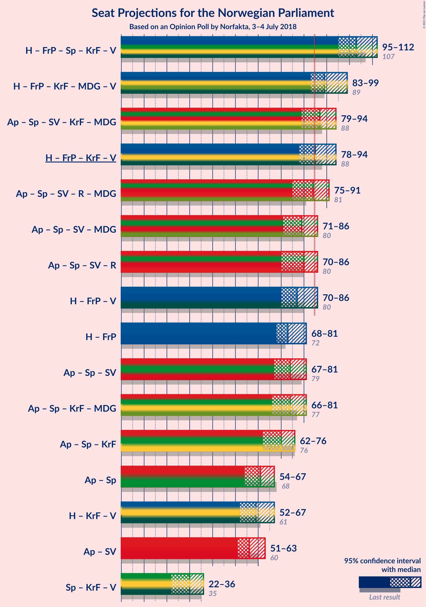
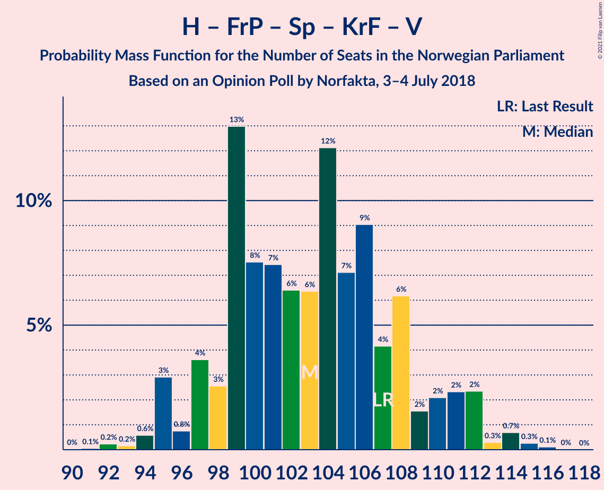
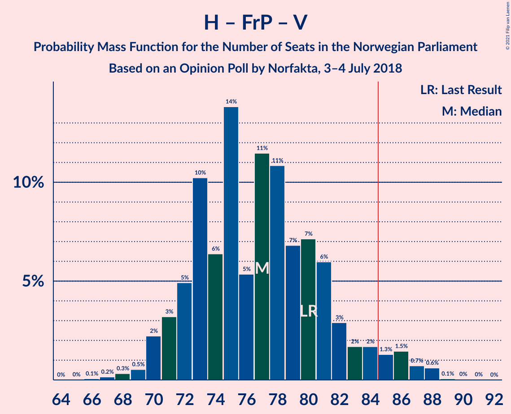
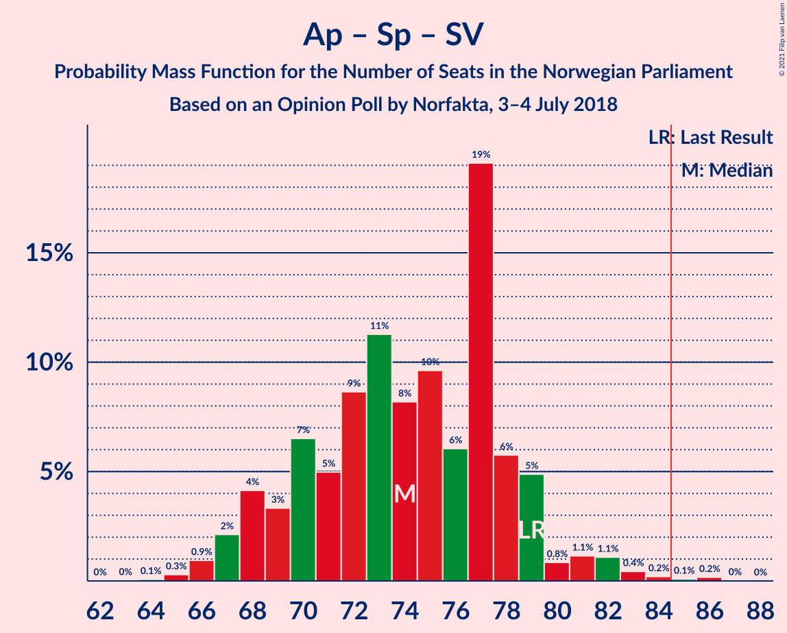
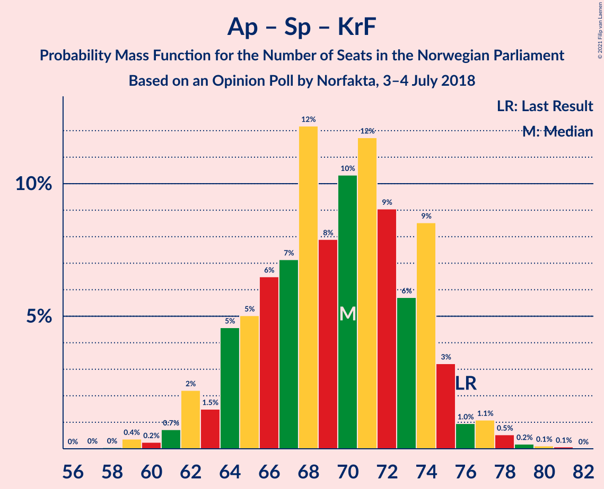
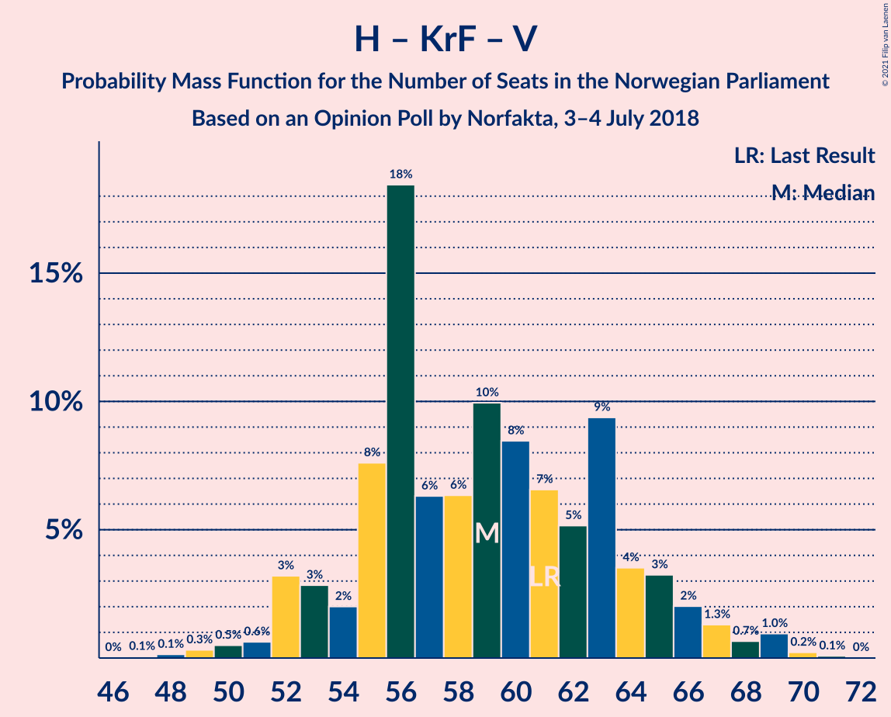

# Opinion Poll by Norfakta, 3–4 July 2018

<a href="#voting-intentions">Voting Intentions</a> | <a href="#seats">Seats</a> | <a href="#coalitions">Coalitions</a> | <a href="#technical-information">Technical Information</a>

## Voting Intentions

### Confidence Intervals

| Party | Last Result | Poll Result | 80% Confidence Interval | 90% Confidence Interval | 95% Confidence Interval | 99% Confidence Interval |
|:-----:|:-----------:|:-----------:|:-----------------------:|:-----------------------:|:-----------------------:|:-----------------------:|
| Høyre | 25.0% | 26.3% | 24.3–28.4% |23.7–29.0% |23.3–29.5% |22.4–30.6% |
| Arbeiderpartiet | 27.4% | 23.7% | 21.7–25.7% |21.2–26.3% |20.8–26.8% |19.9–27.8% |
| Fremskrittspartiet | 15.2% | 14.8% | 13.3–16.6% |12.9–17.1% |12.5–17.6% |11.8–18.4% |
| Senterpartiet | 10.3% | 9.7% | 8.5–11.2% |8.1–11.7% |7.8–12.0% |7.3–12.8% |
| Sosialistisk Venstreparti | 6.0% | 7.5% | 6.4–8.9% |6.1–9.3% |5.8–9.6% |5.3–10.3% |
| Kristelig Folkeparti | 4.2% | 5.0% | 4.1–6.2% |3.9–6.5% |3.7–6.8% |3.3–7.4% |
| Rødt | 2.4% | 3.9% | 3.2–5.0% |3.0–5.3% |2.8–5.6% |2.4–6.1% |
| Miljøpartiet De Grønne | 3.2% | 3.7% | 2.9–4.7% |2.7–5.0% |2.6–5.3% |2.2–5.8% |
| Venstre | 4.4% | 3.4% | 2.7–4.4% |2.5–4.7% |2.3–5.0% |2.0–5.5% |

*Note:* The poll result column reflects the actual value used in the calculations. Published results may vary slightly, and in addition be rounded to fewer digits.

## Seats

### Confidence Intervals

| Party | Last Result | Median | 80% Confidence Interval | 90% Confidence Interval | 95% Confidence Interval | 99% Confidence Interval |
|:-----:|:-----------:|:------:|:-----------------------:|:-----------------------:|:-----------------------:|:-----------------------:|
| <a href="#høyre">Høyre</a> | 45 | 46 | 43–51 |42–52 |41–53 |40–57 |
| <a href="#arbeiderpartiet">Arbeiderpartiet</a> | 49 | 44 | 40–46 |39–47 |38–49 |37–51 |
| <a href="#fremskrittspartiet">Fremskrittspartiet</a> | 27 | 26 | 24–30 |24–32 |22–32 |21–34 |
| <a href="#senterpartiet">Senterpartiet</a> | 19 | 18 | 15–20 |15–20 |14–21 |13–23 |
| <a href="#sosialistisk-venstreparti">Sosialistisk Venstreparti</a> | 11 | 13 | 11–15 |11–16 |10–17 |9–19 |
| <a href="#kristelig-folkeparti">Kristelig Folkeparti</a> | 8 | 9 | 7–11 |3–12 |3–12 |3–13 |
| <a href="#rødt">Rødt</a> | 1 | 7 | 2–9 |2–9 |1–10 |1–11 |
| <a href="#miljøpartiet-de-grønne">Miljøpartiet De Grønne</a> | 1 | 2 | 1–8 |1–9 |1–9 |1–10 |
| <a href="#venstre">Venstre</a> | 8 | 2 | 2–7 |2–8 |2–8 |1–10 |

### Høyre

*For a full overview of the results for this party, see the [Høyre](party-høyre.html) page.*

| Number of Seats | Probability | Accumulated | Special Marks |
|:---------------:|:-----------:|:-----------:|:-------------:|
| 38 | 0.1% | 100% |  |
| 39 | 0.1% | 99.8% |  |
| 40 | 0.4% | 99.7% |  |
| 41 | 2% | 99.3% |  |
| 42 | 5% | 97% |  |
| 43 | 4% | 92% |  |
| 44 | 6% | 88% |  |
| 45 | 14% | 82% | Last Result |
| 46 | 29% | 68% | Median |
| 47 | 5% | 39% |  |
| 48 | 3% | 34% |  |
| 49 | 3% | 31% |  |
| 50 | 7% | 28% |  |
| 51 | 12% | 21% |  |
| 52 | 4% | 8% |  |
| 53 | 3% | 5% |  |
| 54 | 0.5% | 2% |  |
| 55 | 0.2% | 2% |  |
| 56 | 0.6% | 1.4% |  |
| 57 | 0.7% | 0.8% |  |
| 58 | 0.1% | 0.1% |  |
| 59 | 0% | 0% |  |

### Arbeiderpartiet

*For a full overview of the results for this party, see the [Arbeiderpartiet](party-arbeiderpartiet.html) page.*

| Number of Seats | Probability | Accumulated | Special Marks |
|:---------------:|:-----------:|:-----------:|:-------------:|
| 35 | 0.1% | 100% |  |
| 36 | 0.1% | 99.9% |  |
| 37 | 0.8% | 99.7% |  |
| 38 | 2% | 99.0% |  |
| 39 | 5% | 97% |  |
| 40 | 4% | 93% |  |
| 41 | 15% | 88% |  |
| 42 | 10% | 73% |  |
| 43 | 12% | 64% |  |
| 44 | 16% | 51% | Median |
| 45 | 20% | 35% |  |
| 46 | 10% | 16% |  |
| 47 | 2% | 6% |  |
| 48 | 2% | 4% |  |
| 49 | 2% | 3% | Last Result |
| 50 | 0.2% | 0.8% |  |
| 51 | 0.3% | 0.6% |  |
| 52 | 0.1% | 0.2% |  |
| 53 | 0.1% | 0.1% |  |
| 54 | 0% | 0% |  |

### Fremskrittspartiet

*For a full overview of the results for this party, see the [Fremskrittspartiet](party-fremskrittspartiet.html) page.*

| Number of Seats | Probability | Accumulated | Special Marks |
|:---------------:|:-----------:|:-----------:|:-------------:|
| 19 | 0.1% | 100% |  |
| 20 | 0.2% | 99.8% |  |
| 21 | 0.9% | 99.7% |  |
| 22 | 2% | 98.7% |  |
| 23 | 1.3% | 97% |  |
| 24 | 8% | 95% |  |
| 25 | 30% | 87% |  |
| 26 | 13% | 57% | Median |
| 27 | 14% | 44% | Last Result |
| 28 | 5% | 30% |  |
| 29 | 13% | 25% |  |
| 30 | 5% | 12% |  |
| 31 | 2% | 7% |  |
| 32 | 4% | 5% |  |
| 33 | 0.9% | 1.4% |  |
| 34 | 0.2% | 0.6% |  |
| 35 | 0.4% | 0.4% |  |
| 36 | 0% | 0% |  |

### Senterpartiet

*For a full overview of the results for this party, see the [Senterpartiet](party-senterpartiet.html) page.*

| Number of Seats | Probability | Accumulated | Special Marks |
|:---------------:|:-----------:|:-----------:|:-------------:|
| 11 | 0% | 100% |  |
| 12 | 0.3% | 99.9% |  |
| 13 | 1.0% | 99.6% |  |
| 14 | 4% | 98.6% |  |
| 15 | 12% | 95% |  |
| 16 | 10% | 83% |  |
| 17 | 15% | 73% |  |
| 18 | 30% | 59% | Median |
| 19 | 9% | 29% | Last Result |
| 20 | 16% | 20% |  |
| 21 | 2% | 4% |  |
| 22 | 1.4% | 2% |  |
| 23 | 0.6% | 0.8% |  |
| 24 | 0.1% | 0.2% |  |
| 25 | 0% | 0% |  |

### Sosialistisk Venstreparti

*For a full overview of the results for this party, see the [Sosialistisk Venstreparti](party-sosialistiskvenstreparti.html) page.*

| Number of Seats | Probability | Accumulated | Special Marks |
|:---------------:|:-----------:|:-----------:|:-------------:|
| 8 | 0.1% | 100% |  |
| 9 | 0.6% | 99.9% |  |
| 10 | 2% | 99.3% |  |
| 11 | 7% | 97% | Last Result |
| 12 | 18% | 90% |  |
| 13 | 25% | 72% | Median |
| 14 | 29% | 47% |  |
| 15 | 10% | 18% |  |
| 16 | 3% | 8% |  |
| 17 | 2% | 5% |  |
| 18 | 2% | 2% |  |
| 19 | 0.5% | 0.5% |  |
| 20 | 0.1% | 0.1% |  |
| 21 | 0% | 0% |  |

### Kristelig Folkeparti

*For a full overview of the results for this party, see the [Kristelig Folkeparti](party-kristeligfolkeparti.html) page.*

| Number of Seats | Probability | Accumulated | Special Marks |
|:---------------:|:-----------:|:-----------:|:-------------:|
| 1 | 0.1% | 100% |  |
| 2 | 0.3% | 99.9% |  |
| 3 | 6% | 99.5% |  |
| 4 | 0% | 94% |  |
| 5 | 0% | 94% |  |
| 6 | 0.6% | 94% |  |
| 7 | 5% | 93% |  |
| 8 | 33% | 88% | Last Result |
| 9 | 16% | 55% | Median |
| 10 | 26% | 39% |  |
| 11 | 9% | 14% |  |
| 12 | 4% | 5% |  |
| 13 | 1.1% | 1.4% |  |
| 14 | 0.3% | 0.3% |  |
| 15 | 0% | 0.1% |  |
| 16 | 0% | 0% |  |

### Rødt

*For a full overview of the results for this party, see the [Rødt](party-rødt.html) page.*

| Number of Seats | Probability | Accumulated | Special Marks |
|:---------------:|:-----------:|:-----------:|:-------------:|
| 1 | 3% | 100% | Last Result |
| 2 | 44% | 97% |  |
| 3 | 0% | 53% |  |
| 4 | 0% | 53% |  |
| 5 | 0% | 53% |  |
| 6 | 0.5% | 53% |  |
| 7 | 10% | 52% | Median |
| 8 | 30% | 42% |  |
| 9 | 9% | 12% |  |
| 10 | 3% | 4% |  |
| 11 | 0.6% | 0.8% |  |
| 12 | 0.1% | 0.1% |  |
| 13 | 0% | 0% |  |

### Miljøpartiet De Grønne

*For a full overview of the results for this party, see the [Miljøpartiet De Grønne](party-miljøpartietdegrønne.html) page.*

| Number of Seats | Probability | Accumulated | Special Marks |
|:---------------:|:-----------:|:-----------:|:-------------:|
| 1 | 13% | 100% | Last Result |
| 2 | 39% | 87% | Median |
| 3 | 16% | 48% |  |
| 4 | 0% | 32% |  |
| 5 | 0% | 32% |  |
| 6 | 0.2% | 32% |  |
| 7 | 14% | 31% |  |
| 8 | 10% | 17% |  |
| 9 | 6% | 8% |  |
| 10 | 1.0% | 1.3% |  |
| 11 | 0.3% | 0.3% |  |
| 12 | 0% | 0% |  |

### Venstre

*For a full overview of the results for this party, see the [Venstre](party-venstre.html) page.*

| Number of Seats | Probability | Accumulated | Special Marks |
|:---------------:|:-----------:|:-----------:|:-------------:|
| 0 | 0.1% | 100% |  |
| 1 | 2% | 99.9% |  |
| 2 | 72% | 98% | Median |
| 3 | 4% | 26% |  |
| 4 | 0% | 22% |  |
| 5 | 0% | 22% |  |
| 6 | 0.1% | 22% |  |
| 7 | 13% | 22% |  |
| 8 | 6% | 9% | Last Result |
| 9 | 2% | 2% |  |
| 10 | 0.6% | 0.6% |  |
| 11 | 0% | 0.1% |  |
| 12 | 0% | 0% |  |

## Coalitions

### Confidence Intervals

| Coalition | Last Result | Median | Majority? | 80% Confidence Interval | 90% Confidence Interval | 95% Confidence Interval | 99% Confidence Interval |
|:---------:|:-----------:|:------:|:---------:|:-----------------------:|:-----------------------:|:-----------------------:|:-----------------------:|
| Høyre – Fremskrittspartiet – Senterpartiet – Kristelig Folkeparti – Venstre | 107 | 103 | 100% | 99–109 | 98–111 | 96–112 | 94–114 |
| Høyre – Fremskrittspartiet – Kristelig Folkeparti – Miljøpartiet De Grønne – Venstre | 89 | 90 | 78% | 84–95 | 84–97 | 83–99 | 80–100 |
| Arbeiderpartiet – Senterpartiet – Sosialistisk Venstreparti – Kristelig Folkeparti – Miljøpartiet De Grønne | 88 | 88 | 74% | 82–91 | 80–94 | 79–94 | 77–96 |
| Høyre – Fremskrittspartiet – Kristelig Folkeparti – Venstre | 88 | 86 | 61% | 81–91 | 80–92 | 79–94 | 76–98 |
| Arbeiderpartiet – Senterpartiet – Sosialistisk Venstreparti – Rødt – Miljøpartiet De Grønne | 81 | 83 | 39% | 78–88 | 77–89 | 75–90 | 71–93 |
| Arbeiderpartiet – Senterpartiet – Sosialistisk Venstreparti – Miljøpartiet De Grønne | 80 | 79 | 5% | 73–82 | 72–85 | 71–86 | 69–87 |
| Arbeiderpartiet – Senterpartiet – Sosialistisk Venstreparti – Rødt | 80 | 79 | 22% | 74–85 | 72–85 | 70–86 | 69–89 |
| Høyre – Fremskrittspartiet – Venstre | 80 | 77 | 3% | 72–81 | 71–83 | 71–85 | 69–88 |
| Høyre – Fremskrittspartiet | 72 | 73 | 0.8% | 69–78 | 69–79 | 68–81 | 66–86 |
| Arbeiderpartiet – Senterpartiet – Kristelig Folkeparti – Miljøpartiet De Grønne | 77 | 74 | 0.2% | 68–78 | 67–80 | 66–81 | 64–83 |
| Arbeiderpartiet – Senterpartiet – Sosialistisk Venstreparti | 79 | 74 | 0.3% | 69–78 | 68–79 | 68–80 | 66–83 |
| Arbeiderpartiet – Senterpartiet – Kristelig Folkeparti | 76 | 70 | 0% | 65–74 | 63–75 | 62–75 | 59–78 |
| Høyre – Kristelig Folkeparti – Venstre | 61 | 58 | 0% | 55–64 | 53–66 | 52–67 | 49–69 |
| Arbeiderpartiet – Senterpartiet | 68 | 61 | 0% | 57–64 | 55–65 | 55–66 | 54–69 |
| Arbeiderpartiet – Sosialistisk Venstreparti | 60 | 57 | 0% | 53–60 | 52–61 | 51–62 | 49–64 |
| Senterpartiet – Kristelig Folkeparti – Venstre | 35 | 30 | 0% | 26–33 | 25–35 | 23–37 | 21–39 |

### Høyre – Fremskrittspartiet – Senterpartiet – Kristelig Folkeparti – Venstre

| Number of Seats | Probability | Accumulated | Special Marks |
|:---------------:|:-----------:|:-----------:|:-------------:|
| 90 | 0% | 100% |  |
| 91 | 0% | 99.9% |  |
| 92 | 0.2% | 99.9% |  |
| 93 | 0.1% | 99.7% |  |
| 94 | 0.8% | 99.6% |  |
| 95 | 0.8% | 98.7% |  |
| 96 | 0.5% | 98% |  |
| 97 | 2% | 97% |  |
| 98 | 2% | 95% |  |
| 99 | 18% | 93% |  |
| 100 | 10% | 75% |  |
| 101 | 7% | 65% | Median |
| 102 | 6% | 58% |  |
| 103 | 5% | 52% |  |
| 104 | 8% | 46% |  |
| 105 | 5% | 38% |  |
| 106 | 10% | 33% |  |
| 107 | 3% | 23% | Last Result |
| 108 | 9% | 19% |  |
| 109 | 1.4% | 10% |  |
| 110 | 2% | 9% |  |
| 111 | 3% | 6% |  |
| 112 | 2% | 3% |  |
| 113 | 0.2% | 2% |  |
| 114 | 0.8% | 1.3% |  |
| 115 | 0.4% | 0.5% |  |
| 116 | 0% | 0% |  |

### Høyre – Fremskrittspartiet – Kristelig Folkeparti – Miljøpartiet De Grønne – Venstre

| Number of Seats | Probability | Accumulated | Special Marks |
|:---------------:|:-----------:|:-----------:|:-------------:|
| 77 | 0% | 100% |  |
| 78 | 0.1% | 99.9% |  |
| 79 | 0.1% | 99.8% |  |
| 80 | 0.2% | 99.7% |  |
| 81 | 0.6% | 99.5% |  |
| 82 | 0.5% | 98.9% |  |
| 83 | 2% | 98% |  |
| 84 | 18% | 96% |  |
| 85 | 2% | 78% | Median, Majority |
| 86 | 4% | 77% |  |
| 87 | 4% | 73% |  |
| 88 | 9% | 69% |  |
| 89 | 5% | 60% | Last Result |
| 90 | 17% | 54% |  |
| 91 | 8% | 37% |  |
| 92 | 5% | 30% |  |
| 93 | 7% | 25% |  |
| 94 | 5% | 18% |  |
| 95 | 6% | 13% |  |
| 96 | 1.2% | 7% |  |
| 97 | 1.1% | 5% |  |
| 98 | 0.4% | 4% |  |
| 99 | 3% | 4% |  |
| 100 | 0.5% | 0.8% |  |
| 101 | 0.2% | 0.3% |  |
| 102 | 0% | 0.1% |  |
| 103 | 0% | 0% |  |

### Arbeiderpartiet – Senterpartiet – Sosialistisk Venstreparti – Kristelig Folkeparti – Miljøpartiet De Grønne

| Number of Seats | Probability | Accumulated | Special Marks |
|:---------------:|:-----------:|:-----------:|:-------------:|
| 74 | 0.1% | 100% |  |
| 75 | 0.1% | 99.9% |  |
| 76 | 0.2% | 99.8% |  |
| 77 | 0.3% | 99.6% |  |
| 78 | 0.4% | 99.3% |  |
| 79 | 2% | 98.9% |  |
| 80 | 5% | 97% |  |
| 81 | 1.5% | 92% |  |
| 82 | 6% | 91% |  |
| 83 | 4% | 85% |  |
| 84 | 7% | 81% |  |
| 85 | 7% | 74% | Majority |
| 86 | 7% | 67% | Median |
| 87 | 8% | 60% |  |
| 88 | 15% | 53% | Last Result |
| 89 | 16% | 38% |  |
| 90 | 9% | 22% |  |
| 91 | 4% | 13% |  |
| 92 | 2% | 9% |  |
| 93 | 2% | 7% |  |
| 94 | 4% | 6% |  |
| 95 | 0.7% | 2% |  |
| 96 | 0.6% | 0.9% |  |
| 97 | 0.1% | 0.3% |  |
| 98 | 0.1% | 0.1% |  |
| 99 | 0% | 0% |  |

### Høyre – Fremskrittspartiet – Kristelig Folkeparti – Venstre

| Number of Seats | Probability | Accumulated | Special Marks |
|:---------------:|:-----------:|:-----------:|:-------------:|
| 74 | 0.1% | 100% |  |
| 75 | 0.3% | 99.8% |  |
| 76 | 0.4% | 99.5% |  |
| 77 | 0.5% | 99.1% |  |
| 78 | 0.4% | 98.7% |  |
| 79 | 2% | 98% |  |
| 80 | 1.0% | 96% |  |
| 81 | 16% | 95% |  |
| 82 | 12% | 79% |  |
| 83 | 2% | 67% | Median |
| 84 | 5% | 65% |  |
| 85 | 9% | 61% | Majority |
| 86 | 9% | 52% |  |
| 87 | 6% | 43% |  |
| 88 | 14% | 37% | Last Result |
| 89 | 8% | 23% |  |
| 90 | 3% | 15% |  |
| 91 | 3% | 12% |  |
| 92 | 5% | 8% |  |
| 93 | 1.2% | 4% |  |
| 94 | 1.0% | 3% |  |
| 95 | 0.2% | 2% |  |
| 96 | 0.3% | 1.5% |  |
| 97 | 0.7% | 1.2% |  |
| 98 | 0.4% | 0.5% |  |
| 99 | 0% | 0.1% |  |
| 100 | 0% | 0% |  |

### Arbeiderpartiet – Senterpartiet – Sosialistisk Venstreparti – Rødt – Miljøpartiet De Grønne

| Number of Seats | Probability | Accumulated | Special Marks |
|:---------------:|:-----------:|:-----------:|:-------------:|
| 70 | 0% | 100% |  |
| 71 | 0.4% | 99.9% |  |
| 72 | 0.7% | 99.5% |  |
| 73 | 0.3% | 98.8% |  |
| 74 | 0.2% | 98.5% |  |
| 75 | 1.0% | 98% |  |
| 76 | 1.2% | 97% |  |
| 77 | 5% | 96% |  |
| 78 | 3% | 92% |  |
| 79 | 3% | 88% |  |
| 80 | 8% | 85% |  |
| 81 | 14% | 77% | Last Result |
| 82 | 6% | 63% |  |
| 83 | 9% | 57% |  |
| 84 | 9% | 48% | Median |
| 85 | 5% | 39% | Majority |
| 86 | 2% | 35% |  |
| 87 | 12% | 33% |  |
| 88 | 16% | 21% |  |
| 89 | 1.0% | 5% |  |
| 90 | 2% | 4% |  |
| 91 | 0.4% | 2% |  |
| 92 | 0.5% | 1.3% |  |
| 93 | 0.4% | 0.9% |  |
| 94 | 0.3% | 0.5% |  |
| 95 | 0.1% | 0.2% |  |
| 96 | 0% | 0% |  |

### Arbeiderpartiet – Senterpartiet – Sosialistisk Venstreparti – Miljøpartiet De Grønne

| Number of Seats | Probability | Accumulated | Special Marks |
|:---------------:|:-----------:|:-----------:|:-------------:|
| 66 | 0.1% | 100% |  |
| 67 | 0.1% | 99.9% |  |
| 68 | 0.1% | 99.8% |  |
| 69 | 0.7% | 99.7% |  |
| 70 | 1.1% | 99.0% |  |
| 71 | 1.2% | 98% |  |
| 72 | 5% | 97% |  |
| 73 | 3% | 92% |  |
| 74 | 4% | 89% |  |
| 75 | 9% | 85% |  |
| 76 | 10% | 77% |  |
| 77 | 5% | 67% | Median |
| 78 | 5% | 62% |  |
| 79 | 19% | 57% |  |
| 80 | 20% | 39% | Last Result |
| 81 | 7% | 19% |  |
| 82 | 3% | 12% |  |
| 83 | 2% | 9% |  |
| 84 | 1.4% | 7% |  |
| 85 | 1.2% | 5% | Majority |
| 86 | 3% | 4% |  |
| 87 | 0.4% | 0.8% |  |
| 88 | 0.3% | 0.5% |  |
| 89 | 0% | 0.2% |  |
| 90 | 0.1% | 0.1% |  |
| 91 | 0% | 0.1% |  |
| 92 | 0% | 0% |  |

### Arbeiderpartiet – Senterpartiet – Sosialistisk Venstreparti – Rødt

| Number of Seats | Probability | Accumulated | Special Marks |
|:---------------:|:-----------:|:-----------:|:-------------:|
| 67 | 0% | 100% |  |
| 68 | 0.2% | 99.9% |  |
| 69 | 0.5% | 99.7% |  |
| 70 | 3% | 99.2% |  |
| 71 | 0.4% | 96% |  |
| 72 | 1.1% | 96% |  |
| 73 | 1.2% | 95% |  |
| 74 | 6% | 93% |  |
| 75 | 5% | 87% |  |
| 76 | 7% | 82% |  |
| 77 | 5% | 75% |  |
| 78 | 8% | 70% |  |
| 79 | 17% | 63% |  |
| 80 | 5% | 46% | Last Result |
| 81 | 9% | 40% |  |
| 82 | 4% | 31% | Median |
| 83 | 4% | 27% |  |
| 84 | 2% | 23% |  |
| 85 | 18% | 22% | Majority |
| 86 | 2% | 4% |  |
| 87 | 0.5% | 2% |  |
| 88 | 0.6% | 1.1% |  |
| 89 | 0.2% | 0.5% |  |
| 90 | 0.1% | 0.3% |  |
| 91 | 0.1% | 0.2% |  |
| 92 | 0% | 0.1% |  |
| 93 | 0% | 0% |  |

### Høyre – Fremskrittspartiet – Venstre

| Number of Seats | Probability | Accumulated | Special Marks |
|:---------------:|:-----------:|:-----------:|:-------------:|
| 66 | 0.1% | 100% |  |
| 67 | 0.1% | 99.9% |  |
| 68 | 0.3% | 99.8% |  |
| 69 | 0.5% | 99.5% |  |
| 70 | 0.5% | 99.0% |  |
| 71 | 4% | 98% |  |
| 72 | 7% | 94% |  |
| 73 | 16% | 87% |  |
| 74 | 4% | 71% | Median |
| 75 | 5% | 66% |  |
| 76 | 6% | 61% |  |
| 77 | 9% | 55% |  |
| 78 | 14% | 47% |  |
| 79 | 6% | 33% |  |
| 80 | 9% | 27% | Last Result |
| 81 | 8% | 18% |  |
| 82 | 4% | 10% |  |
| 83 | 1.4% | 6% |  |
| 84 | 1.4% | 4% |  |
| 85 | 1.0% | 3% | Majority |
| 86 | 0.3% | 2% |  |
| 87 | 0.3% | 2% |  |
| 88 | 1.1% | 1.3% |  |
| 89 | 0.1% | 0.2% |  |
| 90 | 0.1% | 0.1% |  |
| 91 | 0% | 0% |  |

### Høyre – Fremskrittspartiet

| Number of Seats | Probability | Accumulated | Special Marks |
|:---------------:|:-----------:|:-----------:|:-------------:|
| 63 | 0% | 100% |  |
| 64 | 0.1% | 99.9% |  |
| 65 | 0.2% | 99.8% |  |
| 66 | 0.5% | 99.7% |  |
| 67 | 1.3% | 99.2% |  |
| 68 | 1.4% | 98% |  |
| 69 | 10% | 96% |  |
| 70 | 6% | 86% |  |
| 71 | 19% | 81% |  |
| 72 | 6% | 62% | Last Result, Median |
| 73 | 6% | 56% |  |
| 74 | 8% | 50% |  |
| 75 | 9% | 42% |  |
| 76 | 12% | 33% |  |
| 77 | 5% | 21% |  |
| 78 | 7% | 16% |  |
| 79 | 5% | 9% |  |
| 80 | 2% | 4% |  |
| 81 | 0.5% | 3% |  |
| 82 | 0.4% | 2% |  |
| 83 | 0.7% | 2% |  |
| 84 | 0.1% | 0.9% |  |
| 85 | 0.1% | 0.8% | Majority |
| 86 | 0.6% | 0.7% |  |
| 87 | 0% | 0.1% |  |
| 88 | 0% | 0% |  |

### Arbeiderpartiet – Senterpartiet – Kristelig Folkeparti – Miljøpartiet De Grønne

| Number of Seats | Probability | Accumulated | Special Marks |
|:---------------:|:-----------:|:-----------:|:-------------:|
| 61 | 0.1% | 100% |  |
| 62 | 0.2% | 99.9% |  |
| 63 | 0.1% | 99.7% |  |
| 64 | 0.4% | 99.6% |  |
| 65 | 1.2% | 99.2% |  |
| 66 | 0.8% | 98% |  |
| 67 | 3% | 97% |  |
| 68 | 4% | 94% |  |
| 69 | 6% | 90% |  |
| 70 | 6% | 84% |  |
| 71 | 8% | 78% |  |
| 72 | 7% | 70% |  |
| 73 | 5% | 63% | Median |
| 74 | 15% | 58% |  |
| 75 | 8% | 43% |  |
| 76 | 16% | 34% |  |
| 77 | 6% | 18% | Last Result |
| 78 | 4% | 12% |  |
| 79 | 2% | 8% |  |
| 80 | 0.9% | 6% |  |
| 81 | 4% | 5% |  |
| 82 | 0.4% | 1.0% |  |
| 83 | 0.4% | 0.6% |  |
| 84 | 0.1% | 0.2% |  |
| 85 | 0.1% | 0.2% | Majority |
| 86 | 0% | 0.1% |  |
| 87 | 0% | 0% |  |

### Arbeiderpartiet – Senterpartiet – Sosialistisk Venstreparti

| Number of Seats | Probability | Accumulated | Special Marks |
|:---------------:|:-----------:|:-----------:|:-------------:|
| 63 | 0% | 100% |  |
| 64 | 0.1% | 99.9% |  |
| 65 | 0.2% | 99.8% |  |
| 66 | 0.4% | 99.6% |  |
| 67 | 0.9% | 99.2% |  |
| 68 | 6% | 98% |  |
| 69 | 2% | 92% |  |
| 70 | 6% | 90% |  |
| 71 | 3% | 84% |  |
| 72 | 12% | 80% |  |
| 73 | 11% | 69% |  |
| 74 | 8% | 58% |  |
| 75 | 5% | 50% | Median |
| 76 | 4% | 44% |  |
| 77 | 27% | 40% |  |
| 78 | 6% | 13% |  |
| 79 | 4% | 7% | Last Result |
| 80 | 0.9% | 3% |  |
| 81 | 0.6% | 2% |  |
| 82 | 0.4% | 1.4% |  |
| 83 | 0.5% | 0.9% |  |
| 84 | 0.1% | 0.4% |  |
| 85 | 0.1% | 0.3% | Majority |
| 86 | 0.1% | 0.1% |  |
| 87 | 0% | 0% |  |

### Arbeiderpartiet – Senterpartiet – Kristelig Folkeparti

| Number of Seats | Probability | Accumulated | Special Marks |
|:---------------:|:-----------:|:-----------:|:-------------:|
| 57 | 0% | 100% |  |
| 58 | 0.1% | 99.9% |  |
| 59 | 0.6% | 99.9% |  |
| 60 | 0.2% | 99.2% |  |
| 61 | 0.6% | 99.0% |  |
| 62 | 2% | 98% |  |
| 63 | 2% | 96% |  |
| 64 | 2% | 95% |  |
| 65 | 4% | 93% |  |
| 66 | 6% | 88% |  |
| 67 | 5% | 82% |  |
| 68 | 14% | 77% |  |
| 69 | 10% | 63% |  |
| 70 | 7% | 53% |  |
| 71 | 17% | 46% | Median |
| 72 | 6% | 29% |  |
| 73 | 3% | 23% |  |
| 74 | 14% | 20% |  |
| 75 | 3% | 5% |  |
| 76 | 0.7% | 2% | Last Result |
| 77 | 0.5% | 1.3% |  |
| 78 | 0.5% | 0.8% |  |
| 79 | 0.1% | 0.3% |  |
| 80 | 0.1% | 0.2% |  |
| 81 | 0.1% | 0.1% |  |
| 82 | 0% | 0% |  |

### Høyre – Kristelig Folkeparti – Venstre

| Number of Seats | Probability | Accumulated | Special Marks |
|:---------------:|:-----------:|:-----------:|:-------------:|
| 47 | 0.1% | 100% |  |
| 48 | 0.2% | 99.9% |  |
| 49 | 0.3% | 99.7% |  |
| 50 | 0.5% | 99.4% |  |
| 51 | 0.8% | 98.9% |  |
| 52 | 0.8% | 98% |  |
| 53 | 2% | 97% |  |
| 54 | 2% | 95% |  |
| 55 | 8% | 93% |  |
| 56 | 25% | 85% |  |
| 57 | 7% | 60% | Median |
| 58 | 6% | 54% |  |
| 59 | 2% | 48% |  |
| 60 | 10% | 45% |  |
| 61 | 5% | 35% | Last Result |
| 62 | 4% | 29% |  |
| 63 | 13% | 26% |  |
| 64 | 4% | 12% |  |
| 65 | 2% | 8% |  |
| 66 | 3% | 7% |  |
| 67 | 1.4% | 4% |  |
| 68 | 0.9% | 2% |  |
| 69 | 0.9% | 1.3% |  |
| 70 | 0.2% | 0.3% |  |
| 71 | 0.1% | 0.1% |  |
| 72 | 0% | 0% |  |

### Arbeiderpartiet – Senterpartiet

| Number of Seats | Probability | Accumulated | Special Marks |
|:---------------:|:-----------:|:-----------:|:-------------:|
| 51 | 0.1% | 100% |  |
| 52 | 0.1% | 99.9% |  |
| 53 | 0.2% | 99.7% |  |
| 54 | 2% | 99.6% |  |
| 55 | 4% | 98% |  |
| 56 | 3% | 94% |  |
| 57 | 5% | 91% |  |
| 58 | 10% | 87% |  |
| 59 | 9% | 77% |  |
| 60 | 15% | 68% |  |
| 61 | 6% | 53% |  |
| 62 | 6% | 47% | Median |
| 63 | 16% | 41% |  |
| 64 | 17% | 25% |  |
| 65 | 5% | 8% |  |
| 66 | 1.5% | 3% |  |
| 67 | 0.4% | 2% |  |
| 68 | 0.4% | 1.4% | Last Result |
| 69 | 0.6% | 0.9% |  |
| 70 | 0.2% | 0.3% |  |
| 71 | 0.1% | 0.2% |  |
| 72 | 0.1% | 0.1% |  |
| 73 | 0% | 0% |  |

### Arbeiderpartiet – Sosialistisk Venstreparti

| Number of Seats | Probability | Accumulated | Special Marks |
|:---------------:|:-----------:|:-----------:|:-------------:|
| 47 | 0.1% | 100% |  |
| 48 | 0.2% | 99.9% |  |
| 49 | 0.4% | 99.7% |  |
| 50 | 0.8% | 99.3% |  |
| 51 | 2% | 98% |  |
| 52 | 2% | 96% |  |
| 53 | 7% | 95% |  |
| 54 | 11% | 87% |  |
| 55 | 13% | 76% |  |
| 56 | 9% | 62% |  |
| 57 | 15% | 54% | Median |
| 58 | 4% | 39% |  |
| 59 | 21% | 34% |  |
| 60 | 6% | 14% | Last Result |
| 61 | 3% | 7% |  |
| 62 | 2% | 4% |  |
| 63 | 1.0% | 2% |  |
| 64 | 0.5% | 1.0% |  |
| 65 | 0.1% | 0.5% |  |
| 66 | 0.2% | 0.4% |  |
| 67 | 0.2% | 0.3% |  |
| 68 | 0% | 0.1% |  |
| 69 | 0% | 0% |  |

### Senterpartiet – Kristelig Folkeparti – Venstre

| Number of Seats | Probability | Accumulated | Special Marks |
|:---------------:|:-----------:|:-----------:|:-------------:|
| 18 | 0.1% | 100% |  |
| 19 | 0.1% | 99.9% |  |
| 20 | 0.3% | 99.8% |  |
| 21 | 0.4% | 99.5% |  |
| 22 | 0.6% | 99.1% |  |
| 23 | 2% | 98.5% |  |
| 24 | 1.2% | 96% |  |
| 25 | 3% | 95% |  |
| 26 | 6% | 93% |  |
| 27 | 5% | 87% |  |
| 28 | 27% | 82% |  |
| 29 | 5% | 55% | Median |
| 30 | 11% | 51% |  |
| 31 | 10% | 39% |  |
| 32 | 17% | 29% |  |
| 33 | 3% | 13% |  |
| 34 | 3% | 10% |  |
| 35 | 3% | 7% | Last Result |
| 36 | 1.4% | 4% |  |
| 37 | 0.8% | 3% |  |
| 38 | 1.3% | 2% |  |
| 39 | 0.5% | 0.6% |  |
| 40 | 0% | 0.1% |  |
| 41 | 0% | 0% |  |

## Technical Information

### Opinion Poll

+ **Polling firm:** Norfakta
+ **Commissioner(s):** —
+ **Fieldwork period:** 3–4 July 2018

### Calculations

+ **Sample size:** 761
+ **Simulations done:** 524,288
+ **Error estimate:** 2.03%

