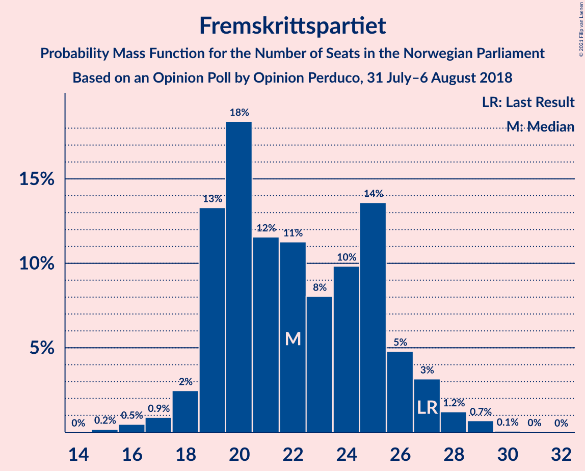
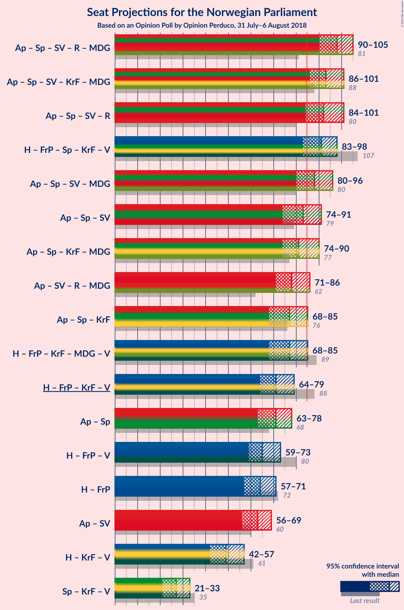
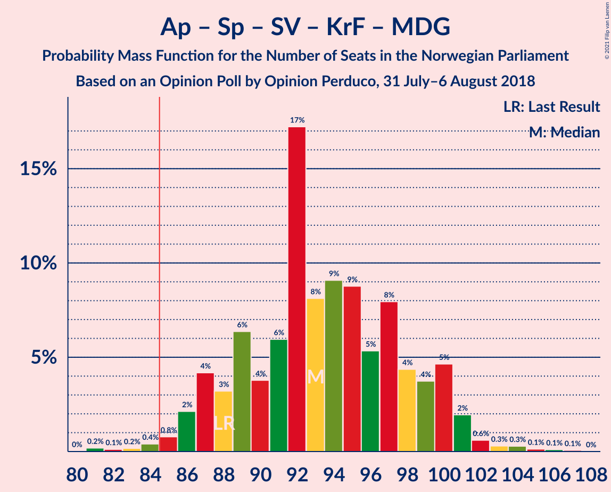
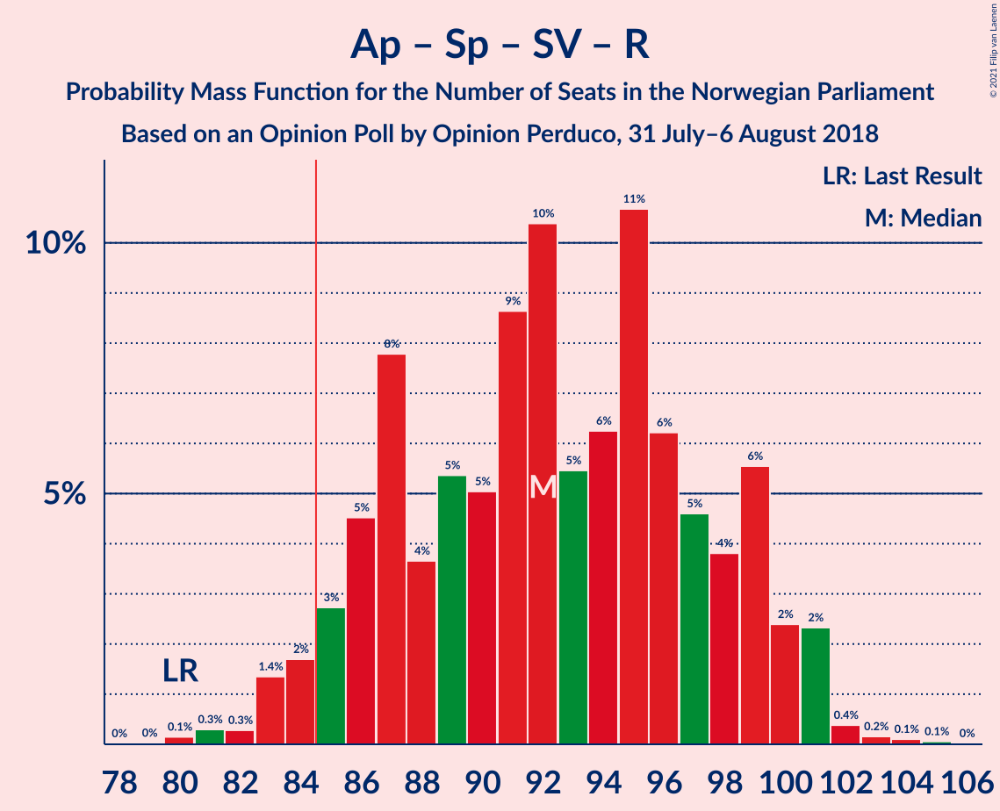
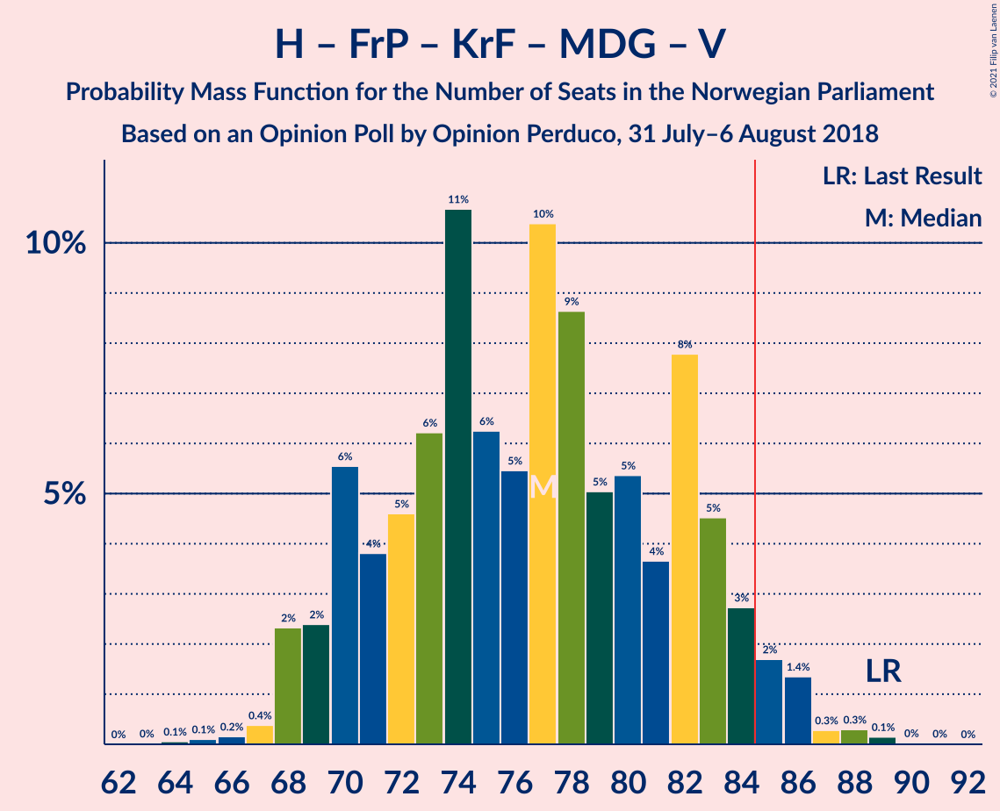
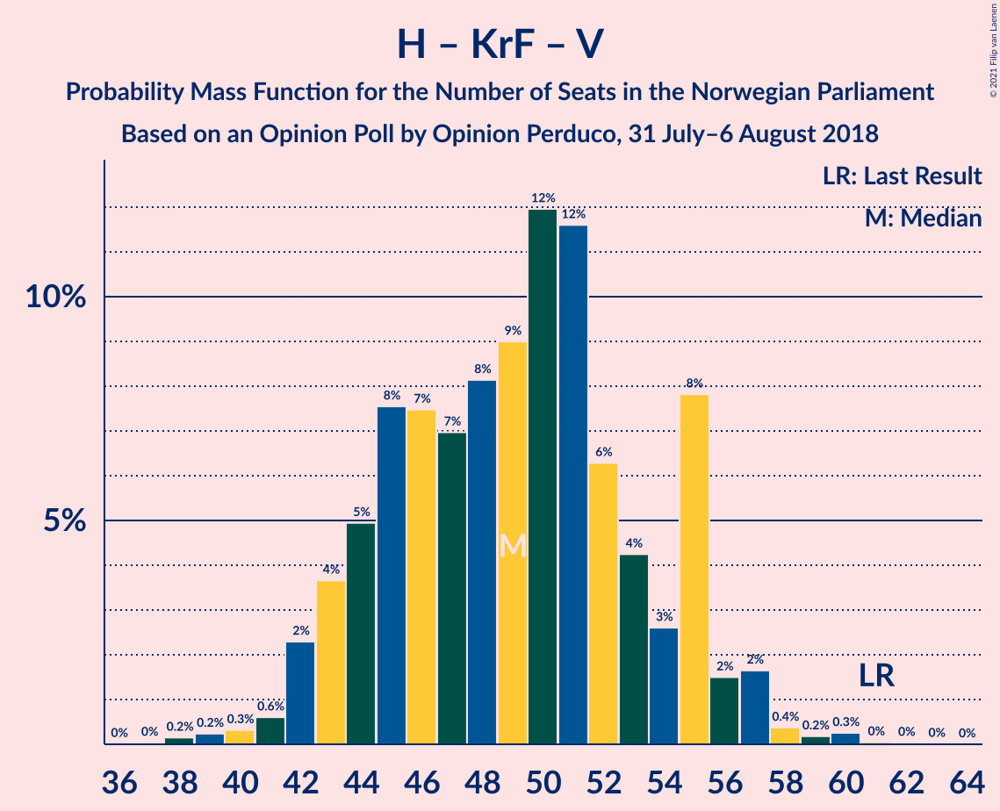
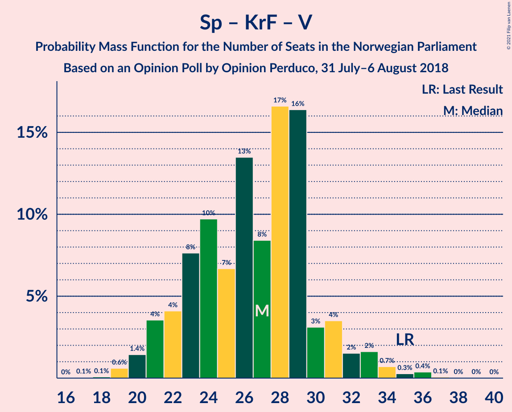

# Opinion Poll by Opinion Perduco, 31 July–6 August 2018

<a href="#voting-intentions">Voting Intentions</a> | <a href="#seats">Seats</a> | <a href="#coalitions">Coalitions</a> | <a href="#technical-information">Technical Information</a>

## Voting Intentions

### Confidence Intervals

| Party | Last Result | Poll Result | 80% Confidence Interval | 90% Confidence Interval | 95% Confidence Interval | 99% Confidence Interval |
|:-----:|:-----------:|:-----------:|:-----------------------:|:-----------------------:|:-----------------------:|:-----------------------:|
| Arbeiderpartiet | 27.4% | 28.3% | 26.2–30.6% |25.5–31.2% |25.0–31.8% |24.0–32.9% |
| Høyre | 25.0% | 23.6% | 21.6–25.8% |21.1–26.4% |20.6–26.9% |19.7–28.0% |
| Fremskrittspartiet | 15.2% | 12.7% | 11.2–14.4% |10.8–15.0% |10.4–15.4% |9.7–16.3% |
| Senterpartiet | 10.3% | 11.2% | 9.8–12.9% |9.4–13.4% |9.1–13.8% |8.4–14.7% |
| Sosialistisk Venstreparti | 6.0% | 6.6% | 5.5–7.9% |5.2–8.3% |4.9–8.7% |4.5–9.4% |
| Rødt | 2.4% | 5.8% | 4.8–7.1% |4.5–7.5% |4.3–7.8% |3.9–8.5% |
| Kristelig Folkeparti | 4.2% | 4.2% | 3.4–5.4% |3.2–5.7% |3.0–6.0% |2.6–6.6% |
| Miljøpartiet De Grønne | 3.2% | 4.1% | 3.3–5.2% |3.0–5.5% |2.8–5.8% |2.5–6.4% |
| Venstre | 4.4% | 2.3% | 1.7–3.3% |1.6–3.5% |1.4–3.8% |1.2–4.3% |

*Note:* The poll result column reflects the actual value used in the calculations. Published results may vary slightly, and in addition be rounded to fewer digits.

## Seats

### Confidence Intervals

| Party | Last Result | Median | 80% Confidence Interval | 90% Confidence Interval | 95% Confidence Interval | 99% Confidence Interval |
|:-----:|:-----------:|:------:|:-----------------------:|:-----------------------:|:-----------------------:|:-----------------------:|
| <a href="#arbeiderpartiet">Arbeiderpartiet</a> | 49 | 52 | 47–55 |46–56 |45–57 |43–58 |
| <a href="#høyre">Høyre</a> | 45 | 42 | 38–46 |37–47 |36–48 |34–50 |
| <a href="#fremskrittspartiet">Fremskrittspartiet</a> | 27 | 22 | 19–25 |19–27 |18–27 |16–29 |
| <a href="#senterpartiet">Senterpartiet</a> | 19 | 19 | 17–22 |16–23 |16–24 |15–26 |
| <a href="#sosialistisk-venstreparti">Sosialistisk Venstreparti</a> | 11 | 11 | 9–14 |9–14 |9–15 |8–16 |
| <a href="#rødt">Rødt</a> | 1 | 10 | 8–12 |8–13 |7–13 |2–15 |
| <a href="#kristelig-folkeparti">Kristelig Folkeparti</a> | 8 | 7 | 2–9 |1–10 |1–10 |1–11 |
| <a href="#miljøpartiet-de-grønne">Miljøpartiet De Grønne</a> | 1 | 7 | 2–9 |1–9 |1–10 |1–11 |
| <a href="#venstre">Venstre</a> | 8 | 1 | 0–2 |0–2 |0–2 |0–7 |

### Arbeiderpartiet

*For a full overview of the results for this party, see the [Arbeiderpartiet](party-arbeiderpartiet.html) page.*

| Number of Seats | Probability | Accumulated | Special Marks |
|:---------------:|:-----------:|:-----------:|:-------------:|
| 40 | 0.1% | 100% |  |
| 41 | 0.1% | 99.9% |  |
| 42 | 0.1% | 99.8% |  |
| 43 | 0.5% | 99.7% |  |
| 44 | 0.8% | 99.2% |  |
| 45 | 2% | 98% |  |
| 46 | 3% | 96% |  |
| 47 | 11% | 93% |  |
| 48 | 6% | 82% |  |
| 49 | 6% | 76% | Last Result |
| 50 | 9% | 70% |  |
| 51 | 7% | 61% |  |
| 52 | 11% | 54% | Median |
| 53 | 10% | 42% |  |
| 54 | 18% | 32% |  |
| 55 | 7% | 15% |  |
| 56 | 5% | 8% |  |
| 57 | 2% | 3% |  |
| 58 | 1.5% | 2% |  |
| 59 | 0.2% | 0.3% |  |
| 60 | 0.1% | 0.1% |  |
| 61 | 0% | 0.1% |  |
| 62 | 0% | 0% |  |

### Høyre

*For a full overview of the results for this party, see the [Høyre](party-høyre.html) page.*

| Number of Seats | Probability | Accumulated | Special Marks |
|:---------------:|:-----------:|:-----------:|:-------------:|
| 32 | 0.1% | 100% |  |
| 33 | 0.1% | 99.9% |  |
| 34 | 0.6% | 99.8% |  |
| 35 | 0.8% | 99.2% |  |
| 36 | 1.2% | 98% |  |
| 37 | 2% | 97% |  |
| 38 | 7% | 95% |  |
| 39 | 12% | 88% |  |
| 40 | 7% | 75% |  |
| 41 | 14% | 68% |  |
| 42 | 12% | 54% | Median |
| 43 | 9% | 42% |  |
| 44 | 10% | 33% |  |
| 45 | 7% | 23% | Last Result |
| 46 | 9% | 17% |  |
| 47 | 4% | 8% |  |
| 48 | 2% | 3% |  |
| 49 | 0.4% | 1.0% |  |
| 50 | 0.3% | 0.6% |  |
| 51 | 0.1% | 0.2% |  |
| 52 | 0.1% | 0.1% |  |
| 53 | 0% | 0% |  |

### Fremskrittspartiet

*For a full overview of the results for this party, see the [Fremskrittspartiet](party-fremskrittspartiet.html) page.*

| Number of Seats | Probability | Accumulated | Special Marks |
|:---------------:|:-----------:|:-----------:|:-------------:|
| 15 | 0.2% | 100% |  |
| 16 | 0.5% | 99.8% |  |
| 17 | 0.9% | 99.3% |  |
| 18 | 2% | 98% |  |
| 19 | 13% | 96% |  |
| 20 | 18% | 83% |  |
| 21 | 12% | 64% |  |
| 22 | 11% | 53% | Median |
| 23 | 8% | 41% |  |
| 24 | 10% | 33% |  |
| 25 | 14% | 24% |  |
| 26 | 5% | 10% |  |
| 27 | 3% | 5% | Last Result |
| 28 | 1.2% | 2% |  |
| 29 | 0.7% | 0.8% |  |
| 30 | 0.1% | 0.1% |  |
| 31 | 0% | 0.1% |  |
| 32 | 0% | 0% |  |

### Senterpartiet

*For a full overview of the results for this party, see the [Senterpartiet](party-senterpartiet.html) page.*

| Number of Seats | Probability | Accumulated | Special Marks |
|:---------------:|:-----------:|:-----------:|:-------------:|
| 13 | 0% | 100% |  |
| 14 | 0.2% | 99.9% |  |
| 15 | 2% | 99.7% |  |
| 16 | 3% | 98% |  |
| 17 | 9% | 95% |  |
| 18 | 13% | 86% |  |
| 19 | 30% | 72% | Last Result, Median |
| 20 | 14% | 43% |  |
| 21 | 13% | 29% |  |
| 22 | 10% | 16% |  |
| 23 | 3% | 6% |  |
| 24 | 2% | 3% |  |
| 25 | 0.6% | 1.1% |  |
| 26 | 0.3% | 0.5% |  |
| 27 | 0.1% | 0.2% |  |
| 28 | 0.1% | 0.1% |  |
| 29 | 0% | 0% |  |

### Sosialistisk Venstreparti

*For a full overview of the results for this party, see the [Sosialistisk Venstreparti](party-sosialistiskvenstreparti.html) page.*

| Number of Seats | Probability | Accumulated | Special Marks |
|:---------------:|:-----------:|:-----------:|:-------------:|
| 2 | 0% | 100% |  |
| 3 | 0% | 99.9% |  |
| 4 | 0% | 99.9% |  |
| 5 | 0% | 99.9% |  |
| 6 | 0% | 99.9% |  |
| 7 | 0.3% | 99.9% |  |
| 8 | 2% | 99.6% |  |
| 9 | 11% | 98% |  |
| 10 | 16% | 87% |  |
| 11 | 25% | 71% | Last Result, Median |
| 12 | 16% | 45% |  |
| 13 | 15% | 30% |  |
| 14 | 11% | 15% |  |
| 15 | 3% | 4% |  |
| 16 | 1.3% | 2% |  |
| 17 | 0.2% | 0.3% |  |
| 18 | 0.1% | 0.1% |  |
| 19 | 0% | 0% |  |

### Rødt

*For a full overview of the results for this party, see the [Rødt](party-rødt.html) page.*

| Number of Seats | Probability | Accumulated | Special Marks |
|:---------------:|:-----------:|:-----------:|:-------------:|
| 1 | 0% | 100% | Last Result |
| 2 | 1.0% | 100% |  |
| 3 | 0% | 99.0% |  |
| 4 | 0% | 99.0% |  |
| 5 | 0% | 99.0% |  |
| 6 | 0% | 99.0% |  |
| 7 | 3% | 99.0% |  |
| 8 | 8% | 96% |  |
| 9 | 23% | 88% |  |
| 10 | 25% | 65% | Median |
| 11 | 24% | 40% |  |
| 12 | 10% | 16% |  |
| 13 | 4% | 6% |  |
| 14 | 1.3% | 2% |  |
| 15 | 0.4% | 0.5% |  |
| 16 | 0.1% | 0.1% |  |
| 17 | 0% | 0% |  |

### Kristelig Folkeparti

*For a full overview of the results for this party, see the [Kristelig Folkeparti](party-kristeligfolkeparti.html) page.*

| Number of Seats | Probability | Accumulated | Special Marks |
|:---------------:|:-----------:|:-----------:|:-------------:|
| 0 | 0.1% | 100% |  |
| 1 | 7% | 99.9% |  |
| 2 | 9% | 93% |  |
| 3 | 28% | 84% |  |
| 4 | 0% | 57% |  |
| 5 | 0% | 57% |  |
| 6 | 0% | 57% |  |
| 7 | 10% | 57% | Median |
| 8 | 27% | 47% | Last Result |
| 9 | 14% | 19% |  |
| 10 | 4% | 6% |  |
| 11 | 1.0% | 1.3% |  |
| 12 | 0.2% | 0.3% |  |
| 13 | 0.1% | 0.1% |  |
| 14 | 0% | 0% |  |

### Miljøpartiet De Grønne

*For a full overview of the results for this party, see the [Miljøpartiet De Grønne](party-miljøpartietdegrønne.html) page.*

| Number of Seats | Probability | Accumulated | Special Marks |
|:---------------:|:-----------:|:-----------:|:-------------:|
| 1 | 6% | 100% | Last Result |
| 2 | 36% | 94% |  |
| 3 | 3% | 58% |  |
| 4 | 0.1% | 55% |  |
| 5 | 0% | 55% |  |
| 6 | 0% | 55% |  |
| 7 | 13% | 55% | Median |
| 8 | 23% | 42% |  |
| 9 | 14% | 19% |  |
| 10 | 4% | 5% |  |
| 11 | 0.7% | 1.0% |  |
| 12 | 0.2% | 0.2% |  |
| 13 | 0.1% | 0.1% |  |
| 14 | 0% | 0% |  |

### Venstre

*For a full overview of the results for this party, see the [Venstre](party-venstre.html) page.*

| Number of Seats | Probability | Accumulated | Special Marks |
|:---------------:|:-----------:|:-----------:|:-------------:|
| 0 | 16% | 100% |  |
| 1 | 40% | 84% | Median |
| 2 | 43% | 44% |  |
| 3 | 0.2% | 1.0% |  |
| 4 | 0% | 0.8% |  |
| 5 | 0% | 0.8% |  |
| 6 | 0.1% | 0.8% |  |
| 7 | 0.5% | 0.7% |  |
| 8 | 0.2% | 0.2% | Last Result |
| 9 | 0% | 0% |  |

## Coalitions

### Confidence Intervals

| Coalition | Last Result | Median | Majority? | 80% Confidence Interval | 90% Confidence Interval | 95% Confidence Interval | 99% Confidence Interval |
|:---------:|:-----------:|:------:|:---------:|:-----------------------:|:-----------------------:|:-----------------------:|:-----------------------:|
| Arbeiderpartiet – Senterpartiet – Sosialistisk Venstreparti – Rødt – Miljøpartiet De Grønne | 81 | 98 | 99.9% | 93–103 | 91–105 | 90–105 | 87–108 |
| Arbeiderpartiet – Senterpartiet – Sosialistisk Venstreparti – Kristelig Folkeparti – Miljøpartiet De Grønne | 88 | 93 | 99.1% | 88–99 | 87–100 | 86–101 | 83–104 |
| Arbeiderpartiet – Senterpartiet – Sosialistisk Venstreparti – Rødt | 80 | 92 | 96% | 86–99 | 85–100 | 84–101 | 81–102 |
| Høyre – Fremskrittspartiet – Senterpartiet – Kristelig Folkeparti – Venstre | 107 | 91 | 94% | 86–95 | 84–97 | 83–98 | 81–101 |
| Arbeiderpartiet – Senterpartiet – Sosialistisk Venstreparti – Miljøpartiet De Grønne | 80 | 88 | 74% | 83–93 | 81–95 | 80–96 | 77–98 |
| Arbeiderpartiet – Senterpartiet – Sosialistisk Venstreparti | 79 | 83 | 35% | 76–88 | 75–89 | 74–91 | 72–92 |
| Arbeiderpartiet – Senterpartiet – Kristelig Folkeparti – Miljøpartiet De Grønne | 77 | 81 | 28% | 77–88 | 75–90 | 74–90 | 71–93 |
| Arbeiderpartiet – Sosialistisk Venstreparti – Rødt – Miljøpartiet De Grønne | 62 | 78 | 6% | 74–83 | 72–85 | 71–86 | 68–88 |
| Arbeiderpartiet – Senterpartiet – Kristelig Folkeparti | 76 | 77 | 4% | 71–82 | 69–83 | 68–85 | 66–87 |
| Høyre – Fremskrittspartiet – Kristelig Folkeparti – Miljøpartiet De Grønne – Venstre | 89 | 77 | 4% | 70–83 | 69–84 | 68–85 | 67–88 |
| Høyre – Fremskrittspartiet – Kristelig Folkeparti – Venstre | 88 | 71 | 0.1% | 66–76 | 64–78 | 64–79 | 61–82 |
| Arbeiderpartiet – Senterpartiet | 68 | 71 | 0% | 66–76 | 64–77 | 63–78 | 60–80 |
| Høyre – Fremskrittspartiet – Venstre | 80 | 65 | 0% | 61–71 | 60–72 | 59–73 | 56–75 |
| Høyre – Fremskrittspartiet | 72 | 64 | 0% | 60–69 | 58–71 | 57–71 | 54–74 |
| Arbeiderpartiet – Sosialistisk Venstreparti | 60 | 63 | 0% | 58–68 | 57–69 | 56–69 | 54–70 |
| Høyre – Kristelig Folkeparti – Venstre | 61 | 49 | 0% | 44–55 | 43–55 | 42–57 | 40–59 |
| Senterpartiet – Kristelig Folkeparti – Venstre | 35 | 27 | 0% | 23–30 | 21–31 | 21–33 | 19–36 |

### Arbeiderpartiet – Senterpartiet – Sosialistisk Venstreparti – Rødt – Miljøpartiet De Grønne

| Number of Seats | Probability | Accumulated | Special Marks |
|:---------------:|:-----------:|:-----------:|:-------------:|
| 81 | 0% | 100% | Last Result |
| 82 | 0% | 100% |  |
| 83 | 0.1% | 100% |  |
| 84 | 0% | 99.9% |  |
| 85 | 0.1% | 99.9% | Majority |
| 86 | 0.1% | 99.8% |  |
| 87 | 0.8% | 99.8% |  |
| 88 | 0.4% | 98.9% |  |
| 89 | 0.8% | 98.6% |  |
| 90 | 2% | 98% |  |
| 91 | 2% | 96% |  |
| 92 | 3% | 94% |  |
| 93 | 6% | 91% |  |
| 94 | 10% | 86% |  |
| 95 | 8% | 76% |  |
| 96 | 5% | 68% |  |
| 97 | 11% | 63% |  |
| 98 | 9% | 51% |  |
| 99 | 8% | 42% | Median |
| 100 | 5% | 35% |  |
| 101 | 12% | 30% |  |
| 102 | 5% | 18% |  |
| 103 | 3% | 13% |  |
| 104 | 3% | 10% |  |
| 105 | 5% | 7% |  |
| 106 | 0.8% | 2% |  |
| 107 | 0.4% | 0.9% |  |
| 108 | 0.2% | 0.5% |  |
| 109 | 0.1% | 0.3% |  |
| 110 | 0.1% | 0.1% |  |
| 111 | 0% | 0.1% |  |
| 112 | 0% | 0% |  |

### Arbeiderpartiet – Senterpartiet – Sosialistisk Venstreparti – Kristelig Folkeparti – Miljøpartiet De Grønne

| Number of Seats | Probability | Accumulated | Special Marks |
|:---------------:|:-----------:|:-----------:|:-------------:|
| 81 | 0.2% | 100% |  |
| 82 | 0.1% | 99.8% |  |
| 83 | 0.2% | 99.7% |  |
| 84 | 0.4% | 99.5% |  |
| 85 | 0.8% | 99.1% | Majority |
| 86 | 2% | 98% |  |
| 87 | 4% | 96% |  |
| 88 | 3% | 92% | Last Result |
| 89 | 6% | 89% |  |
| 90 | 4% | 82% |  |
| 91 | 6% | 79% |  |
| 92 | 17% | 73% |  |
| 93 | 8% | 55% |  |
| 94 | 9% | 47% |  |
| 95 | 9% | 38% |  |
| 96 | 5% | 29% | Median |
| 97 | 8% | 24% |  |
| 98 | 4% | 16% |  |
| 99 | 4% | 12% |  |
| 100 | 5% | 8% |  |
| 101 | 2% | 3% |  |
| 102 | 0.6% | 1.5% |  |
| 103 | 0.3% | 0.9% |  |
| 104 | 0.3% | 0.6% |  |
| 105 | 0.1% | 0.3% |  |
| 106 | 0.1% | 0.2% |  |
| 107 | 0.1% | 0.1% |  |
| 108 | 0% | 0% |  |

### Arbeiderpartiet – Senterpartiet – Sosialistisk Venstreparti – Rødt

| Number of Seats | Probability | Accumulated | Special Marks |
|:---------------:|:-----------:|:-----------:|:-------------:|
| 79 | 0% | 100% |  |
| 80 | 0.1% | 99.9% | Last Result |
| 81 | 0.3% | 99.8% |  |
| 82 | 0.3% | 99.5% |  |
| 83 | 1.4% | 99.2% |  |
| 84 | 2% | 98% |  |
| 85 | 3% | 96% | Majority |
| 86 | 5% | 93% |  |
| 87 | 8% | 89% |  |
| 88 | 4% | 81% |  |
| 89 | 5% | 77% |  |
| 90 | 5% | 72% |  |
| 91 | 9% | 67% |  |
| 92 | 10% | 58% | Median |
| 93 | 5% | 48% |  |
| 94 | 6% | 43% |  |
| 95 | 11% | 36% |  |
| 96 | 6% | 26% |  |
| 97 | 5% | 19% |  |
| 98 | 4% | 15% |  |
| 99 | 6% | 11% |  |
| 100 | 2% | 5% |  |
| 101 | 2% | 3% |  |
| 102 | 0.4% | 0.7% |  |
| 103 | 0.2% | 0.3% |  |
| 104 | 0.1% | 0.2% |  |
| 105 | 0.1% | 0.1% |  |
| 106 | 0% | 0% |  |

### Høyre – Fremskrittspartiet – Senterpartiet – Kristelig Folkeparti – Venstre

| Number of Seats | Probability | Accumulated | Special Marks |
|:---------------:|:-----------:|:-----------:|:-------------:|
| 78 | 0% | 100% |  |
| 79 | 0.1% | 99.9% |  |
| 80 | 0.1% | 99.9% |  |
| 81 | 0.3% | 99.8% |  |
| 82 | 0.5% | 99.4% |  |
| 83 | 3% | 98.9% |  |
| 84 | 1.4% | 96% |  |
| 85 | 2% | 94% | Majority |
| 86 | 3% | 92% |  |
| 87 | 10% | 89% |  |
| 88 | 7% | 78% |  |
| 89 | 12% | 71% |  |
| 90 | 8% | 60% |  |
| 91 | 8% | 52% | Median |
| 92 | 13% | 44% |  |
| 93 | 6% | 31% |  |
| 94 | 10% | 25% |  |
| 95 | 6% | 15% |  |
| 96 | 3% | 9% |  |
| 97 | 2% | 6% |  |
| 98 | 2% | 4% |  |
| 99 | 0.3% | 2% |  |
| 100 | 0.7% | 2% |  |
| 101 | 1.0% | 1.4% |  |
| 102 | 0.2% | 0.4% |  |
| 103 | 0.1% | 0.2% |  |
| 104 | 0.1% | 0.1% |  |
| 105 | 0% | 0% |  |
| 106 | 0% | 0% |  |
| 107 | 0% | 0% | Last Result |

### Arbeiderpartiet – Senterpartiet – Sosialistisk Venstreparti – Miljøpartiet De Grønne

| Number of Seats | Probability | Accumulated | Special Marks |
|:---------------:|:-----------:|:-----------:|:-------------:|
| 74 | 0% | 100% |  |
| 75 | 0.1% | 99.9% |  |
| 76 | 0.1% | 99.8% |  |
| 77 | 0.8% | 99.7% |  |
| 78 | 0.4% | 98.9% |  |
| 79 | 0.9% | 98% |  |
| 80 | 1.4% | 98% | Last Result |
| 81 | 3% | 96% |  |
| 82 | 3% | 94% |  |
| 83 | 4% | 91% |  |
| 84 | 13% | 87% |  |
| 85 | 6% | 74% | Majority |
| 86 | 6% | 68% |  |
| 87 | 12% | 62% |  |
| 88 | 8% | 50% |  |
| 89 | 10% | 42% | Median |
| 90 | 9% | 32% |  |
| 91 | 4% | 23% |  |
| 92 | 6% | 19% |  |
| 93 | 3% | 13% |  |
| 94 | 3% | 10% |  |
| 95 | 3% | 7% |  |
| 96 | 3% | 4% |  |
| 97 | 0.5% | 1.0% |  |
| 98 | 0.2% | 0.5% |  |
| 99 | 0.2% | 0.3% |  |
| 100 | 0% | 0.1% |  |
| 101 | 0.1% | 0.1% |  |
| 102 | 0% | 0% |  |

### Arbeiderpartiet – Senterpartiet – Sosialistisk Venstreparti

| Number of Seats | Probability | Accumulated | Special Marks |
|:---------------:|:-----------:|:-----------:|:-------------:|
| 69 | 0% | 100% |  |
| 70 | 0% | 99.9% |  |
| 71 | 0.2% | 99.9% |  |
| 72 | 0.8% | 99.7% |  |
| 73 | 0.7% | 98.9% |  |
| 74 | 2% | 98% |  |
| 75 | 3% | 97% |  |
| 76 | 4% | 94% |  |
| 77 | 9% | 90% |  |
| 78 | 4% | 81% |  |
| 79 | 4% | 77% | Last Result |
| 80 | 9% | 73% |  |
| 81 | 8% | 64% |  |
| 82 | 5% | 56% | Median |
| 83 | 9% | 51% |  |
| 84 | 7% | 42% |  |
| 85 | 10% | 35% | Majority |
| 86 | 5% | 25% |  |
| 87 | 4% | 20% |  |
| 88 | 10% | 16% |  |
| 89 | 1.3% | 6% |  |
| 90 | 1.2% | 4% |  |
| 91 | 3% | 3% |  |
| 92 | 0.3% | 0.6% |  |
| 93 | 0.2% | 0.3% |  |
| 94 | 0.1% | 0.1% |  |
| 95 | 0% | 0% |  |

### Arbeiderpartiet – Senterpartiet – Kristelig Folkeparti – Miljøpartiet De Grønne

| Number of Seats | Probability | Accumulated | Special Marks |
|:---------------:|:-----------:|:-----------:|:-------------:|
| 69 | 0% | 100% |  |
| 70 | 0.2% | 99.9% |  |
| 71 | 0.4% | 99.7% |  |
| 72 | 0.3% | 99.3% |  |
| 73 | 1.5% | 99.1% |  |
| 74 | 2% | 98% |  |
| 75 | 1.5% | 95% |  |
| 76 | 4% | 94% |  |
| 77 | 5% | 90% | Last Result |
| 78 | 5% | 85% |  |
| 79 | 8% | 80% |  |
| 80 | 10% | 72% |  |
| 81 | 14% | 63% |  |
| 82 | 6% | 49% |  |
| 83 | 10% | 43% |  |
| 84 | 5% | 33% |  |
| 85 | 6% | 28% | Median, Majority |
| 86 | 5% | 21% |  |
| 87 | 3% | 16% |  |
| 88 | 5% | 13% |  |
| 89 | 2% | 8% |  |
| 90 | 4% | 6% |  |
| 91 | 0.5% | 2% |  |
| 92 | 0.6% | 1.1% |  |
| 93 | 0.1% | 0.6% |  |
| 94 | 0.2% | 0.4% |  |
| 95 | 0.1% | 0.2% |  |
| 96 | 0% | 0.1% |  |
| 97 | 0% | 0% |  |

### Arbeiderpartiet – Sosialistisk Venstreparti – Rødt – Miljøpartiet De Grønne

| Number of Seats | Probability | Accumulated | Special Marks |
|:---------------:|:-----------:|:-----------:|:-------------:|
| 62 | 0% | 100% | Last Result |
| 63 | 0% | 100% |  |
| 64 | 0% | 100% |  |
| 65 | 0.1% | 100% |  |
| 66 | 0.1% | 99.9% |  |
| 67 | 0.2% | 99.8% |  |
| 68 | 1.0% | 99.6% |  |
| 69 | 0.7% | 98.6% |  |
| 70 | 0.3% | 98% |  |
| 71 | 2% | 98% |  |
| 72 | 2% | 96% |  |
| 73 | 3% | 94% |  |
| 74 | 6% | 91% |  |
| 75 | 10% | 85% |  |
| 76 | 6% | 75% |  |
| 77 | 13% | 69% |  |
| 78 | 8% | 56% |  |
| 79 | 8% | 48% |  |
| 80 | 12% | 40% | Median |
| 81 | 7% | 29% |  |
| 82 | 10% | 22% |  |
| 83 | 3% | 11% |  |
| 84 | 2% | 8% |  |
| 85 | 1.4% | 6% | Majority |
| 86 | 3% | 4% |  |
| 87 | 0.5% | 1.1% |  |
| 88 | 0.3% | 0.6% |  |
| 89 | 0.1% | 0.2% |  |
| 90 | 0.1% | 0.1% |  |
| 91 | 0% | 0.1% |  |
| 92 | 0% | 0% |  |

### Arbeiderpartiet – Senterpartiet – Kristelig Folkeparti

| Number of Seats | Probability | Accumulated | Special Marks |
|:---------------:|:-----------:|:-----------:|:-------------:|
| 63 | 0.1% | 100% |  |
| 64 | 0% | 99.9% |  |
| 65 | 0.1% | 99.9% |  |
| 66 | 0.8% | 99.8% |  |
| 67 | 0.5% | 99.0% |  |
| 68 | 3% | 98.5% |  |
| 69 | 3% | 96% |  |
| 70 | 1.1% | 93% |  |
| 71 | 3% | 92% |  |
| 72 | 10% | 89% |  |
| 73 | 4% | 79% |  |
| 74 | 10% | 75% |  |
| 75 | 4% | 65% |  |
| 76 | 8% | 61% | Last Result |
| 77 | 11% | 54% |  |
| 78 | 7% | 43% | Median |
| 79 | 7% | 36% |  |
| 80 | 9% | 28% |  |
| 81 | 9% | 20% |  |
| 82 | 4% | 11% |  |
| 83 | 3% | 7% |  |
| 84 | 1.1% | 5% |  |
| 85 | 2% | 4% | Majority |
| 86 | 0.4% | 1.4% |  |
| 87 | 0.6% | 1.0% |  |
| 88 | 0.2% | 0.4% |  |
| 89 | 0.1% | 0.1% |  |
| 90 | 0% | 0.1% |  |
| 91 | 0% | 0% |  |

### Høyre – Fremskrittspartiet – Kristelig Folkeparti – Miljøpartiet De Grønne – Venstre

| Number of Seats | Probability | Accumulated | Special Marks |
|:---------------:|:-----------:|:-----------:|:-------------:|
| 64 | 0.1% | 100% |  |
| 65 | 0.1% | 99.9% |  |
| 66 | 0.2% | 99.8% |  |
| 67 | 0.4% | 99.7% |  |
| 68 | 2% | 99.3% |  |
| 69 | 2% | 97% |  |
| 70 | 6% | 95% |  |
| 71 | 4% | 89% |  |
| 72 | 5% | 85% |  |
| 73 | 6% | 81% |  |
| 74 | 11% | 74% |  |
| 75 | 6% | 64% |  |
| 76 | 5% | 57% |  |
| 77 | 10% | 52% |  |
| 78 | 9% | 42% |  |
| 79 | 5% | 33% | Median |
| 80 | 5% | 28% |  |
| 81 | 4% | 23% |  |
| 82 | 8% | 19% |  |
| 83 | 5% | 11% |  |
| 84 | 3% | 7% |  |
| 85 | 2% | 4% | Majority |
| 86 | 1.4% | 2% |  |
| 87 | 0.3% | 0.8% |  |
| 88 | 0.3% | 0.5% |  |
| 89 | 0.1% | 0.2% | Last Result |
| 90 | 0% | 0.1% |  |
| 91 | 0% | 0% |  |

### Høyre – Fremskrittspartiet – Kristelig Folkeparti – Venstre

| Number of Seats | Probability | Accumulated | Special Marks |
|:---------------:|:-----------:|:-----------:|:-------------:|
| 58 | 0% | 100% |  |
| 59 | 0.1% | 99.9% |  |
| 60 | 0.1% | 99.9% |  |
| 61 | 0.2% | 99.7% |  |
| 62 | 0.4% | 99.5% |  |
| 63 | 0.8% | 99.1% |  |
| 64 | 5% | 98% |  |
| 65 | 3% | 93% |  |
| 66 | 3% | 90% |  |
| 67 | 5% | 87% |  |
| 68 | 12% | 82% |  |
| 69 | 5% | 70% |  |
| 70 | 8% | 65% |  |
| 71 | 9% | 58% |  |
| 72 | 11% | 49% | Median |
| 73 | 5% | 37% |  |
| 74 | 8% | 32% |  |
| 75 | 10% | 24% |  |
| 76 | 6% | 14% |  |
| 77 | 3% | 9% |  |
| 78 | 2% | 6% |  |
| 79 | 2% | 4% |  |
| 80 | 0.8% | 2% |  |
| 81 | 0.4% | 1.4% |  |
| 82 | 0.8% | 1.1% |  |
| 83 | 0.1% | 0.2% |  |
| 84 | 0.1% | 0.2% |  |
| 85 | 0% | 0.1% | Majority |
| 86 | 0.1% | 0.1% |  |
| 87 | 0% | 0% |  |
| 88 | 0% | 0% | Last Result |

### Arbeiderpartiet – Senterpartiet

| Number of Seats | Probability | Accumulated | Special Marks |
|:---------------:|:-----------:|:-----------:|:-------------:|
| 59 | 0% | 100% |  |
| 60 | 0.6% | 99.9% |  |
| 61 | 0.5% | 99.3% |  |
| 62 | 0.8% | 98.9% |  |
| 63 | 2% | 98% |  |
| 64 | 1.3% | 96% |  |
| 65 | 3% | 94% |  |
| 66 | 11% | 91% |  |
| 67 | 5% | 80% |  |
| 68 | 3% | 75% | Last Result |
| 69 | 10% | 72% |  |
| 70 | 7% | 62% |  |
| 71 | 11% | 55% | Median |
| 72 | 5% | 44% |  |
| 73 | 9% | 38% |  |
| 74 | 12% | 29% |  |
| 75 | 4% | 17% |  |
| 76 | 4% | 13% |  |
| 77 | 4% | 9% |  |
| 78 | 3% | 5% |  |
| 79 | 1.2% | 2% |  |
| 80 | 0.4% | 0.7% |  |
| 81 | 0.2% | 0.3% |  |
| 82 | 0.1% | 0.1% |  |
| 83 | 0% | 0.1% |  |
| 84 | 0% | 0% |  |

### Høyre – Fremskrittspartiet – Venstre

| Number of Seats | Probability | Accumulated | Special Marks |
|:---------------:|:-----------:|:-----------:|:-------------:|
| 53 | 0% | 100% |  |
| 54 | 0.2% | 99.9% |  |
| 55 | 0.2% | 99.8% |  |
| 56 | 0.3% | 99.6% |  |
| 57 | 0.7% | 99.2% |  |
| 58 | 0.6% | 98.5% |  |
| 59 | 2% | 98% |  |
| 60 | 6% | 96% |  |
| 61 | 8% | 90% |  |
| 62 | 5% | 82% |  |
| 63 | 7% | 78% |  |
| 64 | 9% | 70% |  |
| 65 | 15% | 61% | Median |
| 66 | 7% | 46% |  |
| 67 | 10% | 39% |  |
| 68 | 8% | 30% |  |
| 69 | 6% | 22% |  |
| 70 | 5% | 15% |  |
| 71 | 4% | 10% |  |
| 72 | 3% | 7% |  |
| 73 | 2% | 4% |  |
| 74 | 0.4% | 1.1% |  |
| 75 | 0.2% | 0.7% |  |
| 76 | 0.2% | 0.5% |  |
| 77 | 0.1% | 0.2% |  |
| 78 | 0% | 0.1% |  |
| 79 | 0% | 0% |  |
| 80 | 0% | 0% | Last Result |

### Høyre – Fremskrittspartiet

| Number of Seats | Probability | Accumulated | Special Marks |
|:---------------:|:-----------:|:-----------:|:-------------:|
| 52 | 0.1% | 100% |  |
| 53 | 0.2% | 99.9% |  |
| 54 | 0.2% | 99.6% |  |
| 55 | 0.4% | 99.5% |  |
| 56 | 0.5% | 99.0% |  |
| 57 | 2% | 98.6% |  |
| 58 | 4% | 97% |  |
| 59 | 3% | 93% |  |
| 60 | 10% | 90% |  |
| 61 | 6% | 80% |  |
| 62 | 7% | 74% |  |
| 63 | 9% | 67% |  |
| 64 | 16% | 58% | Median |
| 65 | 6% | 42% |  |
| 66 | 11% | 37% |  |
| 67 | 7% | 26% |  |
| 68 | 5% | 19% |  |
| 69 | 5% | 14% |  |
| 70 | 4% | 9% |  |
| 71 | 4% | 6% |  |
| 72 | 0.7% | 2% | Last Result |
| 73 | 0.6% | 1.2% |  |
| 74 | 0.2% | 0.5% |  |
| 75 | 0.2% | 0.4% |  |
| 76 | 0.1% | 0.2% |  |
| 77 | 0% | 0% |  |

### Arbeiderpartiet – Sosialistisk Venstreparti

| Number of Seats | Probability | Accumulated | Special Marks |
|:---------------:|:-----------:|:-----------:|:-------------:|
| 51 | 0% | 100% |  |
| 52 | 0.1% | 99.9% |  |
| 53 | 0.1% | 99.8% |  |
| 54 | 0.8% | 99.7% |  |
| 55 | 0.8% | 98.9% |  |
| 56 | 1.5% | 98% |  |
| 57 | 4% | 97% |  |
| 58 | 9% | 93% |  |
| 59 | 9% | 84% |  |
| 60 | 6% | 75% | Last Result |
| 61 | 9% | 69% |  |
| 62 | 6% | 60% |  |
| 63 | 7% | 54% | Median |
| 64 | 10% | 48% |  |
| 65 | 8% | 37% |  |
| 66 | 9% | 29% |  |
| 67 | 8% | 20% |  |
| 68 | 5% | 12% |  |
| 69 | 6% | 7% |  |
| 70 | 0.6% | 1.0% |  |
| 71 | 0.2% | 0.4% |  |
| 72 | 0.1% | 0.2% |  |
| 73 | 0.1% | 0.1% |  |
| 74 | 0% | 0.1% |  |
| 75 | 0% | 0% |  |

### Høyre – Kristelig Folkeparti – Venstre

| Number of Seats | Probability | Accumulated | Special Marks |
|:---------------:|:-----------:|:-----------:|:-------------:|
| 37 | 0% | 100% |  |
| 38 | 0.2% | 99.9% |  |
| 39 | 0.2% | 99.8% |  |
| 40 | 0.3% | 99.6% |  |
| 41 | 0.6% | 99.2% |  |
| 42 | 2% | 98.6% |  |
| 43 | 4% | 96% |  |
| 44 | 5% | 93% |  |
| 45 | 8% | 88% |  |
| 46 | 7% | 80% |  |
| 47 | 7% | 73% |  |
| 48 | 8% | 66% |  |
| 49 | 9% | 58% |  |
| 50 | 12% | 49% | Median |
| 51 | 12% | 37% |  |
| 52 | 6% | 25% |  |
| 53 | 4% | 19% |  |
| 54 | 3% | 14% |  |
| 55 | 8% | 12% |  |
| 56 | 2% | 4% |  |
| 57 | 2% | 3% |  |
| 58 | 0.4% | 0.9% |  |
| 59 | 0.2% | 0.5% |  |
| 60 | 0.3% | 0.4% |  |
| 61 | 0% | 0.1% | Last Result |
| 62 | 0% | 0.1% |  |
| 63 | 0% | 0% |  |

### Senterpartiet – Kristelig Folkeparti – Venstre

| Number of Seats | Probability | Accumulated | Special Marks |
|:---------------:|:-----------:|:-----------:|:-------------:|
| 17 | 0.1% | 100% |  |
| 18 | 0.1% | 99.9% |  |
| 19 | 0.6% | 99.9% |  |
| 20 | 1.4% | 99.3% |  |
| 21 | 4% | 98% |  |
| 22 | 4% | 94% |  |
| 23 | 8% | 90% |  |
| 24 | 10% | 83% |  |
| 25 | 7% | 73% |  |
| 26 | 13% | 66% |  |
| 27 | 8% | 53% | Median |
| 28 | 17% | 44% |  |
| 29 | 16% | 28% |  |
| 30 | 3% | 11% |  |
| 31 | 4% | 8% |  |
| 32 | 2% | 5% |  |
| 33 | 2% | 3% |  |
| 34 | 0.7% | 1.5% |  |
| 35 | 0.3% | 0.8% | Last Result |
| 36 | 0.4% | 0.5% |  |
| 37 | 0.1% | 0.1% |  |
| 38 | 0% | 0.1% |  |
| 39 | 0% | 0% |  |

## Technical Information

### Opinion Poll

+ **Polling firm:** Opinion Perduco
+ **Commissioner(s):** —
+ **Fieldwork period:** 31 July–6 August 2018

### Calculations

+ **Sample size:** 686
+ **Simulations done:** 1,048,576
+ **Error estimate:** 1.91%

