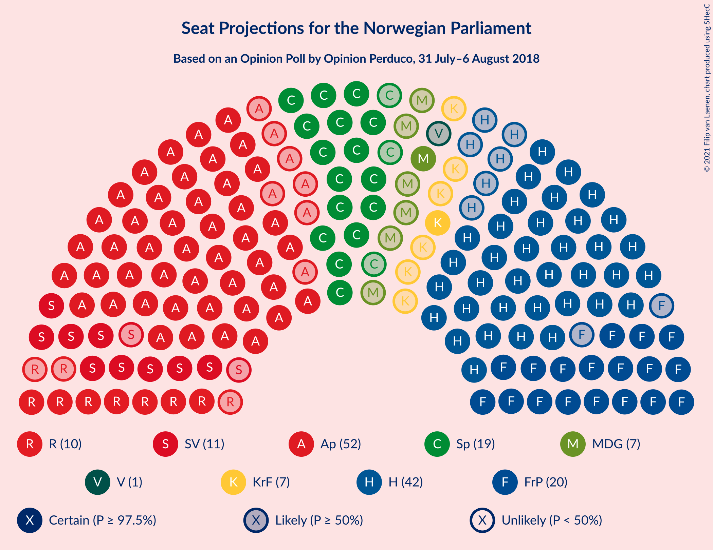
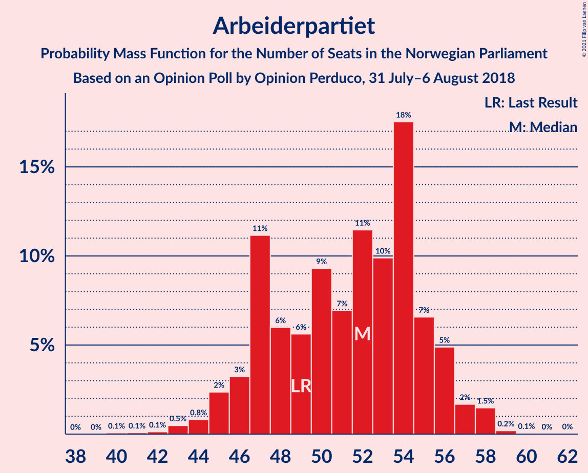
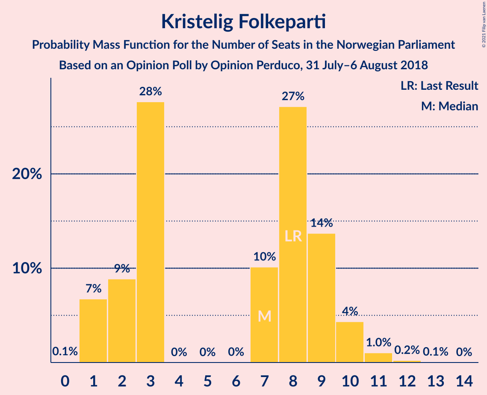
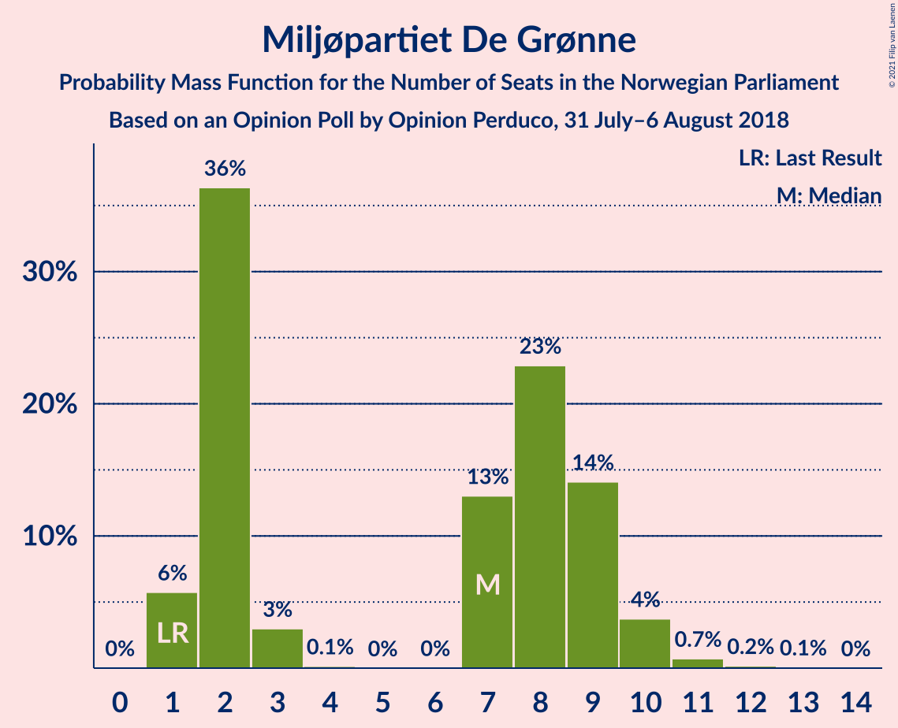
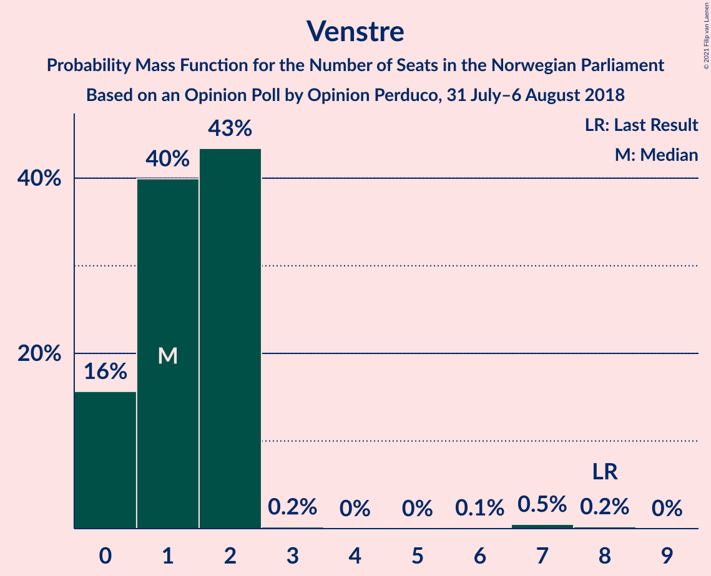
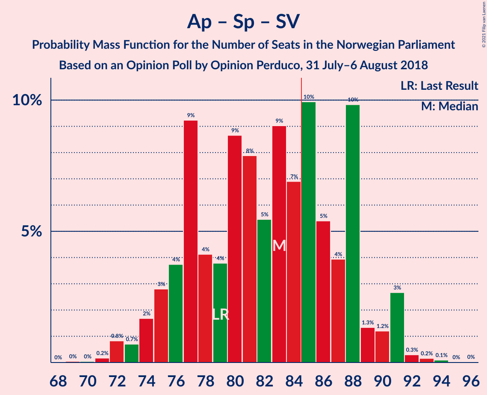

# Opinion Poll by Opinion Perduco, 31 July–6 August 2018

<a href="#voting-intentions">Voting Intentions</a> | <a href="#seats">Seats</a> | <a href="#coalitions">Coalitions</a> | <a href="#technical-information">Technical Information</a>

## Voting Intentions

### Confidence Intervals

| Party | Last Result | Poll Result | 80% Confidence Interval | 90% Confidence Interval | 95% Confidence Interval | 99% Confidence Interval |
|:-----:|:-----------:|:-----------:|:-----------------------:|:-----------------------:|:-----------------------:|:-----------------------:|
| Arbeiderpartiet | 27.4% | 28.3% | 26.2–30.6% |25.5–31.2% |25.0–31.8% |24.0–32.9% |
| Høyre | 25.0% | 23.6% | 21.6–25.8% |21.1–26.4% |20.6–26.9% |19.7–28.0% |
| Fremskrittspartiet | 15.2% | 12.7% | 11.2–14.4% |10.8–15.0% |10.4–15.4% |9.7–16.3% |
| Senterpartiet | 10.3% | 11.2% | 9.8–12.9% |9.4–13.4% |9.1–13.8% |8.4–14.7% |
| Sosialistisk Venstreparti | 6.0% | 6.6% | 5.5–7.9% |5.2–8.3% |4.9–8.7% |4.5–9.4% |
| Rødt | 2.4% | 5.8% | 4.8–7.1% |4.5–7.5% |4.3–7.8% |3.9–8.5% |
| Kristelig Folkeparti | 4.2% | 4.2% | 3.4–5.4% |3.2–5.7% |3.0–6.0% |2.6–6.6% |
| Miljøpartiet De Grønne | 3.2% | 4.1% | 3.3–5.2% |3.0–5.5% |2.8–5.8% |2.5–6.4% |
| Venstre | 4.4% | 2.3% | 1.7–3.3% |1.6–3.5% |1.4–3.8% |1.2–4.3% |

*Note:* The poll result column reflects the actual value used in the calculations. Published results may vary slightly, and in addition be rounded to fewer digits.

## Seats

### Confidence Intervals

| Party | Last Result | Median | 80% Confidence Interval | 90% Confidence Interval | 95% Confidence Interval | 99% Confidence Interval |
|:-----:|:-----------:|:------:|:-----------------------:|:-----------------------:|:-----------------------:|:-----------------------:|
| <a href="#arbeiderpartiet">Arbeiderpartiet</a> | 49 | 53 | 47–56 |46–56 |44–57 |43–58 |
| <a href="#høyre">Høyre</a> | 45 | 42 | 40–47 |38–47 |36–47 |34–48 |
| <a href="#fremskrittspartiet">Fremskrittspartiet</a> | 27 | 20 | 19–25 |18–27 |18–27 |17–28 |
| <a href="#senterpartiet">Senterpartiet</a> | 19 | 19 | 17–22 |17–23 |16–23 |15–25 |
| <a href="#sosialistisk-venstreparti">Sosialistisk Venstreparti</a> | 11 | 11 | 10–14 |9–14 |9–14 |7–16 |
| <a href="#rødt">Rødt</a> | 1 | 10 | 7–12 |7–12 |7–13 |2–14 |
| <a href="#kristelig-folkeparti">Kristelig Folkeparti</a> | 8 | 7 | 3–9 |1–9 |1–10 |1–11 |
| <a href="#miljøpartiet-de-grønne">Miljøpartiet De Grønne</a> | 1 | 3 | 2–9 |1–10 |1–10 |1–11 |
| <a href="#venstre">Venstre</a> | 8 | 1 | 0–2 |0–2 |0–2 |0–7 |

### Arbeiderpartiet

*For a full overview of the results for this party, see the [Arbeiderpartiet](party-arbeiderpartiet.html) page.*

| Number of Seats | Probability | Accumulated | Special Marks |
|:---------------:|:-----------:|:-----------:|:-------------:|
| 40 | 0.1% | 100% |  |
| 41 | 0.1% | 99.9% |  |
| 42 | 0.1% | 99.8% |  |
| 43 | 0.3% | 99.7% |  |
| 44 | 2% | 99.4% |  |
| 45 | 1.3% | 97% |  |
| 46 | 3% | 96% |  |
| 47 | 8% | 92% |  |
| 48 | 2% | 85% |  |
| 49 | 9% | 82% | Last Result |
| 50 | 5% | 73% |  |
| 51 | 6% | 68% |  |
| 52 | 3% | 62% |  |
| 53 | 10% | 58% | Median |
| 54 | 9% | 48% |  |
| 55 | 22% | 39% |  |
| 56 | 15% | 18% |  |
| 57 | 2% | 3% |  |
| 58 | 0.4% | 0.6% |  |
| 59 | 0.1% | 0.2% |  |
| 60 | 0% | 0.1% |  |
| 61 | 0% | 0.1% |  |
| 62 | 0% | 0% |  |

### Høyre

*For a full overview of the results for this party, see the [Høyre](party-høyre.html) page.*

| Number of Seats | Probability | Accumulated | Special Marks |
|:---------------:|:-----------:|:-----------:|:-------------:|
| 32 | 0.1% | 100% |  |
| 33 | 0.1% | 99.9% |  |
| 34 | 0.6% | 99.8% |  |
| 35 | 1.2% | 99.3% |  |
| 36 | 1.4% | 98% |  |
| 37 | 2% | 97% |  |
| 38 | 3% | 95% |  |
| 39 | 2% | 93% |  |
| 40 | 17% | 90% |  |
| 41 | 18% | 74% |  |
| 42 | 11% | 56% | Median |
| 43 | 14% | 45% |  |
| 44 | 8% | 30% |  |
| 45 | 3% | 23% | Last Result |
| 46 | 8% | 20% |  |
| 47 | 11% | 12% |  |
| 48 | 0.8% | 1.3% |  |
| 49 | 0.2% | 0.5% |  |
| 50 | 0.2% | 0.3% |  |
| 51 | 0% | 0.1% |  |
| 52 | 0% | 0% |  |

### Fremskrittspartiet

*For a full overview of the results for this party, see the [Fremskrittspartiet](party-fremskrittspartiet.html) page.*

| Number of Seats | Probability | Accumulated | Special Marks |
|:---------------:|:-----------:|:-----------:|:-------------:|
| 15 | 0.1% | 100% |  |
| 16 | 0.2% | 99.9% |  |
| 17 | 1.3% | 99.7% |  |
| 18 | 7% | 98% |  |
| 19 | 21% | 92% |  |
| 20 | 25% | 71% | Median |
| 21 | 7% | 46% |  |
| 22 | 7% | 39% |  |
| 23 | 4% | 31% |  |
| 24 | 11% | 27% |  |
| 25 | 9% | 17% |  |
| 26 | 2% | 7% |  |
| 27 | 5% | 6% | Last Result |
| 28 | 0.8% | 1.1% |  |
| 29 | 0.1% | 0.3% |  |
| 30 | 0% | 0.2% |  |
| 31 | 0.1% | 0.1% |  |
| 32 | 0% | 0% |  |

### Senterpartiet

*For a full overview of the results for this party, see the [Senterpartiet](party-senterpartiet.html) page.*

| Number of Seats | Probability | Accumulated | Special Marks |
|:---------------:|:-----------:|:-----------:|:-------------:|
| 13 | 0.1% | 100% |  |
| 14 | 0.3% | 99.9% |  |
| 15 | 0.8% | 99.6% |  |
| 16 | 4% | 98.8% |  |
| 17 | 12% | 95% |  |
| 18 | 18% | 83% |  |
| 19 | 24% | 65% | Last Result, Median |
| 20 | 3% | 41% |  |
| 21 | 20% | 38% |  |
| 22 | 9% | 18% |  |
| 23 | 6% | 9% |  |
| 24 | 0.8% | 2% |  |
| 25 | 1.1% | 1.5% |  |
| 26 | 0.2% | 0.4% |  |
| 27 | 0.1% | 0.2% |  |
| 28 | 0.1% | 0.1% |  |
| 29 | 0% | 0% |  |

### Sosialistisk Venstreparti

*For a full overview of the results for this party, see the [Sosialistisk Venstreparti](party-sosialistiskvenstreparti.html) page.*

| Number of Seats | Probability | Accumulated | Special Marks |
|:---------------:|:-----------:|:-----------:|:-------------:|
| 2 | 0.1% | 100% |  |
| 3 | 0% | 99.9% |  |
| 4 | 0% | 99.9% |  |
| 5 | 0% | 99.9% |  |
| 6 | 0% | 99.9% |  |
| 7 | 0.5% | 99.9% |  |
| 8 | 2% | 99.4% |  |
| 9 | 5% | 98% |  |
| 10 | 24% | 93% |  |
| 11 | 30% | 69% | Last Result, Median |
| 12 | 7% | 39% |  |
| 13 | 12% | 32% |  |
| 14 | 18% | 20% |  |
| 15 | 1.4% | 2% |  |
| 16 | 0.2% | 0.5% |  |
| 17 | 0.2% | 0.3% |  |
| 18 | 0.1% | 0.1% |  |
| 19 | 0% | 0% |  |

### Rødt

*For a full overview of the results for this party, see the [Rødt](party-rødt.html) page.*

| Number of Seats | Probability | Accumulated | Special Marks |
|:---------------:|:-----------:|:-----------:|:-------------:|
| 1 | 0% | 100% | Last Result |
| 2 | 1.2% | 100% |  |
| 3 | 0% | 98.8% |  |
| 4 | 0% | 98.8% |  |
| 5 | 0% | 98.8% |  |
| 6 | 0% | 98.8% |  |
| 7 | 9% | 98.8% |  |
| 8 | 4% | 90% |  |
| 9 | 35% | 86% |  |
| 10 | 11% | 51% | Median |
| 11 | 30% | 40% |  |
| 12 | 5% | 10% |  |
| 13 | 3% | 5% |  |
| 14 | 0.8% | 1.3% |  |
| 15 | 0.3% | 0.5% |  |
| 16 | 0.1% | 0.2% |  |
| 17 | 0% | 0% |  |

### Kristelig Folkeparti

*For a full overview of the results for this party, see the [Kristelig Folkeparti](party-kristeligfolkeparti.html) page.*

| Number of Seats | Probability | Accumulated | Special Marks |
|:---------------:|:-----------:|:-----------:|:-------------:|
| 0 | 0.3% | 100% |  |
| 1 | 7% | 99.7% |  |
| 2 | 1.3% | 93% |  |
| 3 | 34% | 92% |  |
| 4 | 0% | 58% |  |
| 5 | 0% | 58% |  |
| 6 | 0% | 58% |  |
| 7 | 12% | 58% | Median |
| 8 | 18% | 46% | Last Result |
| 9 | 23% | 27% |  |
| 10 | 3% | 5% |  |
| 11 | 0.8% | 1.0% |  |
| 12 | 0.1% | 0.2% |  |
| 13 | 0.1% | 0.1% |  |
| 14 | 0% | 0% |  |

### Miljøpartiet De Grønne

*For a full overview of the results for this party, see the [Miljøpartiet De Grønne](party-miljøpartietdegrønne.html) page.*

| Number of Seats | Probability | Accumulated | Special Marks |
|:---------------:|:-----------:|:-----------:|:-------------:|
| 1 | 9% | 100% | Last Result |
| 2 | 41% | 91% |  |
| 3 | 2% | 51% | Median |
| 4 | 0% | 48% |  |
| 5 | 0% | 48% |  |
| 6 | 0% | 48% |  |
| 7 | 4% | 48% |  |
| 8 | 27% | 44% |  |
| 9 | 9% | 17% |  |
| 10 | 7% | 8% |  |
| 11 | 0.3% | 0.6% |  |
| 12 | 0.2% | 0.3% |  |
| 13 | 0% | 0% |  |

### Venstre

*For a full overview of the results for this party, see the [Venstre](party-venstre.html) page.*

| Number of Seats | Probability | Accumulated | Special Marks |
|:---------------:|:-----------:|:-----------:|:-------------:|
| 0 | 22% | 100% |  |
| 1 | 32% | 78% | Median |
| 2 | 45% | 46% |  |
| 3 | 0.1% | 0.8% |  |
| 4 | 0% | 0.7% |  |
| 5 | 0% | 0.7% |  |
| 6 | 0% | 0.7% |  |
| 7 | 0.5% | 0.7% |  |
| 8 | 0.2% | 0.3% | Last Result |
| 9 | 0% | 0% |  |

## Coalitions

### Confidence Intervals

| Coalition | Last Result | Median | Majority? | 80% Confidence Interval | 90% Confidence Interval | 95% Confidence Interval | 99% Confidence Interval |
|:---------:|:-----------:|:------:|:---------:|:-----------------------:|:-----------------------:|:-----------------------:|:-----------------------:|
| Arbeiderpartiet – Senterpartiet – Sosialistisk Venstreparti – Rødt – Miljøpartiet De Grønne | 81 | 98 | 99.8% | 92–105 | 90–105 | 90–105 | 88–108 |
| Arbeiderpartiet – Senterpartiet – Sosialistisk Venstreparti – Kristelig Folkeparti – Miljøpartiet De Grønne | 88 | 95 | 98% | 89–99 | 87–99 | 86–100 | 81–103 |
| Arbeiderpartiet – Senterpartiet – Sosialistisk Venstreparti – Rødt | 80 | 94 | 97% | 87–97 | 86–97 | 83–99 | 81–103 |
| Høyre – Fremskrittspartiet – Senterpartiet – Kristelig Folkeparti – Venstre | 107 | 91 | 85% | 83–96 | 83–96 | 83–98 | 82–102 |
| Arbeiderpartiet – Senterpartiet – Sosialistisk Venstreparti – Miljøpartiet De Grønne | 80 | 87 | 75% | 83–96 | 81–96 | 80–96 | 78–98 |
| Arbeiderpartiet – Senterpartiet – Sosialistisk Venstreparti | 79 | 85 | 53% | 78–88 | 76–88 | 74–89 | 72–92 |
| Arbeiderpartiet – Senterpartiet – Kristelig Folkeparti – Miljøpartiet De Grønne | 77 | 83 | 35% | 78–87 | 75–87 | 73–89 | 71–92 |
| Høyre – Fremskrittspartiet – Kristelig Folkeparti – Miljøpartiet De Grønne – Venstre | 89 | 75 | 3% | 72–82 | 72–83 | 70–86 | 66–88 |
| Arbeiderpartiet – Senterpartiet – Kristelig Folkeparti | 76 | 77 | 12% | 72–85 | 71–85 | 69–85 | 66–87 |
| Høyre – Fremskrittspartiet – Kristelig Folkeparti – Venstre | 88 | 71 | 0.2% | 64–77 | 64–79 | 64–79 | 61–81 |
| Arbeiderpartiet – Senterpartiet | 68 | 73 | 0% | 66–76 | 65–77 | 64–78 | 62–81 |
| Høyre – Fremskrittspartiet – Venstre | 80 | 64 | 0% | 61–70 | 61–73 | 60–73 | 57–76 |
| Høyre – Fremskrittspartiet | 72 | 62 | 0% | 60–69 | 60–72 | 58–73 | 56–74 |
| Arbeiderpartiet – Sosialistisk Venstreparti | 60 | 64 | 0% | 59–69 | 57–69 | 55–69 | 54–71 |
| Høyre – Kristelig Folkeparti – Venstre | 61 | 50 | 0% | 44–55 | 44–56 | 43–56 | 41–58 |
| Senterpartiet – Kristelig Folkeparti – Venstre | 35 | 27 | 0% | 23–31 | 21–32 | 20–33 | 19–35 |

### Arbeiderpartiet – Senterpartiet – Sosialistisk Venstreparti – Rødt – Miljøpartiet De Grønne

| Number of Seats | Probability | Accumulated | Special Marks |
|:---------------:|:-----------:|:-----------:|:-------------:|
| 81 | 0% | 100% | Last Result |
| 82 | 0% | 100% |  |
| 83 | 0% | 100% |  |
| 84 | 0.2% | 100% |  |
| 85 | 0% | 99.8% | Majority |
| 86 | 0.1% | 99.8% |  |
| 87 | 0% | 99.7% |  |
| 88 | 0.6% | 99.6% |  |
| 89 | 1.1% | 99.0% |  |
| 90 | 7% | 98% |  |
| 91 | 1.1% | 91% |  |
| 92 | 1.4% | 90% |  |
| 93 | 3% | 89% |  |
| 94 | 3% | 86% |  |
| 95 | 6% | 82% |  |
| 96 | 11% | 76% | Median |
| 97 | 10% | 65% |  |
| 98 | 19% | 55% |  |
| 99 | 3% | 37% |  |
| 100 | 8% | 33% |  |
| 101 | 2% | 25% |  |
| 102 | 1.1% | 23% |  |
| 103 | 1.1% | 22% |  |
| 104 | 7% | 21% |  |
| 105 | 12% | 14% |  |
| 106 | 1.0% | 2% |  |
| 107 | 0.2% | 0.8% |  |
| 108 | 0.3% | 0.6% |  |
| 109 | 0% | 0.3% |  |
| 110 | 0.3% | 0.3% |  |
| 111 | 0% | 0% |  |

### Arbeiderpartiet – Senterpartiet – Sosialistisk Venstreparti – Kristelig Folkeparti – Miljøpartiet De Grønne

| Number of Seats | Probability | Accumulated | Special Marks |
|:---------------:|:-----------:|:-----------:|:-------------:|
| 81 | 0.8% | 100% |  |
| 82 | 0.3% | 99.1% |  |
| 83 | 0.1% | 98.9% |  |
| 84 | 0.3% | 98.8% |  |
| 85 | 0.2% | 98% | Majority |
| 86 | 3% | 98% |  |
| 87 | 2% | 95% |  |
| 88 | 0.9% | 93% | Last Result |
| 89 | 2% | 92% |  |
| 90 | 6% | 90% |  |
| 91 | 9% | 84% |  |
| 92 | 13% | 75% |  |
| 93 | 4% | 62% | Median |
| 94 | 7% | 59% |  |
| 95 | 11% | 52% |  |
| 96 | 5% | 41% |  |
| 97 | 8% | 35% |  |
| 98 | 11% | 27% |  |
| 99 | 13% | 17% |  |
| 100 | 1.1% | 3% |  |
| 101 | 0.7% | 2% |  |
| 102 | 0.2% | 1.5% |  |
| 103 | 0.9% | 1.3% |  |
| 104 | 0.2% | 0.4% |  |
| 105 | 0.1% | 0.2% |  |
| 106 | 0% | 0.1% |  |
| 107 | 0% | 0% |  |

### Arbeiderpartiet – Senterpartiet – Sosialistisk Venstreparti – Rødt

| Number of Seats | Probability | Accumulated | Special Marks |
|:---------------:|:-----------:|:-----------:|:-------------:|
| 79 | 0% | 100% |  |
| 80 | 0.1% | 99.9% | Last Result |
| 81 | 0.9% | 99.8% |  |
| 82 | 0.8% | 98.9% |  |
| 83 | 0.9% | 98% |  |
| 84 | 0.1% | 97% |  |
| 85 | 0.7% | 97% | Majority |
| 86 | 2% | 96% |  |
| 87 | 7% | 95% |  |
| 88 | 6% | 88% |  |
| 89 | 5% | 82% |  |
| 90 | 2% | 78% |  |
| 91 | 6% | 76% |  |
| 92 | 9% | 70% |  |
| 93 | 4% | 61% | Median |
| 94 | 14% | 57% |  |
| 95 | 8% | 43% |  |
| 96 | 17% | 36% |  |
| 97 | 14% | 18% |  |
| 98 | 1.0% | 4% |  |
| 99 | 2% | 3% |  |
| 100 | 0.1% | 1.3% |  |
| 101 | 0.3% | 1.2% |  |
| 102 | 0.3% | 0.9% |  |
| 103 | 0.4% | 0.5% |  |
| 104 | 0.1% | 0.2% |  |
| 105 | 0% | 0.1% |  |
| 106 | 0% | 0% |  |

### Høyre – Fremskrittspartiet – Senterpartiet – Kristelig Folkeparti – Venstre

| Number of Seats | Probability | Accumulated | Special Marks |
|:---------------:|:-----------:|:-----------:|:-------------:|
| 79 | 0.1% | 100% |  |
| 80 | 0.1% | 99.9% |  |
| 81 | 0.2% | 99.8% |  |
| 82 | 0.8% | 99.6% |  |
| 83 | 12% | 98.8% |  |
| 84 | 1.2% | 87% |  |
| 85 | 0.4% | 85% | Majority |
| 86 | 7% | 85% |  |
| 87 | 1.3% | 78% |  |
| 88 | 3% | 77% |  |
| 89 | 18% | 74% | Median |
| 90 | 2% | 56% |  |
| 91 | 9% | 55% |  |
| 92 | 8% | 46% |  |
| 93 | 15% | 38% |  |
| 94 | 8% | 23% |  |
| 95 | 5% | 15% |  |
| 96 | 6% | 10% |  |
| 97 | 1.1% | 4% |  |
| 98 | 0.8% | 3% |  |
| 99 | 0.2% | 2% |  |
| 100 | 0.5% | 2% |  |
| 101 | 0.6% | 2% |  |
| 102 | 1.0% | 1.2% |  |
| 103 | 0.1% | 0.1% |  |
| 104 | 0% | 0% |  |
| 105 | 0% | 0% |  |
| 106 | 0% | 0% |  |
| 107 | 0% | 0% | Last Result |

### Arbeiderpartiet – Senterpartiet – Sosialistisk Venstreparti – Miljøpartiet De Grønne

| Number of Seats | Probability | Accumulated | Special Marks |
|:---------------:|:-----------:|:-----------:|:-------------:|
| 74 | 0.2% | 100% |  |
| 75 | 0% | 99.8% |  |
| 76 | 0.1% | 99.8% |  |
| 77 | 0.1% | 99.7% |  |
| 78 | 1.1% | 99.6% |  |
| 79 | 1.0% | 98.6% |  |
| 80 | 0.2% | 98% | Last Result |
| 81 | 5% | 97% |  |
| 82 | 2% | 93% |  |
| 83 | 8% | 91% |  |
| 84 | 7% | 83% |  |
| 85 | 3% | 75% | Majority |
| 86 | 2% | 73% | Median |
| 87 | 21% | 71% |  |
| 88 | 6% | 50% |  |
| 89 | 12% | 43% |  |
| 90 | 5% | 31% |  |
| 91 | 3% | 26% |  |
| 92 | 0.5% | 23% |  |
| 93 | 0.8% | 23% |  |
| 94 | 2% | 22% |  |
| 95 | 6% | 20% |  |
| 96 | 13% | 14% |  |
| 97 | 0.5% | 1.1% |  |
| 98 | 0.2% | 0.6% |  |
| 99 | 0.2% | 0.4% |  |
| 100 | 0% | 0.2% |  |
| 101 | 0.2% | 0.2% |  |
| 102 | 0% | 0% |  |

### Arbeiderpartiet – Senterpartiet – Sosialistisk Venstreparti

| Number of Seats | Probability | Accumulated | Special Marks |
|:---------------:|:-----------:|:-----------:|:-------------:|
| 69 | 0.1% | 100% |  |
| 70 | 0% | 99.9% |  |
| 71 | 0.1% | 99.9% |  |
| 72 | 0.3% | 99.7% |  |
| 73 | 1.1% | 99.5% |  |
| 74 | 2% | 98% |  |
| 75 | 1.4% | 97% |  |
| 76 | 2% | 96% |  |
| 77 | 3% | 94% |  |
| 78 | 5% | 91% |  |
| 79 | 6% | 85% | Last Result |
| 80 | 1.3% | 80% |  |
| 81 | 16% | 78% |  |
| 82 | 3% | 63% |  |
| 83 | 5% | 59% | Median |
| 84 | 1.0% | 54% |  |
| 85 | 23% | 53% | Majority |
| 86 | 8% | 30% |  |
| 87 | 4% | 22% |  |
| 88 | 15% | 18% |  |
| 89 | 2% | 4% |  |
| 90 | 1.0% | 2% |  |
| 91 | 0.3% | 1.0% |  |
| 92 | 0.4% | 0.7% |  |
| 93 | 0.2% | 0.3% |  |
| 94 | 0% | 0.1% |  |
| 95 | 0% | 0% |  |

### Arbeiderpartiet – Senterpartiet – Kristelig Folkeparti – Miljøpartiet De Grønne

| Number of Seats | Probability | Accumulated | Special Marks |
|:---------------:|:-----------:|:-----------:|:-------------:|
| 68 | 0.1% | 100% |  |
| 69 | 0.1% | 99.9% |  |
| 70 | 0.1% | 99.8% |  |
| 71 | 0.9% | 99.7% |  |
| 72 | 0.1% | 98.8% |  |
| 73 | 3% | 98.7% |  |
| 74 | 0.4% | 96% |  |
| 75 | 0.4% | 95% |  |
| 76 | 2% | 95% |  |
| 77 | 2% | 93% | Last Result |
| 78 | 7% | 91% |  |
| 79 | 2% | 84% |  |
| 80 | 8% | 82% |  |
| 81 | 3% | 74% |  |
| 82 | 17% | 71% | Median |
| 83 | 6% | 54% |  |
| 84 | 13% | 48% |  |
| 85 | 12% | 35% | Majority |
| 86 | 2% | 23% |  |
| 87 | 16% | 21% |  |
| 88 | 2% | 5% |  |
| 89 | 0.3% | 3% |  |
| 90 | 0.8% | 2% |  |
| 91 | 0.2% | 2% |  |
| 92 | 1.1% | 1.4% |  |
| 93 | 0.1% | 0.3% |  |
| 94 | 0.1% | 0.2% |  |
| 95 | 0.1% | 0.1% |  |
| 96 | 0% | 0% |  |

### Høyre – Fremskrittspartiet – Kristelig Folkeparti – Miljøpartiet De Grønne – Venstre

| Number of Seats | Probability | Accumulated | Special Marks |
|:---------------:|:-----------:|:-----------:|:-------------:|
| 64 | 0% | 100% |  |
| 65 | 0.1% | 99.9% |  |
| 66 | 0.4% | 99.8% |  |
| 67 | 0.3% | 99.5% |  |
| 68 | 0.3% | 99.1% |  |
| 69 | 0.1% | 98.8% |  |
| 70 | 2% | 98.7% |  |
| 71 | 1.0% | 97% |  |
| 72 | 14% | 96% |  |
| 73 | 17% | 82% | Median |
| 74 | 8% | 64% |  |
| 75 | 14% | 57% |  |
| 76 | 4% | 43% |  |
| 77 | 9% | 39% |  |
| 78 | 6% | 30% |  |
| 79 | 2% | 24% |  |
| 80 | 5% | 22% |  |
| 81 | 6% | 18% |  |
| 82 | 7% | 12% |  |
| 83 | 2% | 5% |  |
| 84 | 0.7% | 4% |  |
| 85 | 0.1% | 3% | Majority |
| 86 | 0.9% | 3% |  |
| 87 | 0.8% | 2% |  |
| 88 | 0.9% | 1.1% |  |
| 89 | 0.1% | 0.2% | Last Result |
| 90 | 0% | 0.1% |  |
| 91 | 0% | 0% |  |

### Arbeiderpartiet – Senterpartiet – Kristelig Folkeparti

| Number of Seats | Probability | Accumulated | Special Marks |
|:---------------:|:-----------:|:-----------:|:-------------:|
| 63 | 0.1% | 100% |  |
| 64 | 0% | 99.9% |  |
| 65 | 0% | 99.9% |  |
| 66 | 0.5% | 99.9% |  |
| 67 | 0.4% | 99.4% |  |
| 68 | 0.2% | 99.0% |  |
| 69 | 1.4% | 98.8% |  |
| 70 | 1.4% | 97% |  |
| 71 | 4% | 96% |  |
| 72 | 2% | 92% |  |
| 73 | 8% | 90% |  |
| 74 | 10% | 81% |  |
| 75 | 2% | 72% |  |
| 76 | 8% | 70% | Last Result |
| 77 | 19% | 62% |  |
| 78 | 6% | 43% |  |
| 79 | 3% | 37% | Median |
| 80 | 0.9% | 34% |  |
| 81 | 9% | 33% |  |
| 82 | 11% | 24% |  |
| 83 | 0.4% | 13% |  |
| 84 | 0.5% | 12% |  |
| 85 | 11% | 12% | Majority |
| 86 | 0.2% | 0.7% |  |
| 87 | 0.1% | 0.5% |  |
| 88 | 0.4% | 0.4% |  |
| 89 | 0% | 0% |  |

### Høyre – Fremskrittspartiet – Kristelig Folkeparti – Venstre

| Number of Seats | Probability | Accumulated | Special Marks |
|:---------------:|:-----------:|:-----------:|:-------------:|
| 59 | 0.3% | 100% |  |
| 60 | 0% | 99.7% |  |
| 61 | 0.3% | 99.7% |  |
| 62 | 0.2% | 99.4% |  |
| 63 | 1.0% | 99.2% |  |
| 64 | 12% | 98% |  |
| 65 | 7% | 86% |  |
| 66 | 1.1% | 79% |  |
| 67 | 1.1% | 78% |  |
| 68 | 2% | 77% |  |
| 69 | 8% | 75% |  |
| 70 | 3% | 67% | Median |
| 71 | 19% | 63% |  |
| 72 | 10% | 45% |  |
| 73 | 11% | 35% |  |
| 74 | 6% | 24% |  |
| 75 | 3% | 18% |  |
| 76 | 3% | 14% |  |
| 77 | 1.4% | 11% |  |
| 78 | 1.1% | 10% |  |
| 79 | 7% | 9% |  |
| 80 | 1.1% | 2% |  |
| 81 | 0.6% | 1.0% |  |
| 82 | 0% | 0.4% |  |
| 83 | 0.1% | 0.3% |  |
| 84 | 0% | 0.2% |  |
| 85 | 0.2% | 0.2% | Majority |
| 86 | 0% | 0% |  |
| 87 | 0% | 0% |  |
| 88 | 0% | 0% | Last Result |

### Arbeiderpartiet – Senterpartiet

| Number of Seats | Probability | Accumulated | Special Marks |
|:---------------:|:-----------:|:-----------:|:-------------:|
| 59 | 0% | 100% |  |
| 60 | 0.1% | 99.9% |  |
| 61 | 0.2% | 99.8% |  |
| 62 | 1.3% | 99.5% |  |
| 63 | 0.6% | 98% |  |
| 64 | 2% | 98% |  |
| 65 | 2% | 96% |  |
| 66 | 6% | 94% |  |
| 67 | 6% | 88% |  |
| 68 | 7% | 82% | Last Result |
| 69 | 6% | 76% |  |
| 70 | 2% | 70% |  |
| 71 | 9% | 67% |  |
| 72 | 6% | 59% | Median |
| 73 | 4% | 53% |  |
| 74 | 31% | 49% |  |
| 75 | 2% | 18% |  |
| 76 | 10% | 16% |  |
| 77 | 3% | 5% |  |
| 78 | 2% | 3% |  |
| 79 | 0.2% | 1.0% |  |
| 80 | 0.3% | 0.9% |  |
| 81 | 0.5% | 0.6% |  |
| 82 | 0% | 0.1% |  |
| 83 | 0% | 0% |  |

### Høyre – Fremskrittspartiet – Venstre

| Number of Seats | Probability | Accumulated | Special Marks |
|:---------------:|:-----------:|:-----------:|:-------------:|
| 54 | 0.1% | 100% |  |
| 55 | 0.1% | 99.9% |  |
| 56 | 0.2% | 99.8% |  |
| 57 | 0.5% | 99.6% |  |
| 58 | 0.7% | 99.1% |  |
| 59 | 0.2% | 98% |  |
| 60 | 1.3% | 98% |  |
| 61 | 13% | 97% |  |
| 62 | 12% | 84% |  |
| 63 | 19% | 72% | Median |
| 64 | 10% | 53% |  |
| 65 | 2% | 44% |  |
| 66 | 12% | 42% |  |
| 67 | 7% | 29% |  |
| 68 | 2% | 23% |  |
| 69 | 5% | 21% |  |
| 70 | 8% | 16% |  |
| 71 | 1.3% | 7% |  |
| 72 | 0.8% | 6% |  |
| 73 | 3% | 5% |  |
| 74 | 0.6% | 2% |  |
| 75 | 0.4% | 1.4% |  |
| 76 | 0.9% | 1.0% |  |
| 77 | 0.1% | 0.1% |  |
| 78 | 0% | 0% |  |
| 79 | 0% | 0% |  |
| 80 | 0% | 0% | Last Result |

### Høyre – Fremskrittspartiet

| Number of Seats | Probability | Accumulated | Special Marks |
|:---------------:|:-----------:|:-----------:|:-------------:|
| 53 | 0.1% | 100% |  |
| 54 | 0.2% | 99.8% |  |
| 55 | 0.1% | 99.6% |  |
| 56 | 0.6% | 99.5% |  |
| 57 | 0.4% | 98.9% |  |
| 58 | 1.2% | 98.5% |  |
| 59 | 0.6% | 97% |  |
| 60 | 13% | 97% |  |
| 61 | 20% | 84% |  |
| 62 | 19% | 63% | Median |
| 63 | 2% | 44% |  |
| 64 | 6% | 42% |  |
| 65 | 3% | 36% |  |
| 66 | 7% | 33% |  |
| 67 | 9% | 26% |  |
| 68 | 6% | 17% |  |
| 69 | 4% | 11% |  |
| 70 | 2% | 7% |  |
| 71 | 0.1% | 5% |  |
| 72 | 0.8% | 5% | Last Result |
| 73 | 3% | 4% |  |
| 74 | 1.0% | 1.2% |  |
| 75 | 0.2% | 0.2% |  |
| 76 | 0% | 0.1% |  |
| 77 | 0% | 0% |  |

### Arbeiderpartiet – Sosialistisk Venstreparti

| Number of Seats | Probability | Accumulated | Special Marks |
|:---------------:|:-----------:|:-----------:|:-------------:|
| 50 | 0% | 100% |  |
| 51 | 0.1% | 99.9% |  |
| 52 | 0.1% | 99.9% |  |
| 53 | 0.2% | 99.8% |  |
| 54 | 0.7% | 99.6% |  |
| 55 | 2% | 98.9% |  |
| 56 | 0.9% | 97% |  |
| 57 | 4% | 96% |  |
| 58 | 2% | 92% |  |
| 59 | 14% | 90% |  |
| 60 | 2% | 76% | Last Result |
| 61 | 3% | 74% |  |
| 62 | 8% | 71% |  |
| 63 | 1.3% | 63% |  |
| 64 | 12% | 62% | Median |
| 65 | 9% | 50% |  |
| 66 | 9% | 41% |  |
| 67 | 18% | 32% |  |
| 68 | 0.9% | 15% |  |
| 69 | 12% | 14% |  |
| 70 | 0.2% | 1.4% |  |
| 71 | 0.9% | 1.1% |  |
| 72 | 0.2% | 0.3% |  |
| 73 | 0% | 0.1% |  |
| 74 | 0.1% | 0.1% |  |
| 75 | 0% | 0% |  |

### Høyre – Kristelig Folkeparti – Venstre

| Number of Seats | Probability | Accumulated | Special Marks |
|:---------------:|:-----------:|:-----------:|:-------------:|
| 38 | 0.1% | 100% |  |
| 39 | 0.2% | 99.8% |  |
| 40 | 0.1% | 99.7% |  |
| 41 | 0.4% | 99.6% |  |
| 42 | 1.5% | 99.2% |  |
| 43 | 1.4% | 98% |  |
| 44 | 13% | 96% |  |
| 45 | 4% | 83% |  |
| 46 | 8% | 79% |  |
| 47 | 5% | 72% |  |
| 48 | 2% | 67% |  |
| 49 | 5% | 65% |  |
| 50 | 10% | 60% | Median |
| 51 | 21% | 49% |  |
| 52 | 6% | 28% |  |
| 53 | 4% | 22% |  |
| 54 | 5% | 18% |  |
| 55 | 7% | 12% |  |
| 56 | 3% | 5% |  |
| 57 | 1.0% | 2% |  |
| 58 | 1.0% | 1.3% |  |
| 59 | 0.1% | 0.4% |  |
| 60 | 0.1% | 0.2% |  |
| 61 | 0% | 0.2% | Last Result |
| 62 | 0.2% | 0.2% |  |
| 63 | 0% | 0% |  |

### Senterpartiet – Kristelig Folkeparti – Venstre

| Number of Seats | Probability | Accumulated | Special Marks |
|:---------------:|:-----------:|:-----------:|:-------------:|
| 18 | 0.1% | 100% |  |
| 19 | 0.5% | 99.9% |  |
| 20 | 4% | 99.4% |  |
| 21 | 1.4% | 95% |  |
| 22 | 0.8% | 94% |  |
| 23 | 14% | 93% |  |
| 24 | 2% | 79% |  |
| 25 | 14% | 77% |  |
| 26 | 7% | 63% |  |
| 27 | 15% | 57% | Median |
| 28 | 21% | 42% |  |
| 29 | 1.2% | 21% |  |
| 30 | 2% | 20% |  |
| 31 | 10% | 18% |  |
| 32 | 5% | 8% |  |
| 33 | 1.1% | 3% |  |
| 34 | 0.9% | 2% |  |
| 35 | 0.3% | 0.7% | Last Result |
| 36 | 0.2% | 0.4% |  |
| 37 | 0.1% | 0.2% |  |
| 38 | 0.1% | 0.1% |  |
| 39 | 0% | 0% |  |

## Technical Information

### Opinion Poll

+ **Polling firm:** Opinion Perduco
+ **Commissioner(s):** —
+ **Fieldwork period:** 31 July–6 August 2018

### Calculations

+ **Sample size:** 686
+ **Simulations done:** 131,072
+ **Error estimate:** 1.98%

