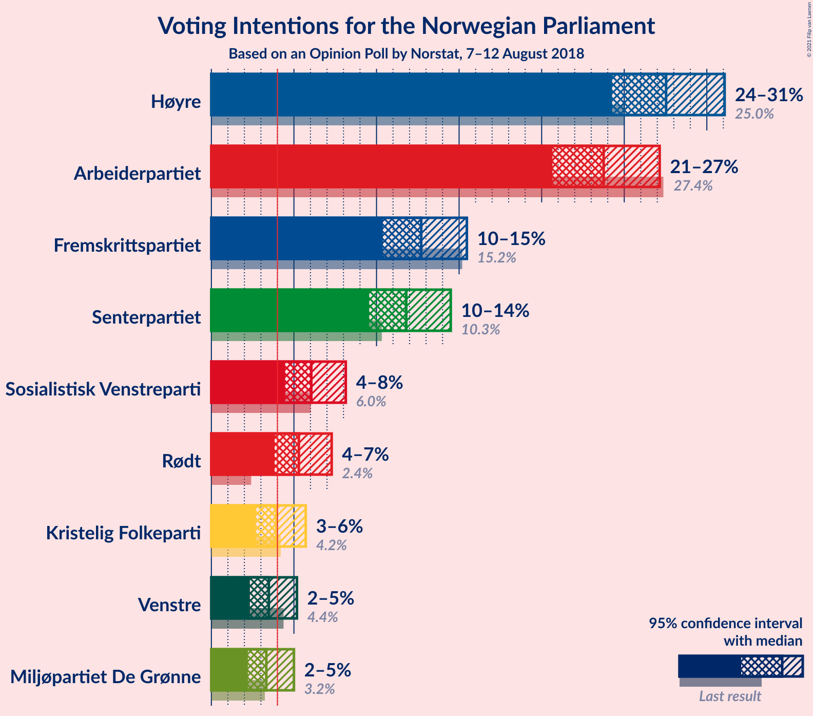
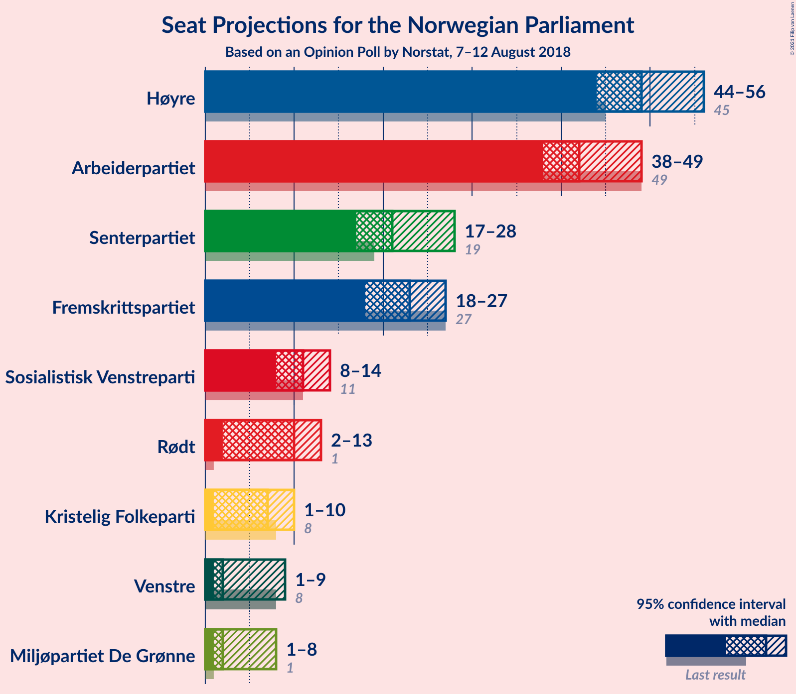
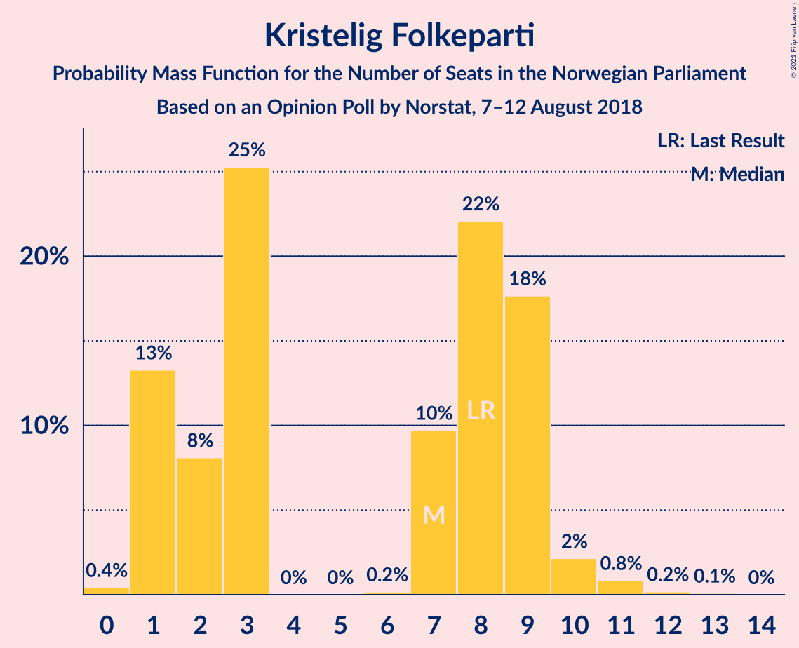
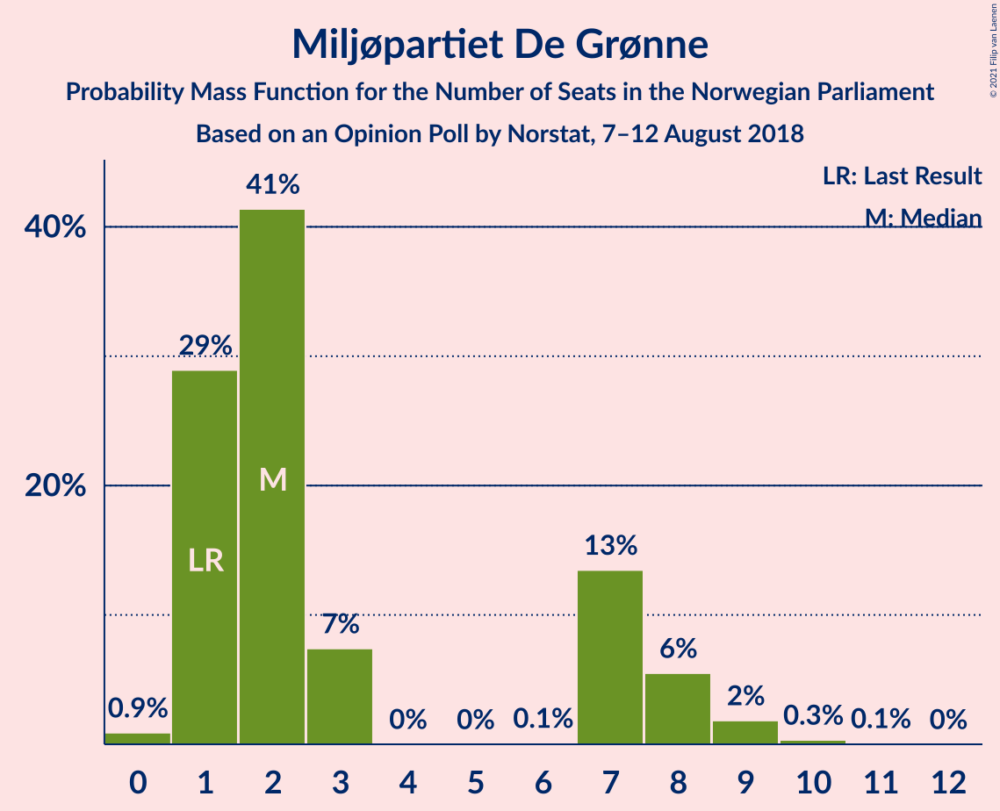
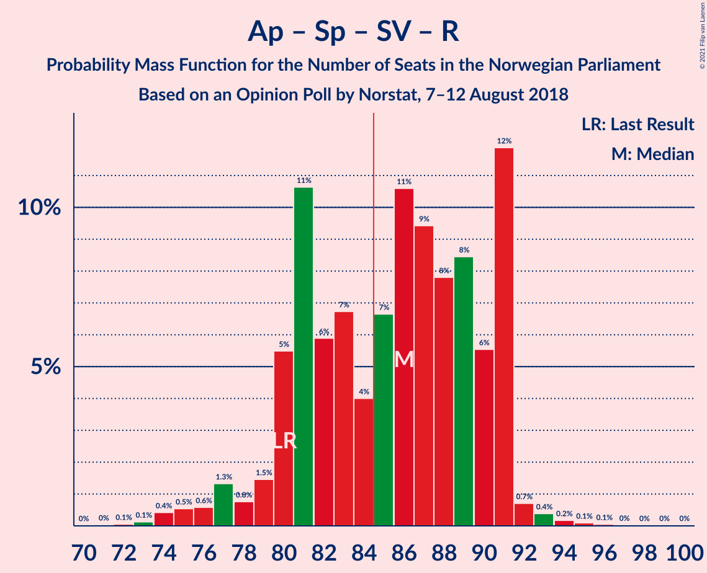
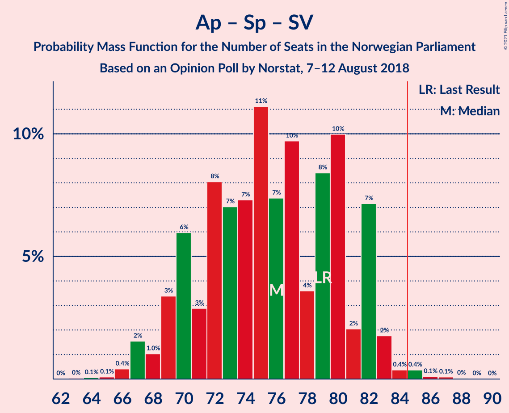
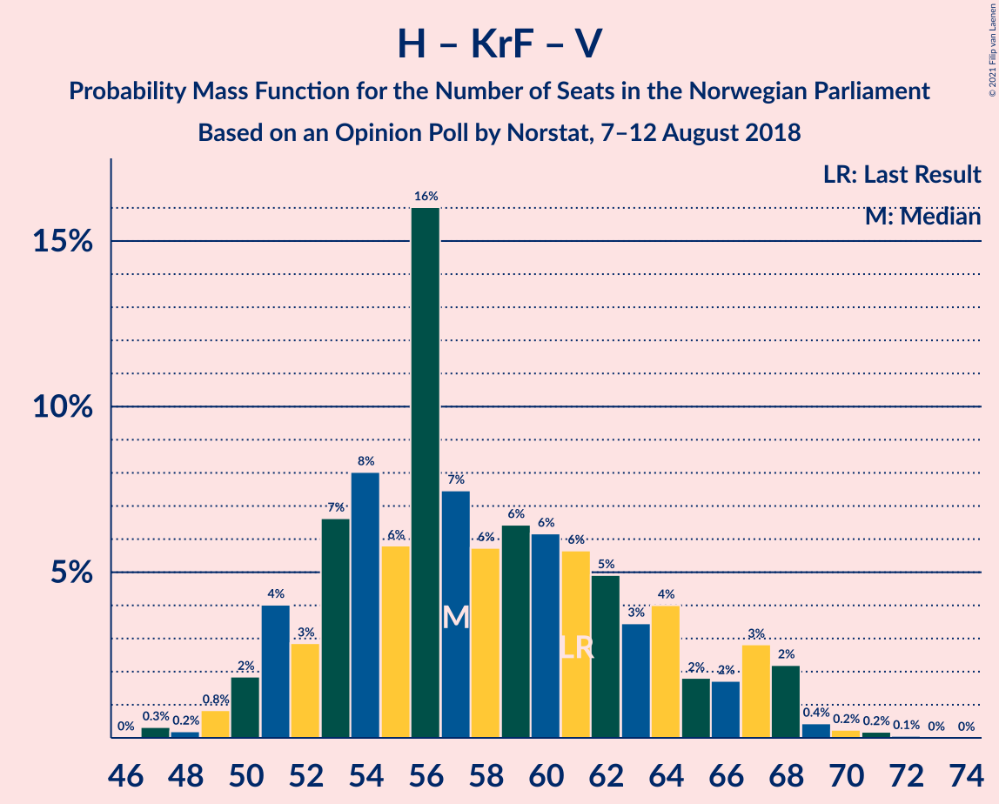
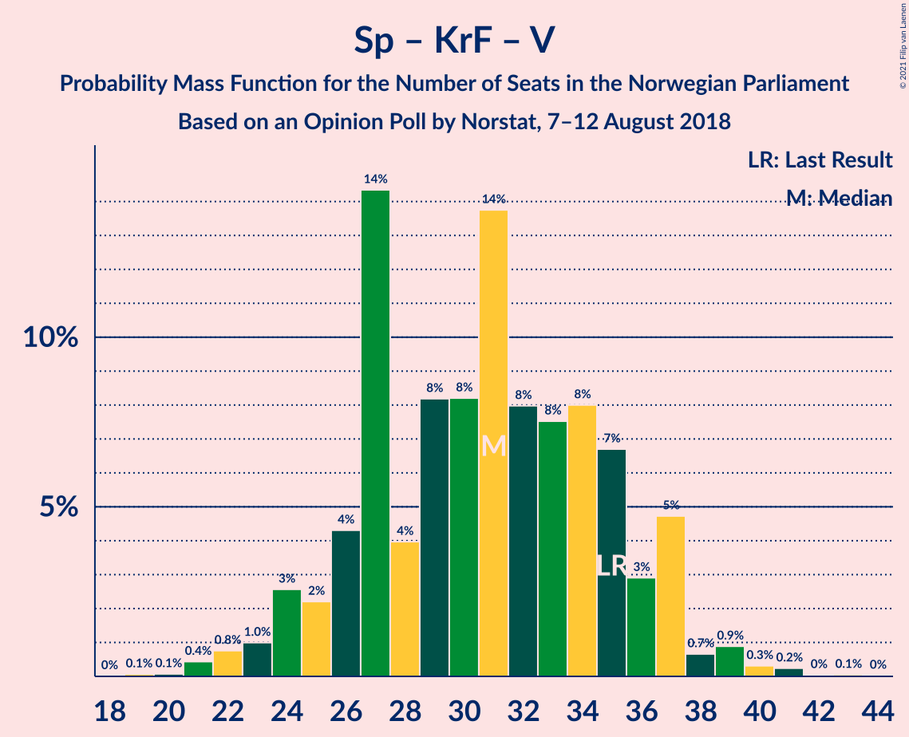

# Opinion Poll by Norstat, 7–12 August 2018

<a href="#voting-intentions">Voting Intentions</a> | <a href="#seats">Seats</a> | <a href="#coalitions">Coalitions</a> | <a href="#technical-information">Technical Information</a>

## Voting Intentions

### Confidence Intervals

| Party | Last Result | Poll Result | 80% Confidence Interval | 90% Confidence Interval | 95% Confidence Interval | 99% Confidence Interval |
|:-----:|:-----------:|:-----------:|:-----------------------:|:-----------------------:|:-----------------------:|:-----------------------:|
| Høyre | 25.0% | 27.5% | 25.4–29.8% |24.8–30.5% |24.3–31.1% |23.3–32.2% |
| Arbeiderpartiet | 27.4% | 23.8% | 21.7–26.0% |21.2–26.6% |20.7–27.1% |19.7–28.2% |
| Fremskrittspartiet | 15.2% | 12.7% | 11.2–14.5% |10.7–15.0% |10.4–15.5% |9.7–16.4% |
| Senterpartiet | 10.3% | 11.8% | 10.3–13.6% |9.9–14.1% |9.6–14.5% |8.9–15.4% |
| Sosialistisk Venstreparti | 6.0% | 6.1% | 5.0–7.4% |4.7–7.8% |4.5–8.1% |4.0–8.8% |
| Rødt | 2.4% | 5.3% | 4.3–6.6% |4.1–7.0% |3.8–7.3% |3.4–8.0% |
| Kristelig Folkeparti | 4.2% | 3.9% | 3.1–5.1% |2.9–5.4% |2.7–5.7% |2.3–6.3% |
| Venstre | 4.4% | 3.5% | 2.7–4.6% |2.5–4.9% |2.3–5.2% |2.0–5.7% |
| Miljøpartiet De Grønne | 3.2% | 3.3% | 2.6–4.4% |2.4–4.7% |2.2–5.0% |1.9–5.6% |

*Note:* The poll result column reflects the actual value used in the calculations. Published results may vary slightly, and in addition be rounded to fewer digits.

## Seats

### Confidence Intervals

| Party | Last Result | Median | 80% Confidence Interval | 90% Confidence Interval | 95% Confidence Interval | 99% Confidence Interval |
|:-----:|:-----------:|:------:|:-----------------------:|:-----------------------:|:-----------------------:|:-----------------------:|
| <a href="#høyre">Høyre</a> | 45 | 49 | 45–52 |44–53 |43–54 |42–58 |
| <a href="#arbeiderpartiet">Arbeiderpartiet</a> | 49 | 43 | 39–46 |39–48 |38–48 |37–50 |
| <a href="#fremskrittspartiet">Fremskrittspartiet</a> | 27 | 23 | 19–26 |18–27 |18–27 |17–29 |
| <a href="#senterpartiet">Senterpartiet</a> | 19 | 20 | 17–26 |17–26 |17–26 |16–29 |
| <a href="#sosialistisk-venstreparti">Sosialistisk Venstreparti</a> | 11 | 11 | 9–13 |9–14 |8–14 |7–15 |
| <a href="#rødt">Rødt</a> | 1 | 10 | 8–11 |7–12 |7–12 |2–14 |
| <a href="#kristelig-folkeparti">Kristelig Folkeparti</a> | 8 | 7 | 1–9 |1–9 |1–10 |1–11 |
| <a href="#venstre">Venstre</a> | 8 | 2 | 2–8 |2–8 |2–9 |1–10 |
| <a href="#miljøpartiet-de-grønne">Miljøpartiet De Grønne</a> | 1 | 2 | 1–7 |1–8 |1–8 |1–9 |

### Høyre

*For a full overview of the results for this party, see the [Høyre](party-høyre.html) page.*

| Number of Seats | Probability | Accumulated | Special Marks |
|:---------------:|:-----------:|:-----------:|:-------------:|
| 40 | 0% | 100% |  |
| 41 | 0.1% | 99.9% |  |
| 42 | 0.9% | 99.9% |  |
| 43 | 2% | 98.9% |  |
| 44 | 2% | 97% |  |
| 45 | 14% | 95% | Last Result |
| 46 | 4% | 81% |  |
| 47 | 14% | 77% |  |
| 48 | 6% | 63% |  |
| 49 | 8% | 57% | Median |
| 50 | 20% | 49% |  |
| 51 | 10% | 29% |  |
| 52 | 10% | 19% |  |
| 53 | 5% | 9% |  |
| 54 | 2% | 4% |  |
| 55 | 0.4% | 2% |  |
| 56 | 0.8% | 2% |  |
| 57 | 0.1% | 1.1% |  |
| 58 | 0.6% | 1.0% |  |
| 59 | 0.1% | 0.4% |  |
| 60 | 0.2% | 0.4% |  |
| 61 | 0.1% | 0.1% |  |
| 62 | 0% | 0.1% |  |
| 63 | 0% | 0% |  |

### Arbeiderpartiet

*For a full overview of the results for this party, see the [Arbeiderpartiet](party-arbeiderpartiet.html) page.*

| Number of Seats | Probability | Accumulated | Special Marks |
|:---------------:|:-----------:|:-----------:|:-------------:|
| 34 | 0% | 100% |  |
| 35 | 0.2% | 99.9% |  |
| 36 | 0.2% | 99.8% |  |
| 37 | 0.3% | 99.6% |  |
| 38 | 3% | 99.2% |  |
| 39 | 9% | 97% |  |
| 40 | 5% | 87% |  |
| 41 | 19% | 83% |  |
| 42 | 11% | 63% |  |
| 43 | 4% | 52% | Median |
| 44 | 2% | 48% |  |
| 45 | 10% | 46% |  |
| 46 | 26% | 36% |  |
| 47 | 4% | 10% |  |
| 48 | 5% | 5% |  |
| 49 | 0.2% | 0.8% | Last Result |
| 50 | 0.1% | 0.6% |  |
| 51 | 0.1% | 0.5% |  |
| 52 | 0.1% | 0.4% |  |
| 53 | 0.1% | 0.2% |  |
| 54 | 0.1% | 0.2% |  |
| 55 | 0% | 0% |  |

### Fremskrittspartiet

*For a full overview of the results for this party, see the [Fremskrittspartiet](party-fremskrittspartiet.html) page.*

| Number of Seats | Probability | Accumulated | Special Marks |
|:---------------:|:-----------:|:-----------:|:-------------:|
| 15 | 0% | 100% |  |
| 16 | 0.2% | 99.9% |  |
| 17 | 0.5% | 99.7% |  |
| 18 | 5% | 99.2% |  |
| 19 | 7% | 94% |  |
| 20 | 9% | 87% |  |
| 21 | 14% | 78% |  |
| 22 | 2% | 65% |  |
| 23 | 25% | 63% | Median |
| 24 | 10% | 38% |  |
| 25 | 9% | 29% |  |
| 26 | 11% | 19% |  |
| 27 | 6% | 8% | Last Result |
| 28 | 1.2% | 2% |  |
| 29 | 0.4% | 0.7% |  |
| 30 | 0.1% | 0.3% |  |
| 31 | 0.1% | 0.1% |  |
| 32 | 0% | 0.1% |  |
| 33 | 0% | 0% |  |

### Senterpartiet

*For a full overview of the results for this party, see the [Senterpartiet](party-senterpartiet.html) page.*

| Number of Seats | Probability | Accumulated | Special Marks |
|:---------------:|:-----------:|:-----------:|:-------------:|
| 15 | 0.1% | 100% |  |
| 16 | 2% | 99.9% |  |
| 17 | 11% | 98% |  |
| 18 | 8% | 87% |  |
| 19 | 26% | 79% | Last Result |
| 20 | 6% | 53% | Median |
| 21 | 6% | 47% |  |
| 22 | 5% | 41% |  |
| 23 | 4% | 35% |  |
| 24 | 19% | 32% |  |
| 25 | 2% | 12% |  |
| 26 | 9% | 10% |  |
| 27 | 0.9% | 2% |  |
| 28 | 0.1% | 0.7% |  |
| 29 | 0.5% | 0.5% |  |
| 30 | 0% | 0% |  |

### Sosialistisk Venstreparti

*For a full overview of the results for this party, see the [Sosialistisk Venstreparti](party-sosialistiskvenstreparti.html) page.*

| Number of Seats | Probability | Accumulated | Special Marks |
|:---------------:|:-----------:|:-----------:|:-------------:|
| 1 | 0.1% | 100% |  |
| 2 | 0.4% | 99.9% |  |
| 3 | 0% | 99.5% |  |
| 4 | 0% | 99.5% |  |
| 5 | 0% | 99.5% |  |
| 6 | 0% | 99.5% |  |
| 7 | 0.9% | 99.5% |  |
| 8 | 3% | 98.6% |  |
| 9 | 21% | 96% |  |
| 10 | 19% | 75% |  |
| 11 | 13% | 56% | Last Result, Median |
| 12 | 28% | 43% |  |
| 13 | 8% | 15% |  |
| 14 | 7% | 8% |  |
| 15 | 0.8% | 1.2% |  |
| 16 | 0.3% | 0.4% |  |
| 17 | 0.1% | 0.2% |  |
| 18 | 0% | 0.1% |  |
| 19 | 0% | 0% |  |

### Rødt

*For a full overview of the results for this party, see the [Rødt](party-rødt.html) page.*

| Number of Seats | Probability | Accumulated | Special Marks |
|:---------------:|:-----------:|:-----------:|:-------------:|
| 1 | 0% | 100% | Last Result |
| 2 | 2% | 100% |  |
| 3 | 0% | 98% |  |
| 4 | 0% | 98% |  |
| 5 | 0% | 98% |  |
| 6 | 0% | 98% |  |
| 7 | 4% | 98% |  |
| 8 | 10% | 95% |  |
| 9 | 25% | 85% |  |
| 10 | 32% | 60% | Median |
| 11 | 21% | 28% |  |
| 12 | 5% | 7% |  |
| 13 | 2% | 2% |  |
| 14 | 0.3% | 0.5% |  |
| 15 | 0.2% | 0.3% |  |
| 16 | 0% | 0% |  |

### Kristelig Folkeparti

*For a full overview of the results for this party, see the [Kristelig Folkeparti](party-kristeligfolkeparti.html) page.*

| Number of Seats | Probability | Accumulated | Special Marks |
|:---------------:|:-----------:|:-----------:|:-------------:|
| 0 | 0.1% | 100% |  |
| 1 | 19% | 99.9% |  |
| 2 | 9% | 81% |  |
| 3 | 16% | 72% |  |
| 4 | 0% | 55% |  |
| 5 | 0% | 55% |  |
| 6 | 0% | 55% |  |
| 7 | 16% | 55% | Median |
| 8 | 17% | 40% | Last Result |
| 9 | 21% | 23% |  |
| 10 | 2% | 3% |  |
| 11 | 0.4% | 0.6% |  |
| 12 | 0.2% | 0.3% |  |
| 13 | 0% | 0% |  |

### Venstre

*For a full overview of the results for this party, see the [Venstre](party-venstre.html) page.*

| Number of Seats | Probability | Accumulated | Special Marks |
|:---------------:|:-----------:|:-----------:|:-------------:|
| 0 | 0.1% | 100% |  |
| 1 | 2% | 99.9% |  |
| 2 | 59% | 98% | Median |
| 3 | 0.3% | 39% |  |
| 4 | 0% | 39% |  |
| 5 | 0% | 39% |  |
| 6 | 0% | 39% |  |
| 7 | 18% | 39% |  |
| 8 | 18% | 21% | Last Result |
| 9 | 2% | 3% |  |
| 10 | 0.4% | 0.6% |  |
| 11 | 0.2% | 0.2% |  |
| 12 | 0% | 0% |  |

### Miljøpartiet De Grønne

*For a full overview of the results for this party, see the [Miljøpartiet De Grønne](party-miljøpartietdegrønne.html) page.*

| Number of Seats | Probability | Accumulated | Special Marks |
|:---------------:|:-----------:|:-----------:|:-------------:|
| 0 | 0.3% | 100% |  |
| 1 | 29% | 99.7% | Last Result |
| 2 | 49% | 71% | Median |
| 3 | 0.3% | 22% |  |
| 4 | 0% | 22% |  |
| 5 | 0% | 21% |  |
| 6 | 0% | 21% |  |
| 7 | 14% | 21% |  |
| 8 | 6% | 8% |  |
| 9 | 1.1% | 1.3% |  |
| 10 | 0.1% | 0.2% |  |
| 11 | 0% | 0% |  |

## Coalitions

### Confidence Intervals

| Coalition | Last Result | Median | Majority? | 80% Confidence Interval | 90% Confidence Interval | 95% Confidence Interval | 99% Confidence Interval |
|:---------:|:-----------:|:------:|:---------:|:-----------------------:|:-----------------------:|:-----------------------:|:-----------------------:|
| Høyre – Fremskrittspartiet – Senterpartiet – Kristelig Folkeparti – Venstre | 107 | 102 | 100% | 97–109 | 95–110 | 95–110 | 93–111 |
| Arbeiderpartiet – Senterpartiet – Sosialistisk Venstreparti – Rødt – Miljøpartiet De Grønne | 81 | 87 | 71% | 82–93 | 82–93 | 82–95 | 77–97 |
| Arbeiderpartiet – Senterpartiet – Sosialistisk Venstreparti – Rødt | 80 | 84 | 48% | 80–91 | 80–91 | 79–91 | 75–91 |
| Arbeiderpartiet – Senterpartiet – Sosialistisk Venstreparti – Kristelig Folkeparti – Miljøpartiet De Grønne | 88 | 84 | 46% | 79–88 | 76–91 | 75–91 | 74–93 |
| Høyre – Fremskrittspartiet – Kristelig Folkeparti – Venstre – Miljøpartiet De Grønne | 89 | 85 | 52% | 78–89 | 78–89 | 78–90 | 77–94 |
| Høyre – Fremskrittspartiet – Kristelig Folkeparti – Venstre | 88 | 82 | 29% | 76–87 | 76–87 | 74–87 | 72–92 |
| Arbeiderpartiet – Senterpartiet – Sosialistisk Venstreparti – Miljøpartiet De Grønne | 80 | 77 | 3% | 72–84 | 72–84 | 71–85 | 69–88 |
| Høyre – Fremskrittspartiet – Venstre | 80 | 76 | 1.1% | 71–81 | 69–83 | 68–83 | 68–85 |
| Arbeiderpartiet – Senterpartiet – Sosialistisk Venstreparti | 79 | 74 | 0.4% | 70–82 | 69–82 | 69–82 | 67–84 |
| Arbeiderpartiet – Senterpartiet – Kristelig Folkeparti – Miljøpartiet De Grønne | 77 | 72 | 0.2% | 67–77 | 66–79 | 66–80 | 63–82 |
| Høyre – Fremskrittspartiet | 72 | 71 | 0.2% | 68–75 | 67–75 | 66–77 | 64–84 |
| Arbeiderpartiet – Senterpartiet – Kristelig Folkeparti | 76 | 70 | 0% | 65–73 | 65–74 | 63–76 | 61–79 |
| Arbeiderpartiet – Senterpartiet | 68 | 63 | 0% | 60–70 | 59–70 | 58–70 | 56–72 |
| Høyre – Kristelig Folkeparti – Venstre | 61 | 57 | 0% | 53–67 | 51–68 | 51–68 | 47–70 |
| Arbeiderpartiet – Sosialistisk Venstreparti | 60 | 54 | 0% | 49–60 | 48–61 | 48–61 | 47–62 |
| Senterpartiet – Kristelig Folkeparti – Venstre | 35 | 30 | 0% | 26–36 | 24–37 | 24–37 | 21–39 |

### Høyre – Fremskrittspartiet – Senterpartiet – Kristelig Folkeparti – Venstre

| Number of Seats | Probability | Accumulated | Special Marks |
|:---------------:|:-----------:|:-----------:|:-------------:|
| 90 | 0% | 100% |  |
| 91 | 0.2% | 99.9% |  |
| 92 | 0.1% | 99.8% |  |
| 93 | 0.3% | 99.7% |  |
| 94 | 0.5% | 99.3% |  |
| 95 | 6% | 98.9% |  |
| 96 | 0.8% | 93% |  |
| 97 | 10% | 92% |  |
| 98 | 2% | 82% |  |
| 99 | 0.5% | 80% |  |
| 100 | 16% | 80% |  |
| 101 | 13% | 63% | Median |
| 102 | 6% | 51% |  |
| 103 | 2% | 45% |  |
| 104 | 13% | 42% |  |
| 105 | 8% | 29% |  |
| 106 | 6% | 21% |  |
| 107 | 2% | 15% | Last Result |
| 108 | 1.2% | 13% |  |
| 109 | 5% | 12% |  |
| 110 | 5% | 7% |  |
| 111 | 1.1% | 2% |  |
| 112 | 0.2% | 0.4% |  |
| 113 | 0.1% | 0.2% |  |
| 114 | 0% | 0.1% |  |
| 115 | 0% | 0.1% |  |
| 116 | 0% | 0.1% |  |
| 117 | 0% | 0% |  |

### Arbeiderpartiet – Senterpartiet – Sosialistisk Venstreparti – Rødt – Miljøpartiet De Grønne

| Number of Seats | Probability | Accumulated | Special Marks |
|:---------------:|:-----------:|:-----------:|:-------------:|
| 75 | 0.1% | 100% |  |
| 76 | 0.2% | 99.9% |  |
| 77 | 0.3% | 99.7% |  |
| 78 | 0.2% | 99.4% |  |
| 79 | 0.2% | 99.2% |  |
| 80 | 0.5% | 99.0% |  |
| 81 | 0.7% | 98% | Last Result |
| 82 | 8% | 98% |  |
| 83 | 14% | 89% |  |
| 84 | 5% | 76% |  |
| 85 | 10% | 71% | Majority |
| 86 | 4% | 60% | Median |
| 87 | 8% | 56% |  |
| 88 | 4% | 48% |  |
| 89 | 5% | 44% |  |
| 90 | 3% | 39% |  |
| 91 | 8% | 35% |  |
| 92 | 5% | 27% |  |
| 93 | 18% | 22% |  |
| 94 | 2% | 4% |  |
| 95 | 1.5% | 3% |  |
| 96 | 0.2% | 1.3% |  |
| 97 | 0.8% | 1.1% |  |
| 98 | 0.1% | 0.3% |  |
| 99 | 0% | 0.1% |  |
| 100 | 0.1% | 0.1% |  |
| 101 | 0% | 0% |  |

### Arbeiderpartiet – Senterpartiet – Sosialistisk Venstreparti – Rødt

| Number of Seats | Probability | Accumulated | Special Marks |
|:---------------:|:-----------:|:-----------:|:-------------:|
| 71 | 0.1% | 100% |  |
| 72 | 0% | 99.9% |  |
| 73 | 0.1% | 99.9% |  |
| 74 | 0.1% | 99.8% |  |
| 75 | 0.5% | 99.7% |  |
| 76 | 0.3% | 99.2% |  |
| 77 | 0.8% | 98.8% |  |
| 78 | 0.5% | 98% |  |
| 79 | 0.9% | 98% |  |
| 80 | 9% | 97% | Last Result |
| 81 | 19% | 88% |  |
| 82 | 4% | 69% |  |
| 83 | 14% | 65% |  |
| 84 | 3% | 51% | Median |
| 85 | 8% | 48% | Majority |
| 86 | 4% | 40% |  |
| 87 | 7% | 36% |  |
| 88 | 2% | 29% |  |
| 89 | 5% | 27% |  |
| 90 | 4% | 22% |  |
| 91 | 17% | 18% |  |
| 92 | 0.1% | 0.5% |  |
| 93 | 0.1% | 0.4% |  |
| 94 | 0% | 0.3% |  |
| 95 | 0.1% | 0.3% |  |
| 96 | 0.1% | 0.2% |  |
| 97 | 0.1% | 0.1% |  |
| 98 | 0% | 0.1% |  |
| 99 | 0% | 0.1% |  |
| 100 | 0% | 0% |  |

### Arbeiderpartiet – Senterpartiet – Sosialistisk Venstreparti – Kristelig Folkeparti – Miljøpartiet De Grønne

| Number of Seats | Probability | Accumulated | Special Marks |
|:---------------:|:-----------:|:-----------:|:-------------:|
| 71 | 0% | 100% |  |
| 72 | 0% | 99.9% |  |
| 73 | 0.1% | 99.9% |  |
| 74 | 0.5% | 99.8% |  |
| 75 | 4% | 99.3% |  |
| 76 | 0.9% | 95% |  |
| 77 | 0.7% | 94% |  |
| 78 | 2% | 93% |  |
| 79 | 8% | 92% |  |
| 80 | 2% | 84% |  |
| 81 | 11% | 82% |  |
| 82 | 13% | 71% |  |
| 83 | 4% | 58% | Median |
| 84 | 8% | 54% |  |
| 85 | 19% | 46% | Majority |
| 86 | 13% | 27% |  |
| 87 | 2% | 13% |  |
| 88 | 3% | 11% | Last Result |
| 89 | 0.8% | 9% |  |
| 90 | 2% | 8% |  |
| 91 | 5% | 6% |  |
| 92 | 0.3% | 1.3% |  |
| 93 | 0.7% | 1.0% |  |
| 94 | 0.1% | 0.3% |  |
| 95 | 0.2% | 0.3% |  |
| 96 | 0% | 0.1% |  |
| 97 | 0% | 0.1% |  |
| 98 | 0% | 0% |  |

### Høyre – Fremskrittspartiet – Kristelig Folkeparti – Venstre – Miljøpartiet De Grønne

| Number of Seats | Probability | Accumulated | Special Marks |
|:---------------:|:-----------:|:-----------:|:-------------:|
| 70 | 0% | 100% |  |
| 71 | 0% | 99.9% |  |
| 72 | 0.1% | 99.9% |  |
| 73 | 0.1% | 99.9% |  |
| 74 | 0.1% | 99.8% |  |
| 75 | 0% | 99.7% |  |
| 76 | 0.1% | 99.6% |  |
| 77 | 0.1% | 99.6% |  |
| 78 | 17% | 99.5% |  |
| 79 | 4% | 82% |  |
| 80 | 5% | 78% |  |
| 81 | 2% | 73% |  |
| 82 | 7% | 71% |  |
| 83 | 4% | 64% | Median |
| 84 | 8% | 60% |  |
| 85 | 3% | 52% | Majority |
| 86 | 14% | 49% |  |
| 87 | 4% | 34% |  |
| 88 | 19% | 31% |  |
| 89 | 9% | 12% | Last Result |
| 90 | 0.9% | 3% |  |
| 91 | 0.5% | 2% |  |
| 92 | 0.8% | 2% |  |
| 93 | 0.3% | 1.1% |  |
| 94 | 0.5% | 0.8% |  |
| 95 | 0.1% | 0.3% |  |
| 96 | 0.1% | 0.2% |  |
| 97 | 0% | 0.1% |  |
| 98 | 0.1% | 0.1% |  |
| 99 | 0% | 0% |  |

### Høyre – Fremskrittspartiet – Kristelig Folkeparti – Venstre

| Number of Seats | Probability | Accumulated | Special Marks |
|:---------------:|:-----------:|:-----------:|:-------------:|
| 69 | 0.1% | 100% |  |
| 70 | 0% | 99.9% |  |
| 71 | 0.1% | 99.9% |  |
| 72 | 0.8% | 99.7% |  |
| 73 | 0.2% | 98.9% |  |
| 74 | 1.5% | 98.6% |  |
| 75 | 2% | 97% |  |
| 76 | 18% | 96% |  |
| 77 | 5% | 78% |  |
| 78 | 8% | 73% |  |
| 79 | 3% | 64% |  |
| 80 | 5% | 61% |  |
| 81 | 4% | 56% | Median |
| 82 | 8% | 52% |  |
| 83 | 4% | 44% |  |
| 84 | 10% | 40% |  |
| 85 | 5% | 29% | Majority |
| 86 | 14% | 24% |  |
| 87 | 8% | 10% |  |
| 88 | 0.7% | 2% | Last Result |
| 89 | 0.5% | 1.4% |  |
| 90 | 0.2% | 0.9% |  |
| 91 | 0.2% | 0.8% |  |
| 92 | 0.2% | 0.6% |  |
| 93 | 0.2% | 0.3% |  |
| 94 | 0.1% | 0.1% |  |
| 95 | 0% | 0% |  |

### Arbeiderpartiet – Senterpartiet – Sosialistisk Venstreparti – Miljøpartiet De Grønne

| Number of Seats | Probability | Accumulated | Special Marks |
|:---------------:|:-----------:|:-----------:|:-------------:|
| 66 | 0% | 100% |  |
| 67 | 0% | 99.9% |  |
| 68 | 0.2% | 99.9% |  |
| 69 | 0.2% | 99.7% |  |
| 70 | 0.5% | 99.5% |  |
| 71 | 4% | 99.0% |  |
| 72 | 9% | 95% |  |
| 73 | 7% | 86% |  |
| 74 | 0.9% | 79% |  |
| 75 | 9% | 78% |  |
| 76 | 12% | 69% | Median |
| 77 | 8% | 57% |  |
| 78 | 4% | 49% |  |
| 79 | 6% | 46% |  |
| 80 | 6% | 40% | Last Result |
| 81 | 4% | 33% |  |
| 82 | 9% | 29% |  |
| 83 | 3% | 20% |  |
| 84 | 14% | 17% |  |
| 85 | 0.6% | 3% | Majority |
| 86 | 0.2% | 2% |  |
| 87 | 1.2% | 2% |  |
| 88 | 0.5% | 0.8% |  |
| 89 | 0.1% | 0.3% |  |
| 90 | 0.1% | 0.2% |  |
| 91 | 0% | 0.1% |  |
| 92 | 0% | 0% |  |

### Høyre – Fremskrittspartiet – Venstre

| Number of Seats | Probability | Accumulated | Special Marks |
|:---------------:|:-----------:|:-----------:|:-------------:|
| 63 | 0% | 100% |  |
| 64 | 0% | 99.9% |  |
| 65 | 0.1% | 99.9% |  |
| 66 | 0.2% | 99.8% |  |
| 67 | 0.1% | 99.6% |  |
| 68 | 4% | 99.5% |  |
| 69 | 2% | 96% |  |
| 70 | 2% | 94% |  |
| 71 | 2% | 91% |  |
| 72 | 2% | 89% |  |
| 73 | 15% | 87% |  |
| 74 | 5% | 72% | Median |
| 75 | 15% | 67% |  |
| 76 | 8% | 52% |  |
| 77 | 15% | 44% |  |
| 78 | 11% | 29% |  |
| 79 | 5% | 19% |  |
| 80 | 1.1% | 14% | Last Result |
| 81 | 4% | 12% |  |
| 82 | 1.0% | 8% |  |
| 83 | 5% | 7% |  |
| 84 | 1.1% | 2% |  |
| 85 | 0.6% | 1.1% | Majority |
| 86 | 0.2% | 0.4% |  |
| 87 | 0% | 0.2% |  |
| 88 | 0.1% | 0.2% |  |
| 89 | 0% | 0.1% |  |
| 90 | 0% | 0.1% |  |
| 91 | 0% | 0% |  |

### Arbeiderpartiet – Senterpartiet – Sosialistisk Venstreparti

| Number of Seats | Probability | Accumulated | Special Marks |
|:---------------:|:-----------:|:-----------:|:-------------:|
| 63 | 0% | 100% |  |
| 64 | 0% | 99.9% |  |
| 65 | 0% | 99.9% |  |
| 66 | 0.2% | 99.9% |  |
| 67 | 1.1% | 99.7% |  |
| 68 | 0.5% | 98.6% |  |
| 69 | 4% | 98% |  |
| 70 | 12% | 95% |  |
| 71 | 5% | 82% |  |
| 72 | 9% | 77% |  |
| 73 | 8% | 69% |  |
| 74 | 12% | 60% | Median |
| 75 | 8% | 48% |  |
| 76 | 4% | 41% |  |
| 77 | 8% | 37% |  |
| 78 | 3% | 29% |  |
| 79 | 3% | 26% | Last Result |
| 80 | 8% | 23% |  |
| 81 | 0.5% | 16% |  |
| 82 | 15% | 15% |  |
| 83 | 0.1% | 0.6% |  |
| 84 | 0.1% | 0.5% |  |
| 85 | 0.1% | 0.4% | Majority |
| 86 | 0% | 0.2% |  |
| 87 | 0.1% | 0.2% |  |
| 88 | 0.1% | 0.1% |  |
| 89 | 0% | 0% |  |

### Arbeiderpartiet – Senterpartiet – Kristelig Folkeparti – Miljøpartiet De Grønne

| Number of Seats | Probability | Accumulated | Special Marks |
|:---------------:|:-----------:|:-----------:|:-------------:|
| 60 | 0% | 100% |  |
| 61 | 0.1% | 99.9% |  |
| 62 | 0% | 99.8% |  |
| 63 | 0.5% | 99.8% |  |
| 64 | 0.4% | 99.3% |  |
| 65 | 0.8% | 98.9% |  |
| 66 | 5% | 98% |  |
| 67 | 4% | 93% |  |
| 68 | 2% | 90% |  |
| 69 | 3% | 88% |  |
| 70 | 14% | 85% |  |
| 71 | 9% | 71% |  |
| 72 | 15% | 62% | Median |
| 73 | 15% | 46% |  |
| 74 | 8% | 32% |  |
| 75 | 2% | 24% |  |
| 76 | 4% | 22% |  |
| 77 | 8% | 18% | Last Result |
| 78 | 2% | 10% |  |
| 79 | 5% | 8% |  |
| 80 | 0.6% | 3% |  |
| 81 | 1.0% | 2% |  |
| 82 | 1.0% | 1.4% |  |
| 83 | 0.1% | 0.4% |  |
| 84 | 0.1% | 0.3% |  |
| 85 | 0.2% | 0.2% | Majority |
| 86 | 0% | 0% |  |

### Høyre – Fremskrittspartiet

| Number of Seats | Probability | Accumulated | Special Marks |
|:---------------:|:-----------:|:-----------:|:-------------:|
| 61 | 0.1% | 100% |  |
| 62 | 0.1% | 99.9% |  |
| 63 | 0.3% | 99.8% |  |
| 64 | 0.2% | 99.5% |  |
| 65 | 0.1% | 99.3% |  |
| 66 | 4% | 99.1% |  |
| 67 | 3% | 95% |  |
| 68 | 3% | 92% |  |
| 69 | 4% | 89% |  |
| 70 | 16% | 85% |  |
| 71 | 24% | 70% |  |
| 72 | 6% | 46% | Last Result, Median |
| 73 | 19% | 40% |  |
| 74 | 7% | 21% |  |
| 75 | 11% | 15% |  |
| 76 | 0.9% | 4% |  |
| 77 | 0.3% | 3% |  |
| 78 | 0.2% | 2% |  |
| 79 | 0.1% | 2% |  |
| 80 | 0.3% | 2% |  |
| 81 | 0.1% | 2% |  |
| 82 | 0.7% | 2% |  |
| 83 | 0.1% | 0.8% |  |
| 84 | 0.5% | 0.7% |  |
| 85 | 0% | 0.2% | Majority |
| 86 | 0.1% | 0.1% |  |
| 87 | 0% | 0.1% |  |
| 88 | 0% | 0% |  |

### Arbeiderpartiet – Senterpartiet – Kristelig Folkeparti

| Number of Seats | Probability | Accumulated | Special Marks |
|:---------------:|:-----------:|:-----------:|:-------------:|
| 57 | 0% | 100% |  |
| 58 | 0% | 99.9% |  |
| 59 | 0% | 99.9% |  |
| 60 | 0.1% | 99.9% |  |
| 61 | 0.3% | 99.7% |  |
| 62 | 0.9% | 99.5% |  |
| 63 | 1.2% | 98.6% |  |
| 64 | 2% | 97% |  |
| 65 | 6% | 96% |  |
| 66 | 4% | 90% |  |
| 67 | 5% | 86% |  |
| 68 | 7% | 81% |  |
| 69 | 14% | 74% |  |
| 70 | 25% | 60% | Median |
| 71 | 14% | 34% |  |
| 72 | 9% | 21% |  |
| 73 | 6% | 12% |  |
| 74 | 1.1% | 6% |  |
| 75 | 1.1% | 5% |  |
| 76 | 2% | 4% | Last Result |
| 77 | 0.5% | 1.5% |  |
| 78 | 0.2% | 1.0% |  |
| 79 | 0.3% | 0.8% |  |
| 80 | 0.3% | 0.5% |  |
| 81 | 0.1% | 0.2% |  |
| 82 | 0% | 0.1% |  |
| 83 | 0% | 0% |  |

### Arbeiderpartiet – Senterpartiet

| Number of Seats | Probability | Accumulated | Special Marks |
|:---------------:|:-----------:|:-----------:|:-------------:|
| 53 | 0.1% | 100% |  |
| 54 | 0.1% | 99.9% |  |
| 55 | 0.1% | 99.8% |  |
| 56 | 0.7% | 99.8% |  |
| 57 | 0.4% | 99.1% |  |
| 58 | 2% | 98.6% |  |
| 59 | 3% | 97% |  |
| 60 | 9% | 93% |  |
| 61 | 13% | 84% |  |
| 62 | 3% | 71% |  |
| 63 | 19% | 68% | Median |
| 64 | 7% | 49% |  |
| 65 | 7% | 42% |  |
| 66 | 7% | 35% |  |
| 67 | 7% | 28% |  |
| 68 | 4% | 22% | Last Result |
| 69 | 3% | 18% |  |
| 70 | 14% | 16% |  |
| 71 | 0.5% | 2% |  |
| 72 | 1.0% | 1.4% |  |
| 73 | 0.1% | 0.4% |  |
| 74 | 0.1% | 0.3% |  |
| 75 | 0.1% | 0.2% |  |
| 76 | 0.1% | 0.2% |  |
| 77 | 0% | 0.1% |  |
| 78 | 0.1% | 0.1% |  |
| 79 | 0% | 0% |  |

### Høyre – Kristelig Folkeparti – Venstre

| Number of Seats | Probability | Accumulated | Special Marks |
|:---------------:|:-----------:|:-----------:|:-------------:|
| 46 | 0% | 100% |  |
| 47 | 0.5% | 99.9% |  |
| 48 | 0.1% | 99.5% |  |
| 49 | 0.9% | 99.3% |  |
| 50 | 0.2% | 98% |  |
| 51 | 3% | 98% |  |
| 52 | 2% | 95% |  |
| 53 | 15% | 93% |  |
| 54 | 2% | 78% |  |
| 55 | 3% | 77% |  |
| 56 | 23% | 74% |  |
| 57 | 5% | 51% |  |
| 58 | 0.8% | 46% | Median |
| 59 | 2% | 45% |  |
| 60 | 3% | 42% |  |
| 61 | 8% | 39% | Last Result |
| 62 | 10% | 31% |  |
| 63 | 7% | 21% |  |
| 64 | 0.6% | 14% |  |
| 65 | 0.4% | 13% |  |
| 66 | 1.1% | 13% |  |
| 67 | 7% | 12% |  |
| 68 | 4% | 5% |  |
| 69 | 0.1% | 0.7% |  |
| 70 | 0.3% | 0.6% |  |
| 71 | 0.2% | 0.3% |  |
| 72 | 0.1% | 0.1% |  |
| 73 | 0% | 0% |  |

### Arbeiderpartiet – Sosialistisk Venstreparti

| Number of Seats | Probability | Accumulated | Special Marks |
|:---------------:|:-----------:|:-----------:|:-------------:|
| 43 | 0% | 100% |  |
| 44 | 0% | 99.9% |  |
| 45 | 0.1% | 99.9% |  |
| 46 | 0.1% | 99.8% |  |
| 47 | 0.3% | 99.7% |  |
| 48 | 9% | 99.4% |  |
| 49 | 3% | 91% |  |
| 50 | 2% | 88% |  |
| 51 | 15% | 86% |  |
| 52 | 10% | 70% |  |
| 53 | 5% | 60% |  |
| 54 | 6% | 55% | Median |
| 55 | 9% | 48% |  |
| 56 | 9% | 39% |  |
| 57 | 2% | 30% |  |
| 58 | 18% | 28% |  |
| 59 | 0.2% | 10% |  |
| 60 | 5% | 10% | Last Result |
| 61 | 4% | 5% |  |
| 62 | 0.4% | 0.7% |  |
| 63 | 0% | 0.3% |  |
| 64 | 0.1% | 0.2% |  |
| 65 | 0.1% | 0.2% |  |
| 66 | 0.1% | 0.1% |  |
| 67 | 0% | 0% |  |

### Senterpartiet – Kristelig Folkeparti – Venstre

| Number of Seats | Probability | Accumulated | Special Marks |
|:---------------:|:-----------:|:-----------:|:-------------:|
| 20 | 0.1% | 100% |  |
| 21 | 0.4% | 99.9% |  |
| 22 | 0.9% | 99.5% |  |
| 23 | 0.2% | 98.6% |  |
| 24 | 4% | 98% |  |
| 25 | 3% | 94% |  |
| 26 | 5% | 91% |  |
| 27 | 18% | 86% |  |
| 28 | 2% | 68% |  |
| 29 | 4% | 66% | Median |
| 30 | 14% | 63% |  |
| 31 | 9% | 49% |  |
| 32 | 6% | 40% |  |
| 33 | 7% | 34% |  |
| 34 | 9% | 27% |  |
| 35 | 6% | 18% | Last Result |
| 36 | 6% | 12% |  |
| 37 | 5% | 6% |  |
| 38 | 0.4% | 1.5% |  |
| 39 | 0.7% | 1.1% |  |
| 40 | 0.2% | 0.4% |  |
| 41 | 0.1% | 0.2% |  |
| 42 | 0% | 0.1% |  |
| 43 | 0% | 0.1% |  |
| 44 | 0% | 0% |  |

## Technical Information

### Opinion Poll

+ **Polling firm:** Norstat
+ **Commissioner(s):** —
+ **Fieldwork period:** 7–12 August 2018

### Calculations

+ **Sample size:** 661
+ **Simulations done:** 131,072
+ **Error estimate:** 2.77%

