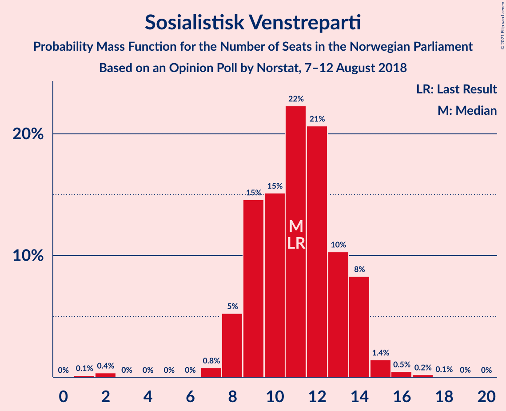
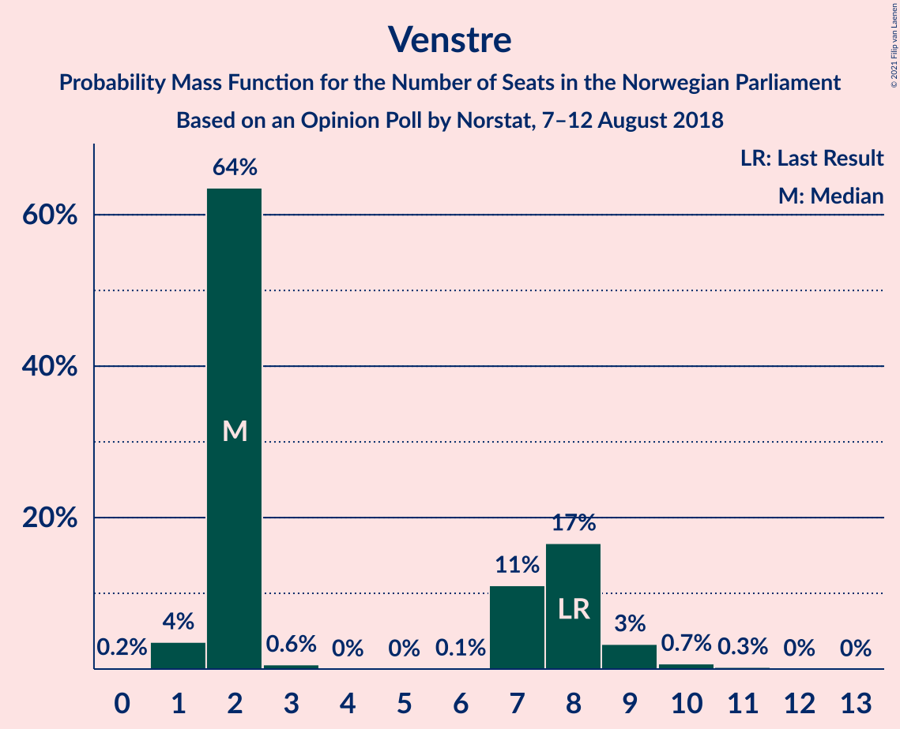
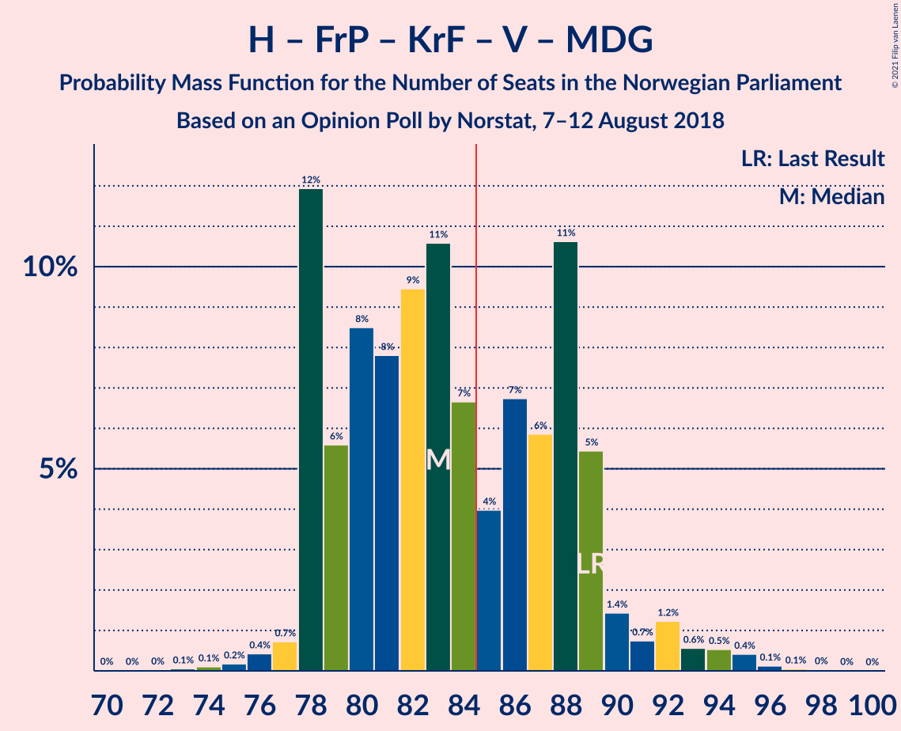
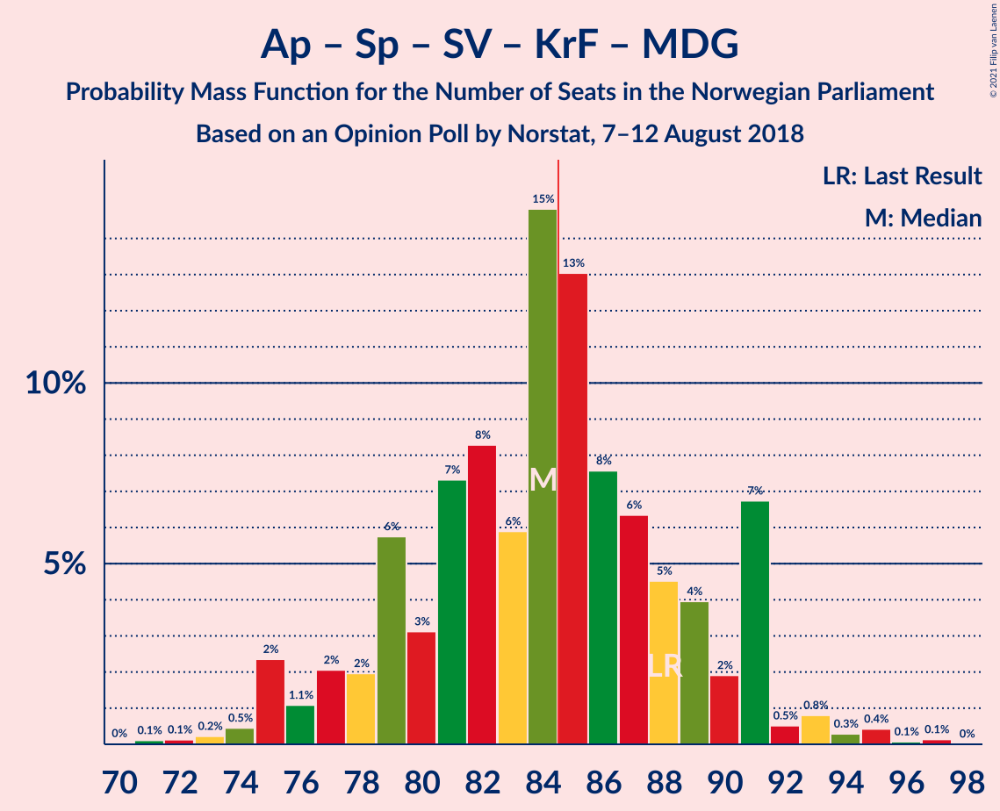
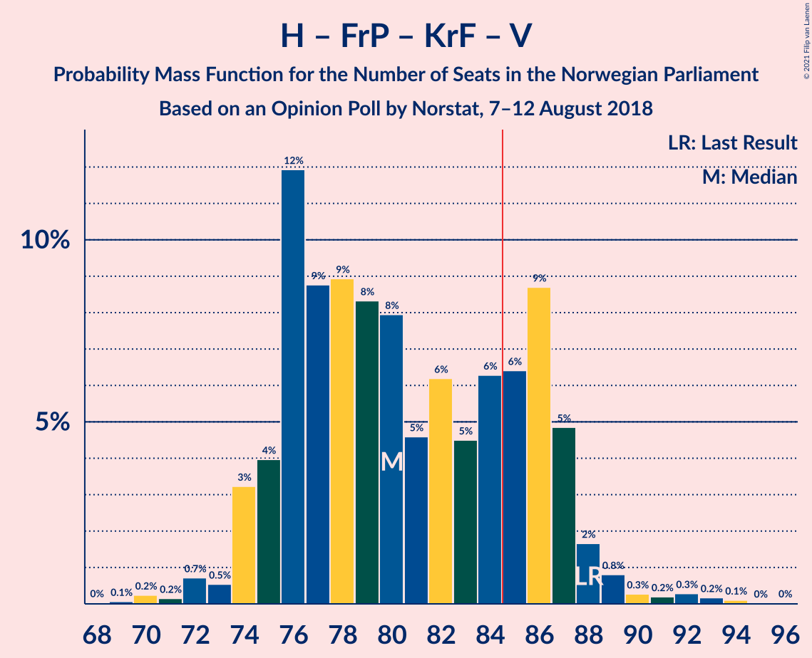
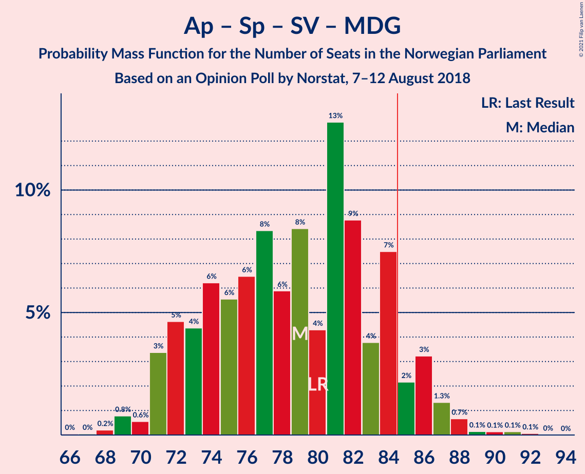
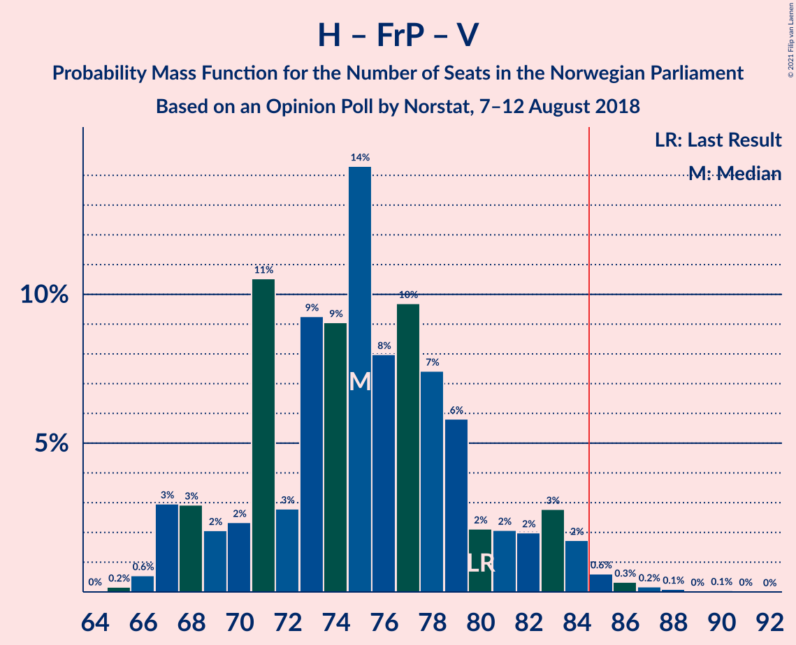
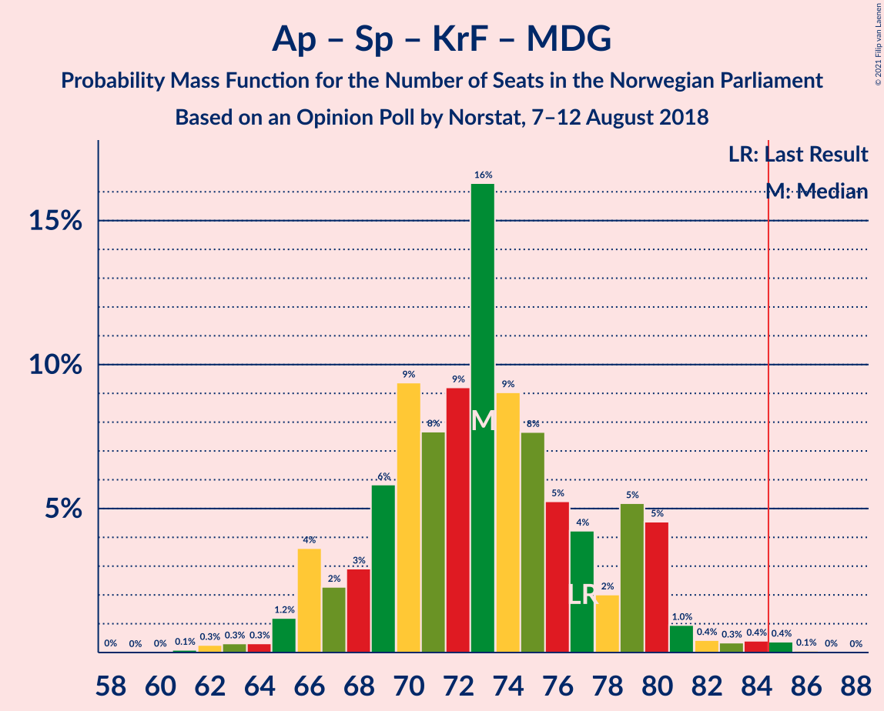

# Opinion Poll by Norstat, 7–12 August 2018

<a href="#voting-intentions">Voting Intentions</a> | <a href="#seats">Seats</a> | <a href="#coalitions">Coalitions</a> | <a href="#technical-information">Technical Information</a>

## Voting Intentions

### Confidence Intervals

| Party | Last Result | Poll Result | 80% Confidence Interval | 90% Confidence Interval | 95% Confidence Interval | 99% Confidence Interval |
|:-----:|:-----------:|:-----------:|:-----------------------:|:-----------------------:|:-----------------------:|:-----------------------:|
| Høyre | 25.0% | 27.5% | 25.4–29.8% |24.8–30.5% |24.3–31.1% |23.3–32.2% |
| Arbeiderpartiet | 27.4% | 23.8% | 21.7–26.0% |21.2–26.6% |20.7–27.1% |19.7–28.2% |
| Fremskrittspartiet | 15.2% | 12.7% | 11.2–14.5% |10.7–15.0% |10.4–15.5% |9.7–16.4% |
| Senterpartiet | 10.3% | 11.8% | 10.3–13.6% |9.9–14.1% |9.6–14.5% |8.9–15.4% |
| Sosialistisk Venstreparti | 6.0% | 6.1% | 5.0–7.4% |4.7–7.8% |4.5–8.1% |4.0–8.8% |
| Rødt | 2.4% | 5.3% | 4.3–6.6% |4.1–7.0% |3.8–7.3% |3.4–8.0% |
| Kristelig Folkeparti | 4.2% | 3.9% | 3.1–5.1% |2.9–5.4% |2.7–5.7% |2.3–6.3% |
| Venstre | 4.4% | 3.5% | 2.7–4.6% |2.5–4.9% |2.3–5.2% |2.0–5.7% |
| Miljøpartiet De Grønne | 3.2% | 3.3% | 2.6–4.4% |2.4–4.7% |2.2–5.0% |1.9–5.6% |

*Note:* The poll result column reflects the actual value used in the calculations. Published results may vary slightly, and in addition be rounded to fewer digits.

## Seats

### Confidence Intervals

| Party | Last Result | Median | 80% Confidence Interval | 90% Confidence Interval | 95% Confidence Interval | 99% Confidence Interval |
|:-----:|:-----------:|:------:|:-----------------------:|:-----------------------:|:-----------------------:|:-----------------------:|
| <a href="#høyre">Høyre</a> | 45 | 49 | 45–52 |44–54 |44–56 |42–59 |
| <a href="#arbeiderpartiet">Arbeiderpartiet</a> | 49 | 42 | 40–47 |39–48 |38–49 |36–52 |
| <a href="#fremskrittspartiet">Fremskrittspartiet</a> | 27 | 23 | 19–26 |18–27 |18–27 |17–29 |
| <a href="#senterpartiet">Senterpartiet</a> | 19 | 21 | 18–26 |17–27 |17–28 |16–28 |
| <a href="#sosialistisk-venstreparti">Sosialistisk Venstreparti</a> | 11 | 11 | 9–14 |8–14 |8–14 |2–16 |
| <a href="#rødt">Rødt</a> | 1 | 10 | 8–12 |7–12 |2–13 |2–14 |
| <a href="#kristelig-folkeparti">Kristelig Folkeparti</a> | 8 | 7 | 1–9 |1–9 |1–10 |1–11 |
| <a href="#venstre">Venstre</a> | 8 | 2 | 2–8 |2–8 |1–9 |1–10 |
| <a href="#miljøpartiet-de-grønne">Miljøpartiet De Grønne</a> | 1 | 2 | 1–7 |1–8 |1–8 |0–9 |

### Høyre

*For a full overview of the results for this party, see the [Høyre](party-høyre.html) page.*

| Number of Seats | Probability | Accumulated | Special Marks |
|:---------------:|:-----------:|:-----------:|:-------------:|
| 39 | 0% | 100% |  |
| 40 | 0.1% | 99.9% |  |
| 41 | 0.1% | 99.9% |  |
| 42 | 0.7% | 99.8% |  |
| 43 | 1.3% | 99.1% |  |
| 44 | 3% | 98% |  |
| 45 | 10% | 94% | Last Result |
| 46 | 11% | 84% |  |
| 47 | 11% | 73% |  |
| 48 | 11% | 63% |  |
| 49 | 16% | 52% | Median |
| 50 | 13% | 35% |  |
| 51 | 9% | 23% |  |
| 52 | 6% | 14% |  |
| 53 | 3% | 8% |  |
| 54 | 2% | 5% |  |
| 55 | 0.8% | 3% |  |
| 56 | 1.2% | 3% |  |
| 57 | 0.3% | 1.3% |  |
| 58 | 0.5% | 1.1% |  |
| 59 | 0.2% | 0.6% |  |
| 60 | 0.2% | 0.4% |  |
| 61 | 0.1% | 0.2% |  |
| 62 | 0% | 0.1% |  |
| 63 | 0.1% | 0.1% |  |
| 64 | 0% | 0% |  |

### Arbeiderpartiet

*For a full overview of the results for this party, see the [Arbeiderpartiet](party-arbeiderpartiet.html) page.*

| Number of Seats | Probability | Accumulated | Special Marks |
|:---------------:|:-----------:|:-----------:|:-------------:|
| 34 | 0.1% | 100% |  |
| 35 | 0.2% | 99.9% |  |
| 36 | 0.4% | 99.7% |  |
| 37 | 0.7% | 99.3% |  |
| 38 | 1.4% | 98.6% |  |
| 39 | 6% | 97% |  |
| 40 | 7% | 91% |  |
| 41 | 15% | 84% |  |
| 42 | 19% | 68% | Median |
| 43 | 7% | 49% |  |
| 44 | 5% | 42% |  |
| 45 | 7% | 37% |  |
| 46 | 13% | 30% |  |
| 47 | 8% | 17% |  |
| 48 | 7% | 9% |  |
| 49 | 1.1% | 3% | Last Result |
| 50 | 0.7% | 1.4% |  |
| 51 | 0.1% | 0.7% |  |
| 52 | 0.4% | 0.6% |  |
| 53 | 0.1% | 0.2% |  |
| 54 | 0.1% | 0.1% |  |
| 55 | 0% | 0% |  |

### Fremskrittspartiet

*For a full overview of the results for this party, see the [Fremskrittspartiet](party-fremskrittspartiet.html) page.*

| Number of Seats | Probability | Accumulated | Special Marks |
|:---------------:|:-----------:|:-----------:|:-------------:|
| 15 | 0.1% | 100% |  |
| 16 | 0.4% | 99.9% |  |
| 17 | 1.2% | 99.5% |  |
| 18 | 4% | 98% |  |
| 19 | 9% | 95% |  |
| 20 | 7% | 86% |  |
| 21 | 16% | 79% |  |
| 22 | 10% | 63% |  |
| 23 | 14% | 54% | Median |
| 24 | 13% | 40% |  |
| 25 | 13% | 27% |  |
| 26 | 7% | 14% |  |
| 27 | 5% | 7% | Last Result |
| 28 | 1.1% | 2% |  |
| 29 | 0.9% | 1.3% |  |
| 30 | 0.2% | 0.4% |  |
| 31 | 0.2% | 0.3% |  |
| 32 | 0% | 0.1% |  |
| 33 | 0% | 0% |  |

### Senterpartiet

*For a full overview of the results for this party, see the [Senterpartiet](party-senterpartiet.html) page.*

| Number of Seats | Probability | Accumulated | Special Marks |
|:---------------:|:-----------:|:-----------:|:-------------:|
| 14 | 0% | 100% |  |
| 15 | 0.2% | 99.9% |  |
| 16 | 1.3% | 99.7% |  |
| 17 | 7% | 98% |  |
| 18 | 11% | 92% |  |
| 19 | 16% | 81% | Last Result |
| 20 | 12% | 66% |  |
| 21 | 9% | 54% | Median |
| 22 | 8% | 44% |  |
| 23 | 5% | 36% |  |
| 24 | 14% | 31% |  |
| 25 | 4% | 17% |  |
| 26 | 8% | 13% |  |
| 27 | 1.4% | 5% |  |
| 28 | 3% | 4% |  |
| 29 | 0.4% | 0.5% |  |
| 30 | 0.1% | 0.1% |  |
| 31 | 0% | 0% |  |

### Sosialistisk Venstreparti

*For a full overview of the results for this party, see the [Sosialistisk Venstreparti](party-sosialistiskvenstreparti.html) page.*

| Number of Seats | Probability | Accumulated | Special Marks |
|:---------------:|:-----------:|:-----------:|:-------------:|
| 1 | 0.1% | 100% |  |
| 2 | 0.4% | 99.9% |  |
| 3 | 0% | 99.5% |  |
| 4 | 0% | 99.5% |  |
| 5 | 0% | 99.5% |  |
| 6 | 0% | 99.5% |  |
| 7 | 0.8% | 99.5% |  |
| 8 | 5% | 98.7% |  |
| 9 | 15% | 93% |  |
| 10 | 15% | 79% |  |
| 11 | 22% | 64% | Last Result, Median |
| 12 | 21% | 41% |  |
| 13 | 10% | 21% |  |
| 14 | 8% | 10% |  |
| 15 | 1.4% | 2% |  |
| 16 | 0.5% | 0.8% |  |
| 17 | 0.2% | 0.3% |  |
| 18 | 0.1% | 0.1% |  |
| 19 | 0% | 0% |  |

### Rødt

*For a full overview of the results for this party, see the [Rødt](party-rødt.html) page.*

| Number of Seats | Probability | Accumulated | Special Marks |
|:---------------:|:-----------:|:-----------:|:-------------:|
| 1 | 0% | 100% | Last Result |
| 2 | 3% | 100% |  |
| 3 | 0% | 97% |  |
| 4 | 0% | 97% |  |
| 5 | 0% | 97% |  |
| 6 | 0% | 97% |  |
| 7 | 3% | 97% |  |
| 8 | 12% | 94% |  |
| 9 | 21% | 82% |  |
| 10 | 28% | 61% | Median |
| 11 | 20% | 33% |  |
| 12 | 10% | 13% |  |
| 13 | 2% | 3% |  |
| 14 | 0.5% | 0.7% |  |
| 15 | 0.2% | 0.3% |  |
| 16 | 0% | 0.1% |  |
| 17 | 0% | 0% |  |

### Kristelig Folkeparti

*For a full overview of the results for this party, see the [Kristelig Folkeparti](party-kristeligfolkeparti.html) page.*

| Number of Seats | Probability | Accumulated | Special Marks |
|:---------------:|:-----------:|:-----------:|:-------------:|
| 0 | 0.4% | 100% |  |
| 1 | 13% | 99.6% |  |
| 2 | 8% | 86% |  |
| 3 | 25% | 78% |  |
| 4 | 0% | 53% |  |
| 5 | 0% | 53% |  |
| 6 | 0.2% | 53% |  |
| 7 | 10% | 53% | Median |
| 8 | 22% | 43% | Last Result |
| 9 | 18% | 21% |  |
| 10 | 2% | 3% |  |
| 11 | 0.8% | 1.1% |  |
| 12 | 0.2% | 0.3% |  |
| 13 | 0.1% | 0.1% |  |
| 14 | 0% | 0% |  |

### Venstre

*For a full overview of the results for this party, see the [Venstre](party-venstre.html) page.*

| Number of Seats | Probability | Accumulated | Special Marks |
|:---------------:|:-----------:|:-----------:|:-------------:|
| 0 | 0.2% | 100% |  |
| 1 | 4% | 99.8% |  |
| 2 | 64% | 96% | Median |
| 3 | 0.6% | 33% |  |
| 4 | 0% | 32% |  |
| 5 | 0% | 32% |  |
| 6 | 0.1% | 32% |  |
| 7 | 11% | 32% |  |
| 8 | 17% | 21% | Last Result |
| 9 | 3% | 4% |  |
| 10 | 0.7% | 1.0% |  |
| 11 | 0.3% | 0.3% |  |
| 12 | 0% | 0.1% |  |
| 13 | 0% | 0% |  |

### Miljøpartiet De Grønne

*For a full overview of the results for this party, see the [Miljøpartiet De Grønne](party-miljøpartietdegrønne.html) page.*

| Number of Seats | Probability | Accumulated | Special Marks |
|:---------------:|:-----------:|:-----------:|:-------------:|
| 0 | 0.9% | 100% |  |
| 1 | 29% | 99.1% | Last Result |
| 2 | 41% | 70% | Median |
| 3 | 7% | 29% |  |
| 4 | 0% | 21% |  |
| 5 | 0% | 21% |  |
| 6 | 0.1% | 21% |  |
| 7 | 13% | 21% |  |
| 8 | 6% | 8% |  |
| 9 | 2% | 2% |  |
| 10 | 0.3% | 0.4% |  |
| 11 | 0.1% | 0.1% |  |
| 12 | 0% | 0% |  |

## Coalitions

### Confidence Intervals

| Coalition | Last Result | Median | Majority? | 80% Confidence Interval | 90% Confidence Interval | 95% Confidence Interval | 99% Confidence Interval |
|:---------:|:-----------:|:------:|:---------:|:-----------------------:|:-----------------------:|:-----------------------:|:-----------------------:|
| Høyre – Fremskrittspartiet – Senterpartiet – Kristelig Folkeparti – Venstre | 107 | 102 | 100% | 96–108 | 95–109 | 93–110 | 92–112 |
| Arbeiderpartiet – Senterpartiet – Sosialistisk Venstreparti – Rødt – Miljøpartiet De Grønne | 81 | 89 | 76% | 83–93 | 82–94 | 81–95 | 77–98 |
| Høyre – Fremskrittspartiet – Kristelig Folkeparti – Venstre – Miljøpartiet De Grønne | 89 | 83 | 38% | 78–89 | 78–90 | 78–92 | 76–95 |
| Arbeiderpartiet – Senterpartiet – Sosialistisk Venstreparti – Rødt | 80 | 86 | 62% | 80–91 | 79–91 | 77–91 | 74–93 |
| Arbeiderpartiet – Senterpartiet – Sosialistisk Venstreparti – Kristelig Folkeparti – Miljøpartiet De Grønne | 88 | 84 | 46% | 79–90 | 77–91 | 75–91 | 73–95 |
| Høyre – Fremskrittspartiet – Kristelig Folkeparti – Venstre | 88 | 80 | 24% | 76–86 | 74–87 | 74–88 | 71–92 |
| Arbeiderpartiet – Senterpartiet – Sosialistisk Venstreparti – Miljøpartiet De Grønne | 80 | 79 | 8% | 73–84 | 71–86 | 71–87 | 69–89 |
| Høyre – Fremskrittspartiet – Venstre | 80 | 75 | 1.3% | 70–80 | 68–83 | 67–84 | 66–86 |
| Arbeiderpartiet – Senterpartiet – Sosialistisk Venstreparti | 79 | 76 | 0.6% | 70–81 | 69–82 | 68–83 | 66–85 |
| Arbeiderpartiet – Senterpartiet – Kristelig Folkeparti – Miljøpartiet De Grønne | 77 | 73 | 0.5% | 68–79 | 66–80 | 66–81 | 63–84 |
| Høyre – Fremskrittspartiet | 72 | 71 | 0.3% | 67–75 | 66–76 | 65–80 | 64–84 |
| Arbeiderpartiet – Senterpartiet – Kristelig Folkeparti | 76 | 71 | 0% | 65–73 | 64–75 | 63–77 | 60–79 |
| Arbeiderpartiet – Senterpartiet | 68 | 64 | 0% | 60–70 | 59–71 | 58–72 | 56–73 |
| Høyre – Kristelig Folkeparti – Venstre | 61 | 57 | 0% | 52–64 | 51–67 | 50–68 | 48–70 |
| Arbeiderpartiet – Sosialistisk Venstreparti | 60 | 55 | 0% | 50–59 | 48–60 | 48–61 | 46–63 |
| Senterpartiet – Kristelig Folkeparti – Venstre | 35 | 31 | 0% | 26–35 | 25–37 | 24–37 | 21–40 |

### Høyre – Fremskrittspartiet – Senterpartiet – Kristelig Folkeparti – Venstre

| Number of Seats | Probability | Accumulated | Special Marks |
|:---------------:|:-----------:|:-----------:|:-------------:|
| 89 | 0.1% | 100% |  |
| 90 | 0.1% | 99.9% |  |
| 91 | 0.1% | 99.8% |  |
| 92 | 0.5% | 99.7% |  |
| 93 | 2% | 99.2% |  |
| 94 | 0.7% | 97% |  |
| 95 | 3% | 97% |  |
| 96 | 4% | 94% |  |
| 97 | 5% | 90% |  |
| 98 | 3% | 84% |  |
| 99 | 9% | 81% |  |
| 100 | 12% | 72% |  |
| 101 | 10% | 60% |  |
| 102 | 7% | 50% | Median |
| 103 | 5% | 43% |  |
| 104 | 11% | 38% |  |
| 105 | 8% | 27% |  |
| 106 | 5% | 19% |  |
| 107 | 3% | 14% | Last Result |
| 108 | 3% | 11% |  |
| 109 | 4% | 8% |  |
| 110 | 2% | 4% |  |
| 111 | 0.9% | 2% |  |
| 112 | 0.5% | 0.8% |  |
| 113 | 0.2% | 0.4% |  |
| 114 | 0.1% | 0.2% |  |
| 115 | 0.1% | 0.1% |  |
| 116 | 0% | 0.1% |  |
| 117 | 0% | 0% |  |

### Arbeiderpartiet – Senterpartiet – Sosialistisk Venstreparti – Rødt – Miljøpartiet De Grønne

| Number of Seats | Probability | Accumulated | Special Marks |
|:---------------:|:-----------:|:-----------:|:-------------:|
| 74 | 0% | 100% |  |
| 75 | 0.1% | 99.9% |  |
| 76 | 0.2% | 99.8% |  |
| 77 | 0.3% | 99.7% |  |
| 78 | 0.2% | 99.4% |  |
| 79 | 0.3% | 99.1% |  |
| 80 | 0.8% | 98.8% |  |
| 81 | 2% | 98% | Last Result |
| 82 | 5% | 96% |  |
| 83 | 9% | 91% |  |
| 84 | 6% | 83% |  |
| 85 | 6% | 76% | Majority |
| 86 | 5% | 70% | Median |
| 87 | 6% | 65% |  |
| 88 | 5% | 59% |  |
| 89 | 8% | 55% |  |
| 90 | 8% | 47% |  |
| 91 | 9% | 38% |  |
| 92 | 9% | 29% |  |
| 93 | 12% | 21% |  |
| 94 | 4% | 9% |  |
| 95 | 3% | 5% |  |
| 96 | 0.5% | 2% |  |
| 97 | 0.7% | 1.2% |  |
| 98 | 0.1% | 0.5% |  |
| 99 | 0.2% | 0.4% |  |
| 100 | 0.1% | 0.1% |  |
| 101 | 0% | 0.1% |  |
| 102 | 0% | 0% |  |

### Høyre – Fremskrittspartiet – Kristelig Folkeparti – Venstre – Miljøpartiet De Grønne

| Number of Seats | Probability | Accumulated | Special Marks |
|:---------------:|:-----------:|:-----------:|:-------------:|
| 70 | 0% | 100% |  |
| 71 | 0% | 99.9% |  |
| 72 | 0% | 99.9% |  |
| 73 | 0.1% | 99.9% |  |
| 74 | 0.1% | 99.8% |  |
| 75 | 0.2% | 99.7% |  |
| 76 | 0.4% | 99.5% |  |
| 77 | 0.7% | 99.1% |  |
| 78 | 12% | 98% |  |
| 79 | 6% | 86% |  |
| 80 | 8% | 81% |  |
| 81 | 8% | 72% |  |
| 82 | 9% | 65% |  |
| 83 | 11% | 55% | Median |
| 84 | 7% | 45% |  |
| 85 | 4% | 38% | Majority |
| 86 | 7% | 34% |  |
| 87 | 6% | 27% |  |
| 88 | 11% | 21% |  |
| 89 | 5% | 11% | Last Result |
| 90 | 1.4% | 5% |  |
| 91 | 0.7% | 4% |  |
| 92 | 1.2% | 3% |  |
| 93 | 0.6% | 2% |  |
| 94 | 0.5% | 1.2% |  |
| 95 | 0.4% | 0.7% |  |
| 96 | 0.1% | 0.3% |  |
| 97 | 0.1% | 0.1% |  |
| 98 | 0% | 0.1% |  |
| 99 | 0% | 0% |  |

### Arbeiderpartiet – Senterpartiet – Sosialistisk Venstreparti – Rødt

| Number of Seats | Probability | Accumulated | Special Marks |
|:---------------:|:-----------:|:-----------:|:-------------:|
| 71 | 0% | 100% |  |
| 72 | 0.1% | 99.9% |  |
| 73 | 0.1% | 99.9% |  |
| 74 | 0.4% | 99.7% |  |
| 75 | 0.5% | 99.3% |  |
| 76 | 0.6% | 98.8% |  |
| 77 | 1.3% | 98% |  |
| 78 | 0.8% | 97% |  |
| 79 | 1.5% | 96% |  |
| 80 | 5% | 95% | Last Result |
| 81 | 11% | 89% |  |
| 82 | 6% | 79% |  |
| 83 | 7% | 73% |  |
| 84 | 4% | 66% | Median |
| 85 | 7% | 62% | Majority |
| 86 | 11% | 55% |  |
| 87 | 9% | 45% |  |
| 88 | 8% | 35% |  |
| 89 | 8% | 27% |  |
| 90 | 6% | 19% |  |
| 91 | 12% | 13% |  |
| 92 | 0.7% | 2% |  |
| 93 | 0.4% | 0.8% |  |
| 94 | 0.2% | 0.4% |  |
| 95 | 0.1% | 0.3% |  |
| 96 | 0.1% | 0.2% |  |
| 97 | 0% | 0.1% |  |
| 98 | 0% | 0.1% |  |
| 99 | 0% | 0.1% |  |
| 100 | 0% | 0% |  |

### Arbeiderpartiet – Senterpartiet – Sosialistisk Venstreparti – Kristelig Folkeparti – Miljøpartiet De Grønne

| Number of Seats | Probability | Accumulated | Special Marks |
|:---------------:|:-----------:|:-----------:|:-------------:|
| 71 | 0.1% | 100% |  |
| 72 | 0.1% | 99.8% |  |
| 73 | 0.2% | 99.7% |  |
| 74 | 0.5% | 99.5% |  |
| 75 | 2% | 99.0% |  |
| 76 | 1.1% | 97% |  |
| 77 | 2% | 96% |  |
| 78 | 2% | 94% |  |
| 79 | 6% | 92% |  |
| 80 | 3% | 86% |  |
| 81 | 7% | 83% |  |
| 82 | 8% | 75% |  |
| 83 | 6% | 67% | Median |
| 84 | 15% | 61% |  |
| 85 | 13% | 46% | Majority |
| 86 | 8% | 33% |  |
| 87 | 6% | 26% |  |
| 88 | 5% | 19% | Last Result |
| 89 | 4% | 15% |  |
| 90 | 2% | 11% |  |
| 91 | 7% | 9% |  |
| 92 | 0.5% | 2% |  |
| 93 | 0.8% | 2% |  |
| 94 | 0.3% | 1.0% |  |
| 95 | 0.4% | 0.7% |  |
| 96 | 0.1% | 0.2% |  |
| 97 | 0.1% | 0.2% |  |
| 98 | 0% | 0% |  |

### Høyre – Fremskrittspartiet – Kristelig Folkeparti – Venstre

| Number of Seats | Probability | Accumulated | Special Marks |
|:---------------:|:-----------:|:-----------:|:-------------:|
| 68 | 0% | 100% |  |
| 69 | 0.1% | 99.9% |  |
| 70 | 0.2% | 99.9% |  |
| 71 | 0.2% | 99.6% |  |
| 72 | 0.7% | 99.5% |  |
| 73 | 0.5% | 98.8% |  |
| 74 | 3% | 98% |  |
| 75 | 4% | 95% |  |
| 76 | 12% | 91% |  |
| 77 | 9% | 79% |  |
| 78 | 9% | 70% |  |
| 79 | 8% | 61% |  |
| 80 | 8% | 53% |  |
| 81 | 5% | 45% | Median |
| 82 | 6% | 41% |  |
| 83 | 5% | 34% |  |
| 84 | 6% | 30% |  |
| 85 | 6% | 24% | Majority |
| 86 | 9% | 17% |  |
| 87 | 5% | 8% |  |
| 88 | 2% | 4% | Last Result |
| 89 | 0.8% | 2% |  |
| 90 | 0.3% | 1.1% |  |
| 91 | 0.2% | 0.8% |  |
| 92 | 0.3% | 0.6% |  |
| 93 | 0.2% | 0.3% |  |
| 94 | 0.1% | 0.2% |  |
| 95 | 0% | 0.1% |  |
| 96 | 0% | 0% |  |

### Arbeiderpartiet – Senterpartiet – Sosialistisk Venstreparti – Miljøpartiet De Grønne

| Number of Seats | Probability | Accumulated | Special Marks |
|:---------------:|:-----------:|:-----------:|:-------------:|
| 66 | 0% | 100% |  |
| 67 | 0% | 99.9% |  |
| 68 | 0.2% | 99.9% |  |
| 69 | 0.8% | 99.7% |  |
| 70 | 0.6% | 98.9% |  |
| 71 | 3% | 98% |  |
| 72 | 5% | 95% |  |
| 73 | 4% | 90% |  |
| 74 | 6% | 86% |  |
| 75 | 6% | 80% |  |
| 76 | 6% | 74% | Median |
| 77 | 8% | 68% |  |
| 78 | 6% | 59% |  |
| 79 | 8% | 53% |  |
| 80 | 4% | 45% | Last Result |
| 81 | 13% | 41% |  |
| 82 | 9% | 28% |  |
| 83 | 4% | 19% |  |
| 84 | 7% | 15% |  |
| 85 | 2% | 8% | Majority |
| 86 | 3% | 6% |  |
| 87 | 1.3% | 3% |  |
| 88 | 0.7% | 1.2% |  |
| 89 | 0.1% | 0.5% |  |
| 90 | 0.1% | 0.4% |  |
| 91 | 0.1% | 0.2% |  |
| 92 | 0.1% | 0.1% |  |
| 93 | 0% | 0% |  |

### Høyre – Fremskrittspartiet – Venstre

| Number of Seats | Probability | Accumulated | Special Marks |
|:---------------:|:-----------:|:-----------:|:-------------:|
| 64 | 0% | 100% |  |
| 65 | 0.2% | 99.9% |  |
| 66 | 0.6% | 99.8% |  |
| 67 | 3% | 99.2% |  |
| 68 | 3% | 96% |  |
| 69 | 2% | 93% |  |
| 70 | 2% | 91% |  |
| 71 | 11% | 89% |  |
| 72 | 3% | 78% |  |
| 73 | 9% | 76% |  |
| 74 | 9% | 66% | Median |
| 75 | 14% | 57% |  |
| 76 | 8% | 43% |  |
| 77 | 10% | 35% |  |
| 78 | 7% | 25% |  |
| 79 | 6% | 18% |  |
| 80 | 2% | 12% | Last Result |
| 81 | 2% | 10% |  |
| 82 | 2% | 8% |  |
| 83 | 3% | 6% |  |
| 84 | 2% | 3% |  |
| 85 | 0.6% | 1.3% | Majority |
| 86 | 0.3% | 0.7% |  |
| 87 | 0.2% | 0.4% |  |
| 88 | 0.1% | 0.2% |  |
| 89 | 0% | 0.1% |  |
| 90 | 0.1% | 0.1% |  |
| 91 | 0% | 0.1% |  |
| 92 | 0% | 0% |  |

### Arbeiderpartiet – Senterpartiet – Sosialistisk Venstreparti

| Number of Seats | Probability | Accumulated | Special Marks |
|:---------------:|:-----------:|:-----------:|:-------------:|
| 63 | 0% | 100% |  |
| 64 | 0.1% | 99.9% |  |
| 65 | 0.1% | 99.9% |  |
| 66 | 0.4% | 99.8% |  |
| 67 | 2% | 99.4% |  |
| 68 | 1.0% | 98% |  |
| 69 | 3% | 97% |  |
| 70 | 6% | 93% |  |
| 71 | 3% | 87% |  |
| 72 | 8% | 85% |  |
| 73 | 7% | 77% |  |
| 74 | 7% | 69% | Median |
| 75 | 11% | 62% |  |
| 76 | 7% | 51% |  |
| 77 | 10% | 44% |  |
| 78 | 4% | 34% |  |
| 79 | 8% | 30% | Last Result |
| 80 | 10% | 22% |  |
| 81 | 2% | 12% |  |
| 82 | 7% | 10% |  |
| 83 | 2% | 3% |  |
| 84 | 0.4% | 1.0% |  |
| 85 | 0.4% | 0.6% | Majority |
| 86 | 0.1% | 0.3% |  |
| 87 | 0.1% | 0.2% |  |
| 88 | 0% | 0.1% |  |
| 89 | 0% | 0% |  |

### Arbeiderpartiet – Senterpartiet – Kristelig Folkeparti – Miljøpartiet De Grønne

| Number of Seats | Probability | Accumulated | Special Marks |
|:---------------:|:-----------:|:-----------:|:-------------:|
| 59 | 0% | 100% |  |
| 60 | 0% | 99.9% |  |
| 61 | 0.1% | 99.9% |  |
| 62 | 0.3% | 99.8% |  |
| 63 | 0.3% | 99.6% |  |
| 64 | 0.3% | 99.3% |  |
| 65 | 1.2% | 98.9% |  |
| 66 | 4% | 98% |  |
| 67 | 2% | 94% |  |
| 68 | 3% | 92% |  |
| 69 | 6% | 89% |  |
| 70 | 9% | 83% |  |
| 71 | 8% | 74% |  |
| 72 | 9% | 66% | Median |
| 73 | 16% | 57% |  |
| 74 | 9% | 41% |  |
| 75 | 8% | 32% |  |
| 76 | 5% | 24% |  |
| 77 | 4% | 19% | Last Result |
| 78 | 2% | 14% |  |
| 79 | 5% | 12% |  |
| 80 | 5% | 7% |  |
| 81 | 1.0% | 3% |  |
| 82 | 0.4% | 2% |  |
| 83 | 0.3% | 1.2% |  |
| 84 | 0.4% | 0.9% |  |
| 85 | 0.4% | 0.5% | Majority |
| 86 | 0.1% | 0.1% |  |
| 87 | 0% | 0.1% |  |
| 88 | 0% | 0% |  |

### Høyre – Fremskrittspartiet

| Number of Seats | Probability | Accumulated | Special Marks |
|:---------------:|:-----------:|:-----------:|:-------------:|
| 60 | 0% | 100% |  |
| 61 | 0.1% | 99.9% |  |
| 62 | 0.1% | 99.9% |  |
| 63 | 0.2% | 99.8% |  |
| 64 | 0.6% | 99.5% |  |
| 65 | 3% | 98.9% |  |
| 66 | 3% | 96% |  |
| 67 | 4% | 92% |  |
| 68 | 5% | 89% |  |
| 69 | 14% | 84% |  |
| 70 | 11% | 70% |  |
| 71 | 14% | 59% |  |
| 72 | 12% | 45% | Last Result, Median |
| 73 | 15% | 33% |  |
| 74 | 7% | 19% |  |
| 75 | 6% | 12% |  |
| 76 | 2% | 6% |  |
| 77 | 0.8% | 4% |  |
| 78 | 0.5% | 4% |  |
| 79 | 0.3% | 3% |  |
| 80 | 0.4% | 3% |  |
| 81 | 0.4% | 2% |  |
| 82 | 0.4% | 2% |  |
| 83 | 1.0% | 2% |  |
| 84 | 0.4% | 0.6% |  |
| 85 | 0.2% | 0.3% | Majority |
| 86 | 0.1% | 0.1% |  |
| 87 | 0% | 0.1% |  |
| 88 | 0% | 0.1% |  |
| 89 | 0% | 0% |  |

### Arbeiderpartiet – Senterpartiet – Kristelig Folkeparti

| Number of Seats | Probability | Accumulated | Special Marks |
|:---------------:|:-----------:|:-----------:|:-------------:|
| 56 | 0.1% | 100% |  |
| 57 | 0.1% | 99.9% |  |
| 58 | 0% | 99.9% |  |
| 59 | 0.1% | 99.8% |  |
| 60 | 0.4% | 99.8% |  |
| 61 | 0.7% | 99.4% |  |
| 62 | 0.6% | 98.7% |  |
| 63 | 1.4% | 98% |  |
| 64 | 3% | 97% |  |
| 65 | 4% | 94% |  |
| 66 | 3% | 90% |  |
| 67 | 5% | 86% |  |
| 68 | 8% | 82% |  |
| 69 | 11% | 73% |  |
| 70 | 11% | 62% | Median |
| 71 | 16% | 51% |  |
| 72 | 13% | 35% |  |
| 73 | 14% | 22% |  |
| 74 | 2% | 8% |  |
| 75 | 2% | 6% |  |
| 76 | 1.3% | 4% | Last Result |
| 77 | 1.0% | 3% |  |
| 78 | 1.0% | 2% |  |
| 79 | 0.2% | 0.7% |  |
| 80 | 0.2% | 0.5% |  |
| 81 | 0.2% | 0.3% |  |
| 82 | 0% | 0.1% |  |
| 83 | 0.1% | 0.1% |  |
| 84 | 0% | 0% |  |

### Arbeiderpartiet – Senterpartiet

| Number of Seats | Probability | Accumulated | Special Marks |
|:---------------:|:-----------:|:-----------:|:-------------:|
| 53 | 0.1% | 100% |  |
| 54 | 0.1% | 99.9% |  |
| 55 | 0.2% | 99.8% |  |
| 56 | 0.6% | 99.6% |  |
| 57 | 0.9% | 99.0% |  |
| 58 | 2% | 98% |  |
| 59 | 3% | 96% |  |
| 60 | 8% | 94% |  |
| 61 | 8% | 86% |  |
| 62 | 4% | 78% |  |
| 63 | 16% | 74% | Median |
| 64 | 10% | 57% |  |
| 65 | 9% | 48% |  |
| 66 | 6% | 38% |  |
| 67 | 5% | 32% |  |
| 68 | 9% | 27% | Last Result |
| 69 | 6% | 18% |  |
| 70 | 7% | 12% |  |
| 71 | 2% | 5% |  |
| 72 | 3% | 3% |  |
| 73 | 0.3% | 0.8% |  |
| 74 | 0.2% | 0.5% |  |
| 75 | 0.1% | 0.3% |  |
| 76 | 0.1% | 0.1% |  |
| 77 | 0% | 0.1% |  |
| 78 | 0% | 0.1% |  |
| 79 | 0% | 0% |  |

### Høyre – Kristelig Folkeparti – Venstre

| Number of Seats | Probability | Accumulated | Special Marks |
|:---------------:|:-----------:|:-----------:|:-------------:|
| 46 | 0% | 100% |  |
| 47 | 0.3% | 99.9% |  |
| 48 | 0.2% | 99.6% |  |
| 49 | 0.8% | 99.4% |  |
| 50 | 2% | 98.6% |  |
| 51 | 4% | 97% |  |
| 52 | 3% | 93% |  |
| 53 | 7% | 90% |  |
| 54 | 8% | 83% |  |
| 55 | 6% | 75% |  |
| 56 | 16% | 69% |  |
| 57 | 7% | 53% |  |
| 58 | 6% | 46% | Median |
| 59 | 6% | 40% |  |
| 60 | 6% | 34% |  |
| 61 | 6% | 28% | Last Result |
| 62 | 5% | 22% |  |
| 63 | 3% | 17% |  |
| 64 | 4% | 14% |  |
| 65 | 2% | 10% |  |
| 66 | 2% | 8% |  |
| 67 | 3% | 6% |  |
| 68 | 2% | 3% |  |
| 69 | 0.4% | 1.0% |  |
| 70 | 0.2% | 0.5% |  |
| 71 | 0.2% | 0.3% |  |
| 72 | 0.1% | 0.1% |  |
| 73 | 0% | 0% |  |

### Arbeiderpartiet – Sosialistisk Venstreparti

| Number of Seats | Probability | Accumulated | Special Marks |
|:---------------:|:-----------:|:-----------:|:-------------:|
| 43 | 0% | 100% |  |
| 44 | 0.1% | 99.9% |  |
| 45 | 0.2% | 99.8% |  |
| 46 | 0.3% | 99.6% |  |
| 47 | 0.8% | 99.3% |  |
| 48 | 4% | 98.5% |  |
| 49 | 4% | 94% |  |
| 50 | 3% | 90% |  |
| 51 | 12% | 88% |  |
| 52 | 10% | 76% |  |
| 53 | 9% | 66% | Median |
| 54 | 7% | 57% |  |
| 55 | 12% | 51% |  |
| 56 | 9% | 38% |  |
| 57 | 6% | 29% |  |
| 58 | 11% | 23% |  |
| 59 | 5% | 12% |  |
| 60 | 4% | 8% | Last Result |
| 61 | 2% | 4% |  |
| 62 | 1.0% | 2% |  |
| 63 | 0.2% | 0.6% |  |
| 64 | 0.3% | 0.4% |  |
| 65 | 0.1% | 0.1% |  |
| 66 | 0% | 0.1% |  |
| 67 | 0% | 0% |  |

### Senterpartiet – Kristelig Folkeparti – Venstre

| Number of Seats | Probability | Accumulated | Special Marks |
|:---------------:|:-----------:|:-----------:|:-------------:|
| 19 | 0.1% | 100% |  |
| 20 | 0.1% | 99.9% |  |
| 21 | 0.4% | 99.8% |  |
| 22 | 0.8% | 99.4% |  |
| 23 | 1.0% | 98.6% |  |
| 24 | 3% | 98% |  |
| 25 | 2% | 95% |  |
| 26 | 4% | 93% |  |
| 27 | 14% | 89% |  |
| 28 | 4% | 74% |  |
| 29 | 8% | 70% |  |
| 30 | 8% | 62% | Median |
| 31 | 14% | 54% |  |
| 32 | 8% | 40% |  |
| 33 | 8% | 32% |  |
| 34 | 8% | 25% |  |
| 35 | 7% | 17% | Last Result |
| 36 | 3% | 10% |  |
| 37 | 5% | 7% |  |
| 38 | 0.7% | 2% |  |
| 39 | 0.9% | 2% |  |
| 40 | 0.3% | 0.7% |  |
| 41 | 0.2% | 0.4% |  |
| 42 | 0% | 0.1% |  |
| 43 | 0.1% | 0.1% |  |
| 44 | 0% | 0% |  |

## Technical Information

### Opinion Poll

+ **Polling firm:** Norstat
+ **Commissioner(s):** —
+ **Fieldwork period:** 7–12 August 2018

### Calculations

+ **Sample size:** 661
+ **Simulations done:** 524,288
+ **Error estimate:** 2.53%

