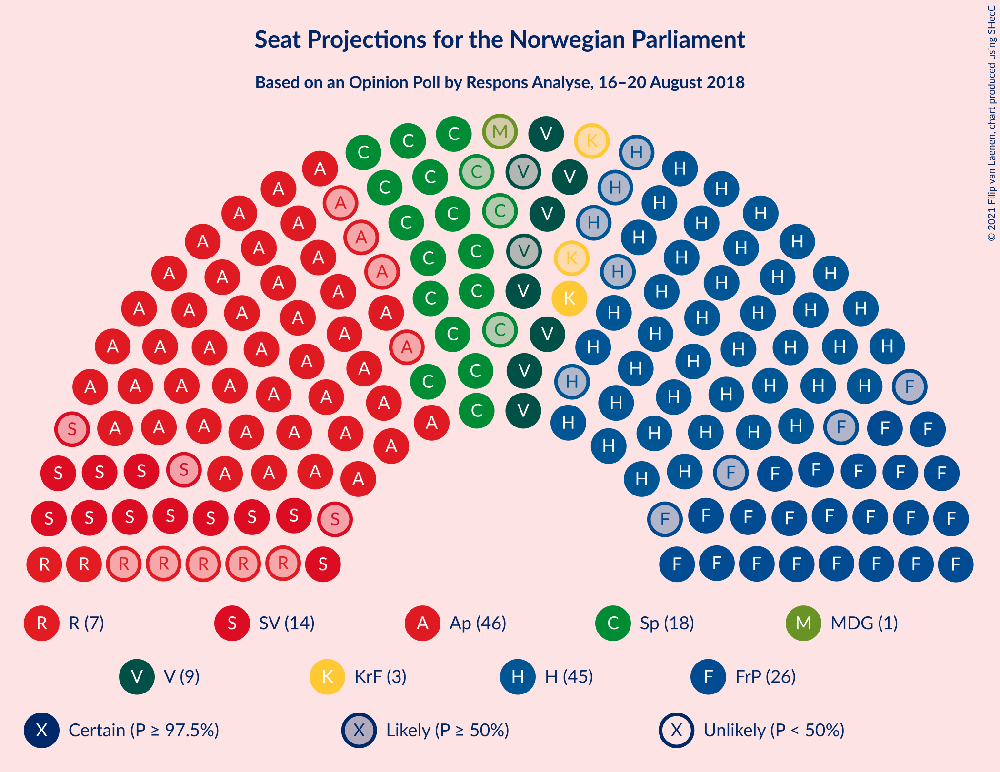
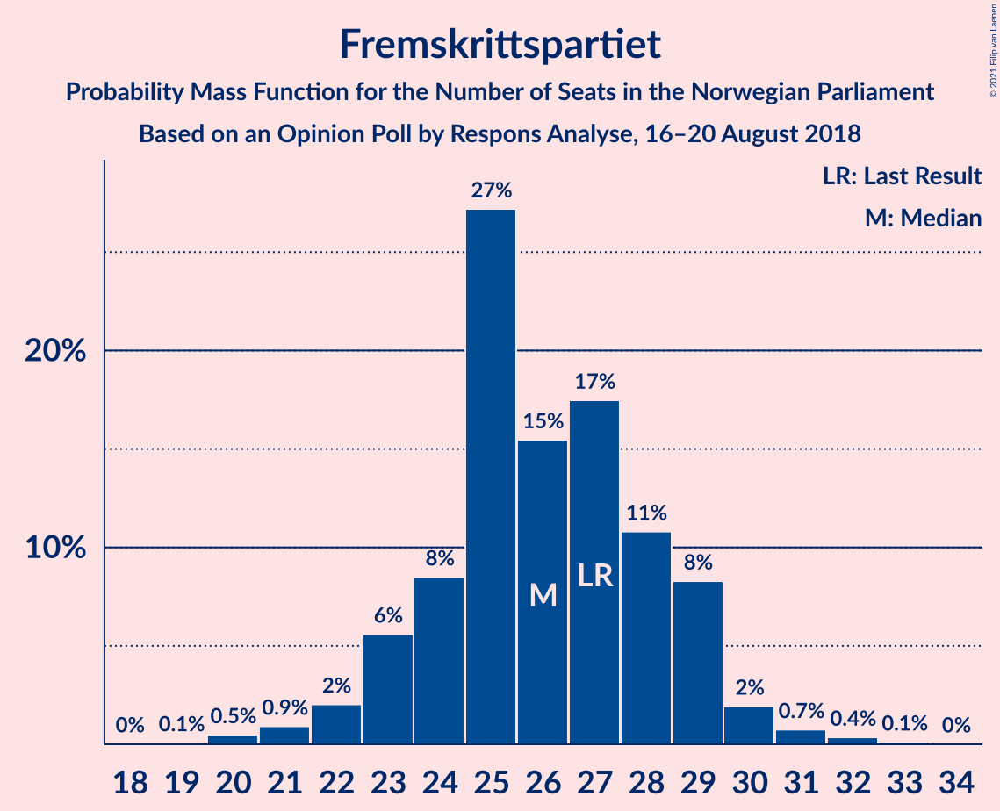
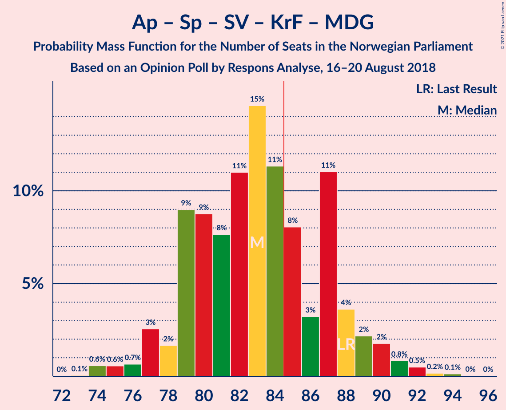

# Opinion Poll by Respons Analyse, 16–20 August 2018

<a href="#voting-intentions">Voting Intentions</a> | <a href="#seats">Seats</a> | <a href="#coalitions">Coalitions</a> | <a href="#technical-information">Technical Information</a>

## Voting Intentions

### Confidence Intervals

| Party | Last Result | Poll Result | 80% Confidence Interval | 90% Confidence Interval | 95% Confidence Interval | 99% Confidence Interval |
|:-----:|:-----------:|:-----------:|:-----------------------:|:-----------------------:|:-----------------------:|:-----------------------:|
| Arbeiderpartiet | 27.4% | 25.9% | 24.2–27.7% |23.7–28.2% |23.2–28.7% |22.5–29.6% |
| Høyre | 25.0% | 25.6% | 23.9–27.4% |23.4–27.9% |23.0–28.4% |22.2–29.3% |
| Fremskrittspartiet | 15.2% | 14.6% | 13.2–16.1% |12.8–16.5% |12.5–16.9% |11.9–17.7% |
| Senterpartiet | 10.3% | 10.3% | 9.1–11.6% |8.8–12.0% |8.6–12.3% |8.0–13.0% |
| Sosialistisk Venstreparti | 6.0% | 7.7% | 6.7–8.9% |6.4–9.2% |6.2–9.5% |5.7–10.1% |
| Venstre | 4.4% | 5.2% | 4.4–6.2% |4.2–6.5% |4.0–6.8% |3.6–7.3% |
| Rødt | 2.4% | 4.1% | 3.4–5.0% |3.2–5.3% |3.0–5.5% |2.7–6.0% |
| Kristelig Folkeparti | 4.2% | 3.9% | 3.2–4.8% |3.0–5.1% |2.9–5.3% |2.6–5.8% |
| Miljøpartiet De Grønne | 3.2% | 2.2% | 1.7–2.9% |1.6–3.1% |1.4–3.3% |1.2–3.7% |

*Note:* The poll result column reflects the actual value used in the calculations. Published results may vary slightly, and in addition be rounded to fewer digits.

## Seats

### Confidence Intervals

| Party | Last Result | Median | 80% Confidence Interval | 90% Confidence Interval | 95% Confidence Interval | 99% Confidence Interval |
|:-----:|:-----------:|:------:|:-----------------------:|:-----------------------:|:-----------------------:|:-----------------------:|
| <a href="#arbeiderpartiet">Arbeiderpartiet</a> | 49 | 46 | 43–50 |42–50 |42–51 |41–53 |
| <a href="#høyre">Høyre</a> | 45 | 45 | 42–48 |41–50 |40–50 |39–52 |
| <a href="#fremskrittspartiet">Fremskrittspartiet</a> | 27 | 26 | 24–29 |23–29 |22–30 |20–31 |
| <a href="#senterpartiet">Senterpartiet</a> | 19 | 18 | 16–21 |16–22 |15–22 |14–23 |
| <a href="#sosialistisk-venstreparti">Sosialistisk Venstreparti</a> | 11 | 14 | 11–16 |11–16 |11–17 |10–18 |
| <a href="#venstre">Venstre</a> | 8 | 9 | 8–11 |7–11 |7–12 |2–13 |
| <a href="#rødt">Rødt</a> | 1 | 7 | 2–9 |2–9 |2–10 |1–10 |
| <a href="#kristelig-folkeparti">Kristelig Folkeparti</a> | 8 | 3 | 2–8 |1–9 |1–9 |1–10 |
| <a href="#miljøpartiet-de-grønne">Miljøpartiet De Grønne</a> | 1 | 1 | 0–1 |0–1 |0–2 |0–2 |

### Arbeiderpartiet

*For a full overview of the results for this party, see the [Arbeiderpartiet](party-arbeiderpartiet.html) page.*

| Number of Seats | Probability | Accumulated | Special Marks |
|:---------------:|:-----------:|:-----------:|:-------------:|
| 39 | 0% | 100% |  |
| 40 | 0.3% | 99.9% |  |
| 41 | 2% | 99.6% |  |
| 42 | 7% | 98% |  |
| 43 | 13% | 91% |  |
| 44 | 7% | 78% |  |
| 45 | 18% | 71% |  |
| 46 | 14% | 52% | Median |
| 47 | 14% | 39% |  |
| 48 | 11% | 25% |  |
| 49 | 3% | 14% | Last Result |
| 50 | 6% | 11% |  |
| 51 | 2% | 5% |  |
| 52 | 1.1% | 2% |  |
| 53 | 0.7% | 1.2% |  |
| 54 | 0.3% | 0.5% |  |
| 55 | 0.1% | 0.2% |  |
| 56 | 0.1% | 0.1% |  |
| 57 | 0% | 0% |  |

### Høyre

*For a full overview of the results for this party, see the [Høyre](party-høyre.html) page.*

| Number of Seats | Probability | Accumulated | Special Marks |
|:---------------:|:-----------:|:-----------:|:-------------:|
| 37 | 0.1% | 100% |  |
| 38 | 0.2% | 99.9% |  |
| 39 | 0.5% | 99.6% |  |
| 40 | 3% | 99.2% |  |
| 41 | 5% | 96% |  |
| 42 | 7% | 91% |  |
| 43 | 13% | 84% |  |
| 44 | 14% | 71% |  |
| 45 | 23% | 57% | Last Result, Median |
| 46 | 10% | 34% |  |
| 47 | 8% | 24% |  |
| 48 | 6% | 16% |  |
| 49 | 5% | 10% |  |
| 50 | 3% | 5% |  |
| 51 | 0.8% | 2% |  |
| 52 | 0.7% | 1.0% |  |
| 53 | 0.1% | 0.3% |  |
| 54 | 0.2% | 0.2% |  |
| 55 | 0% | 0% |  |

### Fremskrittspartiet

*For a full overview of the results for this party, see the [Fremskrittspartiet](party-fremskrittspartiet.html) page.*

| Number of Seats | Probability | Accumulated | Special Marks |
|:---------------:|:-----------:|:-----------:|:-------------:|
| 19 | 0.1% | 100% |  |
| 20 | 0.5% | 99.9% |  |
| 21 | 0.9% | 99.4% |  |
| 22 | 2% | 98.5% |  |
| 23 | 6% | 96% |  |
| 24 | 8% | 91% |  |
| 25 | 27% | 82% |  |
| 26 | 15% | 55% | Median |
| 27 | 17% | 40% | Last Result |
| 28 | 11% | 22% |  |
| 29 | 8% | 11% |  |
| 30 | 2% | 3% |  |
| 31 | 0.7% | 1.2% |  |
| 32 | 0.4% | 0.5% |  |
| 33 | 0.1% | 0.1% |  |
| 34 | 0% | 0% |  |

### Senterpartiet

*For a full overview of the results for this party, see the [Senterpartiet](party-senterpartiet.html) page.*

| Number of Seats | Probability | Accumulated | Special Marks |
|:---------------:|:-----------:|:-----------:|:-------------:|
| 12 | 0.1% | 100% |  |
| 13 | 0.3% | 99.9% |  |
| 14 | 0.5% | 99.7% |  |
| 15 | 3% | 99.2% |  |
| 16 | 17% | 96% |  |
| 17 | 27% | 79% |  |
| 18 | 24% | 52% | Median |
| 19 | 10% | 28% | Last Result |
| 20 | 5% | 17% |  |
| 21 | 6% | 12% |  |
| 22 | 5% | 6% |  |
| 23 | 1.1% | 2% |  |
| 24 | 0.4% | 0.5% |  |
| 25 | 0% | 0% |  |

### Sosialistisk Venstreparti

*For a full overview of the results for this party, see the [Sosialistisk Venstreparti](party-sosialistiskvenstreparti.html) page.*

| Number of Seats | Probability | Accumulated | Special Marks |
|:---------------:|:-----------:|:-----------:|:-------------:|
| 9 | 0.2% | 100% |  |
| 10 | 2% | 99.8% |  |
| 11 | 10% | 98% | Last Result |
| 12 | 15% | 88% |  |
| 13 | 21% | 73% |  |
| 14 | 24% | 52% | Median |
| 15 | 15% | 28% |  |
| 16 | 9% | 12% |  |
| 17 | 2% | 3% |  |
| 18 | 0.7% | 1.0% |  |
| 19 | 0.2% | 0.2% |  |
| 20 | 0% | 0% |  |

### Venstre

*For a full overview of the results for this party, see the [Venstre](party-venstre.html) page.*

| Number of Seats | Probability | Accumulated | Special Marks |
|:---------------:|:-----------:|:-----------:|:-------------:|
| 2 | 2% | 100% |  |
| 3 | 0.2% | 98% |  |
| 4 | 0% | 98% |  |
| 5 | 0% | 98% |  |
| 6 | 0% | 98% |  |
| 7 | 4% | 98% |  |
| 8 | 22% | 93% | Last Result |
| 9 | 27% | 71% | Median |
| 10 | 30% | 44% |  |
| 11 | 11% | 15% |  |
| 12 | 3% | 4% |  |
| 13 | 1.1% | 1.3% |  |
| 14 | 0.1% | 0.1% |  |
| 15 | 0% | 0% |  |

### Rødt

*For a full overview of the results for this party, see the [Rødt](party-rødt.html) page.*

| Number of Seats | Probability | Accumulated | Special Marks |
|:---------------:|:-----------:|:-----------:|:-------------:|
| 1 | 2% | 100% | Last Result |
| 2 | 35% | 98% |  |
| 3 | 0% | 63% |  |
| 4 | 0% | 63% |  |
| 5 | 0% | 63% |  |
| 6 | 0% | 63% |  |
| 7 | 17% | 63% | Median |
| 8 | 29% | 46% |  |
| 9 | 13% | 17% |  |
| 10 | 4% | 4% |  |
| 11 | 0.3% | 0.4% |  |
| 12 | 0.1% | 0.1% |  |
| 13 | 0% | 0% |  |

### Kristelig Folkeparti

*For a full overview of the results for this party, see the [Kristelig Folkeparti](party-kristeligfolkeparti.html) page.*

| Number of Seats | Probability | Accumulated | Special Marks |
|:---------------:|:-----------:|:-----------:|:-------------:|
| 0 | 0.1% | 100% |  |
| 1 | 8% | 99.9% |  |
| 2 | 9% | 91% |  |
| 3 | 36% | 83% | Median |
| 4 | 0% | 46% |  |
| 5 | 0% | 46% |  |
| 6 | 0% | 46% |  |
| 7 | 16% | 46% |  |
| 8 | 23% | 31% | Last Result |
| 9 | 7% | 8% |  |
| 10 | 0.8% | 0.8% |  |
| 11 | 0.1% | 0.1% |  |
| 12 | 0% | 0% |  |

### Miljøpartiet De Grønne

*For a full overview of the results for this party, see the [Miljøpartiet De Grønne](party-miljøpartietdegrønne.html) page.*

| Number of Seats | Probability | Accumulated | Special Marks |
|:---------------:|:-----------:|:-----------:|:-------------:|
| 0 | 27% | 100% |  |
| 1 | 69% | 73% | Last Result, Median |
| 2 | 4% | 4% |  |
| 3 | 0% | 0.1% |  |
| 4 | 0% | 0.1% |  |
| 5 | 0% | 0.1% |  |
| 6 | 0% | 0.1% |  |
| 7 | 0.1% | 0.1% |  |
| 8 | 0% | 0% |  |

## Coalitions

### Confidence Intervals

| Coalition | Last Result | Median | Majority? | 80% Confidence Interval | 90% Confidence Interval | 95% Confidence Interval | 99% Confidence Interval |
|:---------:|:-----------:|:------:|:---------:|:-----------------------:|:-----------------------:|:-----------------------:|:-----------------------:|
| Høyre – Fremskrittspartiet – Senterpartiet – Venstre – Kristelig Folkeparti | 107 | 103 | 100% | 99–108 | 98–109 | 97–110 | 94–112 |
| Høyre – Fremskrittspartiet – Venstre – Kristelig Folkeparti – Miljøpartiet De Grønne | 89 | 86 | 63% | 82–90 | 81–92 | 80–93 | 77–94 |
| Høyre – Fremskrittspartiet – Venstre – Kristelig Folkeparti | 88 | 85 | 54% | 81–89 | 80–91 | 79–92 | 76–94 |
| Arbeiderpartiet – Senterpartiet – Sosialistisk Venstreparti – Kristelig Folkeparti – Miljøpartiet De Grønne | 88 | 83 | 32% | 79–87 | 78–89 | 77–90 | 74–92 |
| Arbeiderpartiet – Senterpartiet – Sosialistisk Venstreparti – Rødt – Miljøpartiet De Grønne | 81 | 84 | 46% | 80–88 | 78–89 | 77–90 | 75–93 |
| Arbeiderpartiet – Senterpartiet – Sosialistisk Venstreparti – Rødt | 80 | 83 | 37% | 79–87 | 77–88 | 76–89 | 75–92 |
| Høyre – Fremskrittspartiet – Venstre | 80 | 80 | 6% | 76–84 | 75–85 | 74–87 | 72–88 |
| Arbeiderpartiet – Senterpartiet – Sosialistisk Venstreparti – Miljøpartiet De Grønne | 80 | 78 | 3% | 74–84 | 73–84 | 73–85 | 71–88 |
| Arbeiderpartiet – Senterpartiet – Sosialistisk Venstreparti | 79 | 77 | 2% | 73–83 | 72–83 | 72–84 | 70–87 |
| Høyre – Fremskrittspartiet | 72 | 71 | 0% | 67–74 | 66–76 | 65–77 | 63–80 |
| Arbeiderpartiet – Senterpartiet – Kristelig Folkeparti – Miljøpartiet De Grønne | 77 | 70 | 0% | 64–73 | 64–75 | 63–76 | 62–78 |
| Arbeiderpartiet – Senterpartiet – Kristelig Folkeparti | 76 | 69 | 0% | 64–73 | 63–74 | 63–75 | 61–77 |
| Arbeiderpartiet – Sosialistisk Venstreparti – Rødt – Miljøpartiet De Grønne | 62 | 66 | 0% | 61–70 | 60–71 | 59–72 | 57–75 |
| Arbeiderpartiet – Senterpartiet | 68 | 64 | 0% | 60–68 | 60–69 | 59–70 | 57–73 |
| Høyre – Venstre – Kristelig Folkeparti | 61 | 59 | 0% | 55–63 | 54–65 | 53–66 | 50–68 |
| Arbeiderpartiet – Sosialistisk Venstreparti | 60 | 60 | 0% | 56–63 | 55–65 | 54–65 | 53–68 |
| Senterpartiet – Venstre – Kristelig Folkeparti | 35 | 32 | 0% | 28–36 | 27–37 | 26–38 | 23–39 |

### Høyre – Fremskrittspartiet – Senterpartiet – Venstre – Kristelig Folkeparti

| Number of Seats | Probability | Accumulated | Special Marks |
|:---------------:|:-----------:|:-----------:|:-------------:|
| 92 | 0.1% | 100% |  |
| 93 | 0.1% | 99.9% |  |
| 94 | 0.4% | 99.8% |  |
| 95 | 0.5% | 99.5% |  |
| 96 | 0.8% | 99.0% |  |
| 97 | 1.5% | 98% |  |
| 98 | 3% | 97% |  |
| 99 | 11% | 94% |  |
| 100 | 8% | 83% |  |
| 101 | 13% | 75% | Median |
| 102 | 7% | 61% |  |
| 103 | 8% | 54% |  |
| 104 | 13% | 46% |  |
| 105 | 12% | 33% |  |
| 106 | 6% | 22% |  |
| 107 | 6% | 16% | Last Result |
| 108 | 4% | 10% |  |
| 109 | 2% | 6% |  |
| 110 | 3% | 4% |  |
| 111 | 0.3% | 1.0% |  |
| 112 | 0.5% | 0.7% |  |
| 113 | 0.1% | 0.1% |  |
| 114 | 0% | 0% |  |

### Høyre – Fremskrittspartiet – Venstre – Kristelig Folkeparti – Miljøpartiet De Grønne

| Number of Seats | Probability | Accumulated | Special Marks |
|:---------------:|:-----------:|:-----------:|:-------------:|
| 74 | 0% | 100% |  |
| 75 | 0% | 99.9% |  |
| 76 | 0.4% | 99.9% |  |
| 77 | 0.2% | 99.5% |  |
| 78 | 0.9% | 99.3% |  |
| 79 | 0.6% | 98% |  |
| 80 | 1.2% | 98% |  |
| 81 | 4% | 97% |  |
| 82 | 6% | 93% |  |
| 83 | 11% | 87% |  |
| 84 | 12% | 76% | Median |
| 85 | 13% | 63% | Majority |
| 86 | 8% | 51% |  |
| 87 | 11% | 43% |  |
| 88 | 12% | 31% |  |
| 89 | 7% | 19% | Last Result |
| 90 | 3% | 12% |  |
| 91 | 3% | 9% |  |
| 92 | 2% | 5% |  |
| 93 | 3% | 4% |  |
| 94 | 0.7% | 1.1% |  |
| 95 | 0.3% | 0.4% |  |
| 96 | 0% | 0.1% |  |
| 97 | 0% | 0% |  |

### Høyre – Fremskrittspartiet – Venstre – Kristelig Folkeparti

| Number of Seats | Probability | Accumulated | Special Marks |
|:---------------:|:-----------:|:-----------:|:-------------:|
| 74 | 0% | 100% |  |
| 75 | 0.3% | 99.9% |  |
| 76 | 0.3% | 99.6% |  |
| 77 | 0.7% | 99.3% |  |
| 78 | 0.8% | 98.6% |  |
| 79 | 1.1% | 98% |  |
| 80 | 4% | 97% |  |
| 81 | 5% | 93% |  |
| 82 | 12% | 89% |  |
| 83 | 12% | 77% | Median |
| 84 | 11% | 65% |  |
| 85 | 9% | 54% | Majority |
| 86 | 9% | 45% |  |
| 87 | 16% | 36% |  |
| 88 | 6% | 20% | Last Result |
| 89 | 5% | 14% |  |
| 90 | 4% | 9% |  |
| 91 | 1.3% | 5% |  |
| 92 | 3% | 4% |  |
| 93 | 0.6% | 1.1% |  |
| 94 | 0.4% | 0.5% |  |
| 95 | 0.1% | 0.1% |  |
| 96 | 0% | 0% |  |

### Arbeiderpartiet – Senterpartiet – Sosialistisk Venstreparti – Kristelig Folkeparti – Miljøpartiet De Grønne

| Number of Seats | Probability | Accumulated | Special Marks |
|:---------------:|:-----------:|:-----------:|:-------------:|
| 73 | 0.1% | 100% |  |
| 74 | 0.6% | 99.9% |  |
| 75 | 0.6% | 99.4% |  |
| 76 | 0.7% | 98.8% |  |
| 77 | 3% | 98% |  |
| 78 | 2% | 96% |  |
| 79 | 9% | 94% |  |
| 80 | 9% | 85% |  |
| 81 | 8% | 76% |  |
| 82 | 11% | 69% | Median |
| 83 | 15% | 58% |  |
| 84 | 11% | 43% |  |
| 85 | 8% | 32% | Majority |
| 86 | 3% | 24% |  |
| 87 | 11% | 20% |  |
| 88 | 4% | 9% | Last Result |
| 89 | 2% | 6% |  |
| 90 | 2% | 3% |  |
| 91 | 0.8% | 2% |  |
| 92 | 0.5% | 0.9% |  |
| 93 | 0.2% | 0.4% |  |
| 94 | 0.1% | 0.2% |  |
| 95 | 0% | 0.1% |  |
| 96 | 0% | 0% |  |

### Arbeiderpartiet – Senterpartiet – Sosialistisk Venstreparti – Rødt – Miljøpartiet De Grønne

| Number of Seats | Probability | Accumulated | Special Marks |
|:---------------:|:-----------:|:-----------:|:-------------:|
| 74 | 0.1% | 100% |  |
| 75 | 0.4% | 99.9% |  |
| 76 | 0.6% | 99.5% |  |
| 77 | 3% | 98.9% |  |
| 78 | 1.3% | 96% |  |
| 79 | 4% | 95% |  |
| 80 | 5% | 91% |  |
| 81 | 6% | 86% | Last Result |
| 82 | 16% | 80% |  |
| 83 | 9% | 64% |  |
| 84 | 9% | 55% |  |
| 85 | 11% | 46% | Majority |
| 86 | 12% | 35% | Median |
| 87 | 12% | 23% |  |
| 88 | 5% | 11% |  |
| 89 | 4% | 7% |  |
| 90 | 1.1% | 3% |  |
| 91 | 0.8% | 2% |  |
| 92 | 0.7% | 1.4% |  |
| 93 | 0.3% | 0.7% |  |
| 94 | 0.3% | 0.4% |  |
| 95 | 0% | 0.1% |  |
| 96 | 0% | 0% |  |

### Arbeiderpartiet – Senterpartiet – Sosialistisk Venstreparti – Rødt

| Number of Seats | Probability | Accumulated | Special Marks |
|:---------------:|:-----------:|:-----------:|:-------------:|
| 73 | 0% | 100% |  |
| 74 | 0.3% | 99.9% |  |
| 75 | 0.7% | 99.6% |  |
| 76 | 3% | 98.9% |  |
| 77 | 2% | 96% |  |
| 78 | 3% | 95% |  |
| 79 | 3% | 91% |  |
| 80 | 7% | 88% | Last Result |
| 81 | 12% | 81% |  |
| 82 | 11% | 69% |  |
| 83 | 8% | 57% |  |
| 84 | 13% | 49% |  |
| 85 | 12% | 37% | Median, Majority |
| 86 | 11% | 24% |  |
| 87 | 6% | 13% |  |
| 88 | 4% | 7% |  |
| 89 | 1.2% | 3% |  |
| 90 | 0.6% | 2% |  |
| 91 | 0.9% | 2% |  |
| 92 | 0.2% | 0.7% |  |
| 93 | 0.4% | 0.5% |  |
| 94 | 0% | 0.1% |  |
| 95 | 0% | 0.1% |  |
| 96 | 0% | 0% |  |

### Høyre – Fremskrittspartiet – Venstre

| Number of Seats | Probability | Accumulated | Special Marks |
|:---------------:|:-----------:|:-----------:|:-------------:|
| 69 | 0.1% | 100% |  |
| 70 | 0.1% | 99.9% |  |
| 71 | 0.1% | 99.7% |  |
| 72 | 0.6% | 99.6% |  |
| 73 | 0.7% | 99.0% |  |
| 74 | 3% | 98% |  |
| 75 | 2% | 95% |  |
| 76 | 5% | 93% |  |
| 77 | 7% | 88% |  |
| 78 | 7% | 81% |  |
| 79 | 19% | 74% |  |
| 80 | 11% | 55% | Last Result, Median |
| 81 | 11% | 44% |  |
| 82 | 13% | 33% |  |
| 83 | 6% | 20% |  |
| 84 | 8% | 14% |  |
| 85 | 2% | 6% | Majority |
| 86 | 1.2% | 4% |  |
| 87 | 1.2% | 3% |  |
| 88 | 1.2% | 2% |  |
| 89 | 0.1% | 0.4% |  |
| 90 | 0.2% | 0.3% |  |
| 91 | 0% | 0.1% |  |
| 92 | 0% | 0% |  |

### Arbeiderpartiet – Senterpartiet – Sosialistisk Venstreparti – Miljøpartiet De Grønne

| Number of Seats | Probability | Accumulated | Special Marks |
|:---------------:|:-----------:|:-----------:|:-------------:|
| 69 | 0% | 100% |  |
| 70 | 0.3% | 99.9% |  |
| 71 | 0.7% | 99.7% |  |
| 72 | 1.1% | 99.0% |  |
| 73 | 5% | 98% |  |
| 74 | 8% | 93% |  |
| 75 | 10% | 85% |  |
| 76 | 7% | 75% |  |
| 77 | 16% | 68% |  |
| 78 | 7% | 51% |  |
| 79 | 12% | 45% | Median |
| 80 | 10% | 32% | Last Result |
| 81 | 6% | 22% |  |
| 82 | 4% | 17% |  |
| 83 | 2% | 12% |  |
| 84 | 7% | 10% |  |
| 85 | 2% | 3% | Majority |
| 86 | 0.9% | 2% |  |
| 87 | 0.3% | 0.9% |  |
| 88 | 0.3% | 0.6% |  |
| 89 | 0.1% | 0.3% |  |
| 90 | 0.2% | 0.2% |  |
| 91 | 0% | 0% |  |

### Arbeiderpartiet – Senterpartiet – Sosialistisk Venstreparti

| Number of Seats | Probability | Accumulated | Special Marks |
|:---------------:|:-----------:|:-----------:|:-------------:|
| 69 | 0.1% | 100% |  |
| 70 | 0.3% | 99.8% |  |
| 71 | 1.4% | 99.5% |  |
| 72 | 5% | 98% |  |
| 73 | 8% | 93% |  |
| 74 | 9% | 85% |  |
| 75 | 6% | 77% |  |
| 76 | 16% | 71% |  |
| 77 | 8% | 55% |  |
| 78 | 14% | 47% | Median |
| 79 | 5% | 33% | Last Result |
| 80 | 10% | 27% |  |
| 81 | 5% | 18% |  |
| 82 | 2% | 13% |  |
| 83 | 7% | 10% |  |
| 84 | 1.1% | 4% |  |
| 85 | 1.4% | 2% | Majority |
| 86 | 0.3% | 1.0% |  |
| 87 | 0.4% | 0.7% |  |
| 88 | 0.1% | 0.3% |  |
| 89 | 0.2% | 0.2% |  |
| 90 | 0% | 0% |  |

### Høyre – Fremskrittspartiet

| Number of Seats | Probability | Accumulated | Special Marks |
|:---------------:|:-----------:|:-----------:|:-------------:|
| 61 | 0.1% | 100% |  |
| 62 | 0.1% | 99.8% |  |
| 63 | 0.4% | 99.7% |  |
| 64 | 0.4% | 99.3% |  |
| 65 | 2% | 99.0% |  |
| 66 | 4% | 97% |  |
| 67 | 3% | 93% |  |
| 68 | 8% | 89% |  |
| 69 | 11% | 81% |  |
| 70 | 19% | 71% |  |
| 71 | 11% | 51% | Median |
| 72 | 11% | 40% | Last Result |
| 73 | 11% | 29% |  |
| 74 | 8% | 18% |  |
| 75 | 4% | 10% |  |
| 76 | 2% | 6% |  |
| 77 | 2% | 4% |  |
| 78 | 0.7% | 2% |  |
| 79 | 0.3% | 1.0% |  |
| 80 | 0.4% | 0.7% |  |
| 81 | 0.2% | 0.2% |  |
| 82 | 0% | 0% |  |

### Arbeiderpartiet – Senterpartiet – Kristelig Folkeparti – Miljøpartiet De Grønne

| Number of Seats | Probability | Accumulated | Special Marks |
|:---------------:|:-----------:|:-----------:|:-------------:|
| 60 | 0.2% | 100% |  |
| 61 | 0.3% | 99.8% |  |
| 62 | 0.6% | 99.5% |  |
| 63 | 4% | 98.9% |  |
| 64 | 6% | 95% |  |
| 65 | 2% | 89% |  |
| 66 | 9% | 88% |  |
| 67 | 5% | 78% |  |
| 68 | 7% | 73% | Median |
| 69 | 14% | 67% |  |
| 70 | 8% | 53% |  |
| 71 | 17% | 45% |  |
| 72 | 10% | 28% |  |
| 73 | 8% | 18% |  |
| 74 | 2% | 10% |  |
| 75 | 4% | 8% |  |
| 76 | 1.2% | 3% |  |
| 77 | 1.1% | 2% | Last Result |
| 78 | 0.5% | 0.9% |  |
| 79 | 0.2% | 0.5% |  |
| 80 | 0.1% | 0.3% |  |
| 81 | 0.1% | 0.2% |  |
| 82 | 0% | 0% |  |

### Arbeiderpartiet – Senterpartiet – Kristelig Folkeparti

| Number of Seats | Probability | Accumulated | Special Marks |
|:---------------:|:-----------:|:-----------:|:-------------:|
| 59 | 0% | 100% |  |
| 60 | 0.4% | 99.9% |  |
| 61 | 0.3% | 99.5% |  |
| 62 | 1.0% | 99.2% |  |
| 63 | 7% | 98% |  |
| 64 | 3% | 91% |  |
| 65 | 7% | 88% |  |
| 66 | 6% | 81% |  |
| 67 | 9% | 75% | Median |
| 68 | 10% | 67% |  |
| 69 | 10% | 56% |  |
| 70 | 15% | 46% |  |
| 71 | 11% | 31% |  |
| 72 | 10% | 20% |  |
| 73 | 3% | 10% |  |
| 74 | 4% | 8% |  |
| 75 | 2% | 4% |  |
| 76 | 0.8% | 2% | Last Result |
| 77 | 0.7% | 1.2% |  |
| 78 | 0.2% | 0.5% |  |
| 79 | 0% | 0.2% |  |
| 80 | 0.1% | 0.2% |  |
| 81 | 0% | 0.1% |  |
| 82 | 0% | 0% |  |

### Arbeiderpartiet – Sosialistisk Venstreparti – Rødt – Miljøpartiet De Grønne

| Number of Seats | Probability | Accumulated | Special Marks |
|:---------------:|:-----------:|:-----------:|:-------------:|
| 56 | 0.1% | 100% |  |
| 57 | 0.5% | 99.9% |  |
| 58 | 0.3% | 99.3% |  |
| 59 | 3% | 99.0% |  |
| 60 | 2% | 96% |  |
| 61 | 4% | 94% |  |
| 62 | 6% | 90% | Last Result |
| 63 | 6% | 84% |  |
| 64 | 12% | 78% |  |
| 65 | 13% | 67% |  |
| 66 | 8% | 54% |  |
| 67 | 7% | 46% |  |
| 68 | 13% | 39% | Median |
| 69 | 8% | 25% |  |
| 70 | 11% | 17% |  |
| 71 | 3% | 6% |  |
| 72 | 1.5% | 3% |  |
| 73 | 0.8% | 2% |  |
| 74 | 0.5% | 1.0% |  |
| 75 | 0.4% | 0.5% |  |
| 76 | 0.1% | 0.2% |  |
| 77 | 0.1% | 0.1% |  |
| 78 | 0% | 0% |  |

### Arbeiderpartiet – Senterpartiet

| Number of Seats | Probability | Accumulated | Special Marks |
|:---------------:|:-----------:|:-----------:|:-------------:|
| 56 | 0.1% | 100% |  |
| 57 | 0.5% | 99.9% |  |
| 58 | 0.9% | 99.5% |  |
| 59 | 4% | 98.6% |  |
| 60 | 10% | 95% |  |
| 61 | 11% | 85% |  |
| 62 | 12% | 74% |  |
| 63 | 10% | 62% |  |
| 64 | 16% | 53% | Median |
| 65 | 9% | 36% |  |
| 66 | 8% | 27% |  |
| 67 | 5% | 19% |  |
| 68 | 6% | 14% | Last Result |
| 69 | 4% | 8% |  |
| 70 | 2% | 4% |  |
| 71 | 1.1% | 2% |  |
| 72 | 0.3% | 1.1% |  |
| 73 | 0.5% | 0.8% |  |
| 74 | 0.3% | 0.4% |  |
| 75 | 0% | 0% |  |

### Høyre – Venstre – Kristelig Folkeparti

| Number of Seats | Probability | Accumulated | Special Marks |
|:---------------:|:-----------:|:-----------:|:-------------:|
| 48 | 0.2% | 100% |  |
| 49 | 0.1% | 99.8% |  |
| 50 | 0.2% | 99.7% |  |
| 51 | 0.3% | 99.5% |  |
| 52 | 0.9% | 99.2% |  |
| 53 | 3% | 98% |  |
| 54 | 3% | 96% |  |
| 55 | 7% | 93% |  |
| 56 | 7% | 86% |  |
| 57 | 10% | 79% | Median |
| 58 | 17% | 68% |  |
| 59 | 8% | 51% |  |
| 60 | 10% | 43% |  |
| 61 | 8% | 33% | Last Result |
| 62 | 12% | 25% |  |
| 63 | 3% | 13% |  |
| 64 | 2% | 9% |  |
| 65 | 4% | 7% |  |
| 66 | 2% | 3% |  |
| 67 | 0.6% | 1.3% |  |
| 68 | 0.5% | 0.7% |  |
| 69 | 0.2% | 0.2% |  |
| 70 | 0% | 0.1% |  |
| 71 | 0% | 0% |  |

### Arbeiderpartiet – Sosialistisk Venstreparti

| Number of Seats | Probability | Accumulated | Special Marks |
|:---------------:|:-----------:|:-----------:|:-------------:|
| 51 | 0% | 100% |  |
| 52 | 0.2% | 99.9% |  |
| 53 | 2% | 99.7% |  |
| 54 | 2% | 98% |  |
| 55 | 4% | 95% |  |
| 56 | 12% | 92% |  |
| 57 | 9% | 80% |  |
| 58 | 9% | 71% |  |
| 59 | 12% | 62% |  |
| 60 | 16% | 51% | Last Result, Median |
| 61 | 11% | 35% |  |
| 62 | 10% | 24% |  |
| 63 | 4% | 13% |  |
| 64 | 2% | 9% |  |
| 65 | 5% | 7% |  |
| 66 | 0.9% | 2% |  |
| 67 | 0.8% | 2% |  |
| 68 | 0.5% | 0.8% |  |
| 69 | 0.1% | 0.3% |  |
| 70 | 0.2% | 0.2% |  |
| 71 | 0% | 0.1% |  |
| 72 | 0% | 0% |  |

### Senterpartiet – Venstre – Kristelig Folkeparti

| Number of Seats | Probability | Accumulated | Special Marks |
|:---------------:|:-----------:|:-----------:|:-------------:|
| 21 | 0.2% | 100% |  |
| 22 | 0.1% | 99.7% |  |
| 23 | 0.3% | 99.6% |  |
| 24 | 0.3% | 99.3% |  |
| 25 | 1.0% | 99.0% |  |
| 26 | 1.1% | 98% |  |
| 27 | 4% | 97% |  |
| 28 | 7% | 93% |  |
| 29 | 7% | 86% |  |
| 30 | 8% | 79% | Median |
| 31 | 15% | 71% |  |
| 32 | 7% | 56% |  |
| 33 | 14% | 49% |  |
| 34 | 11% | 35% |  |
| 35 | 11% | 23% | Last Result |
| 36 | 5% | 12% |  |
| 37 | 4% | 8% |  |
| 38 | 2% | 4% |  |
| 39 | 2% | 2% |  |
| 40 | 0.2% | 0.4% |  |
| 41 | 0.2% | 0.2% |  |
| 42 | 0% | 0% |  |

## Technical Information

### Opinion Poll

+ **Polling firm:** Respons Analyse
+ **Commissioner(s):** —
+ **Fieldwork period:** 16–20 August 2018

### Calculations

+ **Sample size:** 1001
+ **Simulations done:** 1,048,576
+ **Error estimate:** 1.48%

