# Opinion Poll by Respons Analyse, 16–20 August 2018

<a href="#voting-intentions">Voting Intentions</a> | <a href="#seats">Seats</a> | <a href="#coalitions">Coalitions</a> | <a href="#technical-information">Technical Information</a>

## Voting Intentions

### Confidence Intervals

| Party | Last Result | Poll Result | 80% Confidence Interval | 90% Confidence Interval | 95% Confidence Interval | 99% Confidence Interval |
|:-----:|:-----------:|:-----------:|:-----------------------:|:-----------------------:|:-----------------------:|:-----------------------:|
| Arbeiderpartiet | 27.4% | 25.9% | 24.2–27.7% |23.7–28.2% |23.2–28.7% |22.5–29.6% |
| Høyre | 25.0% | 25.6% | 23.9–27.4% |23.4–27.9% |23.0–28.4% |22.2–29.3% |
| Fremskrittspartiet | 15.2% | 14.6% | 13.2–16.1% |12.8–16.5% |12.5–16.9% |11.9–17.7% |
| Senterpartiet | 10.3% | 10.3% | 9.1–11.6% |8.8–12.0% |8.6–12.3% |8.0–13.0% |
| Sosialistisk Venstreparti | 6.0% | 7.7% | 6.7–8.9% |6.4–9.2% |6.2–9.5% |5.7–10.1% |
| Venstre | 4.4% | 5.2% | 4.4–6.2% |4.2–6.5% |4.0–6.8% |3.6–7.3% |
| Rødt | 2.4% | 4.1% | 3.4–5.0% |3.2–5.3% |3.0–5.5% |2.7–6.0% |
| Kristelig Folkeparti | 4.2% | 3.9% | 3.2–4.8% |3.0–5.1% |2.9–5.3% |2.6–5.8% |
| Miljøpartiet De Grønne | 3.2% | 2.2% | 1.7–2.9% |1.6–3.1% |1.4–3.3% |1.2–3.7% |

*Note:* The poll result column reflects the actual value used in the calculations. Published results may vary slightly, and in addition be rounded to fewer digits.

## Seats

### Confidence Intervals

| Party | Last Result | Median | 80% Confidence Interval | 90% Confidence Interval | 95% Confidence Interval | 99% Confidence Interval |
|:-----:|:-----------:|:------:|:-----------------------:|:-----------------------:|:-----------------------:|:-----------------------:|
| <a href="#arbeiderpartiet">Arbeiderpartiet</a> | 49 | 46 | 43–48 |42–49 |42–50 |41–52 |
| <a href="#høyre">Høyre</a> | 45 | 45 | 41–49 |41–49 |41–49 |39–52 |
| <a href="#fremskrittspartiet">Fremskrittspartiet</a> | 27 | 27 | 24–29 |23–29 |22–29 |21–31 |
| <a href="#senterpartiet">Senterpartiet</a> | 19 | 18 | 16–19 |15–20 |15–22 |14–24 |
| <a href="#sosialistisk-venstreparti">Sosialistisk Venstreparti</a> | 11 | 14 | 12–15 |11–16 |11–16 |10–18 |
| <a href="#venstre">Venstre</a> | 8 | 10 | 8–11 |8–11 |8–11 |2–12 |
| <a href="#rødt">Rødt</a> | 1 | 7 | 2–9 |2–10 |2–10 |1–10 |
| <a href="#kristelig-folkeparti">Kristelig Folkeparti</a> | 8 | 3 | 3–8 |2–9 |1–9 |1–10 |
| <a href="#miljøpartiet-de-grønne">Miljøpartiet De Grønne</a> | 1 | 1 | 0–1 |0–1 |0–2 |0–2 |

### Arbeiderpartiet

*For a full overview of the results for this party, see the [Arbeiderpartiet](party-arbeiderpartiet.html) page.*

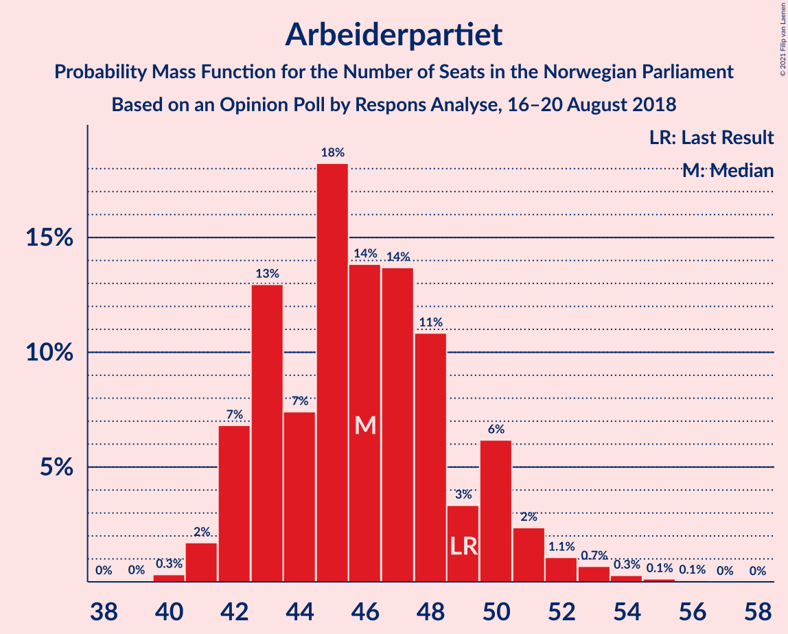

| Number of Seats | Probability | Accumulated | Special Marks |
|:---------------:|:-----------:|:-----------:|:-------------:|
| 39 | 0.1% | 100% |  |
| 40 | 0.1% | 99.9% |  |
| 41 | 1.4% | 99.8% |  |
| 42 | 5% | 98% |  |
| 43 | 4% | 93% |  |
| 44 | 7% | 89% |  |
| 45 | 9% | 82% |  |
| 46 | 35% | 73% | Median |
| 47 | 2% | 38% |  |
| 48 | 29% | 36% |  |
| 49 | 3% | 7% | Last Result |
| 50 | 2% | 4% |  |
| 51 | 1.4% | 2% |  |
| 52 | 0.8% | 1.0% |  |
| 53 | 0.1% | 0.3% |  |
| 54 | 0.1% | 0.2% |  |
| 55 | 0.1% | 0.1% |  |
| 56 | 0% | 0% |  |

### Høyre

*For a full overview of the results for this party, see the [Høyre](party-høyre.html) page.*

| Number of Seats | Probability | Accumulated | Special Marks |
|:---------------:|:-----------:|:-----------:|:-------------:|
| 36 | 0.1% | 100% |  |
| 37 | 0% | 99.9% |  |
| 38 | 0.3% | 99.9% |  |
| 39 | 0.1% | 99.6% |  |
| 40 | 1.5% | 99.5% |  |
| 41 | 18% | 98% |  |
| 42 | 2% | 80% |  |
| 43 | 8% | 79% |  |
| 44 | 19% | 71% |  |
| 45 | 28% | 53% | Last Result, Median |
| 46 | 4% | 25% |  |
| 47 | 6% | 21% |  |
| 48 | 1.4% | 15% |  |
| 49 | 12% | 13% |  |
| 50 | 0.3% | 1.4% |  |
| 51 | 0.6% | 1.1% |  |
| 52 | 0.4% | 0.5% |  |
| 53 | 0.1% | 0.1% |  |
| 54 | 0% | 0% |  |

### Fremskrittspartiet

*For a full overview of the results for this party, see the [Fremskrittspartiet](party-fremskrittspartiet.html) page.*

| Number of Seats | Probability | Accumulated | Special Marks |
|:---------------:|:-----------:|:-----------:|:-------------:|
| 19 | 0.1% | 100% |  |
| 20 | 0.2% | 99.9% |  |
| 21 | 1.2% | 99.8% |  |
| 22 | 3% | 98.6% |  |
| 23 | 2% | 96% |  |
| 24 | 9% | 94% |  |
| 25 | 10% | 85% |  |
| 26 | 8% | 75% |  |
| 27 | 27% | 66% | Last Result, Median |
| 28 | 7% | 39% |  |
| 29 | 31% | 32% |  |
| 30 | 0.9% | 2% |  |
| 31 | 0.5% | 0.7% |  |
| 32 | 0.1% | 0.2% |  |
| 33 | 0% | 0.1% |  |
| 34 | 0% | 0.1% |  |
| 35 | 0% | 0% |  |

### Senterpartiet

*For a full overview of the results for this party, see the [Senterpartiet](party-senterpartiet.html) page.*

| Number of Seats | Probability | Accumulated | Special Marks |
|:---------------:|:-----------:|:-----------:|:-------------:|
| 13 | 0.3% | 100% |  |
| 14 | 1.1% | 99.6% |  |
| 15 | 4% | 98.5% |  |
| 16 | 16% | 95% |  |
| 17 | 9% | 78% |  |
| 18 | 40% | 69% | Median |
| 19 | 24% | 29% | Last Result |
| 20 | 1.1% | 6% |  |
| 21 | 1.4% | 4% |  |
| 22 | 1.5% | 3% |  |
| 23 | 0.1% | 2% |  |
| 24 | 2% | 2% |  |
| 25 | 0% | 0% |  |

### Sosialistisk Venstreparti

*For a full overview of the results for this party, see the [Sosialistisk Venstreparti](party-sosialistiskvenstreparti.html) page.*

| Number of Seats | Probability | Accumulated | Special Marks |
|:---------------:|:-----------:|:-----------:|:-------------:|
| 9 | 0.3% | 100% |  |
| 10 | 2% | 99.6% |  |
| 11 | 3% | 98% | Last Result |
| 12 | 19% | 94% |  |
| 13 | 21% | 75% |  |
| 14 | 39% | 54% | Median |
| 15 | 9% | 15% |  |
| 16 | 5% | 7% |  |
| 17 | 1.4% | 2% |  |
| 18 | 0.7% | 0.7% |  |
| 19 | 0% | 0.1% |  |
| 20 | 0% | 0% |  |

### Venstre

*For a full overview of the results for this party, see the [Venstre](party-venstre.html) page.*

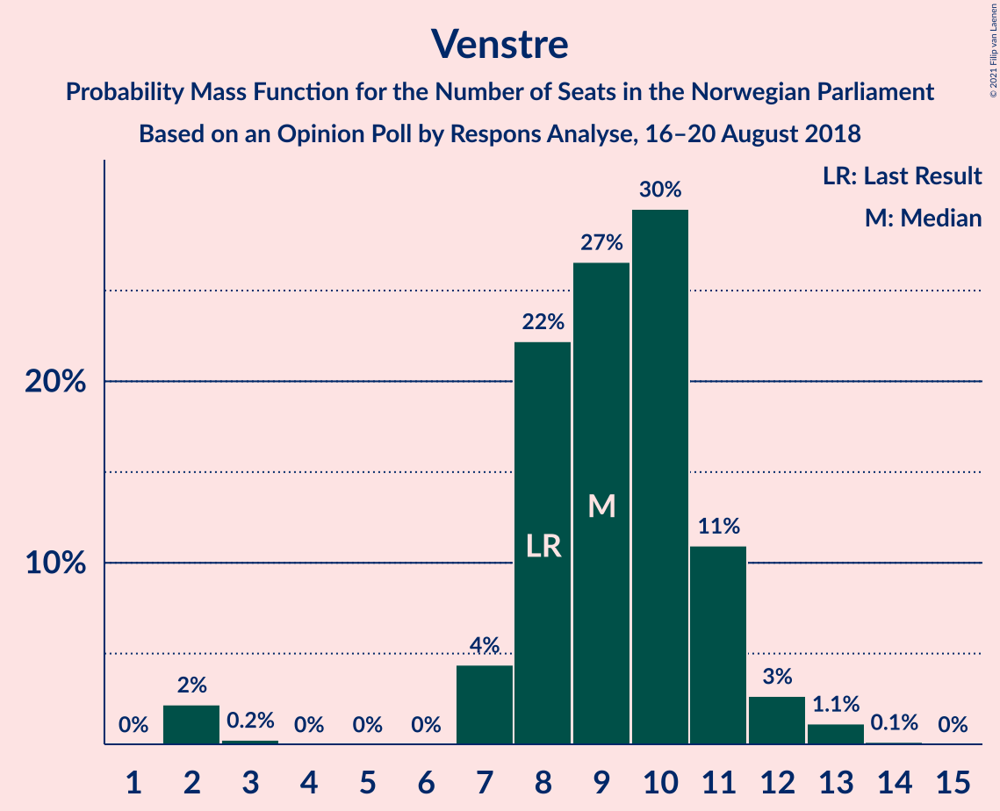

| Number of Seats | Probability | Accumulated | Special Marks |
|:---------------:|:-----------:|:-----------:|:-------------:|
| 2 | 1.3% | 100% |  |
| 3 | 0% | 98.7% |  |
| 4 | 0% | 98.6% |  |
| 5 | 0% | 98.6% |  |
| 6 | 0% | 98.6% |  |
| 7 | 0.7% | 98.6% |  |
| 8 | 21% | 98% | Last Result |
| 9 | 20% | 76% |  |
| 10 | 36% | 56% | Median |
| 11 | 18% | 21% |  |
| 12 | 2% | 2% |  |
| 13 | 0.3% | 0.4% |  |
| 14 | 0.1% | 0.1% |  |
| 15 | 0% | 0% |  |

### Rødt

*For a full overview of the results for this party, see the [Rødt](party-rødt.html) page.*

| Number of Seats | Probability | Accumulated | Special Marks |
|:---------------:|:-----------:|:-----------:|:-------------:|
| 1 | 2% | 100% | Last Result |
| 2 | 46% | 98% |  |
| 3 | 0% | 52% |  |
| 4 | 0% | 52% |  |
| 5 | 0% | 52% |  |
| 6 | 0% | 52% |  |
| 7 | 5% | 52% | Median |
| 8 | 33% | 48% |  |
| 9 | 6% | 14% |  |
| 10 | 9% | 9% |  |
| 11 | 0.1% | 0.2% |  |
| 12 | 0.2% | 0.2% |  |
| 13 | 0% | 0% |  |

### Kristelig Folkeparti

*For a full overview of the results for this party, see the [Kristelig Folkeparti](party-kristeligfolkeparti.html) page.*

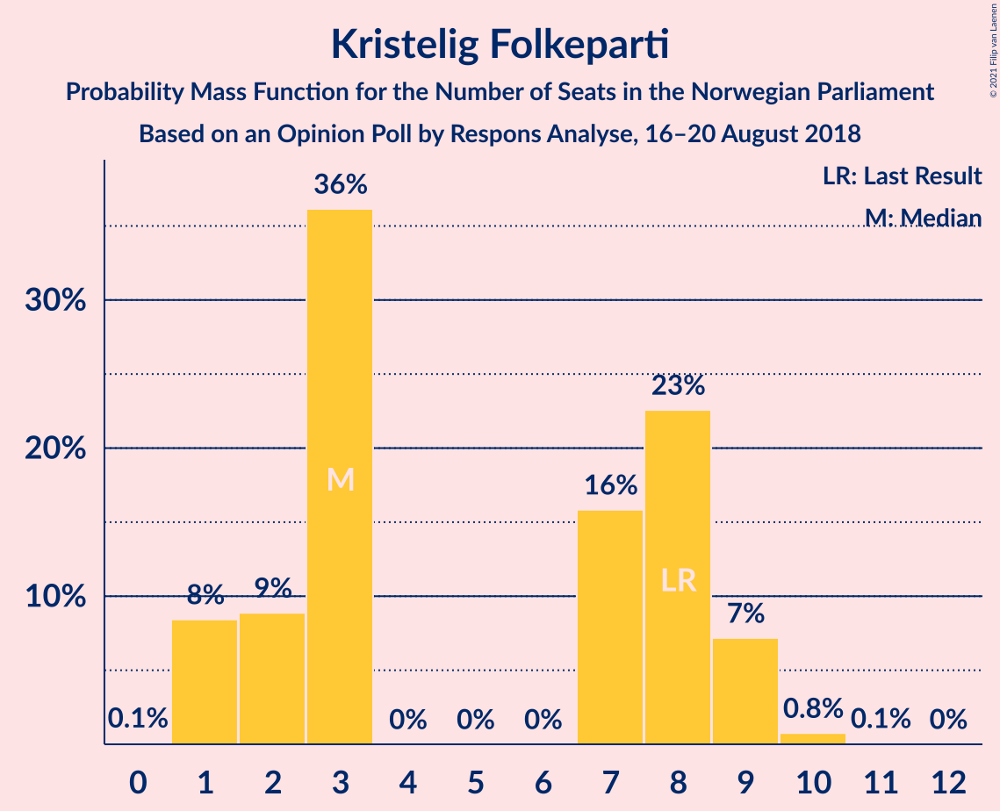

| Number of Seats | Probability | Accumulated | Special Marks |
|:---------------:|:-----------:|:-----------:|:-------------:|
| 0 | 0.1% | 100% |  |
| 1 | 4% | 99.9% |  |
| 2 | 2% | 96% |  |
| 3 | 59% | 94% | Median |
| 4 | 0% | 34% |  |
| 5 | 0% | 34% |  |
| 6 | 0% | 34% |  |
| 7 | 18% | 34% |  |
| 8 | 8% | 17% | Last Result |
| 9 | 7% | 9% |  |
| 10 | 1.3% | 1.3% |  |
| 11 | 0.1% | 0.1% |  |
| 12 | 0% | 0% |  |

### Miljøpartiet De Grønne

*For a full overview of the results for this party, see the [Miljøpartiet De Grønne](party-miljøpartietdegrønne.html) page.*

| Number of Seats | Probability | Accumulated | Special Marks |
|:---------------:|:-----------:|:-----------:|:-------------:|
| 0 | 36% | 100% |  |
| 1 | 59% | 64% | Last Result, Median |
| 2 | 5% | 5% |  |
| 3 | 0% | 0.2% |  |
| 4 | 0% | 0.2% |  |
| 5 | 0% | 0.2% |  |
| 6 | 0% | 0.2% |  |
| 7 | 0.2% | 0.2% |  |
| 8 | 0% | 0% |  |

## Coalitions

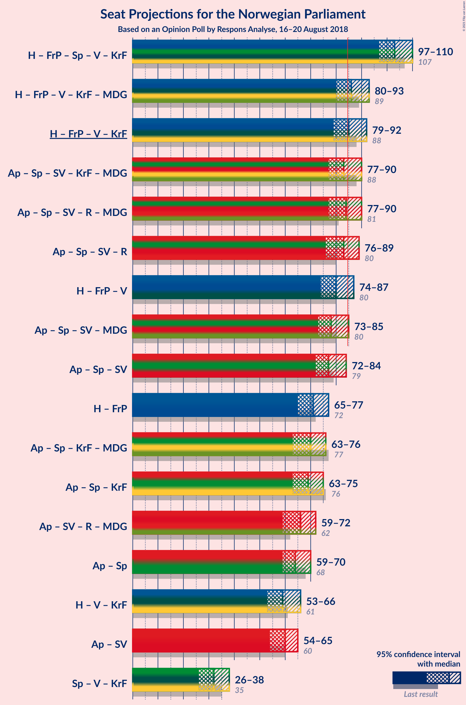

### Confidence Intervals

| Coalition | Last Result | Median | Majority? | 80% Confidence Interval | 90% Confidence Interval | 95% Confidence Interval | 99% Confidence Interval |
|:---------:|:-----------:|:------:|:---------:|:-----------------------:|:-----------------------:|:-----------------------:|:-----------------------:|
| Høyre – Fremskrittspartiet – Senterpartiet – Venstre – Kristelig Folkeparti | 107 | 104 | 100% | 99–108 | 97–108 | 97–109 | 95–111 |
| Høyre – Fremskrittspartiet – Venstre – Kristelig Folkeparti – Miljøpartiet De Grønne | 89 | 87 | 72% | 82–91 | 81–91 | 81–92 | 78–94 |
| Høyre – Fremskrittspartiet – Venstre – Kristelig Folkeparti | 88 | 87 | 62% | 81–90 | 80–90 | 80–92 | 77–94 |
| Arbeiderpartiet – Senterpartiet – Sosialistisk Venstreparti – Kristelig Folkeparti – Miljøpartiet De Grønne | 88 | 83 | 17% | 80–87 | 77–90 | 77–90 | 75–92 |
| Arbeiderpartiet – Senterpartiet – Sosialistisk Venstreparti – Rødt – Miljøpartiet De Grønne | 81 | 82 | 38% | 79–88 | 79–89 | 77–89 | 75–92 |
| Arbeiderpartiet – Senterpartiet – Sosialistisk Venstreparti – Rødt | 80 | 82 | 28% | 78–87 | 78–88 | 77–88 | 75–91 |
| Høyre – Fremskrittspartiet – Venstre | 80 | 81 | 4% | 77–84 | 77–84 | 75–85 | 69–88 |
| Arbeiderpartiet – Senterpartiet – Sosialistisk Venstreparti – Miljøpartiet De Grønne | 80 | 79 | 2% | 74–81 | 74–83 | 72–84 | 71–86 |
| Arbeiderpartiet – Senterpartiet – Sosialistisk Venstreparti | 79 | 78 | 0.8% | 73–81 | 73–82 | 72–83 | 70–86 |
| Høyre – Fremskrittspartiet | 72 | 73 | 0% | 68–74 | 68–74 | 67–77 | 61–79 |
| Arbeiderpartiet – Senterpartiet – Kristelig Folkeparti – Miljøpartiet De Grønne | 77 | 69 | 0% | 66–73 | 63–75 | 63–76 | 61–79 |
| Arbeiderpartiet – Senterpartiet – Kristelig Folkeparti | 76 | 69 | 0% | 65–72 | 63–75 | 62–75 | 60–78 |
| Arbeiderpartiet – Senterpartiet | 68 | 65 | 0% | 61–66 | 59–68 | 59–69 | 57–71 |
| Høyre – Venstre – Kristelig Folkeparti | 61 | 58 | 0% | 54–64 | 53–66 | 53–66 | 52–68 |
| Arbeiderpartiet – Sosialistisk Venstreparti | 60 | 59 | 0% | 56–62 | 55–63 | 55–64 | 53–67 |
| Senterpartiet – Venstre – Kristelig Folkeparti | 35 | 31 | 0% | 27–35 | 27–37 | 25–37 | 25–38 |

### Høyre – Fremskrittspartiet – Senterpartiet – Venstre – Kristelig Folkeparti

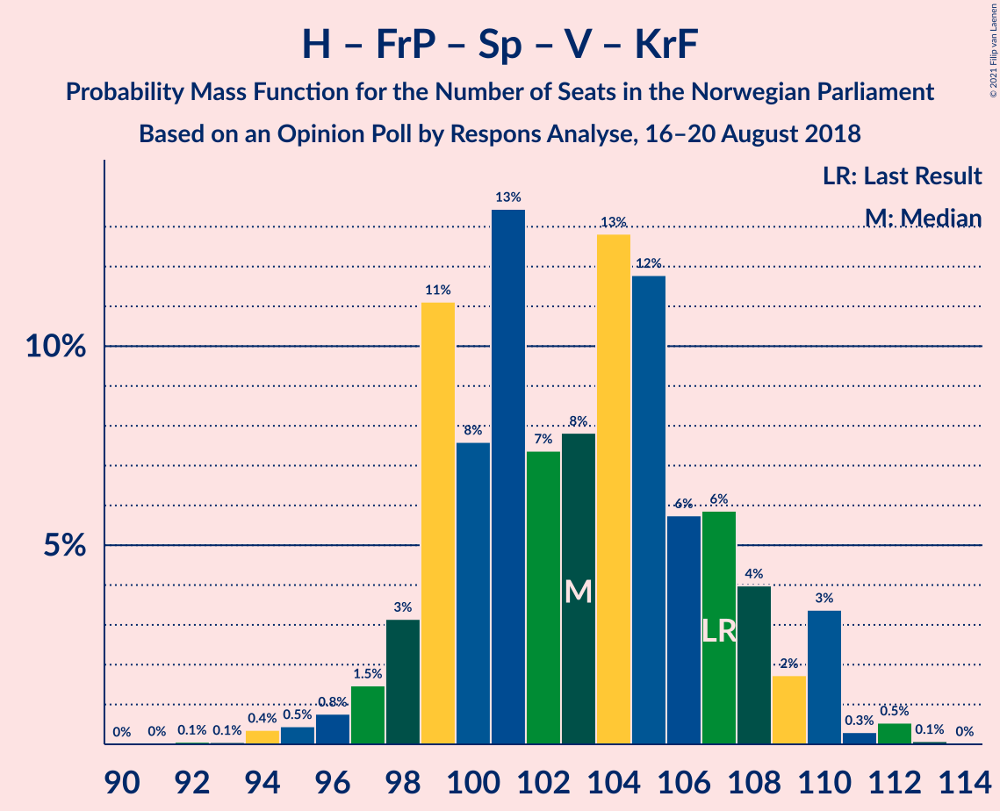

| Number of Seats | Probability | Accumulated | Special Marks |
|:---------------:|:-----------:|:-----------:|:-------------:|
| 93 | 0% | 100% |  |
| 94 | 0.2% | 99.9% |  |
| 95 | 0.3% | 99.7% |  |
| 96 | 1.0% | 99.4% |  |
| 97 | 4% | 98% |  |
| 98 | 0.9% | 94% |  |
| 99 | 9% | 93% |  |
| 100 | 6% | 84% |  |
| 101 | 11% | 78% |  |
| 102 | 4% | 66% |  |
| 103 | 8% | 63% | Median |
| 104 | 9% | 55% |  |
| 105 | 27% | 45% |  |
| 106 | 2% | 18% |  |
| 107 | 4% | 17% | Last Result |
| 108 | 9% | 13% |  |
| 109 | 2% | 4% |  |
| 110 | 0.5% | 2% |  |
| 111 | 1.0% | 1.3% |  |
| 112 | 0.3% | 0.3% |  |
| 113 | 0% | 0% |  |

### Høyre – Fremskrittspartiet – Venstre – Kristelig Folkeparti – Miljøpartiet De Grønne

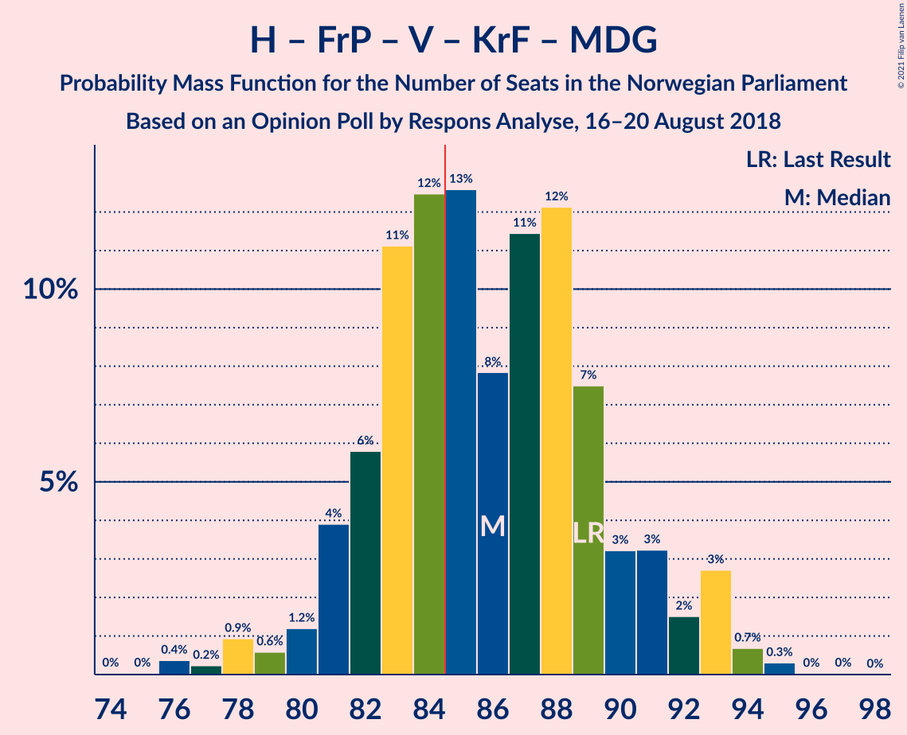

| Number of Seats | Probability | Accumulated | Special Marks |
|:---------------:|:-----------:|:-----------:|:-------------:|
| 75 | 0% | 100% |  |
| 76 | 0.1% | 99.9% |  |
| 77 | 0.2% | 99.9% |  |
| 78 | 0.9% | 99.7% |  |
| 79 | 0.8% | 98.8% |  |
| 80 | 0.3% | 98% |  |
| 81 | 7% | 98% |  |
| 82 | 4% | 90% |  |
| 83 | 11% | 86% |  |
| 84 | 3% | 75% |  |
| 85 | 9% | 72% | Majority |
| 86 | 10% | 63% | Median |
| 87 | 26% | 54% |  |
| 88 | 10% | 27% |  |
| 89 | 1.1% | 17% | Last Result |
| 90 | 3% | 16% |  |
| 91 | 10% | 13% |  |
| 92 | 2% | 3% |  |
| 93 | 0.1% | 1.5% |  |
| 94 | 1.0% | 1.4% |  |
| 95 | 0.3% | 0.4% |  |
| 96 | 0% | 0.1% |  |
| 97 | 0.1% | 0.1% |  |
| 98 | 0% | 0% |  |

### Høyre – Fremskrittspartiet – Venstre – Kristelig Folkeparti

| Number of Seats | Probability | Accumulated | Special Marks |
|:---------------:|:-----------:|:-----------:|:-------------:|
| 74 | 0% | 100% |  |
| 75 | 0.1% | 99.9% |  |
| 76 | 0.2% | 99.9% |  |
| 77 | 0.8% | 99.7% |  |
| 78 | 0.4% | 98.9% |  |
| 79 | 0.7% | 98% |  |
| 80 | 7% | 98% |  |
| 81 | 4% | 91% |  |
| 82 | 11% | 86% |  |
| 83 | 4% | 76% |  |
| 84 | 10% | 72% |  |
| 85 | 3% | 62% | Median, Majority |
| 86 | 8% | 59% |  |
| 87 | 34% | 51% |  |
| 88 | 2% | 17% | Last Result |
| 89 | 2% | 14% |  |
| 90 | 9% | 13% |  |
| 91 | 2% | 4% |  |
| 92 | 1.2% | 3% |  |
| 93 | 0.8% | 1.4% |  |
| 94 | 0.4% | 0.5% |  |
| 95 | 0.1% | 0.1% |  |
| 96 | 0% | 0.1% |  |
| 97 | 0% | 0% |  |

### Arbeiderpartiet – Senterpartiet – Sosialistisk Venstreparti – Kristelig Folkeparti – Miljøpartiet De Grønne

| Number of Seats | Probability | Accumulated | Special Marks |
|:---------------:|:-----------:|:-----------:|:-------------:|
| 73 | 0.3% | 100% |  |
| 74 | 0.1% | 99.7% |  |
| 75 | 0.6% | 99.7% |  |
| 76 | 0.2% | 99.0% |  |
| 77 | 5% | 98.9% |  |
| 78 | 2% | 94% |  |
| 79 | 1.2% | 92% |  |
| 80 | 8% | 91% |  |
| 81 | 8% | 83% |  |
| 82 | 24% | 75% | Median |
| 83 | 25% | 51% |  |
| 84 | 8% | 26% |  |
| 85 | 3% | 17% | Majority |
| 86 | 2% | 15% |  |
| 87 | 3% | 12% |  |
| 88 | 2% | 9% | Last Result |
| 89 | 0.3% | 7% |  |
| 90 | 5% | 7% |  |
| 91 | 0.7% | 2% |  |
| 92 | 0.7% | 1.0% |  |
| 93 | 0.1% | 0.2% |  |
| 94 | 0.1% | 0.2% |  |
| 95 | 0% | 0.1% |  |
| 96 | 0.1% | 0.1% |  |
| 97 | 0% | 0% |  |

### Arbeiderpartiet – Senterpartiet – Sosialistisk Venstreparti – Rødt – Miljøpartiet De Grønne

| Number of Seats | Probability | Accumulated | Special Marks |
|:---------------:|:-----------:|:-----------:|:-------------:|
| 73 | 0% | 100% |  |
| 74 | 0.1% | 99.9% |  |
| 75 | 0.4% | 99.9% |  |
| 76 | 0.8% | 99.5% |  |
| 77 | 1.2% | 98.6% |  |
| 78 | 2% | 97% |  |
| 79 | 9% | 96% |  |
| 80 | 2% | 87% |  |
| 81 | 2% | 86% | Last Result |
| 82 | 34% | 83% |  |
| 83 | 8% | 49% |  |
| 84 | 3% | 41% |  |
| 85 | 10% | 38% | Majority |
| 86 | 4% | 28% | Median |
| 87 | 11% | 24% |  |
| 88 | 4% | 14% |  |
| 89 | 7% | 9% |  |
| 90 | 0.7% | 2% |  |
| 91 | 0.4% | 2% |  |
| 92 | 0.8% | 1.1% |  |
| 93 | 0.2% | 0.3% |  |
| 94 | 0.1% | 0.1% |  |
| 95 | 0% | 0.1% |  |
| 96 | 0% | 0% |  |

### Arbeiderpartiet – Senterpartiet – Sosialistisk Venstreparti – Rødt

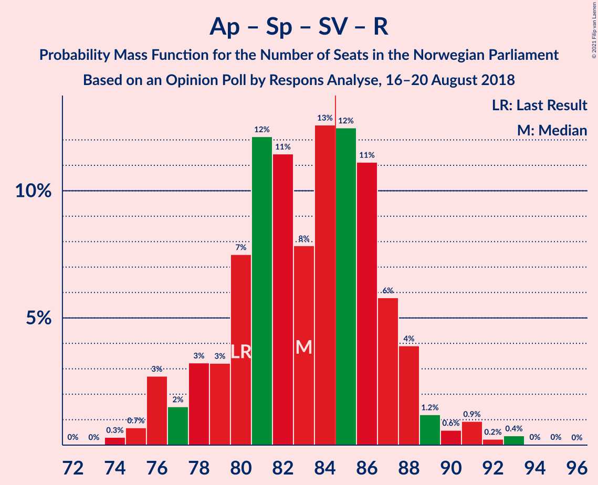

| Number of Seats | Probability | Accumulated | Special Marks |
|:---------------:|:-----------:|:-----------:|:-------------:|
| 72 | 0.1% | 100% |  |
| 73 | 0% | 99.9% |  |
| 74 | 0.3% | 99.9% |  |
| 75 | 1.0% | 99.6% |  |
| 76 | 0.1% | 98.6% |  |
| 77 | 2% | 98.5% |  |
| 78 | 10% | 97% |  |
| 79 | 3% | 87% |  |
| 80 | 1.1% | 84% | Last Result |
| 81 | 10% | 83% |  |
| 82 | 26% | 73% |  |
| 83 | 10% | 46% |  |
| 84 | 9% | 37% |  |
| 85 | 3% | 28% | Median, Majority |
| 86 | 11% | 25% |  |
| 87 | 4% | 14% |  |
| 88 | 7% | 10% |  |
| 89 | 0.3% | 2% |  |
| 90 | 0.8% | 2% |  |
| 91 | 0.9% | 1.2% |  |
| 92 | 0.2% | 0.3% |  |
| 93 | 0.1% | 0.1% |  |
| 94 | 0% | 0.1% |  |
| 95 | 0% | 0% |  |

### Høyre – Fremskrittspartiet – Venstre

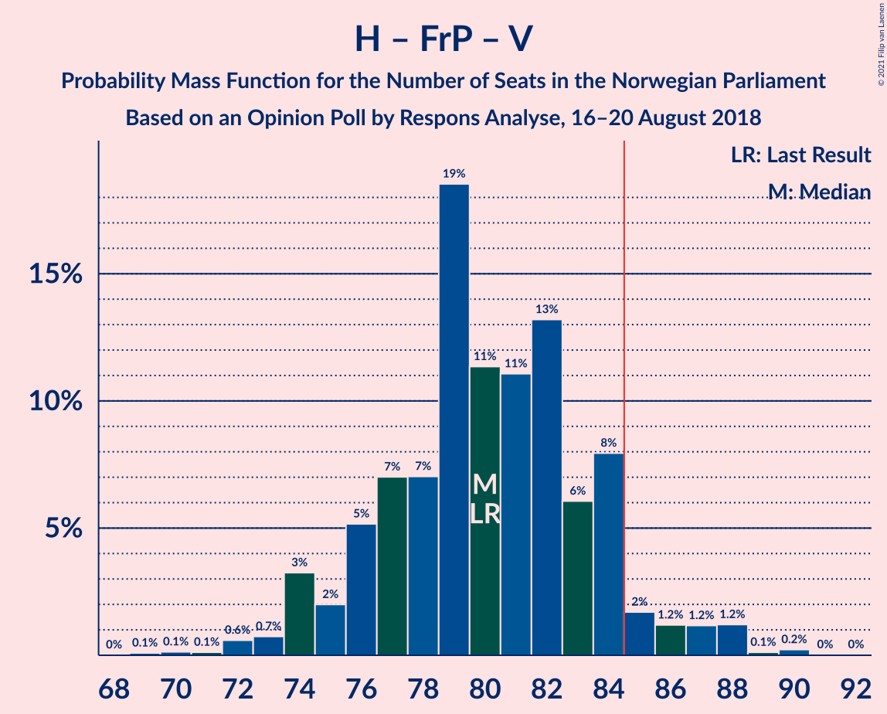

| Number of Seats | Probability | Accumulated | Special Marks |
|:---------------:|:-----------:|:-----------:|:-------------:|
| 69 | 0.6% | 100% |  |
| 70 | 0.5% | 99.4% |  |
| 71 | 0% | 98.9% |  |
| 72 | 0.2% | 98.9% |  |
| 73 | 0.5% | 98.7% |  |
| 74 | 0.5% | 98% |  |
| 75 | 0.5% | 98% |  |
| 76 | 0.8% | 97% |  |
| 77 | 15% | 96% |  |
| 78 | 5% | 82% |  |
| 79 | 13% | 77% |  |
| 80 | 9% | 64% | Last Result |
| 81 | 10% | 54% |  |
| 82 | 1.4% | 44% | Median |
| 83 | 11% | 43% |  |
| 84 | 29% | 33% |  |
| 85 | 2% | 4% | Majority |
| 86 | 0.8% | 2% |  |
| 87 | 0.5% | 1.3% |  |
| 88 | 0.4% | 0.8% |  |
| 89 | 0% | 0.4% |  |
| 90 | 0.4% | 0.4% |  |
| 91 | 0% | 0% |  |

### Arbeiderpartiet – Senterpartiet – Sosialistisk Venstreparti – Miljøpartiet De Grønne

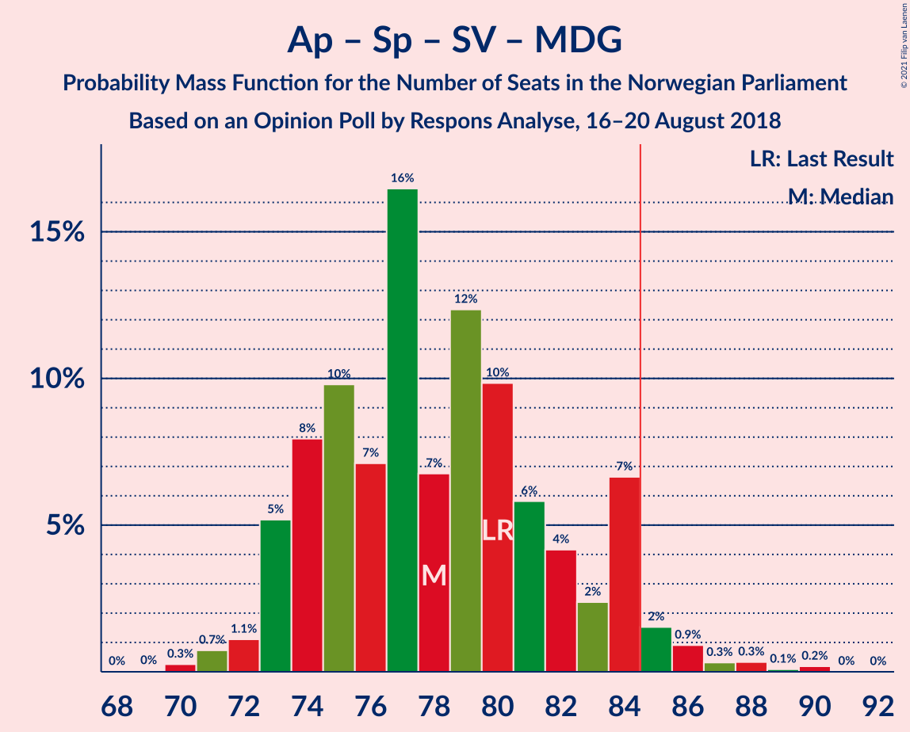

| Number of Seats | Probability | Accumulated | Special Marks |
|:---------------:|:-----------:|:-----------:|:-------------:|
| 69 | 0.1% | 100% |  |
| 70 | 0.4% | 99.9% |  |
| 71 | 0.2% | 99.6% |  |
| 72 | 2% | 99.4% |  |
| 73 | 1.1% | 97% |  |
| 74 | 11% | 96% |  |
| 75 | 4% | 85% |  |
| 76 | 3% | 82% |  |
| 77 | 18% | 79% |  |
| 78 | 1.2% | 61% |  |
| 79 | 23% | 59% | Median |
| 80 | 25% | 37% | Last Result |
| 81 | 5% | 12% |  |
| 82 | 1.5% | 7% |  |
| 83 | 0.6% | 5% |  |
| 84 | 3% | 5% |  |
| 85 | 1.1% | 2% | Majority |
| 86 | 0.6% | 0.9% |  |
| 87 | 0% | 0.3% |  |
| 88 | 0.2% | 0.3% |  |
| 89 | 0.1% | 0.1% |  |
| 90 | 0% | 0.1% |  |
| 91 | 0% | 0% |  |

### Arbeiderpartiet – Senterpartiet – Sosialistisk Venstreparti

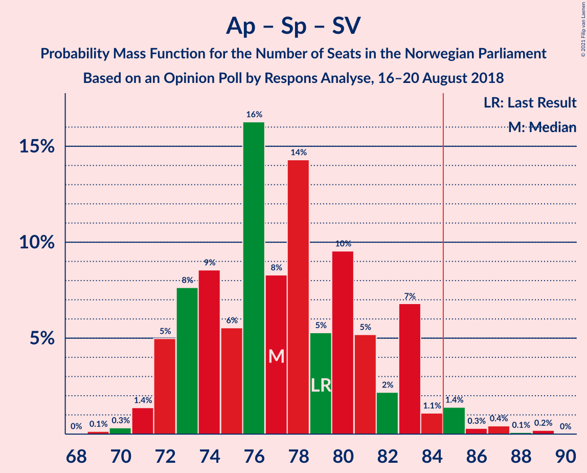

| Number of Seats | Probability | Accumulated | Special Marks |
|:---------------:|:-----------:|:-----------:|:-------------:|
| 69 | 0.1% | 100% |  |
| 70 | 0.5% | 99.8% |  |
| 71 | 2% | 99.4% |  |
| 72 | 1.3% | 98% |  |
| 73 | 11% | 97% |  |
| 74 | 3% | 86% |  |
| 75 | 3% | 82% |  |
| 76 | 18% | 79% |  |
| 77 | 4% | 61% |  |
| 78 | 21% | 57% | Median |
| 79 | 2% | 37% | Last Result |
| 80 | 24% | 35% |  |
| 81 | 6% | 11% |  |
| 82 | 1.4% | 6% |  |
| 83 | 2% | 4% |  |
| 84 | 1.2% | 2% |  |
| 85 | 0.1% | 0.8% | Majority |
| 86 | 0.4% | 0.6% |  |
| 87 | 0.2% | 0.3% |  |
| 88 | 0% | 0.1% |  |
| 89 | 0% | 0.1% |  |
| 90 | 0% | 0% |  |

### Høyre – Fremskrittspartiet

| Number of Seats | Probability | Accumulated | Special Marks |
|:---------------:|:-----------:|:-----------:|:-------------:|
| 61 | 1.0% | 100% |  |
| 62 | 0.1% | 98.9% |  |
| 63 | 0.1% | 98.9% |  |
| 64 | 0.2% | 98.8% |  |
| 65 | 0.7% | 98.7% |  |
| 66 | 0.5% | 98% |  |
| 67 | 0.5% | 98% |  |
| 68 | 19% | 97% |  |
| 69 | 9% | 78% |  |
| 70 | 7% | 69% |  |
| 71 | 8% | 62% |  |
| 72 | 3% | 54% | Last Result, Median |
| 73 | 20% | 51% |  |
| 74 | 26% | 31% |  |
| 75 | 1.5% | 4% |  |
| 76 | 0.2% | 3% |  |
| 77 | 0.9% | 3% |  |
| 78 | 0.6% | 2% |  |
| 79 | 0.6% | 1.0% |  |
| 80 | 0.3% | 0.4% |  |
| 81 | 0.1% | 0.1% |  |
| 82 | 0% | 0% |  |

### Arbeiderpartiet – Senterpartiet – Kristelig Folkeparti – Miljøpartiet De Grønne

| Number of Seats | Probability | Accumulated | Special Marks |
|:---------------:|:-----------:|:-----------:|:-------------:|
| 60 | 0.1% | 100% |  |
| 61 | 0.9% | 99.9% |  |
| 62 | 0.6% | 99.0% |  |
| 63 | 4% | 98% |  |
| 64 | 0.3% | 94% |  |
| 65 | 0.6% | 94% |  |
| 66 | 12% | 94% |  |
| 67 | 2% | 82% |  |
| 68 | 3% | 80% | Median |
| 69 | 47% | 76% |  |
| 70 | 4% | 30% |  |
| 71 | 4% | 26% |  |
| 72 | 8% | 22% |  |
| 73 | 4% | 13% |  |
| 74 | 1.2% | 10% |  |
| 75 | 6% | 8% |  |
| 76 | 0.7% | 3% |  |
| 77 | 1.1% | 2% | Last Result |
| 78 | 0.3% | 1.1% |  |
| 79 | 0.7% | 0.8% |  |
| 80 | 0.1% | 0.2% |  |
| 81 | 0.1% | 0.1% |  |
| 82 | 0% | 0% |  |

### Arbeiderpartiet – Senterpartiet – Kristelig Folkeparti

| Number of Seats | Probability | Accumulated | Special Marks |
|:---------------:|:-----------:|:-----------:|:-------------:|
| 59 | 0.1% | 100% |  |
| 60 | 0.5% | 99.9% |  |
| 61 | 0.8% | 99.4% |  |
| 62 | 4% | 98.6% |  |
| 63 | 0.7% | 95% |  |
| 64 | 2% | 94% |  |
| 65 | 11% | 93% |  |
| 66 | 3% | 82% |  |
| 67 | 3% | 79% | Median |
| 68 | 23% | 76% |  |
| 69 | 26% | 53% |  |
| 70 | 6% | 27% |  |
| 71 | 9% | 22% |  |
| 72 | 3% | 13% |  |
| 73 | 1.2% | 10% |  |
| 74 | 1.1% | 9% |  |
| 75 | 6% | 8% |  |
| 76 | 0.6% | 2% | Last Result |
| 77 | 0.6% | 1.4% |  |
| 78 | 0.7% | 0.8% |  |
| 79 | 0% | 0.2% |  |
| 80 | 0.1% | 0.1% |  |
| 81 | 0% | 0% |  |

### Arbeiderpartiet – Senterpartiet

| Number of Seats | Probability | Accumulated | Special Marks |
|:---------------:|:-----------:|:-----------:|:-------------:|
| 57 | 0.8% | 100% |  |
| 58 | 1.1% | 99.2% |  |
| 59 | 4% | 98% |  |
| 60 | 2% | 94% |  |
| 61 | 10% | 91% |  |
| 62 | 10% | 81% |  |
| 63 | 5% | 71% |  |
| 64 | 12% | 66% | Median |
| 65 | 18% | 54% |  |
| 66 | 29% | 36% |  |
| 67 | 2% | 7% |  |
| 68 | 2% | 6% | Last Result |
| 69 | 2% | 4% |  |
| 70 | 1.2% | 2% |  |
| 71 | 0.1% | 0.5% |  |
| 72 | 0.2% | 0.4% |  |
| 73 | 0% | 0.1% |  |
| 74 | 0% | 0.1% |  |
| 75 | 0% | 0.1% |  |
| 76 | 0.1% | 0.1% |  |
| 77 | 0% | 0% |  |

### Høyre – Venstre – Kristelig Folkeparti

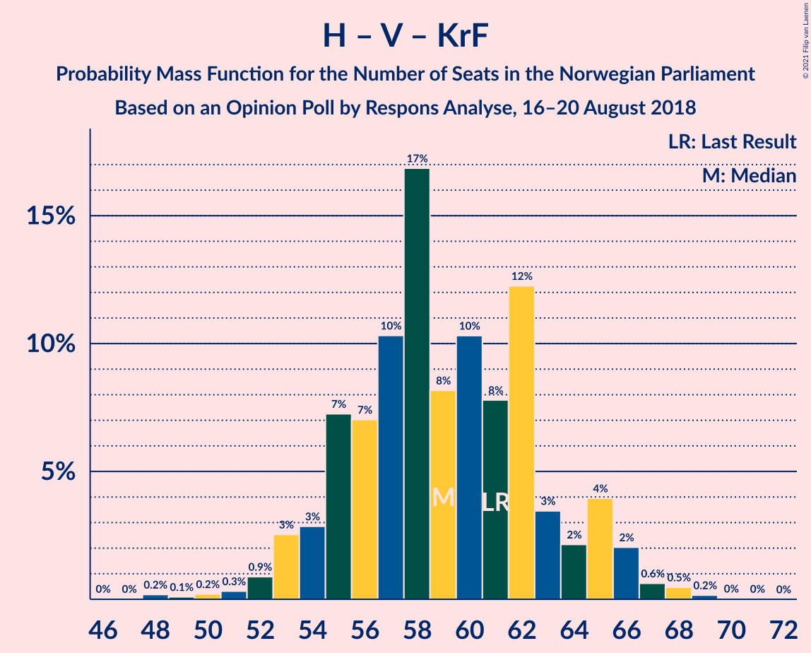

| Number of Seats | Probability | Accumulated | Special Marks |
|:---------------:|:-----------:|:-----------:|:-------------:|
| 48 | 0% | 100% |  |
| 49 | 0% | 99.9% |  |
| 50 | 0.1% | 99.9% |  |
| 51 | 0.2% | 99.7% |  |
| 52 | 0.2% | 99.5% |  |
| 53 | 7% | 99.3% |  |
| 54 | 4% | 93% |  |
| 55 | 16% | 88% |  |
| 56 | 3% | 72% |  |
| 57 | 2% | 69% |  |
| 58 | 27% | 67% | Median |
| 59 | 5% | 41% |  |
| 60 | 8% | 35% |  |
| 61 | 10% | 27% | Last Result |
| 62 | 4% | 18% |  |
| 63 | 1.5% | 14% |  |
| 64 | 3% | 12% |  |
| 65 | 0.8% | 10% |  |
| 66 | 8% | 9% |  |
| 67 | 0% | 1.2% |  |
| 68 | 0.9% | 1.2% |  |
| 69 | 0.2% | 0.3% |  |
| 70 | 0% | 0% |  |

### Arbeiderpartiet – Sosialistisk Venstreparti

| Number of Seats | Probability | Accumulated | Special Marks |
|:---------------:|:-----------:|:-----------:|:-------------:|
| 52 | 0.2% | 100% |  |
| 53 | 2% | 99.8% |  |
| 54 | 0.3% | 98% |  |
| 55 | 3% | 98% |  |
| 56 | 6% | 95% |  |
| 57 | 7% | 88% |  |
| 58 | 12% | 81% |  |
| 59 | 22% | 69% |  |
| 60 | 6% | 47% | Last Result, Median |
| 61 | 3% | 40% |  |
| 62 | 28% | 38% |  |
| 63 | 6% | 9% |  |
| 64 | 2% | 3% |  |
| 65 | 0.6% | 2% |  |
| 66 | 0.3% | 0.9% |  |
| 67 | 0.2% | 0.6% |  |
| 68 | 0.4% | 0.4% |  |
| 69 | 0.1% | 0.1% |  |
| 70 | 0% | 0% |  |

### Senterpartiet – Venstre – Kristelig Folkeparti

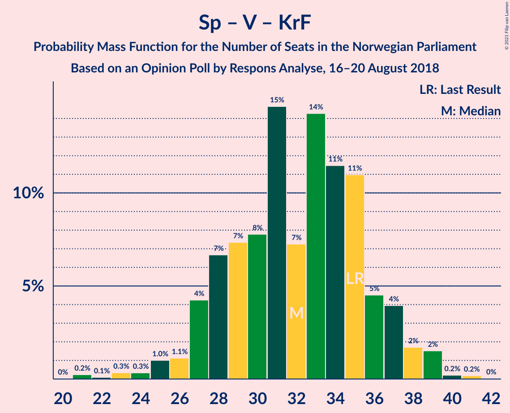

| Number of Seats | Probability | Accumulated | Special Marks |
|:---------------:|:-----------:|:-----------:|:-------------:|
| 20 | 0.1% | 100% |  |
| 21 | 0% | 99.9% |  |
| 22 | 0.1% | 99.9% |  |
| 23 | 0% | 99.8% |  |
| 24 | 0.1% | 99.8% |  |
| 25 | 2% | 99.8% |  |
| 26 | 0.3% | 97% |  |
| 27 | 9% | 97% |  |
| 28 | 2% | 88% |  |
| 29 | 2% | 86% |  |
| 30 | 1.1% | 84% |  |
| 31 | 37% | 83% | Median |
| 32 | 6% | 46% |  |
| 33 | 14% | 40% |  |
| 34 | 3% | 26% |  |
| 35 | 14% | 22% | Last Result |
| 36 | 3% | 9% |  |
| 37 | 4% | 6% |  |
| 38 | 1.2% | 2% |  |
| 39 | 0.2% | 0.4% |  |
| 40 | 0.1% | 0.2% |  |
| 41 | 0.1% | 0.1% |  |
| 42 | 0% | 0% |  |

## Technical Information

### Opinion Poll

+ **Polling firm:** Respons Analyse
+ **Commissioner(s):** —
+ **Fieldwork period:** 16–20 August 2018

### Calculations

+ **Sample size:** 1001
+ **Simulations done:** 131,072
+ **Error estimate:** 2.36%

