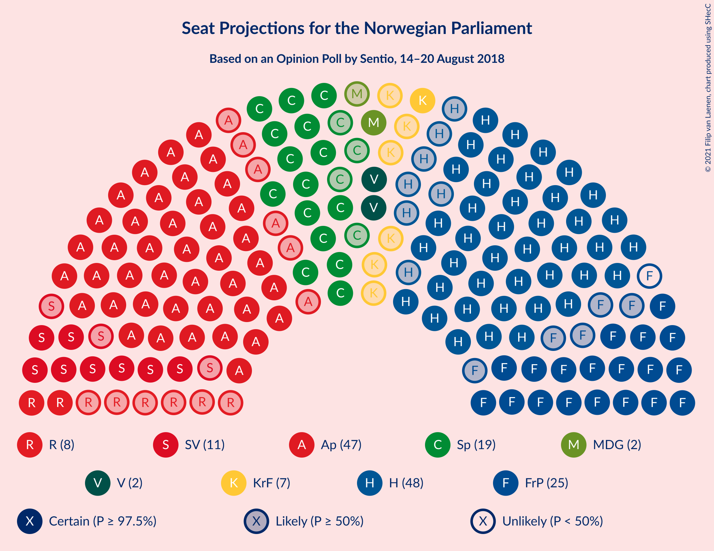
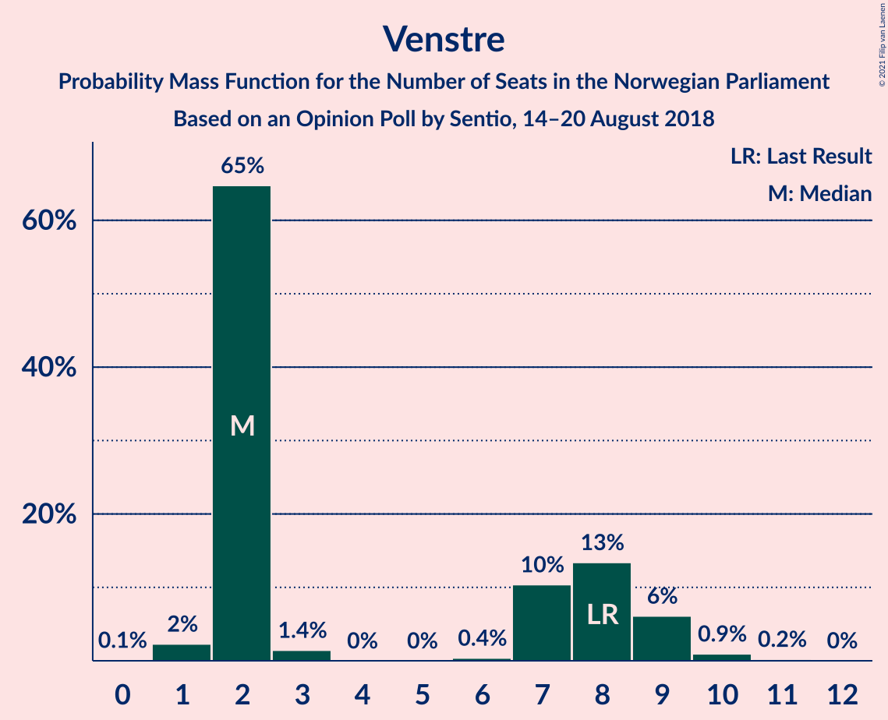
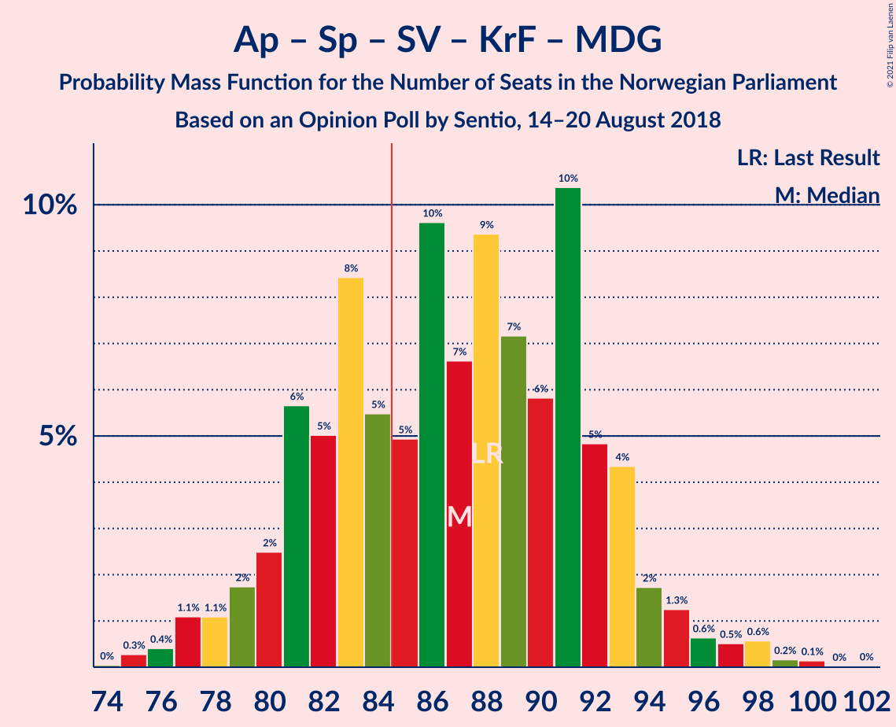
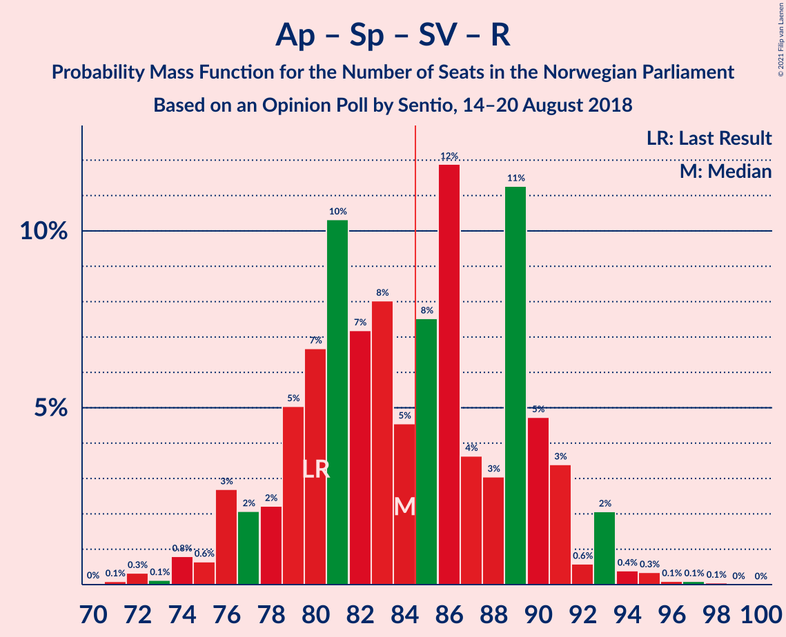
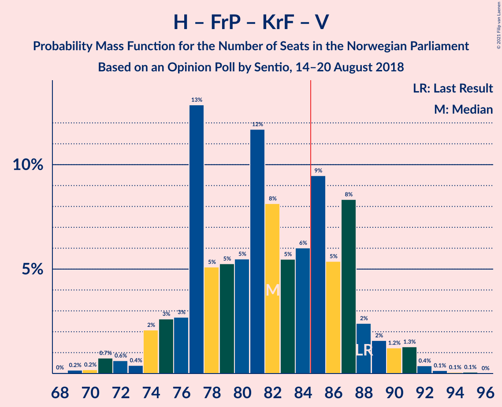
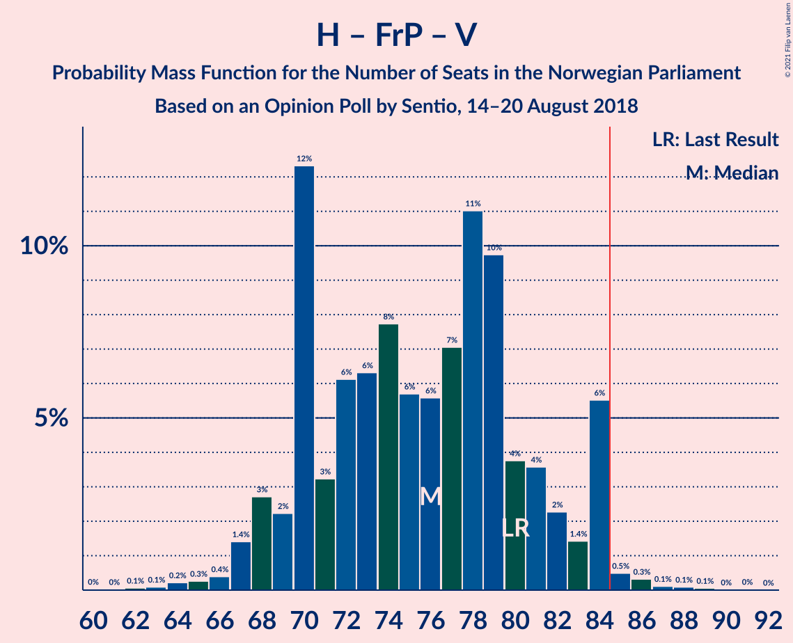
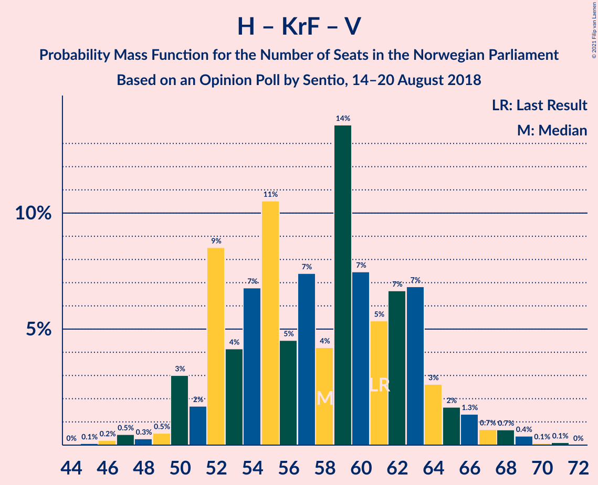
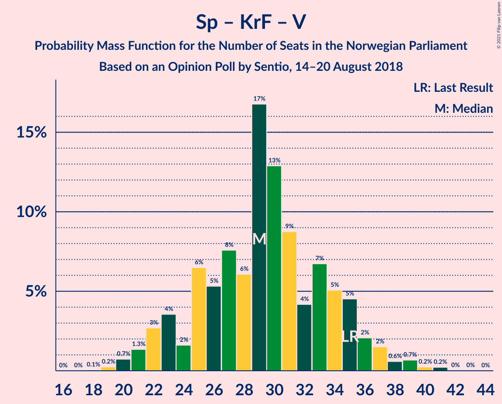

# Opinion Poll by Sentio, 14–20 August 2018

<a href="#voting-intentions">Voting Intentions</a> | <a href="#seats">Seats</a> | <a href="#coalitions">Coalitions</a> | <a href="#technical-information">Technical Information</a>

## Voting Intentions

### Confidence Intervals

| Party | Last Result | Poll Result | 80% Confidence Interval | 90% Confidence Interval | 95% Confidence Interval | 99% Confidence Interval |
|:-----:|:-----------:|:-----------:|:-----------------------:|:-----------------------:|:-----------------------:|:-----------------------:|
| Høyre | 25.0% | 26.7% | 24.6–29.0% |24.0–29.6% |23.5–30.2% |22.5–31.3% |
| Arbeiderpartiet | 27.4% | 26.0% | 23.9–28.2% |23.3–28.8% |22.8–29.4% |21.8–30.5% |
| Fremskrittspartiet | 15.2% | 13.3% | 11.7–15.1% |11.3–15.6% |10.9–16.0% |10.2–16.9% |
| Senterpartiet | 10.3% | 10.8% | 9.4–12.4% |9.0–12.9% |8.6–13.3% |8.0–14.2% |
| Sosialistisk Venstreparti | 6.0% | 6.3% | 5.3–7.7% |5.0–8.1% |4.7–8.4% |4.3–9.1% |
| Rødt | 2.4% | 4.4% | 3.6–5.6% |3.3–6.0% |3.1–6.2% |2.7–6.9% |
| Kristelig Folkeparti | 4.2% | 4.3% | 3.4–5.5% |3.2–5.8% |3.0–6.1% |2.6–6.7% |
| Venstre | 4.4% | 3.5% | 2.8–4.6% |2.6–4.9% |2.4–5.2% |2.1–5.8% |
| Miljøpartiet De Grønne | 3.2% | 3.4% | 2.7–4.5% |2.4–4.8% |2.3–5.0% |2.0–5.6% |

*Note:* The poll result column reflects the actual value used in the calculations. Published results may vary slightly, and in addition be rounded to fewer digits.

## Seats

### Confidence Intervals

| Party | Last Result | Median | 80% Confidence Interval | 90% Confidence Interval | 95% Confidence Interval | 99% Confidence Interval |
|:-----:|:-----------:|:------:|:-----------------------:|:-----------------------:|:-----------------------:|:-----------------------:|
| <a href="#høyre">Høyre</a> | 45 | 48 | 44–51 |42–53 |41–55 |39–59 |
| <a href="#arbeiderpartiet">Arbeiderpartiet</a> | 49 | 46 | 42–52 |41–52 |41–53 |39–57 |
| <a href="#fremskrittspartiet">Fremskrittspartiet</a> | 27 | 25 | 20–28 |19–28 |18–28 |18–30 |
| <a href="#senterpartiet">Senterpartiet</a> | 19 | 19 | 17–22 |16–24 |16–24 |14–26 |
| <a href="#sosialistisk-venstreparti">Sosialistisk Venstreparti</a> | 11 | 11 | 9–13 |9–15 |8–15 |7–16 |
| <a href="#rødt">Rødt</a> | 1 | 8 | 2–9 |2–10 |2–11 |1–13 |
| <a href="#kristelig-folkeparti">Kristelig Folkeparti</a> | 8 | 7 | 2–9 |1–10 |1–11 |1–12 |
| <a href="#venstre">Venstre</a> | 8 | 2 | 2–8 |2–9 |2–9 |1–10 |
| <a href="#miljøpartiet-de-grønne">Miljøpartiet De Grønne</a> | 1 | 2 | 1–8 |1–9 |1–9 |0–9 |

### Høyre

*For a full overview of the results for this party, see the [Høyre](party-høyre.html) page.*

| Number of Seats | Probability | Accumulated | Special Marks |
|:---------------:|:-----------:|:-----------:|:-------------:|
| 37 | 0% | 100% |  |
| 38 | 0.2% | 99.9% |  |
| 39 | 0.4% | 99.8% |  |
| 40 | 2% | 99.3% |  |
| 41 | 2% | 98% |  |
| 42 | 2% | 96% |  |
| 43 | 3% | 94% |  |
| 44 | 0.8% | 90% |  |
| 45 | 8% | 89% | Last Result |
| 46 | 11% | 82% |  |
| 47 | 18% | 71% |  |
| 48 | 6% | 53% | Median |
| 49 | 15% | 47% |  |
| 50 | 10% | 32% |  |
| 51 | 12% | 22% |  |
| 52 | 0.8% | 9% |  |
| 53 | 4% | 9% |  |
| 54 | 2% | 5% |  |
| 55 | 0.9% | 3% |  |
| 56 | 0.3% | 2% |  |
| 57 | 0.2% | 2% |  |
| 58 | 0% | 2% |  |
| 59 | 2% | 2% |  |
| 60 | 0% | 0% |  |

### Arbeiderpartiet

*For a full overview of the results for this party, see the [Arbeiderpartiet](party-arbeiderpartiet.html) page.*

| Number of Seats | Probability | Accumulated | Special Marks |
|:---------------:|:-----------:|:-----------:|:-------------:|
| 37 | 0.1% | 100% |  |
| 38 | 0.2% | 99.9% |  |
| 39 | 0.4% | 99.8% |  |
| 40 | 0.6% | 99.3% |  |
| 41 | 5% | 98.8% |  |
| 42 | 5% | 94% |  |
| 43 | 4% | 89% |  |
| 44 | 20% | 86% |  |
| 45 | 11% | 66% |  |
| 46 | 6% | 55% | Median |
| 47 | 12% | 48% |  |
| 48 | 6% | 36% |  |
| 49 | 9% | 31% | Last Result |
| 50 | 4% | 22% |  |
| 51 | 4% | 18% |  |
| 52 | 11% | 14% |  |
| 53 | 2% | 4% |  |
| 54 | 0.3% | 2% |  |
| 55 | 0.7% | 2% |  |
| 56 | 0.3% | 0.9% |  |
| 57 | 0.3% | 0.6% |  |
| 58 | 0.2% | 0.2% |  |
| 59 | 0% | 0% |  |

### Fremskrittspartiet

*For a full overview of the results for this party, see the [Fremskrittspartiet](party-fremskrittspartiet.html) page.*

| Number of Seats | Probability | Accumulated | Special Marks |
|:---------------:|:-----------:|:-----------:|:-------------:|
| 17 | 0.2% | 100% |  |
| 18 | 3% | 99.7% |  |
| 19 | 6% | 97% |  |
| 20 | 8% | 91% |  |
| 21 | 17% | 83% |  |
| 22 | 3% | 66% |  |
| 23 | 9% | 64% |  |
| 24 | 4% | 55% |  |
| 25 | 13% | 51% | Median |
| 26 | 9% | 37% |  |
| 27 | 4% | 28% | Last Result |
| 28 | 22% | 25% |  |
| 29 | 1.0% | 2% |  |
| 30 | 0.9% | 1.3% |  |
| 31 | 0.2% | 0.3% |  |
| 32 | 0.1% | 0.1% |  |
| 33 | 0% | 0% |  |

### Senterpartiet

*For a full overview of the results for this party, see the [Senterpartiet](party-senterpartiet.html) page.*

| Number of Seats | Probability | Accumulated | Special Marks |
|:---------------:|:-----------:|:-----------:|:-------------:|
| 13 | 0.3% | 100% |  |
| 14 | 0.4% | 99.6% |  |
| 15 | 2% | 99.3% |  |
| 16 | 6% | 98% |  |
| 17 | 21% | 92% |  |
| 18 | 14% | 71% |  |
| 19 | 23% | 57% | Last Result, Median |
| 20 | 4% | 34% |  |
| 21 | 18% | 30% |  |
| 22 | 4% | 12% |  |
| 23 | 2% | 8% |  |
| 24 | 4% | 6% |  |
| 25 | 1.0% | 2% |  |
| 26 | 0.7% | 0.9% |  |
| 27 | 0.1% | 0.2% |  |
| 28 | 0% | 0.1% |  |
| 29 | 0% | 0% |  |

### Sosialistisk Venstreparti

*For a full overview of the results for this party, see the [Sosialistisk Venstreparti](party-sosialistiskvenstreparti.html) page.*

| Number of Seats | Probability | Accumulated | Special Marks |
|:---------------:|:-----------:|:-----------:|:-------------:|
| 2 | 0.1% | 100% |  |
| 3 | 0% | 99.9% |  |
| 4 | 0% | 99.9% |  |
| 5 | 0% | 99.9% |  |
| 6 | 0% | 99.9% |  |
| 7 | 0.7% | 99.9% |  |
| 8 | 3% | 99.2% |  |
| 9 | 7% | 96% |  |
| 10 | 15% | 90% |  |
| 11 | 27% | 74% | Last Result, Median |
| 12 | 10% | 48% |  |
| 13 | 29% | 37% |  |
| 14 | 3% | 9% |  |
| 15 | 4% | 6% |  |
| 16 | 1.4% | 2% |  |
| 17 | 0.1% | 0.5% |  |
| 18 | 0.4% | 0.4% |  |
| 19 | 0% | 0% |  |

### Rødt

*For a full overview of the results for this party, see the [Rødt](party-rødt.html) page.*

| Number of Seats | Probability | Accumulated | Special Marks |
|:---------------:|:-----------:|:-----------:|:-------------:|
| 1 | 0.7% | 100% | Last Result |
| 2 | 40% | 99.3% |  |
| 3 | 0% | 59% |  |
| 4 | 0% | 59% |  |
| 5 | 0% | 59% |  |
| 6 | 0% | 59% |  |
| 7 | 6% | 59% |  |
| 8 | 19% | 52% | Median |
| 9 | 25% | 34% |  |
| 10 | 6% | 9% |  |
| 11 | 1.2% | 3% |  |
| 12 | 1.1% | 2% |  |
| 13 | 0.6% | 0.6% |  |
| 14 | 0% | 0% |  |

### Kristelig Folkeparti

*For a full overview of the results for this party, see the [Kristelig Folkeparti](party-kristeligfolkeparti.html) page.*

| Number of Seats | Probability | Accumulated | Special Marks |
|:---------------:|:-----------:|:-----------:|:-------------:|
| 1 | 7% | 100% |  |
| 2 | 9% | 93% |  |
| 3 | 22% | 84% |  |
| 4 | 0% | 62% |  |
| 5 | 0% | 62% |  |
| 6 | 0% | 62% |  |
| 7 | 19% | 62% | Median |
| 8 | 22% | 42% | Last Result |
| 9 | 10% | 20% |  |
| 10 | 5% | 10% |  |
| 11 | 4% | 5% |  |
| 12 | 0.3% | 0.6% |  |
| 13 | 0.3% | 0.3% |  |
| 14 | 0% | 0% |  |

### Venstre

*For a full overview of the results for this party, see the [Venstre](party-venstre.html) page.*

| Number of Seats | Probability | Accumulated | Special Marks |
|:---------------:|:-----------:|:-----------:|:-------------:|
| 0 | 0.1% | 100% |  |
| 1 | 2% | 99.9% |  |
| 2 | 77% | 98% | Median |
| 3 | 2% | 20% |  |
| 4 | 0% | 19% |  |
| 5 | 0% | 19% |  |
| 6 | 0% | 19% |  |
| 7 | 7% | 19% |  |
| 8 | 4% | 12% | Last Result |
| 9 | 6% | 8% |  |
| 10 | 0.9% | 1.2% |  |
| 11 | 0.3% | 0.3% |  |
| 12 | 0% | 0% |  |

### Miljøpartiet De Grønne

*For a full overview of the results for this party, see the [Miljøpartiet De Grønne](party-miljøpartietdegrønne.html) page.*

| Number of Seats | Probability | Accumulated | Special Marks |
|:---------------:|:-----------:|:-----------:|:-------------:|
| 0 | 0.6% | 100% |  |
| 1 | 21% | 99.4% | Last Result |
| 2 | 31% | 78% | Median |
| 3 | 2% | 47% |  |
| 4 | 0% | 45% |  |
| 5 | 0% | 45% |  |
| 6 | 0.1% | 45% |  |
| 7 | 7% | 45% |  |
| 8 | 32% | 38% |  |
| 9 | 5% | 5% |  |
| 10 | 0.1% | 0.2% |  |
| 11 | 0.1% | 0.1% |  |
| 12 | 0% | 0% |  |

## Coalitions

### Confidence Intervals

| Coalition | Last Result | Median | Majority? | 80% Confidence Interval | 90% Confidence Interval | 95% Confidence Interval | 99% Confidence Interval |
|:---------:|:-----------:|:------:|:---------:|:-----------------------:|:-----------------------:|:-----------------------:|:-----------------------:|
| Høyre – Fremskrittspartiet – Senterpartiet – Kristelig Folkeparti – Venstre | 107 | 100 | 100% | 94–105 | 92–107 | 91–109 | 90–112 |
| Arbeiderpartiet – Senterpartiet – Sosialistisk Venstreparti – Kristelig Folkeparti – Miljøpartiet De Grønne | 88 | 88 | 79% | 80–94 | 80–96 | 78–98 | 76–98 |
| Arbeiderpartiet – Senterpartiet – Sosialistisk Venstreparti – Rødt – Miljøpartiet De Grønne | 81 | 87 | 76% | 83–93 | 81–94 | 79–97 | 77–98 |
| Høyre – Fremskrittspartiet – Kristelig Folkeparti – Venstre – Miljøpartiet De Grønne | 89 | 85 | 50% | 80–93 | 78–93 | 78–93 | 74–96 |
| Arbeiderpartiet – Senterpartiet – Sosialistisk Venstreparti – Rødt | 80 | 84 | 50% | 76–89 | 76–91 | 76–91 | 73–95 |
| Arbeiderpartiet – Senterpartiet – Sosialistisk Venstreparti – Miljøpartiet De Grønne | 80 | 82 | 31% | 77–87 | 75–88 | 73–90 | 70–95 |
| Høyre – Fremskrittspartiet – Kristelig Folkeparti – Venstre | 88 | 82 | 24% | 76–86 | 75–88 | 72–90 | 71–92 |
| Arbeiderpartiet – Senterpartiet – Sosialistisk Venstreparti | 79 | 77 | 8% | 72–83 | 70–85 | 69–87 | 68–88 |
| Arbeiderpartiet – Senterpartiet – Kristelig Folkeparti – Miljøpartiet De Grønne | 77 | 77 | 3% | 69–82 | 69–84 | 66–85 | 63–88 |
| Høyre – Fremskrittspartiet – Venstre | 80 | 76 | 1.0% | 68–80 | 68–83 | 67–84 | 65–86 |
| Arbeiderpartiet – Senterpartiet – Kristelig Folkeparti | 76 | 71 | 0.3% | 66–80 | 65–80 | 64–81 | 62–84 |
| Høyre – Fremskrittspartiet | 72 | 73 | 0% | 65–78 | 64–79 | 64–81 | 62–82 |
| Arbeiderpartiet – Senterpartiet | 68 | 65 | 0% | 61–72 | 58–72 | 58–73 | 56–76 |
| Arbeiderpartiet – Sosialistisk Venstreparti | 60 | 58 | 0% | 53–62 | 53–64 | 52–67 | 50–68 |
| Høyre – Kristelig Folkeparti – Venstre | 61 | 57 | 0% | 53–62 | 51–64 | 50–65 | 48–69 |
| Senterpartiet – Kristelig Folkeparti – Venstre | 35 | 28 | 0% | 22–34 | 22–36 | 20–37 | 20–41 |

### Høyre – Fremskrittspartiet – Senterpartiet – Kristelig Folkeparti – Venstre

| Number of Seats | Probability | Accumulated | Special Marks |
|:---------------:|:-----------:|:-----------:|:-------------:|
| 86 | 0.1% | 100% |  |
| 87 | 0% | 99.9% |  |
| 88 | 0.2% | 99.9% |  |
| 89 | 0% | 99.7% |  |
| 90 | 0.4% | 99.7% |  |
| 91 | 4% | 99.3% |  |
| 92 | 1.2% | 96% |  |
| 93 | 0.2% | 95% |  |
| 94 | 6% | 94% |  |
| 95 | 3% | 88% |  |
| 96 | 3% | 85% |  |
| 97 | 6% | 82% |  |
| 98 | 10% | 76% |  |
| 99 | 13% | 66% |  |
| 100 | 7% | 53% |  |
| 101 | 5% | 46% | Median |
| 102 | 1.3% | 41% |  |
| 103 | 11% | 40% |  |
| 104 | 16% | 28% |  |
| 105 | 4% | 12% |  |
| 106 | 0.7% | 8% |  |
| 107 | 2% | 7% | Last Result |
| 108 | 2% | 5% |  |
| 109 | 0.3% | 3% |  |
| 110 | 0.2% | 2% |  |
| 111 | 0.6% | 2% |  |
| 112 | 2% | 2% |  |
| 113 | 0.1% | 0.2% |  |
| 114 | 0% | 0.1% |  |
| 115 | 0% | 0% |  |

### Arbeiderpartiet – Senterpartiet – Sosialistisk Venstreparti – Kristelig Folkeparti – Miljøpartiet De Grønne

| Number of Seats | Probability | Accumulated | Special Marks |
|:---------------:|:-----------:|:-----------:|:-------------:|
| 74 | 0% | 100% |  |
| 75 | 0.1% | 99.9% |  |
| 76 | 1.4% | 99.8% |  |
| 77 | 0.8% | 98% |  |
| 78 | 1.0% | 98% |  |
| 79 | 1.4% | 97% |  |
| 80 | 8% | 95% |  |
| 81 | 2% | 87% |  |
| 82 | 2% | 85% |  |
| 83 | 2% | 83% |  |
| 84 | 2% | 82% |  |
| 85 | 7% | 79% | Median, Majority |
| 86 | 4% | 72% |  |
| 87 | 1.4% | 68% |  |
| 88 | 19% | 66% | Last Result |
| 89 | 13% | 47% |  |
| 90 | 5% | 35% |  |
| 91 | 10% | 30% |  |
| 92 | 6% | 19% |  |
| 93 | 1.3% | 13% |  |
| 94 | 3% | 12% |  |
| 95 | 4% | 9% |  |
| 96 | 1.4% | 5% |  |
| 97 | 0.3% | 4% |  |
| 98 | 3% | 3% |  |
| 99 | 0% | 0.1% |  |
| 100 | 0% | 0% |  |

### Arbeiderpartiet – Senterpartiet – Sosialistisk Venstreparti – Rødt – Miljøpartiet De Grønne

| Number of Seats | Probability | Accumulated | Special Marks |
|:---------------:|:-----------:|:-----------:|:-------------:|
| 74 | 0.2% | 100% |  |
| 75 | 0.1% | 99.8% |  |
| 76 | 0.2% | 99.7% |  |
| 77 | 0.3% | 99.6% |  |
| 78 | 1.2% | 99.3% |  |
| 79 | 2% | 98% |  |
| 80 | 0.7% | 96% |  |
| 81 | 0.7% | 96% | Last Result |
| 82 | 4% | 95% |  |
| 83 | 2% | 91% |  |
| 84 | 13% | 89% |  |
| 85 | 3% | 76% | Majority |
| 86 | 6% | 73% | Median |
| 87 | 21% | 68% |  |
| 88 | 5% | 46% |  |
| 89 | 7% | 42% |  |
| 90 | 11% | 35% |  |
| 91 | 3% | 23% |  |
| 92 | 4% | 21% |  |
| 93 | 9% | 17% |  |
| 94 | 4% | 7% |  |
| 95 | 0.2% | 3% |  |
| 96 | 0.2% | 3% |  |
| 97 | 2% | 3% |  |
| 98 | 0.4% | 0.7% |  |
| 99 | 0.2% | 0.3% |  |
| 100 | 0.1% | 0.2% |  |
| 101 | 0.1% | 0.1% |  |
| 102 | 0% | 0% |  |

### Høyre – Fremskrittspartiet – Kristelig Folkeparti – Venstre – Miljøpartiet De Grønne

| Number of Seats | Probability | Accumulated | Special Marks |
|:---------------:|:-----------:|:-----------:|:-------------:|
| 70 | 0.1% | 100% |  |
| 71 | 0.1% | 99.9% |  |
| 72 | 0% | 99.8% |  |
| 73 | 0.2% | 99.8% |  |
| 74 | 0.3% | 99.5% |  |
| 75 | 0.2% | 99.3% |  |
| 76 | 0.2% | 99.1% |  |
| 77 | 0.6% | 98.9% |  |
| 78 | 4% | 98% |  |
| 79 | 3% | 94% |  |
| 80 | 10% | 91% |  |
| 81 | 2% | 81% |  |
| 82 | 8% | 80% |  |
| 83 | 4% | 72% |  |
| 84 | 18% | 68% | Median |
| 85 | 3% | 50% | Majority |
| 86 | 4% | 47% |  |
| 87 | 5% | 42% |  |
| 88 | 4% | 38% |  |
| 89 | 2% | 34% | Last Result |
| 90 | 17% | 32% |  |
| 91 | 0.7% | 15% |  |
| 92 | 3% | 15% |  |
| 93 | 10% | 11% |  |
| 94 | 0.8% | 2% |  |
| 95 | 0.4% | 1.0% |  |
| 96 | 0.2% | 0.5% |  |
| 97 | 0.1% | 0.3% |  |
| 98 | 0.2% | 0.3% |  |
| 99 | 0% | 0.1% |  |
| 100 | 0% | 0.1% |  |
| 101 | 0.1% | 0.1% |  |
| 102 | 0% | 0% |  |

### Arbeiderpartiet – Senterpartiet – Sosialistisk Venstreparti – Rødt

| Number of Seats | Probability | Accumulated | Special Marks |
|:---------------:|:-----------:|:-----------:|:-------------:|
| 68 | 0.1% | 100% |  |
| 69 | 0% | 99.9% |  |
| 70 | 0% | 99.9% |  |
| 71 | 0.2% | 99.9% |  |
| 72 | 0.1% | 99.7% |  |
| 73 | 0.2% | 99.7% |  |
| 74 | 0.5% | 99.5% |  |
| 75 | 0.8% | 99.0% |  |
| 76 | 10% | 98% |  |
| 77 | 3% | 89% |  |
| 78 | 0.7% | 85% |  |
| 79 | 17% | 85% |  |
| 80 | 2% | 68% | Last Result |
| 81 | 4% | 66% |  |
| 82 | 5% | 62% |  |
| 83 | 4% | 58% |  |
| 84 | 3% | 53% | Median |
| 85 | 18% | 50% | Majority |
| 86 | 4% | 32% |  |
| 87 | 8% | 28% |  |
| 88 | 2% | 20% |  |
| 89 | 10% | 19% |  |
| 90 | 3% | 9% |  |
| 91 | 4% | 6% |  |
| 92 | 0.6% | 2% |  |
| 93 | 0.2% | 1.1% |  |
| 94 | 0.2% | 0.9% |  |
| 95 | 0.3% | 0.7% |  |
| 96 | 0.2% | 0.5% |  |
| 97 | 0% | 0.2% |  |
| 98 | 0.1% | 0.2% |  |
| 99 | 0.1% | 0.1% |  |
| 100 | 0% | 0% |  |

### Arbeiderpartiet – Senterpartiet – Sosialistisk Venstreparti – Miljøpartiet De Grønne

| Number of Seats | Probability | Accumulated | Special Marks |
|:---------------:|:-----------:|:-----------:|:-------------:|
| 68 | 0% | 100% |  |
| 69 | 0.2% | 99.9% |  |
| 70 | 1.4% | 99.7% |  |
| 71 | 0.3% | 98% |  |
| 72 | 0.5% | 98% |  |
| 73 | 0.6% | 98% |  |
| 74 | 0.8% | 97% |  |
| 75 | 3% | 96% |  |
| 76 | 1.0% | 93% |  |
| 77 | 8% | 92% |  |
| 78 | 10% | 84% | Median |
| 79 | 5% | 74% |  |
| 80 | 3% | 69% | Last Result |
| 81 | 4% | 66% |  |
| 82 | 20% | 61% |  |
| 83 | 2% | 41% |  |
| 84 | 7% | 39% |  |
| 85 | 17% | 31% | Majority |
| 86 | 2% | 15% |  |
| 87 | 7% | 13% |  |
| 88 | 2% | 5% |  |
| 89 | 0.3% | 4% |  |
| 90 | 1.1% | 3% |  |
| 91 | 0.4% | 2% |  |
| 92 | 0% | 2% |  |
| 93 | 0% | 2% |  |
| 94 | 0% | 2% |  |
| 95 | 2% | 2% |  |
| 96 | 0% | 0% |  |

### Høyre – Fremskrittspartiet – Kristelig Folkeparti – Venstre

| Number of Seats | Probability | Accumulated | Special Marks |
|:---------------:|:-----------:|:-----------:|:-------------:|
| 68 | 0.1% | 100% |  |
| 69 | 0.1% | 99.9% |  |
| 70 | 0.2% | 99.8% |  |
| 71 | 0.4% | 99.7% |  |
| 72 | 2% | 99.3% |  |
| 73 | 0.2% | 97% |  |
| 74 | 0.2% | 97% |  |
| 75 | 4% | 97% |  |
| 76 | 9% | 93% |  |
| 77 | 4% | 83% |  |
| 78 | 3% | 79% |  |
| 79 | 11% | 77% |  |
| 80 | 7% | 65% |  |
| 81 | 5% | 58% |  |
| 82 | 21% | 54% | Median |
| 83 | 6% | 32% |  |
| 84 | 3% | 27% |  |
| 85 | 13% | 24% | Majority |
| 86 | 2% | 11% |  |
| 87 | 4% | 9% |  |
| 88 | 0.7% | 5% | Last Result |
| 89 | 0.7% | 4% |  |
| 90 | 2% | 4% |  |
| 91 | 1.2% | 2% |  |
| 92 | 0.3% | 0.7% |  |
| 93 | 0.2% | 0.4% |  |
| 94 | 0.1% | 0.3% |  |
| 95 | 0.2% | 0.2% |  |
| 96 | 0% | 0% |  |

### Arbeiderpartiet – Senterpartiet – Sosialistisk Venstreparti

| Number of Seats | Probability | Accumulated | Special Marks |
|:---------------:|:-----------:|:-----------:|:-------------:|
| 66 | 0.1% | 100% |  |
| 67 | 0.2% | 99.9% |  |
| 68 | 0.5% | 99.6% |  |
| 69 | 2% | 99.2% |  |
| 70 | 4% | 97% |  |
| 71 | 0.9% | 93% |  |
| 72 | 2% | 92% |  |
| 73 | 3% | 90% |  |
| 74 | 15% | 87% |  |
| 75 | 3% | 72% |  |
| 76 | 16% | 70% | Median |
| 77 | 17% | 53% |  |
| 78 | 4% | 36% |  |
| 79 | 3% | 32% | Last Result |
| 80 | 2% | 29% |  |
| 81 | 10% | 27% |  |
| 82 | 3% | 18% |  |
| 83 | 6% | 15% |  |
| 84 | 1.0% | 9% |  |
| 85 | 4% | 8% | Majority |
| 86 | 1.0% | 4% |  |
| 87 | 2% | 3% |  |
| 88 | 0.2% | 0.7% |  |
| 89 | 0.2% | 0.4% |  |
| 90 | 0% | 0.3% |  |
| 91 | 0% | 0.2% |  |
| 92 | 0% | 0.2% |  |
| 93 | 0.2% | 0.2% |  |
| 94 | 0% | 0% |  |

### Arbeiderpartiet – Senterpartiet – Kristelig Folkeparti – Miljøpartiet De Grønne

| Number of Seats | Probability | Accumulated | Special Marks |
|:---------------:|:-----------:|:-----------:|:-------------:|
| 63 | 1.4% | 100% |  |
| 64 | 0% | 98.6% |  |
| 65 | 0.2% | 98.6% |  |
| 66 | 2% | 98% |  |
| 67 | 0.3% | 96% |  |
| 68 | 0.5% | 96% |  |
| 69 | 9% | 95% |  |
| 70 | 2% | 86% |  |
| 71 | 2% | 84% |  |
| 72 | 2% | 82% |  |
| 73 | 6% | 80% |  |
| 74 | 4% | 74% | Median |
| 75 | 18% | 71% |  |
| 76 | 3% | 53% |  |
| 77 | 4% | 50% | Last Result |
| 78 | 14% | 47% |  |
| 79 | 7% | 33% |  |
| 80 | 3% | 25% |  |
| 81 | 9% | 23% |  |
| 82 | 6% | 14% |  |
| 83 | 3% | 8% |  |
| 84 | 2% | 5% |  |
| 85 | 1.0% | 3% | Majority |
| 86 | 0.6% | 2% |  |
| 87 | 0.8% | 1.5% |  |
| 88 | 0.6% | 0.6% |  |
| 89 | 0% | 0% |  |

### Høyre – Fremskrittspartiet – Venstre

| Number of Seats | Probability | Accumulated | Special Marks |
|:---------------:|:-----------:|:-----------:|:-------------:|
| 64 | 0.4% | 100% |  |
| 65 | 0.2% | 99.5% |  |
| 66 | 0.4% | 99.3% |  |
| 67 | 1.4% | 98.9% |  |
| 68 | 8% | 97% |  |
| 69 | 4% | 90% |  |
| 70 | 12% | 86% |  |
| 71 | 2% | 74% |  |
| 72 | 5% | 72% |  |
| 73 | 6% | 66% |  |
| 74 | 3% | 61% |  |
| 75 | 7% | 58% | Median |
| 76 | 4% | 51% |  |
| 77 | 4% | 46% |  |
| 78 | 11% | 42% |  |
| 79 | 13% | 31% |  |
| 80 | 9% | 19% | Last Result |
| 81 | 2% | 10% |  |
| 82 | 2% | 8% |  |
| 83 | 2% | 6% |  |
| 84 | 3% | 4% |  |
| 85 | 0.3% | 1.0% | Majority |
| 86 | 0.2% | 0.7% |  |
| 87 | 0.2% | 0.4% |  |
| 88 | 0.1% | 0.2% |  |
| 89 | 0% | 0.1% |  |
| 90 | 0% | 0% |  |

### Arbeiderpartiet – Senterpartiet – Kristelig Folkeparti

| Number of Seats | Probability | Accumulated | Special Marks |
|:---------------:|:-----------:|:-----------:|:-------------:|
| 61 | 0.1% | 100% |  |
| 62 | 1.4% | 99.9% |  |
| 63 | 0.3% | 98.5% |  |
| 64 | 2% | 98% |  |
| 65 | 2% | 96% |  |
| 66 | 6% | 95% |  |
| 67 | 18% | 88% |  |
| 68 | 2% | 70% |  |
| 69 | 3% | 69% |  |
| 70 | 12% | 66% |  |
| 71 | 10% | 53% |  |
| 72 | 4% | 44% | Median |
| 73 | 6% | 39% |  |
| 74 | 4% | 33% |  |
| 75 | 5% | 29% |  |
| 76 | 5% | 24% | Last Result |
| 77 | 2% | 19% |  |
| 78 | 0.6% | 17% |  |
| 79 | 2% | 16% |  |
| 80 | 12% | 14% |  |
| 81 | 0.8% | 3% |  |
| 82 | 0.2% | 2% |  |
| 83 | 0.6% | 2% |  |
| 84 | 0.8% | 1.1% |  |
| 85 | 0.1% | 0.3% | Majority |
| 86 | 0% | 0.2% |  |
| 87 | 0.2% | 0.2% |  |
| 88 | 0% | 0% |  |

### Høyre – Fremskrittspartiet

| Number of Seats | Probability | Accumulated | Special Marks |
|:---------------:|:-----------:|:-----------:|:-------------:|
| 61 | 0% | 100% |  |
| 62 | 0.5% | 99.9% |  |
| 63 | 1.5% | 99.4% |  |
| 64 | 5% | 98% |  |
| 65 | 5% | 93% |  |
| 66 | 9% | 89% |  |
| 67 | 5% | 80% |  |
| 68 | 13% | 75% |  |
| 69 | 2% | 62% |  |
| 70 | 5% | 61% |  |
| 71 | 2% | 56% |  |
| 72 | 2% | 53% | Last Result |
| 73 | 5% | 52% | Median |
| 74 | 3% | 46% |  |
| 75 | 3% | 43% |  |
| 76 | 11% | 40% |  |
| 77 | 13% | 28% |  |
| 78 | 9% | 15% |  |
| 79 | 2% | 6% |  |
| 80 | 1.4% | 4% |  |
| 81 | 0.8% | 3% |  |
| 82 | 2% | 2% |  |
| 83 | 0% | 0.1% |  |
| 84 | 0% | 0% |  |

### Arbeiderpartiet – Senterpartiet

| Number of Seats | Probability | Accumulated | Special Marks |
|:---------------:|:-----------:|:-----------:|:-------------:|
| 56 | 0.6% | 100% |  |
| 57 | 0.3% | 99.4% |  |
| 58 | 5% | 99.1% |  |
| 59 | 0.5% | 94% |  |
| 60 | 1.2% | 94% |  |
| 61 | 4% | 93% |  |
| 62 | 2% | 89% |  |
| 63 | 21% | 87% |  |
| 64 | 15% | 66% |  |
| 65 | 12% | 51% | Median |
| 66 | 4% | 40% |  |
| 67 | 2% | 35% |  |
| 68 | 5% | 33% | Last Result |
| 69 | 3% | 28% |  |
| 70 | 4% | 25% |  |
| 71 | 10% | 21% |  |
| 72 | 9% | 12% |  |
| 73 | 0.7% | 3% |  |
| 74 | 0.5% | 2% |  |
| 75 | 0.7% | 2% |  |
| 76 | 0.4% | 0.9% |  |
| 77 | 0.1% | 0.5% |  |
| 78 | 0% | 0.4% |  |
| 79 | 0.4% | 0.4% |  |
| 80 | 0% | 0% |  |

### Arbeiderpartiet – Sosialistisk Venstreparti

| Number of Seats | Probability | Accumulated | Special Marks |
|:---------------:|:-----------:|:-----------:|:-------------:|
| 47 | 0.1% | 100% |  |
| 48 | 0.1% | 99.9% |  |
| 49 | 0.2% | 99.8% |  |
| 50 | 0.3% | 99.6% |  |
| 51 | 0.7% | 99.2% |  |
| 52 | 2% | 98.5% |  |
| 53 | 7% | 96% |  |
| 54 | 4% | 89% |  |
| 55 | 18% | 85% |  |
| 56 | 8% | 67% |  |
| 57 | 3% | 60% | Median |
| 58 | 9% | 57% |  |
| 59 | 4% | 47% |  |
| 60 | 12% | 44% | Last Result |
| 61 | 6% | 31% |  |
| 62 | 17% | 25% |  |
| 63 | 2% | 8% |  |
| 64 | 1.2% | 6% |  |
| 65 | 1.2% | 5% |  |
| 66 | 0.9% | 3% |  |
| 67 | 0.3% | 3% |  |
| 68 | 2% | 2% |  |
| 69 | 0% | 0.4% |  |
| 70 | 0.3% | 0.3% |  |
| 71 | 0% | 0% |  |

### Høyre – Kristelig Folkeparti – Venstre

| Number of Seats | Probability | Accumulated | Special Marks |
|:---------------:|:-----------:|:-----------:|:-------------:|
| 45 | 0.1% | 100% |  |
| 46 | 0% | 99.9% |  |
| 47 | 0.1% | 99.9% |  |
| 48 | 0.4% | 99.8% |  |
| 49 | 0.8% | 99.4% |  |
| 50 | 2% | 98.6% |  |
| 51 | 3% | 96% |  |
| 52 | 2% | 93% |  |
| 53 | 2% | 91% |  |
| 54 | 21% | 89% |  |
| 55 | 3% | 67% |  |
| 56 | 8% | 64% |  |
| 57 | 11% | 57% | Median |
| 58 | 10% | 46% |  |
| 59 | 7% | 36% |  |
| 60 | 13% | 29% |  |
| 61 | 5% | 16% | Last Result |
| 62 | 2% | 12% |  |
| 63 | 3% | 10% |  |
| 64 | 2% | 7% |  |
| 65 | 2% | 4% |  |
| 66 | 0.6% | 2% |  |
| 67 | 0.3% | 2% |  |
| 68 | 0.7% | 1.3% |  |
| 69 | 0.6% | 0.7% |  |
| 70 | 0% | 0.1% |  |
| 71 | 0% | 0% |  |

### Senterpartiet – Kristelig Folkeparti – Venstre

| Number of Seats | Probability | Accumulated | Special Marks |
|:---------------:|:-----------:|:-----------:|:-------------:|
| 18 | 0% | 100% |  |
| 19 | 0.1% | 99.9% |  |
| 20 | 2% | 99.8% |  |
| 21 | 1.1% | 97% |  |
| 22 | 11% | 96% |  |
| 23 | 1.1% | 86% |  |
| 24 | 4% | 85% |  |
| 25 | 10% | 81% |  |
| 26 | 4% | 71% |  |
| 27 | 7% | 67% |  |
| 28 | 18% | 60% | Median |
| 29 | 4% | 42% |  |
| 30 | 12% | 38% |  |
| 31 | 3% | 26% |  |
| 32 | 5% | 24% |  |
| 33 | 5% | 18% |  |
| 34 | 6% | 14% |  |
| 35 | 2% | 8% | Last Result |
| 36 | 3% | 5% |  |
| 37 | 0.9% | 3% |  |
| 38 | 0.4% | 2% |  |
| 39 | 0.5% | 1.4% |  |
| 40 | 0.1% | 0.8% |  |
| 41 | 0.5% | 0.7% |  |
| 42 | 0.1% | 0.3% |  |
| 43 | 0.1% | 0.2% |  |
| 44 | 0% | 0% |  |

## Technical Information

### Opinion Poll

+ **Polling firm:** Sentio
+ **Commissioner(s):** —
+ **Fieldwork period:** 14–20 August 2018

### Calculations

+ **Sample size:** 678
+ **Simulations done:** 131,072
+ **Error estimate:** 3.51%

