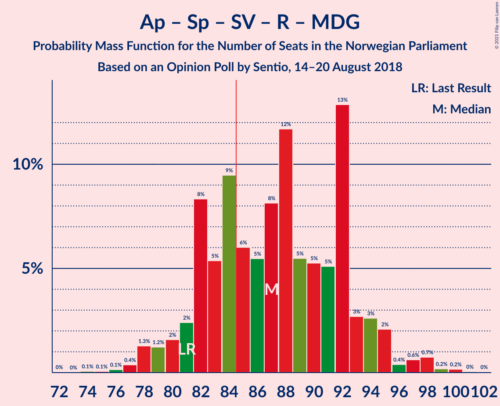
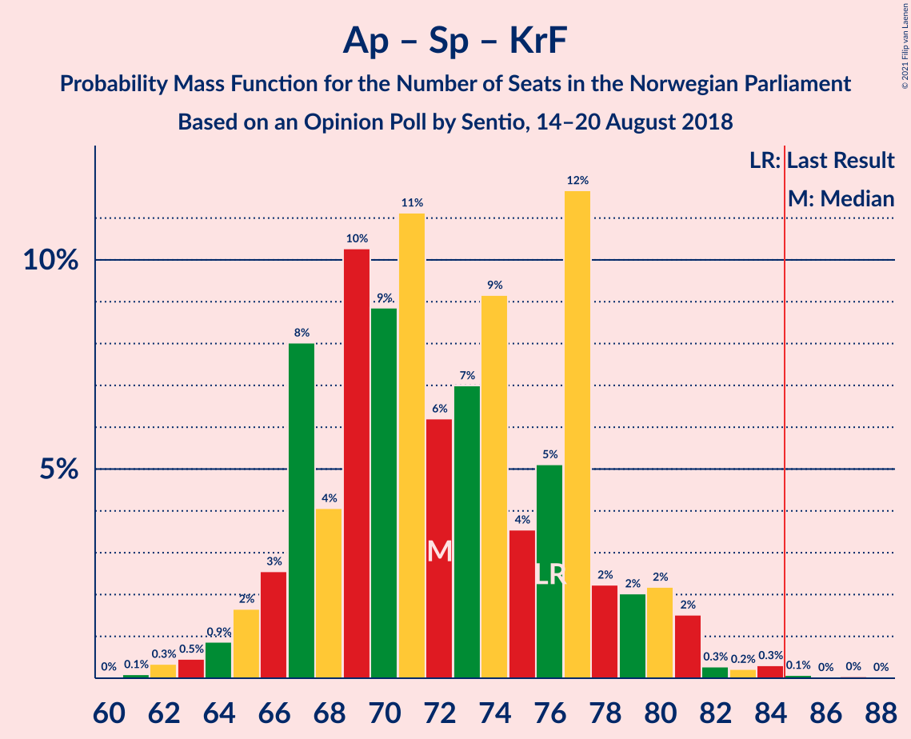

# Opinion Poll by Sentio, 14–20 August 2018

<a href="#voting-intentions">Voting Intentions</a> | <a href="#seats">Seats</a> | <a href="#coalitions">Coalitions</a> | <a href="#technical-information">Technical Information</a>

## Voting Intentions

### Confidence Intervals

| Party | Last Result | Poll Result | 80% Confidence Interval | 90% Confidence Interval | 95% Confidence Interval | 99% Confidence Interval |
|:-----:|:-----------:|:-----------:|:-----------------------:|:-----------------------:|:-----------------------:|:-----------------------:|
| Høyre | 25.0% | 26.7% | 24.6–29.0% |24.0–29.6% |23.5–30.2% |22.5–31.3% |
| Arbeiderpartiet | 27.4% | 26.0% | 23.9–28.2% |23.3–28.8% |22.8–29.4% |21.8–30.5% |
| Fremskrittspartiet | 15.2% | 13.3% | 11.7–15.1% |11.3–15.6% |10.9–16.0% |10.2–16.9% |
| Senterpartiet | 10.3% | 10.8% | 9.4–12.4% |9.0–12.9% |8.6–13.3% |8.0–14.2% |
| Sosialistisk Venstreparti | 6.0% | 6.3% | 5.3–7.7% |5.0–8.1% |4.7–8.4% |4.3–9.1% |
| Rødt | 2.4% | 4.4% | 3.6–5.6% |3.3–6.0% |3.1–6.2% |2.7–6.9% |
| Kristelig Folkeparti | 4.2% | 4.3% | 3.4–5.5% |3.2–5.8% |3.0–6.1% |2.6–6.7% |
| Venstre | 4.4% | 3.5% | 2.8–4.6% |2.6–4.9% |2.4–5.2% |2.1–5.8% |
| Miljøpartiet De Grønne | 3.2% | 3.4% | 2.7–4.5% |2.4–4.8% |2.3–5.0% |2.0–5.6% |

*Note:* The poll result column reflects the actual value used in the calculations. Published results may vary slightly, and in addition be rounded to fewer digits.

## Seats

### Confidence Intervals

| Party | Last Result | Median | 80% Confidence Interval | 90% Confidence Interval | 95% Confidence Interval | 99% Confidence Interval |
|:-----:|:-----------:|:------:|:-----------------------:|:-----------------------:|:-----------------------:|:-----------------------:|
| <a href="#høyre">Høyre</a> | 45 | 48 | 43–53 |43–54 |41–54 |40–57 |
| <a href="#arbeiderpartiet">Arbeiderpartiet</a> | 49 | 47 | 42–50 |42–52 |41–53 |39–56 |
| <a href="#fremskrittspartiet">Fremskrittspartiet</a> | 27 | 24 | 21–28 |19–28 |19–29 |18–31 |
| <a href="#senterpartiet">Senterpartiet</a> | 19 | 19 | 17–22 |16–23 |15–24 |14–25 |
| <a href="#sosialistisk-venstreparti">Sosialistisk Venstreparti</a> | 11 | 11 | 9–14 |9–15 |8–15 |7–16 |
| <a href="#rødt">Rødt</a> | 1 | 8 | 2–10 |2–10 |2–11 |1–12 |
| <a href="#kristelig-folkeparti">Kristelig Folkeparti</a> | 8 | 7 | 3–9 |2–10 |1–10 |1–12 |
| <a href="#venstre">Venstre</a> | 8 | 2 | 2–8 |2–9 |2–9 |1–10 |
| <a href="#miljøpartiet-de-grønne">Miljøpartiet De Grønne</a> | 1 | 2 | 1–8 |1–8 |1–8 |0–9 |

### Høyre

*For a full overview of the results for this party, see the [Høyre](party-høyre.html) page.*

| Number of Seats | Probability | Accumulated | Special Marks |
|:---------------:|:-----------:|:-----------:|:-------------:|
| 37 | 0.1% | 100% |  |
| 38 | 0.2% | 99.9% |  |
| 39 | 0.3% | 99.8% |  |
| 40 | 0.6% | 99.5% |  |
| 41 | 2% | 98.9% |  |
| 42 | 2% | 97% |  |
| 43 | 11% | 95% |  |
| 44 | 7% | 85% |  |
| 45 | 11% | 77% | Last Result |
| 46 | 8% | 67% |  |
| 47 | 9% | 59% |  |
| 48 | 9% | 51% | Median |
| 49 | 9% | 42% |  |
| 50 | 11% | 33% |  |
| 51 | 4% | 22% |  |
| 52 | 8% | 18% |  |
| 53 | 4% | 10% |  |
| 54 | 4% | 7% |  |
| 55 | 1.0% | 2% |  |
| 56 | 0.8% | 1.4% |  |
| 57 | 0.2% | 0.6% |  |
| 58 | 0.1% | 0.4% |  |
| 59 | 0.2% | 0.3% |  |
| 60 | 0% | 0% |  |

### Arbeiderpartiet

*For a full overview of the results for this party, see the [Arbeiderpartiet](party-arbeiderpartiet.html) page.*

| Number of Seats | Probability | Accumulated | Special Marks |
|:---------------:|:-----------:|:-----------:|:-------------:|
| 37 | 0% | 100% |  |
| 38 | 0.1% | 99.9% |  |
| 39 | 0.5% | 99.9% |  |
| 40 | 0.6% | 99.4% |  |
| 41 | 3% | 98.8% |  |
| 42 | 7% | 96% |  |
| 43 | 5% | 89% |  |
| 44 | 10% | 84% |  |
| 45 | 11% | 74% |  |
| 46 | 10% | 64% |  |
| 47 | 15% | 53% | Median |
| 48 | 9% | 39% |  |
| 49 | 4% | 29% | Last Result |
| 50 | 16% | 25% |  |
| 51 | 3% | 10% |  |
| 52 | 3% | 7% |  |
| 53 | 2% | 4% |  |
| 54 | 0.7% | 2% |  |
| 55 | 0.3% | 1.0% |  |
| 56 | 0.5% | 0.7% |  |
| 57 | 0.1% | 0.2% |  |
| 58 | 0% | 0.1% |  |
| 59 | 0% | 0% |  |

### Fremskrittspartiet

*For a full overview of the results for this party, see the [Fremskrittspartiet](party-fremskrittspartiet.html) page.*

| Number of Seats | Probability | Accumulated | Special Marks |
|:---------------:|:-----------:|:-----------:|:-------------:|
| 16 | 0.1% | 100% |  |
| 17 | 0.3% | 99.9% |  |
| 18 | 2% | 99.6% |  |
| 19 | 3% | 98% |  |
| 20 | 3% | 94% |  |
| 21 | 9% | 91% |  |
| 22 | 11% | 82% |  |
| 23 | 9% | 71% |  |
| 24 | 15% | 62% | Median |
| 25 | 22% | 47% |  |
| 26 | 9% | 25% |  |
| 27 | 5% | 15% | Last Result |
| 28 | 7% | 10% |  |
| 29 | 2% | 3% |  |
| 30 | 0.9% | 2% |  |
| 31 | 0.6% | 0.8% |  |
| 32 | 0.1% | 0.1% |  |
| 33 | 0% | 0% |  |

### Senterpartiet

*For a full overview of the results for this party, see the [Senterpartiet](party-senterpartiet.html) page.*

| Number of Seats | Probability | Accumulated | Special Marks |
|:---------------:|:-----------:|:-----------:|:-------------:|
| 12 | 0.1% | 100% |  |
| 13 | 0.1% | 99.9% |  |
| 14 | 0.5% | 99.8% |  |
| 15 | 3% | 99.2% |  |
| 16 | 4% | 96% |  |
| 17 | 11% | 92% |  |
| 18 | 15% | 81% |  |
| 19 | 19% | 66% | Last Result, Median |
| 20 | 19% | 47% |  |
| 21 | 14% | 28% |  |
| 22 | 7% | 14% |  |
| 23 | 4% | 7% |  |
| 24 | 2% | 3% |  |
| 25 | 1.2% | 2% |  |
| 26 | 0.3% | 0.4% |  |
| 27 | 0.1% | 0.2% |  |
| 28 | 0% | 0% |  |

### Sosialistisk Venstreparti

*For a full overview of the results for this party, see the [Sosialistisk Venstreparti](party-sosialistiskvenstreparti.html) page.*

| Number of Seats | Probability | Accumulated | Special Marks |
|:---------------:|:-----------:|:-----------:|:-------------:|
| 2 | 0.2% | 100% |  |
| 3 | 0% | 99.8% |  |
| 4 | 0% | 99.8% |  |
| 5 | 0% | 99.8% |  |
| 6 | 0% | 99.8% |  |
| 7 | 0.4% | 99.8% |  |
| 8 | 3% | 99.4% |  |
| 9 | 8% | 96% |  |
| 10 | 15% | 88% |  |
| 11 | 27% | 74% | Last Result, Median |
| 12 | 21% | 47% |  |
| 13 | 15% | 26% |  |
| 14 | 6% | 11% |  |
| 15 | 4% | 5% |  |
| 16 | 1.1% | 2% |  |
| 17 | 0.3% | 0.4% |  |
| 18 | 0.1% | 0.1% |  |
| 19 | 0% | 0% |  |

### Rødt

*For a full overview of the results for this party, see the [Rødt](party-rødt.html) page.*

| Number of Seats | Probability | Accumulated | Special Marks |
|:---------------:|:-----------:|:-----------:|:-------------:|
| 1 | 1.1% | 100% | Last Result |
| 2 | 29% | 98.9% |  |
| 3 | 0% | 70% |  |
| 4 | 0% | 70% |  |
| 5 | 0% | 70% |  |
| 6 | 0.6% | 70% |  |
| 7 | 12% | 69% |  |
| 8 | 22% | 57% | Median |
| 9 | 18% | 35% |  |
| 10 | 14% | 17% |  |
| 11 | 2% | 3% |  |
| 12 | 0.7% | 1.0% |  |
| 13 | 0.3% | 0.4% |  |
| 14 | 0% | 0% |  |

### Kristelig Folkeparti

*For a full overview of the results for this party, see the [Kristelig Folkeparti](party-kristeligfolkeparti.html) page.*

| Number of Seats | Probability | Accumulated | Special Marks |
|:---------------:|:-----------:|:-----------:|:-------------:|
| 1 | 3% | 100% |  |
| 2 | 3% | 97% |  |
| 3 | 32% | 94% |  |
| 4 | 0% | 62% |  |
| 5 | 0% | 62% |  |
| 6 | 0% | 62% |  |
| 7 | 18% | 62% | Median |
| 8 | 26% | 44% | Last Result |
| 9 | 11% | 18% |  |
| 10 | 5% | 7% |  |
| 11 | 2% | 2% |  |
| 12 | 0.6% | 0.8% |  |
| 13 | 0.2% | 0.2% |  |
| 14 | 0% | 0% |  |

### Venstre

*For a full overview of the results for this party, see the [Venstre](party-venstre.html) page.*

| Number of Seats | Probability | Accumulated | Special Marks |
|:---------------:|:-----------:|:-----------:|:-------------:|
| 0 | 0.1% | 100% |  |
| 1 | 2% | 99.9% |  |
| 2 | 65% | 98% | Median |
| 3 | 1.4% | 33% |  |
| 4 | 0% | 31% |  |
| 5 | 0% | 31% |  |
| 6 | 0.4% | 31% |  |
| 7 | 10% | 31% |  |
| 8 | 13% | 21% | Last Result |
| 9 | 6% | 7% |  |
| 10 | 0.9% | 1.2% |  |
| 11 | 0.2% | 0.2% |  |
| 12 | 0% | 0% |  |

### Miljøpartiet De Grønne

*For a full overview of the results for this party, see the [Miljøpartiet De Grønne](party-miljøpartietdegrønne.html) page.*

| Number of Seats | Probability | Accumulated | Special Marks |
|:---------------:|:-----------:|:-----------:|:-------------:|
| 0 | 0.5% | 100% |  |
| 1 | 24% | 99.5% | Last Result |
| 2 | 42% | 75% | Median |
| 3 | 11% | 33% |  |
| 4 | 0.1% | 23% |  |
| 5 | 0% | 22% |  |
| 6 | 0.8% | 22% |  |
| 7 | 8% | 22% |  |
| 8 | 11% | 13% |  |
| 9 | 2% | 2% |  |
| 10 | 0.3% | 0.4% |  |
| 11 | 0.1% | 0.1% |  |
| 12 | 0% | 0% |  |

## Coalitions

### Confidence Intervals

| Coalition | Last Result | Median | Majority? | 80% Confidence Interval | 90% Confidence Interval | 95% Confidence Interval | 99% Confidence Interval |
|:---------:|:-----------:|:------:|:---------:|:-----------------------:|:-----------------------:|:-----------------------:|:-----------------------:|
| Høyre – Fremskrittspartiet – Senterpartiet – Kristelig Folkeparti – Venstre | 107 | 101 | 100% | 96–107 | 94–108 | 92–109 | 89–112 |
| Arbeiderpartiet – Senterpartiet – Sosialistisk Venstreparti – Rødt – Miljøpartiet De Grønne | 81 | 87 | 70% | 82–92 | 81–94 | 79–95 | 77–98 |
| Arbeiderpartiet – Senterpartiet – Sosialistisk Venstreparti – Kristelig Folkeparti – Miljøpartiet De Grønne | 88 | 87 | 68% | 81–92 | 80–94 | 78–95 | 76–98 |
| Arbeiderpartiet – Senterpartiet – Sosialistisk Venstreparti – Rødt | 80 | 84 | 49% | 79–90 | 77–91 | 76–93 | 73–95 |
| Høyre – Fremskrittspartiet – Kristelig Folkeparti – Venstre – Miljøpartiet De Grønne | 89 | 85 | 51% | 79–90 | 78–92 | 76–93 | 74–96 |
| Høyre – Fremskrittspartiet – Kristelig Folkeparti – Venstre | 88 | 82 | 30% | 77–87 | 75–88 | 74–90 | 71–92 |
| Arbeiderpartiet – Senterpartiet – Sosialistisk Venstreparti – Miljøpartiet De Grønne | 80 | 81 | 15% | 75–85 | 74–87 | 73–89 | 70–92 |
| Arbeiderpartiet – Senterpartiet – Sosialistisk Venstreparti | 79 | 78 | 3% | 72–82 | 71–84 | 70–85 | 67–89 |
| Arbeiderpartiet – Senterpartiet – Kristelig Folkeparti – Miljøpartiet De Grønne | 77 | 75 | 2% | 69–82 | 69–83 | 67–84 | 65–87 |
| Høyre – Fremskrittspartiet – Venstre | 80 | 76 | 1.1% | 70–82 | 68–84 | 67–84 | 65–86 |
| Arbeiderpartiet – Senterpartiet – Kristelig Folkeparti | 76 | 72 | 0.2% | 67–77 | 66–79 | 65–80 | 63–83 |
| Høyre – Fremskrittspartiet | 72 | 71 | 0.1% | 67–76 | 65–78 | 64–80 | 61–83 |
| Arbeiderpartiet – Senterpartiet | 68 | 66 | 0% | 61–71 | 60–72 | 59–73 | 58–76 |
| Høyre – Kristelig Folkeparti – Venstre | 61 | 58 | 0% | 52–63 | 51–64 | 50–66 | 47–69 |
| Arbeiderpartiet – Sosialistisk Venstreparti | 60 | 58 | 0% | 54–62 | 52–64 | 51–65 | 50–68 |
| Senterpartiet – Kristelig Folkeparti – Venstre | 35 | 29 | 0% | 24–34 | 22–36 | 22–37 | 20–40 |

### Høyre – Fremskrittspartiet – Senterpartiet – Kristelig Folkeparti – Venstre

| Number of Seats | Probability | Accumulated | Special Marks |
|:---------------:|:-----------:|:-----------:|:-------------:|
| 87 | 0.2% | 100% |  |
| 88 | 0.1% | 99.8% |  |
| 89 | 0.3% | 99.7% |  |
| 90 | 0.6% | 99.4% |  |
| 91 | 0.8% | 98.7% |  |
| 92 | 1.2% | 98% |  |
| 93 | 1.1% | 97% |  |
| 94 | 2% | 96% |  |
| 95 | 4% | 94% |  |
| 96 | 2% | 90% |  |
| 97 | 13% | 88% |  |
| 98 | 8% | 75% |  |
| 99 | 5% | 67% |  |
| 100 | 10% | 62% | Median |
| 101 | 9% | 52% |  |
| 102 | 5% | 43% |  |
| 103 | 4% | 38% |  |
| 104 | 6% | 33% |  |
| 105 | 8% | 28% |  |
| 106 | 9% | 20% |  |
| 107 | 4% | 10% | Last Result |
| 108 | 2% | 7% |  |
| 109 | 2% | 4% |  |
| 110 | 0.8% | 2% |  |
| 111 | 0.2% | 1.0% |  |
| 112 | 0.4% | 0.7% |  |
| 113 | 0.2% | 0.3% |  |
| 114 | 0.1% | 0.1% |  |
| 115 | 0% | 0.1% |  |
| 116 | 0% | 0% |  |

### Arbeiderpartiet – Senterpartiet – Sosialistisk Venstreparti – Rødt – Miljøpartiet De Grønne

| Number of Seats | Probability | Accumulated | Special Marks |
|:---------------:|:-----------:|:-----------:|:-------------:|
| 74 | 0.1% | 100% |  |
| 75 | 0.1% | 99.9% |  |
| 76 | 0.1% | 99.8% |  |
| 77 | 0.4% | 99.7% |  |
| 78 | 1.3% | 99.3% |  |
| 79 | 1.2% | 98% |  |
| 80 | 2% | 97% |  |
| 81 | 2% | 95% | Last Result |
| 82 | 8% | 93% |  |
| 83 | 5% | 84% |  |
| 84 | 9% | 79% |  |
| 85 | 6% | 70% | Majority |
| 86 | 5% | 64% |  |
| 87 | 8% | 58% | Median |
| 88 | 12% | 50% |  |
| 89 | 5% | 38% |  |
| 90 | 5% | 33% |  |
| 91 | 5% | 28% |  |
| 92 | 13% | 22% |  |
| 93 | 3% | 10% |  |
| 94 | 3% | 7% |  |
| 95 | 2% | 4% |  |
| 96 | 0.4% | 2% |  |
| 97 | 0.6% | 2% |  |
| 98 | 0.7% | 1.2% |  |
| 99 | 0.2% | 0.4% |  |
| 100 | 0.2% | 0.3% |  |
| 101 | 0% | 0.1% |  |
| 102 | 0% | 0% |  |

### Arbeiderpartiet – Senterpartiet – Sosialistisk Venstreparti – Kristelig Folkeparti – Miljøpartiet De Grønne

| Number of Seats | Probability | Accumulated | Special Marks |
|:---------------:|:-----------:|:-----------:|:-------------:|
| 74 | 0% | 100% |  |
| 75 | 0.3% | 99.9% |  |
| 76 | 0.4% | 99.6% |  |
| 77 | 1.1% | 99.2% |  |
| 78 | 1.1% | 98% |  |
| 79 | 2% | 97% |  |
| 80 | 2% | 95% |  |
| 81 | 6% | 93% |  |
| 82 | 5% | 87% |  |
| 83 | 8% | 82% |  |
| 84 | 5% | 74% |  |
| 85 | 5% | 68% | Majority |
| 86 | 10% | 63% | Median |
| 87 | 7% | 54% |  |
| 88 | 9% | 47% | Last Result |
| 89 | 7% | 38% |  |
| 90 | 6% | 30% |  |
| 91 | 10% | 25% |  |
| 92 | 5% | 14% |  |
| 93 | 4% | 9% |  |
| 94 | 2% | 5% |  |
| 95 | 1.3% | 3% |  |
| 96 | 0.6% | 2% |  |
| 97 | 0.5% | 1.5% |  |
| 98 | 0.6% | 0.9% |  |
| 99 | 0.2% | 0.4% |  |
| 100 | 0.1% | 0.2% |  |
| 101 | 0% | 0.1% |  |
| 102 | 0% | 0% |  |

### Arbeiderpartiet – Senterpartiet – Sosialistisk Venstreparti – Rødt

| Number of Seats | Probability | Accumulated | Special Marks |
|:---------------:|:-----------:|:-----------:|:-------------:|
| 70 | 0% | 100% |  |
| 71 | 0.1% | 99.9% |  |
| 72 | 0.3% | 99.8% |  |
| 73 | 0.1% | 99.5% |  |
| 74 | 0.8% | 99.4% |  |
| 75 | 0.6% | 98.6% |  |
| 76 | 3% | 98% |  |
| 77 | 2% | 95% |  |
| 78 | 2% | 93% |  |
| 79 | 5% | 91% |  |
| 80 | 7% | 86% | Last Result |
| 81 | 10% | 79% |  |
| 82 | 7% | 69% |  |
| 83 | 8% | 62% |  |
| 84 | 5% | 54% |  |
| 85 | 8% | 49% | Median, Majority |
| 86 | 12% | 42% |  |
| 87 | 4% | 30% |  |
| 88 | 3% | 26% |  |
| 89 | 11% | 23% |  |
| 90 | 5% | 12% |  |
| 91 | 3% | 7% |  |
| 92 | 0.6% | 4% |  |
| 93 | 2% | 3% |  |
| 94 | 0.4% | 1.0% |  |
| 95 | 0.3% | 0.6% |  |
| 96 | 0.1% | 0.3% |  |
| 97 | 0.1% | 0.2% |  |
| 98 | 0.1% | 0.1% |  |
| 99 | 0% | 0% |  |

### Høyre – Fremskrittspartiet – Kristelig Folkeparti – Venstre – Miljøpartiet De Grønne

| Number of Seats | Probability | Accumulated | Special Marks |
|:---------------:|:-----------:|:-----------:|:-------------:|
| 71 | 0.1% | 100% |  |
| 72 | 0.1% | 99.9% |  |
| 73 | 0.1% | 99.8% |  |
| 74 | 0.3% | 99.7% |  |
| 75 | 0.4% | 99.4% |  |
| 76 | 2% | 99.0% |  |
| 77 | 0.6% | 97% |  |
| 78 | 3% | 96% |  |
| 79 | 5% | 93% |  |
| 80 | 11% | 88% |  |
| 81 | 3% | 77% |  |
| 82 | 4% | 74% |  |
| 83 | 12% | 70% | Median |
| 84 | 8% | 58% |  |
| 85 | 5% | 51% | Majority |
| 86 | 8% | 46% |  |
| 87 | 7% | 38% |  |
| 88 | 10% | 31% |  |
| 89 | 7% | 21% | Last Result |
| 90 | 5% | 14% |  |
| 91 | 2% | 9% |  |
| 92 | 2% | 7% |  |
| 93 | 3% | 5% |  |
| 94 | 0.6% | 2% |  |
| 95 | 0.8% | 1.4% |  |
| 96 | 0.1% | 0.6% |  |
| 97 | 0.3% | 0.5% |  |
| 98 | 0.1% | 0.2% |  |
| 99 | 0% | 0.1% |  |
| 100 | 0% | 0% |  |

### Høyre – Fremskrittspartiet – Kristelig Folkeparti – Venstre

| Number of Seats | Probability | Accumulated | Special Marks |
|:---------------:|:-----------:|:-----------:|:-------------:|
| 68 | 0% | 100% |  |
| 69 | 0.2% | 99.9% |  |
| 70 | 0.2% | 99.7% |  |
| 71 | 0.7% | 99.6% |  |
| 72 | 0.6% | 98.8% |  |
| 73 | 0.4% | 98% |  |
| 74 | 2% | 98% |  |
| 75 | 3% | 96% |  |
| 76 | 3% | 93% |  |
| 77 | 13% | 90% |  |
| 78 | 5% | 78% |  |
| 79 | 5% | 72% |  |
| 80 | 5% | 67% |  |
| 81 | 12% | 62% | Median |
| 82 | 8% | 50% |  |
| 83 | 5% | 42% |  |
| 84 | 6% | 36% |  |
| 85 | 9% | 30% | Majority |
| 86 | 5% | 21% |  |
| 87 | 8% | 16% |  |
| 88 | 2% | 7% | Last Result |
| 89 | 2% | 5% |  |
| 90 | 1.2% | 3% |  |
| 91 | 1.3% | 2% |  |
| 92 | 0.4% | 0.7% |  |
| 93 | 0.1% | 0.3% |  |
| 94 | 0.1% | 0.2% |  |
| 95 | 0.1% | 0.1% |  |
| 96 | 0% | 0% |  |

### Arbeiderpartiet – Senterpartiet – Sosialistisk Venstreparti – Miljøpartiet De Grønne

| Number of Seats | Probability | Accumulated | Special Marks |
|:---------------:|:-----------:|:-----------:|:-------------:|
| 68 | 0.1% | 100% |  |
| 69 | 0.1% | 99.9% |  |
| 70 | 0.4% | 99.8% |  |
| 71 | 0.6% | 99.4% |  |
| 72 | 1.1% | 98.8% |  |
| 73 | 1.5% | 98% |  |
| 74 | 3% | 96% |  |
| 75 | 3% | 93% |  |
| 76 | 3% | 89% |  |
| 77 | 5% | 86% |  |
| 78 | 10% | 81% |  |
| 79 | 9% | 71% | Median |
| 80 | 10% | 62% | Last Result |
| 81 | 9% | 53% |  |
| 82 | 10% | 44% |  |
| 83 | 7% | 34% |  |
| 84 | 12% | 27% |  |
| 85 | 7% | 15% | Majority |
| 86 | 2% | 8% |  |
| 87 | 2% | 6% |  |
| 88 | 1.1% | 4% |  |
| 89 | 1.2% | 3% |  |
| 90 | 0.8% | 2% |  |
| 91 | 0.5% | 1.4% |  |
| 92 | 0.6% | 0.9% |  |
| 93 | 0.1% | 0.4% |  |
| 94 | 0% | 0.2% |  |
| 95 | 0.2% | 0.2% |  |
| 96 | 0% | 0% |  |

### Arbeiderpartiet – Senterpartiet – Sosialistisk Venstreparti

| Number of Seats | Probability | Accumulated | Special Marks |
|:---------------:|:-----------:|:-----------:|:-------------:|
| 65 | 0.1% | 100% |  |
| 66 | 0.1% | 99.9% |  |
| 67 | 0.5% | 99.8% |  |
| 68 | 0.4% | 99.3% |  |
| 69 | 1.0% | 99.0% |  |
| 70 | 2% | 98% |  |
| 71 | 2% | 96% |  |
| 72 | 5% | 94% |  |
| 73 | 3% | 89% |  |
| 74 | 8% | 85% |  |
| 75 | 6% | 78% |  |
| 76 | 13% | 72% |  |
| 77 | 7% | 59% | Median |
| 78 | 8% | 52% |  |
| 79 | 10% | 43% | Last Result |
| 80 | 7% | 34% |  |
| 81 | 12% | 27% |  |
| 82 | 6% | 15% |  |
| 83 | 3% | 9% |  |
| 84 | 2% | 6% |  |
| 85 | 1.0% | 3% | Majority |
| 86 | 0.9% | 2% |  |
| 87 | 0.5% | 1.3% |  |
| 88 | 0.1% | 0.8% |  |
| 89 | 0.4% | 0.7% |  |
| 90 | 0.1% | 0.3% |  |
| 91 | 0.2% | 0.2% |  |
| 92 | 0% | 0.1% |  |
| 93 | 0% | 0% |  |

### Arbeiderpartiet – Senterpartiet – Kristelig Folkeparti – Miljøpartiet De Grønne

| Number of Seats | Probability | Accumulated | Special Marks |
|:---------------:|:-----------:|:-----------:|:-------------:|
| 62 | 0% | 100% |  |
| 63 | 0.2% | 99.9% |  |
| 64 | 0.1% | 99.7% |  |
| 65 | 0.7% | 99.6% |  |
| 66 | 1.0% | 98.9% |  |
| 67 | 1.4% | 98% |  |
| 68 | 1.5% | 97% |  |
| 69 | 6% | 95% |  |
| 70 | 7% | 89% |  |
| 71 | 7% | 83% |  |
| 72 | 5% | 75% |  |
| 73 | 10% | 70% |  |
| 74 | 4% | 60% |  |
| 75 | 8% | 56% | Median |
| 76 | 6% | 48% |  |
| 77 | 6% | 42% | Last Result |
| 78 | 6% | 36% |  |
| 79 | 7% | 30% |  |
| 80 | 10% | 24% |  |
| 81 | 3% | 14% |  |
| 82 | 4% | 10% |  |
| 83 | 3% | 6% |  |
| 84 | 1.5% | 3% |  |
| 85 | 0.9% | 2% | Majority |
| 86 | 0.3% | 0.9% |  |
| 87 | 0.4% | 0.7% |  |
| 88 | 0.2% | 0.3% |  |
| 89 | 0.1% | 0.1% |  |
| 90 | 0.1% | 0.1% |  |
| 91 | 0% | 0% |  |

### Høyre – Fremskrittspartiet – Venstre

| Number of Seats | Probability | Accumulated | Special Marks |
|:---------------:|:-----------:|:-----------:|:-------------:|
| 61 | 0% | 100% |  |
| 62 | 0.1% | 99.9% |  |
| 63 | 0.1% | 99.9% |  |
| 64 | 0.2% | 99.8% |  |
| 65 | 0.3% | 99.6% |  |
| 66 | 0.4% | 99.3% |  |
| 67 | 1.4% | 98.9% |  |
| 68 | 3% | 97% |  |
| 69 | 2% | 95% |  |
| 70 | 12% | 93% |  |
| 71 | 3% | 80% |  |
| 72 | 6% | 77% |  |
| 73 | 6% | 71% |  |
| 74 | 8% | 65% | Median |
| 75 | 6% | 57% |  |
| 76 | 6% | 51% |  |
| 77 | 7% | 46% |  |
| 78 | 11% | 38% |  |
| 79 | 10% | 27% |  |
| 80 | 4% | 18% | Last Result |
| 81 | 4% | 14% |  |
| 82 | 2% | 10% |  |
| 83 | 1.4% | 8% |  |
| 84 | 6% | 7% |  |
| 85 | 0.5% | 1.1% | Majority |
| 86 | 0.3% | 0.6% |  |
| 87 | 0.1% | 0.3% |  |
| 88 | 0.1% | 0.2% |  |
| 89 | 0.1% | 0.1% |  |
| 90 | 0% | 0.1% |  |
| 91 | 0% | 0% |  |

### Arbeiderpartiet – Senterpartiet – Kristelig Folkeparti

| Number of Seats | Probability | Accumulated | Special Marks |
|:---------------:|:-----------:|:-----------:|:-------------:|
| 60 | 0% | 100% |  |
| 61 | 0.1% | 99.9% |  |
| 62 | 0.3% | 99.8% |  |
| 63 | 0.5% | 99.5% |  |
| 64 | 0.9% | 99.0% |  |
| 65 | 2% | 98% |  |
| 66 | 3% | 97% |  |
| 67 | 8% | 94% |  |
| 68 | 4% | 86% |  |
| 69 | 10% | 82% |  |
| 70 | 9% | 72% |  |
| 71 | 11% | 63% |  |
| 72 | 6% | 52% |  |
| 73 | 7% | 45% | Median |
| 74 | 9% | 38% |  |
| 75 | 4% | 29% |  |
| 76 | 5% | 26% | Last Result |
| 77 | 12% | 21% |  |
| 78 | 2% | 9% |  |
| 79 | 2% | 7% |  |
| 80 | 2% | 5% |  |
| 81 | 2% | 2% |  |
| 82 | 0.3% | 1.0% |  |
| 83 | 0.2% | 0.7% |  |
| 84 | 0.3% | 0.5% |  |
| 85 | 0.1% | 0.2% | Majority |
| 86 | 0% | 0.1% |  |
| 87 | 0% | 0.1% |  |
| 88 | 0% | 0% |  |

### Høyre – Fremskrittspartiet

| Number of Seats | Probability | Accumulated | Special Marks |
|:---------------:|:-----------:|:-----------:|:-------------:|
| 58 | 0% | 100% |  |
| 59 | 0% | 99.9% |  |
| 60 | 0.2% | 99.9% |  |
| 61 | 0.3% | 99.7% |  |
| 62 | 0.3% | 99.4% |  |
| 63 | 1.1% | 99.1% |  |
| 64 | 2% | 98% |  |
| 65 | 3% | 96% |  |
| 66 | 3% | 93% |  |
| 67 | 3% | 90% |  |
| 68 | 13% | 87% |  |
| 69 | 5% | 74% |  |
| 70 | 8% | 69% |  |
| 71 | 12% | 60% |  |
| 72 | 9% | 49% | Last Result, Median |
| 73 | 5% | 40% |  |
| 74 | 6% | 34% |  |
| 75 | 7% | 29% |  |
| 76 | 12% | 22% |  |
| 77 | 3% | 10% |  |
| 78 | 3% | 7% |  |
| 79 | 1.2% | 4% |  |
| 80 | 1.4% | 3% |  |
| 81 | 0.5% | 2% |  |
| 82 | 0.8% | 1.3% |  |
| 83 | 0.4% | 0.5% |  |
| 84 | 0.1% | 0.1% |  |
| 85 | 0.1% | 0.1% | Majority |
| 86 | 0% | 0% |  |

### Arbeiderpartiet – Senterpartiet

| Number of Seats | Probability | Accumulated | Special Marks |
|:---------------:|:-----------:|:-----------:|:-------------:|
| 56 | 0.2% | 100% |  |
| 57 | 0.3% | 99.8% |  |
| 58 | 1.0% | 99.5% |  |
| 59 | 2% | 98.6% |  |
| 60 | 3% | 97% |  |
| 61 | 5% | 94% |  |
| 62 | 6% | 89% |  |
| 63 | 9% | 84% |  |
| 64 | 11% | 74% |  |
| 65 | 7% | 63% |  |
| 66 | 14% | 56% | Median |
| 67 | 7% | 43% |  |
| 68 | 7% | 36% | Last Result |
| 69 | 7% | 29% |  |
| 70 | 11% | 22% |  |
| 71 | 3% | 11% |  |
| 72 | 3% | 7% |  |
| 73 | 2% | 5% |  |
| 74 | 0.5% | 2% |  |
| 75 | 0.9% | 2% |  |
| 76 | 0.5% | 0.9% |  |
| 77 | 0.2% | 0.3% |  |
| 78 | 0.1% | 0.2% |  |
| 79 | 0.1% | 0.1% |  |
| 80 | 0% | 0% |  |

### Høyre – Kristelig Folkeparti – Venstre

| Number of Seats | Probability | Accumulated | Special Marks |
|:---------------:|:-----------:|:-----------:|:-------------:|
| 45 | 0.1% | 100% |  |
| 46 | 0.2% | 99.9% |  |
| 47 | 0.5% | 99.7% |  |
| 48 | 0.3% | 99.2% |  |
| 49 | 0.5% | 99.0% |  |
| 50 | 3% | 98% |  |
| 51 | 2% | 95% |  |
| 52 | 9% | 94% |  |
| 53 | 4% | 85% |  |
| 54 | 7% | 81% |  |
| 55 | 11% | 74% |  |
| 56 | 5% | 64% |  |
| 57 | 7% | 59% | Median |
| 58 | 4% | 52% |  |
| 59 | 14% | 48% |  |
| 60 | 7% | 34% |  |
| 61 | 5% | 26% | Last Result |
| 62 | 7% | 21% |  |
| 63 | 7% | 14% |  |
| 64 | 3% | 8% |  |
| 65 | 2% | 5% |  |
| 66 | 1.3% | 3% |  |
| 67 | 0.7% | 2% |  |
| 68 | 0.7% | 1.3% |  |
| 69 | 0.4% | 0.6% |  |
| 70 | 0.1% | 0.2% |  |
| 71 | 0.1% | 0.1% |  |
| 72 | 0% | 0% |  |

### Arbeiderpartiet – Sosialistisk Venstreparti

| Number of Seats | Probability | Accumulated | Special Marks |
|:---------------:|:-----------:|:-----------:|:-------------:|
| 47 | 0% | 100% |  |
| 48 | 0.2% | 99.9% |  |
| 49 | 0.2% | 99.8% |  |
| 50 | 0.9% | 99.6% |  |
| 51 | 1.2% | 98.7% |  |
| 52 | 3% | 97% |  |
| 53 | 4% | 95% |  |
| 54 | 6% | 91% |  |
| 55 | 5% | 85% |  |
| 56 | 10% | 79% |  |
| 57 | 13% | 70% |  |
| 58 | 7% | 57% | Median |
| 59 | 11% | 50% |  |
| 60 | 12% | 39% | Last Result |
| 61 | 12% | 27% |  |
| 62 | 6% | 15% |  |
| 63 | 1.5% | 9% |  |
| 64 | 4% | 7% |  |
| 65 | 0.9% | 3% |  |
| 66 | 0.7% | 2% |  |
| 67 | 0.6% | 1.3% |  |
| 68 | 0.3% | 0.8% |  |
| 69 | 0.3% | 0.4% |  |
| 70 | 0.1% | 0.1% |  |
| 71 | 0% | 0% |  |

### Senterpartiet – Kristelig Folkeparti – Venstre

| Number of Seats | Probability | Accumulated | Special Marks |
|:---------------:|:-----------:|:-----------:|:-------------:|
| 18 | 0.1% | 100% |  |
| 19 | 0.2% | 99.9% |  |
| 20 | 0.7% | 99.7% |  |
| 21 | 1.3% | 99.0% |  |
| 22 | 3% | 98% |  |
| 23 | 4% | 95% |  |
| 24 | 2% | 91% |  |
| 25 | 6% | 90% |  |
| 26 | 5% | 83% |  |
| 27 | 8% | 78% |  |
| 28 | 6% | 70% | Median |
| 29 | 17% | 64% |  |
| 30 | 13% | 48% |  |
| 31 | 9% | 35% |  |
| 32 | 4% | 26% |  |
| 33 | 7% | 22% |  |
| 34 | 5% | 15% |  |
| 35 | 5% | 10% | Last Result |
| 36 | 2% | 5% |  |
| 37 | 2% | 3% |  |
| 38 | 0.6% | 2% |  |
| 39 | 0.7% | 1.2% |  |
| 40 | 0.2% | 0.5% |  |
| 41 | 0.2% | 0.3% |  |
| 42 | 0% | 0.1% |  |
| 43 | 0% | 0% |  |

## Technical Information

### Opinion Poll

+ **Polling firm:** Sentio
+ **Commissioner(s):** —
+ **Fieldwork period:** 14–20 August 2018

### Calculations

+ **Sample size:** 678
+ **Simulations done:** 1,048,576
+ **Error estimate:** 2.10%

