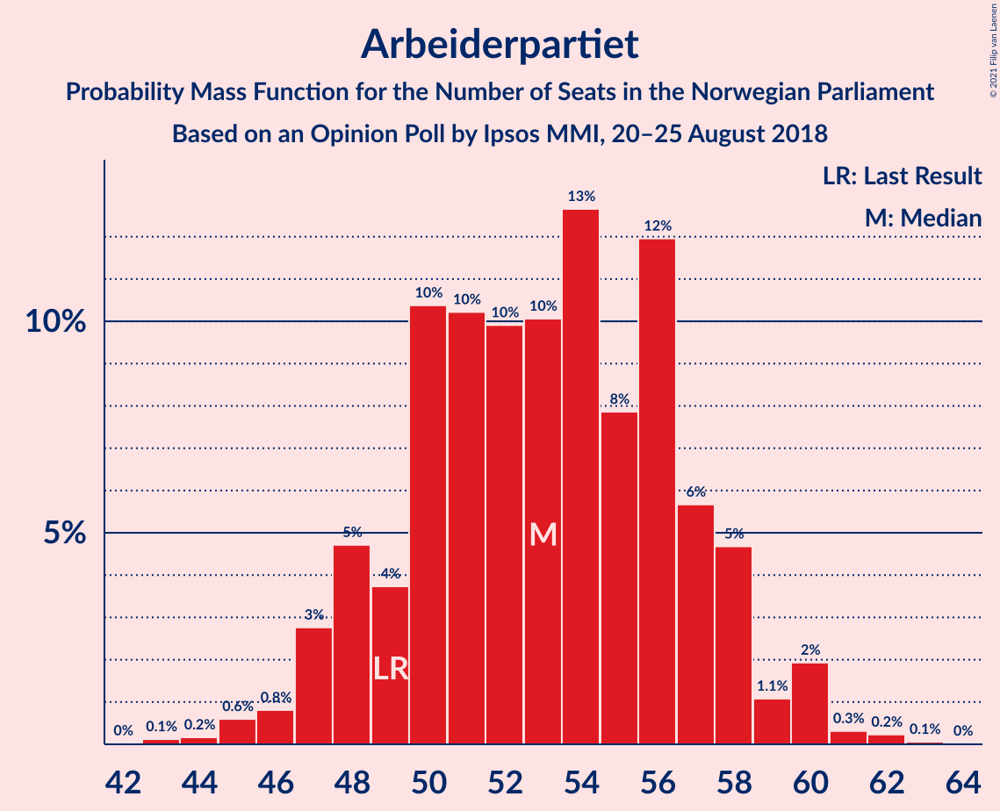
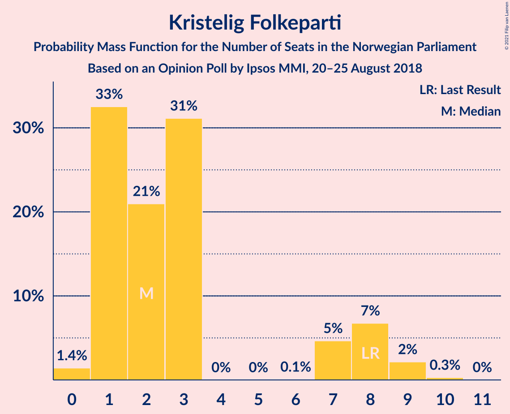
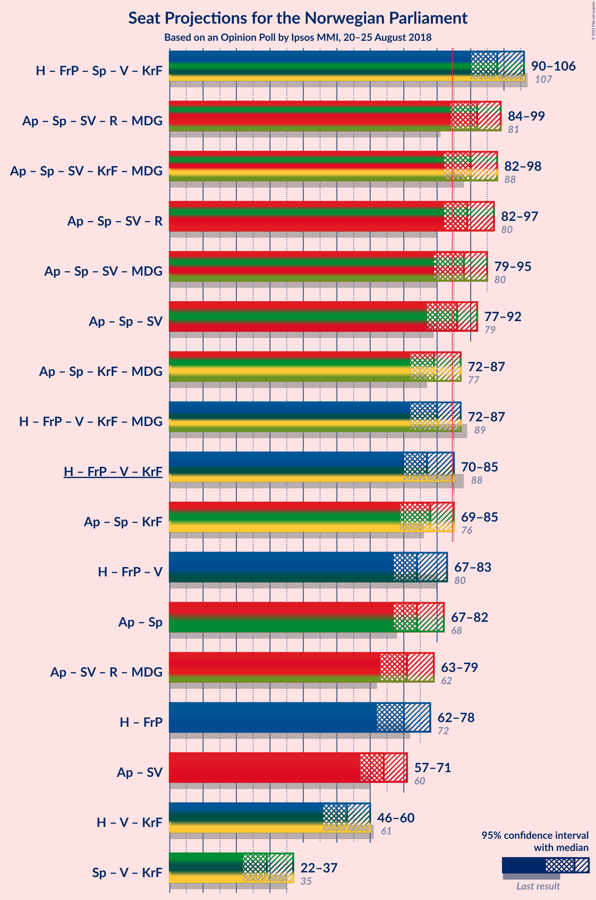
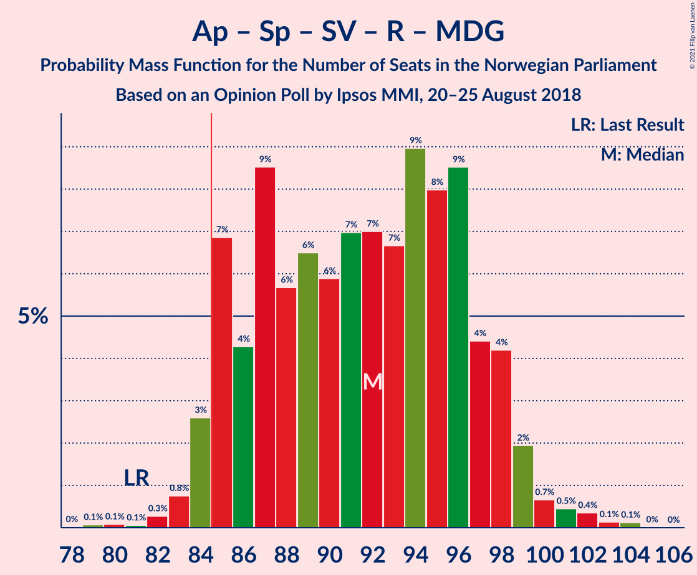
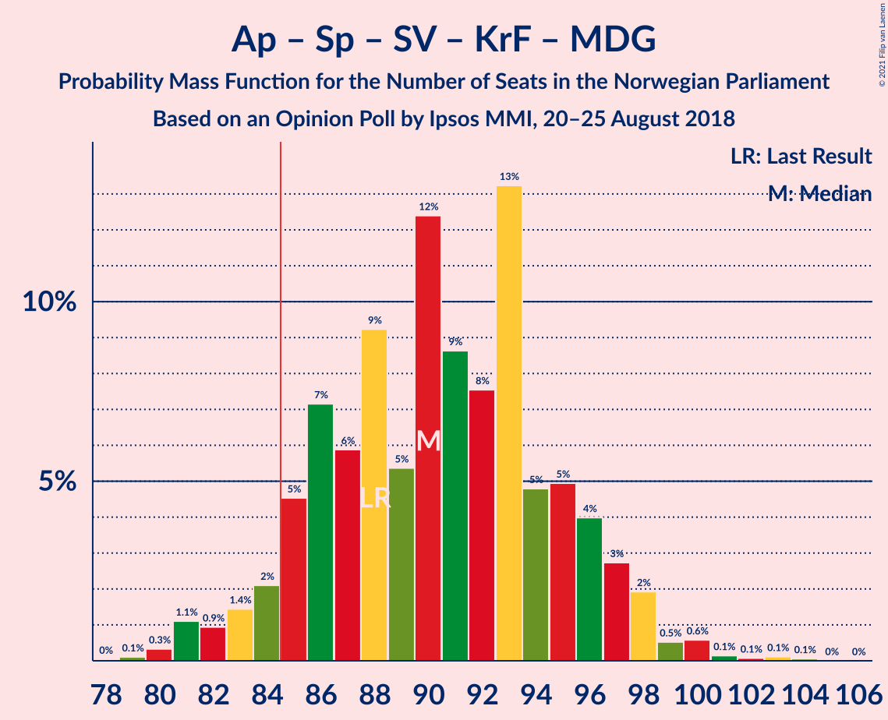
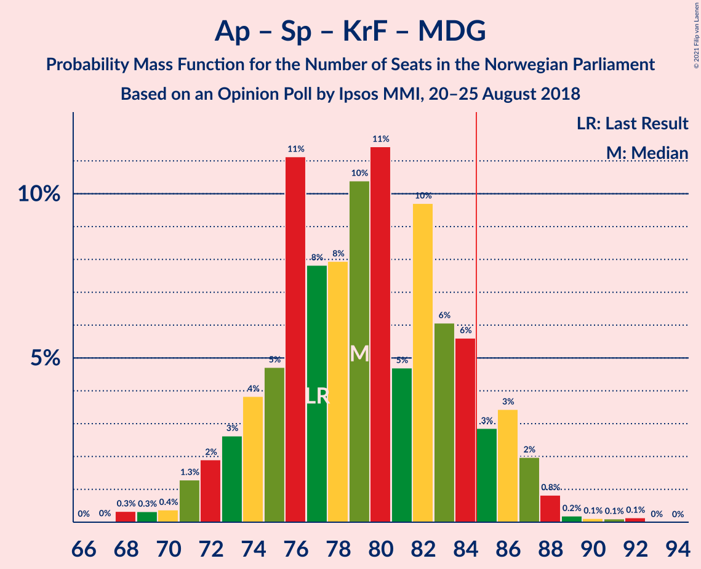
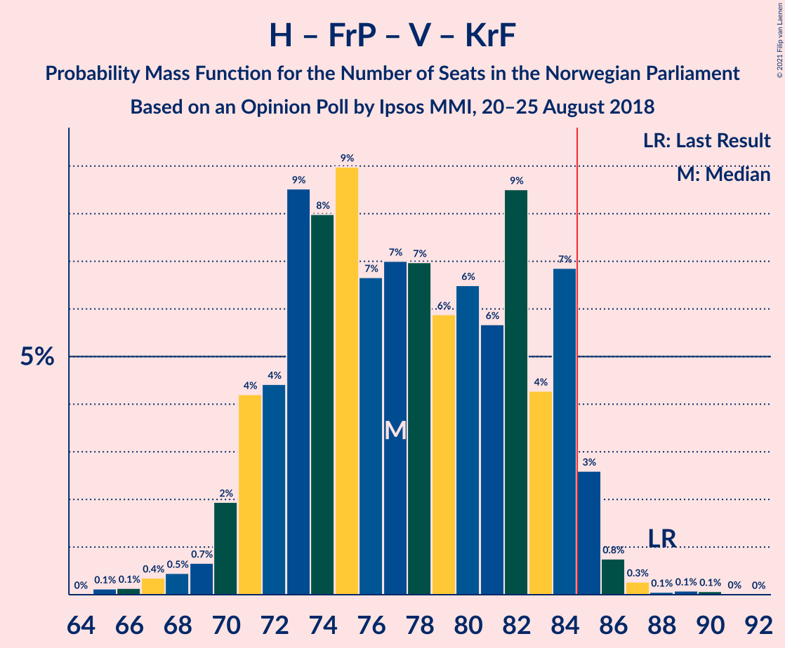
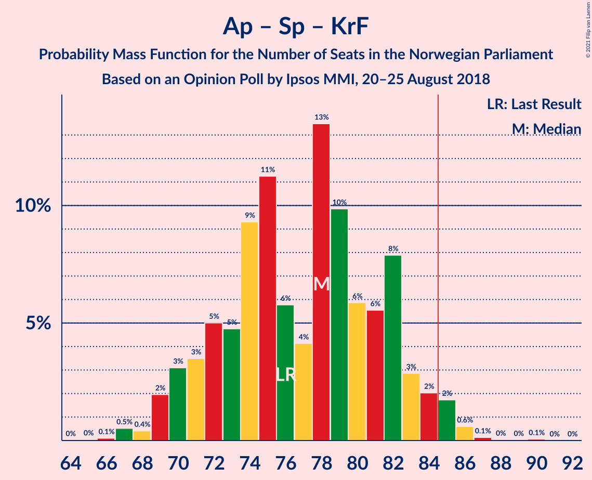
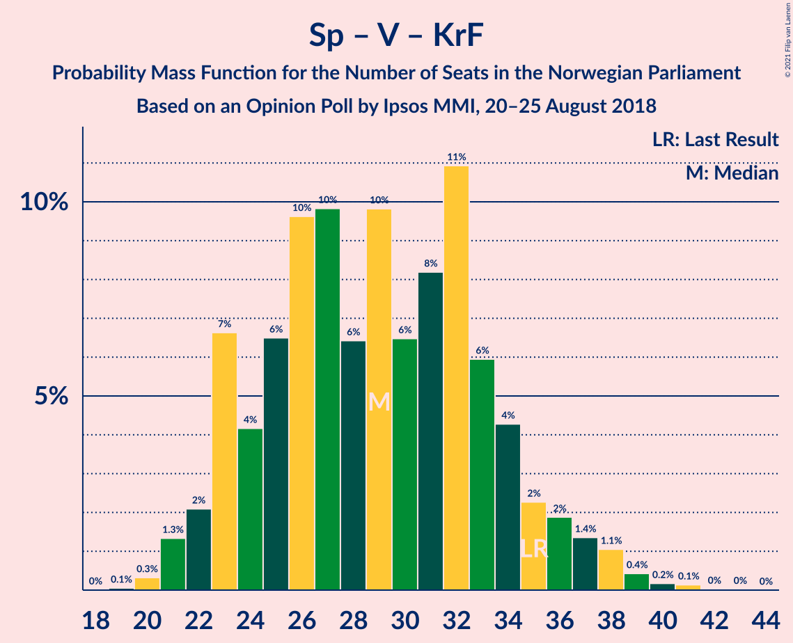

# Opinion Poll by Ipsos MMI, 20–25 August 2018

<a href="#voting-intentions">Voting Intentions</a> | <a href="#seats">Seats</a> | <a href="#coalitions">Coalitions</a> | <a href="#technical-information">Technical Information</a>

## Voting Intentions

### Confidence Intervals

| Party | Last Result | Poll Result | 80% Confidence Interval | 90% Confidence Interval | 95% Confidence Interval | 99% Confidence Interval |
|:-----:|:-----------:|:-----------:|:-----------------------:|:-----------------------:|:-----------------------:|:-----------------------:|
| Arbeiderpartiet | 27.4% | 28.5% | 26.7–30.5% |26.2–31.0% |25.7–31.5% |24.9–32.4% |
| Høyre | 25.0% | 24.8% | 23.1–26.7% |22.6–27.2% |22.2–27.7% |21.3–28.6% |
| Fremskrittspartiet | 15.2% | 13.0% | 11.7–14.6% |11.4–15.0% |11.0–15.3% |10.4–16.1% |
| Senterpartiet | 10.3% | 11.5% | 10.2–12.9% |9.9–13.3% |9.6–13.7% |9.0–14.4% |
| Sosialistisk Venstreparti | 6.0% | 6.0% | 5.2–7.2% |4.9–7.5% |4.7–7.8% |4.3–8.3% |
| Venstre | 4.4% | 3.9% | 3.2–4.9% |3.0–5.1% |2.9–5.4% |2.5–5.9% |
| Rødt | 2.4% | 3.7% | 3.0–4.6% |2.8–4.9% |2.7–5.1% |2.4–5.6% |
| Kristelig Folkeparti | 4.2% | 3.3% | 2.7–4.2% |2.5–4.4% |2.3–4.6% |2.1–5.1% |
| Miljøpartiet De Grønne | 3.2% | 3.2% | 2.6–4.1% |2.4–4.3% |2.2–4.5% |2.0–5.0% |

*Note:* The poll result column reflects the actual value used in the calculations. Published results may vary slightly, and in addition be rounded to fewer digits.

## Seats

### Confidence Intervals

| Party | Last Result | Median | 80% Confidence Interval | 90% Confidence Interval | 95% Confidence Interval | 99% Confidence Interval |
|:-----:|:-----------:|:------:|:-----------------------:|:-----------------------:|:-----------------------:|:-----------------------:|
| <a href="#arbeiderpartiet">Arbeiderpartiet</a> | 49 | 54 | 50–58 |48–58 |47–58 |45–61 |
| <a href="#høyre">Høyre</a> | 45 | 45 | 42–48 |41–50 |40–51 |39–54 |
| <a href="#fremskrittspartiet">Fremskrittspartiet</a> | 27 | 25 | 21–26 |21–29 |20–29 |19–30 |
| <a href="#senterpartiet">Senterpartiet</a> | 19 | 21 | 18–22 |18–23 |18–24 |17–27 |
| <a href="#sosialistisk-venstreparti">Sosialistisk Venstreparti</a> | 11 | 11 | 10–13 |9–13 |9–14 |8–16 |
| <a href="#venstre">Venstre</a> | 8 | 7 | 2–9 |2–9 |2–9 |2–10 |
| <a href="#rødt">Rødt</a> | 1 | 2 | 2–8 |1–8 |1–9 |1–10 |
| <a href="#kristelig-folkeparti">Kristelig Folkeparti</a> | 8 | 2 | 1–7 |1–7 |1–8 |0–9 |
| <a href="#miljøpartiet-de-grønne">Miljøpartiet De Grønne</a> | 1 | 1 | 1–3 |1–8 |1–8 |1–9 |

### Arbeiderpartiet

*For a full overview of the results for this party, see the [Arbeiderpartiet](party-arbeiderpartiet.html) page.*

| Number of Seats | Probability | Accumulated | Special Marks |
|:---------------:|:-----------:|:-----------:|:-------------:|
| 43 | 0% | 100% |  |
| 44 | 0.1% | 99.9% |  |
| 45 | 0.8% | 99.8% |  |
| 46 | 0.4% | 99.0% |  |
| 47 | 2% | 98.7% |  |
| 48 | 3% | 96% |  |
| 49 | 2% | 93% | Last Result |
| 50 | 16% | 91% |  |
| 51 | 7% | 75% |  |
| 52 | 4% | 68% |  |
| 53 | 12% | 64% |  |
| 54 | 26% | 52% | Median |
| 55 | 4% | 26% |  |
| 56 | 10% | 22% |  |
| 57 | 0.6% | 12% |  |
| 58 | 10% | 11% |  |
| 59 | 0.2% | 1.1% |  |
| 60 | 0.1% | 0.8% |  |
| 61 | 0.4% | 0.7% |  |
| 62 | 0.2% | 0.3% |  |
| 63 | 0% | 0% |  |

### Høyre

*For a full overview of the results for this party, see the [Høyre](party-høyre.html) page.*

| Number of Seats | Probability | Accumulated | Special Marks |
|:---------------:|:-----------:|:-----------:|:-------------:|
| 36 | 0% | 100% |  |
| 37 | 0.1% | 99.9% |  |
| 38 | 0.2% | 99.8% |  |
| 39 | 0.4% | 99.6% |  |
| 40 | 2% | 99.2% |  |
| 41 | 6% | 97% |  |
| 42 | 7% | 91% |  |
| 43 | 24% | 85% |  |
| 44 | 4% | 61% |  |
| 45 | 10% | 56% | Last Result, Median |
| 46 | 9% | 46% |  |
| 47 | 3% | 36% |  |
| 48 | 27% | 33% |  |
| 49 | 0.5% | 6% |  |
| 50 | 2% | 6% |  |
| 51 | 1.4% | 4% |  |
| 52 | 0.3% | 2% |  |
| 53 | 0.2% | 2% |  |
| 54 | 2% | 2% |  |
| 55 | 0% | 0.1% |  |
| 56 | 0.1% | 0.1% |  |
| 57 | 0% | 0% |  |

### Fremskrittspartiet

*For a full overview of the results for this party, see the [Fremskrittspartiet](party-fremskrittspartiet.html) page.*

| Number of Seats | Probability | Accumulated | Special Marks |
|:---------------:|:-----------:|:-----------:|:-------------:|
| 18 | 0.4% | 100% |  |
| 19 | 0.3% | 99.5% |  |
| 20 | 2% | 99.2% |  |
| 21 | 8% | 97% |  |
| 22 | 6% | 89% |  |
| 23 | 5% | 83% |  |
| 24 | 14% | 78% |  |
| 25 | 28% | 64% | Median |
| 26 | 27% | 36% |  |
| 27 | 2% | 9% | Last Result |
| 28 | 2% | 8% |  |
| 29 | 4% | 5% |  |
| 30 | 1.1% | 1.1% |  |
| 31 | 0.1% | 0.1% |  |
| 32 | 0% | 0% |  |

### Senterpartiet

*For a full overview of the results for this party, see the [Senterpartiet](party-senterpartiet.html) page.*

| Number of Seats | Probability | Accumulated | Special Marks |
|:---------------:|:-----------:|:-----------:|:-------------:|
| 15 | 0.1% | 100% |  |
| 16 | 0.3% | 99.9% |  |
| 17 | 1.1% | 99.6% |  |
| 18 | 14% | 98.5% |  |
| 19 | 12% | 85% | Last Result |
| 20 | 17% | 73% |  |
| 21 | 22% | 56% | Median |
| 22 | 24% | 33% |  |
| 23 | 5% | 9% |  |
| 24 | 2% | 5% |  |
| 25 | 1.0% | 2% |  |
| 26 | 0.9% | 1.5% |  |
| 27 | 0.4% | 0.5% |  |
| 28 | 0.1% | 0.1% |  |
| 29 | 0% | 0% |  |

### Sosialistisk Venstreparti

*For a full overview of the results for this party, see the [Sosialistisk Venstreparti](party-sosialistiskvenstreparti.html) page.*

| Number of Seats | Probability | Accumulated | Special Marks |
|:---------------:|:-----------:|:-----------:|:-------------:|
| 2 | 0.1% | 100% |  |
| 3 | 0% | 99.9% |  |
| 4 | 0% | 99.9% |  |
| 5 | 0% | 99.9% |  |
| 6 | 0% | 99.9% |  |
| 7 | 0.1% | 99.9% |  |
| 8 | 1.1% | 99.9% |  |
| 9 | 5% | 98.7% |  |
| 10 | 25% | 93% |  |
| 11 | 41% | 68% | Last Result, Median |
| 12 | 7% | 26% |  |
| 13 | 15% | 19% |  |
| 14 | 3% | 4% |  |
| 15 | 0.5% | 1.1% |  |
| 16 | 0.4% | 0.6% |  |
| 17 | 0.2% | 0.2% |  |
| 18 | 0% | 0% |  |

### Venstre

*For a full overview of the results for this party, see the [Venstre](party-venstre.html) page.*

| Number of Seats | Probability | Accumulated | Special Marks |
|:---------------:|:-----------:|:-----------:|:-------------:|
| 1 | 0.4% | 100% |  |
| 2 | 48% | 99.6% |  |
| 3 | 0.5% | 52% |  |
| 4 | 0% | 51% |  |
| 5 | 0% | 51% |  |
| 6 | 0% | 51% |  |
| 7 | 8% | 51% | Median |
| 8 | 28% | 43% | Last Result |
| 9 | 13% | 15% |  |
| 10 | 2% | 2% |  |
| 11 | 0.2% | 0.2% |  |
| 12 | 0% | 0% |  |

### Rødt

*For a full overview of the results for this party, see the [Rødt](party-rødt.html) page.*

| Number of Seats | Probability | Accumulated | Special Marks |
|:---------------:|:-----------:|:-----------:|:-------------:|
| 1 | 6% | 100% | Last Result |
| 2 | 54% | 94% | Median |
| 3 | 0% | 40% |  |
| 4 | 0% | 40% |  |
| 5 | 0% | 40% |  |
| 6 | 0% | 40% |  |
| 7 | 5% | 40% |  |
| 8 | 32% | 36% |  |
| 9 | 2% | 4% |  |
| 10 | 1.5% | 2% |  |
| 11 | 0.2% | 0.2% |  |
| 12 | 0% | 0% |  |

### Kristelig Folkeparti

*For a full overview of the results for this party, see the [Kristelig Folkeparti](party-kristeligfolkeparti.html) page.*

| Number of Seats | Probability | Accumulated | Special Marks |
|:---------------:|:-----------:|:-----------:|:-------------:|
| 0 | 0.9% | 100% |  |
| 1 | 33% | 99.1% |  |
| 2 | 29% | 66% | Median |
| 3 | 25% | 37% |  |
| 4 | 0% | 12% |  |
| 5 | 0% | 12% |  |
| 6 | 0% | 12% |  |
| 7 | 7% | 12% |  |
| 8 | 4% | 5% | Last Result |
| 9 | 0.3% | 0.5% |  |
| 10 | 0.2% | 0.2% |  |
| 11 | 0% | 0% |  |

### Miljøpartiet De Grønne

*For a full overview of the results for this party, see the [Miljøpartiet De Grønne](party-miljøpartietdegrønne.html) page.*

| Number of Seats | Probability | Accumulated | Special Marks |
|:---------------:|:-----------:|:-----------:|:-------------:|
| 0 | 0.1% | 100% |  |
| 1 | 53% | 99.9% | Last Result, Median |
| 2 | 28% | 46% |  |
| 3 | 9% | 18% |  |
| 4 | 0.6% | 9% |  |
| 5 | 0% | 9% |  |
| 6 | 0% | 9% |  |
| 7 | 1.4% | 9% |  |
| 8 | 7% | 7% |  |
| 9 | 0.4% | 0.6% |  |
| 10 | 0.1% | 0.1% |  |
| 11 | 0% | 0% |  |

## Coalitions

### Confidence Intervals

| Coalition | Last Result | Median | Majority? | 80% Confidence Interval | 90% Confidence Interval | 95% Confidence Interval | 99% Confidence Interval |
|:---------:|:-----------:|:------:|:---------:|:-----------------------:|:-----------------------:|:-----------------------:|:-----------------------:|
| Høyre – Fremskrittspartiet – Senterpartiet – Venstre – Kristelig Folkeparti | 107 | 98 | 100% | 94–105 | 90–105 | 90–106 | 90–108 |
| Arbeiderpartiet – Senterpartiet – Sosialistisk Venstreparti – Rødt – Miljøpartiet De Grønne | 81 | 93 | 98% | 85–96 | 85–97 | 85–98 | 83–102 |
| Arbeiderpartiet – Senterpartiet – Sosialistisk Venstreparti – Kristelig Folkeparti – Miljøpartiet De Grønne | 88 | 90 | 98% | 86–93 | 85–96 | 85–97 | 82–100 |
| Arbeiderpartiet – Senterpartiet – Sosialistisk Venstreparti – Rødt | 80 | 90 | 72% | 83–95 | 83–95 | 82–95 | 80–98 |
| Arbeiderpartiet – Senterpartiet – Sosialistisk Venstreparti – Miljøpartiet De Grønne | 80 | 87 | 69% | 83–92 | 83–93 | 81–95 | 78–97 |
| Arbeiderpartiet – Senterpartiet – Sosialistisk Venstreparti | 79 | 85 | 57% | 81–91 | 79–91 | 78–91 | 77–94 |
| Høyre – Fremskrittspartiet – Venstre – Kristelig Folkeparti – Miljøpartiet De Grønne | 89 | 79 | 28% | 74–86 | 74–86 | 74–87 | 71–89 |
| Arbeiderpartiet – Senterpartiet – Kristelig Folkeparti – Miljøpartiet De Grønne | 77 | 79 | 7% | 75–82 | 74–86 | 73–87 | 71–88 |
| Høyre – Fremskrittspartiet – Venstre – Kristelig Folkeparti | 88 | 76 | 2% | 73–84 | 72–84 | 71–84 | 67–86 |
| Arbeiderpartiet – Senterpartiet – Kristelig Folkeparti | 76 | 78 | 0.7% | 72–79 | 71–81 | 70–82 | 68–86 |
| Høyre – Fremskrittspartiet – Venstre | 80 | 74 | 0.1% | 71–81 | 70–81 | 68–82 | 65–82 |
| Arbeiderpartiet – Senterpartiet | 68 | 74 | 0.1% | 70–78 | 68–78 | 67–80 | 65–82 |
| Høyre – Fremskrittspartiet | 72 | 70 | 0% | 63–73 | 63–77 | 63–80 | 61–80 |
| Arbeiderpartiet – Sosialistisk Venstreparti | 60 | 64 | 0% | 60–69 | 59–71 | 58–71 | 57–72 |
| Høyre – Venstre – Kristelig Folkeparti | 61 | 52 | 0% | 47–59 | 47–59 | 47–60 | 44–63 |
| Senterpartiet – Venstre – Kristelig Folkeparti | 35 | 28 | 0% | 23–32 | 23–34 | 23–36 | 21–39 |

### Høyre – Fremskrittspartiet – Senterpartiet – Venstre – Kristelig Folkeparti

| Number of Seats | Probability | Accumulated | Special Marks |
|:---------------:|:-----------:|:-----------:|:-------------:|
| 85 | 0.1% | 100% | Majority |
| 86 | 0% | 99.9% |  |
| 87 | 0.1% | 99.9% |  |
| 88 | 0% | 99.8% |  |
| 89 | 0.1% | 99.8% |  |
| 90 | 5% | 99.7% |  |
| 91 | 0.5% | 94% |  |
| 92 | 2% | 94% |  |
| 93 | 2% | 92% |  |
| 94 | 4% | 90% |  |
| 95 | 32% | 86% |  |
| 96 | 1.4% | 54% |  |
| 97 | 1.5% | 53% |  |
| 98 | 6% | 51% |  |
| 99 | 3% | 45% |  |
| 100 | 6% | 42% | Median |
| 101 | 6% | 36% |  |
| 102 | 9% | 30% |  |
| 103 | 3% | 22% |  |
| 104 | 0.4% | 19% |  |
| 105 | 14% | 18% |  |
| 106 | 3% | 4% |  |
| 107 | 0.1% | 1.4% | Last Result |
| 108 | 1.0% | 1.2% |  |
| 109 | 0% | 0.2% |  |
| 110 | 0.1% | 0.2% |  |
| 111 | 0.1% | 0.1% |  |
| 112 | 0% | 0% |  |

### Arbeiderpartiet – Senterpartiet – Sosialistisk Venstreparti – Rødt – Miljøpartiet De Grønne

| Number of Seats | Probability | Accumulated | Special Marks |
|:---------------:|:-----------:|:-----------:|:-------------:|
| 79 | 0.1% | 100% |  |
| 80 | 0% | 99.9% |  |
| 81 | 0% | 99.9% | Last Result |
| 82 | 0.1% | 99.8% |  |
| 83 | 0.3% | 99.7% |  |
| 84 | 1.1% | 99.4% |  |
| 85 | 22% | 98% | Majority |
| 86 | 3% | 76% |  |
| 87 | 1.3% | 74% |  |
| 88 | 9% | 72% |  |
| 89 | 5% | 63% | Median |
| 90 | 0.6% | 58% |  |
| 91 | 3% | 57% |  |
| 92 | 2% | 54% |  |
| 93 | 3% | 52% |  |
| 94 | 17% | 50% |  |
| 95 | 2% | 32% |  |
| 96 | 22% | 30% |  |
| 97 | 6% | 8% |  |
| 98 | 1.1% | 3% |  |
| 99 | 0.6% | 2% |  |
| 100 | 0.2% | 1.0% |  |
| 101 | 0.3% | 0.8% |  |
| 102 | 0.2% | 0.5% |  |
| 103 | 0.3% | 0.4% |  |
| 104 | 0% | 0% |  |

### Arbeiderpartiet – Senterpartiet – Sosialistisk Venstreparti – Kristelig Folkeparti – Miljøpartiet De Grønne

| Number of Seats | Probability | Accumulated | Special Marks |
|:---------------:|:-----------:|:-----------:|:-------------:|
| 79 | 0% | 100% |  |
| 80 | 0.1% | 99.9% |  |
| 81 | 0.1% | 99.8% |  |
| 82 | 0.6% | 99.7% |  |
| 83 | 0.1% | 99.2% |  |
| 84 | 1.2% | 99.1% |  |
| 85 | 4% | 98% | Majority |
| 86 | 15% | 93% |  |
| 87 | 8% | 78% |  |
| 88 | 10% | 70% | Last Result |
| 89 | 1.4% | 60% | Median |
| 90 | 36% | 59% |  |
| 91 | 1.5% | 22% |  |
| 92 | 3% | 21% |  |
| 93 | 9% | 17% |  |
| 94 | 0.6% | 9% |  |
| 95 | 0.8% | 8% |  |
| 96 | 4% | 7% |  |
| 97 | 1.5% | 4% |  |
| 98 | 0.8% | 2% |  |
| 99 | 0.7% | 1.5% |  |
| 100 | 0.5% | 0.8% |  |
| 101 | 0.3% | 0.3% |  |
| 102 | 0% | 0% |  |

### Arbeiderpartiet – Senterpartiet – Sosialistisk Venstreparti – Rødt

| Number of Seats | Probability | Accumulated | Special Marks |
|:---------------:|:-----------:|:-----------:|:-------------:|
| 77 | 0% | 100% |  |
| 78 | 0.1% | 99.9% |  |
| 79 | 0% | 99.8% |  |
| 80 | 2% | 99.8% | Last Result |
| 81 | 0.3% | 98% |  |
| 82 | 2% | 98% |  |
| 83 | 15% | 96% |  |
| 84 | 8% | 81% |  |
| 85 | 7% | 72% | Majority |
| 86 | 5% | 66% |  |
| 87 | 8% | 61% |  |
| 88 | 0.7% | 53% | Median |
| 89 | 2% | 52% |  |
| 90 | 2% | 50% |  |
| 91 | 2% | 49% |  |
| 92 | 3% | 47% |  |
| 93 | 14% | 44% |  |
| 94 | 7% | 30% |  |
| 95 | 21% | 22% |  |
| 96 | 1.1% | 2% |  |
| 97 | 0.3% | 0.8% |  |
| 98 | 0.3% | 0.6% |  |
| 99 | 0.2% | 0.3% |  |
| 100 | 0% | 0.1% |  |
| 101 | 0% | 0% |  |

### Arbeiderpartiet – Senterpartiet – Sosialistisk Venstreparti – Miljøpartiet De Grønne

| Number of Seats | Probability | Accumulated | Special Marks |
|:---------------:|:-----------:|:-----------:|:-------------:|
| 76 | 0% | 100% |  |
| 77 | 0.2% | 99.9% |  |
| 78 | 0.5% | 99.7% |  |
| 79 | 1.1% | 99.3% |  |
| 80 | 0.2% | 98% | Last Result |
| 81 | 2% | 98% |  |
| 82 | 1.1% | 96% |  |
| 83 | 22% | 95% |  |
| 84 | 4% | 73% |  |
| 85 | 0.9% | 69% | Majority |
| 86 | 13% | 68% |  |
| 87 | 8% | 55% | Median |
| 88 | 21% | 47% |  |
| 89 | 7% | 27% |  |
| 90 | 0.9% | 19% |  |
| 91 | 3% | 19% |  |
| 92 | 9% | 15% |  |
| 93 | 4% | 6% |  |
| 94 | 0.2% | 3% |  |
| 95 | 1.0% | 3% |  |
| 96 | 0.8% | 2% |  |
| 97 | 0.3% | 0.7% |  |
| 98 | 0.1% | 0.4% |  |
| 99 | 0.2% | 0.3% |  |
| 100 | 0.1% | 0.2% |  |
| 101 | 0% | 0% |  |

### Arbeiderpartiet – Senterpartiet – Sosialistisk Venstreparti

| Number of Seats | Probability | Accumulated | Special Marks |
|:---------------:|:-----------:|:-----------:|:-------------:|
| 73 | 0% | 100% |  |
| 74 | 0.1% | 99.9% |  |
| 75 | 0.2% | 99.8% |  |
| 76 | 0.1% | 99.6% |  |
| 77 | 1.0% | 99.6% |  |
| 78 | 3% | 98.5% |  |
| 79 | 1.4% | 96% | Last Result |
| 80 | 2% | 94% |  |
| 81 | 16% | 93% |  |
| 82 | 8% | 77% |  |
| 83 | 7% | 69% |  |
| 84 | 4% | 61% |  |
| 85 | 11% | 57% | Majority |
| 86 | 9% | 46% | Median |
| 87 | 21% | 37% |  |
| 88 | 2% | 16% |  |
| 89 | 1.0% | 14% |  |
| 90 | 2% | 13% |  |
| 91 | 9% | 11% |  |
| 92 | 0.3% | 2% |  |
| 93 | 0.4% | 2% |  |
| 94 | 0.6% | 1.1% |  |
| 95 | 0% | 0.4% |  |
| 96 | 0.2% | 0.4% |  |
| 97 | 0.2% | 0.2% |  |
| 98 | 0% | 0% |  |

### Høyre – Fremskrittspartiet – Venstre – Kristelig Folkeparti – Miljøpartiet De Grønne

| Number of Seats | Probability | Accumulated | Special Marks |
|:---------------:|:-----------:|:-----------:|:-------------:|
| 69 | 0% | 100% |  |
| 70 | 0.2% | 99.9% |  |
| 71 | 0.3% | 99.7% |  |
| 72 | 0.3% | 99.4% |  |
| 73 | 1.1% | 99.2% |  |
| 74 | 21% | 98% |  |
| 75 | 7% | 77% |  |
| 76 | 14% | 70% |  |
| 77 | 3% | 56% |  |
| 78 | 2% | 53% |  |
| 79 | 2% | 51% |  |
| 80 | 2% | 50% | Median |
| 81 | 0.7% | 47% |  |
| 82 | 8% | 47% |  |
| 83 | 5% | 39% |  |
| 84 | 7% | 34% |  |
| 85 | 8% | 28% | Majority |
| 86 | 15% | 19% |  |
| 87 | 2% | 4% |  |
| 88 | 0.3% | 2% |  |
| 89 | 2% | 2% | Last Result |
| 90 | 0% | 0.2% |  |
| 91 | 0.1% | 0.2% |  |
| 92 | 0% | 0.1% |  |
| 93 | 0% | 0% |  |

### Arbeiderpartiet – Senterpartiet – Kristelig Folkeparti – Miljøpartiet De Grønne

| Number of Seats | Probability | Accumulated | Special Marks |
|:---------------:|:-----------:|:-----------:|:-------------:|
| 68 | 0.1% | 100% |  |
| 69 | 0.3% | 99.9% |  |
| 70 | 0% | 99.6% |  |
| 71 | 0.1% | 99.6% |  |
| 72 | 0.4% | 99.4% |  |
| 73 | 3% | 99.1% |  |
| 74 | 5% | 96% |  |
| 75 | 3% | 91% |  |
| 76 | 17% | 88% |  |
| 77 | 8% | 71% | Last Result |
| 78 | 9% | 63% | Median |
| 79 | 31% | 54% |  |
| 80 | 11% | 23% |  |
| 81 | 2% | 12% |  |
| 82 | 2% | 11% |  |
| 83 | 0.7% | 8% |  |
| 84 | 0.9% | 8% |  |
| 85 | 0.7% | 7% | Majority |
| 86 | 4% | 6% |  |
| 87 | 0.8% | 3% |  |
| 88 | 1.3% | 2% |  |
| 89 | 0.3% | 0.5% |  |
| 90 | 0.1% | 0.1% |  |
| 91 | 0% | 0% |  |

### Høyre – Fremskrittspartiet – Venstre – Kristelig Folkeparti

| Number of Seats | Probability | Accumulated | Special Marks |
|:---------------:|:-----------:|:-----------:|:-------------:|
| 66 | 0.3% | 100% |  |
| 67 | 0.2% | 99.6% |  |
| 68 | 0.3% | 99.5% |  |
| 69 | 0.2% | 99.2% |  |
| 70 | 0.6% | 99.0% |  |
| 71 | 1.1% | 98% |  |
| 72 | 6% | 97% |  |
| 73 | 22% | 92% |  |
| 74 | 3% | 70% |  |
| 75 | 17% | 68% |  |
| 76 | 3% | 50% |  |
| 77 | 2% | 48% |  |
| 78 | 3% | 46% |  |
| 79 | 0.6% | 43% | Median |
| 80 | 5% | 42% |  |
| 81 | 9% | 37% |  |
| 82 | 1.2% | 28% |  |
| 83 | 3% | 26% |  |
| 84 | 22% | 24% |  |
| 85 | 1.1% | 2% | Majority |
| 86 | 0.3% | 0.6% |  |
| 87 | 0.1% | 0.3% |  |
| 88 | 0% | 0.2% | Last Result |
| 89 | 0% | 0.1% |  |
| 90 | 0.1% | 0.1% |  |
| 91 | 0% | 0% |  |

### Arbeiderpartiet – Senterpartiet – Kristelig Folkeparti

| Number of Seats | Probability | Accumulated | Special Marks |
|:---------------:|:-----------:|:-----------:|:-------------:|
| 65 | 0% | 100% |  |
| 66 | 0.1% | 99.9% |  |
| 67 | 0.1% | 99.8% |  |
| 68 | 0.3% | 99.7% |  |
| 69 | 2% | 99.4% |  |
| 70 | 0.6% | 98% |  |
| 71 | 5% | 97% |  |
| 72 | 3% | 91% |  |
| 73 | 2% | 88% |  |
| 74 | 17% | 86% |  |
| 75 | 10% | 70% |  |
| 76 | 7% | 60% | Last Result |
| 77 | 2% | 53% | Median |
| 78 | 36% | 51% |  |
| 79 | 9% | 16% |  |
| 80 | 1.1% | 7% |  |
| 81 | 3% | 6% |  |
| 82 | 0.6% | 3% |  |
| 83 | 0.4% | 2% |  |
| 84 | 1.1% | 2% |  |
| 85 | 0.2% | 0.7% | Majority |
| 86 | 0.2% | 0.5% |  |
| 87 | 0.3% | 0.4% |  |
| 88 | 0.1% | 0.1% |  |
| 89 | 0% | 0% |  |

### Høyre – Fremskrittspartiet – Venstre

| Number of Seats | Probability | Accumulated | Special Marks |
|:---------------:|:-----------:|:-----------:|:-------------:|
| 62 | 0% | 100% |  |
| 63 | 0.3% | 99.9% |  |
| 64 | 0.1% | 99.6% |  |
| 65 | 0.1% | 99.6% |  |
| 66 | 0.4% | 99.5% |  |
| 67 | 0.6% | 99.1% |  |
| 68 | 1.2% | 98% |  |
| 69 | 0.6% | 97% |  |
| 70 | 2% | 97% |  |
| 71 | 26% | 94% |  |
| 72 | 7% | 68% |  |
| 73 | 2% | 61% |  |
| 74 | 11% | 59% |  |
| 75 | 3% | 48% |  |
| 76 | 2% | 44% |  |
| 77 | 10% | 42% | Median |
| 78 | 1.2% | 32% |  |
| 79 | 9% | 31% |  |
| 80 | 5% | 23% | Last Result |
| 81 | 14% | 18% |  |
| 82 | 3% | 3% |  |
| 83 | 0% | 0.2% |  |
| 84 | 0.1% | 0.2% |  |
| 85 | 0% | 0.1% | Majority |
| 86 | 0% | 0.1% |  |
| 87 | 0% | 0% |  |

### Arbeiderpartiet – Senterpartiet

| Number of Seats | Probability | Accumulated | Special Marks |
|:---------------:|:-----------:|:-----------:|:-------------:|
| 63 | 0% | 100% |  |
| 64 | 0.1% | 99.9% |  |
| 65 | 0.5% | 99.8% |  |
| 66 | 0.5% | 99.3% |  |
| 67 | 3% | 98.8% |  |
| 68 | 2% | 96% | Last Result |
| 69 | 1.1% | 94% |  |
| 70 | 7% | 93% |  |
| 71 | 22% | 87% |  |
| 72 | 3% | 65% |  |
| 73 | 6% | 62% |  |
| 74 | 9% | 56% |  |
| 75 | 11% | 47% | Median |
| 76 | 21% | 36% |  |
| 77 | 1.5% | 15% |  |
| 78 | 9% | 14% |  |
| 79 | 1.2% | 4% |  |
| 80 | 2% | 3% |  |
| 81 | 0.6% | 2% |  |
| 82 | 0.5% | 1.0% |  |
| 83 | 0.2% | 0.5% |  |
| 84 | 0.3% | 0.3% |  |
| 85 | 0% | 0.1% | Majority |
| 86 | 0% | 0.1% |  |
| 87 | 0% | 0% |  |

### Høyre – Fremskrittspartiet

| Number of Seats | Probability | Accumulated | Special Marks |
|:---------------:|:-----------:|:-----------:|:-------------:|
| 58 | 0% | 100% |  |
| 59 | 0% | 99.9% |  |
| 60 | 0.3% | 99.9% |  |
| 61 | 0.9% | 99.6% |  |
| 62 | 0.6% | 98.8% |  |
| 63 | 8% | 98% |  |
| 64 | 0.5% | 90% |  |
| 65 | 2% | 89% |  |
| 66 | 2% | 87% |  |
| 67 | 6% | 86% |  |
| 68 | 5% | 80% |  |
| 69 | 22% | 75% |  |
| 70 | 12% | 53% | Median |
| 71 | 8% | 41% |  |
| 72 | 9% | 34% | Last Result |
| 73 | 15% | 24% |  |
| 74 | 2% | 9% |  |
| 75 | 0.3% | 7% |  |
| 76 | 0.3% | 7% |  |
| 77 | 4% | 7% |  |
| 78 | 0.5% | 3% |  |
| 79 | 0% | 3% |  |
| 80 | 3% | 3% |  |
| 81 | 0% | 0% |  |

### Arbeiderpartiet – Sosialistisk Venstreparti

| Number of Seats | Probability | Accumulated | Special Marks |
|:---------------:|:-----------:|:-----------:|:-------------:|
| 54 | 0% | 100% |  |
| 55 | 0.2% | 99.9% |  |
| 56 | 0.2% | 99.7% |  |
| 57 | 2% | 99.5% |  |
| 58 | 2% | 98% |  |
| 59 | 2% | 96% |  |
| 60 | 17% | 94% | Last Result |
| 61 | 3% | 77% |  |
| 62 | 3% | 74% |  |
| 63 | 5% | 71% |  |
| 64 | 17% | 67% |  |
| 65 | 26% | 50% | Median |
| 66 | 0.9% | 24% |  |
| 67 | 5% | 23% |  |
| 68 | 7% | 18% |  |
| 69 | 0.8% | 11% |  |
| 70 | 0.8% | 10% |  |
| 71 | 8% | 9% |  |
| 72 | 0.5% | 0.8% |  |
| 73 | 0.1% | 0.3% |  |
| 74 | 0% | 0.3% |  |
| 75 | 0.2% | 0.2% |  |
| 76 | 0% | 0% |  |

### Høyre – Venstre – Kristelig Folkeparti

| Number of Seats | Probability | Accumulated | Special Marks |
|:---------------:|:-----------:|:-----------:|:-------------:|
| 43 | 0% | 100% |  |
| 44 | 0.6% | 99.9% |  |
| 45 | 0.4% | 99.4% |  |
| 46 | 0.1% | 98.9% |  |
| 47 | 21% | 98.8% |  |
| 48 | 1.3% | 78% |  |
| 49 | 6% | 77% |  |
| 50 | 1.1% | 71% |  |
| 51 | 17% | 70% |  |
| 52 | 5% | 53% |  |
| 53 | 4% | 48% |  |
| 54 | 4% | 44% | Median |
| 55 | 3% | 40% |  |
| 56 | 7% | 37% |  |
| 57 | 7% | 30% |  |
| 58 | 0.6% | 23% |  |
| 59 | 20% | 23% |  |
| 60 | 0.5% | 3% |  |
| 61 | 1.2% | 2% | Last Result |
| 62 | 0.2% | 1.2% |  |
| 63 | 0.8% | 1.0% |  |
| 64 | 0.2% | 0.2% |  |
| 65 | 0% | 0% |  |

### Senterpartiet – Venstre – Kristelig Folkeparti

| Number of Seats | Probability | Accumulated | Special Marks |
|:---------------:|:-----------:|:-----------:|:-------------:|
| 20 | 0% | 100% |  |
| 21 | 1.2% | 99.9% |  |
| 22 | 0.9% | 98.7% |  |
| 23 | 11% | 98% |  |
| 24 | 1.3% | 86% |  |
| 25 | 6% | 85% |  |
| 26 | 22% | 79% |  |
| 27 | 6% | 57% |  |
| 28 | 2% | 51% |  |
| 29 | 6% | 49% |  |
| 30 | 6% | 43% | Median |
| 31 | 10% | 38% |  |
| 32 | 20% | 28% |  |
| 33 | 2% | 7% |  |
| 34 | 0.7% | 5% |  |
| 35 | 1.4% | 5% | Last Result |
| 36 | 2% | 3% |  |
| 37 | 0.3% | 2% |  |
| 38 | 0.2% | 1.2% |  |
| 39 | 1.0% | 1.1% |  |
| 40 | 0% | 0% |  |

## Technical Information

### Opinion Poll

+ **Polling firm:** Ipsos MMI
+ **Commissioner(s):** —
+ **Fieldwork period:** 20–25 August 2018

### Calculations

+ **Sample size:** 943
+ **Simulations done:** 131,072
+ **Error estimate:** 1.83%

