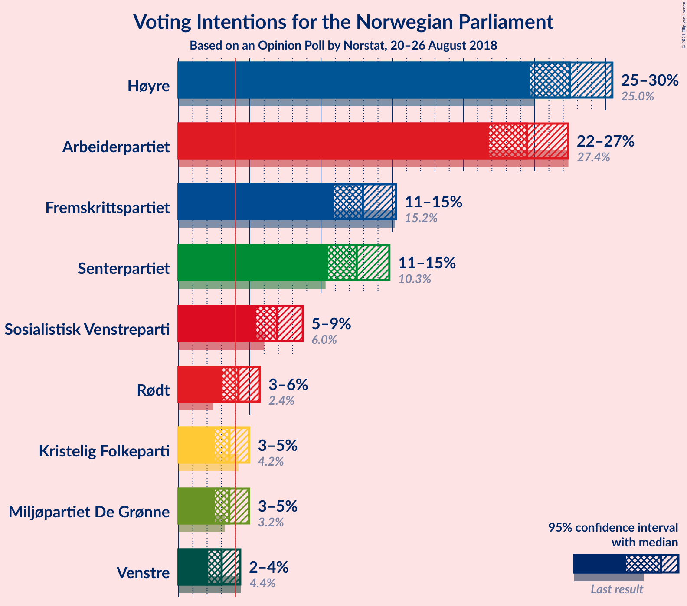
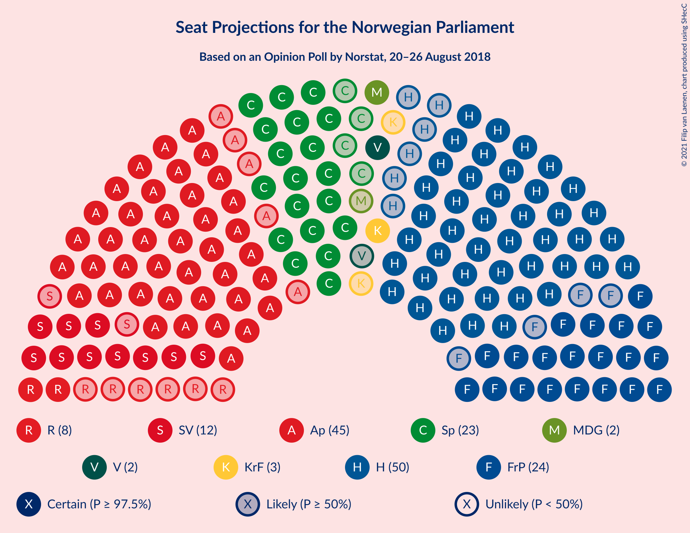
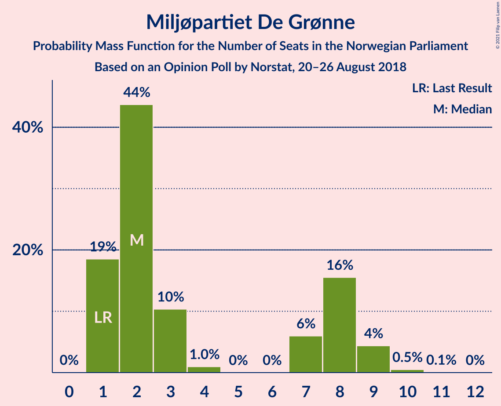
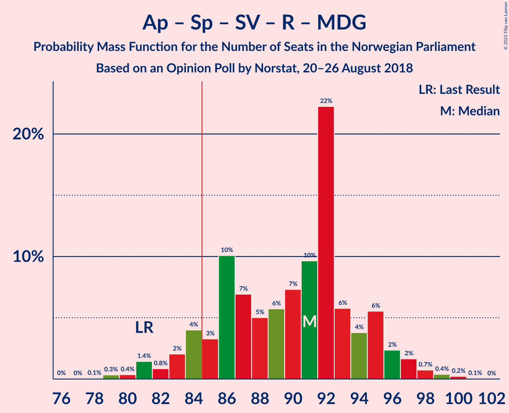
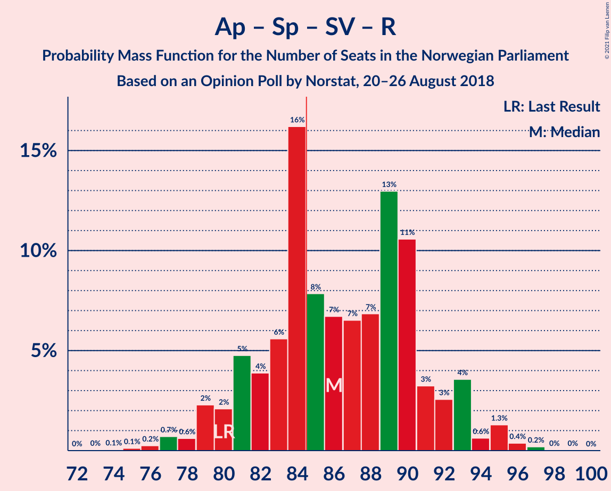
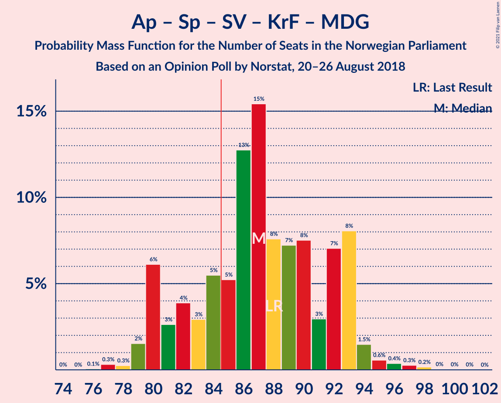
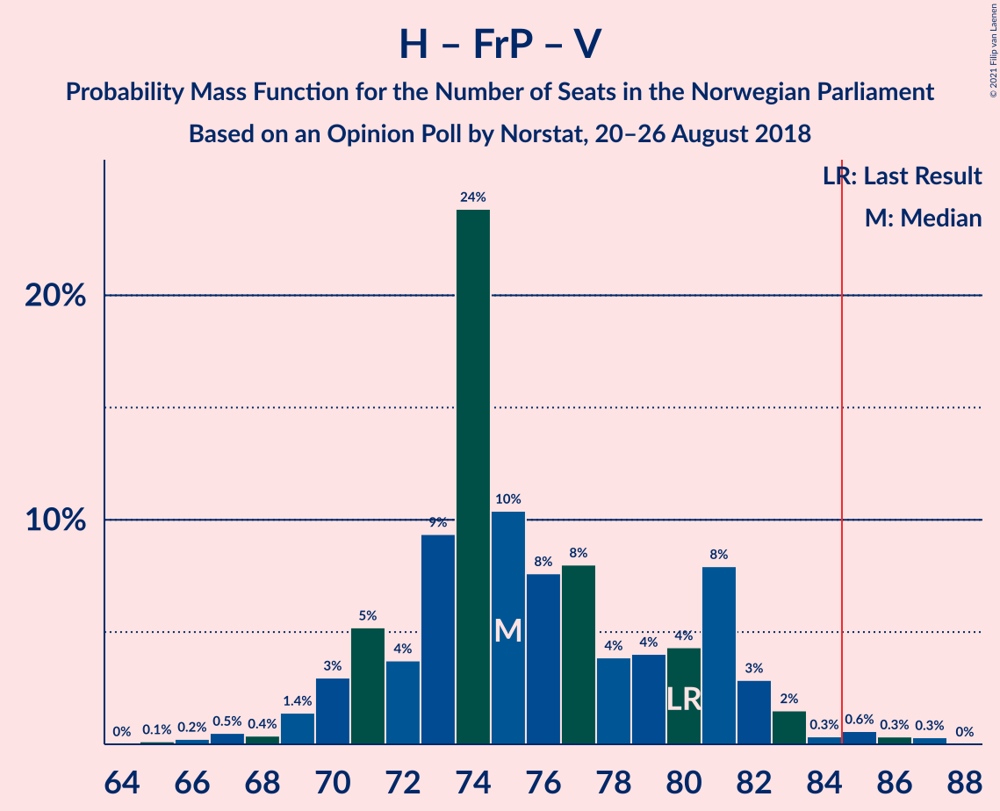
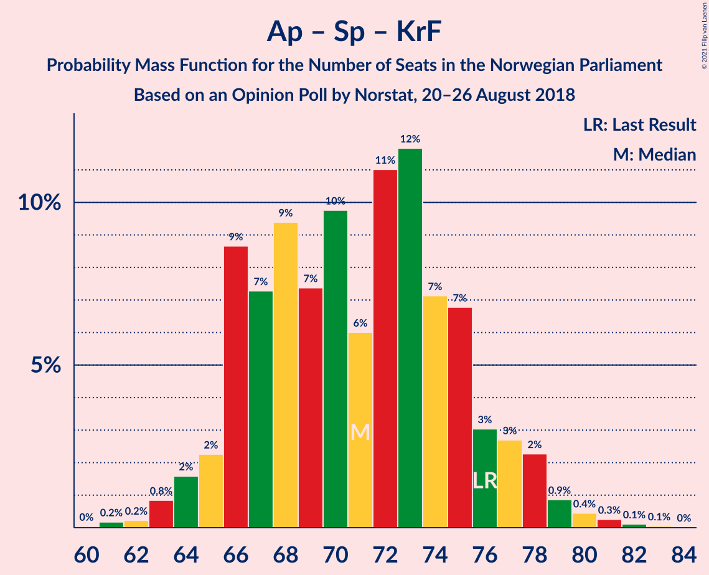

# Opinion Poll by Norstat, 20–26 August 2018

<a href="#voting-intentions">Voting Intentions</a> | <a href="#seats">Seats</a> | <a href="#coalitions">Coalitions</a> | <a href="#technical-information">Technical Information</a>

## Voting Intentions

### Confidence Intervals

| Party | Last Result | Poll Result | 80% Confidence Interval | 90% Confidence Interval | 95% Confidence Interval | 99% Confidence Interval |
|:-----:|:-----------:|:-----------:|:-----------------------:|:-----------------------:|:-----------------------:|:-----------------------:|
| Høyre | 25.0% | 27.5% | 25.7–29.4% |25.1–30.0% |24.7–30.5% |23.8–31.4% |
| Arbeiderpartiet | 27.4% | 24.5% | 22.7–26.3% |22.2–26.9% |21.8–27.3% |21.0–28.3% |
| Fremskrittspartiet | 15.2% | 12.9% | 11.6–14.4% |11.2–14.9% |10.9–15.3% |10.3–16.0% |
| Senterpartiet | 10.3% | 12.5% | 11.2–14.0% |10.8–14.4% |10.5–14.8% |9.9–15.5% |
| Sosialistisk Venstreparti | 6.0% | 6.9% | 5.9–8.1% |5.7–8.4% |5.4–8.7% |5.0–9.3% |
| Rødt | 2.4% | 4.2% | 3.5–5.2% |3.3–5.5% |3.1–5.7% |2.8–6.2% |
| Miljøpartiet De Grønne | 3.2% | 3.6% | 2.9–4.5% |2.7–4.7% |2.5–5.0% |2.3–5.4% |
| Kristelig Folkeparti | 4.2% | 3.6% | 2.9–4.5% |2.7–4.7% |2.5–5.0% |2.3–5.4% |
| Venstre | 4.4% | 3.0% | 2.4–3.9% |2.2–4.1% |2.1–4.3% |1.8–4.8% |

*Note:* The poll result column reflects the actual value used in the calculations. Published results may vary slightly, and in addition be rounded to fewer digits.

## Seats

### Confidence Intervals

| Party | Last Result | Median | 80% Confidence Interval | 90% Confidence Interval | 95% Confidence Interval | 99% Confidence Interval |
|:-----:|:-----------:|:------:|:-----------------------:|:-----------------------:|:-----------------------:|:-----------------------:|
| <a href="#høyre">Høyre</a> | 45 | 49 | 45–54 |45–55 |44–56 |42–57 |
| <a href="#arbeiderpartiet">Arbeiderpartiet</a> | 49 | 47 | 41–50 |40–50 |39–52 |38–52 |
| <a href="#fremskrittspartiet">Fremskrittspartiet</a> | 27 | 22 | 20–24 |19–25 |19–26 |17–29 |
| <a href="#senterpartiet">Senterpartiet</a> | 19 | 22 | 20–25 |19–27 |19–27 |18–28 |
| <a href="#sosialistisk-venstreparti">Sosialistisk Venstreparti</a> | 11 | 13 | 11–15 |10–16 |10–16 |9–17 |
| <a href="#rødt">Rødt</a> | 1 | 8 | 2–10 |2–11 |2–11 |2–11 |
| <a href="#miljøpartiet-de-grønne">Miljøpartiet De Grønne</a> | 1 | 2 | 1–8 |1–9 |1–9 |1–10 |
| <a href="#kristelig-folkeparti">Kristelig Folkeparti</a> | 8 | 3 | 1–7 |1–8 |0–8 |0–9 |
| <a href="#venstre">Venstre</a> | 8 | 2 | 1–2 |1–2 |1–7 |0–8 |

### Høyre

*For a full overview of the results for this party, see the [Høyre](party-høyre.html) page.*

| Number of Seats | Probability | Accumulated | Special Marks |
|:---------------:|:-----------:|:-----------:|:-------------:|
| 40 | 0.1% | 100% |  |
| 41 | 0.1% | 99.9% |  |
| 42 | 0.3% | 99.8% |  |
| 43 | 1.2% | 99.5% |  |
| 44 | 2% | 98% |  |
| 45 | 8% | 96% | Last Result |
| 46 | 7% | 88% |  |
| 47 | 3% | 80% |  |
| 48 | 18% | 78% |  |
| 49 | 13% | 60% | Median |
| 50 | 13% | 46% |  |
| 51 | 6% | 33% |  |
| 52 | 9% | 28% |  |
| 53 | 5% | 18% |  |
| 54 | 8% | 14% |  |
| 55 | 1.3% | 6% |  |
| 56 | 4% | 5% |  |
| 57 | 0.9% | 1.2% |  |
| 58 | 0.2% | 0.3% |  |
| 59 | 0.1% | 0.1% |  |
| 60 | 0% | 0% |  |

### Arbeiderpartiet

*For a full overview of the results for this party, see the [Arbeiderpartiet](party-arbeiderpartiet.html) page.*

| Number of Seats | Probability | Accumulated | Special Marks |
|:---------------:|:-----------:|:-----------:|:-------------:|
| 37 | 0.1% | 100% |  |
| 38 | 1.0% | 99.9% |  |
| 39 | 2% | 98.9% |  |
| 40 | 6% | 97% |  |
| 41 | 18% | 92% |  |
| 42 | 8% | 73% |  |
| 43 | 3% | 65% |  |
| 44 | 1.2% | 63% |  |
| 45 | 4% | 61% |  |
| 46 | 4% | 57% |  |
| 47 | 12% | 53% | Median |
| 48 | 13% | 41% |  |
| 49 | 11% | 28% | Last Result |
| 50 | 13% | 18% |  |
| 51 | 2% | 5% |  |
| 52 | 3% | 3% |  |
| 53 | 0.1% | 0.1% |  |
| 54 | 0.1% | 0.1% |  |
| 55 | 0% | 0% |  |

### Fremskrittspartiet

*For a full overview of the results for this party, see the [Fremskrittspartiet](party-fremskrittspartiet.html) page.*

| Number of Seats | Probability | Accumulated | Special Marks |
|:---------------:|:-----------:|:-----------:|:-------------:|
| 16 | 0.1% | 100% |  |
| 17 | 0.5% | 99.9% |  |
| 18 | 2% | 99.4% |  |
| 19 | 3% | 98% |  |
| 20 | 15% | 95% |  |
| 21 | 28% | 79% |  |
| 22 | 19% | 51% | Median |
| 23 | 15% | 33% |  |
| 24 | 10% | 17% |  |
| 25 | 3% | 7% |  |
| 26 | 2% | 4% |  |
| 27 | 0.7% | 2% | Last Result |
| 28 | 0.7% | 1.3% |  |
| 29 | 0.3% | 0.7% |  |
| 30 | 0.1% | 0.4% |  |
| 31 | 0.3% | 0.4% |  |
| 32 | 0% | 0% |  |

### Senterpartiet

*For a full overview of the results for this party, see the [Senterpartiet](party-senterpartiet.html) page.*

| Number of Seats | Probability | Accumulated | Special Marks |
|:---------------:|:-----------:|:-----------:|:-------------:|
| 17 | 0.2% | 100% |  |
| 18 | 1.1% | 99.8% |  |
| 19 | 6% | 98.7% | Last Result |
| 20 | 14% | 92% |  |
| 21 | 24% | 78% |  |
| 22 | 7% | 54% | Median |
| 23 | 8% | 47% |  |
| 24 | 17% | 39% |  |
| 25 | 13% | 22% |  |
| 26 | 3% | 9% |  |
| 27 | 3% | 5% |  |
| 28 | 2% | 2% |  |
| 29 | 0.1% | 0.2% |  |
| 30 | 0.1% | 0.1% |  |
| 31 | 0% | 0% |  |

### Sosialistisk Venstreparti

*For a full overview of the results for this party, see the [Sosialistisk Venstreparti](party-sosialistiskvenstreparti.html) page.*

| Number of Seats | Probability | Accumulated | Special Marks |
|:---------------:|:-----------:|:-----------:|:-------------:|
| 8 | 0% | 100% |  |
| 9 | 0.9% | 99.9% |  |
| 10 | 8% | 99.0% |  |
| 11 | 17% | 91% | Last Result |
| 12 | 21% | 74% |  |
| 13 | 15% | 52% | Median |
| 14 | 18% | 37% |  |
| 15 | 13% | 19% |  |
| 16 | 5% | 6% |  |
| 17 | 2% | 2% |  |
| 18 | 0.2% | 0.3% |  |
| 19 | 0.1% | 0.1% |  |
| 20 | 0% | 0% |  |

### Rødt

*For a full overview of the results for this party, see the [Rødt](party-rødt.html) page.*

| Number of Seats | Probability | Accumulated | Special Marks |
|:---------------:|:-----------:|:-----------:|:-------------:|
| 1 | 0.4% | 100% | Last Result |
| 2 | 10% | 99.6% |  |
| 3 | 0% | 90% |  |
| 4 | 0% | 90% |  |
| 5 | 0% | 90% |  |
| 6 | 0% | 90% |  |
| 7 | 12% | 90% |  |
| 8 | 29% | 78% | Median |
| 9 | 25% | 50% |  |
| 10 | 18% | 24% |  |
| 11 | 6% | 6% |  |
| 12 | 0.3% | 0.4% |  |
| 13 | 0% | 0% |  |

### Miljøpartiet De Grønne

*For a full overview of the results for this party, see the [Miljøpartiet De Grønne](party-miljøpartietdegrønne.html) page.*

| Number of Seats | Probability | Accumulated | Special Marks |
|:---------------:|:-----------:|:-----------:|:-------------:|
| 1 | 25% | 100% | Last Result |
| 2 | 41% | 75% | Median |
| 3 | 3% | 34% |  |
| 4 | 0% | 31% |  |
| 5 | 0% | 31% |  |
| 6 | 0% | 31% |  |
| 7 | 7% | 31% |  |
| 8 | 16% | 25% |  |
| 9 | 7% | 9% |  |
| 10 | 1.0% | 1.2% |  |
| 11 | 0.2% | 0.2% |  |
| 12 | 0% | 0% |  |

### Kristelig Folkeparti

*For a full overview of the results for this party, see the [Kristelig Folkeparti](party-kristeligfolkeparti.html) page.*

| Number of Seats | Probability | Accumulated | Special Marks |
|:---------------:|:-----------:|:-----------:|:-------------:|
| 0 | 3% | 100% |  |
| 1 | 23% | 97% |  |
| 2 | 10% | 75% |  |
| 3 | 52% | 65% | Median |
| 4 | 0% | 12% |  |
| 5 | 0% | 12% |  |
| 6 | 0% | 12% |  |
| 7 | 5% | 12% |  |
| 8 | 7% | 8% | Last Result |
| 9 | 0.8% | 1.0% |  |
| 10 | 0.2% | 0.2% |  |
| 11 | 0% | 0% |  |

### Venstre

*For a full overview of the results for this party, see the [Venstre](party-venstre.html) page.*

| Number of Seats | Probability | Accumulated | Special Marks |
|:---------------:|:-----------:|:-----------:|:-------------:|
| 0 | 1.2% | 100% |  |
| 1 | 10% | 98.8% |  |
| 2 | 86% | 89% | Median |
| 3 | 0.2% | 3% |  |
| 4 | 0% | 3% |  |
| 5 | 0% | 3% |  |
| 6 | 0% | 3% |  |
| 7 | 1.1% | 3% |  |
| 8 | 1.3% | 1.5% | Last Result |
| 9 | 0.2% | 0.2% |  |
| 10 | 0% | 0% |  |

## Coalitions

### Confidence Intervals

| Coalition | Last Result | Median | Majority? | 80% Confidence Interval | 90% Confidence Interval | 95% Confidence Interval | 99% Confidence Interval |
|:---------:|:-----------:|:------:|:---------:|:-----------------------:|:-----------------------:|:-----------------------:|:-----------------------:|
| Høyre – Fremskrittspartiet – Senterpartiet – Kristelig Folkeparti – Venstre | 107 | 99 | 100% | 94–104 | 92–105 | 92–107 | 89–111 |
| Arbeiderpartiet – Senterpartiet – Sosialistisk Venstreparti – Rødt – Miljøpartiet De Grønne | 81 | 93 | 98% | 88–97 | 85–97 | 85–98 | 81–100 |
| Arbeiderpartiet – Senterpartiet – Sosialistisk Venstreparti – Rødt | 80 | 89 | 85% | 83–94 | 81–95 | 81–95 | 78–97 |
| Arbeiderpartiet – Senterpartiet – Sosialistisk Venstreparti – Kristelig Folkeparti – Miljøpartiet De Grønne | 88 | 88 | 80% | 81–92 | 80–93 | 80–95 | 79–97 |
| Arbeiderpartiet – Senterpartiet – Sosialistisk Venstreparti – Miljøpartiet De Grønne | 80 | 84 | 50% | 80–89 | 77–91 | 77–91 | 75–94 |
| Arbeiderpartiet – Senterpartiet – Sosialistisk Venstreparti | 79 | 80 | 28% | 75–86 | 74–88 | 74–88 | 72–91 |
| Høyre – Fremskrittspartiet – Kristelig Folkeparti – Miljøpartiet De Grønne – Venstre | 89 | 80 | 15% | 75–86 | 74–88 | 74–88 | 72–91 |
| Høyre – Fremskrittspartiet – Kristelig Folkeparti – Venstre | 88 | 76 | 2% | 72–81 | 72–84 | 71–84 | 69–88 |
| Høyre – Fremskrittspartiet – Venstre | 80 | 73 | 0.4% | 70–78 | 69–81 | 67–81 | 66–84 |
| Arbeiderpartiet – Senterpartiet – Kristelig Folkeparti – Miljøpartiet De Grønne | 77 | 76 | 0.5% | 70–79 | 66–80 | 66–81 | 63–84 |
| Høyre – Fremskrittspartiet | 72 | 71 | 0% | 68–76 | 66–79 | 65–79 | 64–81 |
| Arbeiderpartiet – Senterpartiet – Kristelig Folkeparti | 76 | 72 | 0% | 64–76 | 64–77 | 63–78 | 62–80 |
| Arbeiderpartiet – Senterpartiet | 68 | 69 | 0% | 61–73 | 61–75 | 61–75 | 60–76 |
| Arbeiderpartiet – Sosialistisk Venstreparti | 60 | 58 | 0% | 55–63 | 53–65 | 52–65 | 51–66 |
| Høyre – Kristelig Folkeparti – Venstre | 61 | 54 | 0% | 50–59 | 49–61 | 49–61 | 47–64 |
| Senterpartiet – Kristelig Folkeparti – Venstre | 35 | 27 | 0% | 24–32 | 23–33 | 23–34 | 21–37 |

### Høyre – Fremskrittspartiet – Senterpartiet – Kristelig Folkeparti – Venstre

| Number of Seats | Probability | Accumulated | Special Marks |
|:---------------:|:-----------:|:-----------:|:-------------:|
| 89 | 0.5% | 100% |  |
| 90 | 0.4% | 99.5% |  |
| 91 | 0.2% | 99.1% |  |
| 92 | 4% | 98.9% |  |
| 93 | 0.3% | 95% |  |
| 94 | 5% | 94% |  |
| 95 | 1.3% | 89% |  |
| 96 | 7% | 88% |  |
| 97 | 17% | 81% |  |
| 98 | 9% | 64% | Median |
| 99 | 15% | 54% |  |
| 100 | 14% | 39% |  |
| 101 | 5% | 25% |  |
| 102 | 7% | 20% |  |
| 103 | 1.5% | 12% |  |
| 104 | 5% | 11% |  |
| 105 | 3% | 6% |  |
| 106 | 0.5% | 3% |  |
| 107 | 1.2% | 3% | Last Result |
| 108 | 0.3% | 2% |  |
| 109 | 0.2% | 1.2% |  |
| 110 | 0.2% | 1.1% |  |
| 111 | 0.5% | 0.9% |  |
| 112 | 0.1% | 0.4% |  |
| 113 | 0.2% | 0.3% |  |
| 114 | 0.1% | 0.1% |  |
| 115 | 0% | 0.1% |  |
| 116 | 0% | 0% |  |

### Arbeiderpartiet – Senterpartiet – Sosialistisk Venstreparti – Rødt – Miljøpartiet De Grønne

| Number of Seats | Probability | Accumulated | Special Marks |
|:---------------:|:-----------:|:-----------:|:-------------:|
| 76 | 0% | 100% |  |
| 77 | 0.1% | 99.9% |  |
| 78 | 0% | 99.8% |  |
| 79 | 0.1% | 99.8% |  |
| 80 | 0.1% | 99.7% |  |
| 81 | 0.4% | 99.6% | Last Result |
| 82 | 0.3% | 99.2% |  |
| 83 | 0.2% | 98.9% |  |
| 84 | 0.5% | 98.7% |  |
| 85 | 3% | 98% | Majority |
| 86 | 0.5% | 95% |  |
| 87 | 3% | 94% |  |
| 88 | 2% | 92% |  |
| 89 | 4% | 90% |  |
| 90 | 14% | 86% |  |
| 91 | 7% | 72% |  |
| 92 | 5% | 65% | Median |
| 93 | 18% | 60% |  |
| 94 | 8% | 42% |  |
| 95 | 11% | 34% |  |
| 96 | 13% | 23% |  |
| 97 | 7% | 10% |  |
| 98 | 1.2% | 3% |  |
| 99 | 0.7% | 2% |  |
| 100 | 0.9% | 1.2% |  |
| 101 | 0.2% | 0.3% |  |
| 102 | 0% | 0.1% |  |
| 103 | 0% | 0% |  |

### Arbeiderpartiet – Senterpartiet – Sosialistisk Venstreparti – Rødt

| Number of Seats | Probability | Accumulated | Special Marks |
|:---------------:|:-----------:|:-----------:|:-------------:|
| 73 | 0% | 100% |  |
| 74 | 0% | 99.9% |  |
| 75 | 0.1% | 99.9% |  |
| 76 | 0.2% | 99.8% |  |
| 77 | 0.1% | 99.7% |  |
| 78 | 0.2% | 99.5% |  |
| 79 | 0.5% | 99.4% |  |
| 80 | 0.6% | 98.9% | Last Result |
| 81 | 6% | 98% |  |
| 82 | 2% | 92% |  |
| 83 | 4% | 91% |  |
| 84 | 2% | 87% |  |
| 85 | 8% | 85% | Majority |
| 86 | 6% | 77% |  |
| 87 | 5% | 72% |  |
| 88 | 4% | 67% |  |
| 89 | 17% | 63% |  |
| 90 | 7% | 46% | Median |
| 91 | 11% | 39% |  |
| 92 | 5% | 29% |  |
| 93 | 10% | 24% |  |
| 94 | 4% | 14% |  |
| 95 | 8% | 9% |  |
| 96 | 0.1% | 1.3% |  |
| 97 | 1.1% | 1.3% |  |
| 98 | 0.1% | 0.2% |  |
| 99 | 0.1% | 0.1% |  |
| 100 | 0% | 0% |  |

### Arbeiderpartiet – Senterpartiet – Sosialistisk Venstreparti – Kristelig Folkeparti – Miljøpartiet De Grønne

| Number of Seats | Probability | Accumulated | Special Marks |
|:---------------:|:-----------:|:-----------:|:-------------:|
| 76 | 0% | 100% |  |
| 77 | 0.3% | 99.9% |  |
| 78 | 0% | 99.6% |  |
| 79 | 1.4% | 99.6% |  |
| 80 | 3% | 98% |  |
| 81 | 9% | 95% |  |
| 82 | 1.3% | 86% |  |
| 83 | 0.7% | 84% |  |
| 84 | 4% | 84% |  |
| 85 | 2% | 80% | Majority |
| 86 | 15% | 77% |  |
| 87 | 8% | 63% | Median |
| 88 | 7% | 55% | Last Result |
| 89 | 11% | 47% |  |
| 90 | 18% | 36% |  |
| 91 | 5% | 18% |  |
| 92 | 7% | 13% |  |
| 93 | 2% | 6% |  |
| 94 | 1.4% | 4% |  |
| 95 | 1.3% | 3% |  |
| 96 | 0.5% | 1.2% |  |
| 97 | 0.5% | 0.7% |  |
| 98 | 0% | 0.2% |  |
| 99 | 0.1% | 0.2% |  |
| 100 | 0% | 0.1% |  |
| 101 | 0% | 0% |  |

### Arbeiderpartiet – Senterpartiet – Sosialistisk Venstreparti – Miljøpartiet De Grønne

| Number of Seats | Probability | Accumulated | Special Marks |
|:---------------:|:-----------:|:-----------:|:-------------:|
| 73 | 0.2% | 100% |  |
| 74 | 0.2% | 99.8% |  |
| 75 | 0.2% | 99.6% |  |
| 76 | 0.5% | 99.3% |  |
| 77 | 4% | 98.8% |  |
| 78 | 0.8% | 95% |  |
| 79 | 3% | 94% |  |
| 80 | 8% | 91% | Last Result |
| 81 | 4% | 83% |  |
| 82 | 8% | 80% |  |
| 83 | 14% | 72% |  |
| 84 | 8% | 58% | Median |
| 85 | 4% | 50% | Majority |
| 86 | 8% | 46% |  |
| 87 | 18% | 38% |  |
| 88 | 9% | 20% |  |
| 89 | 3% | 11% |  |
| 90 | 2% | 8% |  |
| 91 | 3% | 6% |  |
| 92 | 0.7% | 2% |  |
| 93 | 0.7% | 2% |  |
| 94 | 0.4% | 0.8% |  |
| 95 | 0.1% | 0.4% |  |
| 96 | 0.2% | 0.3% |  |
| 97 | 0% | 0.1% |  |
| 98 | 0% | 0% |  |

### Arbeiderpartiet – Senterpartiet – Sosialistisk Venstreparti

| Number of Seats | Probability | Accumulated | Special Marks |
|:---------------:|:-----------:|:-----------:|:-------------:|
| 70 | 0.1% | 100% |  |
| 71 | 0.3% | 99.9% |  |
| 72 | 0.5% | 99.5% |  |
| 73 | 0.3% | 99.1% |  |
| 74 | 7% | 98.8% |  |
| 75 | 9% | 92% |  |
| 76 | 2% | 83% |  |
| 77 | 3% | 81% |  |
| 78 | 4% | 78% |  |
| 79 | 16% | 75% | Last Result |
| 80 | 11% | 59% |  |
| 81 | 3% | 48% |  |
| 82 | 10% | 45% | Median |
| 83 | 4% | 36% |  |
| 84 | 3% | 32% |  |
| 85 | 16% | 28% | Majority |
| 86 | 2% | 12% |  |
| 87 | 5% | 10% |  |
| 88 | 4% | 5% |  |
| 89 | 0.5% | 1.4% |  |
| 90 | 0.1% | 0.8% |  |
| 91 | 0.4% | 0.7% |  |
| 92 | 0.3% | 0.3% |  |
| 93 | 0% | 0% |  |

### Høyre – Fremskrittspartiet – Kristelig Folkeparti – Miljøpartiet De Grønne – Venstre

| Number of Seats | Probability | Accumulated | Special Marks |
|:---------------:|:-----------:|:-----------:|:-------------:|
| 70 | 0.1% | 100% |  |
| 71 | 0.1% | 99.9% |  |
| 72 | 1.1% | 99.8% |  |
| 73 | 0.1% | 98.7% |  |
| 74 | 8% | 98.7% |  |
| 75 | 4% | 91% |  |
| 76 | 10% | 86% |  |
| 77 | 5% | 76% |  |
| 78 | 11% | 71% | Median |
| 79 | 7% | 61% |  |
| 80 | 17% | 54% |  |
| 81 | 4% | 37% |  |
| 82 | 5% | 33% |  |
| 83 | 6% | 28% |  |
| 84 | 8% | 23% |  |
| 85 | 2% | 15% | Majority |
| 86 | 4% | 13% |  |
| 87 | 2% | 9% |  |
| 88 | 6% | 8% |  |
| 89 | 0.6% | 2% | Last Result |
| 90 | 0.5% | 1.1% |  |
| 91 | 0.2% | 0.6% |  |
| 92 | 0.1% | 0.5% |  |
| 93 | 0.2% | 0.3% |  |
| 94 | 0.1% | 0.2% |  |
| 95 | 0% | 0.1% |  |
| 96 | 0% | 0.1% |  |
| 97 | 0% | 0% |  |

### Høyre – Fremskrittspartiet – Kristelig Folkeparti – Venstre

| Number of Seats | Probability | Accumulated | Special Marks |
|:---------------:|:-----------:|:-----------:|:-------------:|
| 67 | 0% | 100% |  |
| 68 | 0.2% | 99.9% |  |
| 69 | 0.9% | 99.7% |  |
| 70 | 0.7% | 98.8% |  |
| 71 | 1.2% | 98% |  |
| 72 | 7% | 97% |  |
| 73 | 13% | 90% |  |
| 74 | 11% | 77% |  |
| 75 | 8% | 66% |  |
| 76 | 18% | 58% | Median |
| 77 | 5% | 40% |  |
| 78 | 7% | 35% |  |
| 79 | 14% | 28% |  |
| 80 | 4% | 14% |  |
| 81 | 2% | 10% |  |
| 82 | 3% | 8% |  |
| 83 | 0.5% | 6% |  |
| 84 | 3% | 5% |  |
| 85 | 0.5% | 2% | Majority |
| 86 | 0.2% | 1.3% |  |
| 87 | 0.3% | 1.1% |  |
| 88 | 0.4% | 0.8% | Last Result |
| 89 | 0.1% | 0.4% |  |
| 90 | 0.1% | 0.3% |  |
| 91 | 0% | 0.2% |  |
| 92 | 0.1% | 0.2% |  |
| 93 | 0% | 0.1% |  |
| 94 | 0% | 0% |  |

### Høyre – Fremskrittspartiet – Venstre

| Number of Seats | Probability | Accumulated | Special Marks |
|:---------------:|:-----------:|:-----------:|:-------------:|
| 62 | 0.1% | 100% |  |
| 63 | 0% | 99.9% |  |
| 64 | 0% | 99.9% |  |
| 65 | 0.2% | 99.9% |  |
| 66 | 0.7% | 99.7% |  |
| 67 | 2% | 99.0% |  |
| 68 | 1.3% | 97% |  |
| 69 | 3% | 96% |  |
| 70 | 10% | 93% |  |
| 71 | 21% | 83% |  |
| 72 | 10% | 62% |  |
| 73 | 14% | 51% | Median |
| 74 | 3% | 38% |  |
| 75 | 7% | 34% |  |
| 76 | 8% | 28% |  |
| 77 | 2% | 20% |  |
| 78 | 8% | 18% |  |
| 79 | 2% | 10% |  |
| 80 | 2% | 8% | Last Result |
| 81 | 4% | 5% |  |
| 82 | 0.6% | 1.4% |  |
| 83 | 0.2% | 0.8% |  |
| 84 | 0.2% | 0.6% |  |
| 85 | 0.3% | 0.4% | Majority |
| 86 | 0% | 0.1% |  |
| 87 | 0% | 0.1% |  |
| 88 | 0% | 0% |  |

### Arbeiderpartiet – Senterpartiet – Kristelig Folkeparti – Miljøpartiet De Grønne

| Number of Seats | Probability | Accumulated | Special Marks |
|:---------------:|:-----------:|:-----------:|:-------------:|
| 63 | 0.7% | 100% |  |
| 64 | 0.4% | 99.2% |  |
| 65 | 0.8% | 98.9% |  |
| 66 | 3% | 98% |  |
| 67 | 2% | 95% |  |
| 68 | 0.8% | 93% |  |
| 69 | 1.0% | 92% |  |
| 70 | 7% | 91% |  |
| 71 | 2% | 83% |  |
| 72 | 8% | 82% |  |
| 73 | 9% | 74% |  |
| 74 | 6% | 65% | Median |
| 75 | 8% | 59% |  |
| 76 | 20% | 51% |  |
| 77 | 4% | 31% | Last Result |
| 78 | 10% | 27% |  |
| 79 | 9% | 16% |  |
| 80 | 4% | 7% |  |
| 81 | 1.4% | 3% |  |
| 82 | 0.6% | 2% |  |
| 83 | 0.5% | 1.3% |  |
| 84 | 0.4% | 0.8% |  |
| 85 | 0.2% | 0.5% | Majority |
| 86 | 0% | 0.2% |  |
| 87 | 0.1% | 0.2% |  |
| 88 | 0% | 0% |  |

### Høyre – Fremskrittspartiet

| Number of Seats | Probability | Accumulated | Special Marks |
|:---------------:|:-----------:|:-----------:|:-------------:|
| 60 | 0.1% | 100% |  |
| 61 | 0% | 99.9% |  |
| 62 | 0% | 99.9% |  |
| 63 | 0.3% | 99.9% |  |
| 64 | 1.2% | 99.6% |  |
| 65 | 2% | 98% |  |
| 66 | 2% | 96% |  |
| 67 | 3% | 95% |  |
| 68 | 5% | 91% |  |
| 69 | 24% | 86% |  |
| 70 | 10% | 62% |  |
| 71 | 15% | 52% | Median |
| 72 | 2% | 37% | Last Result |
| 73 | 8% | 35% |  |
| 74 | 8% | 27% |  |
| 75 | 2% | 19% |  |
| 76 | 8% | 17% |  |
| 77 | 2% | 9% |  |
| 78 | 2% | 7% |  |
| 79 | 4% | 5% |  |
| 80 | 0.2% | 1.0% |  |
| 81 | 0.3% | 0.7% |  |
| 82 | 0.1% | 0.5% |  |
| 83 | 0.3% | 0.3% |  |
| 84 | 0% | 0.1% |  |
| 85 | 0% | 0% | Majority |

### Arbeiderpartiet – Senterpartiet – Kristelig Folkeparti

| Number of Seats | Probability | Accumulated | Special Marks |
|:---------------:|:-----------:|:-----------:|:-------------:|
| 60 | 0.1% | 100% |  |
| 61 | 0.4% | 99.9% |  |
| 62 | 1.1% | 99.5% |  |
| 63 | 1.4% | 98% |  |
| 64 | 13% | 97% |  |
| 65 | 4% | 84% |  |
| 66 | 2% | 80% |  |
| 67 | 1.4% | 78% |  |
| 68 | 6% | 76% |  |
| 69 | 9% | 70% |  |
| 70 | 3% | 62% |  |
| 71 | 7% | 59% |  |
| 72 | 7% | 52% | Median |
| 73 | 7% | 44% |  |
| 74 | 8% | 37% |  |
| 75 | 9% | 29% |  |
| 76 | 14% | 20% | Last Result |
| 77 | 2% | 6% |  |
| 78 | 3% | 4% |  |
| 79 | 0.1% | 0.9% |  |
| 80 | 0.6% | 0.9% |  |
| 81 | 0.1% | 0.3% |  |
| 82 | 0% | 0.1% |  |
| 83 | 0.1% | 0.1% |  |
| 84 | 0% | 0% |  |

### Arbeiderpartiet – Senterpartiet

| Number of Seats | Probability | Accumulated | Special Marks |
|:---------------:|:-----------:|:-----------:|:-------------:|
| 57 | 0% | 100% |  |
| 58 | 0.1% | 99.9% |  |
| 59 | 0.4% | 99.9% |  |
| 60 | 2% | 99.5% |  |
| 61 | 13% | 98% |  |
| 62 | 2% | 85% |  |
| 63 | 4% | 83% |  |
| 64 | 4% | 79% |  |
| 65 | 9% | 75% |  |
| 66 | 3% | 66% |  |
| 67 | 4% | 64% |  |
| 68 | 9% | 59% | Last Result |
| 69 | 3% | 51% | Median |
| 70 | 12% | 47% |  |
| 71 | 9% | 36% |  |
| 72 | 5% | 27% |  |
| 73 | 13% | 21% |  |
| 74 | 2% | 8% |  |
| 75 | 5% | 6% |  |
| 76 | 0.5% | 0.6% |  |
| 77 | 0.1% | 0.1% |  |
| 78 | 0% | 0% |  |

### Arbeiderpartiet – Sosialistisk Venstreparti

| Number of Seats | Probability | Accumulated | Special Marks |
|:---------------:|:-----------:|:-----------:|:-------------:|
| 48 | 0.1% | 100% |  |
| 49 | 0.1% | 99.9% |  |
| 50 | 0.2% | 99.8% |  |
| 51 | 0.5% | 99.5% |  |
| 52 | 2% | 99.1% |  |
| 53 | 2% | 97% |  |
| 54 | 5% | 95% |  |
| 55 | 20% | 90% |  |
| 56 | 8% | 70% |  |
| 57 | 1.4% | 62% |  |
| 58 | 13% | 61% |  |
| 59 | 4% | 47% |  |
| 60 | 16% | 43% | Last Result, Median |
| 61 | 11% | 27% |  |
| 62 | 2% | 16% |  |
| 63 | 4% | 13% |  |
| 64 | 4% | 10% |  |
| 65 | 4% | 5% |  |
| 66 | 0.6% | 1.0% |  |
| 67 | 0.1% | 0.4% |  |
| 68 | 0% | 0.3% |  |
| 69 | 0.3% | 0.3% |  |
| 70 | 0% | 0% |  |

### Høyre – Kristelig Folkeparti – Venstre

| Number of Seats | Probability | Accumulated | Special Marks |
|:---------------:|:-----------:|:-----------:|:-------------:|
| 45 | 0.1% | 100% |  |
| 46 | 0.3% | 99.9% |  |
| 47 | 1.1% | 99.6% |  |
| 48 | 0.6% | 98.5% |  |
| 49 | 6% | 98% |  |
| 50 | 5% | 92% |  |
| 51 | 9% | 87% |  |
| 52 | 5% | 79% |  |
| 53 | 9% | 74% |  |
| 54 | 17% | 65% | Median |
| 55 | 13% | 48% |  |
| 56 | 3% | 35% |  |
| 57 | 19% | 33% |  |
| 58 | 3% | 14% |  |
| 59 | 2% | 10% |  |
| 60 | 2% | 8% |  |
| 61 | 5% | 6% | Last Result |
| 62 | 0.2% | 1.2% |  |
| 63 | 0.4% | 1.0% |  |
| 64 | 0.3% | 0.6% |  |
| 65 | 0.2% | 0.3% |  |
| 66 | 0% | 0.1% |  |
| 67 | 0% | 0.1% |  |
| 68 | 0% | 0% |  |

### Senterpartiet – Kristelig Folkeparti – Venstre

| Number of Seats | Probability | Accumulated | Special Marks |
|:---------------:|:-----------:|:-----------:|:-------------:|
| 20 | 0% | 100% |  |
| 21 | 0.5% | 99.9% |  |
| 22 | 0.4% | 99.5% |  |
| 23 | 5% | 99.1% |  |
| 24 | 15% | 94% |  |
| 25 | 16% | 79% |  |
| 26 | 11% | 63% |  |
| 27 | 6% | 52% | Median |
| 28 | 7% | 47% |  |
| 29 | 10% | 40% |  |
| 30 | 13% | 29% |  |
| 31 | 4% | 16% |  |
| 32 | 4% | 12% |  |
| 33 | 6% | 8% |  |
| 34 | 0.5% | 3% |  |
| 35 | 0.3% | 2% | Last Result |
| 36 | 0.8% | 2% |  |
| 37 | 0.7% | 1.0% |  |
| 38 | 0.2% | 0.3% |  |
| 39 | 0% | 0.1% |  |
| 40 | 0% | 0% |  |

## Technical Information

### Opinion Poll

+ **Polling firm:** Norstat
+ **Commissioner(s):** —
+ **Fieldwork period:** 20–26 August 2018

### Calculations

+ **Sample size:** 928
+ **Simulations done:** 131,072
+ **Error estimate:** 2.15%

