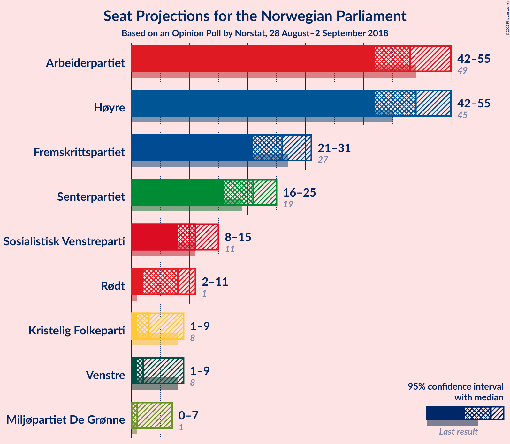
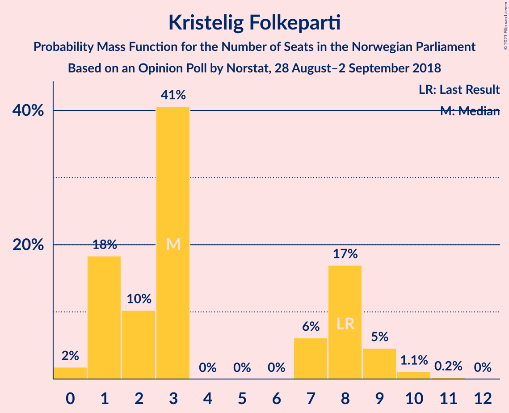
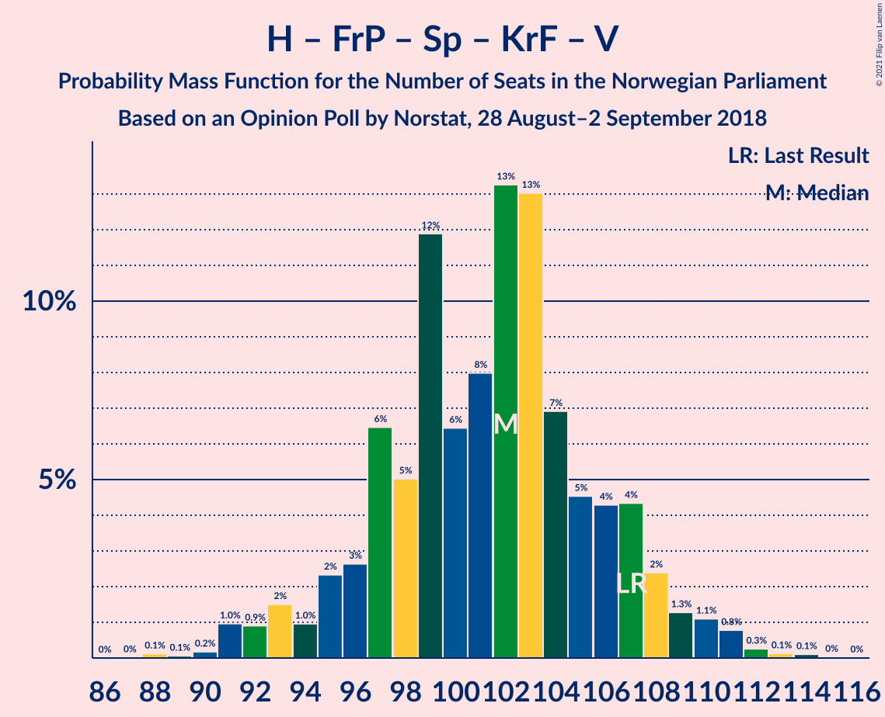
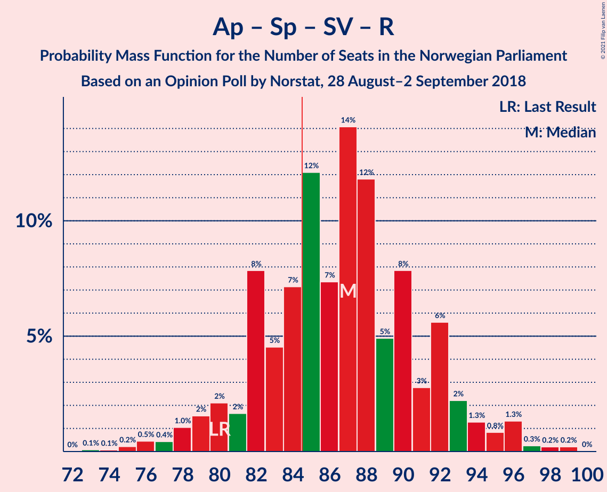
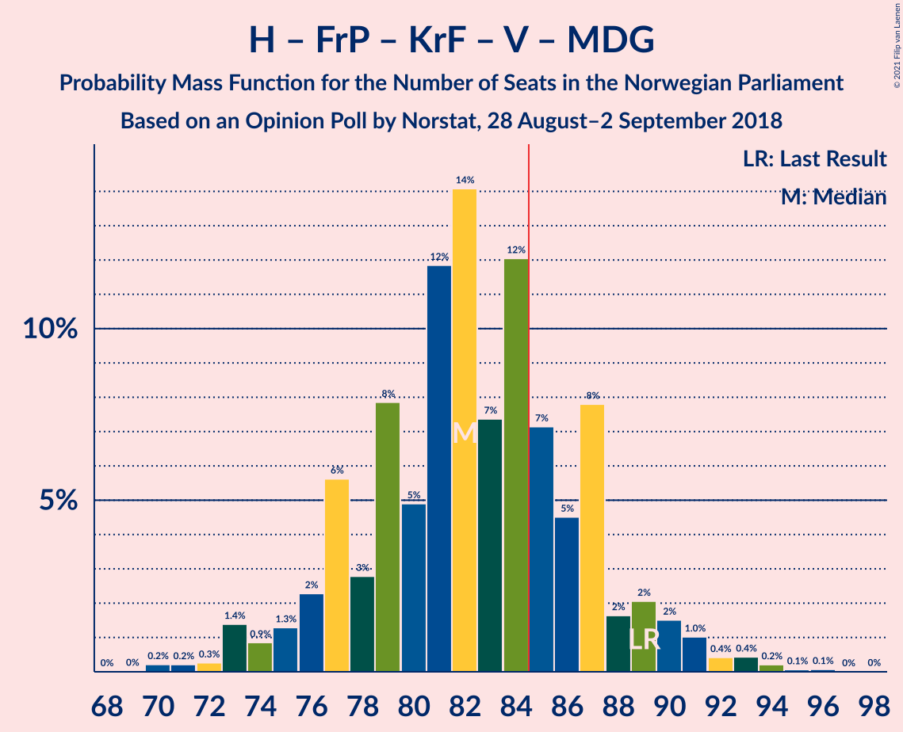

# Opinion Poll by Norstat, 28 August–2 September 2018

<a href="#voting-intentions">Voting Intentions</a> | <a href="#seats">Seats</a> | <a href="#coalitions">Coalitions</a> | <a href="#technical-information">Technical Information</a>

## Voting Intentions

### Confidence Intervals

| Party | Last Result | Poll Result | 80% Confidence Interval | 90% Confidence Interval | 95% Confidence Interval | 99% Confidence Interval |
|:-----:|:-----------:|:-----------:|:-----------------------:|:-----------------------:|:-----------------------:|:-----------------------:|
| Høyre | 25.0% | 26.5% | 24.5–28.7% |23.9–29.3% |23.4–29.8% |22.5–30.9% |
| Arbeiderpartiet | 27.4% | 26.2% | 24.2–28.4% |23.6–29.0% |23.1–29.6% |22.2–30.6% |
| Fremskrittspartiet | 15.2% | 13.9% | 12.3–15.7% |11.9–16.2% |11.5–16.6% |10.8–17.5% |
| Senterpartiet | 10.3% | 11.2% | 9.8–12.9% |9.5–13.4% |9.1–13.8% |8.5–14.6% |
| Sosialistisk Venstreparti | 6.0% | 6.0% | 5.0–7.3% |4.7–7.6% |4.5–7.9% |4.0–8.6% |
| Rødt | 2.4% | 4.4% | 3.6–5.6% |3.4–5.9% |3.2–6.2% |2.8–6.8% |
| Kristelig Folkeparti | 4.2% | 3.5% | 2.7–4.5% |2.5–4.8% |2.4–5.1% |2.0–5.6% |
| Venstre | 4.4% | 3.3% | 2.6–4.4% |2.4–4.6% |2.2–4.9% |2.0–5.5% |
| Miljøpartiet De Grønne | 3.2% | 2.8% | 2.1–3.7% |2.0–4.0% |1.8–4.3% |1.5–4.8% |

*Note:* The poll result column reflects the actual value used in the calculations. Published results may vary slightly, and in addition be rounded to fewer digits.

## Seats

### Confidence Intervals

| Party | Last Result | Median | 80% Confidence Interval | 90% Confidence Interval | 95% Confidence Interval | 99% Confidence Interval |
|:-----:|:-----------:|:------:|:-----------------------:|:-----------------------:|:-----------------------:|:-----------------------:|
| <a href="#høyre">Høyre</a> | 45 | 49 | 45–52 |44–53 |43–55 |40–57 |
| <a href="#arbeiderpartiet">Arbeiderpartiet</a> | 49 | 48 | 43–51 |42–52 |42–54 |40–56 |
| <a href="#fremskrittspartiet">Fremskrittspartiet</a> | 27 | 27 | 22–29 |22–30 |22–31 |20–33 |
| <a href="#senterpartiet">Senterpartiet</a> | 19 | 21 | 19–22 |19–23 |18–24 |16–25 |
| <a href="#sosialistisk-venstreparti">Sosialistisk Venstreparti</a> | 11 | 10 | 9–13 |9–14 |8–15 |8–16 |
| <a href="#rødt">Rødt</a> | 1 | 9 | 2–10 |2–10 |2–11 |1–12 |
| <a href="#kristelig-folkeparti">Kristelig Folkeparti</a> | 8 | 3 | 1–8 |1–8 |1–9 |0–10 |
| <a href="#venstre">Venstre</a> | 8 | 2 | 2–7 |2–8 |1–9 |1–9 |
| <a href="#miljøpartiet-de-grønne">Miljøpartiet De Grønne</a> | 1 | 1 | 1–2 |1–2 |1–2 |0–8 |

### Høyre

*For a full overview of the results for this party, see the [Høyre](party-høyre.html) page.*

| Number of Seats | Probability | Accumulated | Special Marks |
|:---------------:|:-----------:|:-----------:|:-------------:|
| 38 | 0% | 100% |  |
| 39 | 0.3% | 99.9% |  |
| 40 | 0.3% | 99.7% |  |
| 41 | 0.5% | 99.4% |  |
| 42 | 1.2% | 98.9% |  |
| 43 | 2% | 98% |  |
| 44 | 3% | 96% |  |
| 45 | 5% | 93% | Last Result |
| 46 | 8% | 88% |  |
| 47 | 21% | 80% |  |
| 48 | 8% | 59% |  |
| 49 | 25% | 52% | Median |
| 50 | 3% | 26% |  |
| 51 | 7% | 23% |  |
| 52 | 8% | 16% |  |
| 53 | 5% | 8% |  |
| 54 | 0.4% | 3% |  |
| 55 | 2% | 3% |  |
| 56 | 0.6% | 1.2% |  |
| 57 | 0.2% | 0.5% |  |
| 58 | 0.2% | 0.3% |  |
| 59 | 0.1% | 0.1% |  |
| 60 | 0% | 0% |  |

### Arbeiderpartiet

*For a full overview of the results for this party, see the [Arbeiderpartiet](party-arbeiderpartiet.html) page.*

| Number of Seats | Probability | Accumulated | Special Marks |
|:---------------:|:-----------:|:-----------:|:-------------:|
| 38 | 0% | 100% |  |
| 39 | 0.1% | 99.9% |  |
| 40 | 0.7% | 99.9% |  |
| 41 | 1.1% | 99.2% |  |
| 42 | 4% | 98% |  |
| 43 | 5% | 94% |  |
| 44 | 5% | 89% |  |
| 45 | 3% | 85% |  |
| 46 | 6% | 82% |  |
| 47 | 21% | 76% |  |
| 48 | 29% | 55% | Median |
| 49 | 6% | 26% | Last Result |
| 50 | 9% | 20% |  |
| 51 | 3% | 11% |  |
| 52 | 4% | 8% |  |
| 53 | 0.8% | 4% |  |
| 54 | 2% | 3% |  |
| 55 | 0.3% | 0.9% |  |
| 56 | 0.1% | 0.6% |  |
| 57 | 0.3% | 0.4% |  |
| 58 | 0% | 0.2% |  |
| 59 | 0.1% | 0.1% |  |
| 60 | 0% | 0% |  |

### Fremskrittspartiet

*For a full overview of the results for this party, see the [Fremskrittspartiet](party-fremskrittspartiet.html) page.*

| Number of Seats | Probability | Accumulated | Special Marks |
|:---------------:|:-----------:|:-----------:|:-------------:|
| 17 | 0% | 100% |  |
| 18 | 0% | 99.9% |  |
| 19 | 0.3% | 99.9% |  |
| 20 | 0.6% | 99.6% |  |
| 21 | 1.0% | 99.0% |  |
| 22 | 12% | 98% |  |
| 23 | 8% | 86% |  |
| 24 | 2% | 79% |  |
| 25 | 18% | 77% |  |
| 26 | 4% | 60% |  |
| 27 | 29% | 55% | Last Result, Median |
| 28 | 12% | 26% |  |
| 29 | 9% | 14% |  |
| 30 | 0.8% | 5% |  |
| 31 | 3% | 4% |  |
| 32 | 0.6% | 2% |  |
| 33 | 1.1% | 1.1% |  |
| 34 | 0% | 0% |  |

### Senterpartiet

*For a full overview of the results for this party, see the [Senterpartiet](party-senterpartiet.html) page.*

| Number of Seats | Probability | Accumulated | Special Marks |
|:---------------:|:-----------:|:-----------:|:-------------:|
| 14 | 0.1% | 100% |  |
| 15 | 0.2% | 99.9% |  |
| 16 | 0.3% | 99.7% |  |
| 17 | 0.5% | 99.4% |  |
| 18 | 3% | 98.9% |  |
| 19 | 10% | 96% | Last Result |
| 20 | 13% | 86% |  |
| 21 | 51% | 74% | Median |
| 22 | 15% | 23% |  |
| 23 | 4% | 9% |  |
| 24 | 4% | 4% |  |
| 25 | 0.3% | 0.6% |  |
| 26 | 0.1% | 0.4% |  |
| 27 | 0.1% | 0.3% |  |
| 28 | 0% | 0.2% |  |
| 29 | 0.2% | 0.2% |  |
| 30 | 0% | 0% |  |

### Sosialistisk Venstreparti

*For a full overview of the results for this party, see the [Sosialistisk Venstreparti](party-sosialistiskvenstreparti.html) page.*

| Number of Seats | Probability | Accumulated | Special Marks |
|:---------------:|:-----------:|:-----------:|:-------------:|
| 2 | 0.4% | 100% |  |
| 3 | 0% | 99.6% |  |
| 4 | 0% | 99.6% |  |
| 5 | 0% | 99.6% |  |
| 6 | 0% | 99.6% |  |
| 7 | 0.1% | 99.6% |  |
| 8 | 4% | 99.5% |  |
| 9 | 28% | 95% |  |
| 10 | 20% | 67% | Median |
| 11 | 19% | 47% | Last Result |
| 12 | 10% | 28% |  |
| 13 | 9% | 19% |  |
| 14 | 5% | 10% |  |
| 15 | 3% | 5% |  |
| 16 | 2% | 2% |  |
| 17 | 0.1% | 0.1% |  |
| 18 | 0% | 0% |  |

### Rødt

*For a full overview of the results for this party, see the [Rødt](party-rødt.html) page.*

| Number of Seats | Probability | Accumulated | Special Marks |
|:---------------:|:-----------:|:-----------:|:-------------:|
| 1 | 0.8% | 100% | Last Result |
| 2 | 24% | 99.2% |  |
| 3 | 0% | 75% |  |
| 4 | 0% | 75% |  |
| 5 | 0% | 75% |  |
| 6 | 0% | 75% |  |
| 7 | 1.1% | 75% |  |
| 8 | 19% | 74% |  |
| 9 | 41% | 55% | Median |
| 10 | 10% | 14% |  |
| 11 | 4% | 5% |  |
| 12 | 0.7% | 0.9% |  |
| 13 | 0.2% | 0.3% |  |
| 14 | 0% | 0% |  |

### Kristelig Folkeparti

*For a full overview of the results for this party, see the [Kristelig Folkeparti](party-kristeligfolkeparti.html) page.*

| Number of Seats | Probability | Accumulated | Special Marks |
|:---------------:|:-----------:|:-----------:|:-------------:|
| 0 | 1.4% | 100% |  |
| 1 | 12% | 98.6% |  |
| 2 | 6% | 87% |  |
| 3 | 55% | 81% | Median |
| 4 | 0% | 25% |  |
| 5 | 0% | 25% |  |
| 6 | 0.1% | 25% |  |
| 7 | 4% | 25% |  |
| 8 | 17% | 21% | Last Result |
| 9 | 4% | 5% |  |
| 10 | 0.5% | 0.6% |  |
| 11 | 0% | 0.1% |  |
| 12 | 0% | 0% |  |

### Venstre

*For a full overview of the results for this party, see the [Venstre](party-venstre.html) page.*

| Number of Seats | Probability | Accumulated | Special Marks |
|:---------------:|:-----------:|:-----------:|:-------------:|
| 0 | 0.1% | 100% |  |
| 1 | 5% | 99.9% |  |
| 2 | 83% | 95% | Median |
| 3 | 0.6% | 12% |  |
| 4 | 0% | 11% |  |
| 5 | 0% | 11% |  |
| 6 | 0% | 11% |  |
| 7 | 2% | 11% |  |
| 8 | 6% | 9% | Last Result |
| 9 | 2% | 3% |  |
| 10 | 0.3% | 0.4% |  |
| 11 | 0% | 0.1% |  |
| 12 | 0% | 0% |  |

### Miljøpartiet De Grønne

*For a full overview of the results for this party, see the [Miljøpartiet De Grønne](party-miljøpartietdegrønne.html) page.*

| Number of Seats | Probability | Accumulated | Special Marks |
|:---------------:|:-----------:|:-----------:|:-------------:|
| 0 | 2% | 100% |  |
| 1 | 52% | 98% | Last Result, Median |
| 2 | 45% | 46% |  |
| 3 | 0.8% | 2% |  |
| 4 | 0.1% | 1.1% |  |
| 5 | 0% | 1.0% |  |
| 6 | 0% | 1.0% |  |
| 7 | 0.4% | 1.0% |  |
| 8 | 0.4% | 0.6% |  |
| 9 | 0.1% | 0.2% |  |
| 10 | 0.1% | 0.1% |  |
| 11 | 0% | 0% |  |

## Coalitions

### Confidence Intervals

| Coalition | Last Result | Median | Majority? | 80% Confidence Interval | 90% Confidence Interval | 95% Confidence Interval | 99% Confidence Interval |
|:---------:|:-----------:|:------:|:---------:|:-----------------------:|:-----------------------:|:-----------------------:|:-----------------------:|
| Høyre – Fremskrittspartiet – Senterpartiet – Kristelig Folkeparti – Venstre | 107 | 102 | 100% | 98–106 | 95–108 | 95–111 | 91–111 |
| Arbeiderpartiet – Senterpartiet – Sosialistisk Venstreparti – Rødt – Miljøpartiet De Grønne | 81 | 88 | 86% | 83–91 | 81–94 | 81–94 | 79–97 |
| Arbeiderpartiet – Senterpartiet – Sosialistisk Venstreparti – Kristelig Folkeparti – Miljøpartiet De Grønne | 88 | 82 | 39% | 80–90 | 78–94 | 78–94 | 77–96 |
| Arbeiderpartiet – Senterpartiet – Sosialistisk Venstreparti – Rødt | 80 | 87 | 80% | 82–90 | 79–92 | 79–92 | 78–95 |
| Høyre – Fremskrittspartiet – Kristelig Folkeparti – Venstre – Miljøpartiet De Grønne | 89 | 82 | 20% | 79–87 | 77–90 | 77–90 | 74–91 |
| Høyre – Fremskrittspartiet – Kristelig Folkeparti – Venstre | 88 | 81 | 14% | 78–86 | 75–88 | 74–88 | 72–90 |
| Arbeiderpartiet – Senterpartiet – Sosialistisk Venstreparti – Miljøpartiet De Grønne | 80 | 79 | 17% | 77–86 | 76–86 | 75–87 | 73–92 |
| Arbeiderpartiet – Senterpartiet – Sosialistisk Venstreparti | 79 | 78 | 3% | 76–84 | 74–84 | 74–85 | 71–88 |
| Høyre – Fremskrittspartiet – Venstre | 80 | 78 | 4% | 71–82 | 71–83 | 71–85 | 67–89 |
| Høyre – Fremskrittspartiet | 72 | 76 | 0.2% | 69–79 | 69–81 | 67–83 | 65–83 |
| Arbeiderpartiet – Senterpartiet – Kristelig Folkeparti – Miljøpartiet De Grønne | 77 | 73 | 0.1% | 69–80 | 68–81 | 67–81 | 66–83 |
| Arbeiderpartiet – Senterpartiet – Kristelig Folkeparti | 76 | 72 | 0% | 67–78 | 67–79 | 66–79 | 64–81 |
| Arbeiderpartiet – Senterpartiet | 68 | 69 | 0% | 64–71 | 63–73 | 63–75 | 62–77 |
| Arbeiderpartiet – Sosialistisk Venstreparti | 60 | 57 | 0% | 54–63 | 53–64 | 52–64 | 52–67 |
| Høyre – Kristelig Folkeparti – Venstre | 61 | 54 | 0% | 52–59 | 51–62 | 49–63 | 46–66 |
| Senterpartiet – Kristelig Folkeparti – Venstre | 35 | 26 | 0% | 24–32 | 22–33 | 22–34 | 20–36 |

### Høyre – Fremskrittspartiet – Senterpartiet – Kristelig Folkeparti – Venstre

| Number of Seats | Probability | Accumulated | Special Marks |
|:---------------:|:-----------:|:-----------:|:-------------:|
| 88 | 0.1% | 100% |  |
| 89 | 0% | 99.8% |  |
| 90 | 0% | 99.8% |  |
| 91 | 0.3% | 99.8% |  |
| 92 | 0.4% | 99.5% |  |
| 93 | 0.5% | 99.1% |  |
| 94 | 0.5% | 98.5% |  |
| 95 | 4% | 98% |  |
| 96 | 0.9% | 94% |  |
| 97 | 2% | 93% |  |
| 98 | 6% | 91% |  |
| 99 | 0.7% | 85% |  |
| 100 | 3% | 85% |  |
| 101 | 15% | 82% |  |
| 102 | 37% | 67% | Median |
| 103 | 9% | 30% |  |
| 104 | 3% | 21% |  |
| 105 | 6% | 18% |  |
| 106 | 3% | 12% |  |
| 107 | 2% | 10% | Last Result |
| 108 | 3% | 8% |  |
| 109 | 0.5% | 5% |  |
| 110 | 2% | 4% |  |
| 111 | 2% | 3% |  |
| 112 | 0.1% | 0.3% |  |
| 113 | 0.1% | 0.3% |  |
| 114 | 0.1% | 0.1% |  |
| 115 | 0% | 0% |  |

### Arbeiderpartiet – Senterpartiet – Sosialistisk Venstreparti – Rødt – Miljøpartiet De Grønne

| Number of Seats | Probability | Accumulated | Special Marks |
|:---------------:|:-----------:|:-----------:|:-------------:|
| 75 | 0% | 100% |  |
| 76 | 0% | 99.9% |  |
| 77 | 0% | 99.9% |  |
| 78 | 0.1% | 99.9% |  |
| 79 | 2% | 99.7% |  |
| 80 | 0.3% | 98% |  |
| 81 | 3% | 98% | Last Result |
| 82 | 0.9% | 95% |  |
| 83 | 5% | 94% |  |
| 84 | 3% | 89% |  |
| 85 | 2% | 86% | Majority |
| 86 | 4% | 84% |  |
| 87 | 9% | 80% |  |
| 88 | 43% | 71% |  |
| 89 | 2% | 28% | Median |
| 90 | 14% | 26% |  |
| 91 | 3% | 12% |  |
| 92 | 2% | 9% |  |
| 93 | 3% | 8% |  |
| 94 | 3% | 5% |  |
| 95 | 0.9% | 2% |  |
| 96 | 0.7% | 2% |  |
| 97 | 0.5% | 0.9% |  |
| 98 | 0.1% | 0.4% |  |
| 99 | 0.1% | 0.3% |  |
| 100 | 0.1% | 0.2% |  |
| 101 | 0% | 0.1% |  |
| 102 | 0% | 0% |  |

### Arbeiderpartiet – Senterpartiet – Sosialistisk Venstreparti – Kristelig Folkeparti – Miljøpartiet De Grønne

| Number of Seats | Probability | Accumulated | Special Marks |
|:---------------:|:-----------:|:-----------:|:-------------:|
| 73 | 0% | 100% |  |
| 74 | 0.1% | 99.9% |  |
| 75 | 0.1% | 99.8% |  |
| 76 | 0.1% | 99.7% |  |
| 77 | 0.2% | 99.6% |  |
| 78 | 5% | 99.4% |  |
| 79 | 4% | 95% |  |
| 80 | 3% | 91% |  |
| 81 | 5% | 88% |  |
| 82 | 36% | 83% |  |
| 83 | 3% | 47% | Median |
| 84 | 5% | 44% |  |
| 85 | 3% | 39% | Majority |
| 86 | 4% | 36% |  |
| 87 | 4% | 32% |  |
| 88 | 3% | 28% | Last Result |
| 89 | 4% | 25% |  |
| 90 | 11% | 20% |  |
| 91 | 0.1% | 9% |  |
| 92 | 2% | 9% |  |
| 93 | 0.6% | 7% |  |
| 94 | 6% | 6% |  |
| 95 | 0.2% | 0.7% |  |
| 96 | 0.4% | 0.5% |  |
| 97 | 0.1% | 0.1% |  |
| 98 | 0% | 0% |  |

### Arbeiderpartiet – Senterpartiet – Sosialistisk Venstreparti – Rødt

| Number of Seats | Probability | Accumulated | Special Marks |
|:---------------:|:-----------:|:-----------:|:-------------:|
| 73 | 0% | 100% |  |
| 74 | 0% | 99.9% |  |
| 75 | 0% | 99.9% |  |
| 76 | 0% | 99.9% |  |
| 77 | 0.3% | 99.8% |  |
| 78 | 2% | 99.5% |  |
| 79 | 3% | 98% |  |
| 80 | 0.7% | 95% | Last Result |
| 81 | 0.6% | 94% |  |
| 82 | 7% | 94% |  |
| 83 | 2% | 87% |  |
| 84 | 5% | 85% |  |
| 85 | 6% | 80% | Majority |
| 86 | 14% | 75% |  |
| 87 | 34% | 61% |  |
| 88 | 14% | 26% | Median |
| 89 | 2% | 13% |  |
| 90 | 2% | 10% |  |
| 91 | 0.8% | 8% |  |
| 92 | 5% | 7% |  |
| 93 | 0.9% | 2% |  |
| 94 | 0.4% | 1.3% |  |
| 95 | 0.5% | 0.9% |  |
| 96 | 0.2% | 0.4% |  |
| 97 | 0.1% | 0.2% |  |
| 98 | 0.1% | 0.1% |  |
| 99 | 0% | 0% |  |

### Høyre – Fremskrittspartiet – Kristelig Folkeparti – Venstre – Miljøpartiet De Grønne

| Number of Seats | Probability | Accumulated | Special Marks |
|:---------------:|:-----------:|:-----------:|:-------------:|
| 70 | 0% | 100% |  |
| 71 | 0.1% | 99.9% |  |
| 72 | 0.1% | 99.8% |  |
| 73 | 0.2% | 99.7% |  |
| 74 | 0.5% | 99.6% |  |
| 75 | 0.4% | 99.0% |  |
| 76 | 0.9% | 98.6% |  |
| 77 | 5% | 98% |  |
| 78 | 0.8% | 93% |  |
| 79 | 2% | 92% |  |
| 80 | 2% | 89% |  |
| 81 | 14% | 87% |  |
| 82 | 34% | 73% | Median |
| 83 | 14% | 39% |  |
| 84 | 6% | 25% |  |
| 85 | 5% | 20% | Majority |
| 86 | 2% | 15% |  |
| 87 | 7% | 13% |  |
| 88 | 0.6% | 6% |  |
| 89 | 0.7% | 6% | Last Result |
| 90 | 3% | 5% |  |
| 91 | 2% | 2% |  |
| 92 | 0.3% | 0.4% |  |
| 93 | 0% | 0.2% |  |
| 94 | 0% | 0.1% |  |
| 95 | 0% | 0.1% |  |
| 96 | 0% | 0.1% |  |
| 97 | 0% | 0% |  |

### Høyre – Fremskrittspartiet – Kristelig Folkeparti – Venstre

| Number of Seats | Probability | Accumulated | Special Marks |
|:---------------:|:-----------:|:-----------:|:-------------:|
| 68 | 0% | 100% |  |
| 69 | 0.2% | 99.9% |  |
| 70 | 0.1% | 99.8% |  |
| 71 | 0.1% | 99.7% |  |
| 72 | 0.5% | 99.6% |  |
| 73 | 0.7% | 99.1% |  |
| 74 | 0.9% | 98% |  |
| 75 | 3% | 97% |  |
| 76 | 3% | 95% |  |
| 77 | 2% | 92% |  |
| 78 | 3% | 90% |  |
| 79 | 14% | 88% |  |
| 80 | 2% | 74% |  |
| 81 | 43% | 72% | Median |
| 82 | 9% | 29% |  |
| 83 | 4% | 20% |  |
| 84 | 2% | 16% |  |
| 85 | 3% | 14% | Majority |
| 86 | 5% | 11% |  |
| 87 | 0.8% | 6% |  |
| 88 | 3% | 5% | Last Result |
| 89 | 0.3% | 2% |  |
| 90 | 2% | 2% |  |
| 91 | 0.1% | 0.2% |  |
| 92 | 0% | 0.1% |  |
| 93 | 0% | 0.1% |  |
| 94 | 0% | 0% |  |

### Arbeiderpartiet – Senterpartiet – Sosialistisk Venstreparti – Miljøpartiet De Grønne

| Number of Seats | Probability | Accumulated | Special Marks |
|:---------------:|:-----------:|:-----------:|:-------------:|
| 70 | 0.1% | 100% |  |
| 71 | 0.2% | 99.9% |  |
| 72 | 0.2% | 99.7% |  |
| 73 | 0.1% | 99.5% |  |
| 74 | 0.6% | 99.5% |  |
| 75 | 2% | 98.9% |  |
| 76 | 5% | 97% |  |
| 77 | 3% | 91% |  |
| 78 | 5% | 89% |  |
| 79 | 38% | 84% |  |
| 80 | 5% | 46% | Last Result, Median |
| 81 | 7% | 41% |  |
| 82 | 10% | 34% |  |
| 83 | 2% | 24% |  |
| 84 | 6% | 23% |  |
| 85 | 4% | 17% | Majority |
| 86 | 10% | 13% |  |
| 87 | 2% | 3% |  |
| 88 | 0.8% | 2% |  |
| 89 | 0.2% | 0.9% |  |
| 90 | 0.1% | 0.8% |  |
| 91 | 0.1% | 0.7% |  |
| 92 | 0.3% | 0.5% |  |
| 93 | 0% | 0.3% |  |
| 94 | 0.1% | 0.2% |  |
| 95 | 0.1% | 0.1% |  |
| 96 | 0% | 0% |  |

### Arbeiderpartiet – Senterpartiet – Sosialistisk Venstreparti

| Number of Seats | Probability | Accumulated | Special Marks |
|:---------------:|:-----------:|:-----------:|:-------------:|
| 68 | 0% | 100% |  |
| 69 | 0.1% | 99.9% |  |
| 70 | 0.2% | 99.9% |  |
| 71 | 0.2% | 99.6% |  |
| 72 | 0.2% | 99.5% |  |
| 73 | 0.6% | 99.2% |  |
| 74 | 7% | 98.7% |  |
| 75 | 1.4% | 92% |  |
| 76 | 3% | 91% |  |
| 77 | 10% | 88% |  |
| 78 | 35% | 78% |  |
| 79 | 5% | 43% | Last Result, Median |
| 80 | 13% | 38% |  |
| 81 | 2% | 25% |  |
| 82 | 4% | 23% |  |
| 83 | 6% | 20% |  |
| 84 | 10% | 14% |  |
| 85 | 2% | 3% | Majority |
| 86 | 0.3% | 1.4% |  |
| 87 | 0.4% | 1.1% |  |
| 88 | 0.3% | 0.7% |  |
| 89 | 0.1% | 0.3% |  |
| 90 | 0% | 0.2% |  |
| 91 | 0.1% | 0.2% |  |
| 92 | 0% | 0.1% |  |
| 93 | 0% | 0% |  |

### Høyre – Fremskrittspartiet – Venstre

| Number of Seats | Probability | Accumulated | Special Marks |
|:---------------:|:-----------:|:-----------:|:-------------:|
| 66 | 0.2% | 100% |  |
| 67 | 0.4% | 99.8% |  |
| 68 | 0.4% | 99.4% |  |
| 69 | 0.4% | 99.0% |  |
| 70 | 0.4% | 98.5% |  |
| 71 | 10% | 98% |  |
| 72 | 2% | 88% |  |
| 73 | 10% | 87% |  |
| 74 | 2% | 77% |  |
| 75 | 5% | 75% |  |
| 76 | 4% | 70% |  |
| 77 | 2% | 65% |  |
| 78 | 36% | 63% | Median |
| 79 | 7% | 27% |  |
| 80 | 6% | 20% | Last Result |
| 81 | 4% | 14% |  |
| 82 | 0.9% | 10% |  |
| 83 | 5% | 10% |  |
| 84 | 0.7% | 5% |  |
| 85 | 2% | 4% | Majority |
| 86 | 0.1% | 2% |  |
| 87 | 0.1% | 2% |  |
| 88 | 0% | 2% |  |
| 89 | 1.5% | 2% |  |
| 90 | 0.1% | 0.1% |  |
| 91 | 0% | 0% |  |

### Høyre – Fremskrittspartiet

| Number of Seats | Probability | Accumulated | Special Marks |
|:---------------:|:-----------:|:-----------:|:-------------:|
| 62 | 0.1% | 100% |  |
| 63 | 0% | 99.9% |  |
| 64 | 0.2% | 99.8% |  |
| 65 | 0.8% | 99.6% |  |
| 66 | 0.7% | 98.8% |  |
| 67 | 0.7% | 98% |  |
| 68 | 1.1% | 97% |  |
| 69 | 10% | 96% |  |
| 70 | 2% | 86% |  |
| 71 | 10% | 85% |  |
| 72 | 5% | 75% | Last Result |
| 73 | 5% | 69% |  |
| 74 | 2% | 65% |  |
| 75 | 6% | 62% |  |
| 76 | 36% | 56% | Median |
| 77 | 6% | 20% |  |
| 78 | 3% | 14% |  |
| 79 | 3% | 11% |  |
| 80 | 2% | 8% |  |
| 81 | 3% | 6% |  |
| 82 | 0.6% | 3% |  |
| 83 | 2% | 3% |  |
| 84 | 0.1% | 0.3% |  |
| 85 | 0.1% | 0.2% | Majority |
| 86 | 0% | 0.1% |  |
| 87 | 0% | 0.1% |  |
| 88 | 0.1% | 0.1% |  |
| 89 | 0% | 0% |  |

### Arbeiderpartiet – Senterpartiet – Kristelig Folkeparti – Miljøpartiet De Grønne

| Number of Seats | Probability | Accumulated | Special Marks |
|:---------------:|:-----------:|:-----------:|:-------------:|
| 63 | 0.1% | 100% |  |
| 64 | 0% | 99.9% |  |
| 65 | 0.3% | 99.8% |  |
| 66 | 0.1% | 99.6% |  |
| 67 | 3% | 99.5% |  |
| 68 | 4% | 96% |  |
| 69 | 6% | 92% |  |
| 70 | 6% | 87% |  |
| 71 | 6% | 81% |  |
| 72 | 10% | 74% |  |
| 73 | 28% | 64% | Median |
| 74 | 1.5% | 36% |  |
| 75 | 3% | 35% |  |
| 76 | 2% | 31% |  |
| 77 | 8% | 29% | Last Result |
| 78 | 0.5% | 22% |  |
| 79 | 9% | 21% |  |
| 80 | 4% | 12% |  |
| 81 | 6% | 8% |  |
| 82 | 0.6% | 1.4% |  |
| 83 | 0.4% | 0.8% |  |
| 84 | 0.2% | 0.4% |  |
| 85 | 0% | 0.1% | Majority |
| 86 | 0.1% | 0.1% |  |
| 87 | 0% | 0% |  |

### Arbeiderpartiet – Senterpartiet – Kristelig Folkeparti

| Number of Seats | Probability | Accumulated | Special Marks |
|:---------------:|:-----------:|:-----------:|:-------------:|
| 61 | 0.1% | 100% |  |
| 62 | 0.1% | 99.9% |  |
| 63 | 0.1% | 99.8% |  |
| 64 | 0.3% | 99.7% |  |
| 65 | 1.2% | 99.4% |  |
| 66 | 2% | 98% |  |
| 67 | 7% | 96% |  |
| 68 | 4% | 88% |  |
| 69 | 7% | 84% |  |
| 70 | 4% | 77% |  |
| 71 | 13% | 73% |  |
| 72 | 25% | 61% | Median |
| 73 | 3% | 35% |  |
| 74 | 2% | 32% |  |
| 75 | 8% | 30% |  |
| 76 | 0.4% | 22% | Last Result |
| 77 | 10% | 21% |  |
| 78 | 4% | 11% |  |
| 79 | 6% | 7% |  |
| 80 | 0.2% | 2% |  |
| 81 | 0.9% | 1.3% |  |
| 82 | 0% | 0.4% |  |
| 83 | 0.1% | 0.4% |  |
| 84 | 0.3% | 0.3% |  |
| 85 | 0% | 0% | Majority |

### Arbeiderpartiet – Senterpartiet

| Number of Seats | Probability | Accumulated | Special Marks |
|:---------------:|:-----------:|:-----------:|:-------------:|
| 58 | 0.1% | 100% |  |
| 59 | 0.1% | 99.9% |  |
| 60 | 0.1% | 99.8% |  |
| 61 | 0.1% | 99.7% |  |
| 62 | 0.3% | 99.5% |  |
| 63 | 4% | 99.2% |  |
| 64 | 5% | 95% |  |
| 65 | 3% | 90% |  |
| 66 | 7% | 87% |  |
| 67 | 9% | 80% |  |
| 68 | 15% | 72% | Last Result |
| 69 | 33% | 57% | Median |
| 70 | 5% | 24% |  |
| 71 | 9% | 19% |  |
| 72 | 4% | 10% |  |
| 73 | 2% | 5% |  |
| 74 | 1.2% | 4% |  |
| 75 | 2% | 3% |  |
| 76 | 0.4% | 1.0% |  |
| 77 | 0.3% | 0.6% |  |
| 78 | 0.2% | 0.3% |  |
| 79 | 0% | 0.1% |  |
| 80 | 0% | 0.1% |  |
| 81 | 0% | 0% |  |

### Arbeiderpartiet – Sosialistisk Venstreparti

| Number of Seats | Probability | Accumulated | Special Marks |
|:---------------:|:-----------:|:-----------:|:-------------:|
| 47 | 0% | 100% |  |
| 48 | 0% | 99.9% |  |
| 49 | 0.2% | 99.9% |  |
| 50 | 0.2% | 99.8% |  |
| 51 | 0.1% | 99.6% |  |
| 52 | 2% | 99.5% |  |
| 53 | 3% | 97% |  |
| 54 | 6% | 94% |  |
| 55 | 2% | 88% |  |
| 56 | 7% | 86% |  |
| 57 | 33% | 79% |  |
| 58 | 12% | 46% | Median |
| 59 | 2% | 34% |  |
| 60 | 8% | 32% | Last Result |
| 61 | 5% | 24% |  |
| 62 | 6% | 19% |  |
| 63 | 7% | 13% |  |
| 64 | 5% | 7% |  |
| 65 | 0.3% | 2% |  |
| 66 | 0.7% | 1.4% |  |
| 67 | 0.4% | 0.7% |  |
| 68 | 0.1% | 0.3% |  |
| 69 | 0% | 0.2% |  |
| 70 | 0.1% | 0.2% |  |
| 71 | 0% | 0.1% |  |
| 72 | 0.1% | 0.1% |  |
| 73 | 0% | 0% |  |

### Høyre – Kristelig Folkeparti – Venstre

| Number of Seats | Probability | Accumulated | Special Marks |
|:---------------:|:-----------:|:-----------:|:-------------:|
| 44 | 0.1% | 100% |  |
| 45 | 0.1% | 99.9% |  |
| 46 | 0.4% | 99.8% |  |
| 47 | 0.2% | 99.5% |  |
| 48 | 0.7% | 99.3% |  |
| 49 | 1.2% | 98.6% |  |
| 50 | 2% | 97% |  |
| 51 | 4% | 95% |  |
| 52 | 11% | 91% |  |
| 53 | 7% | 80% |  |
| 54 | 28% | 73% | Median |
| 55 | 3% | 45% |  |
| 56 | 13% | 42% |  |
| 57 | 13% | 29% |  |
| 58 | 5% | 16% |  |
| 59 | 4% | 11% |  |
| 60 | 1.3% | 7% |  |
| 61 | 0.5% | 6% | Last Result |
| 62 | 2% | 5% |  |
| 63 | 3% | 3% |  |
| 64 | 0.2% | 0.8% |  |
| 65 | 0.1% | 0.6% |  |
| 66 | 0.2% | 0.5% |  |
| 67 | 0.3% | 0.3% |  |
| 68 | 0% | 0% |  |

### Senterpartiet – Kristelig Folkeparti – Venstre

| Number of Seats | Probability | Accumulated | Special Marks |
|:---------------:|:-----------:|:-----------:|:-------------:|
| 19 | 0.1% | 100% |  |
| 20 | 0.5% | 99.8% |  |
| 21 | 0.4% | 99.3% |  |
| 22 | 4% | 98.9% |  |
| 23 | 4% | 95% |  |
| 24 | 6% | 90% |  |
| 25 | 3% | 84% |  |
| 26 | 39% | 81% | Median |
| 27 | 3% | 42% |  |
| 28 | 3% | 38% |  |
| 29 | 5% | 36% |  |
| 30 | 4% | 31% |  |
| 31 | 12% | 27% |  |
| 32 | 10% | 15% |  |
| 33 | 1.2% | 6% |  |
| 34 | 3% | 4% |  |
| 35 | 0.4% | 2% | Last Result |
| 36 | 0.7% | 1.1% |  |
| 37 | 0.1% | 0.4% |  |
| 38 | 0% | 0.3% |  |
| 39 | 0.1% | 0.2% |  |
| 40 | 0.1% | 0.1% |  |
| 41 | 0% | 0% |  |

## Technical Information

### Opinion Poll

+ **Polling firm:** Norstat
+ **Commissioner(s):** —
+ **Fieldwork period:** 28 August–2 September 2018

### Calculations

+ **Sample size:** 721
+ **Simulations done:** 131,072
+ **Error estimate:** 2.06%

