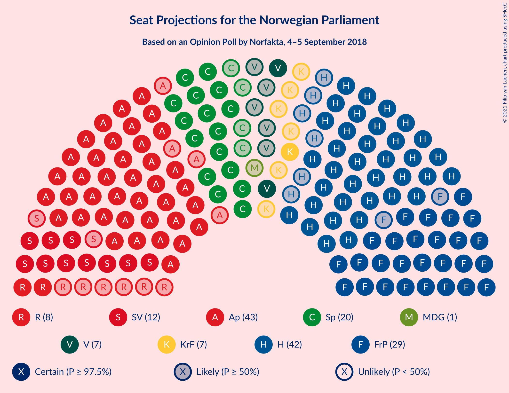
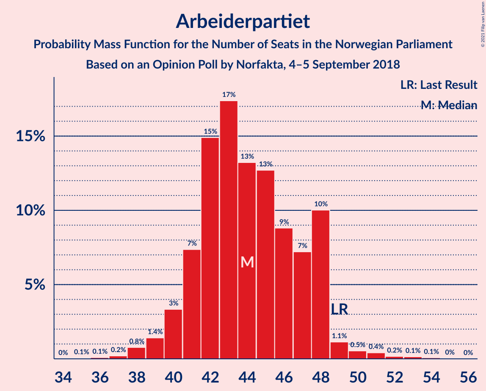
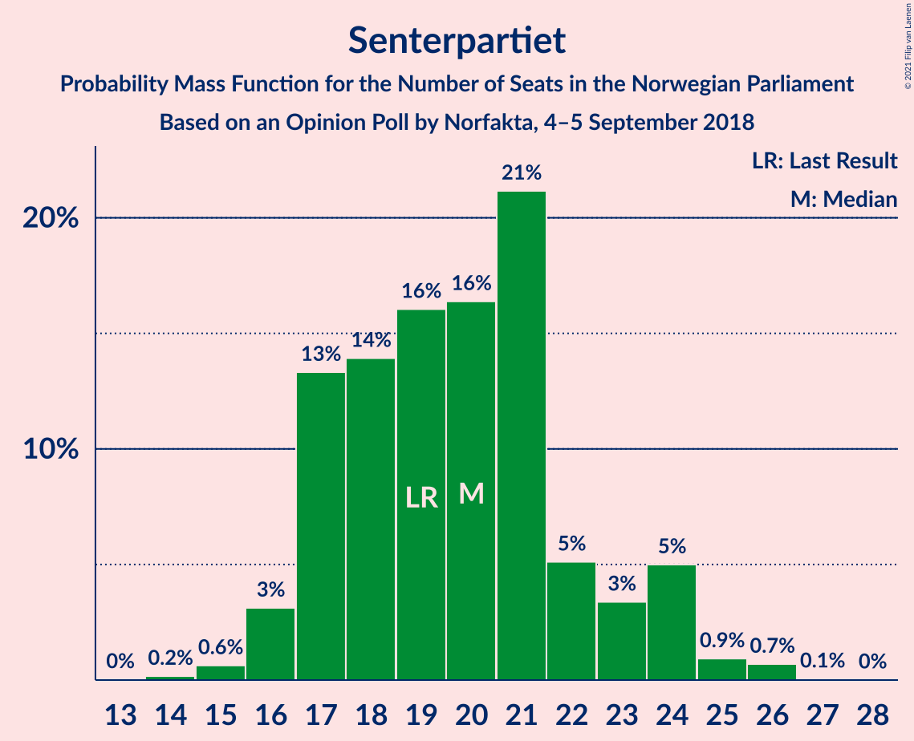
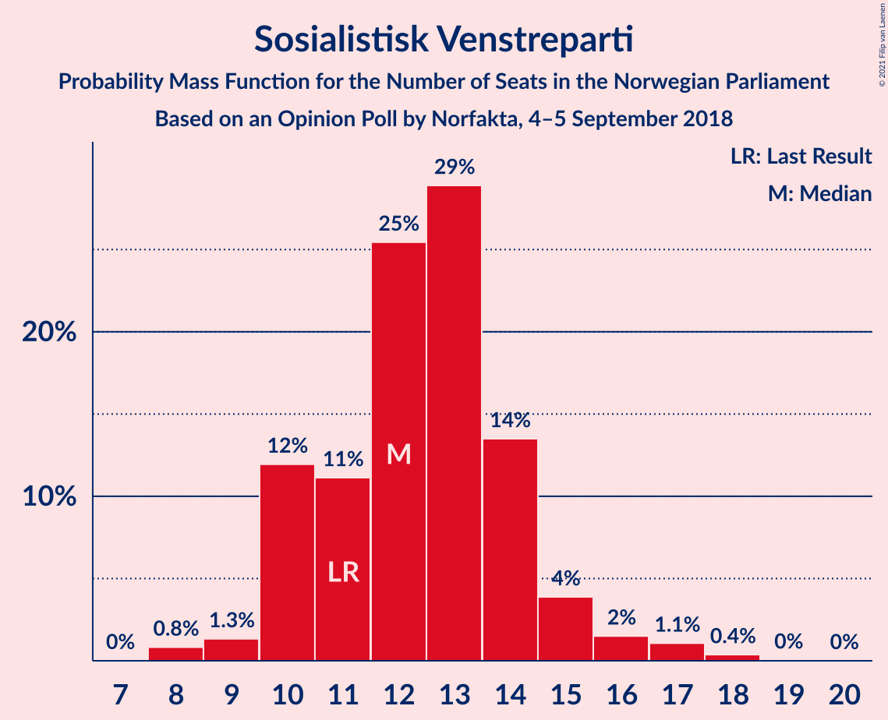
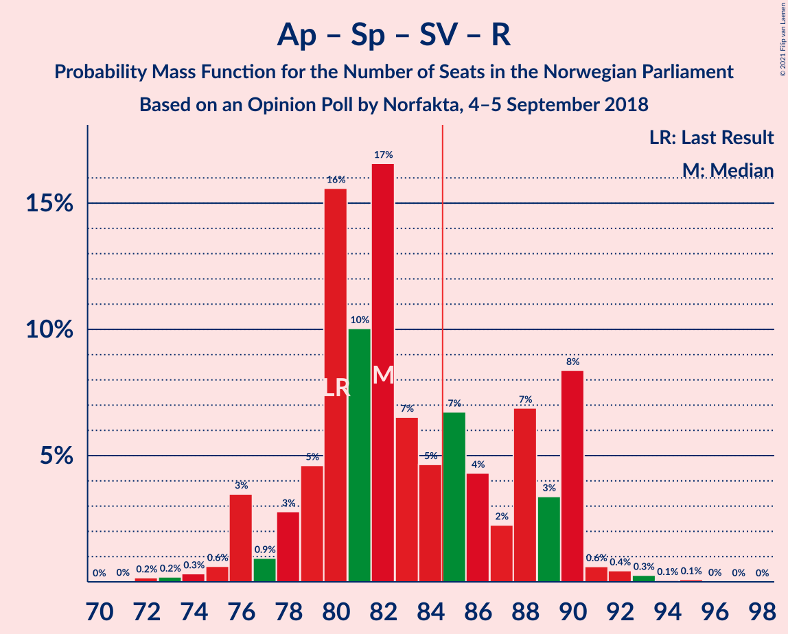
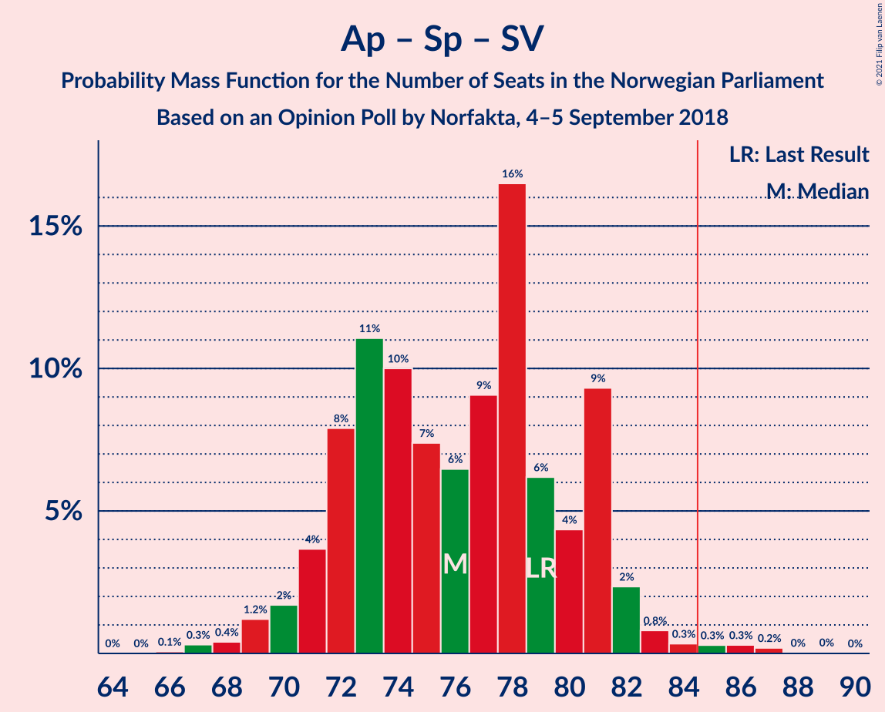
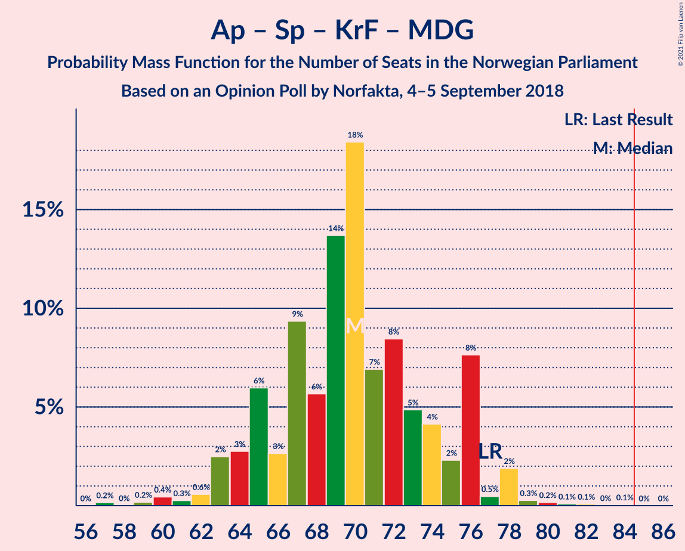
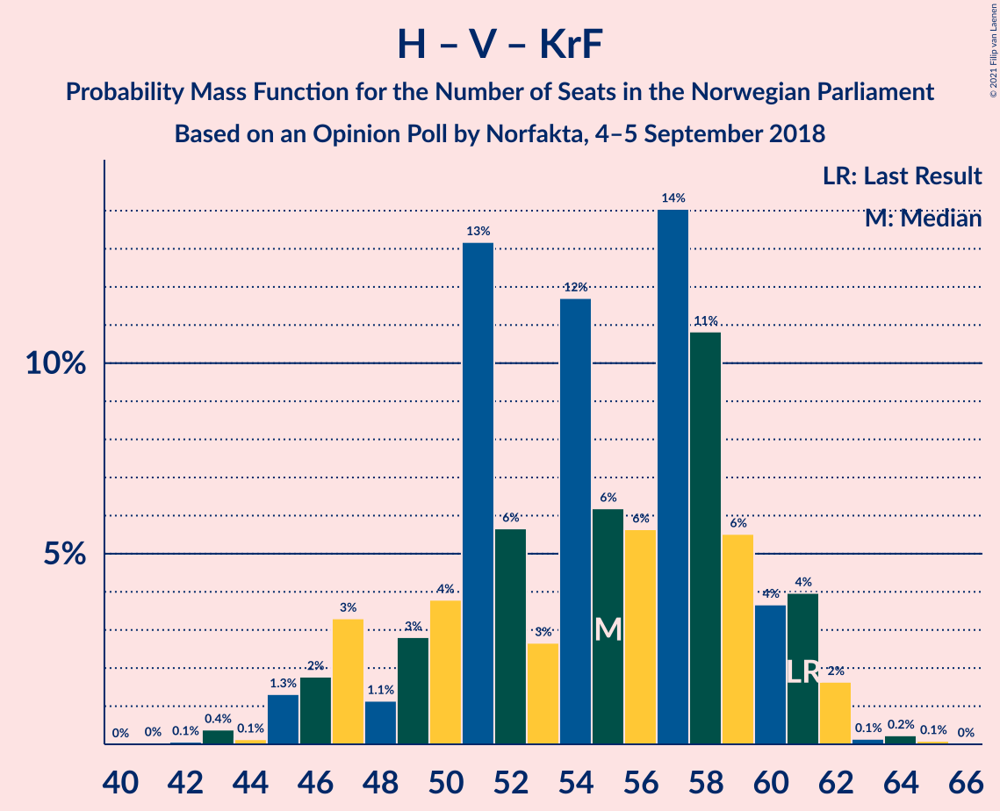

# Opinion Poll by Norfakta, 4–5 September 2018

<a href="#voting-intentions">Voting Intentions</a> | <a href="#seats">Seats</a> | <a href="#coalitions">Coalitions</a> | <a href="#technical-information">Technical Information</a>

## Voting Intentions

### Confidence Intervals

| Party | Last Result | Poll Result | 80% Confidence Interval | 90% Confidence Interval | 95% Confidence Interval | 99% Confidence Interval |
|:-----:|:-----------:|:-----------:|:-----------------------:|:-----------------------:|:-----------------------:|:-----------------------:|
| Arbeiderpartiet | 27.4% | 24.6% | 22.7–26.7% |22.2–27.3% |21.7–27.8% |20.8–28.8% |
| Høyre | 25.0% | 24.1% | 22.2–26.2% |21.7–26.7% |21.2–27.2% |20.3–28.2% |
| Fremskrittspartiet | 15.2% | 17.6% | 15.9–19.4% |15.4–19.9% |15.0–20.4% |14.3–21.3% |
| Senterpartiet | 10.3% | 11.2% | 9.8–12.7% |9.4–13.2% |9.1–13.6% |8.5–14.4% |
| Sosialistisk Venstreparti | 6.0% | 7.1% | 6.0–8.4% |5.7–8.7% |5.5–9.1% |5.0–9.7% |
| Rødt | 2.4% | 4.6% | 3.8–5.7% |3.6–6.1% |3.4–6.3% |3.0–6.9% |
| Venstre | 4.4% | 4.2% | 3.4–5.3% |3.2–5.6% |3.0–5.9% |2.7–6.4% |
| Kristelig Folkeparti | 4.2% | 4.0% | 3.2–5.0% |3.0–5.3% |2.8–5.6% |2.5–6.1% |
| Miljøpartiet De Grønne | 3.2% | 2.1% | 1.5–2.9% |1.4–3.1% |1.3–3.3% |1.1–3.7% |

*Note:* The poll result column reflects the actual value used in the calculations. Published results may vary slightly, and in addition be rounded to fewer digits.

## Seats

### Confidence Intervals

| Party | Last Result | Median | 80% Confidence Interval | 90% Confidence Interval | 95% Confidence Interval | 99% Confidence Interval |
|:-----:|:-----------:|:------:|:-----------------------:|:-----------------------:|:-----------------------:|:-----------------------:|
| <a href="#arbeiderpartiet">Arbeiderpartiet</a> | 49 | 44 | 41–48 |40–48 |39–49 |38–51 |
| <a href="#høyre">Høyre</a> | 45 | 42 | 39–46 |38–47 |36–48 |35–51 |
| <a href="#fremskrittspartiet">Fremskrittspartiet</a> | 27 | 30 | 28–34 |28–37 |27–38 |25–38 |
| <a href="#senterpartiet">Senterpartiet</a> | 19 | 20 | 17–23 |17–24 |16–24 |15–26 |
| <a href="#sosialistisk-venstreparti">Sosialistisk Venstreparti</a> | 11 | 12 | 10–14 |10–15 |10–16 |8–17 |
| <a href="#rødt">Rødt</a> | 1 | 8 | 2–10 |2–10 |2–11 |2–12 |
| <a href="#venstre">Venstre</a> | 8 | 8 | 2–10 |2–10 |2–10 |2–11 |
| <a href="#kristelig-folkeparti">Kristelig Folkeparti</a> | 8 | 7 | 3–9 |1–9 |1–10 |1–10 |
| <a href="#miljøpartiet-de-grønne">Miljøpartiet De Grønne</a> | 1 | 1 | 0–1 |0–1 |0–2 |0–2 |

### Arbeiderpartiet

*For a full overview of the results for this party, see the [Arbeiderpartiet](party-arbeiderpartiet.html) page.*

| Number of Seats | Probability | Accumulated | Special Marks |
|:---------------:|:-----------:|:-----------:|:-------------:|
| 35 | 0.1% | 100% |  |
| 36 | 0.1% | 99.9% |  |
| 37 | 0.2% | 99.8% |  |
| 38 | 0.8% | 99.6% |  |
| 39 | 1.4% | 98.9% |  |
| 40 | 3% | 97% |  |
| 41 | 7% | 94% |  |
| 42 | 15% | 87% |  |
| 43 | 17% | 72% |  |
| 44 | 13% | 54% | Median |
| 45 | 13% | 41% |  |
| 46 | 9% | 29% |  |
| 47 | 7% | 20% |  |
| 48 | 10% | 13% |  |
| 49 | 1.1% | 3% | Last Result |
| 50 | 0.5% | 1.4% |  |
| 51 | 0.4% | 0.8% |  |
| 52 | 0.2% | 0.4% |  |
| 53 | 0.1% | 0.3% |  |
| 54 | 0.1% | 0.1% |  |
| 55 | 0% | 0% |  |

### Høyre

*For a full overview of the results for this party, see the [Høyre](party-høyre.html) page.*

| Number of Seats | Probability | Accumulated | Special Marks |
|:---------------:|:-----------:|:-----------:|:-------------:|
| 34 | 0.1% | 100% |  |
| 35 | 0.7% | 99.9% |  |
| 36 | 2% | 99.2% |  |
| 37 | 2% | 97% |  |
| 38 | 5% | 95% |  |
| 39 | 5% | 90% |  |
| 40 | 4% | 86% |  |
| 41 | 18% | 82% |  |
| 42 | 20% | 64% | Median |
| 43 | 10% | 44% |  |
| 44 | 8% | 34% |  |
| 45 | 11% | 26% | Last Result |
| 46 | 6% | 15% |  |
| 47 | 4% | 9% |  |
| 48 | 3% | 5% |  |
| 49 | 0.5% | 2% |  |
| 50 | 0.7% | 1.2% |  |
| 51 | 0.2% | 0.5% |  |
| 52 | 0.3% | 0.3% |  |
| 53 | 0% | 0.1% |  |
| 54 | 0% | 0% |  |

### Fremskrittspartiet

*For a full overview of the results for this party, see the [Fremskrittspartiet](party-fremskrittspartiet.html) page.*

| Number of Seats | Probability | Accumulated | Special Marks |
|:---------------:|:-----------:|:-----------:|:-------------:|
| 24 | 0.1% | 100% |  |
| 25 | 1.2% | 99.9% |  |
| 26 | 1.0% | 98.7% |  |
| 27 | 2% | 98% | Last Result |
| 28 | 17% | 95% |  |
| 29 | 19% | 79% |  |
| 30 | 15% | 59% | Median |
| 31 | 14% | 45% |  |
| 32 | 7% | 31% |  |
| 33 | 9% | 24% |  |
| 34 | 6% | 16% |  |
| 35 | 3% | 10% |  |
| 36 | 2% | 7% |  |
| 37 | 2% | 5% |  |
| 38 | 2% | 3% |  |
| 39 | 0.1% | 0.3% |  |
| 40 | 0.2% | 0.2% |  |
| 41 | 0% | 0% |  |

### Senterpartiet

*For a full overview of the results for this party, see the [Senterpartiet](party-senterpartiet.html) page.*

| Number of Seats | Probability | Accumulated | Special Marks |
|:---------------:|:-----------:|:-----------:|:-------------:|
| 14 | 0.2% | 100% |  |
| 15 | 0.6% | 99.8% |  |
| 16 | 3% | 99.2% |  |
| 17 | 13% | 96% |  |
| 18 | 14% | 83% |  |
| 19 | 16% | 69% | Last Result |
| 20 | 16% | 53% | Median |
| 21 | 21% | 36% |  |
| 22 | 5% | 15% |  |
| 23 | 3% | 10% |  |
| 24 | 5% | 7% |  |
| 25 | 0.9% | 2% |  |
| 26 | 0.7% | 0.8% |  |
| 27 | 0.1% | 0.1% |  |
| 28 | 0% | 0% |  |

### Sosialistisk Venstreparti

*For a full overview of the results for this party, see the [Sosialistisk Venstreparti](party-sosialistiskvenstreparti.html) page.*

| Number of Seats | Probability | Accumulated | Special Marks |
|:---------------:|:-----------:|:-----------:|:-------------:|
| 8 | 0.8% | 100% |  |
| 9 | 1.3% | 99.2% |  |
| 10 | 12% | 98% |  |
| 11 | 11% | 86% | Last Result |
| 12 | 25% | 75% | Median |
| 13 | 29% | 49% |  |
| 14 | 14% | 20% |  |
| 15 | 4% | 7% |  |
| 16 | 2% | 3% |  |
| 17 | 1.1% | 2% |  |
| 18 | 0.4% | 0.4% |  |
| 19 | 0% | 0.1% |  |
| 20 | 0% | 0% |  |

### Rødt

*For a full overview of the results for this party, see the [Rødt](party-rødt.html) page.*

| Number of Seats | Probability | Accumulated | Special Marks |
|:---------------:|:-----------:|:-----------:|:-------------:|
| 1 | 0.2% | 100% | Last Result |
| 2 | 27% | 99.8% |  |
| 3 | 0% | 73% |  |
| 4 | 0% | 73% |  |
| 5 | 0% | 73% |  |
| 6 | 0% | 73% |  |
| 7 | 10% | 73% |  |
| 8 | 23% | 62% | Median |
| 9 | 22% | 40% |  |
| 10 | 13% | 18% |  |
| 11 | 3% | 4% |  |
| 12 | 0.8% | 1.0% |  |
| 13 | 0.2% | 0.2% |  |
| 14 | 0% | 0% |  |

### Venstre

*For a full overview of the results for this party, see the [Venstre](party-venstre.html) page.*

| Number of Seats | Probability | Accumulated | Special Marks |
|:---------------:|:-----------:|:-----------:|:-------------:|
| 1 | 0.2% | 100% |  |
| 2 | 25% | 99.8% |  |
| 3 | 3% | 75% |  |
| 4 | 0.5% | 72% |  |
| 5 | 0% | 71% |  |
| 6 | 0% | 71% |  |
| 7 | 21% | 71% |  |
| 8 | 20% | 51% | Last Result, Median |
| 9 | 19% | 30% |  |
| 10 | 10% | 12% |  |
| 11 | 2% | 2% |  |
| 12 | 0.1% | 0.2% |  |
| 13 | 0% | 0% |  |

### Kristelig Folkeparti

*For a full overview of the results for this party, see the [Kristelig Folkeparti](party-kristeligfolkeparti.html) page.*

| Number of Seats | Probability | Accumulated | Special Marks |
|:---------------:|:-----------:|:-----------:|:-------------:|
| 0 | 0.2% | 100% |  |
| 1 | 5% | 99.8% |  |
| 2 | 3% | 95% |  |
| 3 | 40% | 91% |  |
| 4 | 0% | 51% |  |
| 5 | 0% | 51% |  |
| 6 | 0% | 51% |  |
| 7 | 16% | 51% | Median |
| 8 | 18% | 35% | Last Result |
| 9 | 14% | 17% |  |
| 10 | 3% | 3% |  |
| 11 | 0.3% | 0.5% |  |
| 12 | 0.1% | 0.1% |  |
| 13 | 0% | 0% |  |

### Miljøpartiet De Grønne

*For a full overview of the results for this party, see the [Miljøpartiet De Grønne](party-miljøpartietdegrønne.html) page.*

| Number of Seats | Probability | Accumulated | Special Marks |
|:---------------:|:-----------:|:-----------:|:-------------:|
| 0 | 37% | 100% |  |
| 1 | 59% | 63% | Last Result, Median |
| 2 | 3% | 3% |  |
| 3 | 0.1% | 0.3% |  |
| 4 | 0% | 0.2% |  |
| 5 | 0% | 0.2% |  |
| 6 | 0% | 0.2% |  |
| 7 | 0.1% | 0.2% |  |
| 8 | 0.1% | 0.1% |  |
| 9 | 0% | 0% |  |

## Coalitions

### Confidence Intervals

| Coalition | Last Result | Median | Majority? | 80% Confidence Interval | 90% Confidence Interval | 95% Confidence Interval | 99% Confidence Interval |
|:---------:|:-----------:|:------:|:---------:|:-----------------------:|:-----------------------:|:-----------------------:|:-----------------------:|
| Høyre – Fremskrittspartiet – Senterpartiet – Venstre – Kristelig Folkeparti | 107 | 105 | 100% | 99–109 | 99–111 | 98–112 | 97–114 |
| Høyre – Fremskrittspartiet – Venstre – Kristelig Folkeparti – Miljøpartiet De Grønne | 89 | 87 | 67% | 80–90 | 79–92 | 79–93 | 77–95 |
| Høyre – Fremskrittspartiet – Venstre – Kristelig Folkeparti | 88 | 86 | 64% | 79–90 | 79–91 | 78–92 | 76–95 |
| Arbeiderpartiet – Senterpartiet – Sosialistisk Venstreparti – Rødt – Miljøpartiet De Grønne | 81 | 83 | 36% | 79–90 | 78–90 | 77–91 | 74–93 |
| Arbeiderpartiet – Senterpartiet – Sosialistisk Venstreparti – Rødt | 80 | 82 | 33% | 79–89 | 77–90 | 76–90 | 74–92 |
| Arbeiderpartiet – Senterpartiet – Sosialistisk Venstreparti – Kristelig Folkeparti – Miljøpartiet De Grønne | 88 | 82 | 22% | 78–89 | 76–89 | 75–90 | 73–92 |
| Høyre – Fremskrittspartiet – Venstre | 80 | 81 | 14% | 73–85 | 71–85 | 71–86 | 71–89 |
| Arbeiderpartiet – Senterpartiet – Sosialistisk Venstreparti – Miljøpartiet De Grønne | 80 | 77 | 1.2% | 72–81 | 72–82 | 70–83 | 68–87 |
| Arbeiderpartiet – Senterpartiet – Sosialistisk Venstreparti | 79 | 76 | 0.9% | 72–81 | 71–81 | 70–82 | 68–86 |
| Høyre – Fremskrittspartiet | 72 | 73 | 0.4% | 69–77 | 68–80 | 67–81 | 65–83 |
| Arbeiderpartiet – Senterpartiet – Kristelig Folkeparti – Miljøpartiet De Grønne | 77 | 70 | 0% | 65–76 | 64–76 | 63–78 | 60–79 |
| Arbeiderpartiet – Senterpartiet – Kristelig Folkeparti | 76 | 69 | 0% | 64–75 | 64–76 | 62–77 | 60–78 |
| Arbeiderpartiet – Senterpartiet | 68 | 64 | 0% | 60–68 | 59–69 | 58–69 | 56–73 |
| Arbeiderpartiet – Sosialistisk Venstreparti | 60 | 57 | 0% | 53–61 | 52–61 | 51–61 | 49–64 |
| Høyre – Venstre – Kristelig Folkeparti | 61 | 55 | 0% | 49–59 | 47–61 | 46–61 | 43–63 |
| Senterpartiet – Venstre – Kristelig Folkeparti | 35 | 32 | 0% | 26–36 | 24–38 | 23–39 | 22–40 |

### Høyre – Fremskrittspartiet – Senterpartiet – Venstre – Kristelig Folkeparti

| Number of Seats | Probability | Accumulated | Special Marks |
|:---------------:|:-----------:|:-----------:|:-------------:|
| 93 | 0.1% | 100% |  |
| 94 | 0% | 99.9% |  |
| 95 | 0.2% | 99.9% |  |
| 96 | 0.2% | 99.7% |  |
| 97 | 0.9% | 99.5% |  |
| 98 | 2% | 98.6% |  |
| 99 | 8% | 96% |  |
| 100 | 2% | 88% |  |
| 101 | 10% | 86% |  |
| 102 | 3% | 77% |  |
| 103 | 12% | 74% |  |
| 104 | 7% | 62% |  |
| 105 | 6% | 55% |  |
| 106 | 9% | 48% |  |
| 107 | 10% | 40% | Last Result, Median |
| 108 | 9% | 30% |  |
| 109 | 14% | 20% |  |
| 110 | 1.4% | 7% |  |
| 111 | 3% | 5% |  |
| 112 | 0.3% | 3% |  |
| 113 | 1.4% | 2% |  |
| 114 | 0.5% | 0.9% |  |
| 115 | 0.1% | 0.4% |  |
| 116 | 0.1% | 0.3% |  |
| 117 | 0.1% | 0.2% |  |
| 118 | 0% | 0% |  |

### Høyre – Fremskrittspartiet – Venstre – Kristelig Folkeparti – Miljøpartiet De Grønne

| Number of Seats | Probability | Accumulated | Special Marks |
|:---------------:|:-----------:|:-----------:|:-------------:|
| 73 | 0% | 100% |  |
| 74 | 0.1% | 99.9% |  |
| 75 | 0.1% | 99.9% |  |
| 76 | 0.3% | 99.8% |  |
| 77 | 0.4% | 99.5% |  |
| 78 | 0.6% | 99.1% |  |
| 79 | 8% | 98% |  |
| 80 | 3% | 90% |  |
| 81 | 7% | 87% |  |
| 82 | 2% | 80% |  |
| 83 | 4% | 78% |  |
| 84 | 7% | 73% |  |
| 85 | 5% | 67% | Majority |
| 86 | 7% | 62% |  |
| 87 | 17% | 55% |  |
| 88 | 10% | 39% | Median |
| 89 | 16% | 29% | Last Result |
| 90 | 5% | 13% |  |
| 91 | 3% | 9% |  |
| 92 | 0.9% | 6% |  |
| 93 | 3% | 5% |  |
| 94 | 0.6% | 1.3% |  |
| 95 | 0.3% | 0.7% |  |
| 96 | 0.2% | 0.4% |  |
| 97 | 0.2% | 0.2% |  |
| 98 | 0% | 0% |  |

### Høyre – Fremskrittspartiet – Venstre – Kristelig Folkeparti

| Number of Seats | Probability | Accumulated | Special Marks |
|:---------------:|:-----------:|:-----------:|:-------------:|
| 72 | 0% | 100% |  |
| 73 | 0% | 99.9% |  |
| 74 | 0.1% | 99.9% |  |
| 75 | 0.2% | 99.8% |  |
| 76 | 0.4% | 99.6% |  |
| 77 | 0.5% | 99.2% |  |
| 78 | 3% | 98.7% |  |
| 79 | 8% | 96% |  |
| 80 | 8% | 88% |  |
| 81 | 2% | 80% |  |
| 82 | 3% | 78% |  |
| 83 | 5% | 76% |  |
| 84 | 7% | 71% |  |
| 85 | 8% | 64% | Majority |
| 86 | 12% | 56% |  |
| 87 | 11% | 44% | Median |
| 88 | 16% | 33% | Last Result |
| 89 | 4% | 16% |  |
| 90 | 6% | 12% |  |
| 91 | 0.9% | 6% |  |
| 92 | 3% | 5% |  |
| 93 | 0.9% | 2% |  |
| 94 | 0.3% | 0.8% |  |
| 95 | 0.2% | 0.5% |  |
| 96 | 0.2% | 0.3% |  |
| 97 | 0.1% | 0.2% |  |
| 98 | 0% | 0% |  |

### Arbeiderpartiet – Senterpartiet – Sosialistisk Venstreparti – Rødt – Miljøpartiet De Grønne

| Number of Seats | Probability | Accumulated | Special Marks |
|:---------------:|:-----------:|:-----------:|:-------------:|
| 72 | 0.1% | 100% |  |
| 73 | 0.2% | 99.8% |  |
| 74 | 0.2% | 99.7% |  |
| 75 | 0.3% | 99.5% |  |
| 76 | 0.9% | 99.2% |  |
| 77 | 3% | 98% |  |
| 78 | 0.9% | 95% |  |
| 79 | 6% | 94% |  |
| 80 | 4% | 88% |  |
| 81 | 16% | 84% | Last Result |
| 82 | 11% | 67% |  |
| 83 | 12% | 56% |  |
| 84 | 8% | 44% |  |
| 85 | 7% | 36% | Median, Majority |
| 86 | 5% | 29% |  |
| 87 | 3% | 24% |  |
| 88 | 2% | 22% |  |
| 89 | 8% | 20% |  |
| 90 | 8% | 12% |  |
| 91 | 3% | 4% |  |
| 92 | 0.5% | 1.3% |  |
| 93 | 0.4% | 0.8% |  |
| 94 | 0.2% | 0.4% |  |
| 95 | 0.1% | 0.2% |  |
| 96 | 0% | 0.1% |  |
| 97 | 0% | 0.1% |  |
| 98 | 0% | 0% |  |

### Arbeiderpartiet – Senterpartiet – Sosialistisk Venstreparti – Rødt

| Number of Seats | Probability | Accumulated | Special Marks |
|:---------------:|:-----------:|:-----------:|:-------------:|
| 72 | 0.2% | 100% |  |
| 73 | 0.2% | 99.8% |  |
| 74 | 0.3% | 99.6% |  |
| 75 | 0.6% | 99.3% |  |
| 76 | 3% | 98.7% |  |
| 77 | 0.9% | 95% |  |
| 78 | 3% | 94% |  |
| 79 | 5% | 91% |  |
| 80 | 16% | 87% | Last Result |
| 81 | 10% | 71% |  |
| 82 | 17% | 61% |  |
| 83 | 7% | 45% |  |
| 84 | 5% | 38% | Median |
| 85 | 7% | 33% | Majority |
| 86 | 4% | 27% |  |
| 87 | 2% | 22% |  |
| 88 | 7% | 20% |  |
| 89 | 3% | 13% |  |
| 90 | 8% | 10% |  |
| 91 | 0.6% | 2% |  |
| 92 | 0.4% | 0.9% |  |
| 93 | 0.3% | 0.5% |  |
| 94 | 0.1% | 0.2% |  |
| 95 | 0.1% | 0.1% |  |
| 96 | 0% | 0.1% |  |
| 97 | 0% | 0% |  |

### Arbeiderpartiet – Senterpartiet – Sosialistisk Venstreparti – Kristelig Folkeparti – Miljøpartiet De Grønne

| Number of Seats | Probability | Accumulated | Special Marks |
|:---------------:|:-----------:|:-----------:|:-------------:|
| 70 | 0.1% | 100% |  |
| 71 | 0.1% | 99.9% |  |
| 72 | 0.2% | 99.9% |  |
| 73 | 0.3% | 99.6% |  |
| 74 | 0.6% | 99.3% |  |
| 75 | 1.4% | 98.7% |  |
| 76 | 3% | 97% |  |
| 77 | 4% | 95% |  |
| 78 | 5% | 90% |  |
| 79 | 9% | 85% |  |
| 80 | 7% | 77% |  |
| 81 | 7% | 70% |  |
| 82 | 19% | 64% |  |
| 83 | 15% | 44% |  |
| 84 | 8% | 30% | Median |
| 85 | 4% | 22% | Majority |
| 86 | 3% | 18% |  |
| 87 | 2% | 14% |  |
| 88 | 2% | 13% | Last Result |
| 89 | 7% | 11% |  |
| 90 | 3% | 4% |  |
| 91 | 0.3% | 0.9% |  |
| 92 | 0.3% | 0.6% |  |
| 93 | 0.1% | 0.3% |  |
| 94 | 0% | 0.2% |  |
| 95 | 0.1% | 0.2% |  |
| 96 | 0% | 0% |  |

### Høyre – Fremskrittspartiet – Venstre

| Number of Seats | Probability | Accumulated | Special Marks |
|:---------------:|:-----------:|:-----------:|:-------------:|
| 67 | 0% | 100% |  |
| 68 | 0% | 99.9% |  |
| 69 | 0.1% | 99.9% |  |
| 70 | 0.3% | 99.8% |  |
| 71 | 7% | 99.6% |  |
| 72 | 0.6% | 93% |  |
| 73 | 2% | 92% |  |
| 74 | 3% | 90% |  |
| 75 | 4% | 87% |  |
| 76 | 4% | 83% |  |
| 77 | 16% | 80% |  |
| 78 | 3% | 64% |  |
| 79 | 6% | 61% |  |
| 80 | 3% | 55% | Last Result, Median |
| 81 | 10% | 52% |  |
| 82 | 8% | 41% |  |
| 83 | 10% | 33% |  |
| 84 | 10% | 24% |  |
| 85 | 10% | 14% | Majority |
| 86 | 2% | 4% |  |
| 87 | 1.3% | 2% |  |
| 88 | 0.3% | 1.0% |  |
| 89 | 0.2% | 0.7% |  |
| 90 | 0.2% | 0.5% |  |
| 91 | 0.1% | 0.3% |  |
| 92 | 0.1% | 0.3% |  |
| 93 | 0.1% | 0.2% |  |
| 94 | 0% | 0% |  |

### Arbeiderpartiet – Senterpartiet – Sosialistisk Venstreparti – Miljøpartiet De Grønne

| Number of Seats | Probability | Accumulated | Special Marks |
|:---------------:|:-----------:|:-----------:|:-------------:|
| 66 | 0% | 100% |  |
| 67 | 0.1% | 99.9% |  |
| 68 | 0.5% | 99.8% |  |
| 69 | 0.2% | 99.4% |  |
| 70 | 2% | 99.2% |  |
| 71 | 2% | 97% |  |
| 72 | 8% | 95% |  |
| 73 | 5% | 88% |  |
| 74 | 12% | 83% |  |
| 75 | 10% | 71% |  |
| 76 | 7% | 61% |  |
| 77 | 11% | 54% | Median |
| 78 | 3% | 43% |  |
| 79 | 17% | 40% |  |
| 80 | 8% | 24% | Last Result |
| 81 | 8% | 15% |  |
| 82 | 3% | 7% |  |
| 83 | 2% | 4% |  |
| 84 | 0.9% | 2% |  |
| 85 | 0.4% | 1.2% | Majority |
| 86 | 0.2% | 0.8% |  |
| 87 | 0.2% | 0.5% |  |
| 88 | 0.2% | 0.3% |  |
| 89 | 0.1% | 0.1% |  |
| 90 | 0% | 0% |  |

### Arbeiderpartiet – Senterpartiet – Sosialistisk Venstreparti

| Number of Seats | Probability | Accumulated | Special Marks |
|:---------------:|:-----------:|:-----------:|:-------------:|
| 66 | 0.1% | 100% |  |
| 67 | 0.3% | 99.9% |  |
| 68 | 0.4% | 99.6% |  |
| 69 | 1.2% | 99.2% |  |
| 70 | 2% | 98% |  |
| 71 | 4% | 96% |  |
| 72 | 8% | 93% |  |
| 73 | 11% | 85% |  |
| 74 | 10% | 74% |  |
| 75 | 7% | 64% |  |
| 76 | 6% | 56% | Median |
| 77 | 9% | 50% |  |
| 78 | 16% | 41% |  |
| 79 | 6% | 24% | Last Result |
| 80 | 4% | 18% |  |
| 81 | 9% | 14% |  |
| 82 | 2% | 4% |  |
| 83 | 0.8% | 2% |  |
| 84 | 0.3% | 1.2% |  |
| 85 | 0.3% | 0.9% | Majority |
| 86 | 0.3% | 0.6% |  |
| 87 | 0.2% | 0.3% |  |
| 88 | 0% | 0.1% |  |
| 89 | 0% | 0.1% |  |
| 90 | 0% | 0% |  |

### Høyre – Fremskrittspartiet

| Number of Seats | Probability | Accumulated | Special Marks |
|:---------------:|:-----------:|:-----------:|:-------------:|
| 63 | 0.1% | 100% |  |
| 64 | 0.1% | 99.9% |  |
| 65 | 0.6% | 99.8% |  |
| 66 | 2% | 99.2% |  |
| 67 | 1.1% | 98% |  |
| 68 | 3% | 97% |  |
| 69 | 9% | 93% |  |
| 70 | 15% | 84% |  |
| 71 | 4% | 70% |  |
| 72 | 10% | 66% | Last Result, Median |
| 73 | 11% | 56% |  |
| 74 | 7% | 45% |  |
| 75 | 5% | 37% |  |
| 76 | 19% | 32% |  |
| 77 | 4% | 14% |  |
| 78 | 2% | 10% |  |
| 79 | 1.1% | 7% |  |
| 80 | 3% | 6% |  |
| 81 | 1.4% | 3% |  |
| 82 | 0.6% | 2% |  |
| 83 | 0.8% | 1.2% |  |
| 84 | 0% | 0.4% |  |
| 85 | 0.2% | 0.4% | Majority |
| 86 | 0% | 0.2% |  |
| 87 | 0.1% | 0.2% |  |
| 88 | 0% | 0% |  |

### Arbeiderpartiet – Senterpartiet – Kristelig Folkeparti – Miljøpartiet De Grønne

| Number of Seats | Probability | Accumulated | Special Marks |
|:---------------:|:-----------:|:-----------:|:-------------:|
| 57 | 0.2% | 100% |  |
| 58 | 0% | 99.8% |  |
| 59 | 0.2% | 99.8% |  |
| 60 | 0.4% | 99.6% |  |
| 61 | 0.3% | 99.2% |  |
| 62 | 0.6% | 98.9% |  |
| 63 | 2% | 98% |  |
| 64 | 3% | 96% |  |
| 65 | 6% | 93% |  |
| 66 | 3% | 87% |  |
| 67 | 9% | 84% |  |
| 68 | 6% | 75% |  |
| 69 | 14% | 69% |  |
| 70 | 18% | 56% |  |
| 71 | 7% | 37% |  |
| 72 | 8% | 30% | Median |
| 73 | 5% | 22% |  |
| 74 | 4% | 17% |  |
| 75 | 2% | 13% |  |
| 76 | 8% | 11% |  |
| 77 | 0.5% | 3% | Last Result |
| 78 | 2% | 3% |  |
| 79 | 0.3% | 0.7% |  |
| 80 | 0.2% | 0.4% |  |
| 81 | 0.1% | 0.2% |  |
| 82 | 0.1% | 0.2% |  |
| 83 | 0% | 0.1% |  |
| 84 | 0.1% | 0.1% |  |
| 85 | 0% | 0% | Majority |

### Arbeiderpartiet – Senterpartiet – Kristelig Folkeparti

| Number of Seats | Probability | Accumulated | Special Marks |
|:---------------:|:-----------:|:-----------:|:-------------:|
| 56 | 0.2% | 100% |  |
| 57 | 0% | 99.8% |  |
| 58 | 0.1% | 99.8% |  |
| 59 | 0.1% | 99.7% |  |
| 60 | 0.5% | 99.6% |  |
| 61 | 0.3% | 99.1% |  |
| 62 | 3% | 98.8% |  |
| 63 | 1.2% | 96% |  |
| 64 | 7% | 95% |  |
| 65 | 3% | 89% |  |
| 66 | 5% | 85% |  |
| 67 | 6% | 80% |  |
| 68 | 16% | 74% |  |
| 69 | 18% | 58% |  |
| 70 | 10% | 41% |  |
| 71 | 4% | 31% | Median |
| 72 | 9% | 26% |  |
| 73 | 4% | 18% |  |
| 74 | 2% | 14% |  |
| 75 | 3% | 12% |  |
| 76 | 6% | 9% | Last Result |
| 77 | 2% | 3% |  |
| 78 | 0.4% | 0.9% |  |
| 79 | 0.2% | 0.4% |  |
| 80 | 0.1% | 0.2% |  |
| 81 | 0.1% | 0.2% |  |
| 82 | 0% | 0.1% |  |
| 83 | 0.1% | 0.1% |  |
| 84 | 0% | 0% |  |

### Arbeiderpartiet – Senterpartiet

| Number of Seats | Probability | Accumulated | Special Marks |
|:---------------:|:-----------:|:-----------:|:-------------:|
| 54 | 0.1% | 100% |  |
| 55 | 0.3% | 99.9% |  |
| 56 | 0.3% | 99.5% |  |
| 57 | 0.9% | 99.3% |  |
| 58 | 1.5% | 98% |  |
| 59 | 3% | 97% |  |
| 60 | 14% | 94% |  |
| 61 | 11% | 80% |  |
| 62 | 7% | 70% |  |
| 63 | 8% | 62% |  |
| 64 | 6% | 54% | Median |
| 65 | 20% | 48% |  |
| 66 | 7% | 28% |  |
| 67 | 5% | 21% |  |
| 68 | 9% | 16% | Last Result |
| 69 | 5% | 7% |  |
| 70 | 0.5% | 2% |  |
| 71 | 0.9% | 2% |  |
| 72 | 0.1% | 0.7% |  |
| 73 | 0.3% | 0.6% |  |
| 74 | 0.1% | 0.3% |  |
| 75 | 0.2% | 0.2% |  |
| 76 | 0% | 0% |  |

### Arbeiderpartiet – Sosialistisk Venstreparti

| Number of Seats | Probability | Accumulated | Special Marks |
|:---------------:|:-----------:|:-----------:|:-------------:|
| 47 | 0.1% | 100% |  |
| 48 | 0.1% | 99.9% |  |
| 49 | 0.4% | 99.8% |  |
| 50 | 2% | 99.5% |  |
| 51 | 1.3% | 98% |  |
| 52 | 3% | 96% |  |
| 53 | 11% | 94% |  |
| 54 | 11% | 83% |  |
| 55 | 6% | 72% |  |
| 56 | 11% | 66% | Median |
| 57 | 25% | 56% |  |
| 58 | 9% | 31% |  |
| 59 | 5% | 22% |  |
| 60 | 5% | 17% | Last Result |
| 61 | 9% | 11% |  |
| 62 | 1.1% | 2% |  |
| 63 | 0.5% | 1.3% |  |
| 64 | 0.4% | 0.9% |  |
| 65 | 0.3% | 0.5% |  |
| 66 | 0.1% | 0.2% |  |
| 67 | 0% | 0.1% |  |
| 68 | 0% | 0% |  |

### Høyre – Venstre – Kristelig Folkeparti

| Number of Seats | Probability | Accumulated | Special Marks |
|:---------------:|:-----------:|:-----------:|:-------------:|
| 41 | 0% | 100% |  |
| 42 | 0.1% | 99.9% |  |
| 43 | 0.4% | 99.9% |  |
| 44 | 0.1% | 99.5% |  |
| 45 | 1.3% | 99.4% |  |
| 46 | 2% | 98% |  |
| 47 | 3% | 96% |  |
| 48 | 1.1% | 93% |  |
| 49 | 3% | 92% |  |
| 50 | 4% | 89% |  |
| 51 | 13% | 85% |  |
| 52 | 6% | 72% |  |
| 53 | 3% | 66% |  |
| 54 | 12% | 64% |  |
| 55 | 6% | 52% |  |
| 56 | 6% | 46% |  |
| 57 | 14% | 40% | Median |
| 58 | 11% | 26% |  |
| 59 | 6% | 15% |  |
| 60 | 4% | 10% |  |
| 61 | 4% | 6% | Last Result |
| 62 | 2% | 2% |  |
| 63 | 0.1% | 0.5% |  |
| 64 | 0.2% | 0.4% |  |
| 65 | 0.1% | 0.1% |  |
| 66 | 0% | 0% |  |

### Senterpartiet – Venstre – Kristelig Folkeparti

| Number of Seats | Probability | Accumulated | Special Marks |
|:---------------:|:-----------:|:-----------:|:-------------:|
| 19 | 0% | 100% |  |
| 20 | 0.1% | 99.9% |  |
| 21 | 0.1% | 99.9% |  |
| 22 | 0.8% | 99.8% |  |
| 23 | 3% | 99.0% |  |
| 24 | 2% | 96% |  |
| 25 | 1.0% | 94% |  |
| 26 | 4% | 93% |  |
| 27 | 4% | 89% |  |
| 28 | 4% | 85% |  |
| 29 | 1.4% | 81% |  |
| 30 | 10% | 80% |  |
| 31 | 12% | 70% |  |
| 32 | 8% | 58% |  |
| 33 | 18% | 50% |  |
| 34 | 9% | 31% |  |
| 35 | 11% | 23% | Last Result, Median |
| 36 | 5% | 11% |  |
| 37 | 1.2% | 6% |  |
| 38 | 3% | 5% |  |
| 39 | 2% | 3% |  |
| 40 | 0.3% | 0.6% |  |
| 41 | 0.3% | 0.4% |  |
| 42 | 0% | 0% |  |

## Technical Information

### Opinion Poll

+ **Polling firm:** Norfakta
+ **Commissioner(s):** —
+ **Fieldwork period:** 4–5 September 2018

### Calculations

+ **Sample size:** 780
+ **Simulations done:** 524,288
+ **Error estimate:** 3.05%

