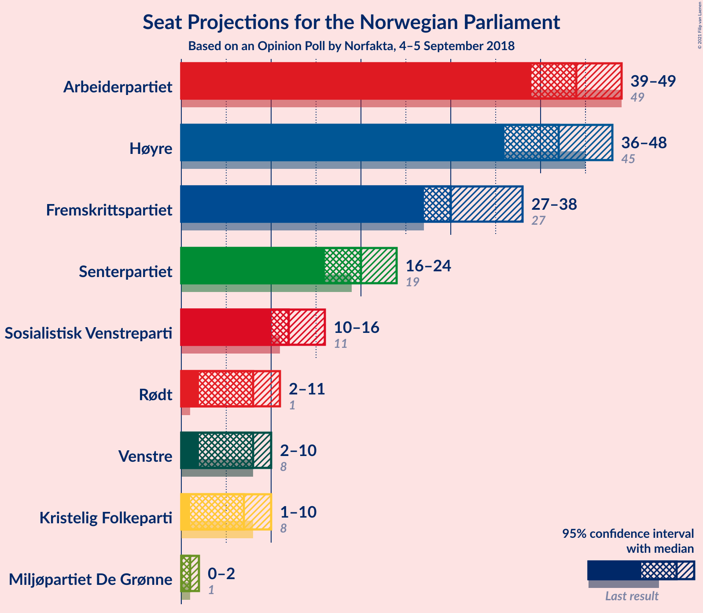
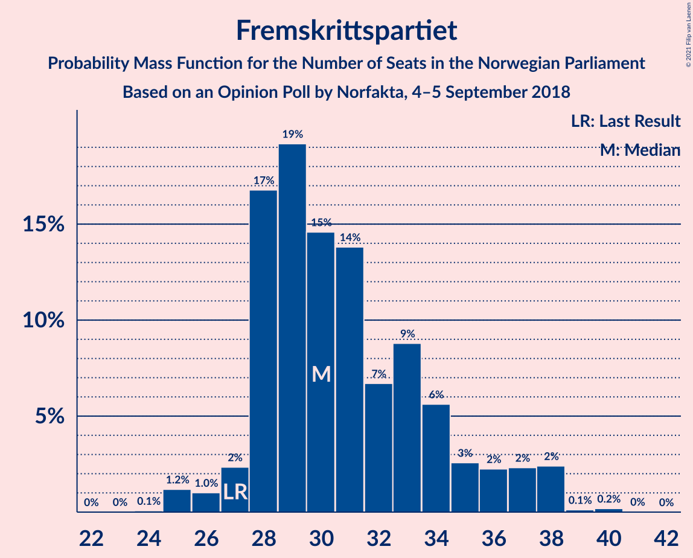
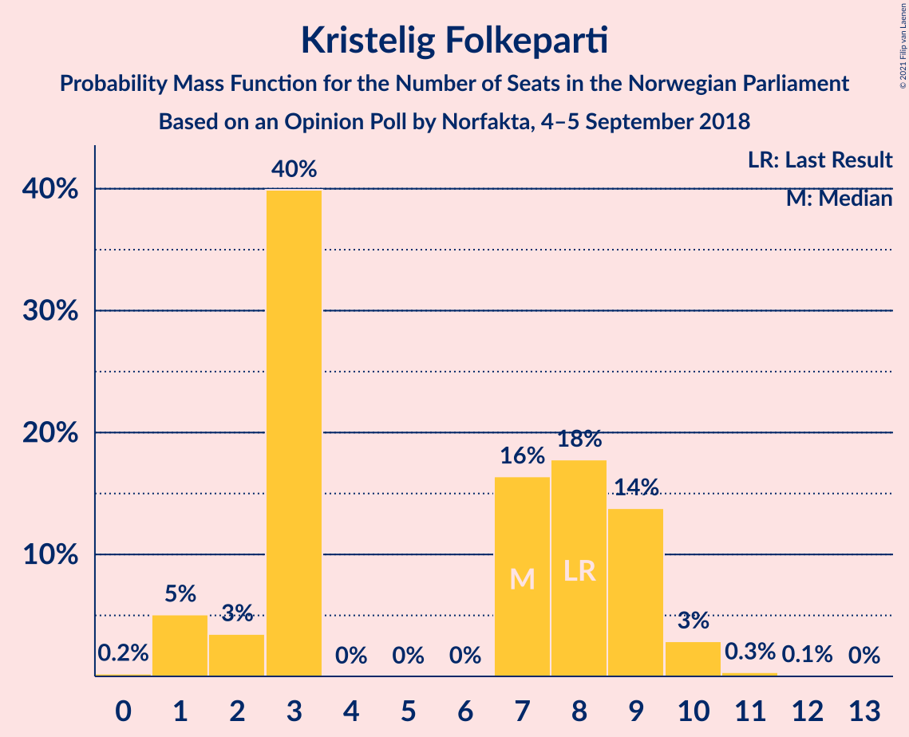
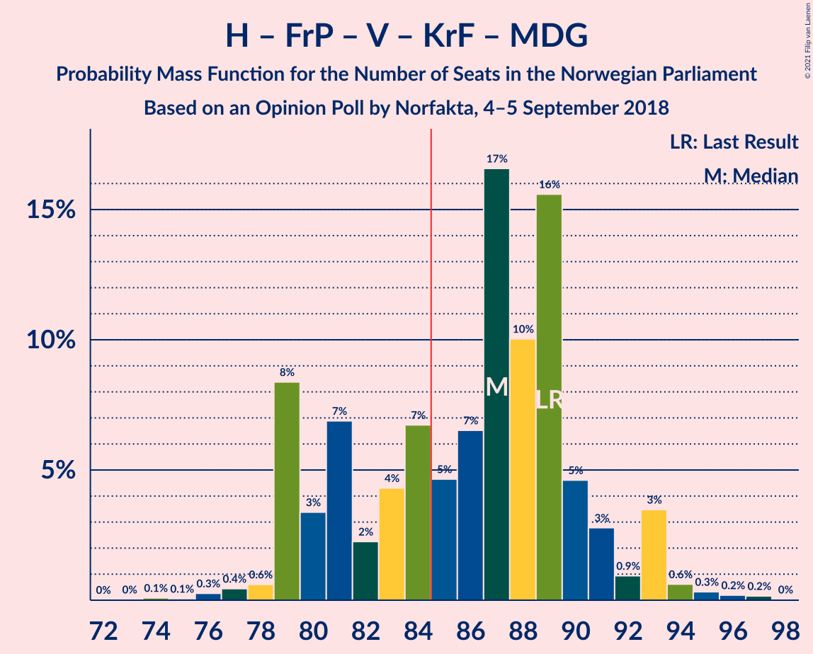
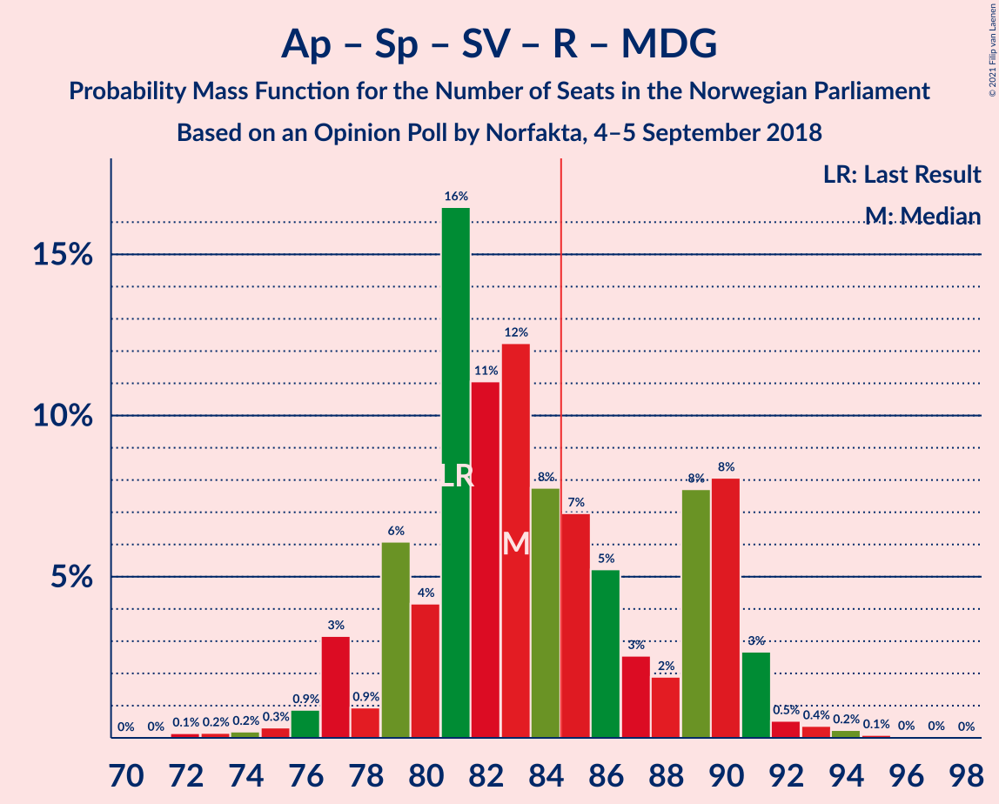
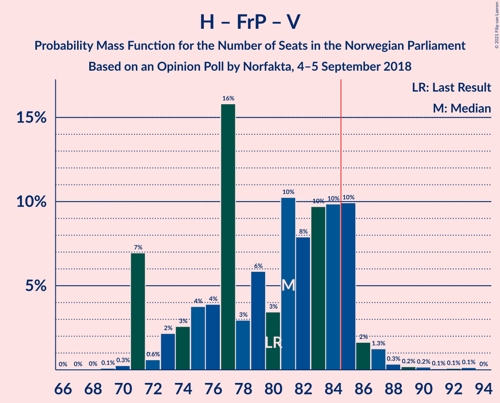
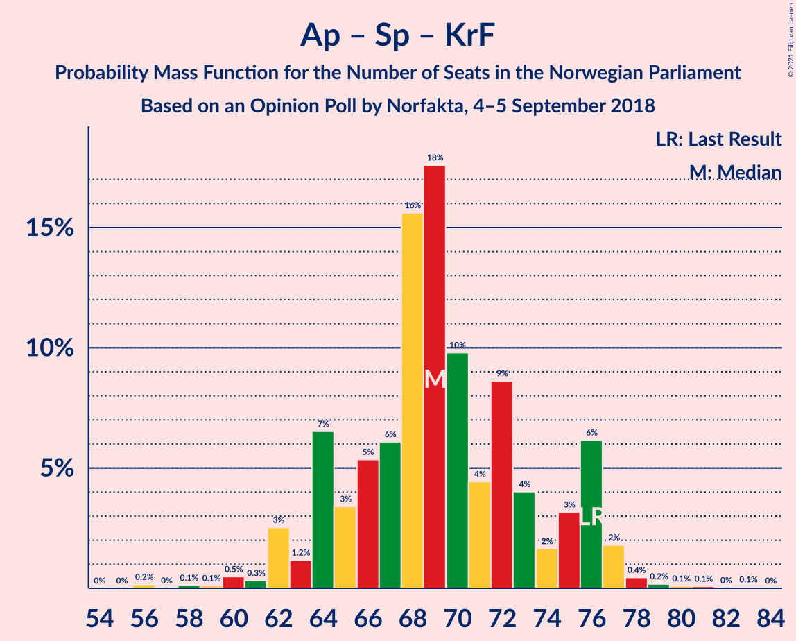
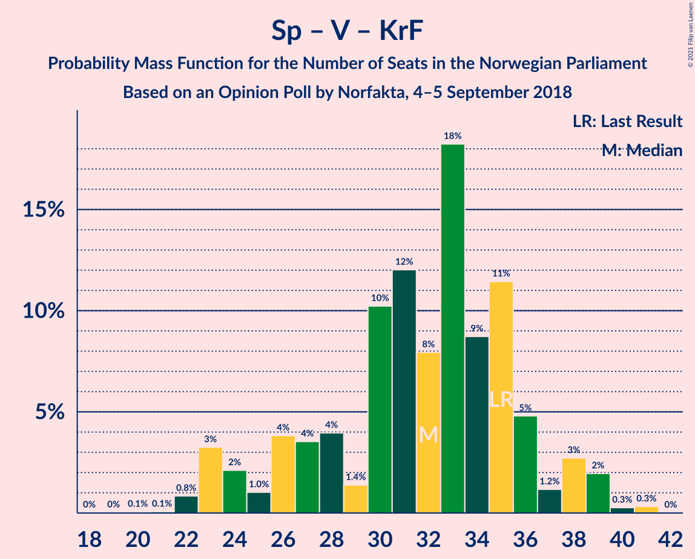

# Opinion Poll by Norfakta, 4–5 September 2018

<a href="#voting-intentions">Voting Intentions</a> | <a href="#seats">Seats</a> | <a href="#coalitions">Coalitions</a> | <a href="#technical-information">Technical Information</a>

## Voting Intentions

### Confidence Intervals

| Party | Last Result | Poll Result | 80% Confidence Interval | 90% Confidence Interval | 95% Confidence Interval | 99% Confidence Interval |
|:-----:|:-----------:|:-----------:|:-----------------------:|:-----------------------:|:-----------------------:|:-----------------------:|
| Arbeiderpartiet | 27.4% | 24.6% | 22.7–26.7% |22.2–27.3% |21.7–27.8% |20.8–28.8% |
| Høyre | 25.0% | 24.1% | 22.2–26.2% |21.7–26.7% |21.2–27.2% |20.3–28.2% |
| Fremskrittspartiet | 15.2% | 17.6% | 15.9–19.4% |15.4–19.9% |15.0–20.4% |14.3–21.3% |
| Senterpartiet | 10.3% | 11.2% | 9.8–12.7% |9.4–13.2% |9.1–13.6% |8.5–14.4% |
| Sosialistisk Venstreparti | 6.0% | 7.1% | 6.0–8.4% |5.7–8.7% |5.5–9.1% |5.0–9.7% |
| Rødt | 2.4% | 4.6% | 3.8–5.7% |3.6–6.1% |3.4–6.3% |3.0–6.9% |
| Venstre | 4.4% | 4.2% | 3.4–5.3% |3.2–5.6% |3.0–5.9% |2.7–6.4% |
| Kristelig Folkeparti | 4.2% | 4.0% | 3.2–5.0% |3.0–5.3% |2.8–5.6% |2.5–6.1% |
| Miljøpartiet De Grønne | 3.2% | 2.1% | 1.5–2.9% |1.4–3.1% |1.3–3.3% |1.1–3.7% |

*Note:* The poll result column reflects the actual value used in the calculations. Published results may vary slightly, and in addition be rounded to fewer digits.

## Seats

### Confidence Intervals

| Party | Last Result | Median | 80% Confidence Interval | 90% Confidence Interval | 95% Confidence Interval | 99% Confidence Interval |
|:-----:|:-----------:|:------:|:-----------------------:|:-----------------------:|:-----------------------:|:-----------------------:|
| <a href="#arbeiderpartiet">Arbeiderpartiet</a> | 49 | 43 | 42–48 |41–48 |40–49 |38–50 |
| <a href="#høyre">Høyre</a> | 45 | 42 | 38–46 |38–48 |38–48 |36–52 |
| <a href="#fremskrittspartiet">Fremskrittspartiet</a> | 27 | 32 | 28–37 |28–38 |27–38 |25–38 |
| <a href="#senterpartiet">Senterpartiet</a> | 19 | 18 | 17–21 |16–23 |16–24 |15–26 |
| <a href="#sosialistisk-venstreparti">Sosialistisk Venstreparti</a> | 11 | 12 | 10–14 |10–15 |8–15 |8–17 |
| <a href="#rødt">Rødt</a> | 1 | 8 | 2–10 |2–10 |2–11 |2–12 |
| <a href="#venstre">Venstre</a> | 8 | 7 | 2–9 |2–9 |2–9 |2–11 |
| <a href="#kristelig-folkeparti">Kristelig Folkeparti</a> | 8 | 7 | 3–9 |3–9 |2–9 |1–10 |
| <a href="#miljøpartiet-de-grønne">Miljøpartiet De Grønne</a> | 1 | 1 | 0–1 |0–2 |0–2 |0–2 |

### Arbeiderpartiet

*For a full overview of the results for this party, see the [Arbeiderpartiet](party-arbeiderpartiet.html) page.*

| Number of Seats | Probability | Accumulated | Special Marks |
|:---------------:|:-----------:|:-----------:|:-------------:|
| 37 | 0.2% | 100% |  |
| 38 | 1.2% | 99.8% |  |
| 39 | 0.3% | 98.5% |  |
| 40 | 0.7% | 98% |  |
| 41 | 4% | 97% |  |
| 42 | 10% | 94% |  |
| 43 | 45% | 83% | Median |
| 44 | 7% | 38% |  |
| 45 | 8% | 31% |  |
| 46 | 3% | 23% |  |
| 47 | 5% | 20% |  |
| 48 | 12% | 14% |  |
| 49 | 2% | 3% | Last Result |
| 50 | 0.3% | 0.7% |  |
| 51 | 0.1% | 0.4% |  |
| 52 | 0.1% | 0.3% |  |
| 53 | 0.1% | 0.2% |  |
| 54 | 0% | 0.1% |  |
| 55 | 0% | 0% |  |

### Høyre

*For a full overview of the results for this party, see the [Høyre](party-høyre.html) page.*

| Number of Seats | Probability | Accumulated | Special Marks |
|:---------------:|:-----------:|:-----------:|:-------------:|
| 33 | 0.1% | 100% |  |
| 34 | 0.1% | 99.9% |  |
| 35 | 0.1% | 99.9% |  |
| 36 | 0.7% | 99.8% |  |
| 37 | 1.4% | 99.1% |  |
| 38 | 13% | 98% |  |
| 39 | 6% | 85% |  |
| 40 | 2% | 79% |  |
| 41 | 10% | 77% |  |
| 42 | 35% | 67% | Median |
| 43 | 12% | 32% |  |
| 44 | 6% | 21% |  |
| 45 | 3% | 15% | Last Result |
| 46 | 2% | 12% |  |
| 47 | 4% | 10% |  |
| 48 | 4% | 6% |  |
| 49 | 0.3% | 2% |  |
| 50 | 0.6% | 1.4% |  |
| 51 | 0.2% | 0.8% |  |
| 52 | 0.5% | 0.6% |  |
| 53 | 0.1% | 0.1% |  |
| 54 | 0% | 0% |  |

### Fremskrittspartiet

*For a full overview of the results for this party, see the [Fremskrittspartiet](party-fremskrittspartiet.html) page.*

| Number of Seats | Probability | Accumulated | Special Marks |
|:---------------:|:-----------:|:-----------:|:-------------:|
| 24 | 0.2% | 100% |  |
| 25 | 1.0% | 99.8% |  |
| 26 | 0.8% | 98.8% |  |
| 27 | 2% | 98% | Last Result |
| 28 | 28% | 96% |  |
| 29 | 9% | 68% |  |
| 30 | 3% | 59% |  |
| 31 | 4% | 56% |  |
| 32 | 4% | 52% | Median |
| 33 | 16% | 49% |  |
| 34 | 13% | 33% |  |
| 35 | 3% | 20% |  |
| 36 | 3% | 17% |  |
| 37 | 5% | 14% |  |
| 38 | 9% | 9% |  |
| 39 | 0% | 0.2% |  |
| 40 | 0.2% | 0.2% |  |
| 41 | 0% | 0% |  |

### Senterpartiet

*For a full overview of the results for this party, see the [Senterpartiet](party-senterpartiet.html) page.*

| Number of Seats | Probability | Accumulated | Special Marks |
|:---------------:|:-----------:|:-----------:|:-------------:|
| 14 | 0.1% | 100% |  |
| 15 | 1.2% | 99.8% |  |
| 16 | 6% | 98.7% |  |
| 17 | 31% | 92% |  |
| 18 | 17% | 61% | Median |
| 19 | 16% | 43% | Last Result |
| 20 | 6% | 27% |  |
| 21 | 13% | 22% |  |
| 22 | 3% | 9% |  |
| 23 | 2% | 5% |  |
| 24 | 0.9% | 3% |  |
| 25 | 2% | 2% |  |
| 26 | 0.8% | 0.9% |  |
| 27 | 0% | 0% |  |

### Sosialistisk Venstreparti

*For a full overview of the results for this party, see the [Sosialistisk Venstreparti](party-sosialistiskvenstreparti.html) page.*

| Number of Seats | Probability | Accumulated | Special Marks |
|:---------------:|:-----------:|:-----------:|:-------------:|
| 8 | 3% | 100% |  |
| 9 | 0.3% | 97% |  |
| 10 | 24% | 97% |  |
| 11 | 7% | 73% | Last Result |
| 12 | 19% | 67% | Median |
| 13 | 24% | 48% |  |
| 14 | 16% | 24% |  |
| 15 | 6% | 8% |  |
| 16 | 0.5% | 1.2% |  |
| 17 | 0.6% | 0.8% |  |
| 18 | 0.1% | 0.2% |  |
| 19 | 0% | 0.1% |  |
| 20 | 0% | 0% |  |

### Rødt

*For a full overview of the results for this party, see the [Rødt](party-rødt.html) page.*

| Number of Seats | Probability | Accumulated | Special Marks |
|:---------------:|:-----------:|:-----------:|:-------------:|
| 1 | 0.2% | 100% | Last Result |
| 2 | 20% | 99.8% |  |
| 3 | 0% | 79% |  |
| 4 | 0% | 79% |  |
| 5 | 0% | 79% |  |
| 6 | 0% | 79% |  |
| 7 | 9% | 79% |  |
| 8 | 22% | 71% | Median |
| 9 | 39% | 49% |  |
| 10 | 7% | 10% |  |
| 11 | 3% | 4% |  |
| 12 | 0.5% | 0.6% |  |
| 13 | 0.1% | 0.2% |  |
| 14 | 0% | 0% |  |

### Venstre

*For a full overview of the results for this party, see the [Venstre](party-venstre.html) page.*

| Number of Seats | Probability | Accumulated | Special Marks |
|:---------------:|:-----------:|:-----------:|:-------------:|
| 2 | 24% | 100% |  |
| 3 | 6% | 76% |  |
| 4 | 0% | 70% |  |
| 5 | 0% | 70% |  |
| 6 | 0% | 70% |  |
| 7 | 24% | 70% | Median |
| 8 | 27% | 46% | Last Result |
| 9 | 17% | 19% |  |
| 10 | 2% | 2% |  |
| 11 | 0.4% | 0.6% |  |
| 12 | 0.1% | 0.1% |  |
| 13 | 0% | 0% |  |

### Kristelig Folkeparti

*For a full overview of the results for this party, see the [Kristelig Folkeparti](party-kristeligfolkeparti.html) page.*

| Number of Seats | Probability | Accumulated | Special Marks |
|:---------------:|:-----------:|:-----------:|:-------------:|
| 0 | 0.2% | 100% |  |
| 1 | 2% | 99.8% |  |
| 2 | 3% | 98% |  |
| 3 | 36% | 95% |  |
| 4 | 0% | 59% |  |
| 5 | 0% | 59% |  |
| 6 | 0% | 59% |  |
| 7 | 16% | 59% | Median |
| 8 | 9% | 42% | Last Result |
| 9 | 32% | 34% |  |
| 10 | 1.4% | 2% |  |
| 11 | 0.2% | 0.2% |  |
| 12 | 0% | 0% |  |

### Miljøpartiet De Grønne

*For a full overview of the results for this party, see the [Miljøpartiet De Grønne](party-miljøpartietdegrønne.html) page.*

| Number of Seats | Probability | Accumulated | Special Marks |
|:---------------:|:-----------:|:-----------:|:-------------:|
| 0 | 24% | 100% |  |
| 1 | 71% | 76% | Last Result, Median |
| 2 | 5% | 5% |  |
| 3 | 0% | 0.1% |  |
| 4 | 0% | 0.1% |  |
| 5 | 0% | 0.1% |  |
| 6 | 0% | 0.1% |  |
| 7 | 0.1% | 0.1% |  |
| 8 | 0.1% | 0.1% |  |
| 9 | 0% | 0% |  |

## Coalitions

### Confidence Intervals

| Coalition | Last Result | Median | Majority? | 80% Confidence Interval | 90% Confidence Interval | 95% Confidence Interval | 99% Confidence Interval |
|:---------:|:-----------:|:------:|:---------:|:-----------------------:|:-----------------------:|:-----------------------:|:-----------------------:|
| Høyre – Fremskrittspartiet – Senterpartiet – Venstre – Kristelig Folkeparti | 107 | 104 | 100% | 103–108 | 101–110 | 98–113 | 97–113 |
| Høyre – Fremskrittspartiet – Venstre – Kristelig Folkeparti – Miljøpartiet De Grønne | 89 | 87 | 85% | 83–89 | 82–91 | 81–93 | 77–94 |
| Høyre – Fremskrittspartiet – Venstre – Kristelig Folkeparti | 88 | 86 | 82% | 83–88 | 81–90 | 80–92 | 77–94 |
| Arbeiderpartiet – Senterpartiet – Sosialistisk Venstreparti – Kristelig Folkeparti – Miljøpartiet De Grønne | 88 | 83 | 13% | 77–86 | 76–88 | 76–90 | 73–92 |
| Arbeiderpartiet – Senterpartiet – Sosialistisk Venstreparti – Rødt – Miljøpartiet De Grønne | 81 | 83 | 18% | 81–86 | 79–88 | 77–89 | 75–92 |
| Arbeiderpartiet – Senterpartiet – Sosialistisk Venstreparti – Rødt | 80 | 82 | 15% | 80–86 | 78–87 | 76–88 | 75–92 |
| Høyre – Fremskrittspartiet – Venstre | 80 | 81 | 8% | 76–84 | 74–85 | 74–85 | 71–88 |
| Arbeiderpartiet – Senterpartiet – Sosialistisk Venstreparti – Miljøpartiet De Grønne | 80 | 74 | 1.2% | 72–80 | 72–81 | 71–83 | 69–85 |
| Arbeiderpartiet – Senterpartiet – Sosialistisk Venstreparti | 79 | 73 | 0.6% | 72–79 | 72–80 | 70–82 | 68–85 |
| Høyre – Fremskrittspartiet | 72 | 73 | 0.3% | 70–80 | 68–81 | 67–81 | 65–83 |
| Arbeiderpartiet – Senterpartiet – Kristelig Folkeparti – Miljøpartiet De Grønne | 77 | 70 | 0% | 65–74 | 64–74 | 64–76 | 60–78 |
| Arbeiderpartiet – Senterpartiet – Kristelig Folkeparti | 76 | 69 | 0% | 64–73 | 64–73 | 63–75 | 60–77 |
| Arbeiderpartiet – Senterpartiet | 68 | 61 | 0% | 60–69 | 60–69 | 58–69 | 57–73 |
| Arbeiderpartiet – Sosialistisk Venstreparti | 60 | 56 | 0% | 53–59 | 53–61 | 51–61 | 49–64 |
| Høyre – Venstre – Kristelig Folkeparti | 61 | 54 | 0% | 47–58 | 47–59 | 47–59 | 46–62 |
| Senterpartiet – Venstre – Kristelig Folkeparti | 35 | 32 | 0% | 23–35 | 23–35 | 23–36 | 22–39 |

### Høyre – Fremskrittspartiet – Senterpartiet – Venstre – Kristelig Folkeparti

| Number of Seats | Probability | Accumulated | Special Marks |
|:---------------:|:-----------:|:-----------:|:-------------:|
| 93 | 0.1% | 100% |  |
| 94 | 0% | 99.9% |  |
| 95 | 0.1% | 99.8% |  |
| 96 | 0.1% | 99.7% |  |
| 97 | 0.4% | 99.7% |  |
| 98 | 2% | 99.3% |  |
| 99 | 0.9% | 97% |  |
| 100 | 0.9% | 96% |  |
| 101 | 3% | 95% |  |
| 102 | 2% | 92% |  |
| 103 | 37% | 90% |  |
| 104 | 15% | 53% |  |
| 105 | 6% | 39% |  |
| 106 | 2% | 33% | Median |
| 107 | 12% | 31% | Last Result |
| 108 | 12% | 19% |  |
| 109 | 0.9% | 7% |  |
| 110 | 2% | 6% |  |
| 111 | 0.2% | 4% |  |
| 112 | 0.2% | 4% |  |
| 113 | 3% | 4% |  |
| 114 | 0.1% | 0.5% |  |
| 115 | 0.3% | 0.3% |  |
| 116 | 0% | 0% |  |

### Høyre – Fremskrittspartiet – Venstre – Kristelig Folkeparti – Miljøpartiet De Grønne

| Number of Seats | Probability | Accumulated | Special Marks |
|:---------------:|:-----------:|:-----------:|:-------------:|
| 74 | 0.1% | 100% |  |
| 75 | 0% | 99.9% |  |
| 76 | 0.1% | 99.9% |  |
| 77 | 0.4% | 99.8% |  |
| 78 | 0.3% | 99.4% |  |
| 79 | 0.5% | 99.1% |  |
| 80 | 0.6% | 98.6% |  |
| 81 | 1.3% | 98% |  |
| 82 | 3% | 97% |  |
| 83 | 4% | 94% |  |
| 84 | 5% | 90% |  |
| 85 | 3% | 85% | Majority |
| 86 | 14% | 82% |  |
| 87 | 30% | 67% |  |
| 88 | 21% | 37% |  |
| 89 | 8% | 17% | Last Result, Median |
| 90 | 3% | 9% |  |
| 91 | 1.0% | 6% |  |
| 92 | 0.8% | 5% |  |
| 93 | 3% | 4% |  |
| 94 | 0.1% | 0.6% |  |
| 95 | 0.4% | 0.5% |  |
| 96 | 0.1% | 0.1% |  |
| 97 | 0% | 0.1% |  |
| 98 | 0% | 0% |  |

### Høyre – Fremskrittspartiet – Venstre – Kristelig Folkeparti

| Number of Seats | Probability | Accumulated | Special Marks |
|:---------------:|:-----------:|:-----------:|:-------------:|
| 73 | 0.1% | 100% |  |
| 74 | 0% | 99.9% |  |
| 75 | 0.1% | 99.9% |  |
| 76 | 0.2% | 99.8% |  |
| 77 | 0.5% | 99.6% |  |
| 78 | 0.5% | 99.2% |  |
| 79 | 0.6% | 98.7% |  |
| 80 | 1.3% | 98% |  |
| 81 | 3% | 97% |  |
| 82 | 2% | 94% |  |
| 83 | 5% | 92% |  |
| 84 | 5% | 87% |  |
| 85 | 14% | 82% | Majority |
| 86 | 26% | 68% |  |
| 87 | 18% | 42% |  |
| 88 | 15% | 24% | Last Result, Median |
| 89 | 4% | 9% |  |
| 90 | 1.0% | 6% |  |
| 91 | 0.6% | 5% |  |
| 92 | 3% | 4% |  |
| 93 | 0.1% | 0.6% |  |
| 94 | 0.1% | 0.5% |  |
| 95 | 0.3% | 0.4% |  |
| 96 | 0% | 0.1% |  |
| 97 | 0% | 0.1% |  |
| 98 | 0% | 0% |  |

### Arbeiderpartiet – Senterpartiet – Sosialistisk Venstreparti – Kristelig Folkeparti – Miljøpartiet De Grønne

| Number of Seats | Probability | Accumulated | Special Marks |
|:---------------:|:-----------:|:-----------:|:-------------:|
| 71 | 0% | 100% |  |
| 72 | 0.1% | 99.9% |  |
| 73 | 0.4% | 99.8% |  |
| 74 | 1.4% | 99.5% |  |
| 75 | 0.4% | 98% |  |
| 76 | 5% | 98% |  |
| 77 | 5% | 92% |  |
| 78 | 0.4% | 87% |  |
| 79 | 19% | 86% |  |
| 80 | 6% | 67% |  |
| 81 | 2% | 61% | Median |
| 82 | 5% | 59% |  |
| 83 | 34% | 54% |  |
| 84 | 6% | 19% |  |
| 85 | 0.4% | 13% | Majority |
| 86 | 4% | 13% |  |
| 87 | 2% | 9% |  |
| 88 | 3% | 6% | Last Result |
| 89 | 0.4% | 3% |  |
| 90 | 2% | 3% |  |
| 91 | 0.1% | 0.9% |  |
| 92 | 0.6% | 0.8% |  |
| 93 | 0.1% | 0.1% |  |
| 94 | 0% | 0.1% |  |
| 95 | 0% | 0.1% |  |
| 96 | 0% | 0% |  |

### Arbeiderpartiet – Senterpartiet – Sosialistisk Venstreparti – Rødt – Miljøpartiet De Grønne

| Number of Seats | Probability | Accumulated | Special Marks |
|:---------------:|:-----------:|:-----------:|:-------------:|
| 72 | 0% | 100% |  |
| 73 | 0% | 99.9% |  |
| 74 | 0.3% | 99.9% |  |
| 75 | 0.1% | 99.6% |  |
| 76 | 0.1% | 99.5% |  |
| 77 | 3% | 99.4% |  |
| 78 | 0.6% | 96% |  |
| 79 | 1.0% | 95% |  |
| 80 | 4% | 94% |  |
| 81 | 15% | 91% | Last Result |
| 82 | 18% | 76% | Median |
| 83 | 26% | 58% |  |
| 84 | 14% | 32% |  |
| 85 | 5% | 18% | Majority |
| 86 | 5% | 13% |  |
| 87 | 2% | 8% |  |
| 88 | 3% | 6% |  |
| 89 | 1.3% | 3% |  |
| 90 | 0.6% | 2% |  |
| 91 | 0.5% | 1.3% |  |
| 92 | 0.5% | 0.8% |  |
| 93 | 0.2% | 0.4% |  |
| 94 | 0.1% | 0.2% |  |
| 95 | 0% | 0.1% |  |
| 96 | 0.1% | 0.1% |  |
| 97 | 0% | 0% |  |

### Arbeiderpartiet – Senterpartiet – Sosialistisk Venstreparti – Rødt

| Number of Seats | Probability | Accumulated | Special Marks |
|:---------------:|:-----------:|:-----------:|:-------------:|
| 72 | 0% | 100% |  |
| 73 | 0.1% | 99.9% |  |
| 74 | 0.4% | 99.9% |  |
| 75 | 0.1% | 99.5% |  |
| 76 | 3% | 99.4% |  |
| 77 | 0.8% | 96% |  |
| 78 | 1.0% | 95% |  |
| 79 | 3% | 94% |  |
| 80 | 8% | 91% | Last Result |
| 81 | 21% | 83% | Median |
| 82 | 30% | 63% |  |
| 83 | 14% | 33% |  |
| 84 | 3% | 18% |  |
| 85 | 5% | 15% | Majority |
| 86 | 4% | 10% |  |
| 87 | 3% | 6% |  |
| 88 | 1.3% | 3% |  |
| 89 | 0.6% | 2% |  |
| 90 | 0.5% | 1.4% |  |
| 91 | 0.3% | 0.9% |  |
| 92 | 0.4% | 0.6% |  |
| 93 | 0.1% | 0.2% |  |
| 94 | 0% | 0.1% |  |
| 95 | 0.1% | 0.1% |  |
| 96 | 0% | 0% |  |

### Høyre – Fremskrittspartiet – Venstre

| Number of Seats | Probability | Accumulated | Special Marks |
|:---------------:|:-----------:|:-----------:|:-------------:|
| 67 | 0% | 100% |  |
| 68 | 0.1% | 99.9% |  |
| 69 | 0% | 99.9% |  |
| 70 | 0.2% | 99.8% |  |
| 71 | 0.8% | 99.6% |  |
| 72 | 0.3% | 98.9% |  |
| 73 | 0.7% | 98.6% |  |
| 74 | 3% | 98% |  |
| 75 | 4% | 95% |  |
| 76 | 2% | 90% |  |
| 77 | 27% | 88% |  |
| 78 | 2% | 62% |  |
| 79 | 4% | 59% |  |
| 80 | 3% | 55% | Last Result |
| 81 | 12% | 52% | Median |
| 82 | 13% | 40% |  |
| 83 | 4% | 27% |  |
| 84 | 15% | 23% |  |
| 85 | 5% | 8% | Majority |
| 86 | 2% | 2% |  |
| 87 | 0.3% | 0.9% |  |
| 88 | 0.1% | 0.6% |  |
| 89 | 0.1% | 0.5% |  |
| 90 | 0.1% | 0.4% |  |
| 91 | 0% | 0.3% |  |
| 92 | 0.3% | 0.3% |  |
| 93 | 0% | 0% |  |

### Arbeiderpartiet – Senterpartiet – Sosialistisk Venstreparti – Miljøpartiet De Grønne

| Number of Seats | Probability | Accumulated | Special Marks |
|:---------------:|:-----------:|:-----------:|:-------------:|
| 67 | 0.1% | 100% |  |
| 68 | 0.3% | 99.9% |  |
| 69 | 0.2% | 99.6% |  |
| 70 | 0.9% | 99.4% |  |
| 71 | 2% | 98% |  |
| 72 | 10% | 96% |  |
| 73 | 10% | 86% |  |
| 74 | 27% | 76% | Median |
| 75 | 4% | 49% |  |
| 76 | 12% | 45% |  |
| 77 | 8% | 32% |  |
| 78 | 3% | 24% |  |
| 79 | 2% | 21% |  |
| 80 | 12% | 19% | Last Result |
| 81 | 2% | 6% |  |
| 82 | 2% | 4% |  |
| 83 | 0.5% | 3% |  |
| 84 | 0.9% | 2% |  |
| 85 | 0.8% | 1.2% | Majority |
| 86 | 0.1% | 0.4% |  |
| 87 | 0% | 0.3% |  |
| 88 | 0% | 0.2% |  |
| 89 | 0.1% | 0.2% |  |
| 90 | 0% | 0% |  |

### Arbeiderpartiet – Senterpartiet – Sosialistisk Venstreparti

| Number of Seats | Probability | Accumulated | Special Marks |
|:---------------:|:-----------:|:-----------:|:-------------:|
| 66 | 0.1% | 100% |  |
| 67 | 0.2% | 99.9% |  |
| 68 | 0.3% | 99.7% |  |
| 69 | 0.3% | 99.4% |  |
| 70 | 2% | 99.0% |  |
| 71 | 2% | 97% |  |
| 72 | 16% | 96% |  |
| 73 | 31% | 80% | Median |
| 74 | 5% | 50% |  |
| 75 | 10% | 45% |  |
| 76 | 8% | 34% |  |
| 77 | 5% | 26% |  |
| 78 | 5% | 21% |  |
| 79 | 10% | 16% | Last Result |
| 80 | 2% | 6% |  |
| 81 | 2% | 4% |  |
| 82 | 0.3% | 3% |  |
| 83 | 1.2% | 2% |  |
| 84 | 0.4% | 1.1% |  |
| 85 | 0.4% | 0.6% | Majority |
| 86 | 0.1% | 0.3% |  |
| 87 | 0% | 0.2% |  |
| 88 | 0.1% | 0.2% |  |
| 89 | 0.1% | 0.1% |  |
| 90 | 0% | 0% |  |

### Høyre – Fremskrittspartiet

| Number of Seats | Probability | Accumulated | Special Marks |
|:---------------:|:-----------:|:-----------:|:-------------:|
| 62 | 0.1% | 100% |  |
| 63 | 0.1% | 99.9% |  |
| 64 | 0% | 99.9% |  |
| 65 | 0.4% | 99.8% |  |
| 66 | 0.2% | 99.4% |  |
| 67 | 2% | 99.2% |  |
| 68 | 2% | 97% |  |
| 69 | 4% | 95% |  |
| 70 | 23% | 91% |  |
| 71 | 3% | 69% |  |
| 72 | 13% | 65% | Last Result |
| 73 | 6% | 53% |  |
| 74 | 4% | 47% | Median |
| 75 | 3% | 43% |  |
| 76 | 17% | 40% |  |
| 77 | 6% | 23% |  |
| 78 | 3% | 17% |  |
| 79 | 0.7% | 15% |  |
| 80 | 9% | 14% |  |
| 81 | 4% | 5% |  |
| 82 | 0.9% | 2% |  |
| 83 | 0.5% | 0.8% |  |
| 84 | 0% | 0.3% |  |
| 85 | 0.2% | 0.3% | Majority |
| 86 | 0% | 0% |  |

### Arbeiderpartiet – Senterpartiet – Kristelig Folkeparti – Miljøpartiet De Grønne

| Number of Seats | Probability | Accumulated | Special Marks |
|:---------------:|:-----------:|:-----------:|:-------------:|
| 59 | 0.1% | 100% |  |
| 60 | 1.2% | 99.9% |  |
| 61 | 0.5% | 98.8% |  |
| 62 | 0.2% | 98% |  |
| 63 | 0.3% | 98% |  |
| 64 | 5% | 98% |  |
| 65 | 14% | 93% |  |
| 66 | 2% | 79% |  |
| 67 | 3% | 77% |  |
| 68 | 3% | 74% |  |
| 69 | 12% | 71% | Median |
| 70 | 25% | 59% |  |
| 71 | 5% | 34% |  |
| 72 | 7% | 28% |  |
| 73 | 10% | 22% |  |
| 74 | 7% | 12% |  |
| 75 | 1.1% | 5% |  |
| 76 | 1.3% | 4% |  |
| 77 | 0.6% | 2% | Last Result |
| 78 | 1.4% | 2% |  |
| 79 | 0% | 0.3% |  |
| 80 | 0.2% | 0.2% |  |
| 81 | 0% | 0.1% |  |
| 82 | 0% | 0.1% |  |
| 83 | 0% | 0% |  |

### Arbeiderpartiet – Senterpartiet – Kristelig Folkeparti

| Number of Seats | Probability | Accumulated | Special Marks |
|:---------------:|:-----------:|:-----------:|:-------------:|
| 58 | 0% | 100% |  |
| 59 | 0.1% | 99.9% |  |
| 60 | 1.3% | 99.9% |  |
| 61 | 0.4% | 98.6% |  |
| 62 | 0.3% | 98% |  |
| 63 | 0.8% | 98% |  |
| 64 | 18% | 97% |  |
| 65 | 1.3% | 79% |  |
| 66 | 3% | 78% |  |
| 67 | 2% | 75% |  |
| 68 | 6% | 73% | Median |
| 69 | 34% | 67% |  |
| 70 | 6% | 34% |  |
| 71 | 5% | 28% |  |
| 72 | 13% | 23% |  |
| 73 | 6% | 10% |  |
| 74 | 0.3% | 4% |  |
| 75 | 1.5% | 4% |  |
| 76 | 0.3% | 2% | Last Result |
| 77 | 2% | 2% |  |
| 78 | 0.1% | 0.3% |  |
| 79 | 0.2% | 0.2% |  |
| 80 | 0% | 0.1% |  |
| 81 | 0% | 0.1% |  |
| 82 | 0% | 0% |  |

### Arbeiderpartiet – Senterpartiet

| Number of Seats | Probability | Accumulated | Special Marks |
|:---------------:|:-----------:|:-----------:|:-------------:|
| 54 | 0.1% | 100% |  |
| 55 | 0.1% | 99.9% |  |
| 56 | 0.2% | 99.8% |  |
| 57 | 1.5% | 99.6% |  |
| 58 | 0.9% | 98% |  |
| 59 | 1.2% | 97% |  |
| 60 | 25% | 96% |  |
| 61 | 25% | 72% | Median |
| 62 | 12% | 47% |  |
| 63 | 3% | 34% |  |
| 64 | 9% | 32% |  |
| 65 | 4% | 23% |  |
| 66 | 0.7% | 19% |  |
| 67 | 3% | 18% |  |
| 68 | 4% | 15% | Last Result |
| 69 | 10% | 12% |  |
| 70 | 0.3% | 1.3% |  |
| 71 | 0.4% | 1.0% |  |
| 72 | 0.2% | 0.7% |  |
| 73 | 0.1% | 0.5% |  |
| 74 | 0.3% | 0.4% |  |
| 75 | 0.1% | 0.1% |  |
| 76 | 0% | 0% |  |

### Arbeiderpartiet – Sosialistisk Venstreparti

| Number of Seats | Probability | Accumulated | Special Marks |
|:---------------:|:-----------:|:-----------:|:-------------:|
| 48 | 0.2% | 100% |  |
| 49 | 0.7% | 99.8% |  |
| 50 | 1.2% | 99.1% |  |
| 51 | 0.8% | 98% |  |
| 52 | 1.4% | 97% |  |
| 53 | 15% | 96% |  |
| 54 | 5% | 81% |  |
| 55 | 3% | 76% | Median |
| 56 | 28% | 73% |  |
| 57 | 21% | 45% |  |
| 58 | 12% | 24% |  |
| 59 | 6% | 13% |  |
| 60 | 0.9% | 7% | Last Result |
| 61 | 4% | 6% |  |
| 62 | 0.4% | 1.3% |  |
| 63 | 0.4% | 1.0% |  |
| 64 | 0.3% | 0.5% |  |
| 65 | 0.1% | 0.2% |  |
| 66 | 0.1% | 0.2% |  |
| 67 | 0.1% | 0.1% |  |
| 68 | 0% | 0% |  |

### Høyre – Venstre – Kristelig Folkeparti

| Number of Seats | Probability | Accumulated | Special Marks |
|:---------------:|:-----------:|:-----------:|:-------------:|
| 42 | 0.1% | 100% |  |
| 43 | 0% | 99.9% |  |
| 44 | 0.1% | 99.9% |  |
| 45 | 0.1% | 99.8% |  |
| 46 | 0.3% | 99.7% |  |
| 47 | 11% | 99.4% |  |
| 48 | 0.8% | 89% |  |
| 49 | 2% | 88% |  |
| 50 | 6% | 85% |  |
| 51 | 2% | 79% |  |
| 52 | 4% | 77% |  |
| 53 | 5% | 73% |  |
| 54 | 21% | 68% |  |
| 55 | 4% | 47% |  |
| 56 | 4% | 43% | Median |
| 57 | 2% | 39% |  |
| 58 | 30% | 37% |  |
| 59 | 6% | 7% |  |
| 60 | 0.9% | 2% |  |
| 61 | 0.3% | 0.9% | Last Result |
| 62 | 0.4% | 0.6% |  |
| 63 | 0% | 0.2% |  |
| 64 | 0.1% | 0.1% |  |
| 65 | 0% | 0.1% |  |
| 66 | 0% | 0% |  |

### Senterpartiet – Venstre – Kristelig Folkeparti

| Number of Seats | Probability | Accumulated | Special Marks |
|:---------------:|:-----------:|:-----------:|:-------------:|
| 20 | 0% | 100% |  |
| 21 | 0% | 99.9% |  |
| 22 | 0.8% | 99.9% |  |
| 23 | 11% | 99.1% |  |
| 24 | 0% | 89% |  |
| 25 | 0.2% | 89% |  |
| 26 | 3% | 88% |  |
| 27 | 6% | 85% |  |
| 28 | 9% | 79% |  |
| 29 | 0.6% | 70% |  |
| 30 | 4% | 70% |  |
| 31 | 4% | 66% |  |
| 32 | 17% | 63% | Median |
| 33 | 22% | 46% |  |
| 34 | 5% | 24% |  |
| 35 | 15% | 19% | Last Result |
| 36 | 3% | 4% |  |
| 37 | 0.3% | 1.1% |  |
| 38 | 0.2% | 0.8% |  |
| 39 | 0.4% | 0.5% |  |
| 40 | 0% | 0.1% |  |
| 41 | 0% | 0.1% |  |
| 42 | 0% | 0% |  |

## Technical Information

### Opinion Poll

+ **Polling firm:** Norfakta
+ **Commissioner(s):** —
+ **Fieldwork period:** 4–5 September 2018

### Calculations

+ **Sample size:** 780
+ **Simulations done:** 131,072
+ **Error estimate:** 2.59%

