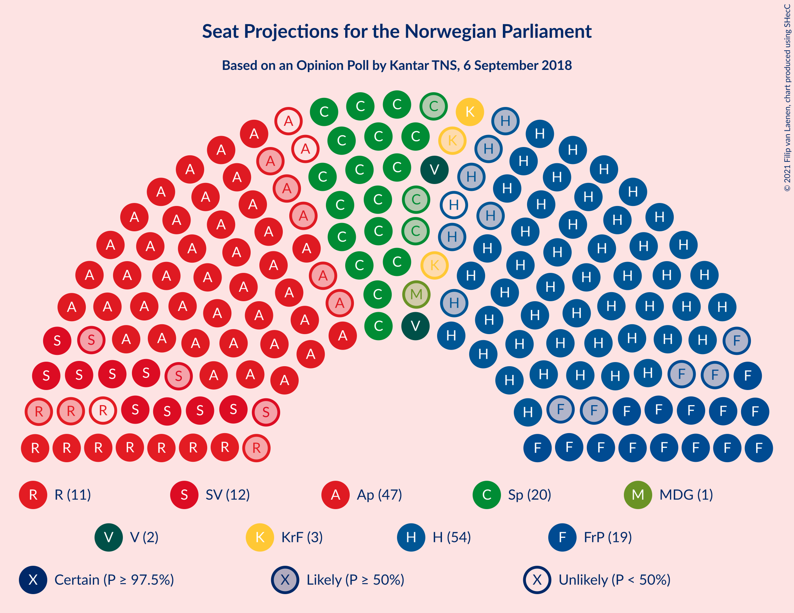
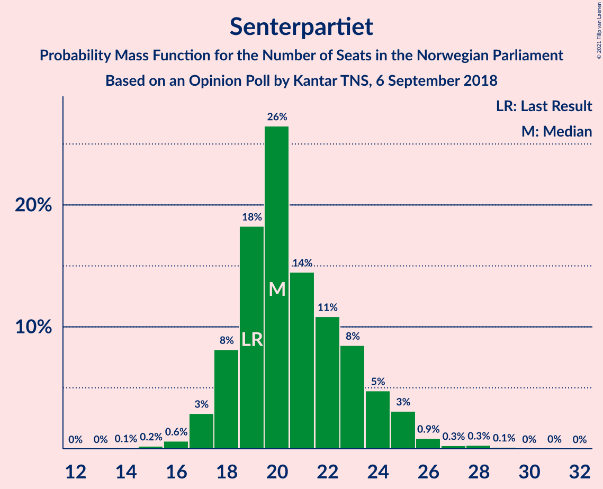
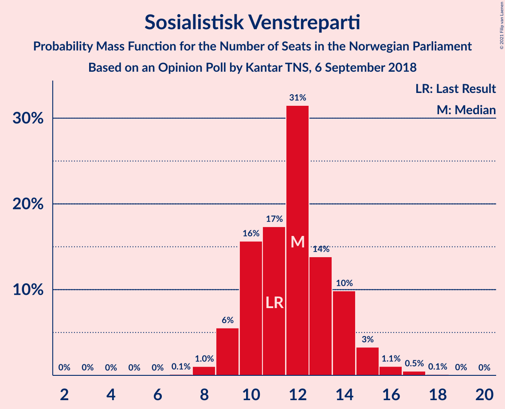
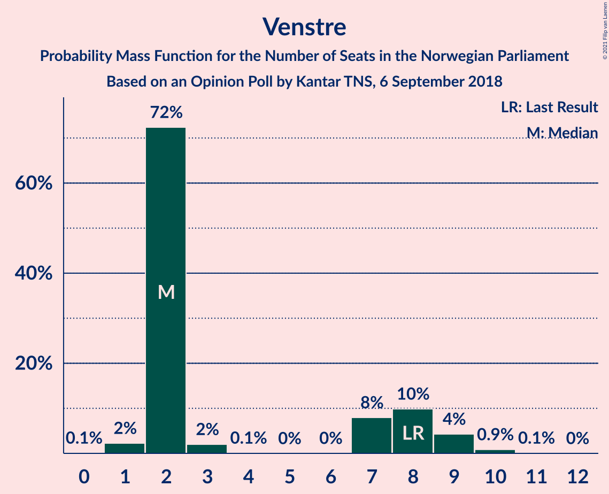
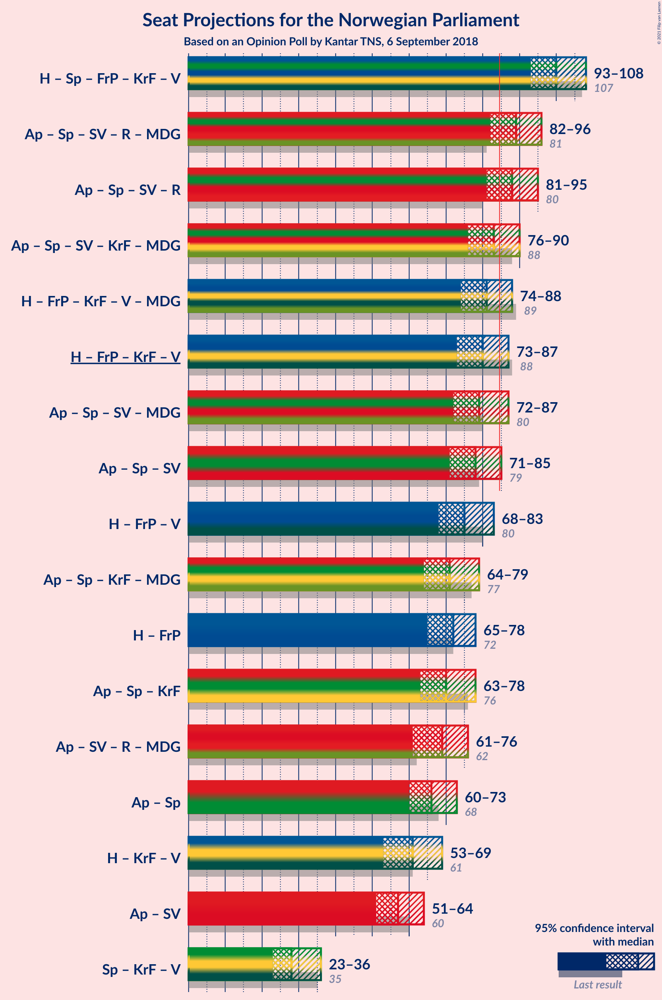
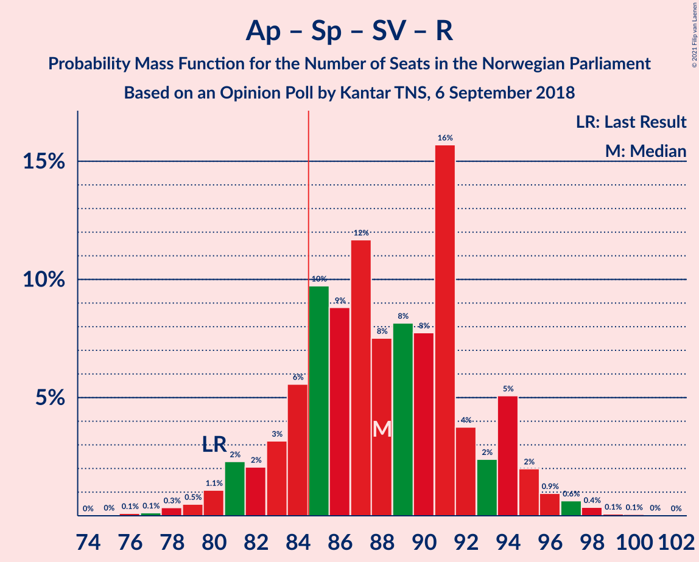
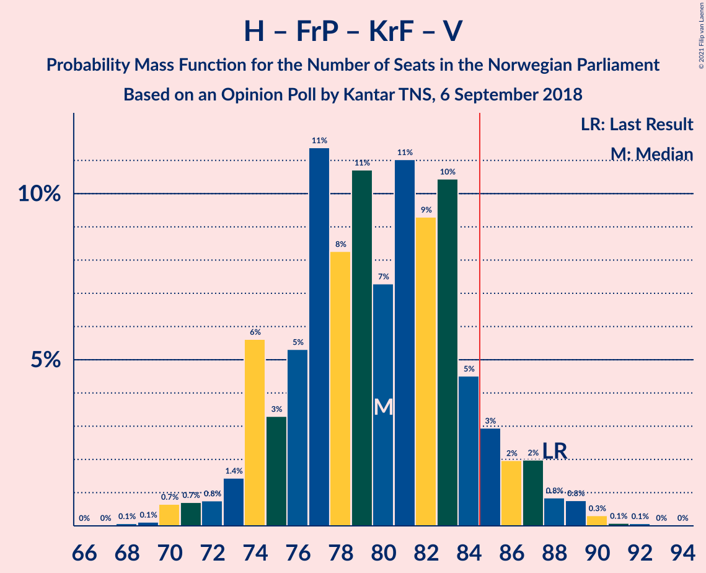
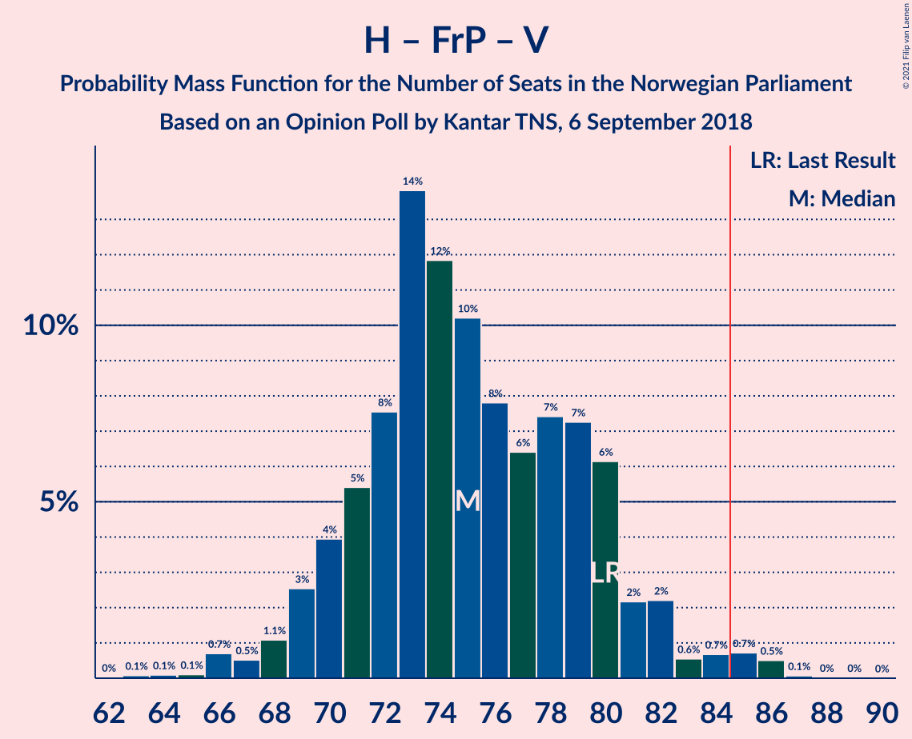
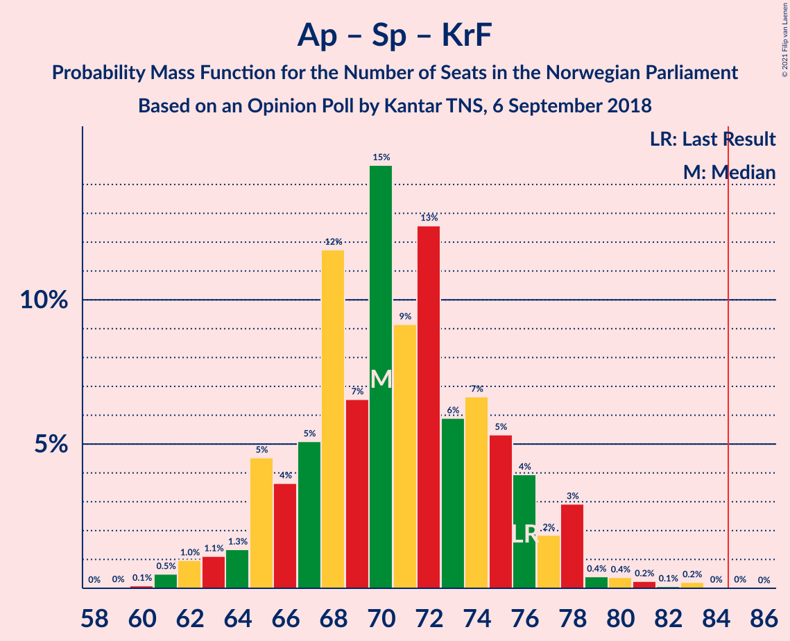

# Opinion Poll by Kantar TNS, 6 September 2018

<a href="#voting-intentions">Voting Intentions</a> | <a href="#seats">Seats</a> | <a href="#coalitions">Coalitions</a> | <a href="#technical-information">Technical Information</a>

## Voting Intentions

### Confidence Intervals

| Party | Last Result | Poll Result | 80% Confidence Interval | 90% Confidence Interval | 95% Confidence Interval | 99% Confidence Interval |
|:-----:|:-----------:|:-----------:|:-----------------------:|:-----------------------:|:-----------------------:|:-----------------------:|
| Høyre | 25.0% | 29.0% | 26.9–31.3% |26.3–31.9% |25.8–32.5% |24.8–33.5% |
| Arbeiderpartiet | 27.4% | 24.9% | 22.9–27.0% |22.3–27.6% |21.8–28.2% |20.9–29.2% |
| Senterpartiet | 10.3% | 11.5% | 10.1–13.2% |9.7–13.7% |9.4–14.1% |8.8–14.9% |
| Fremskrittspartiet | 15.2% | 10.4% | 9.1–12.0% |8.7–12.5% |8.4–12.9% |7.8–13.7% |
| Sosialistisk Venstreparti | 6.0% | 6.5% | 5.5–7.9% |5.2–8.2% |4.9–8.6% |4.5–9.3% |
| Rødt | 2.4% | 5.6% | 4.6–6.8% |4.3–7.2% |4.1–7.5% |3.7–8.1% |
| Kristelig Folkeparti | 4.2% | 3.8% | 3.0–4.8% |2.8–5.1% |2.6–5.4% |2.3–6.0% |
| Venstre | 4.4% | 3.5% | 2.7–4.5% |2.5–4.8% |2.4–5.1% |2.1–5.6% |
| Miljøpartiet De Grønne | 3.2% | 2.4% | 1.8–3.3% |1.6–3.5% |1.5–3.7% |1.2–4.2% |

*Note:* The poll result column reflects the actual value used in the calculations. Published results may vary slightly, and in addition be rounded to fewer digits.

## Seats

### Confidence Intervals

| Party | Last Result | Median | 80% Confidence Interval | 90% Confidence Interval | 95% Confidence Interval | 99% Confidence Interval |
|:-----:|:-----------:|:------:|:-----------------------:|:-----------------------:|:-----------------------:|:-----------------------:|
| <a href="#høyre">Høyre</a> | 45 | 53 | 49–57 |48–58 |47–59 |45–61 |
| <a href="#arbeiderpartiet">Arbeiderpartiet</a> | 49 | 45 | 42–49 |41–50 |40–52 |38–54 |
| <a href="#senterpartiet">Senterpartiet</a> | 19 | 20 | 18–23 |18–24 |17–25 |16–27 |
| <a href="#fremskrittspartiet">Fremskrittspartiet</a> | 27 | 19 | 16–22 |15–23 |14–23 |13–25 |
| <a href="#sosialistisk-venstreparti">Sosialistisk Venstreparti</a> | 11 | 12 | 10–14 |9–15 |9–15 |8–17 |
| <a href="#rødt">Rødt</a> | 1 | 10 | 8–12 |8–13 |7–13 |2–14 |
| <a href="#kristelig-folkeparti">Kristelig Folkeparti</a> | 8 | 3 | 1–8 |1–9 |1–9 |1–10 |
| <a href="#venstre">Venstre</a> | 8 | 2 | 2–8 |2–9 |2–9 |1–10 |
| <a href="#miljøpartiet-de-grønne">Miljøpartiet De Grønne</a> | 1 | 1 | 0–2 |0–2 |0–2 |0–7 |

### Høyre

*For a full overview of the results for this party, see the [Høyre](party-høyre.html) page.*

| Number of Seats | Probability | Accumulated | Special Marks |
|:---------------:|:-----------:|:-----------:|:-------------:|
| 42 | 0.1% | 100% |  |
| 43 | 0.1% | 99.9% |  |
| 44 | 0.3% | 99.8% |  |
| 45 | 0.5% | 99.5% | Last Result |
| 46 | 1.4% | 99.0% |  |
| 47 | 2% | 98% |  |
| 48 | 4% | 96% |  |
| 49 | 6% | 92% |  |
| 50 | 7% | 86% |  |
| 51 | 11% | 78% |  |
| 52 | 13% | 67% |  |
| 53 | 8% | 55% | Median |
| 54 | 16% | 47% |  |
| 55 | 11% | 31% |  |
| 56 | 7% | 21% |  |
| 57 | 7% | 14% |  |
| 58 | 4% | 8% |  |
| 59 | 1.2% | 3% |  |
| 60 | 0.8% | 2% |  |
| 61 | 0.6% | 1.1% |  |
| 62 | 0.3% | 0.5% |  |
| 63 | 0.2% | 0.2% |  |
| 64 | 0% | 0% |  |

### Arbeiderpartiet

*For a full overview of the results for this party, see the [Arbeiderpartiet](party-arbeiderpartiet.html) page.*

| Number of Seats | Probability | Accumulated | Special Marks |
|:---------------:|:-----------:|:-----------:|:-------------:|
| 36 | 0% | 100% |  |
| 37 | 0.1% | 99.9% |  |
| 38 | 0.4% | 99.8% |  |
| 39 | 0.4% | 99.5% |  |
| 40 | 2% | 99.1% |  |
| 41 | 4% | 97% |  |
| 42 | 7% | 93% |  |
| 43 | 8% | 86% |  |
| 44 | 7% | 79% |  |
| 45 | 26% | 71% | Median |
| 46 | 13% | 45% |  |
| 47 | 14% | 32% |  |
| 48 | 7% | 18% |  |
| 49 | 3% | 11% | Last Result |
| 50 | 3% | 8% |  |
| 51 | 1.4% | 5% |  |
| 52 | 2% | 3% |  |
| 53 | 0.6% | 1.5% |  |
| 54 | 0.7% | 0.9% |  |
| 55 | 0.2% | 0.3% |  |
| 56 | 0.1% | 0.1% |  |
| 57 | 0% | 0.1% |  |
| 58 | 0% | 0% |  |

### Senterpartiet

*For a full overview of the results for this party, see the [Senterpartiet](party-senterpartiet.html) page.*

| Number of Seats | Probability | Accumulated | Special Marks |
|:---------------:|:-----------:|:-----------:|:-------------:|
| 14 | 0.1% | 100% |  |
| 15 | 0.2% | 99.9% |  |
| 16 | 0.6% | 99.7% |  |
| 17 | 3% | 99.1% |  |
| 18 | 8% | 96% |  |
| 19 | 18% | 88% | Last Result |
| 20 | 26% | 70% | Median |
| 21 | 14% | 43% |  |
| 22 | 11% | 29% |  |
| 23 | 8% | 18% |  |
| 24 | 5% | 9% |  |
| 25 | 3% | 5% |  |
| 26 | 0.9% | 2% |  |
| 27 | 0.3% | 0.7% |  |
| 28 | 0.3% | 0.5% |  |
| 29 | 0.1% | 0.2% |  |
| 30 | 0% | 0.1% |  |
| 31 | 0% | 0% |  |

### Fremskrittspartiet

*For a full overview of the results for this party, see the [Fremskrittspartiet](party-fremskrittspartiet.html) page.*

| Number of Seats | Probability | Accumulated | Special Marks |
|:---------------:|:-----------:|:-----------:|:-------------:|
| 12 | 0.1% | 100% |  |
| 13 | 0.5% | 99.9% |  |
| 14 | 2% | 99.4% |  |
| 15 | 4% | 97% |  |
| 16 | 8% | 93% |  |
| 17 | 8% | 85% |  |
| 18 | 22% | 77% |  |
| 19 | 20% | 55% | Median |
| 20 | 14% | 34% |  |
| 21 | 9% | 21% |  |
| 22 | 7% | 12% |  |
| 23 | 3% | 5% |  |
| 24 | 1.2% | 2% |  |
| 25 | 0.7% | 0.9% |  |
| 26 | 0.1% | 0.2% |  |
| 27 | 0% | 0% | Last Result |

### Sosialistisk Venstreparti

*For a full overview of the results for this party, see the [Sosialistisk Venstreparti](party-sosialistiskvenstreparti.html) page.*

| Number of Seats | Probability | Accumulated | Special Marks |
|:---------------:|:-----------:|:-----------:|:-------------:|
| 2 | 0% | 100% |  |
| 3 | 0% | 99.9% |  |
| 4 | 0% | 99.9% |  |
| 5 | 0% | 99.9% |  |
| 6 | 0% | 99.9% |  |
| 7 | 0.1% | 99.9% |  |
| 8 | 1.0% | 99.8% |  |
| 9 | 6% | 98.7% |  |
| 10 | 16% | 93% |  |
| 11 | 17% | 78% | Last Result |
| 12 | 31% | 60% | Median |
| 13 | 14% | 29% |  |
| 14 | 10% | 15% |  |
| 15 | 3% | 5% |  |
| 16 | 1.1% | 2% |  |
| 17 | 0.5% | 0.7% |  |
| 18 | 0.1% | 0.2% |  |
| 19 | 0% | 0% |  |

### Rødt

*For a full overview of the results for this party, see the [Rødt](party-rødt.html) page.*

| Number of Seats | Probability | Accumulated | Special Marks |
|:---------------:|:-----------:|:-----------:|:-------------:|
| 1 | 0% | 100% | Last Result |
| 2 | 2% | 100% |  |
| 3 | 0% | 98% |  |
| 4 | 0% | 98% |  |
| 5 | 0% | 98% |  |
| 6 | 0% | 98% |  |
| 7 | 2% | 98% |  |
| 8 | 10% | 97% |  |
| 9 | 18% | 87% |  |
| 10 | 21% | 69% | Median |
| 11 | 24% | 48% |  |
| 12 | 18% | 24% |  |
| 13 | 4% | 6% |  |
| 14 | 2% | 2% |  |
| 15 | 0.3% | 0.5% |  |
| 16 | 0.1% | 0.1% |  |
| 17 | 0% | 0% |  |

### Kristelig Folkeparti

*For a full overview of the results for this party, see the [Kristelig Folkeparti](party-kristeligfolkeparti.html) page.*

| Number of Seats | Probability | Accumulated | Special Marks |
|:---------------:|:-----------:|:-----------:|:-------------:|
| 0 | 0.5% | 100% |  |
| 1 | 14% | 99.5% |  |
| 2 | 4% | 85% |  |
| 3 | 42% | 81% | Median |
| 4 | 0% | 38% |  |
| 5 | 0% | 38% |  |
| 6 | 0.1% | 38% |  |
| 7 | 9% | 38% |  |
| 8 | 22% | 29% | Last Result |
| 9 | 5% | 7% |  |
| 10 | 2% | 2% |  |
| 11 | 0.4% | 0.4% |  |
| 12 | 0.1% | 0.1% |  |
| 13 | 0% | 0% |  |

### Venstre

*For a full overview of the results for this party, see the [Venstre](party-venstre.html) page.*

| Number of Seats | Probability | Accumulated | Special Marks |
|:---------------:|:-----------:|:-----------:|:-------------:|
| 0 | 0.1% | 100% |  |
| 1 | 2% | 99.9% |  |
| 2 | 72% | 98% | Median |
| 3 | 2% | 25% |  |
| 4 | 0.1% | 23% |  |
| 5 | 0% | 23% |  |
| 6 | 0% | 23% |  |
| 7 | 8% | 23% |  |
| 8 | 10% | 15% | Last Result |
| 9 | 4% | 5% |  |
| 10 | 0.9% | 1.0% |  |
| 11 | 0.1% | 0.1% |  |
| 12 | 0% | 0% |  |

### Miljøpartiet De Grønne

*For a full overview of the results for this party, see the [Miljøpartiet De Grønne](party-miljøpartietdegrønne.html) page.*

| Number of Seats | Probability | Accumulated | Special Marks |
|:---------------:|:-----------:|:-----------:|:-------------:|
| 0 | 19% | 100% |  |
| 1 | 69% | 81% | Last Result, Median |
| 2 | 11% | 12% |  |
| 3 | 0.3% | 1.3% |  |
| 4 | 0% | 1.0% |  |
| 5 | 0% | 1.0% |  |
| 6 | 0% | 1.0% |  |
| 7 | 0.7% | 1.0% |  |
| 8 | 0.3% | 0.3% |  |
| 9 | 0% | 0% |  |

## Coalitions

### Confidence Intervals

| Coalition | Last Result | Median | Majority? | 80% Confidence Interval | 90% Confidence Interval | 95% Confidence Interval | 99% Confidence Interval |
|:---------:|:-----------:|:------:|:---------:|:-----------------------:|:-----------------------:|:-----------------------:|:-----------------------:|
| Høyre – Senterpartiet – Fremskrittspartiet – Kristelig Folkeparti – Venstre | 107 | 100 | 100% | 97–105 | 95–107 | 93–108 | 91–109 |
| Arbeiderpartiet – Senterpartiet – Sosialistisk Venstreparti – Rødt – Miljøpartiet De Grønne | 81 | 89 | 90% | 85–94 | 83–95 | 82–96 | 79–99 |
| Arbeiderpartiet – Senterpartiet – Sosialistisk Venstreparti – Rødt | 80 | 88 | 85% | 84–93 | 82–94 | 81–95 | 78–98 |
| Arbeiderpartiet – Senterpartiet – Sosialistisk Venstreparti – Kristelig Folkeparti – Miljøpartiet De Grønne | 88 | 83 | 37% | 79–88 | 78–89 | 76–90 | 74–94 |
| Høyre – Fremskrittspartiet – Kristelig Folkeparti – Venstre – Miljøpartiet De Grønne | 89 | 81 | 15% | 76–85 | 75–87 | 74–88 | 71–91 |
| Høyre – Fremskrittspartiet – Kristelig Folkeparti – Venstre | 88 | 80 | 9% | 75–84 | 74–86 | 73–87 | 70–90 |
| Arbeiderpartiet – Senterpartiet – Sosialistisk Venstreparti – Miljøpartiet De Grønne | 80 | 79 | 6% | 75–83 | 73–85 | 72–87 | 70–89 |
| Arbeiderpartiet – Senterpartiet – Sosialistisk Venstreparti | 79 | 78 | 4% | 73–82 | 72–84 | 71–85 | 69–88 |
| Høyre – Fremskrittspartiet – Venstre | 80 | 75 | 1.4% | 71–80 | 69–81 | 68–83 | 66–86 |
| Arbeiderpartiet – Senterpartiet – Kristelig Folkeparti – Miljøpartiet De Grønne | 77 | 71 | 0.1% | 67–76 | 66–78 | 64–79 | 62–82 |
| Høyre – Fremskrittspartiet | 72 | 72 | 0% | 68–77 | 66–78 | 65–78 | 62–80 |
| Arbeiderpartiet – Senterpartiet – Kristelig Folkeparti | 76 | 70 | 0% | 66–76 | 65–77 | 63–78 | 61–81 |
| Arbeiderpartiet – Sosialistisk Venstreparti – Rødt – Miljøpartiet De Grønne | 62 | 69 | 0% | 64–72 | 62–74 | 61–76 | 60–77 |
| Arbeiderpartiet – Senterpartiet | 68 | 66 | 0% | 62–70 | 61–72 | 60–73 | 58–75 |
| Høyre – Kristelig Folkeparti – Venstre | 61 | 61 | 0% | 55–66 | 55–68 | 53–69 | 51–72 |
| Arbeiderpartiet – Sosialistisk Venstreparti | 60 | 57 | 0% | 53–61 | 52–62 | 51–64 | 50–66 |
| Senterpartiet – Kristelig Folkeparti – Venstre | 35 | 28 | 0% | 24–34 | 23–35 | 23–36 | 20–38 |

### Høyre – Senterpartiet – Fremskrittspartiet – Kristelig Folkeparti – Venstre

| Number of Seats | Probability | Accumulated | Special Marks |
|:---------------:|:-----------:|:-----------:|:-------------:|
| 88 | 0.1% | 100% |  |
| 89 | 0.1% | 99.9% |  |
| 90 | 0.2% | 99.8% |  |
| 91 | 0.3% | 99.6% |  |
| 92 | 0.8% | 99.4% |  |
| 93 | 2% | 98.6% |  |
| 94 | 2% | 97% |  |
| 95 | 2% | 95% |  |
| 96 | 2% | 93% |  |
| 97 | 15% | 91% | Median |
| 98 | 7% | 76% |  |
| 99 | 10% | 69% |  |
| 100 | 12% | 59% |  |
| 101 | 9% | 47% |  |
| 102 | 12% | 38% |  |
| 103 | 10% | 27% |  |
| 104 | 5% | 16% |  |
| 105 | 5% | 11% |  |
| 106 | 1.4% | 7% |  |
| 107 | 2% | 5% | Last Result |
| 108 | 2% | 3% |  |
| 109 | 0.6% | 1.1% |  |
| 110 | 0.2% | 0.5% |  |
| 111 | 0.1% | 0.3% |  |
| 112 | 0.1% | 0.2% |  |
| 113 | 0.1% | 0.1% |  |
| 114 | 0% | 0% |  |

### Arbeiderpartiet – Senterpartiet – Sosialistisk Venstreparti – Rødt – Miljøpartiet De Grønne

| Number of Seats | Probability | Accumulated | Special Marks |
|:---------------:|:-----------:|:-----------:|:-------------:|
| 76 | 0% | 100% |  |
| 77 | 0.1% | 99.9% |  |
| 78 | 0.1% | 99.8% |  |
| 79 | 0.3% | 99.7% |  |
| 80 | 0.8% | 99.4% |  |
| 81 | 0.9% | 98.5% | Last Result |
| 82 | 2% | 98% |  |
| 83 | 2% | 96% |  |
| 84 | 3% | 94% |  |
| 85 | 5% | 90% | Majority |
| 86 | 11% | 86% |  |
| 87 | 9% | 75% |  |
| 88 | 11% | 66% | Median |
| 89 | 7% | 55% |  |
| 90 | 11% | 47% |  |
| 91 | 8% | 37% |  |
| 92 | 11% | 29% |  |
| 93 | 5% | 17% |  |
| 94 | 3% | 12% |  |
| 95 | 5% | 9% |  |
| 96 | 1.4% | 4% |  |
| 97 | 0.6% | 2% |  |
| 98 | 0.7% | 2% |  |
| 99 | 0.6% | 0.9% |  |
| 100 | 0.1% | 0.2% |  |
| 101 | 0.1% | 0.1% |  |
| 102 | 0% | 0% |  |

### Arbeiderpartiet – Senterpartiet – Sosialistisk Venstreparti – Rødt

| Number of Seats | Probability | Accumulated | Special Marks |
|:---------------:|:-----------:|:-----------:|:-------------:|
| 75 | 0% | 100% |  |
| 76 | 0.1% | 99.9% |  |
| 77 | 0.1% | 99.8% |  |
| 78 | 0.3% | 99.7% |  |
| 79 | 0.5% | 99.4% |  |
| 80 | 1.1% | 98.9% | Last Result |
| 81 | 2% | 98% |  |
| 82 | 2% | 95% |  |
| 83 | 3% | 93% |  |
| 84 | 6% | 90% |  |
| 85 | 10% | 85% | Majority |
| 86 | 9% | 75% |  |
| 87 | 12% | 66% | Median |
| 88 | 8% | 54% |  |
| 89 | 8% | 47% |  |
| 90 | 8% | 39% |  |
| 91 | 16% | 31% |  |
| 92 | 4% | 15% |  |
| 93 | 2% | 12% |  |
| 94 | 5% | 9% |  |
| 95 | 2% | 4% |  |
| 96 | 0.9% | 2% |  |
| 97 | 0.6% | 1.2% |  |
| 98 | 0.4% | 0.6% |  |
| 99 | 0.1% | 0.2% |  |
| 100 | 0.1% | 0.1% |  |
| 101 | 0% | 0.1% |  |
| 102 | 0% | 0% |  |

### Arbeiderpartiet – Senterpartiet – Sosialistisk Venstreparti – Kristelig Folkeparti – Miljøpartiet De Grønne

| Number of Seats | Probability | Accumulated | Special Marks |
|:---------------:|:-----------:|:-----------:|:-------------:|
| 72 | 0.1% | 100% |  |
| 73 | 0.2% | 99.9% |  |
| 74 | 0.9% | 99.7% |  |
| 75 | 1.2% | 98.8% |  |
| 76 | 2% | 98% |  |
| 77 | 0.8% | 96% |  |
| 78 | 2% | 95% |  |
| 79 | 5% | 93% |  |
| 80 | 9% | 88% |  |
| 81 | 10% | 80% | Median |
| 82 | 10% | 70% |  |
| 83 | 14% | 60% |  |
| 84 | 9% | 46% |  |
| 85 | 10% | 37% | Majority |
| 86 | 6% | 28% |  |
| 87 | 6% | 22% |  |
| 88 | 6% | 16% | Last Result |
| 89 | 6% | 10% |  |
| 90 | 1.4% | 4% |  |
| 91 | 0.7% | 2% |  |
| 92 | 0.7% | 2% |  |
| 93 | 0.3% | 0.9% |  |
| 94 | 0.2% | 0.6% |  |
| 95 | 0.2% | 0.4% |  |
| 96 | 0.1% | 0.2% |  |
| 97 | 0% | 0.1% |  |
| 98 | 0% | 0% |  |

### Høyre – Fremskrittspartiet – Kristelig Folkeparti – Venstre – Miljøpartiet De Grønne

| Number of Seats | Probability | Accumulated | Special Marks |
|:---------------:|:-----------:|:-----------:|:-------------:|
| 68 | 0% | 100% |  |
| 69 | 0.1% | 99.9% |  |
| 70 | 0.1% | 99.9% |  |
| 71 | 0.4% | 99.8% |  |
| 72 | 0.7% | 99.4% |  |
| 73 | 1.1% | 98.7% |  |
| 74 | 2% | 98% |  |
| 75 | 5% | 96% |  |
| 76 | 3% | 90% |  |
| 77 | 4% | 88% |  |
| 78 | 16% | 84% | Median |
| 79 | 8% | 68% |  |
| 80 | 8% | 60% |  |
| 81 | 7% | 52% |  |
| 82 | 12% | 45% |  |
| 83 | 9% | 33% |  |
| 84 | 10% | 24% |  |
| 85 | 6% | 15% | Majority |
| 86 | 3% | 9% |  |
| 87 | 2% | 6% |  |
| 88 | 2% | 4% |  |
| 89 | 1.0% | 2% | Last Result |
| 90 | 0.4% | 1.0% |  |
| 91 | 0.3% | 0.5% |  |
| 92 | 0.1% | 0.2% |  |
| 93 | 0.1% | 0.1% |  |
| 94 | 0% | 0.1% |  |
| 95 | 0% | 0% |  |

### Høyre – Fremskrittspartiet – Kristelig Folkeparti – Venstre

| Number of Seats | Probability | Accumulated | Special Marks |
|:---------------:|:-----------:|:-----------:|:-------------:|
| 67 | 0% | 100% |  |
| 68 | 0.1% | 99.9% |  |
| 69 | 0.1% | 99.9% |  |
| 70 | 0.7% | 99.8% |  |
| 71 | 0.7% | 99.1% |  |
| 72 | 0.8% | 98% |  |
| 73 | 1.4% | 98% |  |
| 74 | 6% | 96% |  |
| 75 | 3% | 91% |  |
| 76 | 5% | 87% |  |
| 77 | 11% | 82% | Median |
| 78 | 8% | 71% |  |
| 79 | 11% | 62% |  |
| 80 | 7% | 52% |  |
| 81 | 11% | 44% |  |
| 82 | 9% | 33% |  |
| 83 | 10% | 24% |  |
| 84 | 5% | 14% |  |
| 85 | 3% | 9% | Majority |
| 86 | 2% | 6% |  |
| 87 | 2% | 4% |  |
| 88 | 0.8% | 2% | Last Result |
| 89 | 0.8% | 1.3% |  |
| 90 | 0.3% | 0.5% |  |
| 91 | 0.1% | 0.2% |  |
| 92 | 0.1% | 0.1% |  |
| 93 | 0% | 0.1% |  |
| 94 | 0% | 0% |  |

### Arbeiderpartiet – Senterpartiet – Sosialistisk Venstreparti – Miljøpartiet De Grønne

| Number of Seats | Probability | Accumulated | Special Marks |
|:---------------:|:-----------:|:-----------:|:-------------:|
| 68 | 0.1% | 100% |  |
| 69 | 0.1% | 99.9% |  |
| 70 | 0.4% | 99.8% |  |
| 71 | 1.0% | 99.4% |  |
| 72 | 1.2% | 98% |  |
| 73 | 4% | 97% |  |
| 74 | 3% | 94% |  |
| 75 | 4% | 90% |  |
| 76 | 8% | 86% |  |
| 77 | 13% | 78% |  |
| 78 | 11% | 65% | Median |
| 79 | 11% | 54% |  |
| 80 | 15% | 43% | Last Result |
| 81 | 7% | 27% |  |
| 82 | 6% | 20% |  |
| 83 | 6% | 14% |  |
| 84 | 3% | 8% |  |
| 85 | 2% | 6% | Majority |
| 86 | 1.1% | 4% |  |
| 87 | 1.5% | 3% |  |
| 88 | 0.3% | 1.3% |  |
| 89 | 0.7% | 1.0% |  |
| 90 | 0.1% | 0.2% |  |
| 91 | 0.1% | 0.2% |  |
| 92 | 0% | 0.1% |  |
| 93 | 0% | 0% |  |

### Arbeiderpartiet – Senterpartiet – Sosialistisk Venstreparti

| Number of Seats | Probability | Accumulated | Special Marks |
|:---------------:|:-----------:|:-----------:|:-------------:|
| 67 | 0.1% | 100% |  |
| 68 | 0.1% | 99.9% |  |
| 69 | 0.4% | 99.7% |  |
| 70 | 0.4% | 99.4% |  |
| 71 | 2% | 99.0% |  |
| 72 | 3% | 97% |  |
| 73 | 5% | 95% |  |
| 74 | 4% | 90% |  |
| 75 | 8% | 86% |  |
| 76 | 14% | 78% |  |
| 77 | 10% | 64% | Median |
| 78 | 11% | 54% |  |
| 79 | 13% | 43% | Last Result |
| 80 | 11% | 30% |  |
| 81 | 6% | 19% |  |
| 82 | 5% | 13% |  |
| 83 | 3% | 8% |  |
| 84 | 1.4% | 5% |  |
| 85 | 1.4% | 4% | Majority |
| 86 | 1.3% | 2% |  |
| 87 | 0.3% | 1.2% |  |
| 88 | 0.7% | 0.9% |  |
| 89 | 0.1% | 0.2% |  |
| 90 | 0.1% | 0.1% |  |
| 91 | 0% | 0.1% |  |
| 92 | 0% | 0% |  |

### Høyre – Fremskrittspartiet – Venstre

| Number of Seats | Probability | Accumulated | Special Marks |
|:---------------:|:-----------:|:-----------:|:-------------:|
| 62 | 0% | 100% |  |
| 63 | 0.1% | 99.9% |  |
| 64 | 0.1% | 99.9% |  |
| 65 | 0.1% | 99.8% |  |
| 66 | 0.7% | 99.7% |  |
| 67 | 0.5% | 99.0% |  |
| 68 | 1.1% | 98% |  |
| 69 | 3% | 97% |  |
| 70 | 4% | 95% |  |
| 71 | 5% | 91% |  |
| 72 | 8% | 85% |  |
| 73 | 14% | 78% |  |
| 74 | 12% | 64% | Median |
| 75 | 10% | 52% |  |
| 76 | 8% | 42% |  |
| 77 | 6% | 34% |  |
| 78 | 7% | 28% |  |
| 79 | 7% | 20% |  |
| 80 | 6% | 13% | Last Result |
| 81 | 2% | 7% |  |
| 82 | 2% | 5% |  |
| 83 | 0.6% | 3% |  |
| 84 | 0.7% | 2% |  |
| 85 | 0.7% | 1.4% | Majority |
| 86 | 0.5% | 0.6% |  |
| 87 | 0.1% | 0.1% |  |
| 88 | 0% | 0.1% |  |
| 89 | 0% | 0% |  |

### Arbeiderpartiet – Senterpartiet – Kristelig Folkeparti – Miljøpartiet De Grønne

| Number of Seats | Probability | Accumulated | Special Marks |
|:---------------:|:-----------:|:-----------:|:-------------:|
| 60 | 0% | 100% |  |
| 61 | 0.3% | 99.9% |  |
| 62 | 0.3% | 99.6% |  |
| 63 | 0.9% | 99.3% |  |
| 64 | 1.1% | 98% |  |
| 65 | 1.5% | 97% |  |
| 66 | 5% | 96% |  |
| 67 | 3% | 91% |  |
| 68 | 5% | 88% |  |
| 69 | 14% | 83% | Median |
| 70 | 4% | 69% |  |
| 71 | 17% | 65% |  |
| 72 | 7% | 48% |  |
| 73 | 13% | 41% |  |
| 74 | 6% | 29% |  |
| 75 | 7% | 22% |  |
| 76 | 6% | 16% |  |
| 77 | 3% | 10% | Last Result |
| 78 | 2% | 6% |  |
| 79 | 2% | 4% |  |
| 80 | 0.6% | 2% |  |
| 81 | 0.4% | 1.0% |  |
| 82 | 0.2% | 0.6% |  |
| 83 | 0.1% | 0.4% |  |
| 84 | 0.2% | 0.3% |  |
| 85 | 0% | 0.1% | Majority |
| 86 | 0% | 0.1% |  |
| 87 | 0% | 0% |  |

### Høyre – Fremskrittspartiet

| Number of Seats | Probability | Accumulated | Special Marks |
|:---------------:|:-----------:|:-----------:|:-------------:|
| 60 | 0% | 100% |  |
| 61 | 0.2% | 99.9% |  |
| 62 | 0.2% | 99.7% |  |
| 63 | 0.5% | 99.5% |  |
| 64 | 1.5% | 99.0% |  |
| 65 | 2% | 98% |  |
| 66 | 2% | 96% |  |
| 67 | 4% | 94% |  |
| 68 | 7% | 90% |  |
| 69 | 7% | 83% |  |
| 70 | 9% | 76% |  |
| 71 | 17% | 67% |  |
| 72 | 13% | 51% | Last Result, Median |
| 73 | 10% | 37% |  |
| 74 | 6% | 27% |  |
| 75 | 4% | 21% |  |
| 76 | 5% | 17% |  |
| 77 | 4% | 11% |  |
| 78 | 4% | 7% |  |
| 79 | 0.8% | 2% |  |
| 80 | 1.1% | 2% |  |
| 81 | 0.2% | 0.5% |  |
| 82 | 0.1% | 0.3% |  |
| 83 | 0.1% | 0.2% |  |
| 84 | 0% | 0.1% |  |
| 85 | 0% | 0% | Majority |

### Arbeiderpartiet – Senterpartiet – Kristelig Folkeparti

| Number of Seats | Probability | Accumulated | Special Marks |
|:---------------:|:-----------:|:-----------:|:-------------:|
| 59 | 0% | 100% |  |
| 60 | 0.1% | 99.9% |  |
| 61 | 0.5% | 99.8% |  |
| 62 | 1.0% | 99.3% |  |
| 63 | 1.1% | 98% |  |
| 64 | 1.3% | 97% |  |
| 65 | 5% | 96% |  |
| 66 | 4% | 91% |  |
| 67 | 5% | 88% |  |
| 68 | 12% | 83% | Median |
| 69 | 7% | 71% |  |
| 70 | 15% | 64% |  |
| 71 | 9% | 50% |  |
| 72 | 13% | 41% |  |
| 73 | 6% | 28% |  |
| 74 | 7% | 22% |  |
| 75 | 5% | 15% |  |
| 76 | 4% | 10% | Last Result |
| 77 | 2% | 6% |  |
| 78 | 3% | 4% |  |
| 79 | 0.4% | 1.4% |  |
| 80 | 0.4% | 1.0% |  |
| 81 | 0.2% | 0.6% |  |
| 82 | 0.1% | 0.4% |  |
| 83 | 0.2% | 0.3% |  |
| 84 | 0% | 0.1% |  |
| 85 | 0% | 0% | Majority |

### Arbeiderpartiet – Sosialistisk Venstreparti – Rødt – Miljøpartiet De Grønne

| Number of Seats | Probability | Accumulated | Special Marks |
|:---------------:|:-----------:|:-----------:|:-------------:|
| 56 | 0.1% | 100% |  |
| 57 | 0.1% | 99.9% |  |
| 58 | 0.1% | 99.8% |  |
| 59 | 0.2% | 99.7% |  |
| 60 | 0.7% | 99.5% |  |
| 61 | 2% | 98.8% |  |
| 62 | 2% | 97% | Last Result |
| 63 | 2% | 94% |  |
| 64 | 5% | 93% |  |
| 65 | 5% | 88% |  |
| 66 | 10% | 83% |  |
| 67 | 12% | 72% |  |
| 68 | 9% | 61% | Median |
| 69 | 12% | 52% |  |
| 70 | 10% | 40% |  |
| 71 | 7% | 30% |  |
| 72 | 15% | 23% |  |
| 73 | 2% | 8% |  |
| 74 | 2% | 6% |  |
| 75 | 1.4% | 4% |  |
| 76 | 2% | 3% |  |
| 77 | 0.8% | 1.2% |  |
| 78 | 0.2% | 0.5% |  |
| 79 | 0.1% | 0.3% |  |
| 80 | 0.1% | 0.1% |  |
| 81 | 0.1% | 0.1% |  |
| 82 | 0% | 0% |  |

### Arbeiderpartiet – Senterpartiet

| Number of Seats | Probability | Accumulated | Special Marks |
|:---------------:|:-----------:|:-----------:|:-------------:|
| 56 | 0.1% | 100% |  |
| 57 | 0.1% | 99.9% |  |
| 58 | 0.4% | 99.8% |  |
| 59 | 0.7% | 99.4% |  |
| 60 | 2% | 98.6% |  |
| 61 | 4% | 97% |  |
| 62 | 6% | 93% |  |
| 63 | 6% | 87% |  |
| 64 | 13% | 81% |  |
| 65 | 15% | 68% | Median |
| 66 | 9% | 53% |  |
| 67 | 15% | 45% |  |
| 68 | 9% | 29% | Last Result |
| 69 | 5% | 20% |  |
| 70 | 5% | 15% |  |
| 71 | 5% | 10% |  |
| 72 | 1.5% | 5% |  |
| 73 | 1.2% | 4% |  |
| 74 | 1.4% | 2% |  |
| 75 | 0.5% | 1.0% |  |
| 76 | 0.2% | 0.5% |  |
| 77 | 0.2% | 0.3% |  |
| 78 | 0% | 0.1% |  |
| 79 | 0% | 0% |  |

### Høyre – Kristelig Folkeparti – Venstre

| Number of Seats | Probability | Accumulated | Special Marks |
|:---------------:|:-----------:|:-----------:|:-------------:|
| 49 | 0.1% | 100% |  |
| 50 | 0.1% | 99.9% |  |
| 51 | 0.4% | 99.8% |  |
| 52 | 1.0% | 99.4% |  |
| 53 | 1.4% | 98% |  |
| 54 | 2% | 97% |  |
| 55 | 6% | 95% |  |
| 56 | 3% | 89% |  |
| 57 | 5% | 87% |  |
| 58 | 5% | 82% | Median |
| 59 | 17% | 77% |  |
| 60 | 6% | 60% |  |
| 61 | 14% | 54% | Last Result |
| 62 | 5% | 40% |  |
| 63 | 12% | 35% |  |
| 64 | 4% | 23% |  |
| 65 | 6% | 19% |  |
| 66 | 4% | 13% |  |
| 67 | 4% | 9% |  |
| 68 | 2% | 6% |  |
| 69 | 2% | 4% |  |
| 70 | 0.7% | 2% |  |
| 71 | 0.3% | 0.9% |  |
| 72 | 0.2% | 0.6% |  |
| 73 | 0.2% | 0.4% |  |
| 74 | 0.2% | 0.2% |  |
| 75 | 0% | 0% |  |

### Arbeiderpartiet – Sosialistisk Venstreparti

| Number of Seats | Probability | Accumulated | Special Marks |
|:---------------:|:-----------:|:-----------:|:-------------:|
| 47 | 0% | 100% |  |
| 48 | 0.1% | 99.9% |  |
| 49 | 0.2% | 99.8% |  |
| 50 | 1.2% | 99.6% |  |
| 51 | 2% | 98% |  |
| 52 | 4% | 97% |  |
| 53 | 6% | 93% |  |
| 54 | 5% | 88% |  |
| 55 | 7% | 82% |  |
| 56 | 11% | 75% |  |
| 57 | 15% | 65% | Median |
| 58 | 15% | 50% |  |
| 59 | 18% | 34% |  |
| 60 | 4% | 16% | Last Result |
| 61 | 3% | 12% |  |
| 62 | 4% | 9% |  |
| 63 | 2% | 5% |  |
| 64 | 1.0% | 3% |  |
| 65 | 2% | 2% |  |
| 66 | 0.2% | 0.7% |  |
| 67 | 0.3% | 0.4% |  |
| 68 | 0.1% | 0.2% |  |
| 69 | 0.1% | 0.1% |  |
| 70 | 0% | 0% |  |

### Senterpartiet – Kristelig Folkeparti – Venstre

| Number of Seats | Probability | Accumulated | Special Marks |
|:---------------:|:-----------:|:-----------:|:-------------:|
| 19 | 0.1% | 100% |  |
| 20 | 0.4% | 99.9% |  |
| 21 | 0.6% | 99.5% |  |
| 22 | 1.3% | 98.9% |  |
| 23 | 4% | 98% |  |
| 24 | 6% | 93% |  |
| 25 | 17% | 87% | Median |
| 26 | 5% | 71% |  |
| 27 | 8% | 66% |  |
| 28 | 8% | 58% |  |
| 29 | 11% | 50% |  |
| 30 | 8% | 39% |  |
| 31 | 7% | 31% |  |
| 32 | 8% | 24% |  |
| 33 | 6% | 16% |  |
| 34 | 3% | 10% |  |
| 35 | 2% | 7% | Last Result |
| 36 | 3% | 4% |  |
| 37 | 0.7% | 2% |  |
| 38 | 0.5% | 0.9% |  |
| 39 | 0.2% | 0.4% |  |
| 40 | 0.1% | 0.2% |  |
| 41 | 0% | 0.1% |  |
| 42 | 0% | 0.1% |  |
| 43 | 0% | 0% |  |

## Technical Information

### Opinion Poll

+ **Polling firm:** Kantar TNS
+ **Commissioner(s):** —
+ **Fieldwork period:** 6 September 2018

### Calculations

+ **Sample size:** 720
+ **Simulations done:** 1,048,576
+ **Error estimate:** 1.63%

