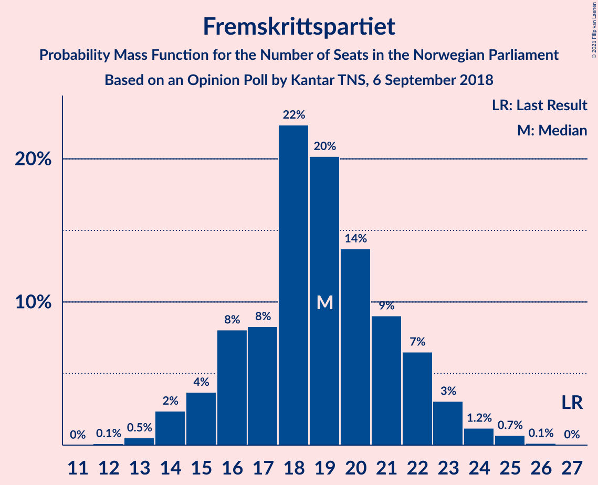
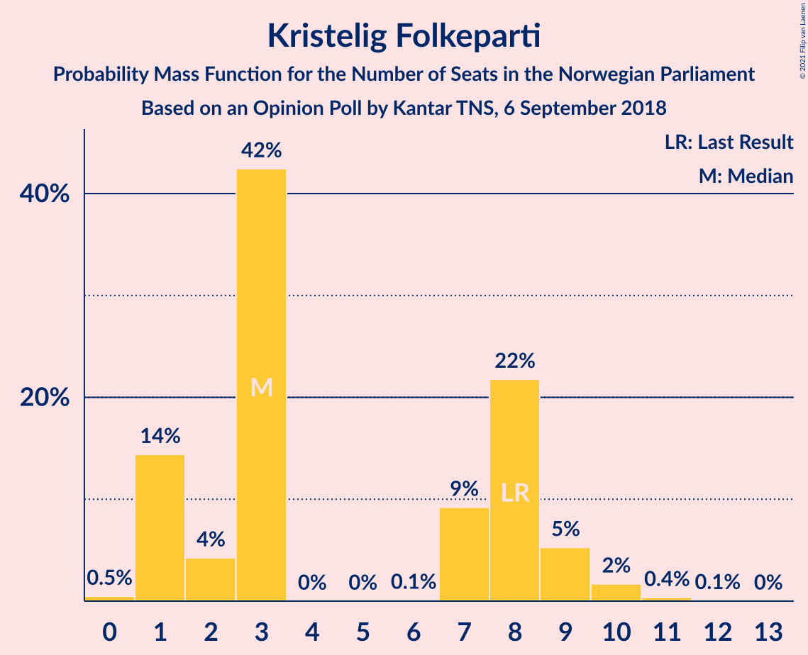
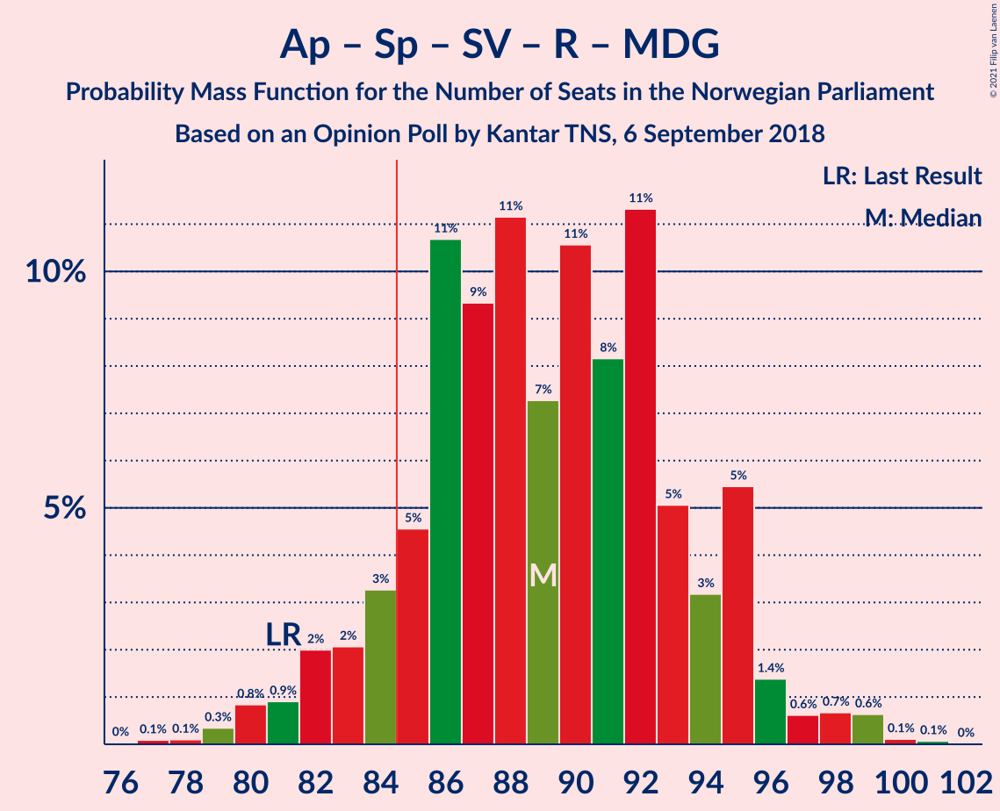
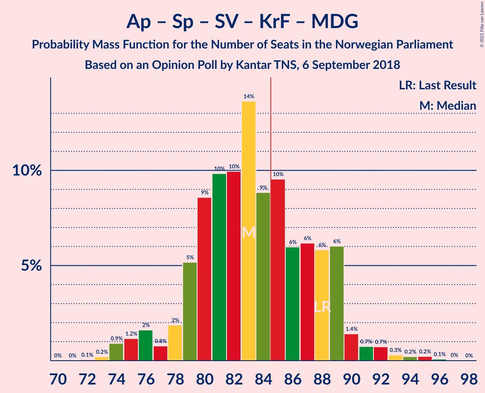
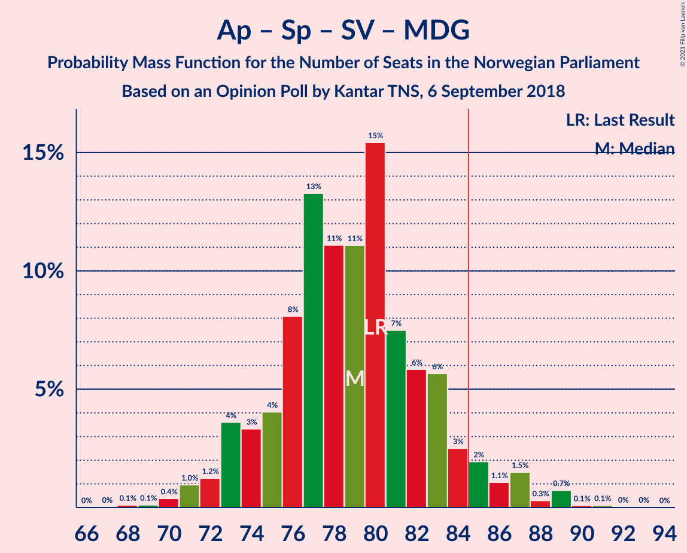
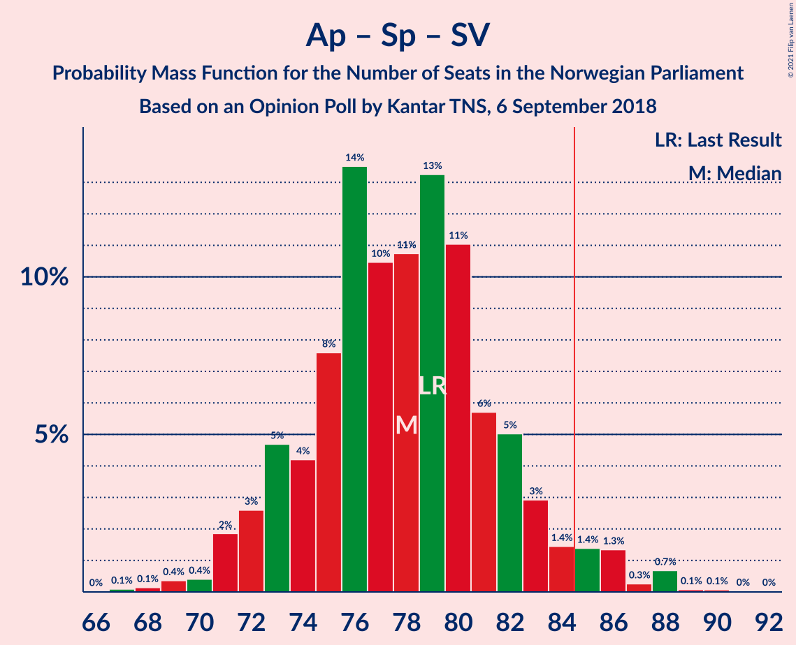
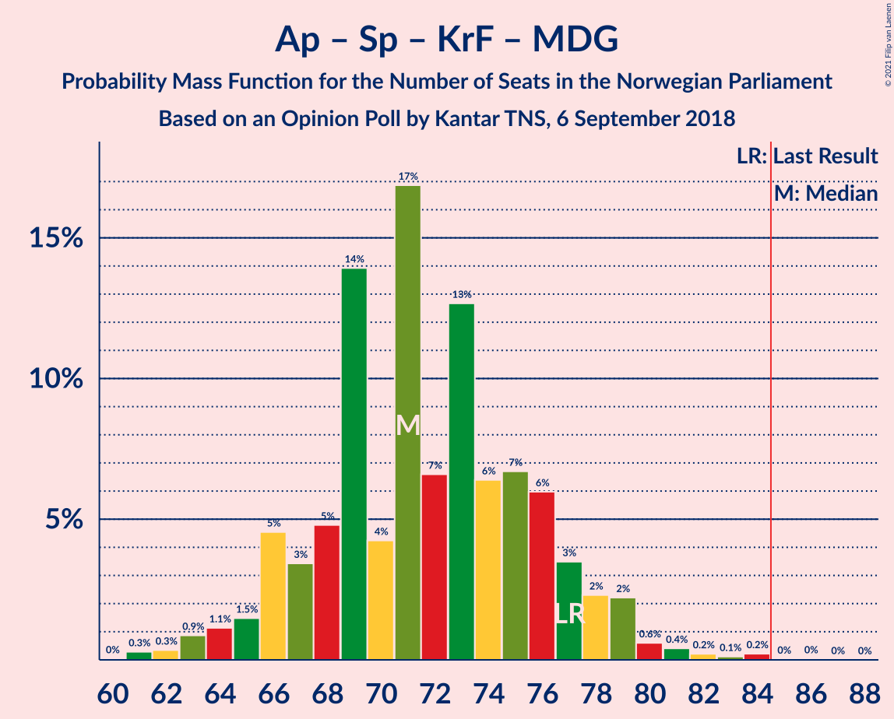
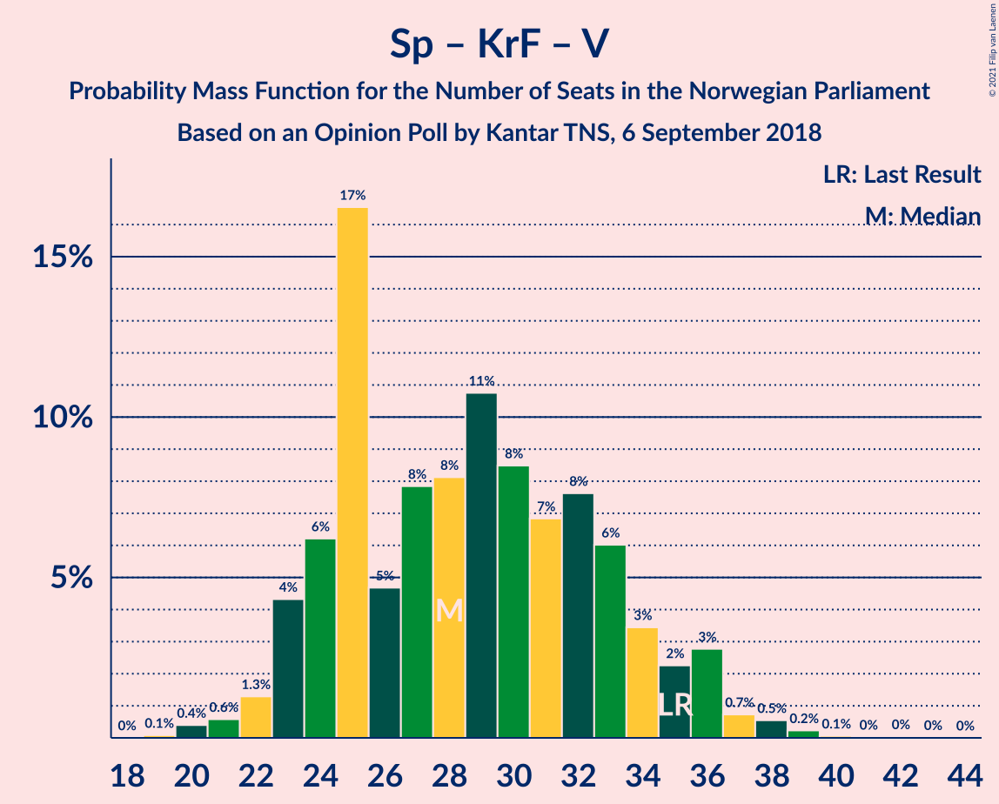

# Opinion Poll by Kantar TNS, 6 September 2018

<a href="#voting-intentions">Voting Intentions</a> | <a href="#seats">Seats</a> | <a href="#coalitions">Coalitions</a> | <a href="#technical-information">Technical Information</a>

## Voting Intentions

### Confidence Intervals

| Party | Last Result | Poll Result | 80% Confidence Interval | 90% Confidence Interval | 95% Confidence Interval | 99% Confidence Interval |
|:-----:|:-----------:|:-----------:|:-----------------------:|:-----------------------:|:-----------------------:|:-----------------------:|
| Høyre | 25.0% | 29.0% | 26.9–31.3% |26.3–31.9% |25.8–32.5% |24.8–33.5% |
| Arbeiderpartiet | 27.4% | 24.9% | 22.9–27.0% |22.3–27.6% |21.8–28.2% |20.9–29.2% |
| Senterpartiet | 10.3% | 11.5% | 10.1–13.2% |9.7–13.7% |9.4–14.1% |8.8–14.9% |
| Fremskrittspartiet | 15.2% | 10.4% | 9.1–12.0% |8.7–12.5% |8.4–12.9% |7.8–13.7% |
| Sosialistisk Venstreparti | 6.0% | 6.5% | 5.5–7.9% |5.2–8.2% |4.9–8.6% |4.5–9.3% |
| Rødt | 2.4% | 5.6% | 4.6–6.8% |4.3–7.2% |4.1–7.5% |3.7–8.1% |
| Kristelig Folkeparti | 4.2% | 3.8% | 3.0–4.8% |2.8–5.1% |2.6–5.4% |2.3–6.0% |
| Venstre | 4.4% | 3.5% | 2.7–4.5% |2.5–4.8% |2.4–5.1% |2.1–5.6% |
| Miljøpartiet De Grønne | 3.2% | 2.4% | 1.8–3.3% |1.6–3.5% |1.5–3.7% |1.2–4.2% |

*Note:* The poll result column reflects the actual value used in the calculations. Published results may vary slightly, and in addition be rounded to fewer digits.

## Seats

### Confidence Intervals

| Party | Last Result | Median | 80% Confidence Interval | 90% Confidence Interval | 95% Confidence Interval | 99% Confidence Interval |
|:-----:|:-----------:|:------:|:-----------------------:|:-----------------------:|:-----------------------:|:-----------------------:|
| <a href="#høyre">Høyre</a> | 45 | 52 | 49–55 |47–56 |46–58 |45–60 |
| <a href="#arbeiderpartiet">Arbeiderpartiet</a> | 49 | 46 | 43–48 |42–49 |41–52 |39–54 |
| <a href="#senterpartiet">Senterpartiet</a> | 19 | 21 | 19–23 |18–24 |18–24 |17–26 |
| <a href="#fremskrittspartiet">Fremskrittspartiet</a> | 27 | 19 | 15–20 |15–22 |14–23 |13–25 |
| <a href="#sosialistisk-venstreparti">Sosialistisk Venstreparti</a> | 11 | 12 | 11–14 |10–15 |9–16 |8–17 |
| <a href="#rødt">Rødt</a> | 1 | 11 | 8–12 |8–13 |8–13 |2–15 |
| <a href="#kristelig-folkeparti">Kristelig Folkeparti</a> | 8 | 3 | 1–8 |1–9 |1–9 |1–10 |
| <a href="#venstre">Venstre</a> | 8 | 2 | 2–8 |2–8 |2–8 |1–10 |
| <a href="#miljøpartiet-de-grønne">Miljøpartiet De Grønne</a> | 1 | 1 | 0–1 |0–2 |0–2 |0–7 |

### Høyre

*For a full overview of the results for this party, see the [Høyre](party-høyre.html) page.*

| Number of Seats | Probability | Accumulated | Special Marks |
|:---------------:|:-----------:|:-----------:|:-------------:|
| 43 | 0% | 100% |  |
| 44 | 0.3% | 99.9% |  |
| 45 | 0.7% | 99.6% | Last Result |
| 46 | 4% | 99.0% |  |
| 47 | 2% | 95% |  |
| 48 | 2% | 94% |  |
| 49 | 4% | 91% |  |
| 50 | 6% | 87% |  |
| 51 | 12% | 81% |  |
| 52 | 24% | 69% | Median |
| 53 | 15% | 45% |  |
| 54 | 3% | 31% |  |
| 55 | 19% | 27% |  |
| 56 | 4% | 8% |  |
| 57 | 1.5% | 4% |  |
| 58 | 2% | 3% |  |
| 59 | 0.8% | 1.3% |  |
| 60 | 0.4% | 0.5% |  |
| 61 | 0.1% | 0.2% |  |
| 62 | 0% | 0.1% |  |
| 63 | 0% | 0% |  |

### Arbeiderpartiet

*For a full overview of the results for this party, see the [Arbeiderpartiet](party-arbeiderpartiet.html) page.*

| Number of Seats | Probability | Accumulated | Special Marks |
|:---------------:|:-----------:|:-----------:|:-------------:|
| 37 | 0% | 100% |  |
| 38 | 0.1% | 99.9% |  |
| 39 | 0.4% | 99.8% |  |
| 40 | 1.5% | 99.4% |  |
| 41 | 1.3% | 98% |  |
| 42 | 5% | 97% |  |
| 43 | 2% | 91% |  |
| 44 | 11% | 90% |  |
| 45 | 25% | 79% |  |
| 46 | 28% | 54% | Median |
| 47 | 3% | 27% |  |
| 48 | 18% | 24% |  |
| 49 | 3% | 6% | Last Result |
| 50 | 0.3% | 3% |  |
| 51 | 0.5% | 3% |  |
| 52 | 0.6% | 3% |  |
| 53 | 0.3% | 2% |  |
| 54 | 2% | 2% |  |
| 55 | 0.1% | 0.2% |  |
| 56 | 0% | 0.1% |  |
| 57 | 0% | 0% |  |

### Senterpartiet

*For a full overview of the results for this party, see the [Senterpartiet](party-senterpartiet.html) page.*

| Number of Seats | Probability | Accumulated | Special Marks |
|:---------------:|:-----------:|:-----------:|:-------------:|
| 14 | 0.1% | 100% |  |
| 15 | 0.1% | 99.9% |  |
| 16 | 0.3% | 99.9% |  |
| 17 | 2% | 99.5% |  |
| 18 | 5% | 98% |  |
| 19 | 10% | 92% | Last Result |
| 20 | 14% | 83% |  |
| 21 | 20% | 69% | Median |
| 22 | 22% | 49% |  |
| 23 | 22% | 27% |  |
| 24 | 4% | 5% |  |
| 25 | 0.4% | 1.4% |  |
| 26 | 0.5% | 1.0% |  |
| 27 | 0.4% | 0.4% |  |
| 28 | 0% | 0.1% |  |
| 29 | 0% | 0% |  |

### Fremskrittspartiet

*For a full overview of the results for this party, see the [Fremskrittspartiet](party-fremskrittspartiet.html) page.*

| Number of Seats | Probability | Accumulated | Special Marks |
|:---------------:|:-----------:|:-----------:|:-------------:|
| 12 | 0.1% | 100% |  |
| 13 | 1.0% | 99.9% |  |
| 14 | 3% | 98.8% |  |
| 15 | 9% | 96% |  |
| 16 | 4% | 87% |  |
| 17 | 6% | 83% |  |
| 18 | 21% | 76% |  |
| 19 | 33% | 55% | Median |
| 20 | 14% | 23% |  |
| 21 | 2% | 8% |  |
| 22 | 3% | 6% |  |
| 23 | 1.1% | 3% |  |
| 24 | 0.9% | 2% |  |
| 25 | 1.0% | 1.1% |  |
| 26 | 0.1% | 0.1% |  |
| 27 | 0% | 0% | Last Result |

### Sosialistisk Venstreparti

*For a full overview of the results for this party, see the [Sosialistisk Venstreparti](party-sosialistiskvenstreparti.html) page.*

| Number of Seats | Probability | Accumulated | Special Marks |
|:---------------:|:-----------:|:-----------:|:-------------:|
| 3 | 0.1% | 100% |  |
| 4 | 0% | 99.9% |  |
| 5 | 0% | 99.9% |  |
| 6 | 0% | 99.9% |  |
| 7 | 0.1% | 99.9% |  |
| 8 | 0.9% | 99.8% |  |
| 9 | 4% | 98.9% |  |
| 10 | 5% | 95% |  |
| 11 | 25% | 91% | Last Result |
| 12 | 28% | 65% | Median |
| 13 | 25% | 37% |  |
| 14 | 5% | 12% |  |
| 15 | 5% | 7% |  |
| 16 | 2% | 3% |  |
| 17 | 1.0% | 1.1% |  |
| 18 | 0.1% | 0.1% |  |
| 19 | 0% | 0% |  |

### Rødt

*For a full overview of the results for this party, see the [Rødt](party-rødt.html) page.*

| Number of Seats | Probability | Accumulated | Special Marks |
|:---------------:|:-----------:|:-----------:|:-------------:|
| 1 | 0% | 100% | Last Result |
| 2 | 2% | 100% |  |
| 3 | 0% | 98% |  |
| 4 | 0% | 98% |  |
| 5 | 0% | 98% |  |
| 6 | 0% | 98% |  |
| 7 | 0.8% | 98% |  |
| 8 | 11% | 98% |  |
| 9 | 18% | 86% |  |
| 10 | 16% | 68% |  |
| 11 | 21% | 52% | Median |
| 12 | 24% | 31% |  |
| 13 | 6% | 7% |  |
| 14 | 0.5% | 1.2% |  |
| 15 | 0.7% | 0.7% |  |
| 16 | 0% | 0% |  |

### Kristelig Folkeparti

*For a full overview of the results for this party, see the [Kristelig Folkeparti](party-kristeligfolkeparti.html) page.*

| Number of Seats | Probability | Accumulated | Special Marks |
|:---------------:|:-----------:|:-----------:|:-------------:|
| 0 | 0.1% | 100% |  |
| 1 | 21% | 99.9% |  |
| 2 | 1.3% | 79% |  |
| 3 | 37% | 78% | Median |
| 4 | 0% | 41% |  |
| 5 | 0% | 41% |  |
| 6 | 0.3% | 41% |  |
| 7 | 4% | 40% |  |
| 8 | 26% | 36% | Last Result |
| 9 | 9% | 10% |  |
| 10 | 0.9% | 1.2% |  |
| 11 | 0.3% | 0.3% |  |
| 12 | 0% | 0% |  |

### Venstre

*For a full overview of the results for this party, see the [Venstre](party-venstre.html) page.*

| Number of Seats | Probability | Accumulated | Special Marks |
|:---------------:|:-----------:|:-----------:|:-------------:|
| 0 | 0.1% | 100% |  |
| 1 | 1.4% | 99.9% |  |
| 2 | 79% | 98% | Median |
| 3 | 0.8% | 20% |  |
| 4 | 0% | 19% |  |
| 5 | 0% | 19% |  |
| 6 | 0% | 19% |  |
| 7 | 5% | 19% |  |
| 8 | 12% | 14% | Last Result |
| 9 | 0.5% | 2% |  |
| 10 | 1.2% | 1.3% |  |
| 11 | 0.1% | 0.1% |  |
| 12 | 0% | 0% |  |

### Miljøpartiet De Grønne

*For a full overview of the results for this party, see the [Miljøpartiet De Grønne](party-miljøpartietdegrønne.html) page.*

| Number of Seats | Probability | Accumulated | Special Marks |
|:---------------:|:-----------:|:-----------:|:-------------:|
| 0 | 25% | 100% |  |
| 1 | 68% | 75% | Last Result, Median |
| 2 | 6% | 6% |  |
| 3 | 0.1% | 0.8% |  |
| 4 | 0% | 0.7% |  |
| 5 | 0% | 0.7% |  |
| 6 | 0% | 0.7% |  |
| 7 | 0.6% | 0.7% |  |
| 8 | 0.1% | 0.1% |  |
| 9 | 0% | 0% |  |

## Coalitions

### Confidence Intervals

| Coalition | Last Result | Median | Majority? | 80% Confidence Interval | 90% Confidence Interval | 95% Confidence Interval | 99% Confidence Interval |
|:---------:|:-----------:|:------:|:---------:|:-----------------------:|:-----------------------:|:-----------------------:|:-----------------------:|
| Høyre – Senterpartiet – Fremskrittspartiet – Kristelig Folkeparti – Venstre | 107 | 100 | 100% | 97–103 | 96–104 | 95–106 | 92–109 |
| Arbeiderpartiet – Senterpartiet – Sosialistisk Venstreparti – Rødt – Miljøpartiet De Grønne | 81 | 91 | 95% | 86–95 | 85–95 | 82–96 | 80–99 |
| Arbeiderpartiet – Senterpartiet – Sosialistisk Venstreparti – Rødt | 80 | 90 | 92% | 85–94 | 83–95 | 81–95 | 78–98 |
| Arbeiderpartiet – Senterpartiet – Sosialistisk Venstreparti – Kristelig Folkeparti – Miljøpartiet De Grønne | 88 | 84 | 42% | 81–89 | 79–89 | 79–91 | 74–95 |
| Høyre – Fremskrittspartiet – Kristelig Folkeparti – Venstre – Miljøpartiet De Grønne | 89 | 79 | 7% | 75–84 | 74–86 | 74–87 | 71–90 |
| Arbeiderpartiet – Senterpartiet – Sosialistisk Venstreparti – Miljøpartiet De Grønne | 80 | 80 | 5% | 76–83 | 74–84 | 73–86 | 70–88 |
| Høyre – Fremskrittspartiet – Kristelig Folkeparti – Venstre | 88 | 78 | 5% | 74–83 | 74–84 | 73–86 | 70–89 |
| Arbeiderpartiet – Senterpartiet – Sosialistisk Venstreparti | 79 | 80 | 3% | 75–82 | 72–83 | 71–85 | 69–88 |
| Høyre – Fremskrittspartiet – Venstre | 80 | 73 | 1.0% | 70–79 | 70–80 | 68–81 | 66–85 |
| Arbeiderpartiet – Senterpartiet – Kristelig Folkeparti – Miljøpartiet De Grønne | 77 | 73 | 0.1% | 68–76 | 68–76 | 67–80 | 64–84 |
| Arbeiderpartiet – Senterpartiet – Kristelig Folkeparti | 76 | 72 | 0% | 67–75 | 67–76 | 66–78 | 62–83 |
| Høyre – Fremskrittspartiet | 72 | 71 | 0% | 68–73 | 65–75 | 64–77 | 63–79 |
| Arbeiderpartiet – Senterpartiet | 68 | 67 | 0% | 63–71 | 62–72 | 61–73 | 59–77 |
| Høyre – Kristelig Folkeparti – Venstre | 61 | 60 | 0% | 55–65 | 55–67 | 54–69 | 51–71 |
| Arbeiderpartiet – Sosialistisk Venstreparti | 60 | 58 | 0% | 54–60 | 54–61 | 53–64 | 51–65 |
| Senterpartiet – Kristelig Folkeparti – Venstre | 35 | 29 | 0% | 26–32 | 26–35 | 24–36 | 23–37 |

### Høyre – Senterpartiet – Fremskrittspartiet – Kristelig Folkeparti – Venstre

| Number of Seats | Probability | Accumulated | Special Marks |
|:---------------:|:-----------:|:-----------:|:-------------:|
| 86 | 0.1% | 100% |  |
| 87 | 0% | 99.9% |  |
| 88 | 0% | 99.9% |  |
| 89 | 0.1% | 99.9% |  |
| 90 | 0% | 99.8% |  |
| 91 | 0.3% | 99.8% |  |
| 92 | 0.2% | 99.5% |  |
| 93 | 0.4% | 99.3% |  |
| 94 | 0.9% | 98.9% |  |
| 95 | 3% | 98% |  |
| 96 | 3% | 95% |  |
| 97 | 20% | 93% | Median |
| 98 | 3% | 73% |  |
| 99 | 13% | 70% |  |
| 100 | 20% | 57% |  |
| 101 | 14% | 37% |  |
| 102 | 6% | 23% |  |
| 103 | 9% | 16% |  |
| 104 | 3% | 7% |  |
| 105 | 1.5% | 4% |  |
| 106 | 0.5% | 3% |  |
| 107 | 0.6% | 2% | Last Result |
| 108 | 0.6% | 2% |  |
| 109 | 0.9% | 1.3% |  |
| 110 | 0.1% | 0.4% |  |
| 111 | 0.1% | 0.4% |  |
| 112 | 0% | 0.3% |  |
| 113 | 0.2% | 0.3% |  |
| 114 | 0.1% | 0.1% |  |
| 115 | 0% | 0% |  |

### Arbeiderpartiet – Senterpartiet – Sosialistisk Venstreparti – Rødt – Miljøpartiet De Grønne

| Number of Seats | Probability | Accumulated | Special Marks |
|:---------------:|:-----------:|:-----------:|:-------------:|
| 76 | 0% | 100% |  |
| 77 | 0.2% | 99.9% |  |
| 78 | 0.2% | 99.7% |  |
| 79 | 0% | 99.5% |  |
| 80 | 0.3% | 99.5% |  |
| 81 | 1.0% | 99.2% | Last Result |
| 82 | 0.8% | 98% |  |
| 83 | 1.1% | 97% |  |
| 84 | 1.1% | 96% |  |
| 85 | 1.1% | 95% | Majority |
| 86 | 11% | 94% |  |
| 87 | 7% | 83% |  |
| 88 | 11% | 77% |  |
| 89 | 5% | 66% |  |
| 90 | 5% | 61% |  |
| 91 | 26% | 56% | Median |
| 92 | 4% | 31% |  |
| 93 | 3% | 27% |  |
| 94 | 0.9% | 24% |  |
| 95 | 20% | 23% |  |
| 96 | 1.3% | 3% |  |
| 97 | 1.0% | 2% |  |
| 98 | 0.1% | 0.7% |  |
| 99 | 0.3% | 0.5% |  |
| 100 | 0% | 0.2% |  |
| 101 | 0.1% | 0.2% |  |
| 102 | 0% | 0.1% |  |
| 103 | 0% | 0% |  |

### Arbeiderpartiet – Senterpartiet – Sosialistisk Venstreparti – Rødt

| Number of Seats | Probability | Accumulated | Special Marks |
|:---------------:|:-----------:|:-----------:|:-------------:|
| 76 | 0.2% | 100% |  |
| 77 | 0.2% | 99.7% |  |
| 78 | 0% | 99.5% |  |
| 79 | 0.5% | 99.5% |  |
| 80 | 1.0% | 99.0% | Last Result |
| 81 | 0.8% | 98% |  |
| 82 | 1.0% | 97% |  |
| 83 | 2% | 96% |  |
| 84 | 2% | 94% |  |
| 85 | 9% | 92% | Majority |
| 86 | 7% | 83% |  |
| 87 | 11% | 76% |  |
| 88 | 4% | 65% |  |
| 89 | 2% | 61% |  |
| 90 | 12% | 59% | Median |
| 91 | 20% | 47% |  |
| 92 | 2% | 27% |  |
| 93 | 1.4% | 24% |  |
| 94 | 18% | 23% |  |
| 95 | 4% | 5% |  |
| 96 | 0.4% | 1.4% |  |
| 97 | 0.6% | 1.1% |  |
| 98 | 0.3% | 0.5% |  |
| 99 | 0% | 0.2% |  |
| 100 | 0.1% | 0.1% |  |
| 101 | 0% | 0.1% |  |
| 102 | 0% | 0% |  |

### Arbeiderpartiet – Senterpartiet – Sosialistisk Venstreparti – Kristelig Folkeparti – Miljøpartiet De Grønne

| Number of Seats | Probability | Accumulated | Special Marks |
|:---------------:|:-----------:|:-----------:|:-------------:|
| 73 | 0.1% | 100% |  |
| 74 | 0.6% | 99.9% |  |
| 75 | 0.2% | 99.3% |  |
| 76 | 0.3% | 99.1% |  |
| 77 | 0.3% | 98.8% |  |
| 78 | 0.5% | 98% |  |
| 79 | 3% | 98% |  |
| 80 | 2% | 95% |  |
| 81 | 11% | 93% |  |
| 82 | 4% | 82% |  |
| 83 | 17% | 78% | Median |
| 84 | 19% | 61% |  |
| 85 | 1.2% | 42% | Majority |
| 86 | 7% | 40% |  |
| 87 | 16% | 34% |  |
| 88 | 3% | 18% | Last Result |
| 89 | 11% | 15% |  |
| 90 | 0.6% | 4% |  |
| 91 | 0.9% | 3% |  |
| 92 | 0.2% | 2% |  |
| 93 | 0.3% | 2% |  |
| 94 | 0.5% | 2% |  |
| 95 | 1.1% | 1.4% |  |
| 96 | 0.2% | 0.3% |  |
| 97 | 0% | 0% |  |

### Høyre – Fremskrittspartiet – Kristelig Folkeparti – Venstre – Miljøpartiet De Grønne

| Number of Seats | Probability | Accumulated | Special Marks |
|:---------------:|:-----------:|:-----------:|:-------------:|
| 66 | 0.1% | 100% |  |
| 67 | 0% | 99.9% |  |
| 68 | 0% | 99.9% |  |
| 69 | 0.1% | 99.9% |  |
| 70 | 0% | 99.8% |  |
| 71 | 0.4% | 99.8% |  |
| 72 | 0.6% | 99.4% |  |
| 73 | 0.3% | 98.8% |  |
| 74 | 4% | 98% |  |
| 75 | 18% | 94% |  |
| 76 | 2% | 76% |  |
| 77 | 2% | 75% | Median |
| 78 | 20% | 72% |  |
| 79 | 12% | 52% |  |
| 80 | 2% | 40% |  |
| 81 | 4% | 38% |  |
| 82 | 11% | 34% |  |
| 83 | 7% | 23% |  |
| 84 | 9% | 16% |  |
| 85 | 2% | 7% | Majority |
| 86 | 2% | 5% |  |
| 87 | 1.0% | 3% |  |
| 88 | 0.7% | 2% |  |
| 89 | 0.9% | 2% | Last Result |
| 90 | 0.4% | 0.9% |  |
| 91 | 0% | 0.5% |  |
| 92 | 0.2% | 0.4% |  |
| 93 | 0.2% | 0.3% |  |
| 94 | 0% | 0% |  |

### Arbeiderpartiet – Senterpartiet – Sosialistisk Venstreparti – Miljøpartiet De Grønne

| Number of Seats | Probability | Accumulated | Special Marks |
|:---------------:|:-----------:|:-----------:|:-------------:|
| 68 | 0.2% | 100% |  |
| 69 | 0.1% | 99.8% |  |
| 70 | 0.2% | 99.7% |  |
| 71 | 0.8% | 99.5% |  |
| 72 | 0.7% | 98.7% |  |
| 73 | 3% | 98% |  |
| 74 | 0.6% | 95% |  |
| 75 | 1.3% | 94% |  |
| 76 | 5% | 93% |  |
| 77 | 1.4% | 89% |  |
| 78 | 16% | 87% |  |
| 79 | 12% | 71% |  |
| 80 | 18% | 59% | Last Result, Median |
| 81 | 12% | 41% |  |
| 82 | 3% | 29% |  |
| 83 | 21% | 26% |  |
| 84 | 0.7% | 5% |  |
| 85 | 2% | 5% | Majority |
| 86 | 0.3% | 3% |  |
| 87 | 1.3% | 2% |  |
| 88 | 0.5% | 1.0% |  |
| 89 | 0.3% | 0.5% |  |
| 90 | 0% | 0.2% |  |
| 91 | 0.1% | 0.1% |  |
| 92 | 0% | 0% |  |

### Høyre – Fremskrittspartiet – Kristelig Folkeparti – Venstre

| Number of Seats | Probability | Accumulated | Special Marks |
|:---------------:|:-----------:|:-----------:|:-------------:|
| 65 | 0.1% | 100% |  |
| 66 | 0% | 99.9% |  |
| 67 | 0% | 99.9% |  |
| 68 | 0.1% | 99.9% |  |
| 69 | 0% | 99.8% |  |
| 70 | 0.3% | 99.7% |  |
| 71 | 0.1% | 99.4% |  |
| 72 | 0.9% | 99.2% |  |
| 73 | 1.3% | 98% |  |
| 74 | 21% | 97% |  |
| 75 | 1.1% | 76% |  |
| 76 | 3% | 75% | Median |
| 77 | 4% | 72% |  |
| 78 | 26% | 68% |  |
| 79 | 5% | 42% |  |
| 80 | 5% | 38% |  |
| 81 | 10% | 33% |  |
| 82 | 7% | 23% |  |
| 83 | 10% | 16% |  |
| 84 | 1.0% | 6% |  |
| 85 | 1.0% | 5% | Majority |
| 86 | 1.1% | 4% |  |
| 87 | 0.8% | 2% |  |
| 88 | 1.0% | 2% | Last Result |
| 89 | 0.3% | 0.7% |  |
| 90 | 0% | 0.4% |  |
| 91 | 0.2% | 0.4% |  |
| 92 | 0.2% | 0.3% |  |
| 93 | 0% | 0.1% |  |
| 94 | 0% | 0% |  |

### Arbeiderpartiet – Senterpartiet – Sosialistisk Venstreparti

| Number of Seats | Probability | Accumulated | Special Marks |
|:---------------:|:-----------:|:-----------:|:-------------:|
| 67 | 0.1% | 100% |  |
| 68 | 0.2% | 99.9% |  |
| 69 | 0.2% | 99.7% |  |
| 70 | 0.6% | 99.5% |  |
| 71 | 2% | 98.8% |  |
| 72 | 2% | 97% |  |
| 73 | 0.6% | 95% |  |
| 74 | 1.3% | 94% |  |
| 75 | 5% | 93% |  |
| 76 | 2% | 88% |  |
| 77 | 13% | 86% |  |
| 78 | 14% | 73% |  |
| 79 | 3% | 58% | Last Result, Median |
| 80 | 25% | 55% |  |
| 81 | 4% | 30% |  |
| 82 | 18% | 26% |  |
| 83 | 3% | 8% |  |
| 84 | 2% | 5% |  |
| 85 | 0.4% | 3% | Majority |
| 86 | 1.2% | 2% |  |
| 87 | 0% | 1.0% |  |
| 88 | 0.8% | 0.9% |  |
| 89 | 0.1% | 0.1% |  |
| 90 | 0.1% | 0.1% |  |
| 91 | 0% | 0% |  |

### Høyre – Fremskrittspartiet – Venstre

| Number of Seats | Probability | Accumulated | Special Marks |
|:---------------:|:-----------:|:-----------:|:-------------:|
| 63 | 0.2% | 100% |  |
| 64 | 0.1% | 99.8% |  |
| 65 | 0.1% | 99.7% |  |
| 66 | 2% | 99.6% |  |
| 67 | 0.3% | 98% |  |
| 68 | 0.9% | 98% |  |
| 69 | 1.1% | 97% |  |
| 70 | 12% | 96% |  |
| 71 | 5% | 84% |  |
| 72 | 2% | 79% |  |
| 73 | 34% | 77% | Median |
| 74 | 2% | 43% |  |
| 75 | 22% | 42% |  |
| 76 | 3% | 19% |  |
| 77 | 5% | 16% |  |
| 78 | 0.7% | 11% |  |
| 79 | 2% | 11% |  |
| 80 | 6% | 9% | Last Result |
| 81 | 0.4% | 3% |  |
| 82 | 0.7% | 2% |  |
| 83 | 0.2% | 2% |  |
| 84 | 0.5% | 2% |  |
| 85 | 0.8% | 1.0% | Majority |
| 86 | 0.1% | 0.2% |  |
| 87 | 0% | 0.1% |  |
| 88 | 0% | 0.1% |  |
| 89 | 0% | 0.1% |  |
| 90 | 0% | 0% |  |

### Arbeiderpartiet – Senterpartiet – Kristelig Folkeparti – Miljøpartiet De Grønne

| Number of Seats | Probability | Accumulated | Special Marks |
|:---------------:|:-----------:|:-----------:|:-------------:|
| 61 | 0.1% | 100% |  |
| 62 | 0.1% | 99.9% |  |
| 63 | 0.1% | 99.8% |  |
| 64 | 0.3% | 99.7% |  |
| 65 | 0.9% | 99.4% |  |
| 66 | 0.3% | 98.6% |  |
| 67 | 1.5% | 98% |  |
| 68 | 8% | 97% |  |
| 69 | 6% | 89% |  |
| 70 | 3% | 83% |  |
| 71 | 19% | 80% | Median |
| 72 | 8% | 61% |  |
| 73 | 17% | 54% |  |
| 74 | 14% | 36% |  |
| 75 | 7% | 23% |  |
| 76 | 11% | 15% |  |
| 77 | 0.4% | 5% | Last Result |
| 78 | 1.2% | 4% |  |
| 79 | 0.3% | 3% |  |
| 80 | 0.9% | 3% |  |
| 81 | 0.6% | 2% |  |
| 82 | 0% | 1.3% |  |
| 83 | 0.1% | 1.2% |  |
| 84 | 1.1% | 1.1% |  |
| 85 | 0% | 0.1% | Majority |
| 86 | 0% | 0% |  |

### Arbeiderpartiet – Senterpartiet – Kristelig Folkeparti

| Number of Seats | Probability | Accumulated | Special Marks |
|:---------------:|:-----------:|:-----------:|:-------------:|
| 60 | 0.1% | 100% |  |
| 61 | 0.3% | 99.9% |  |
| 62 | 0.1% | 99.6% |  |
| 63 | 0.1% | 99.5% |  |
| 64 | 0.8% | 99.3% |  |
| 65 | 0.7% | 98% |  |
| 66 | 1.3% | 98% |  |
| 67 | 8% | 97% |  |
| 68 | 4% | 88% |  |
| 69 | 4% | 84% |  |
| 70 | 4% | 80% | Median |
| 71 | 20% | 76% |  |
| 72 | 20% | 56% |  |
| 73 | 12% | 36% |  |
| 74 | 8% | 24% |  |
| 75 | 10% | 15% |  |
| 76 | 1.1% | 5% | Last Result |
| 77 | 1.0% | 4% |  |
| 78 | 0.6% | 3% |  |
| 79 | 0.1% | 2% |  |
| 80 | 0.9% | 2% |  |
| 81 | 0.2% | 1.4% |  |
| 82 | 0% | 1.2% |  |
| 83 | 1.1% | 1.1% |  |
| 84 | 0% | 0% |  |

### Høyre – Fremskrittspartiet

| Number of Seats | Probability | Accumulated | Special Marks |
|:---------------:|:-----------:|:-----------:|:-------------:|
| 60 | 0% | 100% |  |
| 61 | 0.3% | 99.9% |  |
| 62 | 0.1% | 99.6% |  |
| 63 | 0.2% | 99.5% |  |
| 64 | 3% | 99.3% |  |
| 65 | 2% | 96% |  |
| 66 | 2% | 95% |  |
| 67 | 1.3% | 92% |  |
| 68 | 14% | 91% |  |
| 69 | 7% | 77% |  |
| 70 | 2% | 70% |  |
| 71 | 33% | 68% | Median |
| 72 | 6% | 35% | Last Result |
| 73 | 20% | 29% |  |
| 74 | 2% | 9% |  |
| 75 | 3% | 7% |  |
| 76 | 0.7% | 4% |  |
| 77 | 0.9% | 3% |  |
| 78 | 1.5% | 2% |  |
| 79 | 0.1% | 0.6% |  |
| 80 | 0.2% | 0.5% |  |
| 81 | 0% | 0.3% |  |
| 82 | 0.2% | 0.3% |  |
| 83 | 0% | 0.1% |  |
| 84 | 0% | 0% |  |

### Arbeiderpartiet – Senterpartiet

| Number of Seats | Probability | Accumulated | Special Marks |
|:---------------:|:-----------:|:-----------:|:-------------:|
| 56 | 0% | 100% |  |
| 57 | 0.1% | 99.9% |  |
| 58 | 0.1% | 99.8% |  |
| 59 | 0.8% | 99.7% |  |
| 60 | 1.2% | 98.9% |  |
| 61 | 2% | 98% |  |
| 62 | 1.4% | 96% |  |
| 63 | 6% | 95% |  |
| 64 | 9% | 89% |  |
| 65 | 17% | 80% |  |
| 66 | 8% | 63% |  |
| 67 | 10% | 55% | Median |
| 68 | 19% | 45% | Last Result |
| 69 | 3% | 25% |  |
| 70 | 0.6% | 22% |  |
| 71 | 17% | 22% |  |
| 72 | 2% | 5% |  |
| 73 | 1.0% | 3% |  |
| 74 | 0.2% | 2% |  |
| 75 | 1.3% | 2% |  |
| 76 | 0.1% | 0.8% |  |
| 77 | 0.5% | 0.6% |  |
| 78 | 0% | 0.1% |  |
| 79 | 0% | 0% |  |

### Høyre – Kristelig Folkeparti – Venstre

| Number of Seats | Probability | Accumulated | Special Marks |
|:---------------:|:-----------:|:-----------:|:-------------:|
| 47 | 0.1% | 100% |  |
| 48 | 0% | 99.9% |  |
| 49 | 0% | 99.9% |  |
| 50 | 0% | 99.8% |  |
| 51 | 0.3% | 99.8% |  |
| 52 | 0.5% | 99.5% |  |
| 53 | 0.4% | 98.9% |  |
| 54 | 2% | 98.5% |  |
| 55 | 19% | 96% |  |
| 56 | 3% | 77% |  |
| 57 | 2% | 74% | Median |
| 58 | 3% | 73% |  |
| 59 | 3% | 70% |  |
| 60 | 19% | 67% |  |
| 61 | 16% | 48% | Last Result |
| 62 | 2% | 32% |  |
| 63 | 15% | 30% |  |
| 64 | 6% | 16% |  |
| 65 | 1.4% | 10% |  |
| 66 | 3% | 9% |  |
| 67 | 1.5% | 6% |  |
| 68 | 0.4% | 4% |  |
| 69 | 3% | 4% |  |
| 70 | 0.7% | 1.4% |  |
| 71 | 0.5% | 0.7% |  |
| 72 | 0.1% | 0.2% |  |
| 73 | 0% | 0.2% |  |
| 74 | 0.1% | 0.1% |  |
| 75 | 0.1% | 0.1% |  |
| 76 | 0% | 0% |  |

### Arbeiderpartiet – Sosialistisk Venstreparti

| Number of Seats | Probability | Accumulated | Special Marks |
|:---------------:|:-----------:|:-----------:|:-------------:|
| 47 | 0% | 100% |  |
| 48 | 0% | 99.9% |  |
| 49 | 0.1% | 99.9% |  |
| 50 | 0.2% | 99.7% |  |
| 51 | 1.2% | 99.5% |  |
| 52 | 0.5% | 98% |  |
| 53 | 2% | 98% |  |
| 54 | 7% | 96% |  |
| 55 | 2% | 89% |  |
| 56 | 13% | 88% |  |
| 57 | 4% | 75% |  |
| 58 | 31% | 71% | Median |
| 59 | 29% | 41% |  |
| 60 | 5% | 12% | Last Result |
| 61 | 2% | 7% |  |
| 62 | 0.6% | 4% |  |
| 63 | 0.9% | 4% |  |
| 64 | 0.9% | 3% |  |
| 65 | 2% | 2% |  |
| 66 | 0.1% | 0.4% |  |
| 67 | 0.2% | 0.3% |  |
| 68 | 0.1% | 0.1% |  |
| 69 | 0% | 0% |  |

### Senterpartiet – Kristelig Folkeparti – Venstre

| Number of Seats | Probability | Accumulated | Special Marks |
|:---------------:|:-----------:|:-----------:|:-------------:|
| 19 | 0.1% | 100% |  |
| 20 | 0% | 99.9% |  |
| 21 | 0.2% | 99.9% |  |
| 22 | 0.2% | 99.7% |  |
| 23 | 2% | 99.5% |  |
| 24 | 1.0% | 98% |  |
| 25 | 2% | 97% |  |
| 26 | 17% | 95% | Median |
| 27 | 18% | 78% |  |
| 28 | 8% | 60% |  |
| 29 | 4% | 52% |  |
| 30 | 18% | 48% |  |
| 31 | 12% | 30% |  |
| 32 | 8% | 18% |  |
| 33 | 3% | 10% |  |
| 34 | 2% | 7% |  |
| 35 | 0.8% | 5% | Last Result |
| 36 | 3% | 4% |  |
| 37 | 0.6% | 1.0% |  |
| 38 | 0.1% | 0.4% |  |
| 39 | 0.1% | 0.3% |  |
| 40 | 0% | 0.2% |  |
| 41 | 0% | 0.2% |  |
| 42 | 0.1% | 0.2% |  |
| 43 | 0.1% | 0.1% |  |
| 44 | 0% | 0% |  |

## Technical Information

### Opinion Poll

+ **Polling firm:** Kantar TNS
+ **Commissioner(s):** —
+ **Fieldwork period:** 6 September 2018

### Calculations

+ **Sample size:** 720
+ **Simulations done:** 131,072
+ **Error estimate:** 1.63%

