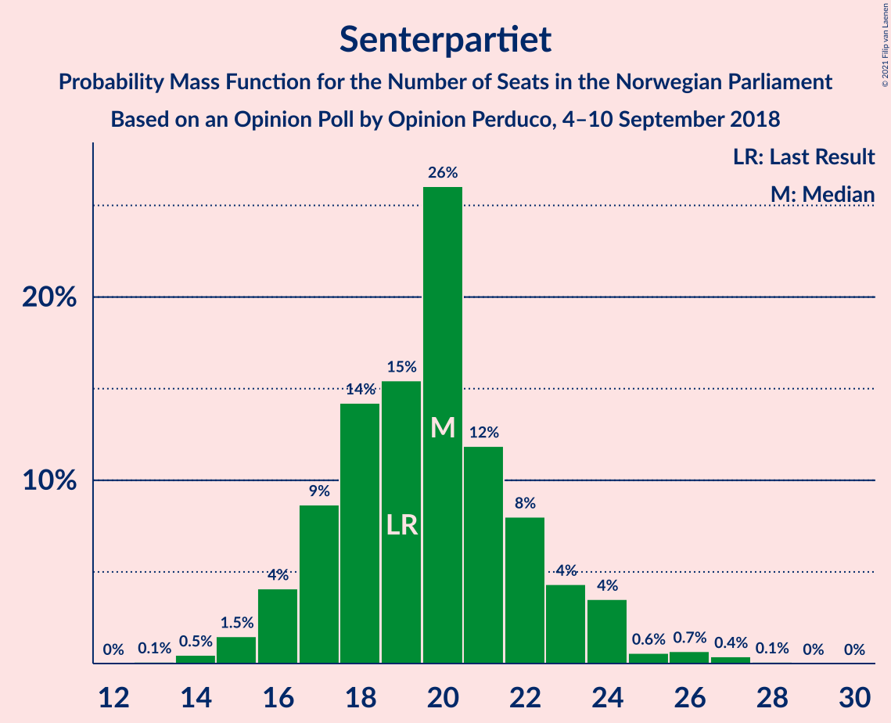
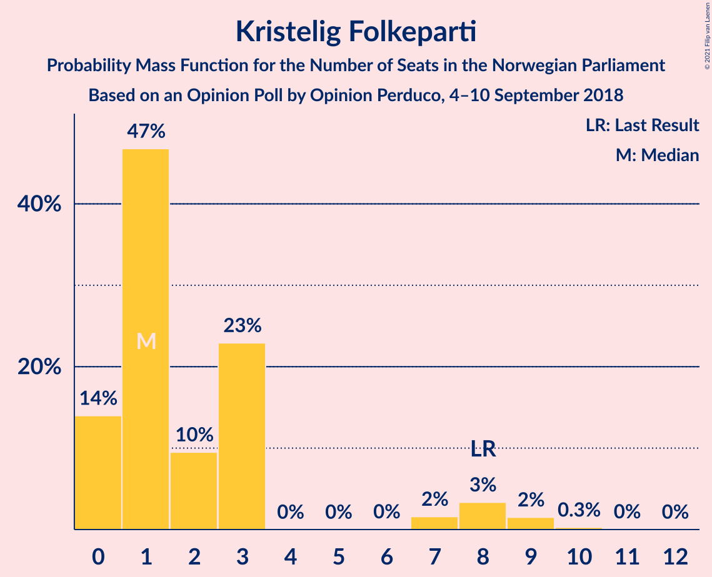
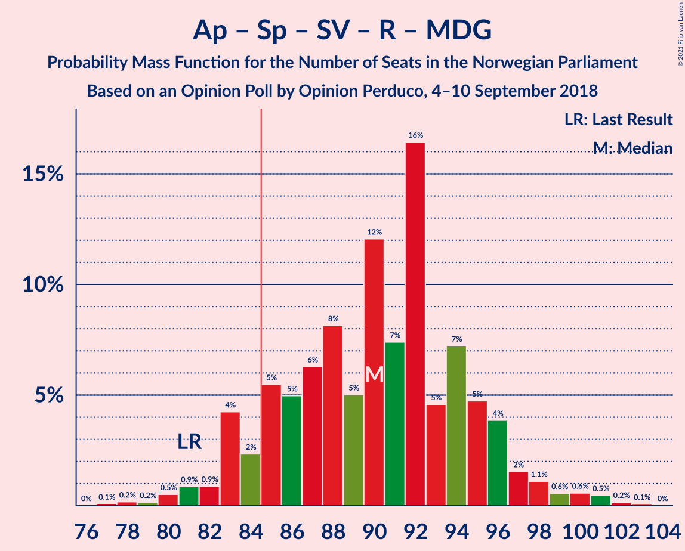
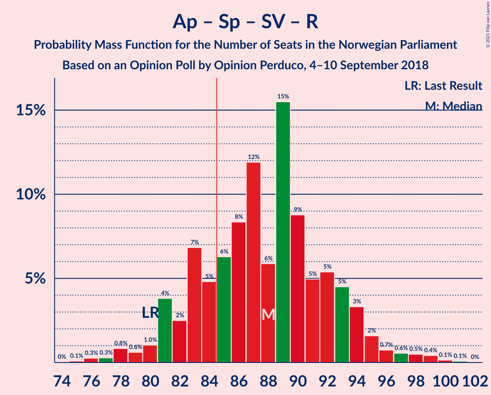

# Opinion Poll by Opinion Perduco, 4–10 September 2018

<a href="#voting-intentions">Voting Intentions</a> | <a href="#seats">Seats</a> | <a href="#coalitions">Coalitions</a> | <a href="#technical-information">Technical Information</a>

## Voting Intentions

### Confidence Intervals

| Party | Last Result | Poll Result | 80% Confidence Interval | 90% Confidence Interval | 95% Confidence Interval | 99% Confidence Interval |
|:-----:|:-----------:|:-----------:|:-----------------------:|:-----------------------:|:-----------------------:|:-----------------------:|
| Arbeiderpartiet | 27.4% | 27.6% | 25.5–29.9% |24.9–30.6% |24.4–31.1% |23.4–32.3% |
| Høyre | 25.0% | 26.5% | 24.4–28.7% |23.8–29.4% |23.3–29.9% |22.3–31.0% |
| Fremskrittspartiet | 15.2% | 13.1% | 11.6–14.9% |11.1–15.4% |10.8–15.8% |10.1–16.7% |
| Senterpartiet | 10.3% | 10.6% | 9.2–12.3% |8.8–12.7% |8.5–13.1% |7.9–14.0% |
| Sosialistisk Venstreparti | 6.0% | 7.1% | 5.9–8.5% |5.6–8.9% |5.4–9.3% |4.9–10.0% |
| Rødt | 2.4% | 3.5% | 2.8–4.6% |2.6–4.9% |2.4–5.2% |2.1–5.8% |
| Venstre | 4.4% | 3.4% | 2.6–4.5% |2.4–4.8% |2.3–5.0% |2.0–5.6% |
| Miljøpartiet De Grønne | 3.2% | 2.9% | 2.3–4.0% |2.1–4.3% |1.9–4.5% |1.6–5.0% |
| Kristelig Folkeparti | 4.2% | 2.9% | 2.3–4.0% |2.1–4.3% |1.9–4.5% |1.6–5.0% |

*Note:* The poll result column reflects the actual value used in the calculations. Published results may vary slightly, and in addition be rounded to fewer digits.

## Seats

### Confidence Intervals

| Party | Last Result | Median | 80% Confidence Interval | 90% Confidence Interval | 95% Confidence Interval | 99% Confidence Interval |
|:-----:|:-----------:|:------:|:-----------------------:|:-----------------------:|:-----------------------:|:-----------------------:|
| <a href="#arbeiderpartiet">Arbeiderpartiet</a> | 49 | 52 | 46–56 |45–56 |45–57 |42–59 |
| <a href="#høyre">Høyre</a> | 45 | 48 | 44–51 |44–53 |42–55 |40–57 |
| <a href="#fremskrittspartiet">Fremskrittspartiet</a> | 27 | 23 | 20–26 |20–27 |19–28 |18–29 |
| <a href="#senterpartiet">Senterpartiet</a> | 19 | 21 | 18–24 |17–25 |16–27 |15–27 |
| <a href="#sosialistisk-venstreparti">Sosialistisk Venstreparti</a> | 11 | 13 | 12–16 |10–16 |10–17 |9–18 |
| <a href="#rødt">Rødt</a> | 1 | 2 | 1–8 |1–9 |1–9 |1–10 |
| <a href="#venstre">Venstre</a> | 8 | 2 | 1–7 |1–8 |1–9 |1–10 |
| <a href="#miljøpartiet-de-grønne">Miljøpartiet De Grønne</a> | 1 | 2 | 1–7 |0–7 |0–7 |0–8 |
| <a href="#kristelig-folkeparti">Kristelig Folkeparti</a> | 8 | 3 | 1–3 |1–8 |0–8 |0–9 |

### Arbeiderpartiet

*For a full overview of the results for this party, see the [Arbeiderpartiet](party-arbeiderpartiet.html) page.*

| Number of Seats | Probability | Accumulated | Special Marks |
|:---------------:|:-----------:|:-----------:|:-------------:|
| 42 | 1.1% | 100% |  |
| 43 | 0.1% | 98.9% |  |
| 44 | 0.4% | 98.7% |  |
| 45 | 6% | 98% |  |
| 46 | 14% | 92% |  |
| 47 | 2% | 78% |  |
| 48 | 13% | 76% |  |
| 49 | 1.3% | 63% | Last Result |
| 50 | 5% | 62% |  |
| 51 | 6% | 58% |  |
| 52 | 26% | 52% | Median |
| 53 | 7% | 26% |  |
| 54 | 0.3% | 18% |  |
| 55 | 3% | 18% |  |
| 56 | 11% | 15% |  |
| 57 | 3% | 5% |  |
| 58 | 1.3% | 2% |  |
| 59 | 0.1% | 0.6% |  |
| 60 | 0.2% | 0.5% |  |
| 61 | 0.1% | 0.3% |  |
| 62 | 0.2% | 0.2% |  |
| 63 | 0% | 0% |  |

### Høyre

*For a full overview of the results for this party, see the [Høyre](party-høyre.html) page.*

| Number of Seats | Probability | Accumulated | Special Marks |
|:---------------:|:-----------:|:-----------:|:-------------:|
| 38 | 0.1% | 100% |  |
| 39 | 0% | 99.9% |  |
| 40 | 0.5% | 99.9% |  |
| 41 | 1.1% | 99.4% |  |
| 42 | 0.9% | 98% |  |
| 43 | 0.3% | 97% |  |
| 44 | 11% | 97% |  |
| 45 | 4% | 86% | Last Result |
| 46 | 4% | 81% |  |
| 47 | 25% | 77% |  |
| 48 | 10% | 52% | Median |
| 49 | 0.4% | 41% |  |
| 50 | 6% | 41% |  |
| 51 | 25% | 34% |  |
| 52 | 3% | 9% |  |
| 53 | 2% | 6% |  |
| 54 | 2% | 4% |  |
| 55 | 2% | 3% |  |
| 56 | 0.2% | 0.8% |  |
| 57 | 0.2% | 0.7% |  |
| 58 | 0.4% | 0.5% |  |
| 59 | 0% | 0.1% |  |
| 60 | 0% | 0% |  |

### Fremskrittspartiet

*For a full overview of the results for this party, see the [Fremskrittspartiet](party-fremskrittspartiet.html) page.*

| Number of Seats | Probability | Accumulated | Special Marks |
|:---------------:|:-----------:|:-----------:|:-------------:|
| 17 | 0.1% | 100% |  |
| 18 | 0.7% | 99.8% |  |
| 19 | 2% | 99.1% |  |
| 20 | 15% | 97% |  |
| 21 | 13% | 83% |  |
| 22 | 10% | 69% |  |
| 23 | 28% | 59% | Median |
| 24 | 5% | 31% |  |
| 25 | 2% | 26% |  |
| 26 | 18% | 24% |  |
| 27 | 2% | 6% | Last Result |
| 28 | 3% | 4% |  |
| 29 | 0.6% | 0.9% |  |
| 30 | 0.2% | 0.3% |  |
| 31 | 0.1% | 0.1% |  |
| 32 | 0% | 0% |  |

### Senterpartiet

*For a full overview of the results for this party, see the [Senterpartiet](party-senterpartiet.html) page.*

| Number of Seats | Probability | Accumulated | Special Marks |
|:---------------:|:-----------:|:-----------:|:-------------:|
| 14 | 0.1% | 100% |  |
| 15 | 0.7% | 99.8% |  |
| 16 | 3% | 99.1% |  |
| 17 | 4% | 96% |  |
| 18 | 4% | 93% |  |
| 19 | 2% | 88% | Last Result |
| 20 | 19% | 86% |  |
| 21 | 26% | 68% | Median |
| 22 | 10% | 41% |  |
| 23 | 12% | 31% |  |
| 24 | 13% | 19% |  |
| 25 | 1.1% | 6% |  |
| 26 | 2% | 5% |  |
| 27 | 3% | 3% |  |
| 28 | 0% | 0% |  |

### Sosialistisk Venstreparti

*For a full overview of the results for this party, see the [Sosialistisk Venstreparti](party-sosialistiskvenstreparti.html) page.*

| Number of Seats | Probability | Accumulated | Special Marks |
|:---------------:|:-----------:|:-----------:|:-------------:|
| 8 | 0.2% | 100% |  |
| 9 | 1.2% | 99.8% |  |
| 10 | 4% | 98.6% |  |
| 11 | 1.4% | 95% | Last Result |
| 12 | 27% | 93% |  |
| 13 | 37% | 66% | Median |
| 14 | 15% | 29% |  |
| 15 | 2% | 15% |  |
| 16 | 10% | 13% |  |
| 17 | 2% | 3% |  |
| 18 | 0.7% | 0.9% |  |
| 19 | 0.1% | 0.2% |  |
| 20 | 0.1% | 0.1% |  |
| 21 | 0% | 0% |  |

### Rødt

*For a full overview of the results for this party, see the [Rødt](party-rødt.html) page.*

| Number of Seats | Probability | Accumulated | Special Marks |
|:---------------:|:-----------:|:-----------:|:-------------:|
| 1 | 32% | 100% | Last Result |
| 2 | 34% | 68% | Median |
| 3 | 0% | 34% |  |
| 4 | 0% | 34% |  |
| 5 | 0% | 34% |  |
| 6 | 0% | 34% |  |
| 7 | 15% | 34% |  |
| 8 | 14% | 19% |  |
| 9 | 4% | 5% |  |
| 10 | 0.5% | 0.7% |  |
| 11 | 0.1% | 0.2% |  |
| 12 | 0% | 0.1% |  |
| 13 | 0% | 0% |  |

### Venstre

*For a full overview of the results for this party, see the [Venstre](party-venstre.html) page.*

| Number of Seats | Probability | Accumulated | Special Marks |
|:---------------:|:-----------:|:-----------:|:-------------:|
| 0 | 0.3% | 100% |  |
| 1 | 13% | 99.7% |  |
| 2 | 62% | 87% | Median |
| 3 | 4% | 25% |  |
| 4 | 0% | 21% |  |
| 5 | 0% | 21% |  |
| 6 | 0% | 21% |  |
| 7 | 13% | 21% |  |
| 8 | 3% | 8% | Last Result |
| 9 | 3% | 4% |  |
| 10 | 1.3% | 1.5% |  |
| 11 | 0.2% | 0.2% |  |
| 12 | 0% | 0% |  |

### Miljøpartiet De Grønne

*For a full overview of the results for this party, see the [Miljøpartiet De Grønne](party-miljøpartietdegrønne.html) page.*

| Number of Seats | Probability | Accumulated | Special Marks |
|:---------------:|:-----------:|:-----------:|:-------------:|
| 0 | 9% | 100% |  |
| 1 | 3% | 91% | Last Result |
| 2 | 52% | 87% | Median |
| 3 | 6% | 35% |  |
| 4 | 0% | 29% |  |
| 5 | 0% | 29% |  |
| 6 | 0% | 29% |  |
| 7 | 29% | 29% |  |
| 8 | 0.5% | 0.6% |  |
| 9 | 0% | 0.1% |  |
| 10 | 0% | 0% |  |

### Kristelig Folkeparti

*For a full overview of the results for this party, see the [Kristelig Folkeparti](party-kristeligfolkeparti.html) page.*

| Number of Seats | Probability | Accumulated | Special Marks |
|:---------------:|:-----------:|:-----------:|:-------------:|
| 0 | 3% | 100% |  |
| 1 | 23% | 97% |  |
| 2 | 23% | 73% |  |
| 3 | 43% | 50% | Median |
| 4 | 0% | 7% |  |
| 5 | 0% | 7% |  |
| 6 | 0% | 7% |  |
| 7 | 0.5% | 7% |  |
| 8 | 6% | 7% | Last Result |
| 9 | 0.7% | 0.8% |  |
| 10 | 0.1% | 0.1% |  |
| 11 | 0% | 0% |  |

## Coalitions

### Confidence Intervals

| Coalition | Last Result | Median | Majority? | 80% Confidence Interval | 90% Confidence Interval | 95% Confidence Interval | 99% Confidence Interval |
|:---------:|:-----------:|:------:|:---------:|:-----------------------:|:-----------------------:|:-----------------------:|:-----------------------:|
| Høyre – Fremskrittspartiet – Senterpartiet – Venstre – Kristelig Folkeparti | 107 | 96 | 100% | 91–105 | 91–105 | 91–106 | 89–108 |
| Arbeiderpartiet – Senterpartiet – Sosialistisk Venstreparti – Rødt – Miljøpartiet De Grønne | 81 | 94 | 95% | 85–101 | 84–101 | 83–101 | 80–101 |
| Arbeiderpartiet – Senterpartiet – Sosialistisk Venstreparti – Rødt | 80 | 87 | 93% | 85–99 | 83–99 | 81–99 | 78–99 |
| Arbeiderpartiet – Senterpartiet – Sosialistisk Venstreparti – Kristelig Folkeparti – Miljøpartiet De Grønne | 88 | 92 | 82% | 84–96 | 84–96 | 82–96 | 80–99 |
| Arbeiderpartiet – Senterpartiet – Sosialistisk Venstreparti – Miljøpartiet De Grønne | 80 | 91 | 71% | 82–93 | 80–93 | 79–93 | 76–94 |
| Arbeiderpartiet – Senterpartiet – Sosialistisk Venstreparti | 79 | 86 | 57% | 80–91 | 76–91 | 76–91 | 75–92 |
| Høyre – Fremskrittspartiet – Venstre – Kristelig Folkeparti – Miljøpartiet De Grønne | 89 | 82 | 7% | 70–84 | 70–86 | 70–88 | 70–91 |
| Høyre – Fremskrittspartiet – Venstre – Kristelig Folkeparti | 88 | 75 | 5% | 68–84 | 68–85 | 68–86 | 68–88 |
| Arbeiderpartiet – Senterpartiet – Kristelig Folkeparti – Miljøpartiet De Grønne | 77 | 79 | 0.9% | 70–83 | 70–83 | 70–83 | 65–87 |
| Høyre – Fremskrittspartiet – Venstre | 80 | 73 | 0.9% | 67–80 | 67–81 | 67–82 | 67–87 |
| Arbeiderpartiet – Senterpartiet – Kristelig Folkeparti | 76 | 76 | 0.1% | 68–80 | 68–80 | 68–80 | 65–80 |
| Høyre – Fremskrittspartiet | 72 | 70 | 0.1% | 65–77 | 65–78 | 65–79 | 64–82 |
| Arbeiderpartiet – Senterpartiet | 68 | 73 | 0.1% | 66–79 | 64–79 | 63–79 | 62–79 |
| Arbeiderpartiet – Sosialistisk Venstreparti | 60 | 65 | 0% | 60–69 | 58–69 | 57–70 | 55–73 |
| Høyre – Venstre – Kristelig Folkeparti | 61 | 53 | 0% | 47–60 | 47–60 | 47–62 | 47–64 |
| Senterpartiet – Venstre – Kristelig Folkeparti | 35 | 26 | 0% | 26–29 | 23–30 | 22–32 | 21–35 |

### Høyre – Fremskrittspartiet – Senterpartiet – Venstre – Kristelig Folkeparti

| Number of Seats | Probability | Accumulated | Special Marks |
|:---------------:|:-----------:|:-----------:|:-------------:|
| 85 | 0% | 100% | Majority |
| 86 | 0.1% | 99.9% |  |
| 87 | 0% | 99.9% |  |
| 88 | 0.1% | 99.8% |  |
| 89 | 1.2% | 99.7% |  |
| 90 | 0.2% | 98.6% |  |
| 91 | 10% | 98% |  |
| 92 | 0.3% | 88% |  |
| 93 | 0.8% | 88% |  |
| 94 | 0.7% | 87% |  |
| 95 | 3% | 86% |  |
| 96 | 33% | 83% |  |
| 97 | 0.6% | 50% | Median |
| 98 | 1.2% | 49% |  |
| 99 | 4% | 48% |  |
| 100 | 18% | 44% |  |
| 101 | 4% | 26% |  |
| 102 | 2% | 22% |  |
| 103 | 1.1% | 20% |  |
| 104 | 3% | 19% |  |
| 105 | 12% | 16% |  |
| 106 | 0.8% | 3% |  |
| 107 | 0.7% | 2% | Last Result |
| 108 | 1.3% | 2% |  |
| 109 | 0% | 0.3% |  |
| 110 | 0.2% | 0.3% |  |
| 111 | 0.1% | 0.1% |  |
| 112 | 0% | 0% |  |

### Arbeiderpartiet – Senterpartiet – Sosialistisk Venstreparti – Rødt – Miljøpartiet De Grønne

| Number of Seats | Probability | Accumulated | Special Marks |
|:---------------:|:-----------:|:-----------:|:-------------:|
| 75 | 0.1% | 100% |  |
| 76 | 0% | 99.9% |  |
| 77 | 0.2% | 99.9% |  |
| 78 | 0.1% | 99.7% |  |
| 79 | 0% | 99.6% |  |
| 80 | 0.1% | 99.6% |  |
| 81 | 0.8% | 99.5% | Last Result |
| 82 | 0.7% | 98.7% |  |
| 83 | 0.9% | 98% |  |
| 84 | 2% | 97% |  |
| 85 | 5% | 95% | Majority |
| 86 | 1.2% | 90% |  |
| 87 | 0.9% | 89% |  |
| 88 | 13% | 88% |  |
| 89 | 14% | 75% |  |
| 90 | 1.3% | 61% | Median |
| 91 | 0.8% | 59% |  |
| 92 | 6% | 58% |  |
| 93 | 1.2% | 52% |  |
| 94 | 25% | 51% |  |
| 95 | 11% | 26% |  |
| 96 | 2% | 14% |  |
| 97 | 2% | 12% |  |
| 98 | 0.1% | 11% |  |
| 99 | 0.3% | 11% |  |
| 100 | 0.1% | 10% |  |
| 101 | 10% | 10% |  |
| 102 | 0% | 0% |  |

### Arbeiderpartiet – Senterpartiet – Sosialistisk Venstreparti – Rødt

| Number of Seats | Probability | Accumulated | Special Marks |
|:---------------:|:-----------:|:-----------:|:-------------:|
| 74 | 0.1% | 100% |  |
| 75 | 0% | 99.9% |  |
| 76 | 0.3% | 99.9% |  |
| 77 | 0% | 99.6% |  |
| 78 | 0.1% | 99.5% |  |
| 79 | 0.3% | 99.4% |  |
| 80 | 0.4% | 99.1% | Last Result |
| 81 | 2% | 98.7% |  |
| 82 | 0.6% | 97% |  |
| 83 | 2% | 96% |  |
| 84 | 1.0% | 94% |  |
| 85 | 8% | 93% | Majority |
| 86 | 13% | 85% |  |
| 87 | 39% | 72% |  |
| 88 | 0.5% | 33% | Median |
| 89 | 1.4% | 32% |  |
| 90 | 4% | 31% |  |
| 91 | 0.6% | 27% |  |
| 92 | 4% | 27% |  |
| 93 | 8% | 23% |  |
| 94 | 4% | 15% |  |
| 95 | 0.4% | 11% |  |
| 96 | 0.1% | 11% |  |
| 97 | 0.3% | 11% |  |
| 98 | 0.1% | 10% |  |
| 99 | 10% | 10% |  |
| 100 | 0% | 0% |  |

### Arbeiderpartiet – Senterpartiet – Sosialistisk Venstreparti – Kristelig Folkeparti – Miljøpartiet De Grønne

| Number of Seats | Probability | Accumulated | Special Marks |
|:---------------:|:-----------:|:-----------:|:-------------:|
| 77 | 0% | 100% |  |
| 78 | 0% | 99.9% |  |
| 79 | 0.1% | 99.9% |  |
| 80 | 1.3% | 99.8% |  |
| 81 | 1.0% | 98.6% |  |
| 82 | 0.4% | 98% |  |
| 83 | 0.3% | 97% |  |
| 84 | 15% | 97% |  |
| 85 | 3% | 82% | Majority |
| 86 | 1.0% | 79% |  |
| 87 | 4% | 78% |  |
| 88 | 3% | 73% | Last Result |
| 89 | 13% | 70% |  |
| 90 | 0.9% | 57% |  |
| 91 | 3% | 56% | Median |
| 92 | 4% | 53% |  |
| 93 | 1.4% | 49% |  |
| 94 | 14% | 48% |  |
| 95 | 8% | 34% |  |
| 96 | 25% | 26% |  |
| 97 | 0.1% | 0.9% |  |
| 98 | 0.2% | 0.8% |  |
| 99 | 0.4% | 0.6% |  |
| 100 | 0.1% | 0.2% |  |
| 101 | 0% | 0.1% |  |
| 102 | 0% | 0.1% |  |
| 103 | 0% | 0% |  |

### Arbeiderpartiet – Senterpartiet – Sosialistisk Venstreparti – Miljøpartiet De Grønne

| Number of Seats | Probability | Accumulated | Special Marks |
|:---------------:|:-----------:|:-----------:|:-------------:|
| 73 | 0.1% | 100% |  |
| 74 | 0% | 99.8% |  |
| 75 | 0% | 99.8% |  |
| 76 | 2% | 99.7% |  |
| 77 | 0% | 98% |  |
| 78 | 0.1% | 98% |  |
| 79 | 2% | 98% |  |
| 80 | 2% | 96% | Last Result |
| 81 | 0.9% | 94% |  |
| 82 | 14% | 94% |  |
| 83 | 5% | 80% |  |
| 84 | 4% | 74% |  |
| 85 | 1.3% | 71% | Majority |
| 86 | 12% | 69% |  |
| 87 | 1.5% | 57% |  |
| 88 | 2% | 56% | Median |
| 89 | 0.4% | 53% |  |
| 90 | 2% | 53% |  |
| 91 | 3% | 51% |  |
| 92 | 0.4% | 48% |  |
| 93 | 46% | 48% |  |
| 94 | 2% | 2% |  |
| 95 | 0% | 0.4% |  |
| 96 | 0.1% | 0.4% |  |
| 97 | 0% | 0.2% |  |
| 98 | 0.2% | 0.2% |  |
| 99 | 0.1% | 0.1% |  |
| 100 | 0% | 0% |  |

### Arbeiderpartiet – Senterpartiet – Sosialistisk Venstreparti

| Number of Seats | Probability | Accumulated | Special Marks |
|:---------------:|:-----------:|:-----------:|:-------------:|
| 72 | 0.3% | 100% |  |
| 73 | 0.1% | 99.7% |  |
| 74 | 0.1% | 99.6% |  |
| 75 | 2% | 99.5% |  |
| 76 | 3% | 98% |  |
| 77 | 0.1% | 95% |  |
| 78 | 1.4% | 95% |  |
| 79 | 3% | 93% | Last Result |
| 80 | 14% | 91% |  |
| 81 | 0.9% | 77% |  |
| 82 | 1.5% | 76% |  |
| 83 | 2% | 75% |  |
| 84 | 15% | 72% |  |
| 85 | 1.5% | 57% | Majority |
| 86 | 26% | 55% | Median |
| 87 | 3% | 29% |  |
| 88 | 1.0% | 27% |  |
| 89 | 2% | 26% |  |
| 90 | 4% | 24% |  |
| 91 | 18% | 20% |  |
| 92 | 2% | 2% |  |
| 93 | 0% | 0.4% |  |
| 94 | 0.1% | 0.4% |  |
| 95 | 0% | 0.2% |  |
| 96 | 0.2% | 0.2% |  |
| 97 | 0% | 0% |  |

### Høyre – Fremskrittspartiet – Venstre – Kristelig Folkeparti – Miljøpartiet De Grønne

| Number of Seats | Probability | Accumulated | Special Marks |
|:---------------:|:-----------:|:-----------:|:-------------:|
| 67 | 0.1% | 100% |  |
| 68 | 0% | 99.9% |  |
| 69 | 0% | 99.9% |  |
| 70 | 10% | 99.9% |  |
| 71 | 0.1% | 90% |  |
| 72 | 0.4% | 90% |  |
| 73 | 0.1% | 89% |  |
| 74 | 0.4% | 89% |  |
| 75 | 4% | 89% |  |
| 76 | 8% | 85% |  |
| 77 | 4% | 77% |  |
| 78 | 0.6% | 73% | Median |
| 79 | 4% | 73% |  |
| 80 | 1.3% | 69% |  |
| 81 | 0.5% | 68% |  |
| 82 | 39% | 67% |  |
| 83 | 13% | 28% |  |
| 84 | 8% | 15% |  |
| 85 | 0.9% | 7% | Majority |
| 86 | 2% | 6% |  |
| 87 | 0.6% | 4% |  |
| 88 | 2% | 3% |  |
| 89 | 0.4% | 1.2% | Last Result |
| 90 | 0.2% | 0.8% |  |
| 91 | 0.1% | 0.5% |  |
| 92 | 0% | 0.5% |  |
| 93 | 0.3% | 0.4% |  |
| 94 | 0% | 0.1% |  |
| 95 | 0.1% | 0.1% |  |
| 96 | 0% | 0% |  |

### Høyre – Fremskrittspartiet – Venstre – Kristelig Folkeparti

| Number of Seats | Probability | Accumulated | Special Marks |
|:---------------:|:-----------:|:-----------:|:-------------:|
| 64 | 0.1% | 100% |  |
| 65 | 0% | 99.9% |  |
| 66 | 0% | 99.9% |  |
| 67 | 0% | 99.9% |  |
| 68 | 10% | 99.9% |  |
| 69 | 0.1% | 90% |  |
| 70 | 0.4% | 90% |  |
| 71 | 0.1% | 89% |  |
| 72 | 2% | 89% |  |
| 73 | 2% | 88% |  |
| 74 | 11% | 85% |  |
| 75 | 25% | 74% |  |
| 76 | 1.3% | 49% | Median |
| 77 | 6% | 47% |  |
| 78 | 0.7% | 41% |  |
| 79 | 1.3% | 41% |  |
| 80 | 14% | 39% |  |
| 81 | 13% | 25% |  |
| 82 | 1.0% | 12% |  |
| 83 | 1.2% | 11% |  |
| 84 | 5% | 10% |  |
| 85 | 2% | 5% | Majority |
| 86 | 0.9% | 3% |  |
| 87 | 0.7% | 2% |  |
| 88 | 0.8% | 1.2% | Last Result |
| 89 | 0% | 0.4% |  |
| 90 | 0% | 0.4% |  |
| 91 | 0% | 0.4% |  |
| 92 | 0.2% | 0.3% |  |
| 93 | 0% | 0.1% |  |
| 94 | 0.1% | 0.1% |  |
| 95 | 0% | 0% |  |

### Arbeiderpartiet – Senterpartiet – Kristelig Folkeparti – Miljøpartiet De Grønne

| Number of Seats | Probability | Accumulated | Special Marks |
|:---------------:|:-----------:|:-----------:|:-------------:|
| 65 | 0.6% | 100% |  |
| 66 | 0% | 99.4% |  |
| 67 | 0.1% | 99.3% |  |
| 68 | 1.2% | 99.2% |  |
| 69 | 0.2% | 98% |  |
| 70 | 14% | 98% |  |
| 71 | 2% | 84% |  |
| 72 | 2% | 82% |  |
| 73 | 5% | 80% |  |
| 74 | 5% | 75% |  |
| 75 | 1.2% | 70% |  |
| 76 | 0.3% | 69% |  |
| 77 | 14% | 69% | Last Result |
| 78 | 5% | 55% | Median |
| 79 | 7% | 51% |  |
| 80 | 2% | 44% |  |
| 81 | 4% | 42% |  |
| 82 | 13% | 38% |  |
| 83 | 25% | 26% |  |
| 84 | 0.2% | 1.1% |  |
| 85 | 0.2% | 0.9% | Majority |
| 86 | 0.1% | 0.7% |  |
| 87 | 0.5% | 0.6% |  |
| 88 | 0% | 0.1% |  |
| 89 | 0% | 0.1% |  |
| 90 | 0.1% | 0.1% |  |
| 91 | 0% | 0% |  |

### Høyre – Fremskrittspartiet – Venstre

| Number of Seats | Probability | Accumulated | Special Marks |
|:---------------:|:-----------:|:-----------:|:-------------:|
| 63 | 0.1% | 100% |  |
| 64 | 0% | 99.9% |  |
| 65 | 0% | 99.9% |  |
| 66 | 0.1% | 99.9% |  |
| 67 | 10% | 99.8% |  |
| 68 | 0.4% | 89% |  |
| 69 | 3% | 89% |  |
| 70 | 1.4% | 86% |  |
| 71 | 0.8% | 85% |  |
| 72 | 32% | 84% |  |
| 73 | 6% | 52% | Median |
| 74 | 2% | 46% |  |
| 75 | 0.8% | 44% |  |
| 76 | 3% | 43% |  |
| 77 | 2% | 40% |  |
| 78 | 26% | 38% |  |
| 79 | 2% | 12% |  |
| 80 | 1.2% | 10% | Last Result |
| 81 | 5% | 9% |  |
| 82 | 3% | 4% |  |
| 83 | 0.5% | 2% |  |
| 84 | 0.4% | 1.3% |  |
| 85 | 0.3% | 0.9% | Majority |
| 86 | 0% | 0.6% |  |
| 87 | 0.6% | 0.6% |  |
| 88 | 0% | 0% |  |

### Arbeiderpartiet – Senterpartiet – Kristelig Folkeparti

| Number of Seats | Probability | Accumulated | Special Marks |
|:---------------:|:-----------:|:-----------:|:-------------:|
| 64 | 0% | 100% |  |
| 65 | 0.6% | 99.9% |  |
| 66 | 1.1% | 99.3% |  |
| 67 | 0.3% | 98% |  |
| 68 | 13% | 98% |  |
| 69 | 0.8% | 85% |  |
| 70 | 3% | 84% |  |
| 71 | 5% | 81% |  |
| 72 | 2% | 76% |  |
| 73 | 5% | 74% |  |
| 74 | 3% | 69% |  |
| 75 | 14% | 66% |  |
| 76 | 26% | 52% | Last Result, Median |
| 77 | 8% | 26% |  |
| 78 | 4% | 18% |  |
| 79 | 1.0% | 14% |  |
| 80 | 12% | 13% |  |
| 81 | 0% | 0.4% |  |
| 82 | 0.1% | 0.4% |  |
| 83 | 0.2% | 0.3% |  |
| 84 | 0% | 0.2% |  |
| 85 | 0.1% | 0.1% | Majority |
| 86 | 0% | 0.1% |  |
| 87 | 0% | 0.1% |  |
| 88 | 0.1% | 0.1% |  |
| 89 | 0% | 0% |  |

### Høyre – Fremskrittspartiet

| Number of Seats | Probability | Accumulated | Special Marks |
|:---------------:|:-----------:|:-----------:|:-------------:|
| 59 | 0.1% | 100% |  |
| 60 | 0% | 99.9% |  |
| 61 | 0.1% | 99.9% |  |
| 62 | 0.1% | 99.7% |  |
| 63 | 0% | 99.7% |  |
| 64 | 1.4% | 99.6% |  |
| 65 | 11% | 98% |  |
| 66 | 0.8% | 87% |  |
| 67 | 5% | 87% |  |
| 68 | 0.6% | 82% |  |
| 69 | 0.4% | 81% |  |
| 70 | 32% | 81% |  |
| 71 | 17% | 49% | Median |
| 72 | 3% | 31% | Last Result |
| 73 | 1.4% | 29% |  |
| 74 | 4% | 27% |  |
| 75 | 2% | 23% |  |
| 76 | 1.2% | 21% |  |
| 77 | 13% | 20% |  |
| 78 | 4% | 7% |  |
| 79 | 2% | 3% |  |
| 80 | 0% | 0.7% |  |
| 81 | 0.1% | 0.7% |  |
| 82 | 0.2% | 0.6% |  |
| 83 | 0.3% | 0.3% |  |
| 84 | 0% | 0.1% |  |
| 85 | 0% | 0.1% | Majority |
| 86 | 0% | 0% |  |

### Arbeiderpartiet – Senterpartiet

| Number of Seats | Probability | Accumulated | Special Marks |
|:---------------:|:-----------:|:-----------:|:-------------:|
| 60 | 0% | 100% |  |
| 61 | 0.1% | 99.9% |  |
| 62 | 2% | 99.8% |  |
| 63 | 3% | 98% |  |
| 64 | 0.9% | 95% |  |
| 65 | 2% | 94% |  |
| 66 | 14% | 92% |  |
| 67 | 1.0% | 79% |  |
| 68 | 2% | 78% | Last Result |
| 69 | 2% | 76% |  |
| 70 | 2% | 75% |  |
| 71 | 6% | 73% |  |
| 72 | 14% | 67% |  |
| 73 | 26% | 53% | Median |
| 74 | 0.2% | 28% |  |
| 75 | 10% | 27% |  |
| 76 | 0.3% | 17% |  |
| 77 | 4% | 17% |  |
| 78 | 0.8% | 14% |  |
| 79 | 12% | 13% |  |
| 80 | 0% | 0.4% |  |
| 81 | 0.1% | 0.4% |  |
| 82 | 0.2% | 0.3% |  |
| 83 | 0% | 0.1% |  |
| 84 | 0% | 0.1% |  |
| 85 | 0% | 0.1% | Majority |
| 86 | 0.1% | 0.1% |  |
| 87 | 0% | 0% |  |

### Arbeiderpartiet – Sosialistisk Venstreparti

| Number of Seats | Probability | Accumulated | Special Marks |
|:---------------:|:-----------:|:-----------:|:-------------:|
| 53 | 0% | 100% |  |
| 54 | 0.2% | 99.9% |  |
| 55 | 1.3% | 99.7% |  |
| 56 | 0.2% | 98% |  |
| 57 | 1.3% | 98% |  |
| 58 | 5% | 97% |  |
| 59 | 1.2% | 92% |  |
| 60 | 26% | 91% | Last Result |
| 61 | 1.0% | 65% |  |
| 62 | 1.5% | 64% |  |
| 63 | 4% | 62% |  |
| 64 | 5% | 59% |  |
| 65 | 26% | 54% | Median |
| 66 | 0.4% | 28% |  |
| 67 | 6% | 27% |  |
| 68 | 11% | 21% |  |
| 69 | 8% | 11% |  |
| 70 | 2% | 3% |  |
| 71 | 0.1% | 1.1% |  |
| 72 | 0.2% | 1.0% |  |
| 73 | 0.6% | 0.8% |  |
| 74 | 0.1% | 0.3% |  |
| 75 | 0.1% | 0.2% |  |
| 76 | 0.1% | 0.1% |  |
| 77 | 0% | 0% |  |

### Høyre – Venstre – Kristelig Folkeparti

| Number of Seats | Probability | Accumulated | Special Marks |
|:---------------:|:-----------:|:-----------:|:-------------:|
| 44 | 0% | 100% |  |
| 45 | 0.1% | 99.9% |  |
| 46 | 0.2% | 99.8% |  |
| 47 | 10% | 99.6% |  |
| 48 | 4% | 89% |  |
| 49 | 0.5% | 85% |  |
| 50 | 2% | 85% |  |
| 51 | 0.4% | 83% |  |
| 52 | 32% | 82% |  |
| 53 | 3% | 50% | Median |
| 54 | 2% | 47% |  |
| 55 | 15% | 45% |  |
| 56 | 6% | 31% |  |
| 57 | 2% | 25% |  |
| 58 | 2% | 22% |  |
| 59 | 1.2% | 20% |  |
| 60 | 15% | 19% |  |
| 61 | 0.6% | 3% | Last Result |
| 62 | 0.7% | 3% |  |
| 63 | 1.2% | 2% |  |
| 64 | 0.3% | 0.8% |  |
| 65 | 0.3% | 0.5% |  |
| 66 | 0.1% | 0.2% |  |
| 67 | 0% | 0.1% |  |
| 68 | 0% | 0.1% |  |
| 69 | 0% | 0% |  |

### Senterpartiet – Venstre – Kristelig Folkeparti

| Number of Seats | Probability | Accumulated | Special Marks |
|:---------------:|:-----------:|:-----------:|:-------------:|
| 18 | 0% | 100% |  |
| 19 | 0.2% | 99.9% |  |
| 20 | 0.1% | 99.7% |  |
| 21 | 1.4% | 99.6% |  |
| 22 | 2% | 98% |  |
| 23 | 2% | 97% |  |
| 24 | 1.4% | 95% |  |
| 25 | 3% | 93% |  |
| 26 | 47% | 90% | Median |
| 27 | 3% | 43% |  |
| 28 | 17% | 40% |  |
| 29 | 15% | 24% |  |
| 30 | 4% | 9% |  |
| 31 | 0.2% | 5% |  |
| 32 | 3% | 5% |  |
| 33 | 1.0% | 2% |  |
| 34 | 0.2% | 0.9% |  |
| 35 | 0.5% | 0.7% | Last Result |
| 36 | 0.1% | 0.2% |  |
| 37 | 0.1% | 0.1% |  |
| 38 | 0% | 0% |  |

## Technical Information

### Opinion Poll

+ **Polling firm:** Opinion Perduco
+ **Commissioner(s):** —
+ **Fieldwork period:** 4–10 September 2018

### Calculations

+ **Sample size:** 680
+ **Simulations done:** 32,768
+ **Error estimate:** 2.23%

