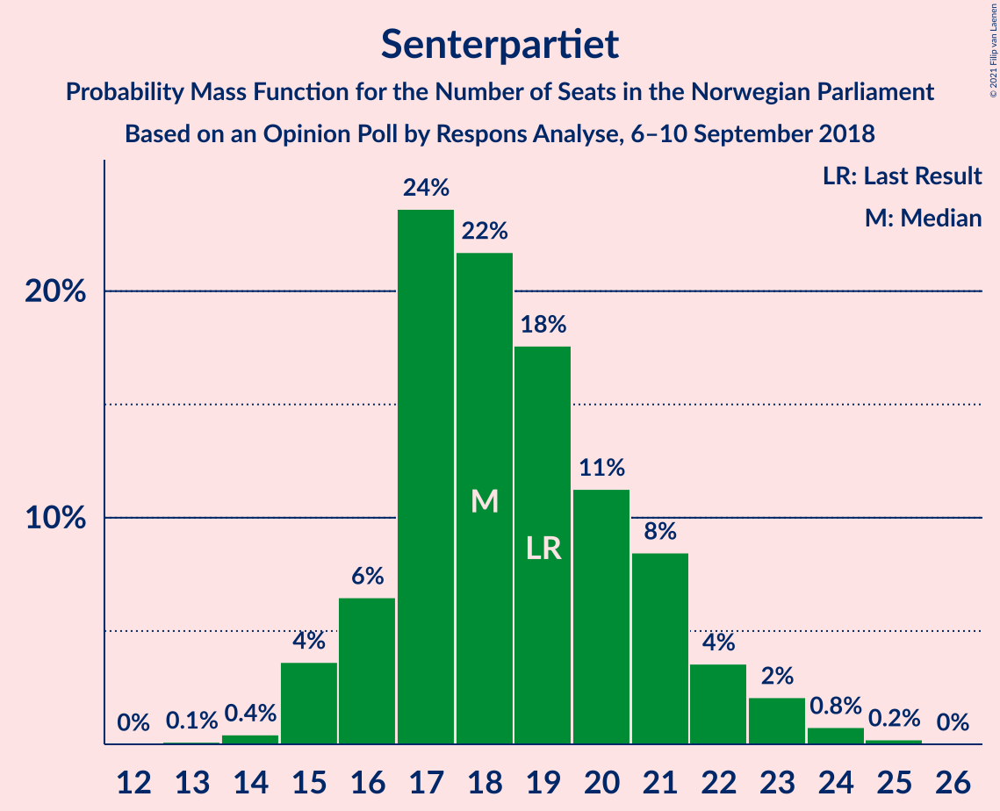
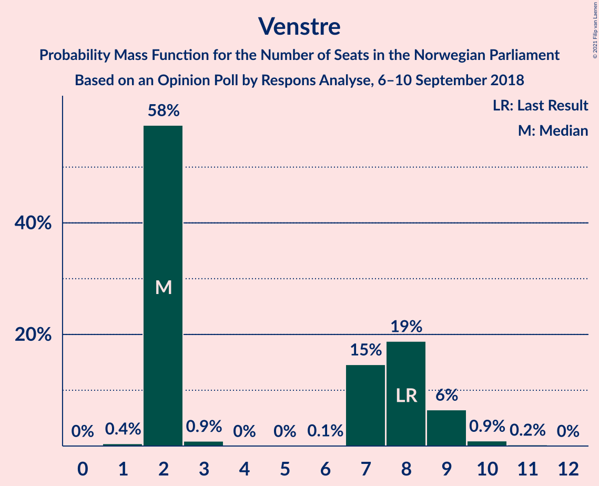
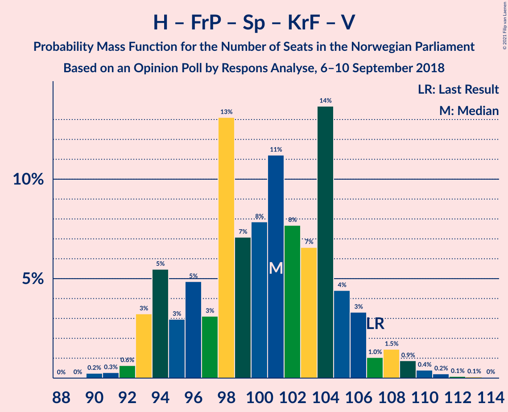
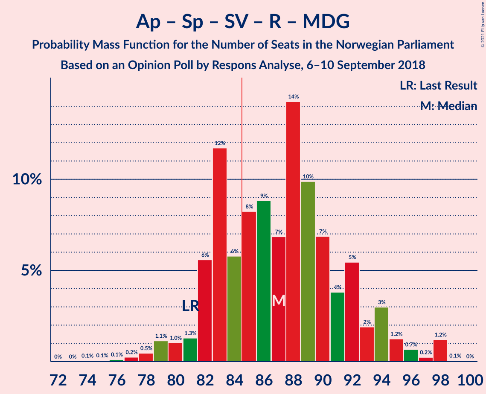
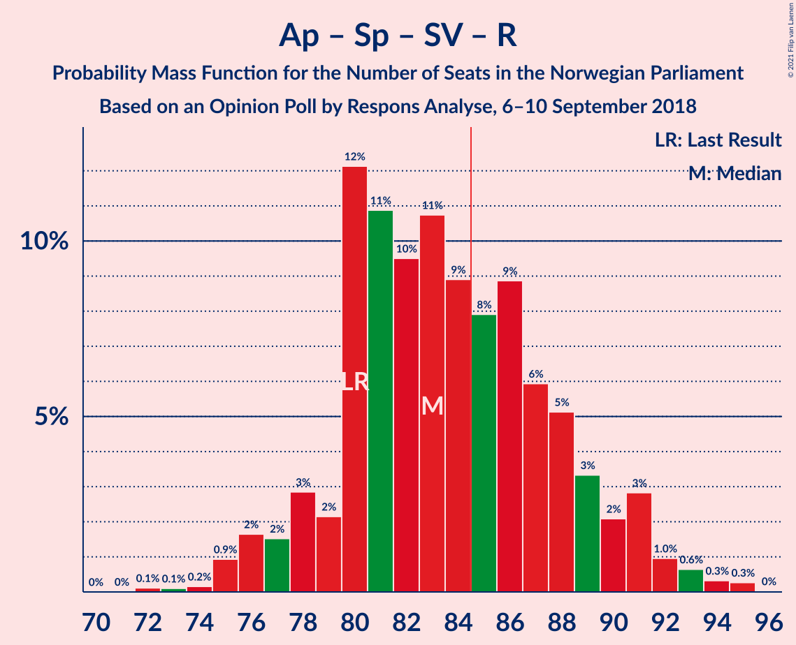
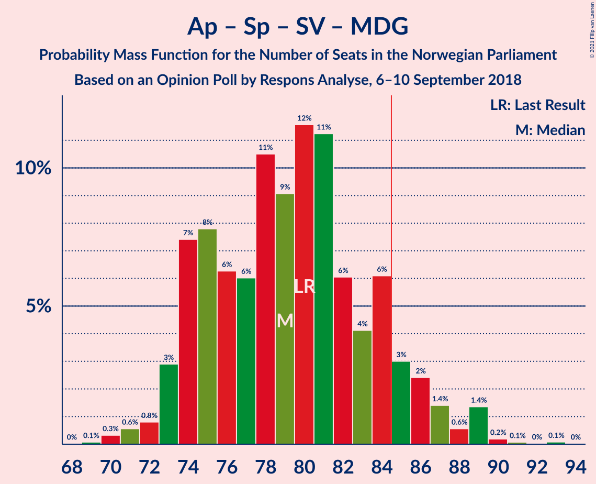
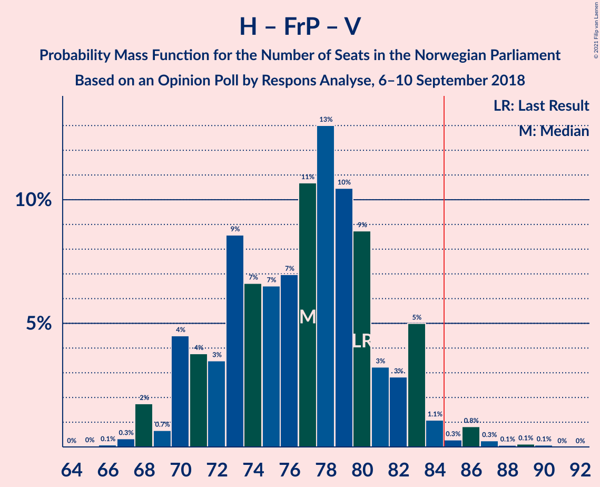
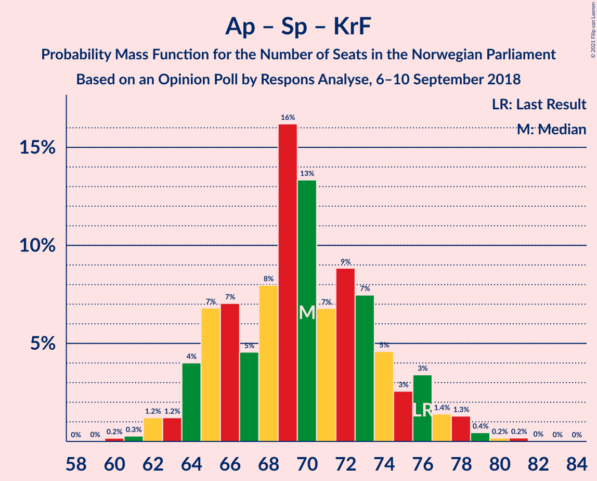
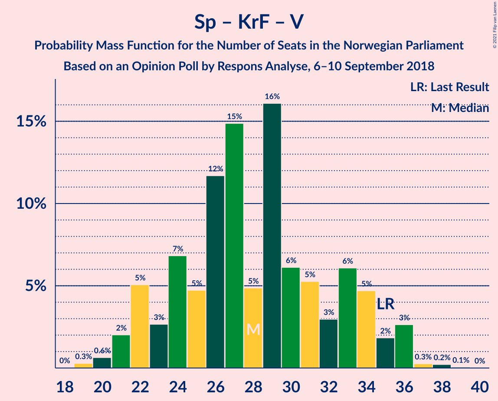

# Opinion Poll by Respons Analyse, 6–10 September 2018

<a href="#voting-intentions">Voting Intentions</a> | <a href="#seats">Seats</a> | <a href="#coalitions">Coalitions</a> | <a href="#technical-information">Technical Information</a>

## Voting Intentions

### Confidence Intervals

| Party | Last Result | Poll Result | 80% Confidence Interval | 90% Confidence Interval | 95% Confidence Interval | 99% Confidence Interval |
|:-----:|:-----------:|:-----------:|:-----------------------:|:-----------------------:|:-----------------------:|:-----------------------:|
| Høyre | 25.0% | 26.0% | 24.3–27.9% |23.8–28.4% |23.4–28.9% |22.6–29.8% |
| Arbeiderpartiet | 27.4% | 25.5% | 23.8–27.4% |23.4–27.9% |22.9–28.3% |22.1–29.2% |
| Fremskrittspartiet | 15.2% | 14.1% | 12.7–15.6% |12.4–16.0% |12.1–16.4% |11.4–17.1% |
| Senterpartiet | 10.3% | 10.4% | 9.2–11.7% |8.9–12.1% |8.6–12.4% |8.1–13.1% |
| Sosialistisk Venstreparti | 6.0% | 6.3% | 5.4–7.4% |5.2–7.7% |4.9–8.0% |4.5–8.5% |
| Rødt | 2.4% | 4.7% | 3.9–5.7% |3.7–5.9% |3.5–6.2% |3.2–6.7% |
| Kristelig Folkeparti | 4.2% | 3.9% | 3.2–4.8% |3.0–5.1% |2.9–5.3% |2.6–5.7% |
| Venstre | 4.4% | 3.8% | 3.1–4.7% |2.9–4.9% |2.8–5.2% |2.5–5.6% |
| Miljøpartiet De Grønne | 3.2% | 3.5% | 2.9–4.4% |2.7–4.6% |2.5–4.8% |2.2–5.3% |

*Note:* The poll result column reflects the actual value used in the calculations. Published results may vary slightly, and in addition be rounded to fewer digits.

## Seats

### Confidence Intervals

| Party | Last Result | Median | 80% Confidence Interval | 90% Confidence Interval | 95% Confidence Interval | 99% Confidence Interval |
|:-----:|:-----------:|:------:|:-----------------------:|:-----------------------:|:-----------------------:|:-----------------------:|
| <a href="#høyre">Høyre</a> | 45 | 47 | 42–52 |42–52 |41–52 |41–57 |
| <a href="#arbeiderpartiet">Arbeiderpartiet</a> | 49 | 45 | 43–50 |42–51 |42–52 |41–55 |
| <a href="#fremskrittspartiet">Fremskrittspartiet</a> | 27 | 26 | 24–28 |24–29 |22–30 |20–31 |
| <a href="#senterpartiet">Senterpartiet</a> | 19 | 19 | 17–22 |16–22 |16–22 |15–24 |
| <a href="#sosialistisk-venstreparti">Sosialistisk Venstreparti</a> | 11 | 10 | 9–12 |9–13 |9–14 |8–16 |
| <a href="#rødt">Rødt</a> | 1 | 9 | 2–10 |2–10 |2–11 |2–12 |
| <a href="#kristelig-folkeparti">Kristelig Folkeparti</a> | 8 | 3 | 3–9 |3–9 |1–9 |1–10 |
| <a href="#venstre">Venstre</a> | 8 | 2 | 2–8 |2–9 |2–9 |1–10 |
| <a href="#miljøpartiet-de-grønne">Miljøpartiet De Grønne</a> | 1 | 2 | 1–7 |1–7 |1–8 |1–9 |

### Høyre

*For a full overview of the results for this party, see the [Høyre](party-høyre.html) page.*

| Number of Seats | Probability | Accumulated | Special Marks |
|:---------------:|:-----------:|:-----------:|:-------------:|
| 38 | 0.1% | 100% |  |
| 39 | 0.1% | 99.9% |  |
| 40 | 0.2% | 99.8% |  |
| 41 | 4% | 99.5% |  |
| 42 | 9% | 95% |  |
| 43 | 7% | 86% |  |
| 44 | 12% | 79% |  |
| 45 | 6% | 67% | Last Result |
| 46 | 8% | 61% |  |
| 47 | 4% | 53% | Median |
| 48 | 6% | 49% |  |
| 49 | 25% | 43% |  |
| 50 | 3% | 18% |  |
| 51 | 2% | 15% |  |
| 52 | 11% | 13% |  |
| 53 | 0.3% | 2% |  |
| 54 | 0.4% | 2% |  |
| 55 | 0.2% | 2% |  |
| 56 | 0.2% | 2% |  |
| 57 | 1.3% | 1.3% |  |
| 58 | 0% | 0% |  |

### Arbeiderpartiet

*For a full overview of the results for this party, see the [Arbeiderpartiet](party-arbeiderpartiet.html) page.*

| Number of Seats | Probability | Accumulated | Special Marks |
|:---------------:|:-----------:|:-----------:|:-------------:|
| 39 | 0% | 100% |  |
| 40 | 0.3% | 99.9% |  |
| 41 | 1.4% | 99.6% |  |
| 42 | 5% | 98% |  |
| 43 | 27% | 94% |  |
| 44 | 11% | 66% |  |
| 45 | 10% | 55% | Median |
| 46 | 12% | 46% |  |
| 47 | 5% | 34% |  |
| 48 | 4% | 29% |  |
| 49 | 13% | 25% | Last Result |
| 50 | 3% | 12% |  |
| 51 | 6% | 9% |  |
| 52 | 1.3% | 3% |  |
| 53 | 0.6% | 2% |  |
| 54 | 0.1% | 1.1% |  |
| 55 | 0.9% | 0.9% |  |
| 56 | 0% | 0% |  |

### Fremskrittspartiet

*For a full overview of the results for this party, see the [Fremskrittspartiet](party-fremskrittspartiet.html) page.*

| Number of Seats | Probability | Accumulated | Special Marks |
|:---------------:|:-----------:|:-----------:|:-------------:|
| 19 | 0.3% | 100% |  |
| 20 | 0.6% | 99.7% |  |
| 21 | 0.7% | 99.0% |  |
| 22 | 1.5% | 98% |  |
| 23 | 2% | 97% |  |
| 24 | 21% | 95% |  |
| 25 | 9% | 74% |  |
| 26 | 34% | 64% | Median |
| 27 | 15% | 31% | Last Result |
| 28 | 9% | 16% |  |
| 29 | 3% | 7% |  |
| 30 | 3% | 4% |  |
| 31 | 0.6% | 1.0% |  |
| 32 | 0.4% | 0.4% |  |
| 33 | 0% | 0% |  |

### Senterpartiet

*For a full overview of the results for this party, see the [Senterpartiet](party-senterpartiet.html) page.*

| Number of Seats | Probability | Accumulated | Special Marks |
|:---------------:|:-----------:|:-----------:|:-------------:|
| 14 | 0.3% | 100% |  |
| 15 | 2% | 99.6% |  |
| 16 | 3% | 98% |  |
| 17 | 10% | 95% |  |
| 18 | 31% | 85% |  |
| 19 | 13% | 53% | Last Result, Median |
| 20 | 15% | 40% |  |
| 21 | 15% | 25% |  |
| 22 | 8% | 10% |  |
| 23 | 0.5% | 2% |  |
| 24 | 1.3% | 2% |  |
| 25 | 0.3% | 0.4% |  |
| 26 | 0% | 0% |  |

### Sosialistisk Venstreparti

*For a full overview of the results for this party, see the [Sosialistisk Venstreparti](party-sosialistiskvenstreparti.html) page.*

| Number of Seats | Probability | Accumulated | Special Marks |
|:---------------:|:-----------:|:-----------:|:-------------:|
| 7 | 0% | 100% |  |
| 8 | 0.5% | 99.9% |  |
| 9 | 24% | 99.5% |  |
| 10 | 31% | 76% | Median |
| 11 | 22% | 44% | Last Result |
| 12 | 17% | 23% |  |
| 13 | 4% | 6% |  |
| 14 | 1.4% | 3% |  |
| 15 | 0.6% | 1.2% |  |
| 16 | 0.5% | 0.6% |  |
| 17 | 0% | 0% |  |

### Rødt

*For a full overview of the results for this party, see the [Rødt](party-rødt.html) page.*

| Number of Seats | Probability | Accumulated | Special Marks |
|:---------------:|:-----------:|:-----------:|:-------------:|
| 1 | 0% | 100% | Last Result |
| 2 | 12% | 100% |  |
| 3 | 0% | 88% |  |
| 4 | 0% | 88% |  |
| 5 | 0% | 88% |  |
| 6 | 0% | 88% |  |
| 7 | 13% | 88% |  |
| 8 | 24% | 76% |  |
| 9 | 37% | 52% | Median |
| 10 | 12% | 15% |  |
| 11 | 2% | 3% |  |
| 12 | 0.4% | 0.6% |  |
| 13 | 0.2% | 0.2% |  |
| 14 | 0% | 0% |  |

### Kristelig Folkeparti

*For a full overview of the results for this party, see the [Kristelig Folkeparti](party-kristeligfolkeparti.html) page.*

| Number of Seats | Probability | Accumulated | Special Marks |
|:---------------:|:-----------:|:-----------:|:-------------:|
| 1 | 3% | 100% |  |
| 2 | 0.9% | 97% |  |
| 3 | 60% | 96% | Median |
| 4 | 0% | 36% |  |
| 5 | 0% | 36% |  |
| 6 | 0% | 36% |  |
| 7 | 7% | 36% |  |
| 8 | 17% | 29% | Last Result |
| 9 | 11% | 11% |  |
| 10 | 0.8% | 1.0% |  |
| 11 | 0.1% | 0.1% |  |
| 12 | 0% | 0% |  |

### Venstre

*For a full overview of the results for this party, see the [Venstre](party-venstre.html) page.*

| Number of Seats | Probability | Accumulated | Special Marks |
|:---------------:|:-----------:|:-----------:|:-------------:|
| 1 | 0.5% | 100% |  |
| 2 | 51% | 99.5% | Median |
| 3 | 0.3% | 48% |  |
| 4 | 0% | 48% |  |
| 5 | 0% | 48% |  |
| 6 | 0% | 48% |  |
| 7 | 9% | 48% |  |
| 8 | 34% | 39% | Last Result |
| 9 | 4% | 5% |  |
| 10 | 0.7% | 1.0% |  |
| 11 | 0.3% | 0.3% |  |
| 12 | 0% | 0% |  |

### Miljøpartiet De Grønne

*For a full overview of the results for this party, see the [Miljøpartiet De Grønne](party-miljøpartietdegrønne.html) page.*

| Number of Seats | Probability | Accumulated | Special Marks |
|:---------------:|:-----------:|:-----------:|:-------------:|
| 0 | 0.1% | 100% |  |
| 1 | 17% | 99.9% | Last Result |
| 2 | 34% | 83% | Median |
| 3 | 24% | 49% |  |
| 4 | 0% | 25% |  |
| 5 | 0% | 25% |  |
| 6 | 0.1% | 25% |  |
| 7 | 21% | 25% |  |
| 8 | 2% | 4% |  |
| 9 | 1.3% | 2% |  |
| 10 | 0.1% | 0.3% |  |
| 11 | 0.1% | 0.1% |  |
| 12 | 0% | 0% |  |

## Coalitions

### Confidence Intervals

| Coalition | Last Result | Median | Majority? | 80% Confidence Interval | 90% Confidence Interval | 95% Confidence Interval | 99% Confidence Interval |
|:---------:|:-----------:|:------:|:---------:|:-----------------------:|:-----------------------:|:-----------------------:|:-----------------------:|
| Høyre – Fremskrittspartiet – Senterpartiet – Kristelig Folkeparti – Venstre | 107 | 104 | 100% | 95–105 | 93–106 | 93–108 | 92–111 |
| Arbeiderpartiet – Senterpartiet – Sosialistisk Venstreparti – Rødt – Miljøpartiet De Grønne | 81 | 86 | 60% | 82–94 | 81–98 | 79–98 | 77–98 |
| Høyre – Fremskrittspartiet – Kristelig Folkeparti – Venstre – Miljøpartiet De Grønne | 89 | 86 | 70% | 80–89 | 78–90 | 78–93 | 77–96 |
| Arbeiderpartiet – Senterpartiet – Sosialistisk Venstreparti – Kristelig Folkeparti – Miljøpartiet De Grønne | 88 | 82 | 39% | 77–92 | 77–92 | 77–92 | 77–94 |
| Arbeiderpartiet – Senterpartiet – Sosialistisk Venstreparti – Rødt | 80 | 83 | 30% | 80–89 | 79–91 | 76–91 | 73–92 |
| Høyre – Fremskrittspartiet – Kristelig Folkeparti – Venstre | 88 | 83 | 40% | 75–87 | 71–88 | 71–90 | 71–92 |
| Arbeiderpartiet – Senterpartiet – Sosialistisk Venstreparti – Miljøpartiet De Grønne | 80 | 78 | 14% | 74–87 | 73–89 | 73–89 | 71–89 |
| Arbeiderpartiet – Senterpartiet – Sosialistisk Venstreparti | 79 | 76 | 2% | 71–82 | 71–82 | 70–84 | 68–87 |
| Høyre – Fremskrittspartiet – Venstre | 80 | 79 | 1.2% | 70–83 | 68–83 | 68–84 | 67–86 |
| Arbeiderpartiet – Senterpartiet – Kristelig Folkeparti – Miljøpartiet De Grønne | 77 | 72 | 0.1% | 67–81 | 67–81 | 67–81 | 64–84 |
| Høyre – Fremskrittspartiet | 72 | 73 | 0% | 66–78 | 66–78 | 66–78 | 65–82 |
| Arbeiderpartiet – Senterpartiet – Kristelig Folkeparti | 76 | 70 | 0% | 64–76 | 64–76 | 64–77 | 62–79 |
| Arbeiderpartiet – Senterpartiet | 68 | 64 | 0% | 61–71 | 61–71 | 60–73 | 58–75 |
| Høyre – Kristelig Folkeparti – Venstre | 61 | 57 | 0% | 50–61 | 47–62 | 47–66 | 47–66 |
| Arbeiderpartiet – Sosialistisk Venstreparti | 60 | 55 | 0% | 53–60 | 53–62 | 53–63 | 51–67 |
| Senterpartiet – Kristelig Folkeparti – Venstre | 35 | 29 | 0% | 25–33 | 24–34 | 23–35 | 20–36 |

### Høyre – Fremskrittspartiet – Senterpartiet – Kristelig Folkeparti – Venstre

| Number of Seats | Probability | Accumulated | Special Marks |
|:---------------:|:-----------:|:-----------:|:-------------:|
| 88 | 0.1% | 100% |  |
| 89 | 0% | 99.9% |  |
| 90 | 0.1% | 99.9% |  |
| 91 | 0.2% | 99.8% |  |
| 92 | 0.3% | 99.6% |  |
| 93 | 8% | 99.3% |  |
| 94 | 0.9% | 91% |  |
| 95 | 3% | 90% |  |
| 96 | 2% | 88% |  |
| 97 | 1.0% | 86% | Median |
| 98 | 10% | 85% |  |
| 99 | 2% | 75% |  |
| 100 | 10% | 72% |  |
| 101 | 3% | 62% |  |
| 102 | 3% | 60% |  |
| 103 | 5% | 57% |  |
| 104 | 39% | 52% |  |
| 105 | 3% | 13% |  |
| 106 | 5% | 9% |  |
| 107 | 0.9% | 4% | Last Result |
| 108 | 0.7% | 3% |  |
| 109 | 2% | 2% |  |
| 110 | 0.1% | 0.7% |  |
| 111 | 0.1% | 0.6% |  |
| 112 | 0.2% | 0.5% |  |
| 113 | 0.3% | 0.3% |  |
| 114 | 0% | 0% |  |

### Arbeiderpartiet – Senterpartiet – Sosialistisk Venstreparti – Rødt – Miljøpartiet De Grønne

| Number of Seats | Probability | Accumulated | Special Marks |
|:---------------:|:-----------:|:-----------:|:-------------:|
| 75 | 0.2% | 100% |  |
| 76 | 0.2% | 99.7% |  |
| 77 | 0.1% | 99.5% |  |
| 78 | 0.3% | 99.4% |  |
| 79 | 2% | 99.1% |  |
| 80 | 0.9% | 97% |  |
| 81 | 1.4% | 96% | Last Result |
| 82 | 5% | 95% |  |
| 83 | 27% | 90% |  |
| 84 | 3% | 63% |  |
| 85 | 6% | 60% | Median, Majority |
| 86 | 15% | 53% |  |
| 87 | 8% | 38% |  |
| 88 | 1.1% | 31% |  |
| 89 | 4% | 29% |  |
| 90 | 8% | 25% |  |
| 91 | 4% | 17% |  |
| 92 | 0.9% | 13% |  |
| 93 | 1.0% | 12% |  |
| 94 | 3% | 11% |  |
| 95 | 0.4% | 8% |  |
| 96 | 0.2% | 8% |  |
| 97 | 0% | 8% |  |
| 98 | 8% | 8% |  |
| 99 | 0% | 0.1% |  |
| 100 | 0% | 0.1% |  |
| 101 | 0% | 0% |  |

### Høyre – Fremskrittspartiet – Kristelig Folkeparti – Venstre – Miljøpartiet De Grønne

| Number of Seats | Probability | Accumulated | Special Marks |
|:---------------:|:-----------:|:-----------:|:-------------:|
| 75 | 0.2% | 100% |  |
| 76 | 0.1% | 99.8% |  |
| 77 | 0.8% | 99.7% |  |
| 78 | 8% | 98.9% |  |
| 79 | 0.5% | 91% |  |
| 80 | 6% | 90% | Median |
| 81 | 3% | 84% |  |
| 82 | 3% | 81% |  |
| 83 | 2% | 78% |  |
| 84 | 6% | 76% |  |
| 85 | 11% | 70% | Majority |
| 86 | 11% | 59% |  |
| 87 | 6% | 48% |  |
| 88 | 7% | 42% |  |
| 89 | 27% | 35% | Last Result |
| 90 | 3% | 8% |  |
| 91 | 0.9% | 5% |  |
| 92 | 0.8% | 4% |  |
| 93 | 2% | 3% |  |
| 94 | 0.2% | 1.2% |  |
| 95 | 0.2% | 1.0% |  |
| 96 | 0.3% | 0.7% |  |
| 97 | 0.4% | 0.4% |  |
| 98 | 0% | 0% |  |

### Arbeiderpartiet – Senterpartiet – Sosialistisk Venstreparti – Kristelig Folkeparti – Miljøpartiet De Grønne

| Number of Seats | Probability | Accumulated | Special Marks |
|:---------------:|:-----------:|:-----------:|:-------------:|
| 74 | 0% | 100% |  |
| 75 | 0.1% | 99.9% |  |
| 76 | 0.3% | 99.9% |  |
| 77 | 21% | 99.6% |  |
| 78 | 5% | 78% |  |
| 79 | 1.0% | 73% | Median |
| 80 | 0.8% | 72% |  |
| 81 | 17% | 72% |  |
| 82 | 6% | 54% |  |
| 83 | 3% | 49% |  |
| 84 | 7% | 45% |  |
| 85 | 3% | 39% | Majority |
| 86 | 5% | 36% |  |
| 87 | 1.1% | 30% |  |
| 88 | 1.2% | 29% | Last Result |
| 89 | 10% | 28% |  |
| 90 | 2% | 18% |  |
| 91 | 5% | 16% |  |
| 92 | 9% | 11% |  |
| 93 | 0.1% | 2% |  |
| 94 | 2% | 2% |  |
| 95 | 0% | 0.1% |  |
| 96 | 0% | 0.1% |  |
| 97 | 0% | 0.1% |  |
| 98 | 0% | 0% |  |

### Arbeiderpartiet – Senterpartiet – Sosialistisk Venstreparti – Rødt

| Number of Seats | Probability | Accumulated | Special Marks |
|:---------------:|:-----------:|:-----------:|:-------------:|
| 72 | 0.4% | 100% |  |
| 73 | 0.3% | 99.6% |  |
| 74 | 0.2% | 99.3% |  |
| 75 | 0.2% | 99.0% |  |
| 76 | 2% | 98.8% |  |
| 77 | 0.8% | 97% |  |
| 78 | 0.9% | 96% |  |
| 79 | 3% | 95% |  |
| 80 | 27% | 92% | Last Result |
| 81 | 7% | 65% |  |
| 82 | 6% | 58% |  |
| 83 | 11% | 52% | Median |
| 84 | 11% | 41% |  |
| 85 | 6% | 30% | Majority |
| 86 | 2% | 24% |  |
| 87 | 3% | 22% |  |
| 88 | 3% | 19% |  |
| 89 | 6% | 16% |  |
| 90 | 0.5% | 10% |  |
| 91 | 8% | 9% |  |
| 92 | 0.8% | 1.1% |  |
| 93 | 0.1% | 0.3% |  |
| 94 | 0.2% | 0.2% |  |
| 95 | 0% | 0% |  |

### Høyre – Fremskrittspartiet – Kristelig Folkeparti – Venstre

| Number of Seats | Probability | Accumulated | Special Marks |
|:---------------:|:-----------:|:-----------:|:-------------:|
| 69 | 0% | 100% |  |
| 70 | 0% | 99.9% |  |
| 71 | 8% | 99.9% |  |
| 72 | 0% | 92% |  |
| 73 | 0.2% | 92% |  |
| 74 | 0.4% | 92% |  |
| 75 | 3% | 92% |  |
| 76 | 1.0% | 89% |  |
| 77 | 0.9% | 88% |  |
| 78 | 4% | 87% | Median |
| 79 | 8% | 83% |  |
| 80 | 4% | 75% |  |
| 81 | 1.1% | 71% |  |
| 82 | 8% | 69% |  |
| 83 | 15% | 62% |  |
| 84 | 6% | 47% |  |
| 85 | 3% | 40% | Majority |
| 86 | 27% | 37% |  |
| 87 | 5% | 10% |  |
| 88 | 1.4% | 5% | Last Result |
| 89 | 0.9% | 4% |  |
| 90 | 2% | 3% |  |
| 91 | 0.3% | 0.9% |  |
| 92 | 0.1% | 0.6% |  |
| 93 | 0.2% | 0.5% |  |
| 94 | 0.2% | 0.3% |  |
| 95 | 0% | 0% |  |

### Arbeiderpartiet – Senterpartiet – Sosialistisk Venstreparti – Miljøpartiet De Grønne

| Number of Seats | Probability | Accumulated | Special Marks |
|:---------------:|:-----------:|:-----------:|:-------------:|
| 69 | 0.2% | 100% |  |
| 70 | 0.1% | 99.8% |  |
| 71 | 0.7% | 99.7% |  |
| 72 | 1.3% | 99.0% |  |
| 73 | 3% | 98% |  |
| 74 | 21% | 95% |  |
| 75 | 10% | 74% |  |
| 76 | 0.9% | 64% | Median |
| 77 | 4% | 63% |  |
| 78 | 18% | 59% |  |
| 79 | 1.0% | 40% |  |
| 80 | 11% | 39% | Last Result |
| 81 | 7% | 29% |  |
| 82 | 1.4% | 22% |  |
| 83 | 6% | 21% |  |
| 84 | 0.8% | 15% |  |
| 85 | 0.8% | 14% | Majority |
| 86 | 3% | 14% |  |
| 87 | 2% | 10% |  |
| 88 | 0% | 9% |  |
| 89 | 8% | 9% |  |
| 90 | 0% | 0.2% |  |
| 91 | 0.1% | 0.1% |  |
| 92 | 0% | 0.1% |  |
| 93 | 0% | 0% |  |

### Arbeiderpartiet – Senterpartiet – Sosialistisk Venstreparti

| Number of Seats | Probability | Accumulated | Special Marks |
|:---------------:|:-----------:|:-----------:|:-------------:|
| 67 | 0.3% | 100% |  |
| 68 | 0.2% | 99.7% |  |
| 69 | 0.5% | 99.5% |  |
| 70 | 2% | 99.0% |  |
| 71 | 22% | 97% |  |
| 72 | 2% | 75% |  |
| 73 | 15% | 72% |  |
| 74 | 4% | 58% | Median |
| 75 | 3% | 54% |  |
| 76 | 18% | 51% |  |
| 77 | 6% | 33% |  |
| 78 | 2% | 26% |  |
| 79 | 8% | 24% | Last Result |
| 80 | 3% | 16% |  |
| 81 | 1.4% | 13% |  |
| 82 | 9% | 12% |  |
| 83 | 0.2% | 3% |  |
| 84 | 1.1% | 3% |  |
| 85 | 0.1% | 2% | Majority |
| 86 | 0.9% | 2% |  |
| 87 | 0.7% | 0.8% |  |
| 88 | 0% | 0% |  |

### Høyre – Fremskrittspartiet – Venstre

| Number of Seats | Probability | Accumulated | Special Marks |
|:---------------:|:-----------:|:-----------:|:-------------:|
| 66 | 0% | 100% |  |
| 67 | 2% | 99.9% |  |
| 68 | 8% | 98% |  |
| 69 | 0.1% | 90% |  |
| 70 | 3% | 90% |  |
| 71 | 5% | 87% |  |
| 72 | 1.4% | 83% |  |
| 73 | 6% | 81% |  |
| 74 | 0.9% | 75% |  |
| 75 | 9% | 75% | Median |
| 76 | 0.9% | 65% |  |
| 77 | 4% | 64% |  |
| 78 | 7% | 60% |  |
| 79 | 10% | 54% |  |
| 80 | 11% | 44% | Last Result |
| 81 | 6% | 33% |  |
| 82 | 2% | 27% |  |
| 83 | 22% | 25% |  |
| 84 | 2% | 3% |  |
| 85 | 0.2% | 1.2% | Majority |
| 86 | 0.6% | 1.0% |  |
| 87 | 0.2% | 0.5% |  |
| 88 | 0% | 0.3% |  |
| 89 | 0.1% | 0.3% |  |
| 90 | 0.2% | 0.2% |  |
| 91 | 0% | 0% |  |

### Arbeiderpartiet – Senterpartiet – Kristelig Folkeparti – Miljøpartiet De Grønne

| Number of Seats | Probability | Accumulated | Special Marks |
|:---------------:|:-----------:|:-----------:|:-------------:|
| 63 | 0% | 100% |  |
| 64 | 0.7% | 99.9% |  |
| 65 | 0.3% | 99.2% |  |
| 66 | 0.4% | 98.9% |  |
| 67 | 21% | 98.5% |  |
| 68 | 0.4% | 78% |  |
| 69 | 6% | 77% | Median |
| 70 | 5% | 71% |  |
| 71 | 8% | 66% |  |
| 72 | 14% | 58% |  |
| 73 | 3% | 45% |  |
| 74 | 5% | 42% |  |
| 75 | 3% | 37% |  |
| 76 | 3% | 34% |  |
| 77 | 11% | 31% | Last Result |
| 78 | 3% | 19% |  |
| 79 | 5% | 17% |  |
| 80 | 2% | 12% |  |
| 81 | 8% | 10% |  |
| 82 | 0.4% | 2% |  |
| 83 | 0.1% | 2% |  |
| 84 | 2% | 2% |  |
| 85 | 0% | 0.1% | Majority |
| 86 | 0% | 0.1% |  |
| 87 | 0% | 0.1% |  |
| 88 | 0% | 0% |  |

### Høyre – Fremskrittspartiet

| Number of Seats | Probability | Accumulated | Special Marks |
|:---------------:|:-----------:|:-----------:|:-------------:|
| 61 | 0% | 100% |  |
| 62 | 0.1% | 99.9% |  |
| 63 | 0.2% | 99.9% |  |
| 64 | 0.1% | 99.7% |  |
| 65 | 2% | 99.6% |  |
| 66 | 9% | 98% |  |
| 67 | 4% | 89% |  |
| 68 | 4% | 85% |  |
| 69 | 5% | 81% |  |
| 70 | 3% | 76% |  |
| 71 | 10% | 74% |  |
| 72 | 6% | 64% | Last Result |
| 73 | 11% | 58% | Median |
| 74 | 3% | 47% |  |
| 75 | 24% | 44% |  |
| 76 | 4% | 20% |  |
| 77 | 3% | 16% |  |
| 78 | 11% | 13% |  |
| 79 | 0.2% | 2% |  |
| 80 | 0.1% | 2% |  |
| 81 | 0.1% | 2% |  |
| 82 | 2% | 2% |  |
| 83 | 0% | 0.2% |  |
| 84 | 0.2% | 0.2% |  |
| 85 | 0% | 0% | Majority |

### Arbeiderpartiet – Senterpartiet – Kristelig Folkeparti

| Number of Seats | Probability | Accumulated | Special Marks |
|:---------------:|:-----------:|:-----------:|:-------------:|
| 60 | 0% | 100% |  |
| 61 | 0.4% | 99.9% |  |
| 62 | 0.4% | 99.6% |  |
| 63 | 0.7% | 99.2% |  |
| 64 | 20% | 98.5% |  |
| 65 | 1.0% | 78% |  |
| 66 | 2% | 77% |  |
| 67 | 7% | 75% | Median |
| 68 | 5% | 69% |  |
| 69 | 9% | 64% |  |
| 70 | 18% | 55% |  |
| 71 | 4% | 36% |  |
| 72 | 8% | 33% |  |
| 73 | 3% | 25% |  |
| 74 | 9% | 22% |  |
| 75 | 2% | 13% |  |
| 76 | 6% | 11% | Last Result |
| 77 | 3% | 5% |  |
| 78 | 0.8% | 2% |  |
| 79 | 0.7% | 1.0% |  |
| 80 | 0.1% | 0.4% |  |
| 81 | 0.3% | 0.3% |  |
| 82 | 0% | 0% |  |

### Arbeiderpartiet – Senterpartiet

| Number of Seats | Probability | Accumulated | Special Marks |
|:---------------:|:-----------:|:-----------:|:-------------:|
| 57 | 0.2% | 100% |  |
| 58 | 0.4% | 99.7% |  |
| 59 | 0.9% | 99.3% |  |
| 60 | 3% | 98% |  |
| 61 | 27% | 96% |  |
| 62 | 7% | 69% |  |
| 63 | 4% | 62% |  |
| 64 | 10% | 58% | Median |
| 65 | 6% | 47% |  |
| 66 | 4% | 42% |  |
| 67 | 14% | 37% |  |
| 68 | 5% | 24% | Last Result |
| 69 | 5% | 19% |  |
| 70 | 4% | 14% |  |
| 71 | 8% | 11% |  |
| 72 | 0.3% | 3% |  |
| 73 | 1.0% | 3% |  |
| 74 | 0.9% | 2% |  |
| 75 | 0.7% | 0.8% |  |
| 76 | 0% | 0.1% |  |
| 77 | 0% | 0% |  |

### Høyre – Kristelig Folkeparti – Venstre

| Number of Seats | Probability | Accumulated | Special Marks |
|:---------------:|:-----------:|:-----------:|:-------------:|
| 45 | 0% | 100% |  |
| 46 | 0% | 99.9% |  |
| 47 | 8% | 99.9% |  |
| 48 | 1.2% | 92% |  |
| 49 | 0.3% | 91% |  |
| 50 | 2% | 90% |  |
| 51 | 3% | 89% |  |
| 52 | 0.5% | 86% | Median |
| 53 | 5% | 85% |  |
| 54 | 5% | 80% |  |
| 55 | 13% | 75% |  |
| 56 | 2% | 62% |  |
| 57 | 18% | 61% |  |
| 58 | 5% | 43% |  |
| 59 | 5% | 37% |  |
| 60 | 21% | 32% |  |
| 61 | 4% | 11% | Last Result |
| 62 | 2% | 7% |  |
| 63 | 0.9% | 5% |  |
| 64 | 1.0% | 4% |  |
| 65 | 0% | 3% |  |
| 66 | 2% | 3% |  |
| 67 | 0.1% | 0.2% |  |
| 68 | 0.1% | 0.1% |  |
| 69 | 0% | 0% |  |

### Arbeiderpartiet – Sosialistisk Venstreparti

| Number of Seats | Probability | Accumulated | Special Marks |
|:---------------:|:-----------:|:-----------:|:-------------:|
| 50 | 0.3% | 100% |  |
| 51 | 0.2% | 99.7% |  |
| 52 | 0.9% | 99.4% |  |
| 53 | 29% | 98.5% |  |
| 54 | 4% | 69% |  |
| 55 | 22% | 66% | Median |
| 56 | 1.4% | 43% |  |
| 57 | 9% | 42% |  |
| 58 | 3% | 33% |  |
| 59 | 7% | 30% |  |
| 60 | 15% | 23% | Last Result |
| 61 | 2% | 8% |  |
| 62 | 2% | 6% |  |
| 63 | 2% | 4% |  |
| 64 | 0.8% | 2% |  |
| 65 | 0.2% | 1.1% |  |
| 66 | 0% | 0.9% |  |
| 67 | 0.8% | 0.9% |  |
| 68 | 0% | 0% |  |

### Senterpartiet – Kristelig Folkeparti – Venstre

| Number of Seats | Probability | Accumulated | Special Marks |
|:---------------:|:-----------:|:-----------:|:-------------:|
| 18 | 0% | 100% |  |
| 19 | 0.3% | 99.9% |  |
| 20 | 0.2% | 99.7% |  |
| 21 | 0.4% | 99.4% |  |
| 22 | 0.8% | 99.0% |  |
| 23 | 1.5% | 98% |  |
| 24 | 3% | 97% | Median |
| 25 | 4% | 93% |  |
| 26 | 14% | 90% |  |
| 27 | 11% | 76% |  |
| 28 | 4% | 65% |  |
| 29 | 31% | 61% |  |
| 30 | 5% | 30% |  |
| 31 | 7% | 24% |  |
| 32 | 3% | 17% |  |
| 33 | 5% | 14% |  |
| 34 | 6% | 9% |  |
| 35 | 0.7% | 3% | Last Result |
| 36 | 2% | 2% |  |
| 37 | 0% | 0.2% |  |
| 38 | 0.1% | 0.2% |  |
| 39 | 0% | 0.1% |  |
| 40 | 0% | 0.1% |  |
| 41 | 0% | 0% |  |

## Technical Information

### Opinion Poll

+ **Polling firm:** Respons Analyse
+ **Commissioner(s):** —
+ **Fieldwork period:** 6–10 September 2018

### Calculations

+ **Sample size:** 1002
+ **Simulations done:** 131,072
+ **Error estimate:** 1.59%

