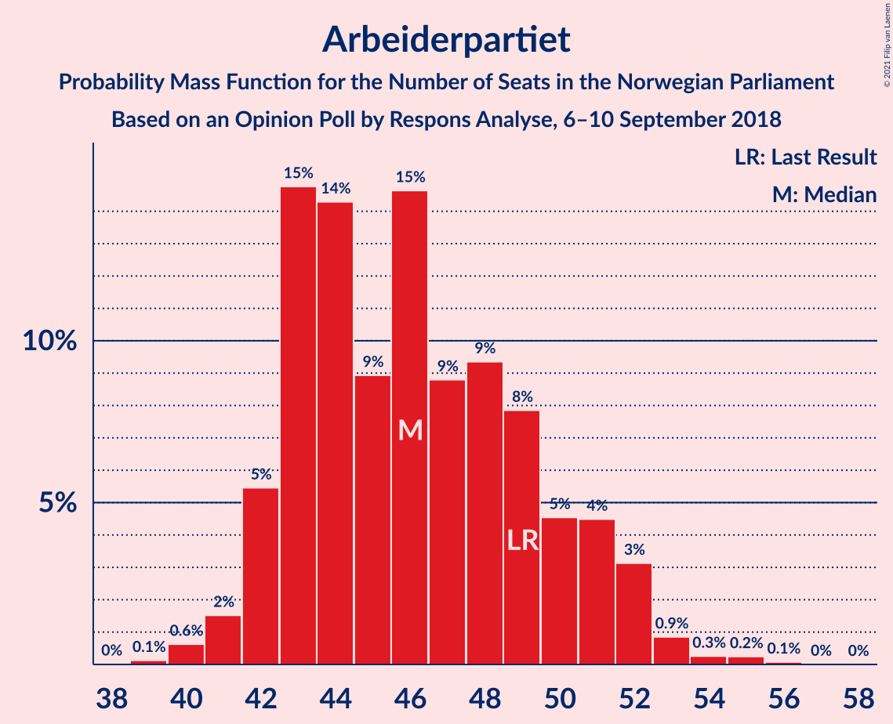
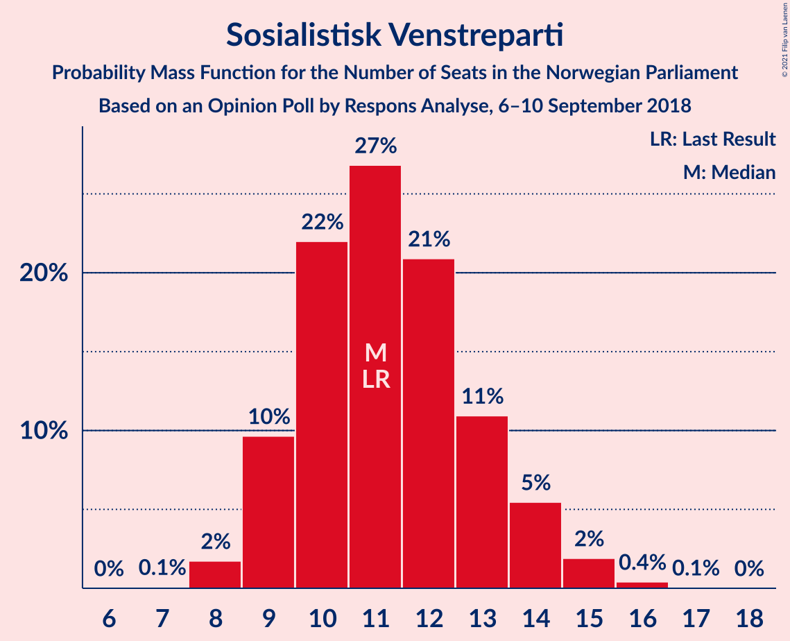
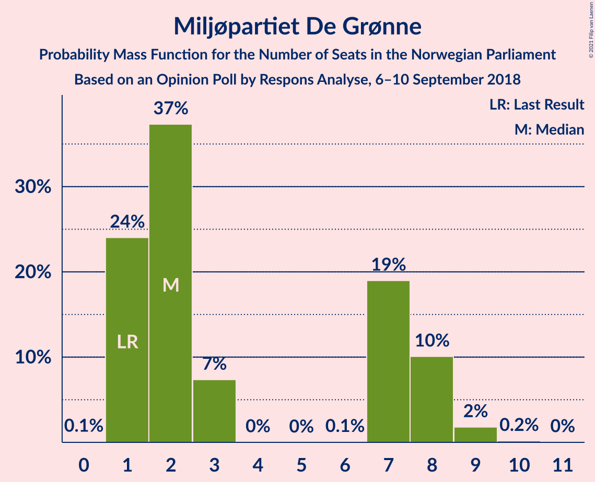
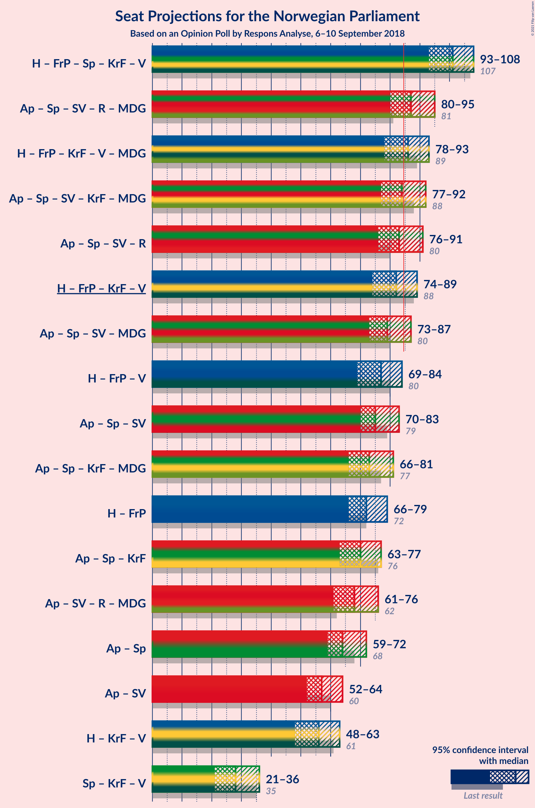
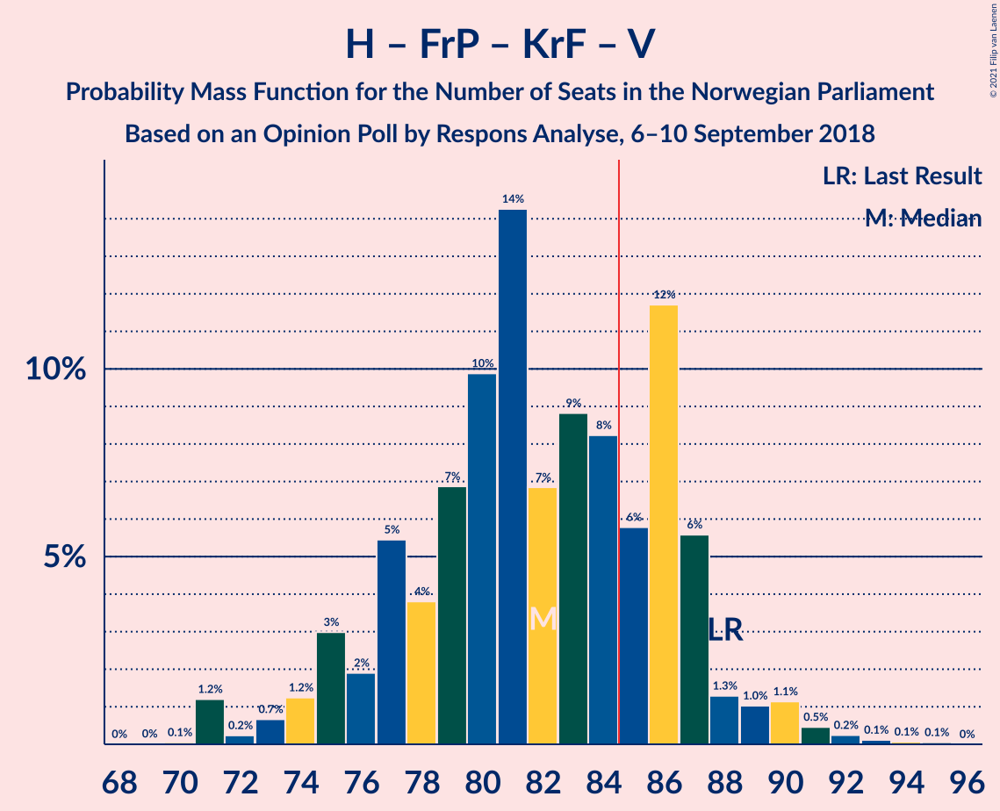
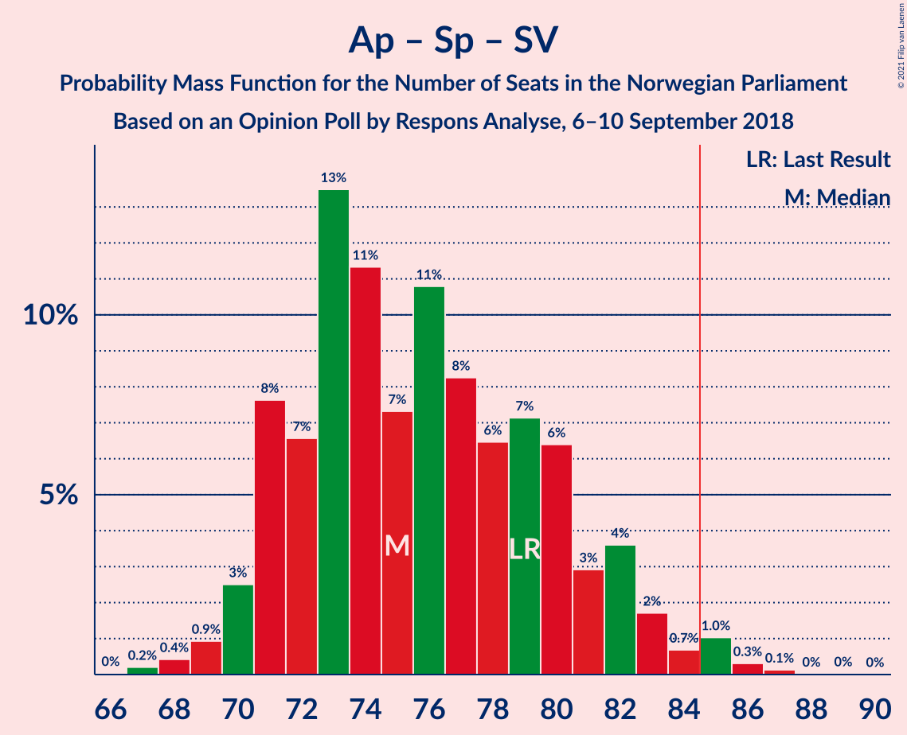
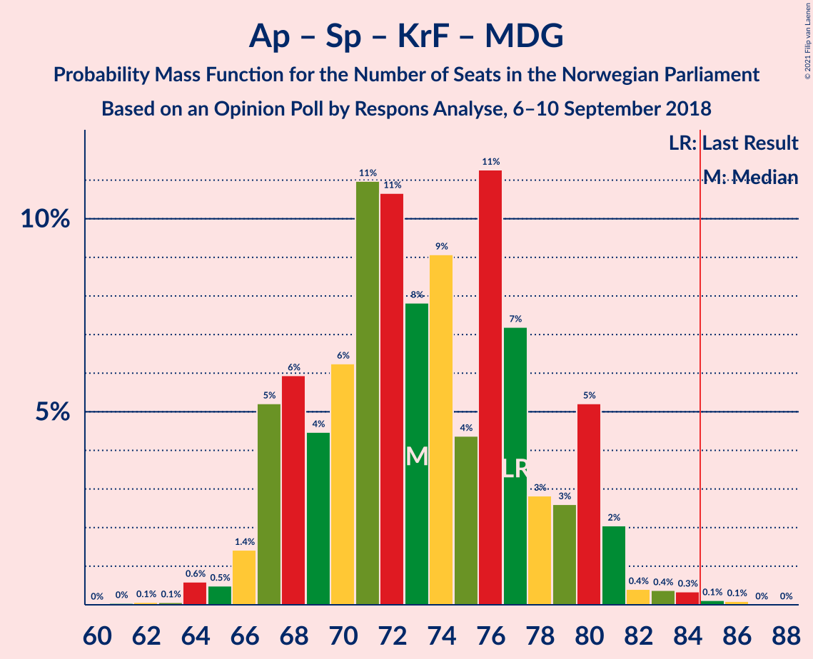
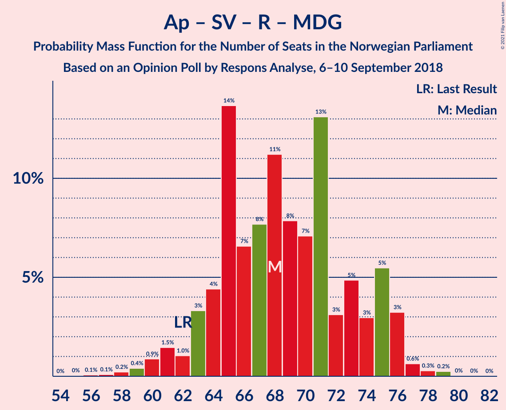
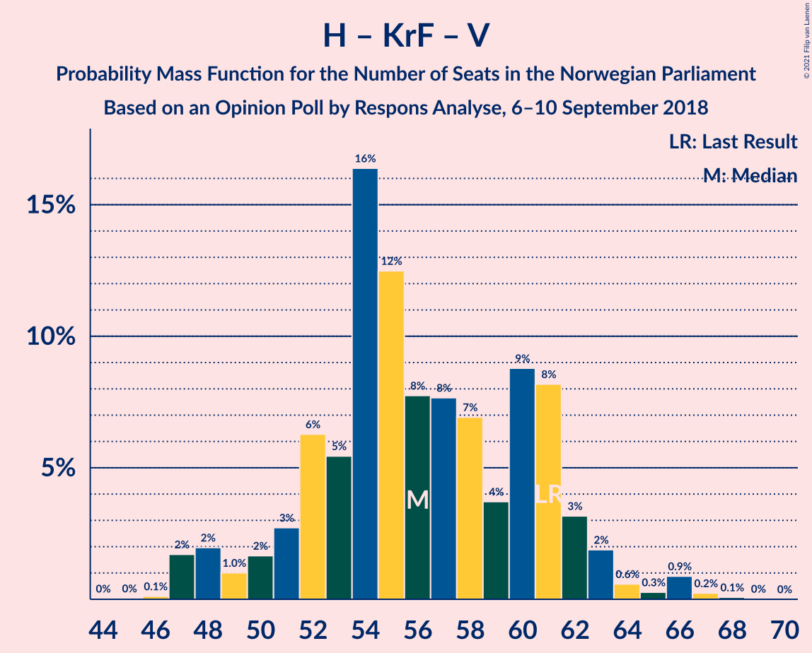

# Opinion Poll by Respons Analyse, 6–10 September 2018

<a href="#voting-intentions">Voting Intentions</a> | <a href="#seats">Seats</a> | <a href="#coalitions">Coalitions</a> | <a href="#technical-information">Technical Information</a>

## Voting Intentions

### Confidence Intervals

| Party | Last Result | Poll Result | 80% Confidence Interval | 90% Confidence Interval | 95% Confidence Interval | 99% Confidence Interval |
|:-----:|:-----------:|:-----------:|:-----------------------:|:-----------------------:|:-----------------------:|:-----------------------:|
| Høyre | 25.0% | 26.0% | 24.3–27.9% |23.8–28.4% |23.4–28.9% |22.6–29.8% |
| Arbeiderpartiet | 27.4% | 25.5% | 23.8–27.4% |23.4–27.9% |22.9–28.3% |22.1–29.2% |
| Fremskrittspartiet | 15.2% | 14.1% | 12.7–15.6% |12.4–16.0% |12.1–16.4% |11.4–17.1% |
| Senterpartiet | 10.3% | 10.4% | 9.2–11.7% |8.9–12.1% |8.6–12.4% |8.1–13.1% |
| Sosialistisk Venstreparti | 6.0% | 6.3% | 5.4–7.4% |5.2–7.7% |4.9–8.0% |4.5–8.5% |
| Rødt | 2.4% | 4.7% | 3.9–5.7% |3.7–5.9% |3.5–6.2% |3.2–6.7% |
| Kristelig Folkeparti | 4.2% | 3.9% | 3.2–4.8% |3.0–5.1% |2.9–5.3% |2.6–5.7% |
| Venstre | 4.4% | 3.8% | 3.1–4.7% |2.9–4.9% |2.8–5.2% |2.5–5.6% |
| Miljøpartiet De Grønne | 3.2% | 3.5% | 2.9–4.4% |2.7–4.6% |2.5–4.8% |2.2–5.3% |

*Note:* The poll result column reflects the actual value used in the calculations. Published results may vary slightly, and in addition be rounded to fewer digits.

## Seats

### Confidence Intervals

| Party | Last Result | Median | 80% Confidence Interval | 90% Confidence Interval | 95% Confidence Interval | 99% Confidence Interval |
|:-----:|:-----------:|:------:|:-----------------------:|:-----------------------:|:-----------------------:|:-----------------------:|
| <a href="#høyre">Høyre</a> | 45 | 46 | 43–51 |42–52 |41–52 |40–54 |
| <a href="#arbeiderpartiet">Arbeiderpartiet</a> | 49 | 46 | 43–50 |42–51 |42–52 |40–54 |
| <a href="#fremskrittspartiet">Fremskrittspartiet</a> | 27 | 26 | 23–28 |22–29 |21–30 |20–31 |
| <a href="#senterpartiet">Senterpartiet</a> | 19 | 18 | 16–21 |16–22 |15–23 |14–24 |
| <a href="#sosialistisk-venstreparti">Sosialistisk Venstreparti</a> | 11 | 11 | 9–13 |9–14 |9–14 |8–15 |
| <a href="#rødt">Rødt</a> | 1 | 8 | 2–10 |2–10 |2–11 |2–12 |
| <a href="#kristelig-folkeparti">Kristelig Folkeparti</a> | 8 | 3 | 2–8 |1–9 |1–9 |1–10 |
| <a href="#venstre">Venstre</a> | 8 | 2 | 2–8 |2–9 |2–9 |2–10 |
| <a href="#miljøpartiet-de-grønne">Miljøpartiet De Grønne</a> | 1 | 2 | 1–8 |1–8 |1–8 |1–9 |

### Høyre

*For a full overview of the results for this party, see the [Høyre](party-høyre.html) page.*

| Number of Seats | Probability | Accumulated | Special Marks |
|:---------------:|:-----------:|:-----------:|:-------------:|
| 38 | 0.1% | 100% |  |
| 39 | 0.3% | 99.9% |  |
| 40 | 0.7% | 99.5% |  |
| 41 | 2% | 98.9% |  |
| 42 | 4% | 97% |  |
| 43 | 10% | 93% |  |
| 44 | 15% | 83% |  |
| 45 | 9% | 68% | Last Result |
| 46 | 14% | 59% | Median |
| 47 | 8% | 45% |  |
| 48 | 6% | 37% |  |
| 49 | 14% | 31% |  |
| 50 | 6% | 17% |  |
| 51 | 6% | 11% |  |
| 52 | 3% | 5% |  |
| 53 | 1.1% | 2% |  |
| 54 | 0.7% | 1.2% |  |
| 55 | 0.1% | 0.5% |  |
| 56 | 0.2% | 0.4% |  |
| 57 | 0.2% | 0.2% |  |
| 58 | 0% | 0% |  |

### Arbeiderpartiet

*For a full overview of the results for this party, see the [Arbeiderpartiet](party-arbeiderpartiet.html) page.*

| Number of Seats | Probability | Accumulated | Special Marks |
|:---------------:|:-----------:|:-----------:|:-------------:|
| 39 | 0.1% | 100% |  |
| 40 | 0.6% | 99.9% |  |
| 41 | 2% | 99.2% |  |
| 42 | 5% | 98% |  |
| 43 | 15% | 92% |  |
| 44 | 14% | 77% |  |
| 45 | 9% | 63% |  |
| 46 | 15% | 54% | Median |
| 47 | 9% | 40% |  |
| 48 | 9% | 31% |  |
| 49 | 8% | 21% | Last Result |
| 50 | 5% | 14% |  |
| 51 | 4% | 9% |  |
| 52 | 3% | 5% |  |
| 53 | 0.9% | 1.4% |  |
| 54 | 0.3% | 0.6% |  |
| 55 | 0.2% | 0.3% |  |
| 56 | 0.1% | 0.1% |  |
| 57 | 0% | 0% |  |

### Fremskrittspartiet

*For a full overview of the results for this party, see the [Fremskrittspartiet](party-fremskrittspartiet.html) page.*

| Number of Seats | Probability | Accumulated | Special Marks |
|:---------------:|:-----------:|:-----------:|:-------------:|
| 18 | 0.1% | 100% |  |
| 19 | 0.2% | 99.9% |  |
| 20 | 0.9% | 99.6% |  |
| 21 | 2% | 98.8% |  |
| 22 | 3% | 97% |  |
| 23 | 7% | 94% |  |
| 24 | 11% | 87% |  |
| 25 | 17% | 76% |  |
| 26 | 25% | 60% | Median |
| 27 | 14% | 35% | Last Result |
| 28 | 12% | 20% |  |
| 29 | 5% | 8% |  |
| 30 | 2% | 3% |  |
| 31 | 0.6% | 1.0% |  |
| 32 | 0.3% | 0.4% |  |
| 33 | 0.1% | 0.1% |  |
| 34 | 0% | 0% |  |

### Senterpartiet

*For a full overview of the results for this party, see the [Senterpartiet](party-senterpartiet.html) page.*

| Number of Seats | Probability | Accumulated | Special Marks |
|:---------------:|:-----------:|:-----------:|:-------------:|
| 13 | 0.1% | 100% |  |
| 14 | 0.4% | 99.9% |  |
| 15 | 4% | 99.4% |  |
| 16 | 6% | 96% |  |
| 17 | 24% | 89% |  |
| 18 | 22% | 66% | Median |
| 19 | 18% | 44% | Last Result |
| 20 | 11% | 26% |  |
| 21 | 8% | 15% |  |
| 22 | 4% | 7% |  |
| 23 | 2% | 3% |  |
| 24 | 0.8% | 1.0% |  |
| 25 | 0.2% | 0.3% |  |
| 26 | 0% | 0% |  |

### Sosialistisk Venstreparti

*For a full overview of the results for this party, see the [Sosialistisk Venstreparti](party-sosialistiskvenstreparti.html) page.*

| Number of Seats | Probability | Accumulated | Special Marks |
|:---------------:|:-----------:|:-----------:|:-------------:|
| 7 | 0.1% | 100% |  |
| 8 | 2% | 99.9% |  |
| 9 | 10% | 98% |  |
| 10 | 22% | 88% |  |
| 11 | 27% | 67% | Last Result, Median |
| 12 | 21% | 40% |  |
| 13 | 11% | 19% |  |
| 14 | 5% | 8% |  |
| 15 | 2% | 2% |  |
| 16 | 0.4% | 0.5% |  |
| 17 | 0.1% | 0.1% |  |
| 18 | 0% | 0% |  |

### Rødt

*For a full overview of the results for this party, see the [Rødt](party-rødt.html) page.*

| Number of Seats | Probability | Accumulated | Special Marks |
|:---------------:|:-----------:|:-----------:|:-------------:|
| 1 | 0.1% | 100% | Last Result |
| 2 | 12% | 99.9% |  |
| 3 | 0% | 87% |  |
| 4 | 0% | 87% |  |
| 5 | 0% | 87% |  |
| 6 | 0.5% | 87% |  |
| 7 | 9% | 87% |  |
| 8 | 34% | 78% | Median |
| 9 | 25% | 44% |  |
| 10 | 14% | 19% |  |
| 11 | 3% | 5% |  |
| 12 | 1.0% | 1.3% |  |
| 13 | 0.2% | 0.3% |  |
| 14 | 0% | 0% |  |

### Kristelig Folkeparti

*For a full overview of the results for this party, see the [Kristelig Folkeparti](party-kristeligfolkeparti.html) page.*

| Number of Seats | Probability | Accumulated | Special Marks |
|:---------------:|:-----------:|:-----------:|:-------------:|
| 0 | 0.1% | 100% |  |
| 1 | 6% | 99.9% |  |
| 2 | 5% | 94% |  |
| 3 | 41% | 89% | Median |
| 4 | 0% | 49% |  |
| 5 | 0% | 49% |  |
| 6 | 0.1% | 49% |  |
| 7 | 17% | 49% |  |
| 8 | 23% | 32% | Last Result |
| 9 | 7% | 9% |  |
| 10 | 1.5% | 2% |  |
| 11 | 0.2% | 0.2% |  |
| 12 | 0% | 0% |  |

### Venstre

*For a full overview of the results for this party, see the [Venstre](party-venstre.html) page.*

| Number of Seats | Probability | Accumulated | Special Marks |
|:---------------:|:-----------:|:-----------:|:-------------:|
| 1 | 0.4% | 100% |  |
| 2 | 58% | 99.6% | Median |
| 3 | 0.9% | 42% |  |
| 4 | 0% | 41% |  |
| 5 | 0% | 41% |  |
| 6 | 0.1% | 41% |  |
| 7 | 15% | 41% |  |
| 8 | 19% | 26% | Last Result |
| 9 | 6% | 8% |  |
| 10 | 0.9% | 1.2% |  |
| 11 | 0.2% | 0.2% |  |
| 12 | 0% | 0% |  |

### Miljøpartiet De Grønne

*For a full overview of the results for this party, see the [Miljøpartiet De Grønne](party-miljøpartietdegrønne.html) page.*

| Number of Seats | Probability | Accumulated | Special Marks |
|:---------------:|:-----------:|:-----------:|:-------------:|
| 0 | 0.1% | 100% |  |
| 1 | 24% | 99.9% | Last Result |
| 2 | 37% | 76% | Median |
| 3 | 7% | 39% |  |
| 4 | 0% | 31% |  |
| 5 | 0% | 31% |  |
| 6 | 0.1% | 31% |  |
| 7 | 19% | 31% |  |
| 8 | 10% | 12% |  |
| 9 | 2% | 2% |  |
| 10 | 0.2% | 0.2% |  |
| 11 | 0% | 0% |  |

## Coalitions

### Confidence Intervals

| Coalition | Last Result | Median | Majority? | 80% Confidence Interval | 90% Confidence Interval | 95% Confidence Interval | 99% Confidence Interval |
|:---------:|:-----------:|:------:|:---------:|:-----------------------:|:-----------------------:|:-----------------------:|:-----------------------:|
| Høyre – Fremskrittspartiet – Senterpartiet – Kristelig Folkeparti – Venstre | 107 | 101 | 100% | 95–105 | 94–106 | 93–108 | 91–110 |
| Arbeiderpartiet – Senterpartiet – Sosialistisk Venstreparti – Rødt – Miljøpartiet De Grønne | 81 | 87 | 73% | 83–92 | 82–94 | 80–95 | 78–98 |
| Høyre – Fremskrittspartiet – Kristelig Folkeparti – Venstre – Miljøpartiet De Grønne | 89 | 86 | 62% | 80–89 | 78–91 | 78–93 | 75–94 |
| Arbeiderpartiet – Senterpartiet – Sosialistisk Venstreparti – Kristelig Folkeparti – Miljøpartiet De Grønne | 88 | 84 | 47% | 79–90 | 77–91 | 77–92 | 76–95 |
| Arbeiderpartiet – Senterpartiet – Sosialistisk Venstreparti – Rødt | 80 | 83 | 38% | 80–89 | 78–91 | 76–91 | 75–94 |
| Høyre – Fremskrittspartiet – Kristelig Folkeparti – Venstre | 88 | 82 | 27% | 77–86 | 75–87 | 74–89 | 71–91 |
| Arbeiderpartiet – Senterpartiet – Sosialistisk Venstreparti – Miljøpartiet De Grønne | 80 | 79 | 9% | 74–84 | 74–86 | 73–87 | 71–89 |
| Høyre – Fremskrittspartiet – Venstre | 80 | 77 | 2% | 71–82 | 70–83 | 69–84 | 68–87 |
| Arbeiderpartiet – Senterpartiet – Sosialistisk Venstreparti | 79 | 75 | 2% | 71–81 | 71–82 | 70–83 | 68–86 |
| Arbeiderpartiet – Senterpartiet – Kristelig Folkeparti – Miljøpartiet De Grønne | 77 | 73 | 0.2% | 68–79 | 67–80 | 66–81 | 64–84 |
| Høyre – Fremskrittspartiet | 72 | 72 | 0% | 68–77 | 67–78 | 66–79 | 64–82 |
| Arbeiderpartiet – Senterpartiet – Kristelig Folkeparti | 76 | 70 | 0% | 65–74 | 64–76 | 63–77 | 62–79 |
| Arbeiderpartiet – Sosialistisk Venstreparti – Rødt – Miljøpartiet De Grønne | 62 | 68 | 0% | 64–74 | 63–75 | 61–76 | 59–78 |
| Arbeiderpartiet – Senterpartiet | 68 | 64 | 0% | 61–69 | 60–71 | 59–72 | 58–74 |
| Arbeiderpartiet – Sosialistisk Venstreparti | 60 | 57 | 0% | 53–62 | 53–63 | 52–64 | 50–66 |
| Høyre – Kristelig Folkeparti – Venstre | 61 | 56 | 0% | 52–61 | 50–62 | 48–63 | 47–66 |
| Senterpartiet – Kristelig Folkeparti – Venstre | 35 | 28 | 0% | 23–33 | 22–35 | 21–36 | 20–37 |

### Høyre – Fremskrittspartiet – Senterpartiet – Kristelig Folkeparti – Venstre

| Number of Seats | Probability | Accumulated | Special Marks |
|:---------------:|:-----------:|:-----------:|:-------------:|
| 89 | 0% | 100% |  |
| 90 | 0.2% | 99.9% |  |
| 91 | 0.3% | 99.7% |  |
| 92 | 0.6% | 99.4% |  |
| 93 | 3% | 98.8% |  |
| 94 | 5% | 96% |  |
| 95 | 3% | 90% | Median |
| 96 | 5% | 87% |  |
| 97 | 3% | 82% |  |
| 98 | 13% | 79% |  |
| 99 | 7% | 66% |  |
| 100 | 8% | 59% |  |
| 101 | 11% | 51% |  |
| 102 | 8% | 40% |  |
| 103 | 7% | 32% |  |
| 104 | 14% | 26% |  |
| 105 | 4% | 12% |  |
| 106 | 3% | 8% |  |
| 107 | 1.0% | 4% | Last Result |
| 108 | 1.5% | 3% |  |
| 109 | 0.9% | 2% |  |
| 110 | 0.4% | 0.8% |  |
| 111 | 0.2% | 0.4% |  |
| 112 | 0.1% | 0.2% |  |
| 113 | 0.1% | 0.1% |  |
| 114 | 0% | 0% |  |

### Arbeiderpartiet – Senterpartiet – Sosialistisk Venstreparti – Rødt – Miljøpartiet De Grønne

| Number of Seats | Probability | Accumulated | Special Marks |
|:---------------:|:-----------:|:-----------:|:-------------:|
| 74 | 0.1% | 100% |  |
| 75 | 0.1% | 99.9% |  |
| 76 | 0.1% | 99.9% |  |
| 77 | 0.2% | 99.8% |  |
| 78 | 0.5% | 99.5% |  |
| 79 | 1.1% | 99.1% |  |
| 80 | 1.0% | 98% |  |
| 81 | 1.3% | 97% | Last Result |
| 82 | 6% | 96% |  |
| 83 | 12% | 90% |  |
| 84 | 6% | 78% |  |
| 85 | 8% | 73% | Median, Majority |
| 86 | 9% | 64% |  |
| 87 | 7% | 55% |  |
| 88 | 14% | 49% |  |
| 89 | 10% | 34% |  |
| 90 | 7% | 24% |  |
| 91 | 4% | 18% |  |
| 92 | 5% | 14% |  |
| 93 | 2% | 8% |  |
| 94 | 3% | 6% |  |
| 95 | 1.2% | 3% |  |
| 96 | 0.7% | 2% |  |
| 97 | 0.2% | 2% |  |
| 98 | 1.2% | 1.3% |  |
| 99 | 0.1% | 0.1% |  |
| 100 | 0% | 0% |  |

### Høyre – Fremskrittspartiet – Kristelig Folkeparti – Venstre – Miljøpartiet De Grønne

| Number of Seats | Probability | Accumulated | Special Marks |
|:---------------:|:-----------:|:-----------:|:-------------:|
| 74 | 0.3% | 100% |  |
| 75 | 0.3% | 99.7% |  |
| 76 | 0.6% | 99.4% |  |
| 77 | 1.0% | 98.7% |  |
| 78 | 3% | 98% |  |
| 79 | 2% | 95% | Median |
| 80 | 3% | 93% |  |
| 81 | 5% | 90% |  |
| 82 | 6% | 84% |  |
| 83 | 9% | 78% |  |
| 84 | 8% | 70% |  |
| 85 | 9% | 62% | Majority |
| 86 | 11% | 53% |  |
| 87 | 10% | 42% |  |
| 88 | 11% | 33% |  |
| 89 | 12% | 22% | Last Result |
| 90 | 2% | 9% |  |
| 91 | 3% | 7% |  |
| 92 | 2% | 4% |  |
| 93 | 2% | 3% |  |
| 94 | 0.9% | 1.3% |  |
| 95 | 0.2% | 0.4% |  |
| 96 | 0.1% | 0.2% |  |
| 97 | 0.1% | 0.1% |  |
| 98 | 0% | 0% |  |

### Arbeiderpartiet – Senterpartiet – Sosialistisk Venstreparti – Kristelig Folkeparti – Miljøpartiet De Grønne

| Number of Seats | Probability | Accumulated | Special Marks |
|:---------------:|:-----------:|:-----------:|:-------------:|
| 73 | 0.1% | 100% |  |
| 74 | 0.2% | 99.9% |  |
| 75 | 0.2% | 99.7% |  |
| 76 | 0.4% | 99.5% |  |
| 77 | 5% | 99.1% |  |
| 78 | 3% | 95% |  |
| 79 | 2% | 92% |  |
| 80 | 2% | 89% | Median |
| 81 | 10% | 87% |  |
| 82 | 13% | 77% |  |
| 83 | 5% | 64% |  |
| 84 | 11% | 58% |  |
| 85 | 8% | 47% | Majority |
| 86 | 8% | 39% |  |
| 87 | 5% | 31% |  |
| 88 | 10% | 26% | Last Result |
| 89 | 5% | 17% |  |
| 90 | 3% | 12% |  |
| 91 | 5% | 9% |  |
| 92 | 2% | 4% |  |
| 93 | 0.7% | 2% |  |
| 94 | 0.5% | 1.2% |  |
| 95 | 0.5% | 0.7% |  |
| 96 | 0.1% | 0.2% |  |
| 97 | 0.1% | 0.1% |  |
| 98 | 0% | 0% |  |

### Arbeiderpartiet – Senterpartiet – Sosialistisk Venstreparti – Rødt

| Number of Seats | Probability | Accumulated | Special Marks |
|:---------------:|:-----------:|:-----------:|:-------------:|
| 72 | 0.1% | 100% |  |
| 73 | 0.1% | 99.9% |  |
| 74 | 0.2% | 99.8% |  |
| 75 | 0.9% | 99.6% |  |
| 76 | 2% | 98.7% |  |
| 77 | 2% | 97% |  |
| 78 | 3% | 96% |  |
| 79 | 2% | 93% |  |
| 80 | 12% | 91% | Last Result |
| 81 | 11% | 78% |  |
| 82 | 10% | 67% |  |
| 83 | 11% | 58% | Median |
| 84 | 9% | 47% |  |
| 85 | 8% | 38% | Majority |
| 86 | 9% | 30% |  |
| 87 | 6% | 22% |  |
| 88 | 5% | 16% |  |
| 89 | 3% | 10% |  |
| 90 | 2% | 7% |  |
| 91 | 3% | 5% |  |
| 92 | 1.0% | 2% |  |
| 93 | 0.6% | 1.3% |  |
| 94 | 0.3% | 0.6% |  |
| 95 | 0.3% | 0.3% |  |
| 96 | 0% | 0% |  |

### Høyre – Fremskrittspartiet – Kristelig Folkeparti – Venstre

| Number of Seats | Probability | Accumulated | Special Marks |
|:---------------:|:-----------:|:-----------:|:-------------:|
| 70 | 0.1% | 100% |  |
| 71 | 1.2% | 99.9% |  |
| 72 | 0.2% | 98.7% |  |
| 73 | 0.7% | 98% |  |
| 74 | 1.2% | 98% |  |
| 75 | 3% | 97% |  |
| 76 | 2% | 94% |  |
| 77 | 5% | 92% | Median |
| 78 | 4% | 86% |  |
| 79 | 7% | 82% |  |
| 80 | 10% | 76% |  |
| 81 | 14% | 66% |  |
| 82 | 7% | 51% |  |
| 83 | 9% | 45% |  |
| 84 | 8% | 36% |  |
| 85 | 6% | 27% | Majority |
| 86 | 12% | 22% |  |
| 87 | 6% | 10% |  |
| 88 | 1.3% | 4% | Last Result |
| 89 | 1.0% | 3% |  |
| 90 | 1.1% | 2% |  |
| 91 | 0.5% | 0.9% |  |
| 92 | 0.2% | 0.5% |  |
| 93 | 0.1% | 0.2% |  |
| 94 | 0.1% | 0.1% |  |
| 95 | 0.1% | 0.1% |  |
| 96 | 0% | 0% |  |

### Arbeiderpartiet – Senterpartiet – Sosialistisk Venstreparti – Miljøpartiet De Grønne

| Number of Seats | Probability | Accumulated | Special Marks |
|:---------------:|:-----------:|:-----------:|:-------------:|
| 69 | 0.1% | 100% |  |
| 70 | 0.3% | 99.9% |  |
| 71 | 0.6% | 99.6% |  |
| 72 | 0.8% | 99.0% |  |
| 73 | 3% | 98% |  |
| 74 | 7% | 95% |  |
| 75 | 8% | 88% |  |
| 76 | 6% | 80% |  |
| 77 | 6% | 74% | Median |
| 78 | 11% | 68% |  |
| 79 | 9% | 57% |  |
| 80 | 12% | 48% | Last Result |
| 81 | 11% | 37% |  |
| 82 | 6% | 25% |  |
| 83 | 4% | 19% |  |
| 84 | 6% | 15% |  |
| 85 | 3% | 9% | Majority |
| 86 | 2% | 6% |  |
| 87 | 1.4% | 4% |  |
| 88 | 0.6% | 2% |  |
| 89 | 1.4% | 2% |  |
| 90 | 0.2% | 0.4% |  |
| 91 | 0.1% | 0.2% |  |
| 92 | 0% | 0.1% |  |
| 93 | 0.1% | 0.1% |  |
| 94 | 0% | 0% |  |

### Høyre – Fremskrittspartiet – Venstre

| Number of Seats | Probability | Accumulated | Special Marks |
|:---------------:|:-----------:|:-----------:|:-------------:|
| 65 | 0% | 100% |  |
| 66 | 0.1% | 99.9% |  |
| 67 | 0.3% | 99.9% |  |
| 68 | 2% | 99.5% |  |
| 69 | 0.7% | 98% |  |
| 70 | 4% | 97% |  |
| 71 | 4% | 93% |  |
| 72 | 3% | 89% |  |
| 73 | 9% | 85% |  |
| 74 | 7% | 77% | Median |
| 75 | 7% | 70% |  |
| 76 | 7% | 64% |  |
| 77 | 11% | 57% |  |
| 78 | 13% | 46% |  |
| 79 | 10% | 33% |  |
| 80 | 9% | 23% | Last Result |
| 81 | 3% | 14% |  |
| 82 | 3% | 11% |  |
| 83 | 5% | 8% |  |
| 84 | 1.1% | 3% |  |
| 85 | 0.3% | 2% | Majority |
| 86 | 0.8% | 1.3% |  |
| 87 | 0.3% | 0.5% |  |
| 88 | 0.1% | 0.3% |  |
| 89 | 0.1% | 0.2% |  |
| 90 | 0.1% | 0.1% |  |
| 91 | 0% | 0% |  |

### Arbeiderpartiet – Senterpartiet – Sosialistisk Venstreparti

| Number of Seats | Probability | Accumulated | Special Marks |
|:---------------:|:-----------:|:-----------:|:-------------:|
| 66 | 0% | 100% |  |
| 67 | 0.2% | 99.9% |  |
| 68 | 0.4% | 99.7% |  |
| 69 | 0.9% | 99.3% |  |
| 70 | 3% | 98% |  |
| 71 | 8% | 96% |  |
| 72 | 7% | 88% |  |
| 73 | 13% | 82% |  |
| 74 | 11% | 68% |  |
| 75 | 7% | 57% | Median |
| 76 | 11% | 50% |  |
| 77 | 8% | 39% |  |
| 78 | 6% | 30% |  |
| 79 | 7% | 24% | Last Result |
| 80 | 6% | 17% |  |
| 81 | 3% | 10% |  |
| 82 | 4% | 8% |  |
| 83 | 2% | 4% |  |
| 84 | 0.7% | 2% |  |
| 85 | 1.0% | 2% | Majority |
| 86 | 0.3% | 0.5% |  |
| 87 | 0.1% | 0.2% |  |
| 88 | 0% | 0.1% |  |
| 89 | 0% | 0% |  |

### Arbeiderpartiet – Senterpartiet – Kristelig Folkeparti – Miljøpartiet De Grønne

| Number of Seats | Probability | Accumulated | Special Marks |
|:---------------:|:-----------:|:-----------:|:-------------:|
| 62 | 0.1% | 100% |  |
| 63 | 0.1% | 99.9% |  |
| 64 | 0.6% | 99.8% |  |
| 65 | 0.5% | 99.2% |  |
| 66 | 1.4% | 98.7% |  |
| 67 | 5% | 97% |  |
| 68 | 6% | 92% |  |
| 69 | 4% | 86% | Median |
| 70 | 6% | 82% |  |
| 71 | 11% | 75% |  |
| 72 | 11% | 64% |  |
| 73 | 8% | 54% |  |
| 74 | 9% | 46% |  |
| 75 | 4% | 37% |  |
| 76 | 11% | 33% |  |
| 77 | 7% | 21% | Last Result |
| 78 | 3% | 14% |  |
| 79 | 3% | 11% |  |
| 80 | 5% | 9% |  |
| 81 | 2% | 3% |  |
| 82 | 0.4% | 1.4% |  |
| 83 | 0.4% | 1.0% |  |
| 84 | 0.3% | 0.6% |  |
| 85 | 0.1% | 0.2% | Majority |
| 86 | 0.1% | 0.1% |  |
| 87 | 0% | 0% |  |

### Høyre – Fremskrittspartiet

| Number of Seats | Probability | Accumulated | Special Marks |
|:---------------:|:-----------:|:-----------:|:-------------:|
| 62 | 0.1% | 100% |  |
| 63 | 0.2% | 99.9% |  |
| 64 | 0.7% | 99.7% |  |
| 65 | 0.6% | 99.0% |  |
| 66 | 3% | 98% |  |
| 67 | 3% | 96% |  |
| 68 | 7% | 93% |  |
| 69 | 9% | 86% |  |
| 70 | 9% | 78% |  |
| 71 | 16% | 69% |  |
| 72 | 9% | 53% | Last Result, Median |
| 73 | 9% | 44% |  |
| 74 | 6% | 35% |  |
| 75 | 9% | 29% |  |
| 76 | 7% | 20% |  |
| 77 | 6% | 13% |  |
| 78 | 4% | 7% |  |
| 79 | 0.8% | 3% |  |
| 80 | 1.4% | 2% |  |
| 81 | 0.3% | 0.9% |  |
| 82 | 0.4% | 0.6% |  |
| 83 | 0.1% | 0.2% |  |
| 84 | 0.1% | 0.1% |  |
| 85 | 0% | 0% | Majority |

### Arbeiderpartiet – Senterpartiet – Kristelig Folkeparti

| Number of Seats | Probability | Accumulated | Special Marks |
|:---------------:|:-----------:|:-----------:|:-------------:|
| 60 | 0.2% | 100% |  |
| 61 | 0.3% | 99.8% |  |
| 62 | 1.2% | 99.5% |  |
| 63 | 1.2% | 98% |  |
| 64 | 4% | 97% |  |
| 65 | 7% | 93% |  |
| 66 | 7% | 86% |  |
| 67 | 5% | 79% | Median |
| 68 | 8% | 75% |  |
| 69 | 16% | 67% |  |
| 70 | 13% | 51% |  |
| 71 | 7% | 37% |  |
| 72 | 9% | 30% |  |
| 73 | 7% | 22% |  |
| 74 | 5% | 14% |  |
| 75 | 3% | 10% |  |
| 76 | 3% | 7% | Last Result |
| 77 | 1.4% | 4% |  |
| 78 | 1.3% | 2% |  |
| 79 | 0.4% | 0.9% |  |
| 80 | 0.2% | 0.4% |  |
| 81 | 0.2% | 0.2% |  |
| 82 | 0% | 0.1% |  |
| 83 | 0% | 0% |  |

### Arbeiderpartiet – Sosialistisk Venstreparti – Rødt – Miljøpartiet De Grønne

| Number of Seats | Probability | Accumulated | Special Marks |
|:---------------:|:-----------:|:-----------:|:-------------:|
| 56 | 0.1% | 100% |  |
| 57 | 0.1% | 99.9% |  |
| 58 | 0.2% | 99.8% |  |
| 59 | 0.4% | 99.6% |  |
| 60 | 0.9% | 99.2% |  |
| 61 | 1.5% | 98% |  |
| 62 | 1.0% | 97% | Last Result |
| 63 | 3% | 96% |  |
| 64 | 4% | 92% |  |
| 65 | 14% | 88% |  |
| 66 | 7% | 74% |  |
| 67 | 8% | 68% | Median |
| 68 | 11% | 60% |  |
| 69 | 8% | 49% |  |
| 70 | 7% | 41% |  |
| 71 | 13% | 34% |  |
| 72 | 3% | 21% |  |
| 73 | 5% | 18% |  |
| 74 | 3% | 13% |  |
| 75 | 5% | 10% |  |
| 76 | 3% | 4% |  |
| 77 | 0.6% | 1.2% |  |
| 78 | 0.3% | 0.6% |  |
| 79 | 0.2% | 0.3% |  |
| 80 | 0% | 0.1% |  |
| 81 | 0% | 0% |  |

### Arbeiderpartiet – Senterpartiet

| Number of Seats | Probability | Accumulated | Special Marks |
|:---------------:|:-----------:|:-----------:|:-------------:|
| 56 | 0.1% | 100% |  |
| 57 | 0.2% | 99.9% |  |
| 58 | 0.7% | 99.7% |  |
| 59 | 3% | 99.1% |  |
| 60 | 2% | 96% |  |
| 61 | 15% | 94% |  |
| 62 | 12% | 79% |  |
| 63 | 14% | 67% |  |
| 64 | 9% | 53% | Median |
| 65 | 6% | 44% |  |
| 66 | 9% | 39% |  |
| 67 | 9% | 29% |  |
| 68 | 8% | 21% | Last Result |
| 69 | 5% | 13% |  |
| 70 | 2% | 8% |  |
| 71 | 3% | 6% |  |
| 72 | 1.5% | 3% |  |
| 73 | 0.5% | 1.1% |  |
| 74 | 0.3% | 0.5% |  |
| 75 | 0.1% | 0.2% |  |
| 76 | 0% | 0.1% |  |
| 77 | 0% | 0% |  |

### Arbeiderpartiet – Sosialistisk Venstreparti

| Number of Seats | Probability | Accumulated | Special Marks |
|:---------------:|:-----------:|:-----------:|:-------------:|
| 49 | 0.1% | 100% |  |
| 50 | 0.5% | 99.9% |  |
| 51 | 0.7% | 99.4% |  |
| 52 | 2% | 98.8% |  |
| 53 | 12% | 97% |  |
| 54 | 6% | 85% |  |
| 55 | 9% | 79% |  |
| 56 | 16% | 70% |  |
| 57 | 9% | 54% | Median |
| 58 | 9% | 45% |  |
| 59 | 10% | 36% |  |
| 60 | 10% | 25% | Last Result |
| 61 | 6% | 16% |  |
| 62 | 4% | 10% |  |
| 63 | 3% | 6% |  |
| 64 | 2% | 3% |  |
| 65 | 0.9% | 2% |  |
| 66 | 0.8% | 1.0% |  |
| 67 | 0.2% | 0.3% |  |
| 68 | 0.1% | 0.1% |  |
| 69 | 0% | 0% |  |

### Høyre – Kristelig Folkeparti – Venstre

| Number of Seats | Probability | Accumulated | Special Marks |
|:---------------:|:-----------:|:-----------:|:-------------:|
| 45 | 0% | 100% |  |
| 46 | 0.1% | 99.9% |  |
| 47 | 2% | 99.8% |  |
| 48 | 2% | 98% |  |
| 49 | 1.0% | 96% |  |
| 50 | 2% | 95% |  |
| 51 | 3% | 93% | Median |
| 52 | 6% | 91% |  |
| 53 | 5% | 84% |  |
| 54 | 16% | 79% |  |
| 55 | 12% | 63% |  |
| 56 | 8% | 50% |  |
| 57 | 8% | 42% |  |
| 58 | 7% | 35% |  |
| 59 | 4% | 28% |  |
| 60 | 9% | 24% |  |
| 61 | 8% | 15% | Last Result |
| 62 | 3% | 7% |  |
| 63 | 2% | 4% |  |
| 64 | 0.6% | 2% |  |
| 65 | 0.3% | 1.5% |  |
| 66 | 0.9% | 1.2% |  |
| 67 | 0.2% | 0.3% |  |
| 68 | 0.1% | 0.1% |  |
| 69 | 0% | 0% |  |

### Senterpartiet – Kristelig Folkeparti – Venstre

| Number of Seats | Probability | Accumulated | Special Marks |
|:---------------:|:-----------:|:-----------:|:-------------:|
| 19 | 0.3% | 100% |  |
| 20 | 0.6% | 99.7% |  |
| 21 | 2% | 99.0% |  |
| 22 | 5% | 97% |  |
| 23 | 3% | 92% | Median |
| 24 | 7% | 89% |  |
| 25 | 5% | 82% |  |
| 26 | 12% | 78% |  |
| 27 | 15% | 66% |  |
| 28 | 5% | 51% |  |
| 29 | 16% | 46% |  |
| 30 | 6% | 30% |  |
| 31 | 5% | 24% |  |
| 32 | 3% | 19% |  |
| 33 | 6% | 16% |  |
| 34 | 5% | 10% |  |
| 35 | 2% | 5% | Last Result |
| 36 | 3% | 3% |  |
| 37 | 0.3% | 0.6% |  |
| 38 | 0.2% | 0.3% |  |
| 39 | 0.1% | 0.1% |  |
| 40 | 0% | 0% |  |

## Technical Information

### Opinion Poll

+ **Polling firm:** Respons Analyse
+ **Commissioner(s):** —
+ **Fieldwork period:** 6–10 September 2018

### Calculations

+ **Sample size:** 1002
+ **Simulations done:** 1,048,576
+ **Error estimate:** 1.68%

