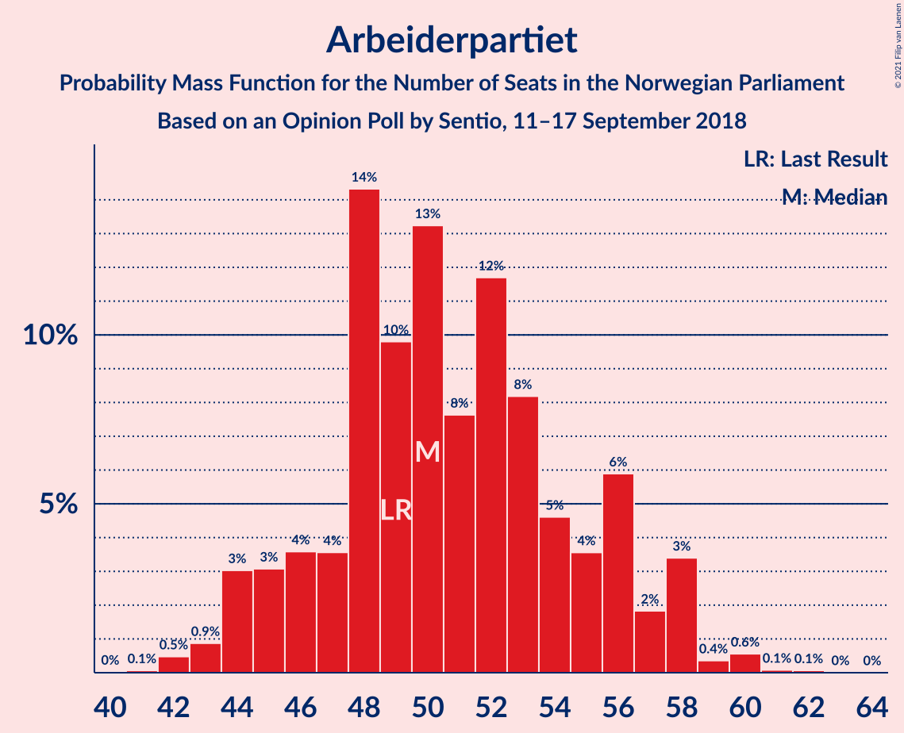
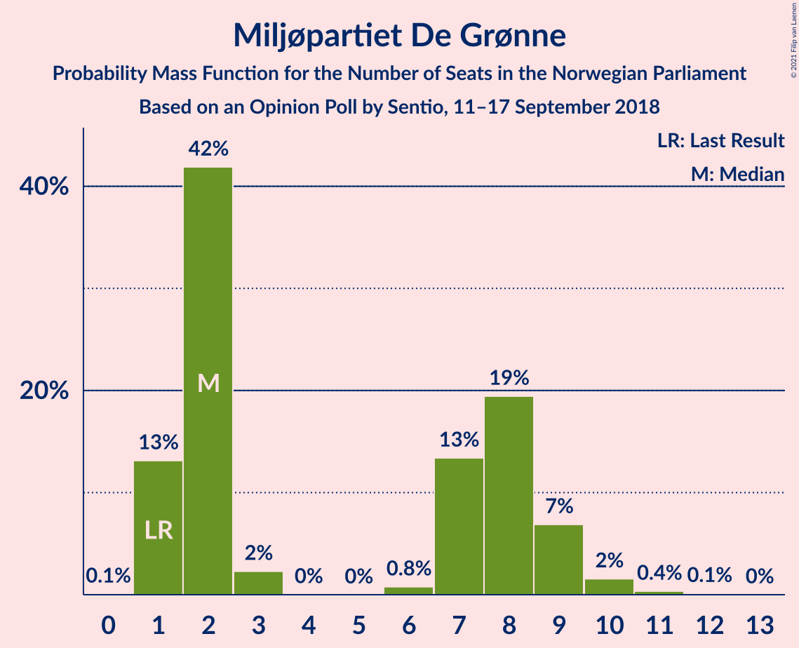
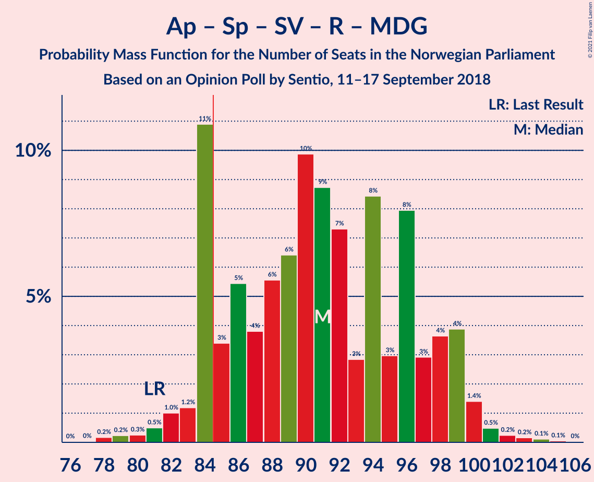
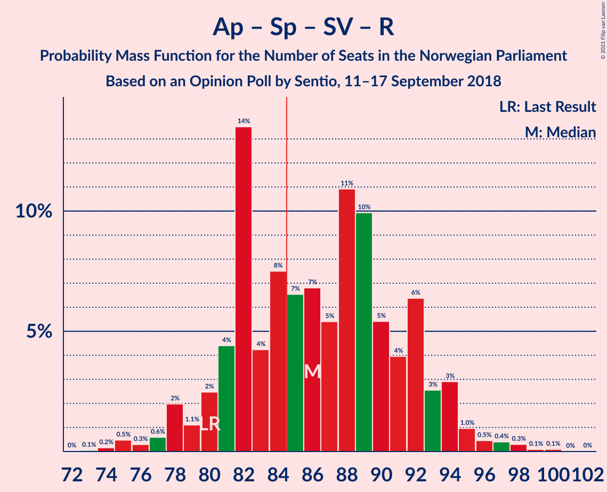
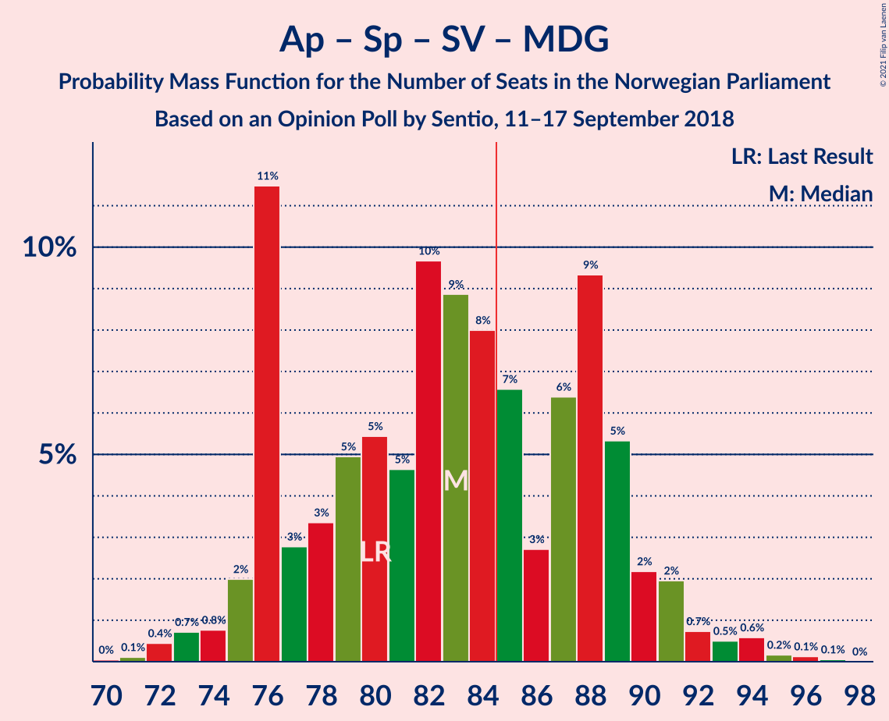
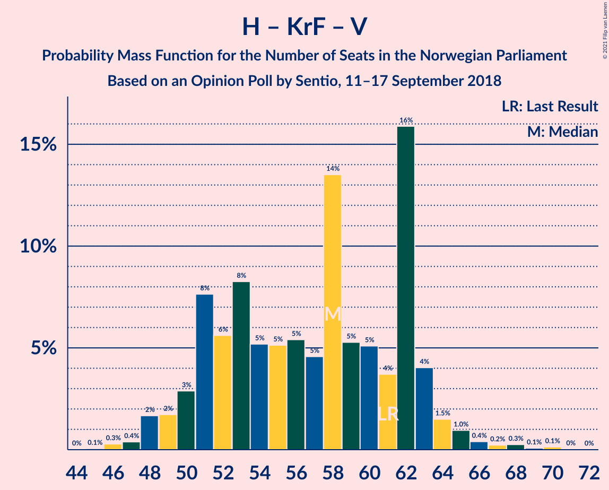
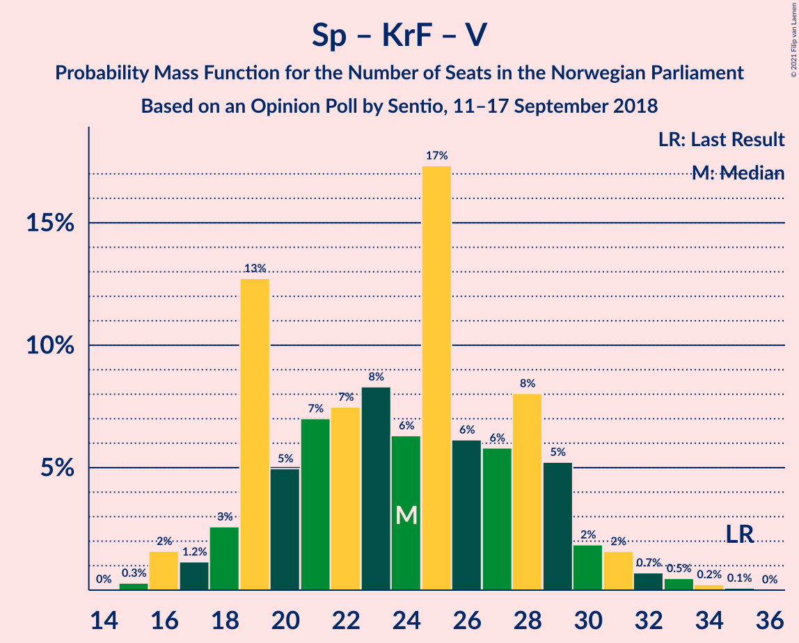

# Opinion Poll by Sentio, 11–17 September 2018

<a href="#voting-intentions">Voting Intentions</a> | <a href="#seats">Seats</a> | <a href="#coalitions">Coalitions</a> | <a href="#technical-information">Technical Information</a>

## Voting Intentions

### Confidence Intervals

| Party | Last Result | Poll Result | 80% Confidence Interval | 90% Confidence Interval | 95% Confidence Interval | 99% Confidence Interval |
|:-----:|:-----------:|:-----------:|:-----------------------:|:-----------------------:|:-----------------------:|:-----------------------:|
| Arbeiderpartiet | 27.4% | 28.0% | 25.9–30.3% |25.3–30.9% |24.8–31.4% |23.8–32.5% |
| Høyre | 25.0% | 27.4% | 25.4–29.7% |24.8–30.3% |24.3–30.8% |23.3–31.9% |
| Fremskrittspartiet | 15.2% | 11.9% | 10.4–13.6% |10.0–14.1% |9.7–14.5% |9.1–15.3% |
| Senterpartiet | 10.3% | 9.1% | 7.8–10.6% |7.5–11.0% |7.1–11.4% |6.6–12.2% |
| Sosialistisk Venstreparti | 6.0% | 6.4% | 5.3–7.7% |5.0–8.1% |4.8–8.4% |4.3–9.1% |
| Rødt | 2.4% | 4.8% | 3.9–6.0% |3.7–6.4% |3.5–6.7% |3.1–7.3% |
| Kristelig Folkeparti | 4.2% | 4.0% | 3.2–5.1% |2.9–5.4% |2.8–5.7% |2.4–6.2% |
| Miljøpartiet De Grønne | 3.2% | 3.8% | 3.0–4.9% |2.8–5.2% |2.6–5.5% |2.3–6.1% |
| Venstre | 4.4% | 3.0% | 2.3–4.0% |2.1–4.3% |2.0–4.5% |1.7–5.0% |

*Note:* The poll result column reflects the actual value used in the calculations. Published results may vary slightly, and in addition be rounded to fewer digits.

## Seats

### Confidence Intervals

| Party | Last Result | Median | 80% Confidence Interval | 90% Confidence Interval | 95% Confidence Interval | 99% Confidence Interval |
|:-----:|:-----------:|:------:|:-----------------------:|:-----------------------:|:-----------------------:|:-----------------------:|
| <a href="#arbeiderpartiet">Arbeiderpartiet</a> | 49 | 50 | 46–56 |45–57 |44–58 |42–60 |
| <a href="#høyre">Høyre</a> | 45 | 49 | 45–53 |44–55 |43–57 |41–58 |
| <a href="#fremskrittspartiet">Fremskrittspartiet</a> | 27 | 21 | 18–25 |17–25 |17–26 |15–28 |
| <a href="#senterpartiet">Senterpartiet</a> | 19 | 16 | 14–19 |13–20 |12–20 |11–22 |
| <a href="#sosialistisk-venstreparti">Sosialistisk Venstreparti</a> | 11 | 11 | 10–14 |9–14 |8–15 |8–17 |
| <a href="#rødt">Rødt</a> | 1 | 8 | 2–11 |2–11 |2–12 |1–13 |
| <a href="#kristelig-folkeparti">Kristelig Folkeparti</a> | 8 | 7 | 1–9 |1–10 |1–10 |1–11 |
| <a href="#miljøpartiet-de-grønne">Miljøpartiet De Grønne</a> | 1 | 2 | 1–8 |1–9 |1–9 |1–10 |
| <a href="#venstre">Venstre</a> | 8 | 2 | 1–2 |1–7 |1–8 |0–8 |

### Arbeiderpartiet

*For a full overview of the results for this party, see the [Arbeiderpartiet](party-arbeiderpartiet.html) page.*

| Number of Seats | Probability | Accumulated | Special Marks |
|:---------------:|:-----------:|:-----------:|:-------------:|
| 41 | 0.1% | 100% |  |
| 42 | 0.5% | 99.9% |  |
| 43 | 0.9% | 99.4% |  |
| 44 | 3% | 98.6% |  |
| 45 | 3% | 96% |  |
| 46 | 4% | 92% |  |
| 47 | 4% | 89% |  |
| 48 | 14% | 85% |  |
| 49 | 10% | 71% | Last Result |
| 50 | 13% | 61% | Median |
| 51 | 8% | 48% |  |
| 52 | 12% | 40% |  |
| 53 | 8% | 29% |  |
| 54 | 5% | 20% |  |
| 55 | 4% | 16% |  |
| 56 | 6% | 12% |  |
| 57 | 2% | 6% |  |
| 58 | 3% | 5% |  |
| 59 | 0.4% | 1.1% |  |
| 60 | 0.6% | 0.7% |  |
| 61 | 0.1% | 0.2% |  |
| 62 | 0.1% | 0.1% |  |
| 63 | 0% | 0% |  |

### Høyre

*For a full overview of the results for this party, see the [Høyre](party-høyre.html) page.*

| Number of Seats | Probability | Accumulated | Special Marks |
|:---------------:|:-----------:|:-----------:|:-------------:|
| 39 | 0.1% | 100% |  |
| 40 | 0.2% | 99.9% |  |
| 41 | 0.8% | 99.7% |  |
| 42 | 1.3% | 98.9% |  |
| 43 | 2% | 98% |  |
| 44 | 4% | 96% |  |
| 45 | 6% | 92% | Last Result |
| 46 | 8% | 86% |  |
| 47 | 7% | 78% |  |
| 48 | 12% | 71% |  |
| 49 | 12% | 60% | Median |
| 50 | 9% | 48% |  |
| 51 | 5% | 39% |  |
| 52 | 15% | 34% |  |
| 53 | 10% | 19% |  |
| 54 | 3% | 9% |  |
| 55 | 1.5% | 6% |  |
| 56 | 1.1% | 4% |  |
| 57 | 2% | 3% |  |
| 58 | 0.4% | 0.9% |  |
| 59 | 0.3% | 0.5% |  |
| 60 | 0.1% | 0.2% |  |
| 61 | 0% | 0.1% |  |
| 62 | 0% | 0% |  |

### Fremskrittspartiet

*For a full overview of the results for this party, see the [Fremskrittspartiet](party-fremskrittspartiet.html) page.*

| Number of Seats | Probability | Accumulated | Special Marks |
|:---------------:|:-----------:|:-----------:|:-------------:|
| 14 | 0.1% | 100% |  |
| 15 | 0.4% | 99.9% |  |
| 16 | 0.9% | 99.5% |  |
| 17 | 5% | 98.5% |  |
| 18 | 7% | 93% |  |
| 19 | 10% | 86% |  |
| 20 | 15% | 76% |  |
| 21 | 18% | 61% | Median |
| 22 | 9% | 43% |  |
| 23 | 16% | 34% |  |
| 24 | 7% | 19% |  |
| 25 | 7% | 11% |  |
| 26 | 3% | 4% |  |
| 27 | 0.7% | 1.5% | Last Result |
| 28 | 0.5% | 0.7% |  |
| 29 | 0.2% | 0.3% |  |
| 30 | 0% | 0% |  |

### Senterpartiet

*For a full overview of the results for this party, see the [Senterpartiet](party-senterpartiet.html) page.*

| Number of Seats | Probability | Accumulated | Special Marks |
|:---------------:|:-----------:|:-----------:|:-------------:|
| 10 | 0.1% | 100% |  |
| 11 | 0.6% | 99.9% |  |
| 12 | 2% | 99.3% |  |
| 13 | 6% | 97% |  |
| 14 | 10% | 92% |  |
| 15 | 24% | 82% |  |
| 16 | 11% | 58% | Median |
| 17 | 22% | 47% |  |
| 18 | 12% | 25% |  |
| 19 | 6% | 13% | Last Result |
| 20 | 5% | 7% |  |
| 21 | 1.2% | 2% |  |
| 22 | 0.4% | 0.6% |  |
| 23 | 0.1% | 0.2% |  |
| 24 | 0% | 0% |  |

### Sosialistisk Venstreparti

*For a full overview of the results for this party, see the [Sosialistisk Venstreparti](party-sosialistiskvenstreparti.html) page.*

| Number of Seats | Probability | Accumulated | Special Marks |
|:---------------:|:-----------:|:-----------:|:-------------:|
| 2 | 0.1% | 100% |  |
| 3 | 0% | 99.9% |  |
| 4 | 0% | 99.9% |  |
| 5 | 0% | 99.9% |  |
| 6 | 0% | 99.9% |  |
| 7 | 0.3% | 99.9% |  |
| 8 | 3% | 99.5% |  |
| 9 | 6% | 97% |  |
| 10 | 18% | 91% |  |
| 11 | 31% | 73% | Last Result, Median |
| 12 | 15% | 42% |  |
| 13 | 16% | 27% |  |
| 14 | 7% | 11% |  |
| 15 | 3% | 4% |  |
| 16 | 0.6% | 1.2% |  |
| 17 | 0.5% | 0.6% |  |
| 18 | 0.1% | 0.1% |  |
| 19 | 0% | 0% |  |

### Rødt

*For a full overview of the results for this party, see the [Rødt](party-rødt.html) page.*

| Number of Seats | Probability | Accumulated | Special Marks |
|:---------------:|:-----------:|:-----------:|:-------------:|
| 1 | 0.6% | 100% | Last Result |
| 2 | 13% | 99.4% |  |
| 3 | 0% | 87% |  |
| 4 | 0% | 87% |  |
| 5 | 0% | 87% |  |
| 6 | 0.1% | 87% |  |
| 7 | 12% | 87% |  |
| 8 | 27% | 75% | Median |
| 9 | 22% | 48% |  |
| 10 | 15% | 26% |  |
| 11 | 8% | 11% |  |
| 12 | 2% | 3% |  |
| 13 | 0.7% | 0.9% |  |
| 14 | 0.1% | 0.2% |  |
| 15 | 0% | 0% |  |

### Kristelig Folkeparti

*For a full overview of the results for this party, see the [Kristelig Folkeparti](party-kristeligfolkeparti.html) page.*

| Number of Seats | Probability | Accumulated | Special Marks |
|:---------------:|:-----------:|:-----------:|:-------------:|
| 0 | 0.2% | 100% |  |
| 1 | 15% | 99.8% |  |
| 2 | 6% | 85% |  |
| 3 | 26% | 79% |  |
| 4 | 0% | 53% |  |
| 5 | 0% | 53% |  |
| 6 | 0.1% | 53% |  |
| 7 | 14% | 53% | Median |
| 8 | 26% | 39% | Last Result |
| 9 | 8% | 13% |  |
| 10 | 4% | 5% |  |
| 11 | 0.6% | 0.8% |  |
| 12 | 0.1% | 0.2% |  |
| 13 | 0% | 0% |  |

### Miljøpartiet De Grønne

*For a full overview of the results for this party, see the [Miljøpartiet De Grønne](party-miljøpartietdegrønne.html) page.*

| Number of Seats | Probability | Accumulated | Special Marks |
|:---------------:|:-----------:|:-----------:|:-------------:|
| 0 | 0.1% | 100% |  |
| 1 | 13% | 99.9% | Last Result |
| 2 | 42% | 87% | Median |
| 3 | 2% | 45% |  |
| 4 | 0% | 43% |  |
| 5 | 0% | 43% |  |
| 6 | 0.8% | 43% |  |
| 7 | 13% | 42% |  |
| 8 | 19% | 28% |  |
| 9 | 7% | 9% |  |
| 10 | 2% | 2% |  |
| 11 | 0.4% | 0.5% |  |
| 12 | 0.1% | 0.1% |  |
| 13 | 0% | 0% |  |

### Venstre

*For a full overview of the results for this party, see the [Venstre](party-venstre.html) page.*

| Number of Seats | Probability | Accumulated | Special Marks |
|:---------------:|:-----------:|:-----------:|:-------------:|
| 0 | 1.3% | 100% |  |
| 1 | 18% | 98.7% |  |
| 2 | 73% | 80% | Median |
| 3 | 0.2% | 7% |  |
| 4 | 0% | 7% |  |
| 5 | 0% | 7% |  |
| 6 | 0.1% | 7% |  |
| 7 | 3% | 7% |  |
| 8 | 3% | 4% | Last Result |
| 9 | 0.4% | 0.5% |  |
| 10 | 0.1% | 0.1% |  |
| 11 | 0% | 0% |  |

## Coalitions

### Confidence Intervals

| Coalition | Last Result | Median | Majority? | 80% Confidence Interval | 90% Confidence Interval | 95% Confidence Interval | 99% Confidence Interval |
|:---------:|:-----------:|:------:|:---------:|:-----------------------:|:-----------------------:|:-----------------------:|:-----------------------:|
| Høyre – Fremskrittspartiet – Senterpartiet – Kristelig Folkeparti – Venstre | 107 | 95 | 98.7% | 88–100 | 87–101 | 86–102 | 83–105 |
| Arbeiderpartiet – Senterpartiet – Sosialistisk Venstreparti – Rødt – Miljøpartiet De Grønne | 81 | 91 | 86% | 84–98 | 84–99 | 83–99 | 80–102 |
| Arbeiderpartiet – Senterpartiet – Sosialistisk Venstreparti – Kristelig Folkeparti – Miljøpartiet De Grønne | 88 | 89 | 73% | 83–94 | 81–95 | 80–97 | 78–99 |
| Arbeiderpartiet – Senterpartiet – Sosialistisk Venstreparti – Rødt | 80 | 86 | 63% | 81–92 | 80–94 | 78–94 | 75–98 |
| Arbeiderpartiet – Senterpartiet – Sosialistisk Venstreparti – Miljøpartiet De Grønne | 80 | 83 | 37% | 76–89 | 76–90 | 75–91 | 72–94 |
| Høyre – Fremskrittspartiet – Kristelig Folkeparti – Miljøpartiet De Grønne – Venstre | 89 | 83 | 37% | 77–88 | 75–89 | 75–91 | 71–94 |
| Arbeiderpartiet – Senterpartiet – Sosialistisk Venstreparti | 79 | 79 | 7% | 73–83 | 72–85 | 71–87 | 69–90 |
| Høyre – Fremskrittspartiet – Kristelig Folkeparti – Venstre | 88 | 78 | 14% | 71–85 | 70–85 | 70–86 | 67–89 |
| Arbeiderpartiet – Senterpartiet – Kristelig Folkeparti – Miljøpartiet De Grønne | 77 | 77 | 4% | 71–82 | 70–84 | 68–86 | 66–89 |
| Arbeiderpartiet – Senterpartiet – Kristelig Folkeparti | 76 | 72 | 0.2% | 67–77 | 66–80 | 64–81 | 62–82 |
| Høyre – Fremskrittspartiet – Venstre | 80 | 73 | 0.2% | 68–78 | 66–79 | 64–81 | 62–83 |
| Høyre – Fremskrittspartiet | 72 | 70 | 0% | 66–75 | 64–77 | 62–79 | 60–81 |
| Arbeiderpartiet – Senterpartiet | 68 | 67 | 0% | 63–72 | 61–73 | 60–74 | 58–78 |
| Arbeiderpartiet – Sosialistisk Venstreparti | 60 | 62 | 0% | 58–67 | 56–69 | 55–70 | 53–73 |
| Høyre – Kristelig Folkeparti – Venstre | 61 | 58 | 0% | 51–62 | 50–63 | 49–64 | 47–68 |
| Senterpartiet – Kristelig Folkeparti – Venstre | 35 | 24 | 0% | 19–29 | 18–29 | 17–31 | 16–33 |

### Høyre – Fremskrittspartiet – Senterpartiet – Kristelig Folkeparti – Venstre

| Number of Seats | Probability | Accumulated | Special Marks |
|:---------------:|:-----------:|:-----------:|:-------------:|
| 80 | 0.1% | 100% |  |
| 81 | 0.1% | 99.9% |  |
| 82 | 0.1% | 99.8% |  |
| 83 | 0.2% | 99.7% |  |
| 84 | 0.7% | 99.4% |  |
| 85 | 1.1% | 98.7% | Majority |
| 86 | 1.5% | 98% |  |
| 87 | 4% | 96% |  |
| 88 | 8% | 93% |  |
| 89 | 5% | 84% |  |
| 90 | 5% | 80% |  |
| 91 | 5% | 74% |  |
| 92 | 7% | 70% |  |
| 93 | 5% | 63% |  |
| 94 | 6% | 58% |  |
| 95 | 6% | 52% | Median |
| 96 | 6% | 46% |  |
| 97 | 8% | 40% |  |
| 98 | 7% | 32% |  |
| 99 | 5% | 25% |  |
| 100 | 12% | 20% |  |
| 101 | 5% | 8% |  |
| 102 | 2% | 3% |  |
| 103 | 0.4% | 2% |  |
| 104 | 0.7% | 1.5% |  |
| 105 | 0.3% | 0.7% |  |
| 106 | 0.2% | 0.5% |  |
| 107 | 0.2% | 0.3% | Last Result |
| 108 | 0% | 0.1% |  |
| 109 | 0% | 0.1% |  |
| 110 | 0% | 0% |  |

### Arbeiderpartiet – Senterpartiet – Sosialistisk Venstreparti – Rødt – Miljøpartiet De Grønne

| Number of Seats | Probability | Accumulated | Special Marks |
|:---------------:|:-----------:|:-----------:|:-------------:|
| 77 | 0% | 100% |  |
| 78 | 0.2% | 99.9% |  |
| 79 | 0.2% | 99.8% |  |
| 80 | 0.3% | 99.5% |  |
| 81 | 0.5% | 99.3% | Last Result |
| 82 | 1.0% | 98.8% |  |
| 83 | 1.2% | 98% |  |
| 84 | 11% | 97% |  |
| 85 | 3% | 86% | Majority |
| 86 | 5% | 82% |  |
| 87 | 4% | 77% | Median |
| 88 | 6% | 73% |  |
| 89 | 6% | 67% |  |
| 90 | 10% | 61% |  |
| 91 | 9% | 51% |  |
| 92 | 7% | 42% |  |
| 93 | 3% | 35% |  |
| 94 | 8% | 32% |  |
| 95 | 3% | 24% |  |
| 96 | 8% | 21% |  |
| 97 | 3% | 13% |  |
| 98 | 4% | 10% |  |
| 99 | 4% | 6% |  |
| 100 | 1.4% | 2% |  |
| 101 | 0.5% | 1.1% |  |
| 102 | 0.2% | 0.6% |  |
| 103 | 0.2% | 0.4% |  |
| 104 | 0.1% | 0.2% |  |
| 105 | 0.1% | 0.1% |  |
| 106 | 0% | 0% |  |

### Arbeiderpartiet – Senterpartiet – Sosialistisk Venstreparti – Kristelig Folkeparti – Miljøpartiet De Grønne

| Number of Seats | Probability | Accumulated | Special Marks |
|:---------------:|:-----------:|:-----------:|:-------------:|
| 74 | 0% | 100% |  |
| 75 | 0% | 99.9% |  |
| 76 | 0.1% | 99.9% |  |
| 77 | 0.2% | 99.9% |  |
| 78 | 0.3% | 99.7% |  |
| 79 | 0.8% | 99.4% |  |
| 80 | 2% | 98.6% |  |
| 81 | 2% | 96% |  |
| 82 | 2% | 94% |  |
| 83 | 6% | 92% |  |
| 84 | 12% | 85% |  |
| 85 | 6% | 73% | Majority |
| 86 | 5% | 67% | Median |
| 87 | 5% | 63% |  |
| 88 | 6% | 57% | Last Result |
| 89 | 10% | 51% |  |
| 90 | 8% | 41% |  |
| 91 | 14% | 33% |  |
| 92 | 4% | 19% |  |
| 93 | 3% | 15% |  |
| 94 | 5% | 11% |  |
| 95 | 1.4% | 6% |  |
| 96 | 1.4% | 5% |  |
| 97 | 1.4% | 3% |  |
| 98 | 1.0% | 2% |  |
| 99 | 0.4% | 0.8% |  |
| 100 | 0.2% | 0.4% |  |
| 101 | 0.1% | 0.2% |  |
| 102 | 0% | 0.1% |  |
| 103 | 0% | 0% |  |

### Arbeiderpartiet – Senterpartiet – Sosialistisk Venstreparti – Rødt

| Number of Seats | Probability | Accumulated | Special Marks |
|:---------------:|:-----------:|:-----------:|:-------------:|
| 73 | 0.1% | 100% |  |
| 74 | 0.2% | 99.9% |  |
| 75 | 0.5% | 99.8% |  |
| 76 | 0.3% | 99.3% |  |
| 77 | 0.6% | 99.0% |  |
| 78 | 2% | 98% |  |
| 79 | 1.1% | 96% |  |
| 80 | 2% | 95% | Last Result |
| 81 | 4% | 93% |  |
| 82 | 14% | 88% |  |
| 83 | 4% | 75% |  |
| 84 | 8% | 71% |  |
| 85 | 7% | 63% | Median, Majority |
| 86 | 7% | 57% |  |
| 87 | 5% | 50% |  |
| 88 | 11% | 44% |  |
| 89 | 10% | 33% |  |
| 90 | 5% | 24% |  |
| 91 | 4% | 18% |  |
| 92 | 6% | 14% |  |
| 93 | 3% | 8% |  |
| 94 | 3% | 5% |  |
| 95 | 1.0% | 2% |  |
| 96 | 0.5% | 1.4% |  |
| 97 | 0.4% | 0.9% |  |
| 98 | 0.3% | 0.5% |  |
| 99 | 0.1% | 0.2% |  |
| 100 | 0.1% | 0.1% |  |
| 101 | 0% | 0% |  |

### Arbeiderpartiet – Senterpartiet – Sosialistisk Venstreparti – Miljøpartiet De Grønne

| Number of Seats | Probability | Accumulated | Special Marks |
|:---------------:|:-----------:|:-----------:|:-------------:|
| 70 | 0% | 100% |  |
| 71 | 0.1% | 99.9% |  |
| 72 | 0.4% | 99.8% |  |
| 73 | 0.7% | 99.4% |  |
| 74 | 0.8% | 98.6% |  |
| 75 | 2% | 98% |  |
| 76 | 11% | 96% |  |
| 77 | 3% | 84% |  |
| 78 | 3% | 82% |  |
| 79 | 5% | 78% | Median |
| 80 | 5% | 73% | Last Result |
| 81 | 5% | 68% |  |
| 82 | 10% | 63% |  |
| 83 | 9% | 54% |  |
| 84 | 8% | 45% |  |
| 85 | 7% | 37% | Majority |
| 86 | 3% | 30% |  |
| 87 | 6% | 27% |  |
| 88 | 9% | 21% |  |
| 89 | 5% | 12% |  |
| 90 | 2% | 6% |  |
| 91 | 2% | 4% |  |
| 92 | 0.7% | 2% |  |
| 93 | 0.5% | 1.5% |  |
| 94 | 0.6% | 1.0% |  |
| 95 | 0.2% | 0.4% |  |
| 96 | 0.1% | 0.2% |  |
| 97 | 0.1% | 0.1% |  |
| 98 | 0% | 0% |  |

### Høyre – Fremskrittspartiet – Kristelig Folkeparti – Miljøpartiet De Grønne – Venstre

| Number of Seats | Probability | Accumulated | Special Marks |
|:---------------:|:-----------:|:-----------:|:-------------:|
| 69 | 0.1% | 100% |  |
| 70 | 0.1% | 99.9% |  |
| 71 | 0.3% | 99.8% |  |
| 72 | 0.4% | 99.5% |  |
| 73 | 0.5% | 99.1% |  |
| 74 | 1.0% | 98.6% |  |
| 75 | 3% | 98% |  |
| 76 | 3% | 95% |  |
| 77 | 6% | 92% |  |
| 78 | 4% | 86% |  |
| 79 | 5% | 82% |  |
| 80 | 10% | 76% |  |
| 81 | 11% | 67% | Median |
| 82 | 5% | 56% |  |
| 83 | 7% | 50% |  |
| 84 | 7% | 43% |  |
| 85 | 8% | 37% | Majority |
| 86 | 4% | 29% |  |
| 87 | 14% | 25% |  |
| 88 | 4% | 12% |  |
| 89 | 2% | 7% | Last Result |
| 90 | 1.1% | 5% |  |
| 91 | 2% | 4% |  |
| 92 | 0.6% | 2% |  |
| 93 | 0.3% | 1.0% |  |
| 94 | 0.5% | 0.7% |  |
| 95 | 0.2% | 0.2% |  |
| 96 | 0.1% | 0.1% |  |
| 97 | 0% | 0% |  |

### Arbeiderpartiet – Senterpartiet – Sosialistisk Venstreparti

| Number of Seats | Probability | Accumulated | Special Marks |
|:---------------:|:-----------:|:-----------:|:-------------:|
| 66 | 0.1% | 100% |  |
| 67 | 0.1% | 99.9% |  |
| 68 | 0.2% | 99.8% |  |
| 69 | 0.5% | 99.5% |  |
| 70 | 1.3% | 99.1% |  |
| 71 | 1.2% | 98% |  |
| 72 | 3% | 97% |  |
| 73 | 4% | 94% |  |
| 74 | 16% | 90% |  |
| 75 | 3% | 74% |  |
| 76 | 5% | 71% |  |
| 77 | 8% | 66% | Median |
| 78 | 5% | 58% |  |
| 79 | 8% | 53% | Last Result |
| 80 | 11% | 45% |  |
| 81 | 10% | 33% |  |
| 82 | 9% | 23% |  |
| 83 | 5% | 14% |  |
| 84 | 2% | 9% |  |
| 85 | 3% | 7% | Majority |
| 86 | 1.2% | 4% |  |
| 87 | 0.7% | 3% |  |
| 88 | 1.1% | 2% |  |
| 89 | 0.3% | 0.9% |  |
| 90 | 0.1% | 0.6% |  |
| 91 | 0.1% | 0.5% |  |
| 92 | 0.4% | 0.4% |  |
| 93 | 0% | 0% |  |

### Høyre – Fremskrittspartiet – Kristelig Folkeparti – Venstre

| Number of Seats | Probability | Accumulated | Special Marks |
|:---------------:|:-----------:|:-----------:|:-------------:|
| 64 | 0.1% | 100% |  |
| 65 | 0.1% | 99.9% |  |
| 66 | 0.2% | 99.8% |  |
| 67 | 0.2% | 99.6% |  |
| 68 | 0.5% | 99.4% |  |
| 69 | 1.4% | 98.9% |  |
| 70 | 4% | 98% |  |
| 71 | 4% | 94% |  |
| 72 | 3% | 90% |  |
| 73 | 8% | 87% |  |
| 74 | 3% | 79% |  |
| 75 | 8% | 76% |  |
| 76 | 3% | 68% |  |
| 77 | 7% | 65% |  |
| 78 | 9% | 58% |  |
| 79 | 10% | 49% | Median |
| 80 | 6% | 39% |  |
| 81 | 6% | 33% |  |
| 82 | 4% | 27% |  |
| 83 | 5% | 23% |  |
| 84 | 3% | 18% |  |
| 85 | 11% | 14% | Majority |
| 86 | 1.2% | 3% |  |
| 87 | 1.0% | 2% |  |
| 88 | 0.5% | 1.2% | Last Result |
| 89 | 0.3% | 0.7% |  |
| 90 | 0.2% | 0.5% |  |
| 91 | 0.2% | 0.2% |  |
| 92 | 0% | 0.1% |  |
| 93 | 0% | 0% |  |

### Arbeiderpartiet – Senterpartiet – Kristelig Folkeparti – Miljøpartiet De Grønne

| Number of Seats | Probability | Accumulated | Special Marks |
|:---------------:|:-----------:|:-----------:|:-------------:|
| 63 | 0% | 100% |  |
| 64 | 0.1% | 99.9% |  |
| 65 | 0.2% | 99.9% |  |
| 66 | 0.3% | 99.7% |  |
| 67 | 0.3% | 99.4% |  |
| 68 | 2% | 99.2% |  |
| 69 | 1.4% | 97% |  |
| 70 | 2% | 96% |  |
| 71 | 4% | 94% |  |
| 72 | 5% | 90% |  |
| 73 | 15% | 84% |  |
| 74 | 6% | 70% |  |
| 75 | 5% | 64% | Median |
| 76 | 6% | 59% |  |
| 77 | 5% | 52% | Last Result |
| 78 | 13% | 48% |  |
| 79 | 9% | 34% |  |
| 80 | 7% | 26% |  |
| 81 | 7% | 19% |  |
| 82 | 3% | 12% |  |
| 83 | 2% | 9% |  |
| 84 | 3% | 7% |  |
| 85 | 1.3% | 4% | Majority |
| 86 | 0.6% | 3% |  |
| 87 | 0.9% | 2% |  |
| 88 | 0.6% | 1.2% |  |
| 89 | 0.4% | 0.6% |  |
| 90 | 0.1% | 0.2% |  |
| 91 | 0% | 0.1% |  |
| 92 | 0% | 0% |  |

### Arbeiderpartiet – Senterpartiet – Kristelig Folkeparti

| Number of Seats | Probability | Accumulated | Special Marks |
|:---------------:|:-----------:|:-----------:|:-------------:|
| 59 | 0% | 100% |  |
| 60 | 0.1% | 99.9% |  |
| 61 | 0.1% | 99.9% |  |
| 62 | 0.4% | 99.7% |  |
| 63 | 2% | 99.4% |  |
| 64 | 1.1% | 98% |  |
| 65 | 1.2% | 97% |  |
| 66 | 4% | 95% |  |
| 67 | 4% | 91% |  |
| 68 | 3% | 87% |  |
| 69 | 4% | 84% |  |
| 70 | 9% | 80% |  |
| 71 | 18% | 71% |  |
| 72 | 11% | 53% |  |
| 73 | 6% | 42% | Median |
| 74 | 7% | 36% |  |
| 75 | 5% | 29% |  |
| 76 | 9% | 24% | Last Result |
| 77 | 5% | 14% |  |
| 78 | 3% | 10% |  |
| 79 | 2% | 7% |  |
| 80 | 1.3% | 5% |  |
| 81 | 3% | 4% |  |
| 82 | 0.5% | 1.0% |  |
| 83 | 0.2% | 0.5% |  |
| 84 | 0.1% | 0.3% |  |
| 85 | 0.1% | 0.2% | Majority |
| 86 | 0% | 0.1% |  |
| 87 | 0% | 0% |  |

### Høyre – Fremskrittspartiet – Venstre

| Number of Seats | Probability | Accumulated | Special Marks |
|:---------------:|:-----------:|:-----------:|:-------------:|
| 60 | 0% | 100% |  |
| 61 | 0.2% | 99.9% |  |
| 62 | 0.3% | 99.7% |  |
| 63 | 1.1% | 99.4% |  |
| 64 | 1.4% | 98% |  |
| 65 | 0.6% | 97% |  |
| 66 | 2% | 96% |  |
| 67 | 3% | 95% |  |
| 68 | 6% | 92% |  |
| 69 | 6% | 85% |  |
| 70 | 8% | 79% |  |
| 71 | 12% | 71% |  |
| 72 | 7% | 59% | Median |
| 73 | 7% | 52% |  |
| 74 | 8% | 45% |  |
| 75 | 5% | 37% |  |
| 76 | 6% | 32% |  |
| 77 | 16% | 26% |  |
| 78 | 3% | 10% |  |
| 79 | 2% | 7% |  |
| 80 | 1.3% | 5% | Last Result |
| 81 | 2% | 3% |  |
| 82 | 0.7% | 1.4% |  |
| 83 | 0.3% | 0.7% |  |
| 84 | 0.3% | 0.4% |  |
| 85 | 0.1% | 0.2% | Majority |
| 86 | 0.1% | 0.1% |  |
| 87 | 0% | 0% |  |

### Høyre – Fremskrittspartiet

| Number of Seats | Probability | Accumulated | Special Marks |
|:---------------:|:-----------:|:-----------:|:-------------:|
| 58 | 0% | 100% |  |
| 59 | 0.1% | 99.9% |  |
| 60 | 0.4% | 99.8% |  |
| 61 | 1.2% | 99.4% |  |
| 62 | 2% | 98% |  |
| 63 | 0.8% | 97% |  |
| 64 | 2% | 96% |  |
| 65 | 4% | 94% |  |
| 66 | 7% | 90% |  |
| 67 | 4% | 83% |  |
| 68 | 8% | 80% |  |
| 69 | 15% | 72% |  |
| 70 | 7% | 57% | Median |
| 71 | 8% | 50% |  |
| 72 | 7% | 42% | Last Result |
| 73 | 6% | 35% |  |
| 74 | 6% | 30% |  |
| 75 | 14% | 24% |  |
| 76 | 5% | 10% |  |
| 77 | 1.3% | 5% |  |
| 78 | 0.7% | 4% |  |
| 79 | 2% | 3% |  |
| 80 | 0.6% | 1.1% |  |
| 81 | 0.3% | 0.6% |  |
| 82 | 0.2% | 0.3% |  |
| 83 | 0% | 0.1% |  |
| 84 | 0.1% | 0.1% |  |
| 85 | 0% | 0% | Majority |

### Arbeiderpartiet – Senterpartiet

| Number of Seats | Probability | Accumulated | Special Marks |
|:---------------:|:-----------:|:-----------:|:-------------:|
| 56 | 0.1% | 100% |  |
| 57 | 0.2% | 99.9% |  |
| 58 | 0.3% | 99.6% |  |
| 59 | 1.0% | 99.3% |  |
| 60 | 3% | 98% |  |
| 61 | 2% | 96% |  |
| 62 | 2% | 93% |  |
| 63 | 19% | 91% |  |
| 64 | 6% | 72% |  |
| 65 | 6% | 66% |  |
| 66 | 5% | 60% | Median |
| 67 | 5% | 55% |  |
| 68 | 10% | 50% | Last Result |
| 69 | 16% | 40% |  |
| 70 | 6% | 24% |  |
| 71 | 5% | 18% |  |
| 72 | 4% | 13% |  |
| 73 | 4% | 9% |  |
| 74 | 2% | 4% |  |
| 75 | 0.9% | 2% |  |
| 76 | 0.3% | 1.4% |  |
| 77 | 0.3% | 1.2% |  |
| 78 | 0.5% | 0.9% |  |
| 79 | 0.4% | 0.4% |  |
| 80 | 0% | 0% |  |

### Arbeiderpartiet – Sosialistisk Venstreparti

| Number of Seats | Probability | Accumulated | Special Marks |
|:---------------:|:-----------:|:-----------:|:-------------:|
| 51 | 0.1% | 100% |  |
| 52 | 0.2% | 99.9% |  |
| 53 | 0.6% | 99.6% |  |
| 54 | 0.6% | 99.1% |  |
| 55 | 1.4% | 98% |  |
| 56 | 4% | 97% |  |
| 57 | 3% | 93% |  |
| 58 | 5% | 91% |  |
| 59 | 14% | 86% |  |
| 60 | 9% | 72% | Last Result |
| 61 | 6% | 63% | Median |
| 62 | 9% | 57% |  |
| 63 | 15% | 48% |  |
| 64 | 5% | 33% |  |
| 65 | 7% | 28% |  |
| 66 | 9% | 21% |  |
| 67 | 3% | 12% |  |
| 68 | 3% | 8% |  |
| 69 | 2% | 5% |  |
| 70 | 2% | 4% |  |
| 71 | 0.5% | 2% |  |
| 72 | 0.4% | 1.0% |  |
| 73 | 0.4% | 0.6% |  |
| 74 | 0.1% | 0.2% |  |
| 75 | 0% | 0.1% |  |
| 76 | 0% | 0% |  |

### Høyre – Kristelig Folkeparti – Venstre

| Number of Seats | Probability | Accumulated | Special Marks |
|:---------------:|:-----------:|:-----------:|:-------------:|
| 45 | 0.1% | 100% |  |
| 46 | 0.3% | 99.9% |  |
| 47 | 0.4% | 99.6% |  |
| 48 | 2% | 99.2% |  |
| 49 | 2% | 98% |  |
| 50 | 3% | 96% |  |
| 51 | 8% | 93% |  |
| 52 | 6% | 85% |  |
| 53 | 8% | 80% |  |
| 54 | 5% | 71% |  |
| 55 | 5% | 66% |  |
| 56 | 5% | 61% |  |
| 57 | 5% | 56% |  |
| 58 | 14% | 51% | Median |
| 59 | 5% | 38% |  |
| 60 | 5% | 32% |  |
| 61 | 4% | 27% | Last Result |
| 62 | 16% | 24% |  |
| 63 | 4% | 8% |  |
| 64 | 1.5% | 4% |  |
| 65 | 1.0% | 2% |  |
| 66 | 0.4% | 1.2% |  |
| 67 | 0.2% | 0.8% |  |
| 68 | 0.3% | 0.5% |  |
| 69 | 0.1% | 0.3% |  |
| 70 | 0.1% | 0.2% |  |
| 71 | 0% | 0.1% |  |
| 72 | 0% | 0% |  |

### Senterpartiet – Kristelig Folkeparti – Venstre

| Number of Seats | Probability | Accumulated | Special Marks |
|:---------------:|:-----------:|:-----------:|:-------------:|
| 14 | 0% | 100% |  |
| 15 | 0.3% | 99.9% |  |
| 16 | 2% | 99.7% |  |
| 17 | 1.2% | 98% |  |
| 18 | 3% | 97% |  |
| 19 | 13% | 94% |  |
| 20 | 5% | 82% |  |
| 21 | 7% | 77% |  |
| 22 | 7% | 70% |  |
| 23 | 8% | 62% |  |
| 24 | 6% | 54% |  |
| 25 | 17% | 48% | Median |
| 26 | 6% | 30% |  |
| 27 | 6% | 24% |  |
| 28 | 8% | 18% |  |
| 29 | 5% | 10% |  |
| 30 | 2% | 5% |  |
| 31 | 2% | 3% |  |
| 32 | 0.7% | 2% |  |
| 33 | 0.5% | 0.8% |  |
| 34 | 0.2% | 0.4% |  |
| 35 | 0.1% | 0.1% | Last Result |
| 36 | 0% | 0% |  |

## Technical Information

### Opinion Poll

+ **Polling firm:** Sentio
+ **Commissioner(s):** —
+ **Fieldwork period:** 11–17 September 2018

### Calculations

+ **Sample size:** 707
+ **Simulations done:** 1,048,576
+ **Error estimate:** 1.94%

