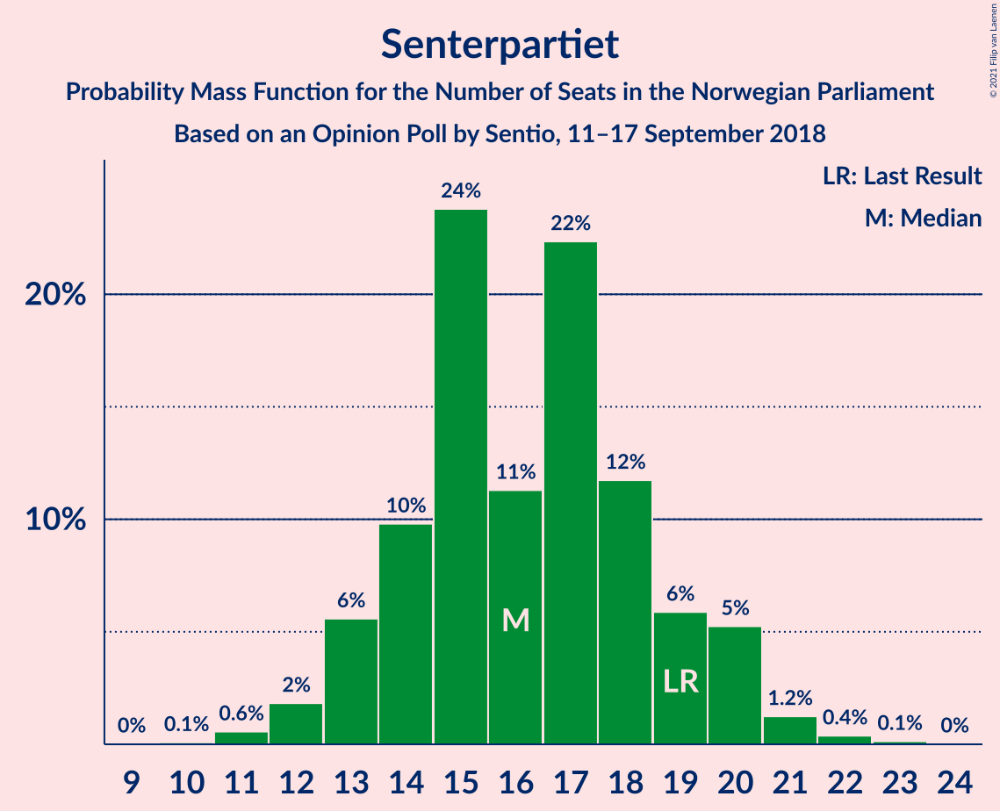
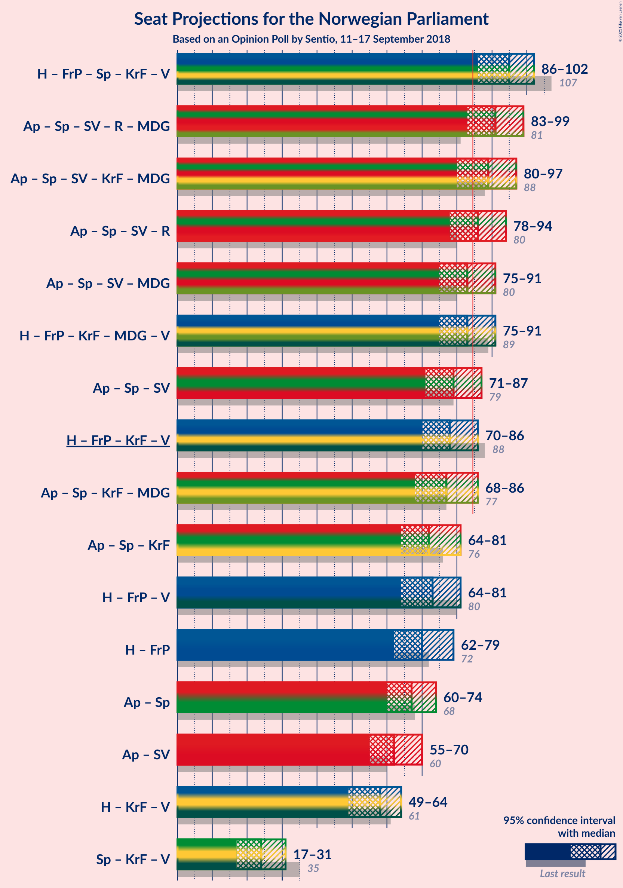
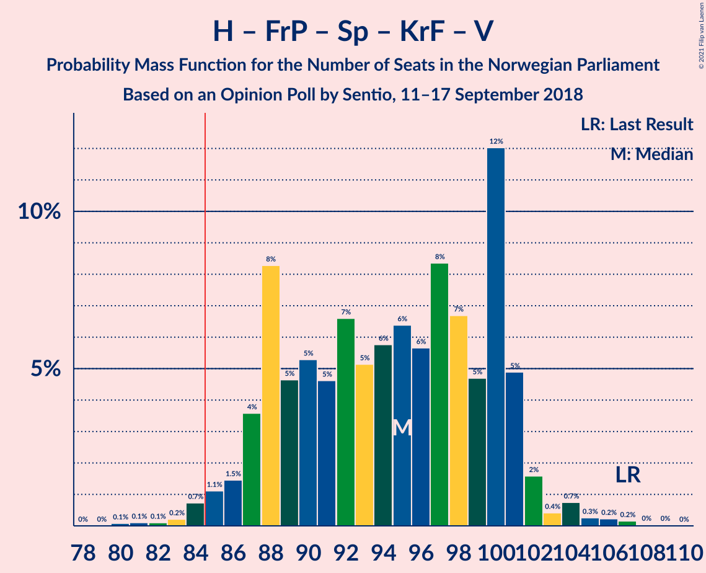
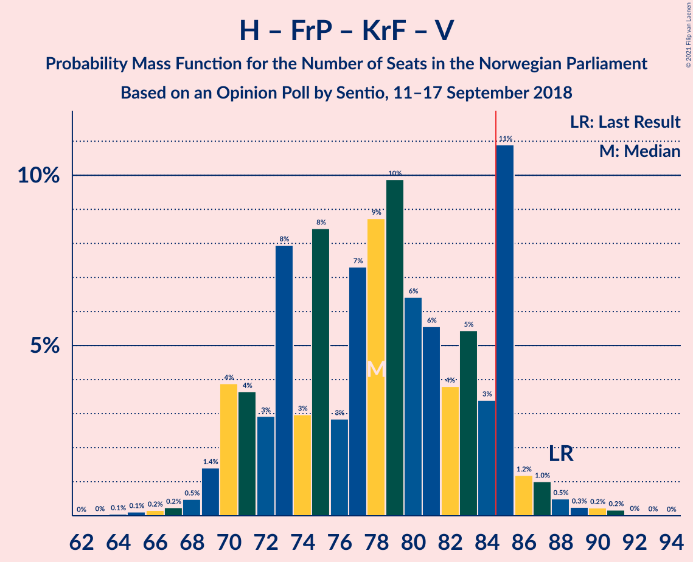
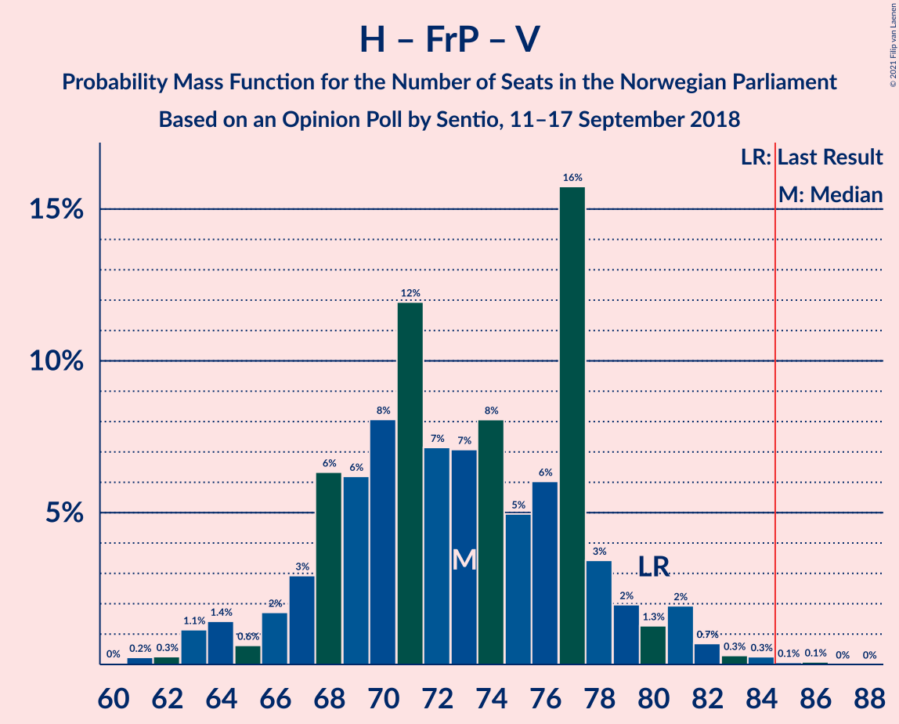

# Opinion Poll by Sentio, 11–17 September 2018

<a href="#voting-intentions">Voting Intentions</a> | <a href="#seats">Seats</a> | <a href="#coalitions">Coalitions</a> | <a href="#technical-information">Technical Information</a>

## Voting Intentions

### Confidence Intervals

| Party | Last Result | Poll Result | 80% Confidence Interval | 90% Confidence Interval | 95% Confidence Interval | 99% Confidence Interval |
|:-----:|:-----------:|:-----------:|:-----------------------:|:-----------------------:|:-----------------------:|:-----------------------:|
| Arbeiderpartiet | 27.4% | 28.0% | 25.9–30.3% |25.3–30.9% |24.8–31.4% |23.8–32.5% |
| Høyre | 25.0% | 27.4% | 25.4–29.7% |24.8–30.3% |24.3–30.8% |23.3–31.9% |
| Fremskrittspartiet | 15.2% | 11.9% | 10.4–13.6% |10.0–14.1% |9.7–14.5% |9.1–15.3% |
| Senterpartiet | 10.3% | 9.1% | 7.8–10.6% |7.5–11.0% |7.1–11.4% |6.6–12.2% |
| Sosialistisk Venstreparti | 6.0% | 6.4% | 5.3–7.7% |5.0–8.1% |4.8–8.4% |4.3–9.1% |
| Rødt | 2.4% | 4.8% | 3.9–6.0% |3.7–6.4% |3.5–6.7% |3.1–7.3% |
| Kristelig Folkeparti | 4.2% | 4.0% | 3.2–5.1% |2.9–5.4% |2.8–5.7% |2.4–6.2% |
| Miljøpartiet De Grønne | 3.2% | 3.8% | 3.0–4.9% |2.8–5.2% |2.6–5.5% |2.3–6.1% |
| Venstre | 4.4% | 3.0% | 2.3–4.0% |2.1–4.3% |2.0–4.5% |1.7–5.0% |

*Note:* The poll result column reflects the actual value used in the calculations. Published results may vary slightly, and in addition be rounded to fewer digits.

## Seats

### Confidence Intervals

| Party | Last Result | Median | 80% Confidence Interval | 90% Confidence Interval | 95% Confidence Interval | 99% Confidence Interval |
|:-----:|:-----------:|:------:|:-----------------------:|:-----------------------:|:-----------------------:|:-----------------------:|
| <a href="#arbeiderpartiet">Arbeiderpartiet</a> | 49 | 52 | 45–54 |44–58 |44–58 |42–59 |
| <a href="#høyre">Høyre</a> | 45 | 49 | 44–56 |44–57 |43–57 |41–58 |
| <a href="#fremskrittspartiet">Fremskrittspartiet</a> | 27 | 21 | 18–25 |17–26 |17–26 |15–28 |
| <a href="#senterpartiet">Senterpartiet</a> | 19 | 16 | 13–19 |13–20 |13–20 |11–21 |
| <a href="#sosialistisk-venstreparti">Sosialistisk Venstreparti</a> | 11 | 12 | 8–15 |8–15 |8–15 |8–16 |
| <a href="#rødt">Rødt</a> | 1 | 8 | 2–11 |2–12 |2–13 |2–13 |
| <a href="#kristelig-folkeparti">Kristelig Folkeparti</a> | 8 | 3 | 2–9 |1–9 |1–10 |0–11 |
| <a href="#miljøpartiet-de-grønne">Miljøpartiet De Grønne</a> | 1 | 3 | 1–9 |1–9 |1–9 |1–11 |
| <a href="#venstre">Venstre</a> | 8 | 2 | 1–2 |1–8 |0–8 |0–9 |

### Arbeiderpartiet

*For a full overview of the results for this party, see the [Arbeiderpartiet](party-arbeiderpartiet.html) page.*

| Number of Seats | Probability | Accumulated | Special Marks |
|:---------------:|:-----------:|:-----------:|:-------------:|
| 41 | 0.3% | 100% |  |
| 42 | 0.4% | 99.7% |  |
| 43 | 0.7% | 99.3% |  |
| 44 | 8% | 98.6% |  |
| 45 | 5% | 91% |  |
| 46 | 3% | 85% |  |
| 47 | 5% | 82% |  |
| 48 | 4% | 77% |  |
| 49 | 2% | 73% | Last Result |
| 50 | 10% | 71% |  |
| 51 | 10% | 61% |  |
| 52 | 17% | 51% | Median |
| 53 | 13% | 33% |  |
| 54 | 11% | 20% |  |
| 55 | 2% | 9% |  |
| 56 | 1.1% | 7% |  |
| 57 | 0.8% | 6% |  |
| 58 | 4% | 5% |  |
| 59 | 1.0% | 1.3% |  |
| 60 | 0.2% | 0.3% |  |
| 61 | 0.1% | 0.1% |  |
| 62 | 0% | 0.1% |  |
| 63 | 0% | 0.1% |  |
| 64 | 0% | 0% |  |

### Høyre

*For a full overview of the results for this party, see the [Høyre](party-høyre.html) page.*

| Number of Seats | Probability | Accumulated | Special Marks |
|:---------------:|:-----------:|:-----------:|:-------------:|
| 39 | 0% | 100% |  |
| 40 | 0.2% | 99.9% |  |
| 41 | 1.0% | 99.8% |  |
| 42 | 0.4% | 98.7% |  |
| 43 | 1.1% | 98% |  |
| 44 | 9% | 97% |  |
| 45 | 4% | 88% | Last Result |
| 46 | 10% | 85% |  |
| 47 | 19% | 75% |  |
| 48 | 2% | 56% |  |
| 49 | 4% | 54% | Median |
| 50 | 11% | 50% |  |
| 51 | 12% | 39% |  |
| 52 | 3% | 27% |  |
| 53 | 4% | 24% |  |
| 54 | 7% | 21% |  |
| 55 | 0.7% | 14% |  |
| 56 | 6% | 13% |  |
| 57 | 7% | 8% |  |
| 58 | 0.3% | 0.7% |  |
| 59 | 0.3% | 0.4% |  |
| 60 | 0% | 0.1% |  |
| 61 | 0% | 0% |  |

### Fremskrittspartiet

*For a full overview of the results for this party, see the [Fremskrittspartiet](party-fremskrittspartiet.html) page.*

| Number of Seats | Probability | Accumulated | Special Marks |
|:---------------:|:-----------:|:-----------:|:-------------:|
| 13 | 0.1% | 100% |  |
| 14 | 0.1% | 99.9% |  |
| 15 | 0.6% | 99.8% |  |
| 16 | 0.4% | 99.2% |  |
| 17 | 4% | 98.9% |  |
| 18 | 8% | 95% |  |
| 19 | 14% | 87% |  |
| 20 | 12% | 74% |  |
| 21 | 21% | 62% | Median |
| 22 | 17% | 41% |  |
| 23 | 5% | 24% |  |
| 24 | 8% | 19% |  |
| 25 | 3% | 11% |  |
| 26 | 6% | 8% |  |
| 27 | 0.5% | 2% | Last Result |
| 28 | 1.0% | 1.1% |  |
| 29 | 0% | 0.1% |  |
| 30 | 0% | 0% |  |

### Senterpartiet

*For a full overview of the results for this party, see the [Senterpartiet](party-senterpartiet.html) page.*

| Number of Seats | Probability | Accumulated | Special Marks |
|:---------------:|:-----------:|:-----------:|:-------------:|
| 10 | 0.1% | 100% |  |
| 11 | 1.1% | 99.9% |  |
| 12 | 0.5% | 98.8% |  |
| 13 | 16% | 98% |  |
| 14 | 5% | 82% |  |
| 15 | 27% | 77% |  |
| 16 | 10% | 51% | Median |
| 17 | 15% | 41% |  |
| 18 | 8% | 26% |  |
| 19 | 12% | 19% | Last Result |
| 20 | 4% | 7% |  |
| 21 | 2% | 2% |  |
| 22 | 0.2% | 0.4% |  |
| 23 | 0.1% | 0.2% |  |
| 24 | 0% | 0% |  |

### Sosialistisk Venstreparti

*For a full overview of the results for this party, see the [Sosialistisk Venstreparti](party-sosialistiskvenstreparti.html) page.*

| Number of Seats | Probability | Accumulated | Special Marks |
|:---------------:|:-----------:|:-----------:|:-------------:|
| 2 | 0.1% | 100% |  |
| 3 | 0% | 99.9% |  |
| 4 | 0% | 99.9% |  |
| 5 | 0% | 99.9% |  |
| 6 | 0% | 99.9% |  |
| 7 | 0.3% | 99.9% |  |
| 8 | 13% | 99.6% |  |
| 9 | 4% | 87% |  |
| 10 | 13% | 83% |  |
| 11 | 15% | 69% | Last Result |
| 12 | 12% | 54% | Median |
| 13 | 17% | 42% |  |
| 14 | 13% | 25% |  |
| 15 | 11% | 11% |  |
| 16 | 0.5% | 0.9% |  |
| 17 | 0.1% | 0.3% |  |
| 18 | 0.2% | 0.3% |  |
| 19 | 0% | 0% |  |

### Rødt

*For a full overview of the results for this party, see the [Rødt](party-rødt.html) page.*

| Number of Seats | Probability | Accumulated | Special Marks |
|:---------------:|:-----------:|:-----------:|:-------------:|
| 1 | 0.3% | 100% | Last Result |
| 2 | 15% | 99.7% |  |
| 3 | 0% | 84% |  |
| 4 | 0% | 84% |  |
| 5 | 0% | 84% |  |
| 6 | 0% | 84% |  |
| 7 | 8% | 84% |  |
| 8 | 36% | 76% | Median |
| 9 | 20% | 40% |  |
| 10 | 9% | 20% |  |
| 11 | 6% | 11% |  |
| 12 | 1.4% | 5% |  |
| 13 | 4% | 4% |  |
| 14 | 0.1% | 0.1% |  |
| 15 | 0% | 0% |  |

### Kristelig Folkeparti

*For a full overview of the results for this party, see the [Kristelig Folkeparti](party-kristeligfolkeparti.html) page.*

| Number of Seats | Probability | Accumulated | Special Marks |
|:---------------:|:-----------:|:-----------:|:-------------:|
| 0 | 0.5% | 100% |  |
| 1 | 7% | 99.5% |  |
| 2 | 9% | 93% |  |
| 3 | 37% | 83% | Median |
| 4 | 0% | 47% |  |
| 5 | 0% | 47% |  |
| 6 | 0% | 47% |  |
| 7 | 15% | 47% |  |
| 8 | 22% | 32% | Last Result |
| 9 | 6% | 10% |  |
| 10 | 2% | 4% |  |
| 11 | 2% | 2% |  |
| 12 | 0.2% | 0.2% |  |
| 13 | 0% | 0% |  |

### Miljøpartiet De Grønne

*For a full overview of the results for this party, see the [Miljøpartiet De Grønne](party-miljøpartietdegrønne.html) page.*

| Number of Seats | Probability | Accumulated | Special Marks |
|:---------------:|:-----------:|:-----------:|:-------------:|
| 1 | 17% | 100% | Last Result |
| 2 | 32% | 83% |  |
| 3 | 2% | 50% | Median |
| 4 | 0% | 49% |  |
| 5 | 0% | 49% |  |
| 6 | 0.2% | 49% |  |
| 7 | 18% | 48% |  |
| 8 | 19% | 30% |  |
| 9 | 10% | 12% |  |
| 10 | 1.4% | 2% |  |
| 11 | 0.4% | 0.7% |  |
| 12 | 0.2% | 0.3% |  |
| 13 | 0% | 0% |  |

### Venstre

*For a full overview of the results for this party, see the [Venstre](party-venstre.html) page.*

| Number of Seats | Probability | Accumulated | Special Marks |
|:---------------:|:-----------:|:-----------:|:-------------:|
| 0 | 3% | 100% |  |
| 1 | 15% | 97% |  |
| 2 | 74% | 82% | Median |
| 3 | 0.2% | 8% |  |
| 4 | 0% | 8% |  |
| 5 | 0% | 8% |  |
| 6 | 0% | 8% |  |
| 7 | 3% | 8% |  |
| 8 | 4% | 5% | Last Result |
| 9 | 0.8% | 1.0% |  |
| 10 | 0.1% | 0.1% |  |
| 11 | 0% | 0% |  |

## Coalitions

### Confidence Intervals

| Coalition | Last Result | Median | Majority? | 80% Confidence Interval | 90% Confidence Interval | 95% Confidence Interval | 99% Confidence Interval |
|:---------:|:-----------:|:------:|:---------:|:-----------------------:|:-----------------------:|:-----------------------:|:-----------------------:|
| Høyre – Fremskrittspartiet – Senterpartiet – Kristelig Folkeparti – Venstre | 107 | 94 | 99.1% | 87–99 | 86–101 | 86–103 | 82–104 |
| Arbeiderpartiet – Senterpartiet – Sosialistisk Venstreparti – Rødt – Miljøpartiet De Grønne | 81 | 91 | 93% | 85–98 | 84–99 | 83–99 | 81–103 |
| Arbeiderpartiet – Senterpartiet – Sosialistisk Venstreparti – Kristelig Folkeparti – Miljøpartiet De Grønne | 88 | 88 | 79% | 81–94 | 80–96 | 80–96 | 78–100 |
| Arbeiderpartiet – Senterpartiet – Sosialistisk Venstreparti – Rødt | 80 | 86 | 59% | 80–92 | 78–94 | 78–95 | 76–96 |
| Arbeiderpartiet – Senterpartiet – Sosialistisk Venstreparti – Miljøpartiet De Grønne | 80 | 84 | 36% | 77–90 | 77–91 | 74–91 | 72–94 |
| Høyre – Fremskrittspartiet – Kristelig Folkeparti – Miljøpartiet De Grønne – Venstre | 89 | 83 | 41% | 77–89 | 75–91 | 74–91 | 73–93 |
| Arbeiderpartiet – Senterpartiet – Sosialistisk Venstreparti | 79 | 78 | 9% | 73–84 | 70–86 | 70–87 | 68–88 |
| Høyre – Fremskrittspartiet – Kristelig Folkeparti – Venstre | 88 | 78 | 7% | 71–84 | 70–85 | 70–86 | 66–88 |
| Arbeiderpartiet – Senterpartiet – Kristelig Folkeparti – Miljøpartiet De Grønne | 77 | 76 | 3% | 70–84 | 69–84 | 69–85 | 67–89 |
| Høyre – Fremskrittspartiet – Venstre | 80 | 74 | 0.2% | 67–80 | 64–81 | 64–81 | 64–84 |
| Arbeiderpartiet – Senterpartiet – Kristelig Folkeparti | 76 | 72 | 0.2% | 66–77 | 64–78 | 63–80 | 61–83 |
| Høyre – Fremskrittspartiet | 72 | 72 | 0.1% | 65–77 | 62–79 | 62–79 | 61–80 |
| Arbeiderpartiet – Senterpartiet | 68 | 66 | 0% | 62–72 | 60–74 | 59–75 | 58–77 |
| Arbeiderpartiet – Sosialistisk Venstreparti | 60 | 62 | 0% | 57–67 | 55–68 | 55–69 | 53–71 |
| Høyre – Kristelig Folkeparti – Venstre | 61 | 57 | 0% | 51–62 | 49–62 | 49–64 | 47–68 |
| Senterpartiet – Kristelig Folkeparti – Venstre | 35 | 23 | 0% | 20–27 | 18–30 | 17–31 | 16–34 |

### Høyre – Fremskrittspartiet – Senterpartiet – Kristelig Folkeparti – Venstre

| Number of Seats | Probability | Accumulated | Special Marks |
|:---------------:|:-----------:|:-----------:|:-------------:|
| 80 | 0.3% | 100% |  |
| 81 | 0.1% | 99.7% |  |
| 82 | 0.2% | 99.6% |  |
| 83 | 0.2% | 99.5% |  |
| 84 | 0.1% | 99.3% |  |
| 85 | 0.8% | 99.1% | Majority |
| 86 | 3% | 98% |  |
| 87 | 5% | 95% |  |
| 88 | 4% | 90% |  |
| 89 | 2% | 86% |  |
| 90 | 9% | 83% |  |
| 91 | 2% | 74% | Median |
| 92 | 5% | 72% |  |
| 93 | 12% | 67% |  |
| 94 | 9% | 55% |  |
| 95 | 3% | 46% |  |
| 96 | 11% | 43% |  |
| 97 | 3% | 32% |  |
| 98 | 11% | 29% |  |
| 99 | 11% | 18% |  |
| 100 | 1.4% | 7% |  |
| 101 | 2% | 5% |  |
| 102 | 0.6% | 4% |  |
| 103 | 0.9% | 3% |  |
| 104 | 2% | 2% |  |
| 105 | 0.1% | 0.4% |  |
| 106 | 0.1% | 0.3% |  |
| 107 | 0.1% | 0.2% | Last Result |
| 108 | 0.1% | 0.1% |  |
| 109 | 0% | 0.1% |  |
| 110 | 0% | 0.1% |  |
| 111 | 0% | 0.1% |  |
| 112 | 0% | 0% |  |

### Arbeiderpartiet – Senterpartiet – Sosialistisk Venstreparti – Rødt – Miljøpartiet De Grønne

| Number of Seats | Probability | Accumulated | Special Marks |
|:---------------:|:-----------:|:-----------:|:-------------:|
| 76 | 0.1% | 100% |  |
| 77 | 0% | 99.9% |  |
| 78 | 0.1% | 99.9% |  |
| 79 | 0% | 99.8% |  |
| 80 | 0.2% | 99.8% |  |
| 81 | 0.3% | 99.5% | Last Result |
| 82 | 1.3% | 99.3% |  |
| 83 | 2% | 98% |  |
| 84 | 3% | 96% |  |
| 85 | 8% | 93% | Majority |
| 86 | 7% | 84% |  |
| 87 | 3% | 78% |  |
| 88 | 11% | 75% |  |
| 89 | 2% | 64% |  |
| 90 | 5% | 62% |  |
| 91 | 10% | 57% | Median |
| 92 | 18% | 47% |  |
| 93 | 3% | 29% |  |
| 94 | 4% | 26% |  |
| 95 | 1.2% | 22% |  |
| 96 | 3% | 21% |  |
| 97 | 5% | 18% |  |
| 98 | 4% | 13% |  |
| 99 | 8% | 9% |  |
| 100 | 0.1% | 1.2% |  |
| 101 | 0.2% | 1.1% |  |
| 102 | 0.2% | 0.8% |  |
| 103 | 0.4% | 0.6% |  |
| 104 | 0.1% | 0.1% |  |
| 105 | 0% | 0.1% |  |
| 106 | 0% | 0% |  |

### Arbeiderpartiet – Senterpartiet – Sosialistisk Venstreparti – Kristelig Folkeparti – Miljøpartiet De Grønne

| Number of Seats | Probability | Accumulated | Special Marks |
|:---------------:|:-----------:|:-----------:|:-------------:|
| 73 | 0.1% | 100% |  |
| 74 | 0% | 99.9% |  |
| 75 | 0% | 99.9% |  |
| 76 | 0.1% | 99.9% |  |
| 77 | 0.1% | 99.8% |  |
| 78 | 0.7% | 99.8% |  |
| 79 | 0.1% | 99.1% |  |
| 80 | 8% | 98.9% |  |
| 81 | 4% | 91% |  |
| 82 | 4% | 87% |  |
| 83 | 3% | 83% |  |
| 84 | 2% | 81% |  |
| 85 | 7% | 79% | Majority |
| 86 | 2% | 72% | Median |
| 87 | 17% | 69% |  |
| 88 | 4% | 53% | Last Result |
| 89 | 5% | 49% |  |
| 90 | 2% | 43% |  |
| 91 | 11% | 42% |  |
| 92 | 14% | 30% |  |
| 93 | 2% | 16% |  |
| 94 | 6% | 14% |  |
| 95 | 2% | 8% |  |
| 96 | 5% | 7% |  |
| 97 | 0.8% | 2% |  |
| 98 | 0.2% | 0.9% |  |
| 99 | 0.1% | 0.7% |  |
| 100 | 0.3% | 0.6% |  |
| 101 | 0.2% | 0.3% |  |
| 102 | 0.1% | 0.1% |  |
| 103 | 0% | 0% |  |

### Arbeiderpartiet – Senterpartiet – Sosialistisk Venstreparti – Rødt

| Number of Seats | Probability | Accumulated | Special Marks |
|:---------------:|:-----------:|:-----------:|:-------------:|
| 73 | 0.1% | 100% |  |
| 74 | 0.2% | 99.9% |  |
| 75 | 0.1% | 99.7% |  |
| 76 | 0.2% | 99.6% |  |
| 77 | 0.5% | 99.4% |  |
| 78 | 4% | 98.9% |  |
| 79 | 0.7% | 95% |  |
| 80 | 4% | 94% | Last Result |
| 81 | 1.5% | 90% |  |
| 82 | 6% | 88% |  |
| 83 | 7% | 83% |  |
| 84 | 17% | 76% |  |
| 85 | 9% | 59% | Majority |
| 86 | 11% | 50% |  |
| 87 | 1.1% | 39% |  |
| 88 | 6% | 38% | Median |
| 89 | 3% | 32% |  |
| 90 | 10% | 29% |  |
| 91 | 7% | 19% |  |
| 92 | 4% | 12% |  |
| 93 | 2% | 8% |  |
| 94 | 2% | 7% |  |
| 95 | 4% | 5% |  |
| 96 | 1.1% | 1.5% |  |
| 97 | 0.1% | 0.3% |  |
| 98 | 0.1% | 0.2% |  |
| 99 | 0.1% | 0.2% |  |
| 100 | 0.1% | 0.1% |  |
| 101 | 0% | 0.1% |  |
| 102 | 0% | 0% |  |

### Arbeiderpartiet – Senterpartiet – Sosialistisk Venstreparti – Miljøpartiet De Grønne

| Number of Seats | Probability | Accumulated | Special Marks |
|:---------------:|:-----------:|:-----------:|:-------------:|
| 69 | 0% | 100% |  |
| 70 | 0.1% | 99.9% |  |
| 71 | 0.1% | 99.8% |  |
| 72 | 0.7% | 99.7% |  |
| 73 | 0.3% | 98.9% |  |
| 74 | 2% | 98.7% |  |
| 75 | 0.7% | 97% |  |
| 76 | 1.2% | 96% |  |
| 77 | 11% | 95% |  |
| 78 | 6% | 84% |  |
| 79 | 4% | 78% |  |
| 80 | 8% | 74% | Last Result |
| 81 | 4% | 65% |  |
| 82 | 3% | 61% |  |
| 83 | 7% | 58% | Median |
| 84 | 15% | 51% |  |
| 85 | 5% | 36% | Majority |
| 86 | 5% | 31% |  |
| 87 | 2% | 26% |  |
| 88 | 4% | 24% |  |
| 89 | 8% | 20% |  |
| 90 | 6% | 13% |  |
| 91 | 5% | 7% |  |
| 92 | 0.8% | 2% |  |
| 93 | 0.3% | 1.1% |  |
| 94 | 0.6% | 0.8% |  |
| 95 | 0.1% | 0.3% |  |
| 96 | 0.1% | 0.2% |  |
| 97 | 0% | 0.1% |  |
| 98 | 0% | 0% |  |

### Høyre – Fremskrittspartiet – Kristelig Folkeparti – Miljøpartiet De Grønne – Venstre

| Number of Seats | Probability | Accumulated | Special Marks |
|:---------------:|:-----------:|:-----------:|:-------------:|
| 68 | 0% | 100% |  |
| 69 | 0.1% | 99.9% |  |
| 70 | 0.1% | 99.9% |  |
| 71 | 0.1% | 99.8% |  |
| 72 | 0.1% | 99.8% |  |
| 73 | 1.1% | 99.7% |  |
| 74 | 4% | 98.5% |  |
| 75 | 2% | 95% |  |
| 76 | 2% | 93% |  |
| 77 | 4% | 92% |  |
| 78 | 7% | 88% | Median |
| 79 | 10% | 81% |  |
| 80 | 3% | 71% |  |
| 81 | 6% | 68% |  |
| 82 | 1.1% | 62% |  |
| 83 | 11% | 61% |  |
| 84 | 9% | 50% |  |
| 85 | 17% | 41% | Majority |
| 86 | 7% | 24% |  |
| 87 | 6% | 17% |  |
| 88 | 1.5% | 12% |  |
| 89 | 4% | 10% | Last Result |
| 90 | 0.7% | 6% |  |
| 91 | 4% | 5% |  |
| 92 | 0.5% | 1.1% |  |
| 93 | 0.2% | 0.6% |  |
| 94 | 0.1% | 0.4% |  |
| 95 | 0.2% | 0.3% |  |
| 96 | 0.1% | 0.1% |  |
| 97 | 0% | 0% |  |

### Arbeiderpartiet – Senterpartiet – Sosialistisk Venstreparti

| Number of Seats | Probability | Accumulated | Special Marks |
|:---------------:|:-----------:|:-----------:|:-------------:|
| 67 | 0.1% | 100% |  |
| 68 | 0.8% | 99.8% |  |
| 69 | 0.5% | 99.1% |  |
| 70 | 6% | 98.5% |  |
| 71 | 0.5% | 92% |  |
| 72 | 1.5% | 92% |  |
| 73 | 3% | 90% |  |
| 74 | 2% | 87% |  |
| 75 | 4% | 84% |  |
| 76 | 8% | 81% |  |
| 77 | 18% | 72% |  |
| 78 | 9% | 54% |  |
| 79 | 5% | 45% | Last Result |
| 80 | 5% | 40% | Median |
| 81 | 14% | 35% |  |
| 82 | 2% | 21% |  |
| 83 | 7% | 19% |  |
| 84 | 2% | 12% |  |
| 85 | 2% | 9% | Majority |
| 86 | 4% | 8% |  |
| 87 | 2% | 4% |  |
| 88 | 1.2% | 2% |  |
| 89 | 0% | 0.3% |  |
| 90 | 0.2% | 0.3% |  |
| 91 | 0.1% | 0.1% |  |
| 92 | 0% | 0.1% |  |
| 93 | 0% | 0% |  |

### Høyre – Fremskrittspartiet – Kristelig Folkeparti – Venstre

| Number of Seats | Probability | Accumulated | Special Marks |
|:---------------:|:-----------:|:-----------:|:-------------:|
| 64 | 0% | 100% |  |
| 65 | 0.1% | 99.9% |  |
| 66 | 0.4% | 99.9% |  |
| 67 | 0.2% | 99.4% |  |
| 68 | 0.2% | 99.2% |  |
| 69 | 0.1% | 98.9% |  |
| 70 | 8% | 98.8% |  |
| 71 | 4% | 91% |  |
| 72 | 5% | 87% |  |
| 73 | 3% | 82% |  |
| 74 | 1.2% | 79% |  |
| 75 | 4% | 78% | Median |
| 76 | 3% | 74% |  |
| 77 | 18% | 71% |  |
| 78 | 10% | 53% |  |
| 79 | 5% | 43% |  |
| 80 | 2% | 38% |  |
| 81 | 11% | 36% |  |
| 82 | 3% | 25% |  |
| 83 | 7% | 22% |  |
| 84 | 8% | 16% |  |
| 85 | 3% | 7% | Majority |
| 86 | 2% | 4% |  |
| 87 | 1.3% | 2% |  |
| 88 | 0.3% | 0.7% | Last Result |
| 89 | 0.2% | 0.5% |  |
| 90 | 0% | 0.2% |  |
| 91 | 0.1% | 0.2% |  |
| 92 | 0% | 0.1% |  |
| 93 | 0.1% | 0.1% |  |
| 94 | 0% | 0% |  |

### Arbeiderpartiet – Senterpartiet – Kristelig Folkeparti – Miljøpartiet De Grønne

| Number of Seats | Probability | Accumulated | Special Marks |
|:---------------:|:-----------:|:-----------:|:-------------:|
| 63 | 0.1% | 100% |  |
| 64 | 0.1% | 99.9% |  |
| 65 | 0.1% | 99.8% |  |
| 66 | 0.1% | 99.8% |  |
| 67 | 0.9% | 99.6% |  |
| 68 | 0.4% | 98.7% |  |
| 69 | 8% | 98% |  |
| 70 | 0.6% | 91% |  |
| 71 | 8% | 90% |  |
| 72 | 2% | 82% |  |
| 73 | 10% | 80% |  |
| 74 | 9% | 70% | Median |
| 75 | 3% | 61% |  |
| 76 | 8% | 58% |  |
| 77 | 8% | 50% | Last Result |
| 78 | 2% | 42% |  |
| 79 | 17% | 40% |  |
| 80 | 2% | 22% |  |
| 81 | 3% | 20% |  |
| 82 | 2% | 18% |  |
| 83 | 2% | 16% |  |
| 84 | 11% | 13% |  |
| 85 | 1.1% | 3% | Majority |
| 86 | 0.5% | 2% |  |
| 87 | 0.3% | 1.0% |  |
| 88 | 0.1% | 0.7% |  |
| 89 | 0.4% | 0.6% |  |
| 90 | 0.1% | 0.2% |  |
| 91 | 0% | 0% |  |

### Høyre – Fremskrittspartiet – Venstre

| Number of Seats | Probability | Accumulated | Special Marks |
|:---------------:|:-----------:|:-----------:|:-------------:|
| 59 | 0% | 100% |  |
| 60 | 0% | 99.9% |  |
| 61 | 0% | 99.9% |  |
| 62 | 0.1% | 99.9% |  |
| 63 | 0.2% | 99.8% |  |
| 64 | 5% | 99.6% |  |
| 65 | 0.8% | 94% |  |
| 66 | 1.4% | 93% |  |
| 67 | 8% | 92% |  |
| 68 | 2% | 84% |  |
| 69 | 7% | 81% |  |
| 70 | 10% | 74% |  |
| 71 | 5% | 64% |  |
| 72 | 2% | 59% | Median |
| 73 | 2% | 58% |  |
| 74 | 17% | 55% |  |
| 75 | 11% | 38% |  |
| 76 | 7% | 28% |  |
| 77 | 2% | 21% |  |
| 78 | 5% | 18% |  |
| 79 | 2% | 14% |  |
| 80 | 4% | 12% | Last Result |
| 81 | 7% | 8% |  |
| 82 | 0.3% | 1.0% |  |
| 83 | 0.1% | 0.7% |  |
| 84 | 0.3% | 0.6% |  |
| 85 | 0.1% | 0.2% | Majority |
| 86 | 0.1% | 0.1% |  |
| 87 | 0% | 0% |  |

### Arbeiderpartiet – Senterpartiet – Kristelig Folkeparti

| Number of Seats | Probability | Accumulated | Special Marks |
|:---------------:|:-----------:|:-----------:|:-------------:|
| 60 | 0.1% | 100% |  |
| 61 | 0.7% | 99.9% |  |
| 62 | 0.3% | 99.2% |  |
| 63 | 4% | 99.0% |  |
| 64 | 0.6% | 95% |  |
| 65 | 0.3% | 94% |  |
| 66 | 8% | 94% |  |
| 67 | 3% | 86% |  |
| 68 | 8% | 83% |  |
| 69 | 5% | 75% |  |
| 70 | 6% | 69% |  |
| 71 | 8% | 63% | Median |
| 72 | 14% | 55% |  |
| 73 | 4% | 41% |  |
| 74 | 7% | 37% |  |
| 75 | 6% | 30% |  |
| 76 | 6% | 24% | Last Result |
| 77 | 11% | 18% |  |
| 78 | 3% | 7% |  |
| 79 | 0.6% | 4% |  |
| 80 | 2% | 4% |  |
| 81 | 0.2% | 2% |  |
| 82 | 1.1% | 2% |  |
| 83 | 0.7% | 0.9% |  |
| 84 | 0.1% | 0.2% |  |
| 85 | 0% | 0.2% | Majority |
| 86 | 0.1% | 0.1% |  |
| 87 | 0% | 0% |  |

### Høyre – Fremskrittspartiet

| Number of Seats | Probability | Accumulated | Special Marks |
|:---------------:|:-----------:|:-----------:|:-------------:|
| 57 | 0.1% | 100% |  |
| 58 | 0% | 99.9% |  |
| 59 | 0% | 99.9% |  |
| 60 | 0.1% | 99.9% |  |
| 61 | 0.4% | 99.8% |  |
| 62 | 5% | 99.4% |  |
| 63 | 1.2% | 94% |  |
| 64 | 1.5% | 93% |  |
| 65 | 9% | 91% |  |
| 66 | 3% | 82% |  |
| 67 | 6% | 80% |  |
| 68 | 11% | 74% |  |
| 69 | 4% | 63% |  |
| 70 | 2% | 58% | Median |
| 71 | 3% | 57% |  |
| 72 | 15% | 54% | Last Result |
| 73 | 15% | 39% |  |
| 74 | 6% | 24% |  |
| 75 | 5% | 19% |  |
| 76 | 4% | 14% |  |
| 77 | 2% | 10% |  |
| 78 | 0.7% | 8% |  |
| 79 | 7% | 8% |  |
| 80 | 0.1% | 0.5% |  |
| 81 | 0% | 0.5% |  |
| 82 | 0.3% | 0.4% |  |
| 83 | 0% | 0.1% |  |
| 84 | 0% | 0.1% |  |
| 85 | 0% | 0.1% | Majority |
| 86 | 0% | 0% |  |

### Arbeiderpartiet – Senterpartiet

| Number of Seats | Probability | Accumulated | Special Marks |
|:---------------:|:-----------:|:-----------:|:-------------:|
| 56 | 0.1% | 100% |  |
| 57 | 0.3% | 99.9% |  |
| 58 | 0.4% | 99.6% |  |
| 59 | 2% | 99.2% |  |
| 60 | 5% | 97% |  |
| 61 | 3% | 93% |  |
| 62 | 4% | 90% |  |
| 63 | 10% | 86% |  |
| 64 | 3% | 76% |  |
| 65 | 16% | 73% |  |
| 66 | 8% | 58% |  |
| 67 | 2% | 50% |  |
| 68 | 12% | 48% | Last Result, Median |
| 69 | 19% | 36% |  |
| 70 | 3% | 18% |  |
| 71 | 1.5% | 15% |  |
| 72 | 5% | 14% |  |
| 73 | 2% | 8% |  |
| 74 | 3% | 6% |  |
| 75 | 1.3% | 3% |  |
| 76 | 0.9% | 2% |  |
| 77 | 0.7% | 0.9% |  |
| 78 | 0% | 0.1% |  |
| 79 | 0.1% | 0.1% |  |
| 80 | 0% | 0.1% |  |
| 81 | 0% | 0% |  |

### Arbeiderpartiet – Sosialistisk Venstreparti

| Number of Seats | Probability | Accumulated | Special Marks |
|:---------------:|:-----------:|:-----------:|:-------------:|
| 51 | 0.3% | 100% |  |
| 52 | 0.1% | 99.7% |  |
| 53 | 2% | 99.5% |  |
| 54 | 0.5% | 98% |  |
| 55 | 6% | 98% |  |
| 56 | 1.0% | 92% |  |
| 57 | 1.2% | 91% |  |
| 58 | 9% | 90% |  |
| 59 | 6% | 81% |  |
| 60 | 6% | 75% | Last Result |
| 61 | 9% | 69% |  |
| 62 | 10% | 59% |  |
| 63 | 4% | 49% |  |
| 64 | 6% | 45% | Median |
| 65 | 13% | 38% |  |
| 66 | 7% | 25% |  |
| 67 | 8% | 18% |  |
| 68 | 5% | 10% |  |
| 69 | 3% | 4% |  |
| 70 | 0.2% | 1.2% |  |
| 71 | 0.6% | 1.0% |  |
| 72 | 0.2% | 0.4% |  |
| 73 | 0.1% | 0.2% |  |
| 74 | 0.1% | 0.1% |  |
| 75 | 0% | 0% |  |

### Høyre – Kristelig Folkeparti – Venstre

| Number of Seats | Probability | Accumulated | Special Marks |
|:---------------:|:-----------:|:-----------:|:-------------:|
| 45 | 0.1% | 100% |  |
| 46 | 0.3% | 99.9% |  |
| 47 | 0.6% | 99.6% |  |
| 48 | 0.4% | 99.0% |  |
| 49 | 4% | 98.6% |  |
| 50 | 1.2% | 94% |  |
| 51 | 13% | 93% |  |
| 52 | 1.4% | 80% |  |
| 53 | 6% | 79% |  |
| 54 | 2% | 73% | Median |
| 55 | 12% | 70% |  |
| 56 | 2% | 58% |  |
| 57 | 15% | 56% |  |
| 58 | 2% | 41% |  |
| 59 | 5% | 39% |  |
| 60 | 4% | 35% |  |
| 61 | 8% | 31% | Last Result |
| 62 | 18% | 23% |  |
| 63 | 2% | 5% |  |
| 64 | 1.0% | 3% |  |
| 65 | 1.1% | 2% |  |
| 66 | 0.1% | 1.1% |  |
| 67 | 0.3% | 1.0% |  |
| 68 | 0.5% | 0.7% |  |
| 69 | 0.1% | 0.2% |  |
| 70 | 0.1% | 0.1% |  |
| 71 | 0% | 0.1% |  |
| 72 | 0% | 0% |  |

### Senterpartiet – Kristelig Folkeparti – Venstre

| Number of Seats | Probability | Accumulated | Special Marks |
|:---------------:|:-----------:|:-----------:|:-------------:|
| 14 | 0.1% | 100% |  |
| 15 | 0.1% | 99.9% |  |
| 16 | 1.2% | 99.8% |  |
| 17 | 2% | 98.6% |  |
| 18 | 1.4% | 96% |  |
| 19 | 2% | 95% |  |
| 20 | 12% | 93% |  |
| 21 | 11% | 81% | Median |
| 22 | 10% | 69% |  |
| 23 | 11% | 59% |  |
| 24 | 17% | 49% |  |
| 25 | 9% | 32% |  |
| 26 | 9% | 22% |  |
| 27 | 4% | 13% |  |
| 28 | 3% | 9% |  |
| 29 | 0.9% | 7% |  |
| 30 | 2% | 6% |  |
| 31 | 2% | 4% |  |
| 32 | 0.2% | 2% |  |
| 33 | 1.2% | 2% |  |
| 34 | 0.3% | 0.5% |  |
| 35 | 0.2% | 0.2% | Last Result |
| 36 | 0% | 0% |  |

## Technical Information

### Opinion Poll

+ **Polling firm:** Sentio
+ **Commissioner(s):** —
+ **Fieldwork period:** 11–17 September 2018

### Calculations

+ **Sample size:** 707
+ **Simulations done:** 131,072
+ **Error estimate:** 4.08%

