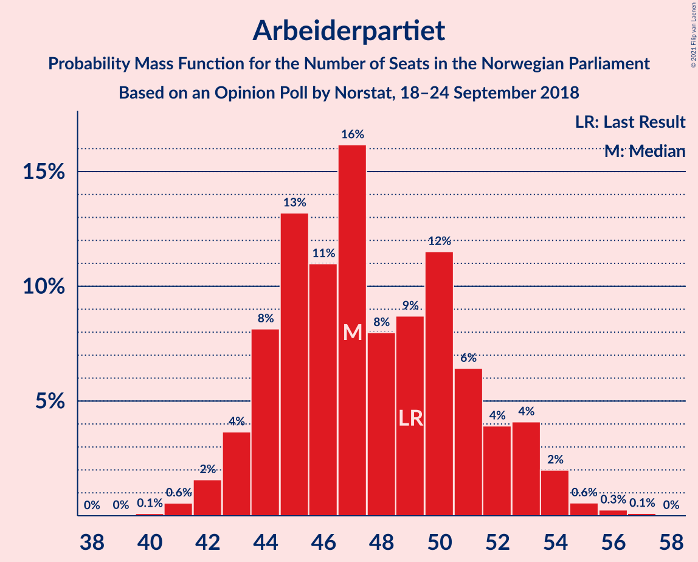
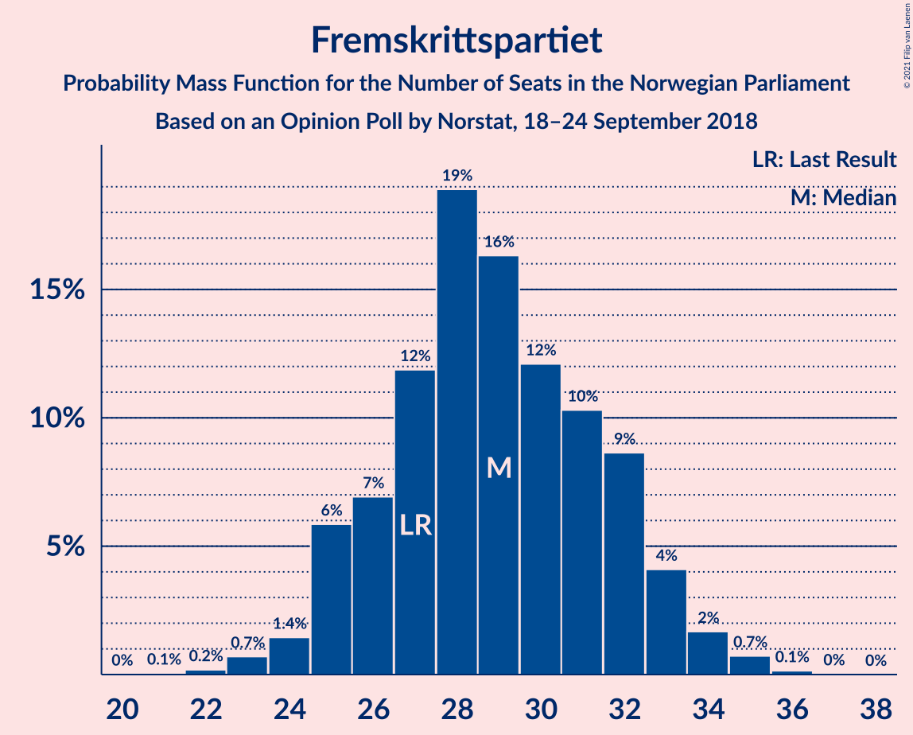
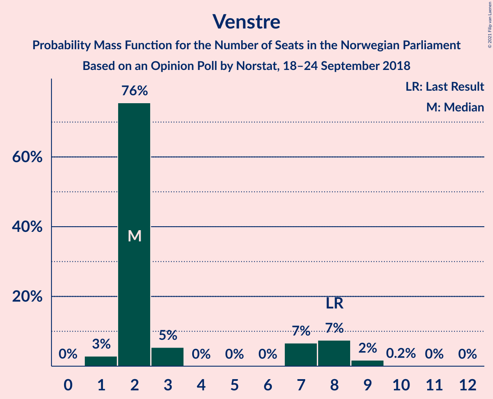
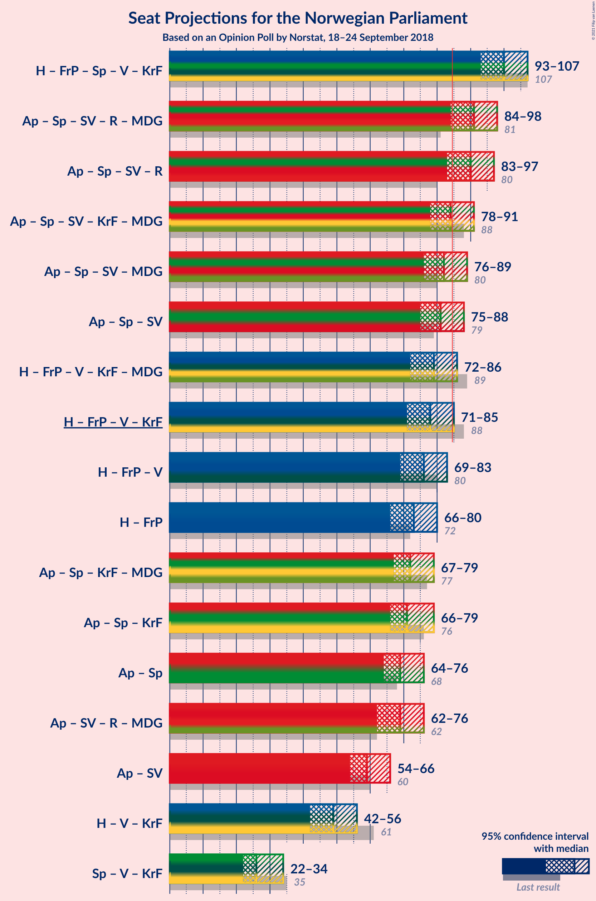
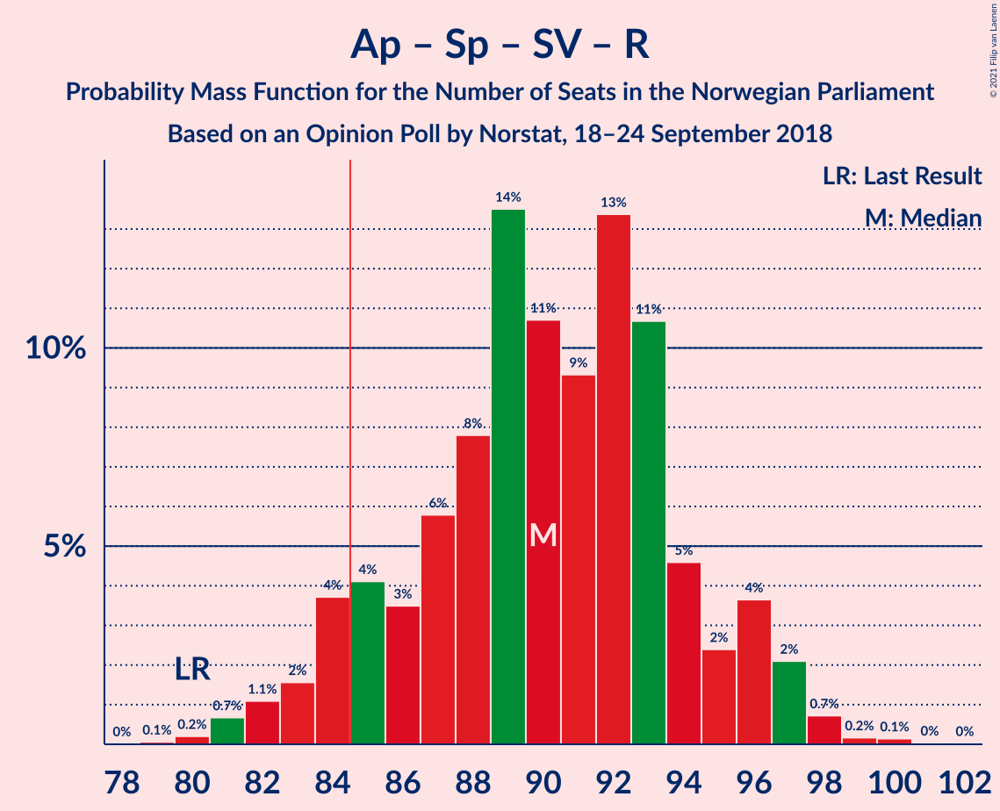
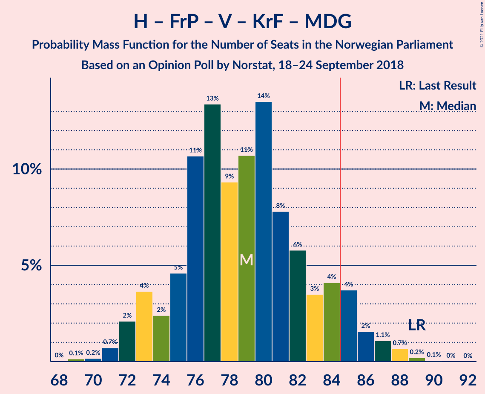
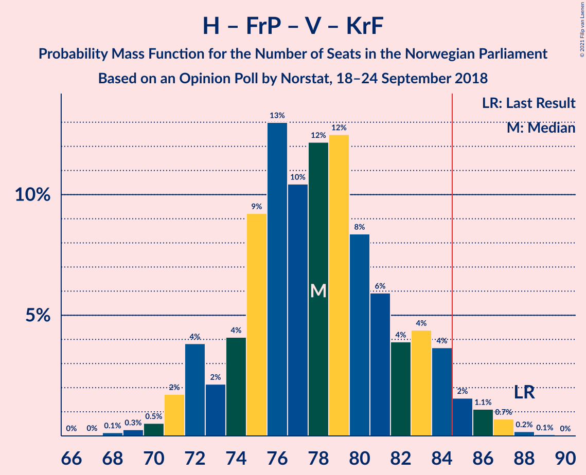
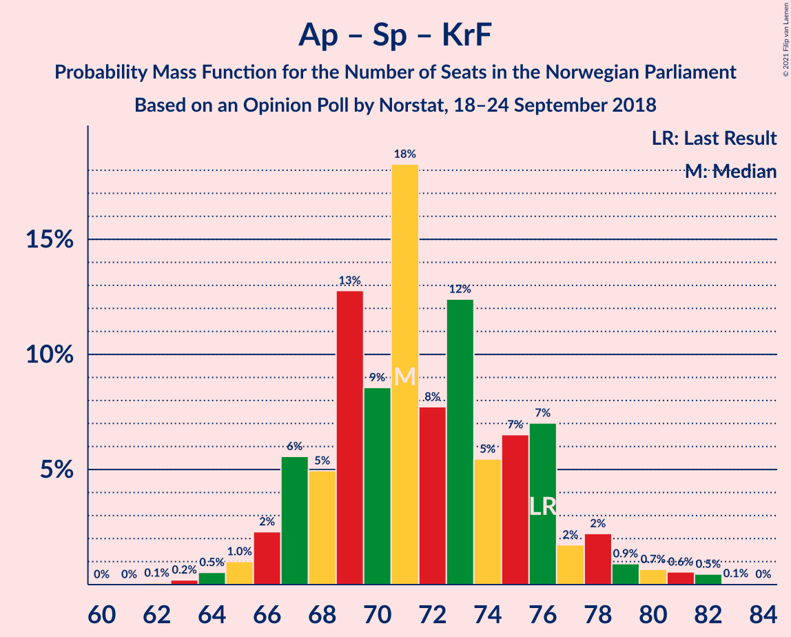
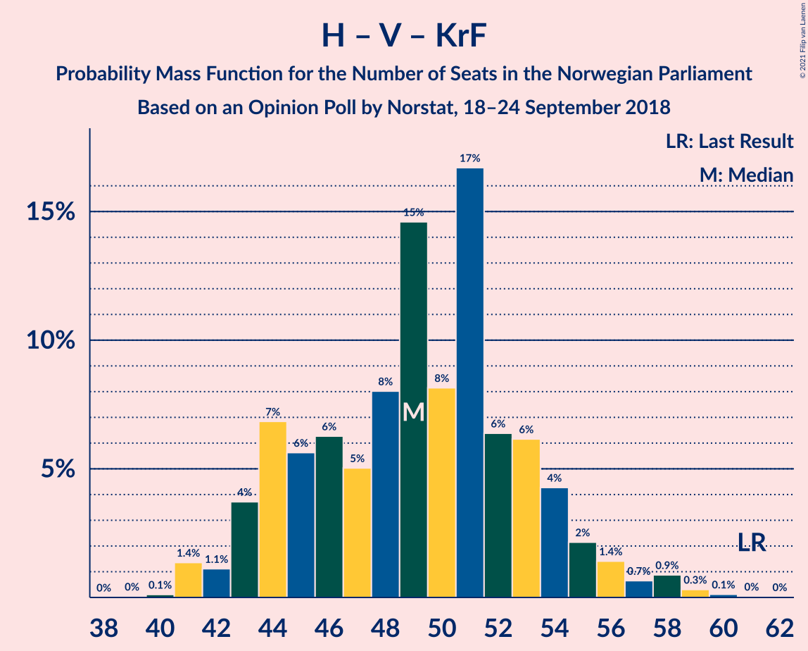
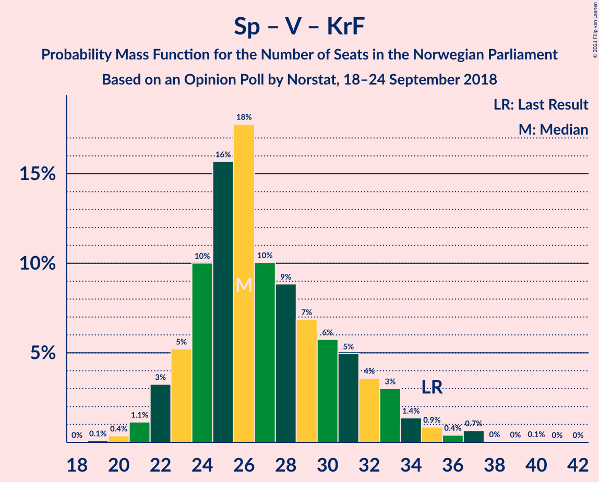

# Opinion Poll by Norstat, 18–24 September 2018

<a href="#voting-intentions">Voting Intentions</a> | <a href="#seats">Seats</a> | <a href="#coalitions">Coalitions</a> | <a href="#technical-information">Technical Information</a>

## Voting Intentions

### Confidence Intervals

| Party | Last Result | Poll Result | 80% Confidence Interval | 90% Confidence Interval | 95% Confidence Interval | 99% Confidence Interval |
|:-----:|:-----------:|:-----------:|:-----------------------:|:-----------------------:|:-----------------------:|:-----------------------:|
| Arbeiderpartiet | 27.4% | 26.6% | 24.8–28.5% |24.3–29.1% |23.9–29.6% |23.0–30.5% |
| Høyre | 25.0% | 24.4% | 22.6–26.2% |22.1–26.8% |21.7–27.2% |20.9–28.1% |
| Fremskrittspartiet | 15.2% | 15.7% | 14.2–17.3% |13.8–17.7% |13.5–18.2% |12.8–18.9% |
| Senterpartiet | 10.3% | 12.0% | 10.7–13.5% |10.4–13.9% |10.1–14.3% |9.5–15.0% |
| Sosialistisk Venstreparti | 6.0% | 6.2% | 5.3–7.4% |5.1–7.7% |4.8–8.0% |4.4–8.6% |
| Rødt | 2.4% | 5.0% | 4.2–6.1% |4.0–6.4% |3.8–6.6% |3.5–7.2% |
| Venstre | 4.4% | 3.4% | 2.8–4.3% |2.6–4.6% |2.4–4.8% |2.2–5.3% |
| Kristelig Folkeparti | 4.2% | 3.0% | 2.4–3.9% |2.2–4.1% |2.1–4.3% |1.8–4.8% |
| Miljøpartiet De Grønne | 3.2% | 2.3% | 1.7–3.0% |1.6–3.2% |1.5–3.4% |1.3–3.8% |

*Note:* The poll result column reflects the actual value used in the calculations. Published results may vary slightly, and in addition be rounded to fewer digits.

## Seats

### Confidence Intervals

| Party | Last Result | Median | 80% Confidence Interval | 90% Confidence Interval | 95% Confidence Interval | 99% Confidence Interval |
|:-----:|:-----------:|:------:|:-----------------------:|:-----------------------:|:-----------------------:|:-----------------------:|
| <a href="#arbeiderpartiet">Arbeiderpartiet</a> | 49 | 48 | 44–51 |43–54 |41–54 |41–56 |
| <a href="#høyre">Høyre</a> | 45 | 44 | 41–47 |40–48 |39–49 |38–50 |
| <a href="#fremskrittspartiet">Fremskrittspartiet</a> | 27 | 28 | 25–33 |25–34 |24–35 |22–36 |
| <a href="#senterpartiet">Senterpartiet</a> | 19 | 22 | 19–25 |18–26 |18–26 |17–28 |
| <a href="#sosialistisk-venstreparti">Sosialistisk Venstreparti</a> | 11 | 12 | 9–13 |9–14 |9–14 |8–15 |
| <a href="#rødt">Rødt</a> | 1 | 9 | 7–12 |2–12 |2–13 |2–13 |
| <a href="#venstre">Venstre</a> | 8 | 2 | 2–8 |2–8 |1–9 |1–9 |
| <a href="#kristelig-folkeparti">Kristelig Folkeparti</a> | 8 | 2 | 1–7 |1–8 |0–8 |0–9 |
| <a href="#miljøpartiet-de-grønne">Miljøpartiet De Grønne</a> | 1 | 1 | 0–1 |0–1 |0–2 |0–3 |

### Arbeiderpartiet

*For a full overview of the results for this party, see the [Arbeiderpartiet](party-arbeiderpartiet.html) page.*

| Number of Seats | Probability | Accumulated | Special Marks |
|:---------------:|:-----------:|:-----------:|:-------------:|
| 40 | 0.2% | 100% |  |
| 41 | 3% | 99.8% |  |
| 42 | 1.3% | 97% |  |
| 43 | 2% | 95% |  |
| 44 | 4% | 94% |  |
| 45 | 24% | 90% |  |
| 46 | 8% | 66% |  |
| 47 | 6% | 59% |  |
| 48 | 15% | 52% | Median |
| 49 | 7% | 37% | Last Result |
| 50 | 12% | 30% |  |
| 51 | 10% | 18% |  |
| 52 | 2% | 9% |  |
| 53 | 1.3% | 7% |  |
| 54 | 4% | 5% |  |
| 55 | 0.4% | 2% |  |
| 56 | 1.0% | 1.2% |  |
| 57 | 0.1% | 0.2% |  |
| 58 | 0% | 0.1% |  |
| 59 | 0.1% | 0.1% |  |
| 60 | 0% | 0% |  |

### Høyre

*For a full overview of the results for this party, see the [Høyre](party-høyre.html) page.*

| Number of Seats | Probability | Accumulated | Special Marks |
|:---------------:|:-----------:|:-----------:|:-------------:|
| 35 | 0.1% | 100% |  |
| 36 | 0.1% | 99.9% |  |
| 37 | 0.2% | 99.8% |  |
| 38 | 1.3% | 99.6% |  |
| 39 | 3% | 98% |  |
| 40 | 5% | 95% |  |
| 41 | 11% | 90% |  |
| 42 | 8% | 79% |  |
| 43 | 17% | 71% |  |
| 44 | 8% | 54% | Median |
| 45 | 26% | 46% | Last Result |
| 46 | 8% | 20% |  |
| 47 | 5% | 12% |  |
| 48 | 4% | 7% |  |
| 49 | 2% | 4% |  |
| 50 | 1.4% | 2% |  |
| 51 | 0.2% | 0.3% |  |
| 52 | 0.1% | 0.2% |  |
| 53 | 0% | 0.1% |  |
| 54 | 0% | 0% |  |

### Fremskrittspartiet

*For a full overview of the results for this party, see the [Fremskrittspartiet](party-fremskrittspartiet.html) page.*

| Number of Seats | Probability | Accumulated | Special Marks |
|:---------------:|:-----------:|:-----------:|:-------------:|
| 21 | 0.1% | 100% |  |
| 22 | 0.7% | 99.9% |  |
| 23 | 1.0% | 99.2% |  |
| 24 | 3% | 98% |  |
| 25 | 9% | 95% |  |
| 26 | 5% | 86% |  |
| 27 | 20% | 81% | Last Result |
| 28 | 14% | 61% | Median |
| 29 | 10% | 48% |  |
| 30 | 10% | 38% |  |
| 31 | 8% | 28% |  |
| 32 | 7% | 20% |  |
| 33 | 8% | 13% |  |
| 34 | 3% | 5% |  |
| 35 | 2% | 3% |  |
| 36 | 0.6% | 0.7% |  |
| 37 | 0% | 0% |  |

### Senterpartiet

*For a full overview of the results for this party, see the [Senterpartiet](party-senterpartiet.html) page.*

| Number of Seats | Probability | Accumulated | Special Marks |
|:---------------:|:-----------:|:-----------:|:-------------:|
| 16 | 0.2% | 100% |  |
| 17 | 0.9% | 99.8% |  |
| 18 | 5% | 98.9% |  |
| 19 | 16% | 94% | Last Result |
| 20 | 13% | 78% |  |
| 21 | 11% | 65% |  |
| 22 | 14% | 54% | Median |
| 23 | 9% | 40% |  |
| 24 | 20% | 32% |  |
| 25 | 2% | 11% |  |
| 26 | 7% | 9% |  |
| 27 | 0.9% | 2% |  |
| 28 | 0.7% | 0.9% |  |
| 29 | 0.1% | 0.1% |  |
| 30 | 0% | 0% |  |

### Sosialistisk Venstreparti

*For a full overview of the results for this party, see the [Sosialistisk Venstreparti](party-sosialistiskvenstreparti.html) page.*

| Number of Seats | Probability | Accumulated | Special Marks |
|:---------------:|:-----------:|:-----------:|:-------------:|
| 2 | 0.1% | 100% |  |
| 3 | 0% | 99.9% |  |
| 4 | 0% | 99.9% |  |
| 5 | 0% | 99.9% |  |
| 6 | 0% | 99.9% |  |
| 7 | 0.3% | 99.9% |  |
| 8 | 2% | 99.5% |  |
| 9 | 10% | 98% |  |
| 10 | 14% | 87% |  |
| 11 | 14% | 74% | Last Result |
| 12 | 17% | 59% | Median |
| 13 | 34% | 43% |  |
| 14 | 7% | 9% |  |
| 15 | 2% | 2% |  |
| 16 | 0.4% | 0.4% |  |
| 17 | 0% | 0% |  |

### Rødt

*For a full overview of the results for this party, see the [Rødt](party-rødt.html) page.*

| Number of Seats | Probability | Accumulated | Special Marks |
|:---------------:|:-----------:|:-----------:|:-------------:|
| 1 | 0% | 100% | Last Result |
| 2 | 10% | 100% |  |
| 3 | 0% | 90% |  |
| 4 | 0% | 90% |  |
| 5 | 0% | 90% |  |
| 6 | 0% | 90% |  |
| 7 | 9% | 90% |  |
| 8 | 28% | 82% |  |
| 9 | 26% | 54% | Median |
| 10 | 9% | 28% |  |
| 11 | 7% | 20% |  |
| 12 | 7% | 12% |  |
| 13 | 5% | 5% |  |
| 14 | 0% | 0.1% |  |
| 15 | 0% | 0% |  |

### Venstre

*For a full overview of the results for this party, see the [Venstre](party-venstre.html) page.*

| Number of Seats | Probability | Accumulated | Special Marks |
|:---------------:|:-----------:|:-----------:|:-------------:|
| 1 | 4% | 100% |  |
| 2 | 60% | 96% | Median |
| 3 | 17% | 36% |  |
| 4 | 0% | 20% |  |
| 5 | 0% | 20% |  |
| 6 | 0% | 20% |  |
| 7 | 6% | 20% |  |
| 8 | 11% | 13% | Last Result |
| 9 | 2% | 3% |  |
| 10 | 0.4% | 0.4% |  |
| 11 | 0% | 0% |  |

### Kristelig Folkeparti

*For a full overview of the results for this party, see the [Kristelig Folkeparti](party-kristeligfolkeparti.html) page.*

| Number of Seats | Probability | Accumulated | Special Marks |
|:---------------:|:-----------:|:-----------:|:-------------:|
| 0 | 5% | 100% |  |
| 1 | 40% | 95% |  |
| 2 | 10% | 55% | Median |
| 3 | 34% | 45% |  |
| 4 | 0% | 11% |  |
| 5 | 0% | 11% |  |
| 6 | 0% | 11% |  |
| 7 | 2% | 11% |  |
| 8 | 9% | 9% | Last Result |
| 9 | 0.4% | 0.5% |  |
| 10 | 0.1% | 0.1% |  |
| 11 | 0% | 0% |  |

### Miljøpartiet De Grønne

*For a full overview of the results for this party, see the [Miljøpartiet De Grønne](party-miljøpartietdegrønne.html) page.*

| Number of Seats | Probability | Accumulated | Special Marks |
|:---------------:|:-----------:|:-----------:|:-------------:|
| 0 | 10% | 100% |  |
| 1 | 85% | 90% | Last Result, Median |
| 2 | 4% | 5% |  |
| 3 | 0.3% | 0.6% |  |
| 4 | 0% | 0.3% |  |
| 5 | 0% | 0.3% |  |
| 6 | 0% | 0.3% |  |
| 7 | 0.2% | 0.3% |  |
| 8 | 0.1% | 0.1% |  |
| 9 | 0% | 0% |  |

## Coalitions

### Confidence Intervals

| Coalition | Last Result | Median | Majority? | 80% Confidence Interval | 90% Confidence Interval | 95% Confidence Interval | 99% Confidence Interval |
|:---------:|:-----------:|:------:|:---------:|:-----------------------:|:-----------------------:|:-----------------------:|:-----------------------:|
| Høyre – Fremskrittspartiet – Senterpartiet – Venstre – Kristelig Folkeparti | 107 | 101 | 100% | 96–105 | 95–106 | 93–107 | 91–108 |
| Arbeiderpartiet – Senterpartiet – Sosialistisk Venstreparti – Rødt – Miljøpartiet De Grønne | 81 | 91 | 94% | 85–95 | 84–96 | 84–98 | 83–100 |
| Arbeiderpartiet – Senterpartiet – Sosialistisk Venstreparti – Rødt | 80 | 90 | 87% | 84–94 | 83–95 | 83–97 | 82–99 |
| Arbeiderpartiet – Senterpartiet – Sosialistisk Venstreparti – Kristelig Folkeparti – Miljøpartiet De Grønne | 88 | 85 | 59% | 80–89 | 78–90 | 78–92 | 76–94 |
| Arbeiderpartiet – Senterpartiet – Sosialistisk Venstreparti – Miljøpartiet De Grønne | 80 | 83 | 21% | 78–86 | 77–87 | 75–89 | 74–92 |
| Arbeiderpartiet – Senterpartiet – Sosialistisk Venstreparti | 79 | 82 | 13% | 77–85 | 76–86 | 74–88 | 73–91 |
| Høyre – Fremskrittspartiet – Venstre – Kristelig Folkeparti – Miljøpartiet De Grønne | 89 | 79 | 13% | 75–85 | 74–86 | 72–86 | 70–87 |
| Høyre – Fremskrittspartiet – Venstre – Kristelig Folkeparti | 88 | 78 | 6% | 74–84 | 73–85 | 71–85 | 69–86 |
| Høyre – Fremskrittspartiet – Venstre | 80 | 75 | 0.3% | 73–81 | 70–83 | 70–83 | 67–84 |
| Arbeiderpartiet – Senterpartiet – Kristelig Folkeparti – Miljøpartiet De Grønne | 77 | 73 | 0% | 68–77 | 67–79 | 67–81 | 65–82 |
| Høyre – Fremskrittspartiet | 72 | 72 | 0% | 70–75 | 68–81 | 67–81 | 63–81 |
| Arbeiderpartiet – Senterpartiet – Kristelig Folkeparti | 76 | 72 | 0% | 67–76 | 66–78 | 66–80 | 64–81 |
| Arbeiderpartiet – Senterpartiet | 68 | 69 | 0% | 65–74 | 64–75 | 63–77 | 62–79 |
| Arbeiderpartiet – Sosialistisk Venstreparti | 60 | 59 | 0% | 56–63 | 54–65 | 54–66 | 52–67 |
| Høyre – Venstre – Kristelig Folkeparti | 61 | 50 | 0% | 44–55 | 44–56 | 42–56 | 41–58 |
| Senterpartiet – Venstre – Kristelig Folkeparti | 35 | 28 | 0% | 23–32 | 22–34 | 21–34 | 20–36 |

### Høyre – Fremskrittspartiet – Senterpartiet – Venstre – Kristelig Folkeparti

| Number of Seats | Probability | Accumulated | Special Marks |
|:---------------:|:-----------:|:-----------:|:-------------:|
| 90 | 0.4% | 100% |  |
| 91 | 0.2% | 99.6% |  |
| 92 | 0.9% | 99.4% |  |
| 93 | 1.2% | 98% |  |
| 94 | 2% | 97% |  |
| 95 | 5% | 96% |  |
| 96 | 10% | 91% |  |
| 97 | 5% | 81% |  |
| 98 | 12% | 76% | Median |
| 99 | 10% | 64% |  |
| 100 | 4% | 54% |  |
| 101 | 6% | 50% |  |
| 102 | 17% | 44% |  |
| 103 | 11% | 27% |  |
| 104 | 4% | 16% |  |
| 105 | 4% | 12% |  |
| 106 | 4% | 7% |  |
| 107 | 3% | 4% | Last Result |
| 108 | 0.6% | 0.9% |  |
| 109 | 0.1% | 0.2% |  |
| 110 | 0% | 0.1% |  |
| 111 | 0% | 0.1% |  |
| 112 | 0% | 0% |  |

### Arbeiderpartiet – Senterpartiet – Sosialistisk Venstreparti – Rødt – Miljøpartiet De Grønne

| Number of Seats | Probability | Accumulated | Special Marks |
|:---------------:|:-----------:|:-----------:|:-------------:|
| 80 | 0% | 100% |  |
| 81 | 0% | 99.9% | Last Result |
| 82 | 0.2% | 99.9% |  |
| 83 | 2% | 99.8% |  |
| 84 | 4% | 98% |  |
| 85 | 7% | 94% | Majority |
| 86 | 4% | 87% |  |
| 87 | 3% | 83% |  |
| 88 | 3% | 80% |  |
| 89 | 6% | 77% |  |
| 90 | 7% | 71% |  |
| 91 | 21% | 64% |  |
| 92 | 16% | 42% | Median |
| 93 | 8% | 26% |  |
| 94 | 6% | 18% |  |
| 95 | 6% | 12% |  |
| 96 | 3% | 6% |  |
| 97 | 0.9% | 3% |  |
| 98 | 1.3% | 3% |  |
| 99 | 0.1% | 1.2% |  |
| 100 | 0.7% | 1.1% |  |
| 101 | 0.4% | 0.4% |  |
| 102 | 0% | 0% |  |

### Arbeiderpartiet – Senterpartiet – Sosialistisk Venstreparti – Rødt

| Number of Seats | Probability | Accumulated | Special Marks |
|:---------------:|:-----------:|:-----------:|:-------------:|
| 79 | 0.1% | 100% |  |
| 80 | 0% | 99.9% | Last Result |
| 81 | 0.1% | 99.9% |  |
| 82 | 2% | 99.7% |  |
| 83 | 4% | 98% |  |
| 84 | 7% | 94% |  |
| 85 | 3% | 87% | Majority |
| 86 | 2% | 84% |  |
| 87 | 5% | 81% |  |
| 88 | 4% | 77% |  |
| 89 | 8% | 72% |  |
| 90 | 22% | 64% |  |
| 91 | 17% | 42% | Median |
| 92 | 7% | 25% |  |
| 93 | 6% | 18% |  |
| 94 | 5% | 12% |  |
| 95 | 2% | 6% |  |
| 96 | 1.4% | 4% |  |
| 97 | 1.5% | 3% |  |
| 98 | 0.1% | 1.2% |  |
| 99 | 0.7% | 1.1% |  |
| 100 | 0.4% | 0.4% |  |
| 101 | 0% | 0% |  |

### Arbeiderpartiet – Senterpartiet – Sosialistisk Venstreparti – Kristelig Folkeparti – Miljøpartiet De Grønne

| Number of Seats | Probability | Accumulated | Special Marks |
|:---------------:|:-----------:|:-----------:|:-------------:|
| 73 | 0% | 100% |  |
| 74 | 0.1% | 99.9% |  |
| 75 | 0% | 99.9% |  |
| 76 | 1.0% | 99.8% |  |
| 77 | 0.9% | 98.9% |  |
| 78 | 4% | 98% |  |
| 79 | 1.0% | 94% |  |
| 80 | 6% | 93% |  |
| 81 | 6% | 87% |  |
| 82 | 13% | 81% |  |
| 83 | 4% | 69% |  |
| 84 | 6% | 65% |  |
| 85 | 11% | 59% | Median, Majority |
| 86 | 20% | 48% |  |
| 87 | 12% | 28% |  |
| 88 | 5% | 15% | Last Result |
| 89 | 3% | 10% |  |
| 90 | 3% | 7% |  |
| 91 | 1.4% | 4% |  |
| 92 | 2% | 3% |  |
| 93 | 0.2% | 1.3% |  |
| 94 | 1.0% | 1.1% |  |
| 95 | 0% | 0.1% |  |
| 96 | 0% | 0% |  |

### Arbeiderpartiet – Senterpartiet – Sosialistisk Venstreparti – Miljøpartiet De Grønne

| Number of Seats | Probability | Accumulated | Special Marks |
|:---------------:|:-----------:|:-----------:|:-------------:|
| 71 | 0.1% | 100% |  |
| 72 | 0% | 99.9% |  |
| 73 | 0.1% | 99.9% |  |
| 74 | 0.5% | 99.8% |  |
| 75 | 3% | 99.3% |  |
| 76 | 0.8% | 97% |  |
| 77 | 3% | 96% |  |
| 78 | 8% | 93% |  |
| 79 | 11% | 85% |  |
| 80 | 4% | 74% | Last Result |
| 81 | 12% | 70% |  |
| 82 | 7% | 58% |  |
| 83 | 19% | 51% | Median |
| 84 | 11% | 33% |  |
| 85 | 6% | 21% | Majority |
| 86 | 7% | 16% |  |
| 87 | 3% | 8% |  |
| 88 | 1.5% | 5% |  |
| 89 | 1.4% | 3% |  |
| 90 | 0.4% | 2% |  |
| 91 | 1.0% | 2% |  |
| 92 | 0.6% | 0.6% |  |
| 93 | 0% | 0.1% |  |
| 94 | 0% | 0% |  |

### Arbeiderpartiet – Senterpartiet – Sosialistisk Venstreparti

| Number of Seats | Probability | Accumulated | Special Marks |
|:---------------:|:-----------:|:-----------:|:-------------:|
| 70 | 0.1% | 100% |  |
| 71 | 0% | 99.9% |  |
| 72 | 0.1% | 99.9% |  |
| 73 | 0.5% | 99.8% |  |
| 74 | 3% | 99.3% |  |
| 75 | 0.8% | 97% |  |
| 76 | 3% | 96% |  |
| 77 | 7% | 93% |  |
| 78 | 12% | 86% |  |
| 79 | 0.9% | 74% | Last Result |
| 80 | 15% | 73% |  |
| 81 | 6% | 58% |  |
| 82 | 19% | 52% | Median |
| 83 | 10% | 33% |  |
| 84 | 9% | 22% |  |
| 85 | 5% | 13% | Majority |
| 86 | 3% | 8% |  |
| 87 | 1.2% | 5% |  |
| 88 | 2% | 4% |  |
| 89 | 0.5% | 2% |  |
| 90 | 1.0% | 2% |  |
| 91 | 0.6% | 0.6% |  |
| 92 | 0% | 0% |  |

### Høyre – Fremskrittspartiet – Venstre – Kristelig Folkeparti – Miljøpartiet De Grønne

| Number of Seats | Probability | Accumulated | Special Marks |
|:---------------:|:-----------:|:-----------:|:-------------:|
| 69 | 0.4% | 100% |  |
| 70 | 0.7% | 99.6% |  |
| 71 | 0.1% | 98.9% |  |
| 72 | 1.5% | 98.8% |  |
| 73 | 1.4% | 97% |  |
| 74 | 2% | 96% |  |
| 75 | 5% | 94% |  |
| 76 | 6% | 88% |  |
| 77 | 7% | 82% | Median |
| 78 | 17% | 75% |  |
| 79 | 22% | 58% |  |
| 80 | 8% | 36% |  |
| 81 | 4% | 28% |  |
| 82 | 5% | 23% |  |
| 83 | 2% | 19% |  |
| 84 | 3% | 16% |  |
| 85 | 7% | 13% | Majority |
| 86 | 4% | 6% |  |
| 87 | 2% | 2% |  |
| 88 | 0.1% | 0.3% |  |
| 89 | 0% | 0.1% | Last Result |
| 90 | 0.1% | 0.1% |  |
| 91 | 0% | 0% |  |

### Høyre – Fremskrittspartiet – Venstre – Kristelig Folkeparti

| Number of Seats | Probability | Accumulated | Special Marks |
|:---------------:|:-----------:|:-----------:|:-------------:|
| 68 | 0.4% | 100% |  |
| 69 | 0.7% | 99.6% |  |
| 70 | 0.1% | 98.9% |  |
| 71 | 1.3% | 98.8% |  |
| 72 | 0.9% | 97% |  |
| 73 | 3% | 97% |  |
| 74 | 6% | 94% |  |
| 75 | 6% | 88% |  |
| 76 | 8% | 82% | Median |
| 77 | 16% | 74% |  |
| 78 | 21% | 58% |  |
| 79 | 7% | 36% |  |
| 80 | 6% | 29% |  |
| 81 | 3% | 23% |  |
| 82 | 3% | 20% |  |
| 83 | 4% | 17% |  |
| 84 | 7% | 13% |  |
| 85 | 4% | 6% | Majority |
| 86 | 2% | 2% |  |
| 87 | 0.2% | 0.2% |  |
| 88 | 0% | 0.1% | Last Result |
| 89 | 0% | 0.1% |  |
| 90 | 0% | 0% |  |

### Høyre – Fremskrittspartiet – Venstre

| Number of Seats | Probability | Accumulated | Special Marks |
|:---------------:|:-----------:|:-----------:|:-------------:|
| 65 | 0% | 100% |  |
| 66 | 0% | 99.9% |  |
| 67 | 0.4% | 99.9% |  |
| 68 | 0.9% | 99.5% |  |
| 69 | 0.9% | 98.6% |  |
| 70 | 3% | 98% |  |
| 71 | 1.5% | 95% |  |
| 72 | 3% | 94% |  |
| 73 | 11% | 91% |  |
| 74 | 14% | 79% | Median |
| 75 | 20% | 65% |  |
| 76 | 10% | 45% |  |
| 77 | 10% | 35% |  |
| 78 | 6% | 25% |  |
| 79 | 6% | 19% |  |
| 80 | 3% | 13% | Last Result |
| 81 | 1.4% | 10% |  |
| 82 | 2% | 9% |  |
| 83 | 6% | 6% |  |
| 84 | 0.3% | 0.5% |  |
| 85 | 0.1% | 0.3% | Majority |
| 86 | 0.1% | 0.2% |  |
| 87 | 0% | 0.1% |  |
| 88 | 0% | 0% |  |

### Arbeiderpartiet – Senterpartiet – Kristelig Folkeparti – Miljøpartiet De Grønne

| Number of Seats | Probability | Accumulated | Special Marks |
|:---------------:|:-----------:|:-----------:|:-------------:|
| 63 | 0.1% | 100% |  |
| 64 | 0.2% | 99.9% |  |
| 65 | 0.5% | 99.6% |  |
| 66 | 1.5% | 99.1% |  |
| 67 | 4% | 98% |  |
| 68 | 6% | 93% |  |
| 69 | 1.1% | 87% |  |
| 70 | 5% | 86% |  |
| 71 | 7% | 81% |  |
| 72 | 15% | 74% |  |
| 73 | 20% | 58% | Median |
| 74 | 13% | 38% |  |
| 75 | 5% | 25% |  |
| 76 | 8% | 20% |  |
| 77 | 3% | 12% | Last Result |
| 78 | 3% | 9% |  |
| 79 | 2% | 6% |  |
| 80 | 1.2% | 4% |  |
| 81 | 2% | 3% |  |
| 82 | 0.6% | 0.8% |  |
| 83 | 0.1% | 0.1% |  |
| 84 | 0% | 0.1% |  |
| 85 | 0% | 0% | Majority |

### Høyre – Fremskrittspartiet

| Number of Seats | Probability | Accumulated | Special Marks |
|:---------------:|:-----------:|:-----------:|:-------------:|
| 61 | 0.1% | 100% |  |
| 62 | 0.2% | 99.9% |  |
| 63 | 0.4% | 99.7% |  |
| 64 | 0.1% | 99.3% |  |
| 65 | 0.6% | 99.2% |  |
| 66 | 1.0% | 98.6% |  |
| 67 | 2% | 98% |  |
| 68 | 3% | 95% |  |
| 69 | 2% | 92% |  |
| 70 | 9% | 91% |  |
| 71 | 15% | 82% |  |
| 72 | 27% | 67% | Last Result, Median |
| 73 | 13% | 41% |  |
| 74 | 5% | 27% |  |
| 75 | 13% | 22% |  |
| 76 | 0.9% | 9% |  |
| 77 | 0.7% | 8% |  |
| 78 | 0.2% | 7% |  |
| 79 | 1.5% | 7% |  |
| 80 | 0.3% | 6% |  |
| 81 | 5% | 5% |  |
| 82 | 0.1% | 0.3% |  |
| 83 | 0.1% | 0.1% |  |
| 84 | 0.1% | 0.1% |  |
| 85 | 0% | 0% | Majority |

### Arbeiderpartiet – Senterpartiet – Kristelig Folkeparti

| Number of Seats | Probability | Accumulated | Special Marks |
|:---------------:|:-----------:|:-----------:|:-------------:|
| 62 | 0.1% | 100% |  |
| 63 | 0.1% | 99.9% |  |
| 64 | 0.7% | 99.8% |  |
| 65 | 1.0% | 99.1% |  |
| 66 | 4% | 98% |  |
| 67 | 7% | 95% |  |
| 68 | 2% | 87% |  |
| 69 | 4% | 86% |  |
| 70 | 8% | 81% |  |
| 71 | 13% | 73% |  |
| 72 | 21% | 60% | Median |
| 73 | 13% | 39% |  |
| 74 | 8% | 26% |  |
| 75 | 6% | 18% |  |
| 76 | 3% | 12% | Last Result |
| 77 | 3% | 9% |  |
| 78 | 3% | 6% |  |
| 79 | 1.2% | 4% |  |
| 80 | 2% | 3% |  |
| 81 | 0.7% | 0.9% |  |
| 82 | 0.1% | 0.1% |  |
| 83 | 0% | 0.1% |  |
| 84 | 0% | 0% |  |

### Arbeiderpartiet – Senterpartiet

| Number of Seats | Probability | Accumulated | Special Marks |
|:---------------:|:-----------:|:-----------:|:-------------:|
| 60 | 0% | 100% |  |
| 61 | 0.2% | 99.9% |  |
| 62 | 2% | 99.7% |  |
| 63 | 0.7% | 98% |  |
| 64 | 4% | 97% |  |
| 65 | 8% | 93% |  |
| 66 | 5% | 85% |  |
| 67 | 2% | 80% |  |
| 68 | 9% | 78% | Last Result |
| 69 | 21% | 69% |  |
| 70 | 14% | 47% | Median |
| 71 | 10% | 33% |  |
| 72 | 9% | 24% |  |
| 73 | 4% | 15% |  |
| 74 | 5% | 11% |  |
| 75 | 3% | 6% |  |
| 76 | 0.4% | 3% |  |
| 77 | 0.8% | 3% |  |
| 78 | 0.5% | 2% |  |
| 79 | 1.3% | 1.4% |  |
| 80 | 0% | 0.1% |  |
| 81 | 0% | 0% |  |

### Arbeiderpartiet – Sosialistisk Venstreparti

| Number of Seats | Probability | Accumulated | Special Marks |
|:---------------:|:-----------:|:-----------:|:-------------:|
| 49 | 0% | 100% |  |
| 50 | 0% | 99.9% |  |
| 51 | 0.4% | 99.9% |  |
| 52 | 0.8% | 99.5% |  |
| 53 | 0.9% | 98.8% |  |
| 54 | 4% | 98% |  |
| 55 | 4% | 94% |  |
| 56 | 2% | 90% |  |
| 57 | 14% | 88% |  |
| 58 | 18% | 74% |  |
| 59 | 10% | 56% |  |
| 60 | 11% | 46% | Last Result, Median |
| 61 | 12% | 35% |  |
| 62 | 9% | 23% |  |
| 63 | 7% | 14% |  |
| 64 | 2% | 7% |  |
| 65 | 3% | 5% |  |
| 66 | 0.5% | 3% |  |
| 67 | 2% | 2% |  |
| 68 | 0.4% | 0.4% |  |
| 69 | 0% | 0.1% |  |
| 70 | 0% | 0% |  |

### Høyre – Venstre – Kristelig Folkeparti

| Number of Seats | Probability | Accumulated | Special Marks |
|:---------------:|:-----------:|:-----------:|:-------------:|
| 40 | 0% | 100% |  |
| 41 | 0.4% | 99.9% |  |
| 42 | 3% | 99.5% |  |
| 43 | 0.3% | 97% |  |
| 44 | 10% | 96% |  |
| 45 | 4% | 87% |  |
| 46 | 6% | 83% |  |
| 47 | 4% | 77% |  |
| 48 | 6% | 73% | Median |
| 49 | 15% | 67% |  |
| 50 | 8% | 52% |  |
| 51 | 20% | 44% |  |
| 52 | 3% | 25% |  |
| 53 | 5% | 21% |  |
| 54 | 5% | 16% |  |
| 55 | 4% | 10% |  |
| 56 | 5% | 7% |  |
| 57 | 1.0% | 2% |  |
| 58 | 0.9% | 1.2% |  |
| 59 | 0.1% | 0.3% |  |
| 60 | 0.2% | 0.3% |  |
| 61 | 0.1% | 0.1% | Last Result |
| 62 | 0% | 0% |  |

### Senterpartiet – Venstre – Kristelig Folkeparti

| Number of Seats | Probability | Accumulated | Special Marks |
|:---------------:|:-----------:|:-----------:|:-------------:|
| 19 | 0.4% | 100% |  |
| 20 | 0.1% | 99.6% |  |
| 21 | 3% | 99.5% |  |
| 22 | 5% | 97% |  |
| 23 | 11% | 91% |  |
| 24 | 4% | 81% |  |
| 25 | 7% | 76% |  |
| 26 | 8% | 69% | Median |
| 27 | 5% | 61% |  |
| 28 | 13% | 55% |  |
| 29 | 3% | 42% |  |
| 30 | 17% | 39% |  |
| 31 | 9% | 21% |  |
| 32 | 3% | 13% |  |
| 33 | 3% | 9% |  |
| 34 | 5% | 7% |  |
| 35 | 1.3% | 2% | Last Result |
| 36 | 0.4% | 0.6% |  |
| 37 | 0.2% | 0.2% |  |
| 38 | 0% | 0.1% |  |
| 39 | 0% | 0% |  |

## Technical Information

### Opinion Poll

+ **Polling firm:** Norstat
+ **Commissioner(s):** —
+ **Fieldwork period:** 18–24 September 2018

### Calculations

+ **Sample size:** 932
+ **Simulations done:** 131,072
+ **Error estimate:** 1.57%

