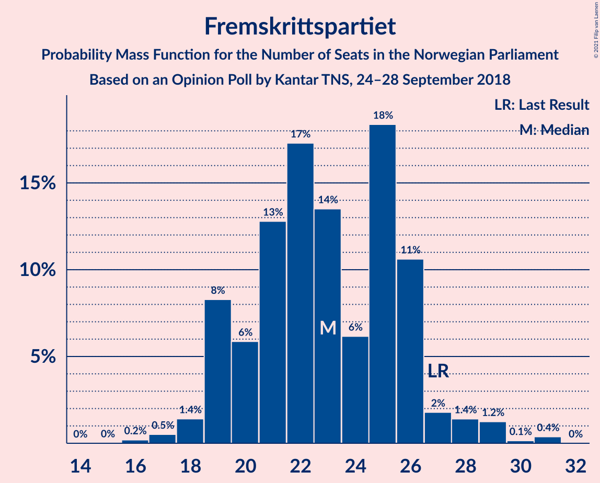
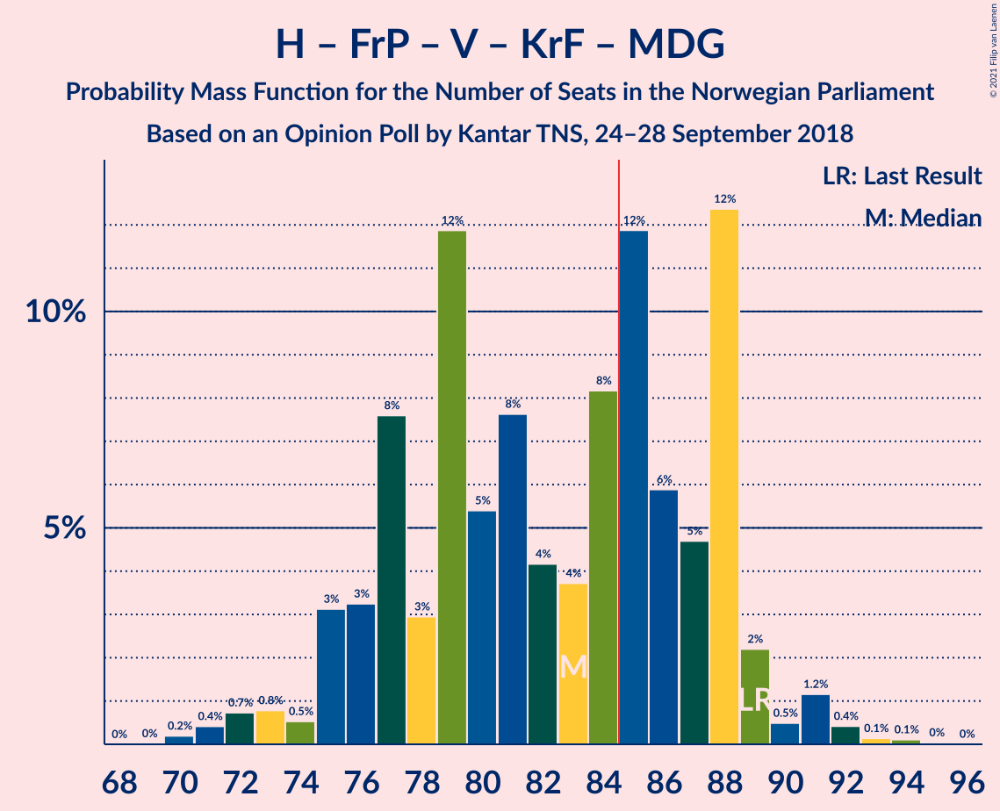
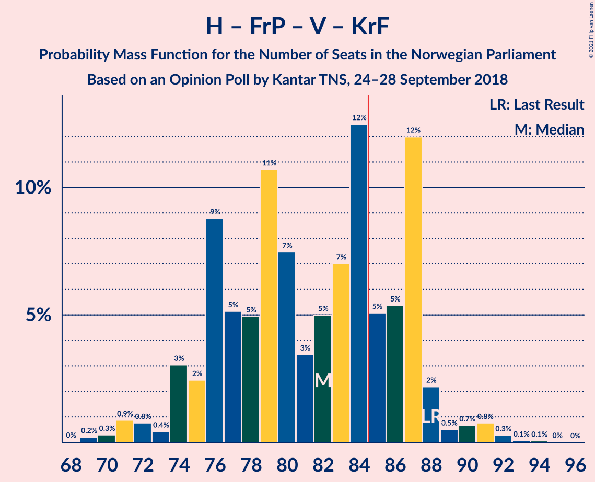
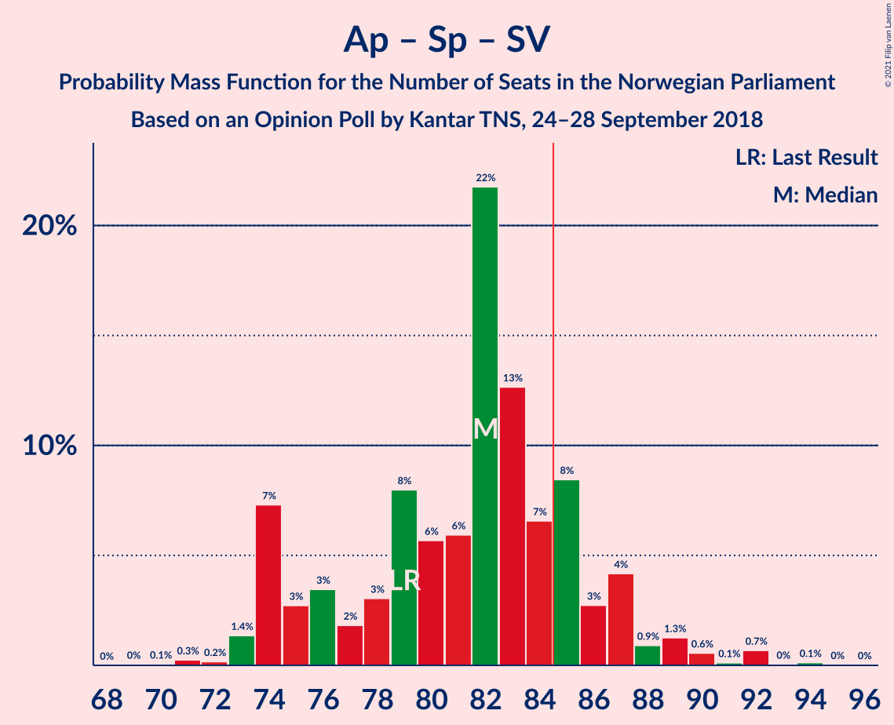
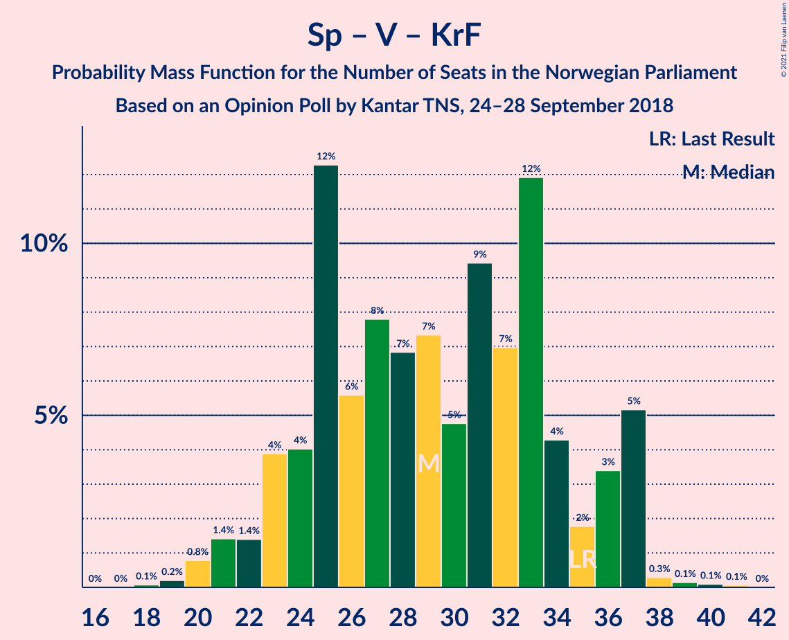

# Opinion Poll by Kantar TNS, 24–28 September 2018

<a href="#voting-intentions">Voting Intentions</a> | <a href="#seats">Seats</a> | <a href="#coalitions">Coalitions</a> | <a href="#technical-information">Technical Information</a>

## Voting Intentions

### Confidence Intervals

| Party | Last Result | Poll Result | 80% Confidence Interval | 90% Confidence Interval | 95% Confidence Interval | 99% Confidence Interval |
|:-----:|:-----------:|:-----------:|:-----------------------:|:-----------------------:|:-----------------------:|:-----------------------:|
| Arbeiderpartiet | 27.4% | 26.8% | 24.9–28.9% |24.3–29.5% |23.8–30.0% |22.9–31.0% |
| Høyre | 25.0% | 26.8% | 24.9–28.9% |24.3–29.5% |23.8–30.0% |22.9–31.0% |
| Fremskrittspartiet | 15.2% | 12.7% | 11.3–14.4% |10.9–14.8% |10.6–15.2% |9.9–16.0% |
| Senterpartiet | 10.3% | 10.4% | 9.1–11.9% |8.8–12.4% |8.5–12.8% |7.9–13.5% |
| Sosialistisk Venstreparti | 6.0% | 7.6% | 6.5–9.0% |6.2–9.4% |6.0–9.7% |5.5–10.4% |
| Rødt | 2.4% | 4.1% | 3.3–5.1% |3.1–5.4% |2.9–5.7% |2.6–6.2% |
| Venstre | 4.4% | 4.1% | 3.3–5.1% |3.1–5.4% |2.9–5.7% |2.6–6.2% |
| Kristelig Folkeparti | 4.2% | 3.8% | 3.1–4.8% |2.9–5.1% |2.7–5.4% |2.4–5.9% |
| Miljøpartiet De Grønne | 3.2% | 2.4% | 1.8–3.3% |1.7–3.5% |1.6–3.7% |1.3–4.2% |

*Note:* The poll result column reflects the actual value used in the calculations. Published results may vary slightly, and in addition be rounded to fewer digits.

## Seats

### Confidence Intervals

| Party | Last Result | Median | 80% Confidence Interval | 90% Confidence Interval | 95% Confidence Interval | 99% Confidence Interval |
|:-----:|:-----------:|:------:|:-----------------------:|:-----------------------:|:-----------------------:|:-----------------------:|
| <a href="#arbeiderpartiet">Arbeiderpartiet</a> | 49 | 48 | 44–51 |44–53 |42–55 |41–57 |
| <a href="#høyre">Høyre</a> | 45 | 48 | 44–51 |44–53 |43–53 |41–56 |
| <a href="#fremskrittspartiet">Fremskrittspartiet</a> | 27 | 22 | 19–26 |19–28 |19–28 |17–30 |
| <a href="#senterpartiet">Senterpartiet</a> | 19 | 19 | 17–22 |16–22 |15–23 |14–25 |
| <a href="#sosialistisk-venstreparti">Sosialistisk Venstreparti</a> | 11 | 13 | 11–16 |11–16 |11–18 |10–20 |
| <a href="#rødt">Rødt</a> | 1 | 7 | 2–9 |2–10 |1–10 |1–11 |
| <a href="#venstre">Venstre</a> | 8 | 7 | 2–9 |2–9 |2–10 |2–10 |
| <a href="#kristelig-folkeparti">Kristelig Folkeparti</a> | 8 | 7 | 1–8 |1–8 |1–9 |1–11 |
| <a href="#miljøpartiet-de-grønne">Miljøpartiet De Grønne</a> | 1 | 1 | 1 |0–2 |0–2 |0–7 |

### Arbeiderpartiet

*For a full overview of the results for this party, see the [Arbeiderpartiet](party-arbeiderpartiet.html) page.*

| Number of Seats | Probability | Accumulated | Special Marks |
|:---------------:|:-----------:|:-----------:|:-------------:|
| 39 | 0.1% | 100% |  |
| 40 | 0% | 99.9% |  |
| 41 | 0.8% | 99.9% |  |
| 42 | 3% | 99.1% |  |
| 43 | 1.3% | 96% |  |
| 44 | 27% | 95% |  |
| 45 | 3% | 68% |  |
| 46 | 5% | 64% |  |
| 47 | 3% | 60% |  |
| 48 | 8% | 57% | Median |
| 49 | 28% | 49% | Last Result |
| 50 | 3% | 21% |  |
| 51 | 10% | 18% |  |
| 52 | 2% | 8% |  |
| 53 | 4% | 7% |  |
| 54 | 0.2% | 3% |  |
| 55 | 2% | 3% |  |
| 56 | 0.3% | 1.1% |  |
| 57 | 0.7% | 0.8% |  |
| 58 | 0% | 0.1% |  |
| 59 | 0% | 0.1% |  |
| 60 | 0% | 0% |  |

### Høyre

*For a full overview of the results for this party, see the [Høyre](party-høyre.html) page.*

| Number of Seats | Probability | Accumulated | Special Marks |
|:---------------:|:-----------:|:-----------:|:-------------:|
| 37 | 0.1% | 100% |  |
| 38 | 0.1% | 99.9% |  |
| 39 | 0.1% | 99.9% |  |
| 40 | 0.1% | 99.7% |  |
| 41 | 0.3% | 99.6% |  |
| 42 | 1.3% | 99.3% |  |
| 43 | 2% | 98% |  |
| 44 | 9% | 96% |  |
| 45 | 1.0% | 87% | Last Result |
| 46 | 3% | 86% |  |
| 47 | 8% | 83% |  |
| 48 | 34% | 74% | Median |
| 49 | 3% | 40% |  |
| 50 | 5% | 37% |  |
| 51 | 22% | 32% |  |
| 52 | 2% | 10% |  |
| 53 | 5% | 7% |  |
| 54 | 1.0% | 2% |  |
| 55 | 0.6% | 1.3% |  |
| 56 | 0.3% | 0.7% |  |
| 57 | 0.3% | 0.4% |  |
| 58 | 0% | 0.1% |  |
| 59 | 0% | 0% |  |

### Fremskrittspartiet

*For a full overview of the results for this party, see the [Fremskrittspartiet](party-fremskrittspartiet.html) page.*

| Number of Seats | Probability | Accumulated | Special Marks |
|:---------------:|:-----------:|:-----------:|:-------------:|
| 16 | 0.3% | 100% |  |
| 17 | 0.2% | 99.7% |  |
| 18 | 2% | 99.5% |  |
| 19 | 9% | 98% |  |
| 20 | 4% | 89% |  |
| 21 | 7% | 85% |  |
| 22 | 29% | 77% | Median |
| 23 | 3% | 48% |  |
| 24 | 3% | 45% |  |
| 25 | 29% | 42% |  |
| 26 | 6% | 13% |  |
| 27 | 2% | 7% | Last Result |
| 28 | 4% | 6% |  |
| 29 | 1.2% | 2% |  |
| 30 | 0.4% | 0.9% |  |
| 31 | 0.5% | 0.5% |  |
| 32 | 0% | 0% |  |

### Senterpartiet

*For a full overview of the results for this party, see the [Senterpartiet](party-senterpartiet.html) page.*

| Number of Seats | Probability | Accumulated | Special Marks |
|:---------------:|:-----------:|:-----------:|:-------------:|
| 12 | 0.1% | 100% |  |
| 13 | 0.2% | 99.9% |  |
| 14 | 0.4% | 99.7% |  |
| 15 | 2% | 99.3% |  |
| 16 | 5% | 97% |  |
| 17 | 8% | 93% |  |
| 18 | 7% | 84% |  |
| 19 | 31% | 77% | Last Result, Median |
| 20 | 32% | 46% |  |
| 21 | 4% | 14% |  |
| 22 | 8% | 11% |  |
| 23 | 1.2% | 3% |  |
| 24 | 0.2% | 2% |  |
| 25 | 1.4% | 1.5% |  |
| 26 | 0% | 0.1% |  |
| 27 | 0% | 0% |  |

### Sosialistisk Venstreparti

*For a full overview of the results for this party, see the [Sosialistisk Venstreparti](party-sosialistiskvenstreparti.html) page.*

| Number of Seats | Probability | Accumulated | Special Marks |
|:---------------:|:-----------:|:-----------:|:-------------:|
| 9 | 0.5% | 100% |  |
| 10 | 2% | 99.5% |  |
| 11 | 28% | 98% | Last Result |
| 12 | 11% | 70% |  |
| 13 | 28% | 59% | Median |
| 14 | 14% | 31% |  |
| 15 | 7% | 17% |  |
| 16 | 5% | 10% |  |
| 17 | 2% | 5% |  |
| 18 | 2% | 3% |  |
| 19 | 0.3% | 1.2% |  |
| 20 | 0.9% | 0.9% |  |
| 21 | 0% | 0% |  |

### Rødt

*For a full overview of the results for this party, see the [Rødt](party-rødt.html) page.*

| Number of Seats | Probability | Accumulated | Special Marks |
|:---------------:|:-----------:|:-----------:|:-------------:|
| 1 | 3% | 100% | Last Result |
| 2 | 45% | 97% |  |
| 3 | 0% | 52% |  |
| 4 | 0% | 52% |  |
| 5 | 0% | 52% |  |
| 6 | 0.1% | 52% |  |
| 7 | 28% | 51% | Median |
| 8 | 11% | 24% |  |
| 9 | 7% | 13% |  |
| 10 | 4% | 6% |  |
| 11 | 2% | 2% |  |
| 12 | 0.1% | 0.2% |  |
| 13 | 0.1% | 0.1% |  |
| 14 | 0% | 0% |  |

### Venstre

*For a full overview of the results for this party, see the [Venstre](party-venstre.html) page.*

| Number of Seats | Probability | Accumulated | Special Marks |
|:---------------:|:-----------:|:-----------:|:-------------:|
| 1 | 0.1% | 100% |  |
| 2 | 17% | 99.9% |  |
| 3 | 6% | 83% |  |
| 4 | 0% | 77% |  |
| 5 | 0% | 77% |  |
| 6 | 0.1% | 77% |  |
| 7 | 36% | 76% | Median |
| 8 | 29% | 41% | Last Result |
| 9 | 8% | 11% |  |
| 10 | 3% | 4% |  |
| 11 | 0.2% | 0.3% |  |
| 12 | 0.1% | 0.1% |  |
| 13 | 0% | 0% |  |

### Kristelig Folkeparti

*For a full overview of the results for this party, see the [Kristelig Folkeparti](party-kristeligfolkeparti.html) page.*

| Number of Seats | Probability | Accumulated | Special Marks |
|:---------------:|:-----------:|:-----------:|:-------------:|
| 0 | 0.2% | 100% |  |
| 1 | 12% | 99.8% |  |
| 2 | 2% | 88% |  |
| 3 | 32% | 86% |  |
| 4 | 0% | 54% |  |
| 5 | 0% | 54% |  |
| 6 | 0% | 54% |  |
| 7 | 36% | 54% | Median |
| 8 | 15% | 18% | Last Result |
| 9 | 3% | 4% |  |
| 10 | 0.4% | 0.9% |  |
| 11 | 0.5% | 0.5% |  |
| 12 | 0.1% | 0.1% |  |
| 13 | 0% | 0% |  |

### Miljøpartiet De Grønne

*For a full overview of the results for this party, see the [Miljøpartiet De Grønne](party-miljøpartietdegrønne.html) page.*

| Number of Seats | Probability | Accumulated | Special Marks |
|:---------------:|:-----------:|:-----------:|:-------------:|
| 0 | 9% | 100% |  |
| 1 | 84% | 91% | Last Result, Median |
| 2 | 6% | 7% |  |
| 3 | 0.1% | 1.3% |  |
| 4 | 0% | 1.1% |  |
| 5 | 0% | 1.1% |  |
| 6 | 0.1% | 1.1% |  |
| 7 | 0.6% | 1.1% |  |
| 8 | 0.5% | 0.5% |  |
| 9 | 0% | 0% |  |

## Coalitions

### Confidence Intervals

| Coalition | Last Result | Median | Majority? | 80% Confidence Interval | 90% Confidence Interval | 95% Confidence Interval | 99% Confidence Interval |
|:---------:|:-----------:|:------:|:---------:|:-----------------------:|:-----------------------:|:-----------------------:|:-----------------------:|
| Høyre – Fremskrittspartiet – Senterpartiet – Venstre – Kristelig Folkeparti | 107 | 104 | 100% | 96–106 | 94–106 | 92–108 | 89–109 |
| Arbeiderpartiet – Senterpartiet – Sosialistisk Venstreparti – Rødt – Miljøpartiet De Grønne | 81 | 85 | 64% | 82–92 | 81–94 | 78–95 | 77–100 |
| Arbeiderpartiet – Senterpartiet – Sosialistisk Venstreparti – Rødt | 80 | 84 | 35% | 81–91 | 80–92 | 78–95 | 76–99 |
| Arbeiderpartiet – Senterpartiet – Sosialistisk Venstreparti – Kristelig Folkeparti – Miljøpartiet De Grønne | 88 | 86 | 56% | 82–93 | 81–94 | 79–94 | 79–96 |
| Høyre – Fremskrittspartiet – Venstre – Kristelig Folkeparti – Miljøpartiet De Grønne | 89 | 85 | 65% | 78–88 | 77–89 | 74–91 | 70–93 |
| Høyre – Fremskrittspartiet – Venstre – Kristelig Folkeparti | 88 | 84 | 36% | 77–87 | 75–88 | 74–91 | 69–92 |
| Arbeiderpartiet – Senterpartiet – Sosialistisk Venstreparti – Miljøpartiet De Grønne | 80 | 83 | 18% | 75–86 | 75–88 | 75–90 | 74–91 |
| Arbeiderpartiet – Senterpartiet – Sosialistisk Venstreparti | 79 | 82 | 14% | 74–85 | 74–86 | 74–89 | 73–90 |
| Høyre – Fremskrittspartiet – Venstre | 80 | 80 | 2% | 70–82 | 70–83 | 69–84 | 66–87 |
| Høyre – Fremskrittspartiet | 72 | 73 | 0% | 65–75 | 63–78 | 63–81 | 60–81 |
| Arbeiderpartiet – Senterpartiet – Kristelig Folkeparti – Miljøpartiet De Grønne | 77 | 73 | 0.1% | 69–79 | 67–80 | 65–80 | 63–83 |
| Arbeiderpartiet – Senterpartiet – Kristelig Folkeparti | 76 | 72 | 0% | 68–78 | 66–79 | 64–79 | 62–81 |
| Arbeiderpartiet – Senterpartiet | 68 | 68 | 0% | 63–71 | 61–72 | 60–73 | 59–75 |
| Arbeiderpartiet – Sosialistisk Venstreparti | 60 | 62 | 0% | 55–65 | 55–68 | 55–69 | 53–70 |
| Høyre – Venstre – Kristelig Folkeparti | 61 | 62 | 0% | 54–63 | 52–64 | 51–65 | 49–67 |
| Senterpartiet – Venstre – Kristelig Folkeparti | 35 | 33 | 0% | 24–34 | 23–35 | 22–36 | 20–37 |

### Høyre – Fremskrittspartiet – Senterpartiet – Venstre – Kristelig Folkeparti

| Number of Seats | Probability | Accumulated | Special Marks |
|:---------------:|:-----------:|:-----------:|:-------------:|
| 87 | 0.1% | 100% |  |
| 88 | 0% | 99.9% |  |
| 89 | 0.7% | 99.9% |  |
| 90 | 0.2% | 99.2% |  |
| 91 | 1.4% | 99.0% |  |
| 92 | 1.3% | 98% |  |
| 93 | 0.9% | 96% |  |
| 94 | 0.4% | 95% |  |
| 95 | 2% | 95% |  |
| 96 | 3% | 93% |  |
| 97 | 8% | 90% |  |
| 98 | 1.4% | 82% |  |
| 99 | 3% | 80% |  |
| 100 | 3% | 77% |  |
| 101 | 3% | 75% |  |
| 102 | 5% | 72% |  |
| 103 | 7% | 67% | Median |
| 104 | 24% | 59% |  |
| 105 | 3% | 35% |  |
| 106 | 27% | 32% |  |
| 107 | 1.1% | 5% | Last Result |
| 108 | 3% | 4% |  |
| 109 | 0.2% | 0.5% |  |
| 110 | 0.1% | 0.3% |  |
| 111 | 0.1% | 0.2% |  |
| 112 | 0% | 0.1% |  |
| 113 | 0% | 0.1% |  |
| 114 | 0% | 0% |  |

### Arbeiderpartiet – Senterpartiet – Sosialistisk Venstreparti – Rødt – Miljøpartiet De Grønne

| Number of Seats | Probability | Accumulated | Special Marks |
|:---------------:|:-----------:|:-----------:|:-------------:|
| 76 | 0.2% | 100% |  |
| 77 | 0.2% | 99.7% |  |
| 78 | 2% | 99.5% |  |
| 79 | 0.1% | 97% |  |
| 80 | 0.8% | 97% |  |
| 81 | 2% | 96% | Last Result |
| 82 | 27% | 94% |  |
| 83 | 2% | 68% |  |
| 84 | 1.0% | 65% |  |
| 85 | 28% | 64% | Majority |
| 86 | 3% | 36% |  |
| 87 | 3% | 32% |  |
| 88 | 7% | 29% | Median |
| 89 | 2% | 22% |  |
| 90 | 2% | 19% |  |
| 91 | 1.4% | 17% |  |
| 92 | 10% | 16% |  |
| 93 | 0.9% | 6% |  |
| 94 | 0.3% | 5% |  |
| 95 | 3% | 5% |  |
| 96 | 0.5% | 2% |  |
| 97 | 0.1% | 2% |  |
| 98 | 0.1% | 2% |  |
| 99 | 0.7% | 2% |  |
| 100 | 0.8% | 0.9% |  |
| 101 | 0% | 0% |  |

### Arbeiderpartiet – Senterpartiet – Sosialistisk Venstreparti – Rødt

| Number of Seats | Probability | Accumulated | Special Marks |
|:---------------:|:-----------:|:-----------:|:-------------:|
| 74 | 0.1% | 100% |  |
| 75 | 0.3% | 99.9% |  |
| 76 | 0.2% | 99.6% |  |
| 77 | 0.1% | 99.4% |  |
| 78 | 2% | 99.3% |  |
| 79 | 0.6% | 97% |  |
| 80 | 2% | 96% | Last Result |
| 81 | 28% | 95% |  |
| 82 | 2% | 67% |  |
| 83 | 1.1% | 65% |  |
| 84 | 28% | 64% |  |
| 85 | 4% | 35% | Majority |
| 86 | 2% | 31% |  |
| 87 | 7% | 29% | Median |
| 88 | 3% | 22% |  |
| 89 | 2% | 19% |  |
| 90 | 2% | 17% |  |
| 91 | 8% | 15% |  |
| 92 | 1.5% | 6% |  |
| 93 | 2% | 5% |  |
| 94 | 0.2% | 3% |  |
| 95 | 1.4% | 3% |  |
| 96 | 0% | 2% |  |
| 97 | 0.1% | 2% |  |
| 98 | 0.7% | 1.5% |  |
| 99 | 0.7% | 0.8% |  |
| 100 | 0% | 0% |  |

### Arbeiderpartiet – Senterpartiet – Sosialistisk Venstreparti – Kristelig Folkeparti – Miljøpartiet De Grønne

| Number of Seats | Probability | Accumulated | Special Marks |
|:---------------:|:-----------:|:-----------:|:-------------:|
| 75 | 0.1% | 100% |  |
| 76 | 0.1% | 99.9% |  |
| 77 | 0.1% | 99.8% |  |
| 78 | 0.2% | 99.7% |  |
| 79 | 3% | 99.6% |  |
| 80 | 1.0% | 97% |  |
| 81 | 2% | 96% |  |
| 82 | 27% | 94% |  |
| 83 | 2% | 67% |  |
| 84 | 10% | 65% |  |
| 85 | 3% | 56% | Majority |
| 86 | 22% | 52% |  |
| 87 | 2% | 31% |  |
| 88 | 3% | 28% | Last Result, Median |
| 89 | 2% | 25% |  |
| 90 | 2% | 23% |  |
| 91 | 9% | 21% |  |
| 92 | 0.2% | 12% |  |
| 93 | 4% | 12% |  |
| 94 | 7% | 8% |  |
| 95 | 0.1% | 0.8% |  |
| 96 | 0.3% | 0.6% |  |
| 97 | 0.2% | 0.4% |  |
| 98 | 0% | 0.2% |  |
| 99 | 0.1% | 0.1% |  |
| 100 | 0% | 0% |  |

### Høyre – Fremskrittspartiet – Venstre – Kristelig Folkeparti – Miljøpartiet De Grønne

| Number of Seats | Probability | Accumulated | Special Marks |
|:---------------:|:-----------:|:-----------:|:-------------:|
| 70 | 0.7% | 100% |  |
| 71 | 0.7% | 99.2% |  |
| 72 | 0.1% | 98.5% |  |
| 73 | 0% | 98% |  |
| 74 | 1.4% | 98% |  |
| 75 | 0.2% | 97% |  |
| 76 | 2% | 97% |  |
| 77 | 1.5% | 95% |  |
| 78 | 8% | 94% |  |
| 79 | 2% | 85% |  |
| 80 | 2% | 83% |  |
| 81 | 3% | 81% |  |
| 82 | 7% | 78% |  |
| 83 | 2% | 71% |  |
| 84 | 4% | 69% |  |
| 85 | 28% | 65% | Median, Majority |
| 86 | 1.1% | 36% |  |
| 87 | 2% | 35% |  |
| 88 | 28% | 33% |  |
| 89 | 2% | 5% | Last Result |
| 90 | 0.6% | 4% |  |
| 91 | 2% | 3% |  |
| 92 | 0.1% | 0.7% |  |
| 93 | 0.2% | 0.6% |  |
| 94 | 0.3% | 0.4% |  |
| 95 | 0.1% | 0.1% |  |
| 96 | 0% | 0% |  |

### Høyre – Fremskrittspartiet – Venstre – Kristelig Folkeparti

| Number of Seats | Probability | Accumulated | Special Marks |
|:---------------:|:-----------:|:-----------:|:-------------:|
| 69 | 0.8% | 100% |  |
| 70 | 0.7% | 99.1% |  |
| 71 | 0.1% | 98% |  |
| 72 | 0.1% | 98% |  |
| 73 | 0.5% | 98% |  |
| 74 | 3% | 98% |  |
| 75 | 0.3% | 95% |  |
| 76 | 0.9% | 95% |  |
| 77 | 10% | 94% |  |
| 78 | 1.4% | 84% |  |
| 79 | 2% | 83% |  |
| 80 | 2% | 81% |  |
| 81 | 7% | 78% |  |
| 82 | 3% | 71% |  |
| 83 | 3% | 68% |  |
| 84 | 28% | 64% | Median |
| 85 | 1.0% | 36% | Majority |
| 86 | 2% | 35% |  |
| 87 | 27% | 32% |  |
| 88 | 2% | 6% | Last Result |
| 89 | 0.8% | 4% |  |
| 90 | 0.1% | 3% |  |
| 91 | 2% | 3% |  |
| 92 | 0.2% | 0.5% |  |
| 93 | 0.2% | 0.3% |  |
| 94 | 0% | 0% |  |

### Arbeiderpartiet – Senterpartiet – Sosialistisk Venstreparti – Miljøpartiet De Grønne

| Number of Seats | Probability | Accumulated | Special Marks |
|:---------------:|:-----------:|:-----------:|:-------------:|
| 71 | 0% | 100% |  |
| 72 | 0% | 99.9% |  |
| 73 | 0.2% | 99.9% |  |
| 74 | 1.0% | 99.7% |  |
| 75 | 27% | 98.8% |  |
| 76 | 7% | 72% |  |
| 77 | 0.9% | 65% |  |
| 78 | 2% | 64% |  |
| 79 | 2% | 63% |  |
| 80 | 1.0% | 60% | Last Result |
| 81 | 2% | 59% | Median |
| 82 | 3% | 57% |  |
| 83 | 26% | 54% |  |
| 84 | 9% | 28% |  |
| 85 | 3% | 18% | Majority |
| 86 | 8% | 15% |  |
| 87 | 2% | 7% |  |
| 88 | 0.7% | 5% |  |
| 89 | 0.8% | 4% |  |
| 90 | 2% | 4% |  |
| 91 | 0.9% | 1.2% |  |
| 92 | 0.1% | 0.3% |  |
| 93 | 0% | 0.2% |  |
| 94 | 0.1% | 0.2% |  |
| 95 | 0% | 0.1% |  |
| 96 | 0% | 0.1% |  |
| 97 | 0% | 0.1% |  |
| 98 | 0% | 0% |  |

### Arbeiderpartiet – Senterpartiet – Sosialistisk Venstreparti

| Number of Seats | Probability | Accumulated | Special Marks |
|:---------------:|:-----------:|:-----------:|:-------------:|
| 69 | 0.1% | 100% |  |
| 70 | 0% | 99.9% |  |
| 71 | 0.1% | 99.9% |  |
| 72 | 0.2% | 99.8% |  |
| 73 | 0.7% | 99.6% |  |
| 74 | 27% | 98.9% |  |
| 75 | 4% | 72% |  |
| 76 | 4% | 68% |  |
| 77 | 1.3% | 64% |  |
| 78 | 2% | 63% |  |
| 79 | 2% | 60% | Last Result |
| 80 | 2% | 58% | Median |
| 81 | 3% | 56% |  |
| 82 | 26% | 54% |  |
| 83 | 9% | 27% |  |
| 84 | 4% | 18% |  |
| 85 | 7% | 14% | Majority |
| 86 | 2% | 7% |  |
| 87 | 0.6% | 5% |  |
| 88 | 1.2% | 4% |  |
| 89 | 2% | 3% |  |
| 90 | 0.8% | 1.1% |  |
| 91 | 0.1% | 0.3% |  |
| 92 | 0% | 0.2% |  |
| 93 | 0.1% | 0.1% |  |
| 94 | 0% | 0.1% |  |
| 95 | 0% | 0.1% |  |
| 96 | 0% | 0.1% |  |
| 97 | 0% | 0% |  |

### Høyre – Fremskrittspartiet – Venstre

| Number of Seats | Probability | Accumulated | Special Marks |
|:---------------:|:-----------:|:-----------:|:-------------:|
| 63 | 0.1% | 100% |  |
| 64 | 0.1% | 99.9% |  |
| 65 | 0% | 99.9% |  |
| 66 | 0.8% | 99.8% |  |
| 67 | 0.4% | 99.0% |  |
| 68 | 0.2% | 98.6% |  |
| 69 | 1.3% | 98% |  |
| 70 | 7% | 97% |  |
| 71 | 0.5% | 90% |  |
| 72 | 0.7% | 89% |  |
| 73 | 9% | 89% |  |
| 74 | 4% | 80% |  |
| 75 | 2% | 76% |  |
| 76 | 4% | 74% |  |
| 77 | 2% | 70% | Median |
| 78 | 3% | 68% |  |
| 79 | 5% | 65% |  |
| 80 | 29% | 60% | Last Result |
| 81 | 22% | 32% |  |
| 82 | 0.7% | 10% |  |
| 83 | 7% | 9% |  |
| 84 | 0.3% | 3% |  |
| 85 | 0.7% | 2% | Majority |
| 86 | 1.1% | 2% |  |
| 87 | 0.4% | 0.6% |  |
| 88 | 0% | 0.2% |  |
| 89 | 0.1% | 0.1% |  |
| 90 | 0% | 0% |  |

### Høyre – Fremskrittspartiet

| Number of Seats | Probability | Accumulated | Special Marks |
|:---------------:|:-----------:|:-----------:|:-------------:|
| 57 | 0.1% | 100% |  |
| 58 | 0% | 99.9% |  |
| 59 | 0% | 99.9% |  |
| 60 | 0.7% | 99.9% |  |
| 61 | 0.1% | 99.2% |  |
| 62 | 0.2% | 99.1% |  |
| 63 | 7% | 98.8% |  |
| 64 | 2% | 92% |  |
| 65 | 2% | 90% |  |
| 66 | 0.9% | 88% |  |
| 67 | 2% | 88% |  |
| 68 | 3% | 86% |  |
| 69 | 2% | 83% |  |
| 70 | 7% | 82% | Median |
| 71 | 9% | 74% |  |
| 72 | 4% | 66% | Last Result |
| 73 | 49% | 62% |  |
| 74 | 2% | 12% |  |
| 75 | 0.6% | 10% |  |
| 76 | 2% | 9% |  |
| 77 | 1.4% | 7% |  |
| 78 | 1.0% | 6% |  |
| 79 | 0.4% | 5% |  |
| 80 | 0.6% | 5% |  |
| 81 | 4% | 4% |  |
| 82 | 0% | 0.1% |  |
| 83 | 0% | 0.1% |  |
| 84 | 0% | 0% |  |

### Arbeiderpartiet – Senterpartiet – Kristelig Folkeparti – Miljøpartiet De Grønne

| Number of Seats | Probability | Accumulated | Special Marks |
|:---------------:|:-----------:|:-----------:|:-------------:|
| 61 | 0.1% | 100% |  |
| 62 | 0.1% | 99.9% |  |
| 63 | 0.5% | 99.8% |  |
| 64 | 0.9% | 99.3% |  |
| 65 | 2% | 98% |  |
| 66 | 0.2% | 96% |  |
| 67 | 3% | 96% |  |
| 68 | 2% | 94% |  |
| 69 | 4% | 92% |  |
| 70 | 5% | 88% |  |
| 71 | 30% | 83% |  |
| 72 | 2% | 53% |  |
| 73 | 22% | 51% |  |
| 74 | 3% | 29% |  |
| 75 | 3% | 26% | Median |
| 76 | 2% | 23% |  |
| 77 | 2% | 21% | Last Result |
| 78 | 3% | 19% |  |
| 79 | 8% | 16% |  |
| 80 | 6% | 8% |  |
| 81 | 0.8% | 2% |  |
| 82 | 0.2% | 1.1% |  |
| 83 | 0.7% | 0.8% |  |
| 84 | 0.1% | 0.2% |  |
| 85 | 0.1% | 0.1% | Majority |
| 86 | 0% | 0% |  |

### Arbeiderpartiet – Senterpartiet – Kristelig Folkeparti

| Number of Seats | Probability | Accumulated | Special Marks |
|:---------------:|:-----------:|:-----------:|:-------------:|
| 60 | 0.1% | 100% |  |
| 61 | 0.1% | 99.9% |  |
| 62 | 0.5% | 99.7% |  |
| 63 | 0.4% | 99.2% |  |
| 64 | 2% | 98.8% |  |
| 65 | 0.5% | 96% |  |
| 66 | 2% | 96% |  |
| 67 | 3% | 94% |  |
| 68 | 4% | 91% |  |
| 69 | 5% | 88% |  |
| 70 | 28% | 82% |  |
| 71 | 4% | 55% |  |
| 72 | 23% | 51% |  |
| 73 | 3% | 29% |  |
| 74 | 4% | 25% | Median |
| 75 | 1.5% | 22% |  |
| 76 | 3% | 20% | Last Result |
| 77 | 1.3% | 18% |  |
| 78 | 9% | 16% |  |
| 79 | 6% | 8% |  |
| 80 | 0.9% | 1.4% |  |
| 81 | 0.2% | 0.6% |  |
| 82 | 0.3% | 0.4% |  |
| 83 | 0% | 0.1% |  |
| 84 | 0.1% | 0.1% |  |
| 85 | 0% | 0% | Majority |

### Arbeiderpartiet – Senterpartiet

| Number of Seats | Probability | Accumulated | Special Marks |
|:---------------:|:-----------:|:-----------:|:-------------:|
| 57 | 0% | 100% |  |
| 58 | 0.3% | 99.9% |  |
| 59 | 0.6% | 99.7% |  |
| 60 | 3% | 99.1% |  |
| 61 | 3% | 96% |  |
| 62 | 0.8% | 93% |  |
| 63 | 29% | 92% |  |
| 64 | 2% | 63% |  |
| 65 | 3% | 60% |  |
| 66 | 1.4% | 58% |  |
| 67 | 3% | 56% | Median |
| 68 | 7% | 53% | Last Result |
| 69 | 22% | 46% |  |
| 70 | 3% | 24% |  |
| 71 | 14% | 21% |  |
| 72 | 3% | 8% |  |
| 73 | 3% | 5% |  |
| 74 | 1.1% | 2% |  |
| 75 | 0.9% | 1.2% |  |
| 76 | 0.1% | 0.3% |  |
| 77 | 0% | 0.2% |  |
| 78 | 0.1% | 0.2% |  |
| 79 | 0.1% | 0.1% |  |
| 80 | 0% | 0% |  |

### Arbeiderpartiet – Sosialistisk Venstreparti

| Number of Seats | Probability | Accumulated | Special Marks |
|:---------------:|:-----------:|:-----------:|:-------------:|
| 52 | 0.1% | 100% |  |
| 53 | 0.7% | 99.9% |  |
| 54 | 0.3% | 99.3% |  |
| 55 | 26% | 98.9% |  |
| 56 | 1.2% | 73% |  |
| 57 | 3% | 72% |  |
| 58 | 0.8% | 69% |  |
| 59 | 6% | 68% |  |
| 60 | 2% | 62% | Last Result |
| 61 | 2% | 60% | Median |
| 62 | 27% | 58% |  |
| 63 | 15% | 31% |  |
| 64 | 6% | 16% |  |
| 65 | 2% | 11% |  |
| 66 | 2% | 9% |  |
| 67 | 2% | 7% |  |
| 68 | 2% | 5% |  |
| 69 | 2% | 3% |  |
| 70 | 1.2% | 2% |  |
| 71 | 0.2% | 0.4% |  |
| 72 | 0% | 0.2% |  |
| 73 | 0% | 0.2% |  |
| 74 | 0.1% | 0.2% |  |
| 75 | 0% | 0.1% |  |
| 76 | 0% | 0% |  |

### Høyre – Venstre – Kristelig Folkeparti

| Number of Seats | Probability | Accumulated | Special Marks |
|:---------------:|:-----------:|:-----------:|:-------------:|
| 47 | 0.1% | 100% |  |
| 48 | 0.2% | 99.8% |  |
| 49 | 2% | 99.6% |  |
| 50 | 0.1% | 98% |  |
| 51 | 1.2% | 98% |  |
| 52 | 2% | 97% |  |
| 53 | 4% | 94% |  |
| 54 | 1.3% | 90% |  |
| 55 | 1.2% | 89% |  |
| 56 | 4% | 88% |  |
| 57 | 2% | 84% |  |
| 58 | 9% | 82% |  |
| 59 | 7% | 72% |  |
| 60 | 2% | 66% |  |
| 61 | 3% | 64% | Last Result |
| 62 | 48% | 60% | Median |
| 63 | 4% | 12% |  |
| 64 | 4% | 9% |  |
| 65 | 3% | 5% |  |
| 66 | 0.3% | 2% |  |
| 67 | 0.8% | 1.3% |  |
| 68 | 0.1% | 0.5% |  |
| 69 | 0.2% | 0.4% |  |
| 70 | 0.1% | 0.2% |  |
| 71 | 0% | 0.1% |  |
| 72 | 0% | 0% |  |

### Senterpartiet – Venstre – Kristelig Folkeparti

| Number of Seats | Probability | Accumulated | Special Marks |
|:---------------:|:-----------:|:-----------:|:-------------:|
| 18 | 0.1% | 100% |  |
| 19 | 0.1% | 99.9% |  |
| 20 | 0.4% | 99.8% |  |
| 21 | 1.4% | 99.4% |  |
| 22 | 2% | 98% |  |
| 23 | 5% | 96% |  |
| 24 | 2% | 91% |  |
| 25 | 2% | 89% |  |
| 26 | 2% | 87% |  |
| 27 | 3% | 85% |  |
| 28 | 4% | 82% |  |
| 29 | 1.1% | 78% |  |
| 30 | 4% | 76% |  |
| 31 | 21% | 73% |  |
| 32 | 2% | 52% |  |
| 33 | 33% | 50% | Median |
| 34 | 10% | 18% |  |
| 35 | 4% | 7% | Last Result |
| 36 | 2% | 3% |  |
| 37 | 0.8% | 1.1% |  |
| 38 | 0.1% | 0.3% |  |
| 39 | 0.1% | 0.2% |  |
| 40 | 0% | 0.1% |  |
| 41 | 0.1% | 0.1% |  |
| 42 | 0% | 0% |  |

## Technical Information

### Opinion Poll

+ **Polling firm:** Kantar TNS
+ **Commissioner(s):** —
+ **Fieldwork period:** 24–28 September 2018

### Calculations

+ **Sample size:** 787
+ **Simulations done:** 131,072
+ **Error estimate:** 3.58%

