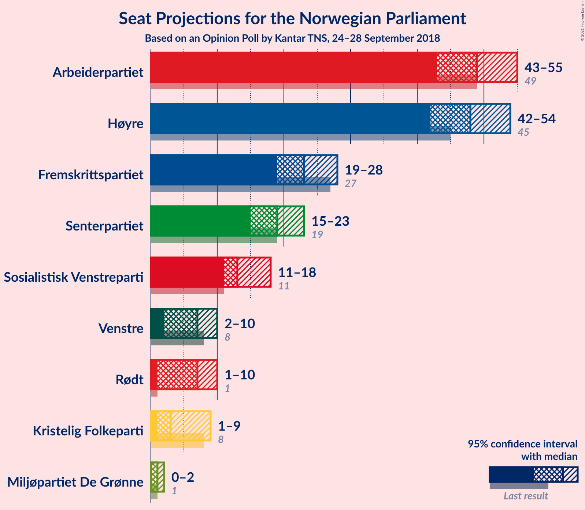
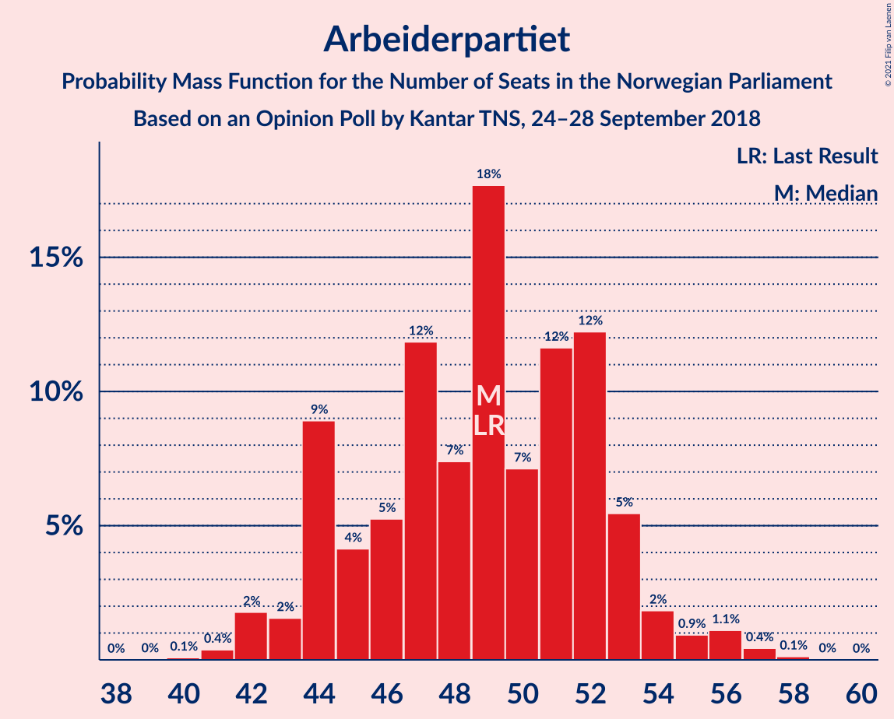
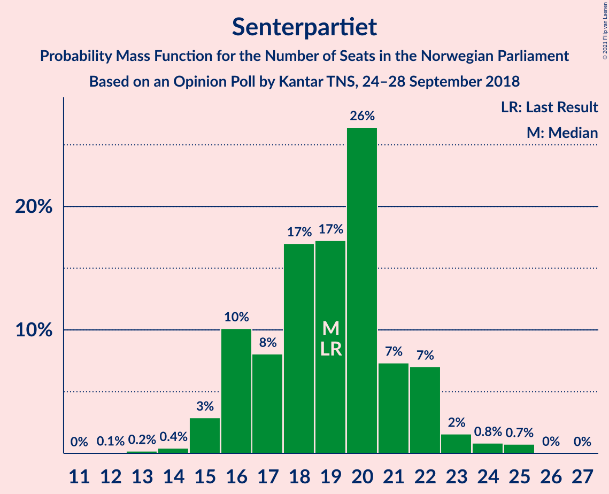
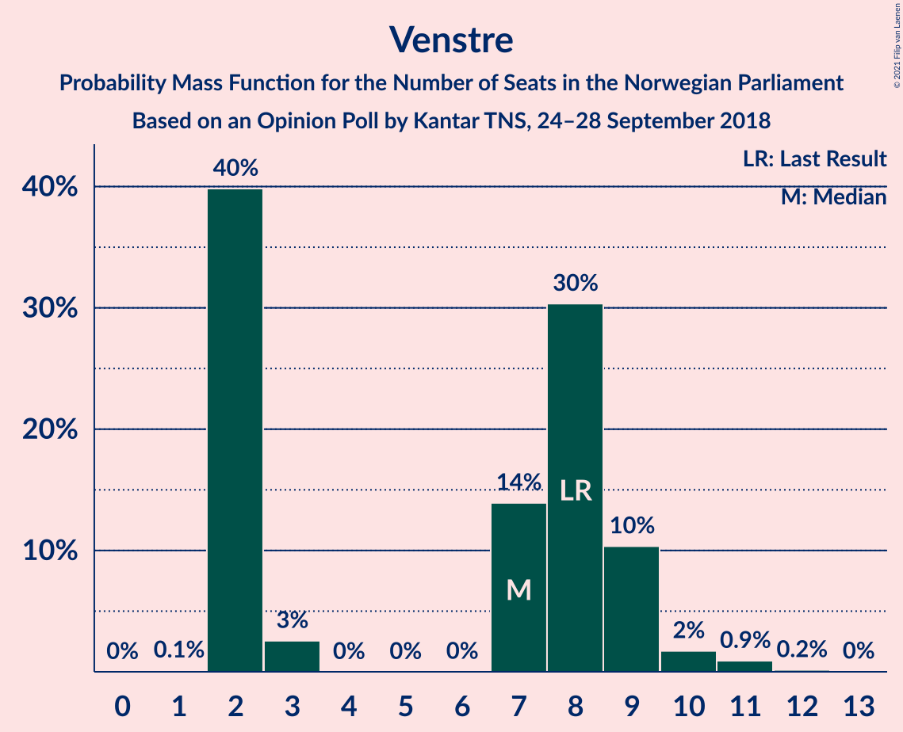
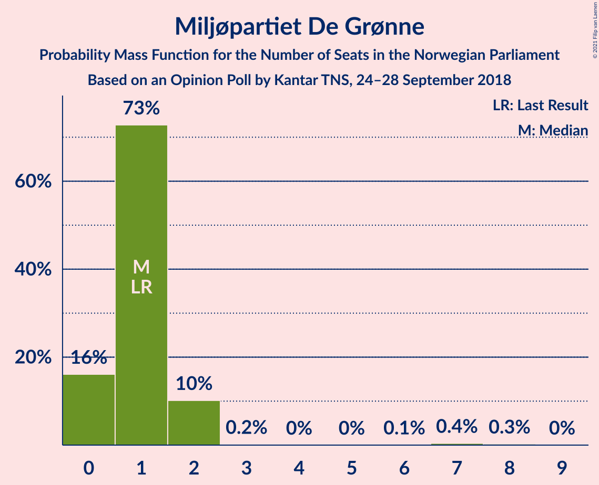
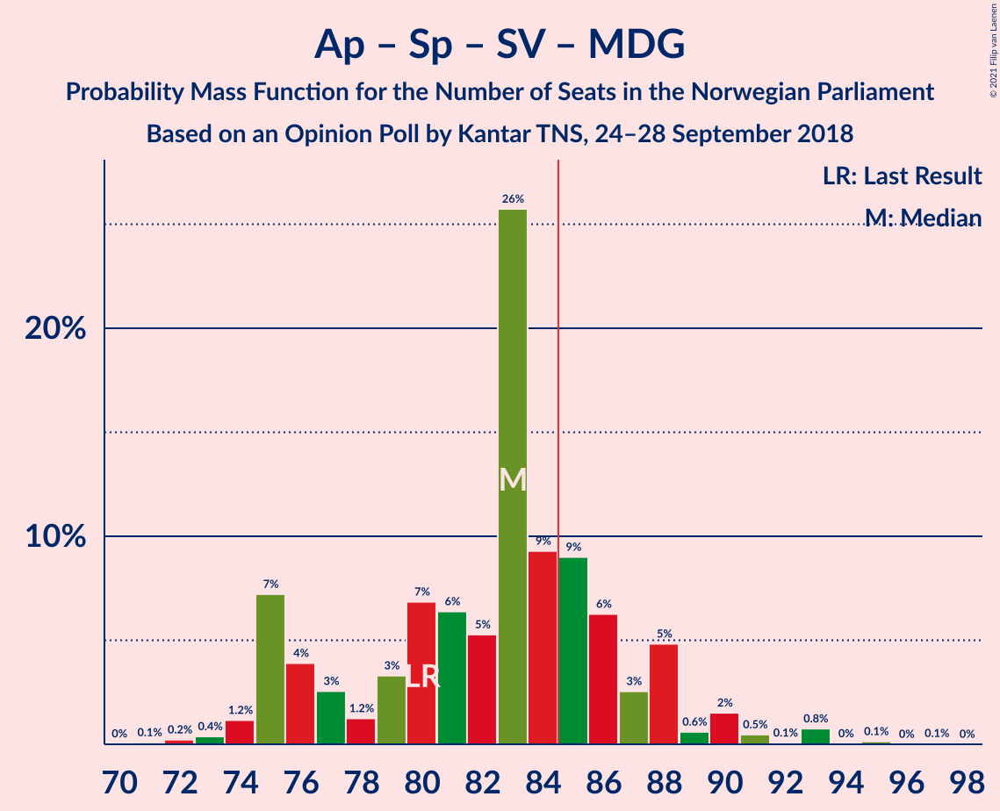
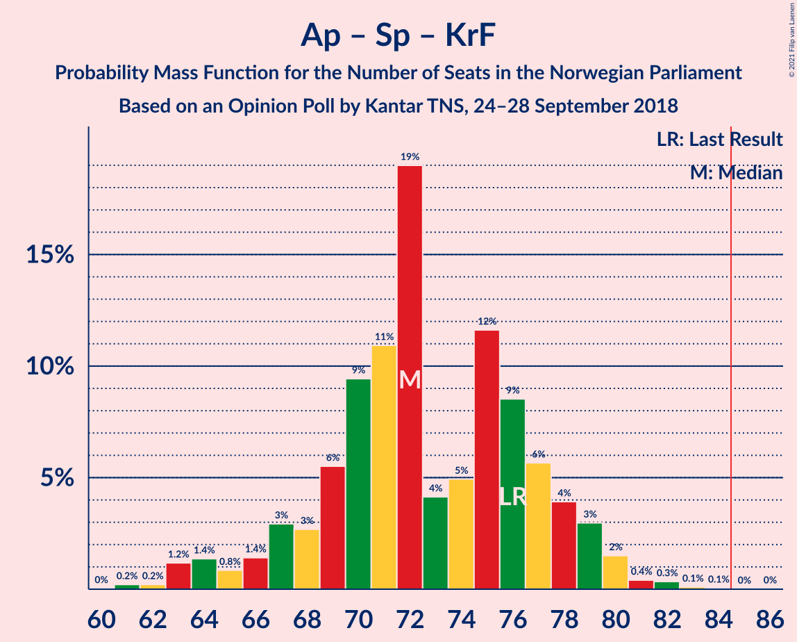

# Opinion Poll by Kantar TNS, 24–28 September 2018

<a href="#voting-intentions">Voting Intentions</a> | <a href="#seats">Seats</a> | <a href="#coalitions">Coalitions</a> | <a href="#technical-information">Technical Information</a>

## Voting Intentions

### Confidence Intervals

| Party | Last Result | Poll Result | 80% Confidence Interval | 90% Confidence Interval | 95% Confidence Interval | 99% Confidence Interval |
|:-----:|:-----------:|:-----------:|:-----------------------:|:-----------------------:|:-----------------------:|:-----------------------:|
| Arbeiderpartiet | 27.4% | 26.8% | 24.9–28.9% |24.3–29.5% |23.8–30.0% |22.9–31.0% |
| Høyre | 25.0% | 26.8% | 24.9–28.9% |24.3–29.5% |23.8–30.0% |22.9–31.0% |
| Fremskrittspartiet | 15.2% | 12.7% | 11.3–14.4% |10.9–14.8% |10.6–15.2% |9.9–16.0% |
| Senterpartiet | 10.3% | 10.4% | 9.1–11.9% |8.8–12.4% |8.5–12.8% |7.9–13.5% |
| Sosialistisk Venstreparti | 6.0% | 7.6% | 6.5–9.0% |6.2–9.4% |6.0–9.7% |5.5–10.4% |
| Rødt | 2.4% | 4.1% | 3.3–5.1% |3.1–5.4% |2.9–5.7% |2.6–6.2% |
| Venstre | 4.4% | 4.1% | 3.3–5.1% |3.1–5.4% |2.9–5.7% |2.6–6.2% |
| Kristelig Folkeparti | 4.2% | 3.8% | 3.1–4.8% |2.9–5.1% |2.7–5.4% |2.4–5.9% |
| Miljøpartiet De Grønne | 3.2% | 2.4% | 1.8–3.3% |1.7–3.5% |1.6–3.7% |1.3–4.2% |

*Note:* The poll result column reflects the actual value used in the calculations. Published results may vary slightly, and in addition be rounded to fewer digits.

## Seats

### Confidence Intervals

| Party | Last Result | Median | 80% Confidence Interval | 90% Confidence Interval | 95% Confidence Interval | 99% Confidence Interval |
|:-----:|:-----------:|:------:|:-----------------------:|:-----------------------:|:-----------------------:|:-----------------------:|
| <a href="#arbeiderpartiet">Arbeiderpartiet</a> | 49 | 49 | 44–52 |44–53 |43–55 |42–57 |
| <a href="#høyre">Høyre</a> | 45 | 48 | 44–52 |43–53 |42–54 |41–56 |
| <a href="#fremskrittspartiet">Fremskrittspartiet</a> | 27 | 23 | 19–26 |19–26 |19–28 |17–30 |
| <a href="#senterpartiet">Senterpartiet</a> | 19 | 19 | 16–22 |16–22 |15–23 |14–25 |
| <a href="#sosialistisk-venstreparti">Sosialistisk Venstreparti</a> | 11 | 13 | 11–16 |11–17 |11–18 |10–19 |
| <a href="#rødt">Rødt</a> | 1 | 7 | 2–9 |2–10 |1–10 |1–11 |
| <a href="#venstre">Venstre</a> | 8 | 7 | 2–9 |2–9 |2–10 |2–11 |
| <a href="#kristelig-folkeparti">Kristelig Folkeparti</a> | 8 | 3 | 2–8 |1–9 |1–9 |1–10 |
| <a href="#miljøpartiet-de-grønne">Miljøpartiet De Grønne</a> | 1 | 1 | 0–2 |0–2 |0–2 |0–7 |

### Arbeiderpartiet

*For a full overview of the results for this party, see the [Arbeiderpartiet](party-arbeiderpartiet.html) page.*

| Number of Seats | Probability | Accumulated | Special Marks |
|:---------------:|:-----------:|:-----------:|:-------------:|
| 40 | 0.1% | 100% |  |
| 41 | 0.4% | 99.9% |  |
| 42 | 2% | 99.5% |  |
| 43 | 2% | 98% |  |
| 44 | 9% | 96% |  |
| 45 | 4% | 87% |  |
| 46 | 5% | 83% |  |
| 47 | 12% | 78% |  |
| 48 | 7% | 66% |  |
| 49 | 18% | 59% | Last Result, Median |
| 50 | 7% | 41% |  |
| 51 | 12% | 34% |  |
| 52 | 12% | 22% |  |
| 53 | 5% | 10% |  |
| 54 | 2% | 4% |  |
| 55 | 0.9% | 3% |  |
| 56 | 1.1% | 2% |  |
| 57 | 0.4% | 0.6% |  |
| 58 | 0.1% | 0.2% |  |
| 59 | 0% | 0% |  |

### Høyre

*For a full overview of the results for this party, see the [Høyre](party-høyre.html) page.*

| Number of Seats | Probability | Accumulated | Special Marks |
|:---------------:|:-----------:|:-----------:|:-------------:|
| 38 | 0% | 100% |  |
| 39 | 0.1% | 99.9% |  |
| 40 | 0.2% | 99.9% |  |
| 41 | 1.1% | 99.7% |  |
| 42 | 3% | 98.6% |  |
| 43 | 4% | 96% |  |
| 44 | 8% | 92% |  |
| 45 | 9% | 84% | Last Result |
| 46 | 6% | 75% |  |
| 47 | 7% | 69% |  |
| 48 | 15% | 62% | Median |
| 49 | 15% | 47% |  |
| 50 | 5% | 32% |  |
| 51 | 9% | 27% |  |
| 52 | 9% | 18% |  |
| 53 | 5% | 9% |  |
| 54 | 1.2% | 4% |  |
| 55 | 1.2% | 2% |  |
| 56 | 0.9% | 1.2% |  |
| 57 | 0.2% | 0.3% |  |
| 58 | 0% | 0.1% |  |
| 59 | 0.1% | 0.1% |  |
| 60 | 0% | 0% |  |

### Fremskrittspartiet

*For a full overview of the results for this party, see the [Fremskrittspartiet](party-fremskrittspartiet.html) page.*

| Number of Seats | Probability | Accumulated | Special Marks |
|:---------------:|:-----------:|:-----------:|:-------------:|
| 16 | 0.2% | 100% |  |
| 17 | 0.5% | 99.8% |  |
| 18 | 1.4% | 99.3% |  |
| 19 | 8% | 98% |  |
| 20 | 6% | 90% |  |
| 21 | 13% | 84% |  |
| 22 | 17% | 71% |  |
| 23 | 14% | 54% | Median |
| 24 | 6% | 40% |  |
| 25 | 18% | 34% |  |
| 26 | 11% | 16% |  |
| 27 | 2% | 5% | Last Result |
| 28 | 1.4% | 3% |  |
| 29 | 1.2% | 2% |  |
| 30 | 0.1% | 0.5% |  |
| 31 | 0.4% | 0.4% |  |
| 32 | 0% | 0% |  |

### Senterpartiet

*For a full overview of the results for this party, see the [Senterpartiet](party-senterpartiet.html) page.*

| Number of Seats | Probability | Accumulated | Special Marks |
|:---------------:|:-----------:|:-----------:|:-------------:|
| 12 | 0.1% | 100% |  |
| 13 | 0.2% | 99.9% |  |
| 14 | 0.4% | 99.7% |  |
| 15 | 3% | 99.3% |  |
| 16 | 10% | 96% |  |
| 17 | 8% | 86% |  |
| 18 | 17% | 78% |  |
| 19 | 17% | 61% | Last Result, Median |
| 20 | 26% | 44% |  |
| 21 | 7% | 18% |  |
| 22 | 7% | 10% |  |
| 23 | 2% | 3% |  |
| 24 | 0.8% | 2% |  |
| 25 | 0.7% | 0.8% |  |
| 26 | 0% | 0.1% |  |
| 27 | 0% | 0% |  |

### Sosialistisk Venstreparti

*For a full overview of the results for this party, see the [Sosialistisk Venstreparti](party-sosialistiskvenstreparti.html) page.*

| Number of Seats | Probability | Accumulated | Special Marks |
|:---------------:|:-----------:|:-----------:|:-------------:|
| 9 | 0.3% | 100% |  |
| 10 | 2% | 99.7% |  |
| 11 | 12% | 98% | Last Result |
| 12 | 15% | 86% |  |
| 13 | 26% | 71% | Median |
| 14 | 18% | 45% |  |
| 15 | 15% | 27% |  |
| 16 | 4% | 12% |  |
| 17 | 3% | 8% |  |
| 18 | 4% | 5% |  |
| 19 | 0.3% | 0.6% |  |
| 20 | 0.3% | 0.4% |  |
| 21 | 0% | 0% |  |

### Rødt

*For a full overview of the results for this party, see the [Rødt](party-rødt.html) page.*

| Number of Seats | Probability | Accumulated | Special Marks |
|:---------------:|:-----------:|:-----------:|:-------------:|
| 1 | 4% | 100% | Last Result |
| 2 | 42% | 96% |  |
| 3 | 0% | 53% |  |
| 4 | 0% | 53% |  |
| 5 | 0% | 53% |  |
| 6 | 0% | 53% |  |
| 7 | 18% | 53% | Median |
| 8 | 19% | 35% |  |
| 9 | 8% | 16% |  |
| 10 | 7% | 8% |  |
| 11 | 1.0% | 1.2% |  |
| 12 | 0.1% | 0.2% |  |
| 13 | 0.1% | 0.1% |  |
| 14 | 0% | 0% |  |

### Venstre

*For a full overview of the results for this party, see the [Venstre](party-venstre.html) page.*

| Number of Seats | Probability | Accumulated | Special Marks |
|:---------------:|:-----------:|:-----------:|:-------------:|
| 1 | 0.1% | 100% |  |
| 2 | 40% | 99.9% |  |
| 3 | 3% | 60% |  |
| 4 | 0% | 57% |  |
| 5 | 0% | 57% |  |
| 6 | 0% | 57% |  |
| 7 | 14% | 57% | Median |
| 8 | 30% | 44% | Last Result |
| 9 | 10% | 13% |  |
| 10 | 2% | 3% |  |
| 11 | 0.9% | 1.1% |  |
| 12 | 0.2% | 0.2% |  |
| 13 | 0% | 0% |  |

### Kristelig Folkeparti

*For a full overview of the results for this party, see the [Kristelig Folkeparti](party-kristeligfolkeparti.html) page.*

| Number of Seats | Probability | Accumulated | Special Marks |
|:---------------:|:-----------:|:-----------:|:-------------:|
| 0 | 0.2% | 100% |  |
| 1 | 8% | 99.8% |  |
| 2 | 4% | 91% |  |
| 3 | 44% | 87% | Median |
| 4 | 0% | 43% |  |
| 5 | 0% | 43% |  |
| 6 | 0% | 43% |  |
| 7 | 19% | 43% |  |
| 8 | 18% | 24% | Last Result |
| 9 | 5% | 6% |  |
| 10 | 0.7% | 1.1% |  |
| 11 | 0.3% | 0.4% |  |
| 12 | 0.1% | 0.1% |  |
| 13 | 0% | 0% |  |

### Miljøpartiet De Grønne

*For a full overview of the results for this party, see the [Miljøpartiet De Grønne](party-miljøpartietdegrønne.html) page.*

| Number of Seats | Probability | Accumulated | Special Marks |
|:---------------:|:-----------:|:-----------:|:-------------:|
| 0 | 16% | 100% |  |
| 1 | 73% | 84% | Last Result, Median |
| 2 | 10% | 11% |  |
| 3 | 0.2% | 0.9% |  |
| 4 | 0% | 0.8% |  |
| 5 | 0% | 0.8% |  |
| 6 | 0.1% | 0.8% |  |
| 7 | 0.4% | 0.7% |  |
| 8 | 0.3% | 0.3% |  |
| 9 | 0% | 0% |  |

## Coalitions

### Confidence Intervals

| Coalition | Last Result | Median | Majority? | 80% Confidence Interval | 90% Confidence Interval | 95% Confidence Interval | 99% Confidence Interval |
|:---------:|:-----------:|:------:|:---------:|:-----------------------:|:-----------------------:|:-----------------------:|:-----------------------:|
| Høyre – Fremskrittspartiet – Senterpartiet – Venstre – Kristelig Folkeparti | 107 | 101 | 100% | 95–106 | 94–107 | 92–107 | 90–109 |
| Arbeiderpartiet – Senterpartiet – Sosialistisk Venstreparti – Rødt – Miljøpartiet De Grønne | 81 | 87 | 73% | 82–93 | 82–95 | 81–96 | 78–99 |
| Arbeiderpartiet – Senterpartiet – Sosialistisk Venstreparti – Rødt | 80 | 86 | 61% | 81–92 | 81–94 | 80–95 | 77–98 |
| Arbeiderpartiet – Senterpartiet – Sosialistisk Venstreparti – Kristelig Folkeparti – Miljøpartiet De Grønne | 88 | 87 | 76% | 82–92 | 81–93 | 79–94 | 77–97 |
| Arbeiderpartiet – Senterpartiet – Sosialistisk Venstreparti – Miljøpartiet De Grønne | 80 | 83 | 26% | 76–87 | 75–88 | 75–90 | 73–93 |
| Arbeiderpartiet – Senterpartiet – Sosialistisk Venstreparti | 79 | 82 | 19% | 75–86 | 74–87 | 74–89 | 72–92 |
| Høyre – Fremskrittspartiet – Venstre – Kristelig Folkeparti – Miljøpartiet De Grønne | 89 | 83 | 39% | 77–88 | 75–88 | 74–89 | 71–92 |
| Høyre – Fremskrittspartiet – Venstre – Kristelig Folkeparti | 88 | 82 | 27% | 76–87 | 74–87 | 73–88 | 70–91 |
| Høyre – Fremskrittspartiet – Venstre | 80 | 77 | 1.3% | 71–82 | 70–83 | 69–83 | 66–86 |
| Arbeiderpartiet – Senterpartiet – Kristelig Folkeparti – Miljøpartiet De Grønne | 77 | 73 | 0.1% | 69–79 | 67–80 | 65–81 | 64–83 |
| Arbeiderpartiet – Senterpartiet – Kristelig Folkeparti | 76 | 72 | 0% | 68–77 | 66–79 | 64–79 | 63–82 |
| Høyre – Fremskrittspartiet | 72 | 71 | 0% | 65–76 | 63–78 | 63–79 | 62–81 |
| Arbeiderpartiet – Senterpartiet | 68 | 69 | 0% | 63–72 | 61–73 | 60–74 | 59–77 |
| Arbeiderpartiet – Sosialistisk Venstreparti | 60 | 62 | 0% | 57–67 | 55–67 | 55–69 | 54–71 |
| Høyre – Venstre – Kristelig Folkeparti | 61 | 59 | 0% | 53–64 | 51–66 | 51–66 | 47–68 |
| Senterpartiet – Venstre – Kristelig Folkeparti | 35 | 29 | 0% | 24–35 | 23–37 | 22–37 | 20–38 |

### Høyre – Fremskrittspartiet – Senterpartiet – Venstre – Kristelig Folkeparti

| Number of Seats | Probability | Accumulated | Special Marks |
|:---------------:|:-----------:|:-----------:|:-------------:|
| 87 | 0% | 100% |  |
| 88 | 0.1% | 99.9% |  |
| 89 | 0.2% | 99.8% |  |
| 90 | 0.8% | 99.6% |  |
| 91 | 0.7% | 98.8% |  |
| 92 | 1.5% | 98% |  |
| 93 | 0.9% | 97% |  |
| 94 | 3% | 96% |  |
| 95 | 10% | 93% |  |
| 96 | 12% | 83% |  |
| 97 | 6% | 71% |  |
| 98 | 1.4% | 65% |  |
| 99 | 8% | 63% |  |
| 100 | 5% | 56% | Median |
| 101 | 4% | 50% |  |
| 102 | 4% | 46% |  |
| 103 | 10% | 42% |  |
| 104 | 10% | 33% |  |
| 105 | 3% | 22% |  |
| 106 | 11% | 19% |  |
| 107 | 5% | 8% | Last Result |
| 108 | 2% | 2% |  |
| 109 | 0.2% | 0.7% |  |
| 110 | 0.3% | 0.4% |  |
| 111 | 0.1% | 0.1% |  |
| 112 | 0% | 0.1% |  |
| 113 | 0% | 0% |  |

### Arbeiderpartiet – Senterpartiet – Sosialistisk Venstreparti – Rødt – Miljøpartiet De Grønne

| Number of Seats | Probability | Accumulated | Special Marks |
|:---------------:|:-----------:|:-----------:|:-------------:|
| 75 | 0.1% | 100% |  |
| 76 | 0.1% | 99.9% |  |
| 77 | 0.3% | 99.9% |  |
| 78 | 0.8% | 99.6% |  |
| 79 | 0.7% | 98.8% |  |
| 80 | 0.5% | 98% |  |
| 81 | 2% | 98% | Last Result |
| 82 | 12% | 95% |  |
| 83 | 5% | 83% |  |
| 84 | 5% | 78% |  |
| 85 | 12% | 73% | Majority |
| 86 | 7% | 61% |  |
| 87 | 5% | 54% |  |
| 88 | 3% | 49% |  |
| 89 | 7% | 45% | Median |
| 90 | 11% | 38% |  |
| 91 | 5% | 27% |  |
| 92 | 5% | 22% |  |
| 93 | 9% | 17% |  |
| 94 | 2% | 8% |  |
| 95 | 3% | 6% |  |
| 96 | 0.4% | 3% |  |
| 97 | 0.8% | 2% |  |
| 98 | 0.9% | 1.4% |  |
| 99 | 0.3% | 0.5% |  |
| 100 | 0.2% | 0.2% |  |
| 101 | 0% | 0% |  |

### Arbeiderpartiet – Senterpartiet – Sosialistisk Venstreparti – Rødt

| Number of Seats | Probability | Accumulated | Special Marks |
|:---------------:|:-----------:|:-----------:|:-------------:|
| 74 | 0% | 100% |  |
| 75 | 0.1% | 99.9% |  |
| 76 | 0.1% | 99.8% |  |
| 77 | 0.4% | 99.7% |  |
| 78 | 1.2% | 99.3% |  |
| 79 | 0.5% | 98% |  |
| 80 | 2% | 98% | Last Result |
| 81 | 12% | 95% |  |
| 82 | 5% | 83% |  |
| 83 | 6% | 78% |  |
| 84 | 12% | 72% |  |
| 85 | 8% | 61% | Majority |
| 86 | 4% | 52% |  |
| 87 | 4% | 49% |  |
| 88 | 8% | 45% | Median |
| 89 | 5% | 37% |  |
| 90 | 12% | 31% |  |
| 91 | 3% | 20% |  |
| 92 | 8% | 17% |  |
| 93 | 3% | 9% |  |
| 94 | 3% | 6% |  |
| 95 | 0.5% | 3% |  |
| 96 | 0.8% | 2% |  |
| 97 | 0.7% | 1.4% |  |
| 98 | 0.4% | 0.6% |  |
| 99 | 0.2% | 0.2% |  |
| 100 | 0% | 0% |  |

### Arbeiderpartiet – Senterpartiet – Sosialistisk Venstreparti – Kristelig Folkeparti – Miljøpartiet De Grønne

| Number of Seats | Probability | Accumulated | Special Marks |
|:---------------:|:-----------:|:-----------:|:-------------:|
| 75 | 0% | 100% |  |
| 76 | 0.1% | 99.9% |  |
| 77 | 0.6% | 99.8% |  |
| 78 | 0.9% | 99.2% |  |
| 79 | 2% | 98% |  |
| 80 | 0.8% | 96% |  |
| 81 | 1.2% | 95% |  |
| 82 | 7% | 94% |  |
| 83 | 2% | 87% |  |
| 84 | 9% | 85% |  |
| 85 | 3% | 76% | Median, Majority |
| 86 | 19% | 73% |  |
| 87 | 6% | 54% |  |
| 88 | 13% | 48% | Last Result |
| 89 | 6% | 35% |  |
| 90 | 10% | 29% |  |
| 91 | 8% | 19% |  |
| 92 | 3% | 10% |  |
| 93 | 2% | 7% |  |
| 94 | 3% | 5% |  |
| 95 | 0.2% | 2% |  |
| 96 | 1.0% | 2% |  |
| 97 | 0.5% | 0.7% |  |
| 98 | 0% | 0.2% |  |
| 99 | 0.1% | 0.2% |  |
| 100 | 0% | 0.1% |  |
| 101 | 0% | 0.1% |  |
| 102 | 0% | 0% |  |

### Arbeiderpartiet – Senterpartiet – Sosialistisk Venstreparti – Miljøpartiet De Grønne

| Number of Seats | Probability | Accumulated | Special Marks |
|:---------------:|:-----------:|:-----------:|:-------------:|
| 71 | 0.1% | 100% |  |
| 72 | 0.2% | 99.9% |  |
| 73 | 0.4% | 99.6% |  |
| 74 | 1.2% | 99.3% |  |
| 75 | 7% | 98% |  |
| 76 | 4% | 91% |  |
| 77 | 3% | 87% |  |
| 78 | 1.2% | 84% |  |
| 79 | 3% | 83% |  |
| 80 | 7% | 80% | Last Result |
| 81 | 6% | 73% |  |
| 82 | 5% | 67% | Median |
| 83 | 26% | 61% |  |
| 84 | 9% | 36% |  |
| 85 | 9% | 26% | Majority |
| 86 | 6% | 17% |  |
| 87 | 3% | 11% |  |
| 88 | 5% | 9% |  |
| 89 | 0.6% | 4% |  |
| 90 | 2% | 3% |  |
| 91 | 0.5% | 2% |  |
| 92 | 0.1% | 1.1% |  |
| 93 | 0.8% | 1.0% |  |
| 94 | 0% | 0.3% |  |
| 95 | 0.1% | 0.2% |  |
| 96 | 0% | 0.1% |  |
| 97 | 0.1% | 0.1% |  |
| 98 | 0% | 0% |  |

### Arbeiderpartiet – Senterpartiet – Sosialistisk Venstreparti

| Number of Seats | Probability | Accumulated | Special Marks |
|:---------------:|:-----------:|:-----------:|:-------------:|
| 69 | 0% | 100% |  |
| 70 | 0.1% | 99.9% |  |
| 71 | 0.3% | 99.9% |  |
| 72 | 0.2% | 99.6% |  |
| 73 | 1.4% | 99.5% |  |
| 74 | 7% | 98% |  |
| 75 | 3% | 91% |  |
| 76 | 3% | 88% |  |
| 77 | 2% | 85% |  |
| 78 | 3% | 83% |  |
| 79 | 8% | 80% | Last Result |
| 80 | 6% | 72% |  |
| 81 | 6% | 66% | Median |
| 82 | 22% | 60% |  |
| 83 | 13% | 38% |  |
| 84 | 7% | 26% |  |
| 85 | 8% | 19% | Majority |
| 86 | 3% | 11% |  |
| 87 | 4% | 8% |  |
| 88 | 0.9% | 4% |  |
| 89 | 1.3% | 3% |  |
| 90 | 0.6% | 2% |  |
| 91 | 0.1% | 1.1% |  |
| 92 | 0.7% | 0.9% |  |
| 93 | 0% | 0.2% |  |
| 94 | 0.1% | 0.2% |  |
| 95 | 0% | 0.1% |  |
| 96 | 0% | 0% |  |

### Høyre – Fremskrittspartiet – Venstre – Kristelig Folkeparti – Miljøpartiet De Grønne

| Number of Seats | Probability | Accumulated | Special Marks |
|:---------------:|:-----------:|:-----------:|:-------------:|
| 70 | 0.2% | 100% |  |
| 71 | 0.4% | 99.8% |  |
| 72 | 0.7% | 99.4% |  |
| 73 | 0.8% | 98.6% |  |
| 74 | 0.5% | 98% |  |
| 75 | 3% | 97% |  |
| 76 | 3% | 94% |  |
| 77 | 8% | 91% |  |
| 78 | 3% | 83% |  |
| 79 | 12% | 80% |  |
| 80 | 5% | 69% |  |
| 81 | 8% | 63% |  |
| 82 | 4% | 55% | Median |
| 83 | 4% | 51% |  |
| 84 | 8% | 48% |  |
| 85 | 12% | 39% | Majority |
| 86 | 6% | 28% |  |
| 87 | 5% | 22% |  |
| 88 | 12% | 17% |  |
| 89 | 2% | 5% | Last Result |
| 90 | 0.5% | 2% |  |
| 91 | 1.2% | 2% |  |
| 92 | 0.4% | 0.7% |  |
| 93 | 0.1% | 0.3% |  |
| 94 | 0.1% | 0.2% |  |
| 95 | 0% | 0.1% |  |
| 96 | 0% | 0% |  |

### Høyre – Fremskrittspartiet – Venstre – Kristelig Folkeparti

| Number of Seats | Probability | Accumulated | Special Marks |
|:---------------:|:-----------:|:-----------:|:-------------:|
| 69 | 0.2% | 100% |  |
| 70 | 0.3% | 99.8% |  |
| 71 | 0.9% | 99.5% |  |
| 72 | 0.8% | 98.6% |  |
| 73 | 0.4% | 98% |  |
| 74 | 3% | 97% |  |
| 75 | 2% | 94% |  |
| 76 | 9% | 92% |  |
| 77 | 5% | 83% |  |
| 78 | 5% | 78% |  |
| 79 | 11% | 73% |  |
| 80 | 7% | 62% |  |
| 81 | 3% | 55% | Median |
| 82 | 5% | 51% |  |
| 83 | 7% | 46% |  |
| 84 | 12% | 39% |  |
| 85 | 5% | 27% | Majority |
| 86 | 5% | 22% |  |
| 87 | 12% | 17% |  |
| 88 | 2% | 5% | Last Result |
| 89 | 0.5% | 2% |  |
| 90 | 0.7% | 2% |  |
| 91 | 0.8% | 1.2% |  |
| 92 | 0.3% | 0.4% |  |
| 93 | 0.1% | 0.1% |  |
| 94 | 0.1% | 0.1% |  |
| 95 | 0% | 0% |  |

### Høyre – Fremskrittspartiet – Venstre

| Number of Seats | Probability | Accumulated | Special Marks |
|:---------------:|:-----------:|:-----------:|:-------------:|
| 64 | 0.1% | 100% |  |
| 65 | 0.2% | 99.8% |  |
| 66 | 0.3% | 99.7% |  |
| 67 | 0.2% | 99.4% |  |
| 68 | 0.5% | 99.1% |  |
| 69 | 3% | 98.6% |  |
| 70 | 3% | 95% |  |
| 71 | 6% | 92% |  |
| 72 | 4% | 86% |  |
| 73 | 12% | 82% |  |
| 74 | 3% | 70% |  |
| 75 | 4% | 67% |  |
| 76 | 12% | 63% |  |
| 77 | 7% | 51% |  |
| 78 | 5% | 44% | Median |
| 79 | 9% | 40% |  |
| 80 | 12% | 30% | Last Result |
| 81 | 7% | 19% |  |
| 82 | 5% | 12% |  |
| 83 | 5% | 8% |  |
| 84 | 0.9% | 2% |  |
| 85 | 0.5% | 1.3% | Majority |
| 86 | 0.5% | 0.8% |  |
| 87 | 0.2% | 0.3% |  |
| 88 | 0% | 0.1% |  |
| 89 | 0% | 0.1% |  |
| 90 | 0.1% | 0.1% |  |
| 91 | 0% | 0% |  |

### Arbeiderpartiet – Senterpartiet – Kristelig Folkeparti – Miljøpartiet De Grønne

| Number of Seats | Probability | Accumulated | Special Marks |
|:---------------:|:-----------:|:-----------:|:-------------:|
| 61 | 0% | 100% |  |
| 62 | 0.2% | 99.9% |  |
| 63 | 0.2% | 99.7% |  |
| 64 | 1.3% | 99.5% |  |
| 65 | 1.3% | 98% |  |
| 66 | 0.7% | 97% |  |
| 67 | 2% | 96% |  |
| 68 | 2% | 94% |  |
| 69 | 3% | 92% |  |
| 70 | 6% | 90% |  |
| 71 | 14% | 84% |  |
| 72 | 7% | 69% | Median |
| 73 | 17% | 62% |  |
| 74 | 5% | 45% |  |
| 75 | 6% | 40% |  |
| 76 | 11% | 35% |  |
| 77 | 8% | 24% | Last Result |
| 78 | 5% | 16% |  |
| 79 | 5% | 11% |  |
| 80 | 4% | 6% |  |
| 81 | 1.5% | 3% |  |
| 82 | 0.4% | 1.1% |  |
| 83 | 0.3% | 0.7% |  |
| 84 | 0.3% | 0.4% |  |
| 85 | 0.1% | 0.1% | Majority |
| 86 | 0% | 0% |  |

### Arbeiderpartiet – Senterpartiet – Kristelig Folkeparti

| Number of Seats | Probability | Accumulated | Special Marks |
|:---------------:|:-----------:|:-----------:|:-------------:|
| 60 | 0% | 100% |  |
| 61 | 0.2% | 99.9% |  |
| 62 | 0.2% | 99.7% |  |
| 63 | 1.2% | 99.5% |  |
| 64 | 1.4% | 98% |  |
| 65 | 0.8% | 97% |  |
| 66 | 1.4% | 96% |  |
| 67 | 3% | 95% |  |
| 68 | 3% | 92% |  |
| 69 | 6% | 89% |  |
| 70 | 9% | 84% |  |
| 71 | 11% | 74% | Median |
| 72 | 19% | 63% |  |
| 73 | 4% | 44% |  |
| 74 | 5% | 40% |  |
| 75 | 12% | 35% |  |
| 76 | 9% | 24% | Last Result |
| 77 | 6% | 15% |  |
| 78 | 4% | 9% |  |
| 79 | 3% | 5% |  |
| 80 | 2% | 2% |  |
| 81 | 0.4% | 0.9% |  |
| 82 | 0.3% | 0.5% |  |
| 83 | 0.1% | 0.2% |  |
| 84 | 0.1% | 0.1% |  |
| 85 | 0% | 0% | Majority |

### Høyre – Fremskrittspartiet

| Number of Seats | Probability | Accumulated | Special Marks |
|:---------------:|:-----------:|:-----------:|:-------------:|
| 59 | 0% | 100% |  |
| 60 | 0.3% | 99.9% |  |
| 61 | 0.1% | 99.7% |  |
| 62 | 0.8% | 99.6% |  |
| 63 | 5% | 98.8% |  |
| 64 | 3% | 93% |  |
| 65 | 1.4% | 90% |  |
| 66 | 3% | 89% |  |
| 67 | 5% | 86% |  |
| 68 | 7% | 81% |  |
| 69 | 5% | 74% |  |
| 70 | 11% | 68% |  |
| 71 | 10% | 57% | Median |
| 72 | 4% | 47% | Last Result |
| 73 | 13% | 43% |  |
| 74 | 9% | 29% |  |
| 75 | 8% | 20% |  |
| 76 | 4% | 12% |  |
| 77 | 1.3% | 9% |  |
| 78 | 4% | 7% |  |
| 79 | 1.4% | 3% |  |
| 80 | 0.3% | 2% |  |
| 81 | 1.2% | 1.3% |  |
| 82 | 0.1% | 0.2% |  |
| 83 | 0% | 0.1% |  |
| 84 | 0% | 0% |  |

### Arbeiderpartiet – Senterpartiet

| Number of Seats | Probability | Accumulated | Special Marks |
|:---------------:|:-----------:|:-----------:|:-------------:|
| 57 | 0% | 100% |  |
| 58 | 0.3% | 99.9% |  |
| 59 | 0.5% | 99.6% |  |
| 60 | 2% | 99.1% |  |
| 61 | 2% | 97% |  |
| 62 | 2% | 95% |  |
| 63 | 10% | 93% |  |
| 64 | 4% | 83% |  |
| 65 | 4% | 79% |  |
| 66 | 5% | 75% |  |
| 67 | 7% | 70% |  |
| 68 | 12% | 63% | Last Result, Median |
| 69 | 23% | 51% |  |
| 70 | 6% | 28% |  |
| 71 | 9% | 22% |  |
| 72 | 7% | 13% |  |
| 73 | 3% | 6% |  |
| 74 | 0.8% | 3% |  |
| 75 | 0.5% | 2% |  |
| 76 | 0.2% | 1.2% |  |
| 77 | 0.7% | 1.0% |  |
| 78 | 0.2% | 0.3% |  |
| 79 | 0.1% | 0.1% |  |
| 80 | 0% | 0% |  |

### Arbeiderpartiet – Sosialistisk Venstreparti

| Number of Seats | Probability | Accumulated | Special Marks |
|:---------------:|:-----------:|:-----------:|:-------------:|
| 52 | 0.1% | 100% |  |
| 53 | 0.3% | 99.9% |  |
| 54 | 0.4% | 99.6% |  |
| 55 | 7% | 99.2% |  |
| 56 | 1.1% | 92% |  |
| 57 | 2% | 91% |  |
| 58 | 3% | 89% |  |
| 59 | 9% | 86% |  |
| 60 | 8% | 77% | Last Result |
| 61 | 3% | 69% |  |
| 62 | 19% | 67% | Median |
| 63 | 8% | 48% |  |
| 64 | 12% | 40% |  |
| 65 | 8% | 28% |  |
| 66 | 5% | 20% |  |
| 67 | 11% | 15% |  |
| 68 | 1.3% | 4% |  |
| 69 | 0.7% | 3% |  |
| 70 | 1.1% | 2% |  |
| 71 | 0.9% | 1.4% |  |
| 72 | 0.2% | 0.4% |  |
| 73 | 0.1% | 0.2% |  |
| 74 | 0% | 0.1% |  |
| 75 | 0% | 0.1% |  |
| 76 | 0% | 0% |  |

### Høyre – Venstre – Kristelig Folkeparti

| Number of Seats | Probability | Accumulated | Special Marks |
|:---------------:|:-----------:|:-----------:|:-------------:|
| 46 | 0.1% | 100% |  |
| 47 | 0.7% | 99.9% |  |
| 48 | 0.3% | 99.2% |  |
| 49 | 0.9% | 98.9% |  |
| 50 | 0.4% | 98% |  |
| 51 | 4% | 98% |  |
| 52 | 2% | 93% |  |
| 53 | 7% | 91% |  |
| 54 | 8% | 84% |  |
| 55 | 2% | 77% |  |
| 56 | 9% | 74% |  |
| 57 | 8% | 65% |  |
| 58 | 6% | 57% | Median |
| 59 | 8% | 52% |  |
| 60 | 7% | 44% |  |
| 61 | 5% | 37% | Last Result |
| 62 | 15% | 32% |  |
| 63 | 6% | 17% |  |
| 64 | 2% | 11% |  |
| 65 | 2% | 9% |  |
| 66 | 5% | 7% |  |
| 67 | 0.9% | 2% |  |
| 68 | 0.3% | 0.7% |  |
| 69 | 0.1% | 0.4% |  |
| 70 | 0.2% | 0.3% |  |
| 71 | 0.1% | 0.1% |  |
| 72 | 0% | 0% |  |

### Senterpartiet – Venstre – Kristelig Folkeparti

| Number of Seats | Probability | Accumulated | Special Marks |
|:---------------:|:-----------:|:-----------:|:-------------:|
| 18 | 0.1% | 100% |  |
| 19 | 0.2% | 99.9% |  |
| 20 | 0.8% | 99.7% |  |
| 21 | 1.4% | 98.9% |  |
| 22 | 1.4% | 98% |  |
| 23 | 4% | 96% |  |
| 24 | 4% | 92% |  |
| 25 | 12% | 88% |  |
| 26 | 6% | 76% |  |
| 27 | 8% | 70% |  |
| 28 | 7% | 63% |  |
| 29 | 7% | 56% | Median |
| 30 | 5% | 48% |  |
| 31 | 9% | 44% |  |
| 32 | 7% | 34% |  |
| 33 | 12% | 27% |  |
| 34 | 4% | 15% |  |
| 35 | 2% | 11% | Last Result |
| 36 | 3% | 9% |  |
| 37 | 5% | 6% |  |
| 38 | 0.3% | 0.6% |  |
| 39 | 0.1% | 0.3% |  |
| 40 | 0.1% | 0.2% |  |
| 41 | 0.1% | 0.1% |  |
| 42 | 0% | 0% |  |

## Technical Information

### Opinion Poll

+ **Polling firm:** Kantar TNS
+ **Commissioner(s):** —
+ **Fieldwork period:** 24–28 September 2018

### Calculations

+ **Sample size:** 787
+ **Simulations done:** 524,288
+ **Error estimate:** 4.04%

