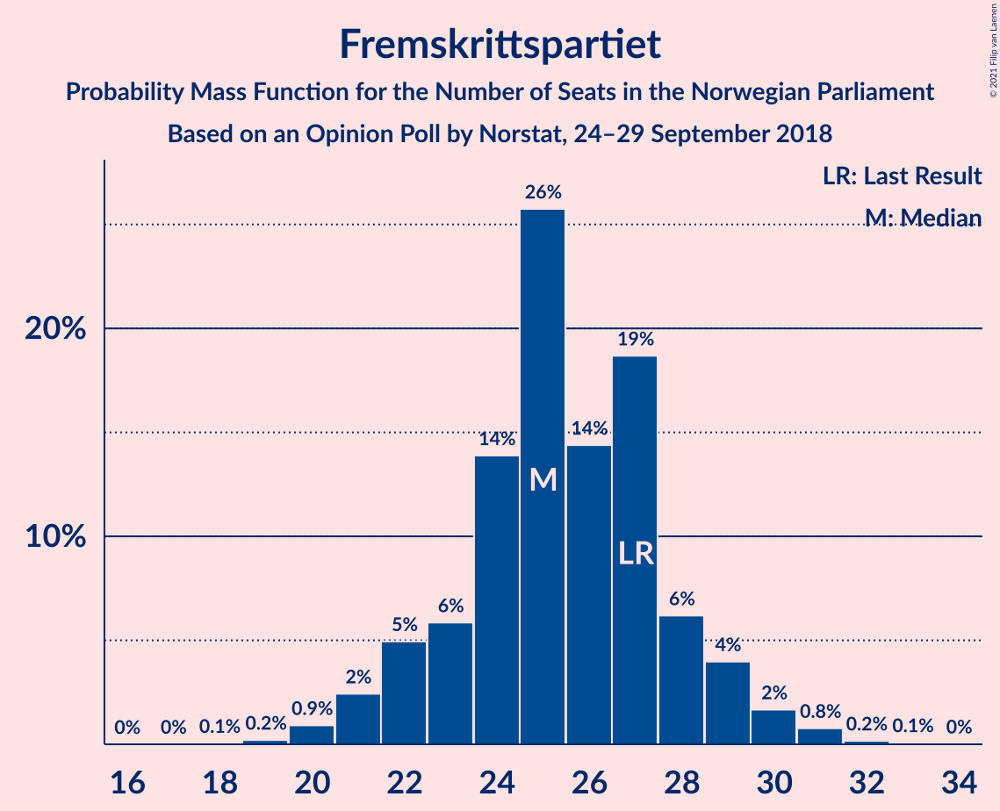
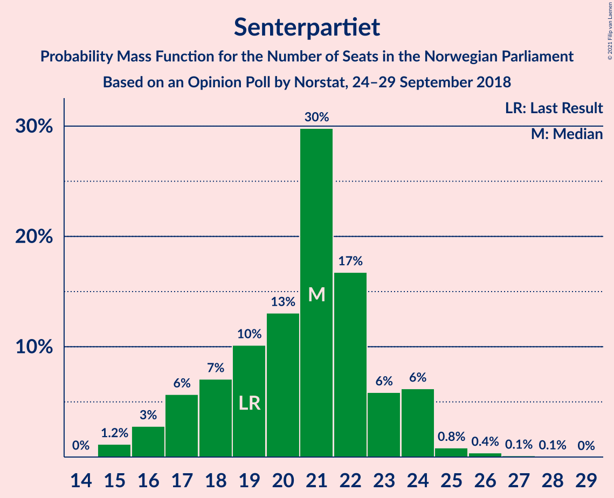
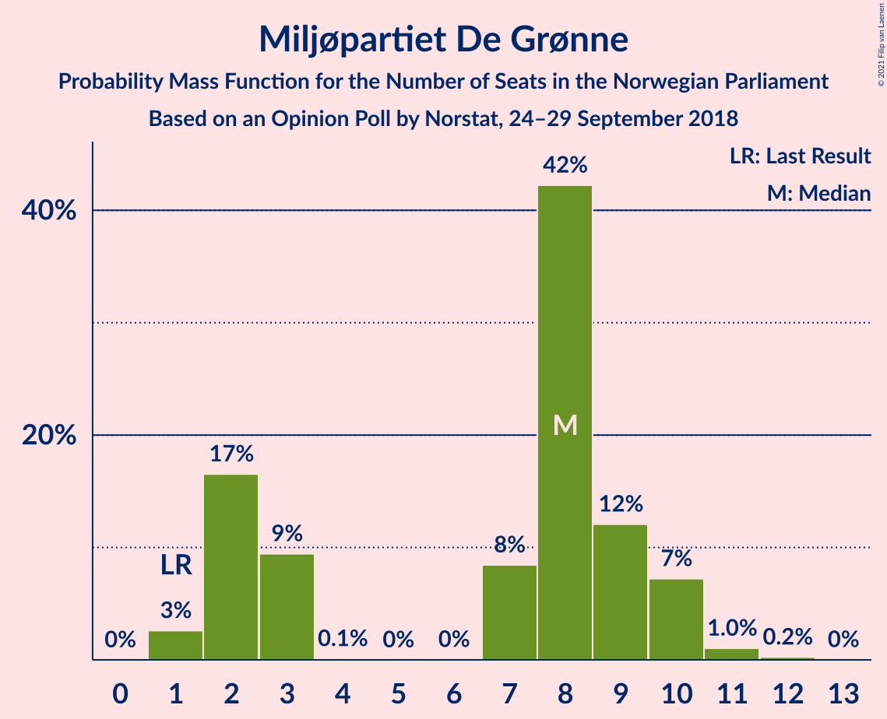
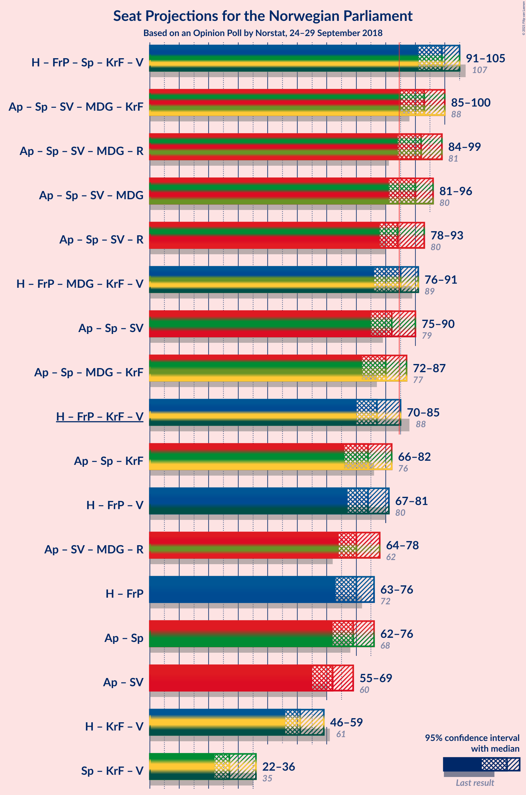
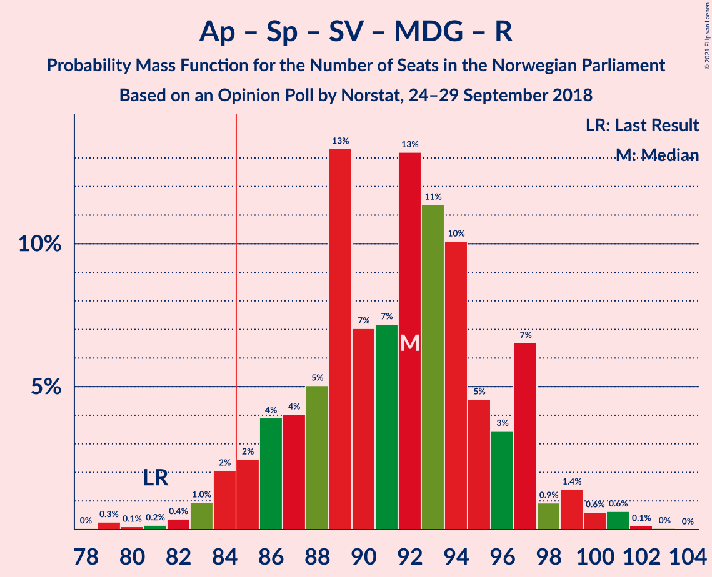
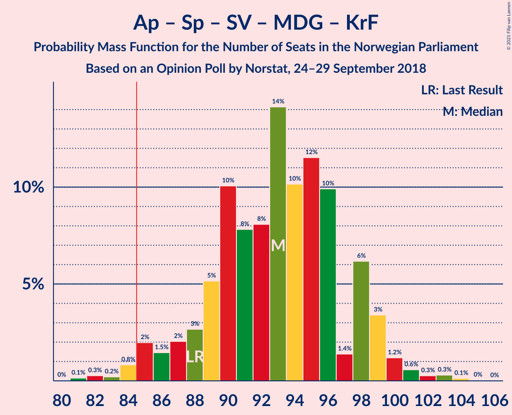
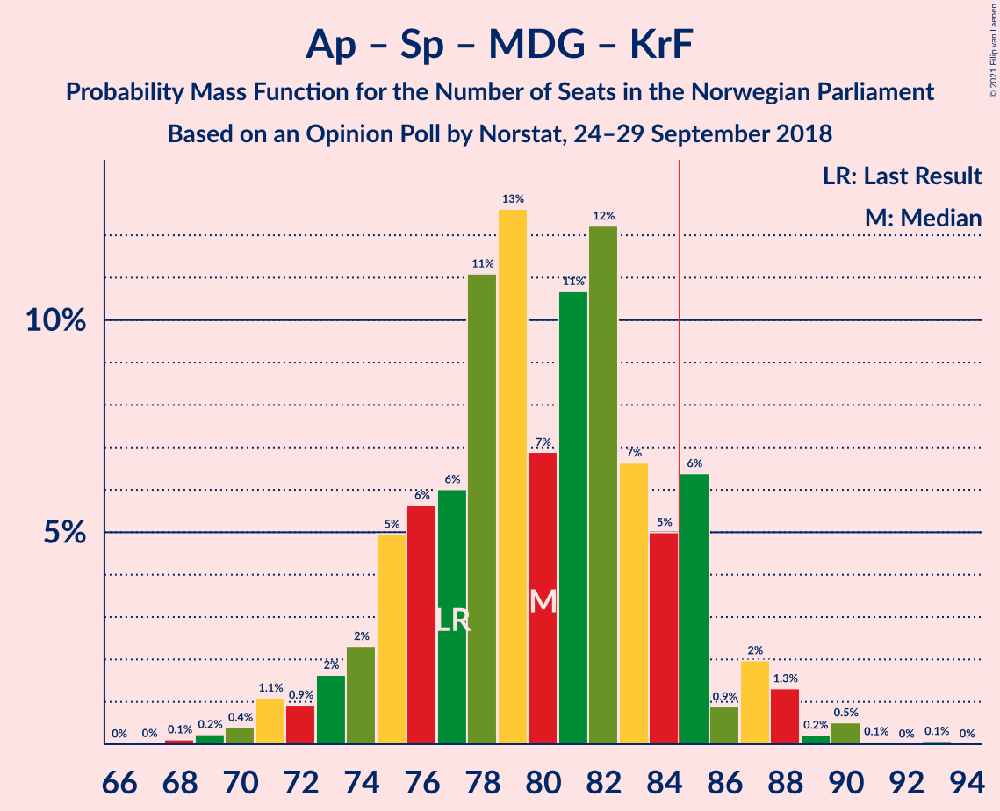
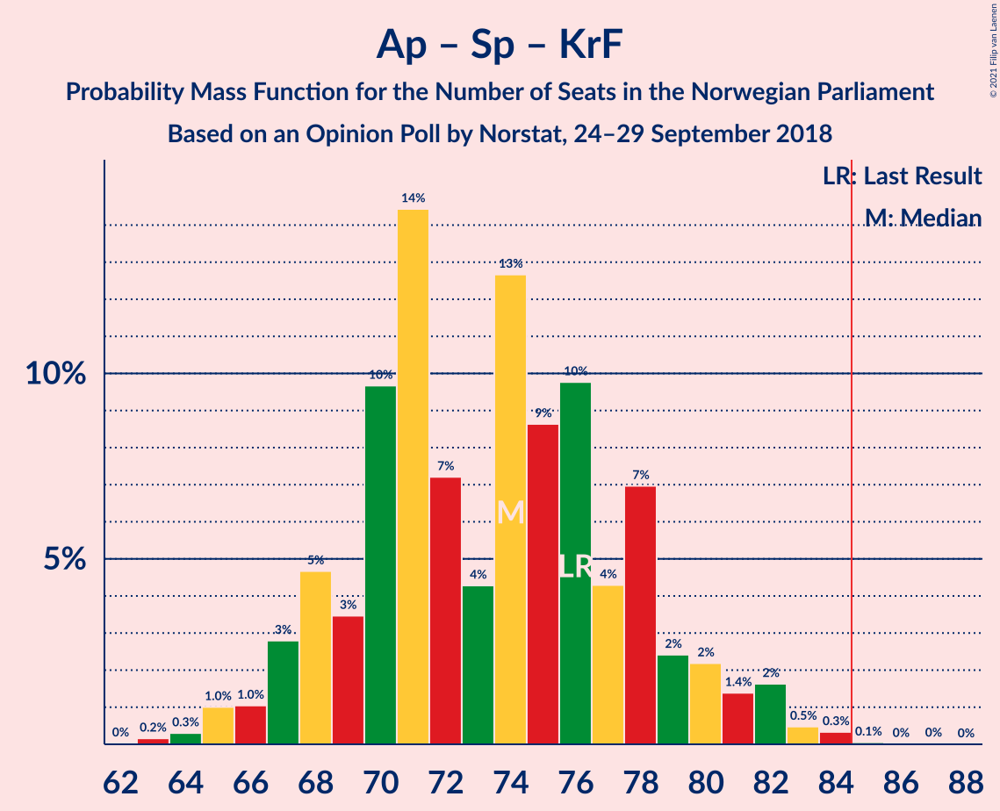
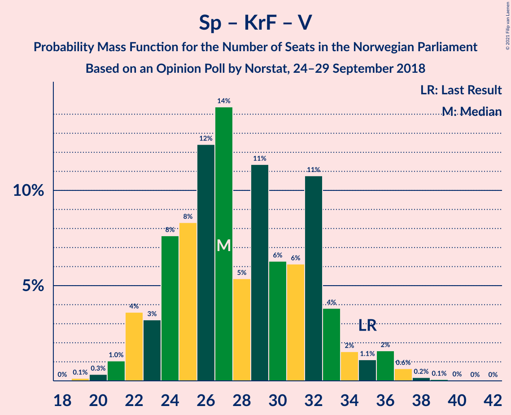

# Opinion Poll by Norstat, 24–29 September 2018

<a href="#voting-intentions">Voting Intentions</a> | <a href="#seats">Seats</a> | <a href="#coalitions">Coalitions</a> | <a href="#technical-information">Technical Information</a>

## Voting Intentions

### Confidence Intervals

| Party | Last Result | Poll Result | 80% Confidence Interval | 90% Confidence Interval | 95% Confidence Interval | 99% Confidence Interval |
|:-----:|:-----------:|:-----------:|:-----------------------:|:-----------------------:|:-----------------------:|:-----------------------:|
| Arbeiderpartiet | 27.4% | 26.9% | 25.1–28.9% |24.6–29.4% |24.2–29.9% |23.3–30.8% |
| Høyre | 25.0% | 24.7% | 22.9–26.6% |22.4–27.1% |22.0–27.6% |21.2–28.5% |
| Fremskrittspartiet | 15.2% | 14.0% | 12.6–15.5% |12.2–16.0% |11.9–16.4% |11.2–17.1% |
| Senterpartiet | 10.3% | 11.1% | 9.9–12.6% |9.6–13.0% |9.3–13.4% |8.7–14.1% |
| Sosialistisk Venstreparti | 6.0% | 7.1% | 6.2–8.4% |5.9–8.7% |5.7–9.0% |5.2–9.6% |
| Miljøpartiet De Grønne | 3.2% | 4.2% | 3.5–5.2% |3.3–5.5% |3.1–5.7% |2.8–6.2% |
| Kristelig Folkeparti | 4.2% | 3.7% | 3.0–4.6% |2.8–4.9% |2.6–5.1% |2.3–5.6% |
| Venstre | 4.4% | 3.5% | 2.8–4.4% |2.6–4.6% |2.5–4.9% |2.2–5.3% |
| Rødt | 2.4% | 3.2% | 2.6–4.1% |2.4–4.4% |2.3–4.6% |2.0–5.1% |

*Note:* The poll result column reflects the actual value used in the calculations. Published results may vary slightly, and in addition be rounded to fewer digits.

## Seats

### Confidence Intervals

| Party | Last Result | Median | 80% Confidence Interval | 90% Confidence Interval | 95% Confidence Interval | 99% Confidence Interval |
|:-----:|:-----------:|:------:|:-----------------------:|:-----------------------:|:-----------------------:|:-----------------------:|
| <a href="#arbeiderpartiet">Arbeiderpartiet</a> | 49 | 49 | 45–53 |44–53 |43–55 |42–58 |
| <a href="#høyre">Høyre</a> | 45 | 45 | 41–48 |40–50 |40–50 |38–52 |
| <a href="#fremskrittspartiet">Fremskrittspartiet</a> | 27 | 26 | 22–28 |21–29 |20–30 |20–31 |
| <a href="#senterpartiet">Senterpartiet</a> | 19 | 20 | 17–23 |17–23 |16–24 |15–25 |
| <a href="#sosialistisk-venstreparti">Sosialistisk Venstreparti</a> | 11 | 13 | 11–16 |10–16 |10–17 |9–18 |
| <a href="#miljøpartiet-de-grønne">Miljøpartiet De Grønne</a> | 1 | 7 | 2–9 |2–10 |1–10 |1–12 |
| <a href="#kristelig-folkeparti">Kristelig Folkeparti</a> | 8 | 3 | 1–8 |1–9 |1–9 |1–10 |
| <a href="#venstre">Venstre</a> | 8 | 2 | 2–8 |2–9 |2–9 |1–9 |
| <a href="#rødt">Rødt</a> | 1 | 1 | 1–7 |1–8 |1–9 |1–9 |

### Arbeiderpartiet

*For a full overview of the results for this party, see the [Arbeiderpartiet](party-arbeiderpartiet.html) page.*

| Number of Seats | Probability | Accumulated | Special Marks |
|:---------------:|:-----------:|:-----------:|:-------------:|
| 41 | 0.2% | 100% |  |
| 42 | 0.6% | 99.7% |  |
| 43 | 4% | 99.1% |  |
| 44 | 2% | 96% |  |
| 45 | 4% | 94% |  |
| 46 | 4% | 89% |  |
| 47 | 8% | 85% |  |
| 48 | 7% | 77% |  |
| 49 | 28% | 70% | Last Result, Median |
| 50 | 14% | 42% |  |
| 51 | 9% | 28% |  |
| 52 | 2% | 19% |  |
| 53 | 13% | 17% |  |
| 54 | 0.9% | 4% |  |
| 55 | 0.9% | 3% |  |
| 56 | 0.3% | 2% |  |
| 57 | 1.3% | 2% |  |
| 58 | 0.8% | 0.9% |  |
| 59 | 0.1% | 0.1% |  |
| 60 | 0.1% | 0.1% |  |
| 61 | 0% | 0% |  |

### Høyre

*For a full overview of the results for this party, see the [Høyre](party-høyre.html) page.*

| Number of Seats | Probability | Accumulated | Special Marks |
|:---------------:|:-----------:|:-----------:|:-------------:|
| 36 | 0.3% | 100% |  |
| 37 | 0.1% | 99.6% |  |
| 38 | 0.8% | 99.5% |  |
| 39 | 1.1% | 98.7% |  |
| 40 | 3% | 98% |  |
| 41 | 14% | 95% |  |
| 42 | 5% | 81% |  |
| 43 | 6% | 76% |  |
| 44 | 16% | 70% |  |
| 45 | 27% | 55% | Last Result, Median |
| 46 | 12% | 28% |  |
| 47 | 5% | 16% |  |
| 48 | 4% | 12% |  |
| 49 | 1.3% | 8% |  |
| 50 | 6% | 7% |  |
| 51 | 0.4% | 1.1% |  |
| 52 | 0.6% | 0.7% |  |
| 53 | 0.1% | 0.1% |  |
| 54 | 0% | 0.1% |  |
| 55 | 0% | 0% |  |

### Fremskrittspartiet

*For a full overview of the results for this party, see the [Fremskrittspartiet](party-fremskrittspartiet.html) page.*

| Number of Seats | Probability | Accumulated | Special Marks |
|:---------------:|:-----------:|:-----------:|:-------------:|
| 18 | 0% | 100% |  |
| 19 | 0.2% | 99.9% |  |
| 20 | 2% | 99.8% |  |
| 21 | 5% | 97% |  |
| 22 | 3% | 93% |  |
| 23 | 6% | 89% |  |
| 24 | 16% | 84% |  |
| 25 | 16% | 67% |  |
| 26 | 33% | 51% | Median |
| 27 | 2% | 18% | Last Result |
| 28 | 10% | 16% |  |
| 29 | 3% | 6% |  |
| 30 | 2% | 3% |  |
| 31 | 0.5% | 1.0% |  |
| 32 | 0.2% | 0.5% |  |
| 33 | 0.3% | 0.3% |  |
| 34 | 0% | 0% |  |

### Senterpartiet

*For a full overview of the results for this party, see the [Senterpartiet](party-senterpartiet.html) page.*

| Number of Seats | Probability | Accumulated | Special Marks |
|:---------------:|:-----------:|:-----------:|:-------------:|
| 14 | 0.1% | 100% |  |
| 15 | 1.0% | 99.9% |  |
| 16 | 2% | 98.9% |  |
| 17 | 11% | 97% |  |
| 18 | 24% | 86% |  |
| 19 | 7% | 62% | Last Result |
| 20 | 10% | 55% | Median |
| 21 | 18% | 45% |  |
| 22 | 10% | 27% |  |
| 23 | 15% | 17% |  |
| 24 | 2% | 3% |  |
| 25 | 0.6% | 1.0% |  |
| 26 | 0.1% | 0.4% |  |
| 27 | 0.2% | 0.3% |  |
| 28 | 0% | 0% |  |

### Sosialistisk Venstreparti

*For a full overview of the results for this party, see the [Sosialistisk Venstreparti](party-sosialistiskvenstreparti.html) page.*

| Number of Seats | Probability | Accumulated | Special Marks |
|:---------------:|:-----------:|:-----------:|:-------------:|
| 8 | 0.1% | 100% |  |
| 9 | 0.6% | 99.9% |  |
| 10 | 5% | 99.3% |  |
| 11 | 9% | 94% | Last Result |
| 12 | 27% | 85% |  |
| 13 | 25% | 59% | Median |
| 14 | 12% | 34% |  |
| 15 | 10% | 22% |  |
| 16 | 9% | 12% |  |
| 17 | 2% | 3% |  |
| 18 | 0.6% | 0.8% |  |
| 19 | 0% | 0.2% |  |
| 20 | 0.1% | 0.1% |  |
| 21 | 0% | 0% |  |

### Miljøpartiet De Grønne

*For a full overview of the results for this party, see the [Miljøpartiet De Grønne](party-miljøpartietdegrønne.html) page.*

| Number of Seats | Probability | Accumulated | Special Marks |
|:---------------:|:-----------:|:-----------:|:-------------:|
| 1 | 4% | 100% | Last Result |
| 2 | 16% | 96% |  |
| 3 | 6% | 80% |  |
| 4 | 0% | 74% |  |
| 5 | 0% | 74% |  |
| 6 | 0% | 74% |  |
| 7 | 33% | 74% | Median |
| 8 | 22% | 42% |  |
| 9 | 14% | 19% |  |
| 10 | 4% | 6% |  |
| 11 | 0.8% | 1.3% |  |
| 12 | 0.5% | 0.6% |  |
| 13 | 0% | 0% |  |

### Kristelig Folkeparti

*For a full overview of the results for this party, see the [Kristelig Folkeparti](party-kristeligfolkeparti.html) page.*

| Number of Seats | Probability | Accumulated | Special Marks |
|:---------------:|:-----------:|:-----------:|:-------------:|
| 0 | 0.2% | 100% |  |
| 1 | 14% | 99.8% |  |
| 2 | 4% | 85% |  |
| 3 | 37% | 81% | Median |
| 4 | 0% | 45% |  |
| 5 | 0% | 45% |  |
| 6 | 0% | 45% |  |
| 7 | 16% | 45% |  |
| 8 | 21% | 28% | Last Result |
| 9 | 6% | 7% |  |
| 10 | 1.2% | 2% |  |
| 11 | 0.3% | 0.3% |  |
| 12 | 0% | 0% |  |

### Venstre

*For a full overview of the results for this party, see the [Venstre](party-venstre.html) page.*

| Number of Seats | Probability | Accumulated | Special Marks |
|:---------------:|:-----------:|:-----------:|:-------------:|
| 1 | 2% | 100% |  |
| 2 | 58% | 98% | Median |
| 3 | 16% | 40% |  |
| 4 | 0% | 24% |  |
| 5 | 0% | 24% |  |
| 6 | 0.5% | 24% |  |
| 7 | 3% | 23% |  |
| 8 | 13% | 20% | Last Result |
| 9 | 7% | 7% |  |
| 10 | 0.3% | 0.4% |  |
| 11 | 0% | 0% |  |

### Rødt

*For a full overview of the results for this party, see the [Rødt](party-rødt.html) page.*

| Number of Seats | Probability | Accumulated | Special Marks |
|:---------------:|:-----------:|:-----------:|:-------------:|
| 1 | 51% | 100% | Last Result, Median |
| 2 | 39% | 49% |  |
| 3 | 0% | 11% |  |
| 4 | 0% | 11% |  |
| 5 | 0% | 11% |  |
| 6 | 0% | 11% |  |
| 7 | 4% | 11% |  |
| 8 | 4% | 7% |  |
| 9 | 3% | 3% |  |
| 10 | 0.4% | 0.4% |  |
| 11 | 0% | 0% |  |

## Coalitions

### Confidence Intervals

| Coalition | Last Result | Median | Majority? | 80% Confidence Interval | 90% Confidence Interval | 95% Confidence Interval | 99% Confidence Interval |
|:---------:|:-----------:|:------:|:---------:|:-----------------------:|:-----------------------:|:-----------------------:|:-----------------------:|
| Høyre – Fremskrittspartiet – Senterpartiet – Kristelig Folkeparti – Venstre | 107 | 98 | 100% | 95–102 | 91–103 | 89–104 | 88–107 |
| Arbeiderpartiet – Senterpartiet – Sosialistisk Venstreparti – Miljøpartiet De Grønne – Rødt | 81 | 90 | 97% | 87–95 | 85–97 | 84–101 | 83–101 |
| Arbeiderpartiet – Senterpartiet – Sosialistisk Venstreparti – Miljøpartiet De Grønne – Kristelig Folkeparti | 88 | 94 | 98.6% | 89–99 | 88–100 | 86–100 | 83–102 |
| Arbeiderpartiet – Senterpartiet – Sosialistisk Venstreparti – Miljøpartiet De Grønne | 80 | 88 | 87% | 84–93 | 82–94 | 81–96 | 79–99 |
| Arbeiderpartiet – Senterpartiet – Sosialistisk Venstreparti – Rødt | 80 | 84 | 47% | 80–91 | 79–92 | 77–93 | 75–94 |
| Høyre – Fremskrittspartiet – Miljøpartiet De Grønne – Kristelig Folkeparti – Venstre | 89 | 85 | 53% | 78–89 | 77–90 | 76–92 | 75–94 |
| Arbeiderpartiet – Senterpartiet – Sosialistisk Venstreparti | 79 | 82 | 33% | 78–87 | 76–91 | 74–91 | 73–91 |
| Arbeiderpartiet – Senterpartiet – Miljøpartiet De Grønne – Kristelig Folkeparti | 77 | 81 | 15% | 75–85 | 75–87 | 73–87 | 71–89 |
| Høyre – Fremskrittspartiet – Kristelig Folkeparti – Venstre | 88 | 79 | 3% | 74–82 | 72–84 | 68–85 | 68–86 |
| Arbeiderpartiet – Senterpartiet – Kristelig Folkeparti | 76 | 75 | 0.2% | 69–78 | 67–78 | 67–80 | 65–82 |
| Høyre – Fremskrittspartiet – Venstre | 80 | 74 | 0.1% | 67–78 | 67–79 | 66–79 | 65–84 |
| Høyre – Fremskrittspartiet | 72 | 70 | 0% | 65–74 | 65–75 | 64–76 | 62–78 |
| Arbeiderpartiet – Senterpartiet | 68 | 69 | 0% | 65–74 | 64–75 | 62–75 | 60–79 |
| Arbeiderpartiet – Sosialistisk Venstreparti | 60 | 62 | 0% | 58–67 | 57–69 | 56–69 | 54–70 |
| Høyre – Kristelig Folkeparti – Venstre | 61 | 53 | 0% | 48–57 | 47–59 | 45–61 | 43–62 |
| Senterpartiet – Kristelig Folkeparti – Venstre | 35 | 29 | 0% | 24–33 | 22–35 | 22–36 | 21–37 |

### Høyre – Fremskrittspartiet – Senterpartiet – Kristelig Folkeparti – Venstre

| Number of Seats | Probability | Accumulated | Special Marks |
|:---------------:|:-----------:|:-----------:|:-------------:|
| 86 | 0.1% | 100% |  |
| 87 | 0.1% | 99.9% |  |
| 88 | 1.4% | 99.8% |  |
| 89 | 2% | 98% |  |
| 90 | 2% | 97% |  |
| 91 | 0.4% | 95% |  |
| 92 | 0.7% | 95% |  |
| 93 | 2% | 94% |  |
| 94 | 0.7% | 92% |  |
| 95 | 9% | 92% |  |
| 96 | 16% | 83% | Median |
| 97 | 3% | 66% |  |
| 98 | 16% | 64% |  |
| 99 | 15% | 48% |  |
| 100 | 16% | 33% |  |
| 101 | 3% | 17% |  |
| 102 | 5% | 14% |  |
| 103 | 5% | 9% |  |
| 104 | 2% | 4% |  |
| 105 | 0.9% | 2% |  |
| 106 | 0.3% | 1.4% |  |
| 107 | 0.7% | 1.2% | Last Result |
| 108 | 0.2% | 0.4% |  |
| 109 | 0.2% | 0.2% |  |
| 110 | 0% | 0.1% |  |
| 111 | 0% | 0% |  |

### Arbeiderpartiet – Senterpartiet – Sosialistisk Venstreparti – Miljøpartiet De Grønne – Rødt

| Number of Seats | Probability | Accumulated | Special Marks |
|:---------------:|:-----------:|:-----------:|:-------------:|
| 79 | 0% | 100% |  |
| 80 | 0% | 99.9% |  |
| 81 | 0% | 99.9% | Last Result |
| 82 | 0.2% | 99.9% |  |
| 83 | 2% | 99.7% |  |
| 84 | 0.9% | 98% |  |
| 85 | 5% | 97% | Majority |
| 86 | 2% | 92% |  |
| 87 | 21% | 90% |  |
| 88 | 6% | 69% |  |
| 89 | 4% | 63% |  |
| 90 | 10% | 60% | Median |
| 91 | 5% | 50% |  |
| 92 | 3% | 45% |  |
| 93 | 8% | 41% |  |
| 94 | 14% | 34% |  |
| 95 | 12% | 20% |  |
| 96 | 1.5% | 8% |  |
| 97 | 2% | 6% |  |
| 98 | 0.8% | 5% |  |
| 99 | 0.7% | 4% |  |
| 100 | 0.2% | 3% |  |
| 101 | 3% | 3% |  |
| 102 | 0.1% | 0.2% |  |
| 103 | 0.1% | 0.1% |  |
| 104 | 0% | 0% |  |

### Arbeiderpartiet – Senterpartiet – Sosialistisk Venstreparti – Miljøpartiet De Grønne – Kristelig Folkeparti

| Number of Seats | Probability | Accumulated | Special Marks |
|:---------------:|:-----------:|:-----------:|:-------------:|
| 81 | 0% | 100% |  |
| 82 | 0.3% | 99.9% |  |
| 83 | 0.5% | 99.6% |  |
| 84 | 0.5% | 99.1% |  |
| 85 | 0.9% | 98.6% | Majority |
| 86 | 2% | 98% |  |
| 87 | 0.5% | 96% |  |
| 88 | 2% | 96% | Last Result |
| 89 | 11% | 94% |  |
| 90 | 4% | 83% |  |
| 91 | 11% | 79% |  |
| 92 | 5% | 68% | Median |
| 93 | 6% | 63% |  |
| 94 | 16% | 57% |  |
| 95 | 9% | 41% |  |
| 96 | 15% | 32% |  |
| 97 | 2% | 17% |  |
| 98 | 5% | 15% |  |
| 99 | 0.6% | 10% |  |
| 100 | 8% | 10% |  |
| 101 | 0.7% | 1.3% |  |
| 102 | 0.4% | 0.6% |  |
| 103 | 0.1% | 0.2% |  |
| 104 | 0.1% | 0.1% |  |
| 105 | 0% | 0.1% |  |
| 106 | 0% | 0% |  |

### Arbeiderpartiet – Senterpartiet – Sosialistisk Venstreparti – Miljøpartiet De Grønne

| Number of Seats | Probability | Accumulated | Special Marks |
|:---------------:|:-----------:|:-----------:|:-------------:|
| 77 | 0.3% | 100% |  |
| 78 | 0% | 99.7% |  |
| 79 | 0.3% | 99.7% |  |
| 80 | 0.4% | 99.4% | Last Result |
| 81 | 2% | 99.0% |  |
| 82 | 3% | 97% |  |
| 83 | 3% | 95% |  |
| 84 | 5% | 92% |  |
| 85 | 3% | 87% | Majority |
| 86 | 25% | 84% |  |
| 87 | 4% | 59% |  |
| 88 | 9% | 55% |  |
| 89 | 2% | 46% | Median |
| 90 | 6% | 44% |  |
| 91 | 7% | 38% |  |
| 92 | 3% | 31% |  |
| 93 | 18% | 28% |  |
| 94 | 6% | 10% |  |
| 95 | 0.6% | 4% |  |
| 96 | 0.8% | 3% |  |
| 97 | 0.4% | 2% |  |
| 98 | 0% | 2% |  |
| 99 | 2% | 2% |  |
| 100 | 0.1% | 0.2% |  |
| 101 | 0% | 0.1% |  |
| 102 | 0.1% | 0.1% |  |
| 103 | 0% | 0% |  |

### Arbeiderpartiet – Senterpartiet – Sosialistisk Venstreparti – Rødt

| Number of Seats | Probability | Accumulated | Special Marks |
|:---------------:|:-----------:|:-----------:|:-------------:|
| 74 | 0.1% | 100% |  |
| 75 | 2% | 99.9% |  |
| 76 | 0.6% | 98% |  |
| 77 | 2% | 98% |  |
| 78 | 0.8% | 96% |  |
| 79 | 2% | 95% |  |
| 80 | 17% | 93% | Last Result |
| 81 | 5% | 76% |  |
| 82 | 10% | 71% |  |
| 83 | 5% | 61% | Median |
| 84 | 9% | 57% |  |
| 85 | 7% | 47% | Majority |
| 86 | 2% | 40% |  |
| 87 | 19% | 38% |  |
| 88 | 3% | 19% |  |
| 89 | 3% | 15% |  |
| 90 | 1.1% | 12% |  |
| 91 | 2% | 11% |  |
| 92 | 5% | 9% |  |
| 93 | 3% | 4% |  |
| 94 | 0.7% | 1.0% |  |
| 95 | 0% | 0.4% |  |
| 96 | 0.1% | 0.3% |  |
| 97 | 0.3% | 0.3% |  |
| 98 | 0% | 0% |  |

### Høyre – Fremskrittspartiet – Miljøpartiet De Grønne – Kristelig Folkeparti – Venstre

| Number of Seats | Probability | Accumulated | Special Marks |
|:---------------:|:-----------:|:-----------:|:-------------:|
| 72 | 0.3% | 100% |  |
| 73 | 0.1% | 99.7% |  |
| 74 | 0% | 99.7% |  |
| 75 | 0.7% | 99.6% |  |
| 76 | 3% | 99.0% |  |
| 77 | 5% | 96% |  |
| 78 | 2% | 91% |  |
| 79 | 1.1% | 89% |  |
| 80 | 3% | 88% |  |
| 81 | 3% | 85% |  |
| 82 | 19% | 81% |  |
| 83 | 2% | 62% | Median |
| 84 | 7% | 60% |  |
| 85 | 9% | 53% | Majority |
| 86 | 5% | 43% |  |
| 87 | 10% | 39% |  |
| 88 | 5% | 29% |  |
| 89 | 17% | 24% | Last Result |
| 90 | 2% | 7% |  |
| 91 | 0.8% | 5% |  |
| 92 | 2% | 4% |  |
| 93 | 0.6% | 2% |  |
| 94 | 2% | 2% |  |
| 95 | 0.1% | 0.1% |  |
| 96 | 0% | 0% |  |

### Arbeiderpartiet – Senterpartiet – Sosialistisk Venstreparti

| Number of Seats | Probability | Accumulated | Special Marks |
|:---------------:|:-----------:|:-----------:|:-------------:|
| 71 | 0.1% | 100% |  |
| 72 | 0.1% | 99.9% |  |
| 73 | 0.9% | 99.8% |  |
| 74 | 2% | 98.8% |  |
| 75 | 2% | 97% |  |
| 76 | 2% | 95% |  |
| 77 | 2% | 93% |  |
| 78 | 2% | 92% |  |
| 79 | 22% | 90% | Last Result |
| 80 | 7% | 68% |  |
| 81 | 6% | 61% |  |
| 82 | 12% | 55% | Median |
| 83 | 2% | 43% |  |
| 84 | 8% | 41% |  |
| 85 | 8% | 33% | Majority |
| 86 | 14% | 25% |  |
| 87 | 3% | 12% |  |
| 88 | 1.2% | 8% |  |
| 89 | 0.4% | 7% |  |
| 90 | 0.2% | 7% |  |
| 91 | 6% | 6% |  |
| 92 | 0.2% | 0.3% |  |
| 93 | 0.1% | 0.1% |  |
| 94 | 0% | 0% |  |

### Arbeiderpartiet – Senterpartiet – Miljøpartiet De Grønne – Kristelig Folkeparti

| Number of Seats | Probability | Accumulated | Special Marks |
|:---------------:|:-----------:|:-----------:|:-------------:|
| 67 | 0.1% | 100% |  |
| 68 | 0% | 99.9% |  |
| 69 | 0.2% | 99.9% |  |
| 70 | 0% | 99.6% |  |
| 71 | 0.7% | 99.6% |  |
| 72 | 0.7% | 98.9% |  |
| 73 | 1.3% | 98% |  |
| 74 | 2% | 97% |  |
| 75 | 8% | 95% |  |
| 76 | 6% | 87% |  |
| 77 | 5% | 81% | Last Result |
| 78 | 3% | 77% |  |
| 79 | 15% | 74% | Median |
| 80 | 8% | 59% |  |
| 81 | 3% | 51% |  |
| 82 | 16% | 48% |  |
| 83 | 14% | 31% |  |
| 84 | 2% | 17% |  |
| 85 | 7% | 15% | Majority |
| 86 | 0.4% | 8% |  |
| 87 | 6% | 7% |  |
| 88 | 1.0% | 2% |  |
| 89 | 0.5% | 0.8% |  |
| 90 | 0.1% | 0.2% |  |
| 91 | 0% | 0.2% |  |
| 92 | 0% | 0.1% |  |
| 93 | 0% | 0.1% |  |
| 94 | 0% | 0.1% |  |
| 95 | 0% | 0% |  |

### Høyre – Fremskrittspartiet – Kristelig Folkeparti – Venstre

| Number of Seats | Probability | Accumulated | Special Marks |
|:---------------:|:-----------:|:-----------:|:-------------:|
| 66 | 0.1% | 100% |  |
| 67 | 0.1% | 99.9% |  |
| 68 | 3% | 99.8% |  |
| 69 | 0.2% | 97% |  |
| 70 | 0.7% | 97% |  |
| 71 | 0.8% | 96% |  |
| 72 | 2% | 95% |  |
| 73 | 1.5% | 94% |  |
| 74 | 12% | 92% |  |
| 75 | 14% | 80% |  |
| 76 | 8% | 66% | Median |
| 77 | 3% | 59% |  |
| 78 | 5% | 55% |  |
| 79 | 10% | 50% |  |
| 80 | 4% | 40% |  |
| 81 | 6% | 37% |  |
| 82 | 21% | 31% |  |
| 83 | 2% | 10% |  |
| 84 | 5% | 8% |  |
| 85 | 0.9% | 3% | Majority |
| 86 | 2% | 2% |  |
| 87 | 0.2% | 0.3% |  |
| 88 | 0% | 0.1% | Last Result |
| 89 | 0% | 0.1% |  |
| 90 | 0% | 0.1% |  |
| 91 | 0% | 0% |  |

### Arbeiderpartiet – Senterpartiet – Kristelig Folkeparti

| Number of Seats | Probability | Accumulated | Special Marks |
|:---------------:|:-----------:|:-----------:|:-------------:|
| 63 | 0% | 100% |  |
| 64 | 0.3% | 99.9% |  |
| 65 | 0.2% | 99.6% |  |
| 66 | 2% | 99.4% |  |
| 67 | 3% | 98% |  |
| 68 | 2% | 95% |  |
| 69 | 9% | 93% |  |
| 70 | 2% | 85% |  |
| 71 | 9% | 83% |  |
| 72 | 5% | 74% | Median |
| 73 | 8% | 69% |  |
| 74 | 2% | 61% |  |
| 75 | 19% | 59% |  |
| 76 | 18% | 40% | Last Result |
| 77 | 9% | 22% |  |
| 78 | 9% | 14% |  |
| 79 | 0.7% | 4% |  |
| 80 | 2% | 4% |  |
| 81 | 1.0% | 2% |  |
| 82 | 0.8% | 1.2% |  |
| 83 | 0.2% | 0.4% |  |
| 84 | 0.1% | 0.2% |  |
| 85 | 0.1% | 0.2% | Majority |
| 86 | 0.1% | 0.1% |  |
| 87 | 0% | 0% |  |

### Høyre – Fremskrittspartiet – Venstre

| Number of Seats | Probability | Accumulated | Special Marks |
|:---------------:|:-----------:|:-----------:|:-------------:|
| 62 | 0% | 100% |  |
| 63 | 0.1% | 99.9% |  |
| 64 | 0.1% | 99.8% |  |
| 65 | 0.3% | 99.8% |  |
| 66 | 2% | 99.5% |  |
| 67 | 8% | 97% |  |
| 68 | 0.9% | 89% |  |
| 69 | 6% | 88% |  |
| 70 | 3% | 82% |  |
| 71 | 3% | 79% |  |
| 72 | 17% | 76% |  |
| 73 | 6% | 59% | Median |
| 74 | 17% | 52% |  |
| 75 | 7% | 35% |  |
| 76 | 10% | 28% |  |
| 77 | 2% | 18% |  |
| 78 | 7% | 16% |  |
| 79 | 6% | 8% |  |
| 80 | 0.3% | 2% | Last Result |
| 81 | 0.8% | 2% |  |
| 82 | 0.1% | 1.0% |  |
| 83 | 0.3% | 0.9% |  |
| 84 | 0.6% | 0.7% |  |
| 85 | 0% | 0.1% | Majority |
| 86 | 0% | 0.1% |  |
| 87 | 0% | 0% |  |

### Høyre – Fremskrittspartiet

| Number of Seats | Probability | Accumulated | Special Marks |
|:---------------:|:-----------:|:-----------:|:-------------:|
| 58 | 0% | 100% |  |
| 59 | 0.1% | 99.9% |  |
| 60 | 0.1% | 99.8% |  |
| 61 | 0.1% | 99.8% |  |
| 62 | 0.4% | 99.6% |  |
| 63 | 0.5% | 99.2% |  |
| 64 | 3% | 98.7% |  |
| 65 | 9% | 96% |  |
| 66 | 3% | 87% |  |
| 67 | 9% | 83% |  |
| 68 | 4% | 74% |  |
| 69 | 8% | 70% |  |
| 70 | 18% | 62% |  |
| 71 | 26% | 44% | Median |
| 72 | 2% | 18% | Last Result |
| 73 | 3% | 16% |  |
| 74 | 8% | 14% |  |
| 75 | 1.1% | 6% |  |
| 76 | 3% | 4% |  |
| 77 | 0.4% | 1.0% |  |
| 78 | 0.3% | 0.5% |  |
| 79 | 0.1% | 0.2% |  |
| 80 | 0% | 0.1% |  |
| 81 | 0% | 0% |  |

### Arbeiderpartiet – Senterpartiet

| Number of Seats | Probability | Accumulated | Special Marks |
|:---------------:|:-----------:|:-----------:|:-------------:|
| 58 | 0% | 100% |  |
| 59 | 0.2% | 99.9% |  |
| 60 | 0.4% | 99.8% |  |
| 61 | 0.9% | 99.4% |  |
| 62 | 1.0% | 98.5% |  |
| 63 | 1.1% | 97% |  |
| 64 | 5% | 96% |  |
| 65 | 4% | 92% |  |
| 66 | 9% | 87% |  |
| 67 | 18% | 79% |  |
| 68 | 9% | 61% | Last Result |
| 69 | 4% | 52% | Median |
| 70 | 16% | 48% |  |
| 71 | 7% | 32% |  |
| 72 | 1.3% | 25% |  |
| 73 | 13% | 24% |  |
| 74 | 2% | 11% |  |
| 75 | 7% | 10% |  |
| 76 | 0.4% | 2% |  |
| 77 | 0.9% | 2% |  |
| 78 | 0.4% | 1.2% |  |
| 79 | 0.8% | 0.9% |  |
| 80 | 0.1% | 0.1% |  |
| 81 | 0% | 0% |  |

### Arbeiderpartiet – Sosialistisk Venstreparti

| Number of Seats | Probability | Accumulated | Special Marks |
|:---------------:|:-----------:|:-----------:|:-------------:|
| 52 | 0% | 100% |  |
| 53 | 0.1% | 99.9% |  |
| 54 | 0.8% | 99.8% |  |
| 55 | 0.6% | 99.1% |  |
| 56 | 2% | 98% |  |
| 57 | 3% | 96% |  |
| 58 | 6% | 93% |  |
| 59 | 3% | 87% |  |
| 60 | 5% | 84% | Last Result |
| 61 | 23% | 79% |  |
| 62 | 8% | 56% | Median |
| 63 | 20% | 48% |  |
| 64 | 9% | 28% |  |
| 65 | 2% | 19% |  |
| 66 | 2% | 17% |  |
| 67 | 7% | 15% |  |
| 68 | 1.4% | 8% |  |
| 69 | 5% | 7% |  |
| 70 | 2% | 2% |  |
| 71 | 0.1% | 0.3% |  |
| 72 | 0% | 0.2% |  |
| 73 | 0.1% | 0.1% |  |
| 74 | 0.1% | 0.1% |  |
| 75 | 0% | 0% |  |

### Høyre – Kristelig Folkeparti – Venstre

| Number of Seats | Probability | Accumulated | Special Marks |
|:---------------:|:-----------:|:-----------:|:-------------:|
| 42 | 0.3% | 100% |  |
| 43 | 0.2% | 99.6% |  |
| 44 | 0.6% | 99.5% |  |
| 45 | 2% | 98.9% |  |
| 46 | 1.0% | 97% |  |
| 47 | 3% | 96% |  |
| 48 | 7% | 93% |  |
| 49 | 12% | 86% |  |
| 50 | 10% | 74% | Median |
| 51 | 5% | 63% |  |
| 52 | 5% | 58% |  |
| 53 | 4% | 54% |  |
| 54 | 3% | 49% |  |
| 55 | 13% | 46% |  |
| 56 | 18% | 33% |  |
| 57 | 6% | 15% |  |
| 58 | 1.3% | 9% |  |
| 59 | 4% | 8% |  |
| 60 | 1.3% | 4% |  |
| 61 | 0.6% | 3% | Last Result |
| 62 | 2% | 2% |  |
| 63 | 0.3% | 0.3% |  |
| 64 | 0% | 0.1% |  |
| 65 | 0% | 0% |  |

### Senterpartiet – Kristelig Folkeparti – Venstre

| Number of Seats | Probability | Accumulated | Special Marks |
|:---------------:|:-----------:|:-----------:|:-------------:|
| 19 | 0.1% | 100% |  |
| 20 | 0.1% | 99.8% |  |
| 21 | 2% | 99.7% |  |
| 22 | 5% | 98% |  |
| 23 | 2% | 93% |  |
| 24 | 4% | 91% |  |
| 25 | 8% | 87% | Median |
| 26 | 6% | 79% |  |
| 27 | 3% | 73% |  |
| 28 | 19% | 70% |  |
| 29 | 21% | 51% |  |
| 30 | 12% | 30% |  |
| 31 | 4% | 18% |  |
| 32 | 2% | 14% |  |
| 33 | 4% | 12% |  |
| 34 | 3% | 8% |  |
| 35 | 1.2% | 5% | Last Result |
| 36 | 3% | 4% |  |
| 37 | 0.5% | 0.9% |  |
| 38 | 0.3% | 0.5% |  |
| 39 | 0.1% | 0.2% |  |
| 40 | 0.1% | 0.1% |  |
| 41 | 0% | 0% |  |

## Technical Information

### Opinion Poll

+ **Polling firm:** Norstat
+ **Commissioner(s):** —
+ **Fieldwork period:** 24–29 September 2018

### Calculations

+ **Sample size:** 924
+ **Simulations done:** 131,072
+ **Error estimate:** 2.29%

