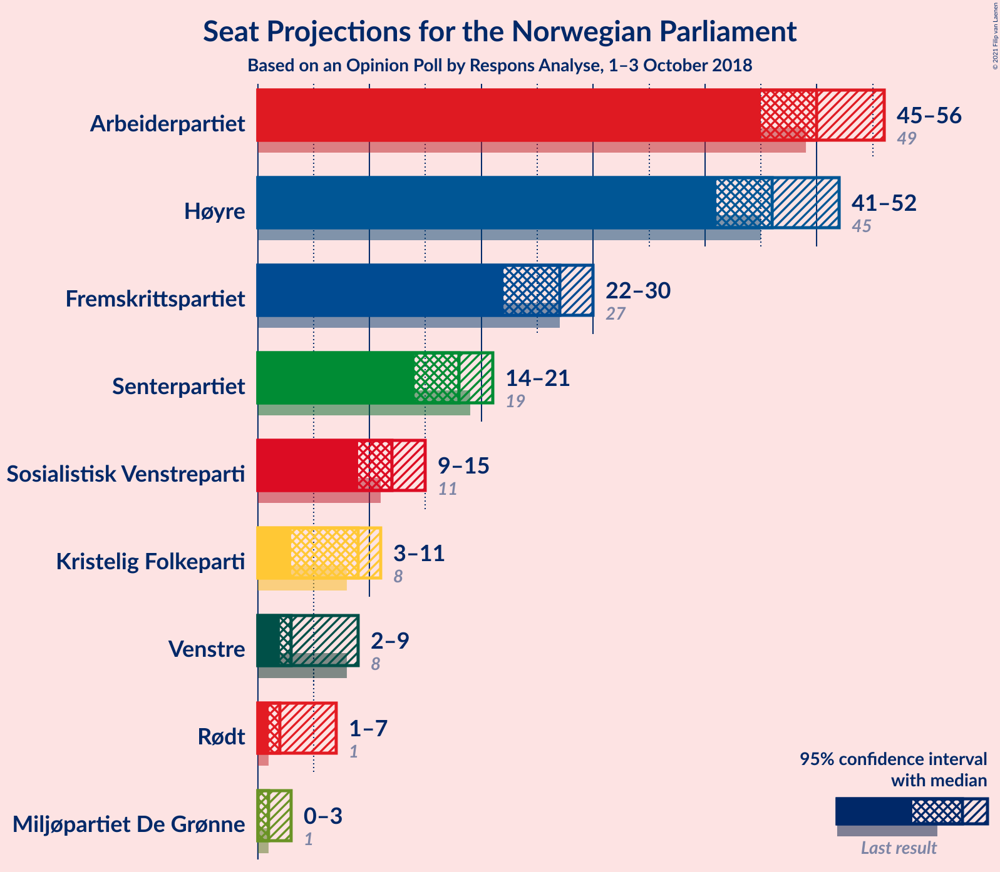
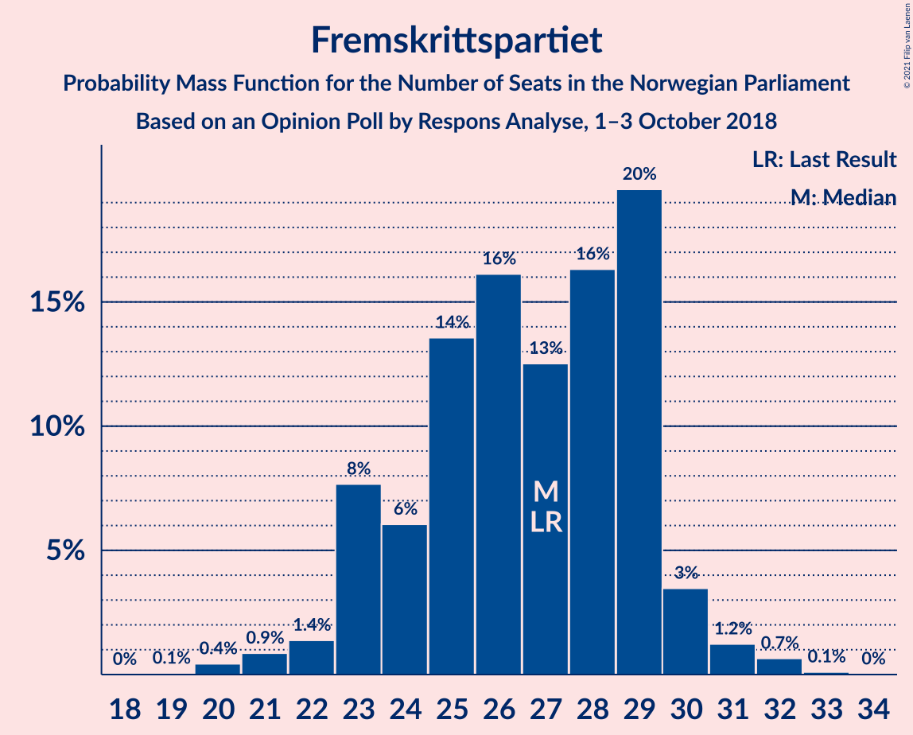
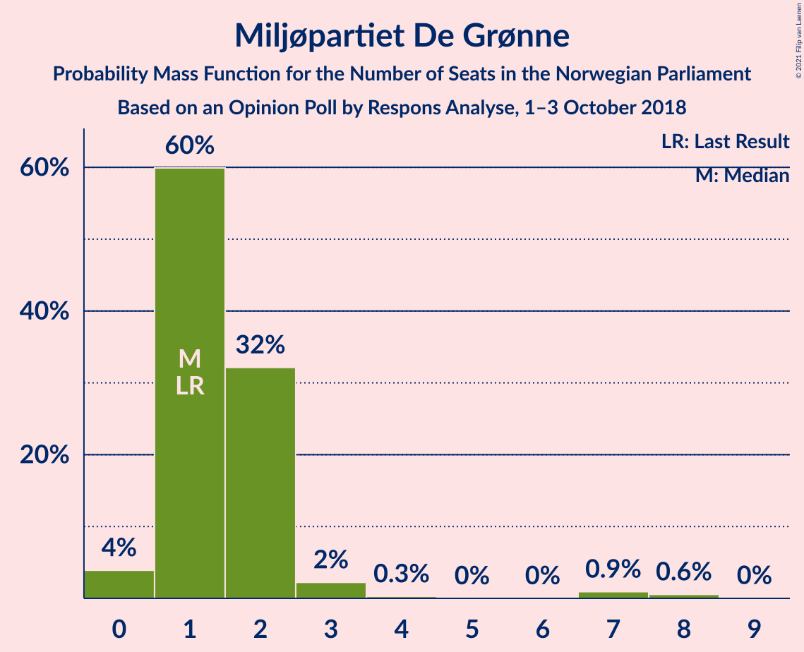
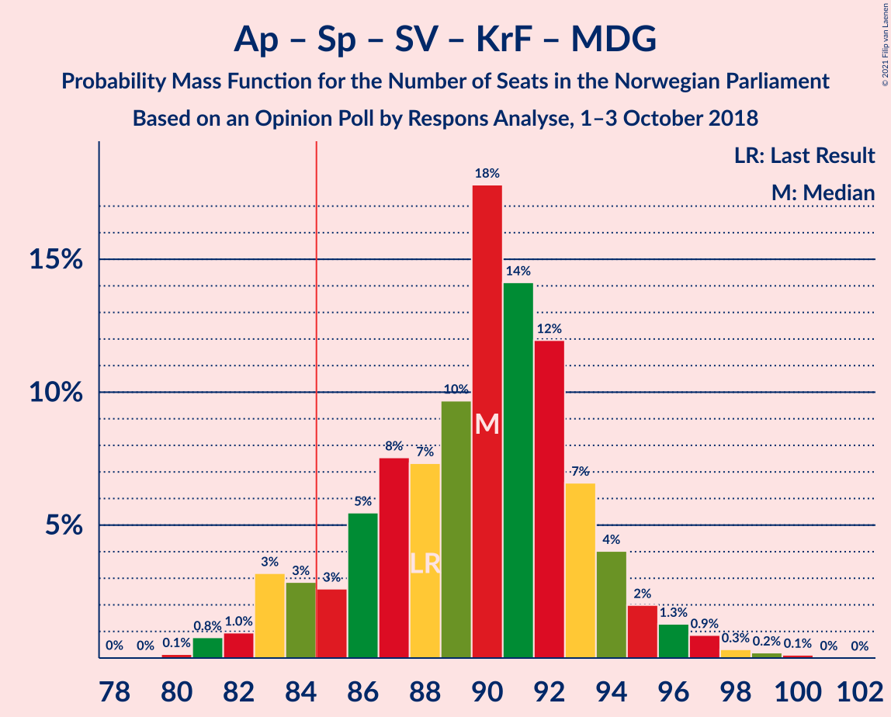
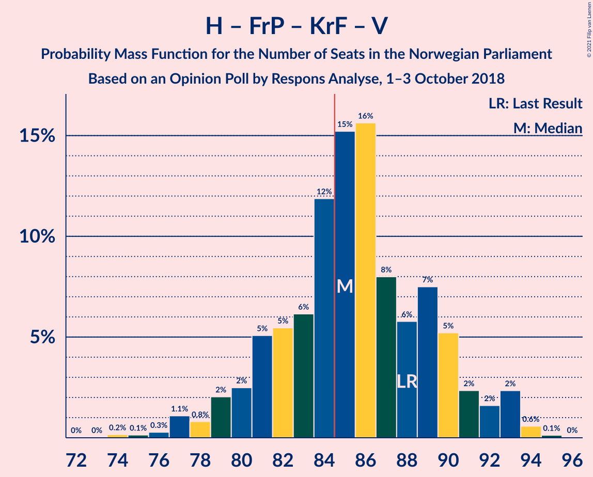
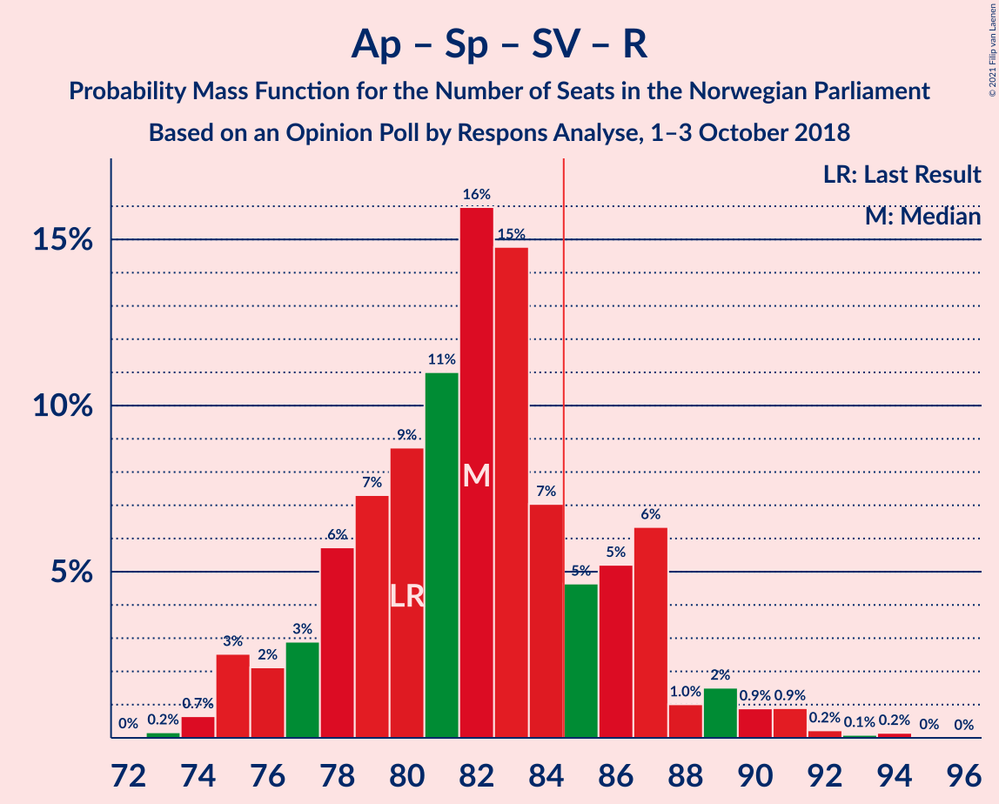
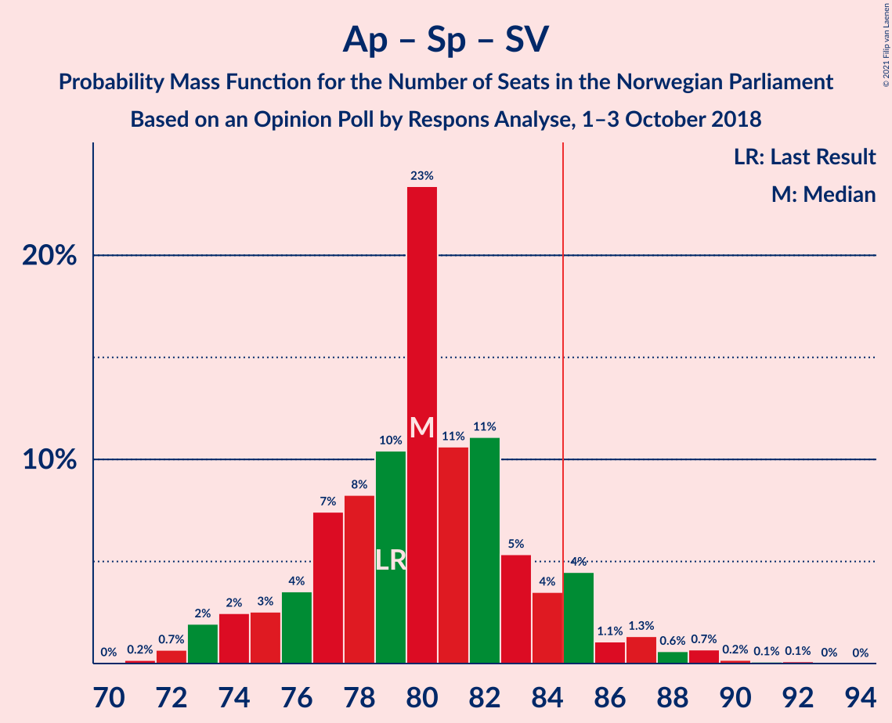
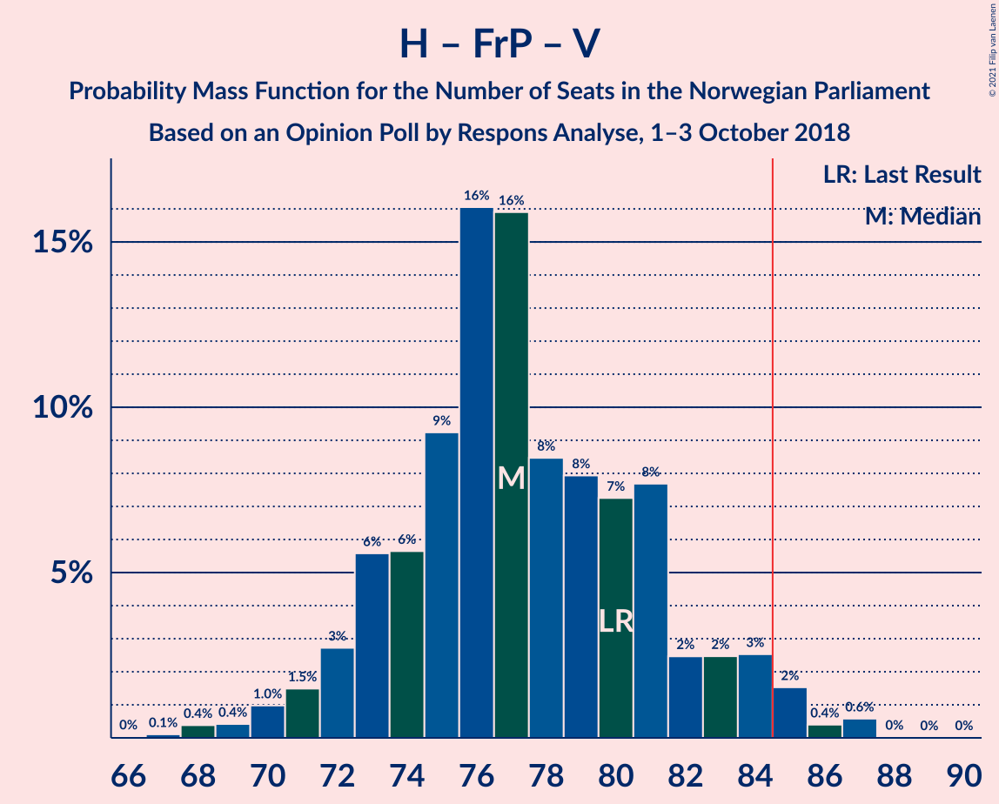
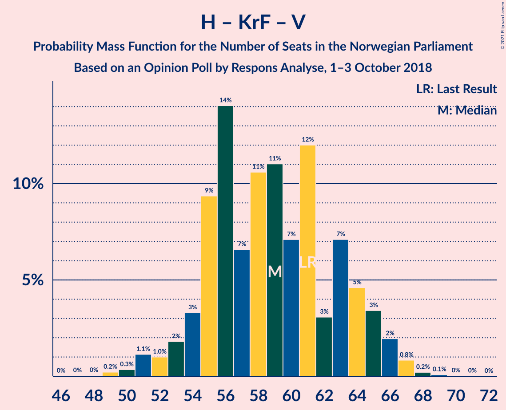
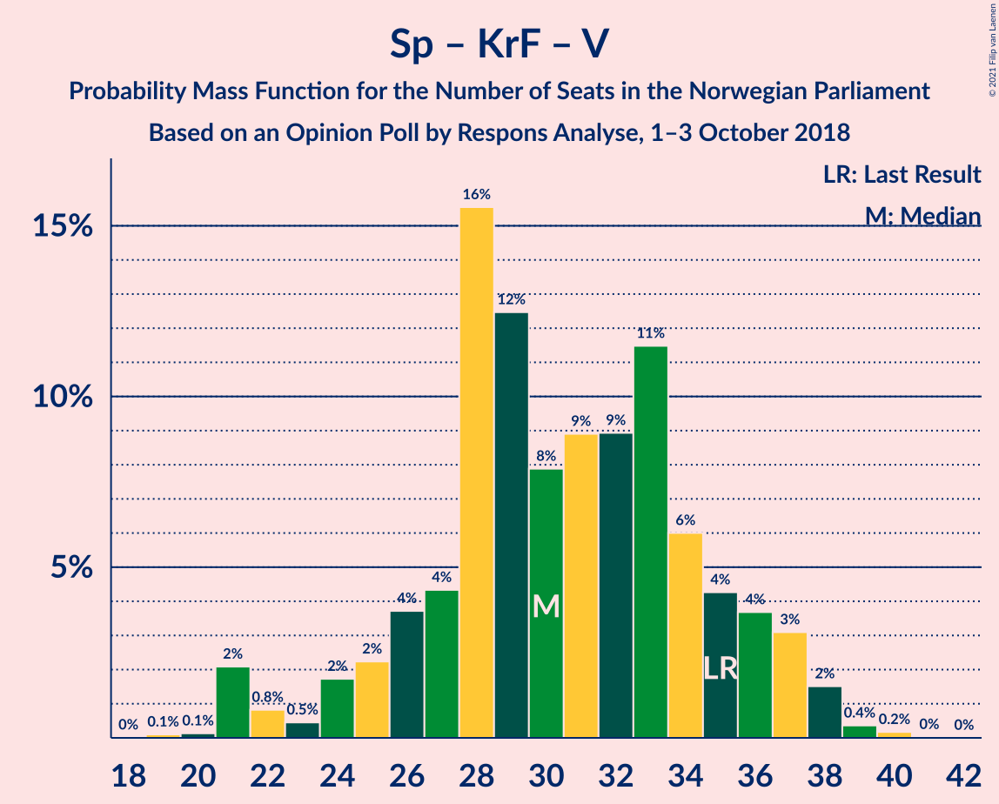

# Opinion Poll by Respons Analyse, 1–3 October 2018

<a href="#voting-intentions">Voting Intentions</a> | <a href="#seats">Seats</a> | <a href="#coalitions">Coalitions</a> | <a href="#technical-information">Technical Information</a>

## Voting Intentions

### Confidence Intervals

| Party | Last Result | Poll Result | 80% Confidence Interval | 90% Confidence Interval | 95% Confidence Interval | 99% Confidence Interval |
|:-----:|:-----------:|:-----------:|:-----------------------:|:-----------------------:|:-----------------------:|:-----------------------:|
| Arbeiderpartiet | 27.4% | 27.7% | 25.9–29.6% |25.4–30.1% |25.0–30.6% |24.2–31.5% |
| Høyre | 25.0% | 25.5% | 23.8–27.3% |23.3–27.8% |22.9–28.3% |22.1–29.2% |
| Fremskrittspartiet | 15.2% | 14.4% | 13.1–15.9% |12.7–16.3% |12.4–16.7% |11.7–17.5% |
| Senterpartiet | 10.3% | 9.8% | 8.7–11.1% |8.4–11.5% |8.1–11.8% |7.6–12.5% |
| Sosialistisk Venstreparti | 6.0% | 6.7% | 5.8–7.8% |5.5–8.2% |5.3–8.4% |4.9–9.0% |
| Kristelig Folkeparti | 4.2% | 4.7% | 3.9–5.7% |3.7–6.0% |3.6–6.2% |3.2–6.7% |
| Venstre | 4.4% | 3.9% | 3.2–4.8% |3.0–5.1% |2.9–5.3% |2.6–5.8% |
| Rødt | 2.4% | 3.0% | 2.4–3.8% |2.2–4.1% |2.1–4.3% |1.9–4.7% |
| Miljøpartiet De Grønne | 3.2% | 2.7% | 2.1–3.5% |2.0–3.7% |1.9–3.9% |1.6–4.3% |

*Note:* The poll result column reflects the actual value used in the calculations. Published results may vary slightly, and in addition be rounded to fewer digits.

## Seats

### Confidence Intervals

| Party | Last Result | Median | 80% Confidence Interval | 90% Confidence Interval | 95% Confidence Interval | 99% Confidence Interval |
|:-----:|:-----------:|:------:|:-----------------------:|:-----------------------:|:-----------------------:|:-----------------------:|
| <a href="#arbeiderpartiet">Arbeiderpartiet</a> | 49 | 50 | 47–55 |45–55 |43–55 |43–57 |
| <a href="#høyre">Høyre</a> | 45 | 46 | 42–50 |42–50 |41–50 |39–52 |
| <a href="#fremskrittspartiet">Fremskrittspartiet</a> | 27 | 27 | 24–29 |23–29 |22–31 |21–32 |
| <a href="#senterpartiet">Senterpartiet</a> | 19 | 18 | 15–20 |14–21 |14–21 |14–21 |
| <a href="#sosialistisk-venstreparti">Sosialistisk Venstreparti</a> | 11 | 13 | 11–14 |10–15 |9–15 |9–17 |
| <a href="#kristelig-folkeparti">Kristelig Folkeparti</a> | 8 | 8 | 3–11 |3–11 |3–11 |2–12 |
| <a href="#venstre">Venstre</a> | 8 | 3 | 2–9 |2–9 |2–9 |2–10 |
| <a href="#rødt">Rødt</a> | 1 | 2 | 1–2 |1–7 |1–8 |1–8 |
| <a href="#miljøpartiet-de-grønne">Miljøpartiet De Grønne</a> | 1 | 1 | 1–2 |1–2 |0–3 |0–8 |

### Arbeiderpartiet

*For a full overview of the results for this party, see the [Arbeiderpartiet](party-arbeiderpartiet.html) page.*

| Number of Seats | Probability | Accumulated | Special Marks |
|:---------------:|:-----------:|:-----------:|:-------------:|
| 42 | 0.1% | 100% |  |
| 43 | 3% | 99.9% |  |
| 44 | 0.7% | 97% |  |
| 45 | 4% | 96% |  |
| 46 | 2% | 92% |  |
| 47 | 10% | 90% |  |
| 48 | 12% | 80% |  |
| 49 | 17% | 68% | Last Result |
| 50 | 6% | 51% | Median |
| 51 | 7% | 45% |  |
| 52 | 21% | 38% |  |
| 53 | 3% | 17% |  |
| 54 | 1.0% | 14% |  |
| 55 | 11% | 13% |  |
| 56 | 0.9% | 2% |  |
| 57 | 0.7% | 1.0% |  |
| 58 | 0.1% | 0.2% |  |
| 59 | 0.1% | 0.2% |  |
| 60 | 0% | 0.1% |  |
| 61 | 0% | 0% |  |

### Høyre

*For a full overview of the results for this party, see the [Høyre](party-høyre.html) page.*

| Number of Seats | Probability | Accumulated | Special Marks |
|:---------------:|:-----------:|:-----------:|:-------------:|
| 38 | 0.1% | 100% |  |
| 39 | 0.6% | 99.9% |  |
| 40 | 0.6% | 99.3% |  |
| 41 | 2% | 98.8% |  |
| 42 | 12% | 97% |  |
| 43 | 2% | 85% |  |
| 44 | 22% | 83% |  |
| 45 | 7% | 60% | Last Result |
| 46 | 10% | 53% | Median |
| 47 | 6% | 43% |  |
| 48 | 5% | 37% |  |
| 49 | 5% | 32% |  |
| 50 | 24% | 26% |  |
| 51 | 0.5% | 2% |  |
| 52 | 1.4% | 2% |  |
| 53 | 0.3% | 0.5% |  |
| 54 | 0.1% | 0.2% |  |
| 55 | 0% | 0.1% |  |
| 56 | 0% | 0.1% |  |
| 57 | 0% | 0% |  |

### Fremskrittspartiet

*For a full overview of the results for this party, see the [Fremskrittspartiet](party-fremskrittspartiet.html) page.*

| Number of Seats | Probability | Accumulated | Special Marks |
|:---------------:|:-----------:|:-----------:|:-------------:|
| 20 | 0.2% | 100% |  |
| 21 | 1.1% | 99.7% |  |
| 22 | 2% | 98.7% |  |
| 23 | 4% | 97% |  |
| 24 | 11% | 93% |  |
| 25 | 8% | 81% |  |
| 26 | 12% | 73% |  |
| 27 | 13% | 61% | Last Result, Median |
| 28 | 12% | 49% |  |
| 29 | 33% | 37% |  |
| 30 | 0.8% | 4% |  |
| 31 | 2% | 3% |  |
| 32 | 0.2% | 0.6% |  |
| 33 | 0.4% | 0.4% |  |
| 34 | 0% | 0% |  |

### Senterpartiet

*For a full overview of the results for this party, see the [Senterpartiet](party-senterpartiet.html) page.*

| Number of Seats | Probability | Accumulated | Special Marks |
|:---------------:|:-----------:|:-----------:|:-------------:|
| 12 | 0.1% | 100% |  |
| 13 | 0.2% | 99.9% |  |
| 14 | 5% | 99.8% |  |
| 15 | 8% | 94% |  |
| 16 | 28% | 87% |  |
| 17 | 7% | 59% |  |
| 18 | 8% | 52% | Median |
| 19 | 17% | 44% | Last Result |
| 20 | 21% | 27% |  |
| 21 | 5% | 6% |  |
| 22 | 0.3% | 0.5% |  |
| 23 | 0.1% | 0.2% |  |
| 24 | 0.1% | 0.1% |  |
| 25 | 0% | 0% |  |

### Sosialistisk Venstreparti

*For a full overview of the results for this party, see the [Sosialistisk Venstreparti](party-sosialistiskvenstreparti.html) page.*

| Number of Seats | Probability | Accumulated | Special Marks |
|:---------------:|:-----------:|:-----------:|:-------------:|
| 8 | 0.1% | 100% |  |
| 9 | 5% | 99.9% |  |
| 10 | 3% | 95% |  |
| 11 | 22% | 92% | Last Result |
| 12 | 15% | 71% |  |
| 13 | 42% | 56% | Median |
| 14 | 5% | 13% |  |
| 15 | 7% | 8% |  |
| 16 | 0.5% | 1.0% |  |
| 17 | 0.2% | 0.5% |  |
| 18 | 0.3% | 0.3% |  |
| 19 | 0% | 0% |  |

### Kristelig Folkeparti

*For a full overview of the results for this party, see the [Kristelig Folkeparti](party-kristeligfolkeparti.html) page.*

| Number of Seats | Probability | Accumulated | Special Marks |
|:---------------:|:-----------:|:-----------:|:-------------:|
| 1 | 0.2% | 100% |  |
| 2 | 1.0% | 99.8% |  |
| 3 | 24% | 98.8% |  |
| 4 | 0% | 75% |  |
| 5 | 0% | 75% |  |
| 6 | 0% | 75% |  |
| 7 | 3% | 75% |  |
| 8 | 31% | 72% | Last Result, Median |
| 9 | 21% | 41% |  |
| 10 | 10% | 20% |  |
| 11 | 9% | 10% |  |
| 12 | 2% | 2% |  |
| 13 | 0.3% | 0.3% |  |
| 14 | 0% | 0% |  |

### Venstre

*For a full overview of the results for this party, see the [Venstre](party-venstre.html) page.*

| Number of Seats | Probability | Accumulated | Special Marks |
|:---------------:|:-----------:|:-----------:|:-------------:|
| 1 | 0.1% | 100% |  |
| 2 | 47% | 99.9% |  |
| 3 | 7% | 53% | Median |
| 4 | 0% | 46% |  |
| 5 | 0% | 46% |  |
| 6 | 0% | 46% |  |
| 7 | 16% | 46% |  |
| 8 | 16% | 30% | Last Result |
| 9 | 11% | 14% |  |
| 10 | 2% | 2% |  |
| 11 | 0.1% | 0.2% |  |
| 12 | 0% | 0% |  |

### Rødt

*For a full overview of the results for this party, see the [Rødt](party-rødt.html) page.*

| Number of Seats | Probability | Accumulated | Special Marks |
|:---------------:|:-----------:|:-----------:|:-------------:|
| 1 | 32% | 100% | Last Result |
| 2 | 62% | 68% | Median |
| 3 | 0% | 6% |  |
| 4 | 0% | 6% |  |
| 5 | 0% | 6% |  |
| 6 | 0% | 6% |  |
| 7 | 3% | 6% |  |
| 8 | 2% | 3% |  |
| 9 | 0.5% | 0.5% |  |
| 10 | 0% | 0% |  |

### Miljøpartiet De Grønne

*For a full overview of the results for this party, see the [Miljøpartiet De Grønne](party-miljøpartietdegrønne.html) page.*

| Number of Seats | Probability | Accumulated | Special Marks |
|:---------------:|:-----------:|:-----------:|:-------------:|
| 0 | 5% | 100% |  |
| 1 | 49% | 95% | Last Result, Median |
| 2 | 43% | 46% |  |
| 3 | 1.0% | 3% |  |
| 4 | 0.5% | 2% |  |
| 5 | 0% | 1.4% |  |
| 6 | 0% | 1.4% |  |
| 7 | 0.8% | 1.4% |  |
| 8 | 0.6% | 0.6% |  |
| 9 | 0% | 0% |  |

## Coalitions

### Confidence Intervals

| Coalition | Last Result | Median | Majority? | 80% Confidence Interval | 90% Confidence Interval | 95% Confidence Interval | 99% Confidence Interval |
|:---------:|:-----------:|:------:|:---------:|:-----------------------:|:-----------------------:|:-----------------------:|:-----------------------:|
| Høyre – Fremskrittspartiet – Senterpartiet – Kristelig Folkeparti – Venstre | 107 | 103 | 100% | 100–108 | 98–109 | 97–111 | 93–111 |
| Arbeiderpartiet – Senterpartiet – Sosialistisk Venstreparti – Kristelig Folkeparti – Miljøpartiet De Grønne | 88 | 89 | 91% | 85–94 | 83–94 | 83–95 | 82–97 |
| Høyre – Fremskrittspartiet – Kristelig Folkeparti – Venstre – Miljøpartiet De Grønne | 89 | 86 | 80% | 82–92 | 82–94 | 79–94 | 77–94 |
| Høyre – Fremskrittspartiet – Kristelig Folkeparti – Venstre | 88 | 84 | 49% | 81–90 | 81–93 | 79–93 | 76–93 |
| Arbeiderpartiet – Senterpartiet – Sosialistisk Venstreparti – Rødt – Miljøpartiet De Grønne | 81 | 85 | 51% | 79–88 | 76–88 | 76–90 | 76–93 |
| Arbeiderpartiet – Senterpartiet – Sosialistisk Venstreparti – Rødt | 80 | 83 | 20% | 77–87 | 75–87 | 75–90 | 75–92 |
| Arbeiderpartiet – Senterpartiet – Sosialistisk Venstreparti – Miljøpartiet De Grønne | 80 | 83 | 16% | 77–86 | 75–86 | 75–87 | 74–88 |
| Arbeiderpartiet – Senterpartiet – Sosialistisk Venstreparti | 79 | 81 | 13% | 76–85 | 74–85 | 74–86 | 73–88 |
| Høyre – Fremskrittspartiet – Venstre | 80 | 79 | 5% | 73–82 | 73–84 | 71–85 | 68–85 |
| Arbeiderpartiet – Senterpartiet – Kristelig Folkeparti – Miljøpartiet De Grønne | 77 | 77 | 0.6% | 73–83 | 70–83 | 70–83 | 69–85 |
| Arbeiderpartiet – Senterpartiet – Kristelig Folkeparti | 76 | 76 | 0.2% | 71–81 | 70–82 | 69–82 | 68–83 |
| Høyre – Fremskrittspartiet | 72 | 73 | 0% | 66–79 | 66–79 | 66–79 | 63–79 |
| Arbeiderpartiet – Senterpartiet | 68 | 68 | 0% | 62–73 | 62–74 | 61–74 | 60–75 |
| Arbeiderpartiet – Sosialistisk Venstreparti | 60 | 62 | 0% | 58–66 | 57–67 | 56–68 | 56–70 |
| Høyre – Kristelig Folkeparti – Venstre | 61 | 58 | 0% | 54–64 | 54–66 | 52–66 | 50–67 |
| Senterpartiet – Kristelig Folkeparti – Venstre | 35 | 31 | 0% | 21–37 | 21–38 | 21–38 | 21–38 |

### Høyre – Fremskrittspartiet – Senterpartiet – Kristelig Folkeparti – Venstre

| Number of Seats | Probability | Accumulated | Special Marks |
|:---------------:|:-----------:|:-----------:|:-------------:|
| 91 | 0.3% | 100% |  |
| 92 | 0.1% | 99.7% |  |
| 93 | 0.3% | 99.6% |  |
| 94 | 0.2% | 99.3% |  |
| 95 | 0.8% | 99.1% |  |
| 96 | 0.8% | 98% |  |
| 97 | 2% | 98% |  |
| 98 | 2% | 96% |  |
| 99 | 2% | 94% |  |
| 100 | 28% | 92% |  |
| 101 | 3% | 64% |  |
| 102 | 4% | 61% | Median |
| 103 | 18% | 56% |  |
| 104 | 4% | 38% |  |
| 105 | 6% | 34% |  |
| 106 | 6% | 28% |  |
| 107 | 6% | 22% | Last Result |
| 108 | 7% | 16% |  |
| 109 | 6% | 9% |  |
| 110 | 0.5% | 3% |  |
| 111 | 3% | 3% |  |
| 112 | 0.1% | 0.1% |  |
| 113 | 0% | 0.1% |  |
| 114 | 0% | 0% |  |

### Arbeiderpartiet – Senterpartiet – Sosialistisk Venstreparti – Kristelig Folkeparti – Miljøpartiet De Grønne

| Number of Seats | Probability | Accumulated | Special Marks |
|:---------------:|:-----------:|:-----------:|:-------------:|
| 78 | 0.1% | 100% |  |
| 79 | 0% | 99.9% |  |
| 80 | 0.2% | 99.9% |  |
| 81 | 0.1% | 99.7% |  |
| 82 | 0.3% | 99.6% |  |
| 83 | 5% | 99.3% |  |
| 84 | 3% | 94% |  |
| 85 | 5% | 91% | Majority |
| 86 | 22% | 86% |  |
| 87 | 2% | 64% |  |
| 88 | 10% | 62% | Last Result |
| 89 | 7% | 53% |  |
| 90 | 5% | 45% | Median |
| 91 | 9% | 41% |  |
| 92 | 14% | 32% |  |
| 93 | 5% | 18% |  |
| 94 | 10% | 13% |  |
| 95 | 0.8% | 3% |  |
| 96 | 1.4% | 2% |  |
| 97 | 0.6% | 1.0% |  |
| 98 | 0.2% | 0.4% |  |
| 99 | 0.1% | 0.2% |  |
| 100 | 0% | 0.1% |  |
| 101 | 0% | 0.1% |  |
| 102 | 0% | 0% |  |

### Høyre – Fremskrittspartiet – Kristelig Folkeparti – Venstre – Miljøpartiet De Grønne

| Number of Seats | Probability | Accumulated | Special Marks |
|:---------------:|:-----------:|:-----------:|:-------------:|
| 75 | 0.3% | 100% |  |
| 76 | 0.1% | 99.7% |  |
| 77 | 0.1% | 99.6% |  |
| 78 | 1.3% | 99.5% |  |
| 79 | 0.8% | 98% |  |
| 80 | 1.0% | 97% |  |
| 81 | 0.6% | 96% |  |
| 82 | 9% | 96% |  |
| 83 | 4% | 87% |  |
| 84 | 3% | 83% |  |
| 85 | 14% | 80% | Median, Majority |
| 86 | 22% | 66% |  |
| 87 | 5% | 44% |  |
| 88 | 8% | 40% |  |
| 89 | 4% | 32% | Last Result |
| 90 | 8% | 28% |  |
| 91 | 9% | 20% |  |
| 92 | 4% | 11% |  |
| 93 | 0.4% | 7% |  |
| 94 | 6% | 6% |  |
| 95 | 0.2% | 0.4% |  |
| 96 | 0.1% | 0.1% |  |
| 97 | 0% | 0.1% |  |
| 98 | 0% | 0% |  |

### Høyre – Fremskrittspartiet – Kristelig Folkeparti – Venstre

| Number of Seats | Probability | Accumulated | Special Marks |
|:---------------:|:-----------:|:-----------:|:-------------:|
| 73 | 0% | 100% |  |
| 74 | 0.3% | 99.9% |  |
| 75 | 0% | 99.6% |  |
| 76 | 0.2% | 99.6% |  |
| 77 | 1.4% | 99.4% |  |
| 78 | 0.4% | 98% |  |
| 79 | 1.4% | 98% |  |
| 80 | 1.0% | 96% |  |
| 81 | 11% | 95% |  |
| 82 | 3% | 84% |  |
| 83 | 12% | 81% |  |
| 84 | 20% | 69% | Median |
| 85 | 7% | 49% | Majority |
| 86 | 8% | 42% |  |
| 87 | 4% | 34% |  |
| 88 | 6% | 30% | Last Result |
| 89 | 7% | 24% |  |
| 90 | 7% | 16% |  |
| 91 | 3% | 10% |  |
| 92 | 0.6% | 7% |  |
| 93 | 6% | 6% |  |
| 94 | 0% | 0.1% |  |
| 95 | 0% | 0.1% |  |
| 96 | 0% | 0% |  |

### Arbeiderpartiet – Senterpartiet – Sosialistisk Venstreparti – Rødt – Miljøpartiet De Grønne

| Number of Seats | Probability | Accumulated | Special Marks |
|:---------------:|:-----------:|:-----------:|:-------------:|
| 74 | 0% | 100% |  |
| 75 | 0% | 99.9% |  |
| 76 | 6% | 99.9% |  |
| 77 | 0.6% | 94% |  |
| 78 | 3% | 93% |  |
| 79 | 7% | 90% |  |
| 80 | 7% | 84% |  |
| 81 | 6% | 76% | Last Result |
| 82 | 4% | 70% |  |
| 83 | 8% | 66% |  |
| 84 | 7% | 58% | Median |
| 85 | 20% | 51% | Majority |
| 86 | 12% | 31% |  |
| 87 | 3% | 19% |  |
| 88 | 11% | 16% |  |
| 89 | 1.0% | 5% |  |
| 90 | 1.4% | 4% |  |
| 91 | 0.4% | 2% |  |
| 92 | 1.4% | 2% |  |
| 93 | 0.2% | 0.6% |  |
| 94 | 0% | 0.4% |  |
| 95 | 0.3% | 0.4% |  |
| 96 | 0% | 0.1% |  |
| 97 | 0% | 0% |  |

### Arbeiderpartiet – Senterpartiet – Sosialistisk Venstreparti – Rødt

| Number of Seats | Probability | Accumulated | Special Marks |
|:---------------:|:-----------:|:-----------:|:-------------:|
| 72 | 0% | 100% |  |
| 73 | 0.1% | 99.9% |  |
| 74 | 0.2% | 99.9% |  |
| 75 | 6% | 99.6% |  |
| 76 | 0.4% | 94% |  |
| 77 | 4% | 93% |  |
| 78 | 9% | 89% |  |
| 79 | 8% | 80% |  |
| 80 | 4% | 72% | Last Result |
| 81 | 8% | 68% |  |
| 82 | 5% | 60% |  |
| 83 | 22% | 56% | Median |
| 84 | 14% | 34% |  |
| 85 | 3% | 20% | Majority |
| 86 | 4% | 17% |  |
| 87 | 9% | 13% |  |
| 88 | 0.6% | 4% |  |
| 89 | 1.0% | 4% |  |
| 90 | 0.8% | 3% |  |
| 91 | 1.3% | 2% |  |
| 92 | 0.1% | 0.5% |  |
| 93 | 0.1% | 0.4% |  |
| 94 | 0.3% | 0.3% |  |
| 95 | 0% | 0% |  |

### Arbeiderpartiet – Senterpartiet – Sosialistisk Venstreparti – Miljøpartiet De Grønne

| Number of Seats | Probability | Accumulated | Special Marks |
|:---------------:|:-----------:|:-----------:|:-------------:|
| 71 | 0% | 100% |  |
| 72 | 0% | 99.9% |  |
| 73 | 0.1% | 99.9% |  |
| 74 | 0.8% | 99.8% |  |
| 75 | 6% | 99.0% |  |
| 76 | 1.3% | 93% |  |
| 77 | 6% | 92% |  |
| 78 | 9% | 86% |  |
| 79 | 7% | 77% |  |
| 80 | 5% | 70% | Last Result |
| 81 | 6% | 65% |  |
| 82 | 8% | 59% | Median |
| 83 | 21% | 52% |  |
| 84 | 15% | 30% |  |
| 85 | 2% | 16% | Majority |
| 86 | 9% | 14% |  |
| 87 | 3% | 5% |  |
| 88 | 2% | 2% |  |
| 89 | 0.2% | 0.4% |  |
| 90 | 0.1% | 0.3% |  |
| 91 | 0.1% | 0.2% |  |
| 92 | 0% | 0.1% |  |
| 93 | 0.1% | 0.1% |  |
| 94 | 0% | 0% |  |

### Arbeiderpartiet – Senterpartiet – Sosialistisk Venstreparti

| Number of Seats | Probability | Accumulated | Special Marks |
|:---------------:|:-----------:|:-----------:|:-------------:|
| 70 | 0.1% | 100% |  |
| 71 | 0% | 99.9% |  |
| 72 | 0.2% | 99.9% |  |
| 73 | 1.1% | 99.6% |  |
| 74 | 6% | 98.6% |  |
| 75 | 1.1% | 93% |  |
| 76 | 6% | 92% |  |
| 77 | 15% | 86% |  |
| 78 | 3% | 71% |  |
| 79 | 3% | 67% | Last Result |
| 80 | 10% | 64% |  |
| 81 | 22% | 55% | Median |
| 82 | 13% | 33% |  |
| 83 | 4% | 19% |  |
| 84 | 2% | 15% |  |
| 85 | 10% | 13% | Majority |
| 86 | 1.1% | 3% |  |
| 87 | 0.7% | 1.4% |  |
| 88 | 0.6% | 0.7% |  |
| 89 | 0% | 0.2% |  |
| 90 | 0% | 0.1% |  |
| 91 | 0.1% | 0.1% |  |
| 92 | 0% | 0% |  |

### Høyre – Fremskrittspartiet – Venstre

| Number of Seats | Probability | Accumulated | Special Marks |
|:---------------:|:-----------:|:-----------:|:-------------:|
| 66 | 0.1% | 100% |  |
| 67 | 0.1% | 99.9% |  |
| 68 | 1.0% | 99.8% |  |
| 69 | 0.4% | 98.8% |  |
| 70 | 0.7% | 98% |  |
| 71 | 0.9% | 98% |  |
| 72 | 1.3% | 97% |  |
| 73 | 10% | 95% |  |
| 74 | 4% | 86% |  |
| 75 | 13% | 81% |  |
| 76 | 7% | 68% | Median |
| 77 | 9% | 62% |  |
| 78 | 2% | 53% |  |
| 79 | 14% | 51% |  |
| 80 | 3% | 37% | Last Result |
| 81 | 19% | 34% |  |
| 82 | 6% | 15% |  |
| 83 | 5% | 10% |  |
| 84 | 0.5% | 5% |  |
| 85 | 4% | 5% | Majority |
| 86 | 0.1% | 0.3% |  |
| 87 | 0.2% | 0.3% |  |
| 88 | 0% | 0% |  |

### Arbeiderpartiet – Senterpartiet – Kristelig Folkeparti – Miljøpartiet De Grønne

| Number of Seats | Probability | Accumulated | Special Marks |
|:---------------:|:-----------:|:-----------:|:-------------:|
| 67 | 0.1% | 100% |  |
| 68 | 0.2% | 99.9% |  |
| 69 | 0.2% | 99.6% |  |
| 70 | 5% | 99.4% |  |
| 71 | 0.3% | 95% |  |
| 72 | 2% | 94% |  |
| 73 | 29% | 93% |  |
| 74 | 5% | 64% |  |
| 75 | 3% | 59% |  |
| 76 | 3% | 56% |  |
| 77 | 6% | 53% | Last Result, Median |
| 78 | 5% | 47% |  |
| 79 | 20% | 42% |  |
| 80 | 5% | 23% |  |
| 81 | 4% | 18% |  |
| 82 | 4% | 14% |  |
| 83 | 9% | 10% |  |
| 84 | 1.0% | 2% |  |
| 85 | 0.3% | 0.6% | Majority |
| 86 | 0.1% | 0.3% |  |
| 87 | 0.1% | 0.2% |  |
| 88 | 0% | 0.1% |  |
| 89 | 0% | 0.1% |  |
| 90 | 0% | 0% |  |

### Arbeiderpartiet – Senterpartiet – Kristelig Folkeparti

| Number of Seats | Probability | Accumulated | Special Marks |
|:---------------:|:-----------:|:-----------:|:-------------:|
| 65 | 0% | 100% |  |
| 66 | 0.1% | 99.9% |  |
| 67 | 0.3% | 99.8% |  |
| 68 | 0.3% | 99.6% |  |
| 69 | 4% | 99.2% |  |
| 70 | 1.4% | 95% |  |
| 71 | 21% | 94% |  |
| 72 | 10% | 73% |  |
| 73 | 6% | 63% |  |
| 74 | 2% | 57% |  |
| 75 | 3% | 55% |  |
| 76 | 9% | 52% | Last Result, Median |
| 77 | 15% | 44% |  |
| 78 | 10% | 28% |  |
| 79 | 2% | 18% |  |
| 80 | 5% | 16% |  |
| 81 | 1.5% | 11% |  |
| 82 | 9% | 10% |  |
| 83 | 0.6% | 0.9% |  |
| 84 | 0.1% | 0.3% |  |
| 85 | 0.1% | 0.2% | Majority |
| 86 | 0% | 0.1% |  |
| 87 | 0% | 0.1% |  |
| 88 | 0% | 0% |  |

### Høyre – Fremskrittspartiet

| Number of Seats | Probability | Accumulated | Special Marks |
|:---------------:|:-----------:|:-----------:|:-------------:|
| 62 | 0.4% | 100% |  |
| 63 | 0.1% | 99.6% |  |
| 64 | 0.5% | 99.5% |  |
| 65 | 0.8% | 99.0% |  |
| 66 | 10% | 98% |  |
| 67 | 3% | 88% |  |
| 68 | 2% | 85% |  |
| 69 | 2% | 82% |  |
| 70 | 7% | 80% |  |
| 71 | 3% | 73% |  |
| 72 | 8% | 70% | Last Result |
| 73 | 13% | 62% | Median |
| 74 | 12% | 49% |  |
| 75 | 8% | 37% |  |
| 76 | 5% | 29% |  |
| 77 | 5% | 24% |  |
| 78 | 0.2% | 19% |  |
| 79 | 18% | 19% |  |
| 80 | 0.3% | 0.5% |  |
| 81 | 0.1% | 0.2% |  |
| 82 | 0.1% | 0.1% |  |
| 83 | 0% | 0% |  |

### Arbeiderpartiet – Senterpartiet

| Number of Seats | Probability | Accumulated | Special Marks |
|:---------------:|:-----------:|:-----------:|:-------------:|
| 59 | 0.1% | 100% |  |
| 60 | 0.8% | 99.9% |  |
| 61 | 4% | 99.2% |  |
| 62 | 5% | 95% |  |
| 63 | 5% | 90% |  |
| 64 | 3% | 85% |  |
| 65 | 8% | 82% |  |
| 66 | 4% | 74% |  |
| 67 | 4% | 70% |  |
| 68 | 22% | 66% | Last Result, Median |
| 69 | 23% | 44% |  |
| 70 | 6% | 21% |  |
| 71 | 3% | 15% |  |
| 72 | 2% | 12% |  |
| 73 | 0.9% | 10% |  |
| 74 | 8% | 9% |  |
| 75 | 0.5% | 0.9% |  |
| 76 | 0.3% | 0.4% |  |
| 77 | 0% | 0.1% |  |
| 78 | 0% | 0.1% |  |
| 79 | 0% | 0.1% |  |
| 80 | 0% | 0% |  |

### Arbeiderpartiet – Sosialistisk Venstreparti

| Number of Seats | Probability | Accumulated | Special Marks |
|:---------------:|:-----------:|:-----------:|:-------------:|
| 53 | 0.1% | 100% |  |
| 54 | 0.1% | 99.9% |  |
| 55 | 0.1% | 99.8% |  |
| 56 | 4% | 99.7% |  |
| 57 | 2% | 96% |  |
| 58 | 6% | 94% |  |
| 59 | 10% | 88% |  |
| 60 | 6% | 78% | Last Result |
| 61 | 9% | 71% |  |
| 62 | 16% | 63% |  |
| 63 | 6% | 46% | Median |
| 64 | 5% | 40% |  |
| 65 | 18% | 35% |  |
| 66 | 12% | 17% |  |
| 67 | 1.1% | 5% |  |
| 68 | 2% | 4% |  |
| 69 | 0.2% | 2% |  |
| 70 | 1.0% | 1.4% |  |
| 71 | 0.2% | 0.3% |  |
| 72 | 0% | 0.1% |  |
| 73 | 0.1% | 0.1% |  |
| 74 | 0% | 0% |  |

### Høyre – Kristelig Folkeparti – Venstre

| Number of Seats | Probability | Accumulated | Special Marks |
|:---------------:|:-----------:|:-----------:|:-------------:|
| 49 | 0.2% | 100% |  |
| 50 | 0.6% | 99.8% |  |
| 51 | 0.1% | 99.1% |  |
| 52 | 2% | 99.0% |  |
| 53 | 0.3% | 97% |  |
| 54 | 12% | 97% |  |
| 55 | 20% | 85% |  |
| 56 | 3% | 65% |  |
| 57 | 9% | 63% | Median |
| 58 | 6% | 53% |  |
| 59 | 7% | 47% |  |
| 60 | 9% | 40% |  |
| 61 | 9% | 31% | Last Result |
| 62 | 5% | 22% |  |
| 63 | 6% | 17% |  |
| 64 | 5% | 11% |  |
| 65 | 0.2% | 6% |  |
| 66 | 4% | 6% |  |
| 67 | 2% | 2% |  |
| 68 | 0% | 0.1% |  |
| 69 | 0.1% | 0.1% |  |
| 70 | 0% | 0% |  |

### Senterpartiet – Kristelig Folkeparti – Venstre

| Number of Seats | Probability | Accumulated | Special Marks |
|:---------------:|:-----------:|:-----------:|:-------------:|
| 20 | 0% | 100% |  |
| 21 | 16% | 99.9% |  |
| 22 | 2% | 84% |  |
| 23 | 0.2% | 82% |  |
| 24 | 0.4% | 82% |  |
| 25 | 0.6% | 81% |  |
| 26 | 6% | 81% |  |
| 27 | 3% | 75% |  |
| 28 | 4% | 72% |  |
| 29 | 2% | 68% | Median |
| 30 | 13% | 66% |  |
| 31 | 8% | 53% |  |
| 32 | 11% | 45% |  |
| 33 | 8% | 33% |  |
| 34 | 10% | 26% |  |
| 35 | 2% | 16% | Last Result |
| 36 | 3% | 14% |  |
| 37 | 4% | 12% |  |
| 38 | 7% | 7% |  |
| 39 | 0.3% | 0.4% |  |
| 40 | 0.1% | 0.1% |  |
| 41 | 0% | 0% |  |

## Technical Information

### Opinion Poll

+ **Polling firm:** Respons Analyse
+ **Commissioner(s):** —
+ **Fieldwork period:** 1–3 October 2018

### Calculations

+ **Sample size:** 1000
+ **Simulations done:** 131,072
+ **Error estimate:** 2.70%

