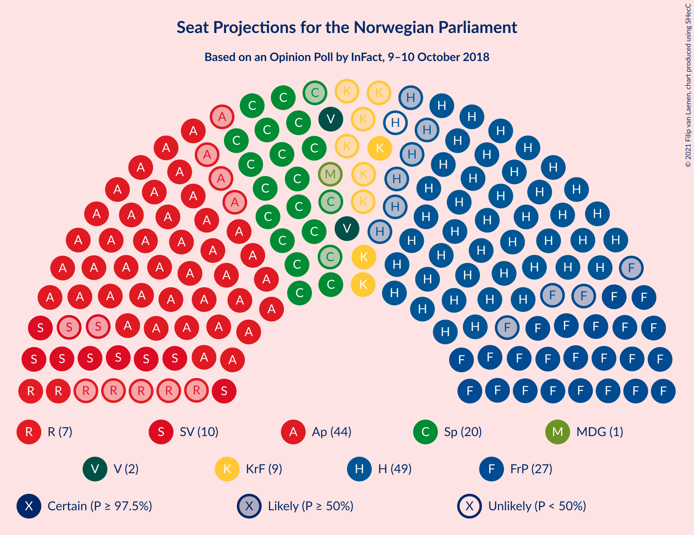
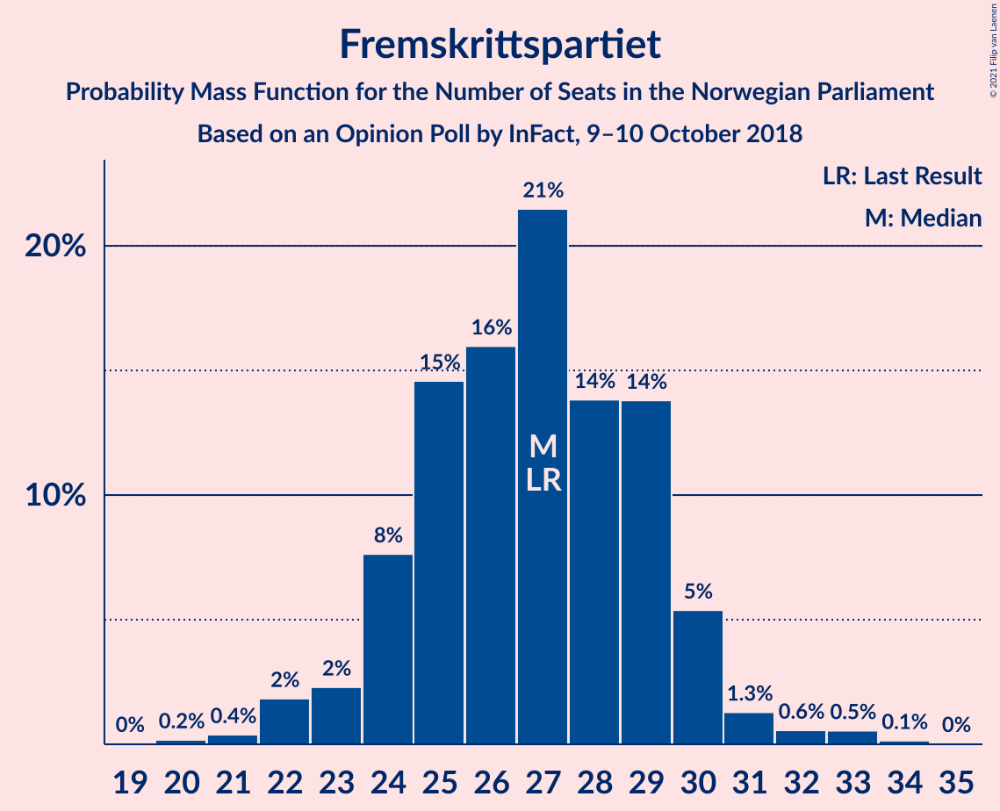
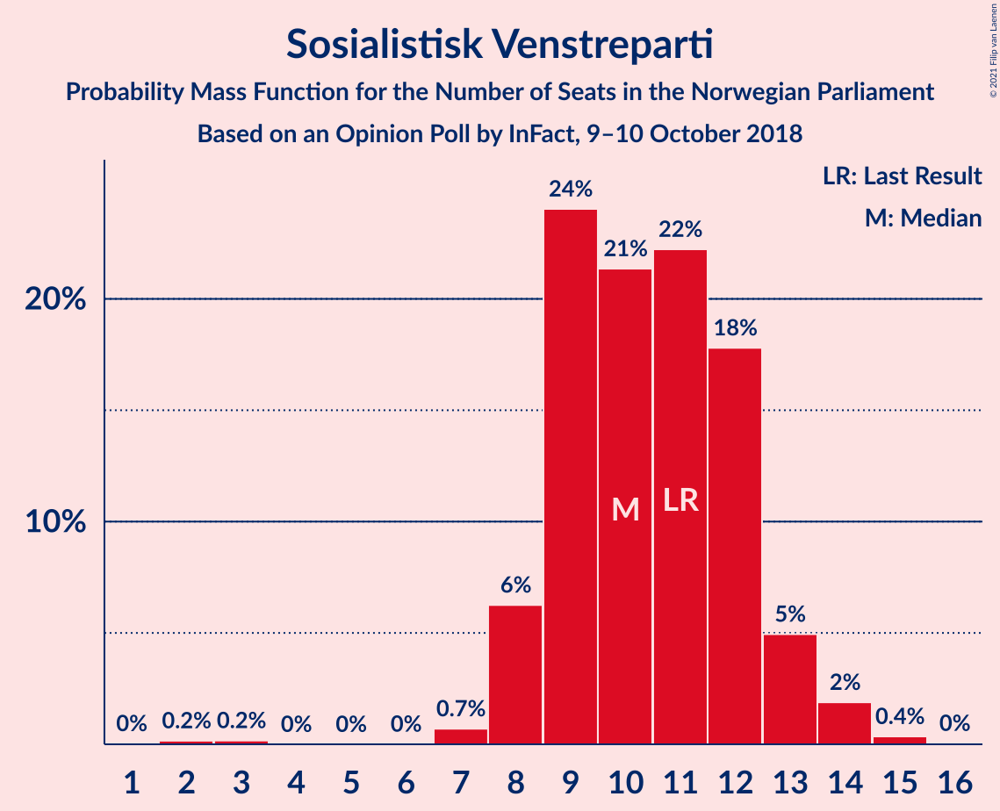
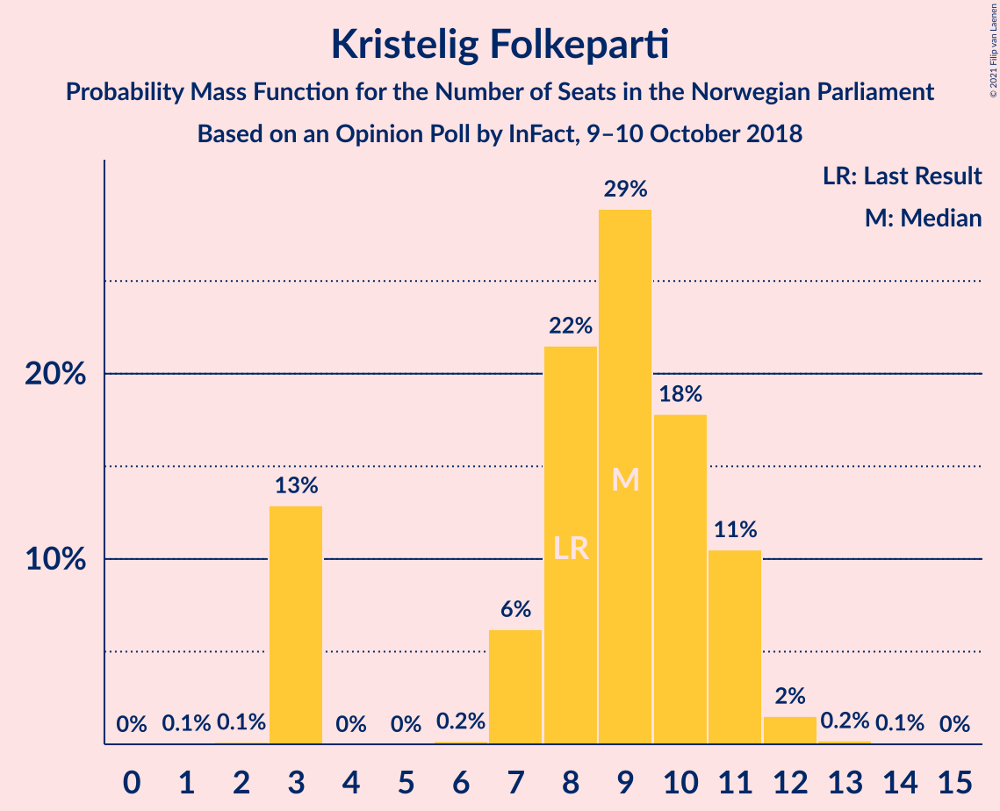
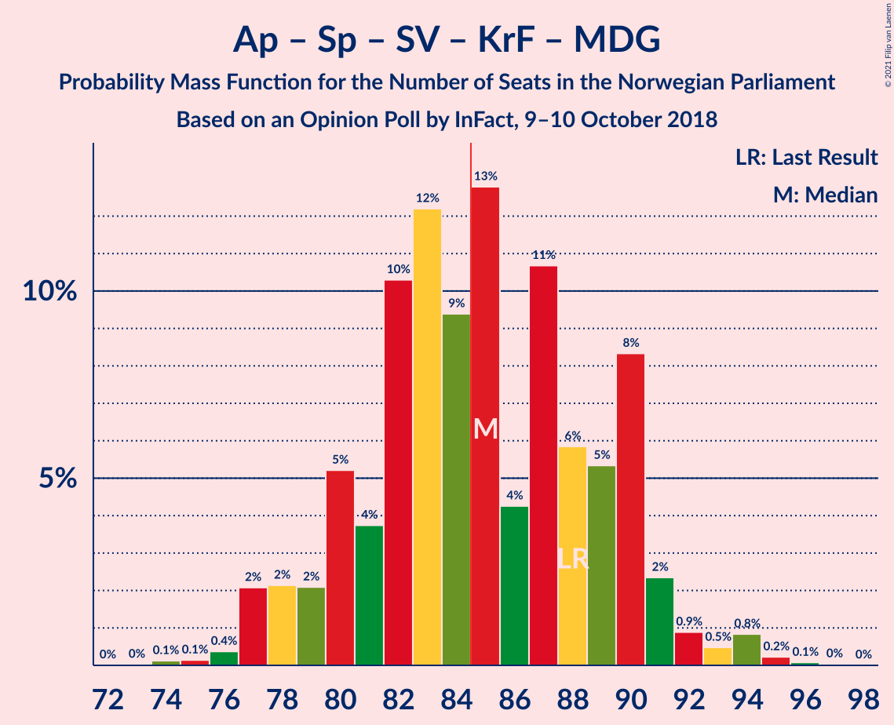
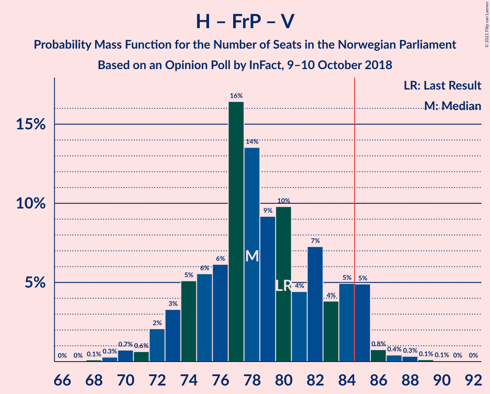
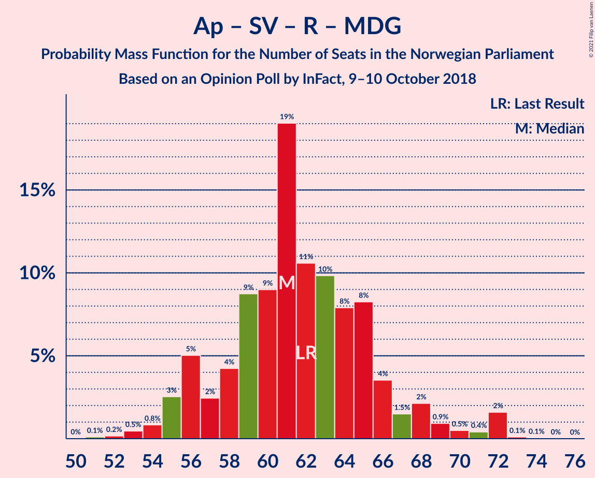
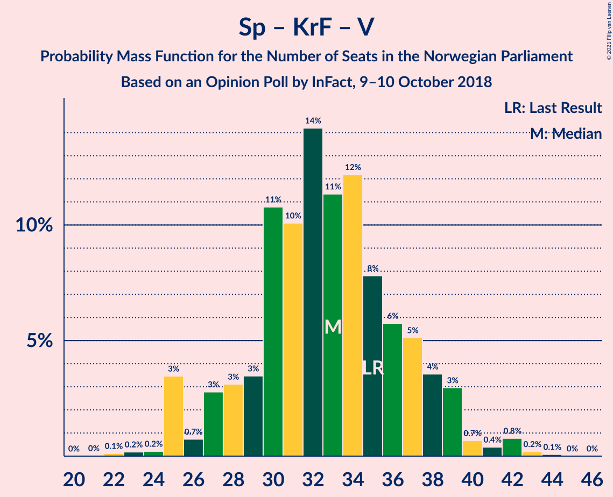

# Opinion Poll by InFact, 9–10 October 2018

<a href="#voting-intentions">Voting Intentions</a> | <a href="#seats">Seats</a> | <a href="#coalitions">Coalitions</a> | <a href="#technical-information">Technical Information</a>

## Voting Intentions

### Confidence Intervals

| Party | Last Result | Poll Result | 80% Confidence Interval | 90% Confidence Interval | 95% Confidence Interval | 99% Confidence Interval |
|:-----:|:-----------:|:-----------:|:-----------------------:|:-----------------------:|:-----------------------:|:-----------------------:|
| Høyre | 25.0% | 26.1% | 24.3–27.9% |23.9–28.4% |23.4–28.9% |22.6–29.8% |
| Arbeiderpartiet | 27.4% | 24.4% | 22.7–26.2% |22.2–26.7% |21.8–27.1% |21.0–28.0% |
| Fremskrittspartiet | 15.2% | 14.7% | 13.3–16.2% |12.9–16.6% |12.6–17.0% |12.0–17.7% |
| Senterpartiet | 10.3% | 11.2% | 10.0–12.6% |9.7–13.0% |9.4–13.3% |8.9–14.0% |
| Sosialistisk Venstreparti | 6.0% | 5.7% | 4.9–6.8% |4.7–7.1% |4.5–7.4% |4.1–7.9% |
| Kristelig Folkeparti | 4.2% | 4.8% | 4.0–5.7% |3.8–6.0% |3.6–6.3% |3.3–6.8% |
| Rødt | 2.4% | 4.1% | 3.4–5.0% |3.2–5.2% |3.0–5.5% |2.7–5.9% |
| Venstre | 4.4% | 3.8% | 3.1–4.7% |2.9–4.9% |2.8–5.1% |2.5–5.6% |
| Miljøpartiet De Grønne | 3.2% | 2.7% | 2.1–3.5% |2.0–3.7% |1.8–3.9% |1.6–4.3% |

*Note:* The poll result column reflects the actual value used in the calculations. Published results may vary slightly, and in addition be rounded to fewer digits.

## Seats

### Confidence Intervals

| Party | Last Result | Median | 80% Confidence Interval | 90% Confidence Interval | 95% Confidence Interval | 99% Confidence Interval |
|:-----:|:-----------:|:------:|:-----------------------:|:-----------------------:|:-----------------------:|:-----------------------:|
| <a href="#høyre">Høyre</a> | 45 | 48 | 44–51 |43–52 |42–54 |40–54 |
| <a href="#arbeiderpartiet">Arbeiderpartiet</a> | 49 | 44 | 41–48 |40–49 |40–50 |38–52 |
| <a href="#fremskrittspartiet">Fremskrittspartiet</a> | 27 | 27 | 24–29 |24–30 |23–31 |21–33 |
| <a href="#senterpartiet">Senterpartiet</a> | 19 | 20 | 18–23 |17–24 |17–24 |16–26 |
| <a href="#sosialistisk-venstreparti">Sosialistisk Venstreparti</a> | 11 | 10 | 9–12 |8–13 |8–13 |7–14 |
| <a href="#kristelig-folkeparti">Kristelig Folkeparti</a> | 8 | 9 | 3–11 |3–11 |3–11 |3–12 |
| <a href="#rødt">Rødt</a> | 1 | 7 | 2–9 |2–9 |2–10 |1–10 |
| <a href="#venstre">Venstre</a> | 8 | 2 | 2–8 |2–9 |2–9 |2–10 |
| <a href="#miljøpartiet-de-grønne">Miljøpartiet De Grønne</a> | 1 | 1 | 1–2 |1–2 |0–3 |0–8 |

### Høyre

*For a full overview of the results for this party, see the [Høyre](party-høyre.html) page.*

| Number of Seats | Probability | Accumulated | Special Marks |
|:---------------:|:-----------:|:-----------:|:-------------:|
| 38 | 0.1% | 100% |  |
| 39 | 0.1% | 99.9% |  |
| 40 | 0.3% | 99.8% |  |
| 41 | 1.0% | 99.5% |  |
| 42 | 3% | 98% |  |
| 43 | 3% | 95% |  |
| 44 | 6% | 92% |  |
| 45 | 9% | 86% | Last Result |
| 46 | 6% | 77% |  |
| 47 | 17% | 71% |  |
| 48 | 10% | 54% | Median |
| 49 | 15% | 44% |  |
| 50 | 13% | 30% |  |
| 51 | 10% | 17% |  |
| 52 | 3% | 7% |  |
| 53 | 1.1% | 4% |  |
| 54 | 2% | 3% |  |
| 55 | 0.2% | 0.4% |  |
| 56 | 0.1% | 0.1% |  |
| 57 | 0.1% | 0.1% |  |
| 58 | 0% | 0% |  |

### Arbeiderpartiet

*For a full overview of the results for this party, see the [Arbeiderpartiet](party-arbeiderpartiet.html) page.*

| Number of Seats | Probability | Accumulated | Special Marks |
|:---------------:|:-----------:|:-----------:|:-------------:|
| 37 | 0.2% | 100% |  |
| 38 | 0.5% | 99.8% |  |
| 39 | 1.3% | 99.3% |  |
| 40 | 4% | 98% |  |
| 41 | 5% | 94% |  |
| 42 | 13% | 89% |  |
| 43 | 17% | 76% |  |
| 44 | 12% | 59% | Median |
| 45 | 9% | 47% |  |
| 46 | 20% | 38% |  |
| 47 | 8% | 18% |  |
| 48 | 3% | 10% |  |
| 49 | 2% | 7% | Last Result |
| 50 | 3% | 4% |  |
| 51 | 1.1% | 2% |  |
| 52 | 0.3% | 0.5% |  |
| 53 | 0.1% | 0.2% |  |
| 54 | 0.1% | 0.1% |  |
| 55 | 0% | 0% |  |

### Fremskrittspartiet

*For a full overview of the results for this party, see the [Fremskrittspartiet](party-fremskrittspartiet.html) page.*

| Number of Seats | Probability | Accumulated | Special Marks |
|:---------------:|:-----------:|:-----------:|:-------------:|
| 20 | 0.2% | 100% |  |
| 21 | 0.4% | 99.8% |  |
| 22 | 2% | 99.4% |  |
| 23 | 2% | 98% |  |
| 24 | 8% | 95% |  |
| 25 | 15% | 88% |  |
| 26 | 16% | 73% |  |
| 27 | 21% | 57% | Last Result, Median |
| 28 | 14% | 36% |  |
| 29 | 14% | 22% |  |
| 30 | 5% | 8% |  |
| 31 | 1.3% | 3% |  |
| 32 | 0.6% | 1.3% |  |
| 33 | 0.5% | 0.7% |  |
| 34 | 0.1% | 0.2% |  |
| 35 | 0% | 0% |  |

### Senterpartiet

*For a full overview of the results for this party, see the [Senterpartiet](party-senterpartiet.html) page.*

| Number of Seats | Probability | Accumulated | Special Marks |
|:---------------:|:-----------:|:-----------:|:-------------:|
| 15 | 0.2% | 100% |  |
| 16 | 0.8% | 99.8% |  |
| 17 | 6% | 99.0% |  |
| 18 | 10% | 93% |  |
| 19 | 16% | 83% | Last Result |
| 20 | 25% | 67% | Median |
| 21 | 16% | 42% |  |
| 22 | 11% | 26% |  |
| 23 | 9% | 15% |  |
| 24 | 4% | 6% |  |
| 25 | 1.3% | 2% |  |
| 26 | 0.5% | 0.8% |  |
| 27 | 0.3% | 0.3% |  |
| 28 | 0% | 0.1% |  |
| 29 | 0% | 0% |  |

### Sosialistisk Venstreparti

*For a full overview of the results for this party, see the [Sosialistisk Venstreparti](party-sosialistiskvenstreparti.html) page.*

| Number of Seats | Probability | Accumulated | Special Marks |
|:---------------:|:-----------:|:-----------:|:-------------:|
| 2 | 0.2% | 100% |  |
| 3 | 0.2% | 99.8% |  |
| 4 | 0% | 99.6% |  |
| 5 | 0% | 99.6% |  |
| 6 | 0% | 99.6% |  |
| 7 | 0.7% | 99.6% |  |
| 8 | 6% | 98.9% |  |
| 9 | 24% | 93% |  |
| 10 | 21% | 69% | Median |
| 11 | 22% | 47% | Last Result |
| 12 | 18% | 25% |  |
| 13 | 5% | 7% |  |
| 14 | 2% | 2% |  |
| 15 | 0.4% | 0.4% |  |
| 16 | 0% | 0% |  |

### Kristelig Folkeparti

*For a full overview of the results for this party, see the [Kristelig Folkeparti](party-kristeligfolkeparti.html) page.*

| Number of Seats | Probability | Accumulated | Special Marks |
|:---------------:|:-----------:|:-----------:|:-------------:|
| 1 | 0.1% | 100% |  |
| 2 | 0.1% | 99.9% |  |
| 3 | 13% | 99.8% |  |
| 4 | 0% | 87% |  |
| 5 | 0% | 87% |  |
| 6 | 0.2% | 87% |  |
| 7 | 6% | 87% |  |
| 8 | 22% | 81% | Last Result |
| 9 | 29% | 59% | Median |
| 10 | 18% | 30% |  |
| 11 | 11% | 12% |  |
| 12 | 2% | 2% |  |
| 13 | 0.2% | 0.3% |  |
| 14 | 0.1% | 0.1% |  |
| 15 | 0% | 0% |  |

### Rødt

*For a full overview of the results for this party, see the [Rødt](party-rødt.html) page.*

| Number of Seats | Probability | Accumulated | Special Marks |
|:---------------:|:-----------:|:-----------:|:-------------:|
| 1 | 2% | 100% | Last Result |
| 2 | 41% | 98% |  |
| 3 | 0% | 57% |  |
| 4 | 0% | 57% |  |
| 5 | 0% | 57% |  |
| 6 | 0.2% | 57% |  |
| 7 | 19% | 57% | Median |
| 8 | 22% | 38% |  |
| 9 | 12% | 16% |  |
| 10 | 3% | 3% |  |
| 11 | 0.4% | 0.5% |  |
| 12 | 0% | 0% |  |

### Venstre

*For a full overview of the results for this party, see the [Venstre](party-venstre.html) page.*

| Number of Seats | Probability | Accumulated | Special Marks |
|:---------------:|:-----------:|:-----------:|:-------------:|
| 1 | 0.2% | 100% |  |
| 2 | 58% | 99.8% | Median |
| 3 | 9% | 42% |  |
| 4 | 0% | 33% |  |
| 5 | 0% | 33% |  |
| 6 | 0.1% | 33% |  |
| 7 | 12% | 33% |  |
| 8 | 15% | 21% | Last Result |
| 9 | 5% | 6% |  |
| 10 | 1.3% | 1.4% |  |
| 11 | 0.1% | 0.1% |  |
| 12 | 0% | 0% |  |

### Miljøpartiet De Grønne

*For a full overview of the results for this party, see the [Miljøpartiet De Grønne](party-miljøpartietdegrønne.html) page.*

| Number of Seats | Probability | Accumulated | Special Marks |
|:---------------:|:-----------:|:-----------:|:-------------:|
| 0 | 4% | 100% |  |
| 1 | 63% | 96% | Last Result, Median |
| 2 | 31% | 34% |  |
| 3 | 2% | 3% |  |
| 4 | 0.2% | 1.3% |  |
| 5 | 0% | 1.2% |  |
| 6 | 0% | 1.2% |  |
| 7 | 0.6% | 1.2% |  |
| 8 | 0.5% | 0.6% |  |
| 9 | 0% | 0% |  |

## Coalitions

### Confidence Intervals

| Coalition | Last Result | Median | Majority? | 80% Confidence Interval | 90% Confidence Interval | 95% Confidence Interval | 99% Confidence Interval |
|:---------:|:-----------:|:------:|:---------:|:-----------------------:|:-----------------------:|:-----------------------:|:-----------------------:|
| Høyre – Fremskrittspartiet – Senterpartiet – Kristelig Folkeparti – Venstre | 107 | 108 | 100% | 103–112 | 101–113 | 99–114 | 97–116 |
| Høyre – Fremskrittspartiet – Kristelig Folkeparti – Venstre – Miljøpartiet De Grønne | 89 | 88 | 85% | 84–93 | 82–94 | 80–95 | 78–98 |
| Høyre – Fremskrittspartiet – Kristelig Folkeparti – Venstre | 88 | 87 | 77% | 82–92 | 80–93 | 79–94 | 77–96 |
| Arbeiderpartiet – Senterpartiet – Sosialistisk Venstreparti – Kristelig Folkeparti – Miljøpartiet De Grønne | 88 | 85 | 52% | 80–90 | 79–90 | 77–92 | 76–94 |
| Arbeiderpartiet – Senterpartiet – Sosialistisk Venstreparti – Rødt – Miljøpartiet De Grønne | 81 | 82 | 22% | 77–87 | 76–89 | 75–90 | 73–92 |
| Arbeiderpartiet – Senterpartiet – Sosialistisk Venstreparti – Rødt | 80 | 81 | 14% | 76–85 | 75–87 | 74–89 | 71–91 |
| Høyre – Fremskrittspartiet – Venstre | 80 | 78 | 7% | 74–84 | 73–85 | 72–85 | 70–88 |
| Arbeiderpartiet – Senterpartiet – Sosialistisk Venstreparti – Miljøpartiet De Grønne | 80 | 76 | 1.3% | 72–81 | 71–82 | 69–84 | 68–86 |
| Arbeiderpartiet – Senterpartiet – Sosialistisk Venstreparti | 79 | 75 | 0.5% | 71–80 | 70–81 | 68–82 | 67–85 |
| Høyre – Fremskrittspartiet | 72 | 75 | 0.1% | 70–78 | 69–80 | 68–82 | 66–83 |
| Arbeiderpartiet – Senterpartiet – Kristelig Folkeparti – Miljøpartiet De Grønne | 77 | 74 | 0.2% | 70–79 | 69–80 | 68–81 | 66–84 |
| Arbeiderpartiet – Senterpartiet – Kristelig Folkeparti | 76 | 73 | 0% | 69–77 | 68–78 | 66–80 | 65–82 |
| Arbeiderpartiet – Senterpartiet | 68 | 65 | 0% | 61–69 | 60–70 | 59–71 | 57–74 |
| Arbeiderpartiet – Sosialistisk Venstreparti – Rødt – Miljøpartiet De Grønne | 62 | 61 | 0% | 57–66 | 56–68 | 55–70 | 53–72 |
| Høyre – Kristelig Folkeparti – Venstre | 61 | 60 | 0% | 55–65 | 54–67 | 52–68 | 50–70 |
| Arbeiderpartiet – Sosialistisk Venstreparti | 60 | 55 | 0% | 51–58 | 50–60 | 49–62 | 48–62 |
| Senterpartiet – Kristelig Folkeparti – Venstre | 35 | 33 | 0% | 28–37 | 27–39 | 25–39 | 24–42 |

### Høyre – Fremskrittspartiet – Senterpartiet – Kristelig Folkeparti – Venstre

| Number of Seats | Probability | Accumulated | Special Marks |
|:---------------:|:-----------:|:-----------:|:-------------:|
| 95 | 0.1% | 100% |  |
| 96 | 0.1% | 99.9% |  |
| 97 | 2% | 99.8% |  |
| 98 | 0.5% | 98% |  |
| 99 | 0.5% | 98% |  |
| 100 | 1.2% | 97% |  |
| 101 | 2% | 96% |  |
| 102 | 2% | 93% |  |
| 103 | 4% | 92% |  |
| 104 | 8% | 88% |  |
| 105 | 8% | 80% |  |
| 106 | 10% | 72% | Median |
| 107 | 10% | 62% | Last Result |
| 108 | 19% | 52% |  |
| 109 | 9% | 33% |  |
| 110 | 9% | 24% |  |
| 111 | 4% | 15% |  |
| 112 | 2% | 11% |  |
| 113 | 5% | 9% |  |
| 114 | 2% | 4% |  |
| 115 | 0.8% | 2% |  |
| 116 | 0.4% | 0.7% |  |
| 117 | 0.2% | 0.3% |  |
| 118 | 0.1% | 0.1% |  |
| 119 | 0% | 0% |  |

### Høyre – Fremskrittspartiet – Kristelig Folkeparti – Venstre – Miljøpartiet De Grønne

| Number of Seats | Probability | Accumulated | Special Marks |
|:---------------:|:-----------:|:-----------:|:-------------:|
| 75 | 0.1% | 100% |  |
| 76 | 0.1% | 99.9% |  |
| 77 | 0.1% | 99.8% |  |
| 78 | 1.3% | 99.7% |  |
| 79 | 0.6% | 98% |  |
| 80 | 0.6% | 98% |  |
| 81 | 2% | 97% |  |
| 82 | 3% | 96% |  |
| 83 | 2% | 93% |  |
| 84 | 5% | 90% |  |
| 85 | 6% | 85% | Majority |
| 86 | 7% | 80% |  |
| 87 | 7% | 73% | Median |
| 88 | 17% | 65% |  |
| 89 | 13% | 49% | Last Result |
| 90 | 11% | 36% |  |
| 91 | 7% | 25% |  |
| 92 | 5% | 18% |  |
| 93 | 5% | 13% |  |
| 94 | 3% | 8% |  |
| 95 | 3% | 5% |  |
| 96 | 0.6% | 2% |  |
| 97 | 0.6% | 1.1% |  |
| 98 | 0.4% | 0.5% |  |
| 99 | 0.1% | 0.2% |  |
| 100 | 0.1% | 0.1% |  |
| 101 | 0% | 0% |  |

### Høyre – Fremskrittspartiet – Kristelig Folkeparti – Venstre

| Number of Seats | Probability | Accumulated | Special Marks |
|:---------------:|:-----------:|:-----------:|:-------------:|
| 74 | 0.1% | 100% |  |
| 75 | 0.1% | 99.9% |  |
| 76 | 0.1% | 99.8% |  |
| 77 | 1.3% | 99.7% |  |
| 78 | 0.7% | 98% |  |
| 79 | 0.7% | 98% |  |
| 80 | 2% | 97% |  |
| 81 | 2% | 95% |  |
| 82 | 3% | 92% |  |
| 83 | 6% | 89% |  |
| 84 | 7% | 84% |  |
| 85 | 7% | 77% | Majority |
| 86 | 13% | 70% | Median |
| 87 | 13% | 57% |  |
| 88 | 12% | 44% | Last Result |
| 89 | 9% | 31% |  |
| 90 | 7% | 23% |  |
| 91 | 4% | 15% |  |
| 92 | 4% | 11% |  |
| 93 | 4% | 7% |  |
| 94 | 1.3% | 3% |  |
| 95 | 0.6% | 1.5% |  |
| 96 | 0.6% | 0.8% |  |
| 97 | 0.1% | 0.3% |  |
| 98 | 0.1% | 0.1% |  |
| 99 | 0% | 0% |  |

### Arbeiderpartiet – Senterpartiet – Sosialistisk Venstreparti – Kristelig Folkeparti – Miljøpartiet De Grønne

| Number of Seats | Probability | Accumulated | Special Marks |
|:---------------:|:-----------:|:-----------:|:-------------:|
| 74 | 0.1% | 100% |  |
| 75 | 0.1% | 99.8% |  |
| 76 | 0.4% | 99.7% |  |
| 77 | 2% | 99.3% |  |
| 78 | 2% | 97% |  |
| 79 | 2% | 95% |  |
| 80 | 5% | 93% |  |
| 81 | 4% | 88% |  |
| 82 | 10% | 84% |  |
| 83 | 12% | 74% |  |
| 84 | 9% | 62% | Median |
| 85 | 13% | 52% | Majority |
| 86 | 4% | 39% |  |
| 87 | 11% | 35% |  |
| 88 | 6% | 24% | Last Result |
| 89 | 5% | 19% |  |
| 90 | 8% | 13% |  |
| 91 | 2% | 5% |  |
| 92 | 0.9% | 3% |  |
| 93 | 0.5% | 2% |  |
| 94 | 0.8% | 1.2% |  |
| 95 | 0.2% | 0.4% |  |
| 96 | 0.1% | 0.1% |  |
| 97 | 0% | 0.1% |  |
| 98 | 0% | 0% |  |

### Arbeiderpartiet – Senterpartiet – Sosialistisk Venstreparti – Rødt – Miljøpartiet De Grønne

| Number of Seats | Probability | Accumulated | Special Marks |
|:---------------:|:-----------:|:-----------:|:-------------:|
| 71 | 0.2% | 100% |  |
| 72 | 0.2% | 99.8% |  |
| 73 | 0.6% | 99.6% |  |
| 74 | 0.7% | 99.0% |  |
| 75 | 1.4% | 98% |  |
| 76 | 5% | 97% |  |
| 77 | 4% | 92% |  |
| 78 | 4% | 88% |  |
| 79 | 8% | 84% |  |
| 80 | 9% | 77% |  |
| 81 | 13% | 68% | Last Result |
| 82 | 13% | 55% | Median |
| 83 | 13% | 42% |  |
| 84 | 7% | 29% |  |
| 85 | 6% | 22% | Majority |
| 86 | 6% | 16% |  |
| 87 | 3% | 10% |  |
| 88 | 2% | 7% |  |
| 89 | 2% | 5% |  |
| 90 | 0.7% | 3% |  |
| 91 | 0.7% | 2% |  |
| 92 | 1.3% | 2% |  |
| 93 | 0.1% | 0.3% |  |
| 94 | 0.1% | 0.2% |  |
| 95 | 0.1% | 0.1% |  |
| 96 | 0% | 0% |  |

### Arbeiderpartiet – Senterpartiet – Sosialistisk Venstreparti – Rødt

| Number of Seats | Probability | Accumulated | Special Marks |
|:---------------:|:-----------:|:-----------:|:-------------:|
| 69 | 0.1% | 100% |  |
| 70 | 0.2% | 99.9% |  |
| 71 | 0.4% | 99.8% |  |
| 72 | 0.6% | 99.4% |  |
| 73 | 0.6% | 98.8% |  |
| 74 | 3% | 98% |  |
| 75 | 3% | 95% |  |
| 76 | 5% | 92% |  |
| 77 | 5% | 87% |  |
| 78 | 8% | 82% |  |
| 79 | 11% | 74% |  |
| 80 | 13% | 63% | Last Result |
| 81 | 17% | 50% | Median |
| 82 | 7% | 33% |  |
| 83 | 7% | 26% |  |
| 84 | 6% | 19% |  |
| 85 | 5% | 14% | Majority |
| 86 | 2% | 9% |  |
| 87 | 3% | 7% |  |
| 88 | 1.4% | 4% |  |
| 89 | 0.6% | 3% |  |
| 90 | 0.5% | 2% |  |
| 91 | 1.3% | 1.5% |  |
| 92 | 0.1% | 0.2% |  |
| 93 | 0.1% | 0.2% |  |
| 94 | 0.1% | 0.1% |  |
| 95 | 0% | 0% |  |

### Høyre – Fremskrittspartiet – Venstre

| Number of Seats | Probability | Accumulated | Special Marks |
|:---------------:|:-----------:|:-----------:|:-------------:|
| 68 | 0.1% | 100% |  |
| 69 | 0.3% | 99.9% |  |
| 70 | 0.7% | 99.6% |  |
| 71 | 0.6% | 98.8% |  |
| 72 | 2% | 98% |  |
| 73 | 3% | 96% |  |
| 74 | 5% | 93% |  |
| 75 | 6% | 88% |  |
| 76 | 6% | 82% |  |
| 77 | 16% | 76% | Median |
| 78 | 14% | 60% |  |
| 79 | 9% | 46% |  |
| 80 | 10% | 37% | Last Result |
| 81 | 4% | 27% |  |
| 82 | 7% | 23% |  |
| 83 | 4% | 15% |  |
| 84 | 5% | 12% |  |
| 85 | 5% | 7% | Majority |
| 86 | 0.8% | 2% |  |
| 87 | 0.4% | 1.0% |  |
| 88 | 0.3% | 0.6% |  |
| 89 | 0.1% | 0.2% |  |
| 90 | 0.1% | 0.1% |  |
| 91 | 0% | 0.1% |  |
| 92 | 0% | 0% |  |

### Arbeiderpartiet – Senterpartiet – Sosialistisk Venstreparti – Miljøpartiet De Grønne

| Number of Seats | Probability | Accumulated | Special Marks |
|:---------------:|:-----------:|:-----------:|:-------------:|
| 66 | 0.1% | 100% |  |
| 67 | 0.1% | 99.9% |  |
| 68 | 0.6% | 99.8% |  |
| 69 | 2% | 99.2% |  |
| 70 | 2% | 97% |  |
| 71 | 3% | 95% |  |
| 72 | 3% | 93% |  |
| 73 | 13% | 89% |  |
| 74 | 8% | 76% |  |
| 75 | 8% | 68% | Median |
| 76 | 12% | 60% |  |
| 77 | 11% | 48% |  |
| 78 | 6% | 37% |  |
| 79 | 8% | 31% |  |
| 80 | 7% | 23% | Last Result |
| 81 | 7% | 16% |  |
| 82 | 4% | 9% |  |
| 83 | 2% | 5% |  |
| 84 | 1.4% | 3% |  |
| 85 | 0.5% | 1.3% | Majority |
| 86 | 0.6% | 0.8% |  |
| 87 | 0.1% | 0.2% |  |
| 88 | 0.1% | 0.1% |  |
| 89 | 0% | 0% |  |

### Arbeiderpartiet – Senterpartiet – Sosialistisk Venstreparti

| Number of Seats | Probability | Accumulated | Special Marks |
|:---------------:|:-----------:|:-----------:|:-------------:|
| 65 | 0.1% | 100% |  |
| 66 | 0.1% | 99.9% |  |
| 67 | 1.3% | 99.7% |  |
| 68 | 1.1% | 98% |  |
| 69 | 2% | 97% |  |
| 70 | 3% | 95% |  |
| 71 | 4% | 92% |  |
| 72 | 16% | 88% |  |
| 73 | 8% | 72% |  |
| 74 | 10% | 64% | Median |
| 75 | 9% | 54% |  |
| 76 | 11% | 45% |  |
| 77 | 7% | 34% |  |
| 78 | 4% | 27% |  |
| 79 | 10% | 23% | Last Result |
| 80 | 5% | 12% |  |
| 81 | 3% | 7% |  |
| 82 | 2% | 4% |  |
| 83 | 0.9% | 2% |  |
| 84 | 0.5% | 1.0% |  |
| 85 | 0.4% | 0.5% | Majority |
| 86 | 0.1% | 0.1% |  |
| 87 | 0% | 0% |  |

### Høyre – Fremskrittspartiet

| Number of Seats | Probability | Accumulated | Special Marks |
|:---------------:|:-----------:|:-----------:|:-------------:|
| 63 | 0% | 100% |  |
| 64 | 0.1% | 99.9% |  |
| 65 | 0.1% | 99.8% |  |
| 66 | 0.4% | 99.7% |  |
| 67 | 0.5% | 99.3% |  |
| 68 | 2% | 98.8% |  |
| 69 | 3% | 97% |  |
| 70 | 5% | 94% |  |
| 71 | 6% | 90% |  |
| 72 | 9% | 84% | Last Result |
| 73 | 8% | 75% |  |
| 74 | 9% | 67% |  |
| 75 | 20% | 58% | Median |
| 76 | 20% | 39% |  |
| 77 | 5% | 19% |  |
| 78 | 5% | 14% |  |
| 79 | 3% | 9% |  |
| 80 | 2% | 6% |  |
| 81 | 0.7% | 4% |  |
| 82 | 0.9% | 3% |  |
| 83 | 2% | 2% |  |
| 84 | 0.2% | 0.3% |  |
| 85 | 0% | 0.1% | Majority |
| 86 | 0% | 0% |  |

### Arbeiderpartiet – Senterpartiet – Kristelig Folkeparti – Miljøpartiet De Grønne

| Number of Seats | Probability | Accumulated | Special Marks |
|:---------------:|:-----------:|:-----------:|:-------------:|
| 63 | 0% | 100% |  |
| 64 | 0.1% | 99.9% |  |
| 65 | 0.2% | 99.8% |  |
| 66 | 0.5% | 99.6% |  |
| 67 | 1.0% | 99.2% |  |
| 68 | 2% | 98% |  |
| 69 | 3% | 96% |  |
| 70 | 5% | 93% |  |
| 71 | 8% | 88% |  |
| 72 | 8% | 80% |  |
| 73 | 9% | 72% |  |
| 74 | 16% | 62% | Median |
| 75 | 8% | 47% |  |
| 76 | 13% | 39% |  |
| 77 | 7% | 26% | Last Result |
| 78 | 5% | 19% |  |
| 79 | 8% | 13% |  |
| 80 | 2% | 5% |  |
| 81 | 0.9% | 3% |  |
| 82 | 0.9% | 2% |  |
| 83 | 0.8% | 2% |  |
| 84 | 0.5% | 0.7% |  |
| 85 | 0.1% | 0.2% | Majority |
| 86 | 0.1% | 0.1% |  |
| 87 | 0% | 0% |  |

### Arbeiderpartiet – Senterpartiet – Kristelig Folkeparti

| Number of Seats | Probability | Accumulated | Special Marks |
|:---------------:|:-----------:|:-----------:|:-------------:|
| 62 | 0% | 100% |  |
| 63 | 0.1% | 99.9% |  |
| 64 | 0.3% | 99.8% |  |
| 65 | 0.5% | 99.5% |  |
| 66 | 2% | 99.0% |  |
| 67 | 2% | 97% |  |
| 68 | 3% | 96% |  |
| 69 | 6% | 92% |  |
| 70 | 10% | 86% |  |
| 71 | 5% | 76% |  |
| 72 | 14% | 71% |  |
| 73 | 15% | 56% | Median |
| 74 | 9% | 42% |  |
| 75 | 9% | 32% |  |
| 76 | 6% | 23% | Last Result |
| 77 | 8% | 17% |  |
| 78 | 5% | 9% |  |
| 79 | 1.5% | 4% |  |
| 80 | 0.5% | 3% |  |
| 81 | 1.1% | 2% |  |
| 82 | 0.6% | 1.0% |  |
| 83 | 0.3% | 0.3% |  |
| 84 | 0% | 0.1% |  |
| 85 | 0% | 0% | Majority |

### Arbeiderpartiet – Senterpartiet

| Number of Seats | Probability | Accumulated | Special Marks |
|:---------------:|:-----------:|:-----------:|:-------------:|
| 56 | 0.2% | 100% |  |
| 57 | 0.3% | 99.7% |  |
| 58 | 2% | 99.4% |  |
| 59 | 2% | 98% |  |
| 60 | 3% | 96% |  |
| 61 | 5% | 92% |  |
| 62 | 12% | 88% |  |
| 63 | 16% | 76% |  |
| 64 | 8% | 60% | Median |
| 65 | 14% | 52% |  |
| 66 | 8% | 38% |  |
| 67 | 11% | 30% |  |
| 68 | 7% | 19% | Last Result |
| 69 | 5% | 12% |  |
| 70 | 3% | 7% |  |
| 71 | 2% | 4% |  |
| 72 | 1.4% | 2% |  |
| 73 | 0.4% | 1.1% |  |
| 74 | 0.4% | 0.7% |  |
| 75 | 0.2% | 0.3% |  |
| 76 | 0.1% | 0.1% |  |
| 77 | 0% | 0% |  |

### Arbeiderpartiet – Sosialistisk Venstreparti – Rødt – Miljøpartiet De Grønne

| Number of Seats | Probability | Accumulated | Special Marks |
|:---------------:|:-----------:|:-----------:|:-------------:|
| 51 | 0.1% | 100% |  |
| 52 | 0.2% | 99.9% |  |
| 53 | 0.5% | 99.7% |  |
| 54 | 0.8% | 99.2% |  |
| 55 | 3% | 98% |  |
| 56 | 5% | 96% |  |
| 57 | 2% | 91% |  |
| 58 | 4% | 88% |  |
| 59 | 9% | 84% |  |
| 60 | 9% | 75% |  |
| 61 | 19% | 66% |  |
| 62 | 11% | 47% | Last Result, Median |
| 63 | 10% | 37% |  |
| 64 | 8% | 27% |  |
| 65 | 8% | 19% |  |
| 66 | 4% | 11% |  |
| 67 | 1.5% | 7% |  |
| 68 | 2% | 6% |  |
| 69 | 0.9% | 4% |  |
| 70 | 0.5% | 3% |  |
| 71 | 0.4% | 2% |  |
| 72 | 2% | 2% |  |
| 73 | 0.1% | 0.2% |  |
| 74 | 0.1% | 0.1% |  |
| 75 | 0% | 0% |  |

### Høyre – Kristelig Folkeparti – Venstre

| Number of Seats | Probability | Accumulated | Special Marks |
|:---------------:|:-----------:|:-----------:|:-------------:|
| 47 | 0.1% | 100% |  |
| 48 | 0.1% | 99.9% |  |
| 49 | 0.2% | 99.8% |  |
| 50 | 1.2% | 99.6% |  |
| 51 | 0.3% | 98% |  |
| 52 | 0.6% | 98% |  |
| 53 | 2% | 97% |  |
| 54 | 2% | 95% |  |
| 55 | 4% | 93% |  |
| 56 | 5% | 90% |  |
| 57 | 6% | 85% |  |
| 58 | 8% | 79% |  |
| 59 | 14% | 71% | Median |
| 60 | 14% | 57% |  |
| 61 | 12% | 43% | Last Result |
| 62 | 6% | 31% |  |
| 63 | 7% | 24% |  |
| 64 | 2% | 17% |  |
| 65 | 5% | 15% |  |
| 66 | 3% | 10% |  |
| 67 | 4% | 7% |  |
| 68 | 1.1% | 3% |  |
| 69 | 0.7% | 1.4% |  |
| 70 | 0.6% | 0.7% |  |
| 71 | 0.1% | 0.1% |  |
| 72 | 0% | 0% |  |

### Arbeiderpartiet – Sosialistisk Venstreparti

| Number of Seats | Probability | Accumulated | Special Marks |
|:---------------:|:-----------:|:-----------:|:-------------:|
| 46 | 0.1% | 100% |  |
| 47 | 0.3% | 99.8% |  |
| 48 | 1.0% | 99.5% |  |
| 49 | 2% | 98.6% |  |
| 50 | 4% | 97% |  |
| 51 | 5% | 92% |  |
| 52 | 16% | 88% |  |
| 53 | 8% | 72% |  |
| 54 | 11% | 64% | Median |
| 55 | 12% | 53% |  |
| 56 | 8% | 41% |  |
| 57 | 12% | 33% |  |
| 58 | 11% | 21% |  |
| 59 | 4% | 10% |  |
| 60 | 2% | 6% | Last Result |
| 61 | 2% | 5% |  |
| 62 | 2% | 3% |  |
| 63 | 0.3% | 0.4% |  |
| 64 | 0.1% | 0.2% |  |
| 65 | 0.1% | 0.1% |  |
| 66 | 0% | 0% |  |

### Senterpartiet – Kristelig Folkeparti – Venstre

| Number of Seats | Probability | Accumulated | Special Marks |
|:---------------:|:-----------:|:-----------:|:-------------:|
| 22 | 0.1% | 100% |  |
| 23 | 0.2% | 99.9% |  |
| 24 | 0.2% | 99.7% |  |
| 25 | 3% | 99.5% |  |
| 26 | 0.7% | 96% |  |
| 27 | 3% | 95% |  |
| 28 | 3% | 92% |  |
| 29 | 3% | 89% |  |
| 30 | 11% | 86% |  |
| 31 | 10% | 75% | Median |
| 32 | 14% | 65% |  |
| 33 | 11% | 51% |  |
| 34 | 12% | 39% |  |
| 35 | 8% | 27% | Last Result |
| 36 | 6% | 20% |  |
| 37 | 5% | 14% |  |
| 38 | 4% | 9% |  |
| 39 | 3% | 5% |  |
| 40 | 0.7% | 2% |  |
| 41 | 0.4% | 1.4% |  |
| 42 | 0.8% | 1.1% |  |
| 43 | 0.2% | 0.3% |  |
| 44 | 0.1% | 0.1% |  |
| 45 | 0% | 0% |  |

## Technical Information

### Opinion Poll

+ **Polling firm:** InFact
+ **Commissioner(s):** —
+ **Fieldwork period:** 9–10 October 2018

### Calculations

+ **Sample size:** 1009
+ **Simulations done:** 1,048,576
+ **Error estimate:** 1.77%

