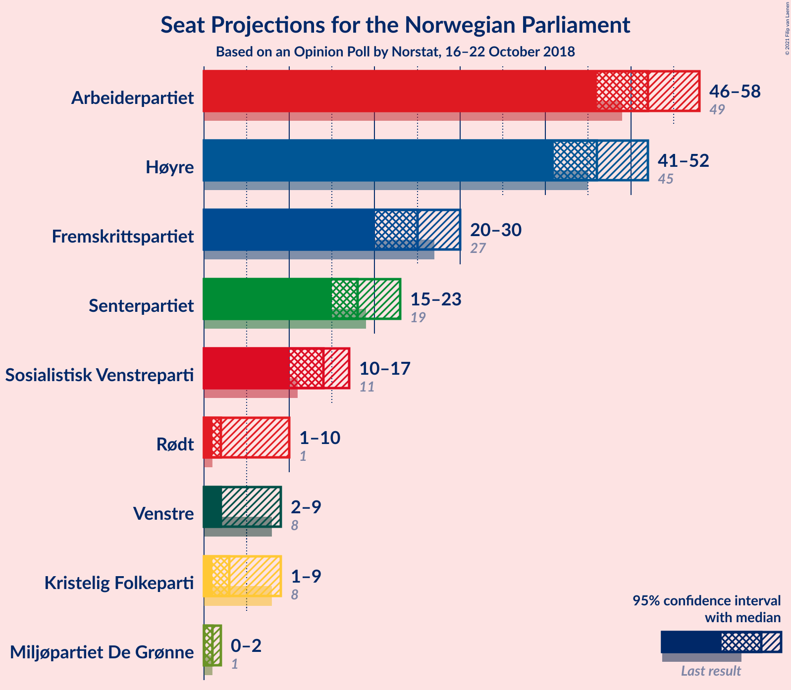
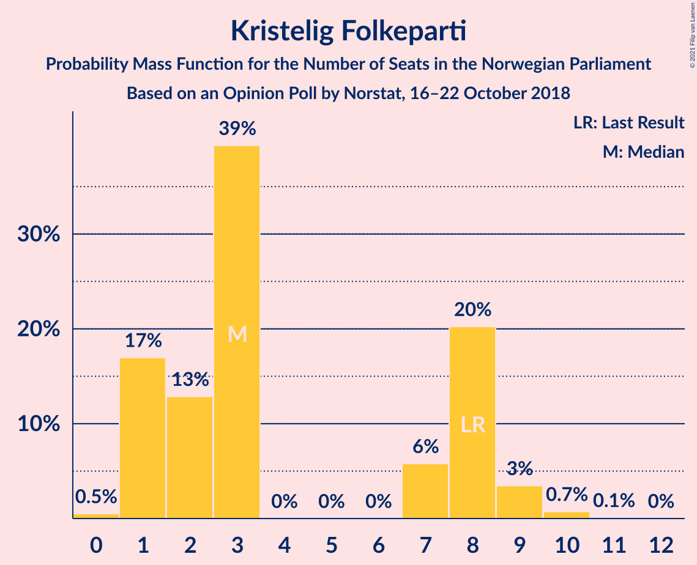
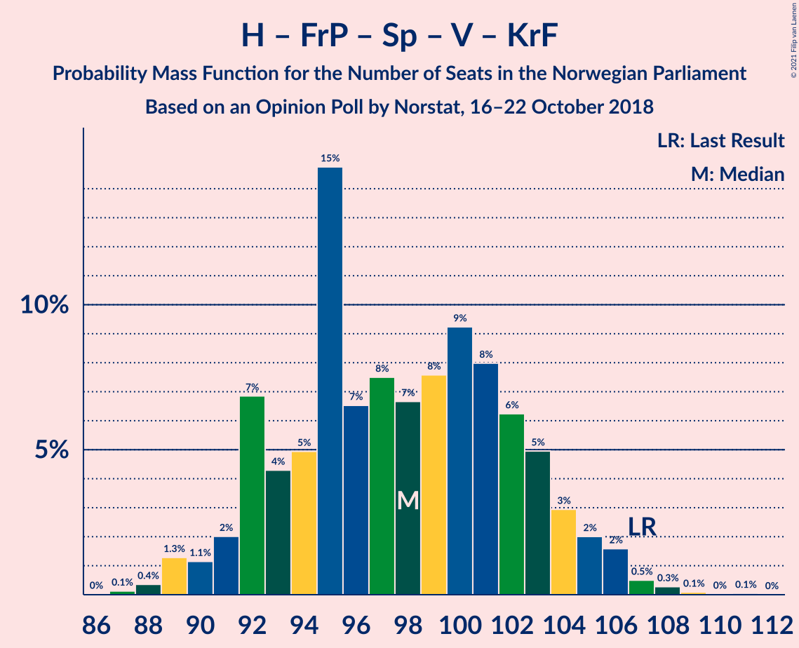
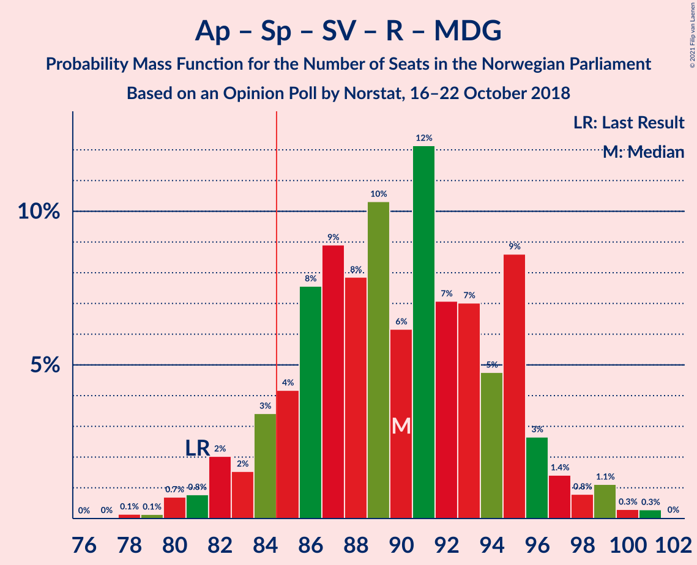
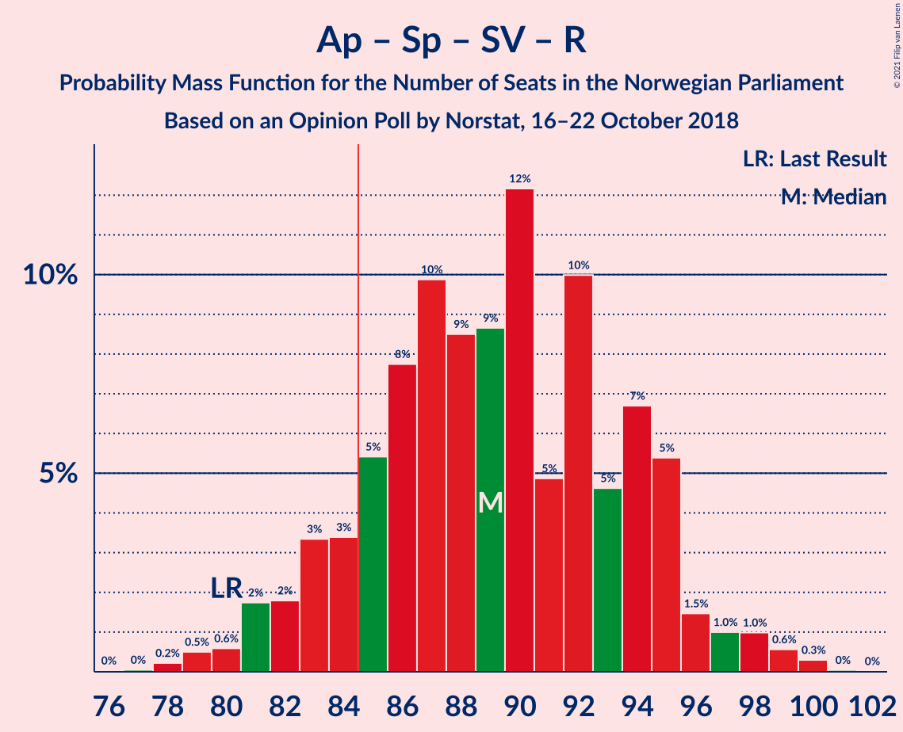
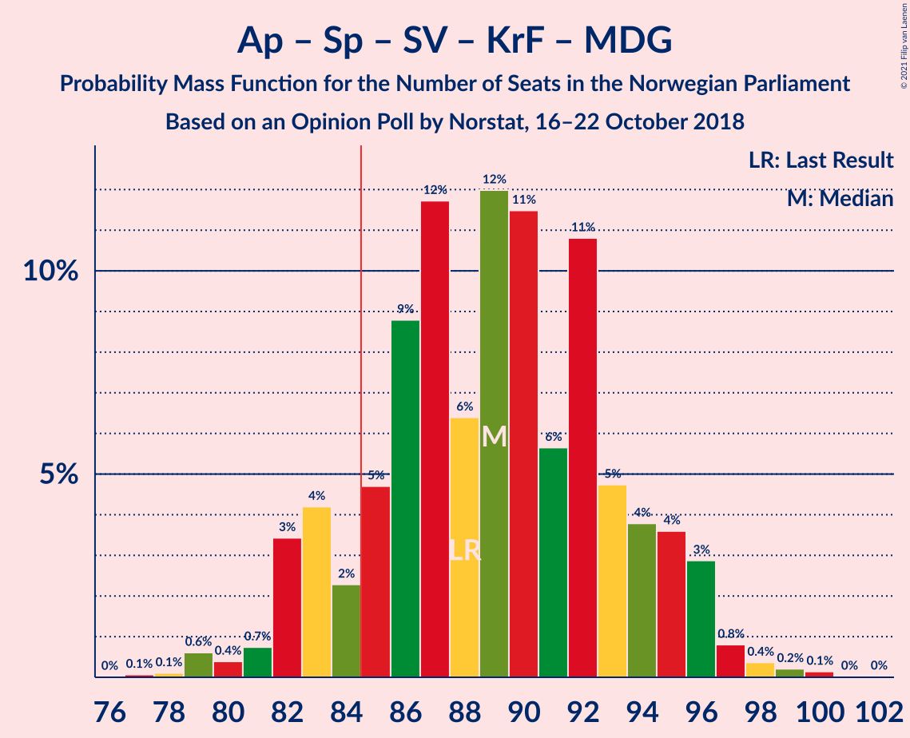
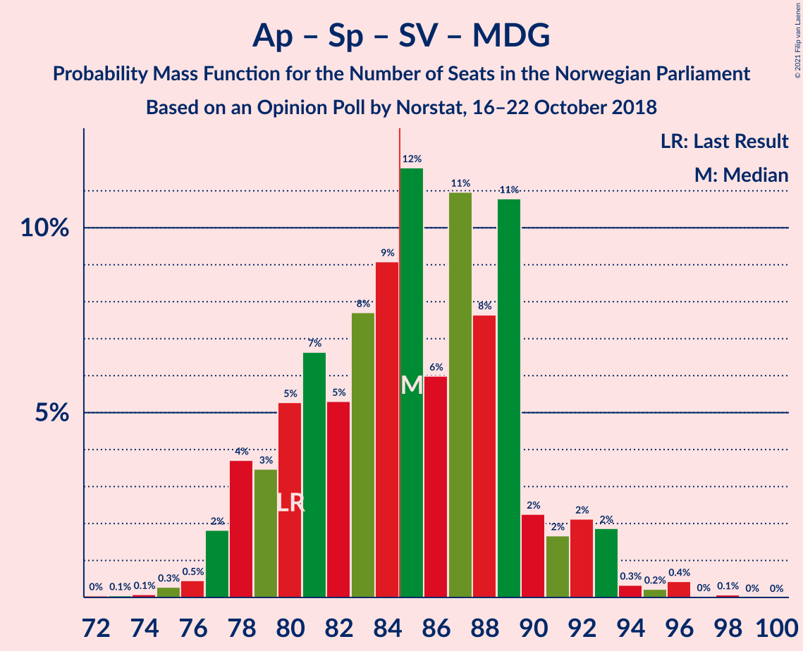
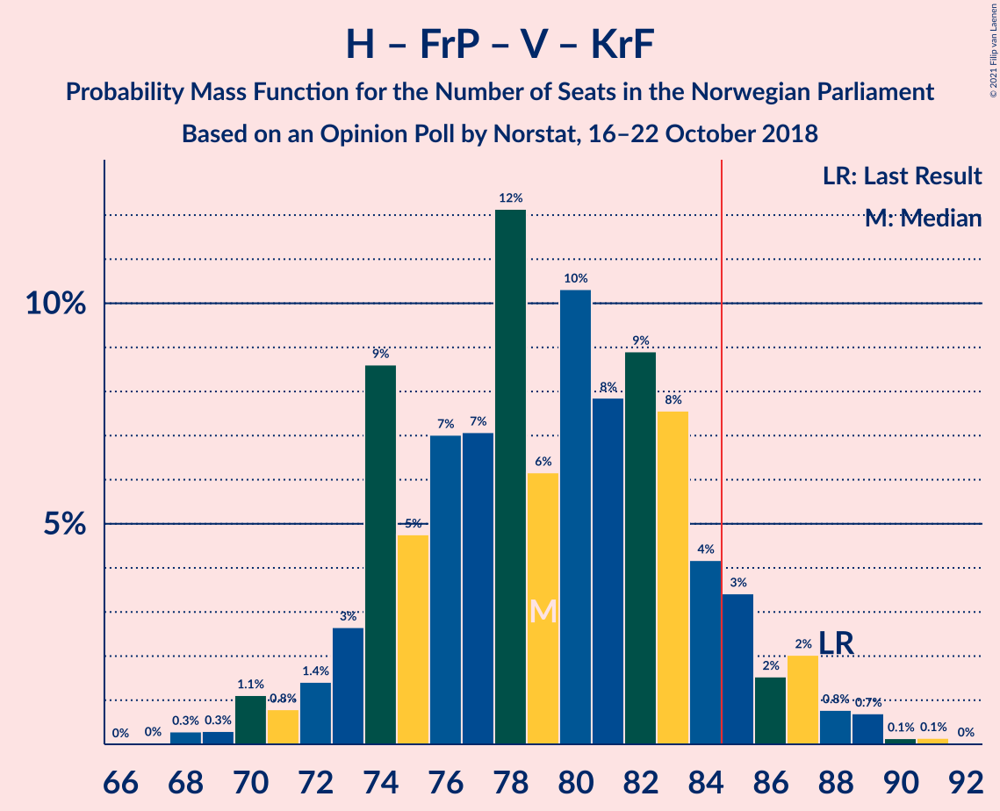
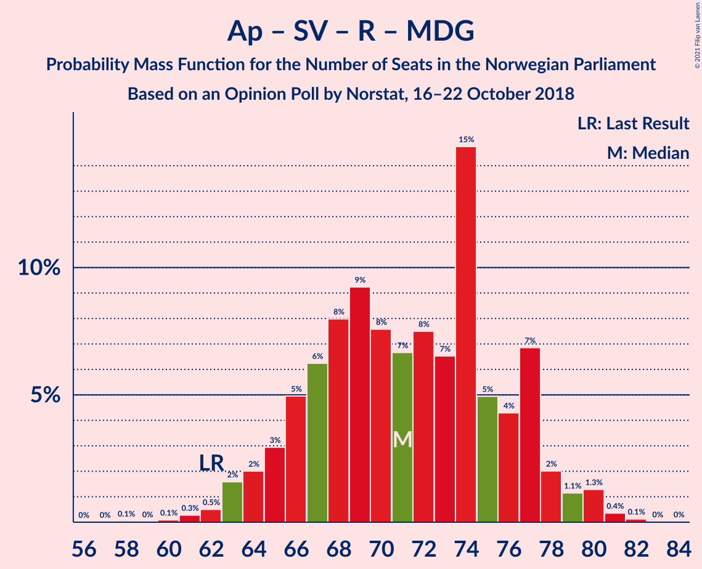
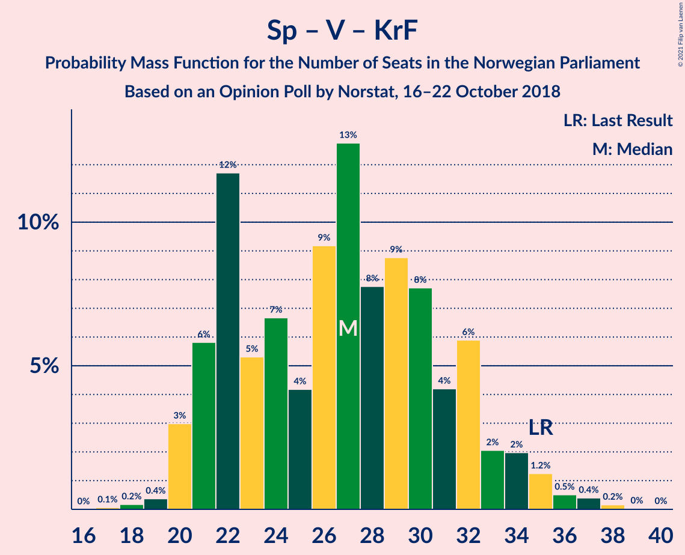

# Opinion Poll by Norstat, 16–22 October 2018

<a href="#voting-intentions">Voting Intentions</a> | <a href="#seats">Seats</a> | <a href="#coalitions">Coalitions</a> | <a href="#technical-information">Technical Information</a>

## Voting Intentions

### Confidence Intervals

| Party | Last Result | Poll Result | 80% Confidence Interval | 90% Confidence Interval | 95% Confidence Interval | 99% Confidence Interval |
|:-----:|:-----------:|:-----------:|:-----------------------:|:-----------------------:|:-----------------------:|:-----------------------:|
| Arbeiderpartiet | 27.4% | 28.7% | 26.9–30.6% |26.3–31.2% |25.9–31.7% |25.0–32.6% |
| Høyre | 25.0% | 25.4% | 23.6–27.3% |23.1–27.8% |22.7–28.3% |21.9–29.2% |
| Fremskrittspartiet | 15.2% | 13.6% | 12.3–15.1% |11.9–15.6% |11.6–16.0% |10.9–16.7% |
| Senterpartiet | 10.3% | 10.3% | 9.1–11.7% |8.8–12.1% |8.5–12.4% |8.0–13.1% |
| Sosialistisk Venstreparti | 6.0% | 7.2% | 6.2–8.4% |6.0–8.8% |5.7–9.1% |5.3–9.7% |
| Rødt | 2.4% | 3.9% | 3.2–4.9% |3.0–5.1% |2.9–5.4% |2.6–5.9% |
| Venstre | 4.4% | 3.7% | 3.0–4.6% |2.9–4.9% |2.7–5.1% |2.4–5.6% |
| Kristelig Folkeparti | 4.2% | 3.6% | 2.9–4.5% |2.7–4.8% |2.6–5.0% |2.3–5.5% |
| Miljøpartiet De Grønne | 3.2% | 2.0% | 1.5–2.7% |1.4–3.0% |1.3–3.1% |1.1–3.5% |

*Note:* The poll result column reflects the actual value used in the calculations. Published results may vary slightly, and in addition be rounded to fewer digits.

## Seats

### Confidence Intervals

| Party | Last Result | Median | 80% Confidence Interval | 90% Confidence Interval | 95% Confidence Interval | 99% Confidence Interval |
|:-----:|:-----------:|:------:|:-----------------------:|:-----------------------:|:-----------------------:|:-----------------------:|
| <a href="#arbeiderpartiet">Arbeiderpartiet</a> | 49 | 52 | 48–57 |47–58 |46–58 |45–60 |
| <a href="#høyre">Høyre</a> | 45 | 46 | 42–49 |41–51 |41–52 |39–53 |
| <a href="#fremskrittspartiet">Fremskrittspartiet</a> | 27 | 25 | 22–28 |21–29 |20–30 |19–31 |
| <a href="#senterpartiet">Senterpartiet</a> | 19 | 18 | 16–21 |16–22 |15–23 |14–24 |
| <a href="#sosialistisk-venstreparti">Sosialistisk Venstreparti</a> | 11 | 14 | 11–16 |10–16 |10–17 |9–17 |
| <a href="#rødt">Rødt</a> | 1 | 2 | 2–9 |2–9 |1–10 |1–11 |
| <a href="#venstre">Venstre</a> | 8 | 2 | 2–8 |2–9 |2–9 |2–10 |
| <a href="#kristelig-folkeparti">Kristelig Folkeparti</a> | 8 | 3 | 1–8 |1–8 |1–9 |0–10 |
| <a href="#miljøpartiet-de-grønne">Miljøpartiet De Grønne</a> | 1 | 1 | 0–1 |0–1 |0–2 |0–2 |

### Arbeiderpartiet

*For a full overview of the results for this party, see the [Arbeiderpartiet](party-arbeiderpartiet.html) page.*

| Number of Seats | Probability | Accumulated | Special Marks |
|:---------------:|:-----------:|:-----------:|:-------------:|
| 43 | 0.1% | 100% |  |
| 44 | 0.3% | 99.9% |  |
| 45 | 2% | 99.6% |  |
| 46 | 1.1% | 98% |  |
| 47 | 3% | 97% |  |
| 48 | 7% | 94% |  |
| 49 | 9% | 87% | Last Result |
| 50 | 9% | 78% |  |
| 51 | 12% | 69% |  |
| 52 | 12% | 57% | Median |
| 53 | 11% | 46% |  |
| 54 | 6% | 35% |  |
| 55 | 8% | 29% |  |
| 56 | 9% | 21% |  |
| 57 | 7% | 12% |  |
| 58 | 3% | 5% |  |
| 59 | 0.9% | 2% |  |
| 60 | 0.8% | 1.1% |  |
| 61 | 0.2% | 0.4% |  |
| 62 | 0.1% | 0.1% |  |
| 63 | 0% | 0% |  |

### Høyre

*For a full overview of the results for this party, see the [Høyre](party-høyre.html) page.*

| Number of Seats | Probability | Accumulated | Special Marks |
|:---------------:|:-----------:|:-----------:|:-------------:|
| 37 | 0% | 100% |  |
| 38 | 0.2% | 99.9% |  |
| 39 | 0.4% | 99.7% |  |
| 40 | 1.4% | 99.3% |  |
| 41 | 4% | 98% |  |
| 42 | 4% | 93% |  |
| 43 | 7% | 89% |  |
| 44 | 10% | 82% |  |
| 45 | 13% | 72% | Last Result |
| 46 | 11% | 59% | Median |
| 47 | 16% | 48% |  |
| 48 | 10% | 32% |  |
| 49 | 12% | 22% |  |
| 50 | 3% | 10% |  |
| 51 | 2% | 7% |  |
| 52 | 2% | 5% |  |
| 53 | 2% | 2% |  |
| 54 | 0.3% | 0.5% |  |
| 55 | 0.1% | 0.1% |  |
| 56 | 0% | 0% |  |

### Fremskrittspartiet

*For a full overview of the results for this party, see the [Fremskrittspartiet](party-fremskrittspartiet.html) page.*

| Number of Seats | Probability | Accumulated | Special Marks |
|:---------------:|:-----------:|:-----------:|:-------------:|
| 18 | 0.1% | 100% |  |
| 19 | 0.5% | 99.9% |  |
| 20 | 2% | 99.4% |  |
| 21 | 5% | 97% |  |
| 22 | 9% | 93% |  |
| 23 | 7% | 84% |  |
| 24 | 20% | 77% |  |
| 25 | 22% | 56% | Median |
| 26 | 14% | 35% |  |
| 27 | 7% | 21% | Last Result |
| 28 | 8% | 14% |  |
| 29 | 3% | 6% |  |
| 30 | 2% | 3% |  |
| 31 | 0.7% | 0.8% |  |
| 32 | 0.1% | 0.1% |  |
| 33 | 0% | 0% |  |

### Senterpartiet

*For a full overview of the results for this party, see the [Senterpartiet](party-senterpartiet.html) page.*

| Number of Seats | Probability | Accumulated | Special Marks |
|:---------------:|:-----------:|:-----------:|:-------------:|
| 13 | 0.2% | 100% |  |
| 14 | 0.7% | 99.8% |  |
| 15 | 2% | 99.1% |  |
| 16 | 12% | 97% |  |
| 17 | 19% | 85% |  |
| 18 | 19% | 66% | Median |
| 19 | 16% | 47% | Last Result |
| 20 | 13% | 31% |  |
| 21 | 11% | 18% |  |
| 22 | 4% | 7% |  |
| 23 | 2% | 3% |  |
| 24 | 0.5% | 0.9% |  |
| 25 | 0.3% | 0.4% |  |
| 26 | 0.1% | 0.1% |  |
| 27 | 0% | 0% |  |

### Sosialistisk Venstreparti

*For a full overview of the results for this party, see the [Sosialistisk Venstreparti](party-sosialistiskvenstreparti.html) page.*

| Number of Seats | Probability | Accumulated | Special Marks |
|:---------------:|:-----------:|:-----------:|:-------------:|
| 9 | 0.6% | 100% |  |
| 10 | 6% | 99.4% |  |
| 11 | 7% | 93% | Last Result |
| 12 | 23% | 86% |  |
| 13 | 6% | 63% |  |
| 14 | 30% | 57% | Median |
| 15 | 17% | 27% |  |
| 16 | 6% | 10% |  |
| 17 | 4% | 4% |  |
| 18 | 0.1% | 0.3% |  |
| 19 | 0.2% | 0.2% |  |
| 20 | 0% | 0% |  |

### Rødt

*For a full overview of the results for this party, see the [Rødt](party-rødt.html) page.*

| Number of Seats | Probability | Accumulated | Special Marks |
|:---------------:|:-----------:|:-----------:|:-------------:|
| 1 | 4% | 100% | Last Result |
| 2 | 47% | 96% | Median |
| 3 | 0% | 49% |  |
| 4 | 0% | 49% |  |
| 5 | 0% | 49% |  |
| 6 | 0% | 49% |  |
| 7 | 10% | 49% |  |
| 8 | 26% | 39% |  |
| 9 | 9% | 13% |  |
| 10 | 3% | 4% |  |
| 11 | 0.5% | 0.5% |  |
| 12 | 0.1% | 0.1% |  |
| 13 | 0% | 0% |  |

### Venstre

*For a full overview of the results for this party, see the [Venstre](party-venstre.html) page.*

| Number of Seats | Probability | Accumulated | Special Marks |
|:---------------:|:-----------:|:-----------:|:-------------:|
| 1 | 0.5% | 100% |  |
| 2 | 61% | 99.5% | Median |
| 3 | 5% | 38% |  |
| 4 | 0.1% | 34% |  |
| 5 | 0% | 34% |  |
| 6 | 0% | 34% |  |
| 7 | 9% | 34% |  |
| 8 | 18% | 25% | Last Result |
| 9 | 5% | 7% |  |
| 10 | 2% | 2% |  |
| 11 | 0.4% | 0.4% |  |
| 12 | 0% | 0% |  |

### Kristelig Folkeparti

*For a full overview of the results for this party, see the [Kristelig Folkeparti](party-kristeligfolkeparti.html) page.*

| Number of Seats | Probability | Accumulated | Special Marks |
|:---------------:|:-----------:|:-----------:|:-------------:|
| 0 | 0.5% | 100% |  |
| 1 | 17% | 99.5% |  |
| 2 | 13% | 83% |  |
| 3 | 39% | 70% | Median |
| 4 | 0% | 30% |  |
| 5 | 0% | 30% |  |
| 6 | 0% | 30% |  |
| 7 | 6% | 30% |  |
| 8 | 20% | 25% | Last Result |
| 9 | 3% | 4% |  |
| 10 | 0.7% | 0.8% |  |
| 11 | 0.1% | 0.1% |  |
| 12 | 0% | 0% |  |

### Miljøpartiet De Grønne

*For a full overview of the results for this party, see the [Miljøpartiet De Grønne](party-miljøpartietdegrønne.html) page.*

| Number of Seats | Probability | Accumulated | Special Marks |
|:---------------:|:-----------:|:-----------:|:-------------:|
| 0 | 37% | 100% |  |
| 1 | 60% | 63% | Last Result, Median |
| 2 | 3% | 3% |  |
| 3 | 0.1% | 0.1% |  |
| 4 | 0% | 0% |  |

## Coalitions

### Confidence Intervals

| Coalition | Last Result | Median | Majority? | 80% Confidence Interval | 90% Confidence Interval | 95% Confidence Interval | 99% Confidence Interval |
|:---------:|:-----------:|:------:|:---------:|:-----------------------:|:-----------------------:|:-----------------------:|:-----------------------:|
| Høyre – Fremskrittspartiet – Senterpartiet – Venstre – Kristelig Folkeparti | 107 | 98 | 100% | 92–103 | 92–104 | 90–106 | 88–107 |
| Arbeiderpartiet – Senterpartiet – Sosialistisk Venstreparti – Rødt – Miljøpartiet De Grønne | 81 | 90 | 91% | 85–95 | 83–96 | 82–98 | 80–100 |
| Arbeiderpartiet – Senterpartiet – Sosialistisk Venstreparti – Rødt | 80 | 89 | 88% | 84–94 | 83–95 | 81–97 | 79–99 |
| Arbeiderpartiet – Senterpartiet – Sosialistisk Venstreparti – Kristelig Folkeparti – Miljøpartiet De Grønne | 88 | 89 | 88% | 84–94 | 82–95 | 82–96 | 79–98 |
| Arbeiderpartiet – Senterpartiet – Sosialistisk Venstreparti – Miljøpartiet De Grønne | 80 | 85 | 56% | 80–89 | 78–92 | 77–93 | 76–96 |
| Arbeiderpartiet – Senterpartiet – Sosialistisk Venstreparti | 79 | 84 | 48% | 79–89 | 78–91 | 76–92 | 75–95 |
| Høyre – Fremskrittspartiet – Venstre – Kristelig Folkeparti – Miljøpartiet De Grønne | 89 | 80 | 12% | 75–85 | 74–86 | 72–88 | 70–90 |
| Høyre – Fremskrittspartiet – Venstre – Kristelig Folkeparti | 88 | 79 | 9% | 74–84 | 73–86 | 71–87 | 69–89 |
| Arbeiderpartiet – Senterpartiet – Kristelig Folkeparti – Miljøpartiet De Grønne | 77 | 75 | 0.6% | 71–80 | 69–82 | 68–84 | 67–85 |
| Arbeiderpartiet – Senterpartiet – Kristelig Folkeparti | 76 | 75 | 0.4% | 70–80 | 69–81 | 67–83 | 66–84 |
| Høyre – Fremskrittspartiet – Venstre | 80 | 75 | 0.9% | 71–80 | 69–81 | 68–82 | 65–85 |
| Arbeiderpartiet – Sosialistisk Venstreparti – Rødt – Miljøpartiet De Grønne | 62 | 71 | 0% | 66–77 | 65–77 | 63–79 | 62–81 |
| Arbeiderpartiet – Senterpartiet | 68 | 71 | 0% | 66–75 | 65–76 | 64–78 | 62–80 |
| Høyre – Fremskrittspartiet | 72 | 71 | 0% | 65–75 | 65–77 | 64–78 | 62–80 |
| Arbeiderpartiet – Sosialistisk Venstreparti | 60 | 66 | 0% | 61–71 | 60–71 | 59–72 | 57–75 |
| Høyre – Venstre – Kristelig Folkeparti | 61 | 54 | 0% | 49–59 | 48–61 | 46–62 | 45–64 |
| Senterpartiet – Venstre – Kristelig Folkeparti | 35 | 27 | 0% | 22–32 | 21–33 | 20–34 | 19–37 |

### Høyre – Fremskrittspartiet – Senterpartiet – Venstre – Kristelig Folkeparti

| Number of Seats | Probability | Accumulated | Special Marks |
|:---------------:|:-----------:|:-----------:|:-------------:|
| 87 | 0.1% | 100% |  |
| 88 | 0.4% | 99.8% |  |
| 89 | 1.3% | 99.5% |  |
| 90 | 1.1% | 98% |  |
| 91 | 2% | 97% |  |
| 92 | 7% | 95% |  |
| 93 | 4% | 88% |  |
| 94 | 5% | 84% | Median |
| 95 | 15% | 79% |  |
| 96 | 7% | 64% |  |
| 97 | 8% | 58% |  |
| 98 | 7% | 50% |  |
| 99 | 8% | 43% |  |
| 100 | 9% | 36% |  |
| 101 | 8% | 27% |  |
| 102 | 6% | 19% |  |
| 103 | 5% | 12% |  |
| 104 | 3% | 7% |  |
| 105 | 2% | 5% |  |
| 106 | 2% | 3% |  |
| 107 | 0.5% | 0.9% | Last Result |
| 108 | 0.3% | 0.4% |  |
| 109 | 0.1% | 0.2% |  |
| 110 | 0% | 0.1% |  |
| 111 | 0.1% | 0.1% |  |
| 112 | 0% | 0% |  |

### Arbeiderpartiet – Senterpartiet – Sosialistisk Venstreparti – Rødt – Miljøpartiet De Grønne

| Number of Seats | Probability | Accumulated | Special Marks |
|:---------------:|:-----------:|:-----------:|:-------------:|
| 78 | 0.1% | 100% |  |
| 79 | 0.1% | 99.8% |  |
| 80 | 0.7% | 99.7% |  |
| 81 | 0.8% | 99.0% | Last Result |
| 82 | 2% | 98% |  |
| 83 | 2% | 96% |  |
| 84 | 3% | 95% |  |
| 85 | 4% | 91% | Majority |
| 86 | 8% | 87% |  |
| 87 | 9% | 79% | Median |
| 88 | 8% | 71% |  |
| 89 | 10% | 63% |  |
| 90 | 6% | 52% |  |
| 91 | 12% | 46% |  |
| 92 | 7% | 34% |  |
| 93 | 7% | 27% |  |
| 94 | 5% | 20% |  |
| 95 | 9% | 15% |  |
| 96 | 3% | 7% |  |
| 97 | 1.4% | 4% |  |
| 98 | 0.8% | 3% |  |
| 99 | 1.1% | 2% |  |
| 100 | 0.3% | 0.6% |  |
| 101 | 0.3% | 0.3% |  |
| 102 | 0% | 0% |  |

### Arbeiderpartiet – Senterpartiet – Sosialistisk Venstreparti – Rødt

| Number of Seats | Probability | Accumulated | Special Marks |
|:---------------:|:-----------:|:-----------:|:-------------:|
| 77 | 0% | 100% |  |
| 78 | 0.2% | 99.9% |  |
| 79 | 0.5% | 99.7% |  |
| 80 | 0.6% | 99.2% | Last Result |
| 81 | 2% | 98.6% |  |
| 82 | 2% | 97% |  |
| 83 | 3% | 95% |  |
| 84 | 3% | 92% |  |
| 85 | 5% | 88% | Majority |
| 86 | 8% | 83% | Median |
| 87 | 10% | 75% |  |
| 88 | 9% | 65% |  |
| 89 | 9% | 57% |  |
| 90 | 12% | 48% |  |
| 91 | 5% | 36% |  |
| 92 | 10% | 31% |  |
| 93 | 5% | 21% |  |
| 94 | 7% | 16% |  |
| 95 | 5% | 10% |  |
| 96 | 1.5% | 4% |  |
| 97 | 1.0% | 3% |  |
| 98 | 1.0% | 2% |  |
| 99 | 0.6% | 0.9% |  |
| 100 | 0.3% | 0.4% |  |
| 101 | 0% | 0.1% |  |
| 102 | 0% | 0% |  |

### Arbeiderpartiet – Senterpartiet – Sosialistisk Venstreparti – Kristelig Folkeparti – Miljøpartiet De Grønne

| Number of Seats | Probability | Accumulated | Special Marks |
|:---------------:|:-----------:|:-----------:|:-------------:|
| 77 | 0.1% | 100% |  |
| 78 | 0.1% | 99.9% |  |
| 79 | 0.6% | 99.8% |  |
| 80 | 0.4% | 99.2% |  |
| 81 | 0.7% | 98.8% |  |
| 82 | 3% | 98% |  |
| 83 | 4% | 95% |  |
| 84 | 2% | 90% |  |
| 85 | 5% | 88% | Majority |
| 86 | 9% | 83% |  |
| 87 | 12% | 75% |  |
| 88 | 6% | 63% | Last Result, Median |
| 89 | 12% | 57% |  |
| 90 | 11% | 45% |  |
| 91 | 6% | 33% |  |
| 92 | 11% | 27% |  |
| 93 | 5% | 17% |  |
| 94 | 4% | 12% |  |
| 95 | 4% | 8% |  |
| 96 | 3% | 4% |  |
| 97 | 0.8% | 2% |  |
| 98 | 0.4% | 0.8% |  |
| 99 | 0.2% | 0.4% |  |
| 100 | 0.1% | 0.2% |  |
| 101 | 0% | 0.1% |  |
| 102 | 0% | 0% |  |

### Arbeiderpartiet – Senterpartiet – Sosialistisk Venstreparti – Miljøpartiet De Grønne

| Number of Seats | Probability | Accumulated | Special Marks |
|:---------------:|:-----------:|:-----------:|:-------------:|
| 72 | 0% | 100% |  |
| 73 | 0.1% | 99.9% |  |
| 74 | 0.1% | 99.9% |  |
| 75 | 0.3% | 99.8% |  |
| 76 | 0.5% | 99.5% |  |
| 77 | 2% | 99.1% |  |
| 78 | 4% | 97% |  |
| 79 | 3% | 94% |  |
| 80 | 5% | 90% | Last Result |
| 81 | 7% | 85% |  |
| 82 | 5% | 78% |  |
| 83 | 8% | 73% |  |
| 84 | 9% | 65% |  |
| 85 | 12% | 56% | Median, Majority |
| 86 | 6% | 44% |  |
| 87 | 11% | 38% |  |
| 88 | 8% | 27% |  |
| 89 | 11% | 20% |  |
| 90 | 2% | 9% |  |
| 91 | 2% | 7% |  |
| 92 | 2% | 5% |  |
| 93 | 2% | 3% |  |
| 94 | 0.3% | 1.1% |  |
| 95 | 0.2% | 0.8% |  |
| 96 | 0.4% | 0.5% |  |
| 97 | 0% | 0.1% |  |
| 98 | 0.1% | 0.1% |  |
| 99 | 0% | 0% |  |

### Arbeiderpartiet – Senterpartiet – Sosialistisk Venstreparti

| Number of Seats | Probability | Accumulated | Special Marks |
|:---------------:|:-----------:|:-----------:|:-------------:|
| 72 | 0.1% | 100% |  |
| 73 | 0.1% | 99.9% |  |
| 74 | 0.2% | 99.9% |  |
| 75 | 0.3% | 99.6% |  |
| 76 | 2% | 99.3% |  |
| 77 | 2% | 97% |  |
| 78 | 3% | 96% |  |
| 79 | 5% | 92% | Last Result |
| 80 | 7% | 87% |  |
| 81 | 6% | 80% |  |
| 82 | 6% | 74% |  |
| 83 | 8% | 68% |  |
| 84 | 13% | 60% | Median |
| 85 | 7% | 48% | Majority |
| 86 | 7% | 41% |  |
| 87 | 11% | 33% |  |
| 88 | 12% | 22% |  |
| 89 | 3% | 10% |  |
| 90 | 2% | 7% |  |
| 91 | 3% | 6% |  |
| 92 | 1.4% | 3% |  |
| 93 | 0.8% | 2% |  |
| 94 | 0.2% | 0.8% |  |
| 95 | 0.3% | 0.6% |  |
| 96 | 0.1% | 0.2% |  |
| 97 | 0.1% | 0.1% |  |
| 98 | 0% | 0% |  |

### Høyre – Fremskrittspartiet – Venstre – Kristelig Folkeparti – Miljøpartiet De Grønne

| Number of Seats | Probability | Accumulated | Special Marks |
|:---------------:|:-----------:|:-----------:|:-------------:|
| 68 | 0% | 100% |  |
| 69 | 0.3% | 99.9% |  |
| 70 | 0.6% | 99.6% |  |
| 71 | 1.0% | 99.1% |  |
| 72 | 1.0% | 98% |  |
| 73 | 1.5% | 97% |  |
| 74 | 5% | 96% |  |
| 75 | 7% | 90% |  |
| 76 | 5% | 84% |  |
| 77 | 10% | 79% | Median |
| 78 | 5% | 69% |  |
| 79 | 12% | 64% |  |
| 80 | 9% | 52% |  |
| 81 | 9% | 43% |  |
| 82 | 10% | 35% |  |
| 83 | 8% | 25% |  |
| 84 | 5% | 17% |  |
| 85 | 3% | 12% | Majority |
| 86 | 3% | 8% |  |
| 87 | 2% | 5% |  |
| 88 | 2% | 3% |  |
| 89 | 0.6% | 1.4% | Last Result |
| 90 | 0.5% | 0.8% |  |
| 91 | 0.2% | 0.3% |  |
| 92 | 0% | 0.1% |  |
| 93 | 0% | 0% |  |

### Høyre – Fremskrittspartiet – Venstre – Kristelig Folkeparti

| Number of Seats | Probability | Accumulated | Special Marks |
|:---------------:|:-----------:|:-----------:|:-------------:|
| 68 | 0.3% | 100% |  |
| 69 | 0.3% | 99.7% |  |
| 70 | 1.1% | 99.4% |  |
| 71 | 0.8% | 98% |  |
| 72 | 1.4% | 97% |  |
| 73 | 3% | 96% |  |
| 74 | 9% | 93% |  |
| 75 | 5% | 85% |  |
| 76 | 7% | 80% | Median |
| 77 | 7% | 73% |  |
| 78 | 12% | 66% |  |
| 79 | 6% | 54% |  |
| 80 | 10% | 48% |  |
| 81 | 8% | 37% |  |
| 82 | 9% | 29% |  |
| 83 | 8% | 21% |  |
| 84 | 4% | 13% |  |
| 85 | 3% | 9% | Majority |
| 86 | 2% | 5% |  |
| 87 | 2% | 4% |  |
| 88 | 0.8% | 2% | Last Result |
| 89 | 0.7% | 1.0% |  |
| 90 | 0.1% | 0.3% |  |
| 91 | 0.1% | 0.2% |  |
| 92 | 0% | 0% |  |

### Arbeiderpartiet – Senterpartiet – Kristelig Folkeparti – Miljøpartiet De Grønne

| Number of Seats | Probability | Accumulated | Special Marks |
|:---------------:|:-----------:|:-----------:|:-------------:|
| 64 | 0% | 100% |  |
| 65 | 0.1% | 99.9% |  |
| 66 | 0.3% | 99.8% |  |
| 67 | 0.7% | 99.6% |  |
| 68 | 2% | 98.8% |  |
| 69 | 2% | 97% |  |
| 70 | 3% | 95% |  |
| 71 | 7% | 92% |  |
| 72 | 6% | 85% |  |
| 73 | 8% | 78% |  |
| 74 | 8% | 70% | Median |
| 75 | 14% | 62% |  |
| 76 | 5% | 48% |  |
| 77 | 15% | 44% | Last Result |
| 78 | 6% | 28% |  |
| 79 | 10% | 22% |  |
| 80 | 3% | 12% |  |
| 81 | 3% | 9% |  |
| 82 | 2% | 6% |  |
| 83 | 1.1% | 4% |  |
| 84 | 2% | 3% |  |
| 85 | 0.3% | 0.6% | Majority |
| 86 | 0.1% | 0.3% |  |
| 87 | 0.1% | 0.2% |  |
| 88 | 0.1% | 0.1% |  |
| 89 | 0% | 0% |  |

### Arbeiderpartiet – Senterpartiet – Kristelig Folkeparti

| Number of Seats | Probability | Accumulated | Special Marks |
|:---------------:|:-----------:|:-----------:|:-------------:|
| 64 | 0% | 100% |  |
| 65 | 0.3% | 99.9% |  |
| 66 | 0.4% | 99.7% |  |
| 67 | 2% | 99.3% |  |
| 68 | 1.2% | 97% |  |
| 69 | 3% | 96% |  |
| 70 | 5% | 93% |  |
| 71 | 7% | 89% |  |
| 72 | 9% | 82% |  |
| 73 | 8% | 73% | Median |
| 74 | 11% | 65% |  |
| 75 | 9% | 54% |  |
| 76 | 13% | 45% | Last Result |
| 77 | 7% | 31% |  |
| 78 | 10% | 24% |  |
| 79 | 4% | 14% |  |
| 80 | 3% | 10% |  |
| 81 | 2% | 7% |  |
| 82 | 2% | 4% |  |
| 83 | 1.0% | 3% |  |
| 84 | 1.3% | 2% |  |
| 85 | 0.2% | 0.4% | Majority |
| 86 | 0.1% | 0.2% |  |
| 87 | 0% | 0.1% |  |
| 88 | 0% | 0% |  |

### Høyre – Fremskrittspartiet – Venstre

| Number of Seats | Probability | Accumulated | Special Marks |
|:---------------:|:-----------:|:-----------:|:-------------:|
| 64 | 0.1% | 100% |  |
| 65 | 0.6% | 99.8% |  |
| 66 | 0.4% | 99.2% |  |
| 67 | 1.0% | 98.8% |  |
| 68 | 1.5% | 98% |  |
| 69 | 2% | 96% |  |
| 70 | 3% | 95% |  |
| 71 | 6% | 92% |  |
| 72 | 12% | 85% |  |
| 73 | 9% | 74% | Median |
| 74 | 11% | 65% |  |
| 75 | 14% | 54% |  |
| 76 | 7% | 41% |  |
| 77 | 8% | 34% |  |
| 78 | 6% | 26% |  |
| 79 | 6% | 20% |  |
| 80 | 6% | 14% | Last Result |
| 81 | 3% | 7% |  |
| 82 | 2% | 4% |  |
| 83 | 0.6% | 2% |  |
| 84 | 0.9% | 2% |  |
| 85 | 0.5% | 0.9% | Majority |
| 86 | 0.3% | 0.4% |  |
| 87 | 0% | 0.1% |  |
| 88 | 0% | 0% |  |

### Arbeiderpartiet – Sosialistisk Venstreparti – Rødt – Miljøpartiet De Grønne

| Number of Seats | Probability | Accumulated | Special Marks |
|:---------------:|:-----------:|:-----------:|:-------------:|
| 58 | 0.1% | 100% |  |
| 59 | 0% | 99.9% |  |
| 60 | 0.1% | 99.9% |  |
| 61 | 0.3% | 99.8% |  |
| 62 | 0.5% | 99.6% | Last Result |
| 63 | 2% | 99.1% |  |
| 64 | 2% | 97% |  |
| 65 | 3% | 95% |  |
| 66 | 5% | 93% |  |
| 67 | 6% | 88% |  |
| 68 | 8% | 81% |  |
| 69 | 9% | 73% | Median |
| 70 | 8% | 64% |  |
| 71 | 7% | 57% |  |
| 72 | 8% | 50% |  |
| 73 | 7% | 42% |  |
| 74 | 15% | 36% |  |
| 75 | 5% | 21% |  |
| 76 | 4% | 16% |  |
| 77 | 7% | 12% |  |
| 78 | 2% | 5% |  |
| 79 | 1.1% | 3% |  |
| 80 | 1.3% | 2% |  |
| 81 | 0.4% | 0.5% |  |
| 82 | 0.1% | 0.2% |  |
| 83 | 0% | 0% |  |

### Arbeiderpartiet – Senterpartiet

| Number of Seats | Probability | Accumulated | Special Marks |
|:---------------:|:-----------:|:-----------:|:-------------:|
| 60 | 0.1% | 100% |  |
| 61 | 0.1% | 99.9% |  |
| 62 | 2% | 99.8% |  |
| 63 | 0.5% | 98% |  |
| 64 | 2% | 98% |  |
| 65 | 2% | 96% |  |
| 66 | 8% | 94% |  |
| 67 | 6% | 86% |  |
| 68 | 5% | 80% | Last Result |
| 69 | 6% | 75% |  |
| 70 | 16% | 68% | Median |
| 71 | 9% | 52% |  |
| 72 | 9% | 44% |  |
| 73 | 11% | 35% |  |
| 74 | 8% | 24% |  |
| 75 | 6% | 15% |  |
| 76 | 4% | 9% |  |
| 77 | 2% | 5% |  |
| 78 | 0.9% | 3% |  |
| 79 | 1.4% | 2% |  |
| 80 | 0.5% | 0.8% |  |
| 81 | 0.2% | 0.2% |  |
| 82 | 0% | 0.1% |  |
| 83 | 0% | 0.1% |  |
| 84 | 0% | 0% |  |

### Høyre – Fremskrittspartiet

| Number of Seats | Probability | Accumulated | Special Marks |
|:---------------:|:-----------:|:-----------:|:-------------:|
| 59 | 0% | 100% |  |
| 60 | 0.1% | 99.9% |  |
| 61 | 0.1% | 99.8% |  |
| 62 | 0.3% | 99.8% |  |
| 63 | 0.9% | 99.4% |  |
| 64 | 2% | 98.5% |  |
| 65 | 7% | 96% |  |
| 66 | 3% | 90% |  |
| 67 | 3% | 87% |  |
| 68 | 5% | 84% |  |
| 69 | 11% | 79% |  |
| 70 | 11% | 68% |  |
| 71 | 9% | 57% | Median |
| 72 | 12% | 49% | Last Result |
| 73 | 16% | 36% |  |
| 74 | 5% | 20% |  |
| 75 | 7% | 16% |  |
| 76 | 3% | 9% |  |
| 77 | 2% | 6% |  |
| 78 | 2% | 4% |  |
| 79 | 2% | 2% |  |
| 80 | 0.2% | 0.5% |  |
| 81 | 0.2% | 0.4% |  |
| 82 | 0.1% | 0.2% |  |
| 83 | 0% | 0% |  |

### Arbeiderpartiet – Sosialistisk Venstreparti

| Number of Seats | Probability | Accumulated | Special Marks |
|:---------------:|:-----------:|:-----------:|:-------------:|
| 55 | 0.1% | 100% |  |
| 56 | 0.2% | 99.9% |  |
| 57 | 0.5% | 99.7% |  |
| 58 | 0.7% | 99.3% |  |
| 59 | 3% | 98.6% |  |
| 60 | 3% | 96% | Last Result |
| 61 | 6% | 92% |  |
| 62 | 6% | 86% |  |
| 63 | 8% | 80% |  |
| 64 | 11% | 72% |  |
| 65 | 11% | 61% |  |
| 66 | 10% | 51% | Median |
| 67 | 9% | 40% |  |
| 68 | 6% | 31% |  |
| 69 | 8% | 25% |  |
| 70 | 4% | 17% |  |
| 71 | 9% | 13% |  |
| 72 | 2% | 4% |  |
| 73 | 1.4% | 2% |  |
| 74 | 0.4% | 1.0% |  |
| 75 | 0.5% | 0.7% |  |
| 76 | 0.1% | 0.2% |  |
| 77 | 0.1% | 0.1% |  |
| 78 | 0% | 0% |  |

### Høyre – Venstre – Kristelig Folkeparti

| Number of Seats | Probability | Accumulated | Special Marks |
|:---------------:|:-----------:|:-----------:|:-------------:|
| 43 | 0.1% | 100% |  |
| 44 | 0.2% | 99.9% |  |
| 45 | 0.7% | 99.8% |  |
| 46 | 2% | 99.0% |  |
| 47 | 1.3% | 97% |  |
| 48 | 5% | 96% |  |
| 49 | 2% | 91% |  |
| 50 | 5% | 90% |  |
| 51 | 9% | 84% | Median |
| 52 | 10% | 75% |  |
| 53 | 7% | 65% |  |
| 54 | 11% | 58% |  |
| 55 | 9% | 47% |  |
| 56 | 7% | 38% |  |
| 57 | 10% | 31% |  |
| 58 | 6% | 21% |  |
| 59 | 7% | 15% |  |
| 60 | 2% | 8% |  |
| 61 | 1.5% | 5% | Last Result |
| 62 | 2% | 4% |  |
| 63 | 0.7% | 2% |  |
| 64 | 1.0% | 1.3% |  |
| 65 | 0.2% | 0.4% |  |
| 66 | 0.1% | 0.2% |  |
| 67 | 0% | 0.1% |  |
| 68 | 0% | 0% |  |

### Senterpartiet – Venstre – Kristelig Folkeparti

| Number of Seats | Probability | Accumulated | Special Marks |
|:---------------:|:-----------:|:-----------:|:-------------:|
| 17 | 0.1% | 100% |  |
| 18 | 0.2% | 99.9% |  |
| 19 | 0.4% | 99.8% |  |
| 20 | 3% | 99.4% |  |
| 21 | 6% | 96% |  |
| 22 | 12% | 91% |  |
| 23 | 5% | 79% | Median |
| 24 | 7% | 74% |  |
| 25 | 4% | 67% |  |
| 26 | 9% | 63% |  |
| 27 | 13% | 54% |  |
| 28 | 8% | 41% |  |
| 29 | 9% | 33% |  |
| 30 | 8% | 24% |  |
| 31 | 4% | 17% |  |
| 32 | 6% | 12% |  |
| 33 | 2% | 6% |  |
| 34 | 2% | 4% |  |
| 35 | 1.2% | 2% | Last Result |
| 36 | 0.5% | 1.1% |  |
| 37 | 0.4% | 0.6% |  |
| 38 | 0.2% | 0.2% |  |
| 39 | 0% | 0% |  |

## Technical Information

### Opinion Poll

+ **Polling firm:** Norstat
+ **Commissioner(s):** —
+ **Fieldwork period:** 16–22 October 2018

### Calculations

+ **Sample size:** 941
+ **Simulations done:** 1,048,576
+ **Error estimate:** 2.53%

