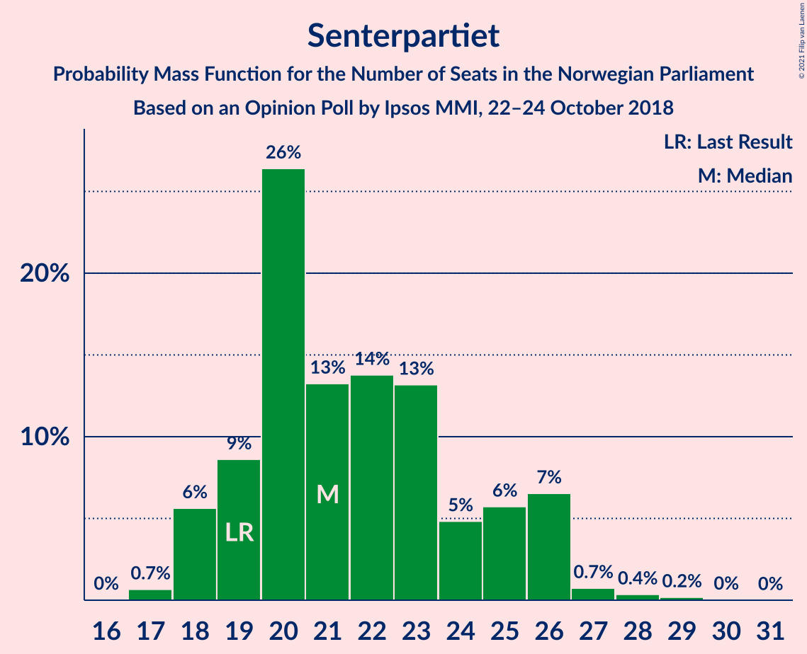
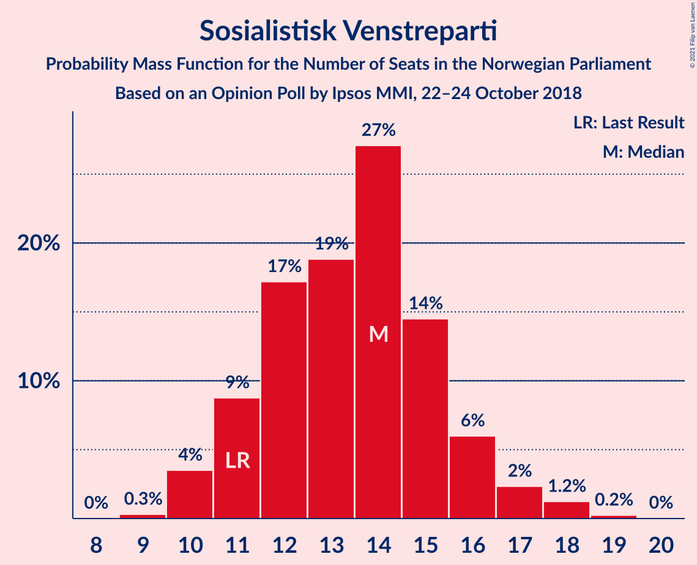
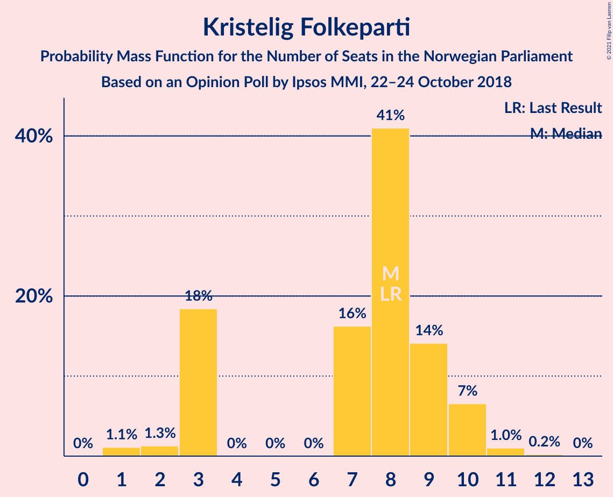
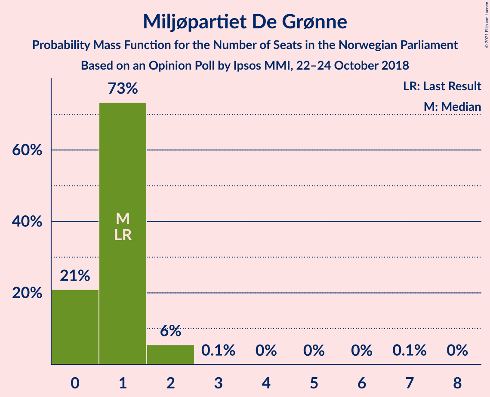
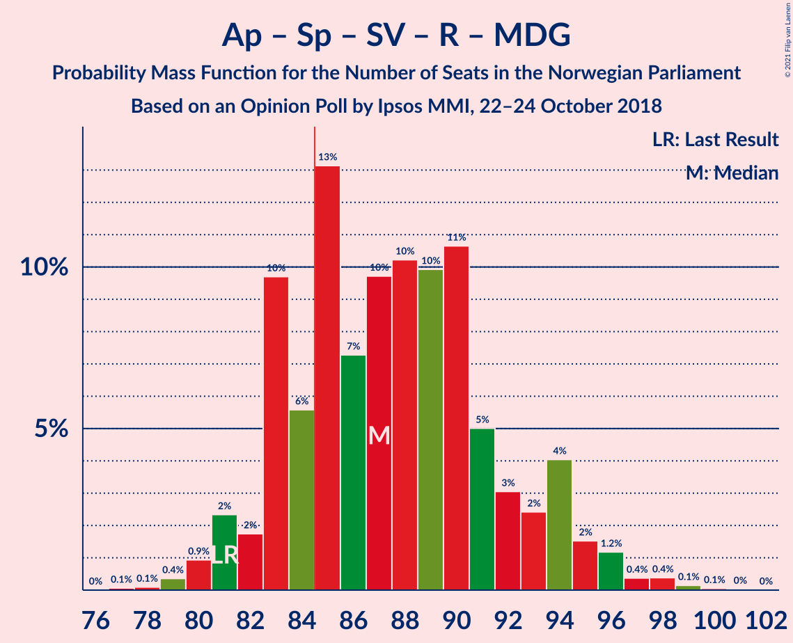
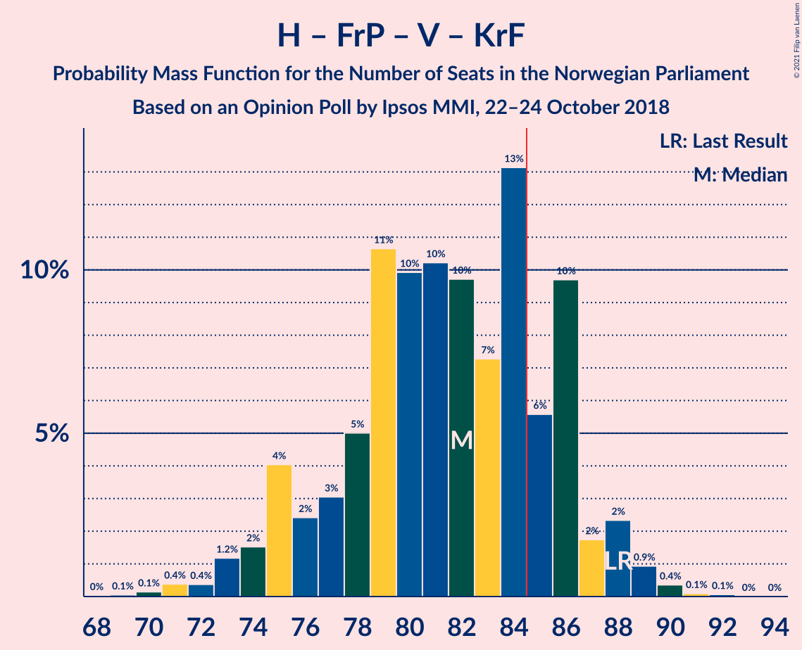
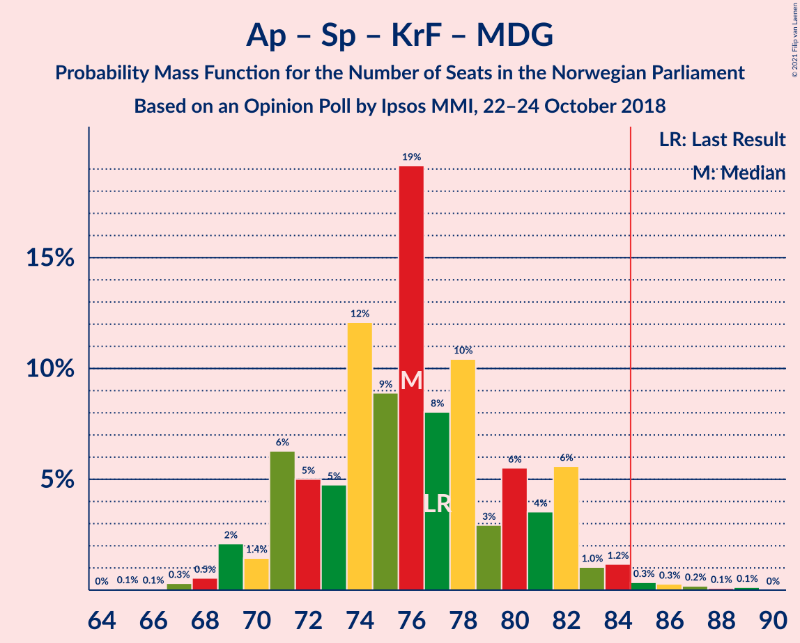

# Opinion Poll by Ipsos MMI, 22–24 October 2018

<a href="#voting-intentions">Voting Intentions</a> | <a href="#seats">Seats</a> | <a href="#coalitions">Coalitions</a> | <a href="#technical-information">Technical Information</a>

## Voting Intentions

### Confidence Intervals

| Party | Last Result | Poll Result | 80% Confidence Interval | 90% Confidence Interval | 95% Confidence Interval | 99% Confidence Interval |
|:-----:|:-----------:|:-----------:|:-----------------------:|:-----------------------:|:-----------------------:|:-----------------------:|
| Høyre | 25.0% | 26.3% | 24.5–28.2% |24.0–28.7% |23.6–29.2% |22.8–30.1% |
| Arbeiderpartiet | 27.4% | 26.0% | 24.2–27.9% |23.7–28.4% |23.3–28.9% |22.5–29.8% |
| Senterpartiet | 10.3% | 12.4% | 11.1–13.8% |10.7–14.3% |10.4–14.6% |9.8–15.3% |
| Fremskrittspartiet | 15.2% | 10.3% | 9.2–11.7% |8.8–12.1% |8.6–12.5% |8.0–13.2% |
| Sosialistisk Venstreparti | 6.0% | 7.7% | 6.7–8.9% |6.4–9.3% |6.2–9.6% |5.7–10.2% |
| Venstre | 4.4% | 5.1% | 4.3–6.1% |4.0–6.4% |3.8–6.7% |3.5–7.2% |
| Kristelig Folkeparti | 4.2% | 4.4% | 3.7–5.4% |3.5–5.7% |3.3–5.9% |3.0–6.4% |
| Rødt | 2.4% | 4.0% | 3.3–5.0% |3.1–5.2% |2.9–5.5% |2.6–6.0% |
| Miljøpartiet De Grønne | 3.2% | 2.2% | 1.7–3.0% |1.6–3.2% |1.4–3.4% |1.2–3.8% |

*Note:* The poll result column reflects the actual value used in the calculations. Published results may vary slightly, and in addition be rounded to fewer digits.

## Seats

### Confidence Intervals

| Party | Last Result | Median | 80% Confidence Interval | 90% Confidence Interval | 95% Confidence Interval | 99% Confidence Interval |
|:-----:|:-----------:|:------:|:-----------------------:|:-----------------------:|:-----------------------:|:-----------------------:|
| <a href="#høyre">Høyre</a> | 45 | 48 | 44–52 |42–53 |41–53 |40–54 |
| <a href="#arbeiderpartiet">Arbeiderpartiet</a> | 49 | 47 | 44–50 |43–52 |42–53 |41–55 |
| <a href="#senterpartiet">Senterpartiet</a> | 19 | 21 | 19–25 |18–26 |18–26 |17–28 |
| <a href="#fremskrittspartiet">Fremskrittspartiet</a> | 27 | 18 | 16–21 |15–22 |15–22 |14–24 |
| <a href="#sosialistisk-venstreparti">Sosialistisk Venstreparti</a> | 11 | 14 | 11–15 |11–16 |10–17 |10–18 |
| <a href="#venstre">Venstre</a> | 8 | 9 | 7–11 |7–11 |2–12 |2–13 |
| <a href="#kristelig-folkeparti">Kristelig Folkeparti</a> | 8 | 8 | 3–9 |3–10 |3–10 |1–11 |
| <a href="#rødt">Rødt</a> | 1 | 7 | 2–8 |2–9 |2–9 |1–10 |
| <a href="#miljøpartiet-de-grønne">Miljøpartiet De Grønne</a> | 1 | 1 | 0–1 |0–2 |0–2 |0–2 |

### Høyre

*For a full overview of the results for this party, see the [Høyre](party-høyre.html) page.*

| Number of Seats | Probability | Accumulated | Special Marks |
|:---------------:|:-----------:|:-----------:|:-------------:|
| 38 | 0.1% | 100% |  |
| 39 | 0.2% | 99.9% |  |
| 40 | 0.9% | 99.6% |  |
| 41 | 1.3% | 98.7% |  |
| 42 | 3% | 97% |  |
| 43 | 3% | 94% |  |
| 44 | 9% | 91% |  |
| 45 | 5% | 82% | Last Result |
| 46 | 19% | 77% |  |
| 47 | 3% | 58% |  |
| 48 | 9% | 54% | Median |
| 49 | 18% | 45% |  |
| 50 | 11% | 27% |  |
| 51 | 5% | 16% |  |
| 52 | 4% | 11% |  |
| 53 | 5% | 7% |  |
| 54 | 1.3% | 2% |  |
| 55 | 0.2% | 0.4% |  |
| 56 | 0.1% | 0.1% |  |
| 57 | 0% | 0% |  |

### Arbeiderpartiet

*For a full overview of the results for this party, see the [Arbeiderpartiet](party-arbeiderpartiet.html) page.*

| Number of Seats | Probability | Accumulated | Special Marks |
|:---------------:|:-----------:|:-----------:|:-------------:|
| 39 | 0% | 100% |  |
| 40 | 0.2% | 99.9% |  |
| 41 | 1.0% | 99.7% |  |
| 42 | 3% | 98.7% |  |
| 43 | 6% | 96% |  |
| 44 | 8% | 90% |  |
| 45 | 24% | 82% |  |
| 46 | 8% | 58% |  |
| 47 | 20% | 50% | Median |
| 48 | 10% | 31% |  |
| 49 | 10% | 21% | Last Result |
| 50 | 3% | 11% |  |
| 51 | 3% | 8% |  |
| 52 | 2% | 5% |  |
| 53 | 1.0% | 3% |  |
| 54 | 0.7% | 2% |  |
| 55 | 1.0% | 1.4% |  |
| 56 | 0.2% | 0.4% |  |
| 57 | 0.1% | 0.2% |  |
| 58 | 0% | 0% |  |

### Senterpartiet

*For a full overview of the results for this party, see the [Senterpartiet](party-senterpartiet.html) page.*

| Number of Seats | Probability | Accumulated | Special Marks |
|:---------------:|:-----------:|:-----------:|:-------------:|
| 17 | 0.7% | 100% |  |
| 18 | 6% | 99.3% |  |
| 19 | 9% | 94% | Last Result |
| 20 | 26% | 85% |  |
| 21 | 13% | 59% | Median |
| 22 | 14% | 45% |  |
| 23 | 13% | 32% |  |
| 24 | 5% | 18% |  |
| 25 | 6% | 14% |  |
| 26 | 7% | 8% |  |
| 27 | 0.7% | 1.3% |  |
| 28 | 0.4% | 0.6% |  |
| 29 | 0.2% | 0.2% |  |
| 30 | 0% | 0.1% |  |
| 31 | 0% | 0% |  |

### Fremskrittspartiet

*For a full overview of the results for this party, see the [Fremskrittspartiet](party-fremskrittspartiet.html) page.*

| Number of Seats | Probability | Accumulated | Special Marks |
|:---------------:|:-----------:|:-----------:|:-------------:|
| 12 | 0.1% | 100% |  |
| 13 | 0.3% | 99.8% |  |
| 14 | 2% | 99.6% |  |
| 15 | 4% | 98% |  |
| 16 | 15% | 93% |  |
| 17 | 17% | 79% |  |
| 18 | 23% | 62% | Median |
| 19 | 20% | 39% |  |
| 20 | 7% | 19% |  |
| 21 | 7% | 12% |  |
| 22 | 3% | 5% |  |
| 23 | 0.8% | 2% |  |
| 24 | 0.7% | 0.9% |  |
| 25 | 0.2% | 0.2% |  |
| 26 | 0% | 0% |  |
| 27 | 0% | 0% | Last Result |

### Sosialistisk Venstreparti

*For a full overview of the results for this party, see the [Sosialistisk Venstreparti](party-sosialistiskvenstreparti.html) page.*

| Number of Seats | Probability | Accumulated | Special Marks |
|:---------------:|:-----------:|:-----------:|:-------------:|
| 9 | 0.3% | 100% |  |
| 10 | 4% | 99.7% |  |
| 11 | 9% | 96% | Last Result |
| 12 | 17% | 87% |  |
| 13 | 19% | 70% |  |
| 14 | 27% | 51% | Median |
| 15 | 14% | 24% |  |
| 16 | 6% | 10% |  |
| 17 | 2% | 4% |  |
| 18 | 1.2% | 2% |  |
| 19 | 0.2% | 0.3% |  |
| 20 | 0% | 0% |  |

### Venstre

*For a full overview of the results for this party, see the [Venstre](party-venstre.html) page.*

| Number of Seats | Probability | Accumulated | Special Marks |
|:---------------:|:-----------:|:-----------:|:-------------:|
| 2 | 3% | 100% |  |
| 3 | 1.0% | 97% |  |
| 4 | 0% | 96% |  |
| 5 | 0% | 96% |  |
| 6 | 0% | 96% |  |
| 7 | 7% | 96% |  |
| 8 | 30% | 89% | Last Result |
| 9 | 32% | 59% | Median |
| 10 | 17% | 28% |  |
| 11 | 7% | 10% |  |
| 12 | 2% | 3% |  |
| 13 | 0.5% | 0.6% |  |
| 14 | 0.1% | 0.1% |  |
| 15 | 0% | 0% |  |

### Kristelig Folkeparti

*For a full overview of the results for this party, see the [Kristelig Folkeparti](party-kristeligfolkeparti.html) page.*

| Number of Seats | Probability | Accumulated | Special Marks |
|:---------------:|:-----------:|:-----------:|:-------------:|
| 1 | 1.1% | 100% |  |
| 2 | 1.3% | 98.9% |  |
| 3 | 18% | 98% |  |
| 4 | 0% | 79% |  |
| 5 | 0% | 79% |  |
| 6 | 0% | 79% |  |
| 7 | 16% | 79% |  |
| 8 | 41% | 63% | Last Result, Median |
| 9 | 14% | 22% |  |
| 10 | 7% | 8% |  |
| 11 | 1.0% | 1.3% |  |
| 12 | 0.2% | 0.2% |  |
| 13 | 0% | 0% |  |

### Rødt

*For a full overview of the results for this party, see the [Rødt](party-rødt.html) page.*

| Number of Seats | Probability | Accumulated | Special Marks |
|:---------------:|:-----------:|:-----------:|:-------------:|
| 1 | 1.5% | 100% | Last Result |
| 2 | 45% | 98.5% |  |
| 3 | 0% | 54% |  |
| 4 | 0% | 54% |  |
| 5 | 0% | 54% |  |
| 6 | 0% | 54% |  |
| 7 | 25% | 54% | Median |
| 8 | 21% | 29% |  |
| 9 | 6% | 8% |  |
| 10 | 2% | 2% |  |
| 11 | 0.2% | 0.3% |  |
| 12 | 0% | 0% |  |

### Miljøpartiet De Grønne

*For a full overview of the results for this party, see the [Miljøpartiet De Grønne](party-miljøpartietdegrønne.html) page.*

| Number of Seats | Probability | Accumulated | Special Marks |
|:---------------:|:-----------:|:-----------:|:-------------:|
| 0 | 21% | 100% |  |
| 1 | 73% | 79% | Last Result, Median |
| 2 | 6% | 6% |  |
| 3 | 0.1% | 0.2% |  |
| 4 | 0% | 0.1% |  |
| 5 | 0% | 0.1% |  |
| 6 | 0% | 0.1% |  |
| 7 | 0.1% | 0.1% |  |
| 8 | 0% | 0% |  |

## Coalitions

### Confidence Intervals

| Coalition | Last Result | Median | Majority? | 80% Confidence Interval | 90% Confidence Interval | 95% Confidence Interval | 99% Confidence Interval |
|:---------:|:-----------:|:------:|:---------:|:-----------------------:|:-----------------------:|:-----------------------:|:-----------------------:|
| Høyre – Senterpartiet – Fremskrittspartiet – Venstre – Kristelig Folkeparti | 107 | 103 | 100% | 99–107 | 97–109 | 95–109 | 93–111 |
| Arbeiderpartiet – Senterpartiet – Sosialistisk Venstreparti – Kristelig Folkeparti – Miljøpartiet De Grønne | 88 | 89 | 92% | 85–95 | 83–96 | 83–97 | 81–100 |
| Arbeiderpartiet – Senterpartiet – Sosialistisk Venstreparti – Rødt – Miljøpartiet De Grønne | 81 | 87 | 79% | 83–93 | 82–94 | 81–95 | 79–98 |
| Arbeiderpartiet – Senterpartiet – Sosialistisk Venstreparti – Rødt | 80 | 87 | 70% | 82–92 | 82–93 | 80–94 | 78–97 |
| Arbeiderpartiet – Senterpartiet – Sosialistisk Venstreparti – Miljøpartiet De Grønne | 80 | 82 | 27% | 78–88 | 77–88 | 75–89 | 75–92 |
| Høyre – Fremskrittspartiet – Venstre – Kristelig Folkeparti – Miljøpartiet De Grønne | 89 | 82 | 30% | 77–87 | 76–87 | 75–89 | 72–91 |
| Arbeiderpartiet – Senterpartiet – Sosialistisk Venstreparti | 79 | 81 | 21% | 77–87 | 76–87 | 74–88 | 74–92 |
| Høyre – Fremskrittspartiet – Venstre – Kristelig Folkeparti | 88 | 82 | 21% | 76–86 | 75–87 | 74–88 | 71–90 |
| Arbeiderpartiet – Senterpartiet – Kristelig Folkeparti – Miljøpartiet De Grønne | 77 | 76 | 1.0% | 71–81 | 71–82 | 69–83 | 68–86 |
| Arbeiderpartiet – Senterpartiet – Kristelig Folkeparti | 76 | 75 | 0.7% | 71–80 | 70–81 | 68–83 | 67–85 |
| Høyre – Fremskrittspartiet – Venstre | 80 | 74 | 0.1% | 70–79 | 68–80 | 67–80 | 65–82 |
| Arbeiderpartiet – Senterpartiet | 68 | 68 | 0% | 64–73 | 63–74 | 63–75 | 61–78 |
| Høyre – Fremskrittspartiet | 72 | 66 | 0% | 61–70 | 60–70 | 59–72 | 57–73 |
| Høyre – Venstre – Kristelig Folkeparti | 61 | 64 | 0% | 58–68 | 57–69 | 55–69 | 53–72 |
| Arbeiderpartiet – Sosialistisk Venstreparti | 60 | 60 | 0% | 56–64 | 56–66 | 55–67 | 54–69 |
| Senterpartiet – Venstre – Kristelig Folkeparti | 35 | 37 | 0% | 34–41 | 32–43 | 31–43 | 28–46 |

### Høyre – Senterpartiet – Fremskrittspartiet – Venstre – Kristelig Folkeparti

| Number of Seats | Probability | Accumulated | Special Marks |
|:---------------:|:-----------:|:-----------:|:-------------:|
| 91 | 0.1% | 100% |  |
| 92 | 0.3% | 99.9% |  |
| 93 | 0.5% | 99.6% |  |
| 94 | 1.3% | 99.1% |  |
| 95 | 0.7% | 98% |  |
| 96 | 0.9% | 97% |  |
| 97 | 2% | 96% |  |
| 98 | 2% | 94% |  |
| 99 | 7% | 92% |  |
| 100 | 10% | 84% |  |
| 101 | 6% | 74% |  |
| 102 | 11% | 68% |  |
| 103 | 8% | 56% |  |
| 104 | 13% | 48% | Median |
| 105 | 11% | 35% |  |
| 106 | 5% | 24% |  |
| 107 | 10% | 19% | Last Result |
| 108 | 3% | 9% |  |
| 109 | 3% | 6% |  |
| 110 | 1.2% | 2% |  |
| 111 | 1.0% | 1.3% |  |
| 112 | 0.1% | 0.2% |  |
| 113 | 0.1% | 0.1% |  |
| 114 | 0% | 0% |  |

### Arbeiderpartiet – Senterpartiet – Sosialistisk Venstreparti – Kristelig Folkeparti – Miljøpartiet De Grønne

| Number of Seats | Probability | Accumulated | Special Marks |
|:---------------:|:-----------:|:-----------:|:-------------:|
| 79 | 0.1% | 100% |  |
| 80 | 0.1% | 99.9% |  |
| 81 | 2% | 99.8% |  |
| 82 | 0.5% | 98% |  |
| 83 | 4% | 98% |  |
| 84 | 2% | 94% |  |
| 85 | 5% | 92% | Majority |
| 86 | 5% | 87% |  |
| 87 | 6% | 82% |  |
| 88 | 17% | 75% | Last Result |
| 89 | 12% | 58% |  |
| 90 | 11% | 47% |  |
| 91 | 8% | 36% | Median |
| 92 | 9% | 28% |  |
| 93 | 4% | 19% |  |
| 94 | 4% | 15% |  |
| 95 | 4% | 11% |  |
| 96 | 4% | 7% |  |
| 97 | 1.5% | 3% |  |
| 98 | 0.4% | 1.2% |  |
| 99 | 0.3% | 0.9% |  |
| 100 | 0.4% | 0.6% |  |
| 101 | 0.1% | 0.2% |  |
| 102 | 0% | 0.1% |  |
| 103 | 0% | 0% |  |

### Arbeiderpartiet – Senterpartiet – Sosialistisk Venstreparti – Rødt – Miljøpartiet De Grønne

| Number of Seats | Probability | Accumulated | Special Marks |
|:---------------:|:-----------:|:-----------:|:-------------:|
| 77 | 0.1% | 100% |  |
| 78 | 0.1% | 99.9% |  |
| 79 | 0.4% | 99.8% |  |
| 80 | 0.9% | 99.5% |  |
| 81 | 2% | 98.5% | Last Result |
| 82 | 2% | 96% |  |
| 83 | 10% | 94% |  |
| 84 | 6% | 85% |  |
| 85 | 13% | 79% | Majority |
| 86 | 7% | 66% |  |
| 87 | 10% | 59% |  |
| 88 | 10% | 49% |  |
| 89 | 10% | 39% |  |
| 90 | 11% | 29% | Median |
| 91 | 5% | 18% |  |
| 92 | 3% | 13% |  |
| 93 | 2% | 10% |  |
| 94 | 4% | 8% |  |
| 95 | 2% | 4% |  |
| 96 | 1.2% | 2% |  |
| 97 | 0.4% | 1.0% |  |
| 98 | 0.4% | 0.6% |  |
| 99 | 0.1% | 0.2% |  |
| 100 | 0.1% | 0.1% |  |
| 101 | 0% | 0% |  |

### Arbeiderpartiet – Senterpartiet – Sosialistisk Venstreparti – Rødt

| Number of Seats | Probability | Accumulated | Special Marks |
|:---------------:|:-----------:|:-----------:|:-------------:|
| 76 | 0% | 100% |  |
| 77 | 0.1% | 99.9% |  |
| 78 | 0.4% | 99.9% |  |
| 79 | 0.8% | 99.5% |  |
| 80 | 2% | 98.6% | Last Result |
| 81 | 1.0% | 96% |  |
| 82 | 9% | 95% |  |
| 83 | 8% | 87% |  |
| 84 | 9% | 79% |  |
| 85 | 11% | 70% | Majority |
| 86 | 9% | 59% |  |
| 87 | 10% | 51% |  |
| 88 | 10% | 40% |  |
| 89 | 12% | 31% | Median |
| 90 | 4% | 18% |  |
| 91 | 4% | 14% |  |
| 92 | 3% | 11% |  |
| 93 | 4% | 8% |  |
| 94 | 1.4% | 4% |  |
| 95 | 1.0% | 2% |  |
| 96 | 0.6% | 1.4% |  |
| 97 | 0.5% | 0.7% |  |
| 98 | 0.1% | 0.3% |  |
| 99 | 0.1% | 0.1% |  |
| 100 | 0% | 0% |  |

### Arbeiderpartiet – Senterpartiet – Sosialistisk Venstreparti – Miljøpartiet De Grønne

| Number of Seats | Probability | Accumulated | Special Marks |
|:---------------:|:-----------:|:-----------:|:-------------:|
| 73 | 0.1% | 100% |  |
| 74 | 0.2% | 99.9% |  |
| 75 | 2% | 99.7% |  |
| 76 | 1.4% | 97% |  |
| 77 | 1.3% | 96% |  |
| 78 | 7% | 95% |  |
| 79 | 6% | 87% |  |
| 80 | 9% | 82% | Last Result |
| 81 | 17% | 73% |  |
| 82 | 11% | 56% |  |
| 83 | 14% | 45% | Median |
| 84 | 5% | 31% |  |
| 85 | 6% | 27% | Majority |
| 86 | 7% | 21% |  |
| 87 | 3% | 13% |  |
| 88 | 6% | 11% |  |
| 89 | 2% | 4% |  |
| 90 | 0.6% | 2% |  |
| 91 | 0.6% | 2% |  |
| 92 | 0.6% | 1.1% |  |
| 93 | 0.3% | 0.5% |  |
| 94 | 0.1% | 0.2% |  |
| 95 | 0% | 0.1% |  |
| 96 | 0% | 0% |  |

### Høyre – Fremskrittspartiet – Venstre – Kristelig Folkeparti – Miljøpartiet De Grønne

| Number of Seats | Probability | Accumulated | Special Marks |
|:---------------:|:-----------:|:-----------:|:-------------:|
| 70 | 0.1% | 100% |  |
| 71 | 0.1% | 99.9% |  |
| 72 | 0.5% | 99.7% |  |
| 73 | 0.6% | 99.3% |  |
| 74 | 1.0% | 98.6% |  |
| 75 | 1.4% | 98% |  |
| 76 | 4% | 96% |  |
| 77 | 3% | 92% |  |
| 78 | 4% | 89% |  |
| 79 | 4% | 86% |  |
| 80 | 12% | 82% |  |
| 81 | 10% | 69% |  |
| 82 | 10% | 60% |  |
| 83 | 9% | 49% |  |
| 84 | 11% | 41% | Median |
| 85 | 9% | 30% | Majority |
| 86 | 8% | 21% |  |
| 87 | 9% | 13% |  |
| 88 | 1.0% | 5% |  |
| 89 | 2% | 4% | Last Result |
| 90 | 0.8% | 1.4% |  |
| 91 | 0.4% | 0.5% |  |
| 92 | 0.1% | 0.1% |  |
| 93 | 0% | 0.1% |  |
| 94 | 0% | 0% |  |

### Arbeiderpartiet – Senterpartiet – Sosialistisk Venstreparti

| Number of Seats | Probability | Accumulated | Special Marks |
|:---------------:|:-----------:|:-----------:|:-------------:|
| 72 | 0% | 100% |  |
| 73 | 0.2% | 99.9% |  |
| 74 | 2% | 99.8% |  |
| 75 | 1.2% | 97% |  |
| 76 | 1.3% | 96% |  |
| 77 | 7% | 95% |  |
| 78 | 5% | 88% |  |
| 79 | 8% | 83% | Last Result |
| 80 | 15% | 75% |  |
| 81 | 15% | 60% |  |
| 82 | 9% | 45% | Median |
| 83 | 8% | 35% |  |
| 84 | 6% | 27% |  |
| 85 | 8% | 21% | Majority |
| 86 | 2% | 14% |  |
| 87 | 7% | 12% |  |
| 88 | 2% | 5% |  |
| 89 | 0.8% | 2% |  |
| 90 | 0.6% | 2% |  |
| 91 | 0.6% | 1.1% |  |
| 92 | 0.4% | 0.5% |  |
| 93 | 0% | 0.2% |  |
| 94 | 0.1% | 0.1% |  |
| 95 | 0% | 0.1% |  |
| 96 | 0% | 0% |  |

### Høyre – Fremskrittspartiet – Venstre – Kristelig Folkeparti

| Number of Seats | Probability | Accumulated | Special Marks |
|:---------------:|:-----------:|:-----------:|:-------------:|
| 69 | 0.1% | 100% |  |
| 70 | 0.1% | 99.9% |  |
| 71 | 0.4% | 99.8% |  |
| 72 | 0.4% | 99.4% |  |
| 73 | 1.2% | 99.0% |  |
| 74 | 2% | 98% |  |
| 75 | 4% | 96% |  |
| 76 | 2% | 92% |  |
| 77 | 3% | 90% |  |
| 78 | 5% | 87% |  |
| 79 | 11% | 82% |  |
| 80 | 10% | 71% |  |
| 81 | 10% | 61% |  |
| 82 | 10% | 51% |  |
| 83 | 7% | 41% | Median |
| 84 | 13% | 34% |  |
| 85 | 6% | 21% | Majority |
| 86 | 10% | 15% |  |
| 87 | 2% | 6% |  |
| 88 | 2% | 4% | Last Result |
| 89 | 0.9% | 1.5% |  |
| 90 | 0.4% | 0.5% |  |
| 91 | 0.1% | 0.2% |  |
| 92 | 0.1% | 0.1% |  |
| 93 | 0% | 0% |  |

### Arbeiderpartiet – Senterpartiet – Kristelig Folkeparti – Miljøpartiet De Grønne

| Number of Seats | Probability | Accumulated | Special Marks |
|:---------------:|:-----------:|:-----------:|:-------------:|
| 65 | 0.1% | 100% |  |
| 66 | 0.1% | 99.9% |  |
| 67 | 0.3% | 99.9% |  |
| 68 | 0.5% | 99.6% |  |
| 69 | 2% | 99.0% |  |
| 70 | 1.4% | 97% |  |
| 71 | 6% | 95% |  |
| 72 | 5% | 89% |  |
| 73 | 5% | 84% |  |
| 74 | 12% | 79% |  |
| 75 | 9% | 67% |  |
| 76 | 19% | 58% |  |
| 77 | 8% | 39% | Last Result, Median |
| 78 | 10% | 31% |  |
| 79 | 3% | 21% |  |
| 80 | 6% | 18% |  |
| 81 | 4% | 12% |  |
| 82 | 6% | 9% |  |
| 83 | 1.0% | 3% |  |
| 84 | 1.2% | 2% |  |
| 85 | 0.3% | 1.0% | Majority |
| 86 | 0.3% | 0.7% |  |
| 87 | 0.2% | 0.4% |  |
| 88 | 0.1% | 0.2% |  |
| 89 | 0.1% | 0.1% |  |
| 90 | 0% | 0% |  |

### Arbeiderpartiet – Senterpartiet – Kristelig Folkeparti

| Number of Seats | Probability | Accumulated | Special Marks |
|:---------------:|:-----------:|:-----------:|:-------------:|
| 65 | 0.1% | 100% |  |
| 66 | 0.3% | 99.9% |  |
| 67 | 0.4% | 99.6% |  |
| 68 | 2% | 99.2% |  |
| 69 | 1.2% | 97% |  |
| 70 | 5% | 96% |  |
| 71 | 6% | 90% |  |
| 72 | 4% | 85% |  |
| 73 | 12% | 80% |  |
| 74 | 7% | 68% |  |
| 75 | 16% | 61% |  |
| 76 | 13% | 45% | Last Result, Median |
| 77 | 10% | 31% |  |
| 78 | 4% | 22% |  |
| 79 | 5% | 18% |  |
| 80 | 4% | 13% |  |
| 81 | 5% | 9% |  |
| 82 | 0.9% | 4% |  |
| 83 | 1.4% | 3% |  |
| 84 | 0.5% | 1.2% |  |
| 85 | 0.2% | 0.7% | Majority |
| 86 | 0.3% | 0.5% |  |
| 87 | 0.1% | 0.2% |  |
| 88 | 0.1% | 0.2% |  |
| 89 | 0% | 0% |  |

### Høyre – Fremskrittspartiet – Venstre

| Number of Seats | Probability | Accumulated | Special Marks |
|:---------------:|:-----------:|:-----------:|:-------------:|
| 62 | 0.1% | 100% |  |
| 63 | 0.1% | 99.9% |  |
| 64 | 0.2% | 99.8% |  |
| 65 | 0.5% | 99.6% |  |
| 66 | 0.6% | 99.1% |  |
| 67 | 2% | 98% |  |
| 68 | 2% | 96% |  |
| 69 | 2% | 94% |  |
| 70 | 4% | 92% |  |
| 71 | 7% | 88% |  |
| 72 | 12% | 82% |  |
| 73 | 5% | 70% |  |
| 74 | 15% | 65% |  |
| 75 | 10% | 49% | Median |
| 76 | 12% | 39% |  |
| 77 | 7% | 28% |  |
| 78 | 9% | 20% |  |
| 79 | 6% | 12% |  |
| 80 | 4% | 6% | Last Result |
| 81 | 1.0% | 2% |  |
| 82 | 0.8% | 1.1% |  |
| 83 | 0.1% | 0.3% |  |
| 84 | 0.1% | 0.2% |  |
| 85 | 0% | 0.1% | Majority |
| 86 | 0% | 0% |  |

### Arbeiderpartiet – Senterpartiet

| Number of Seats | Probability | Accumulated | Special Marks |
|:---------------:|:-----------:|:-----------:|:-------------:|
| 60 | 0.2% | 100% |  |
| 61 | 0.3% | 99.8% |  |
| 62 | 1.4% | 99.5% |  |
| 63 | 5% | 98% |  |
| 64 | 3% | 93% |  |
| 65 | 11% | 90% |  |
| 66 | 6% | 79% |  |
| 67 | 17% | 73% |  |
| 68 | 18% | 56% | Last Result, Median |
| 69 | 11% | 39% |  |
| 70 | 7% | 28% |  |
| 71 | 6% | 21% |  |
| 72 | 4% | 15% |  |
| 73 | 5% | 12% |  |
| 74 | 3% | 6% |  |
| 75 | 2% | 4% |  |
| 76 | 1.2% | 2% |  |
| 77 | 0.3% | 0.8% |  |
| 78 | 0.2% | 0.5% |  |
| 79 | 0.2% | 0.3% |  |
| 80 | 0.1% | 0.2% |  |
| 81 | 0.1% | 0.1% |  |
| 82 | 0% | 0% |  |

### Høyre – Fremskrittspartiet

| Number of Seats | Probability | Accumulated | Special Marks |
|:---------------:|:-----------:|:-----------:|:-------------:|
| 54 | 0% | 100% |  |
| 55 | 0.1% | 99.9% |  |
| 56 | 0.2% | 99.8% |  |
| 57 | 0.4% | 99.7% |  |
| 58 | 1.3% | 99.3% |  |
| 59 | 1.0% | 98% |  |
| 60 | 3% | 97% |  |
| 61 | 4% | 94% |  |
| 62 | 7% | 90% |  |
| 63 | 10% | 83% |  |
| 64 | 9% | 73% |  |
| 65 | 14% | 65% |  |
| 66 | 11% | 51% | Median |
| 67 | 8% | 40% |  |
| 68 | 11% | 32% |  |
| 69 | 3% | 21% |  |
| 70 | 13% | 17% |  |
| 71 | 2% | 4% |  |
| 72 | 1.4% | 3% | Last Result |
| 73 | 1.1% | 1.4% |  |
| 74 | 0.2% | 0.3% |  |
| 75 | 0.1% | 0.1% |  |
| 76 | 0.1% | 0.1% |  |
| 77 | 0% | 0% |  |

### Høyre – Venstre – Kristelig Folkeparti

| Number of Seats | Probability | Accumulated | Special Marks |
|:---------------:|:-----------:|:-----------:|:-------------:|
| 51 | 0.1% | 100% |  |
| 52 | 0.1% | 99.8% |  |
| 53 | 0.2% | 99.7% |  |
| 54 | 0.4% | 99.5% |  |
| 55 | 2% | 99.0% |  |
| 56 | 1.3% | 97% |  |
| 57 | 3% | 96% |  |
| 58 | 5% | 93% |  |
| 59 | 3% | 88% |  |
| 60 | 4% | 84% |  |
| 61 | 12% | 80% | Last Result |
| 62 | 9% | 68% |  |
| 63 | 4% | 59% |  |
| 64 | 11% | 56% |  |
| 65 | 15% | 45% | Median |
| 66 | 10% | 30% |  |
| 67 | 7% | 20% |  |
| 68 | 2% | 12% |  |
| 69 | 8% | 10% |  |
| 70 | 0.9% | 2% |  |
| 71 | 0.6% | 1.3% |  |
| 72 | 0.6% | 0.7% |  |
| 73 | 0% | 0.1% |  |
| 74 | 0% | 0.1% |  |
| 75 | 0% | 0% |  |

### Arbeiderpartiet – Sosialistisk Venstreparti

| Number of Seats | Probability | Accumulated | Special Marks |
|:---------------:|:-----------:|:-----------:|:-------------:|
| 51 | 0% | 100% |  |
| 52 | 0.1% | 99.9% |  |
| 53 | 0.3% | 99.8% |  |
| 54 | 0.5% | 99.5% |  |
| 55 | 4% | 99.1% |  |
| 56 | 6% | 96% |  |
| 57 | 9% | 89% |  |
| 58 | 8% | 80% |  |
| 59 | 16% | 72% |  |
| 60 | 14% | 57% | Last Result |
| 61 | 16% | 43% | Median |
| 62 | 14% | 27% |  |
| 63 | 3% | 13% |  |
| 64 | 3% | 10% |  |
| 65 | 2% | 8% |  |
| 66 | 3% | 5% |  |
| 67 | 2% | 3% |  |
| 68 | 0.3% | 1.2% |  |
| 69 | 0.5% | 0.8% |  |
| 70 | 0.2% | 0.3% |  |
| 71 | 0% | 0.1% |  |
| 72 | 0.1% | 0.1% |  |
| 73 | 0% | 0% |  |

### Senterpartiet – Venstre – Kristelig Folkeparti

| Number of Seats | Probability | Accumulated | Special Marks |
|:---------------:|:-----------:|:-----------:|:-------------:|
| 25 | 0.1% | 100% |  |
| 26 | 0.1% | 99.9% |  |
| 27 | 0.1% | 99.8% |  |
| 28 | 0.2% | 99.7% |  |
| 29 | 0.3% | 99.5% |  |
| 30 | 0.5% | 99.2% |  |
| 31 | 4% | 98.7% |  |
| 32 | 2% | 95% |  |
| 33 | 3% | 93% |  |
| 34 | 7% | 90% |  |
| 35 | 6% | 83% | Last Result |
| 36 | 12% | 77% |  |
| 37 | 22% | 65% |  |
| 38 | 7% | 43% | Median |
| 39 | 17% | 36% |  |
| 40 | 4% | 19% |  |
| 41 | 5% | 15% |  |
| 42 | 2% | 10% |  |
| 43 | 5% | 7% |  |
| 44 | 0.9% | 2% |  |
| 45 | 0.3% | 1.2% |  |
| 46 | 0.7% | 0.9% |  |
| 47 | 0.1% | 0.1% |  |
| 48 | 0% | 0% |  |

## Technical Information

### Opinion Poll

+ **Polling firm:** Ipsos MMI
+ **Commissioner(s):** —
+ **Fieldwork period:** 22–24 October 2018

### Calculations

+ **Sample size:** 947
+ **Simulations done:** 1,048,576
+ **Error estimate:** 1.87%

