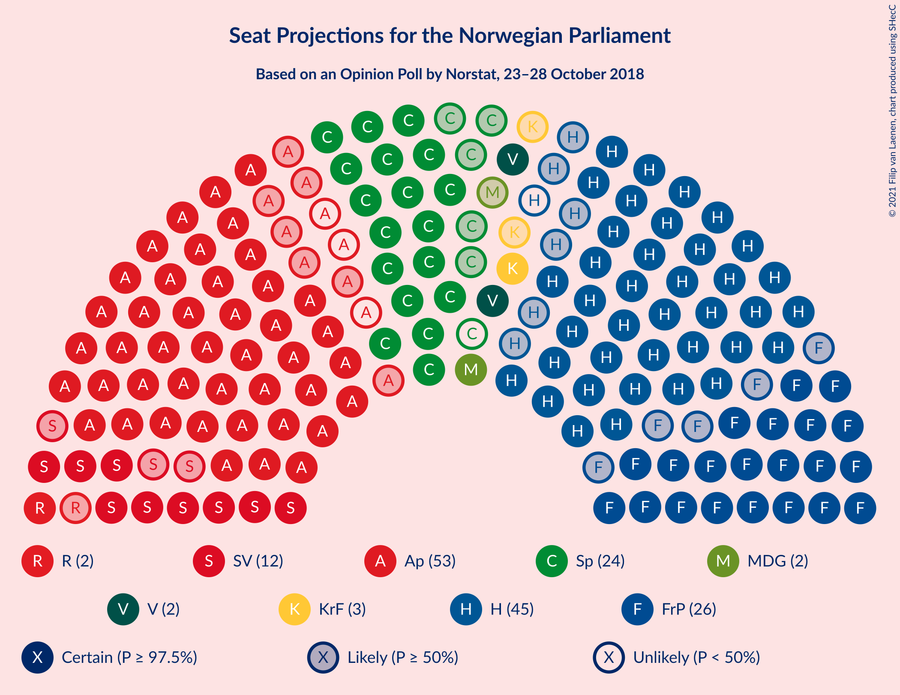
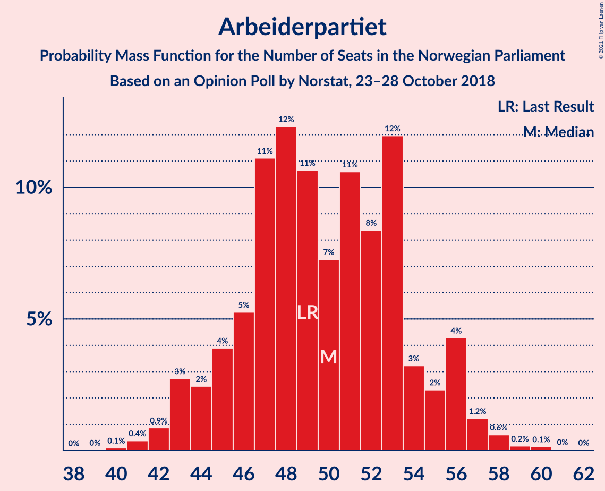
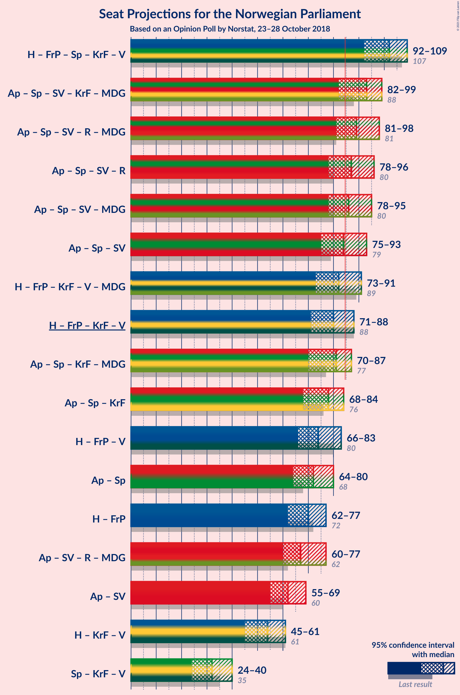
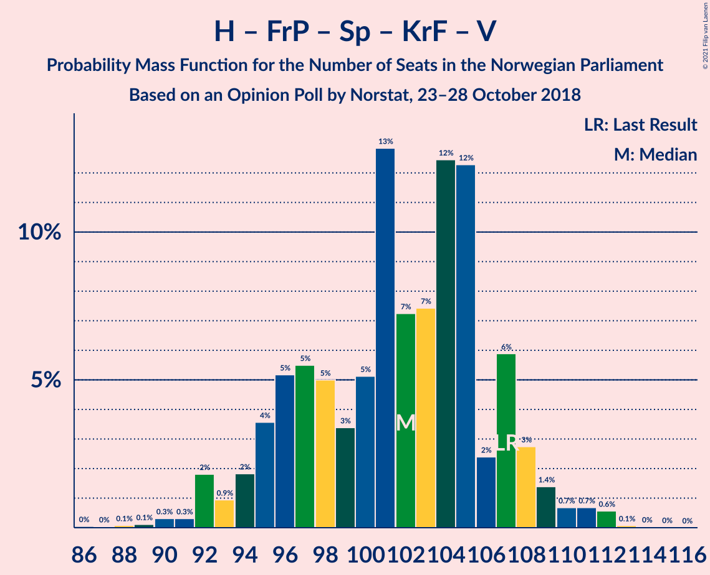
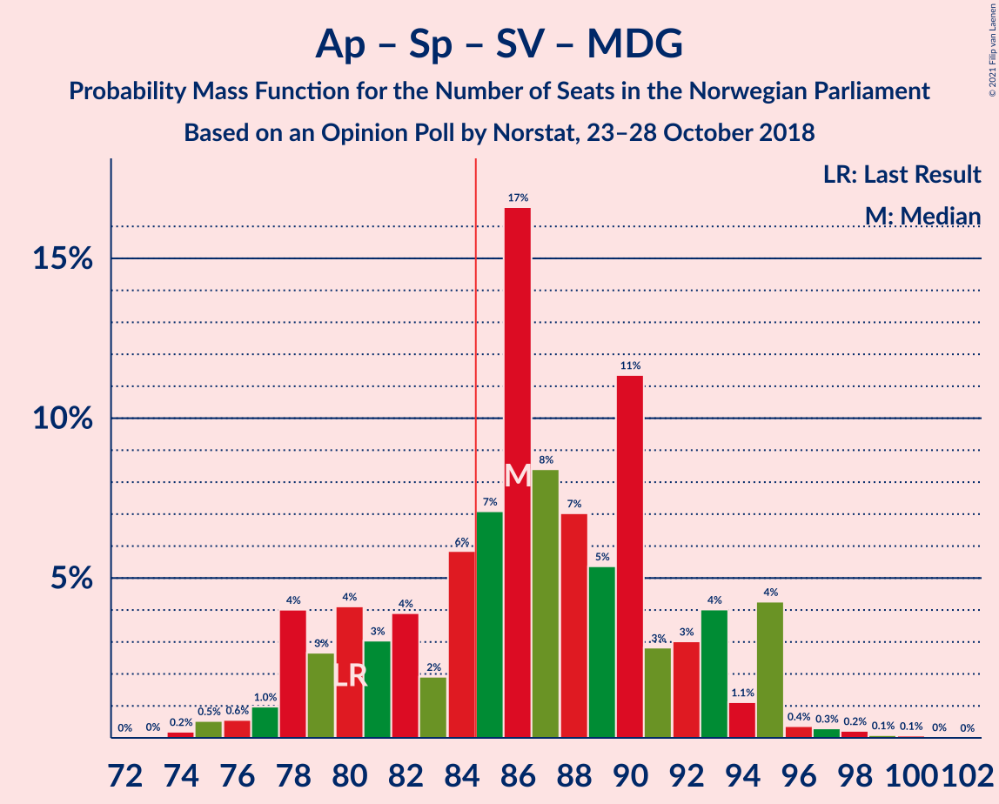
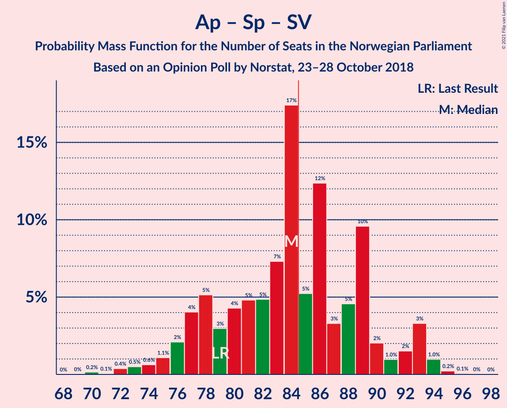

# Opinion Poll by Norstat, 23–28 October 2018

<a href="#voting-intentions">Voting Intentions</a> | <a href="#seats">Seats</a> | <a href="#coalitions">Coalitions</a> | <a href="#technical-information">Technical Information</a>

## Voting Intentions

### Confidence Intervals

| Party | Last Result | Poll Result | 80% Confidence Interval | 90% Confidence Interval | 95% Confidence Interval | 99% Confidence Interval |
|:-----:|:-----------:|:-----------:|:-----------------------:|:-----------------------:|:-----------------------:|:-----------------------:|
| Arbeiderpartiet | 27.4% | 27.1% | 25.0–29.4% |24.4–30.0% |23.9–30.6% |23.0–31.7% |
| Høyre | 25.0% | 24.2% | 22.2–26.4% |21.7–27.0% |21.2–27.6% |20.3–28.6% |
| Fremskrittspartiet | 15.2% | 14.1% | 12.6–16.0% |12.1–16.5% |11.7–16.9% |11.0–17.8% |
| Senterpartiet | 10.3% | 12.1% | 10.7–13.9% |10.2–14.3% |9.9–14.8% |9.2–15.6% |
| Sosialistisk Venstreparti | 6.0% | 6.6% | 5.6–8.0% |5.3–8.4% |5.0–8.7% |4.5–9.4% |
| Kristelig Folkeparti | 4.2% | 3.9% | 3.1–5.0% |2.9–5.3% |2.7–5.6% |2.3–6.2% |
| Venstre | 4.4% | 3.8% | 3.0–4.9% |2.8–5.2% |2.6–5.4% |2.2–6.0% |
| Rødt | 2.4% | 3.5% | 2.7–4.5% |2.5–4.8% |2.3–5.1% |2.0–5.7% |
| Miljøpartiet De Grønne | 3.2% | 3.2% | 2.5–4.2% |2.3–4.5% |2.1–4.8% |1.8–5.3% |

*Note:* The poll result column reflects the actual value used in the calculations. Published results may vary slightly, and in addition be rounded to fewer digits.

## Seats

### Confidence Intervals

| Party | Last Result | Median | 80% Confidence Interval | 90% Confidence Interval | 95% Confidence Interval | 99% Confidence Interval |
|:-----:|:-----------:|:------:|:-----------------------:|:-----------------------:|:-----------------------:|:-----------------------:|
| <a href="#arbeiderpartiet">Arbeiderpartiet</a> | 49 | 50 | 45–54 |44–56 |43–56 |41–58 |
| <a href="#høyre">Høyre</a> | 45 | 44 | 40–48 |39–49 |38–50 |36–53 |
| <a href="#fremskrittspartiet">Fremskrittspartiet</a> | 27 | 26 | 23–29 |21–30 |21–31 |19–33 |
| <a href="#senterpartiet">Senterpartiet</a> | 19 | 23 | 19–25 |18–26 |18–27 |16–28 |
| <a href="#sosialistisk-venstreparti">Sosialistisk Venstreparti</a> | 11 | 12 | 10–14 |10–15 |9–16 |8–17 |
| <a href="#kristelig-folkeparti">Kristelig Folkeparti</a> | 8 | 3 | 2–9 |1–10 |1–10 |1–11 |
| <a href="#venstre">Venstre</a> | 8 | 2 | 2–8 |2–9 |2–9 |1–11 |
| <a href="#rødt">Rødt</a> | 1 | 2 | 1–8 |1–8 |1–9 |1–10 |
| <a href="#miljøpartiet-de-grønne">Miljøpartiet De Grønne</a> | 1 | 2 | 1–7 |1–8 |1–8 |0–9 |

### Arbeiderpartiet

*For a full overview of the results for this party, see the [Arbeiderpartiet](party-arbeiderpartiet.html) page.*

| Number of Seats | Probability | Accumulated | Special Marks |
|:---------------:|:-----------:|:-----------:|:-------------:|
| 40 | 0.1% | 100% |  |
| 41 | 0.4% | 99.9% |  |
| 42 | 0.9% | 99.5% |  |
| 43 | 3% | 98.6% |  |
| 44 | 2% | 96% |  |
| 45 | 4% | 93% |  |
| 46 | 5% | 90% |  |
| 47 | 11% | 84% |  |
| 48 | 12% | 73% |  |
| 49 | 11% | 61% | Last Result |
| 50 | 7% | 50% | Median |
| 51 | 11% | 43% |  |
| 52 | 8% | 32% |  |
| 53 | 12% | 24% |  |
| 54 | 3% | 12% |  |
| 55 | 2% | 9% |  |
| 56 | 4% | 6% |  |
| 57 | 1.2% | 2% |  |
| 58 | 0.6% | 1.0% |  |
| 59 | 0.2% | 0.4% |  |
| 60 | 0.1% | 0.2% |  |
| 61 | 0% | 0.1% |  |
| 62 | 0% | 0% |  |

### Høyre

*For a full overview of the results for this party, see the [Høyre](party-høyre.html) page.*

| Number of Seats | Probability | Accumulated | Special Marks |
|:---------------:|:-----------:|:-----------:|:-------------:|
| 34 | 0.1% | 100% |  |
| 35 | 0.1% | 99.9% |  |
| 36 | 0.6% | 99.8% |  |
| 37 | 1.2% | 99.1% |  |
| 38 | 2% | 98% |  |
| 39 | 3% | 96% |  |
| 40 | 6% | 93% |  |
| 41 | 12% | 87% |  |
| 42 | 6% | 75% |  |
| 43 | 13% | 70% |  |
| 44 | 11% | 57% | Median |
| 45 | 17% | 46% | Last Result |
| 46 | 11% | 29% |  |
| 47 | 7% | 17% |  |
| 48 | 5% | 11% |  |
| 49 | 2% | 6% |  |
| 50 | 2% | 4% |  |
| 51 | 0.9% | 2% |  |
| 52 | 0.5% | 1.4% |  |
| 53 | 0.8% | 1.0% |  |
| 54 | 0.1% | 0.2% |  |
| 55 | 0% | 0.1% |  |
| 56 | 0% | 0% |  |

### Fremskrittspartiet

*For a full overview of the results for this party, see the [Fremskrittspartiet](party-fremskrittspartiet.html) page.*

| Number of Seats | Probability | Accumulated | Special Marks |
|:---------------:|:-----------:|:-----------:|:-------------:|
| 18 | 0.1% | 100% |  |
| 19 | 0.3% | 99.8% |  |
| 20 | 1.5% | 99.5% |  |
| 21 | 3% | 98% |  |
| 22 | 3% | 95% |  |
| 23 | 9% | 92% |  |
| 24 | 12% | 82% |  |
| 25 | 16% | 70% |  |
| 26 | 15% | 54% | Median |
| 27 | 16% | 39% | Last Result |
| 28 | 12% | 23% |  |
| 29 | 3% | 11% |  |
| 30 | 5% | 8% |  |
| 31 | 1.4% | 3% |  |
| 32 | 0.9% | 2% |  |
| 33 | 0.6% | 0.8% |  |
| 34 | 0.1% | 0.1% |  |
| 35 | 0.1% | 0.1% |  |
| 36 | 0% | 0% |  |

### Senterpartiet

*For a full overview of the results for this party, see the [Senterpartiet](party-senterpartiet.html) page.*

| Number of Seats | Probability | Accumulated | Special Marks |
|:---------------:|:-----------:|:-----------:|:-------------:|
| 15 | 0.2% | 100% |  |
| 16 | 0.5% | 99.7% |  |
| 17 | 1.4% | 99.3% |  |
| 18 | 4% | 98% |  |
| 19 | 9% | 94% | Last Result |
| 20 | 11% | 84% |  |
| 21 | 8% | 73% |  |
| 22 | 13% | 65% |  |
| 23 | 12% | 52% | Median |
| 24 | 26% | 41% |  |
| 25 | 8% | 15% |  |
| 26 | 4% | 7% |  |
| 27 | 2% | 3% |  |
| 28 | 1.4% | 2% |  |
| 29 | 0.3% | 0.4% |  |
| 30 | 0.1% | 0.1% |  |
| 31 | 0% | 0% |  |

### Sosialistisk Venstreparti

*For a full overview of the results for this party, see the [Sosialistisk Venstreparti](party-sosialistiskvenstreparti.html) page.*

| Number of Seats | Probability | Accumulated | Special Marks |
|:---------------:|:-----------:|:-----------:|:-------------:|
| 2 | 0% | 100% |  |
| 3 | 0% | 99.9% |  |
| 4 | 0% | 99.9% |  |
| 5 | 0% | 99.9% |  |
| 6 | 0% | 99.9% |  |
| 7 | 0.1% | 99.9% |  |
| 8 | 0.9% | 99.9% |  |
| 9 | 3% | 99.0% |  |
| 10 | 10% | 96% |  |
| 11 | 22% | 86% | Last Result |
| 12 | 33% | 63% | Median |
| 13 | 15% | 30% |  |
| 14 | 7% | 15% |  |
| 15 | 5% | 8% |  |
| 16 | 2% | 4% |  |
| 17 | 0.9% | 1.3% |  |
| 18 | 0.3% | 0.4% |  |
| 19 | 0% | 0% |  |

### Kristelig Folkeparti

*For a full overview of the results for this party, see the [Kristelig Folkeparti](party-kristeligfolkeparti.html) page.*

| Number of Seats | Probability | Accumulated | Special Marks |
|:---------------:|:-----------:|:-----------:|:-------------:|
| 0 | 0.4% | 100% |  |
| 1 | 7% | 99.6% |  |
| 2 | 6% | 93% |  |
| 3 | 38% | 87% | Median |
| 4 | 0% | 49% |  |
| 5 | 0% | 49% |  |
| 6 | 0% | 49% |  |
| 7 | 15% | 49% |  |
| 8 | 23% | 34% | Last Result |
| 9 | 6% | 11% |  |
| 10 | 4% | 5% |  |
| 11 | 0.8% | 1.0% |  |
| 12 | 0.1% | 0.2% |  |
| 13 | 0% | 0% |  |

### Venstre

*For a full overview of the results for this party, see the [Venstre](party-venstre.html) page.*

| Number of Seats | Probability | Accumulated | Special Marks |
|:---------------:|:-----------:|:-----------:|:-------------:|
| 1 | 1.3% | 100% |  |
| 2 | 57% | 98.7% | Median |
| 3 | 3% | 42% |  |
| 4 | 0% | 39% |  |
| 5 | 0% | 39% |  |
| 6 | 1.2% | 39% |  |
| 7 | 12% | 38% |  |
| 8 | 17% | 26% | Last Result |
| 9 | 6% | 9% |  |
| 10 | 2% | 2% |  |
| 11 | 0.4% | 0.6% |  |
| 12 | 0.1% | 0.2% |  |
| 13 | 0% | 0% |  |

### Rødt

*For a full overview of the results for this party, see the [Rødt](party-rødt.html) page.*

| Number of Seats | Probability | Accumulated | Special Marks |
|:---------------:|:-----------:|:-----------:|:-------------:|
| 1 | 15% | 100% | Last Result |
| 2 | 63% | 85% | Median |
| 3 | 0% | 23% |  |
| 4 | 0% | 23% |  |
| 5 | 0% | 23% |  |
| 6 | 0.1% | 23% |  |
| 7 | 7% | 23% |  |
| 8 | 11% | 15% |  |
| 9 | 3% | 4% |  |
| 10 | 0.9% | 1.1% |  |
| 11 | 0.2% | 0.2% |  |
| 12 | 0% | 0% |  |

### Miljøpartiet De Grønne

*For a full overview of the results for this party, see the [Miljøpartiet De Grønne](party-miljøpartietdegrønne.html) page.*

| Number of Seats | Probability | Accumulated | Special Marks |
|:---------------:|:-----------:|:-----------:|:-------------:|
| 0 | 0.8% | 100% |  |
| 1 | 44% | 99.2% | Last Result |
| 2 | 40% | 56% | Median |
| 3 | 1.4% | 16% |  |
| 4 | 0.1% | 15% |  |
| 5 | 0% | 14% |  |
| 6 | 1.3% | 14% |  |
| 7 | 5% | 13% |  |
| 8 | 7% | 8% |  |
| 9 | 2% | 2% |  |
| 10 | 0.2% | 0.3% |  |
| 11 | 0% | 0.1% |  |
| 12 | 0% | 0% |  |

## Coalitions

### Confidence Intervals

| Coalition | Last Result | Median | Majority? | 80% Confidence Interval | 90% Confidence Interval | 95% Confidence Interval | 99% Confidence Interval |
|:---------:|:-----------:|:------:|:---------:|:-----------------------:|:-----------------------:|:-----------------------:|:-----------------------:|
| Høyre – Fremskrittspartiet – Senterpartiet – Kristelig Folkeparti – Venstre | 107 | 102 | 100% | 96–107 | 94–108 | 92–109 | 90–112 |
| Arbeiderpartiet – Senterpartiet – Sosialistisk Venstreparti – Kristelig Folkeparti – Miljøpartiet De Grønne | 88 | 93 | 93% | 85–97 | 83–98 | 82–99 | 81–102 |
| Arbeiderpartiet – Senterpartiet – Sosialistisk Venstreparti – Rødt – Miljøpartiet De Grønne | 81 | 89 | 88% | 84–95 | 82–97 | 81–98 | 79–101 |
| Arbeiderpartiet – Senterpartiet – Sosialistisk Venstreparti – Rødt | 80 | 87 | 79% | 82–93 | 80–95 | 78–96 | 76–97 |
| Arbeiderpartiet – Senterpartiet – Sosialistisk Venstreparti – Miljøpartiet De Grønne | 80 | 86 | 72% | 80–93 | 78–95 | 78–95 | 75–97 |
| Arbeiderpartiet – Senterpartiet – Sosialistisk Venstreparti | 79 | 84 | 44% | 78–89 | 77–92 | 75–93 | 72–94 |
| Høyre – Fremskrittspartiet – Kristelig Folkeparti – Venstre – Miljøpartiet De Grønne | 89 | 82 | 21% | 76–87 | 74–89 | 73–91 | 72–93 |
| Høyre – Fremskrittspartiet – Kristelig Folkeparti – Venstre | 88 | 80 | 12% | 74–85 | 72–87 | 71–88 | 68–90 |
| Arbeiderpartiet – Senterpartiet – Kristelig Folkeparti – Miljøpartiet De Grønne | 77 | 81 | 12% | 74–85 | 71–86 | 70–87 | 68–90 |
| Arbeiderpartiet – Senterpartiet – Kristelig Folkeparti | 76 | 78 | 2% | 71–82 | 69–84 | 68–84 | 66–87 |
| Høyre – Fremskrittspartiet – Venstre | 80 | 74 | 2% | 69–79 | 68–81 | 66–83 | 63–85 |
| Arbeiderpartiet – Senterpartiet | 68 | 72 | 0% | 66–77 | 65–80 | 64–80 | 61–81 |
| Høyre – Fremskrittspartiet | 72 | 70 | 0% | 64–74 | 63–76 | 62–77 | 60–80 |
| Arbeiderpartiet – Sosialistisk Venstreparti – Rødt – Miljøpartiet De Grønne | 62 | 67 | 0% | 62–73 | 61–75 | 60–77 | 57–79 |
| Arbeiderpartiet – Sosialistisk Venstreparti | 60 | 62 | 0% | 57–66 | 56–69 | 55–69 | 53–72 |
| Høyre – Kristelig Folkeparti – Venstre | 61 | 54 | 0% | 48–59 | 46–61 | 45–61 | 43–64 |
| Senterpartiet – Kristelig Folkeparti – Venstre | 35 | 32 | 0% | 27–37 | 25–40 | 24–40 | 22–43 |

### Høyre – Fremskrittspartiet – Senterpartiet – Kristelig Folkeparti – Venstre

| Number of Seats | Probability | Accumulated | Special Marks |
|:---------------:|:-----------:|:-----------:|:-------------:|
| 86 | 0% | 100% |  |
| 87 | 0% | 99.9% |  |
| 88 | 0.1% | 99.9% |  |
| 89 | 0.1% | 99.8% |  |
| 90 | 0.3% | 99.7% |  |
| 91 | 0.3% | 99.4% |  |
| 92 | 2% | 99.1% |  |
| 93 | 0.9% | 97% |  |
| 94 | 2% | 96% |  |
| 95 | 4% | 94% |  |
| 96 | 5% | 91% |  |
| 97 | 5% | 86% |  |
| 98 | 5% | 80% | Median |
| 99 | 3% | 75% |  |
| 100 | 5% | 72% |  |
| 101 | 13% | 67% |  |
| 102 | 7% | 54% |  |
| 103 | 7% | 47% |  |
| 104 | 12% | 39% |  |
| 105 | 12% | 27% |  |
| 106 | 2% | 14% |  |
| 107 | 6% | 12% | Last Result |
| 108 | 3% | 6% |  |
| 109 | 1.4% | 3% |  |
| 110 | 0.7% | 2% |  |
| 111 | 0.7% | 1.4% |  |
| 112 | 0.6% | 0.7% |  |
| 113 | 0.1% | 0.1% |  |
| 114 | 0% | 0.1% |  |
| 115 | 0% | 0% |  |

### Arbeiderpartiet – Senterpartiet – Sosialistisk Venstreparti – Kristelig Folkeparti – Miljøpartiet De Grønne

| Number of Seats | Probability | Accumulated | Special Marks |
|:---------------:|:-----------:|:-----------:|:-------------:|
| 78 | 0% | 100% |  |
| 79 | 0.1% | 99.9% |  |
| 80 | 0.3% | 99.9% |  |
| 81 | 0.5% | 99.6% |  |
| 82 | 2% | 99.1% |  |
| 83 | 3% | 97% |  |
| 84 | 2% | 95% |  |
| 85 | 6% | 93% | Majority |
| 86 | 2% | 87% |  |
| 87 | 4% | 85% |  |
| 88 | 4% | 82% | Last Result |
| 89 | 6% | 78% |  |
| 90 | 4% | 72% | Median |
| 91 | 7% | 68% |  |
| 92 | 7% | 61% |  |
| 93 | 14% | 54% |  |
| 94 | 18% | 40% |  |
| 95 | 4% | 22% |  |
| 96 | 6% | 18% |  |
| 97 | 4% | 11% |  |
| 98 | 4% | 7% |  |
| 99 | 1.3% | 3% |  |
| 100 | 1.0% | 2% |  |
| 101 | 0.4% | 1.1% |  |
| 102 | 0.3% | 0.7% |  |
| 103 | 0.2% | 0.4% |  |
| 104 | 0.1% | 0.2% |  |
| 105 | 0% | 0% |  |

### Arbeiderpartiet – Senterpartiet – Sosialistisk Venstreparti – Rødt – Miljøpartiet De Grønne

| Number of Seats | Probability | Accumulated | Special Marks |
|:---------------:|:-----------:|:-----------:|:-------------:|
| 77 | 0.2% | 100% |  |
| 78 | 0.1% | 99.7% |  |
| 79 | 0.2% | 99.6% |  |
| 80 | 1.2% | 99.4% |  |
| 81 | 1.3% | 98% | Last Result |
| 82 | 2% | 97% |  |
| 83 | 3% | 95% |  |
| 84 | 4% | 92% |  |
| 85 | 4% | 88% | Majority |
| 86 | 6% | 85% |  |
| 87 | 9% | 78% |  |
| 88 | 14% | 70% |  |
| 89 | 7% | 56% | Median |
| 90 | 6% | 49% |  |
| 91 | 7% | 43% |  |
| 92 | 12% | 36% |  |
| 93 | 4% | 24% |  |
| 94 | 5% | 19% |  |
| 95 | 5% | 15% |  |
| 96 | 1.3% | 9% |  |
| 97 | 5% | 8% |  |
| 98 | 1.1% | 3% |  |
| 99 | 0.4% | 2% |  |
| 100 | 1.0% | 2% |  |
| 101 | 0.3% | 0.6% |  |
| 102 | 0.1% | 0.3% |  |
| 103 | 0.1% | 0.2% |  |
| 104 | 0.1% | 0.1% |  |
| 105 | 0% | 0% |  |

### Arbeiderpartiet – Senterpartiet – Sosialistisk Venstreparti – Rødt

| Number of Seats | Probability | Accumulated | Special Marks |
|:---------------:|:-----------:|:-----------:|:-------------:|
| 73 | 0% | 100% |  |
| 74 | 0.2% | 99.9% |  |
| 75 | 0.1% | 99.8% |  |
| 76 | 0.3% | 99.6% |  |
| 77 | 0.3% | 99.3% |  |
| 78 | 2% | 99.0% |  |
| 79 | 1.0% | 97% |  |
| 80 | 3% | 96% | Last Result |
| 81 | 1.3% | 93% |  |
| 82 | 5% | 92% |  |
| 83 | 5% | 87% |  |
| 84 | 4% | 82% |  |
| 85 | 10% | 79% | Majority |
| 86 | 15% | 68% |  |
| 87 | 5% | 53% | Median |
| 88 | 13% | 48% |  |
| 89 | 3% | 35% |  |
| 90 | 6% | 32% |  |
| 91 | 11% | 26% |  |
| 92 | 3% | 14% |  |
| 93 | 3% | 11% |  |
| 94 | 2% | 8% |  |
| 95 | 3% | 6% |  |
| 96 | 2% | 3% |  |
| 97 | 0.6% | 1.1% |  |
| 98 | 0.2% | 0.5% |  |
| 99 | 0.1% | 0.3% |  |
| 100 | 0.1% | 0.2% |  |
| 101 | 0.1% | 0.1% |  |
| 102 | 0% | 0.1% |  |
| 103 | 0% | 0% |  |

### Arbeiderpartiet – Senterpartiet – Sosialistisk Venstreparti – Miljøpartiet De Grønne

| Number of Seats | Probability | Accumulated | Special Marks |
|:---------------:|:-----------:|:-----------:|:-------------:|
| 73 | 0% | 100% |  |
| 74 | 0.2% | 99.9% |  |
| 75 | 0.5% | 99.7% |  |
| 76 | 0.6% | 99.2% |  |
| 77 | 1.0% | 98.6% |  |
| 78 | 4% | 98% |  |
| 79 | 3% | 94% |  |
| 80 | 4% | 91% | Last Result |
| 81 | 3% | 87% |  |
| 82 | 4% | 84% |  |
| 83 | 2% | 80% |  |
| 84 | 6% | 78% |  |
| 85 | 7% | 72% | Majority |
| 86 | 17% | 65% |  |
| 87 | 8% | 48% | Median |
| 88 | 7% | 40% |  |
| 89 | 5% | 33% |  |
| 90 | 11% | 28% |  |
| 91 | 3% | 16% |  |
| 92 | 3% | 14% |  |
| 93 | 4% | 10% |  |
| 94 | 1.1% | 6% |  |
| 95 | 4% | 5% |  |
| 96 | 0.4% | 1.1% |  |
| 97 | 0.3% | 0.7% |  |
| 98 | 0.2% | 0.4% |  |
| 99 | 0.1% | 0.2% |  |
| 100 | 0.1% | 0.1% |  |
| 101 | 0% | 0% |  |

### Arbeiderpartiet – Senterpartiet – Sosialistisk Venstreparti

| Number of Seats | Probability | Accumulated | Special Marks |
|:---------------:|:-----------:|:-----------:|:-------------:|
| 70 | 0.2% | 100% |  |
| 71 | 0.1% | 99.8% |  |
| 72 | 0.4% | 99.7% |  |
| 73 | 0.5% | 99.4% |  |
| 74 | 0.6% | 98.9% |  |
| 75 | 1.1% | 98% |  |
| 76 | 2% | 97% |  |
| 77 | 4% | 95% |  |
| 78 | 5% | 91% |  |
| 79 | 3% | 86% | Last Result |
| 80 | 4% | 83% |  |
| 81 | 5% | 79% |  |
| 82 | 5% | 74% |  |
| 83 | 7% | 69% |  |
| 84 | 17% | 62% |  |
| 85 | 5% | 44% | Median, Majority |
| 86 | 12% | 39% |  |
| 87 | 3% | 27% |  |
| 88 | 5% | 23% |  |
| 89 | 10% | 19% |  |
| 90 | 2% | 9% |  |
| 91 | 1.0% | 7% |  |
| 92 | 2% | 6% |  |
| 93 | 3% | 5% |  |
| 94 | 1.0% | 1.3% |  |
| 95 | 0.2% | 0.3% |  |
| 96 | 0.1% | 0.1% |  |
| 97 | 0% | 0.1% |  |
| 98 | 0% | 0% |  |

### Høyre – Fremskrittspartiet – Kristelig Folkeparti – Venstre – Miljøpartiet De Grønne

| Number of Seats | Probability | Accumulated | Special Marks |
|:---------------:|:-----------:|:-----------:|:-------------:|
| 67 | 0% | 100% |  |
| 68 | 0.1% | 99.9% |  |
| 69 | 0.1% | 99.9% |  |
| 70 | 0.1% | 99.8% |  |
| 71 | 0.2% | 99.7% |  |
| 72 | 0.6% | 99.5% |  |
| 73 | 2% | 98.9% |  |
| 74 | 3% | 97% |  |
| 75 | 2% | 94% |  |
| 76 | 3% | 92% |  |
| 77 | 3% | 89% | Median |
| 78 | 11% | 86% |  |
| 79 | 6% | 74% |  |
| 80 | 3% | 68% |  |
| 81 | 13% | 65% |  |
| 82 | 5% | 52% |  |
| 83 | 15% | 47% |  |
| 84 | 10% | 32% |  |
| 85 | 4% | 21% | Majority |
| 86 | 5% | 18% |  |
| 87 | 5% | 13% |  |
| 88 | 1.3% | 8% |  |
| 89 | 3% | 7% | Last Result |
| 90 | 1.0% | 4% |  |
| 91 | 2% | 3% |  |
| 92 | 0.3% | 1.0% |  |
| 93 | 0.3% | 0.7% |  |
| 94 | 0.1% | 0.4% |  |
| 95 | 0.2% | 0.2% |  |
| 96 | 0% | 0.1% |  |
| 97 | 0% | 0% |  |

### Høyre – Fremskrittspartiet – Kristelig Folkeparti – Venstre

| Number of Seats | Probability | Accumulated | Special Marks |
|:---------------:|:-----------:|:-----------:|:-------------:|
| 65 | 0.1% | 100% |  |
| 66 | 0.1% | 99.9% |  |
| 67 | 0.1% | 99.8% |  |
| 68 | 0.3% | 99.7% |  |
| 69 | 1.0% | 99.4% |  |
| 70 | 0.4% | 98% |  |
| 71 | 1.1% | 98% |  |
| 72 | 5% | 97% |  |
| 73 | 1.3% | 92% |  |
| 74 | 5% | 91% |  |
| 75 | 5% | 85% | Median |
| 76 | 4% | 81% |  |
| 77 | 12% | 76% |  |
| 78 | 7% | 64% |  |
| 79 | 6% | 57% |  |
| 80 | 7% | 51% |  |
| 81 | 14% | 44% |  |
| 82 | 9% | 30% |  |
| 83 | 6% | 22% |  |
| 84 | 4% | 15% |  |
| 85 | 4% | 12% | Majority |
| 86 | 3% | 8% |  |
| 87 | 2% | 5% |  |
| 88 | 1.3% | 3% | Last Result |
| 89 | 1.2% | 2% |  |
| 90 | 0.2% | 0.6% |  |
| 91 | 0.1% | 0.4% |  |
| 92 | 0.2% | 0.3% |  |
| 93 | 0% | 0% |  |

### Arbeiderpartiet – Senterpartiet – Kristelig Folkeparti – Miljøpartiet De Grønne

| Number of Seats | Probability | Accumulated | Special Marks |
|:---------------:|:-----------:|:-----------:|:-------------:|
| 66 | 0% | 100% |  |
| 67 | 0.1% | 99.9% |  |
| 68 | 0.5% | 99.9% |  |
| 69 | 0.5% | 99.4% |  |
| 70 | 2% | 98.9% |  |
| 71 | 2% | 97% |  |
| 72 | 2% | 95% |  |
| 73 | 2% | 93% |  |
| 74 | 6% | 91% |  |
| 75 | 3% | 85% |  |
| 76 | 5% | 81% |  |
| 77 | 6% | 76% | Last Result |
| 78 | 5% | 70% | Median |
| 79 | 6% | 66% |  |
| 80 | 7% | 60% |  |
| 81 | 14% | 53% |  |
| 82 | 11% | 38% |  |
| 83 | 11% | 27% |  |
| 84 | 4% | 16% |  |
| 85 | 5% | 12% | Majority |
| 86 | 3% | 7% |  |
| 87 | 2% | 4% |  |
| 88 | 0.9% | 2% |  |
| 89 | 0.6% | 1.3% |  |
| 90 | 0.4% | 0.7% |  |
| 91 | 0.2% | 0.3% |  |
| 92 | 0.1% | 0.2% |  |
| 93 | 0.1% | 0.1% |  |
| 94 | 0% | 0% |  |

### Arbeiderpartiet – Senterpartiet – Kristelig Folkeparti

| Number of Seats | Probability | Accumulated | Special Marks |
|:---------------:|:-----------:|:-----------:|:-------------:|
| 63 | 0.1% | 100% |  |
| 64 | 0.1% | 99.9% |  |
| 65 | 0.2% | 99.8% |  |
| 66 | 0.4% | 99.6% |  |
| 67 | 0.8% | 99.2% |  |
| 68 | 1.5% | 98% |  |
| 69 | 3% | 97% |  |
| 70 | 2% | 94% |  |
| 71 | 3% | 92% |  |
| 72 | 2% | 89% |  |
| 73 | 8% | 87% |  |
| 74 | 5% | 79% |  |
| 75 | 6% | 74% |  |
| 76 | 7% | 67% | Last Result, Median |
| 77 | 7% | 61% |  |
| 78 | 7% | 53% |  |
| 79 | 6% | 47% |  |
| 80 | 19% | 40% |  |
| 81 | 4% | 22% |  |
| 82 | 7% | 17% |  |
| 83 | 5% | 10% |  |
| 84 | 3% | 5% |  |
| 85 | 0.6% | 2% | Majority |
| 86 | 1.1% | 2% |  |
| 87 | 0.2% | 0.7% |  |
| 88 | 0.3% | 0.5% |  |
| 89 | 0.1% | 0.1% |  |
| 90 | 0% | 0.1% |  |
| 91 | 0% | 0% |  |

### Høyre – Fremskrittspartiet – Venstre

| Number of Seats | Probability | Accumulated | Special Marks |
|:---------------:|:-----------:|:-----------:|:-------------:|
| 61 | 0% | 100% |  |
| 62 | 0.2% | 99.9% |  |
| 63 | 0.3% | 99.7% |  |
| 64 | 0.4% | 99.4% |  |
| 65 | 0.7% | 99.0% |  |
| 66 | 1.4% | 98% |  |
| 67 | 2% | 97% |  |
| 68 | 4% | 95% |  |
| 69 | 5% | 91% |  |
| 70 | 4% | 86% |  |
| 71 | 7% | 82% |  |
| 72 | 5% | 75% | Median |
| 73 | 16% | 70% |  |
| 74 | 14% | 54% |  |
| 75 | 7% | 40% |  |
| 76 | 12% | 34% |  |
| 77 | 3% | 22% |  |
| 78 | 5% | 19% |  |
| 79 | 5% | 14% |  |
| 80 | 2% | 9% | Last Result |
| 81 | 2% | 6% |  |
| 82 | 2% | 5% |  |
| 83 | 0.3% | 3% |  |
| 84 | 0.5% | 2% |  |
| 85 | 1.5% | 2% | Majority |
| 86 | 0.1% | 0.3% |  |
| 87 | 0.1% | 0.1% |  |
| 88 | 0% | 0% |  |

### Arbeiderpartiet – Senterpartiet

| Number of Seats | Probability | Accumulated | Special Marks |
|:---------------:|:-----------:|:-----------:|:-------------:|
| 59 | 0.1% | 100% |  |
| 60 | 0.3% | 99.9% |  |
| 61 | 0.4% | 99.6% |  |
| 62 | 0.5% | 99.3% |  |
| 63 | 0.9% | 98.7% |  |
| 64 | 2% | 98% |  |
| 65 | 3% | 96% |  |
| 66 | 7% | 93% |  |
| 67 | 3% | 86% |  |
| 68 | 4% | 83% | Last Result |
| 69 | 4% | 79% |  |
| 70 | 7% | 75% |  |
| 71 | 8% | 68% |  |
| 72 | 15% | 60% |  |
| 73 | 6% | 45% | Median |
| 74 | 9% | 38% |  |
| 75 | 8% | 30% |  |
| 76 | 3% | 22% |  |
| 77 | 11% | 19% |  |
| 78 | 2% | 8% |  |
| 79 | 1.0% | 6% |  |
| 80 | 4% | 5% |  |
| 81 | 0.3% | 0.6% |  |
| 82 | 0.1% | 0.3% |  |
| 83 | 0% | 0.1% |  |
| 84 | 0.1% | 0.1% |  |
| 85 | 0% | 0% | Majority |

### Høyre – Fremskrittspartiet

| Number of Seats | Probability | Accumulated | Special Marks |
|:---------------:|:-----------:|:-----------:|:-------------:|
| 57 | 0% | 100% |  |
| 58 | 0.1% | 99.9% |  |
| 59 | 0.2% | 99.8% |  |
| 60 | 0.7% | 99.6% |  |
| 61 | 0.7% | 98.9% |  |
| 62 | 2% | 98% |  |
| 63 | 3% | 96% |  |
| 64 | 3% | 93% |  |
| 65 | 3% | 90% |  |
| 66 | 5% | 87% |  |
| 67 | 10% | 82% |  |
| 68 | 6% | 72% |  |
| 69 | 13% | 66% |  |
| 70 | 6% | 54% | Median |
| 71 | 18% | 48% |  |
| 72 | 13% | 30% | Last Result |
| 73 | 4% | 17% |  |
| 74 | 3% | 13% |  |
| 75 | 2% | 10% |  |
| 76 | 3% | 7% |  |
| 77 | 2% | 4% |  |
| 78 | 0.9% | 2% |  |
| 79 | 0.4% | 1.2% |  |
| 80 | 0.6% | 0.8% |  |
| 81 | 0.1% | 0.2% |  |
| 82 | 0% | 0.2% |  |
| 83 | 0.1% | 0.1% |  |
| 84 | 0% | 0.1% |  |
| 85 | 0% | 0% | Majority |

### Arbeiderpartiet – Sosialistisk Venstreparti – Rødt – Miljøpartiet De Grønne

| Number of Seats | Probability | Accumulated | Special Marks |
|:---------------:|:-----------:|:-----------:|:-------------:|
| 55 | 0% | 100% |  |
| 56 | 0.1% | 99.9% |  |
| 57 | 0.6% | 99.9% |  |
| 58 | 0.7% | 99.3% |  |
| 59 | 0.7% | 98.6% |  |
| 60 | 1.4% | 98% |  |
| 61 | 3% | 97% |  |
| 62 | 6% | 94% | Last Result |
| 63 | 2% | 88% |  |
| 64 | 12% | 86% |  |
| 65 | 12% | 73% |  |
| 66 | 7% | 61% | Median |
| 67 | 7% | 53% |  |
| 68 | 13% | 46% |  |
| 69 | 5% | 33% |  |
| 70 | 3% | 28% |  |
| 71 | 5% | 25% |  |
| 72 | 5% | 20% |  |
| 73 | 5% | 14% |  |
| 74 | 4% | 9% |  |
| 75 | 2% | 6% |  |
| 76 | 0.9% | 4% |  |
| 77 | 2% | 3% |  |
| 78 | 0.3% | 0.9% |  |
| 79 | 0.3% | 0.6% |  |
| 80 | 0.1% | 0.3% |  |
| 81 | 0.1% | 0.2% |  |
| 82 | 0% | 0.1% |  |
| 83 | 0% | 0.1% |  |
| 84 | 0% | 0% |  |

### Arbeiderpartiet – Sosialistisk Venstreparti

| Number of Seats | Probability | Accumulated | Special Marks |
|:---------------:|:-----------:|:-----------:|:-------------:|
| 50 | 0.1% | 100% |  |
| 51 | 0.1% | 99.9% |  |
| 52 | 0.2% | 99.8% |  |
| 53 | 0.6% | 99.6% |  |
| 54 | 1.3% | 99.0% |  |
| 55 | 2% | 98% |  |
| 56 | 3% | 96% |  |
| 57 | 3% | 93% |  |
| 58 | 9% | 90% |  |
| 59 | 7% | 81% |  |
| 60 | 10% | 74% | Last Result |
| 61 | 12% | 64% |  |
| 62 | 14% | 52% | Median |
| 63 | 8% | 38% |  |
| 64 | 6% | 30% |  |
| 65 | 11% | 25% |  |
| 66 | 4% | 13% |  |
| 67 | 2% | 10% |  |
| 68 | 2% | 8% |  |
| 69 | 5% | 6% |  |
| 70 | 0.5% | 1.5% |  |
| 71 | 0.1% | 1.0% |  |
| 72 | 0.7% | 0.9% |  |
| 73 | 0% | 0.1% |  |
| 74 | 0% | 0.1% |  |
| 75 | 0.1% | 0.1% |  |
| 76 | 0% | 0% |  |

### Høyre – Kristelig Folkeparti – Venstre

| Number of Seats | Probability | Accumulated | Special Marks |
|:---------------:|:-----------:|:-----------:|:-------------:|
| 41 | 0.1% | 100% |  |
| 42 | 0.2% | 99.9% |  |
| 43 | 0.4% | 99.7% |  |
| 44 | 0.6% | 99.3% |  |
| 45 | 2% | 98.7% |  |
| 46 | 4% | 97% |  |
| 47 | 2% | 92% |  |
| 48 | 3% | 90% |  |
| 49 | 3% | 87% | Median |
| 50 | 10% | 84% |  |
| 51 | 8% | 74% |  |
| 52 | 7% | 66% |  |
| 53 | 8% | 59% |  |
| 54 | 6% | 51% |  |
| 55 | 12% | 45% |  |
| 56 | 6% | 32% |  |
| 57 | 5% | 26% |  |
| 58 | 10% | 22% |  |
| 59 | 4% | 12% |  |
| 60 | 3% | 8% |  |
| 61 | 3% | 5% | Last Result |
| 62 | 0.9% | 2% |  |
| 63 | 0.5% | 2% |  |
| 64 | 0.8% | 1.1% |  |
| 65 | 0.1% | 0.3% |  |
| 66 | 0.1% | 0.2% |  |
| 67 | 0% | 0.1% |  |
| 68 | 0% | 0% |  |

### Senterpartiet – Kristelig Folkeparti – Venstre

| Number of Seats | Probability | Accumulated | Special Marks |
|:---------------:|:-----------:|:-----------:|:-------------:|
| 21 | 0.1% | 100% |  |
| 22 | 0.7% | 99.9% |  |
| 23 | 0.9% | 99.2% |  |
| 24 | 1.1% | 98% |  |
| 25 | 3% | 97% |  |
| 26 | 3% | 94% |  |
| 27 | 4% | 91% |  |
| 28 | 4% | 86% | Median |
| 29 | 14% | 83% |  |
| 30 | 8% | 69% |  |
| 31 | 5% | 61% |  |
| 32 | 7% | 56% |  |
| 33 | 12% | 49% |  |
| 34 | 14% | 37% |  |
| 35 | 7% | 23% | Last Result |
| 36 | 4% | 16% |  |
| 37 | 3% | 12% |  |
| 38 | 3% | 9% |  |
| 39 | 0.5% | 6% |  |
| 40 | 4% | 6% |  |
| 41 | 0.9% | 2% |  |
| 42 | 0.4% | 1.1% |  |
| 43 | 0.5% | 0.7% |  |
| 44 | 0.2% | 0.2% |  |
| 45 | 0% | 0% |  |

## Technical Information

### Opinion Poll

+ **Polling firm:** Norstat
+ **Commissioner(s):** —
+ **Fieldwork period:** 23–28 October 2018

### Calculations

+ **Sample size:** 693
+ **Simulations done:** 1,048,576
+ **Error estimate:** 2.65%

