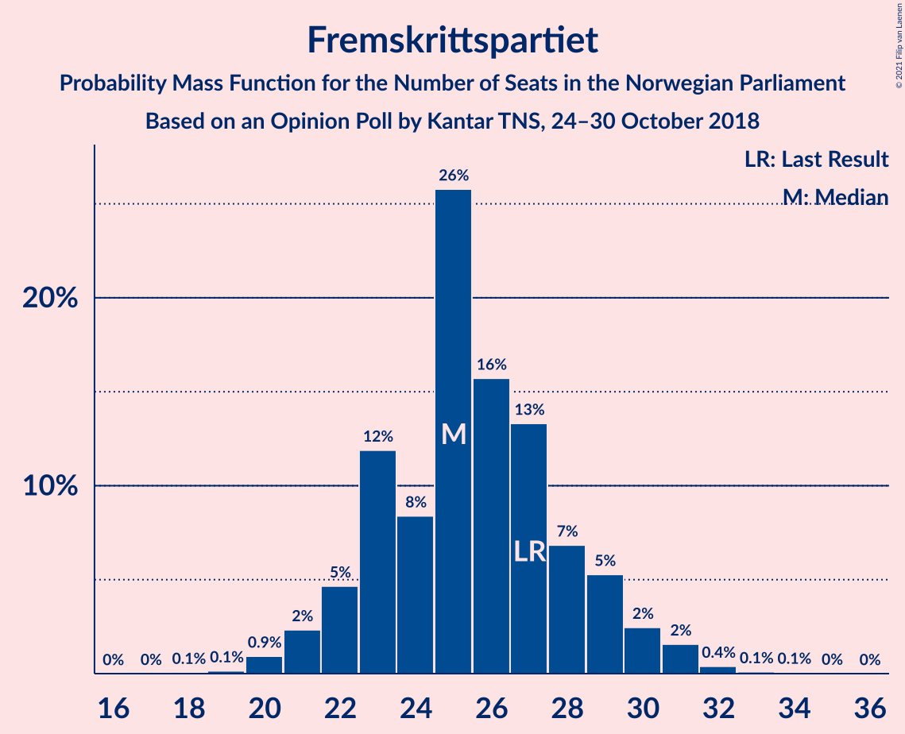
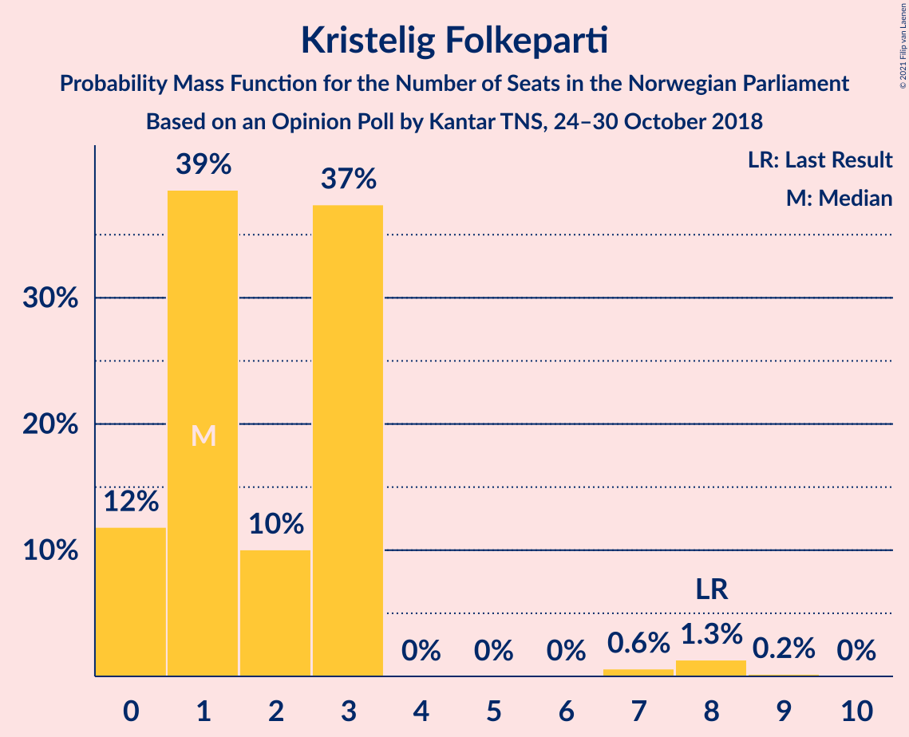
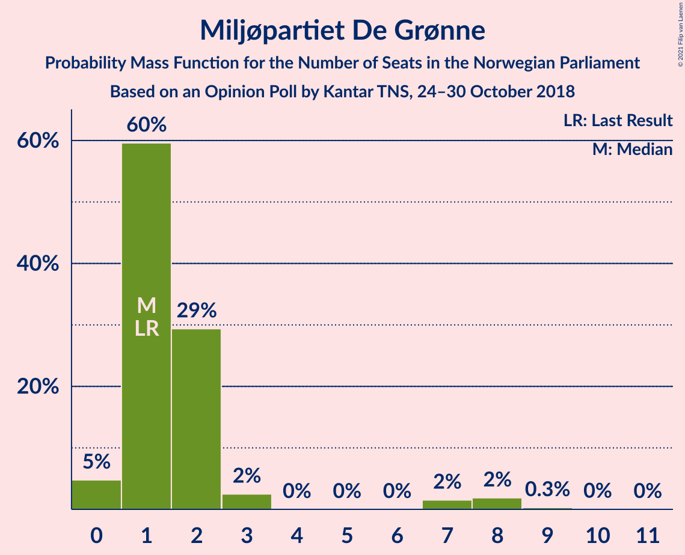
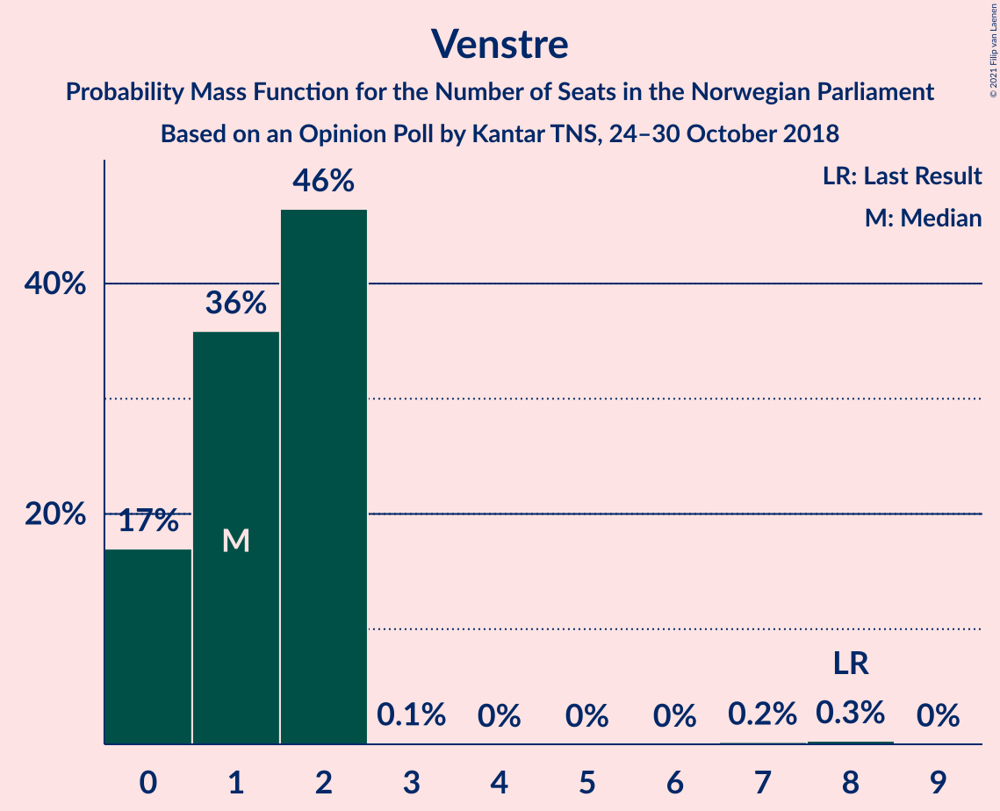
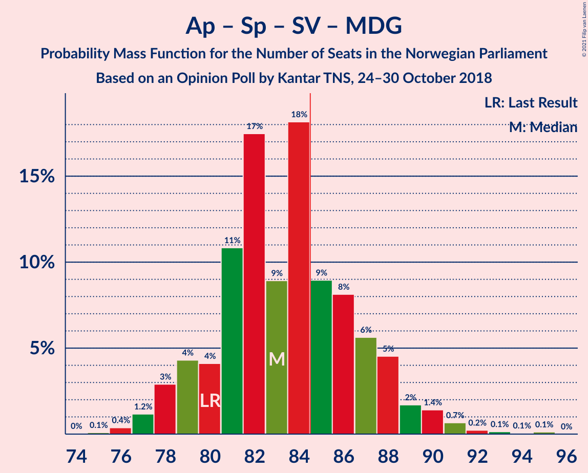
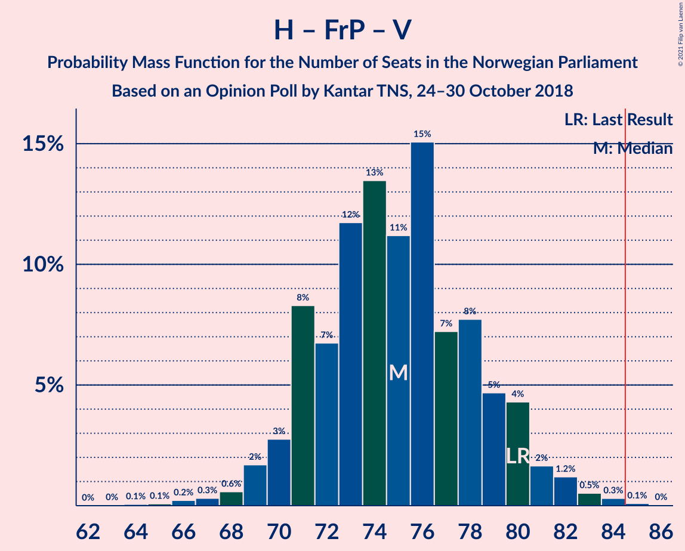
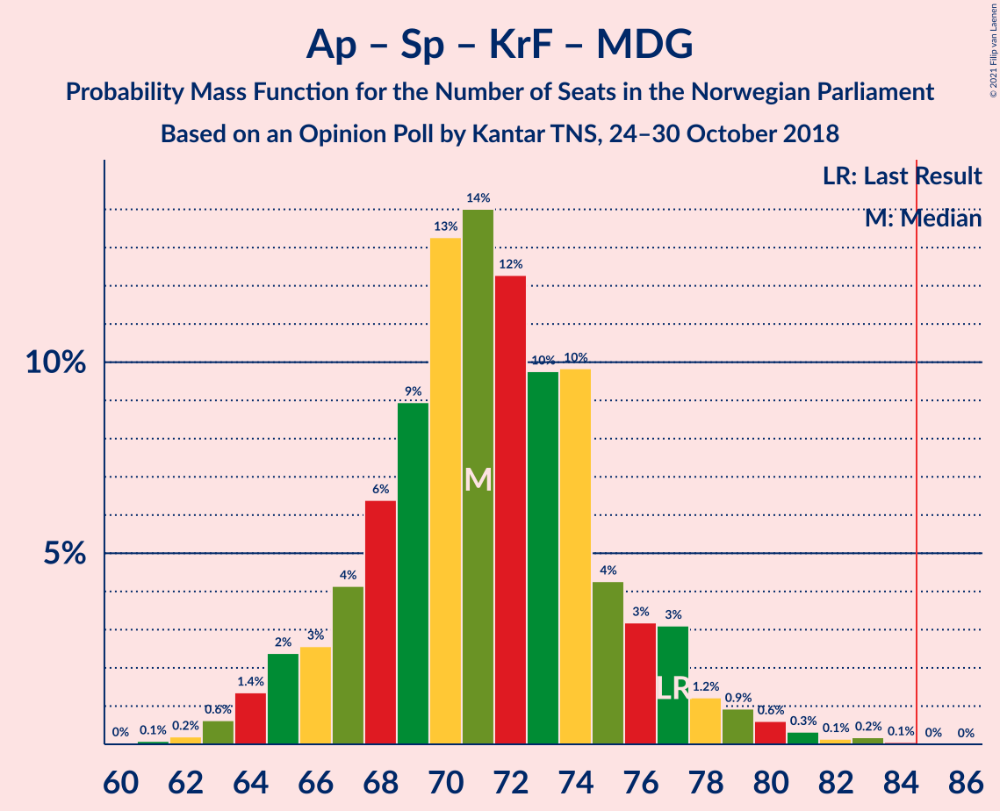

# Opinion Poll by Kantar TNS, 24–30 October 2018

<a href="#voting-intentions">Voting Intentions</a> | <a href="#seats">Seats</a> | <a href="#coalitions">Coalitions</a> | <a href="#technical-information">Technical Information</a>

## Voting Intentions

### Confidence Intervals

| Party | Last Result | Poll Result | 80% Confidence Interval | 90% Confidence Interval | 95% Confidence Interval | 99% Confidence Interval |
|:-----:|:-----------:|:-----------:|:-----------------------:|:-----------------------:|:-----------------------:|:-----------------------:|
| Arbeiderpartiet | 27.4% | 27.7% | 25.7–29.8% |25.1–30.4% |24.7–30.9% |23.7–32.0% |
| Høyre | 25.0% | 26.8% | 24.8–28.9% |24.3–29.5% |23.8–30.0% |22.9–31.0% |
| Fremskrittspartiet | 15.2% | 13.8% | 12.3–15.5% |11.9–16.0% |11.5–16.4% |10.9–17.2% |
| Senterpartiet | 10.3% | 9.1% | 7.9–10.5% |7.5–10.9% |7.2–11.3% |6.7–12.0% |
| Sosialistisk Venstreparti | 6.0% | 7.3% | 6.2–8.6% |5.9–9.0% |5.7–9.3% |5.2–10.0% |
| Rødt | 2.4% | 4.8% | 4.0–6.0% |3.7–6.3% |3.6–6.6% |3.2–7.2% |
| Kristelig Folkeparti | 4.2% | 3.1% | 2.4–4.0% |2.2–4.3% |2.1–4.5% |1.8–5.0% |
| Miljøpartiet De Grønne | 3.2% | 2.8% | 2.2–3.7% |2.0–4.0% |1.9–4.2% |1.6–4.7% |
| Venstre | 4.4% | 2.3% | 1.7–3.2% |1.6–3.4% |1.5–3.6% |1.2–4.1% |

*Note:* The poll result column reflects the actual value used in the calculations. Published results may vary slightly, and in addition be rounded to fewer digits.

## Seats

### Confidence Intervals

| Party | Last Result | Median | 80% Confidence Interval | 90% Confidence Interval | 95% Confidence Interval | 99% Confidence Interval |
|:-----:|:-----------:|:------:|:-----------------------:|:-----------------------:|:-----------------------:|:-----------------------:|
| <a href="#arbeiderpartiet">Arbeiderpartiet</a> | 49 | 50 | 47–55 |46–56 |45–58 |43–58 |
| <a href="#høyre">Høyre</a> | 45 | 49 | 46–53 |45–53 |44–54 |43–56 |
| <a href="#fremskrittspartiet">Fremskrittspartiet</a> | 27 | 25 | 22–29 |22–29 |21–30 |20–31 |
| <a href="#senterpartiet">Senterpartiet</a> | 19 | 17 | 15–18 |15–19 |14–19 |13–21 |
| <a href="#sosialistisk-venstreparti">Sosialistisk Venstreparti</a> | 11 | 14 | 11–15 |11–16 |11–16 |10–17 |
| <a href="#rødt">Rødt</a> | 1 | 9 | 8–11 |2–12 |2–12 |2–13 |
| <a href="#kristelig-folkeparti">Kristelig Folkeparti</a> | 8 | 1 | 1–3 |0–3 |0–3 |0–9 |
| <a href="#miljøpartiet-de-grønne">Miljøpartiet De Grønne</a> | 1 | 1 | 1–2 |1–2 |0–3 |0–8 |
| <a href="#venstre">Venstre</a> | 8 | 2 | 0–2 |0–2 |0–2 |0–7 |

### Arbeiderpartiet

*For a full overview of the results for this party, see the [Arbeiderpartiet](party-arbeiderpartiet.html) page.*

| Number of Seats | Probability | Accumulated | Special Marks |
|:---------------:|:-----------:|:-----------:|:-------------:|
| 42 | 0.1% | 100% |  |
| 43 | 0.5% | 99.9% |  |
| 44 | 0.5% | 99.4% |  |
| 45 | 2% | 98.9% |  |
| 46 | 5% | 97% |  |
| 47 | 4% | 93% |  |
| 48 | 2% | 88% |  |
| 49 | 15% | 86% | Last Result |
| 50 | 28% | 71% | Median |
| 51 | 10% | 43% |  |
| 52 | 6% | 33% |  |
| 53 | 6% | 27% |  |
| 54 | 6% | 21% |  |
| 55 | 8% | 16% |  |
| 56 | 3% | 8% |  |
| 57 | 0.6% | 5% |  |
| 58 | 4% | 4% |  |
| 59 | 0.1% | 0.4% |  |
| 60 | 0.1% | 0.3% |  |
| 61 | 0.2% | 0.2% |  |
| 62 | 0% | 0% |  |

### Høyre

*For a full overview of the results for this party, see the [Høyre](party-høyre.html) page.*

| Number of Seats | Probability | Accumulated | Special Marks |
|:---------------:|:-----------:|:-----------:|:-------------:|
| 41 | 0.1% | 100% |  |
| 42 | 0.2% | 99.9% |  |
| 43 | 0.6% | 99.7% |  |
| 44 | 2% | 99.1% |  |
| 45 | 4% | 97% | Last Result |
| 46 | 4% | 94% |  |
| 47 | 33% | 90% |  |
| 48 | 3% | 57% |  |
| 49 | 15% | 53% | Median |
| 50 | 16% | 38% |  |
| 51 | 1.2% | 23% |  |
| 52 | 9% | 22% |  |
| 53 | 9% | 13% |  |
| 54 | 2% | 4% |  |
| 55 | 0.5% | 2% |  |
| 56 | 1.2% | 2% |  |
| 57 | 0% | 0.5% |  |
| 58 | 0.4% | 0.4% |  |
| 59 | 0% | 0% |  |

### Fremskrittspartiet

*For a full overview of the results for this party, see the [Fremskrittspartiet](party-fremskrittspartiet.html) page.*

| Number of Seats | Probability | Accumulated | Special Marks |
|:---------------:|:-----------:|:-----------:|:-------------:|
| 18 | 0% | 100% |  |
| 19 | 0.1% | 99.9% |  |
| 20 | 0.6% | 99.8% |  |
| 21 | 4% | 99.2% |  |
| 22 | 6% | 96% |  |
| 23 | 10% | 90% |  |
| 24 | 6% | 79% |  |
| 25 | 24% | 73% | Median |
| 26 | 14% | 49% |  |
| 27 | 20% | 35% | Last Result |
| 28 | 3% | 15% |  |
| 29 | 10% | 12% |  |
| 30 | 2% | 3% |  |
| 31 | 0.6% | 1.0% |  |
| 32 | 0.2% | 0.4% |  |
| 33 | 0.2% | 0.2% |  |
| 34 | 0% | 0% |  |

### Senterpartiet

*For a full overview of the results for this party, see the [Senterpartiet](party-senterpartiet.html) page.*

| Number of Seats | Probability | Accumulated | Special Marks |
|:---------------:|:-----------:|:-----------:|:-------------:|
| 12 | 0.2% | 100% |  |
| 13 | 1.3% | 99.8% |  |
| 14 | 2% | 98% |  |
| 15 | 13% | 96% |  |
| 16 | 23% | 83% |  |
| 17 | 36% | 60% | Median |
| 18 | 15% | 24% |  |
| 19 | 7% | 9% | Last Result |
| 20 | 0.8% | 2% |  |
| 21 | 0.8% | 0.9% |  |
| 22 | 0.1% | 0.1% |  |
| 23 | 0% | 0% |  |

### Sosialistisk Venstreparti

*For a full overview of the results for this party, see the [Sosialistisk Venstreparti](party-sosialistiskvenstreparti.html) page.*

| Number of Seats | Probability | Accumulated | Special Marks |
|:---------------:|:-----------:|:-----------:|:-------------:|
| 9 | 0.1% | 100% |  |
| 10 | 0.7% | 99.9% |  |
| 11 | 16% | 99.2% | Last Result |
| 12 | 17% | 83% |  |
| 13 | 15% | 66% |  |
| 14 | 27% | 51% | Median |
| 15 | 17% | 24% |  |
| 16 | 6% | 6% |  |
| 17 | 0.7% | 0.9% |  |
| 18 | 0.2% | 0.2% |  |
| 19 | 0% | 0% |  |

### Rødt

*For a full overview of the results for this party, see the [Rødt](party-rødt.html) page.*

| Number of Seats | Probability | Accumulated | Special Marks |
|:---------------:|:-----------:|:-----------:|:-------------:|
| 1 | 0.1% | 100% | Last Result |
| 2 | 8% | 99.9% |  |
| 3 | 0% | 92% |  |
| 4 | 0% | 92% |  |
| 5 | 0% | 92% |  |
| 6 | 0% | 92% |  |
| 7 | 1.5% | 92% |  |
| 8 | 19% | 91% |  |
| 9 | 32% | 72% | Median |
| 10 | 21% | 40% |  |
| 11 | 10% | 19% |  |
| 12 | 7% | 8% |  |
| 13 | 0.8% | 1.0% |  |
| 14 | 0.1% | 0.2% |  |
| 15 | 0% | 0% |  |

### Kristelig Folkeparti

*For a full overview of the results for this party, see the [Kristelig Folkeparti](party-kristeligfolkeparti.html) page.*

| Number of Seats | Probability | Accumulated | Special Marks |
|:---------------:|:-----------:|:-----------:|:-------------:|
| 0 | 6% | 100% |  |
| 1 | 54% | 94% | Median |
| 2 | 3% | 40% |  |
| 3 | 36% | 37% |  |
| 4 | 0% | 1.3% |  |
| 5 | 0% | 1.3% |  |
| 6 | 0% | 1.3% |  |
| 7 | 0.4% | 1.3% |  |
| 8 | 0.4% | 0.9% | Last Result |
| 9 | 0.5% | 0.5% |  |
| 10 | 0% | 0% |  |

### Miljøpartiet De Grønne

*For a full overview of the results for this party, see the [Miljøpartiet De Grønne](party-miljøpartietdegrønne.html) page.*

| Number of Seats | Probability | Accumulated | Special Marks |
|:---------------:|:-----------:|:-----------:|:-------------:|
| 0 | 4% | 100% |  |
| 1 | 77% | 96% | Last Result, Median |
| 2 | 16% | 19% |  |
| 3 | 0.8% | 3% |  |
| 4 | 0% | 2% |  |
| 5 | 0% | 2% |  |
| 6 | 0% | 2% |  |
| 7 | 0.8% | 2% |  |
| 8 | 1.0% | 1.4% |  |
| 9 | 0.3% | 0.3% |  |
| 10 | 0% | 0% |  |

### Venstre

*For a full overview of the results for this party, see the [Venstre](party-venstre.html) page.*

| Number of Seats | Probability | Accumulated | Special Marks |
|:---------------:|:-----------:|:-----------:|:-------------:|
| 0 | 16% | 100% |  |
| 1 | 20% | 84% |  |
| 2 | 63% | 64% | Median |
| 3 | 0.3% | 0.9% |  |
| 4 | 0% | 0.6% |  |
| 5 | 0% | 0.6% |  |
| 6 | 0% | 0.6% |  |
| 7 | 0.3% | 0.6% |  |
| 8 | 0.3% | 0.3% | Last Result |
| 9 | 0% | 0% |  |

## Coalitions

### Confidence Intervals

| Coalition | Last Result | Median | Majority? | 80% Confidence Interval | 90% Confidence Interval | 95% Confidence Interval | 99% Confidence Interval |
|:---------:|:-----------:|:------:|:---------:|:-----------------------:|:-----------------------:|:-----------------------:|:-----------------------:|
| Høyre – Fremskrittspartiet – Senterpartiet – Kristelig Folkeparti – Venstre | 107 | 94 | 99.6% | 90–98 | 89–100 | 89–102 | 85–104 |
| Arbeiderpartiet – Senterpartiet – Sosialistisk Venstreparti – Rødt – Miljøpartiet De Grønne | 81 | 91 | 98.8% | 88–94 | 86–96 | 85–96 | 84–98 |
| Arbeiderpartiet – Senterpartiet – Sosialistisk Venstreparti – Rødt | 80 | 90 | 95% | 87–93 | 85–94 | 84–95 | 82–96 |
| Arbeiderpartiet – Senterpartiet – Sosialistisk Venstreparti – Kristelig Folkeparti – Miljøpartiet De Grønne | 88 | 85 | 52% | 79–88 | 79–89 | 77–89 | 77–93 |
| Arbeiderpartiet – Senterpartiet – Sosialistisk Venstreparti – Miljøpartiet De Grønne | 80 | 82 | 19% | 78–86 | 78–88 | 77–88 | 76–89 |
| Arbeiderpartiet – Senterpartiet – Sosialistisk Venstreparti | 79 | 81 | 12% | 77–85 | 76–86 | 76–86 | 74–87 |
| Høyre – Fremskrittspartiet – Kristelig Folkeparti – Miljøpartiet De Grønne – Venstre | 89 | 79 | 4% | 76–82 | 75–84 | 74–85 | 73–86 |
| Høyre – Fremskrittspartiet – Kristelig Folkeparti – Venstre | 88 | 78 | 0.8% | 75–81 | 73–82 | 73–84 | 71–85 |
| Høyre – Fremskrittspartiet – Venstre | 80 | 75 | 0.2% | 72–80 | 72–81 | 71–82 | 68–84 |
| Høyre – Fremskrittspartiet | 72 | 74 | 0% | 71–79 | 70–80 | 69–81 | 67–82 |
| Arbeiderpartiet – Senterpartiet – Kristelig Folkeparti – Miljøpartiet De Grønne | 77 | 71 | 0% | 67–76 | 65–77 | 63–77 | 63–80 |
| Arbeiderpartiet – Senterpartiet – Kristelig Folkeparti | 76 | 70 | 0% | 65–74 | 64–75 | 62–76 | 62–78 |
| Arbeiderpartiet – Senterpartiet | 68 | 67 | 0% | 64–72 | 63–74 | 62–74 | 60–76 |
| Arbeiderpartiet – Sosialistisk Venstreparti | 60 | 65 | 0% | 60–69 | 59–70 | 59–70 | 57–71 |
| Høyre – Kristelig Folkeparti – Venstre | 61 | 52 | 0% | 49–56 | 48–56 | 48–58 | 47–59 |
| Senterpartiet – Kristelig Folkeparti – Venstre | 35 | 20 | 0% | 18–22 | 17–23 | 16–24 | 14–28 |

### Høyre – Fremskrittspartiet – Senterpartiet – Kristelig Folkeparti – Venstre

| Number of Seats | Probability | Accumulated | Special Marks |
|:---------------:|:-----------:|:-----------:|:-------------:|
| 82 | 0.1% | 100% |  |
| 83 | 0% | 99.9% |  |
| 84 | 0.2% | 99.8% |  |
| 85 | 0.2% | 99.6% | Majority |
| 86 | 0.5% | 99.5% |  |
| 87 | 0.8% | 99.0% |  |
| 88 | 0.4% | 98% |  |
| 89 | 5% | 98% |  |
| 90 | 8% | 93% |  |
| 91 | 4% | 85% |  |
| 92 | 6% | 81% |  |
| 93 | 4% | 75% |  |
| 94 | 28% | 71% | Median |
| 95 | 6% | 43% |  |
| 96 | 14% | 37% |  |
| 97 | 3% | 22% |  |
| 98 | 10% | 19% |  |
| 99 | 1.4% | 9% |  |
| 100 | 4% | 8% |  |
| 101 | 1.3% | 4% |  |
| 102 | 2% | 3% |  |
| 103 | 0.6% | 1.1% |  |
| 104 | 0.3% | 0.5% |  |
| 105 | 0.1% | 0.2% |  |
| 106 | 0% | 0.1% |  |
| 107 | 0% | 0% | Last Result |

### Arbeiderpartiet – Senterpartiet – Sosialistisk Venstreparti – Rødt – Miljøpartiet De Grønne

| Number of Seats | Probability | Accumulated | Special Marks |
|:---------------:|:-----------:|:-----------:|:-------------:|
| 81 | 0% | 100% | Last Result |
| 82 | 0.2% | 100% |  |
| 83 | 0.2% | 99.8% |  |
| 84 | 0.8% | 99.6% |  |
| 85 | 2% | 98.8% | Majority |
| 86 | 2% | 96% |  |
| 87 | 2% | 95% |  |
| 88 | 13% | 92% |  |
| 89 | 3% | 79% |  |
| 90 | 10% | 77% |  |
| 91 | 18% | 67% | Median |
| 92 | 25% | 48% |  |
| 93 | 3% | 24% |  |
| 94 | 12% | 21% |  |
| 95 | 2% | 8% |  |
| 96 | 5% | 7% |  |
| 97 | 1.0% | 2% |  |
| 98 | 0.3% | 0.6% |  |
| 99 | 0.1% | 0.2% |  |
| 100 | 0.1% | 0.2% |  |
| 101 | 0.1% | 0.1% |  |
| 102 | 0% | 0% |  |

### Arbeiderpartiet – Senterpartiet – Sosialistisk Venstreparti – Rødt

| Number of Seats | Probability | Accumulated | Special Marks |
|:---------------:|:-----------:|:-----------:|:-------------:|
| 79 | 0% | 100% |  |
| 80 | 0.1% | 99.9% | Last Result |
| 81 | 0.1% | 99.8% |  |
| 82 | 0.3% | 99.7% |  |
| 83 | 1.1% | 99.4% |  |
| 84 | 3% | 98% |  |
| 85 | 2% | 95% | Majority |
| 86 | 2% | 93% |  |
| 87 | 12% | 91% |  |
| 88 | 3% | 78% |  |
| 89 | 13% | 75% |  |
| 90 | 21% | 63% | Median |
| 91 | 20% | 42% |  |
| 92 | 5% | 22% |  |
| 93 | 9% | 17% |  |
| 94 | 5% | 8% |  |
| 95 | 3% | 3% |  |
| 96 | 0.6% | 0.9% |  |
| 97 | 0.1% | 0.2% |  |
| 98 | 0.1% | 0.1% |  |
| 99 | 0% | 0% |  |

### Arbeiderpartiet – Senterpartiet – Sosialistisk Venstreparti – Kristelig Folkeparti – Miljøpartiet De Grønne

| Number of Seats | Probability | Accumulated | Special Marks |
|:---------------:|:-----------:|:-----------:|:-------------:|
| 75 | 0.1% | 100% |  |
| 76 | 0.2% | 99.9% |  |
| 77 | 3% | 99.7% |  |
| 78 | 0.4% | 97% |  |
| 79 | 11% | 96% |  |
| 80 | 3% | 86% |  |
| 81 | 2% | 82% |  |
| 82 | 11% | 80% |  |
| 83 | 12% | 69% | Median |
| 84 | 5% | 57% |  |
| 85 | 14% | 52% | Majority |
| 86 | 21% | 38% |  |
| 87 | 6% | 17% |  |
| 88 | 3% | 11% | Last Result |
| 89 | 6% | 8% |  |
| 90 | 0.6% | 2% |  |
| 91 | 0.2% | 1.3% |  |
| 92 | 0.4% | 1.0% |  |
| 93 | 0.2% | 0.7% |  |
| 94 | 0.1% | 0.4% |  |
| 95 | 0.1% | 0.3% |  |
| 96 | 0% | 0.2% |  |
| 97 | 0.1% | 0.2% |  |
| 98 | 0% | 0% |  |

### Arbeiderpartiet – Senterpartiet – Sosialistisk Venstreparti – Miljøpartiet De Grønne

| Number of Seats | Probability | Accumulated | Special Marks |
|:---------------:|:-----------:|:-----------:|:-------------:|
| 74 | 0% | 100% |  |
| 75 | 0.2% | 99.9% |  |
| 76 | 0.8% | 99.7% |  |
| 77 | 3% | 98.9% |  |
| 78 | 11% | 95% |  |
| 79 | 4% | 85% |  |
| 80 | 2% | 81% | Last Result |
| 81 | 14% | 79% |  |
| 82 | 20% | 65% | Median |
| 83 | 17% | 45% |  |
| 84 | 8% | 27% |  |
| 85 | 6% | 19% | Majority |
| 86 | 6% | 13% |  |
| 87 | 2% | 7% |  |
| 88 | 5% | 5% |  |
| 89 | 0.4% | 0.8% |  |
| 90 | 0.2% | 0.4% |  |
| 91 | 0.1% | 0.3% |  |
| 92 | 0.1% | 0.2% |  |
| 93 | 0% | 0.1% |  |
| 94 | 0% | 0% |  |

### Arbeiderpartiet – Senterpartiet – Sosialistisk Venstreparti

| Number of Seats | Probability | Accumulated | Special Marks |
|:---------------:|:-----------:|:-----------:|:-------------:|
| 73 | 0.1% | 100% |  |
| 74 | 0.5% | 99.9% |  |
| 75 | 1.3% | 99.4% |  |
| 76 | 4% | 98% |  |
| 77 | 10% | 94% |  |
| 78 | 5% | 84% |  |
| 79 | 4% | 79% | Last Result |
| 80 | 16% | 75% |  |
| 81 | 18% | 59% | Median |
| 82 | 15% | 41% |  |
| 83 | 9% | 26% |  |
| 84 | 5% | 17% |  |
| 85 | 5% | 12% | Majority |
| 86 | 6% | 7% |  |
| 87 | 1.1% | 1.5% |  |
| 88 | 0.2% | 0.4% |  |
| 89 | 0.1% | 0.2% |  |
| 90 | 0% | 0.1% |  |
| 91 | 0% | 0% |  |

### Høyre – Fremskrittspartiet – Kristelig Folkeparti – Miljøpartiet De Grønne – Venstre

| Number of Seats | Probability | Accumulated | Special Marks |
|:---------------:|:-----------:|:-----------:|:-------------:|
| 70 | 0.1% | 100% |  |
| 71 | 0.2% | 99.9% |  |
| 72 | 0.1% | 99.7% |  |
| 73 | 0.6% | 99.5% |  |
| 74 | 3% | 98.9% |  |
| 75 | 5% | 96% |  |
| 76 | 9% | 91% |  |
| 77 | 5% | 82% |  |
| 78 | 20% | 77% | Median |
| 79 | 21% | 57% |  |
| 80 | 13% | 36% |  |
| 81 | 3% | 23% |  |
| 82 | 12% | 21% |  |
| 83 | 2% | 8% |  |
| 84 | 2% | 6% |  |
| 85 | 3% | 4% | Majority |
| 86 | 0.7% | 1.2% |  |
| 87 | 0.3% | 0.5% |  |
| 88 | 0.1% | 0.2% |  |
| 89 | 0% | 0.1% | Last Result |
| 90 | 0% | 0.1% |  |
| 91 | 0% | 0% |  |

### Høyre – Fremskrittspartiet – Kristelig Folkeparti – Venstre

| Number of Seats | Probability | Accumulated | Special Marks |
|:---------------:|:-----------:|:-----------:|:-------------:|
| 68 | 0.1% | 100% |  |
| 69 | 0.1% | 99.9% |  |
| 70 | 0.3% | 99.8% |  |
| 71 | 0.3% | 99.5% |  |
| 72 | 1.1% | 99.2% |  |
| 73 | 5% | 98% |  |
| 74 | 2% | 93% |  |
| 75 | 12% | 91% |  |
| 76 | 3% | 79% |  |
| 77 | 25% | 75% | Median |
| 78 | 19% | 51% |  |
| 79 | 10% | 32% |  |
| 80 | 3% | 22% |  |
| 81 | 13% | 20% |  |
| 82 | 2% | 7% |  |
| 83 | 2% | 4% |  |
| 84 | 2% | 3% |  |
| 85 | 0.5% | 0.8% | Majority |
| 86 | 0.2% | 0.3% |  |
| 87 | 0.1% | 0.1% |  |
| 88 | 0% | 0% | Last Result |

### Høyre – Fremskrittspartiet – Venstre

| Number of Seats | Probability | Accumulated | Special Marks |
|:---------------:|:-----------:|:-----------:|:-------------:|
| 66 | 0.2% | 100% |  |
| 67 | 0.3% | 99.8% |  |
| 68 | 0.2% | 99.5% |  |
| 69 | 0.3% | 99.3% |  |
| 70 | 0.9% | 99.0% |  |
| 71 | 1.2% | 98% |  |
| 72 | 9% | 97% |  |
| 73 | 2% | 88% |  |
| 74 | 26% | 86% |  |
| 75 | 13% | 59% |  |
| 76 | 7% | 46% | Median |
| 77 | 10% | 39% |  |
| 78 | 8% | 29% |  |
| 79 | 2% | 21% |  |
| 80 | 10% | 19% | Last Result |
| 81 | 4% | 9% |  |
| 82 | 2% | 4% |  |
| 83 | 0.8% | 2% |  |
| 84 | 1.2% | 1.5% |  |
| 85 | 0.2% | 0.2% | Majority |
| 86 | 0% | 0.1% |  |
| 87 | 0% | 0% |  |

### Høyre – Fremskrittspartiet

| Number of Seats | Probability | Accumulated | Special Marks |
|:---------------:|:-----------:|:-----------:|:-------------:|
| 64 | 0% | 100% |  |
| 65 | 0% | 99.9% |  |
| 66 | 0.4% | 99.9% |  |
| 67 | 0.3% | 99.5% |  |
| 68 | 0.6% | 99.2% |  |
| 69 | 1.1% | 98.6% |  |
| 70 | 3% | 97% |  |
| 71 | 7% | 95% |  |
| 72 | 20% | 87% | Last Result |
| 73 | 13% | 67% |  |
| 74 | 13% | 54% | Median |
| 75 | 5% | 41% |  |
| 76 | 8% | 36% |  |
| 77 | 7% | 28% |  |
| 78 | 10% | 21% |  |
| 79 | 5% | 11% |  |
| 80 | 1.1% | 6% |  |
| 81 | 2% | 4% |  |
| 82 | 2% | 2% |  |
| 83 | 0.3% | 0.3% |  |
| 84 | 0% | 0% |  |

### Arbeiderpartiet – Senterpartiet – Kristelig Folkeparti – Miljøpartiet De Grønne

| Number of Seats | Probability | Accumulated | Special Marks |
|:---------------:|:-----------:|:-----------:|:-------------:|
| 61 | 0.1% | 100% |  |
| 62 | 0.2% | 99.9% |  |
| 63 | 3% | 99.7% |  |
| 64 | 2% | 97% |  |
| 65 | 0.6% | 95% |  |
| 66 | 5% | 95% |  |
| 67 | 2% | 90% |  |
| 68 | 12% | 88% |  |
| 69 | 10% | 76% | Median |
| 70 | 8% | 66% |  |
| 71 | 27% | 58% |  |
| 72 | 8% | 31% |  |
| 73 | 5% | 23% |  |
| 74 | 6% | 18% |  |
| 75 | 2% | 12% |  |
| 76 | 3% | 10% |  |
| 77 | 6% | 8% | Last Result |
| 78 | 1.1% | 2% |  |
| 79 | 0.4% | 1.0% |  |
| 80 | 0.2% | 0.6% |  |
| 81 | 0.2% | 0.4% |  |
| 82 | 0.2% | 0.3% |  |
| 83 | 0.1% | 0.1% |  |
| 84 | 0% | 0% |  |

### Arbeiderpartiet – Senterpartiet – Kristelig Folkeparti

| Number of Seats | Probability | Accumulated | Special Marks |
|:---------------:|:-----------:|:-----------:|:-------------:|
| 60 | 0.1% | 100% |  |
| 61 | 0.3% | 99.9% |  |
| 62 | 3% | 99.6% |  |
| 63 | 0.6% | 97% |  |
| 64 | 2% | 96% |  |
| 65 | 6% | 94% |  |
| 66 | 4% | 89% |  |
| 67 | 12% | 84% |  |
| 68 | 9% | 73% | Median |
| 69 | 10% | 64% |  |
| 70 | 25% | 54% |  |
| 71 | 11% | 29% |  |
| 72 | 2% | 19% |  |
| 73 | 6% | 17% |  |
| 74 | 2% | 11% |  |
| 75 | 5% | 9% |  |
| 76 | 3% | 4% | Last Result |
| 77 | 0.7% | 1.3% |  |
| 78 | 0.2% | 0.6% |  |
| 79 | 0.1% | 0.4% |  |
| 80 | 0.2% | 0.3% |  |
| 81 | 0% | 0.1% |  |
| 82 | 0% | 0% |  |

### Arbeiderpartiet – Senterpartiet

| Number of Seats | Probability | Accumulated | Special Marks |
|:---------------:|:-----------:|:-----------:|:-------------:|
| 58 | 0% | 100% |  |
| 59 | 0.2% | 99.9% |  |
| 60 | 0.7% | 99.7% |  |
| 61 | 0.4% | 99.0% |  |
| 62 | 4% | 98.6% |  |
| 63 | 4% | 95% |  |
| 64 | 7% | 91% |  |
| 65 | 2% | 83% |  |
| 66 | 9% | 81% |  |
| 67 | 29% | 72% | Median |
| 68 | 12% | 43% | Last Result |
| 69 | 5% | 31% |  |
| 70 | 11% | 26% |  |
| 71 | 2% | 14% |  |
| 72 | 3% | 12% |  |
| 73 | 3% | 9% |  |
| 74 | 5% | 7% |  |
| 75 | 0.7% | 1.5% |  |
| 76 | 0.5% | 0.8% |  |
| 77 | 0.1% | 0.2% |  |
| 78 | 0% | 0.1% |  |
| 79 | 0.1% | 0.1% |  |
| 80 | 0% | 0% |  |

### Arbeiderpartiet – Sosialistisk Venstreparti

| Number of Seats | Probability | Accumulated | Special Marks |
|:---------------:|:-----------:|:-----------:|:-------------:|
| 55 | 0.1% | 100% |  |
| 56 | 0.2% | 99.8% |  |
| 57 | 0.4% | 99.7% |  |
| 58 | 2% | 99.2% |  |
| 59 | 3% | 98% |  |
| 60 | 11% | 95% | Last Result |
| 61 | 0.8% | 84% |  |
| 62 | 9% | 83% |  |
| 63 | 13% | 74% |  |
| 64 | 10% | 62% | Median |
| 65 | 27% | 52% |  |
| 66 | 7% | 25% |  |
| 67 | 4% | 18% |  |
| 68 | 2% | 14% |  |
| 69 | 6% | 12% |  |
| 70 | 5% | 6% |  |
| 71 | 0.5% | 1.0% |  |
| 72 | 0.3% | 0.5% |  |
| 73 | 0.1% | 0.2% |  |
| 74 | 0.1% | 0.1% |  |
| 75 | 0% | 0% |  |

### Høyre – Kristelig Folkeparti – Venstre

| Number of Seats | Probability | Accumulated | Special Marks |
|:---------------:|:-----------:|:-----------:|:-------------:|
| 45 | 0.2% | 100% |  |
| 46 | 0.2% | 99.8% |  |
| 47 | 1.3% | 99.6% |  |
| 48 | 5% | 98% |  |
| 49 | 6% | 94% |  |
| 50 | 9% | 87% |  |
| 51 | 10% | 78% |  |
| 52 | 32% | 68% | Median |
| 53 | 13% | 36% |  |
| 54 | 7% | 23% |  |
| 55 | 3% | 16% |  |
| 56 | 9% | 13% |  |
| 57 | 1.3% | 4% |  |
| 58 | 2% | 3% |  |
| 59 | 0.7% | 0.8% |  |
| 60 | 0.1% | 0.1% |  |
| 61 | 0% | 0% | Last Result |

### Senterpartiet – Kristelig Folkeparti – Venstre

| Number of Seats | Probability | Accumulated | Special Marks |
|:---------------:|:-----------:|:-----------:|:-------------:|
| 13 | 0.1% | 100% |  |
| 14 | 0.4% | 99.9% |  |
| 15 | 0.7% | 99.5% |  |
| 16 | 2% | 98.8% |  |
| 17 | 6% | 97% |  |
| 18 | 15% | 91% |  |
| 19 | 14% | 76% |  |
| 20 | 25% | 62% | Median |
| 21 | 15% | 37% |  |
| 22 | 14% | 22% |  |
| 23 | 5% | 8% |  |
| 24 | 1.4% | 3% |  |
| 25 | 0.5% | 2% |  |
| 26 | 0.5% | 1.4% |  |
| 27 | 0.2% | 0.9% |  |
| 28 | 0.3% | 0.7% |  |
| 29 | 0.3% | 0.5% |  |
| 30 | 0.1% | 0.2% |  |
| 31 | 0% | 0% |  |
| 32 | 0% | 0% |  |
| 33 | 0% | 0% |  |
| 34 | 0% | 0% |  |
| 35 | 0% | 0% | Last Result |

## Technical Information

### Opinion Poll

+ **Polling firm:** Kantar TNS
+ **Commissioner(s):** —
+ **Fieldwork period:** 24–30 October 2018

### Calculations

+ **Sample size:** 784
+ **Simulations done:** 131,072
+ **Error estimate:** 2.50%

