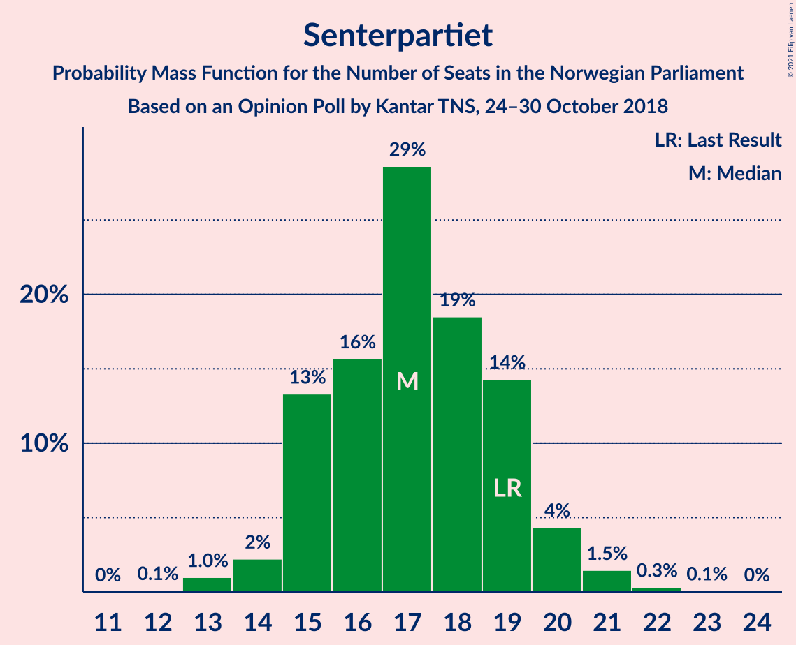
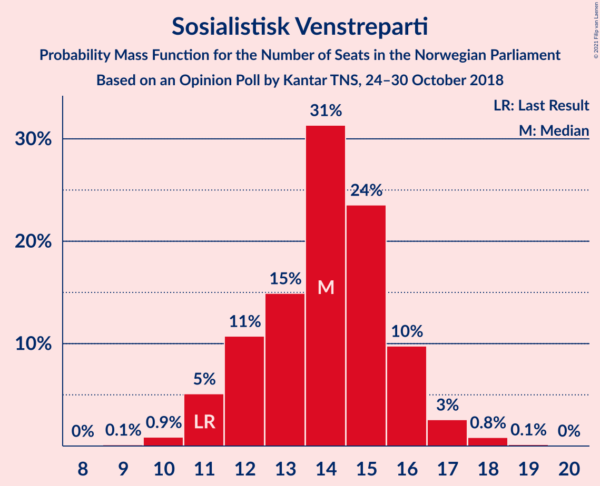
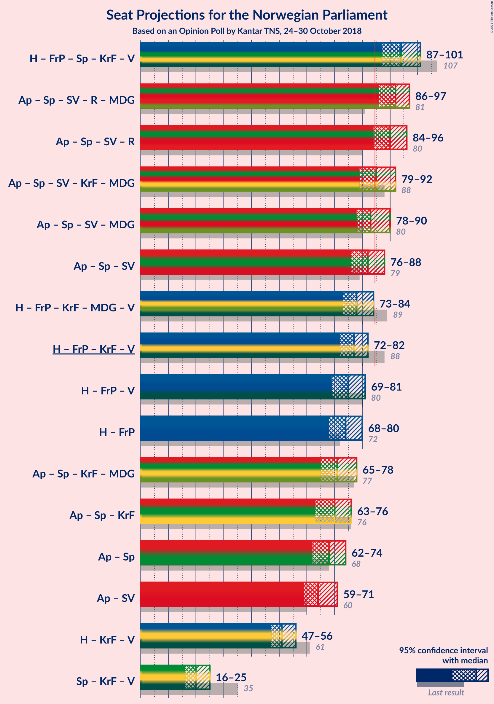
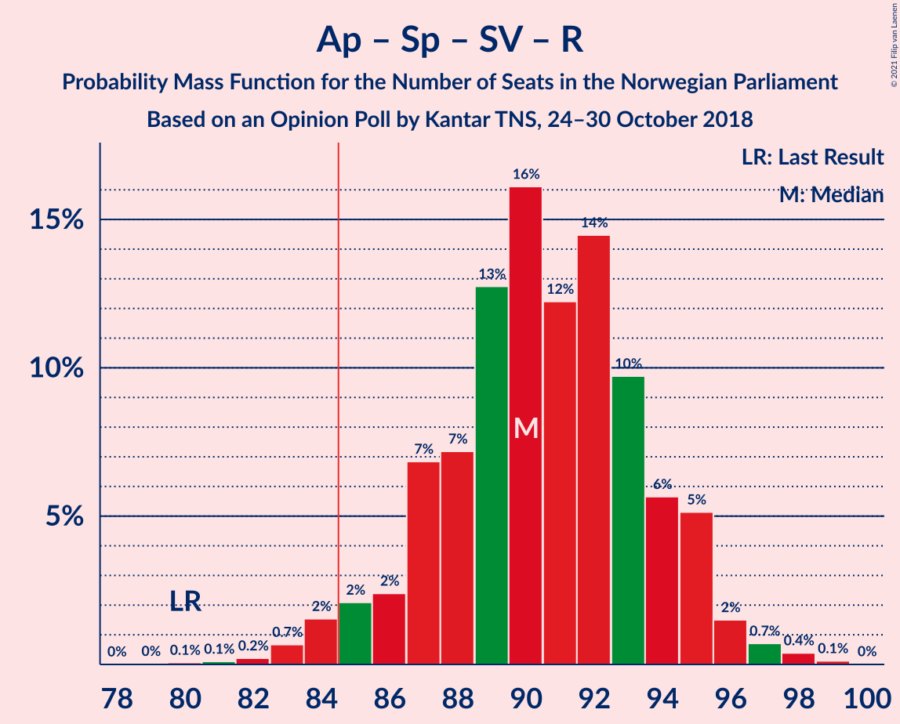
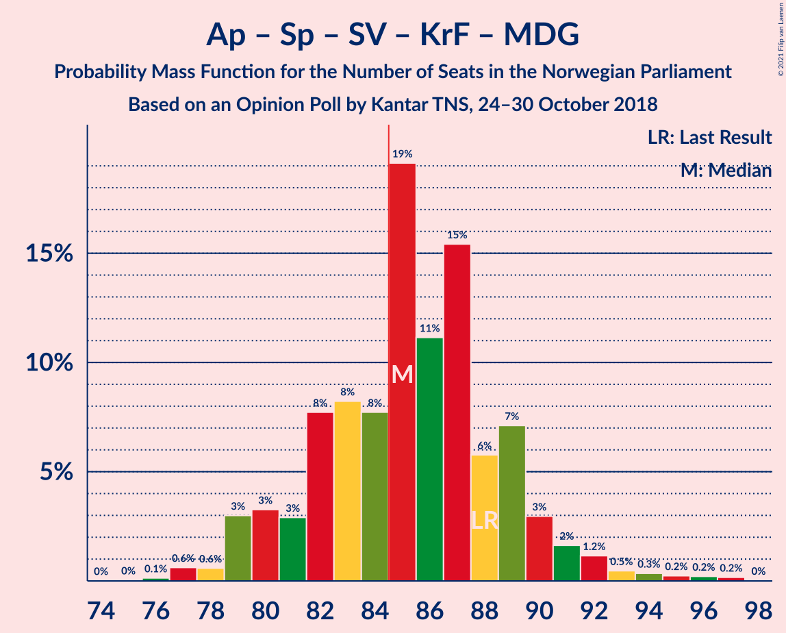
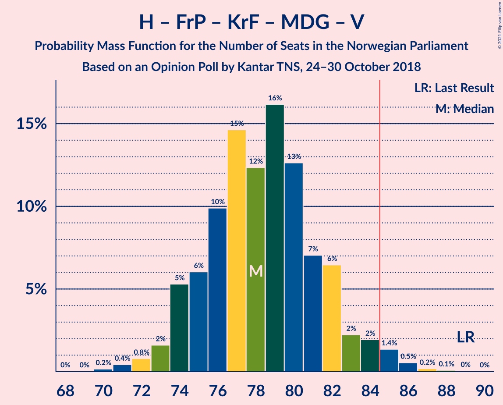
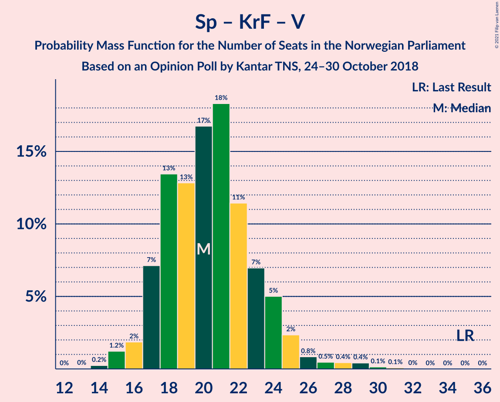

# Opinion Poll by Kantar TNS, 24–30 October 2018

<a href="#voting-intentions">Voting Intentions</a> | <a href="#seats">Seats</a> | <a href="#coalitions">Coalitions</a> | <a href="#technical-information">Technical Information</a>

## Voting Intentions

### Confidence Intervals

| Party | Last Result | Poll Result | 80% Confidence Interval | 90% Confidence Interval | 95% Confidence Interval | 99% Confidence Interval |
|:-----:|:-----------:|:-----------:|:-----------------------:|:-----------------------:|:-----------------------:|:-----------------------:|
| Arbeiderpartiet | 27.4% | 27.7% | 25.7–29.8% |25.1–30.4% |24.7–30.9% |23.7–32.0% |
| Høyre | 25.0% | 26.8% | 24.8–28.9% |24.3–29.5% |23.8–30.0% |22.9–31.0% |
| Fremskrittspartiet | 15.2% | 13.8% | 12.3–15.5% |11.9–16.0% |11.5–16.4% |10.9–17.2% |
| Senterpartiet | 10.3% | 9.1% | 7.9–10.5% |7.5–10.9% |7.2–11.3% |6.7–12.0% |
| Sosialistisk Venstreparti | 6.0% | 7.3% | 6.2–8.6% |5.9–9.0% |5.7–9.3% |5.2–10.0% |
| Rødt | 2.4% | 4.8% | 4.0–6.0% |3.7–6.3% |3.6–6.6% |3.2–7.2% |
| Kristelig Folkeparti | 4.2% | 3.1% | 2.4–4.0% |2.2–4.3% |2.1–4.5% |1.8–5.0% |
| Miljøpartiet De Grønne | 3.2% | 2.8% | 2.2–3.7% |2.0–4.0% |1.9–4.2% |1.6–4.7% |
| Venstre | 4.4% | 2.3% | 1.7–3.2% |1.6–3.4% |1.5–3.6% |1.2–4.1% |

*Note:* The poll result column reflects the actual value used in the calculations. Published results may vary slightly, and in addition be rounded to fewer digits.

## Seats

### Confidence Intervals

| Party | Last Result | Median | 80% Confidence Interval | 90% Confidence Interval | 95% Confidence Interval | 99% Confidence Interval |
|:-----:|:-----------:|:------:|:-----------------------:|:-----------------------:|:-----------------------:|:-----------------------:|
| <a href="#arbeiderpartiet">Arbeiderpartiet</a> | 49 | 50 | 47–55 |46–56 |45–58 |43–59 |
| <a href="#høyre">Høyre</a> | 45 | 48 | 45–52 |44–53 |43–54 |42–55 |
| <a href="#fremskrittspartiet">Fremskrittspartiet</a> | 27 | 25 | 23–28 |22–29 |21–30 |20–32 |
| <a href="#senterpartiet">Senterpartiet</a> | 19 | 17 | 15–19 |15–20 |14–20 |13–21 |
| <a href="#sosialistisk-venstreparti">Sosialistisk Venstreparti</a> | 11 | 14 | 12–16 |11–16 |11–17 |10–18 |
| <a href="#rødt">Rødt</a> | 1 | 9 | 2–11 |2–12 |2–12 |2–13 |
| <a href="#kristelig-folkeparti">Kristelig Folkeparti</a> | 8 | 1 | 0–3 |0–3 |0–3 |0–8 |
| <a href="#miljøpartiet-de-grønne">Miljøpartiet De Grønne</a> | 1 | 1 | 1–2 |1–3 |0–7 |0–8 |
| <a href="#venstre">Venstre</a> | 8 | 1 | 0–2 |0–2 |0–2 |0–7 |

### Arbeiderpartiet

*For a full overview of the results for this party, see the [Arbeiderpartiet](party-arbeiderpartiet.html) page.*

| Number of Seats | Probability | Accumulated | Special Marks |
|:---------------:|:-----------:|:-----------:|:-------------:|
| 42 | 0.2% | 100% |  |
| 43 | 0.5% | 99.8% |  |
| 44 | 1.1% | 99.3% |  |
| 45 | 2% | 98% |  |
| 46 | 3% | 97% |  |
| 47 | 8% | 94% |  |
| 48 | 11% | 86% |  |
| 49 | 10% | 75% | Last Result |
| 50 | 18% | 65% | Median |
| 51 | 9% | 48% |  |
| 52 | 10% | 39% |  |
| 53 | 10% | 29% |  |
| 54 | 7% | 19% |  |
| 55 | 4% | 11% |  |
| 56 | 3% | 7% |  |
| 57 | 1.0% | 4% |  |
| 58 | 2% | 3% |  |
| 59 | 0.7% | 1.0% |  |
| 60 | 0.1% | 0.3% |  |
| 61 | 0.1% | 0.2% |  |
| 62 | 0% | 0% |  |

### Høyre

*For a full overview of the results for this party, see the [Høyre](party-høyre.html) page.*

| Number of Seats | Probability | Accumulated | Special Marks |
|:---------------:|:-----------:|:-----------:|:-------------:|
| 40 | 0.1% | 100% |  |
| 41 | 0.2% | 99.9% |  |
| 42 | 0.6% | 99.7% |  |
| 43 | 2% | 99.1% |  |
| 44 | 4% | 97% |  |
| 45 | 8% | 94% | Last Result |
| 46 | 14% | 86% |  |
| 47 | 14% | 72% |  |
| 48 | 15% | 58% | Median |
| 49 | 16% | 43% |  |
| 50 | 9% | 27% |  |
| 51 | 7% | 18% |  |
| 52 | 4% | 10% |  |
| 53 | 3% | 6% |  |
| 54 | 2% | 3% |  |
| 55 | 0.4% | 0.8% |  |
| 56 | 0.4% | 0.5% |  |
| 57 | 0% | 0.1% |  |
| 58 | 0.1% | 0.1% |  |
| 59 | 0% | 0% |  |

### Fremskrittspartiet

*For a full overview of the results for this party, see the [Fremskrittspartiet](party-fremskrittspartiet.html) page.*

| Number of Seats | Probability | Accumulated | Special Marks |
|:---------------:|:-----------:|:-----------:|:-------------:|
| 18 | 0.1% | 100% |  |
| 19 | 0.1% | 99.9% |  |
| 20 | 0.9% | 99.8% |  |
| 21 | 2% | 98.8% |  |
| 22 | 5% | 97% |  |
| 23 | 12% | 92% |  |
| 24 | 8% | 80% |  |
| 25 | 26% | 72% | Median |
| 26 | 16% | 46% |  |
| 27 | 13% | 30% | Last Result |
| 28 | 7% | 17% |  |
| 29 | 5% | 10% |  |
| 30 | 2% | 5% |  |
| 31 | 2% | 2% |  |
| 32 | 0.4% | 0.6% |  |
| 33 | 0.1% | 0.2% |  |
| 34 | 0.1% | 0.1% |  |
| 35 | 0% | 0% |  |

### Senterpartiet

*For a full overview of the results for this party, see the [Senterpartiet](party-senterpartiet.html) page.*

| Number of Seats | Probability | Accumulated | Special Marks |
|:---------------:|:-----------:|:-----------:|:-------------:|
| 12 | 0.1% | 100% |  |
| 13 | 1.0% | 99.9% |  |
| 14 | 2% | 98.9% |  |
| 15 | 13% | 97% |  |
| 16 | 16% | 83% |  |
| 17 | 29% | 68% | Median |
| 18 | 19% | 39% |  |
| 19 | 14% | 21% | Last Result |
| 20 | 4% | 6% |  |
| 21 | 1.5% | 2% |  |
| 22 | 0.3% | 0.4% |  |
| 23 | 0.1% | 0.1% |  |
| 24 | 0% | 0% |  |

### Sosialistisk Venstreparti

*For a full overview of the results for this party, see the [Sosialistisk Venstreparti](party-sosialistiskvenstreparti.html) page.*

| Number of Seats | Probability | Accumulated | Special Marks |
|:---------------:|:-----------:|:-----------:|:-------------:|
| 9 | 0.1% | 100% |  |
| 10 | 0.9% | 99.9% |  |
| 11 | 5% | 99.0% | Last Result |
| 12 | 11% | 94% |  |
| 13 | 15% | 83% |  |
| 14 | 31% | 68% | Median |
| 15 | 24% | 37% |  |
| 16 | 10% | 13% |  |
| 17 | 3% | 4% |  |
| 18 | 0.8% | 1.0% |  |
| 19 | 0.1% | 0.2% |  |
| 20 | 0% | 0% |  |

### Rødt

*For a full overview of the results for this party, see the [Rødt](party-rødt.html) page.*

| Number of Seats | Probability | Accumulated | Special Marks |
|:---------------:|:-----------:|:-----------:|:-------------:|
| 1 | 0.1% | 100% | Last Result |
| 2 | 10% | 99.9% |  |
| 3 | 0% | 89% |  |
| 4 | 0% | 89% |  |
| 5 | 0% | 89% |  |
| 6 | 0% | 89% |  |
| 7 | 3% | 89% |  |
| 8 | 21% | 86% |  |
| 9 | 24% | 65% | Median |
| 10 | 23% | 41% |  |
| 11 | 12% | 18% |  |
| 12 | 4% | 5% |  |
| 13 | 0.8% | 1.1% |  |
| 14 | 0.2% | 0.2% |  |
| 15 | 0% | 0% |  |

### Kristelig Folkeparti

*For a full overview of the results for this party, see the [Kristelig Folkeparti](party-kristeligfolkeparti.html) page.*

| Number of Seats | Probability | Accumulated | Special Marks |
|:---------------:|:-----------:|:-----------:|:-------------:|
| 0 | 12% | 100% |  |
| 1 | 39% | 88% | Median |
| 2 | 10% | 50% |  |
| 3 | 37% | 40% |  |
| 4 | 0% | 2% |  |
| 5 | 0% | 2% |  |
| 6 | 0% | 2% |  |
| 7 | 0.6% | 2% |  |
| 8 | 1.3% | 2% | Last Result |
| 9 | 0.2% | 0.2% |  |
| 10 | 0% | 0% |  |

### Miljøpartiet De Grønne

*For a full overview of the results for this party, see the [Miljøpartiet De Grønne](party-miljøpartietdegrønne.html) page.*

| Number of Seats | Probability | Accumulated | Special Marks |
|:---------------:|:-----------:|:-----------:|:-------------:|
| 0 | 5% | 100% |  |
| 1 | 60% | 95% | Last Result, Median |
| 2 | 29% | 36% |  |
| 3 | 2% | 6% |  |
| 4 | 0% | 4% |  |
| 5 | 0% | 4% |  |
| 6 | 0% | 4% |  |
| 7 | 2% | 4% |  |
| 8 | 2% | 2% |  |
| 9 | 0.3% | 0.4% |  |
| 10 | 0% | 0.1% |  |
| 11 | 0% | 0% |  |

### Venstre

*For a full overview of the results for this party, see the [Venstre](party-venstre.html) page.*

| Number of Seats | Probability | Accumulated | Special Marks |
|:---------------:|:-----------:|:-----------:|:-------------:|
| 0 | 17% | 100% |  |
| 1 | 36% | 83% | Median |
| 2 | 46% | 47% |  |
| 3 | 0.1% | 0.7% |  |
| 4 | 0% | 0.5% |  |
| 5 | 0% | 0.5% |  |
| 6 | 0% | 0.5% |  |
| 7 | 0.2% | 0.5% |  |
| 8 | 0.3% | 0.3% | Last Result |
| 9 | 0% | 0% |  |

## Coalitions

### Confidence Intervals

| Coalition | Last Result | Median | Majority? | 80% Confidence Interval | 90% Confidence Interval | 95% Confidence Interval | 99% Confidence Interval |
|:---------:|:-----------:|:------:|:---------:|:-----------------------:|:-----------------------:|:-----------------------:|:-----------------------:|
| Høyre – Fremskrittspartiet – Senterpartiet – Kristelig Folkeparti – Venstre | 107 | 94 | 99.6% | 90–98 | 89–100 | 87–101 | 85–103 |
| Arbeiderpartiet – Senterpartiet – Sosialistisk Venstreparti – Rødt – Miljøpartiet De Grønne | 81 | 92 | 99.4% | 88–96 | 88–97 | 86–97 | 84–99 |
| Arbeiderpartiet – Senterpartiet – Sosialistisk Venstreparti – Rødt | 80 | 90 | 97% | 87–94 | 86–95 | 84–96 | 83–98 |
| Arbeiderpartiet – Senterpartiet – Sosialistisk Venstreparti – Kristelig Folkeparti – Miljøpartiet De Grønne | 88 | 85 | 66% | 81–89 | 80–90 | 79–92 | 77–95 |
| Arbeiderpartiet – Senterpartiet – Sosialistisk Venstreparti – Miljøpartiet De Grønne | 80 | 83 | 32% | 80–87 | 79–88 | 78–90 | 76–92 |
| Arbeiderpartiet – Senterpartiet – Sosialistisk Venstreparti | 79 | 82 | 20% | 78–86 | 77–87 | 76–88 | 75–90 |
| Høyre – Fremskrittspartiet – Kristelig Folkeparti – Miljøpartiet De Grønne – Venstre | 89 | 78 | 2% | 75–82 | 74–83 | 73–84 | 71–86 |
| Høyre – Fremskrittspartiet – Kristelig Folkeparti – Venstre | 88 | 77 | 0.5% | 73–80 | 72–81 | 72–82 | 70–84 |
| Høyre – Fremskrittspartiet – Venstre | 80 | 75 | 0.1% | 71–79 | 70–80 | 69–81 | 67–83 |
| Høyre – Fremskrittspartiet | 72 | 74 | 0% | 70–78 | 69–79 | 68–80 | 66–82 |
| Arbeiderpartiet – Senterpartiet – Kristelig Folkeparti – Miljøpartiet De Grønne | 77 | 71 | 0% | 67–75 | 66–77 | 65–78 | 63–81 |
| Arbeiderpartiet – Senterpartiet – Kristelig Folkeparti | 76 | 70 | 0% | 66–74 | 64–75 | 63–76 | 62–79 |
| Arbeiderpartiet – Senterpartiet | 68 | 68 | 0% | 64–72 | 63–73 | 62–74 | 60–77 |
| Arbeiderpartiet – Sosialistisk Venstreparti | 60 | 64 | 0% | 61–69 | 60–70 | 59–71 | 57–74 |
| Høyre – Kristelig Folkeparti – Venstre | 61 | 51 | 0% | 48–54 | 48–55 | 47–56 | 45–58 |
| Senterpartiet – Kristelig Folkeparti – Venstre | 35 | 20 | 0% | 17–23 | 17–24 | 16–25 | 15–29 |

### Høyre – Fremskrittspartiet – Senterpartiet – Kristelig Folkeparti – Venstre

| Number of Seats | Probability | Accumulated | Special Marks |
|:---------------:|:-----------:|:-----------:|:-------------:|
| 82 | 0.1% | 100% |  |
| 83 | 0.1% | 99.9% |  |
| 84 | 0.2% | 99.8% |  |
| 85 | 0.3% | 99.6% | Majority |
| 86 | 0.8% | 99.3% |  |
| 87 | 2% | 98% |  |
| 88 | 1.4% | 97% |  |
| 89 | 3% | 95% |  |
| 90 | 6% | 92% |  |
| 91 | 9% | 86% |  |
| 92 | 10% | 77% | Median |
| 93 | 11% | 67% |  |
| 94 | 17% | 56% |  |
| 95 | 5% | 38% |  |
| 96 | 10% | 33% |  |
| 97 | 6% | 23% |  |
| 98 | 9% | 17% |  |
| 99 | 2% | 7% |  |
| 100 | 3% | 5% |  |
| 101 | 1.2% | 3% |  |
| 102 | 0.9% | 2% |  |
| 103 | 0.3% | 0.8% |  |
| 104 | 0.2% | 0.4% |  |
| 105 | 0.1% | 0.2% |  |
| 106 | 0% | 0.1% |  |
| 107 | 0% | 0% | Last Result |

### Arbeiderpartiet – Senterpartiet – Sosialistisk Venstreparti – Rødt – Miljøpartiet De Grønne

| Number of Seats | Probability | Accumulated | Special Marks |
|:---------------:|:-----------:|:-----------:|:-------------:|
| 81 | 0% | 100% | Last Result |
| 82 | 0.1% | 100% |  |
| 83 | 0.1% | 99.9% |  |
| 84 | 0.4% | 99.8% |  |
| 85 | 0.8% | 99.4% | Majority |
| 86 | 1.3% | 98.6% |  |
| 87 | 2% | 97% |  |
| 88 | 5% | 95% |  |
| 89 | 7% | 90% |  |
| 90 | 13% | 83% |  |
| 91 | 10% | 70% | Median |
| 92 | 17% | 60% |  |
| 93 | 13% | 44% |  |
| 94 | 12% | 31% |  |
| 95 | 8% | 19% |  |
| 96 | 5% | 11% |  |
| 97 | 3% | 5% |  |
| 98 | 1.3% | 2% |  |
| 99 | 0.6% | 0.9% |  |
| 100 | 0.2% | 0.4% |  |
| 101 | 0.1% | 0.1% |  |
| 102 | 0% | 0% |  |

### Arbeiderpartiet – Senterpartiet – Sosialistisk Venstreparti – Rødt

| Number of Seats | Probability | Accumulated | Special Marks |
|:---------------:|:-----------:|:-----------:|:-------------:|
| 79 | 0% | 100% |  |
| 80 | 0.1% | 99.9% | Last Result |
| 81 | 0.1% | 99.9% |  |
| 82 | 0.2% | 99.8% |  |
| 83 | 0.7% | 99.6% |  |
| 84 | 2% | 98.9% |  |
| 85 | 2% | 97% | Majority |
| 86 | 2% | 95% |  |
| 87 | 7% | 93% |  |
| 88 | 7% | 86% |  |
| 89 | 13% | 79% |  |
| 90 | 16% | 66% | Median |
| 91 | 12% | 50% |  |
| 92 | 14% | 38% |  |
| 93 | 10% | 23% |  |
| 94 | 6% | 14% |  |
| 95 | 5% | 8% |  |
| 96 | 2% | 3% |  |
| 97 | 0.7% | 1.2% |  |
| 98 | 0.4% | 0.5% |  |
| 99 | 0.1% | 0.1% |  |
| 100 | 0% | 0% |  |

### Arbeiderpartiet – Senterpartiet – Sosialistisk Venstreparti – Kristelig Folkeparti – Miljøpartiet De Grønne

| Number of Seats | Probability | Accumulated | Special Marks |
|:---------------:|:-----------:|:-----------:|:-------------:|
| 75 | 0% | 100% |  |
| 76 | 0.1% | 99.9% |  |
| 77 | 0.6% | 99.8% |  |
| 78 | 0.6% | 99.2% |  |
| 79 | 3% | 98.6% |  |
| 80 | 3% | 96% |  |
| 81 | 3% | 92% |  |
| 82 | 8% | 89% |  |
| 83 | 8% | 82% | Median |
| 84 | 8% | 73% |  |
| 85 | 19% | 66% | Majority |
| 86 | 11% | 47% |  |
| 87 | 15% | 35% |  |
| 88 | 6% | 20% | Last Result |
| 89 | 7% | 14% |  |
| 90 | 3% | 7% |  |
| 91 | 2% | 4% |  |
| 92 | 1.2% | 3% |  |
| 93 | 0.5% | 1.5% |  |
| 94 | 0.3% | 1.0% |  |
| 95 | 0.2% | 0.6% |  |
| 96 | 0.2% | 0.4% |  |
| 97 | 0.2% | 0.2% |  |
| 98 | 0% | 0% |  |

### Arbeiderpartiet – Senterpartiet – Sosialistisk Venstreparti – Miljøpartiet De Grønne

| Number of Seats | Probability | Accumulated | Special Marks |
|:---------------:|:-----------:|:-----------:|:-------------:|
| 74 | 0% | 100% |  |
| 75 | 0.1% | 99.9% |  |
| 76 | 0.4% | 99.8% |  |
| 77 | 1.2% | 99.5% |  |
| 78 | 3% | 98% |  |
| 79 | 4% | 95% |  |
| 80 | 4% | 91% | Last Result |
| 81 | 11% | 87% |  |
| 82 | 17% | 76% | Median |
| 83 | 9% | 59% |  |
| 84 | 18% | 50% |  |
| 85 | 9% | 32% | Majority |
| 86 | 8% | 23% |  |
| 87 | 6% | 15% |  |
| 88 | 5% | 9% |  |
| 89 | 2% | 4% |  |
| 90 | 1.4% | 3% |  |
| 91 | 0.7% | 1.2% |  |
| 92 | 0.2% | 0.6% |  |
| 93 | 0.1% | 0.3% |  |
| 94 | 0.1% | 0.2% |  |
| 95 | 0.1% | 0.1% |  |
| 96 | 0% | 0% |  |

### Arbeiderpartiet – Senterpartiet – Sosialistisk Venstreparti

| Number of Seats | Probability | Accumulated | Special Marks |
|:---------------:|:-----------:|:-----------:|:-------------:|
| 72 | 0% | 100% |  |
| 73 | 0.1% | 99.9% |  |
| 74 | 0.3% | 99.9% |  |
| 75 | 0.7% | 99.6% |  |
| 76 | 2% | 98.9% |  |
| 77 | 4% | 97% |  |
| 78 | 5% | 93% |  |
| 79 | 4% | 88% | Last Result |
| 80 | 16% | 84% |  |
| 81 | 14% | 68% | Median |
| 82 | 17% | 55% |  |
| 83 | 12% | 38% |  |
| 84 | 6% | 25% |  |
| 85 | 9% | 20% | Majority |
| 86 | 4% | 10% |  |
| 87 | 3% | 6% |  |
| 88 | 1.0% | 3% |  |
| 89 | 1.0% | 2% |  |
| 90 | 0.5% | 0.7% |  |
| 91 | 0.1% | 0.2% |  |
| 92 | 0% | 0.1% |  |
| 93 | 0% | 0% |  |

### Høyre – Fremskrittspartiet – Kristelig Folkeparti – Miljøpartiet De Grønne – Venstre

| Number of Seats | Probability | Accumulated | Special Marks |
|:---------------:|:-----------:|:-----------:|:-------------:|
| 69 | 0% | 100% |  |
| 70 | 0.2% | 99.9% |  |
| 71 | 0.4% | 99.8% |  |
| 72 | 0.8% | 99.4% |  |
| 73 | 2% | 98.6% |  |
| 74 | 5% | 97% |  |
| 75 | 6% | 92% |  |
| 76 | 10% | 86% | Median |
| 77 | 15% | 76% |  |
| 78 | 12% | 61% |  |
| 79 | 16% | 49% |  |
| 80 | 13% | 33% |  |
| 81 | 7% | 20% |  |
| 82 | 6% | 13% |  |
| 83 | 2% | 6% |  |
| 84 | 2% | 4% |  |
| 85 | 1.4% | 2% | Majority |
| 86 | 0.5% | 0.9% |  |
| 87 | 0.2% | 0.4% |  |
| 88 | 0.1% | 0.2% |  |
| 89 | 0% | 0.1% | Last Result |
| 90 | 0% | 0% |  |

### Høyre – Fremskrittspartiet – Kristelig Folkeparti – Venstre

| Number of Seats | Probability | Accumulated | Special Marks |
|:---------------:|:-----------:|:-----------:|:-------------:|
| 67 | 0% | 100% |  |
| 68 | 0.1% | 99.9% |  |
| 69 | 0.3% | 99.8% |  |
| 70 | 0.6% | 99.5% |  |
| 71 | 1.4% | 98.9% |  |
| 72 | 3% | 98% |  |
| 73 | 6% | 94% |  |
| 74 | 8% | 89% |  |
| 75 | 13% | 81% | Median |
| 76 | 13% | 68% |  |
| 77 | 17% | 55% |  |
| 78 | 10% | 38% |  |
| 79 | 13% | 29% |  |
| 80 | 6% | 16% |  |
| 81 | 5% | 10% |  |
| 82 | 2% | 4% |  |
| 83 | 1.2% | 2% |  |
| 84 | 0.6% | 1.1% |  |
| 85 | 0.3% | 0.5% | Majority |
| 86 | 0.1% | 0.2% |  |
| 87 | 0% | 0.1% |  |
| 88 | 0% | 0% | Last Result |

### Høyre – Fremskrittspartiet – Venstre

| Number of Seats | Probability | Accumulated | Special Marks |
|:---------------:|:-----------:|:-----------:|:-------------:|
| 64 | 0.1% | 100% |  |
| 65 | 0.1% | 99.9% |  |
| 66 | 0.2% | 99.8% |  |
| 67 | 0.3% | 99.6% |  |
| 68 | 0.6% | 99.3% |  |
| 69 | 2% | 98.7% |  |
| 70 | 3% | 97% |  |
| 71 | 8% | 94% |  |
| 72 | 7% | 86% |  |
| 73 | 12% | 79% |  |
| 74 | 13% | 67% | Median |
| 75 | 11% | 54% |  |
| 76 | 15% | 43% |  |
| 77 | 7% | 28% |  |
| 78 | 8% | 21% |  |
| 79 | 5% | 13% |  |
| 80 | 4% | 8% | Last Result |
| 81 | 2% | 4% |  |
| 82 | 1.2% | 2% |  |
| 83 | 0.5% | 1.0% |  |
| 84 | 0.3% | 0.4% |  |
| 85 | 0.1% | 0.1% | Majority |
| 86 | 0% | 0% |  |

### Høyre – Fremskrittspartiet

| Number of Seats | Probability | Accumulated | Special Marks |
|:---------------:|:-----------:|:-----------:|:-------------:|
| 63 | 0.1% | 100% |  |
| 64 | 0.1% | 99.9% |  |
| 65 | 0.2% | 99.8% |  |
| 66 | 0.4% | 99.5% |  |
| 67 | 0.9% | 99.2% |  |
| 68 | 2% | 98% |  |
| 69 | 5% | 96% |  |
| 70 | 6% | 91% |  |
| 71 | 7% | 85% |  |
| 72 | 14% | 78% | Last Result |
| 73 | 13% | 64% | Median |
| 74 | 14% | 51% |  |
| 75 | 12% | 37% |  |
| 76 | 7% | 25% |  |
| 77 | 7% | 18% |  |
| 78 | 5% | 11% |  |
| 79 | 3% | 6% |  |
| 80 | 1.3% | 3% |  |
| 81 | 0.9% | 2% |  |
| 82 | 0.5% | 0.7% |  |
| 83 | 0.2% | 0.2% |  |
| 84 | 0% | 0.1% |  |
| 85 | 0% | 0% | Majority |

### Arbeiderpartiet – Senterpartiet – Kristelig Folkeparti – Miljøpartiet De Grønne

| Number of Seats | Probability | Accumulated | Special Marks |
|:---------------:|:-----------:|:-----------:|:-------------:|
| 61 | 0.1% | 100% |  |
| 62 | 0.2% | 99.9% |  |
| 63 | 0.6% | 99.7% |  |
| 64 | 1.4% | 99.0% |  |
| 65 | 2% | 98% |  |
| 66 | 3% | 95% |  |
| 67 | 4% | 93% |  |
| 68 | 6% | 89% |  |
| 69 | 9% | 82% | Median |
| 70 | 13% | 73% |  |
| 71 | 14% | 60% |  |
| 72 | 12% | 46% |  |
| 73 | 10% | 34% |  |
| 74 | 10% | 24% |  |
| 75 | 4% | 14% |  |
| 76 | 3% | 10% |  |
| 77 | 3% | 7% | Last Result |
| 78 | 1.2% | 4% |  |
| 79 | 0.9% | 2% |  |
| 80 | 0.6% | 1.4% |  |
| 81 | 0.3% | 0.7% |  |
| 82 | 0.1% | 0.4% |  |
| 83 | 0.2% | 0.3% |  |
| 84 | 0.1% | 0.1% |  |
| 85 | 0% | 0% | Majority |

### Arbeiderpartiet – Senterpartiet – Kristelig Folkeparti

| Number of Seats | Probability | Accumulated | Special Marks |
|:---------------:|:-----------:|:-----------:|:-------------:|
| 59 | 0.1% | 100% |  |
| 60 | 0.1% | 99.9% |  |
| 61 | 0.3% | 99.8% |  |
| 62 | 0.9% | 99.6% |  |
| 63 | 1.4% | 98.6% |  |
| 64 | 3% | 97% |  |
| 65 | 4% | 95% |  |
| 66 | 4% | 91% |  |
| 67 | 8% | 86% |  |
| 68 | 14% | 78% | Median |
| 69 | 11% | 65% |  |
| 70 | 16% | 54% |  |
| 71 | 11% | 38% |  |
| 72 | 7% | 27% |  |
| 73 | 9% | 20% |  |
| 74 | 4% | 11% |  |
| 75 | 3% | 7% |  |
| 76 | 2% | 4% | Last Result |
| 77 | 0.9% | 2% |  |
| 78 | 0.7% | 1.4% |  |
| 79 | 0.3% | 0.6% |  |
| 80 | 0.2% | 0.3% |  |
| 81 | 0.1% | 0.1% |  |
| 82 | 0% | 0.1% |  |
| 83 | 0% | 0% |  |

### Arbeiderpartiet – Senterpartiet

| Number of Seats | Probability | Accumulated | Special Marks |
|:---------------:|:-----------:|:-----------:|:-------------:|
| 58 | 0.1% | 100% |  |
| 59 | 0.2% | 99.9% |  |
| 60 | 0.4% | 99.7% |  |
| 61 | 0.9% | 99.3% |  |
| 62 | 2% | 98% |  |
| 63 | 4% | 97% |  |
| 64 | 5% | 92% |  |
| 65 | 9% | 87% |  |
| 66 | 10% | 78% |  |
| 67 | 16% | 68% | Median |
| 68 | 13% | 52% | Last Result |
| 69 | 9% | 39% |  |
| 70 | 11% | 30% |  |
| 71 | 4% | 18% |  |
| 72 | 6% | 14% |  |
| 73 | 4% | 8% |  |
| 74 | 2% | 4% |  |
| 75 | 1.0% | 2% |  |
| 76 | 0.7% | 1.2% |  |
| 77 | 0.4% | 0.5% |  |
| 78 | 0.1% | 0.2% |  |
| 79 | 0.1% | 0.1% |  |
| 80 | 0% | 0% |  |

### Arbeiderpartiet – Sosialistisk Venstreparti

| Number of Seats | Probability | Accumulated | Special Marks |
|:---------------:|:-----------:|:-----------:|:-------------:|
| 55 | 0.1% | 100% |  |
| 56 | 0.3% | 99.8% |  |
| 57 | 0.4% | 99.5% |  |
| 58 | 1.3% | 99.1% |  |
| 59 | 2% | 98% |  |
| 60 | 5% | 96% | Last Result |
| 61 | 6% | 91% |  |
| 62 | 6% | 85% |  |
| 63 | 15% | 79% |  |
| 64 | 15% | 64% | Median |
| 65 | 12% | 49% |  |
| 66 | 7% | 37% |  |
| 67 | 9% | 30% |  |
| 68 | 10% | 21% |  |
| 69 | 6% | 11% |  |
| 70 | 2% | 5% |  |
| 71 | 1.3% | 3% |  |
| 72 | 0.7% | 2% |  |
| 73 | 0.5% | 1.4% |  |
| 74 | 0.8% | 0.9% |  |
| 75 | 0% | 0.1% |  |
| 76 | 0% | 0.1% |  |
| 77 | 0% | 0% |  |

### Høyre – Kristelig Folkeparti – Venstre

| Number of Seats | Probability | Accumulated | Special Marks |
|:---------------:|:-----------:|:-----------:|:-------------:|
| 44 | 0.1% | 100% |  |
| 45 | 0.6% | 99.9% |  |
| 46 | 2% | 99.2% |  |
| 47 | 2% | 98% |  |
| 48 | 6% | 95% |  |
| 49 | 13% | 89% |  |
| 50 | 12% | 76% | Median |
| 51 | 16% | 64% |  |
| 52 | 17% | 49% |  |
| 53 | 14% | 31% |  |
| 54 | 8% | 17% |  |
| 55 | 4% | 8% |  |
| 56 | 3% | 5% |  |
| 57 | 0.8% | 2% |  |
| 58 | 0.5% | 0.8% |  |
| 59 | 0.3% | 0.4% |  |
| 60 | 0.1% | 0.1% |  |
| 61 | 0% | 0.1% | Last Result |
| 62 | 0% | 0% |  |

### Senterpartiet – Kristelig Folkeparti – Venstre

| Number of Seats | Probability | Accumulated | Special Marks |
|:---------------:|:-----------:|:-----------:|:-------------:|
| 14 | 0.2% | 100% |  |
| 15 | 1.2% | 99.7% |  |
| 16 | 2% | 98% |  |
| 17 | 7% | 97% |  |
| 18 | 13% | 90% |  |
| 19 | 13% | 76% | Median |
| 20 | 17% | 63% |  |
| 21 | 18% | 46% |  |
| 22 | 11% | 28% |  |
| 23 | 7% | 17% |  |
| 24 | 5% | 10% |  |
| 25 | 2% | 5% |  |
| 26 | 0.8% | 2% |  |
| 27 | 0.5% | 2% |  |
| 28 | 0.4% | 1.1% |  |
| 29 | 0.4% | 0.7% |  |
| 30 | 0.1% | 0.3% |  |
| 31 | 0.1% | 0.1% |  |
| 32 | 0% | 0% |  |
| 33 | 0% | 0% |  |
| 34 | 0% | 0% |  |
| 35 | 0% | 0% | Last Result |

## Technical Information

### Opinion Poll

+ **Polling firm:** Kantar TNS
+ **Commissioner(s):** —
+ **Fieldwork period:** 24–30 October 2018

### Calculations

+ **Sample size:** 784
+ **Simulations done:** 1,048,576
+ **Error estimate:** 1.04%

