# Opinion Poll by Norfakta, 5 November 2018

<a href="#voting-intentions">Voting Intentions</a> | <a href="#seats">Seats</a> | <a href="#coalitions">Coalitions</a> | <a href="#technical-information">Technical Information</a>

## Voting Intentions

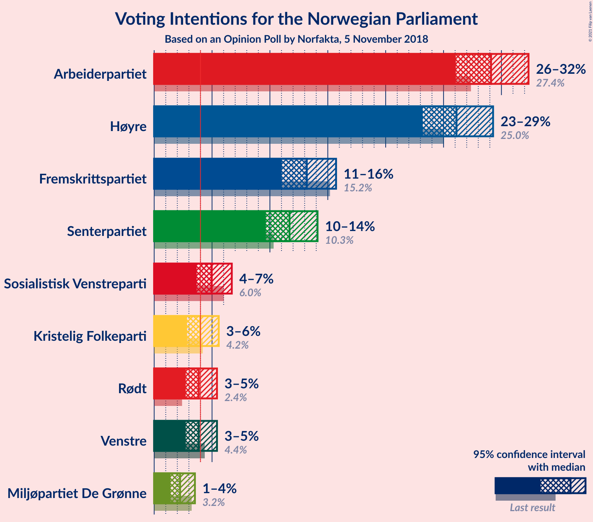

### Confidence Intervals

| Party | Last Result | Poll Result | 80% Confidence Interval | 90% Confidence Interval | 95% Confidence Interval | 99% Confidence Interval |
|:-----:|:-----------:|:-----------:|:-----------------------:|:-----------------------:|:-----------------------:|:-----------------------:|
| Arbeiderpartiet | 27.4% | 29.1% | 27.1–31.2% |26.6–31.8% |26.1–32.3% |25.1–33.4% |
| Høyre | 25.0% | 26.1% | 24.2–28.2% |23.7–28.8% |23.2–29.3% |22.3–30.3% |
| Fremskrittspartiet | 15.2% | 13.2% | 11.8–14.8% |11.4–15.3% |11.0–15.7% |10.4–16.5% |
| Senterpartiet | 10.3% | 11.7% | 10.3–13.3% |10.0–13.7% |9.6–14.1% |9.0–14.9% |
| Sosialistisk Venstreparti | 6.0% | 5.0% | 4.1–6.1% |3.9–6.4% |3.7–6.7% |3.3–7.3% |
| Kristelig Folkeparti | 4.2% | 4.0% | 3.2–5.0% |3.0–5.3% |2.8–5.6% |2.5–6.1% |
| Rødt | 2.4% | 3.9% | 3.1–4.9% |2.9–5.2% |2.7–5.4% |2.4–6.0% |
| Venstre | 4.4% | 3.9% | 3.1–4.9% |2.9–5.2% |2.7–5.4% |2.4–6.0% |
| Miljøpartiet De Grønne | 3.2% | 2.2% | 1.7–3.1% |1.5–3.3% |1.4–3.5% |1.2–4.0% |

*Note:* The poll result column reflects the actual value used in the calculations. Published results may vary slightly, and in addition be rounded to fewer digits.

## Seats

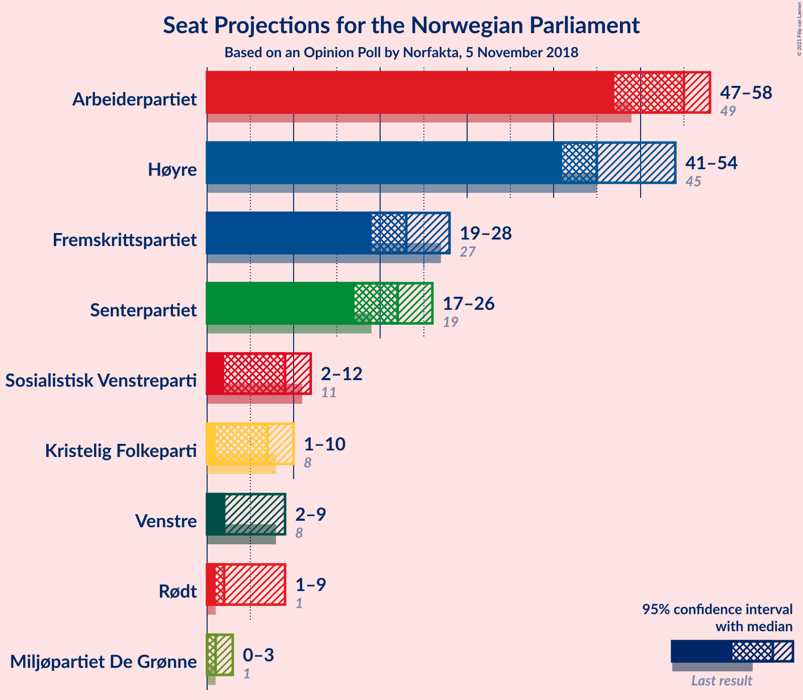

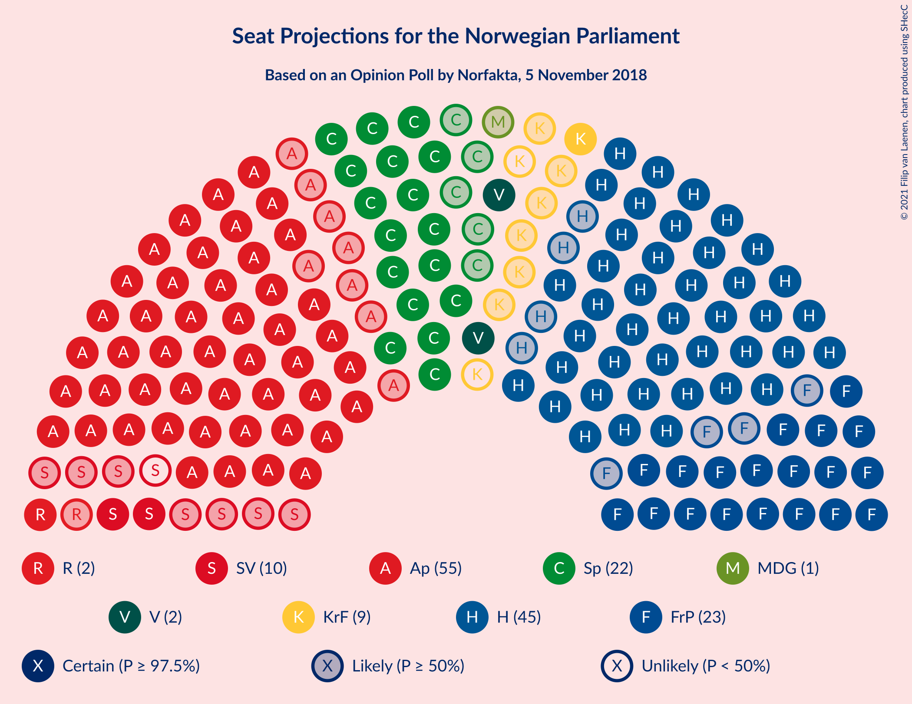

### Confidence Intervals

| Party | Last Result | Median | 80% Confidence Interval | 90% Confidence Interval | 95% Confidence Interval | 99% Confidence Interval |
|:-----:|:-----------:|:------:|:-----------------------:|:-----------------------:|:-----------------------:|:-----------------------:|
| <a href="#arbeiderpartiet">Arbeiderpartiet</a> | 49 | 55 | 50–58 |48–58 |47–58 |44–61 |
| <a href="#høyre">Høyre</a> | 45 | 45 | 41–50 |41–53 |41–54 |39–55 |
| <a href="#fremskrittspartiet">Fremskrittspartiet</a> | 27 | 23 | 20–26 |20–27 |19–28 |18–30 |
| <a href="#senterpartiet">Senterpartiet</a> | 19 | 22 | 19–26 |18–26 |17–26 |16–27 |
| <a href="#sosialistisk-venstreparti">Sosialistisk Venstreparti</a> | 11 | 9 | 7–11 |2–12 |2–12 |2–13 |
| <a href="#kristelig-folkeparti">Kristelig Folkeparti</a> | 8 | 7 | 2–9 |2–10 |1–10 |1–11 |
| <a href="#rødt">Rødt</a> | 1 | 2 | 1–8 |1–8 |1–9 |1–10 |
| <a href="#venstre">Venstre</a> | 8 | 2 | 2–9 |2–9 |2–9 |1–10 |
| <a href="#miljøpartiet-de-grønne">Miljøpartiet De Grønne</a> | 1 | 1 | 1–2 |0–2 |0–3 |0–3 |

### Arbeiderpartiet

*For a full overview of the results for this party, see the [Arbeiderpartiet](party-arbeiderpartiet.html) page.*

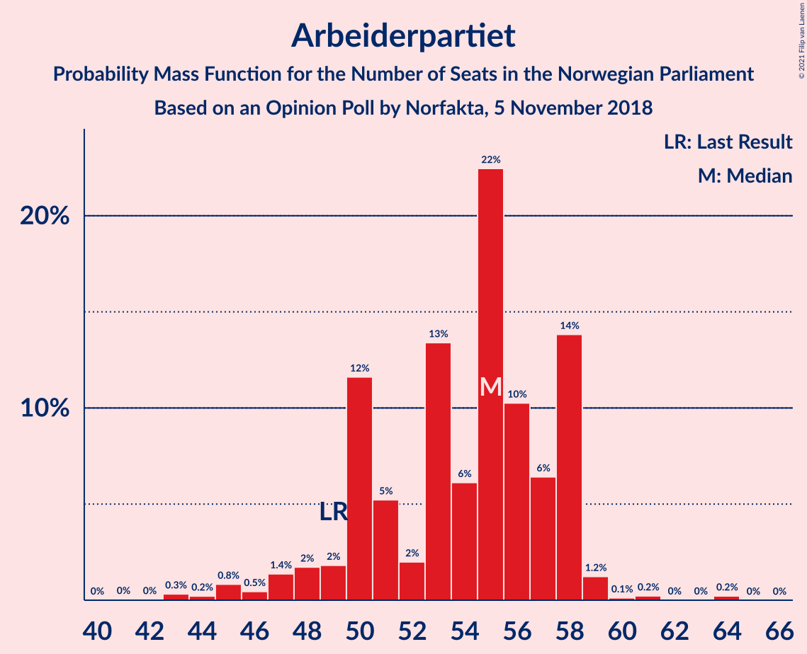

| Number of Seats | Probability | Accumulated | Special Marks |
|:---------------:|:-----------:|:-----------:|:-------------:|
| 41 | 0% | 100% |  |
| 42 | 0% | 99.9% |  |
| 43 | 0.3% | 99.9% |  |
| 44 | 0.2% | 99.6% |  |
| 45 | 0.8% | 99.4% |  |
| 46 | 0.5% | 98.5% |  |
| 47 | 1.4% | 98% |  |
| 48 | 2% | 97% |  |
| 49 | 2% | 95% | Last Result |
| 50 | 12% | 93% |  |
| 51 | 5% | 82% |  |
| 52 | 2% | 76% |  |
| 53 | 13% | 74% |  |
| 54 | 6% | 61% |  |
| 55 | 22% | 55% | Median |
| 56 | 10% | 32% |  |
| 57 | 6% | 22% |  |
| 58 | 14% | 16% |  |
| 59 | 1.2% | 2% |  |
| 60 | 0.1% | 0.6% |  |
| 61 | 0.2% | 0.5% |  |
| 62 | 0% | 0.3% |  |
| 63 | 0% | 0.3% |  |
| 64 | 0.2% | 0.3% |  |
| 65 | 0% | 0% |  |

### Høyre

*For a full overview of the results for this party, see the [Høyre](party-høyre.html) page.*

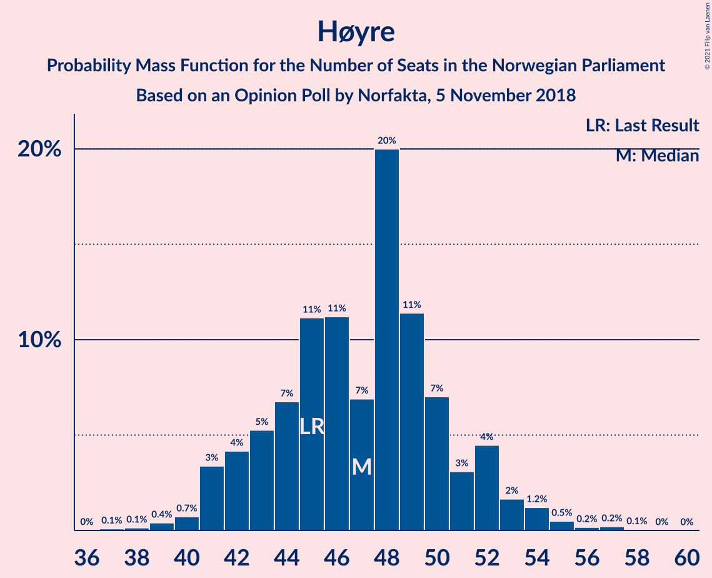

| Number of Seats | Probability | Accumulated | Special Marks |
|:---------------:|:-----------:|:-----------:|:-------------:|
| 37 | 0.1% | 100% |  |
| 38 | 0.1% | 99.9% |  |
| 39 | 0.9% | 99.8% |  |
| 40 | 0.8% | 98.9% |  |
| 41 | 11% | 98% |  |
| 42 | 6% | 87% |  |
| 43 | 12% | 81% |  |
| 44 | 13% | 69% |  |
| 45 | 17% | 57% | Last Result, Median |
| 46 | 6% | 40% |  |
| 47 | 10% | 34% |  |
| 48 | 8% | 25% |  |
| 49 | 2% | 17% |  |
| 50 | 7% | 15% |  |
| 51 | 1.1% | 8% |  |
| 52 | 2% | 7% |  |
| 53 | 2% | 6% |  |
| 54 | 3% | 4% |  |
| 55 | 1.1% | 1.5% |  |
| 56 | 0.2% | 0.4% |  |
| 57 | 0% | 0.2% |  |
| 58 | 0.2% | 0.2% |  |
| 59 | 0% | 0% |  |

### Fremskrittspartiet

*For a full overview of the results for this party, see the [Fremskrittspartiet](party-fremskrittspartiet.html) page.*

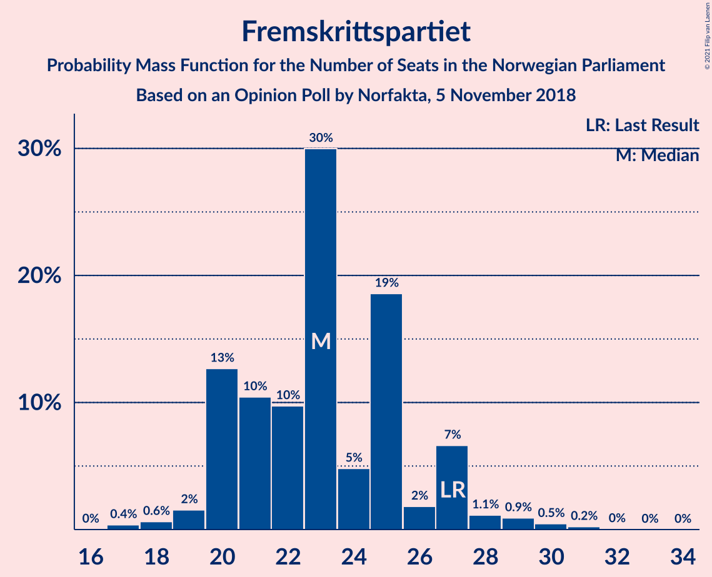

| Number of Seats | Probability | Accumulated | Special Marks |
|:---------------:|:-----------:|:-----------:|:-------------:|
| 17 | 0.4% | 100% |  |
| 18 | 0.6% | 99.6% |  |
| 19 | 2% | 99.0% |  |
| 20 | 13% | 97% |  |
| 21 | 10% | 85% |  |
| 22 | 10% | 74% |  |
| 23 | 30% | 65% | Median |
| 24 | 5% | 35% |  |
| 25 | 19% | 30% |  |
| 26 | 2% | 11% |  |
| 27 | 7% | 9% | Last Result |
| 28 | 1.1% | 3% |  |
| 29 | 0.9% | 2% |  |
| 30 | 0.5% | 0.7% |  |
| 31 | 0.2% | 0.3% |  |
| 32 | 0% | 0.1% |  |
| 33 | 0% | 0% |  |

### Senterpartiet

*For a full overview of the results for this party, see the [Senterpartiet](party-senterpartiet.html) page.*

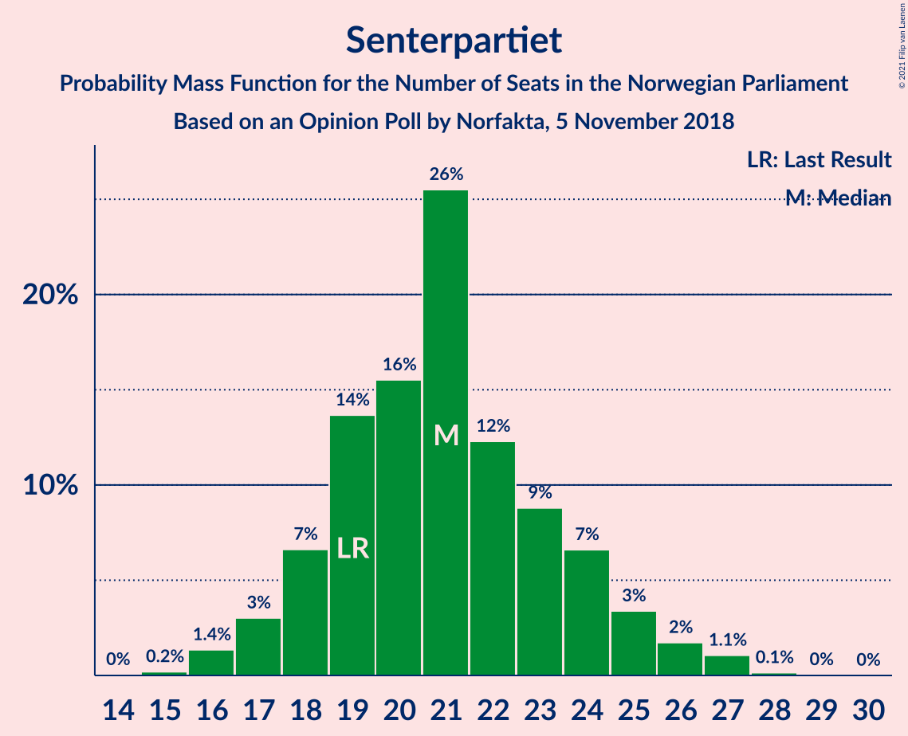

| Number of Seats | Probability | Accumulated | Special Marks |
|:---------------:|:-----------:|:-----------:|:-------------:|
| 15 | 0.1% | 100% |  |
| 16 | 0.7% | 99.9% |  |
| 17 | 2% | 99.2% |  |
| 18 | 3% | 97% |  |
| 19 | 10% | 94% | Last Result |
| 20 | 23% | 84% |  |
| 21 | 8% | 61% |  |
| 22 | 23% | 53% | Median |
| 23 | 9% | 31% |  |
| 24 | 5% | 21% |  |
| 25 | 6% | 17% |  |
| 26 | 10% | 11% |  |
| 27 | 0.6% | 1.1% |  |
| 28 | 0.4% | 0.5% |  |
| 29 | 0.1% | 0.1% |  |
| 30 | 0% | 0% |  |

### Sosialistisk Venstreparti

*For a full overview of the results for this party, see the [Sosialistisk Venstreparti](party-sosialistiskvenstreparti.html) page.*

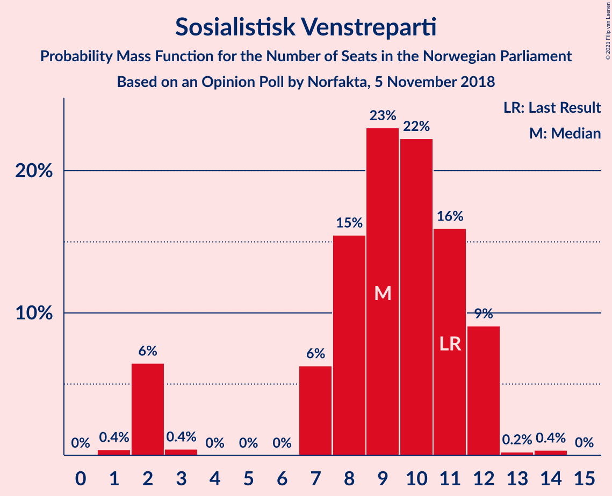

| Number of Seats | Probability | Accumulated | Special Marks |
|:---------------:|:-----------:|:-----------:|:-------------:|
| 1 | 0.4% | 100% |  |
| 2 | 6% | 99.6% |  |
| 3 | 0.4% | 93% |  |
| 4 | 0% | 93% |  |
| 5 | 0% | 93% |  |
| 6 | 0% | 93% |  |
| 7 | 6% | 93% |  |
| 8 | 15% | 86% |  |
| 9 | 23% | 71% | Median |
| 10 | 22% | 48% |  |
| 11 | 16% | 26% | Last Result |
| 12 | 9% | 10% |  |
| 13 | 0.2% | 0.6% |  |
| 14 | 0.4% | 0.4% |  |
| 15 | 0% | 0% |  |

### Kristelig Folkeparti

*For a full overview of the results for this party, see the [Kristelig Folkeparti](party-kristeligfolkeparti.html) page.*

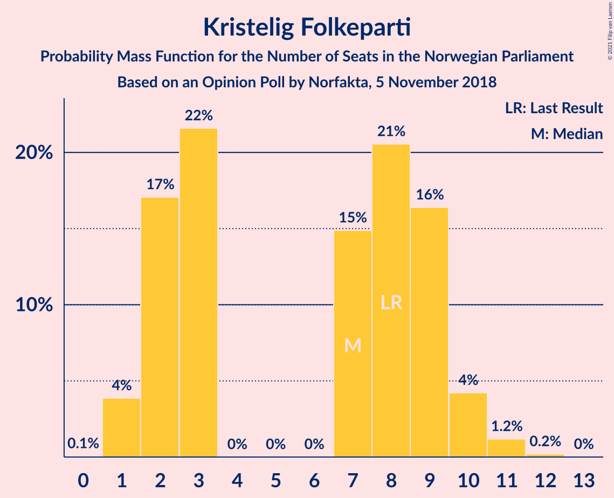

| Number of Seats | Probability | Accumulated | Special Marks |
|:---------------:|:-----------:|:-----------:|:-------------:|
| 0 | 0.1% | 100% |  |
| 1 | 4% | 99.9% |  |
| 2 | 17% | 96% |  |
| 3 | 22% | 79% |  |
| 4 | 0% | 57% |  |
| 5 | 0% | 57% |  |
| 6 | 0% | 57% |  |
| 7 | 15% | 57% | Median |
| 8 | 21% | 43% | Last Result |
| 9 | 16% | 22% |  |
| 10 | 4% | 6% |  |
| 11 | 1.2% | 1.4% |  |
| 12 | 0.2% | 0.2% |  |
| 13 | 0% | 0% |  |

### Rødt

*For a full overview of the results for this party, see the [Rødt](party-rødt.html) page.*

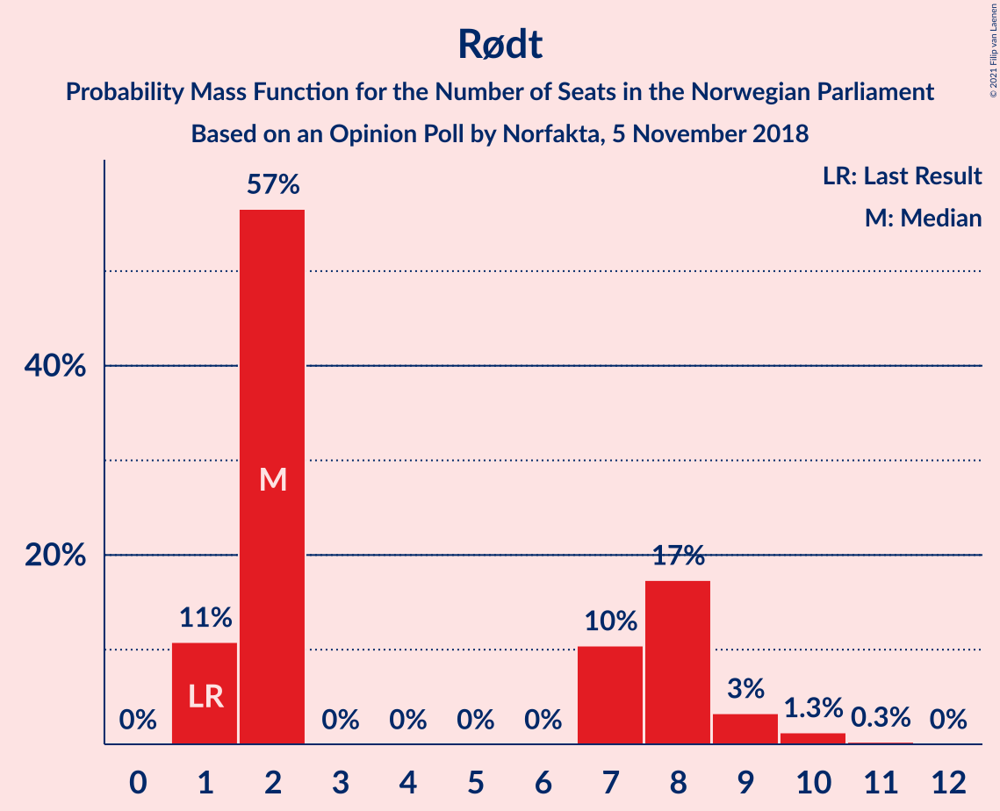

| Number of Seats | Probability | Accumulated | Special Marks |
|:---------------:|:-----------:|:-----------:|:-------------:|
| 1 | 11% | 100% | Last Result |
| 2 | 57% | 89% | Median |
| 3 | 0% | 33% |  |
| 4 | 0% | 33% |  |
| 5 | 0% | 33% |  |
| 6 | 0% | 33% |  |
| 7 | 10% | 33% |  |
| 8 | 17% | 22% |  |
| 9 | 3% | 5% |  |
| 10 | 1.3% | 2% |  |
| 11 | 0.3% | 0.3% |  |
| 12 | 0% | 0% |  |

### Venstre

*For a full overview of the results for this party, see the [Venstre](party-venstre.html) page.*

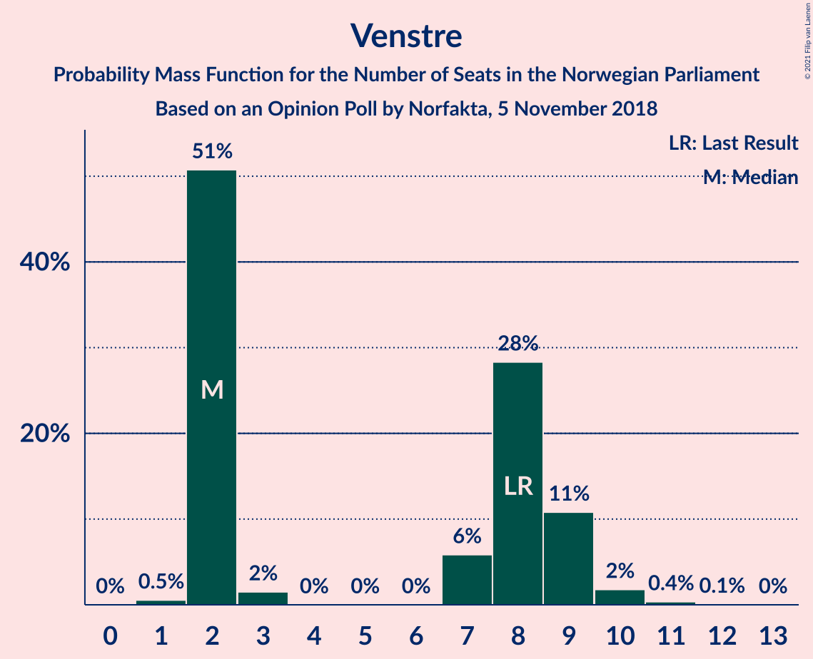

| Number of Seats | Probability | Accumulated | Special Marks |
|:---------------:|:-----------:|:-----------:|:-------------:|
| 1 | 0.5% | 100% |  |
| 2 | 51% | 99.4% | Median |
| 3 | 2% | 49% |  |
| 4 | 0% | 47% |  |
| 5 | 0% | 47% |  |
| 6 | 0% | 47% |  |
| 7 | 6% | 47% |  |
| 8 | 28% | 41% | Last Result |
| 9 | 11% | 13% |  |
| 10 | 2% | 2% |  |
| 11 | 0.4% | 0.4% |  |
| 12 | 0.1% | 0.1% |  |
| 13 | 0% | 0% |  |

### Miljøpartiet De Grønne

*For a full overview of the results for this party, see the [Miljøpartiet De Grønne](party-miljøpartietdegrønne.html) page.*

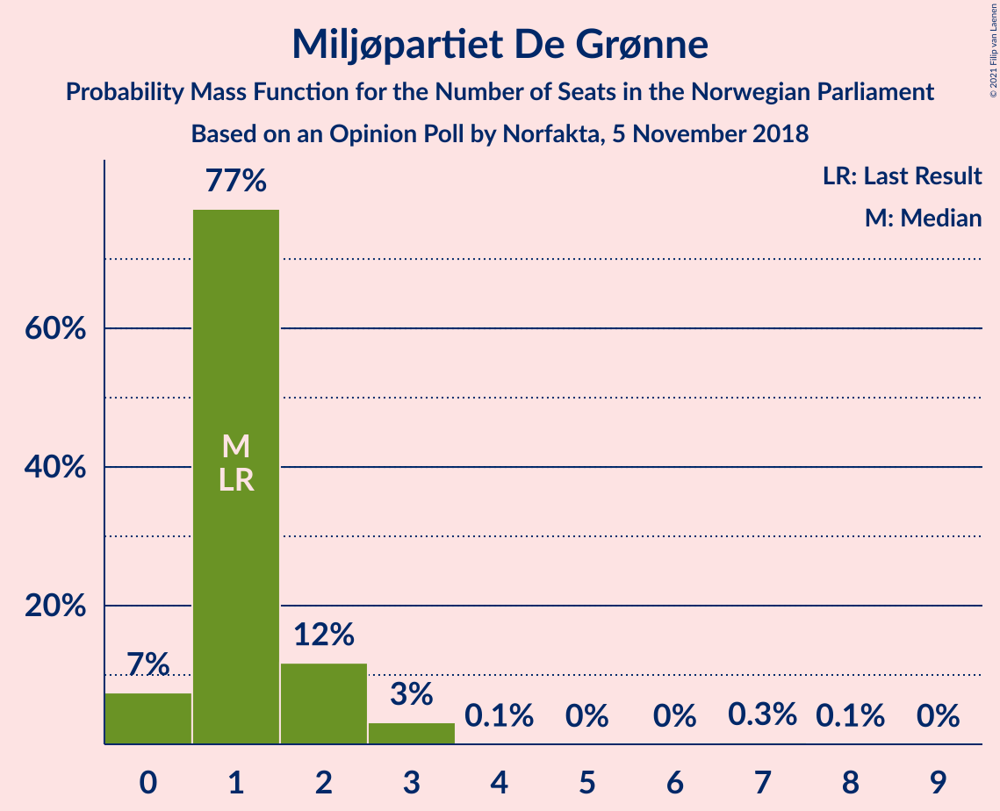

| Number of Seats | Probability | Accumulated | Special Marks |
|:---------------:|:-----------:|:-----------:|:-------------:|
| 0 | 7% | 100% |  |
| 1 | 77% | 93% | Last Result, Median |
| 2 | 12% | 15% |  |
| 3 | 3% | 4% |  |
| 4 | 0.1% | 0.4% |  |
| 5 | 0% | 0.3% |  |
| 6 | 0% | 0.3% |  |
| 7 | 0.3% | 0.3% |  |
| 8 | 0.1% | 0.1% |  |
| 9 | 0% | 0% |  |

## Coalitions

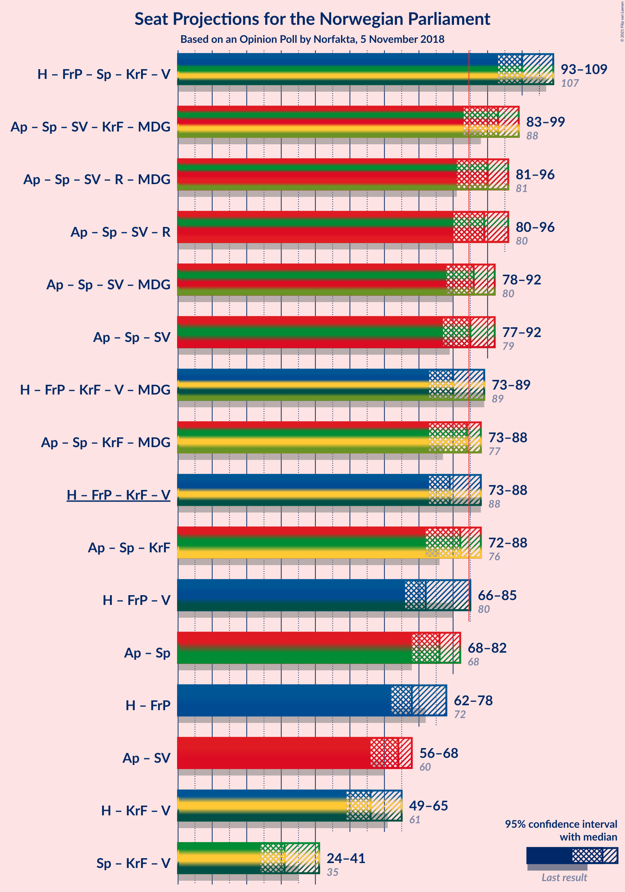

### Confidence Intervals

| Coalition | Last Result | Median | Majority? | 80% Confidence Interval | 90% Confidence Interval | 95% Confidence Interval | 99% Confidence Interval |
|:---------:|:-----------:|:------:|:---------:|:-----------------------:|:-----------------------:|:-----------------------:|:-----------------------:|
| Høyre – Fremskrittspartiet – Senterpartiet – Kristelig Folkeparti – Venstre | 107 | 100 | 100% | 95–108 | 93–109 | 93–109 | 91–112 |
| Arbeiderpartiet – Senterpartiet – Sosialistisk Venstreparti – Kristelig Folkeparti – Miljøpartiet De Grønne | 88 | 93 | 88% | 83–98 | 83–98 | 83–99 | 79–99 |
| Arbeiderpartiet – Senterpartiet – Sosialistisk Venstreparti – Rødt – Miljøpartiet De Grønne | 81 | 90 | 82% | 82–95 | 81–96 | 81–96 | 78–99 |
| Arbeiderpartiet – Senterpartiet – Sosialistisk Venstreparti – Rødt | 80 | 89 | 81% | 81–94 | 80–95 | 80–96 | 77–97 |
| Arbeiderpartiet – Senterpartiet – Sosialistisk Venstreparti – Miljøpartiet De Grønne | 80 | 86 | 67% | 80–92 | 80–92 | 78–92 | 74–94 |
| Arbeiderpartiet – Senterpartiet – Sosialistisk Venstreparti | 79 | 85 | 51% | 79–91 | 78–91 | 77–92 | 73–94 |
| Høyre – Fremskrittspartiet – Kristelig Folkeparti – Venstre – Miljøpartiet De Grønne | 89 | 80 | 19% | 75–88 | 74–89 | 73–89 | 72–92 |
| Arbeiderpartiet – Senterpartiet – Kristelig Folkeparti – Miljøpartiet De Grønne | 77 | 84 | 47% | 74–86 | 73–88 | 73–88 | 70–89 |
| Høyre – Fremskrittspartiet – Kristelig Folkeparti – Venstre | 88 | 79 | 18% | 74–87 | 73–88 | 73–88 | 70–91 |
| Arbeiderpartiet – Senterpartiet – Kristelig Folkeparti | 76 | 82 | 36% | 72–86 | 72–86 | 72–88 | 69–88 |
| Høyre – Fremskrittspartiet – Venstre | 80 | 72 | 7% | 68–81 | 67–85 | 66–85 | 64–87 |
| Arbeiderpartiet – Senterpartiet | 68 | 76 | 0.5% | 69–82 | 69–82 | 68–82 | 64–85 |
| Høyre – Fremskrittspartiet | 72 | 68 | 0% | 63–77 | 63–77 | 62–78 | 61–81 |
| Arbeiderpartiet – Sosialistisk Venstreparti | 60 | 64 | 0% | 57–68 | 57–68 | 56–68 | 52–69 |
| Høyre – Kristelig Folkeparti – Venstre | 61 | 56 | 0% | 50–62 | 50–65 | 49–65 | 48–67 |
| Senterpartiet – Kristelig Folkeparti – Venstre | 35 | 31 | 0% | 30–39 | 27–41 | 24–41 | 24–43 |

### Høyre – Fremskrittspartiet – Senterpartiet – Kristelig Folkeparti – Venstre

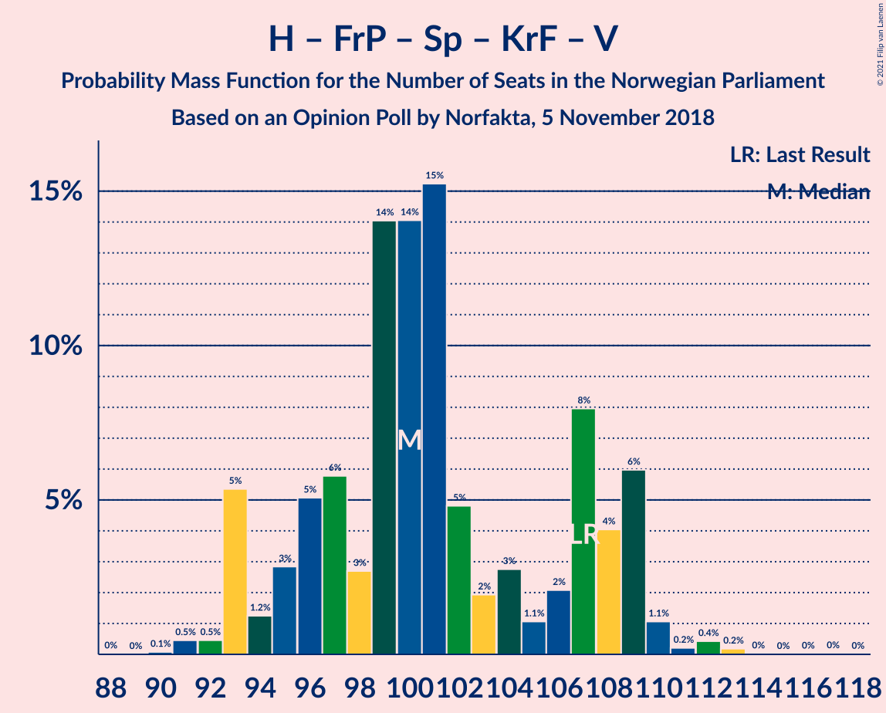

| Number of Seats | Probability | Accumulated | Special Marks |
|:---------------:|:-----------:|:-----------:|:-------------:|
| 90 | 0.1% | 100% |  |
| 91 | 0.5% | 99.9% |  |
| 92 | 0.5% | 99.4% |  |
| 93 | 5% | 99.0% |  |
| 94 | 1.2% | 94% |  |
| 95 | 3% | 92% |  |
| 96 | 5% | 90% |  |
| 97 | 6% | 84% |  |
| 98 | 3% | 79% |  |
| 99 | 14% | 76% | Median |
| 100 | 14% | 62% |  |
| 101 | 15% | 48% |  |
| 102 | 5% | 33% |  |
| 103 | 2% | 28% |  |
| 104 | 3% | 26% |  |
| 105 | 1.1% | 23% |  |
| 106 | 2% | 22% |  |
| 107 | 8% | 20% | Last Result |
| 108 | 4% | 12% |  |
| 109 | 6% | 8% |  |
| 110 | 1.1% | 2% |  |
| 111 | 0.2% | 0.9% |  |
| 112 | 0.4% | 0.7% |  |
| 113 | 0.2% | 0.3% |  |
| 114 | 0% | 0.1% |  |
| 115 | 0% | 0.1% |  |
| 116 | 0% | 0.1% |  |
| 117 | 0% | 0.1% |  |
| 118 | 0% | 0% |  |

### Arbeiderpartiet – Senterpartiet – Sosialistisk Venstreparti – Kristelig Folkeparti – Miljøpartiet De Grønne

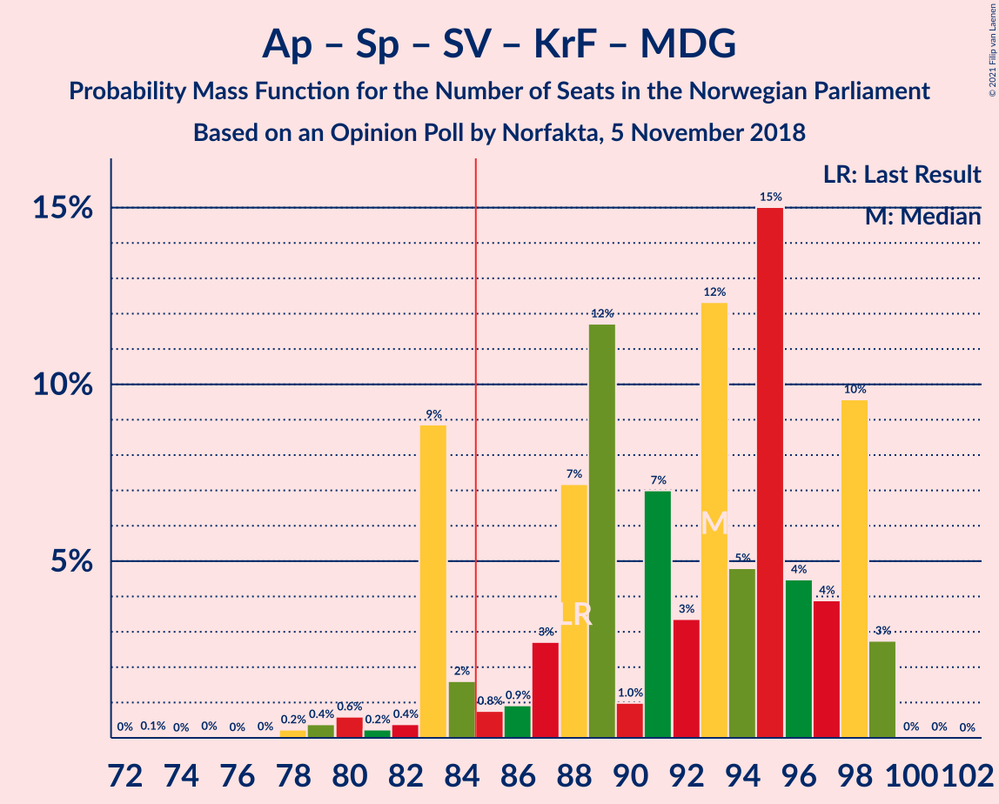

| Number of Seats | Probability | Accumulated | Special Marks |
|:---------------:|:-----------:|:-----------:|:-------------:|
| 73 | 0.1% | 100% |  |
| 74 | 0% | 99.9% |  |
| 75 | 0% | 99.9% |  |
| 76 | 0% | 99.9% |  |
| 77 | 0% | 99.9% |  |
| 78 | 0.2% | 99.8% |  |
| 79 | 0.4% | 99.6% |  |
| 80 | 0.6% | 99.2% |  |
| 81 | 0.2% | 98.6% |  |
| 82 | 0.4% | 98% |  |
| 83 | 9% | 98% |  |
| 84 | 2% | 89% |  |
| 85 | 0.8% | 88% | Majority |
| 86 | 0.9% | 87% |  |
| 87 | 3% | 86% |  |
| 88 | 7% | 83% | Last Result |
| 89 | 12% | 76% |  |
| 90 | 1.0% | 64% |  |
| 91 | 7% | 63% |  |
| 92 | 3% | 56% |  |
| 93 | 12% | 53% |  |
| 94 | 5% | 41% | Median |
| 95 | 15% | 36% |  |
| 96 | 4% | 21% |  |
| 97 | 4% | 16% |  |
| 98 | 10% | 12% |  |
| 99 | 3% | 3% |  |
| 100 | 0% | 0.1% |  |
| 101 | 0% | 0% |  |

### Arbeiderpartiet – Senterpartiet – Sosialistisk Venstreparti – Rødt – Miljøpartiet De Grønne

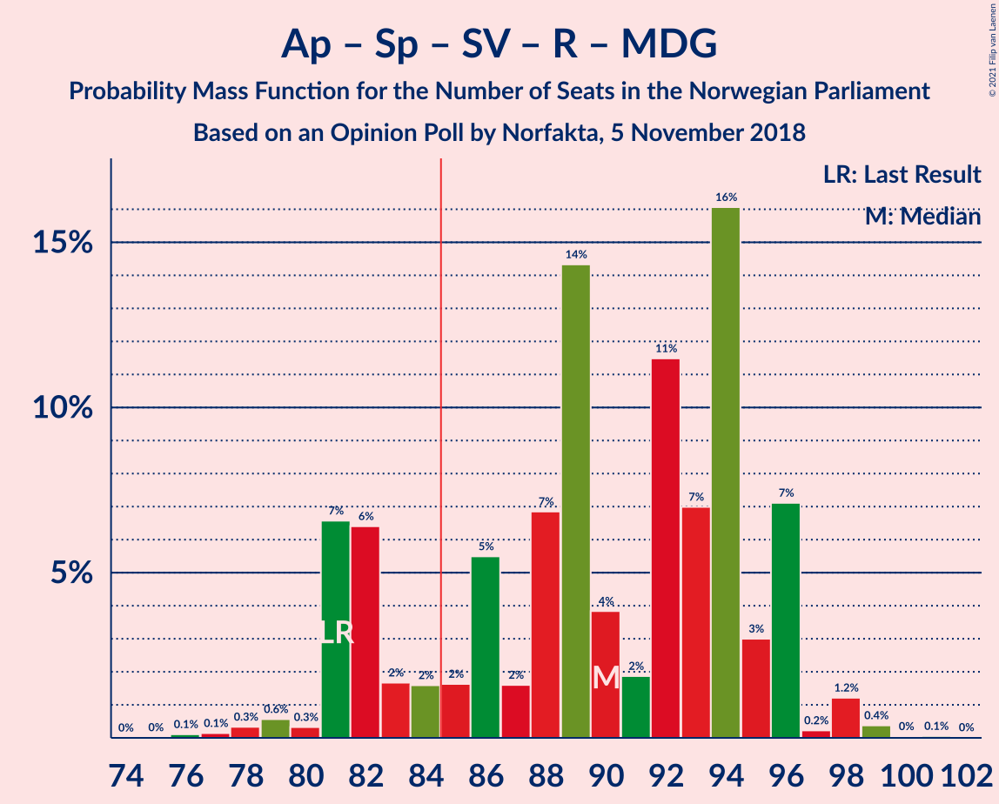

| Number of Seats | Probability | Accumulated | Special Marks |
|:---------------:|:-----------:|:-----------:|:-------------:|
| 76 | 0.1% | 100% |  |
| 77 | 0.1% | 99.9% |  |
| 78 | 0.3% | 99.7% |  |
| 79 | 0.6% | 99.4% |  |
| 80 | 0.3% | 98.8% |  |
| 81 | 7% | 98% | Last Result |
| 82 | 6% | 92% |  |
| 83 | 2% | 85% |  |
| 84 | 2% | 84% |  |
| 85 | 2% | 82% | Majority |
| 86 | 5% | 81% |  |
| 87 | 2% | 75% |  |
| 88 | 7% | 74% |  |
| 89 | 14% | 67% | Median |
| 90 | 4% | 52% |  |
| 91 | 2% | 48% |  |
| 92 | 11% | 47% |  |
| 93 | 7% | 35% |  |
| 94 | 16% | 28% |  |
| 95 | 3% | 12% |  |
| 96 | 7% | 9% |  |
| 97 | 0.2% | 2% |  |
| 98 | 1.2% | 2% |  |
| 99 | 0.4% | 0.5% |  |
| 100 | 0% | 0.1% |  |
| 101 | 0.1% | 0.1% |  |
| 102 | 0% | 0% |  |

### Arbeiderpartiet – Senterpartiet – Sosialistisk Venstreparti – Rødt

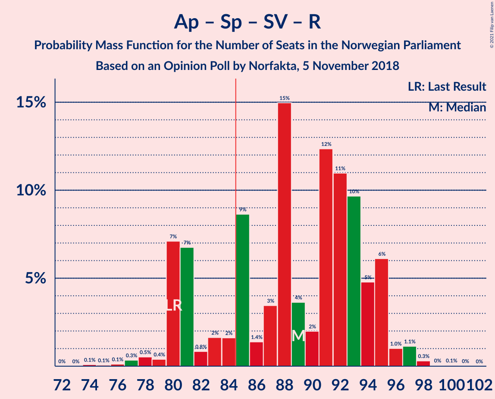

| Number of Seats | Probability | Accumulated | Special Marks |
|:---------------:|:-----------:|:-----------:|:-------------:|
| 74 | 0.1% | 100% |  |
| 75 | 0.1% | 99.9% |  |
| 76 | 0.1% | 99.8% |  |
| 77 | 0.3% | 99.7% |  |
| 78 | 0.5% | 99.4% |  |
| 79 | 0.4% | 98.8% |  |
| 80 | 7% | 98% | Last Result |
| 81 | 7% | 91% |  |
| 82 | 0.8% | 85% |  |
| 83 | 2% | 84% |  |
| 84 | 2% | 82% |  |
| 85 | 9% | 81% | Majority |
| 86 | 1.4% | 72% |  |
| 87 | 3% | 70% |  |
| 88 | 15% | 67% | Median |
| 89 | 4% | 52% |  |
| 90 | 2% | 48% |  |
| 91 | 12% | 46% |  |
| 92 | 11% | 34% |  |
| 93 | 10% | 23% |  |
| 94 | 5% | 13% |  |
| 95 | 6% | 9% |  |
| 96 | 1.0% | 3% |  |
| 97 | 1.1% | 2% |  |
| 98 | 0.3% | 0.4% |  |
| 99 | 0% | 0.1% |  |
| 100 | 0.1% | 0.1% |  |
| 101 | 0% | 0% |  |

### Arbeiderpartiet – Senterpartiet – Sosialistisk Venstreparti – Miljøpartiet De Grønne

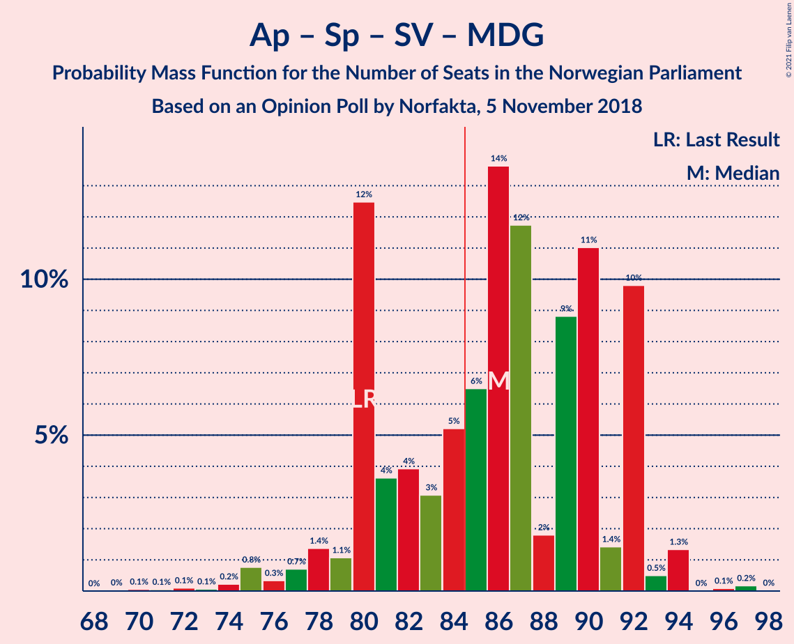

| Number of Seats | Probability | Accumulated | Special Marks |
|:---------------:|:-----------:|:-----------:|:-------------:|
| 70 | 0.1% | 100% |  |
| 71 | 0.1% | 99.9% |  |
| 72 | 0.1% | 99.9% |  |
| 73 | 0.1% | 99.8% |  |
| 74 | 0.2% | 99.7% |  |
| 75 | 0.8% | 99.5% |  |
| 76 | 0.3% | 98.7% |  |
| 77 | 0.7% | 98% |  |
| 78 | 1.4% | 98% |  |
| 79 | 1.1% | 96% |  |
| 80 | 12% | 95% | Last Result |
| 81 | 4% | 83% |  |
| 82 | 4% | 79% |  |
| 83 | 3% | 75% |  |
| 84 | 5% | 72% |  |
| 85 | 6% | 67% | Majority |
| 86 | 14% | 60% |  |
| 87 | 12% | 47% | Median |
| 88 | 2% | 35% |  |
| 89 | 9% | 33% |  |
| 90 | 11% | 24% |  |
| 91 | 1.4% | 13% |  |
| 92 | 10% | 12% |  |
| 93 | 0.5% | 2% |  |
| 94 | 1.3% | 2% |  |
| 95 | 0% | 0.3% |  |
| 96 | 0.1% | 0.3% |  |
| 97 | 0.2% | 0.2% |  |
| 98 | 0% | 0% |  |

### Arbeiderpartiet – Senterpartiet – Sosialistisk Venstreparti

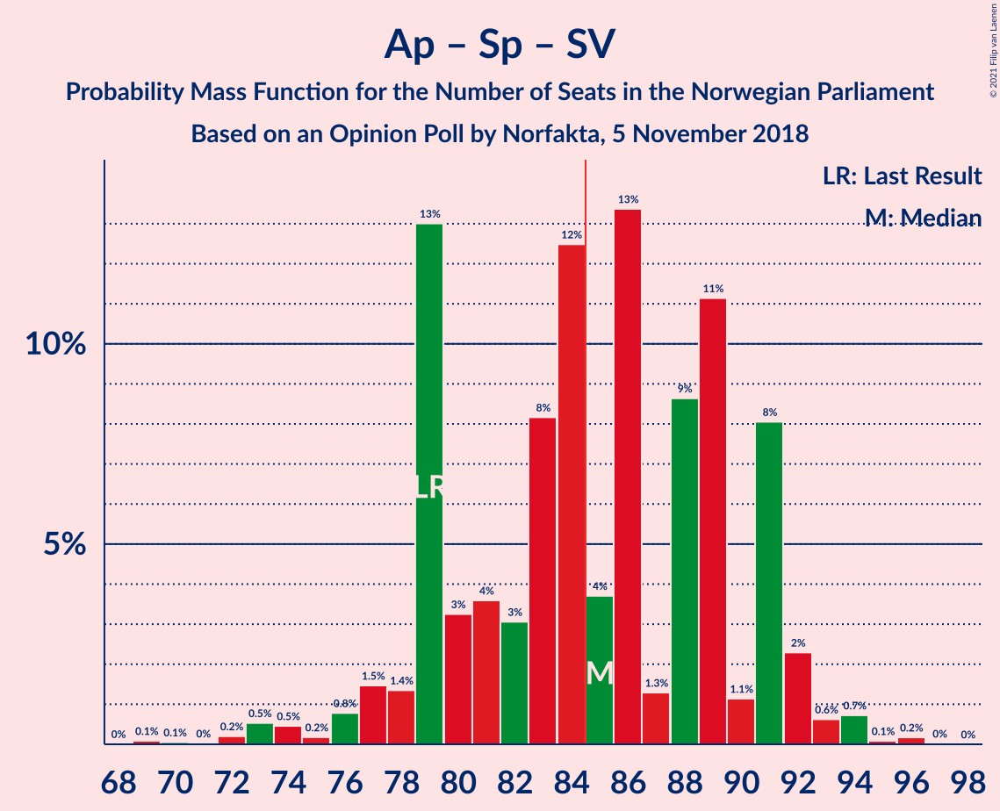

| Number of Seats | Probability | Accumulated | Special Marks |
|:---------------:|:-----------:|:-----------:|:-------------:|
| 69 | 0.1% | 100% |  |
| 70 | 0.1% | 99.9% |  |
| 71 | 0% | 99.8% |  |
| 72 | 0.2% | 99.8% |  |
| 73 | 0.5% | 99.6% |  |
| 74 | 0.5% | 99.1% |  |
| 75 | 0.2% | 98.6% |  |
| 76 | 0.8% | 98% |  |
| 77 | 1.5% | 98% |  |
| 78 | 1.4% | 96% |  |
| 79 | 13% | 95% | Last Result |
| 80 | 3% | 82% |  |
| 81 | 4% | 79% |  |
| 82 | 3% | 75% |  |
| 83 | 8% | 72% |  |
| 84 | 12% | 64% |  |
| 85 | 4% | 51% | Majority |
| 86 | 13% | 48% | Median |
| 87 | 1.3% | 34% |  |
| 88 | 9% | 33% |  |
| 89 | 11% | 24% |  |
| 90 | 1.1% | 13% |  |
| 91 | 8% | 12% |  |
| 92 | 2% | 4% |  |
| 93 | 0.6% | 2% |  |
| 94 | 0.7% | 1.0% |  |
| 95 | 0.1% | 0.3% |  |
| 96 | 0.2% | 0.2% |  |
| 97 | 0% | 0% |  |

### Høyre – Fremskrittspartiet – Kristelig Folkeparti – Venstre – Miljøpartiet De Grønne

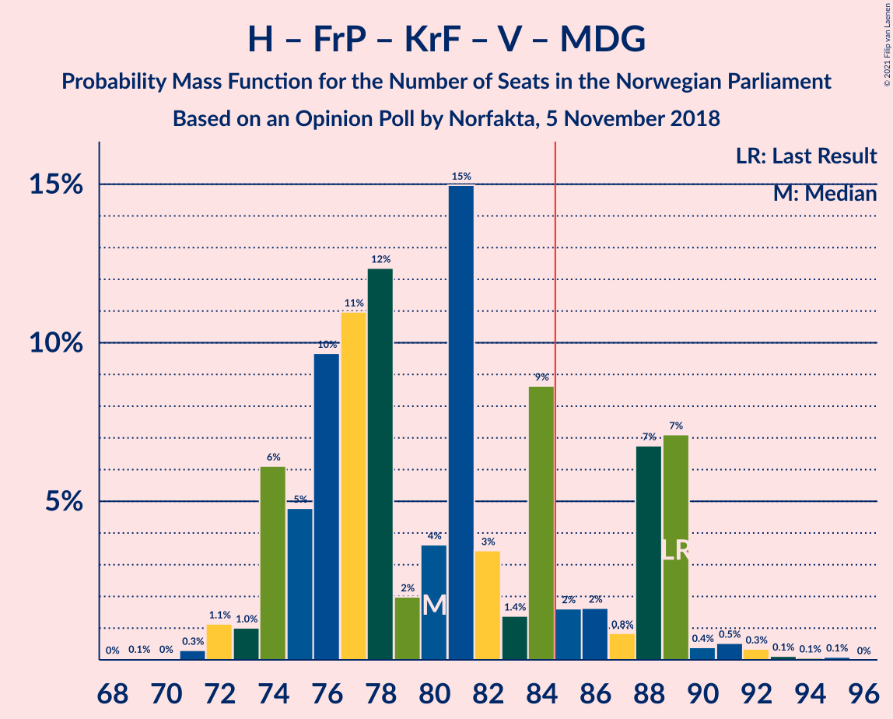

| Number of Seats | Probability | Accumulated | Special Marks |
|:---------------:|:-----------:|:-----------:|:-------------:|
| 69 | 0.1% | 100% |  |
| 70 | 0% | 99.9% |  |
| 71 | 0.3% | 99.9% |  |
| 72 | 1.1% | 99.6% |  |
| 73 | 1.0% | 98% |  |
| 74 | 6% | 97% |  |
| 75 | 5% | 91% |  |
| 76 | 10% | 87% |  |
| 77 | 11% | 77% |  |
| 78 | 12% | 66% | Median |
| 79 | 2% | 54% |  |
| 80 | 4% | 52% |  |
| 81 | 15% | 48% |  |
| 82 | 3% | 33% |  |
| 83 | 1.4% | 30% |  |
| 84 | 9% | 28% |  |
| 85 | 2% | 19% | Majority |
| 86 | 2% | 18% |  |
| 87 | 0.8% | 16% |  |
| 88 | 7% | 15% |  |
| 89 | 7% | 9% | Last Result |
| 90 | 0.4% | 2% |  |
| 91 | 0.5% | 1.2% |  |
| 92 | 0.3% | 0.6% |  |
| 93 | 0.1% | 0.3% |  |
| 94 | 0.1% | 0.2% |  |
| 95 | 0.1% | 0.1% |  |
| 96 | 0% | 0% |  |

### Arbeiderpartiet – Senterpartiet – Kristelig Folkeparti – Miljøpartiet De Grønne

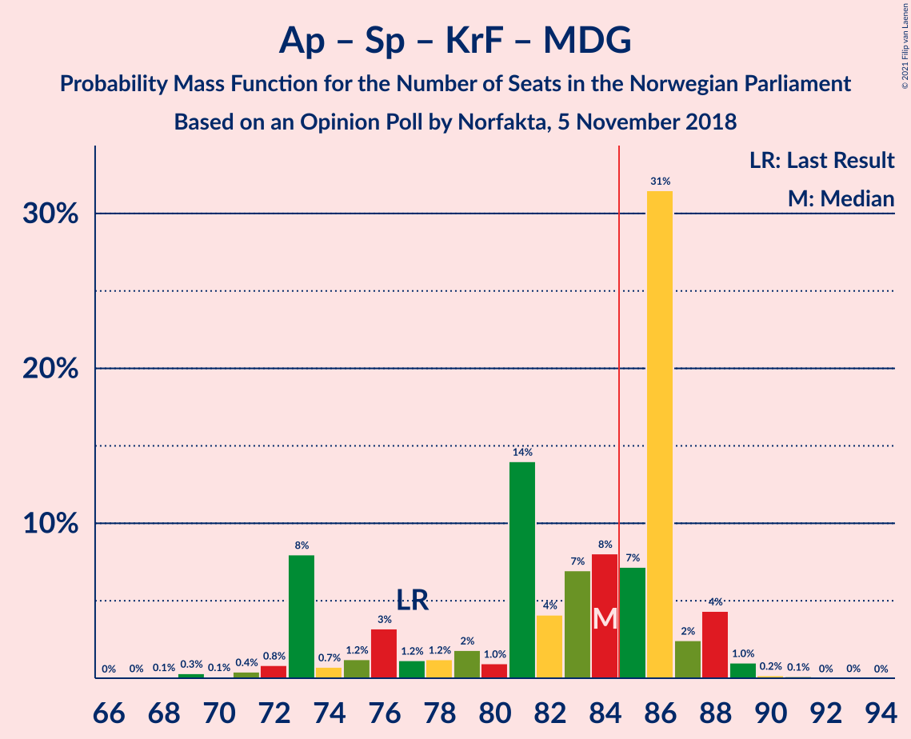

| Number of Seats | Probability | Accumulated | Special Marks |
|:---------------:|:-----------:|:-----------:|:-------------:|
| 68 | 0.1% | 100% |  |
| 69 | 0.3% | 99.9% |  |
| 70 | 0.1% | 99.6% |  |
| 71 | 0.4% | 99.5% |  |
| 72 | 0.8% | 99.0% |  |
| 73 | 8% | 98% |  |
| 74 | 0.7% | 90% |  |
| 75 | 1.2% | 89% |  |
| 76 | 3% | 88% |  |
| 77 | 1.2% | 85% | Last Result |
| 78 | 1.2% | 84% |  |
| 79 | 2% | 83% |  |
| 80 | 1.0% | 81% |  |
| 81 | 14% | 80% |  |
| 82 | 4% | 66% |  |
| 83 | 7% | 62% |  |
| 84 | 8% | 55% |  |
| 85 | 7% | 47% | Median, Majority |
| 86 | 31% | 40% |  |
| 87 | 2% | 8% |  |
| 88 | 4% | 6% |  |
| 89 | 1.0% | 1.4% |  |
| 90 | 0.2% | 0.4% |  |
| 91 | 0.1% | 0.2% |  |
| 92 | 0% | 0.1% |  |
| 93 | 0% | 0% |  |

### Høyre – Fremskrittspartiet – Kristelig Folkeparti – Venstre

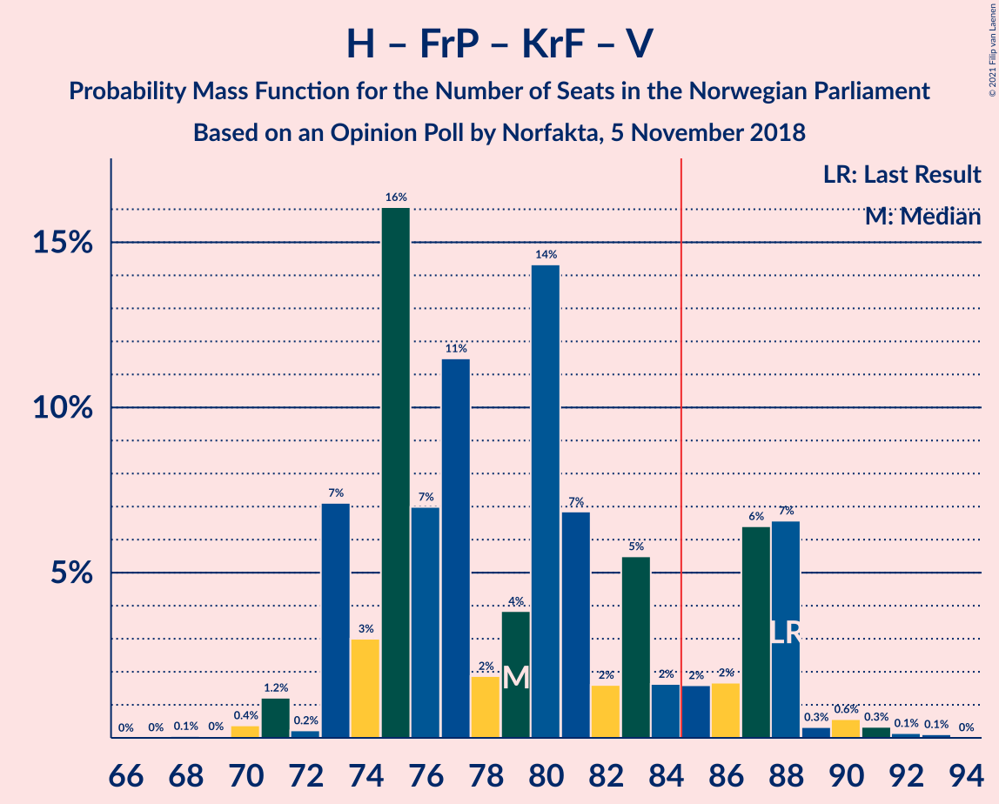

| Number of Seats | Probability | Accumulated | Special Marks |
|:---------------:|:-----------:|:-----------:|:-------------:|
| 68 | 0.1% | 100% |  |
| 69 | 0% | 99.9% |  |
| 70 | 0.4% | 99.9% |  |
| 71 | 1.2% | 99.5% |  |
| 72 | 0.2% | 98% |  |
| 73 | 7% | 98% |  |
| 74 | 3% | 91% |  |
| 75 | 16% | 88% |  |
| 76 | 7% | 72% |  |
| 77 | 11% | 65% | Median |
| 78 | 2% | 53% |  |
| 79 | 4% | 52% |  |
| 80 | 14% | 48% |  |
| 81 | 7% | 33% |  |
| 82 | 2% | 26% |  |
| 83 | 5% | 25% |  |
| 84 | 2% | 19% |  |
| 85 | 2% | 18% | Majority |
| 86 | 2% | 16% |  |
| 87 | 6% | 15% |  |
| 88 | 7% | 8% | Last Result |
| 89 | 0.3% | 2% |  |
| 90 | 0.6% | 1.2% |  |
| 91 | 0.3% | 0.6% |  |
| 92 | 0.1% | 0.3% |  |
| 93 | 0.1% | 0.1% |  |
| 94 | 0% | 0% |  |

### Arbeiderpartiet – Senterpartiet – Kristelig Folkeparti

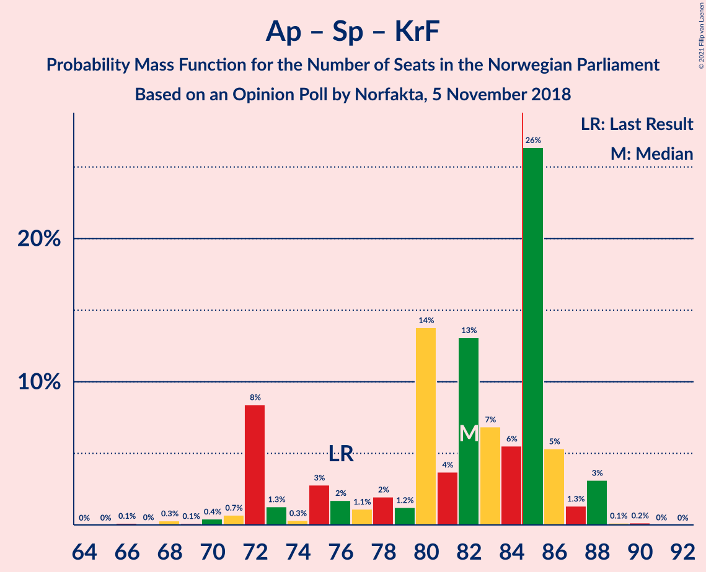

| Number of Seats | Probability | Accumulated | Special Marks |
|:---------------:|:-----------:|:-----------:|:-------------:|
| 66 | 0.1% | 100% |  |
| 67 | 0% | 99.9% |  |
| 68 | 0.3% | 99.8% |  |
| 69 | 0.1% | 99.5% |  |
| 70 | 0.4% | 99.4% |  |
| 71 | 0.7% | 99.0% |  |
| 72 | 8% | 98% |  |
| 73 | 1.3% | 90% |  |
| 74 | 0.3% | 89% |  |
| 75 | 3% | 88% |  |
| 76 | 2% | 85% | Last Result |
| 77 | 1.1% | 84% |  |
| 78 | 2% | 83% |  |
| 79 | 1.2% | 81% |  |
| 80 | 14% | 79% |  |
| 81 | 4% | 66% |  |
| 82 | 13% | 62% |  |
| 83 | 7% | 49% |  |
| 84 | 6% | 42% | Median |
| 85 | 26% | 36% | Majority |
| 86 | 5% | 10% |  |
| 87 | 1.3% | 5% |  |
| 88 | 3% | 3% |  |
| 89 | 0.1% | 0.3% |  |
| 90 | 0.2% | 0.2% |  |
| 91 | 0% | 0% |  |

### Høyre – Fremskrittspartiet – Venstre

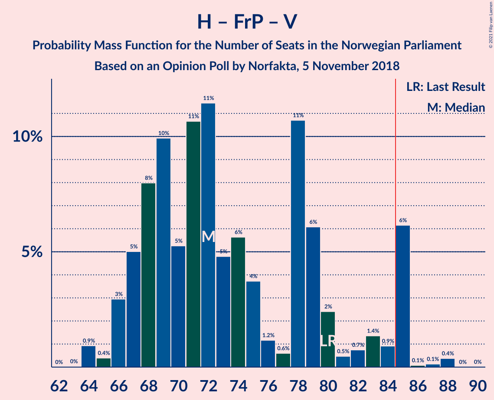

| Number of Seats | Probability | Accumulated | Special Marks |
|:---------------:|:-----------:|:-----------:|:-------------:|
| 64 | 0.9% | 100% |  |
| 65 | 0.4% | 99.0% |  |
| 66 | 3% | 98.6% |  |
| 67 | 5% | 96% |  |
| 68 | 8% | 91% |  |
| 69 | 10% | 83% |  |
| 70 | 5% | 73% | Median |
| 71 | 11% | 67% |  |
| 72 | 11% | 57% |  |
| 73 | 5% | 45% |  |
| 74 | 6% | 41% |  |
| 75 | 4% | 35% |  |
| 76 | 1.2% | 31% |  |
| 77 | 0.6% | 30% |  |
| 78 | 11% | 29% |  |
| 79 | 6% | 19% |  |
| 80 | 2% | 13% | Last Result |
| 81 | 0.5% | 10% |  |
| 82 | 0.7% | 10% |  |
| 83 | 1.4% | 9% |  |
| 84 | 0.9% | 8% |  |
| 85 | 6% | 7% | Majority |
| 86 | 0.1% | 0.6% |  |
| 87 | 0.1% | 0.5% |  |
| 88 | 0.4% | 0.4% |  |
| 89 | 0% | 0% |  |

### Arbeiderpartiet – Senterpartiet

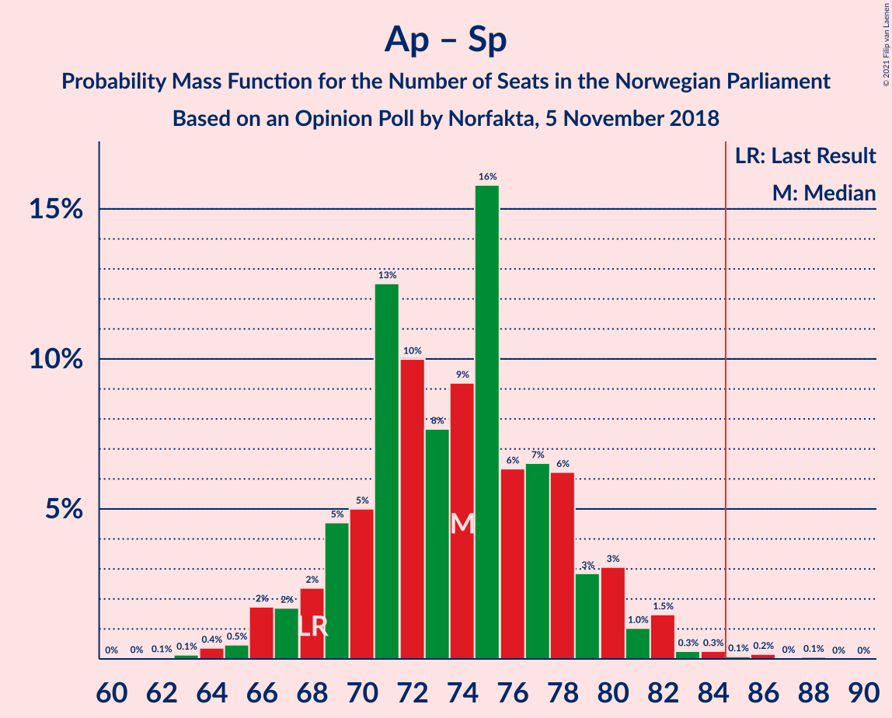

| Number of Seats | Probability | Accumulated | Special Marks |
|:---------------:|:-----------:|:-----------:|:-------------:|
| 62 | 0% | 100% |  |
| 63 | 0.1% | 99.9% |  |
| 64 | 0.5% | 99.8% |  |
| 65 | 0.5% | 99.3% |  |
| 66 | 0.4% | 98.8% |  |
| 67 | 0.8% | 98% |  |
| 68 | 2% | 98% | Last Result |
| 69 | 7% | 96% |  |
| 70 | 3% | 89% |  |
| 71 | 2% | 86% |  |
| 72 | 2% | 85% |  |
| 73 | 7% | 83% |  |
| 74 | 9% | 75% |  |
| 75 | 9% | 67% |  |
| 76 | 8% | 58% |  |
| 77 | 18% | 50% | Median |
| 78 | 16% | 32% |  |
| 79 | 2% | 16% |  |
| 80 | 1.2% | 15% |  |
| 81 | 3% | 13% |  |
| 82 | 9% | 10% |  |
| 83 | 0.1% | 1.2% |  |
| 84 | 0.5% | 1.1% |  |
| 85 | 0.4% | 0.5% | Majority |
| 86 | 0.1% | 0.1% |  |
| 87 | 0% | 0% |  |

### Høyre – Fremskrittspartiet

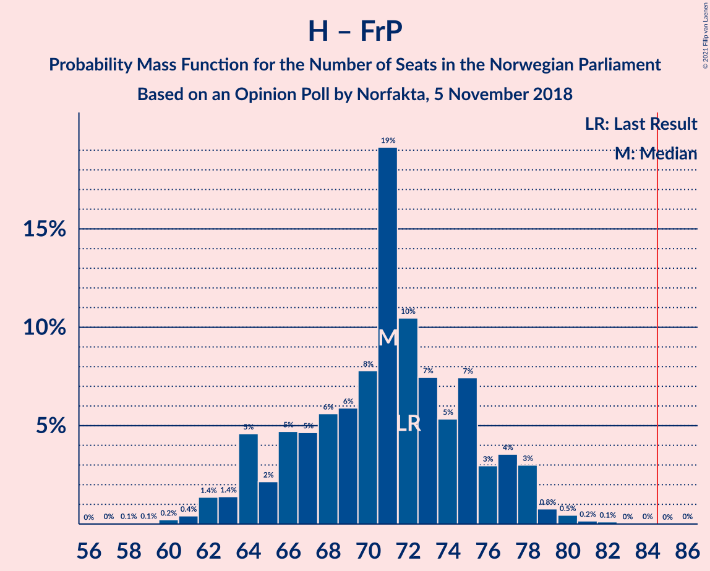

| Number of Seats | Probability | Accumulated | Special Marks |
|:---------------:|:-----------:|:-----------:|:-------------:|
| 58 | 0.1% | 100% |  |
| 59 | 0% | 99.9% |  |
| 60 | 0.1% | 99.9% |  |
| 61 | 0.8% | 99.9% |  |
| 62 | 3% | 99.1% |  |
| 63 | 8% | 96% |  |
| 64 | 6% | 88% |  |
| 65 | 6% | 82% |  |
| 66 | 12% | 76% |  |
| 67 | 14% | 64% |  |
| 68 | 4% | 50% | Median |
| 69 | 3% | 47% |  |
| 70 | 24% | 43% |  |
| 71 | 1.0% | 19% |  |
| 72 | 2% | 18% | Last Result |
| 73 | 1.4% | 17% |  |
| 74 | 2% | 15% |  |
| 75 | 1.0% | 13% |  |
| 76 | 2% | 12% |  |
| 77 | 7% | 10% |  |
| 78 | 2% | 4% |  |
| 79 | 0.2% | 1.3% |  |
| 80 | 0.5% | 1.1% |  |
| 81 | 0.3% | 0.6% |  |
| 82 | 0.1% | 0.3% |  |
| 83 | 0.1% | 0.1% |  |
| 84 | 0.1% | 0.1% |  |
| 85 | 0% | 0% | Majority |

### Arbeiderpartiet – Sosialistisk Venstreparti

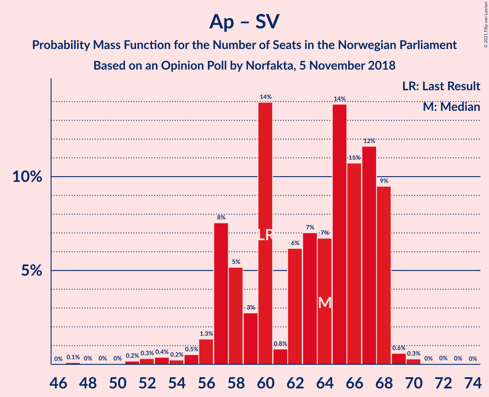

| Number of Seats | Probability | Accumulated | Special Marks |
|:---------------:|:-----------:|:-----------:|:-------------:|
| 47 | 0.1% | 100% |  |
| 48 | 0% | 99.9% |  |
| 49 | 0% | 99.9% |  |
| 50 | 0% | 99.8% |  |
| 51 | 0.2% | 99.8% |  |
| 52 | 0.3% | 99.6% |  |
| 53 | 0.4% | 99.3% |  |
| 54 | 0.2% | 98.9% |  |
| 55 | 0.5% | 98.7% |  |
| 56 | 1.3% | 98% |  |
| 57 | 8% | 97% |  |
| 58 | 5% | 89% |  |
| 59 | 3% | 84% |  |
| 60 | 14% | 81% | Last Result |
| 61 | 0.8% | 67% |  |
| 62 | 6% | 67% |  |
| 63 | 7% | 60% |  |
| 64 | 7% | 53% | Median |
| 65 | 14% | 47% |  |
| 66 | 11% | 33% |  |
| 67 | 12% | 22% |  |
| 68 | 9% | 10% |  |
| 69 | 0.6% | 1.0% |  |
| 70 | 0.3% | 0.4% |  |
| 71 | 0% | 0.1% |  |
| 72 | 0% | 0.1% |  |
| 73 | 0% | 0.1% |  |
| 74 | 0% | 0% |  |

### Høyre – Kristelig Folkeparti – Venstre

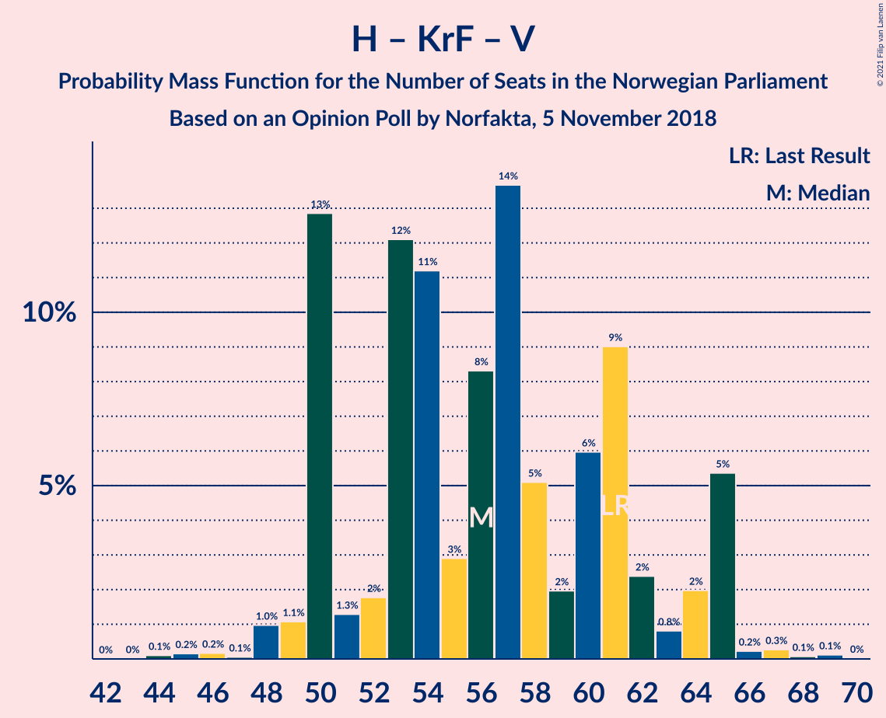

| Number of Seats | Probability | Accumulated | Special Marks |
|:---------------:|:-----------:|:-----------:|:-------------:|
| 44 | 0.1% | 100% |  |
| 45 | 0.2% | 99.9% |  |
| 46 | 0.2% | 99.7% |  |
| 47 | 0.1% | 99.6% |  |
| 48 | 1.0% | 99.5% |  |
| 49 | 1.1% | 98.5% |  |
| 50 | 13% | 97% |  |
| 51 | 1.3% | 85% |  |
| 52 | 2% | 83% |  |
| 53 | 12% | 82% |  |
| 54 | 11% | 69% | Median |
| 55 | 3% | 58% |  |
| 56 | 8% | 55% |  |
| 57 | 14% | 47% |  |
| 58 | 5% | 33% |  |
| 59 | 2% | 28% |  |
| 60 | 6% | 26% |  |
| 61 | 9% | 20% | Last Result |
| 62 | 2% | 11% |  |
| 63 | 0.8% | 9% |  |
| 64 | 2% | 8% |  |
| 65 | 5% | 6% |  |
| 66 | 0.2% | 0.7% |  |
| 67 | 0.3% | 0.5% |  |
| 68 | 0.1% | 0.2% |  |
| 69 | 0.1% | 0.2% |  |
| 70 | 0% | 0% |  |

### Senterpartiet – Kristelig Folkeparti – Venstre

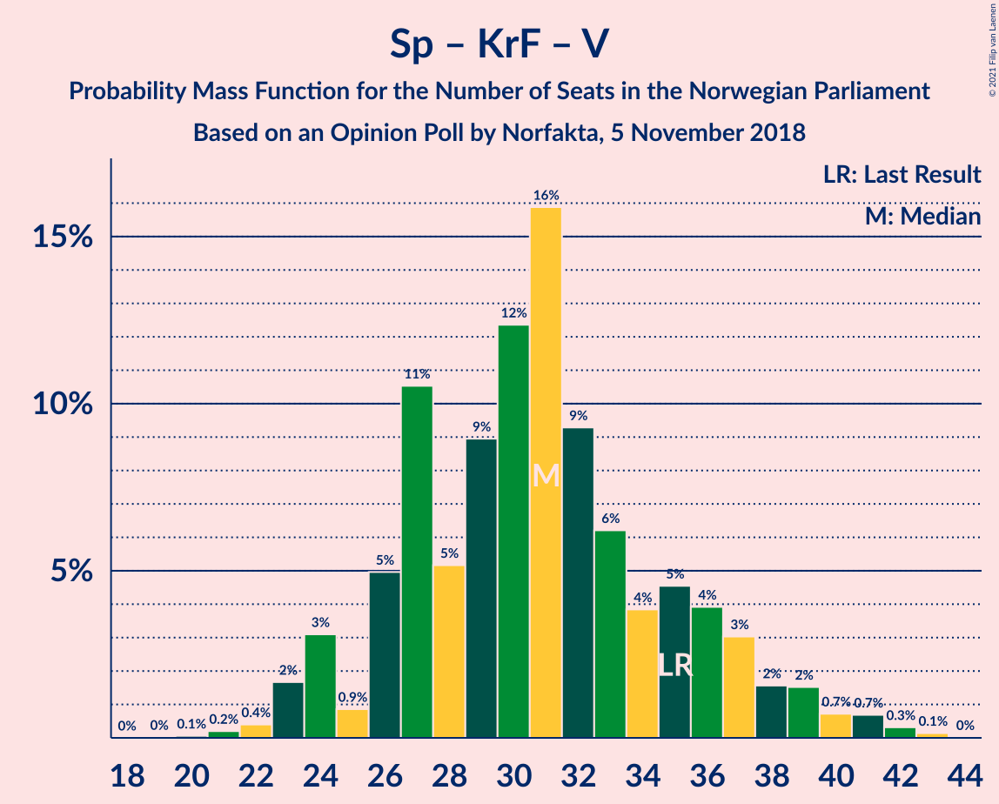

| Number of Seats | Probability | Accumulated | Special Marks |
|:---------------:|:-----------:|:-----------:|:-------------:|
| 20 | 0.1% | 100% |  |
| 21 | 0.1% | 99.9% |  |
| 22 | 0.1% | 99.9% |  |
| 23 | 0.1% | 99.8% |  |
| 24 | 3% | 99.7% |  |
| 25 | 0.3% | 97% |  |
| 26 | 0.5% | 97% |  |
| 27 | 2% | 96% |  |
| 28 | 1.4% | 95% |  |
| 29 | 2% | 93% |  |
| 30 | 22% | 91% |  |
| 31 | 24% | 70% | Median |
| 32 | 16% | 46% |  |
| 33 | 4% | 29% |  |
| 34 | 2% | 25% |  |
| 35 | 2% | 23% | Last Result |
| 36 | 4% | 21% |  |
| 37 | 2% | 17% |  |
| 38 | 3% | 15% |  |
| 39 | 6% | 12% |  |
| 40 | 0.7% | 6% |  |
| 41 | 5% | 5% |  |
| 42 | 0.1% | 0.9% |  |
| 43 | 0.7% | 0.7% |  |
| 44 | 0% | 0% |  |

## Technical Information

### Opinion Poll

+ **Polling firm:** Norfakta
+ **Commissioner(s):** —
+ **Fieldwork period:** 5 November 2018

### Calculations

+ **Sample size:** 804
+ **Simulations done:** 131,072
+ **Error estimate:** 2.09%

