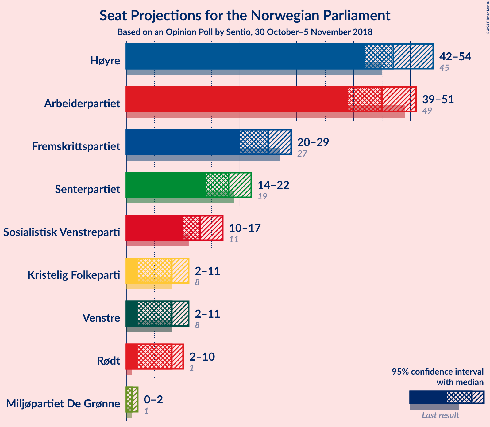
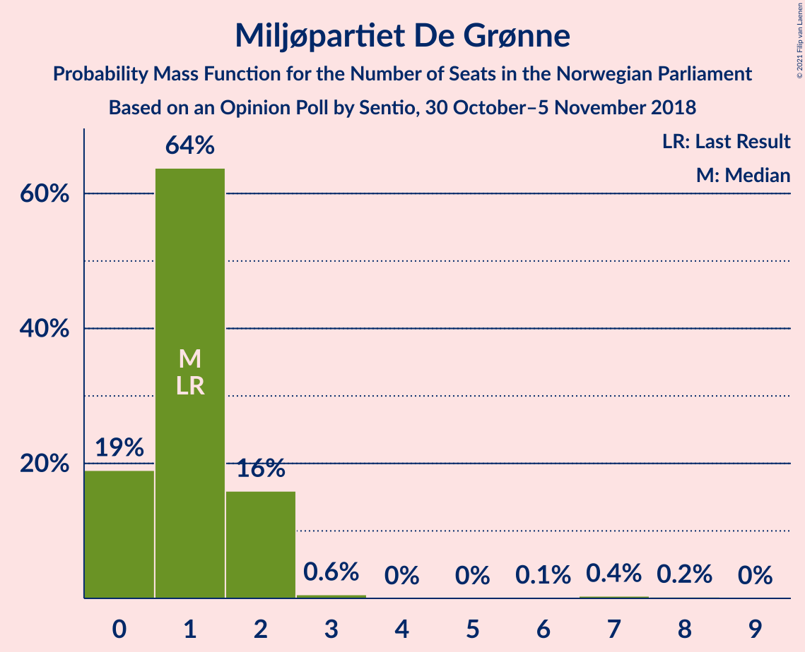
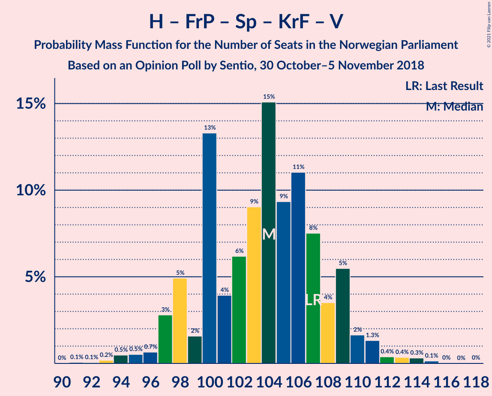
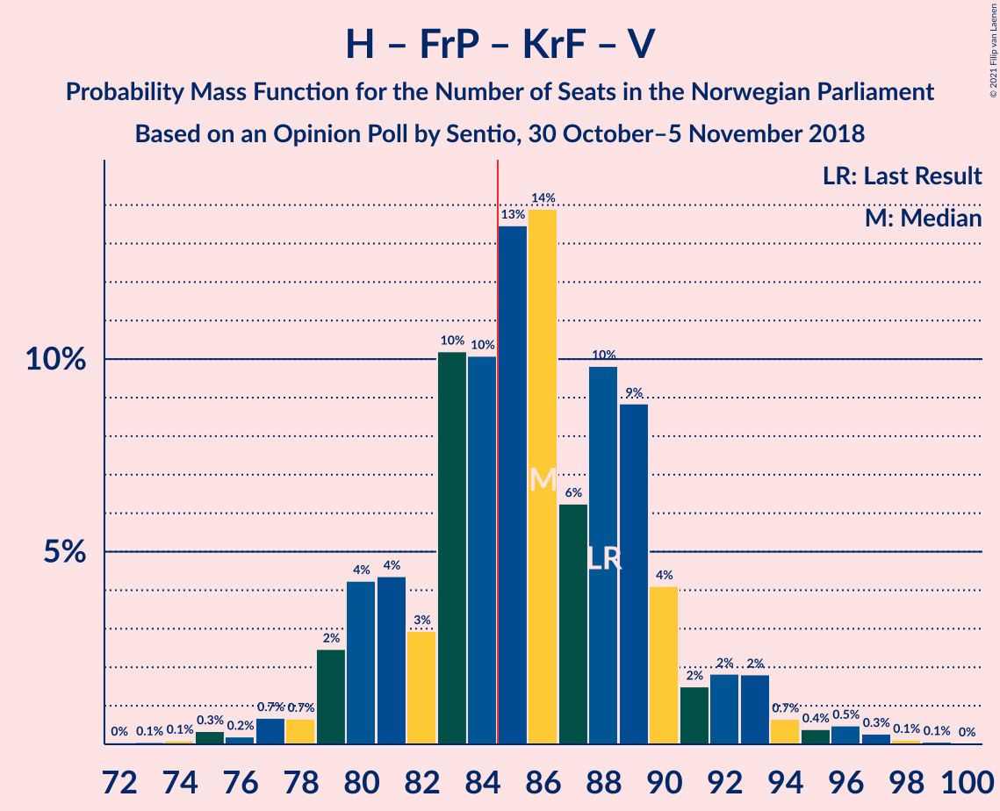
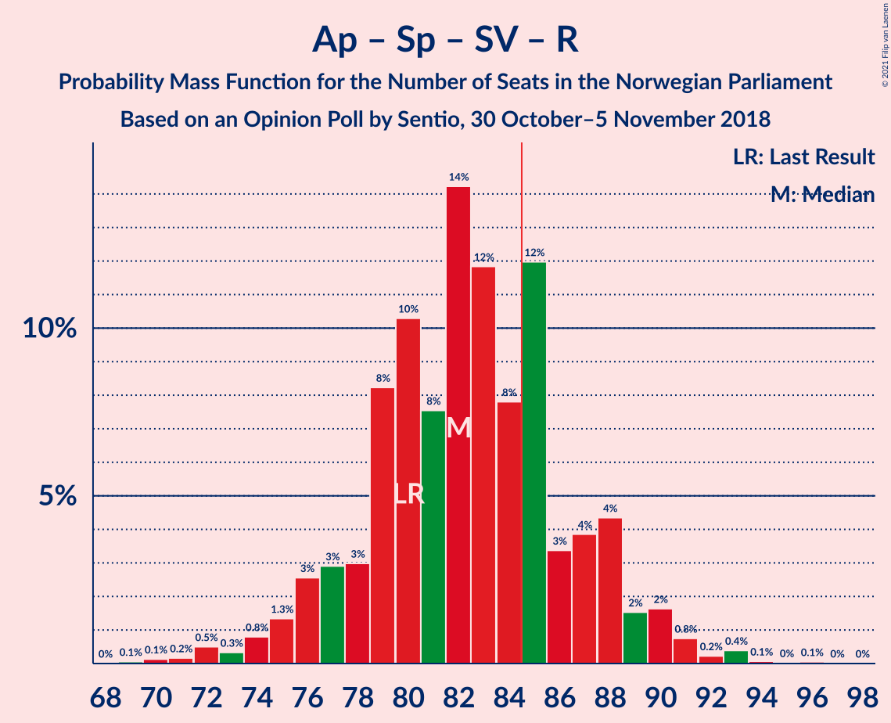
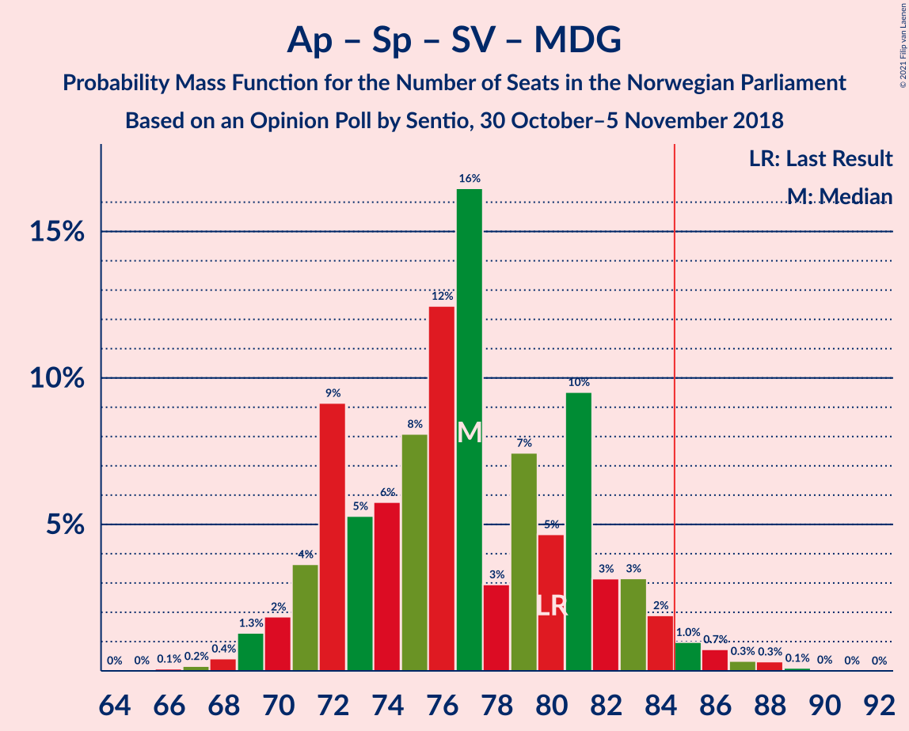
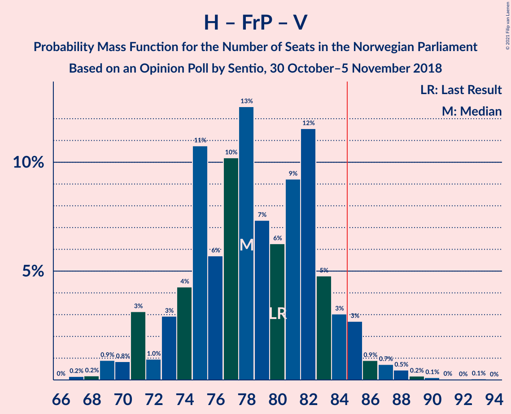
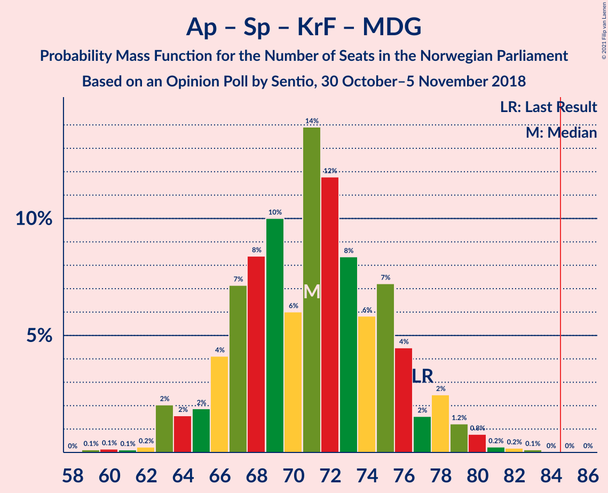
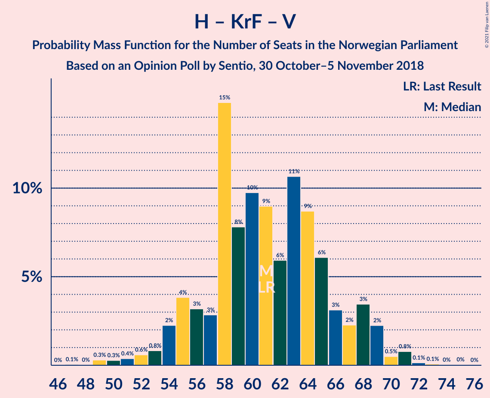

# Opinion Poll by Sentio, 30 October–5 November 2018

<a href="#voting-intentions">Voting Intentions</a> | <a href="#seats">Seats</a> | <a href="#coalitions">Coalitions</a> | <a href="#technical-information">Technical Information</a>

## Voting Intentions

### Confidence Intervals

| Party | Last Result | Poll Result | 80% Confidence Interval | 90% Confidence Interval | 95% Confidence Interval | 99% Confidence Interval |
|:-----:|:-----------:|:-----------:|:-----------------------:|:-----------------------:|:-----------------------:|:-----------------------:|
| Høyre | 25.0% | 26.9% | 24.8–29.1% |24.2–29.7% |23.7–30.3% |22.7–31.4% |
| Arbeiderpartiet | 27.4% | 25.0% | 22.9–27.2% |22.4–27.8% |21.9–28.3% |20.9–29.4% |
| Fremskrittspartiet | 15.2% | 13.6% | 12.1–15.5% |11.6–16.0% |11.3–16.4% |10.6–17.3% |
| Senterpartiet | 10.3% | 10.0% | 8.7–11.6% |8.3–12.1% |8.0–12.5% |7.4–13.3% |
| Sosialistisk Venstreparti | 6.0% | 7.5% | 6.4–9.0% |6.1–9.4% |5.8–9.8% |5.3–10.5% |
| Kristelig Folkeparti | 4.2% | 4.6% | 3.8–5.9% |3.5–6.2% |3.3–6.5% |2.9–7.1% |
| Venstre | 4.4% | 4.5% | 3.6–5.7% |3.4–6.0% |3.2–6.3% |2.8–6.9% |
| Rødt | 2.4% | 4.4% | 3.5–5.5% |3.3–5.9% |3.1–6.2% |2.7–6.8% |
| Miljøpartiet De Grønne | 3.2% | 2.5% | 1.9–3.4% |1.7–3.7% |1.5–3.9% |1.3–4.4% |

*Note:* The poll result column reflects the actual value used in the calculations. Published results may vary slightly, and in addition be rounded to fewer digits.

## Seats

### Confidence Intervals

| Party | Last Result | Median | 80% Confidence Interval | 90% Confidence Interval | 95% Confidence Interval | 99% Confidence Interval |
|:-----:|:-----------:|:------:|:-----------------------:|:-----------------------:|:-----------------------:|:-----------------------:|
| <a href="#høyre">Høyre</a> | 45 | 48 | 44–52 |42–55 |42–56 |39–56 |
| <a href="#arbeiderpartiet">Arbeiderpartiet</a> | 49 | 46 | 41–49 |41–49 |40–51 |38–57 |
| <a href="#fremskrittspartiet">Fremskrittspartiet</a> | 27 | 25 | 20–27 |20–28 |19–29 |19–31 |
| <a href="#senterpartiet">Senterpartiet</a> | 19 | 19 | 15–21 |14–22 |14–22 |13–23 |
| <a href="#sosialistisk-venstreparti">Sosialistisk Venstreparti</a> | 11 | 13 | 11–16 |10–16 |10–17 |9–19 |
| <a href="#kristelig-folkeparti">Kristelig Folkeparti</a> | 8 | 8 | 3–10 |3–10 |2–11 |1–12 |
| <a href="#venstre">Venstre</a> | 8 | 8 | 2–10 |2–11 |2–11 |2–12 |
| <a href="#rødt">Rødt</a> | 1 | 8 | 2–10 |2–10 |2–10 |1–11 |
| <a href="#miljøpartiet-de-grønne">Miljøpartiet De Grønne</a> | 1 | 1 | 0–2 |0–2 |0–2 |0–7 |

### Høyre

*For a full overview of the results for this party, see the [Høyre](party-høyre.html) page.*

| Number of Seats | Probability | Accumulated | Special Marks |
|:---------------:|:-----------:|:-----------:|:-------------:|
| 38 | 0.2% | 100% |  |
| 39 | 0.8% | 99.8% |  |
| 40 | 0.3% | 99.0% |  |
| 41 | 0.5% | 98.7% |  |
| 42 | 4% | 98% |  |
| 43 | 4% | 95% |  |
| 44 | 10% | 91% |  |
| 45 | 8% | 81% | Last Result |
| 46 | 6% | 73% |  |
| 47 | 6% | 67% |  |
| 48 | 29% | 62% | Median |
| 49 | 5% | 33% |  |
| 50 | 6% | 28% |  |
| 51 | 5% | 22% |  |
| 52 | 9% | 17% |  |
| 53 | 1.2% | 7% |  |
| 54 | 0.5% | 6% |  |
| 55 | 0.7% | 5% |  |
| 56 | 5% | 5% |  |
| 57 | 0% | 0.1% |  |
| 58 | 0% | 0.1% |  |
| 59 | 0% | 0% |  |

### Arbeiderpartiet

*For a full overview of the results for this party, see the [Arbeiderpartiet](party-arbeiderpartiet.html) page.*

| Number of Seats | Probability | Accumulated | Special Marks |
|:---------------:|:-----------:|:-----------:|:-------------:|
| 36 | 0% | 100% |  |
| 37 | 0.2% | 99.9% |  |
| 38 | 1.1% | 99.7% |  |
| 39 | 1.0% | 98.6% |  |
| 40 | 1.5% | 98% |  |
| 41 | 11% | 96% |  |
| 42 | 4% | 85% |  |
| 43 | 10% | 81% |  |
| 44 | 9% | 71% |  |
| 45 | 11% | 63% |  |
| 46 | 16% | 52% | Median |
| 47 | 12% | 37% |  |
| 48 | 3% | 24% |  |
| 49 | 17% | 21% | Last Result |
| 50 | 2% | 4% |  |
| 51 | 0.4% | 3% |  |
| 52 | 1.0% | 2% |  |
| 53 | 0.2% | 1.0% |  |
| 54 | 0.1% | 0.8% |  |
| 55 | 0.1% | 0.7% |  |
| 56 | 0% | 0.7% |  |
| 57 | 0.6% | 0.7% |  |
| 58 | 0% | 0% |  |

### Fremskrittspartiet

*For a full overview of the results for this party, see the [Fremskrittspartiet](party-fremskrittspartiet.html) page.*

| Number of Seats | Probability | Accumulated | Special Marks |
|:---------------:|:-----------:|:-----------:|:-------------:|
| 17 | 0.1% | 100% |  |
| 18 | 0.3% | 99.8% |  |
| 19 | 2% | 99.6% |  |
| 20 | 7% | 97% |  |
| 21 | 15% | 90% |  |
| 22 | 3% | 75% |  |
| 23 | 3% | 72% |  |
| 24 | 10% | 69% |  |
| 25 | 11% | 58% | Median |
| 26 | 34% | 47% |  |
| 27 | 5% | 13% | Last Result |
| 28 | 4% | 8% |  |
| 29 | 2% | 4% |  |
| 30 | 0.9% | 2% |  |
| 31 | 0.5% | 0.7% |  |
| 32 | 0.2% | 0.2% |  |
| 33 | 0% | 0% |  |

### Senterpartiet

*For a full overview of the results for this party, see the [Senterpartiet](party-senterpartiet.html) page.*

| Number of Seats | Probability | Accumulated | Special Marks |
|:---------------:|:-----------:|:-----------:|:-------------:|
| 11 | 0.2% | 100% |  |
| 12 | 0.3% | 99.8% |  |
| 13 | 2% | 99.6% |  |
| 14 | 5% | 98% |  |
| 15 | 4% | 93% |  |
| 16 | 12% | 88% |  |
| 17 | 5% | 77% |  |
| 18 | 12% | 72% |  |
| 19 | 29% | 60% | Last Result, Median |
| 20 | 16% | 30% |  |
| 21 | 9% | 14% |  |
| 22 | 4% | 6% |  |
| 23 | 1.2% | 1.4% |  |
| 24 | 0.2% | 0.3% |  |
| 25 | 0% | 0.1% |  |
| 26 | 0% | 0.1% |  |
| 27 | 0% | 0% |  |

### Sosialistisk Venstreparti

*For a full overview of the results for this party, see the [Sosialistisk Venstreparti](party-sosialistiskvenstreparti.html) page.*

| Number of Seats | Probability | Accumulated | Special Marks |
|:---------------:|:-----------:|:-----------:|:-------------:|
| 8 | 0.1% | 100% |  |
| 9 | 0.6% | 99.9% |  |
| 10 | 8% | 99.4% |  |
| 11 | 9% | 91% | Last Result |
| 12 | 26% | 82% |  |
| 13 | 17% | 56% | Median |
| 14 | 17% | 39% |  |
| 15 | 9% | 22% |  |
| 16 | 9% | 13% |  |
| 17 | 3% | 4% |  |
| 18 | 0.3% | 1.2% |  |
| 19 | 0.8% | 0.9% |  |
| 20 | 0.1% | 0.2% |  |
| 21 | 0% | 0.1% |  |
| 22 | 0% | 0% |  |

### Kristelig Folkeparti

*For a full overview of the results for this party, see the [Kristelig Folkeparti](party-kristeligfolkeparti.html) page.*

| Number of Seats | Probability | Accumulated | Special Marks |
|:---------------:|:-----------:|:-----------:|:-------------:|
| 1 | 0.6% | 100% |  |
| 2 | 3% | 99.4% |  |
| 3 | 40% | 96% |  |
| 4 | 0% | 57% |  |
| 5 | 0% | 57% |  |
| 6 | 0% | 57% |  |
| 7 | 2% | 57% |  |
| 8 | 10% | 55% | Last Result, Median |
| 9 | 25% | 45% |  |
| 10 | 17% | 20% |  |
| 11 | 3% | 4% |  |
| 12 | 0.5% | 0.7% |  |
| 13 | 0.2% | 0.3% |  |
| 14 | 0% | 0.1% |  |
| 15 | 0% | 0% |  |

### Venstre

*For a full overview of the results for this party, see the [Venstre](party-venstre.html) page.*

| Number of Seats | Probability | Accumulated | Special Marks |
|:---------------:|:-----------:|:-----------:|:-------------:|
| 2 | 30% | 100% |  |
| 3 | 5% | 70% |  |
| 4 | 0% | 65% |  |
| 5 | 0% | 65% |  |
| 6 | 0.1% | 65% |  |
| 7 | 8% | 65% |  |
| 8 | 21% | 57% | Last Result, Median |
| 9 | 21% | 35% |  |
| 10 | 9% | 14% |  |
| 11 | 4% | 5% |  |
| 12 | 0.8% | 1.0% |  |
| 13 | 0.2% | 0.2% |  |
| 14 | 0% | 0% |  |

### Rødt

*For a full overview of the results for this party, see the [Rødt](party-rødt.html) page.*

| Number of Seats | Probability | Accumulated | Special Marks |
|:---------------:|:-----------:|:-----------:|:-------------:|
| 1 | 1.3% | 100% | Last Result |
| 2 | 35% | 98.7% |  |
| 3 | 0% | 64% |  |
| 4 | 0% | 64% |  |
| 5 | 0% | 64% |  |
| 6 | 0% | 64% |  |
| 7 | 13% | 64% |  |
| 8 | 25% | 50% | Median |
| 9 | 15% | 26% |  |
| 10 | 9% | 11% |  |
| 11 | 2% | 2% |  |
| 12 | 0.4% | 0.5% |  |
| 13 | 0.1% | 0.1% |  |
| 14 | 0% | 0% |  |

### Miljøpartiet De Grønne

*For a full overview of the results for this party, see the [Miljøpartiet De Grønne](party-miljøpartietdegrønne.html) page.*

| Number of Seats | Probability | Accumulated | Special Marks |
|:---------------:|:-----------:|:-----------:|:-------------:|
| 0 | 23% | 100% |  |
| 1 | 62% | 77% | Last Result, Median |
| 2 | 12% | 14% |  |
| 3 | 1.4% | 2% |  |
| 4 | 0% | 0.6% |  |
| 5 | 0% | 0.6% |  |
| 6 | 0.1% | 0.6% |  |
| 7 | 0.3% | 0.5% |  |
| 8 | 0.2% | 0.2% |  |
| 9 | 0% | 0% |  |

## Coalitions

### Confidence Intervals

| Coalition | Last Result | Median | Majority? | 80% Confidence Interval | 90% Confidence Interval | 95% Confidence Interval | 99% Confidence Interval |
|:---------:|:-----------:|:------:|:---------:|:-----------------------:|:-----------------------:|:-----------------------:|:-----------------------:|
| Høyre – Fremskrittspartiet – Senterpartiet – Kristelig Folkeparti – Venstre | 107 | 104 | 100% | 100–108 | 97–109 | 97–111 | 95–112 |
| Høyre – Fremskrittspartiet – Kristelig Folkeparti – Venstre – Miljøpartiet De Grønne | 89 | 86 | 71% | 81–91 | 81–92 | 80–95 | 78–97 |
| Høyre – Fremskrittspartiet – Kristelig Folkeparti – Venstre | 88 | 86 | 62% | 81–89 | 80–91 | 79–93 | 77–97 |
| Arbeiderpartiet – Senterpartiet – Sosialistisk Venstreparti – Kristelig Folkeparti – Miljøpartiet De Grønne | 88 | 84 | 40% | 79–89 | 78–89 | 77–91 | 75–94 |
| Arbeiderpartiet – Senterpartiet – Sosialistisk Venstreparti – Rødt – Miljøpartiet De Grønne | 81 | 83 | 38% | 80–88 | 78–89 | 76–90 | 72–92 |
| Arbeiderpartiet – Senterpartiet – Sosialistisk Venstreparti – Rødt | 80 | 83 | 29% | 78–88 | 77–88 | 74–89 | 72–91 |
| Arbeiderpartiet – Senterpartiet – Sosialistisk Venstreparti – Miljøpartiet De Grønne | 80 | 79 | 6% | 73–82 | 70–86 | 70–86 | 68–88 |
| Høyre – Fremskrittspartiet – Venstre | 80 | 79 | 3% | 72–83 | 71–84 | 71–85 | 67–88 |
| Arbeiderpartiet – Senterpartiet – Sosialistisk Venstreparti | 79 | 77 | 5% | 72–81 | 70–85 | 69–85 | 67–87 |
| Høyre – Fremskrittspartiet | 72 | 72 | 0% | 68–76 | 66–80 | 65–80 | 64–82 |
| Arbeiderpartiet – Senterpartiet – Kristelig Folkeparti – Miljøpartiet De Grønne | 77 | 72 | 0% | 67–75 | 65–77 | 63–78 | 61–80 |
| Arbeiderpartiet – Senterpartiet – Kristelig Folkeparti | 76 | 71 | 0% | 66–75 | 64–75 | 61–76 | 60–80 |
| Arbeiderpartiet – Senterpartiet | 68 | 64 | 0% | 59–68 | 58–69 | 57–70 | 54–75 |
| Høyre – Kristelig Folkeparti – Venstre | 61 | 60 | 0% | 57–65 | 55–67 | 52–68 | 51–71 |
| Arbeiderpartiet – Sosialistisk Venstreparti | 60 | 59 | 0% | 54–63 | 53–63 | 52–64 | 49–69 |
| Senterpartiet – Kristelig Folkeparti – Venstre | 35 | 31 | 0% | 26–36 | 25–37 | 25–39 | 23–40 |

### Høyre – Fremskrittspartiet – Senterpartiet – Kristelig Folkeparti – Venstre

| Number of Seats | Probability | Accumulated | Special Marks |
|:---------------:|:-----------:|:-----------:|:-------------:|
| 91 | 0% | 100% |  |
| 92 | 0.1% | 99.9% |  |
| 93 | 0.1% | 99.9% |  |
| 94 | 0.2% | 99.7% |  |
| 95 | 0.5% | 99.6% |  |
| 96 | 1.0% | 99.1% |  |
| 97 | 4% | 98% |  |
| 98 | 2% | 94% |  |
| 99 | 1.2% | 92% |  |
| 100 | 14% | 91% |  |
| 101 | 9% | 77% |  |
| 102 | 3% | 68% |  |
| 103 | 4% | 65% |  |
| 104 | 19% | 61% |  |
| 105 | 18% | 42% |  |
| 106 | 12% | 24% |  |
| 107 | 2% | 12% | Last Result |
| 108 | 4% | 10% | Median |
| 109 | 2% | 6% |  |
| 110 | 0.7% | 4% |  |
| 111 | 3% | 4% |  |
| 112 | 0.7% | 0.9% |  |
| 113 | 0.1% | 0.2% |  |
| 114 | 0.1% | 0.2% |  |
| 115 | 0.1% | 0.1% |  |
| 116 | 0% | 0% |  |

### Høyre – Fremskrittspartiet – Kristelig Folkeparti – Venstre – Miljøpartiet De Grønne

| Number of Seats | Probability | Accumulated | Special Marks |
|:---------------:|:-----------:|:-----------:|:-------------:|
| 75 | 0.1% | 100% |  |
| 76 | 0.2% | 99.9% |  |
| 77 | 0.1% | 99.7% |  |
| 78 | 1.0% | 99.6% |  |
| 79 | 0.8% | 98.6% |  |
| 80 | 1.1% | 98% |  |
| 81 | 9% | 97% |  |
| 82 | 7% | 88% |  |
| 83 | 6% | 81% |  |
| 84 | 5% | 75% |  |
| 85 | 12% | 71% | Majority |
| 86 | 12% | 59% |  |
| 87 | 23% | 47% |  |
| 88 | 4% | 24% |  |
| 89 | 9% | 21% | Last Result |
| 90 | 1.1% | 12% | Median |
| 91 | 2% | 11% |  |
| 92 | 4% | 9% |  |
| 93 | 0.3% | 5% |  |
| 94 | 0.9% | 4% |  |
| 95 | 2% | 3% |  |
| 96 | 0% | 2% |  |
| 97 | 1.5% | 2% |  |
| 98 | 0.1% | 0.2% |  |
| 99 | 0% | 0.1% |  |
| 100 | 0% | 0% |  |

### Høyre – Fremskrittspartiet – Kristelig Folkeparti – Venstre

| Number of Seats | Probability | Accumulated | Special Marks |
|:---------------:|:-----------:|:-----------:|:-------------:|
| 74 | 0.1% | 100% |  |
| 75 | 0.1% | 99.8% |  |
| 76 | 0.1% | 99.7% |  |
| 77 | 0.8% | 99.6% |  |
| 78 | 1.0% | 98.8% |  |
| 79 | 2% | 98% |  |
| 80 | 3% | 96% |  |
| 81 | 13% | 93% |  |
| 82 | 6% | 80% |  |
| 83 | 4% | 74% |  |
| 84 | 9% | 71% |  |
| 85 | 12% | 62% | Majority |
| 86 | 27% | 51% |  |
| 87 | 4% | 23% |  |
| 88 | 8% | 20% | Last Result |
| 89 | 3% | 12% | Median |
| 90 | 1.2% | 9% |  |
| 91 | 3% | 8% |  |
| 92 | 0.8% | 5% |  |
| 93 | 1.5% | 4% |  |
| 94 | 0.6% | 2% |  |
| 95 | 0.2% | 2% |  |
| 96 | 0% | 2% |  |
| 97 | 1.5% | 2% |  |
| 98 | 0% | 0% |  |

### Arbeiderpartiet – Senterpartiet – Sosialistisk Venstreparti – Kristelig Folkeparti – Miljøpartiet De Grønne

| Number of Seats | Probability | Accumulated | Special Marks |
|:---------------:|:-----------:|:-----------:|:-------------:|
| 72 | 0.1% | 100% |  |
| 73 | 0% | 99.9% |  |
| 74 | 0.1% | 99.8% |  |
| 75 | 0.4% | 99.7% |  |
| 76 | 0.1% | 99.3% |  |
| 77 | 3% | 99.2% |  |
| 78 | 5% | 97% |  |
| 79 | 5% | 92% |  |
| 80 | 1.3% | 86% |  |
| 81 | 3% | 85% |  |
| 82 | 11% | 82% |  |
| 83 | 8% | 71% |  |
| 84 | 23% | 63% |  |
| 85 | 7% | 40% | Majority |
| 86 | 8% | 33% |  |
| 87 | 0.4% | 25% | Median |
| 88 | 5% | 25% | Last Result |
| 89 | 15% | 20% |  |
| 90 | 0.7% | 5% |  |
| 91 | 2% | 4% |  |
| 92 | 0.3% | 2% |  |
| 93 | 0.3% | 2% |  |
| 94 | 1.0% | 1.4% |  |
| 95 | 0.3% | 0.4% |  |
| 96 | 0.1% | 0.2% |  |
| 97 | 0.1% | 0.1% |  |
| 98 | 0% | 0% |  |

### Arbeiderpartiet – Senterpartiet – Sosialistisk Venstreparti – Rødt – Miljøpartiet De Grønne

| Number of Seats | Probability | Accumulated | Special Marks |
|:---------------:|:-----------:|:-----------:|:-------------:|
| 72 | 1.5% | 100% |  |
| 73 | 0% | 98% |  |
| 74 | 0.2% | 98% |  |
| 75 | 0.6% | 98% |  |
| 76 | 1.5% | 98% |  |
| 77 | 0.8% | 96% |  |
| 78 | 3% | 95% |  |
| 79 | 1.2% | 92% |  |
| 80 | 3% | 91% |  |
| 81 | 8% | 88% | Last Result |
| 82 | 4% | 80% |  |
| 83 | 27% | 77% |  |
| 84 | 12% | 49% |  |
| 85 | 9% | 38% | Majority |
| 86 | 4% | 29% |  |
| 87 | 6% | 26% | Median |
| 88 | 13% | 20% |  |
| 89 | 3% | 7% |  |
| 90 | 2% | 4% |  |
| 91 | 1.0% | 2% |  |
| 92 | 0.8% | 1.2% |  |
| 93 | 0.1% | 0.4% |  |
| 94 | 0.1% | 0.3% |  |
| 95 | 0.1% | 0.2% |  |
| 96 | 0% | 0% |  |

### Arbeiderpartiet – Senterpartiet – Sosialistisk Venstreparti – Rødt

| Number of Seats | Probability | Accumulated | Special Marks |
|:---------------:|:-----------:|:-----------:|:-------------:|
| 70 | 0% | 100% |  |
| 71 | 0.1% | 99.9% |  |
| 72 | 1.5% | 99.8% |  |
| 73 | 0% | 98% |  |
| 74 | 2% | 98% |  |
| 75 | 0.9% | 97% |  |
| 76 | 0.3% | 96% |  |
| 77 | 4% | 95% |  |
| 78 | 2% | 91% |  |
| 79 | 1.1% | 89% |  |
| 80 | 9% | 88% | Last Result |
| 81 | 4% | 79% |  |
| 82 | 23% | 76% |  |
| 83 | 12% | 53% |  |
| 84 | 12% | 41% |  |
| 85 | 5% | 29% | Majority |
| 86 | 6% | 25% | Median |
| 87 | 7% | 19% |  |
| 88 | 9% | 12% |  |
| 89 | 1.1% | 3% |  |
| 90 | 0.8% | 2% |  |
| 91 | 1.0% | 1.4% |  |
| 92 | 0.1% | 0.4% |  |
| 93 | 0.2% | 0.3% |  |
| 94 | 0.1% | 0.1% |  |
| 95 | 0% | 0% |  |

### Arbeiderpartiet – Senterpartiet – Sosialistisk Venstreparti – Miljøpartiet De Grønne

| Number of Seats | Probability | Accumulated | Special Marks |
|:---------------:|:-----------:|:-----------:|:-------------:|
| 66 | 0% | 100% |  |
| 67 | 0.2% | 99.9% |  |
| 68 | 0.3% | 99.7% |  |
| 69 | 1.2% | 99.5% |  |
| 70 | 4% | 98% |  |
| 71 | 2% | 94% |  |
| 72 | 0.7% | 92% |  |
| 73 | 4% | 91% |  |
| 74 | 10% | 87% |  |
| 75 | 12% | 77% |  |
| 76 | 3% | 65% |  |
| 77 | 7% | 62% |  |
| 78 | 6% | 56% |  |
| 79 | 15% | 50% | Median |
| 80 | 2% | 35% | Last Result |
| 81 | 18% | 32% |  |
| 82 | 5% | 14% |  |
| 83 | 3% | 9% |  |
| 84 | 0.2% | 6% |  |
| 85 | 0.9% | 6% | Majority |
| 86 | 4% | 5% |  |
| 87 | 0.3% | 1.4% |  |
| 88 | 1.1% | 1.2% |  |
| 89 | 0.1% | 0.1% |  |
| 90 | 0% | 0% |  |

### Høyre – Fremskrittspartiet – Venstre

| Number of Seats | Probability | Accumulated | Special Marks |
|:---------------:|:-----------:|:-----------:|:-------------:|
| 66 | 0% | 100% |  |
| 67 | 0.8% | 99.9% |  |
| 68 | 0.2% | 99.1% |  |
| 69 | 0.6% | 98.9% |  |
| 70 | 0.1% | 98% |  |
| 71 | 8% | 98% |  |
| 72 | 0.8% | 90% |  |
| 73 | 3% | 89% |  |
| 74 | 4% | 87% |  |
| 75 | 5% | 83% |  |
| 76 | 4% | 78% |  |
| 77 | 13% | 73% |  |
| 78 | 9% | 60% |  |
| 79 | 10% | 51% |  |
| 80 | 4% | 41% | Last Result |
| 81 | 2% | 37% | Median |
| 82 | 8% | 35% |  |
| 83 | 20% | 27% |  |
| 84 | 4% | 7% |  |
| 85 | 0.3% | 3% | Majority |
| 86 | 0.3% | 2% |  |
| 87 | 0.1% | 2% |  |
| 88 | 2% | 2% |  |
| 89 | 0.2% | 0.3% |  |
| 90 | 0.1% | 0.1% |  |
| 91 | 0% | 0% |  |

### Arbeiderpartiet – Senterpartiet – Sosialistisk Venstreparti

| Number of Seats | Probability | Accumulated | Special Marks |
|:---------------:|:-----------:|:-----------:|:-------------:|
| 64 | 0.1% | 100% |  |
| 65 | 0% | 99.9% |  |
| 66 | 0.1% | 99.9% |  |
| 67 | 1.1% | 99.8% |  |
| 68 | 0.4% | 98.6% |  |
| 69 | 3% | 98% |  |
| 70 | 3% | 96% |  |
| 71 | 2% | 93% |  |
| 72 | 4% | 91% |  |
| 73 | 9% | 87% |  |
| 74 | 10% | 77% |  |
| 75 | 6% | 67% |  |
| 76 | 7% | 61% |  |
| 77 | 4% | 54% |  |
| 78 | 8% | 50% | Median |
| 79 | 12% | 42% | Last Result |
| 80 | 16% | 30% |  |
| 81 | 5% | 14% |  |
| 82 | 2% | 9% |  |
| 83 | 2% | 7% |  |
| 84 | 0.3% | 6% |  |
| 85 | 4% | 5% | Majority |
| 86 | 0.7% | 1.4% |  |
| 87 | 0.6% | 0.7% |  |
| 88 | 0.1% | 0.1% |  |
| 89 | 0% | 0% |  |

### Høyre – Fremskrittspartiet

| Number of Seats | Probability | Accumulated | Special Marks |
|:---------------:|:-----------:|:-----------:|:-------------:|
| 60 | 0.1% | 100% |  |
| 61 | 0.1% | 99.9% |  |
| 62 | 0.1% | 99.9% |  |
| 63 | 0.1% | 99.8% |  |
| 64 | 0.5% | 99.6% |  |
| 65 | 2% | 99.1% |  |
| 66 | 3% | 97% |  |
| 67 | 2% | 94% |  |
| 68 | 2% | 91% |  |
| 69 | 16% | 89% |  |
| 70 | 7% | 73% |  |
| 71 | 11% | 66% |  |
| 72 | 8% | 55% | Last Result |
| 73 | 5% | 47% | Median |
| 74 | 18% | 42% |  |
| 75 | 11% | 25% |  |
| 76 | 6% | 14% |  |
| 77 | 0.3% | 8% |  |
| 78 | 0.3% | 7% |  |
| 79 | 0.4% | 7% |  |
| 80 | 6% | 6% |  |
| 81 | 0.1% | 0.7% |  |
| 82 | 0.5% | 0.5% |  |
| 83 | 0.1% | 0.1% |  |
| 84 | 0% | 0% |  |

### Arbeiderpartiet – Senterpartiet – Kristelig Folkeparti – Miljøpartiet De Grønne

| Number of Seats | Probability | Accumulated | Special Marks |
|:---------------:|:-----------:|:-----------:|:-------------:|
| 58 | 0.1% | 100% |  |
| 59 | 0% | 99.9% |  |
| 60 | 0.1% | 99.9% |  |
| 61 | 0.4% | 99.8% |  |
| 62 | 0.2% | 99.4% |  |
| 63 | 2% | 99.2% |  |
| 64 | 0.6% | 97% |  |
| 65 | 2% | 96% |  |
| 66 | 4% | 95% |  |
| 67 | 4% | 91% |  |
| 68 | 8% | 87% |  |
| 69 | 10% | 79% |  |
| 70 | 11% | 69% |  |
| 71 | 5% | 58% |  |
| 72 | 15% | 54% |  |
| 73 | 16% | 38% |  |
| 74 | 5% | 22% | Median |
| 75 | 11% | 18% |  |
| 76 | 2% | 7% |  |
| 77 | 3% | 5% | Last Result |
| 78 | 0.2% | 3% |  |
| 79 | 0.9% | 2% |  |
| 80 | 1.2% | 2% |  |
| 81 | 0.1% | 0.4% |  |
| 82 | 0.1% | 0.2% |  |
| 83 | 0% | 0.1% |  |
| 84 | 0.1% | 0.1% |  |
| 85 | 0% | 0% | Majority |

### Arbeiderpartiet – Senterpartiet – Kristelig Folkeparti

| Number of Seats | Probability | Accumulated | Special Marks |
|:---------------:|:-----------:|:-----------:|:-------------:|
| 57 | 0.1% | 100% |  |
| 58 | 0.1% | 99.9% |  |
| 59 | 0% | 99.8% |  |
| 60 | 0.4% | 99.8% |  |
| 61 | 2% | 99.4% |  |
| 62 | 0.4% | 97% |  |
| 63 | 0.7% | 97% |  |
| 64 | 2% | 96% |  |
| 65 | 4% | 94% |  |
| 66 | 3% | 91% |  |
| 67 | 10% | 87% |  |
| 68 | 9% | 77% |  |
| 69 | 6% | 69% |  |
| 70 | 10% | 63% |  |
| 71 | 15% | 53% |  |
| 72 | 17% | 38% |  |
| 73 | 4% | 21% | Median |
| 74 | 3% | 17% |  |
| 75 | 9% | 14% |  |
| 76 | 2% | 5% | Last Result |
| 77 | 0.3% | 2% |  |
| 78 | 0.8% | 2% |  |
| 79 | 0.2% | 1.4% |  |
| 80 | 1.0% | 1.1% |  |
| 81 | 0% | 0.2% |  |
| 82 | 0.1% | 0.1% |  |
| 83 | 0.1% | 0.1% |  |
| 84 | 0% | 0% |  |

### Arbeiderpartiet – Senterpartiet

| Number of Seats | Probability | Accumulated | Special Marks |
|:---------------:|:-----------:|:-----------:|:-------------:|
| 52 | 0.1% | 100% |  |
| 53 | 0.1% | 99.9% |  |
| 54 | 0.3% | 99.8% |  |
| 55 | 0.3% | 99.5% |  |
| 56 | 1.4% | 99.1% |  |
| 57 | 2% | 98% |  |
| 58 | 4% | 96% |  |
| 59 | 9% | 92% |  |
| 60 | 2% | 83% |  |
| 61 | 7% | 80% |  |
| 62 | 7% | 74% |  |
| 63 | 15% | 66% |  |
| 64 | 7% | 52% |  |
| 65 | 12% | 44% | Median |
| 66 | 7% | 32% |  |
| 67 | 3% | 26% |  |
| 68 | 15% | 23% | Last Result |
| 69 | 5% | 8% |  |
| 70 | 2% | 3% |  |
| 71 | 0.2% | 1.1% |  |
| 72 | 0.1% | 0.9% |  |
| 73 | 0.1% | 0.8% |  |
| 74 | 0% | 0.7% |  |
| 75 | 0.6% | 0.7% |  |
| 76 | 0% | 0% |  |

### Høyre – Kristelig Folkeparti – Venstre

| Number of Seats | Probability | Accumulated | Special Marks |
|:---------------:|:-----------:|:-----------:|:-------------:|
| 46 | 0.1% | 100% |  |
| 47 | 0% | 99.9% |  |
| 48 | 0% | 99.9% |  |
| 49 | 0% | 99.9% |  |
| 50 | 0.1% | 99.9% |  |
| 51 | 0.6% | 99.9% |  |
| 52 | 2% | 99.2% |  |
| 53 | 1.1% | 97% |  |
| 54 | 0.5% | 96% |  |
| 55 | 4% | 95% |  |
| 56 | 1.2% | 91% |  |
| 57 | 8% | 90% |  |
| 58 | 3% | 82% |  |
| 59 | 5% | 79% |  |
| 60 | 27% | 74% |  |
| 61 | 10% | 47% | Last Result |
| 62 | 8% | 37% |  |
| 63 | 3% | 29% |  |
| 64 | 11% | 25% | Median |
| 65 | 7% | 14% |  |
| 66 | 2% | 7% |  |
| 67 | 0.4% | 5% |  |
| 68 | 3% | 5% |  |
| 69 | 0.4% | 2% |  |
| 70 | 0.2% | 1.3% |  |
| 71 | 0.9% | 1.1% |  |
| 72 | 0% | 0.1% |  |
| 73 | 0% | 0.1% |  |
| 74 | 0% | 0% |  |

### Arbeiderpartiet – Sosialistisk Venstreparti

| Number of Seats | Probability | Accumulated | Special Marks |
|:---------------:|:-----------:|:-----------:|:-------------:|
| 47 | 0% | 100% |  |
| 48 | 0% | 99.9% |  |
| 49 | 0.9% | 99.9% |  |
| 50 | 0.3% | 99.0% |  |
| 51 | 0.5% | 98.8% |  |
| 52 | 3% | 98% |  |
| 53 | 0.8% | 96% |  |
| 54 | 6% | 95% |  |
| 55 | 8% | 89% |  |
| 56 | 11% | 81% |  |
| 57 | 10% | 70% |  |
| 58 | 6% | 60% |  |
| 59 | 11% | 54% | Median |
| 60 | 15% | 44% | Last Result |
| 61 | 17% | 29% |  |
| 62 | 1.1% | 12% |  |
| 63 | 6% | 11% |  |
| 64 | 2% | 4% |  |
| 65 | 0.1% | 2% |  |
| 66 | 0.4% | 2% |  |
| 67 | 0.3% | 2% |  |
| 68 | 0.7% | 1.4% |  |
| 69 | 0.7% | 0.7% |  |
| 70 | 0.1% | 0.1% |  |
| 71 | 0% | 0% |  |

### Senterpartiet – Kristelig Folkeparti – Venstre

| Number of Seats | Probability | Accumulated | Special Marks |
|:---------------:|:-----------:|:-----------:|:-------------:|
| 21 | 0.1% | 100% |  |
| 22 | 0.3% | 99.9% |  |
| 23 | 0.7% | 99.6% |  |
| 24 | 1.0% | 99.0% |  |
| 25 | 3% | 98% |  |
| 26 | 5% | 95% |  |
| 27 | 8% | 90% |  |
| 28 | 0.7% | 82% |  |
| 29 | 8% | 81% |  |
| 30 | 0.9% | 72% |  |
| 31 | 30% | 71% |  |
| 32 | 10% | 42% |  |
| 33 | 12% | 32% |  |
| 34 | 4% | 20% |  |
| 35 | 5% | 16% | Last Result, Median |
| 36 | 2% | 11% |  |
| 37 | 5% | 9% |  |
| 38 | 0.3% | 4% |  |
| 39 | 3% | 4% |  |
| 40 | 1.1% | 1.4% |  |
| 41 | 0.1% | 0.3% |  |
| 42 | 0% | 0.2% |  |
| 43 | 0.2% | 0.2% |  |
| 44 | 0% | 0% |  |

## Technical Information

### Opinion Poll

+ **Polling firm:** Sentio
+ **Commissioner(s):** —
+ **Fieldwork period:** 30 October–5 November 2018

### Calculations

+ **Sample size:** 689
+ **Simulations done:** 131,072
+ **Error estimate:** 2.45%

