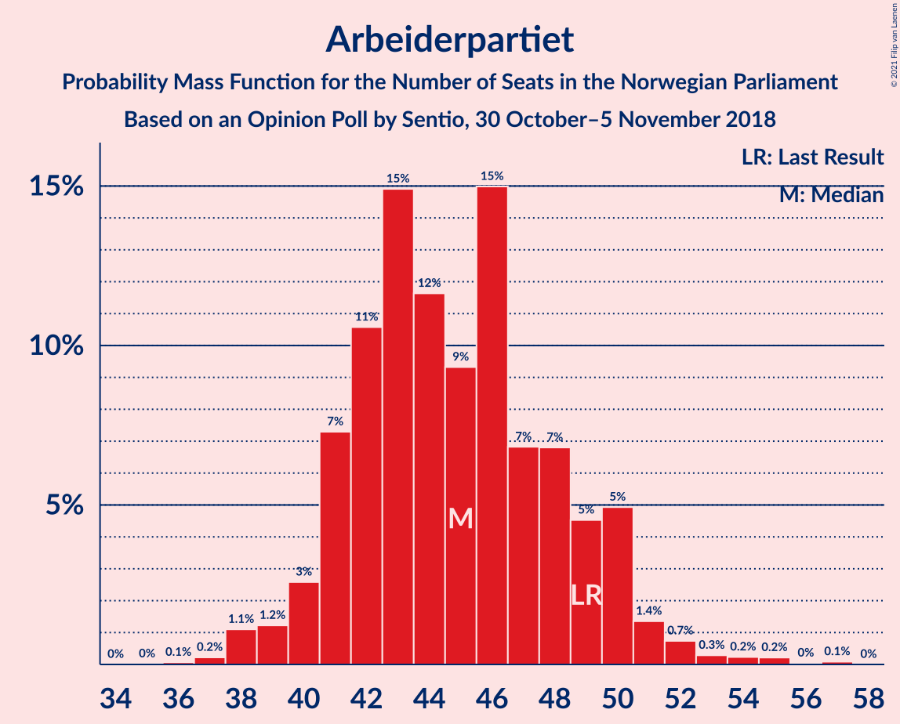
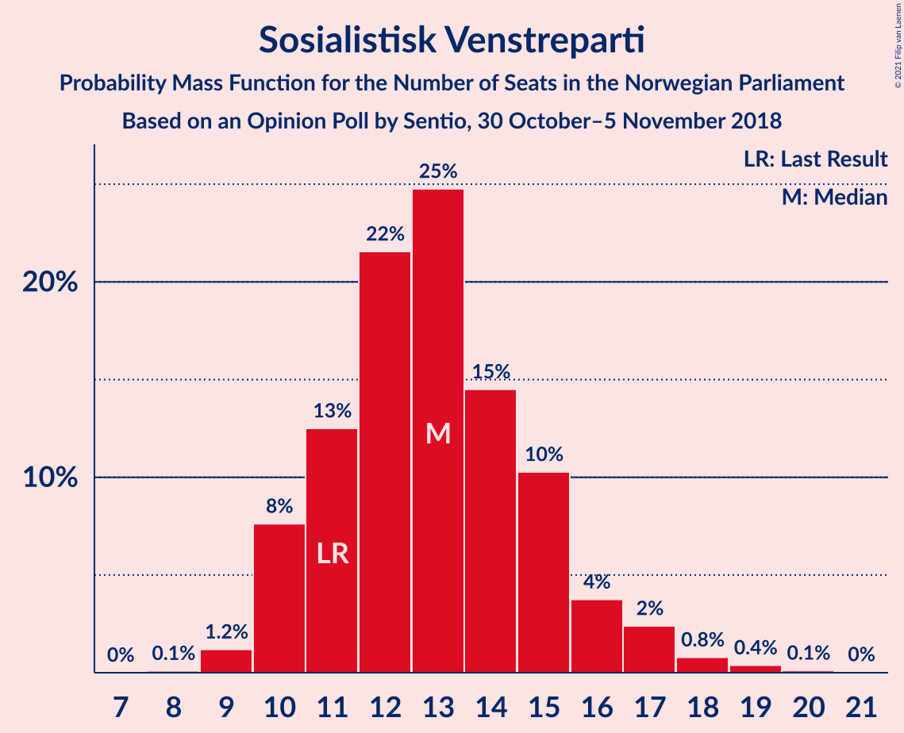
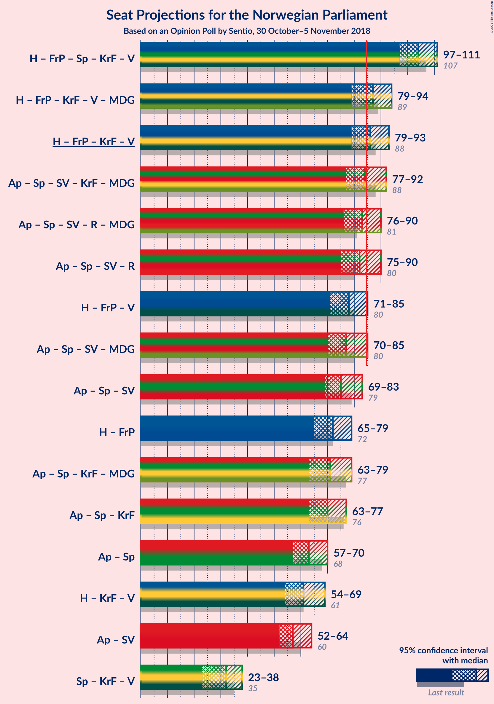
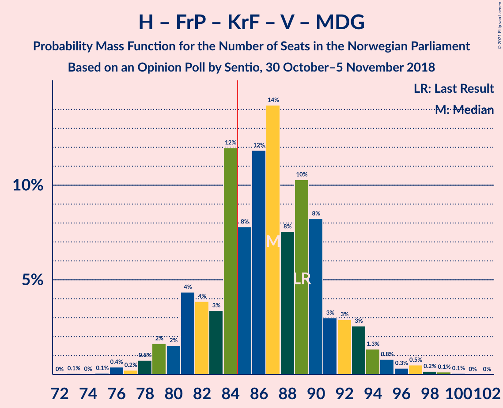
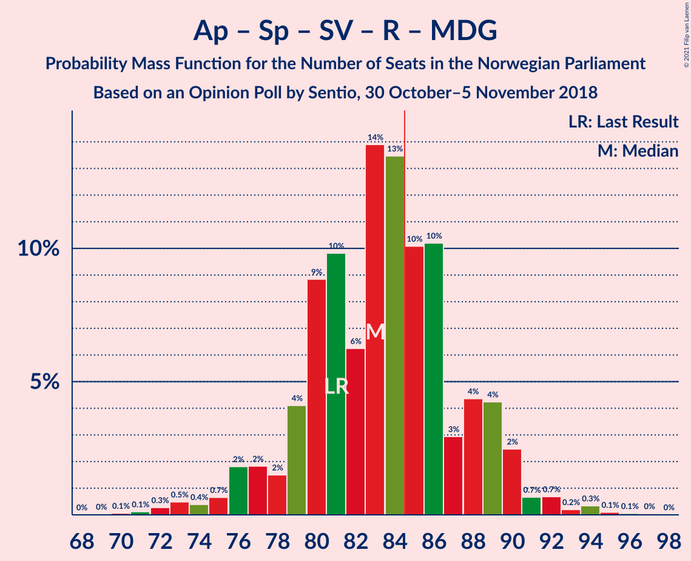
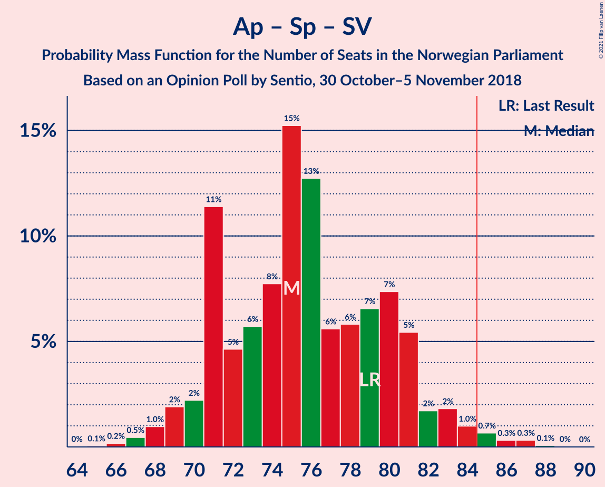
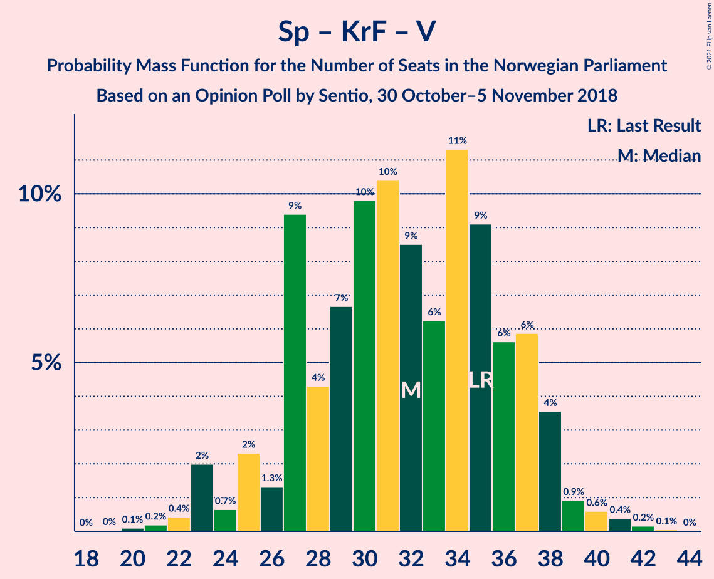

# Opinion Poll by Sentio, 30 October–5 November 2018

<a href="#voting-intentions">Voting Intentions</a> | <a href="#seats">Seats</a> | <a href="#coalitions">Coalitions</a> | <a href="#technical-information">Technical Information</a>

## Voting Intentions

### Confidence Intervals

| Party | Last Result | Poll Result | 80% Confidence Interval | 90% Confidence Interval | 95% Confidence Interval | 99% Confidence Interval |
|:-----:|:-----------:|:-----------:|:-----------------------:|:-----------------------:|:-----------------------:|:-----------------------:|
| Høyre | 25.0% | 26.9% | 24.8–29.1% |24.2–29.7% |23.7–30.3% |22.7–31.4% |
| Arbeiderpartiet | 27.4% | 25.0% | 22.9–27.2% |22.4–27.8% |21.9–28.3% |20.9–29.4% |
| Fremskrittspartiet | 15.2% | 13.6% | 12.1–15.5% |11.6–16.0% |11.3–16.4% |10.6–17.3% |
| Senterpartiet | 10.3% | 10.0% | 8.7–11.6% |8.3–12.1% |8.0–12.5% |7.4–13.3% |
| Sosialistisk Venstreparti | 6.0% | 7.5% | 6.4–9.0% |6.1–9.4% |5.8–9.8% |5.3–10.5% |
| Kristelig Folkeparti | 4.2% | 4.6% | 3.8–5.9% |3.5–6.2% |3.3–6.5% |2.9–7.1% |
| Venstre | 4.4% | 4.5% | 3.6–5.7% |3.4–6.0% |3.2–6.3% |2.8–6.9% |
| Rødt | 2.4% | 4.4% | 3.5–5.5% |3.3–5.9% |3.1–6.2% |2.7–6.8% |
| Miljøpartiet De Grønne | 3.2% | 2.5% | 1.9–3.4% |1.7–3.7% |1.5–3.9% |1.3–4.4% |

*Note:* The poll result column reflects the actual value used in the calculations. Published results may vary slightly, and in addition be rounded to fewer digits.

## Seats

### Confidence Intervals

| Party | Last Result | Median | 80% Confidence Interval | 90% Confidence Interval | 95% Confidence Interval | 99% Confidence Interval |
|:-----:|:-----------:|:------:|:-----------------------:|:-----------------------:|:-----------------------:|:-----------------------:|
| <a href="#høyre">Høyre</a> | 45 | 47 | 43–52 |42–52 |42–54 |39–56 |
| <a href="#arbeiderpartiet">Arbeiderpartiet</a> | 49 | 45 | 41–49 |40–50 |39–51 |38–54 |
| <a href="#fremskrittspartiet">Fremskrittspartiet</a> | 27 | 25 | 21–27 |20–28 |20–29 |18–30 |
| <a href="#senterpartiet">Senterpartiet</a> | 19 | 18 | 16–20 |15–21 |14–22 |12–23 |
| <a href="#sosialistisk-venstreparti">Sosialistisk Venstreparti</a> | 11 | 13 | 11–15 |10–16 |10–17 |9–19 |
| <a href="#kristelig-folkeparti">Kristelig Folkeparti</a> | 8 | 8 | 3–10 |3–11 |2–11 |1–12 |
| <a href="#venstre">Venstre</a> | 8 | 8 | 2–10 |2–10 |2–11 |2–12 |
| <a href="#rødt">Rødt</a> | 1 | 8 | 2–9 |2–10 |2–10 |1–11 |
| <a href="#miljøpartiet-de-grønne">Miljøpartiet De Grønne</a> | 1 | 1 | 0–2 |0–2 |0–2 |0–7 |

### Høyre

*For a full overview of the results for this party, see the [Høyre](party-høyre.html) page.*

| Number of Seats | Probability | Accumulated | Special Marks |
|:---------------:|:-----------:|:-----------:|:-------------:|
| 38 | 0.2% | 100% |  |
| 39 | 0.4% | 99.8% |  |
| 40 | 0.4% | 99.3% |  |
| 41 | 0.9% | 98.9% |  |
| 42 | 4% | 98% |  |
| 43 | 6% | 94% |  |
| 44 | 9% | 88% |  |
| 45 | 14% | 79% | Last Result |
| 46 | 6% | 65% |  |
| 47 | 9% | 59% | Median |
| 48 | 14% | 50% |  |
| 49 | 9% | 35% |  |
| 50 | 5% | 26% |  |
| 51 | 10% | 21% |  |
| 52 | 6% | 10% |  |
| 53 | 1.5% | 4% |  |
| 54 | 1.1% | 3% |  |
| 55 | 0.6% | 2% |  |
| 56 | 0.8% | 1.1% |  |
| 57 | 0.2% | 0.3% |  |
| 58 | 0.1% | 0.1% |  |
| 59 | 0% | 0.1% |  |
| 60 | 0% | 0% |  |

### Arbeiderpartiet

*For a full overview of the results for this party, see the [Arbeiderpartiet](party-arbeiderpartiet.html) page.*

| Number of Seats | Probability | Accumulated | Special Marks |
|:---------------:|:-----------:|:-----------:|:-------------:|
| 36 | 0.1% | 100% |  |
| 37 | 0.2% | 99.9% |  |
| 38 | 1.1% | 99.7% |  |
| 39 | 1.2% | 98.6% |  |
| 40 | 3% | 97% |  |
| 41 | 7% | 95% |  |
| 42 | 11% | 87% |  |
| 43 | 15% | 77% |  |
| 44 | 12% | 62% |  |
| 45 | 9% | 50% | Median |
| 46 | 15% | 41% |  |
| 47 | 7% | 26% |  |
| 48 | 7% | 19% |  |
| 49 | 5% | 12% | Last Result |
| 50 | 5% | 8% |  |
| 51 | 1.4% | 3% |  |
| 52 | 0.7% | 2% |  |
| 53 | 0.3% | 0.9% |  |
| 54 | 0.2% | 0.6% |  |
| 55 | 0.2% | 0.4% |  |
| 56 | 0% | 0.1% |  |
| 57 | 0.1% | 0.1% |  |
| 58 | 0% | 0% |  |

### Fremskrittspartiet

*For a full overview of the results for this party, see the [Fremskrittspartiet](party-fremskrittspartiet.html) page.*

| Number of Seats | Probability | Accumulated | Special Marks |
|:---------------:|:-----------:|:-----------:|:-------------:|
| 17 | 0.2% | 100% |  |
| 18 | 0.6% | 99.8% |  |
| 19 | 1.2% | 99.2% |  |
| 20 | 4% | 98% |  |
| 21 | 10% | 94% |  |
| 22 | 6% | 84% |  |
| 23 | 6% | 79% |  |
| 24 | 9% | 73% |  |
| 25 | 31% | 64% | Median |
| 26 | 17% | 33% |  |
| 27 | 8% | 16% | Last Result |
| 28 | 5% | 8% |  |
| 29 | 2% | 3% |  |
| 30 | 0.7% | 1.0% |  |
| 31 | 0.1% | 0.3% |  |
| 32 | 0.1% | 0.2% |  |
| 33 | 0.1% | 0.1% |  |
| 34 | 0% | 0% |  |

### Senterpartiet

*For a full overview of the results for this party, see the [Senterpartiet](party-senterpartiet.html) page.*

| Number of Seats | Probability | Accumulated | Special Marks |
|:---------------:|:-----------:|:-----------:|:-------------:|
| 11 | 0.1% | 100% |  |
| 12 | 0.5% | 99.9% |  |
| 13 | 0.7% | 99.4% |  |
| 14 | 2% | 98.8% |  |
| 15 | 5% | 96% |  |
| 16 | 9% | 92% |  |
| 17 | 21% | 83% |  |
| 18 | 19% | 62% | Median |
| 19 | 24% | 43% | Last Result |
| 20 | 11% | 19% |  |
| 21 | 5% | 8% |  |
| 22 | 3% | 3% |  |
| 23 | 0.6% | 0.9% |  |
| 24 | 0.1% | 0.3% |  |
| 25 | 0.1% | 0.1% |  |
| 26 | 0% | 0% |  |

### Sosialistisk Venstreparti

*For a full overview of the results for this party, see the [Sosialistisk Venstreparti](party-sosialistiskvenstreparti.html) page.*

| Number of Seats | Probability | Accumulated | Special Marks |
|:---------------:|:-----------:|:-----------:|:-------------:|
| 8 | 0.1% | 100% |  |
| 9 | 1.2% | 99.9% |  |
| 10 | 8% | 98.7% |  |
| 11 | 13% | 91% | Last Result |
| 12 | 22% | 79% |  |
| 13 | 25% | 57% | Median |
| 14 | 15% | 32% |  |
| 15 | 10% | 18% |  |
| 16 | 4% | 7% |  |
| 17 | 2% | 4% |  |
| 18 | 0.8% | 1.3% |  |
| 19 | 0.4% | 0.5% |  |
| 20 | 0.1% | 0.2% |  |
| 21 | 0% | 0% |  |

### Kristelig Folkeparti

*For a full overview of the results for this party, see the [Kristelig Folkeparti](party-kristeligfolkeparti.html) page.*

| Number of Seats | Probability | Accumulated | Special Marks |
|:---------------:|:-----------:|:-----------:|:-------------:|
| 1 | 0.9% | 100% |  |
| 2 | 2% | 99.1% |  |
| 3 | 25% | 97% |  |
| 4 | 0% | 72% |  |
| 5 | 0% | 72% |  |
| 6 | 0% | 72% |  |
| 7 | 9% | 72% |  |
| 8 | 24% | 64% | Last Result, Median |
| 9 | 22% | 40% |  |
| 10 | 12% | 17% |  |
| 11 | 4% | 6% |  |
| 12 | 1.4% | 2% |  |
| 13 | 0.3% | 0.4% |  |
| 14 | 0% | 0.1% |  |
| 15 | 0% | 0% |  |

### Venstre

*For a full overview of the results for this party, see the [Venstre](party-venstre.html) page.*

| Number of Seats | Probability | Accumulated | Special Marks |
|:---------------:|:-----------:|:-----------:|:-------------:|
| 2 | 29% | 100% |  |
| 3 | 0.8% | 71% |  |
| 4 | 0% | 70% |  |
| 5 | 0% | 70% |  |
| 6 | 0% | 70% |  |
| 7 | 12% | 70% |  |
| 8 | 28% | 58% | Last Result, Median |
| 9 | 15% | 30% |  |
| 10 | 11% | 15% |  |
| 11 | 3% | 4% |  |
| 12 | 0.5% | 0.6% |  |
| 13 | 0.1% | 0.1% |  |
| 14 | 0% | 0% |  |

### Rødt

*For a full overview of the results for this party, see the [Rødt](party-rødt.html) page.*

| Number of Seats | Probability | Accumulated | Special Marks |
|:---------------:|:-----------:|:-----------:|:-------------:|
| 1 | 1.2% | 100% | Last Result |
| 2 | 26% | 98.8% |  |
| 3 | 0% | 73% |  |
| 4 | 0% | 73% |  |
| 5 | 0% | 73% |  |
| 6 | 0.1% | 73% |  |
| 7 | 13% | 73% |  |
| 8 | 27% | 60% | Median |
| 9 | 25% | 33% |  |
| 10 | 6% | 8% |  |
| 11 | 1.2% | 2% |  |
| 12 | 0.3% | 0.4% |  |
| 13 | 0.1% | 0.1% |  |
| 14 | 0% | 0% |  |

### Miljøpartiet De Grønne

*For a full overview of the results for this party, see the [Miljøpartiet De Grønne](party-miljøpartietdegrønne.html) page.*

| Number of Seats | Probability | Accumulated | Special Marks |
|:---------------:|:-----------:|:-----------:|:-------------:|
| 0 | 19% | 100% |  |
| 1 | 64% | 81% | Last Result, Median |
| 2 | 16% | 17% |  |
| 3 | 0.6% | 1.3% |  |
| 4 | 0% | 0.7% |  |
| 5 | 0% | 0.7% |  |
| 6 | 0.1% | 0.7% |  |
| 7 | 0.4% | 0.6% |  |
| 8 | 0.2% | 0.3% |  |
| 9 | 0% | 0% |  |

## Coalitions

### Confidence Intervals

| Coalition | Last Result | Median | Majority? | 80% Confidence Interval | 90% Confidence Interval | 95% Confidence Interval | 99% Confidence Interval |
|:---------:|:-----------:|:------:|:---------:|:-----------------------:|:-----------------------:|:-----------------------:|:-----------------------:|
| Høyre – Fremskrittspartiet – Senterpartiet – Kristelig Folkeparti – Venstre | 107 | 104 | 100% | 99–108 | 98–109 | 97–111 | 94–114 |
| Høyre – Fremskrittspartiet – Kristelig Folkeparti – Venstre – Miljøpartiet De Grønne | 89 | 87 | 72% | 82–91 | 81–93 | 79–94 | 76–97 |
| Høyre – Fremskrittspartiet – Kristelig Folkeparti – Venstre | 88 | 86 | 64% | 81–90 | 80–92 | 79–93 | 75–96 |
| Arbeiderpartiet – Senterpartiet – Sosialistisk Venstreparti – Kristelig Folkeparti – Miljøpartiet De Grønne | 88 | 84 | 42% | 79–89 | 78–91 | 77–92 | 75–94 |
| Arbeiderpartiet – Senterpartiet – Sosialistisk Venstreparti – Rødt – Miljøpartiet De Grønne | 81 | 83 | 36% | 79–88 | 77–89 | 76–90 | 73–94 |
| Arbeiderpartiet – Senterpartiet – Sosialistisk Venstreparti – Rødt | 80 | 82 | 28% | 78–87 | 76–88 | 75–90 | 72–93 |
| Høyre – Fremskrittspartiet – Venstre | 80 | 78 | 5% | 74–83 | 71–85 | 71–85 | 69–88 |
| Arbeiderpartiet – Senterpartiet – Sosialistisk Venstreparti – Miljøpartiet De Grønne | 80 | 77 | 3% | 72–82 | 71–83 | 70–85 | 68–87 |
| Arbeiderpartiet – Senterpartiet – Sosialistisk Venstreparti | 79 | 75 | 1.4% | 71–81 | 70–82 | 69–83 | 67–86 |
| Høyre – Fremskrittspartiet | 72 | 72 | 0.1% | 68–76 | 66–77 | 65–79 | 63–82 |
| Arbeiderpartiet – Senterpartiet – Kristelig Folkeparti – Miljøpartiet De Grønne | 77 | 71 | 0.1% | 66–76 | 65–78 | 63–79 | 62–81 |
| Arbeiderpartiet – Senterpartiet – Kristelig Folkeparti | 76 | 70 | 0% | 66–75 | 64–76 | 63–77 | 61–80 |
| Arbeiderpartiet – Senterpartiet | 68 | 63 | 0% | 59–67 | 58–68 | 57–70 | 55–72 |
| Høyre – Kristelig Folkeparti – Venstre | 61 | 61 | 0% | 56–66 | 55–68 | 54–69 | 50–71 |
| Arbeiderpartiet – Sosialistisk Venstreparti | 60 | 57 | 0% | 53–62 | 52–63 | 52–64 | 50–67 |
| Senterpartiet – Kristelig Folkeparti – Venstre | 35 | 32 | 0% | 27–37 | 25–38 | 23–38 | 22–41 |

### Høyre – Fremskrittspartiet – Senterpartiet – Kristelig Folkeparti – Venstre

| Number of Seats | Probability | Accumulated | Special Marks |
|:---------------:|:-----------:|:-----------:|:-------------:|
| 91 | 0.1% | 100% |  |
| 92 | 0.1% | 99.9% |  |
| 93 | 0.2% | 99.8% |  |
| 94 | 0.5% | 99.7% |  |
| 95 | 0.5% | 99.2% |  |
| 96 | 0.7% | 98.6% |  |
| 97 | 3% | 98% |  |
| 98 | 5% | 95% |  |
| 99 | 2% | 90% |  |
| 100 | 13% | 89% |  |
| 101 | 4% | 75% |  |
| 102 | 6% | 71% |  |
| 103 | 9% | 65% |  |
| 104 | 15% | 56% |  |
| 105 | 9% | 41% |  |
| 106 | 11% | 32% | Median |
| 107 | 8% | 21% | Last Result |
| 108 | 4% | 13% |  |
| 109 | 5% | 10% |  |
| 110 | 2% | 4% |  |
| 111 | 1.3% | 3% |  |
| 112 | 0.4% | 1.3% |  |
| 113 | 0.4% | 0.9% |  |
| 114 | 0.3% | 0.5% |  |
| 115 | 0.1% | 0.2% |  |
| 116 | 0% | 0.1% |  |
| 117 | 0% | 0% |  |

### Høyre – Fremskrittspartiet – Kristelig Folkeparti – Venstre – Miljøpartiet De Grønne

| Number of Seats | Probability | Accumulated | Special Marks |
|:---------------:|:-----------:|:-----------:|:-------------:|
| 73 | 0.1% | 100% |  |
| 74 | 0% | 99.9% |  |
| 75 | 0.1% | 99.9% |  |
| 76 | 0.4% | 99.8% |  |
| 77 | 0.2% | 99.4% |  |
| 78 | 0.8% | 99.2% |  |
| 79 | 2% | 98% |  |
| 80 | 2% | 97% |  |
| 81 | 4% | 95% |  |
| 82 | 4% | 91% |  |
| 83 | 3% | 87% |  |
| 84 | 12% | 84% |  |
| 85 | 8% | 72% | Majority |
| 86 | 12% | 64% |  |
| 87 | 14% | 52% |  |
| 88 | 8% | 38% |  |
| 89 | 10% | 30% | Last Result, Median |
| 90 | 8% | 20% |  |
| 91 | 3% | 12% |  |
| 92 | 3% | 9% |  |
| 93 | 3% | 6% |  |
| 94 | 1.3% | 3% |  |
| 95 | 0.8% | 2% |  |
| 96 | 0.3% | 1.2% |  |
| 97 | 0.5% | 0.9% |  |
| 98 | 0.2% | 0.4% |  |
| 99 | 0.1% | 0.2% |  |
| 100 | 0.1% | 0.1% |  |
| 101 | 0% | 0% |  |

### Høyre – Fremskrittspartiet – Kristelig Folkeparti – Venstre

| Number of Seats | Probability | Accumulated | Special Marks |
|:---------------:|:-----------:|:-----------:|:-------------:|
| 72 | 0% | 100% |  |
| 73 | 0.1% | 99.9% |  |
| 74 | 0.1% | 99.9% |  |
| 75 | 0.3% | 99.8% |  |
| 76 | 0.2% | 99.4% |  |
| 77 | 0.7% | 99.2% |  |
| 78 | 0.7% | 98.5% |  |
| 79 | 2% | 98% |  |
| 80 | 4% | 95% |  |
| 81 | 4% | 91% |  |
| 82 | 3% | 87% |  |
| 83 | 10% | 84% |  |
| 84 | 10% | 74% |  |
| 85 | 13% | 64% | Majority |
| 86 | 14% | 50% |  |
| 87 | 6% | 36% |  |
| 88 | 10% | 30% | Last Result, Median |
| 89 | 9% | 20% |  |
| 90 | 4% | 11% |  |
| 91 | 2% | 7% |  |
| 92 | 2% | 6% |  |
| 93 | 2% | 4% |  |
| 94 | 0.7% | 2% |  |
| 95 | 0.4% | 1.4% |  |
| 96 | 0.5% | 1.0% |  |
| 97 | 0.3% | 0.5% |  |
| 98 | 0.1% | 0.2% |  |
| 99 | 0.1% | 0.1% |  |
| 100 | 0% | 0% |  |

### Arbeiderpartiet – Senterpartiet – Sosialistisk Venstreparti – Kristelig Folkeparti – Miljøpartiet De Grønne

| Number of Seats | Probability | Accumulated | Special Marks |
|:---------------:|:-----------:|:-----------:|:-------------:|
| 71 | 0.1% | 100% |  |
| 72 | 0% | 99.9% |  |
| 73 | 0.1% | 99.9% |  |
| 74 | 0.2% | 99.8% |  |
| 75 | 1.1% | 99.6% |  |
| 76 | 0.5% | 98% |  |
| 77 | 1.1% | 98% |  |
| 78 | 5% | 97% |  |
| 79 | 8% | 92% |  |
| 80 | 6% | 83% |  |
| 81 | 6% | 78% |  |
| 82 | 8% | 72% |  |
| 83 | 8% | 64% |  |
| 84 | 14% | 56% |  |
| 85 | 11% | 42% | Median, Majority |
| 86 | 8% | 31% |  |
| 87 | 4% | 23% |  |
| 88 | 5% | 19% | Last Result |
| 89 | 5% | 14% |  |
| 90 | 3% | 9% |  |
| 91 | 2% | 6% |  |
| 92 | 2% | 4% |  |
| 93 | 0.9% | 2% |  |
| 94 | 0.5% | 0.9% |  |
| 95 | 0.1% | 0.4% |  |
| 96 | 0.1% | 0.3% |  |
| 97 | 0.1% | 0.1% |  |
| 98 | 0% | 0.1% |  |
| 99 | 0% | 0% |  |

### Arbeiderpartiet – Senterpartiet – Sosialistisk Venstreparti – Rødt – Miljøpartiet De Grønne

| Number of Seats | Probability | Accumulated | Special Marks |
|:---------------:|:-----------:|:-----------:|:-------------:|
| 70 | 0.1% | 100% |  |
| 71 | 0.1% | 99.9% |  |
| 72 | 0.3% | 99.8% |  |
| 73 | 0.5% | 99.5% |  |
| 74 | 0.4% | 99.0% |  |
| 75 | 0.7% | 98.6% |  |
| 76 | 2% | 98% |  |
| 77 | 2% | 96% |  |
| 78 | 2% | 94% |  |
| 79 | 4% | 93% |  |
| 80 | 9% | 89% |  |
| 81 | 10% | 80% | Last Result |
| 82 | 6% | 70% |  |
| 83 | 14% | 64% |  |
| 84 | 13% | 50% |  |
| 85 | 10% | 36% | Median, Majority |
| 86 | 10% | 26% |  |
| 87 | 3% | 16% |  |
| 88 | 4% | 13% |  |
| 89 | 4% | 9% |  |
| 90 | 2% | 5% |  |
| 91 | 0.7% | 2% |  |
| 92 | 0.7% | 1.5% |  |
| 93 | 0.2% | 0.8% |  |
| 94 | 0.3% | 0.6% |  |
| 95 | 0.1% | 0.2% |  |
| 96 | 0.1% | 0.1% |  |
| 97 | 0% | 0.1% |  |
| 98 | 0% | 0% |  |

### Arbeiderpartiet – Senterpartiet – Sosialistisk Venstreparti – Rødt

| Number of Seats | Probability | Accumulated | Special Marks |
|:---------------:|:-----------:|:-----------:|:-------------:|
| 69 | 0.1% | 100% |  |
| 70 | 0.1% | 99.9% |  |
| 71 | 0.2% | 99.8% |  |
| 72 | 0.5% | 99.6% |  |
| 73 | 0.3% | 99.1% |  |
| 74 | 0.8% | 98.8% |  |
| 75 | 1.3% | 98% |  |
| 76 | 3% | 97% |  |
| 77 | 3% | 94% |  |
| 78 | 3% | 91% |  |
| 79 | 8% | 88% |  |
| 80 | 10% | 80% | Last Result |
| 81 | 8% | 70% |  |
| 82 | 14% | 62% |  |
| 83 | 12% | 48% |  |
| 84 | 8% | 36% | Median |
| 85 | 12% | 28% | Majority |
| 86 | 3% | 16% |  |
| 87 | 4% | 13% |  |
| 88 | 4% | 9% |  |
| 89 | 2% | 5% |  |
| 90 | 2% | 3% |  |
| 91 | 0.8% | 2% |  |
| 92 | 0.2% | 0.8% |  |
| 93 | 0.4% | 0.6% |  |
| 94 | 0.1% | 0.2% |  |
| 95 | 0% | 0.1% |  |
| 96 | 0.1% | 0.1% |  |
| 97 | 0% | 0% |  |

### Høyre – Fremskrittspartiet – Venstre

| Number of Seats | Probability | Accumulated | Special Marks |
|:---------------:|:-----------:|:-----------:|:-------------:|
| 66 | 0% | 100% |  |
| 67 | 0.2% | 99.9% |  |
| 68 | 0.2% | 99.8% |  |
| 69 | 0.9% | 99.6% |  |
| 70 | 0.8% | 98.7% |  |
| 71 | 3% | 98% |  |
| 72 | 1.0% | 95% |  |
| 73 | 3% | 94% |  |
| 74 | 4% | 91% |  |
| 75 | 11% | 87% |  |
| 76 | 6% | 76% |  |
| 77 | 10% | 70% |  |
| 78 | 13% | 60% |  |
| 79 | 7% | 47% |  |
| 80 | 6% | 40% | Last Result, Median |
| 81 | 9% | 34% |  |
| 82 | 12% | 25% |  |
| 83 | 5% | 13% |  |
| 84 | 3% | 8% |  |
| 85 | 3% | 5% | Majority |
| 86 | 0.9% | 2% |  |
| 87 | 0.7% | 2% |  |
| 88 | 0.5% | 0.9% |  |
| 89 | 0.2% | 0.4% |  |
| 90 | 0.1% | 0.2% |  |
| 91 | 0% | 0.1% |  |
| 92 | 0% | 0.1% |  |
| 93 | 0.1% | 0.1% |  |
| 94 | 0% | 0% |  |

### Arbeiderpartiet – Senterpartiet – Sosialistisk Venstreparti – Miljøpartiet De Grønne

| Number of Seats | Probability | Accumulated | Special Marks |
|:---------------:|:-----------:|:-----------:|:-------------:|
| 66 | 0.1% | 100% |  |
| 67 | 0.2% | 99.9% |  |
| 68 | 0.4% | 99.7% |  |
| 69 | 1.3% | 99.3% |  |
| 70 | 2% | 98% |  |
| 71 | 4% | 96% |  |
| 72 | 9% | 93% |  |
| 73 | 5% | 83% |  |
| 74 | 6% | 78% |  |
| 75 | 8% | 72% |  |
| 76 | 12% | 64% |  |
| 77 | 16% | 52% | Median |
| 78 | 3% | 35% |  |
| 79 | 7% | 32% |  |
| 80 | 5% | 25% | Last Result |
| 81 | 10% | 20% |  |
| 82 | 3% | 11% |  |
| 83 | 3% | 8% |  |
| 84 | 2% | 4% |  |
| 85 | 1.0% | 3% | Majority |
| 86 | 0.7% | 2% |  |
| 87 | 0.3% | 0.8% |  |
| 88 | 0.3% | 0.5% |  |
| 89 | 0.1% | 0.2% |  |
| 90 | 0% | 0.1% |  |
| 91 | 0% | 0% |  |

### Arbeiderpartiet – Senterpartiet – Sosialistisk Venstreparti

| Number of Seats | Probability | Accumulated | Special Marks |
|:---------------:|:-----------:|:-----------:|:-------------:|
| 65 | 0.1% | 100% |  |
| 66 | 0.2% | 99.9% |  |
| 67 | 0.5% | 99.7% |  |
| 68 | 1.0% | 99.3% |  |
| 69 | 2% | 98% |  |
| 70 | 2% | 96% |  |
| 71 | 11% | 94% |  |
| 72 | 5% | 83% |  |
| 73 | 6% | 78% |  |
| 74 | 8% | 72% |  |
| 75 | 15% | 65% |  |
| 76 | 13% | 49% | Median |
| 77 | 6% | 37% |  |
| 78 | 6% | 31% |  |
| 79 | 7% | 25% | Last Result |
| 80 | 7% | 19% |  |
| 81 | 5% | 11% |  |
| 82 | 2% | 6% |  |
| 83 | 2% | 4% |  |
| 84 | 1.0% | 2% |  |
| 85 | 0.7% | 1.4% | Majority |
| 86 | 0.3% | 0.8% |  |
| 87 | 0.3% | 0.5% |  |
| 88 | 0.1% | 0.1% |  |
| 89 | 0% | 0.1% |  |
| 90 | 0% | 0% |  |

### Høyre – Fremskrittspartiet

| Number of Seats | Probability | Accumulated | Special Marks |
|:---------------:|:-----------:|:-----------:|:-------------:|
| 60 | 0% | 100% |  |
| 61 | 0.1% | 99.9% |  |
| 62 | 0.2% | 99.8% |  |
| 63 | 0.7% | 99.7% |  |
| 64 | 0.5% | 99.0% |  |
| 65 | 2% | 98% |  |
| 66 | 2% | 97% |  |
| 67 | 4% | 95% |  |
| 68 | 5% | 91% |  |
| 69 | 12% | 86% |  |
| 70 | 10% | 74% |  |
| 71 | 8% | 64% |  |
| 72 | 12% | 56% | Last Result, Median |
| 73 | 15% | 44% |  |
| 74 | 8% | 29% |  |
| 75 | 9% | 21% |  |
| 76 | 4% | 12% |  |
| 77 | 4% | 9% |  |
| 78 | 1.0% | 4% |  |
| 79 | 1.2% | 3% |  |
| 80 | 1.2% | 2% |  |
| 81 | 0.2% | 1.1% |  |
| 82 | 0.6% | 0.8% |  |
| 83 | 0.1% | 0.2% |  |
| 84 | 0% | 0.1% |  |
| 85 | 0% | 0.1% | Majority |
| 86 | 0% | 0% |  |

### Arbeiderpartiet – Senterpartiet – Kristelig Folkeparti – Miljøpartiet De Grønne

| Number of Seats | Probability | Accumulated | Special Marks |
|:---------------:|:-----------:|:-----------:|:-------------:|
| 59 | 0.1% | 100% |  |
| 60 | 0.1% | 99.9% |  |
| 61 | 0.1% | 99.7% |  |
| 62 | 0.2% | 99.6% |  |
| 63 | 2% | 99.4% |  |
| 64 | 2% | 97% |  |
| 65 | 2% | 96% |  |
| 66 | 4% | 94% |  |
| 67 | 7% | 90% |  |
| 68 | 8% | 83% |  |
| 69 | 10% | 74% |  |
| 70 | 6% | 64% |  |
| 71 | 14% | 58% |  |
| 72 | 12% | 44% | Median |
| 73 | 8% | 33% |  |
| 74 | 6% | 24% |  |
| 75 | 7% | 18% |  |
| 76 | 4% | 11% |  |
| 77 | 2% | 7% | Last Result |
| 78 | 2% | 5% |  |
| 79 | 1.2% | 3% |  |
| 80 | 0.8% | 1.4% |  |
| 81 | 0.2% | 0.6% |  |
| 82 | 0.2% | 0.4% |  |
| 83 | 0.1% | 0.2% |  |
| 84 | 0% | 0.1% |  |
| 85 | 0% | 0.1% | Majority |
| 86 | 0% | 0% |  |

### Arbeiderpartiet – Senterpartiet – Kristelig Folkeparti

| Number of Seats | Probability | Accumulated | Special Marks |
|:---------------:|:-----------:|:-----------:|:-------------:|
| 58 | 0.1% | 100% |  |
| 59 | 0.1% | 99.9% |  |
| 60 | 0.2% | 99.7% |  |
| 61 | 0.4% | 99.6% |  |
| 62 | 0.9% | 99.1% |  |
| 63 | 3% | 98% |  |
| 64 | 1.4% | 96% |  |
| 65 | 3% | 94% |  |
| 66 | 9% | 91% |  |
| 67 | 9% | 82% |  |
| 68 | 7% | 73% |  |
| 69 | 8% | 66% |  |
| 70 | 14% | 58% |  |
| 71 | 14% | 44% | Median |
| 72 | 6% | 30% |  |
| 73 | 7% | 24% |  |
| 74 | 7% | 17% |  |
| 75 | 5% | 11% |  |
| 76 | 1.3% | 6% | Last Result |
| 77 | 3% | 5% |  |
| 78 | 1.1% | 2% |  |
| 79 | 0.5% | 1.2% |  |
| 80 | 0.4% | 0.7% |  |
| 81 | 0.2% | 0.3% |  |
| 82 | 0.1% | 0.1% |  |
| 83 | 0% | 0.1% |  |
| 84 | 0% | 0% |  |

### Arbeiderpartiet – Senterpartiet

| Number of Seats | Probability | Accumulated | Special Marks |
|:---------------:|:-----------:|:-----------:|:-------------:|
| 53 | 0.1% | 100% |  |
| 54 | 0.2% | 99.9% |  |
| 55 | 0.5% | 99.6% |  |
| 56 | 1.1% | 99.2% |  |
| 57 | 2% | 98% |  |
| 58 | 3% | 96% |  |
| 59 | 10% | 93% |  |
| 60 | 9% | 83% |  |
| 61 | 9% | 74% |  |
| 62 | 12% | 65% |  |
| 63 | 14% | 54% | Median |
| 64 | 11% | 39% |  |
| 65 | 8% | 29% |  |
| 66 | 6% | 21% |  |
| 67 | 4% | 14% |  |
| 68 | 5% | 10% | Last Result |
| 69 | 2% | 5% |  |
| 70 | 2% | 3% |  |
| 71 | 0.5% | 1.3% |  |
| 72 | 0.5% | 0.8% |  |
| 73 | 0.2% | 0.3% |  |
| 74 | 0% | 0.1% |  |
| 75 | 0.1% | 0.1% |  |
| 76 | 0% | 0% |  |

### Høyre – Kristelig Folkeparti – Venstre

| Number of Seats | Probability | Accumulated | Special Marks |
|:---------------:|:-----------:|:-----------:|:-------------:|
| 47 | 0.1% | 100% |  |
| 48 | 0% | 99.9% |  |
| 49 | 0.3% | 99.9% |  |
| 50 | 0.3% | 99.6% |  |
| 51 | 0.4% | 99.3% |  |
| 52 | 0.6% | 99.0% |  |
| 53 | 0.8% | 98% |  |
| 54 | 2% | 98% |  |
| 55 | 4% | 95% |  |
| 56 | 3% | 91% |  |
| 57 | 3% | 88% |  |
| 58 | 15% | 85% |  |
| 59 | 8% | 71% |  |
| 60 | 10% | 63% |  |
| 61 | 9% | 53% | Last Result |
| 62 | 6% | 44% |  |
| 63 | 11% | 38% | Median |
| 64 | 9% | 27% |  |
| 65 | 6% | 19% |  |
| 66 | 3% | 13% |  |
| 67 | 2% | 10% |  |
| 68 | 3% | 7% |  |
| 69 | 2% | 4% |  |
| 70 | 0.5% | 2% |  |
| 71 | 0.8% | 1.1% |  |
| 72 | 0.1% | 0.3% |  |
| 73 | 0.1% | 0.1% |  |
| 74 | 0% | 0.1% |  |
| 75 | 0% | 0.1% |  |
| 76 | 0% | 0% |  |

### Arbeiderpartiet – Sosialistisk Venstreparti

| Number of Seats | Probability | Accumulated | Special Marks |
|:---------------:|:-----------:|:-----------:|:-------------:|
| 48 | 0.1% | 100% |  |
| 49 | 0.3% | 99.9% |  |
| 50 | 0.2% | 99.6% |  |
| 51 | 1.5% | 99.4% |  |
| 52 | 3% | 98% |  |
| 53 | 6% | 95% |  |
| 54 | 7% | 89% |  |
| 55 | 6% | 82% |  |
| 56 | 14% | 76% |  |
| 57 | 15% | 61% |  |
| 58 | 5% | 46% | Median |
| 59 | 14% | 42% |  |
| 60 | 7% | 27% | Last Result |
| 61 | 5% | 20% |  |
| 62 | 7% | 15% |  |
| 63 | 4% | 9% |  |
| 64 | 2% | 4% |  |
| 65 | 0.7% | 2% |  |
| 66 | 0.6% | 1.5% |  |
| 67 | 0.5% | 0.9% |  |
| 68 | 0.2% | 0.4% |  |
| 69 | 0.2% | 0.2% |  |
| 70 | 0% | 0.1% |  |
| 71 | 0% | 0% |  |

### Senterpartiet – Kristelig Folkeparti – Venstre

| Number of Seats | Probability | Accumulated | Special Marks |
|:---------------:|:-----------:|:-----------:|:-------------:|
| 20 | 0.1% | 100% |  |
| 21 | 0.2% | 99.9% |  |
| 22 | 0.4% | 99.7% |  |
| 23 | 2% | 99.2% |  |
| 24 | 0.7% | 97% |  |
| 25 | 2% | 97% |  |
| 26 | 1.3% | 94% |  |
| 27 | 9% | 93% |  |
| 28 | 4% | 84% |  |
| 29 | 7% | 79% |  |
| 30 | 10% | 73% |  |
| 31 | 10% | 63% |  |
| 32 | 9% | 52% |  |
| 33 | 6% | 44% |  |
| 34 | 11% | 38% | Median |
| 35 | 9% | 26% | Last Result |
| 36 | 6% | 17% |  |
| 37 | 6% | 12% |  |
| 38 | 4% | 6% |  |
| 39 | 0.9% | 2% |  |
| 40 | 0.6% | 1.2% |  |
| 41 | 0.4% | 0.6% |  |
| 42 | 0.2% | 0.2% |  |
| 43 | 0.1% | 0.1% |  |
| 44 | 0% | 0% |  |

## Technical Information

### Opinion Poll

+ **Polling firm:** Sentio
+ **Commissioner(s):** —
+ **Fieldwork period:** 30 October–5 November 2018

### Calculations

+ **Sample size:** 689
+ **Simulations done:** 1,048,576
+ **Error estimate:** 1.49%

