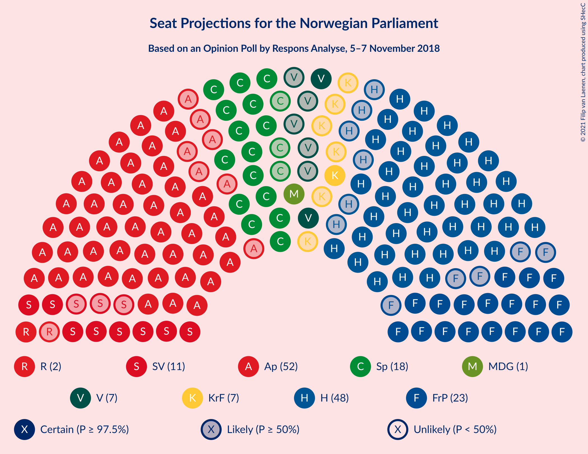
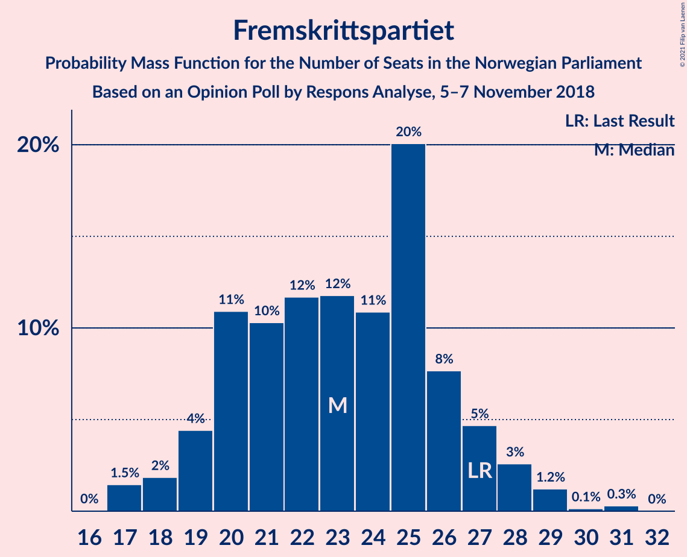
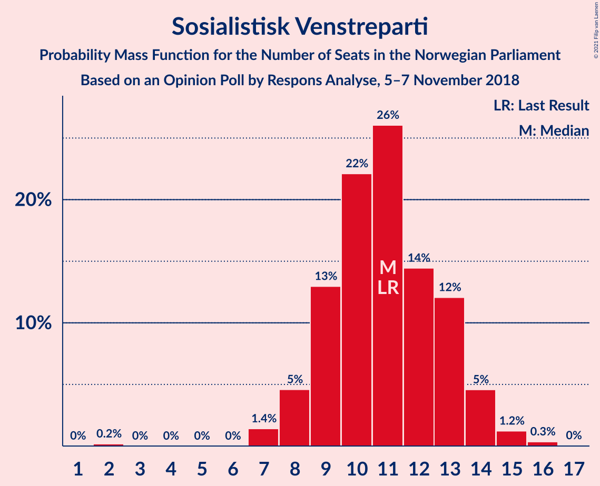
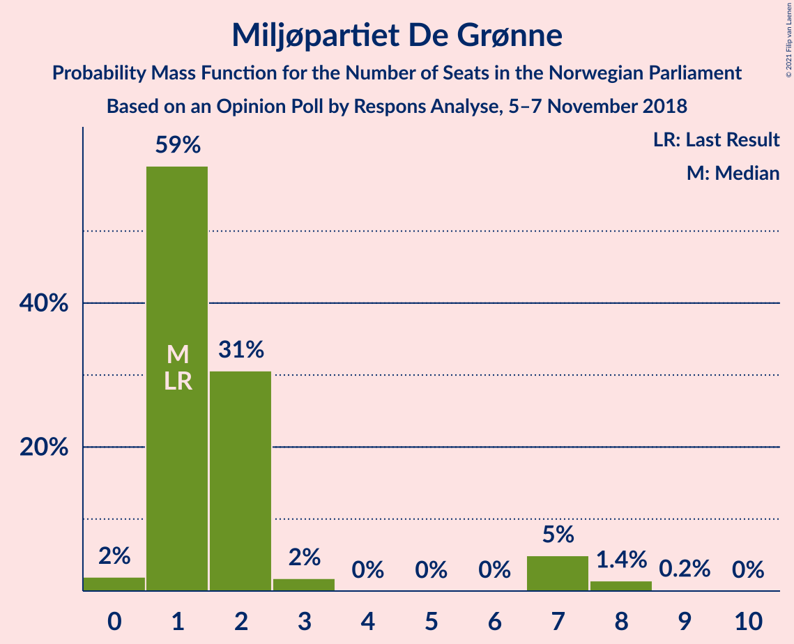
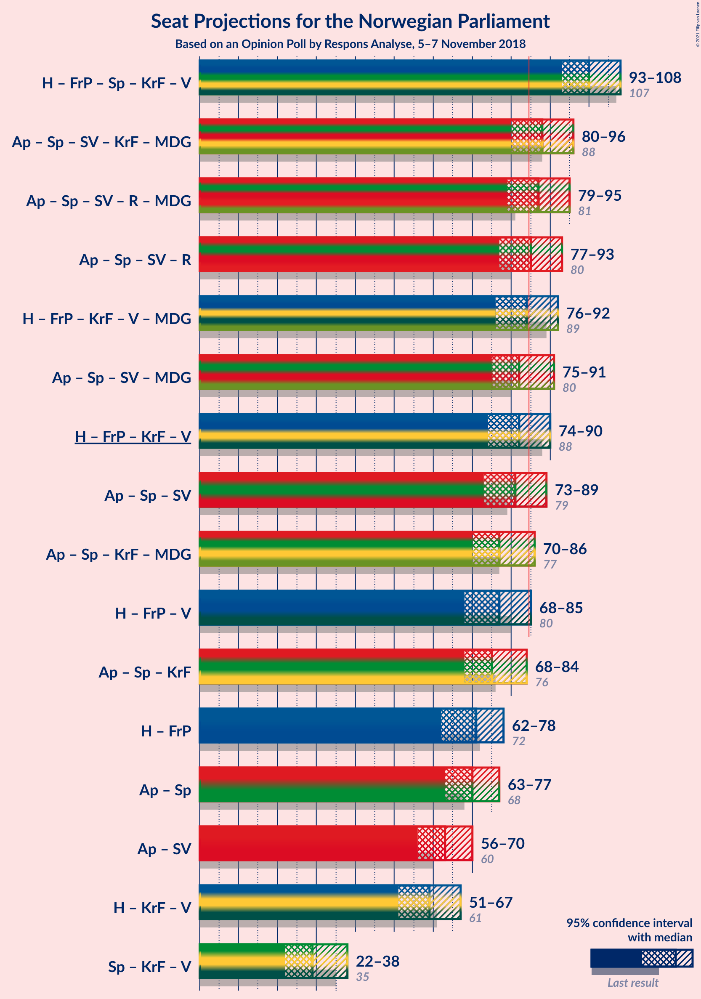
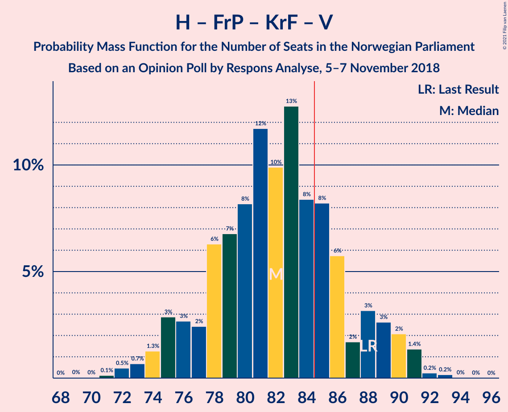

# Opinion Poll by Respons Analyse, 5–7 November 2018

<a href="#voting-intentions">Voting Intentions</a> | <a href="#seats">Seats</a> | <a href="#coalitions">Coalitions</a> | <a href="#technical-information">Technical Information</a>

## Voting Intentions

### Confidence Intervals

| Party | Last Result | Poll Result | 80% Confidence Interval | 90% Confidence Interval | 95% Confidence Interval | 99% Confidence Interval |
|:-----:|:-----------:|:-----------:|:-----------------------:|:-----------------------:|:-----------------------:|:-----------------------:|
| Arbeiderpartiet | 27.4% | 28.4% | 26.6–30.3% |26.1–30.8% |25.7–31.3% |24.8–32.2% |
| Høyre | 25.0% | 26.5% | 24.8–28.3% |24.3–28.9% |23.9–29.3% |23.0–30.2% |
| Fremskrittspartiet | 15.2% | 12.8% | 11.5–14.3% |11.2–14.7% |10.9–15.0% |10.3–15.7% |
| Senterpartiet | 10.3% | 10.3% | 9.2–11.6% |8.8–12.0% |8.6–12.3% |8.0–13.0% |
| Sosialistisk Venstreparti | 6.0% | 6.0% | 5.1–7.1% |4.9–7.4% |4.7–7.7% |4.3–8.2% |
| Kristelig Folkeparti | 4.2% | 4.2% | 3.5–5.1% |3.3–5.4% |3.1–5.6% |2.8–6.1% |
| Venstre | 4.4% | 4.1% | 3.4–5.0% |3.2–5.3% |3.0–5.5% |2.7–6.0% |
| Rødt | 2.4% | 3.9% | 3.2–4.8% |3.0–5.1% |2.9–5.3% |2.6–5.8% |
| Miljøpartiet De Grønne | 3.2% | 2.9% | 2.3–3.7% |2.2–3.9% |2.0–4.1% |1.8–4.6% |

*Note:* The poll result column reflects the actual value used in the calculations. Published results may vary slightly, and in addition be rounded to fewer digits.

## Seats

### Confidence Intervals

| Party | Last Result | Median | 80% Confidence Interval | 90% Confidence Interval | 95% Confidence Interval | 99% Confidence Interval |
|:-----:|:-----------:|:------:|:-----------------------:|:-----------------------:|:-----------------------:|:-----------------------:|
| <a href="#arbeiderpartiet">Arbeiderpartiet</a> | 49 | 53 | 49–56 |47–56 |46–57 |44–59 |
| <a href="#høyre">Høyre</a> | 45 | 47 | 42–51 |42–52 |42–53 |41–54 |
| <a href="#fremskrittspartiet">Fremskrittspartiet</a> | 27 | 22 | 19–26 |17–27 |17–27 |17–29 |
| <a href="#senterpartiet">Senterpartiet</a> | 19 | 18 | 16–20 |15–21 |15–21 |14–23 |
| <a href="#sosialistisk-venstreparti">Sosialistisk Venstreparti</a> | 11 | 11 | 9–13 |8–13 |8–14 |7–15 |
| <a href="#kristelig-folkeparti">Kristelig Folkeparti</a> | 8 | 9 | 2–9 |1–10 |1–10 |1–11 |
| <a href="#venstre">Venstre</a> | 8 | 7 | 2–9 |2–9 |2–9 |2–10 |
| <a href="#rødt">Rødt</a> | 1 | 2 | 2–8 |1–9 |1–9 |1–10 |
| <a href="#miljøpartiet-de-grønne">Miljøpartiet De Grønne</a> | 1 | 1 | 1–2 |1–3 |0–7 |0–8 |

### Arbeiderpartiet

*For a full overview of the results for this party, see the [Arbeiderpartiet](party-arbeiderpartiet.html) page.*

| Number of Seats | Probability | Accumulated | Special Marks |
|:---------------:|:-----------:|:-----------:|:-------------:|
| 43 | 0.3% | 100% |  |
| 44 | 0.6% | 99.6% |  |
| 45 | 1.2% | 99.1% |  |
| 46 | 2% | 98% |  |
| 47 | 2% | 96% |  |
| 48 | 4% | 94% |  |
| 49 | 10% | 90% | Last Result |
| 50 | 6% | 80% |  |
| 51 | 17% | 74% |  |
| 52 | 3% | 57% |  |
| 53 | 16% | 53% | Median |
| 54 | 21% | 37% |  |
| 55 | 5% | 16% |  |
| 56 | 8% | 11% |  |
| 57 | 2% | 3% |  |
| 58 | 1.1% | 2% |  |
| 59 | 0.3% | 0.6% |  |
| 60 | 0.2% | 0.3% |  |
| 61 | 0% | 0% |  |

### Høyre

*For a full overview of the results for this party, see the [Høyre](party-høyre.html) page.*

| Number of Seats | Probability | Accumulated | Special Marks |
|:---------------:|:-----------:|:-----------:|:-------------:|
| 39 | 0.2% | 100% |  |
| 40 | 0.1% | 99.8% |  |
| 41 | 1.2% | 99.7% |  |
| 42 | 10% | 98% |  |
| 43 | 5% | 89% |  |
| 44 | 5% | 84% |  |
| 45 | 12% | 79% | Last Result |
| 46 | 3% | 68% |  |
| 47 | 18% | 64% | Median |
| 48 | 11% | 46% |  |
| 49 | 7% | 36% |  |
| 50 | 4% | 28% |  |
| 51 | 18% | 24% |  |
| 52 | 1.3% | 6% |  |
| 53 | 3% | 4% |  |
| 54 | 0.9% | 1.4% |  |
| 55 | 0.1% | 0.5% |  |
| 56 | 0.3% | 0.4% |  |
| 57 | 0% | 0% |  |

### Fremskrittspartiet

*For a full overview of the results for this party, see the [Fremskrittspartiet](party-fremskrittspartiet.html) page.*

| Number of Seats | Probability | Accumulated | Special Marks |
|:---------------:|:-----------:|:-----------:|:-------------:|
| 16 | 0% | 100% |  |
| 17 | 9% | 99.9% |  |
| 18 | 1.1% | 91% |  |
| 19 | 2% | 90% |  |
| 20 | 20% | 88% |  |
| 21 | 10% | 68% |  |
| 22 | 9% | 58% | Median |
| 23 | 7% | 49% |  |
| 24 | 4% | 43% |  |
| 25 | 23% | 38% |  |
| 26 | 9% | 15% |  |
| 27 | 4% | 6% | Last Result |
| 28 | 0.7% | 1.5% |  |
| 29 | 0.5% | 0.8% |  |
| 30 | 0.3% | 0.4% |  |
| 31 | 0% | 0% |  |

### Senterpartiet

*For a full overview of the results for this party, see the [Senterpartiet](party-senterpartiet.html) page.*

| Number of Seats | Probability | Accumulated | Special Marks |
|:---------------:|:-----------:|:-----------:|:-------------:|
| 13 | 0.1% | 100% |  |
| 14 | 0.6% | 99.9% |  |
| 15 | 5% | 99.3% |  |
| 16 | 20% | 94% |  |
| 17 | 14% | 74% |  |
| 18 | 34% | 60% | Median |
| 19 | 8% | 26% | Last Result |
| 20 | 11% | 18% |  |
| 21 | 4% | 7% |  |
| 22 | 2% | 2% |  |
| 23 | 0.4% | 0.8% |  |
| 24 | 0.3% | 0.4% |  |
| 25 | 0% | 0.1% |  |
| 26 | 0% | 0% |  |

### Sosialistisk Venstreparti

*For a full overview of the results for this party, see the [Sosialistisk Venstreparti](party-sosialistiskvenstreparti.html) page.*

| Number of Seats | Probability | Accumulated | Special Marks |
|:---------------:|:-----------:|:-----------:|:-------------:|
| 2 | 0.4% | 100% |  |
| 3 | 0% | 99.6% |  |
| 4 | 0% | 99.6% |  |
| 5 | 0% | 99.6% |  |
| 6 | 0% | 99.6% |  |
| 7 | 0.3% | 99.6% |  |
| 8 | 5% | 99.3% |  |
| 9 | 12% | 94% |  |
| 10 | 30% | 83% |  |
| 11 | 20% | 53% | Last Result, Median |
| 12 | 10% | 32% |  |
| 13 | 19% | 22% |  |
| 14 | 1.4% | 3% |  |
| 15 | 1.1% | 1.3% |  |
| 16 | 0.1% | 0.1% |  |
| 17 | 0% | 0% |  |

### Kristelig Folkeparti

*For a full overview of the results for this party, see the [Kristelig Folkeparti](party-kristeligfolkeparti.html) page.*

| Number of Seats | Probability | Accumulated | Special Marks |
|:---------------:|:-----------:|:-----------:|:-------------:|
| 1 | 6% | 100% |  |
| 2 | 10% | 94% |  |
| 3 | 20% | 84% |  |
| 4 | 0% | 64% |  |
| 5 | 0% | 64% |  |
| 6 | 0% | 64% |  |
| 7 | 3% | 64% |  |
| 8 | 10% | 61% | Last Result |
| 9 | 43% | 51% | Median |
| 10 | 6% | 8% |  |
| 11 | 1.5% | 2% |  |
| 12 | 0.1% | 0.1% |  |
| 13 | 0% | 0% |  |

### Venstre

*For a full overview of the results for this party, see the [Venstre](party-venstre.html) page.*

| Number of Seats | Probability | Accumulated | Special Marks |
|:---------------:|:-----------:|:-----------:|:-------------:|
| 1 | 0.1% | 100% |  |
| 2 | 39% | 99.9% |  |
| 3 | 0.8% | 61% |  |
| 4 | 0% | 60% |  |
| 5 | 0% | 60% |  |
| 6 | 0% | 60% |  |
| 7 | 31% | 60% | Median |
| 8 | 17% | 30% | Last Result |
| 9 | 11% | 13% |  |
| 10 | 1.3% | 2% |  |
| 11 | 0.4% | 0.5% |  |
| 12 | 0% | 0% |  |

### Rødt

*For a full overview of the results for this party, see the [Rødt](party-rødt.html) page.*

| Number of Seats | Probability | Accumulated | Special Marks |
|:---------------:|:-----------:|:-----------:|:-------------:|
| 1 | 6% | 100% | Last Result |
| 2 | 45% | 94% | Median |
| 3 | 0% | 49% |  |
| 4 | 0% | 49% |  |
| 5 | 0% | 49% |  |
| 6 | 0% | 49% |  |
| 7 | 15% | 49% |  |
| 8 | 27% | 35% |  |
| 9 | 6% | 7% |  |
| 10 | 2% | 2% |  |
| 11 | 0.1% | 0.1% |  |
| 12 | 0% | 0% |  |

### Miljøpartiet De Grønne

*For a full overview of the results for this party, see the [Miljøpartiet De Grønne](party-miljøpartietdegrønne.html) page.*

| Number of Seats | Probability | Accumulated | Special Marks |
|:---------------:|:-----------:|:-----------:|:-------------:|
| 0 | 3% | 100% |  |
| 1 | 58% | 97% | Last Result, Median |
| 2 | 34% | 39% |  |
| 3 | 1.3% | 5% |  |
| 4 | 0% | 4% |  |
| 5 | 0% | 4% |  |
| 6 | 0% | 4% |  |
| 7 | 3% | 4% |  |
| 8 | 0.7% | 0.8% |  |
| 9 | 0.1% | 0.1% |  |
| 10 | 0% | 0% |  |

## Coalitions

### Confidence Intervals

| Coalition | Last Result | Median | Majority? | 80% Confidence Interval | 90% Confidence Interval | 95% Confidence Interval | 99% Confidence Interval |
|:---------:|:-----------:|:------:|:---------:|:-----------------------:|:-----------------------:|:-----------------------:|:-----------------------:|
| Høyre – Fremskrittspartiet – Senterpartiet – Kristelig Folkeparti – Venstre | 107 | 99 | 100% | 95–106 | 95–108 | 94–108 | 91–110 |
| Arbeiderpartiet – Senterpartiet – Sosialistisk Venstreparti – Kristelig Folkeparti – Miljøpartiet De Grønne | 88 | 88 | 90% | 84–95 | 83–96 | 81–97 | 78–99 |
| Arbeiderpartiet – Senterpartiet – Sosialistisk Venstreparti – Rødt – Miljøpartiet De Grønne | 81 | 88 | 78% | 81–91 | 81–91 | 80–93 | 78–97 |
| Arbeiderpartiet – Senterpartiet – Sosialistisk Venstreparti – Rødt | 80 | 86 | 73% | 80–90 | 80–90 | 78–91 | 75–95 |
| Høyre – Fremskrittspartiet – Kristelig Folkeparti – Venstre – Miljøpartiet De Grønne | 89 | 83 | 27% | 79–89 | 79–89 | 78–91 | 74–94 |
| Høyre – Fremskrittspartiet – Kristelig Folkeparti – Venstre | 88 | 81 | 22% | 78–88 | 78–88 | 76–89 | 72–91 |
| Arbeiderpartiet – Senterpartiet – Sosialistisk Venstreparti – Miljøpartiet De Grønne | 80 | 83 | 33% | 78–87 | 77–88 | 76–88 | 74–91 |
| Arbeiderpartiet – Senterpartiet – Sosialistisk Venstreparti | 79 | 81 | 13% | 77–85 | 75–87 | 74–87 | 72–88 |
| Arbeiderpartiet – Senterpartiet – Kristelig Folkeparti – Miljøpartiet De Grønne | 77 | 77 | 6% | 73–84 | 71–86 | 70–86 | 68–88 |
| Høyre – Fremskrittspartiet – Venstre | 80 | 76 | 2% | 69–79 | 69–82 | 69–84 | 66–87 |
| Arbeiderpartiet – Senterpartiet – Kristelig Folkeparti | 76 | 76 | 2% | 71–83 | 69–83 | 68–84 | 67–85 |
| Høyre – Fremskrittspartiet | 72 | 69 | 0% | 62–76 | 62–77 | 62–78 | 62–79 |
| Arbeiderpartiet – Senterpartiet | 68 | 71 | 0% | 66–74 | 65–75 | 64–75 | 61–77 |
| Arbeiderpartiet – Sosialistisk Venstreparti | 60 | 63 | 0% | 58–67 | 57–68 | 56–69 | 54–70 |
| Høyre – Kristelig Folkeparti – Venstre | 61 | 59 | 0% | 53–64 | 52–67 | 52–67 | 49–69 |
| Senterpartiet – Kristelig Folkeparti – Venstre | 35 | 32 | 0% | 22–36 | 21–38 | 21–38 | 20–39 |

### Høyre – Fremskrittspartiet – Senterpartiet – Kristelig Folkeparti – Venstre

| Number of Seats | Probability | Accumulated | Special Marks |
|:---------------:|:-----------:|:-----------:|:-------------:|
| 89 | 0.3% | 100% |  |
| 90 | 0.1% | 99.6% |  |
| 91 | 0.9% | 99.5% |  |
| 92 | 0.3% | 98.6% |  |
| 93 | 0.7% | 98% |  |
| 94 | 0.4% | 98% |  |
| 95 | 7% | 97% |  |
| 96 | 12% | 90% |  |
| 97 | 5% | 78% |  |
| 98 | 4% | 73% |  |
| 99 | 35% | 69% |  |
| 100 | 7% | 34% |  |
| 101 | 3% | 27% |  |
| 102 | 4% | 24% |  |
| 103 | 3% | 19% | Median |
| 104 | 3% | 16% |  |
| 105 | 3% | 13% |  |
| 106 | 2% | 11% |  |
| 107 | 1.3% | 9% | Last Result |
| 108 | 6% | 8% |  |
| 109 | 1.1% | 2% |  |
| 110 | 0.4% | 0.6% |  |
| 111 | 0.1% | 0.3% |  |
| 112 | 0.2% | 0.2% |  |
| 113 | 0% | 0% |  |

### Arbeiderpartiet – Senterpartiet – Sosialistisk Venstreparti – Kristelig Folkeparti – Miljøpartiet De Grønne

| Number of Seats | Probability | Accumulated | Special Marks |
|:---------------:|:-----------:|:-----------:|:-------------:|
| 76 | 0.1% | 100% |  |
| 77 | 0.1% | 99.9% |  |
| 78 | 0.3% | 99.7% |  |
| 79 | 0.5% | 99.5% |  |
| 80 | 0.3% | 99.0% |  |
| 81 | 2% | 98.7% |  |
| 82 | 1.3% | 96% |  |
| 83 | 2% | 95% |  |
| 84 | 3% | 93% |  |
| 85 | 9% | 90% | Majority |
| 86 | 4% | 81% |  |
| 87 | 19% | 77% |  |
| 88 | 9% | 58% | Last Result |
| 89 | 16% | 49% |  |
| 90 | 1.3% | 33% |  |
| 91 | 6% | 31% |  |
| 92 | 2% | 26% | Median |
| 93 | 10% | 24% |  |
| 94 | 0.9% | 14% |  |
| 95 | 8% | 13% |  |
| 96 | 0.5% | 5% |  |
| 97 | 2% | 5% |  |
| 98 | 2% | 2% |  |
| 99 | 0.3% | 0.5% |  |
| 100 | 0.1% | 0.3% |  |
| 101 | 0% | 0.1% |  |
| 102 | 0.1% | 0.1% |  |
| 103 | 0% | 0% |  |

### Arbeiderpartiet – Senterpartiet – Sosialistisk Venstreparti – Rødt – Miljøpartiet De Grønne

| Number of Seats | Probability | Accumulated | Special Marks |
|:---------------:|:-----------:|:-----------:|:-------------:|
| 76 | 0.3% | 100% |  |
| 77 | 0.1% | 99.6% |  |
| 78 | 0.2% | 99.5% |  |
| 79 | 2% | 99.3% |  |
| 80 | 0.6% | 98% |  |
| 81 | 9% | 97% | Last Result |
| 82 | 1.1% | 88% |  |
| 83 | 4% | 87% |  |
| 84 | 4% | 82% |  |
| 85 | 2% | 78% | Median, Majority |
| 86 | 17% | 76% |  |
| 87 | 2% | 59% |  |
| 88 | 22% | 56% |  |
| 89 | 6% | 34% |  |
| 90 | 7% | 28% |  |
| 91 | 17% | 21% |  |
| 92 | 1.3% | 4% |  |
| 93 | 0.5% | 3% |  |
| 94 | 0.4% | 2% |  |
| 95 | 0.6% | 2% |  |
| 96 | 0.5% | 1.5% |  |
| 97 | 0.9% | 1.0% |  |
| 98 | 0% | 0.1% |  |
| 99 | 0% | 0.1% |  |
| 100 | 0% | 0% |  |

### Arbeiderpartiet – Senterpartiet – Sosialistisk Venstreparti – Rødt

| Number of Seats | Probability | Accumulated | Special Marks |
|:---------------:|:-----------:|:-----------:|:-------------:|
| 73 | 0.2% | 100% |  |
| 74 | 0.1% | 99.8% |  |
| 75 | 0.2% | 99.6% |  |
| 76 | 0.2% | 99.4% |  |
| 77 | 0.1% | 99.2% |  |
| 78 | 2% | 99.0% |  |
| 79 | 1.3% | 97% |  |
| 80 | 10% | 96% | Last Result |
| 81 | 2% | 86% |  |
| 82 | 5% | 84% |  |
| 83 | 5% | 79% |  |
| 84 | 1.5% | 74% | Median |
| 85 | 17% | 73% | Majority |
| 86 | 17% | 56% |  |
| 87 | 8% | 38% |  |
| 88 | 4% | 31% |  |
| 89 | 14% | 27% |  |
| 90 | 9% | 12% |  |
| 91 | 1.3% | 4% |  |
| 92 | 0.5% | 2% |  |
| 93 | 0.3% | 2% |  |
| 94 | 0.3% | 1.4% |  |
| 95 | 0.9% | 1.1% |  |
| 96 | 0.1% | 0.2% |  |
| 97 | 0% | 0.1% |  |
| 98 | 0% | 0% |  |

### Høyre – Fremskrittspartiet – Kristelig Folkeparti – Venstre – Miljøpartiet De Grønne

| Number of Seats | Probability | Accumulated | Special Marks |
|:---------------:|:-----------:|:-----------:|:-------------:|
| 72 | 0% | 100% |  |
| 73 | 0.1% | 99.9% |  |
| 74 | 0.9% | 99.8% |  |
| 75 | 0.3% | 98.9% |  |
| 76 | 0.3% | 98.6% |  |
| 77 | 0.5% | 98% |  |
| 78 | 1.3% | 98% |  |
| 79 | 9% | 96% |  |
| 80 | 14% | 88% |  |
| 81 | 4% | 73% |  |
| 82 | 8% | 69% |  |
| 83 | 17% | 62% |  |
| 84 | 17% | 44% |  |
| 85 | 1.5% | 27% | Majority |
| 86 | 5% | 26% | Median |
| 87 | 5% | 21% |  |
| 88 | 2% | 16% |  |
| 89 | 10% | 14% | Last Result |
| 90 | 1.3% | 4% |  |
| 91 | 2% | 3% |  |
| 92 | 0.1% | 1.0% |  |
| 93 | 0.2% | 0.8% |  |
| 94 | 0.2% | 0.6% |  |
| 95 | 0.1% | 0.4% |  |
| 96 | 0.2% | 0.2% |  |
| 97 | 0% | 0% |  |

### Høyre – Fremskrittspartiet – Kristelig Folkeparti – Venstre

| Number of Seats | Probability | Accumulated | Special Marks |
|:---------------:|:-----------:|:-----------:|:-------------:|
| 70 | 0% | 100% |  |
| 71 | 0% | 99.9% |  |
| 72 | 0.9% | 99.9% |  |
| 73 | 0.5% | 99.0% |  |
| 74 | 0.6% | 98.5% |  |
| 75 | 0.4% | 98% |  |
| 76 | 0.5% | 98% |  |
| 77 | 1.3% | 97% |  |
| 78 | 17% | 96% |  |
| 79 | 7% | 79% |  |
| 80 | 6% | 72% |  |
| 81 | 22% | 66% |  |
| 82 | 2% | 44% |  |
| 83 | 17% | 41% |  |
| 84 | 2% | 24% |  |
| 85 | 4% | 22% | Median, Majority |
| 86 | 4% | 18% |  |
| 87 | 1.1% | 13% |  |
| 88 | 9% | 12% | Last Result |
| 89 | 0.6% | 3% |  |
| 90 | 2% | 2% |  |
| 91 | 0.2% | 0.7% |  |
| 92 | 0.1% | 0.5% |  |
| 93 | 0.3% | 0.4% |  |
| 94 | 0% | 0% |  |

### Arbeiderpartiet – Senterpartiet – Sosialistisk Venstreparti – Miljøpartiet De Grønne

| Number of Seats | Probability | Accumulated | Special Marks |
|:---------------:|:-----------:|:-----------:|:-------------:|
| 69 | 0.1% | 100% |  |
| 70 | 0% | 99.9% |  |
| 71 | 0% | 99.9% |  |
| 72 | 0.1% | 99.9% |  |
| 73 | 0.2% | 99.8% |  |
| 74 | 0.6% | 99.7% |  |
| 75 | 0.7% | 99.1% |  |
| 76 | 1.3% | 98% |  |
| 77 | 3% | 97% |  |
| 78 | 18% | 94% |  |
| 79 | 9% | 77% |  |
| 80 | 5% | 67% | Last Result |
| 81 | 5% | 63% |  |
| 82 | 5% | 58% |  |
| 83 | 11% | 53% | Median |
| 84 | 9% | 42% |  |
| 85 | 2% | 33% | Majority |
| 86 | 21% | 31% |  |
| 87 | 5% | 11% |  |
| 88 | 4% | 6% |  |
| 89 | 0.7% | 2% |  |
| 90 | 0.8% | 1.4% |  |
| 91 | 0.1% | 0.6% |  |
| 92 | 0.1% | 0.4% |  |
| 93 | 0.2% | 0.4% |  |
| 94 | 0% | 0.2% |  |
| 95 | 0.1% | 0.1% |  |
| 96 | 0% | 0% |  |

### Arbeiderpartiet – Senterpartiet – Sosialistisk Venstreparti

| Number of Seats | Probability | Accumulated | Special Marks |
|:---------------:|:-----------:|:-----------:|:-------------:|
| 68 | 0.1% | 100% |  |
| 69 | 0% | 99.9% |  |
| 70 | 0.1% | 99.9% |  |
| 71 | 0.2% | 99.8% |  |
| 72 | 0.5% | 99.6% |  |
| 73 | 0.4% | 99.1% |  |
| 74 | 1.2% | 98.7% |  |
| 75 | 3% | 97% |  |
| 76 | 1.3% | 95% |  |
| 77 | 18% | 93% |  |
| 78 | 9% | 75% |  |
| 79 | 7% | 66% | Last Result |
| 80 | 3% | 58% |  |
| 81 | 6% | 55% |  |
| 82 | 18% | 50% | Median |
| 83 | 2% | 31% |  |
| 84 | 16% | 30% |  |
| 85 | 5% | 13% | Majority |
| 86 | 2% | 8% |  |
| 87 | 4% | 6% |  |
| 88 | 1.3% | 2% |  |
| 89 | 0.1% | 0.4% |  |
| 90 | 0.1% | 0.3% |  |
| 91 | 0.1% | 0.2% |  |
| 92 | 0% | 0.1% |  |
| 93 | 0% | 0% |  |

### Arbeiderpartiet – Senterpartiet – Kristelig Folkeparti – Miljøpartiet De Grønne

| Number of Seats | Probability | Accumulated | Special Marks |
|:---------------:|:-----------:|:-----------:|:-------------:|
| 66 | 0.2% | 100% |  |
| 67 | 0.1% | 99.8% |  |
| 68 | 2% | 99.7% |  |
| 69 | 0.2% | 98% |  |
| 70 | 2% | 98% |  |
| 71 | 2% | 96% |  |
| 72 | 3% | 94% |  |
| 73 | 1.2% | 91% |  |
| 74 | 11% | 90% |  |
| 75 | 2% | 79% |  |
| 76 | 16% | 76% |  |
| 77 | 17% | 61% | Last Result |
| 78 | 3% | 44% |  |
| 79 | 9% | 40% |  |
| 80 | 2% | 31% |  |
| 81 | 3% | 29% | Median |
| 82 | 2% | 26% |  |
| 83 | 12% | 24% |  |
| 84 | 7% | 13% |  |
| 85 | 0.4% | 6% | Majority |
| 86 | 3% | 5% |  |
| 87 | 0.2% | 2% |  |
| 88 | 2% | 2% |  |
| 89 | 0% | 0.2% |  |
| 90 | 0.1% | 0.2% |  |
| 91 | 0% | 0% |  |

### Høyre – Fremskrittspartiet – Venstre

| Number of Seats | Probability | Accumulated | Special Marks |
|:---------------:|:-----------:|:-----------:|:-------------:|
| 64 | 0.2% | 100% |  |
| 65 | 0.2% | 99.8% |  |
| 66 | 0.1% | 99.5% |  |
| 67 | 0.3% | 99.5% |  |
| 68 | 0.4% | 99.2% |  |
| 69 | 10% | 98.8% |  |
| 70 | 3% | 88% |  |
| 71 | 5% | 86% |  |
| 72 | 7% | 80% |  |
| 73 | 2% | 73% |  |
| 74 | 18% | 71% |  |
| 75 | 2% | 53% |  |
| 76 | 14% | 51% | Median |
| 77 | 1.3% | 37% |  |
| 78 | 17% | 36% |  |
| 79 | 9% | 19% |  |
| 80 | 3% | 10% | Last Result |
| 81 | 1.5% | 7% |  |
| 82 | 0.7% | 5% |  |
| 83 | 1.2% | 4% |  |
| 84 | 1.0% | 3% |  |
| 85 | 1.3% | 2% | Majority |
| 86 | 0% | 1.0% |  |
| 87 | 0.9% | 1.0% |  |
| 88 | 0% | 0% |  |

### Arbeiderpartiet – Senterpartiet – Kristelig Folkeparti

| Number of Seats | Probability | Accumulated | Special Marks |
|:---------------:|:-----------:|:-----------:|:-------------:|
| 65 | 0.2% | 100% |  |
| 66 | 0.2% | 99.8% |  |
| 67 | 2% | 99.6% |  |
| 68 | 0.7% | 98% |  |
| 69 | 3% | 97% |  |
| 70 | 2% | 94% |  |
| 71 | 3% | 92% |  |
| 72 | 1.4% | 90% |  |
| 73 | 11% | 88% |  |
| 74 | 16% | 77% |  |
| 75 | 2% | 61% |  |
| 76 | 18% | 59% | Last Result |
| 77 | 3% | 41% |  |
| 78 | 8% | 37% |  |
| 79 | 1.2% | 29% |  |
| 80 | 2% | 28% | Median |
| 81 | 12% | 25% |  |
| 82 | 2% | 13% |  |
| 83 | 8% | 12% |  |
| 84 | 0.7% | 3% |  |
| 85 | 2% | 2% | Majority |
| 86 | 0% | 0.2% |  |
| 87 | 0.1% | 0.2% |  |
| 88 | 0.1% | 0.1% |  |
| 89 | 0% | 0% |  |

### Høyre – Fremskrittspartiet

| Number of Seats | Probability | Accumulated | Special Marks |
|:---------------:|:-----------:|:-----------:|:-------------:|
| 60 | 0.1% | 100% |  |
| 61 | 0.1% | 99.8% |  |
| 62 | 10% | 99.7% |  |
| 63 | 0.5% | 90% |  |
| 64 | 7% | 89% |  |
| 65 | 3% | 83% |  |
| 66 | 0.5% | 79% |  |
| 67 | 20% | 79% |  |
| 68 | 5% | 58% |  |
| 69 | 6% | 53% | Median |
| 70 | 8% | 48% |  |
| 71 | 3% | 40% |  |
| 72 | 2% | 37% | Last Result |
| 73 | 3% | 35% |  |
| 74 | 9% | 32% |  |
| 75 | 3% | 24% |  |
| 76 | 15% | 21% |  |
| 77 | 2% | 6% |  |
| 78 | 4% | 4% |  |
| 79 | 0.3% | 0.7% |  |
| 80 | 0.3% | 0.4% |  |
| 81 | 0% | 0.1% |  |
| 82 | 0% | 0.1% |  |
| 83 | 0% | 0% |  |

### Arbeiderpartiet – Senterpartiet

| Number of Seats | Probability | Accumulated | Special Marks |
|:---------------:|:-----------:|:-----------:|:-------------:|
| 60 | 0.1% | 100% |  |
| 61 | 0.4% | 99.8% |  |
| 62 | 0.1% | 99.5% |  |
| 63 | 1.3% | 99.3% |  |
| 64 | 0.9% | 98% |  |
| 65 | 4% | 97% |  |
| 66 | 4% | 93% |  |
| 67 | 21% | 89% |  |
| 68 | 3% | 68% | Last Result |
| 69 | 8% | 65% |  |
| 70 | 4% | 57% |  |
| 71 | 24% | 54% | Median |
| 72 | 13% | 30% |  |
| 73 | 3% | 16% |  |
| 74 | 6% | 14% |  |
| 75 | 6% | 8% |  |
| 76 | 0.8% | 2% |  |
| 77 | 0.9% | 1.2% |  |
| 78 | 0.1% | 0.3% |  |
| 79 | 0.2% | 0.2% |  |
| 80 | 0% | 0.1% |  |
| 81 | 0% | 0.1% |  |
| 82 | 0% | 0% |  |

### Arbeiderpartiet – Sosialistisk Venstreparti

| Number of Seats | Probability | Accumulated | Special Marks |
|:---------------:|:-----------:|:-----------:|:-------------:|
| 51 | 0.1% | 100% |  |
| 52 | 0% | 99.9% |  |
| 53 | 0.1% | 99.9% |  |
| 54 | 0.7% | 99.8% |  |
| 55 | 0.9% | 99.1% |  |
| 56 | 1.3% | 98% |  |
| 57 | 2% | 97% |  |
| 58 | 9% | 95% |  |
| 59 | 2% | 86% |  |
| 60 | 4% | 84% | Last Result |
| 61 | 19% | 80% |  |
| 62 | 3% | 61% |  |
| 63 | 9% | 58% |  |
| 64 | 11% | 49% | Median |
| 65 | 9% | 38% |  |
| 66 | 16% | 29% |  |
| 67 | 7% | 13% |  |
| 68 | 2% | 6% |  |
| 69 | 3% | 4% |  |
| 70 | 0.2% | 0.6% |  |
| 71 | 0.2% | 0.4% |  |
| 72 | 0% | 0.2% |  |
| 73 | 0.2% | 0.2% |  |
| 74 | 0% | 0% |  |

### Høyre – Kristelig Folkeparti – Venstre

| Number of Seats | Probability | Accumulated | Special Marks |
|:---------------:|:-----------:|:-----------:|:-------------:|
| 48 | 0.2% | 100% |  |
| 49 | 0.7% | 99.8% |  |
| 50 | 0.2% | 99.1% |  |
| 51 | 0.8% | 98.9% |  |
| 52 | 8% | 98% |  |
| 53 | 1.4% | 90% |  |
| 54 | 3% | 89% |  |
| 55 | 3% | 85% |  |
| 56 | 15% | 83% |  |
| 57 | 3% | 67% |  |
| 58 | 4% | 64% |  |
| 59 | 10% | 60% |  |
| 60 | 3% | 50% |  |
| 61 | 14% | 47% | Last Result |
| 62 | 4% | 33% |  |
| 63 | 18% | 29% | Median |
| 64 | 2% | 12% |  |
| 65 | 2% | 10% |  |
| 66 | 0.6% | 8% |  |
| 67 | 6% | 7% |  |
| 68 | 0.2% | 0.9% |  |
| 69 | 0.5% | 0.7% |  |
| 70 | 0% | 0.2% |  |
| 71 | 0% | 0.1% |  |
| 72 | 0.1% | 0.1% |  |
| 73 | 0% | 0% |  |

### Senterpartiet – Kristelig Folkeparti – Venstre

| Number of Seats | Probability | Accumulated | Special Marks |
|:---------------:|:-----------:|:-----------:|:-------------:|
| 19 | 0.2% | 100% |  |
| 20 | 0.4% | 99.8% |  |
| 21 | 7% | 99.4% |  |
| 22 | 2% | 92% |  |
| 23 | 14% | 90% |  |
| 24 | 2% | 76% |  |
| 25 | 4% | 74% |  |
| 26 | 2% | 69% |  |
| 27 | 2% | 68% |  |
| 28 | 2% | 66% |  |
| 29 | 2% | 64% |  |
| 30 | 3% | 62% |  |
| 31 | 5% | 58% |  |
| 32 | 20% | 53% |  |
| 33 | 0.6% | 33% |  |
| 34 | 11% | 32% | Median |
| 35 | 10% | 21% | Last Result |
| 36 | 2% | 11% |  |
| 37 | 1.3% | 9% |  |
| 38 | 6% | 8% |  |
| 39 | 0.9% | 1.2% |  |
| 40 | 0.2% | 0.3% |  |
| 41 | 0% | 0.1% |  |
| 42 | 0% | 0% |  |

## Technical Information

### Opinion Poll

+ **Polling firm:** Respons Analyse
+ **Commissioner(s):** —
+ **Fieldwork period:** 5–7 November 2018

### Calculations

+ **Sample size:** 1000
+ **Simulations done:** 131,072
+ **Error estimate:** 2.47%

