# Opinion Poll by Opinion Perduco, 6–12 November 2018

<a href="#voting-intentions">Voting Intentions</a> | <a href="#seats">Seats</a> | <a href="#coalitions">Coalitions</a> | <a href="#technical-information">Technical Information</a>

## Voting Intentions

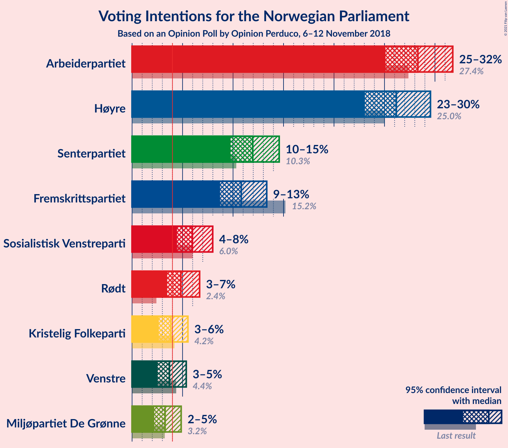

### Confidence Intervals

| Party | Last Result | Poll Result | 80% Confidence Interval | 90% Confidence Interval | 95% Confidence Interval | 99% Confidence Interval |
|:-----:|:-----------:|:-----------:|:-----------------------:|:-----------------------:|:-----------------------:|:-----------------------:|
| Arbeiderpartiet | 27.4% | 28.3% | 26.2–30.6% |25.6–31.2% |25.1–31.8% |24.1–32.9% |
| Høyre | 25.0% | 26.2% | 24.1–28.4% |23.5–29.0% |23.1–29.6% |22.1–30.6% |
| Senterpartiet | 10.3% | 11.9% | 10.5–13.7% |10.1–14.1% |9.8–14.6% |9.1–15.4% |
| Fremskrittspartiet | 15.2% | 10.8% | 9.4–12.5% |9.1–12.9% |8.7–13.3% |8.1–14.2% |
| Sosialistisk Venstreparti | 6.0% | 6.0% | 5.0–7.3% |4.7–7.7% |4.5–8.0% |4.0–8.7% |
| Rødt | 2.4% | 4.8% | 3.9–6.1% |3.7–6.4% |3.5–6.7% |3.1–7.3% |
| Kristelig Folkeparti | 4.2% | 3.8% | 3.0–4.9% |2.8–5.3% |2.7–5.5% |2.3–6.1% |
| Venstre | 4.4% | 3.7% | 2.9–4.8% |2.7–5.1% |2.5–5.4% |2.2–5.9% |
| Miljøpartiet De Grønne | 3.2% | 3.3% | 2.6–4.3% |2.3–4.6% |2.2–4.9% |1.9–5.4% |

*Note:* The poll result column reflects the actual value used in the calculations. Published results may vary slightly, and in addition be rounded to fewer digits.

## Seats

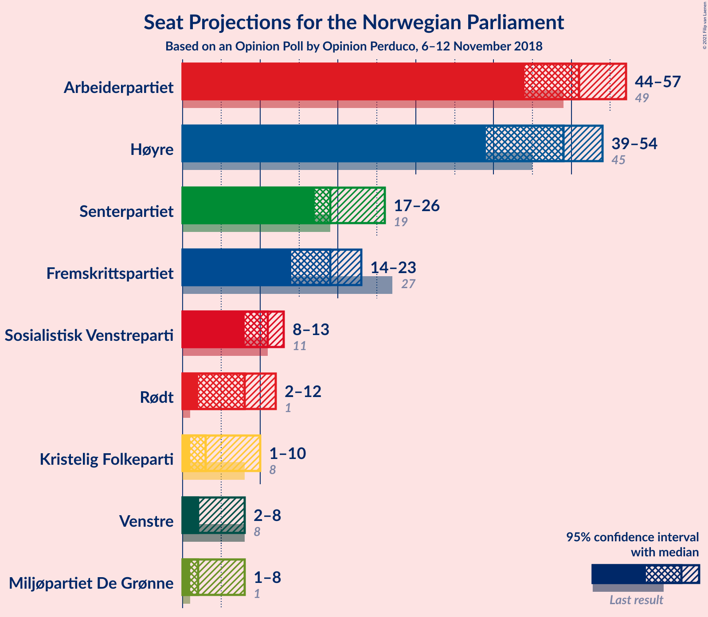

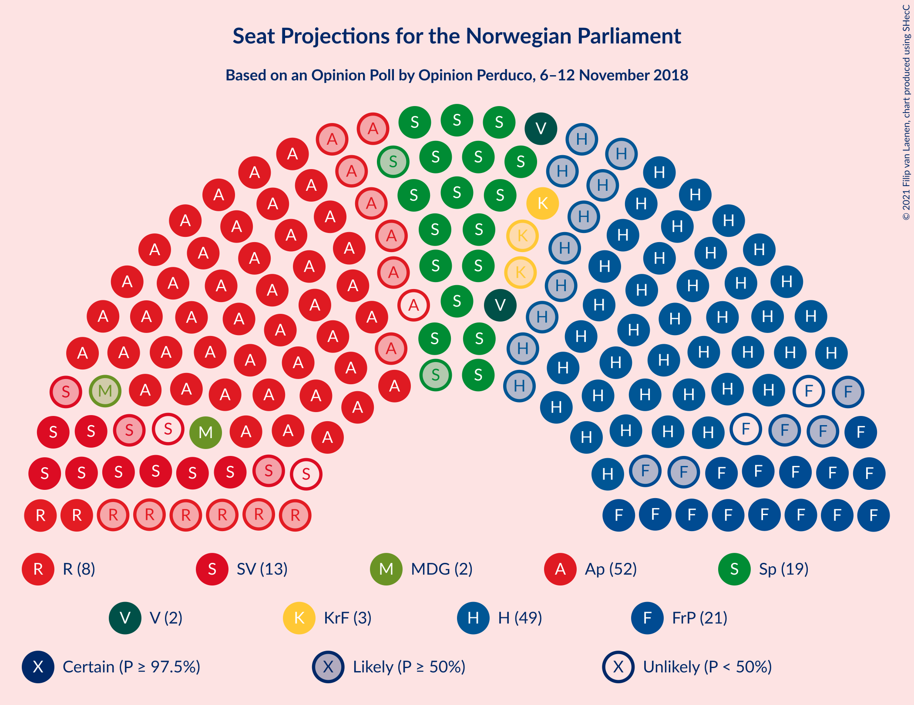

### Confidence Intervals

| Party | Last Result | Median | 80% Confidence Interval | 90% Confidence Interval | 95% Confidence Interval | 99% Confidence Interval |
|:-----:|:-----------:|:------:|:-----------------------:|:-----------------------:|:-----------------------:|:-----------------------:|
| <a href="#arbeiderpartiet">Arbeiderpartiet</a> | 49 | 51 | 49–56 |46–56 |44–57 |43–59 |
| <a href="#høyre">Høyre</a> | 45 | 49 | 41–53 |41–54 |39–54 |38–54 |
| <a href="#senterpartiet">Senterpartiet</a> | 19 | 19 | 18–24 |18–25 |17–26 |16–29 |
| <a href="#fremskrittspartiet">Fremskrittspartiet</a> | 27 | 19 | 17–21 |16–23 |14–23 |14–26 |
| <a href="#sosialistisk-venstreparti">Sosialistisk Venstreparti</a> | 11 | 11 | 8–13 |8–13 |8–13 |7–15 |
| <a href="#rødt">Rødt</a> | 1 | 8 | 7–11 |7–12 |2–12 |2–13 |
| <a href="#kristelig-folkeparti">Kristelig Folkeparti</a> | 8 | 3 | 1–8 |1–8 |1–10 |1–11 |
| <a href="#venstre">Venstre</a> | 8 | 2 | 2–8 |2–8 |2–8 |1–10 |
| <a href="#miljøpartiet-de-grønne">Miljøpartiet De Grønne</a> | 1 | 2 | 1–8 |1–8 |1–8 |1–8 |

### Arbeiderpartiet

*For a full overview of the results for this party, see the [Arbeiderpartiet](party-arbeiderpartiet.html) page.*

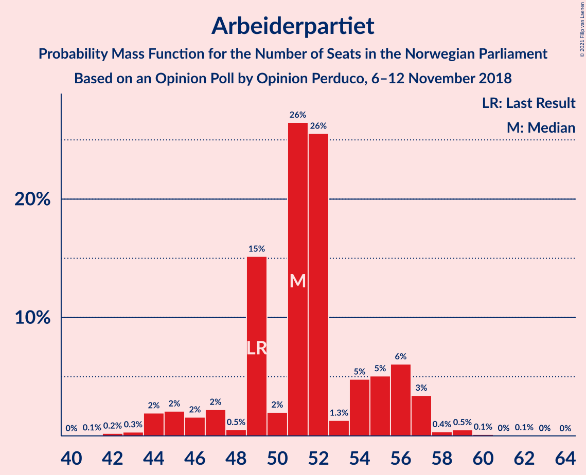

| Number of Seats | Probability | Accumulated | Special Marks |
|:---------------:|:-----------:|:-----------:|:-------------:|
| 41 | 0.1% | 100% |  |
| 42 | 0.2% | 99.9% |  |
| 43 | 0.3% | 99.7% |  |
| 44 | 2% | 99.4% |  |
| 45 | 2% | 97% |  |
| 46 | 2% | 95% |  |
| 47 | 2% | 94% |  |
| 48 | 0.5% | 92% |  |
| 49 | 15% | 91% | Last Result |
| 50 | 2% | 76% |  |
| 51 | 26% | 74% | Median |
| 52 | 26% | 47% |  |
| 53 | 1.3% | 22% |  |
| 54 | 5% | 20% |  |
| 55 | 5% | 16% |  |
| 56 | 6% | 11% |  |
| 57 | 3% | 5% |  |
| 58 | 0.4% | 1.1% |  |
| 59 | 0.5% | 0.8% |  |
| 60 | 0.1% | 0.3% |  |
| 61 | 0% | 0.1% |  |
| 62 | 0.1% | 0.1% |  |
| 63 | 0% | 0% |  |

### Høyre

*For a full overview of the results for this party, see the [Høyre](party-høyre.html) page.*

| Number of Seats | Probability | Accumulated | Special Marks |
|:---------------:|:-----------:|:-----------:|:-------------:|
| 35 | 0.1% | 100% |  |
| 36 | 0.1% | 99.9% |  |
| 37 | 0.1% | 99.9% |  |
| 38 | 0.6% | 99.7% |  |
| 39 | 3% | 99.1% |  |
| 40 | 1.3% | 96% |  |
| 41 | 6% | 95% |  |
| 42 | 4% | 89% |  |
| 43 | 2% | 85% |  |
| 44 | 3% | 83% |  |
| 45 | 4% | 81% | Last Result |
| 46 | 3% | 77% |  |
| 47 | 10% | 73% |  |
| 48 | 1.5% | 63% |  |
| 49 | 25% | 62% | Median |
| 50 | 14% | 37% |  |
| 51 | 7% | 23% |  |
| 52 | 6% | 16% |  |
| 53 | 0.8% | 10% |  |
| 54 | 9% | 9% |  |
| 55 | 0.2% | 0.4% |  |
| 56 | 0.2% | 0.2% |  |
| 57 | 0% | 0% |  |

### Senterpartiet

*For a full overview of the results for this party, see the [Senterpartiet](party-senterpartiet.html) page.*

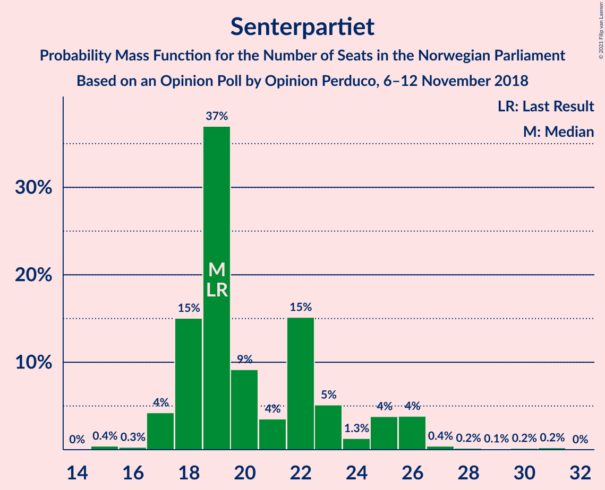

| Number of Seats | Probability | Accumulated | Special Marks |
|:---------------:|:-----------:|:-----------:|:-------------:|
| 15 | 0.4% | 100% |  |
| 16 | 0.3% | 99.6% |  |
| 17 | 4% | 99.3% |  |
| 18 | 15% | 95% |  |
| 19 | 37% | 80% | Last Result, Median |
| 20 | 9% | 43% |  |
| 21 | 4% | 34% |  |
| 22 | 15% | 30% |  |
| 23 | 5% | 15% |  |
| 24 | 1.3% | 10% |  |
| 25 | 4% | 9% |  |
| 26 | 4% | 5% |  |
| 27 | 0.4% | 1.1% |  |
| 28 | 0.2% | 0.7% |  |
| 29 | 0.1% | 0.5% |  |
| 30 | 0.2% | 0.4% |  |
| 31 | 0.2% | 0.2% |  |
| 32 | 0% | 0% |  |

### Fremskrittspartiet

*For a full overview of the results for this party, see the [Fremskrittspartiet](party-fremskrittspartiet.html) page.*

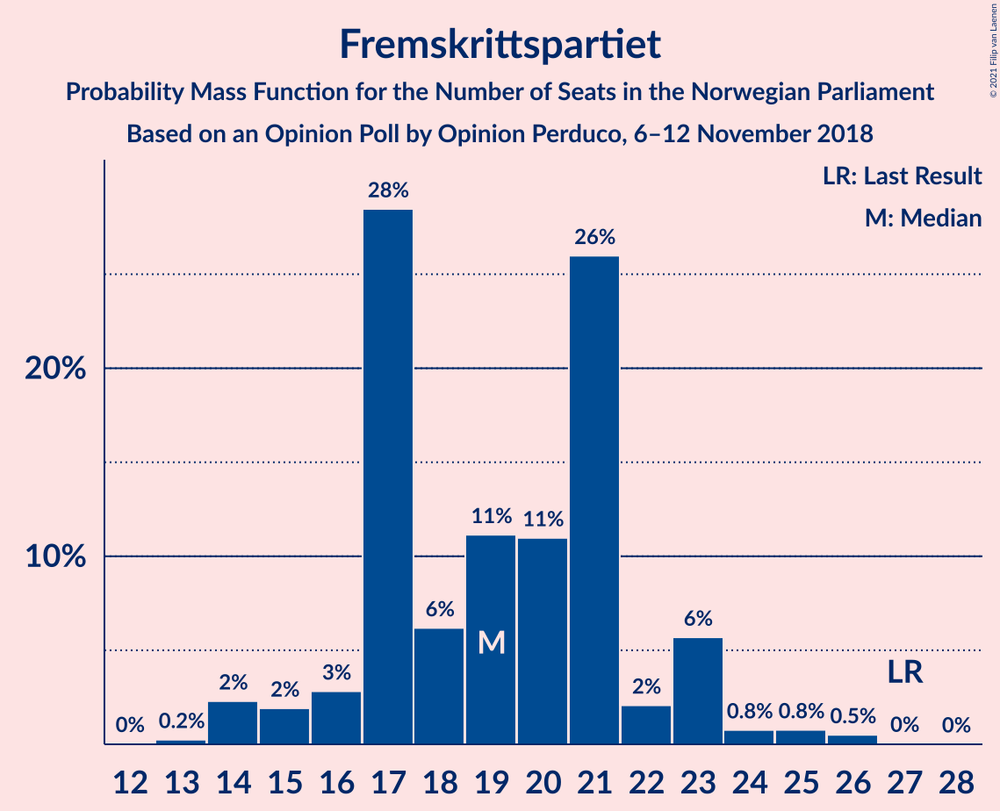

| Number of Seats | Probability | Accumulated | Special Marks |
|:---------------:|:-----------:|:-----------:|:-------------:|
| 12 | 0% | 100% |  |
| 13 | 0.2% | 99.9% |  |
| 14 | 2% | 99.7% |  |
| 15 | 2% | 97% |  |
| 16 | 3% | 95% |  |
| 17 | 28% | 93% |  |
| 18 | 6% | 64% |  |
| 19 | 11% | 58% | Median |
| 20 | 11% | 47% |  |
| 21 | 26% | 36% |  |
| 22 | 2% | 10% |  |
| 23 | 6% | 8% |  |
| 24 | 0.8% | 2% |  |
| 25 | 0.8% | 1.3% |  |
| 26 | 0.5% | 0.6% |  |
| 27 | 0% | 0.1% | Last Result |
| 28 | 0% | 0% |  |

### Sosialistisk Venstreparti

*For a full overview of the results for this party, see the [Sosialistisk Venstreparti](party-sosialistiskvenstreparti.html) page.*

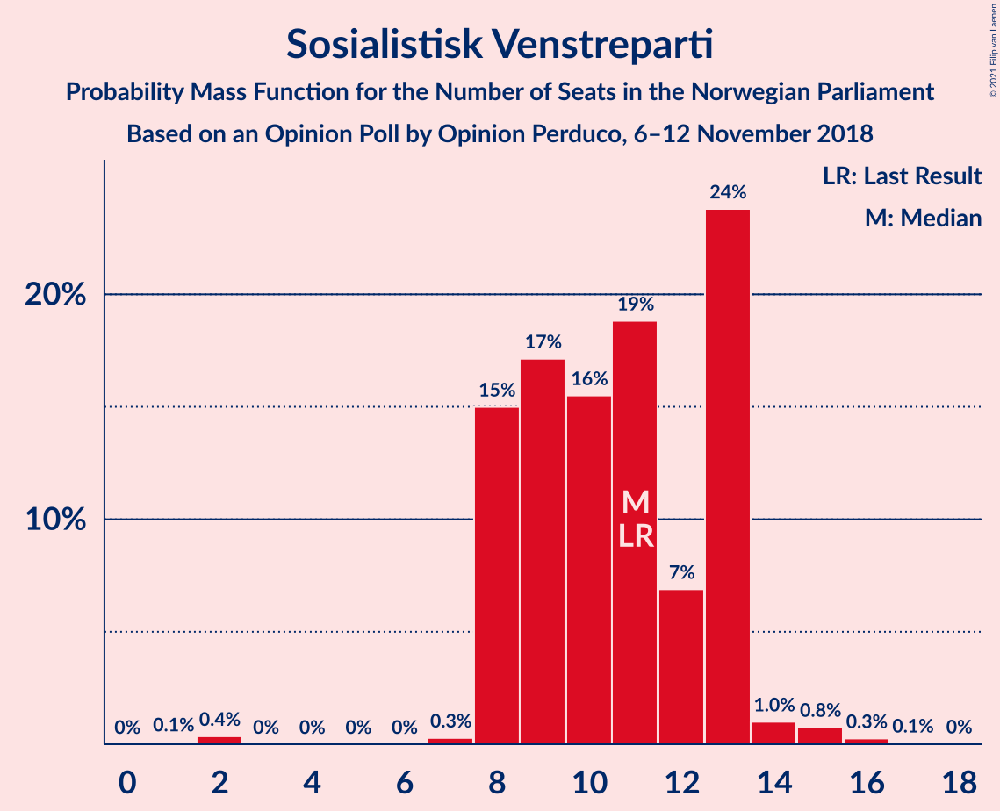

| Number of Seats | Probability | Accumulated | Special Marks |
|:---------------:|:-----------:|:-----------:|:-------------:|
| 1 | 0.1% | 100% |  |
| 2 | 0.4% | 99.9% |  |
| 3 | 0% | 99.5% |  |
| 4 | 0% | 99.5% |  |
| 5 | 0% | 99.5% |  |
| 6 | 0% | 99.5% |  |
| 7 | 0.3% | 99.5% |  |
| 8 | 15% | 99.2% |  |
| 9 | 17% | 84% |  |
| 10 | 16% | 67% |  |
| 11 | 19% | 52% | Last Result, Median |
| 12 | 7% | 33% |  |
| 13 | 24% | 26% |  |
| 14 | 1.0% | 2% |  |
| 15 | 0.8% | 1.1% |  |
| 16 | 0.3% | 0.3% |  |
| 17 | 0.1% | 0.1% |  |
| 18 | 0% | 0% |  |

### Rødt

*For a full overview of the results for this party, see the [Rødt](party-rødt.html) page.*

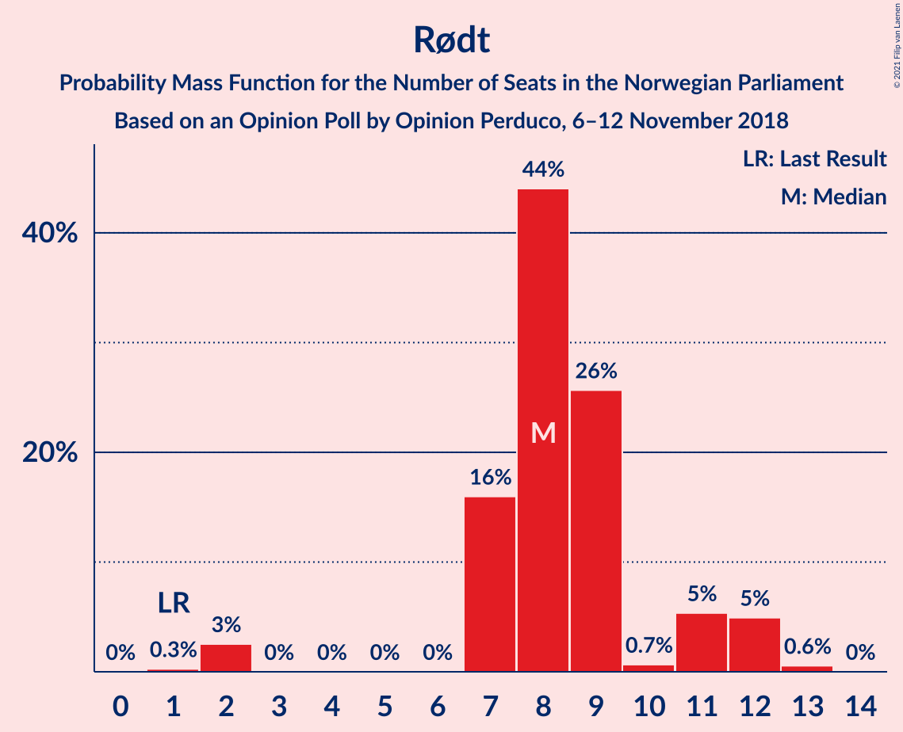

| Number of Seats | Probability | Accumulated | Special Marks |
|:---------------:|:-----------:|:-----------:|:-------------:|
| 1 | 0.3% | 100% | Last Result |
| 2 | 3% | 99.7% |  |
| 3 | 0% | 97% |  |
| 4 | 0% | 97% |  |
| 5 | 0% | 97% |  |
| 6 | 0% | 97% |  |
| 7 | 16% | 97% |  |
| 8 | 44% | 81% | Median |
| 9 | 26% | 37% |  |
| 10 | 0.7% | 12% |  |
| 11 | 5% | 11% |  |
| 12 | 5% | 6% |  |
| 13 | 0.6% | 0.6% |  |
| 14 | 0% | 0% |  |

### Kristelig Folkeparti

*For a full overview of the results for this party, see the [Kristelig Folkeparti](party-kristeligfolkeparti.html) page.*

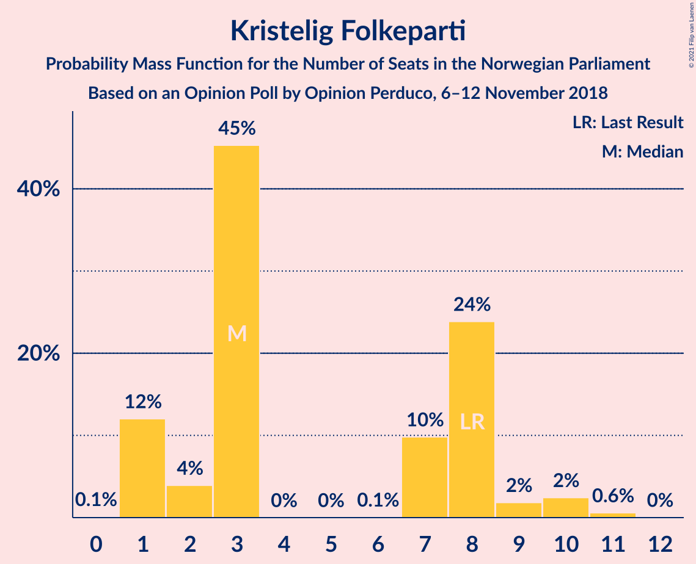

| Number of Seats | Probability | Accumulated | Special Marks |
|:---------------:|:-----------:|:-----------:|:-------------:|
| 0 | 0.1% | 100% |  |
| 1 | 12% | 99.9% |  |
| 2 | 4% | 88% |  |
| 3 | 45% | 84% | Median |
| 4 | 0% | 39% |  |
| 5 | 0% | 39% |  |
| 6 | 0.1% | 39% |  |
| 7 | 10% | 39% |  |
| 8 | 24% | 29% | Last Result |
| 9 | 2% | 5% |  |
| 10 | 2% | 3% |  |
| 11 | 0.6% | 0.6% |  |
| 12 | 0% | 0% |  |

### Venstre

*For a full overview of the results for this party, see the [Venstre](party-venstre.html) page.*

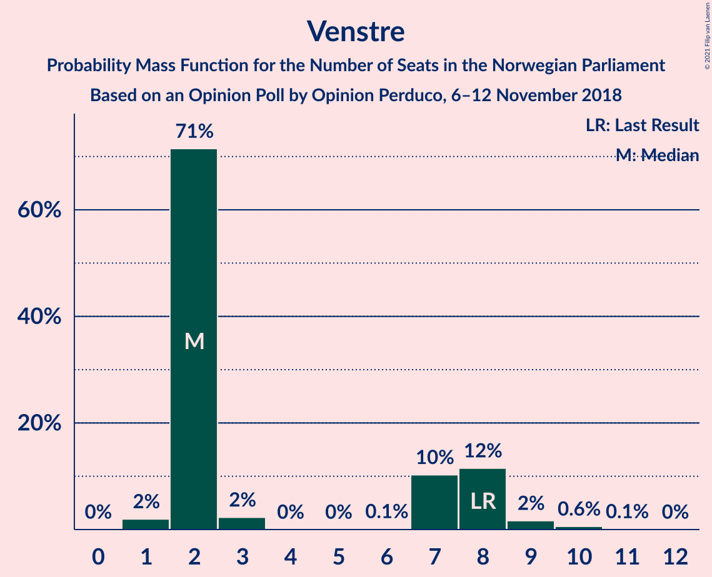

| Number of Seats | Probability | Accumulated | Special Marks |
|:---------------:|:-----------:|:-----------:|:-------------:|
| 1 | 2% | 100% |  |
| 2 | 71% | 98% | Median |
| 3 | 2% | 27% |  |
| 4 | 0% | 24% |  |
| 5 | 0% | 24% |  |
| 6 | 0.1% | 24% |  |
| 7 | 10% | 24% |  |
| 8 | 12% | 14% | Last Result |
| 9 | 2% | 2% |  |
| 10 | 0.6% | 0.7% |  |
| 11 | 0.1% | 0.1% |  |
| 12 | 0% | 0% |  |

### Miljøpartiet De Grønne

*For a full overview of the results for this party, see the [Miljøpartiet De Grønne](party-miljøpartietdegrønne.html) page.*

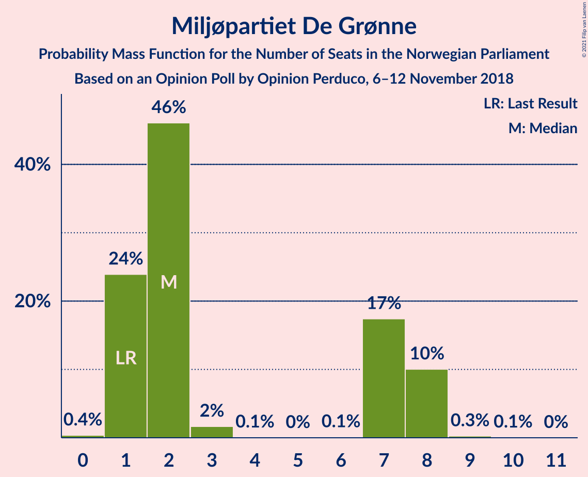

| Number of Seats | Probability | Accumulated | Special Marks |
|:---------------:|:-----------:|:-----------:|:-------------:|
| 0 | 0.4% | 100% |  |
| 1 | 24% | 99.6% | Last Result |
| 2 | 46% | 76% | Median |
| 3 | 2% | 30% |  |
| 4 | 0.1% | 28% |  |
| 5 | 0% | 28% |  |
| 6 | 0.1% | 28% |  |
| 7 | 17% | 28% |  |
| 8 | 10% | 10% |  |
| 9 | 0.3% | 0.3% |  |
| 10 | 0.1% | 0.1% |  |
| 11 | 0% | 0% |  |

## Coalitions

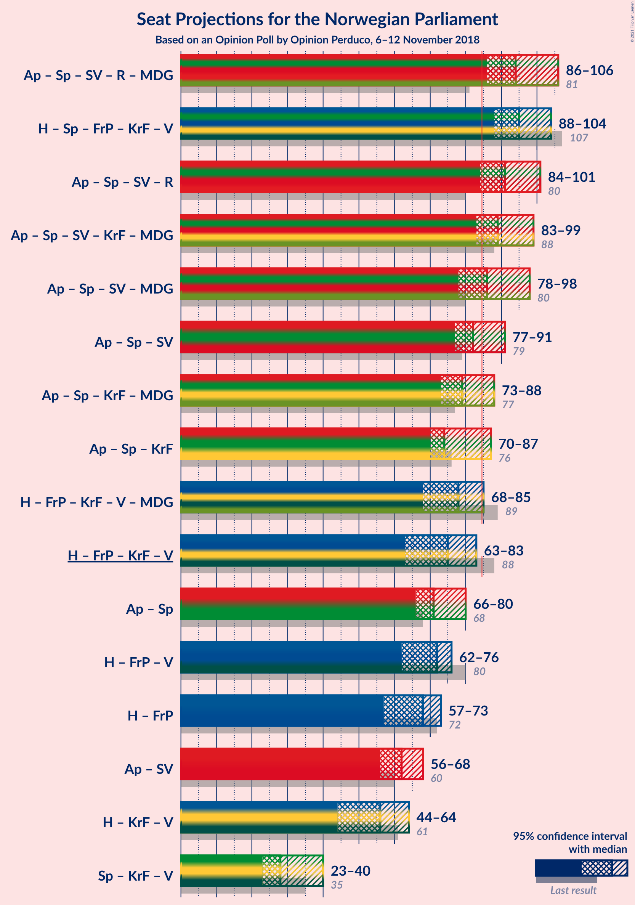

### Confidence Intervals

| Coalition | Last Result | Median | Majority? | 80% Confidence Interval | 90% Confidence Interval | 95% Confidence Interval | 99% Confidence Interval |
|:---------:|:-----------:|:------:|:---------:|:-----------------------:|:-----------------------:|:-----------------------:|:-----------------------:|
| Arbeiderpartiet – Senterpartiet – Sosialistisk Venstreparti – Rødt – Miljøpartiet De Grønne | 81 | 94 | 99.0% | 88–99 | 87–103 | 86–106 | 84–106 |
| Høyre – Senterpartiet – Fremskrittspartiet – Kristelig Folkeparti – Venstre | 107 | 95 | 99.8% | 91–101 | 89–103 | 88–104 | 86–106 |
| Arbeiderpartiet – Senterpartiet – Sosialistisk Venstreparti – Rødt | 80 | 91 | 97% | 85–97 | 85–99 | 84–101 | 82–101 |
| Arbeiderpartiet – Senterpartiet – Sosialistisk Venstreparti – Kristelig Folkeparti – Miljøpartiet De Grønne | 88 | 89 | 93% | 86–94 | 84–99 | 83–99 | 79–102 |
| Arbeiderpartiet – Senterpartiet – Sosialistisk Venstreparti – Miljøpartiet De Grønne | 80 | 86 | 67% | 80–91 | 79–92 | 78–98 | 76–98 |
| Arbeiderpartiet – Senterpartiet – Sosialistisk Venstreparti | 79 | 82 | 20% | 78–88 | 78–90 | 77–91 | 73–93 |
| Arbeiderpartiet – Senterpartiet – Kristelig Folkeparti – Miljøpartiet De Grønne | 77 | 79 | 8% | 75–84 | 74–88 | 73–88 | 70–90 |
| Arbeiderpartiet – Senterpartiet – Kristelig Folkeparti | 76 | 74 | 3% | 73–82 | 72–83 | 70–87 | 68–88 |
| Høyre – Fremskrittspartiet – Kristelig Folkeparti – Venstre – Miljøpartiet De Grønne | 89 | 78 | 3% | 72–84 | 70–84 | 68–85 | 68–87 |
| Høyre – Fremskrittspartiet – Kristelig Folkeparti – Venstre | 88 | 75 | 1.0% | 70–81 | 66–82 | 63–83 | 63–85 |
| Arbeiderpartiet – Senterpartiet | 68 | 71 | 0% | 69–78 | 67–79 | 66–80 | 63–81 |
| Høyre – Fremskrittspartiet – Venstre | 80 | 72 | 0% | 65–74 | 62–76 | 62–76 | 59–82 |
| Høyre – Fremskrittspartiet | 72 | 68 | 0% | 60–71 | 59–72 | 57–73 | 55–74 |
| Arbeiderpartiet – Sosialistisk Venstreparti | 60 | 62 | 0% | 59–66 | 57–67 | 56–68 | 53–70 |
| Høyre – Kristelig Folkeparti – Venstre | 61 | 56 | 0% | 51–62 | 45–63 | 44–64 | 44–66 |
| Senterpartiet – Kristelig Folkeparti – Venstre | 35 | 28 | 0% | 24–34 | 24–36 | 23–40 | 21–41 |

### Arbeiderpartiet – Senterpartiet – Sosialistisk Venstreparti – Rødt – Miljøpartiet De Grønne

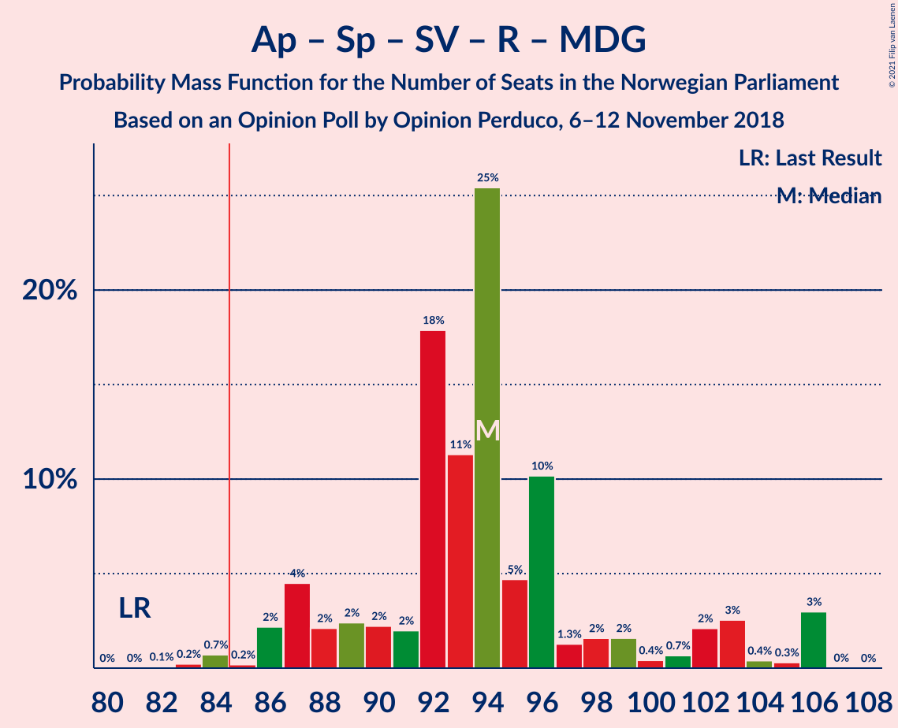

| Number of Seats | Probability | Accumulated | Special Marks |
|:---------------:|:-----------:|:-----------:|:-------------:|
| 81 | 0% | 100% | Last Result |
| 82 | 0.1% | 100% |  |
| 83 | 0.2% | 99.9% |  |
| 84 | 0.7% | 99.7% |  |
| 85 | 0.2% | 99.0% | Majority |
| 86 | 2% | 98.8% |  |
| 87 | 4% | 97% |  |
| 88 | 2% | 92% |  |
| 89 | 2% | 90% |  |
| 90 | 2% | 88% |  |
| 91 | 2% | 85% | Median |
| 92 | 18% | 83% |  |
| 93 | 11% | 65% |  |
| 94 | 25% | 54% |  |
| 95 | 5% | 29% |  |
| 96 | 10% | 24% |  |
| 97 | 1.3% | 14% |  |
| 98 | 2% | 13% |  |
| 99 | 2% | 11% |  |
| 100 | 0.4% | 9% |  |
| 101 | 0.7% | 9% |  |
| 102 | 2% | 8% |  |
| 103 | 3% | 6% |  |
| 104 | 0.4% | 4% |  |
| 105 | 0.3% | 3% |  |
| 106 | 3% | 3% |  |
| 107 | 0% | 0% |  |

### Høyre – Senterpartiet – Fremskrittspartiet – Kristelig Folkeparti – Venstre

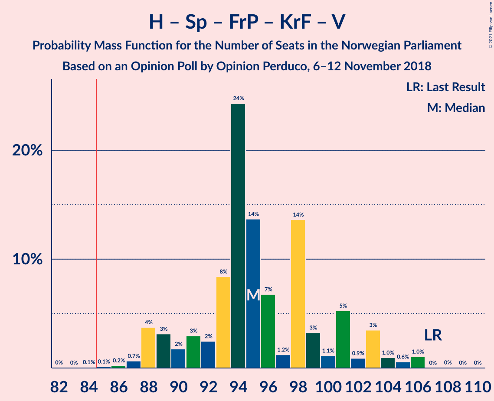

| Number of Seats | Probability | Accumulated | Special Marks |
|:---------------:|:-----------:|:-----------:|:-------------:|
| 82 | 0% | 100% |  |
| 83 | 0% | 99.9% |  |
| 84 | 0.1% | 99.9% |  |
| 85 | 0.1% | 99.8% | Majority |
| 86 | 0.2% | 99.7% |  |
| 87 | 0.7% | 99.5% |  |
| 88 | 4% | 98.8% |  |
| 89 | 3% | 95% |  |
| 90 | 2% | 92% |  |
| 91 | 3% | 90% |  |
| 92 | 2% | 87% | Median |
| 93 | 8% | 85% |  |
| 94 | 24% | 76% |  |
| 95 | 14% | 52% |  |
| 96 | 7% | 38% |  |
| 97 | 1.2% | 32% |  |
| 98 | 14% | 30% |  |
| 99 | 3% | 17% |  |
| 100 | 1.1% | 13% |  |
| 101 | 5% | 12% |  |
| 102 | 0.9% | 7% |  |
| 103 | 3% | 6% |  |
| 104 | 1.0% | 3% |  |
| 105 | 0.6% | 2% |  |
| 106 | 1.0% | 1.2% |  |
| 107 | 0% | 0.1% | Last Result |
| 108 | 0% | 0.1% |  |
| 109 | 0% | 0.1% |  |
| 110 | 0% | 0% |  |

### Arbeiderpartiet – Senterpartiet – Sosialistisk Venstreparti – Rødt

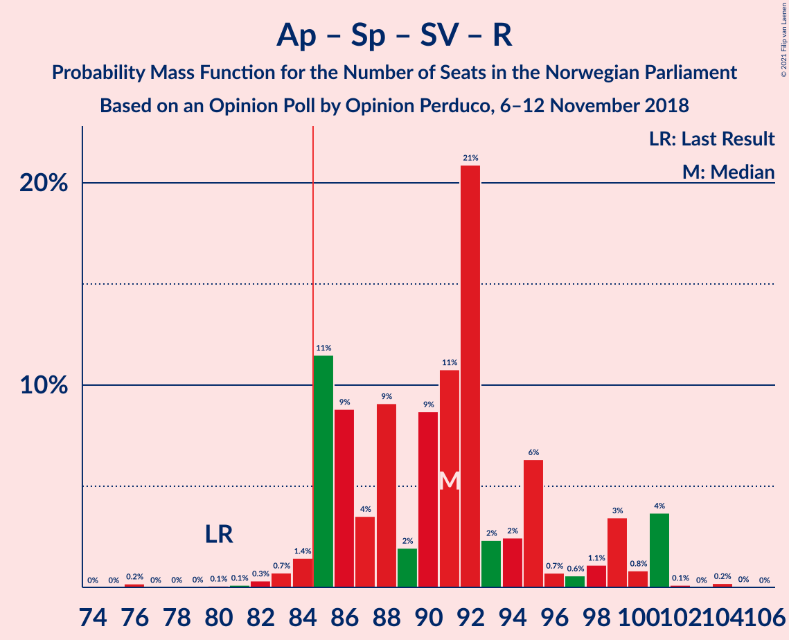

| Number of Seats | Probability | Accumulated | Special Marks |
|:---------------:|:-----------:|:-----------:|:-------------:|
| 76 | 0.2% | 100% |  |
| 77 | 0% | 99.8% |  |
| 78 | 0% | 99.8% |  |
| 79 | 0% | 99.8% |  |
| 80 | 0.1% | 99.8% | Last Result |
| 81 | 0.1% | 99.7% |  |
| 82 | 0.3% | 99.6% |  |
| 83 | 0.7% | 99.2% |  |
| 84 | 1.4% | 98.5% |  |
| 85 | 11% | 97% | Majority |
| 86 | 9% | 86% |  |
| 87 | 4% | 77% |  |
| 88 | 9% | 73% |  |
| 89 | 2% | 64% | Median |
| 90 | 9% | 62% |  |
| 91 | 11% | 54% |  |
| 92 | 21% | 43% |  |
| 93 | 2% | 22% |  |
| 94 | 2% | 20% |  |
| 95 | 6% | 17% |  |
| 96 | 0.7% | 11% |  |
| 97 | 0.6% | 10% |  |
| 98 | 1.1% | 9% |  |
| 99 | 3% | 8% |  |
| 100 | 0.8% | 5% |  |
| 101 | 4% | 4% |  |
| 102 | 0.1% | 0.4% |  |
| 103 | 0% | 0.3% |  |
| 104 | 0.2% | 0.3% |  |
| 105 | 0% | 0% |  |

### Arbeiderpartiet – Senterpartiet – Sosialistisk Venstreparti – Kristelig Folkeparti – Miljøpartiet De Grønne

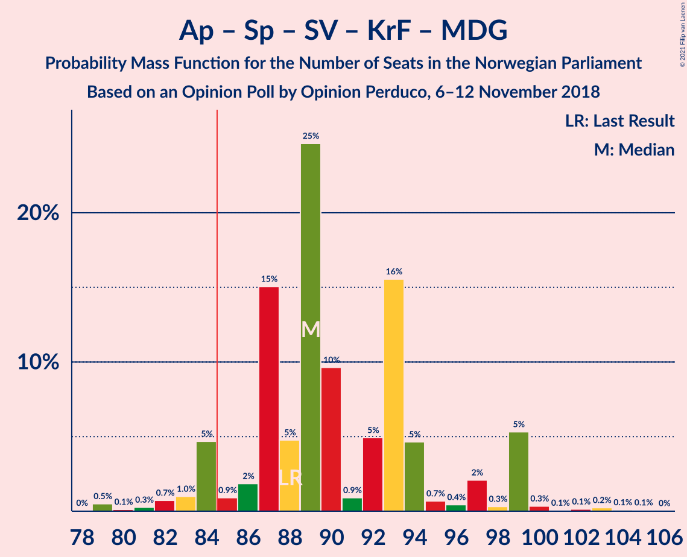

| Number of Seats | Probability | Accumulated | Special Marks |
|:---------------:|:-----------:|:-----------:|:-------------:|
| 78 | 0% | 100% |  |
| 79 | 0.5% | 99.9% |  |
| 80 | 0.1% | 99.4% |  |
| 81 | 0.3% | 99.3% |  |
| 82 | 0.7% | 99.1% |  |
| 83 | 1.0% | 98% |  |
| 84 | 5% | 97% |  |
| 85 | 0.9% | 93% | Majority |
| 86 | 2% | 92% | Median |
| 87 | 15% | 90% |  |
| 88 | 5% | 75% | Last Result |
| 89 | 25% | 70% |  |
| 90 | 10% | 45% |  |
| 91 | 0.9% | 36% |  |
| 92 | 5% | 35% |  |
| 93 | 16% | 30% |  |
| 94 | 5% | 14% |  |
| 95 | 0.7% | 10% |  |
| 96 | 0.4% | 9% |  |
| 97 | 2% | 9% |  |
| 98 | 0.3% | 7% |  |
| 99 | 5% | 6% |  |
| 100 | 0.3% | 1.0% |  |
| 101 | 0.1% | 0.6% |  |
| 102 | 0.1% | 0.6% |  |
| 103 | 0.2% | 0.4% |  |
| 104 | 0.1% | 0.2% |  |
| 105 | 0.1% | 0.1% |  |
| 106 | 0% | 0% |  |

### Arbeiderpartiet – Senterpartiet – Sosialistisk Venstreparti – Miljøpartiet De Grønne

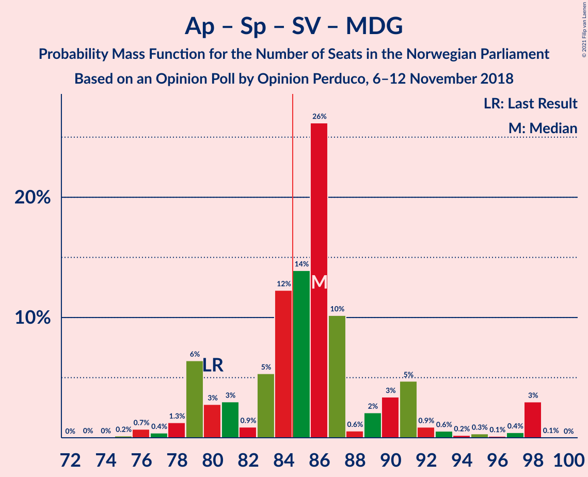

| Number of Seats | Probability | Accumulated | Special Marks |
|:---------------:|:-----------:|:-----------:|:-------------:|
| 73 | 0% | 100% |  |
| 74 | 0% | 99.9% |  |
| 75 | 0.2% | 99.9% |  |
| 76 | 0.7% | 99.7% |  |
| 77 | 0.4% | 99.0% |  |
| 78 | 1.3% | 98.6% |  |
| 79 | 6% | 97% |  |
| 80 | 3% | 91% | Last Result |
| 81 | 3% | 88% |  |
| 82 | 0.9% | 85% |  |
| 83 | 5% | 84% | Median |
| 84 | 12% | 79% |  |
| 85 | 14% | 67% | Majority |
| 86 | 26% | 53% |  |
| 87 | 10% | 27% |  |
| 88 | 0.6% | 16% |  |
| 89 | 2% | 16% |  |
| 90 | 3% | 14% |  |
| 91 | 5% | 10% |  |
| 92 | 0.9% | 6% |  |
| 93 | 0.6% | 5% |  |
| 94 | 0.2% | 4% |  |
| 95 | 0.3% | 4% |  |
| 96 | 0.1% | 4% |  |
| 97 | 0.4% | 4% |  |
| 98 | 3% | 3% |  |
| 99 | 0.1% | 0.1% |  |
| 100 | 0% | 0% |  |

### Arbeiderpartiet – Senterpartiet – Sosialistisk Venstreparti

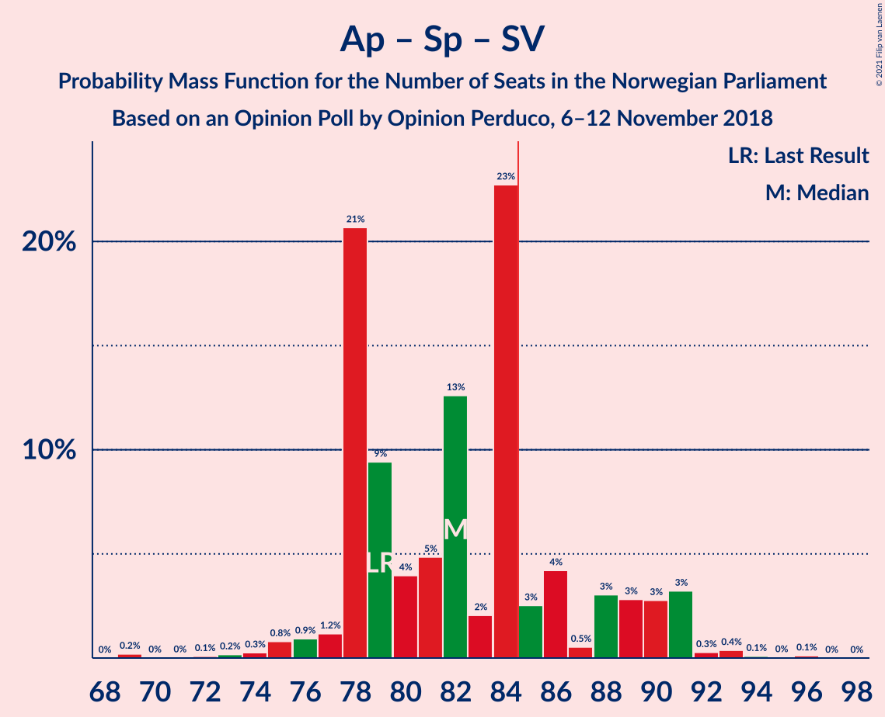

| Number of Seats | Probability | Accumulated | Special Marks |
|:---------------:|:-----------:|:-----------:|:-------------:|
| 69 | 0.2% | 100% |  |
| 70 | 0% | 99.8% |  |
| 71 | 0% | 99.8% |  |
| 72 | 0.1% | 99.8% |  |
| 73 | 0.2% | 99.7% |  |
| 74 | 0.3% | 99.5% |  |
| 75 | 0.8% | 99.2% |  |
| 76 | 0.9% | 98% |  |
| 77 | 1.2% | 98% |  |
| 78 | 21% | 96% |  |
| 79 | 9% | 76% | Last Result |
| 80 | 4% | 66% |  |
| 81 | 5% | 62% | Median |
| 82 | 13% | 57% |  |
| 83 | 2% | 45% |  |
| 84 | 23% | 43% |  |
| 85 | 3% | 20% | Majority |
| 86 | 4% | 18% |  |
| 87 | 0.5% | 13% |  |
| 88 | 3% | 13% |  |
| 89 | 3% | 10% |  |
| 90 | 3% | 7% |  |
| 91 | 3% | 4% |  |
| 92 | 0.3% | 0.9% |  |
| 93 | 0.4% | 0.6% |  |
| 94 | 0.1% | 0.3% |  |
| 95 | 0% | 0.2% |  |
| 96 | 0.1% | 0.1% |  |
| 97 | 0% | 0% |  |

### Arbeiderpartiet – Senterpartiet – Kristelig Folkeparti – Miljøpartiet De Grønne

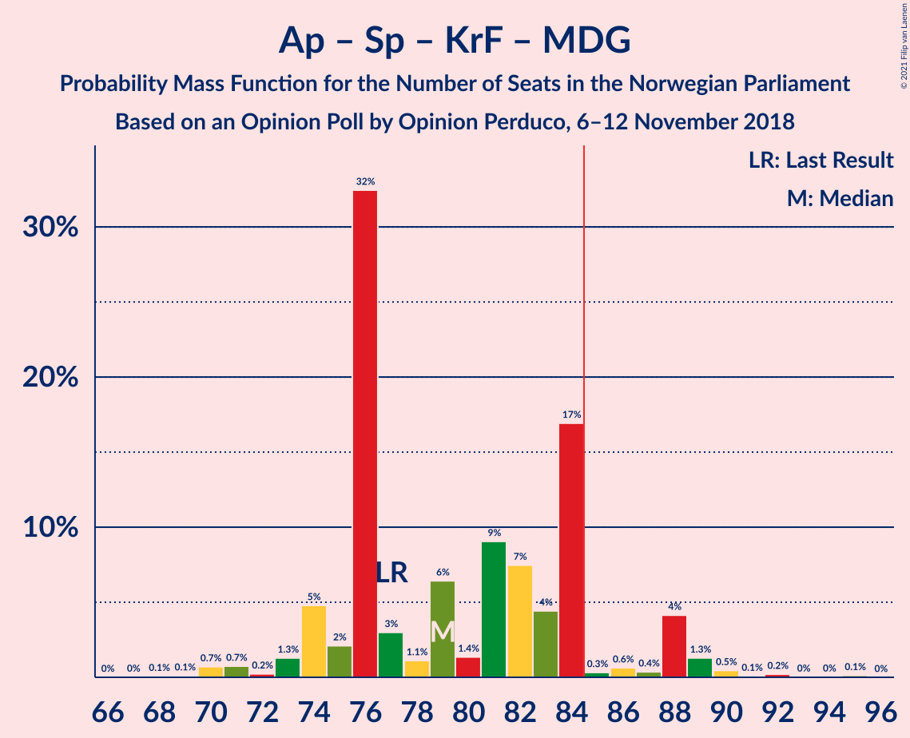

| Number of Seats | Probability | Accumulated | Special Marks |
|:---------------:|:-----------:|:-----------:|:-------------:|
| 68 | 0.1% | 100% |  |
| 69 | 0.1% | 99.9% |  |
| 70 | 0.7% | 99.8% |  |
| 71 | 0.7% | 99.1% |  |
| 72 | 0.2% | 98% |  |
| 73 | 1.3% | 98% |  |
| 74 | 5% | 97% |  |
| 75 | 2% | 92% | Median |
| 76 | 32% | 90% |  |
| 77 | 3% | 57% | Last Result |
| 78 | 1.1% | 54% |  |
| 79 | 6% | 53% |  |
| 80 | 1.4% | 47% |  |
| 81 | 9% | 46% |  |
| 82 | 7% | 37% |  |
| 83 | 4% | 29% |  |
| 84 | 17% | 25% |  |
| 85 | 0.3% | 8% | Majority |
| 86 | 0.6% | 7% |  |
| 87 | 0.4% | 7% |  |
| 88 | 4% | 6% |  |
| 89 | 1.3% | 2% |  |
| 90 | 0.5% | 0.9% |  |
| 91 | 0.1% | 0.5% |  |
| 92 | 0.2% | 0.4% |  |
| 93 | 0% | 0.2% |  |
| 94 | 0% | 0.2% |  |
| 95 | 0.1% | 0.1% |  |
| 96 | 0% | 0% |  |

### Arbeiderpartiet – Senterpartiet – Kristelig Folkeparti

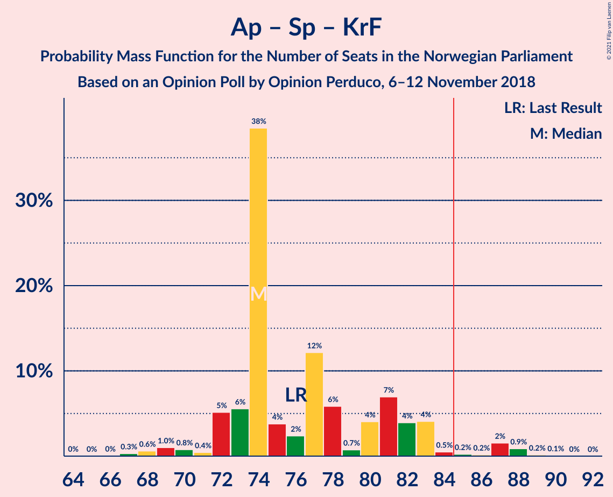

| Number of Seats | Probability | Accumulated | Special Marks |
|:---------------:|:-----------:|:-----------:|:-------------:|
| 64 | 0% | 100% |  |
| 65 | 0% | 99.9% |  |
| 66 | 0% | 99.9% |  |
| 67 | 0.3% | 99.9% |  |
| 68 | 0.6% | 99.6% |  |
| 69 | 1.0% | 99.0% |  |
| 70 | 0.8% | 98% |  |
| 71 | 0.4% | 97% |  |
| 72 | 5% | 97% |  |
| 73 | 6% | 92% | Median |
| 74 | 38% | 86% |  |
| 75 | 4% | 48% |  |
| 76 | 2% | 44% | Last Result |
| 77 | 12% | 41% |  |
| 78 | 6% | 29% |  |
| 79 | 0.7% | 23% |  |
| 80 | 4% | 23% |  |
| 81 | 7% | 19% |  |
| 82 | 4% | 12% |  |
| 83 | 4% | 8% |  |
| 84 | 0.5% | 4% |  |
| 85 | 0.2% | 3% | Majority |
| 86 | 0.2% | 3% |  |
| 87 | 2% | 3% |  |
| 88 | 0.9% | 1.1% |  |
| 89 | 0.2% | 0.3% |  |
| 90 | 0.1% | 0.1% |  |
| 91 | 0% | 0% |  |

### Høyre – Fremskrittspartiet – Kristelig Folkeparti – Venstre – Miljøpartiet De Grønne

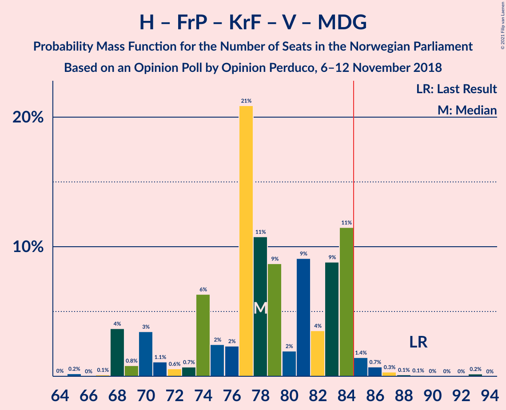

| Number of Seats | Probability | Accumulated | Special Marks |
|:---------------:|:-----------:|:-----------:|:-------------:|
| 65 | 0.2% | 100% |  |
| 66 | 0% | 99.7% |  |
| 67 | 0.1% | 99.7% |  |
| 68 | 4% | 99.6% |  |
| 69 | 0.8% | 96% |  |
| 70 | 3% | 95% |  |
| 71 | 1.1% | 92% |  |
| 72 | 0.6% | 91% |  |
| 73 | 0.7% | 90% |  |
| 74 | 6% | 89% |  |
| 75 | 2% | 83% | Median |
| 76 | 2% | 80% |  |
| 77 | 21% | 78% |  |
| 78 | 11% | 57% |  |
| 79 | 9% | 46% |  |
| 80 | 2% | 38% |  |
| 81 | 9% | 36% |  |
| 82 | 4% | 27% |  |
| 83 | 9% | 23% |  |
| 84 | 11% | 14% |  |
| 85 | 1.4% | 3% | Majority |
| 86 | 0.7% | 1.5% |  |
| 87 | 0.3% | 0.8% |  |
| 88 | 0.1% | 0.4% |  |
| 89 | 0.1% | 0.3% | Last Result |
| 90 | 0% | 0.2% |  |
| 91 | 0% | 0.2% |  |
| 92 | 0% | 0.2% |  |
| 93 | 0.2% | 0.2% |  |
| 94 | 0% | 0% |  |

### Høyre – Fremskrittspartiet – Kristelig Folkeparti – Venstre

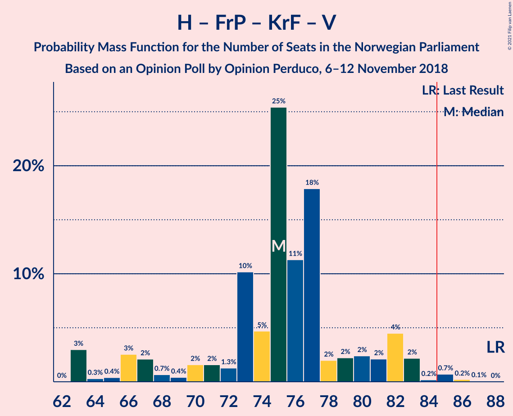

| Number of Seats | Probability | Accumulated | Special Marks |
|:---------------:|:-----------:|:-----------:|:-------------:|
| 63 | 3% | 100% |  |
| 64 | 0.3% | 97% |  |
| 65 | 0.4% | 97% |  |
| 66 | 3% | 96% |  |
| 67 | 2% | 94% |  |
| 68 | 0.7% | 92% |  |
| 69 | 0.4% | 91% |  |
| 70 | 2% | 91% |  |
| 71 | 2% | 89% |  |
| 72 | 1.3% | 87% |  |
| 73 | 10% | 86% | Median |
| 74 | 5% | 76% |  |
| 75 | 25% | 71% |  |
| 76 | 11% | 46% |  |
| 77 | 18% | 35% |  |
| 78 | 2% | 17% |  |
| 79 | 2% | 15% |  |
| 80 | 2% | 12% |  |
| 81 | 2% | 10% |  |
| 82 | 4% | 8% |  |
| 83 | 2% | 3% |  |
| 84 | 0.2% | 1.2% |  |
| 85 | 0.7% | 1.0% | Majority |
| 86 | 0.2% | 0.3% |  |
| 87 | 0.1% | 0.1% |  |
| 88 | 0% | 0% | Last Result |

### Arbeiderpartiet – Senterpartiet

| Number of Seats | Probability | Accumulated | Special Marks |
|:---------------:|:-----------:|:-----------:|:-------------:|
| 60 | 0.2% | 100% |  |
| 61 | 0.1% | 99.8% |  |
| 62 | 0.1% | 99.7% |  |
| 63 | 0.1% | 99.6% |  |
| 64 | 0.4% | 99.5% |  |
| 65 | 1.2% | 99.1% |  |
| 66 | 1.4% | 98% |  |
| 67 | 5% | 97% |  |
| 68 | 0.4% | 91% | Last Result |
| 69 | 13% | 91% |  |
| 70 | 11% | 78% | Median |
| 71 | 41% | 68% |  |
| 72 | 2% | 27% |  |
| 73 | 4% | 25% |  |
| 74 | 1.1% | 21% |  |
| 75 | 5% | 20% |  |
| 76 | 3% | 15% |  |
| 77 | 2% | 12% |  |
| 78 | 0.8% | 10% |  |
| 79 | 5% | 9% |  |
| 80 | 4% | 5% |  |
| 81 | 0.3% | 0.6% |  |
| 82 | 0.1% | 0.3% |  |
| 83 | 0.1% | 0.2% |  |
| 84 | 0.1% | 0.1% |  |
| 85 | 0% | 0% | Majority |

### Høyre – Fremskrittspartiet – Venstre

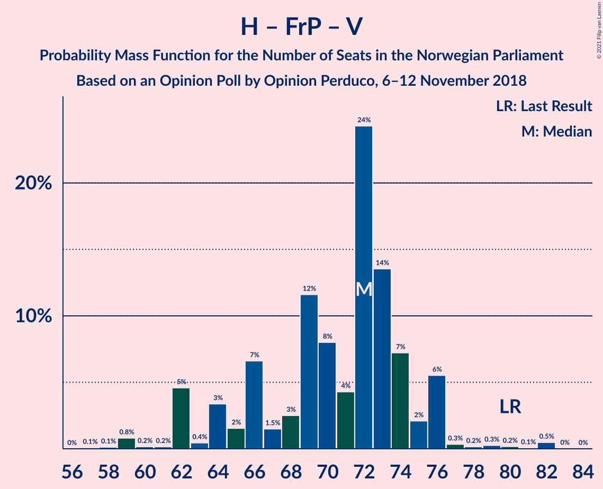

| Number of Seats | Probability | Accumulated | Special Marks |
|:---------------:|:-----------:|:-----------:|:-------------:|
| 57 | 0.1% | 100% |  |
| 58 | 0.1% | 99.9% |  |
| 59 | 0.8% | 99.8% |  |
| 60 | 0.2% | 99.0% |  |
| 61 | 0.2% | 98.8% |  |
| 62 | 5% | 98.7% |  |
| 63 | 0.4% | 94% |  |
| 64 | 3% | 94% |  |
| 65 | 2% | 90% |  |
| 66 | 7% | 89% |  |
| 67 | 1.5% | 82% |  |
| 68 | 3% | 81% |  |
| 69 | 12% | 78% |  |
| 70 | 8% | 66% | Median |
| 71 | 4% | 58% |  |
| 72 | 24% | 54% |  |
| 73 | 14% | 30% |  |
| 74 | 7% | 16% |  |
| 75 | 2% | 9% |  |
| 76 | 6% | 7% |  |
| 77 | 0.3% | 2% |  |
| 78 | 0.2% | 1.2% |  |
| 79 | 0.3% | 1.0% |  |
| 80 | 0.2% | 0.8% | Last Result |
| 81 | 0.1% | 0.6% |  |
| 82 | 0.5% | 0.5% |  |
| 83 | 0% | 0% |  |

### Høyre – Fremskrittspartiet

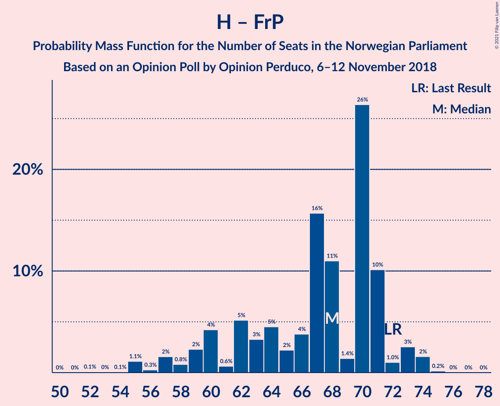

| Number of Seats | Probability | Accumulated | Special Marks |
|:---------------:|:-----------:|:-----------:|:-------------:|
| 52 | 0.1% | 100% |  |
| 53 | 0% | 99.9% |  |
| 54 | 0.1% | 99.9% |  |
| 55 | 1.1% | 99.8% |  |
| 56 | 0.3% | 98.7% |  |
| 57 | 2% | 98% |  |
| 58 | 0.8% | 97% |  |
| 59 | 2% | 96% |  |
| 60 | 4% | 94% |  |
| 61 | 0.6% | 90% |  |
| 62 | 5% | 89% |  |
| 63 | 3% | 84% |  |
| 64 | 5% | 80% |  |
| 65 | 2% | 76% |  |
| 66 | 4% | 74% |  |
| 67 | 16% | 70% |  |
| 68 | 11% | 54% | Median |
| 69 | 1.4% | 43% |  |
| 70 | 26% | 42% |  |
| 71 | 10% | 15% |  |
| 72 | 1.0% | 5% | Last Result |
| 73 | 3% | 4% |  |
| 74 | 2% | 2% |  |
| 75 | 0.2% | 0.2% |  |
| 76 | 0% | 0.1% |  |
| 77 | 0% | 0% |  |

### Arbeiderpartiet – Sosialistisk Venstreparti

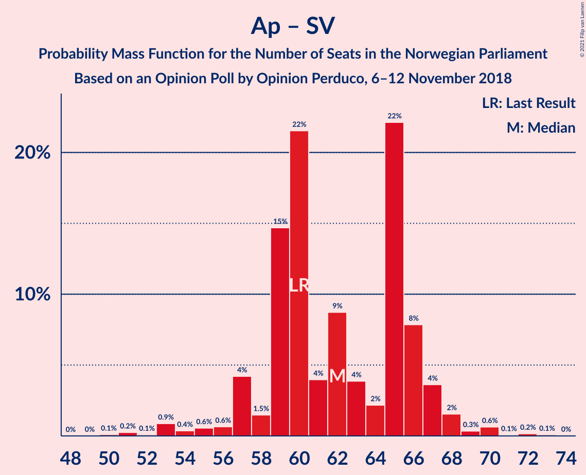

| Number of Seats | Probability | Accumulated | Special Marks |
|:---------------:|:-----------:|:-----------:|:-------------:|
| 50 | 0.1% | 100% |  |
| 51 | 0.2% | 99.9% |  |
| 52 | 0.1% | 99.6% |  |
| 53 | 0.9% | 99.5% |  |
| 54 | 0.4% | 98.7% |  |
| 55 | 0.6% | 98% |  |
| 56 | 0.6% | 98% |  |
| 57 | 4% | 97% |  |
| 58 | 1.5% | 93% |  |
| 59 | 15% | 91% |  |
| 60 | 22% | 77% | Last Result |
| 61 | 4% | 55% |  |
| 62 | 9% | 51% | Median |
| 63 | 4% | 43% |  |
| 64 | 2% | 39% |  |
| 65 | 22% | 36% |  |
| 66 | 8% | 14% |  |
| 67 | 4% | 6% |  |
| 68 | 2% | 3% |  |
| 69 | 0.3% | 1.3% |  |
| 70 | 0.6% | 1.0% |  |
| 71 | 0.1% | 0.3% |  |
| 72 | 0.2% | 0.3% |  |
| 73 | 0.1% | 0.1% |  |
| 74 | 0% | 0% |  |

### Høyre – Kristelig Folkeparti – Venstre

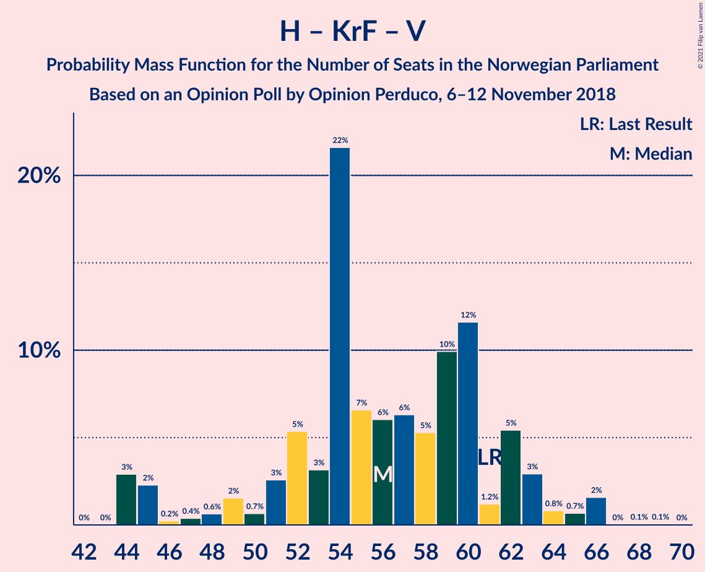

| Number of Seats | Probability | Accumulated | Special Marks |
|:---------------:|:-----------:|:-----------:|:-------------:|
| 44 | 3% | 100% |  |
| 45 | 2% | 97% |  |
| 46 | 0.2% | 95% |  |
| 47 | 0.4% | 95% |  |
| 48 | 0.6% | 94% |  |
| 49 | 2% | 93% |  |
| 50 | 0.7% | 92% |  |
| 51 | 3% | 91% |  |
| 52 | 5% | 89% |  |
| 53 | 3% | 83% |  |
| 54 | 22% | 80% | Median |
| 55 | 7% | 59% |  |
| 56 | 6% | 52% |  |
| 57 | 6% | 46% |  |
| 58 | 5% | 40% |  |
| 59 | 10% | 34% |  |
| 60 | 12% | 24% |  |
| 61 | 1.2% | 13% | Last Result |
| 62 | 5% | 12% |  |
| 63 | 3% | 6% |  |
| 64 | 0.8% | 3% |  |
| 65 | 0.7% | 2% |  |
| 66 | 2% | 2% |  |
| 67 | 0% | 0.2% |  |
| 68 | 0.1% | 0.1% |  |
| 69 | 0.1% | 0.1% |  |
| 70 | 0% | 0% |  |

### Senterpartiet – Kristelig Folkeparti – Venstre

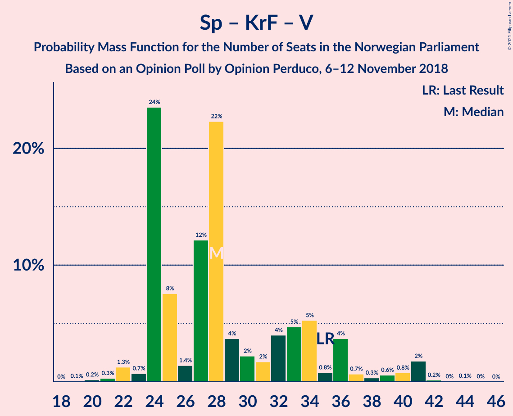

| Number of Seats | Probability | Accumulated | Special Marks |
|:---------------:|:-----------:|:-----------:|:-------------:|
| 19 | 0.1% | 100% |  |
| 20 | 0.2% | 99.9% |  |
| 21 | 0.3% | 99.8% |  |
| 22 | 1.3% | 99.5% |  |
| 23 | 0.7% | 98% |  |
| 24 | 24% | 97% | Median |
| 25 | 8% | 74% |  |
| 26 | 1.4% | 66% |  |
| 27 | 12% | 65% |  |
| 28 | 22% | 53% |  |
| 29 | 4% | 31% |  |
| 30 | 2% | 27% |  |
| 31 | 2% | 25% |  |
| 32 | 4% | 23% |  |
| 33 | 5% | 19% |  |
| 34 | 5% | 14% |  |
| 35 | 0.8% | 9% | Last Result |
| 36 | 4% | 8% |  |
| 37 | 0.7% | 4% |  |
| 38 | 0.3% | 4% |  |
| 39 | 0.6% | 3% |  |
| 40 | 0.8% | 3% |  |
| 41 | 2% | 2% |  |
| 42 | 0.2% | 0.3% |  |
| 43 | 0% | 0.1% |  |
| 44 | 0.1% | 0.1% |  |
| 45 | 0% | 0% |  |

## Technical Information

### Opinion Poll

+ **Polling firm:** Opinion Perduco
+ **Commissioner(s):** —
+ **Fieldwork period:** 6–12 November 2018

### Calculations

+ **Sample size:** 703
+ **Simulations done:** 131,072
+ **Error estimate:** 1.36%

