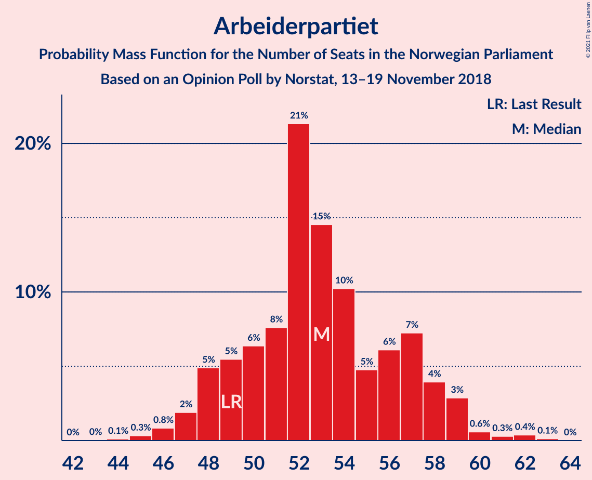
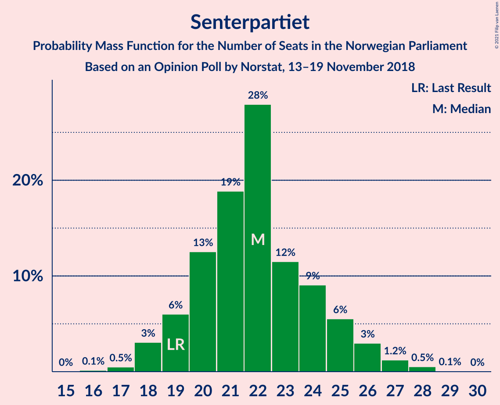
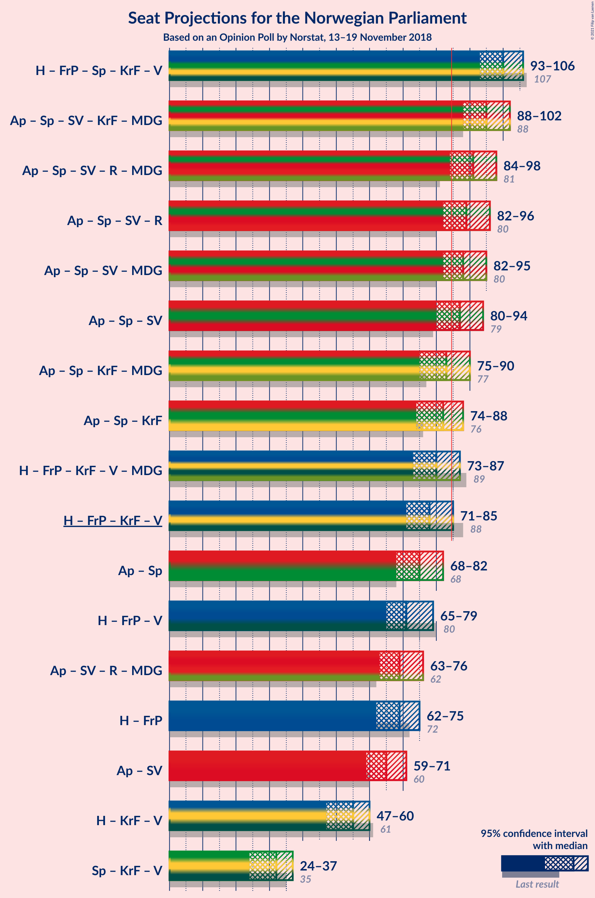
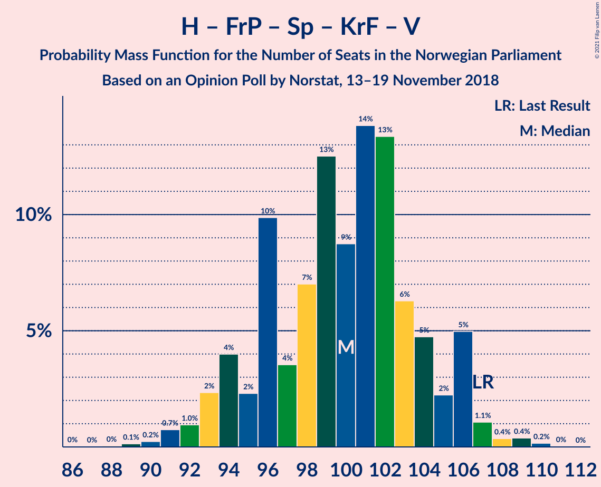
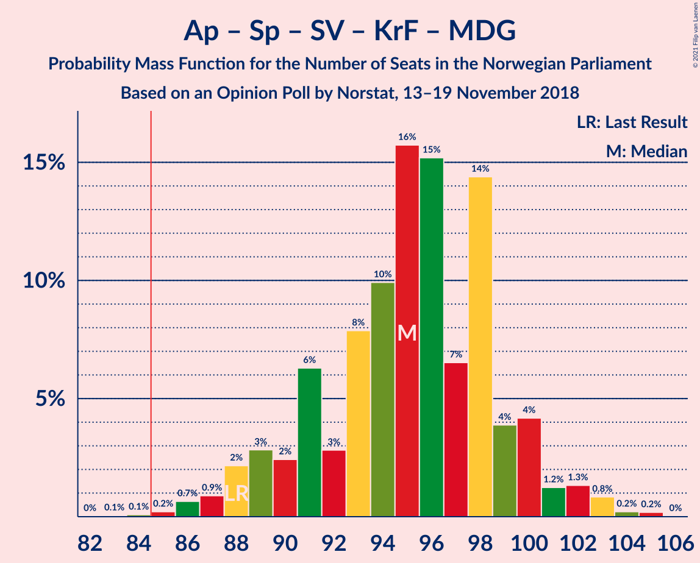
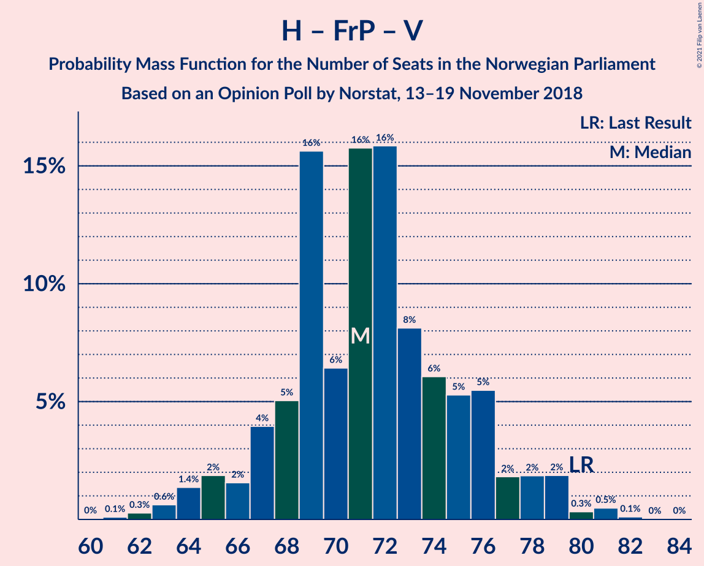

# Opinion Poll by Norstat, 13–19 November 2018

<a href="#voting-intentions">Voting Intentions</a> | <a href="#seats">Seats</a> | <a href="#coalitions">Coalitions</a> | <a href="#technical-information">Technical Information</a>

## Voting Intentions

### Confidence Intervals

| Party | Last Result | Poll Result | 80% Confidence Interval | 90% Confidence Interval | 95% Confidence Interval | 99% Confidence Interval |
|:-----:|:-----------:|:-----------:|:-----------------------:|:-----------------------:|:-----------------------:|:-----------------------:|
| Arbeiderpartiet | 27.4% | 28.8% | 27.0–30.8% |26.4–31.3% |26.0–31.8% |25.1–32.8% |
| Høyre | 25.0% | 24.4% | 22.7–26.3% |22.2–26.8% |21.8–27.3% |21.0–28.2% |
| Fremskrittspartiet | 15.2% | 13.1% | 11.8–14.6% |11.4–15.1% |11.1–15.5% |10.5–16.2% |
| Senterpartiet | 10.3% | 12.0% | 10.7–13.4% |10.3–13.8% |10.0–14.2% |9.4–14.9% |
| Sosialistisk Venstreparti | 6.0% | 6.5% | 5.6–7.7% |5.3–8.0% |5.1–8.3% |4.7–8.9% |
| Kristelig Folkeparti | 4.2% | 4.3% | 3.5–5.2% |3.3–5.5% |3.1–5.8% |2.8–6.3% |
| Rødt | 2.4% | 3.3% | 2.7–4.2% |2.5–4.4% |2.3–4.7% |2.1–5.1% |
| Venstre | 4.4% | 3.2% | 2.6–4.1% |2.4–4.3% |2.3–4.5% |2.0–5.0% |
| Miljøpartiet De Grønne | 3.2% | 2.9% | 2.3–3.7% |2.1–4.0% |2.0–4.2% |1.7–4.6% |

*Note:* The poll result column reflects the actual value used in the calculations. Published results may vary slightly, and in addition be rounded to fewer digits.

## Seats

### Confidence Intervals

| Party | Last Result | Median | 80% Confidence Interval | 90% Confidence Interval | 95% Confidence Interval | 99% Confidence Interval |
|:-----:|:-----------:|:------:|:-----------------------:|:-----------------------:|:-----------------------:|:-----------------------:|
| <a href="#arbeiderpartiet">Arbeiderpartiet</a> | 49 | 53 | 49–59 |48–59 |48–60 |45–61 |
| <a href="#høyre">Høyre</a> | 45 | 45 | 41–48 |40–50 |38–51 |38–51 |
| <a href="#fremskrittspartiet">Fremskrittspartiet</a> | 27 | 24 | 22–28 |21–28 |20–29 |18–30 |
| <a href="#senterpartiet">Senterpartiet</a> | 19 | 22 | 19–25 |18–26 |18–26 |17–27 |
| <a href="#sosialistisk-venstreparti">Sosialistisk Venstreparti</a> | 11 | 11 | 10–14 |9–14 |9–15 |8–16 |
| <a href="#kristelig-folkeparti">Kristelig Folkeparti</a> | 8 | 3 | 2–9 |2–10 |1–10 |1–12 |
| <a href="#rødt">Rødt</a> | 1 | 2 | 1–7 |1–8 |1–8 |1–9 |
| <a href="#venstre">Venstre</a> | 8 | 2 | 2–7 |2–7 |1–8 |1–9 |
| <a href="#miljøpartiet-de-grønne">Miljøpartiet De Grønne</a> | 1 | 1 | 1–2 |1–7 |1–8 |0–8 |

### Arbeiderpartiet

*For a full overview of the results for this party, see the [Arbeiderpartiet](party-arbeiderpartiet.html) page.*

| Number of Seats | Probability | Accumulated | Special Marks |
|:---------------:|:-----------:|:-----------:|:-------------:|
| 43 | 0.1% | 100% |  |
| 44 | 0.2% | 99.9% |  |
| 45 | 0.3% | 99.7% |  |
| 46 | 0.7% | 99.5% |  |
| 47 | 0.9% | 98.8% |  |
| 48 | 5% | 98% |  |
| 49 | 5% | 92% | Last Result |
| 50 | 3% | 87% |  |
| 51 | 4% | 84% |  |
| 52 | 20% | 80% |  |
| 53 | 13% | 59% | Median |
| 54 | 5% | 46% |  |
| 55 | 3% | 41% |  |
| 56 | 5% | 38% |  |
| 57 | 1.5% | 33% |  |
| 58 | 2% | 31% |  |
| 59 | 27% | 30% |  |
| 60 | 2% | 3% |  |
| 61 | 0.6% | 0.7% |  |
| 62 | 0% | 0.1% |  |
| 63 | 0% | 0% |  |

### Høyre

*For a full overview of the results for this party, see the [Høyre](party-høyre.html) page.*

| Number of Seats | Probability | Accumulated | Special Marks |
|:---------------:|:-----------:|:-----------:|:-------------:|
| 35 | 0.1% | 100% |  |
| 36 | 0.1% | 99.9% |  |
| 37 | 0.2% | 99.9% |  |
| 38 | 2% | 99.6% |  |
| 39 | 1.0% | 97% |  |
| 40 | 4% | 96% |  |
| 41 | 4% | 92% |  |
| 42 | 5% | 89% |  |
| 43 | 9% | 83% |  |
| 44 | 3% | 74% |  |
| 45 | 42% | 71% | Last Result, Median |
| 46 | 13% | 29% |  |
| 47 | 4% | 16% |  |
| 48 | 5% | 11% |  |
| 49 | 1.1% | 6% |  |
| 50 | 2% | 5% |  |
| 51 | 2% | 3% |  |
| 52 | 0.1% | 0.3% |  |
| 53 | 0.2% | 0.2% |  |
| 54 | 0% | 0% |  |

### Fremskrittspartiet

*For a full overview of the results for this party, see the [Fremskrittspartiet](party-fremskrittspartiet.html) page.*

| Number of Seats | Probability | Accumulated | Special Marks |
|:---------------:|:-----------:|:-----------:|:-------------:|
| 17 | 0.2% | 100% |  |
| 18 | 0.3% | 99.7% |  |
| 19 | 2% | 99.5% |  |
| 20 | 2% | 98% |  |
| 21 | 4% | 96% |  |
| 22 | 6% | 92% |  |
| 23 | 8% | 86% |  |
| 24 | 34% | 78% | Median |
| 25 | 15% | 43% |  |
| 26 | 5% | 28% |  |
| 27 | 4% | 23% | Last Result |
| 28 | 16% | 19% |  |
| 29 | 2% | 3% |  |
| 30 | 0.5% | 0.6% |  |
| 31 | 0% | 0.1% |  |
| 32 | 0% | 0% |  |

### Senterpartiet

*For a full overview of the results for this party, see the [Senterpartiet](party-senterpartiet.html) page.*

| Number of Seats | Probability | Accumulated | Special Marks |
|:---------------:|:-----------:|:-----------:|:-------------:|
| 16 | 0.2% | 100% |  |
| 17 | 0.7% | 99.8% |  |
| 18 | 7% | 99.1% |  |
| 19 | 7% | 92% | Last Result |
| 20 | 14% | 85% |  |
| 21 | 15% | 70% |  |
| 22 | 36% | 56% | Median |
| 23 | 3% | 20% |  |
| 24 | 6% | 17% |  |
| 25 | 6% | 11% |  |
| 26 | 4% | 5% |  |
| 27 | 0.8% | 0.9% |  |
| 28 | 0% | 0.1% |  |
| 29 | 0.1% | 0.1% |  |
| 30 | 0% | 0% |  |

### Sosialistisk Venstreparti

*For a full overview of the results for this party, see the [Sosialistisk Venstreparti](party-sosialistiskvenstreparti.html) page.*

| Number of Seats | Probability | Accumulated | Special Marks |
|:---------------:|:-----------:|:-----------:|:-------------:|
| 8 | 2% | 100% |  |
| 9 | 5% | 98% |  |
| 10 | 8% | 93% |  |
| 11 | 42% | 85% | Last Result, Median |
| 12 | 23% | 43% |  |
| 13 | 10% | 20% |  |
| 14 | 7% | 10% |  |
| 15 | 2% | 3% |  |
| 16 | 0.6% | 1.0% |  |
| 17 | 0.3% | 0.3% |  |
| 18 | 0% | 0% |  |

### Kristelig Folkeparti

*For a full overview of the results for this party, see the [Kristelig Folkeparti](party-kristeligfolkeparti.html) page.*

| Number of Seats | Probability | Accumulated | Special Marks |
|:---------------:|:-----------:|:-----------:|:-------------:|
| 1 | 4% | 100% |  |
| 2 | 14% | 96% |  |
| 3 | 36% | 82% | Median |
| 4 | 0% | 46% |  |
| 5 | 0% | 46% |  |
| 6 | 0% | 46% |  |
| 7 | 6% | 46% |  |
| 8 | 25% | 40% | Last Result |
| 9 | 6% | 15% |  |
| 10 | 7% | 9% |  |
| 11 | 1.3% | 2% |  |
| 12 | 0.7% | 0.7% |  |
| 13 | 0% | 0% |  |

### Rødt

*For a full overview of the results for this party, see the [Rødt](party-rødt.html) page.*

| Number of Seats | Probability | Accumulated | Special Marks |
|:---------------:|:-----------:|:-----------:|:-------------:|
| 1 | 22% | 100% | Last Result |
| 2 | 65% | 78% | Median |
| 3 | 0% | 13% |  |
| 4 | 0% | 13% |  |
| 5 | 0% | 13% |  |
| 6 | 0% | 13% |  |
| 7 | 4% | 13% |  |
| 8 | 8% | 10% |  |
| 9 | 2% | 2% |  |
| 10 | 0.1% | 0.2% |  |
| 11 | 0% | 0% |  |

### Venstre

*For a full overview of the results for this party, see the [Venstre](party-venstre.html) page.*

| Number of Seats | Probability | Accumulated | Special Marks |
|:---------------:|:-----------:|:-----------:|:-------------:|
| 0 | 0.1% | 100% |  |
| 1 | 3% | 99.9% |  |
| 2 | 79% | 97% | Median |
| 3 | 0.5% | 17% |  |
| 4 | 0% | 17% |  |
| 5 | 0% | 17% |  |
| 6 | 0% | 17% |  |
| 7 | 14% | 17% |  |
| 8 | 2% | 3% | Last Result |
| 9 | 0.8% | 0.9% |  |
| 10 | 0.1% | 0.1% |  |
| 11 | 0% | 0% |  |

### Miljøpartiet De Grønne

*For a full overview of the results for this party, see the [Miljøpartiet De Grønne](party-miljøpartietdegrønne.html) page.*

| Number of Seats | Probability | Accumulated | Special Marks |
|:---------------:|:-----------:|:-----------:|:-------------:|
| 0 | 1.4% | 100% |  |
| 1 | 67% | 98.6% | Last Result, Median |
| 2 | 25% | 32% |  |
| 3 | 2% | 7% |  |
| 4 | 0% | 5% |  |
| 5 | 0% | 5% |  |
| 6 | 0% | 5% |  |
| 7 | 1.2% | 5% |  |
| 8 | 4% | 4% |  |
| 9 | 0.1% | 0.1% |  |
| 10 | 0% | 0% |  |

## Coalitions

### Confidence Intervals

| Coalition | Last Result | Median | Majority? | 80% Confidence Interval | 90% Confidence Interval | 95% Confidence Interval | 99% Confidence Interval |
|:---------:|:-----------:|:------:|:---------:|:-----------------------:|:-----------------------:|:-----------------------:|:-----------------------:|
| Høyre – Fremskrittspartiet – Senterpartiet – Kristelig Folkeparti – Venstre | 107 | 99 | 100% | 95–104 | 94–106 | 93–107 | 89–107 |
| Arbeiderpartiet – Senterpartiet – Sosialistisk Venstreparti – Kristelig Folkeparti – Miljøpartiet De Grønne | 88 | 95 | 99.8% | 89–98 | 89–99 | 88–100 | 85–105 |
| Arbeiderpartiet – Senterpartiet – Sosialistisk Venstreparti – Rødt – Miljøpartiet De Grønne | 81 | 92 | 96% | 86–95 | 85–96 | 83–99 | 83–101 |
| Arbeiderpartiet – Senterpartiet – Sosialistisk Venstreparti – Rødt | 80 | 91 | 91% | 85–94 | 82–95 | 81–97 | 81–99 |
| Arbeiderpartiet – Senterpartiet – Sosialistisk Venstreparti – Miljøpartiet De Grønne | 80 | 88 | 89% | 84–93 | 82–93 | 81–96 | 79–98 |
| Arbeiderpartiet – Senterpartiet – Sosialistisk Venstreparti | 79 | 87 | 68% | 81–92 | 80–92 | 79–93 | 78–96 |
| Arbeiderpartiet – Senterpartiet – Kristelig Folkeparti – Miljøpartiet De Grønne | 77 | 83 | 41% | 78–86 | 77–88 | 76–89 | 73–92 |
| Høyre – Fremskrittspartiet – Kristelig Folkeparti – Venstre – Miljøpartiet De Grønne | 89 | 78 | 9% | 75–84 | 74–87 | 72–88 | 70–88 |
| Arbeiderpartiet – Senterpartiet – Kristelig Folkeparti | 76 | 81 | 7% | 76–84 | 75–87 | 74–87 | 72–90 |
| Høyre – Fremskrittspartiet – Kristelig Folkeparti – Venstre | 88 | 77 | 4% | 74–83 | 73–84 | 70–86 | 68–86 |
| Arbeiderpartiet – Senterpartiet | 68 | 75 | 0.6% | 70–81 | 69–81 | 67–81 | 65–85 |
| Høyre – Fremskrittspartiet – Venstre | 80 | 71 | 0% | 68–78 | 66–78 | 66–78 | 62–79 |
| Høyre – Fremskrittspartiet | 72 | 69 | 0% | 65–73 | 64–74 | 62–76 | 60–76 |
| Arbeiderpartiet – Sosialistisk Venstreparti | 60 | 65 | 0% | 61–70 | 60–70 | 59–71 | 56–73 |
| Høyre – Kristelig Folkeparti – Venstre | 61 | 53 | 0% | 49–57 | 46–60 | 45–62 | 45–63 |
| Senterpartiet – Kristelig Folkeparti – Venstre | 35 | 30 | 0% | 27–35 | 25–37 | 23–38 | 22–41 |

### Høyre – Fremskrittspartiet – Senterpartiet – Kristelig Folkeparti – Venstre

| Number of Seats | Probability | Accumulated | Special Marks |
|:---------------:|:-----------:|:-----------:|:-------------:|
| 87 | 0% | 100% |  |
| 88 | 0.1% | 99.9% |  |
| 89 | 0.4% | 99.9% |  |
| 90 | 0.2% | 99.5% |  |
| 91 | 0.3% | 99.3% |  |
| 92 | 0.9% | 98.9% |  |
| 93 | 1.0% | 98% |  |
| 94 | 4% | 97% |  |
| 95 | 3% | 93% |  |
| 96 | 31% | 90% | Median |
| 97 | 2% | 59% |  |
| 98 | 6% | 57% |  |
| 99 | 5% | 51% |  |
| 100 | 6% | 45% |  |
| 101 | 10% | 39% |  |
| 102 | 3% | 29% |  |
| 103 | 15% | 26% |  |
| 104 | 6% | 11% |  |
| 105 | 0.4% | 6% |  |
| 106 | 2% | 5% |  |
| 107 | 3% | 3% | Last Result |
| 108 | 0.1% | 0.5% |  |
| 109 | 0.2% | 0.3% |  |
| 110 | 0% | 0.2% |  |
| 111 | 0.1% | 0.1% |  |
| 112 | 0% | 0% |  |

### Arbeiderpartiet – Senterpartiet – Sosialistisk Venstreparti – Kristelig Folkeparti – Miljøpartiet De Grønne

| Number of Seats | Probability | Accumulated | Special Marks |
|:---------------:|:-----------:|:-----------:|:-------------:|
| 83 | 0.1% | 100% |  |
| 84 | 0% | 99.9% |  |
| 85 | 0.5% | 99.8% | Majority |
| 86 | 0.6% | 99.4% |  |
| 87 | 1.1% | 98.8% |  |
| 88 | 1.0% | 98% | Last Result |
| 89 | 11% | 97% |  |
| 90 | 3% | 86% | Median |
| 91 | 1.5% | 83% |  |
| 92 | 5% | 81% |  |
| 93 | 13% | 76% |  |
| 94 | 9% | 63% |  |
| 95 | 9% | 53% |  |
| 96 | 31% | 45% |  |
| 97 | 3% | 14% |  |
| 98 | 3% | 11% |  |
| 99 | 4% | 8% |  |
| 100 | 2% | 4% |  |
| 101 | 0.8% | 2% |  |
| 102 | 0.4% | 1.2% |  |
| 103 | 0.1% | 0.8% |  |
| 104 | 0.1% | 0.7% |  |
| 105 | 0.5% | 0.5% |  |
| 106 | 0% | 0% |  |

### Arbeiderpartiet – Senterpartiet – Sosialistisk Venstreparti – Rødt – Miljøpartiet De Grønne

| Number of Seats | Probability | Accumulated | Special Marks |
|:---------------:|:-----------:|:-----------:|:-------------:|
| 81 | 0.2% | 100% | Last Result |
| 82 | 0.1% | 99.8% |  |
| 83 | 3% | 99.7% |  |
| 84 | 0.9% | 97% |  |
| 85 | 2% | 96% | Majority |
| 86 | 14% | 94% |  |
| 87 | 2% | 81% |  |
| 88 | 3% | 79% |  |
| 89 | 15% | 76% | Median |
| 90 | 3% | 61% |  |
| 91 | 5% | 58% |  |
| 92 | 3% | 53% |  |
| 93 | 5% | 49% |  |
| 94 | 6% | 44% |  |
| 95 | 32% | 39% |  |
| 96 | 2% | 7% |  |
| 97 | 0.4% | 5% |  |
| 98 | 1.2% | 4% |  |
| 99 | 2% | 3% |  |
| 100 | 0.5% | 1.2% |  |
| 101 | 0.4% | 0.7% |  |
| 102 | 0.3% | 0.3% |  |
| 103 | 0% | 0% |  |

### Arbeiderpartiet – Senterpartiet – Sosialistisk Venstreparti – Rødt

| Number of Seats | Probability | Accumulated | Special Marks |
|:---------------:|:-----------:|:-----------:|:-------------:|
| 78 | 0.1% | 100% |  |
| 79 | 0.1% | 99.9% |  |
| 80 | 0.2% | 99.8% | Last Result |
| 81 | 4% | 99.6% |  |
| 82 | 1.3% | 95% |  |
| 83 | 1.5% | 94% |  |
| 84 | 1.4% | 93% |  |
| 85 | 14% | 91% | Majority |
| 86 | 2% | 77% |  |
| 87 | 12% | 75% |  |
| 88 | 5% | 63% | Median |
| 89 | 4% | 58% |  |
| 90 | 5% | 55% |  |
| 91 | 3% | 50% |  |
| 92 | 7% | 47% |  |
| 93 | 6% | 40% |  |
| 94 | 28% | 33% |  |
| 95 | 2% | 6% |  |
| 96 | 0.7% | 4% |  |
| 97 | 1.3% | 3% |  |
| 98 | 1.1% | 2% |  |
| 99 | 0.3% | 0.6% |  |
| 100 | 0.3% | 0.4% |  |
| 101 | 0% | 0.1% |  |
| 102 | 0% | 0% |  |

### Arbeiderpartiet – Senterpartiet – Sosialistisk Venstreparti – Miljøpartiet De Grønne

| Number of Seats | Probability | Accumulated | Special Marks |
|:---------------:|:-----------:|:-----------:|:-------------:|
| 77 | 0.1% | 100% |  |
| 78 | 0% | 99.8% |  |
| 79 | 0.8% | 99.8% |  |
| 80 | 0.3% | 99.0% | Last Result |
| 81 | 2% | 98.8% |  |
| 82 | 3% | 97% |  |
| 83 | 3% | 94% |  |
| 84 | 2% | 92% |  |
| 85 | 16% | 89% | Majority |
| 86 | 4% | 74% |  |
| 87 | 16% | 70% | Median |
| 88 | 4% | 54% |  |
| 89 | 4% | 50% |  |
| 90 | 3% | 46% |  |
| 91 | 4% | 43% |  |
| 92 | 5% | 39% |  |
| 93 | 29% | 34% |  |
| 94 | 2% | 5% |  |
| 95 | 0.5% | 3% |  |
| 96 | 0.8% | 3% |  |
| 97 | 1.3% | 2% |  |
| 98 | 0.4% | 0.6% |  |
| 99 | 0.2% | 0.2% |  |
| 100 | 0% | 0% |  |

### Arbeiderpartiet – Senterpartiet – Sosialistisk Venstreparti

| Number of Seats | Probability | Accumulated | Special Marks |
|:---------------:|:-----------:|:-----------:|:-------------:|
| 75 | 0.1% | 100% |  |
| 76 | 0.1% | 99.9% |  |
| 77 | 0.2% | 99.8% |  |
| 78 | 0.7% | 99.6% |  |
| 79 | 3% | 98.8% | Last Result |
| 80 | 4% | 96% |  |
| 81 | 2% | 92% |  |
| 82 | 1.4% | 90% |  |
| 83 | 3% | 88% |  |
| 84 | 17% | 85% |  |
| 85 | 12% | 68% | Majority |
| 86 | 5% | 56% | Median |
| 87 | 3% | 51% |  |
| 88 | 5% | 48% |  |
| 89 | 3% | 43% |  |
| 90 | 5% | 41% |  |
| 91 | 5% | 35% |  |
| 92 | 26% | 30% |  |
| 93 | 1.3% | 4% |  |
| 94 | 0.9% | 2% |  |
| 95 | 0.9% | 1.5% |  |
| 96 | 0.3% | 0.5% |  |
| 97 | 0.2% | 0.2% |  |
| 98 | 0% | 0% |  |

### Arbeiderpartiet – Senterpartiet – Kristelig Folkeparti – Miljøpartiet De Grønne

| Number of Seats | Probability | Accumulated | Special Marks |
|:---------------:|:-----------:|:-----------:|:-------------:|
| 72 | 0.3% | 100% |  |
| 73 | 0.6% | 99.7% |  |
| 74 | 0.5% | 99.1% |  |
| 75 | 1.0% | 98.6% |  |
| 76 | 0.7% | 98% |  |
| 77 | 2% | 97% | Last Result |
| 78 | 10% | 95% |  |
| 79 | 1.4% | 85% | Median |
| 80 | 5% | 84% |  |
| 81 | 18% | 78% |  |
| 82 | 7% | 60% |  |
| 83 | 8% | 53% |  |
| 84 | 4% | 45% |  |
| 85 | 30% | 41% | Majority |
| 86 | 2% | 10% |  |
| 87 | 2% | 9% |  |
| 88 | 3% | 7% |  |
| 89 | 3% | 4% |  |
| 90 | 0.3% | 1.4% |  |
| 91 | 0.2% | 1.1% |  |
| 92 | 0.6% | 0.9% |  |
| 93 | 0.2% | 0.3% |  |
| 94 | 0% | 0.1% |  |
| 95 | 0% | 0% |  |

### Høyre – Fremskrittspartiet – Kristelig Folkeparti – Venstre – Miljøpartiet De Grønne

| Number of Seats | Probability | Accumulated | Special Marks |
|:---------------:|:-----------:|:-----------:|:-------------:|
| 68 | 0% | 100% |  |
| 69 | 0.3% | 99.9% |  |
| 70 | 0.3% | 99.6% |  |
| 71 | 1.1% | 99.4% |  |
| 72 | 1.3% | 98% |  |
| 73 | 0.7% | 97% |  |
| 74 | 2% | 96% |  |
| 75 | 28% | 94% | Median |
| 76 | 6% | 67% |  |
| 77 | 7% | 60% |  |
| 78 | 3% | 53% |  |
| 79 | 5% | 50% |  |
| 80 | 4% | 45% |  |
| 81 | 5% | 42% |  |
| 82 | 12% | 37% |  |
| 83 | 2% | 25% |  |
| 84 | 14% | 23% |  |
| 85 | 1.4% | 9% | Majority |
| 86 | 1.5% | 7% |  |
| 87 | 1.3% | 6% |  |
| 88 | 4% | 5% |  |
| 89 | 0.2% | 0.4% | Last Result |
| 90 | 0.1% | 0.2% |  |
| 91 | 0.1% | 0.1% |  |
| 92 | 0% | 0% |  |

### Arbeiderpartiet – Senterpartiet – Kristelig Folkeparti

| Number of Seats | Probability | Accumulated | Special Marks |
|:---------------:|:-----------:|:-----------:|:-------------:|
| 70 | 0.1% | 100% |  |
| 71 | 0.3% | 99.8% |  |
| 72 | 1.1% | 99.5% |  |
| 73 | 0.6% | 98% |  |
| 74 | 0.3% | 98% |  |
| 75 | 4% | 97% |  |
| 76 | 10% | 94% | Last Result |
| 77 | 4% | 84% |  |
| 78 | 3% | 81% | Median |
| 79 | 6% | 77% |  |
| 80 | 18% | 71% |  |
| 81 | 6% | 53% |  |
| 82 | 5% | 48% |  |
| 83 | 5% | 42% |  |
| 84 | 30% | 38% |  |
| 85 | 1.2% | 7% | Majority |
| 86 | 1.2% | 6% |  |
| 87 | 3% | 5% |  |
| 88 | 2% | 2% |  |
| 89 | 0.2% | 0.7% |  |
| 90 | 0.2% | 0.5% |  |
| 91 | 0.3% | 0.4% |  |
| 92 | 0% | 0.1% |  |
| 93 | 0% | 0% |  |

### Høyre – Fremskrittspartiet – Kristelig Folkeparti – Venstre

| Number of Seats | Probability | Accumulated | Special Marks |
|:---------------:|:-----------:|:-----------:|:-------------:|
| 67 | 0.3% | 100% |  |
| 68 | 0.4% | 99.7% |  |
| 69 | 0.5% | 99.3% |  |
| 70 | 2% | 98.8% |  |
| 71 | 1.2% | 97% |  |
| 72 | 0.4% | 96% |  |
| 73 | 2% | 95% |  |
| 74 | 32% | 93% | Median |
| 75 | 6% | 61% |  |
| 76 | 5% | 56% |  |
| 77 | 3% | 51% |  |
| 78 | 5% | 47% |  |
| 79 | 3% | 42% |  |
| 80 | 15% | 39% |  |
| 81 | 3% | 24% |  |
| 82 | 2% | 21% |  |
| 83 | 14% | 19% |  |
| 84 | 2% | 6% |  |
| 85 | 0.9% | 4% | Majority |
| 86 | 3% | 3% |  |
| 87 | 0.1% | 0.3% |  |
| 88 | 0.2% | 0.2% | Last Result |
| 89 | 0% | 0% |  |

### Arbeiderpartiet – Senterpartiet

| Number of Seats | Probability | Accumulated | Special Marks |
|:---------------:|:-----------:|:-----------:|:-------------:|
| 64 | 0.1% | 100% |  |
| 65 | 0.5% | 99.9% |  |
| 66 | 0.1% | 99.4% |  |
| 67 | 3% | 99.2% |  |
| 68 | 0.8% | 96% | Last Result |
| 69 | 5% | 96% |  |
| 70 | 2% | 90% |  |
| 71 | 2% | 88% |  |
| 72 | 15% | 86% |  |
| 73 | 4% | 71% |  |
| 74 | 14% | 67% |  |
| 75 | 6% | 53% | Median |
| 76 | 2% | 47% |  |
| 77 | 6% | 45% |  |
| 78 | 4% | 39% |  |
| 79 | 3% | 35% |  |
| 80 | 3% | 31% |  |
| 81 | 27% | 29% |  |
| 82 | 1.0% | 2% |  |
| 83 | 0.1% | 1.0% |  |
| 84 | 0.3% | 0.9% |  |
| 85 | 0.6% | 0.6% | Majority |
| 86 | 0% | 0% |  |

### Høyre – Fremskrittspartiet – Venstre

| Number of Seats | Probability | Accumulated | Special Marks |
|:---------------:|:-----------:|:-----------:|:-------------:|
| 60 | 0% | 100% |  |
| 61 | 0.1% | 99.9% |  |
| 62 | 0.5% | 99.9% |  |
| 63 | 0.5% | 99.3% |  |
| 64 | 0.3% | 98.8% |  |
| 65 | 0.5% | 98% |  |
| 66 | 4% | 98% |  |
| 67 | 3% | 94% |  |
| 68 | 5% | 91% |  |
| 69 | 5% | 86% |  |
| 70 | 3% | 81% |  |
| 71 | 30% | 78% | Median |
| 72 | 8% | 48% |  |
| 73 | 6% | 40% |  |
| 74 | 4% | 34% |  |
| 75 | 14% | 31% |  |
| 76 | 3% | 17% |  |
| 77 | 3% | 14% |  |
| 78 | 10% | 11% |  |
| 79 | 0.3% | 0.7% |  |
| 80 | 0.2% | 0.4% | Last Result |
| 81 | 0.1% | 0.2% |  |
| 82 | 0% | 0.1% |  |
| 83 | 0% | 0.1% |  |
| 84 | 0% | 0.1% |  |
| 85 | 0% | 0% | Majority |

### Høyre – Fremskrittspartiet

| Number of Seats | Probability | Accumulated | Special Marks |
|:---------------:|:-----------:|:-----------:|:-------------:|
| 57 | 0% | 100% |  |
| 58 | 0.1% | 99.9% |  |
| 59 | 0.1% | 99.9% |  |
| 60 | 0.6% | 99.8% |  |
| 61 | 2% | 99.2% |  |
| 62 | 2% | 98% |  |
| 63 | 0.8% | 96% |  |
| 64 | 4% | 95% |  |
| 65 | 4% | 91% |  |
| 66 | 5% | 87% |  |
| 67 | 5% | 81% |  |
| 68 | 3% | 76% |  |
| 69 | 30% | 73% | Median |
| 70 | 8% | 43% |  |
| 71 | 11% | 35% |  |
| 72 | 3% | 24% | Last Result |
| 73 | 14% | 21% |  |
| 74 | 2% | 7% |  |
| 75 | 2% | 5% |  |
| 76 | 3% | 3% |  |
| 77 | 0.3% | 0.4% |  |
| 78 | 0.1% | 0.1% |  |
| 79 | 0% | 0.1% |  |
| 80 | 0% | 0% |  |

### Arbeiderpartiet – Sosialistisk Venstreparti

| Number of Seats | Probability | Accumulated | Special Marks |
|:---------------:|:-----------:|:-----------:|:-------------:|
| 55 | 0.2% | 100% |  |
| 56 | 0.3% | 99.7% |  |
| 57 | 0.2% | 99.5% |  |
| 58 | 0.5% | 99.3% |  |
| 59 | 3% | 98.8% |  |
| 60 | 4% | 96% | Last Result |
| 61 | 4% | 91% |  |
| 62 | 7% | 87% |  |
| 63 | 5% | 80% |  |
| 64 | 23% | 75% | Median |
| 65 | 6% | 52% |  |
| 66 | 5% | 45% |  |
| 67 | 5% | 41% |  |
| 68 | 1.2% | 36% |  |
| 69 | 4% | 35% |  |
| 70 | 27% | 31% |  |
| 71 | 2% | 4% |  |
| 72 | 0% | 2% |  |
| 73 | 2% | 2% |  |
| 74 | 0.3% | 0.3% |  |
| 75 | 0% | 0% |  |

### Høyre – Kristelig Folkeparti – Venstre

| Number of Seats | Probability | Accumulated | Special Marks |
|:---------------:|:-----------:|:-----------:|:-------------:|
| 44 | 0.2% | 100% |  |
| 45 | 3% | 99.8% |  |
| 46 | 2% | 97% |  |
| 47 | 2% | 95% |  |
| 48 | 2% | 93% |  |
| 49 | 2% | 91% |  |
| 50 | 29% | 90% | Median |
| 51 | 5% | 61% |  |
| 52 | 4% | 56% |  |
| 53 | 6% | 52% |  |
| 54 | 4% | 46% |  |
| 55 | 23% | 42% |  |
| 56 | 4% | 19% |  |
| 57 | 5% | 14% |  |
| 58 | 2% | 10% |  |
| 59 | 2% | 8% |  |
| 60 | 1.4% | 6% |  |
| 61 | 0.4% | 4% | Last Result |
| 62 | 2% | 4% |  |
| 63 | 2% | 2% |  |
| 64 | 0% | 0.1% |  |
| 65 | 0% | 0.1% |  |
| 66 | 0% | 0% |  |

### Senterpartiet – Kristelig Folkeparti – Venstre

| Number of Seats | Probability | Accumulated | Special Marks |
|:---------------:|:-----------:|:-----------:|:-------------:|
| 21 | 0.1% | 100% |  |
| 22 | 2% | 99.9% |  |
| 23 | 0.9% | 98% |  |
| 24 | 0.9% | 97% |  |
| 25 | 3% | 96% |  |
| 26 | 2% | 94% |  |
| 27 | 29% | 92% | Median |
| 28 | 6% | 63% |  |
| 29 | 5% | 57% |  |
| 30 | 24% | 52% |  |
| 31 | 3% | 28% |  |
| 32 | 4% | 25% |  |
| 33 | 6% | 21% |  |
| 34 | 5% | 16% |  |
| 35 | 2% | 11% | Last Result |
| 36 | 4% | 9% |  |
| 37 | 2% | 5% |  |
| 38 | 2% | 4% |  |
| 39 | 0.5% | 2% |  |
| 40 | 0.1% | 1.0% |  |
| 41 | 0.8% | 0.9% |  |
| 42 | 0.1% | 0.1% |  |
| 43 | 0% | 0% |  |

## Technical Information

### Opinion Poll

+ **Polling firm:** Norstat
+ **Commissioner(s):** —
+ **Fieldwork period:** 13–19 November 2018

### Calculations

+ **Sample size:** 937
+ **Simulations done:** 131,072
+ **Error estimate:** 2.04%

