# Opinion Poll by Ipsos MMI, 19–21 November 2018

<a href="#voting-intentions">Voting Intentions</a> | <a href="#seats">Seats</a> | <a href="#coalitions">Coalitions</a> | <a href="#technical-information">Technical Information</a>

## Voting Intentions

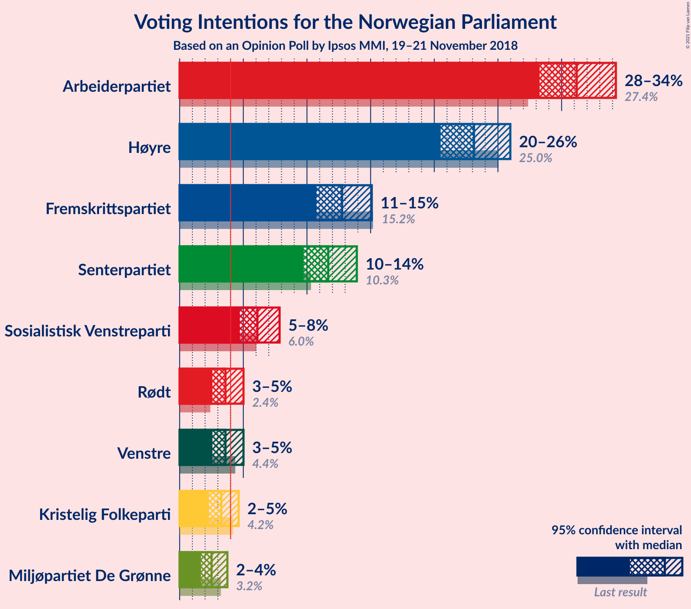

### Confidence Intervals

| Party | Last Result | Poll Result | 80% Confidence Interval | 90% Confidence Interval | 95% Confidence Interval | 99% Confidence Interval |
|:-----:|:-----------:|:-----------:|:-----------------------:|:-----------------------:|:-----------------------:|:-----------------------:|
| Arbeiderpartiet | 27.4% | 31.2% | 29.3–33.2% |28.7–33.8% |28.3–34.3% |27.4–35.2% |
| Høyre | 25.0% | 23.1% | 21.4–25.0% |20.9–25.5% |20.5–26.0% |19.7–26.9% |
| Fremskrittspartiet | 15.2% | 12.8% | 11.4–14.3% |11.1–14.7% |10.7–15.1% |10.2–15.8% |
| Senterpartiet | 10.3% | 11.7% | 10.4–13.1% |10.0–13.5% |9.7–13.9% |9.2–14.6% |
| Sosialistisk Venstreparti | 6.0% | 6.1% | 5.2–7.3% |4.9–7.6% |4.7–7.8% |4.3–8.4% |
| Rødt | 2.4% | 3.6% | 2.9–4.5% |2.7–4.8% |2.6–5.0% |2.3–5.5% |
| Venstre | 4.4% | 3.6% | 2.9–4.5% |2.7–4.8% |2.6–5.0% |2.3–5.5% |
| Kristelig Folkeparti | 4.2% | 3.3% | 2.6–4.2% |2.5–4.4% |2.3–4.6% |2.0–5.1% |
| Miljøpartiet De Grønne | 3.2% | 2.5% | 2.0–3.3% |1.8–3.5% |1.7–3.7% |1.4–4.2% |

*Note:* The poll result column reflects the actual value used in the calculations. Published results may vary slightly, and in addition be rounded to fewer digits.

## Seats

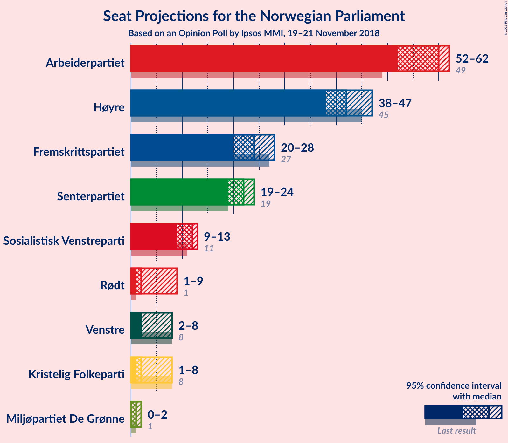

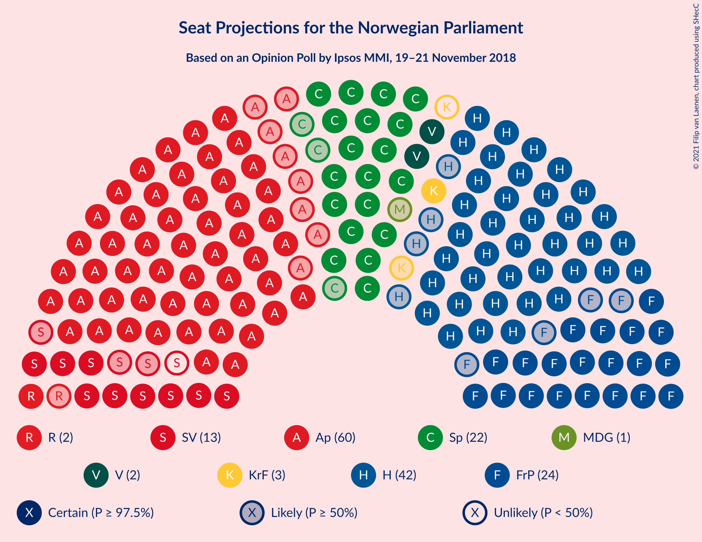

### Confidence Intervals

| Party | Last Result | Median | 80% Confidence Interval | 90% Confidence Interval | 95% Confidence Interval | 99% Confidence Interval |
|:-----:|:-----------:|:------:|:-----------------------:|:-----------------------:|:-----------------------:|:-----------------------:|
| <a href="#arbeiderpartiet">Arbeiderpartiet</a> | 49 | 60 | 54–61 |54–62 |52–62 |51–66 |
| <a href="#høyre">Høyre</a> | 45 | 42 | 39–46 |38–47 |38–47 |36–49 |
| <a href="#fremskrittspartiet">Fremskrittspartiet</a> | 27 | 24 | 20–25 |20–26 |20–28 |18–29 |
| <a href="#senterpartiet">Senterpartiet</a> | 19 | 22 | 21–23 |20–24 |19–24 |18–28 |
| <a href="#sosialistisk-venstreparti">Sosialistisk Venstreparti</a> | 11 | 12 | 11–13 |9–13 |9–13 |8–15 |
| <a href="#rødt">Rødt</a> | 1 | 2 | 2–8 |2–8 |1–9 |1–9 |
| <a href="#venstre">Venstre</a> | 8 | 2 | 2–8 |2–8 |2–8 |2–10 |
| <a href="#kristelig-folkeparti">Kristelig Folkeparti</a> | 8 | 2 | 1–3 |1–3 |1–8 |0–9 |
| <a href="#miljøpartiet-de-grønne">Miljøpartiet De Grønne</a> | 1 | 1 | 1–2 |1–2 |0–2 |0–3 |

### Arbeiderpartiet

*For a full overview of the results for this party, see the [Arbeiderpartiet](party-arbeiderpartiet.html) page.*

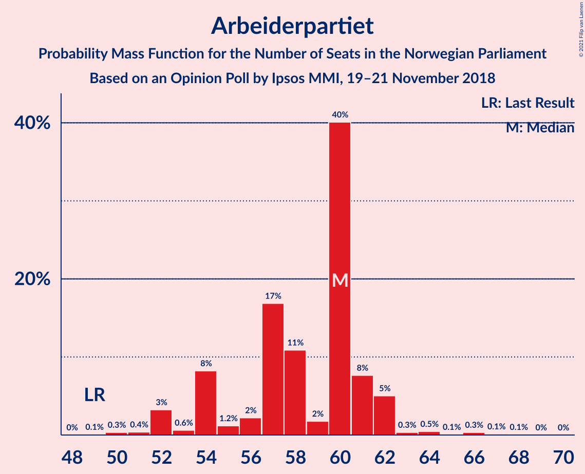

| Number of Seats | Probability | Accumulated | Special Marks |
|:---------------:|:-----------:|:-----------:|:-------------:|
| 49 | 0.1% | 100% | Last Result |
| 50 | 0.3% | 99.9% |  |
| 51 | 0.4% | 99.6% |  |
| 52 | 3% | 99.2% |  |
| 53 | 0.6% | 96% |  |
| 54 | 8% | 95% |  |
| 55 | 1.2% | 87% |  |
| 56 | 2% | 86% |  |
| 57 | 17% | 84% |  |
| 58 | 11% | 67% |  |
| 59 | 2% | 56% |  |
| 60 | 40% | 54% | Median |
| 61 | 8% | 14% |  |
| 62 | 5% | 6% |  |
| 63 | 0.3% | 1.4% |  |
| 64 | 0.5% | 1.1% |  |
| 65 | 0.1% | 0.6% |  |
| 66 | 0.3% | 0.5% |  |
| 67 | 0.1% | 0.2% |  |
| 68 | 0.1% | 0.1% |  |
| 69 | 0% | 0% |  |

### Høyre

*For a full overview of the results for this party, see the [Høyre](party-høyre.html) page.*

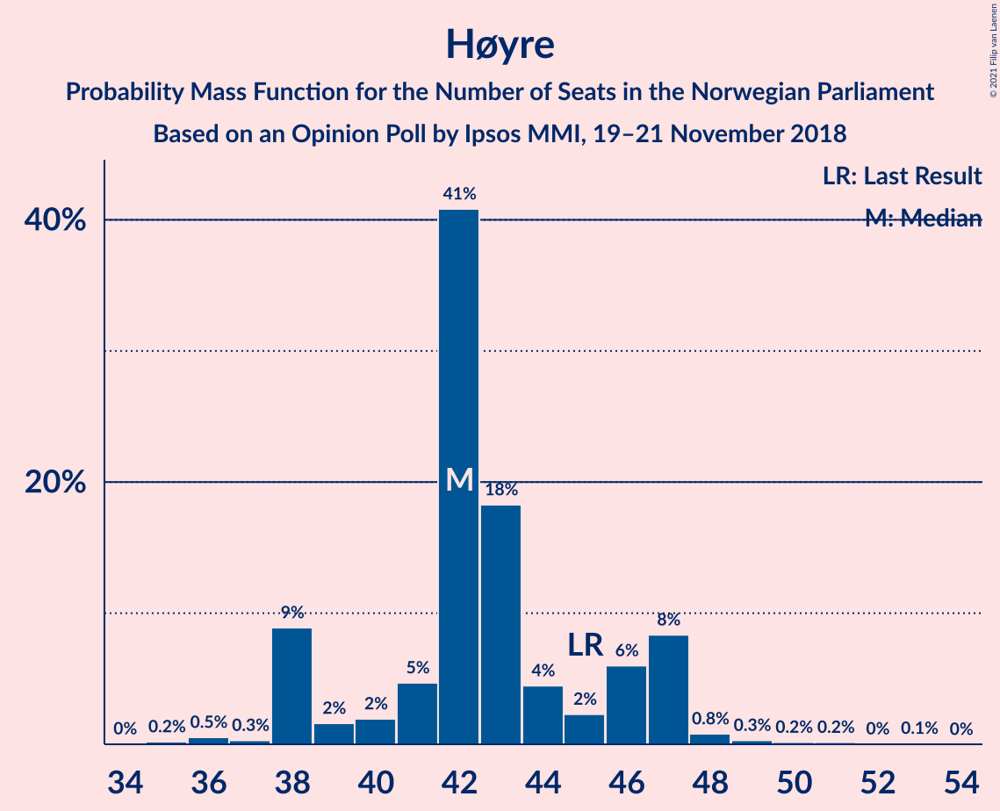

| Number of Seats | Probability | Accumulated | Special Marks |
|:---------------:|:-----------:|:-----------:|:-------------:|
| 35 | 0.2% | 100% |  |
| 36 | 0.5% | 99.8% |  |
| 37 | 0.3% | 99.2% |  |
| 38 | 9% | 98.9% |  |
| 39 | 2% | 90% |  |
| 40 | 2% | 88% |  |
| 41 | 5% | 86% |  |
| 42 | 41% | 82% | Median |
| 43 | 18% | 41% |  |
| 44 | 4% | 23% |  |
| 45 | 2% | 18% | Last Result |
| 46 | 6% | 16% |  |
| 47 | 8% | 10% |  |
| 48 | 0.8% | 2% |  |
| 49 | 0.3% | 0.7% |  |
| 50 | 0.2% | 0.4% |  |
| 51 | 0.2% | 0.3% |  |
| 52 | 0% | 0.1% |  |
| 53 | 0.1% | 0.1% |  |
| 54 | 0% | 0% |  |

### Fremskrittspartiet

*For a full overview of the results for this party, see the [Fremskrittspartiet](party-fremskrittspartiet.html) page.*

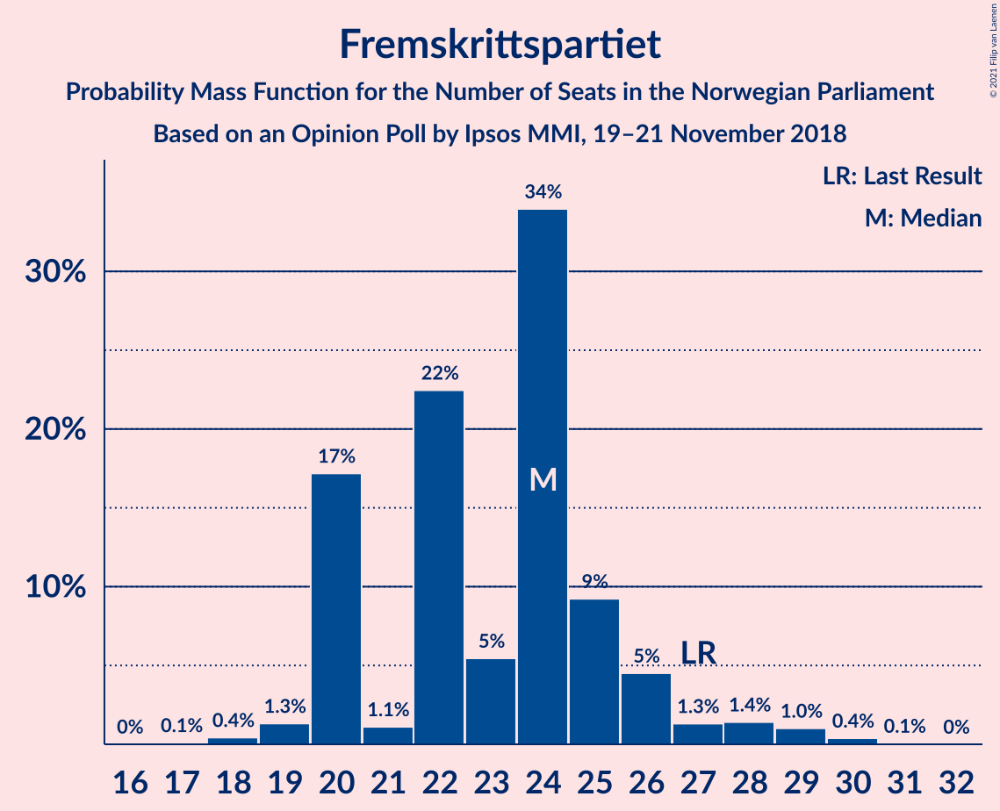

| Number of Seats | Probability | Accumulated | Special Marks |
|:---------------:|:-----------:|:-----------:|:-------------:|
| 17 | 0.1% | 100% |  |
| 18 | 0.4% | 99.9% |  |
| 19 | 1.3% | 99.5% |  |
| 20 | 17% | 98% |  |
| 21 | 1.1% | 81% |  |
| 22 | 22% | 80% |  |
| 23 | 5% | 57% |  |
| 24 | 34% | 52% | Median |
| 25 | 9% | 18% |  |
| 26 | 5% | 9% |  |
| 27 | 1.3% | 4% | Last Result |
| 28 | 1.4% | 3% |  |
| 29 | 1.0% | 1.5% |  |
| 30 | 0.4% | 0.5% |  |
| 31 | 0.1% | 0.1% |  |
| 32 | 0% | 0% |  |

### Senterpartiet

*For a full overview of the results for this party, see the [Senterpartiet](party-senterpartiet.html) page.*

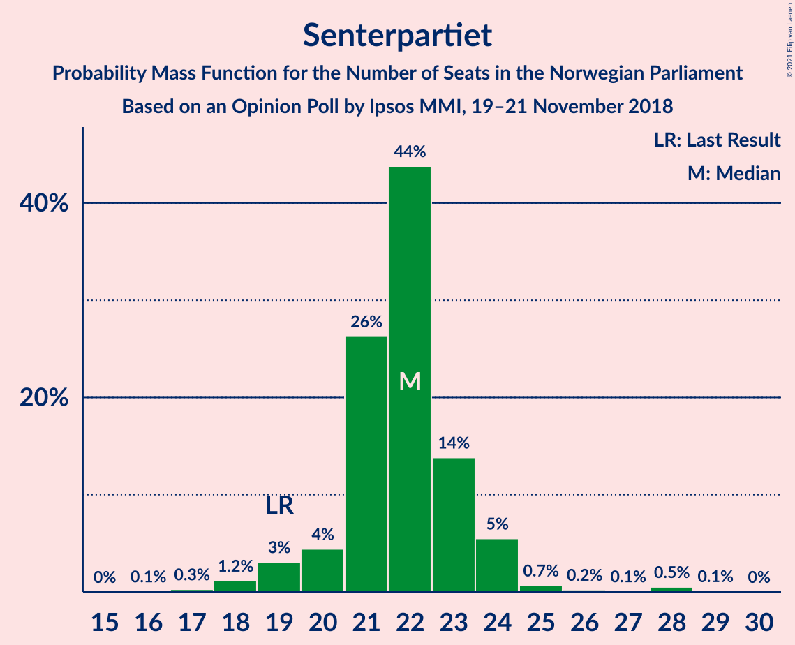

| Number of Seats | Probability | Accumulated | Special Marks |
|:---------------:|:-----------:|:-----------:|:-------------:|
| 16 | 0.1% | 100% |  |
| 17 | 0.3% | 99.9% |  |
| 18 | 1.2% | 99.7% |  |
| 19 | 3% | 98% | Last Result |
| 20 | 4% | 95% |  |
| 21 | 26% | 91% |  |
| 22 | 44% | 65% | Median |
| 23 | 14% | 21% |  |
| 24 | 5% | 7% |  |
| 25 | 0.7% | 2% |  |
| 26 | 0.2% | 0.9% |  |
| 27 | 0.1% | 0.7% |  |
| 28 | 0.5% | 0.6% |  |
| 29 | 0.1% | 0.1% |  |
| 30 | 0% | 0% |  |

### Sosialistisk Venstreparti

*For a full overview of the results for this party, see the [Sosialistisk Venstreparti](party-sosialistiskvenstreparti.html) page.*

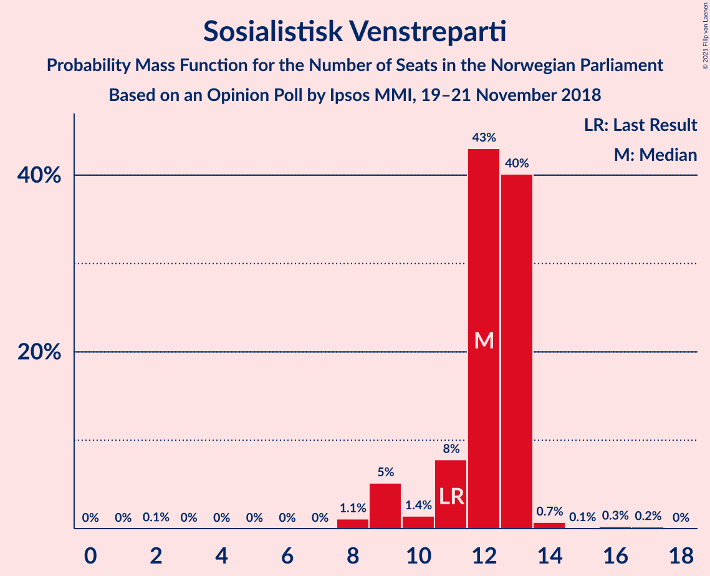

| Number of Seats | Probability | Accumulated | Special Marks |
|:---------------:|:-----------:|:-----------:|:-------------:|
| 2 | 0.1% | 100% |  |
| 3 | 0% | 99.9% |  |
| 4 | 0% | 99.9% |  |
| 5 | 0% | 99.9% |  |
| 6 | 0% | 99.9% |  |
| 7 | 0% | 99.9% |  |
| 8 | 1.1% | 99.9% |  |
| 9 | 5% | 98.8% |  |
| 10 | 1.4% | 94% |  |
| 11 | 8% | 92% | Last Result |
| 12 | 43% | 84% | Median |
| 13 | 40% | 41% |  |
| 14 | 0.7% | 1.3% |  |
| 15 | 0.1% | 0.6% |  |
| 16 | 0.3% | 0.5% |  |
| 17 | 0.2% | 0.2% |  |
| 18 | 0% | 0% |  |

### Rødt

*For a full overview of the results for this party, see the [Rødt](party-rødt.html) page.*

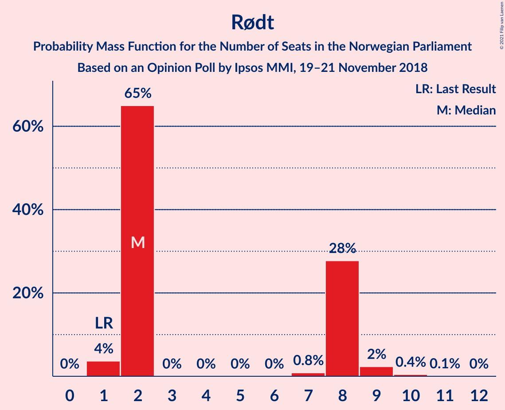

| Number of Seats | Probability | Accumulated | Special Marks |
|:---------------:|:-----------:|:-----------:|:-------------:|
| 1 | 4% | 100% | Last Result |
| 2 | 65% | 96% | Median |
| 3 | 0% | 31% |  |
| 4 | 0% | 31% |  |
| 5 | 0% | 31% |  |
| 6 | 0% | 31% |  |
| 7 | 0.8% | 31% |  |
| 8 | 28% | 31% |  |
| 9 | 2% | 3% |  |
| 10 | 0.4% | 0.5% |  |
| 11 | 0.1% | 0.1% |  |
| 12 | 0% | 0% |  |

### Venstre

*For a full overview of the results for this party, see the [Venstre](party-venstre.html) page.*

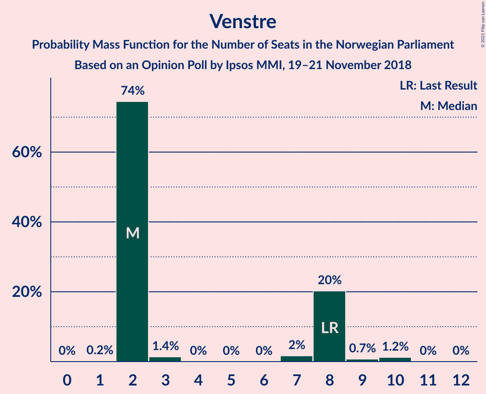

| Number of Seats | Probability | Accumulated | Special Marks |
|:---------------:|:-----------:|:-----------:|:-------------:|
| 1 | 0.2% | 100% |  |
| 2 | 74% | 99.8% | Median |
| 3 | 1.4% | 25% |  |
| 4 | 0% | 24% |  |
| 5 | 0% | 24% |  |
| 6 | 0% | 24% |  |
| 7 | 2% | 24% |  |
| 8 | 20% | 22% | Last Result |
| 9 | 0.7% | 2% |  |
| 10 | 1.2% | 1.3% |  |
| 11 | 0% | 0.1% |  |
| 12 | 0% | 0% |  |

### Kristelig Folkeparti

*For a full overview of the results for this party, see the [Kristelig Folkeparti](party-kristeligfolkeparti.html) page.*

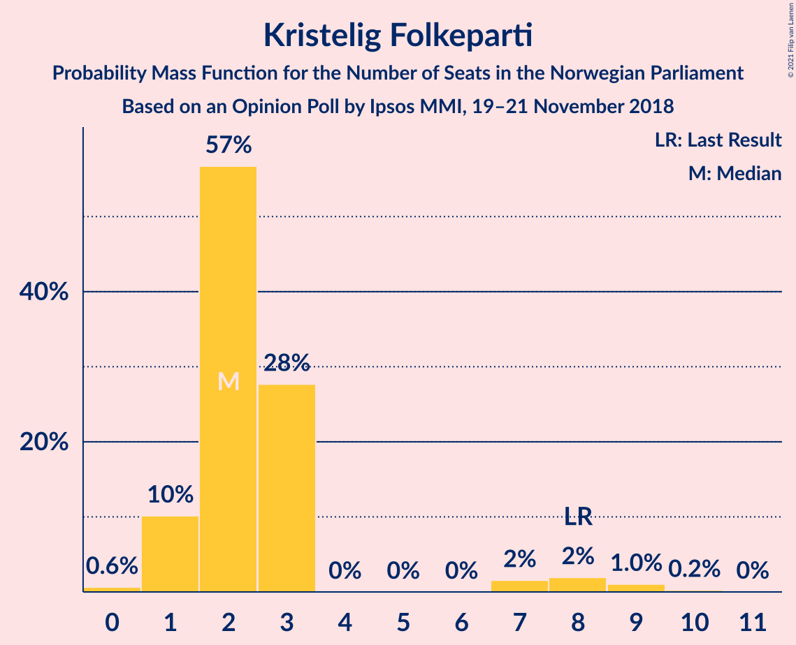

| Number of Seats | Probability | Accumulated | Special Marks |
|:---------------:|:-----------:|:-----------:|:-------------:|
| 0 | 0.6% | 100% |  |
| 1 | 10% | 99.4% |  |
| 2 | 57% | 89% | Median |
| 3 | 28% | 32% |  |
| 4 | 0% | 5% |  |
| 5 | 0% | 5% |  |
| 6 | 0% | 5% |  |
| 7 | 2% | 5% |  |
| 8 | 2% | 3% | Last Result |
| 9 | 1.0% | 1.3% |  |
| 10 | 0.2% | 0.3% |  |
| 11 | 0% | 0% |  |

### Miljøpartiet De Grønne

*For a full overview of the results for this party, see the [Miljøpartiet De Grønne](party-miljøpartietdegrønne.html) page.*

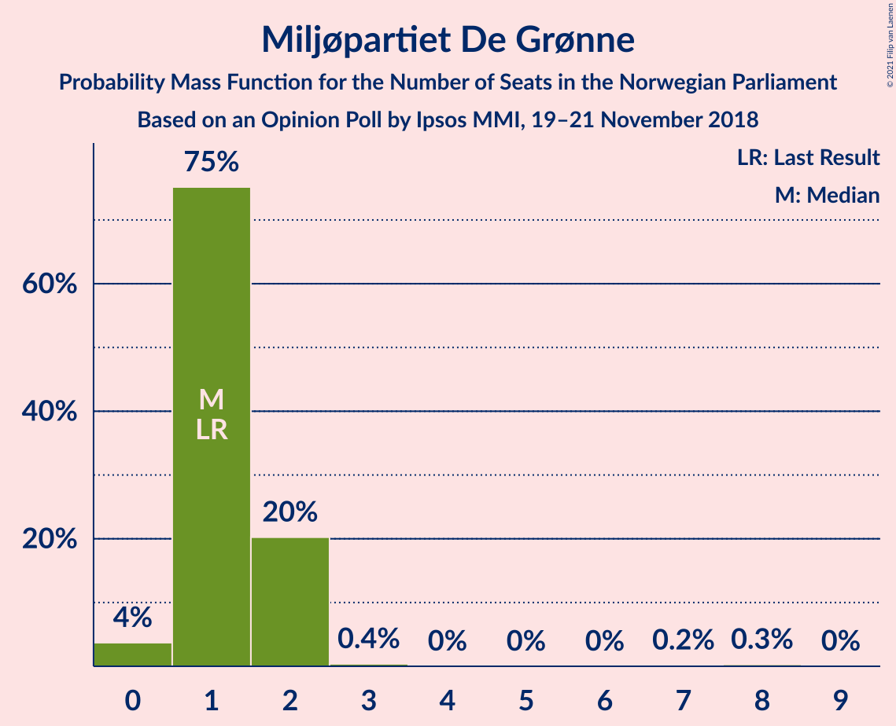

| Number of Seats | Probability | Accumulated | Special Marks |
|:---------------:|:-----------:|:-----------:|:-------------:|
| 0 | 4% | 100% |  |
| 1 | 75% | 96% | Last Result, Median |
| 2 | 20% | 21% |  |
| 3 | 0.4% | 0.9% |  |
| 4 | 0% | 0.5% |  |
| 5 | 0% | 0.5% |  |
| 6 | 0% | 0.5% |  |
| 7 | 0.2% | 0.5% |  |
| 8 | 0.3% | 0.3% |  |
| 9 | 0% | 0% |  |

## Coalitions

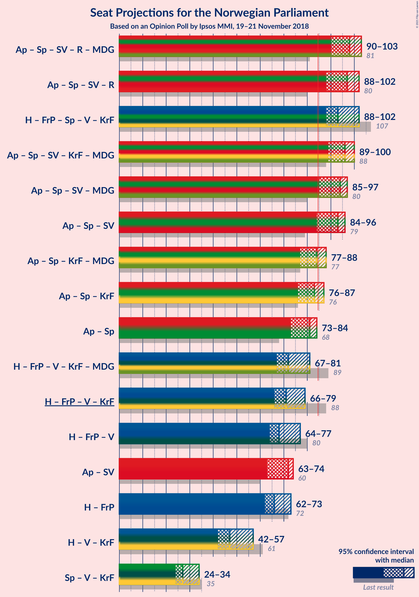

### Confidence Intervals

| Coalition | Last Result | Median | Majority? | 80% Confidence Interval | 90% Confidence Interval | 95% Confidence Interval | 99% Confidence Interval |
|:---------:|:-----------:|:------:|:---------:|:-----------------------:|:-----------------------:|:-----------------------:|:-----------------------:|
| Arbeiderpartiet – Senterpartiet – Sosialistisk Venstreparti – Rødt – Miljøpartiet De Grønne | 81 | 98 | 100% | 93–102 | 91–103 | 90–103 | 85–103 |
| Arbeiderpartiet – Senterpartiet – Sosialistisk Venstreparti – Rødt | 80 | 97 | 98.7% | 92–101 | 90–102 | 88–102 | 84–102 |
| Høyre – Fremskrittspartiet – Senterpartiet – Venstre – Kristelig Folkeparti | 107 | 93 | 99.9% | 88–99 | 88–99 | 88–102 | 88–103 |
| Arbeiderpartiet – Senterpartiet – Sosialistisk Venstreparti – Kristelig Folkeparti – Miljøpartiet De Grønne | 88 | 96 | 99.9% | 92–99 | 90–99 | 89–100 | 87–104 |
| Arbeiderpartiet – Senterpartiet – Sosialistisk Venstreparti – Miljøpartiet De Grønne | 80 | 94 | 98% | 89–96 | 88–96 | 85–97 | 83–100 |
| Arbeiderpartiet – Senterpartiet – Sosialistisk Venstreparti | 79 | 93 | 97% | 88–95 | 86–96 | 84–96 | 82–99 |
| Arbeiderpartiet – Senterpartiet – Kristelig Folkeparti – Miljøpartiet De Grønne | 77 | 84 | 41% | 81–86 | 79–86 | 77–88 | 75–92 |
| Arbeiderpartiet – Senterpartiet – Kristelig Folkeparti | 76 | 83 | 32% | 80–85 | 78–86 | 76–87 | 74–91 |
| Arbeiderpartiet – Senterpartiet | 68 | 81 | 2% | 77–82 | 75–84 | 73–84 | 71–88 |
| Høyre – Fremskrittspartiet – Venstre – Kristelig Folkeparti – Miljøpartiet De Grønne | 89 | 72 | 1.3% | 68–77 | 67–79 | 67–81 | 67–85 |
| Høyre – Fremskrittspartiet – Venstre – Kristelig Folkeparti | 88 | 71 | 0% | 67–76 | 66–78 | 66–79 | 66–84 |
| Høyre – Fremskrittspartiet – Venstre | 80 | 68 | 0% | 65–73 | 64–76 | 64–77 | 62–78 |
| Arbeiderpartiet – Sosialistisk Venstreparti | 60 | 72 | 0% | 67–73 | 64–74 | 63–74 | 63–77 |
| Høyre – Fremskrittspartiet | 72 | 66 | 0% | 62–70 | 62–71 | 62–73 | 59–74 |
| Høyre – Venstre – Kristelig Folkeparti | 61 | 47 | 0% | 44–52 | 42–54 | 42–57 | 42–59 |
| Senterpartiet – Venstre – Kristelig Folkeparti | 35 | 27 | 0% | 25–32 | 25–33 | 24–34 | 21–36 |

### Arbeiderpartiet – Senterpartiet – Sosialistisk Venstreparti – Rødt – Miljøpartiet De Grønne

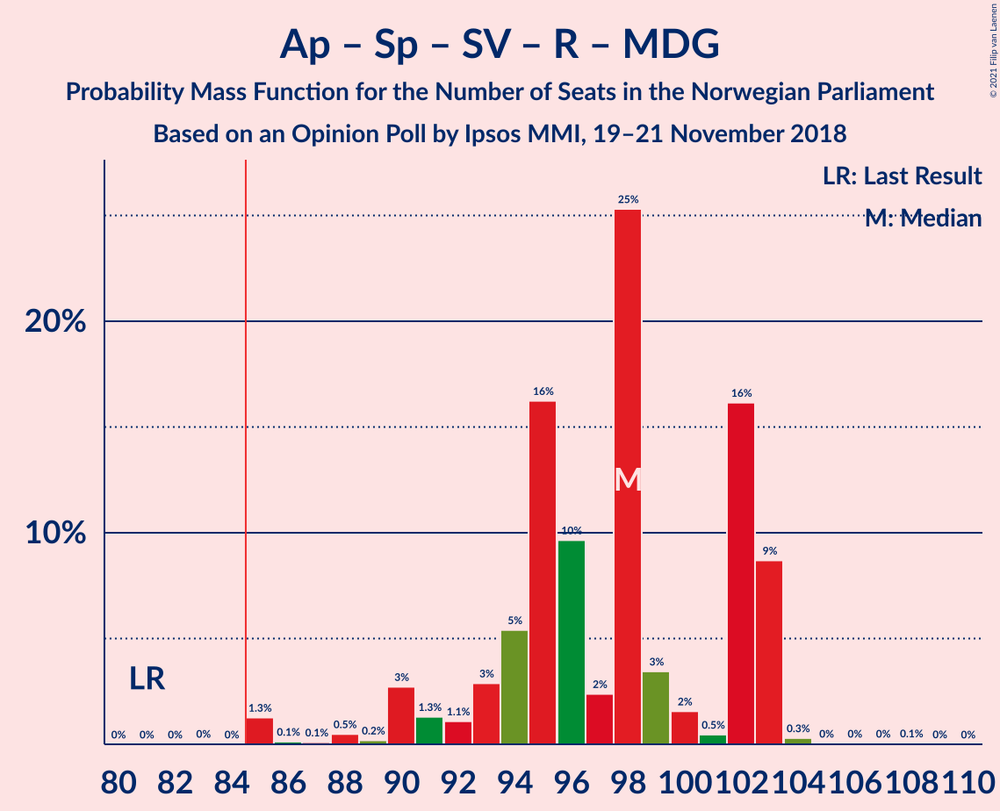

| Number of Seats | Probability | Accumulated | Special Marks |
|:---------------:|:-----------:|:-----------:|:-------------:|
| 81 | 0% | 100% | Last Result |
| 82 | 0% | 100% |  |
| 83 | 0% | 100% |  |
| 84 | 0% | 100% |  |
| 85 | 1.3% | 100% | Majority |
| 86 | 0.1% | 98.7% |  |
| 87 | 0.1% | 98.6% |  |
| 88 | 0.5% | 98% |  |
| 89 | 0.2% | 98% |  |
| 90 | 3% | 98% |  |
| 91 | 1.3% | 95% |  |
| 92 | 1.1% | 94% |  |
| 93 | 3% | 93% |  |
| 94 | 5% | 90% |  |
| 95 | 16% | 84% |  |
| 96 | 10% | 68% |  |
| 97 | 2% | 58% | Median |
| 98 | 25% | 56% |  |
| 99 | 3% | 31% |  |
| 100 | 2% | 27% |  |
| 101 | 0.5% | 26% |  |
| 102 | 16% | 25% |  |
| 103 | 9% | 9% |  |
| 104 | 0.3% | 0.5% |  |
| 105 | 0% | 0.2% |  |
| 106 | 0% | 0.1% |  |
| 107 | 0% | 0.1% |  |
| 108 | 0.1% | 0.1% |  |
| 109 | 0% | 0% |  |

### Arbeiderpartiet – Senterpartiet – Sosialistisk Venstreparti – Rødt

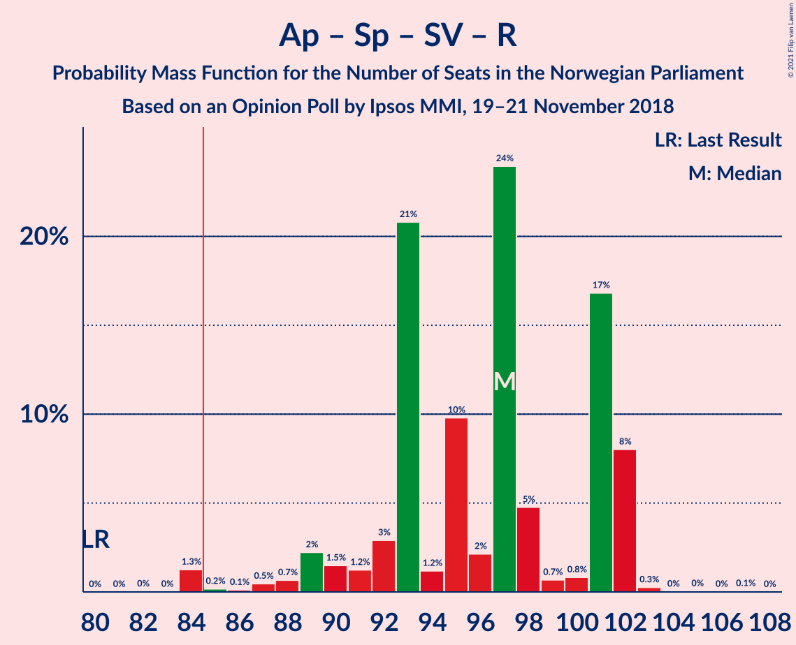

| Number of Seats | Probability | Accumulated | Special Marks |
|:---------------:|:-----------:|:-----------:|:-------------:|
| 80 | 0% | 100% | Last Result |
| 81 | 0% | 100% |  |
| 82 | 0% | 100% |  |
| 83 | 0% | 100% |  |
| 84 | 1.3% | 99.9% |  |
| 85 | 0.2% | 98.7% | Majority |
| 86 | 0.1% | 98.5% |  |
| 87 | 0.5% | 98% |  |
| 88 | 0.7% | 98% |  |
| 89 | 2% | 97% |  |
| 90 | 1.5% | 95% |  |
| 91 | 1.2% | 94% |  |
| 92 | 3% | 92% |  |
| 93 | 21% | 89% |  |
| 94 | 1.2% | 69% |  |
| 95 | 10% | 67% |  |
| 96 | 2% | 58% | Median |
| 97 | 24% | 55% |  |
| 98 | 5% | 32% |  |
| 99 | 0.7% | 27% |  |
| 100 | 0.8% | 26% |  |
| 101 | 17% | 25% |  |
| 102 | 8% | 8% |  |
| 103 | 0.3% | 0.4% |  |
| 104 | 0% | 0.1% |  |
| 105 | 0% | 0.1% |  |
| 106 | 0% | 0.1% |  |
| 107 | 0.1% | 0.1% |  |
| 108 | 0% | 0% |  |

### Høyre – Fremskrittspartiet – Senterpartiet – Venstre – Kristelig Folkeparti

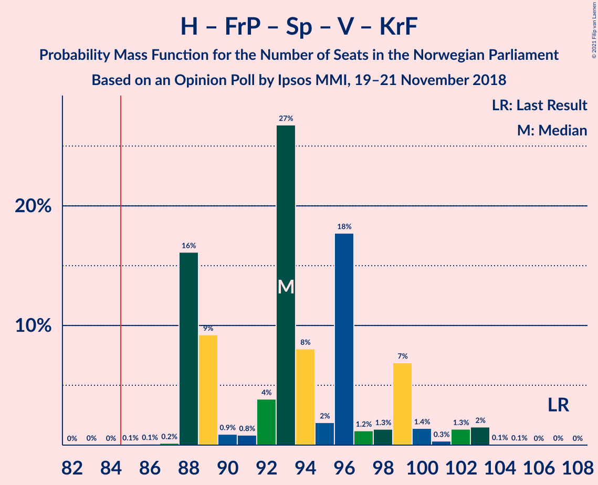

| Number of Seats | Probability | Accumulated | Special Marks |
|:---------------:|:-----------:|:-----------:|:-------------:|
| 83 | 0% | 100% |  |
| 84 | 0% | 99.9% |  |
| 85 | 0.1% | 99.9% | Majority |
| 86 | 0.1% | 99.9% |  |
| 87 | 0.2% | 99.8% |  |
| 88 | 16% | 99.6% |  |
| 89 | 9% | 83% |  |
| 90 | 0.9% | 74% |  |
| 91 | 0.8% | 73% |  |
| 92 | 4% | 72% | Median |
| 93 | 27% | 69% |  |
| 94 | 8% | 42% |  |
| 95 | 2% | 34% |  |
| 96 | 18% | 32% |  |
| 97 | 1.2% | 14% |  |
| 98 | 1.3% | 13% |  |
| 99 | 7% | 12% |  |
| 100 | 1.4% | 5% |  |
| 101 | 0.3% | 3% |  |
| 102 | 1.3% | 3% |  |
| 103 | 2% | 2% |  |
| 104 | 0.1% | 0.2% |  |
| 105 | 0.1% | 0.1% |  |
| 106 | 0% | 0.1% |  |
| 107 | 0% | 0% | Last Result |

### Arbeiderpartiet – Senterpartiet – Sosialistisk Venstreparti – Kristelig Folkeparti – Miljøpartiet De Grønne

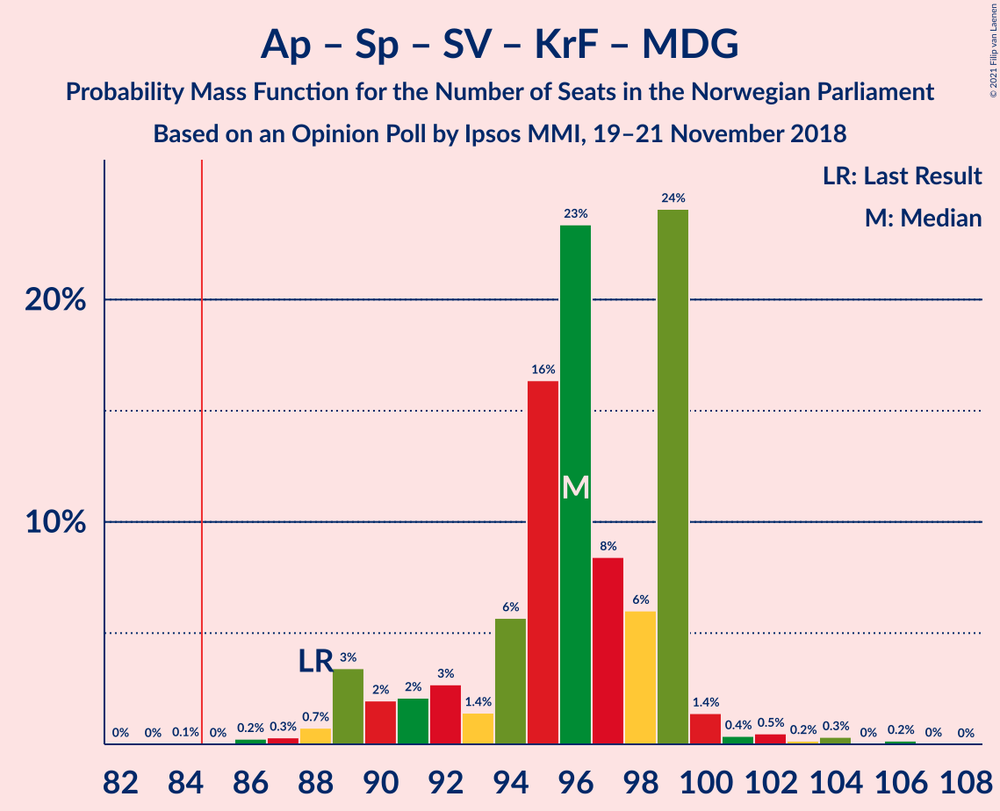

| Number of Seats | Probability | Accumulated | Special Marks |
|:---------------:|:-----------:|:-----------:|:-------------:|
| 83 | 0% | 100% |  |
| 84 | 0.1% | 99.9% |  |
| 85 | 0% | 99.9% | Majority |
| 86 | 0.2% | 99.8% |  |
| 87 | 0.3% | 99.6% |  |
| 88 | 0.7% | 99.3% | Last Result |
| 89 | 3% | 98.5% |  |
| 90 | 2% | 95% |  |
| 91 | 2% | 93% |  |
| 92 | 3% | 91% |  |
| 93 | 1.4% | 88% |  |
| 94 | 6% | 87% |  |
| 95 | 16% | 81% |  |
| 96 | 23% | 65% |  |
| 97 | 8% | 42% | Median |
| 98 | 6% | 33% |  |
| 99 | 24% | 27% |  |
| 100 | 1.4% | 3% |  |
| 101 | 0.4% | 2% |  |
| 102 | 0.5% | 1.2% |  |
| 103 | 0.2% | 0.7% |  |
| 104 | 0.3% | 0.6% |  |
| 105 | 0% | 0.3% |  |
| 106 | 0.2% | 0.2% |  |
| 107 | 0% | 0.1% |  |
| 108 | 0% | 0% |  |

### Arbeiderpartiet – Senterpartiet – Sosialistisk Venstreparti – Miljøpartiet De Grønne

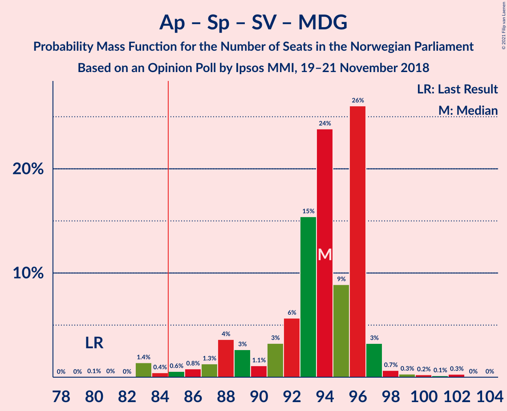

| Number of Seats | Probability | Accumulated | Special Marks |
|:---------------:|:-----------:|:-----------:|:-------------:|
| 80 | 0.1% | 100% | Last Result |
| 81 | 0% | 99.9% |  |
| 82 | 0% | 99.9% |  |
| 83 | 1.4% | 99.9% |  |
| 84 | 0.4% | 98% |  |
| 85 | 0.6% | 98% | Majority |
| 86 | 0.8% | 97% |  |
| 87 | 1.3% | 97% |  |
| 88 | 4% | 95% |  |
| 89 | 3% | 92% |  |
| 90 | 1.1% | 89% |  |
| 91 | 3% | 88% |  |
| 92 | 6% | 85% |  |
| 93 | 15% | 79% |  |
| 94 | 24% | 64% |  |
| 95 | 9% | 40% | Median |
| 96 | 26% | 31% |  |
| 97 | 3% | 5% |  |
| 98 | 0.7% | 2% |  |
| 99 | 0.3% | 1.0% |  |
| 100 | 0.2% | 0.7% |  |
| 101 | 0.1% | 0.5% |  |
| 102 | 0.3% | 0.3% |  |
| 103 | 0% | 0.1% |  |
| 104 | 0% | 0% |  |

### Arbeiderpartiet – Senterpartiet – Sosialistisk Venstreparti

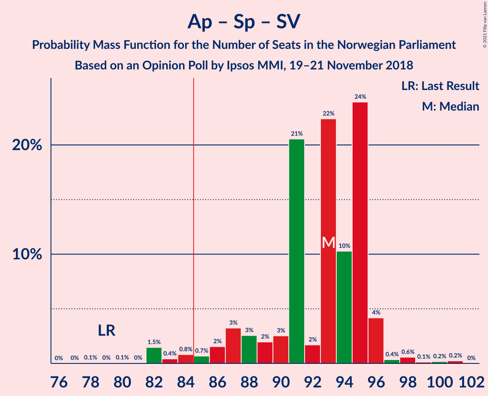

| Number of Seats | Probability | Accumulated | Special Marks |
|:---------------:|:-----------:|:-----------:|:-------------:|
| 78 | 0.1% | 100% |  |
| 79 | 0% | 99.9% | Last Result |
| 80 | 0.1% | 99.9% |  |
| 81 | 0% | 99.8% |  |
| 82 | 1.5% | 99.8% |  |
| 83 | 0.4% | 98% |  |
| 84 | 0.8% | 98% |  |
| 85 | 0.7% | 97% | Majority |
| 86 | 2% | 96% |  |
| 87 | 3% | 95% |  |
| 88 | 3% | 92% |  |
| 89 | 2% | 89% |  |
| 90 | 3% | 87% |  |
| 91 | 21% | 85% |  |
| 92 | 2% | 64% |  |
| 93 | 22% | 62% |  |
| 94 | 10% | 40% | Median |
| 95 | 24% | 30% |  |
| 96 | 4% | 6% |  |
| 97 | 0.4% | 1.5% |  |
| 98 | 0.6% | 1.1% |  |
| 99 | 0.1% | 0.6% |  |
| 100 | 0.2% | 0.4% |  |
| 101 | 0.2% | 0.3% |  |
| 102 | 0% | 0% |  |

### Arbeiderpartiet – Senterpartiet – Kristelig Folkeparti – Miljøpartiet De Grønne

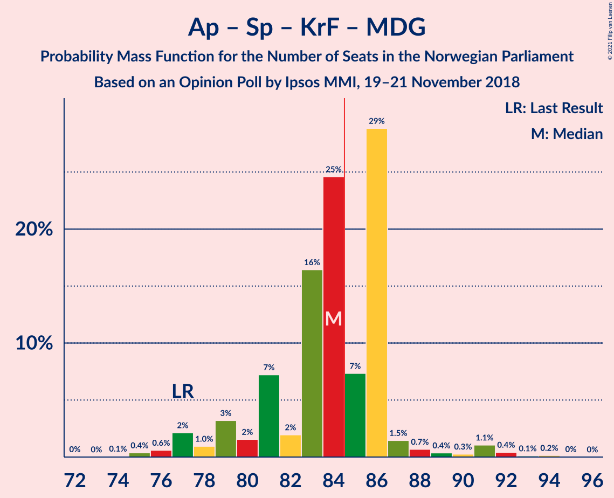

| Number of Seats | Probability | Accumulated | Special Marks |
|:---------------:|:-----------:|:-----------:|:-------------:|
| 72 | 0% | 100% |  |
| 73 | 0% | 99.9% |  |
| 74 | 0.1% | 99.9% |  |
| 75 | 0.4% | 99.8% |  |
| 76 | 0.6% | 99.5% |  |
| 77 | 2% | 98.9% | Last Result |
| 78 | 1.0% | 97% |  |
| 79 | 3% | 96% |  |
| 80 | 2% | 93% |  |
| 81 | 7% | 91% |  |
| 82 | 2% | 84% |  |
| 83 | 16% | 82% |  |
| 84 | 25% | 65% |  |
| 85 | 7% | 41% | Median, Majority |
| 86 | 29% | 33% |  |
| 87 | 1.5% | 5% |  |
| 88 | 0.7% | 3% |  |
| 89 | 0.4% | 2% |  |
| 90 | 0.3% | 2% |  |
| 91 | 1.1% | 2% |  |
| 92 | 0.4% | 0.8% |  |
| 93 | 0.1% | 0.3% |  |
| 94 | 0.2% | 0.2% |  |
| 95 | 0% | 0.1% |  |
| 96 | 0% | 0% |  |

### Arbeiderpartiet – Senterpartiet – Kristelig Folkeparti

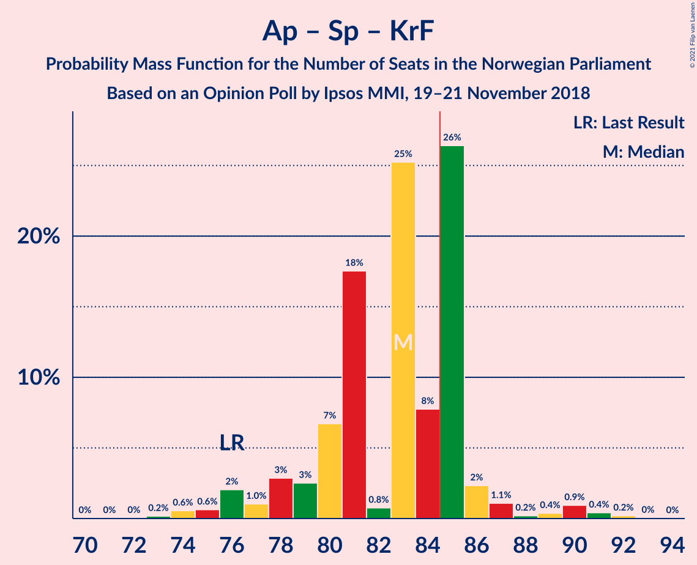

| Number of Seats | Probability | Accumulated | Special Marks |
|:---------------:|:-----------:|:-----------:|:-------------:|
| 71 | 0% | 100% |  |
| 72 | 0% | 99.9% |  |
| 73 | 0.2% | 99.9% |  |
| 74 | 0.6% | 99.7% |  |
| 75 | 0.6% | 99.2% |  |
| 76 | 2% | 98.5% | Last Result |
| 77 | 1.0% | 96% |  |
| 78 | 3% | 95% |  |
| 79 | 3% | 93% |  |
| 80 | 7% | 90% |  |
| 81 | 18% | 83% |  |
| 82 | 0.8% | 66% |  |
| 83 | 25% | 65% |  |
| 84 | 8% | 40% | Median |
| 85 | 26% | 32% | Majority |
| 86 | 2% | 6% |  |
| 87 | 1.1% | 3% |  |
| 88 | 0.2% | 2% |  |
| 89 | 0.4% | 2% |  |
| 90 | 0.9% | 2% |  |
| 91 | 0.4% | 0.7% |  |
| 92 | 0.2% | 0.3% |  |
| 93 | 0% | 0.1% |  |
| 94 | 0% | 0% |  |

### Arbeiderpartiet – Senterpartiet

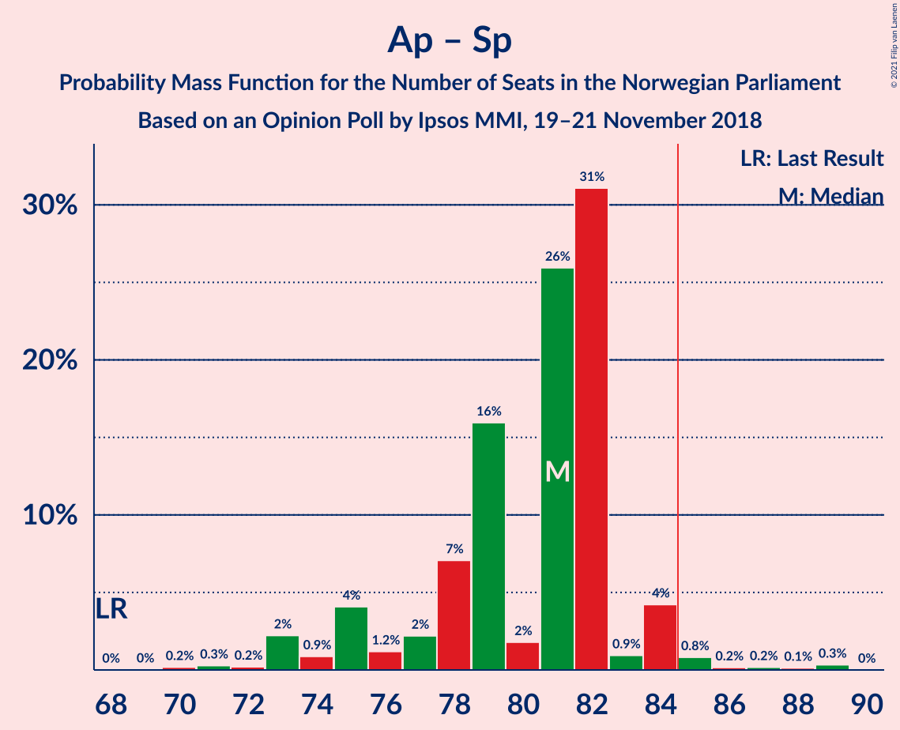

| Number of Seats | Probability | Accumulated | Special Marks |
|:---------------:|:-----------:|:-----------:|:-------------:|
| 68 | 0% | 100% | Last Result |
| 69 | 0% | 100% |  |
| 70 | 0.2% | 99.9% |  |
| 71 | 0.3% | 99.7% |  |
| 72 | 0.2% | 99.5% |  |
| 73 | 2% | 99.3% |  |
| 74 | 0.9% | 97% |  |
| 75 | 4% | 96% |  |
| 76 | 1.2% | 92% |  |
| 77 | 2% | 91% |  |
| 78 | 7% | 89% |  |
| 79 | 16% | 82% |  |
| 80 | 2% | 66% |  |
| 81 | 26% | 64% |  |
| 82 | 31% | 38% | Median |
| 83 | 0.9% | 7% |  |
| 84 | 4% | 6% |  |
| 85 | 0.8% | 2% | Majority |
| 86 | 0.2% | 0.8% |  |
| 87 | 0.2% | 0.7% |  |
| 88 | 0.1% | 0.5% |  |
| 89 | 0.3% | 0.4% |  |
| 90 | 0% | 0% |  |

### Høyre – Fremskrittspartiet – Venstre – Kristelig Folkeparti – Miljøpartiet De Grønne

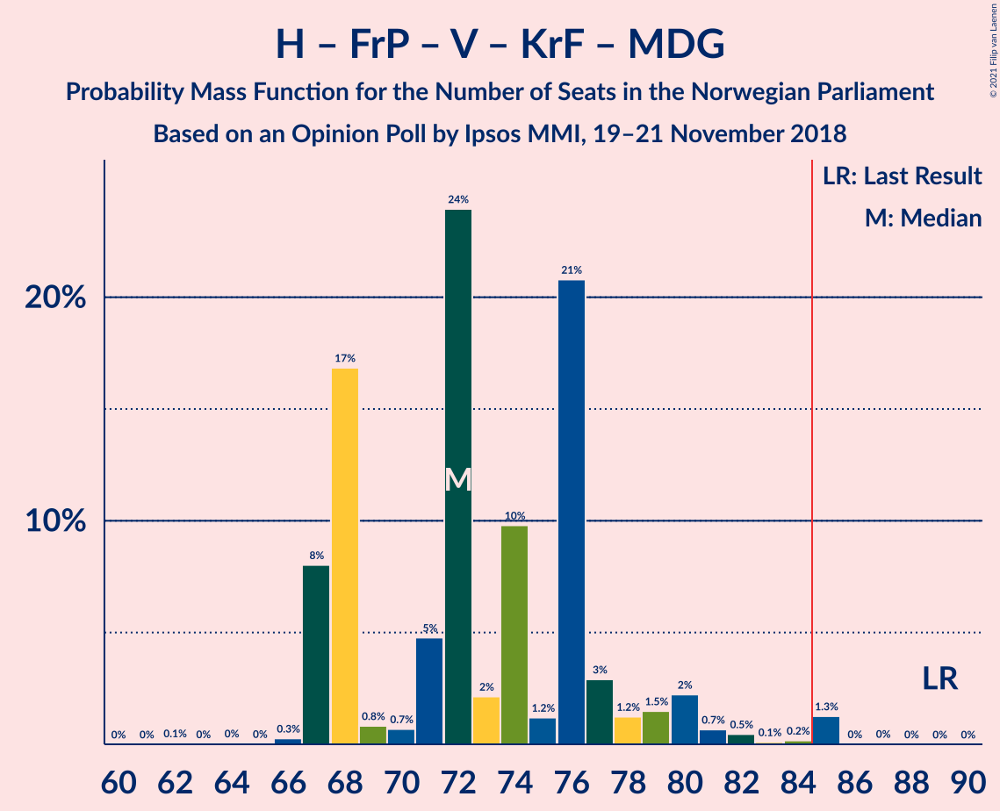

| Number of Seats | Probability | Accumulated | Special Marks |
|:---------------:|:-----------:|:-----------:|:-------------:|
| 62 | 0.1% | 100% |  |
| 63 | 0% | 99.9% |  |
| 64 | 0% | 99.9% |  |
| 65 | 0% | 99.9% |  |
| 66 | 0.3% | 99.9% |  |
| 67 | 8% | 99.6% |  |
| 68 | 17% | 92% |  |
| 69 | 0.8% | 75% |  |
| 70 | 0.7% | 74% |  |
| 71 | 5% | 73% | Median |
| 72 | 24% | 68% |  |
| 73 | 2% | 44% |  |
| 74 | 10% | 42% |  |
| 75 | 1.2% | 33% |  |
| 76 | 21% | 31% |  |
| 77 | 3% | 11% |  |
| 78 | 1.2% | 8% |  |
| 79 | 1.5% | 6% |  |
| 80 | 2% | 5% |  |
| 81 | 0.7% | 3% |  |
| 82 | 0.5% | 2% |  |
| 83 | 0.1% | 2% |  |
| 84 | 0.2% | 1.5% |  |
| 85 | 1.3% | 1.3% | Majority |
| 86 | 0% | 0.1% |  |
| 87 | 0% | 0% |  |
| 88 | 0% | 0% |  |
| 89 | 0% | 0% | Last Result |

### Høyre – Fremskrittspartiet – Venstre – Kristelig Folkeparti

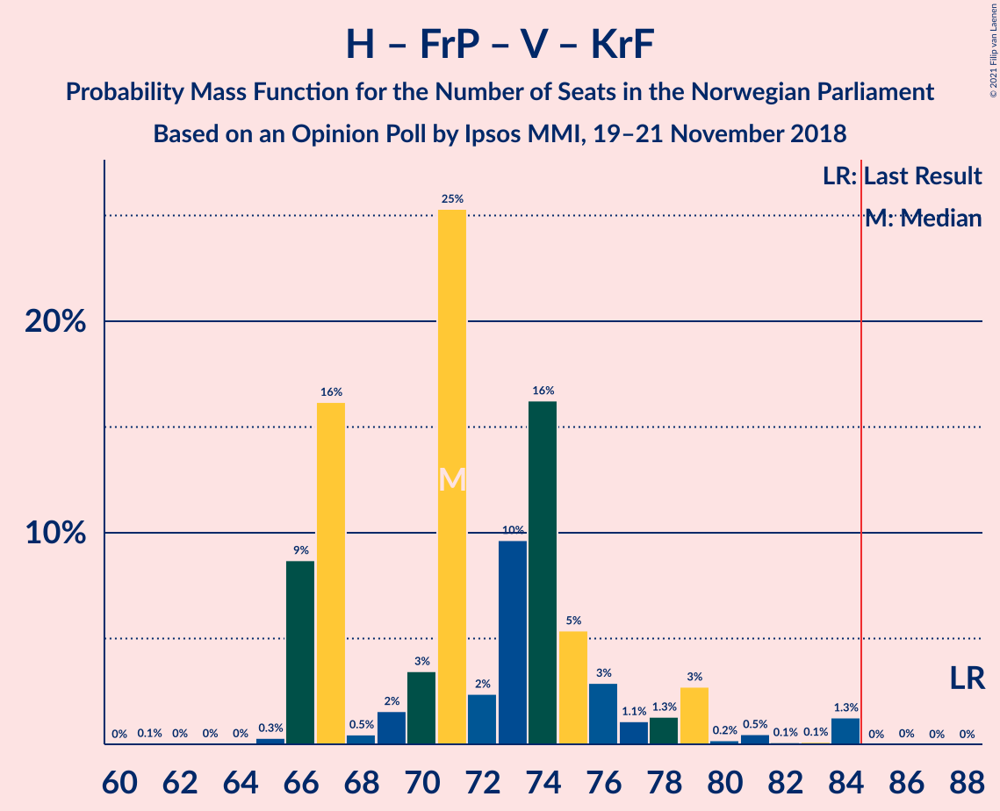

| Number of Seats | Probability | Accumulated | Special Marks |
|:---------------:|:-----------:|:-----------:|:-------------:|
| 61 | 0.1% | 100% |  |
| 62 | 0% | 99.9% |  |
| 63 | 0% | 99.9% |  |
| 64 | 0% | 99.9% |  |
| 65 | 0.3% | 99.8% |  |
| 66 | 9% | 99.5% |  |
| 67 | 16% | 91% |  |
| 68 | 0.5% | 75% |  |
| 69 | 2% | 74% |  |
| 70 | 3% | 73% | Median |
| 71 | 25% | 69% |  |
| 72 | 2% | 44% |  |
| 73 | 10% | 41% |  |
| 74 | 16% | 32% |  |
| 75 | 5% | 16% |  |
| 76 | 3% | 10% |  |
| 77 | 1.1% | 7% |  |
| 78 | 1.3% | 6% |  |
| 79 | 3% | 5% |  |
| 80 | 0.2% | 2% |  |
| 81 | 0.5% | 2% |  |
| 82 | 0.1% | 2% |  |
| 83 | 0.1% | 1.4% |  |
| 84 | 1.3% | 1.3% |  |
| 85 | 0% | 0% | Majority |
| 86 | 0% | 0% |  |
| 87 | 0% | 0% |  |
| 88 | 0% | 0% | Last Result |

### Høyre – Fremskrittspartiet – Venstre

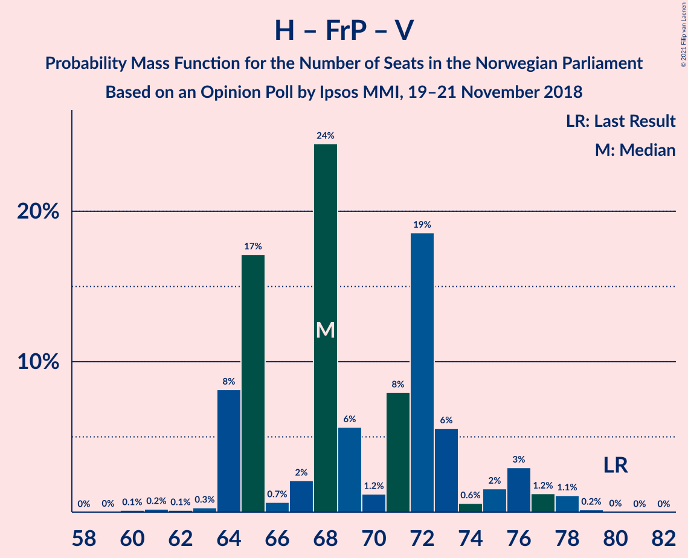

| Number of Seats | Probability | Accumulated | Special Marks |
|:---------------:|:-----------:|:-----------:|:-------------:|
| 59 | 0% | 100% |  |
| 60 | 0.1% | 99.9% |  |
| 61 | 0.2% | 99.8% |  |
| 62 | 0.1% | 99.6% |  |
| 63 | 0.3% | 99.5% |  |
| 64 | 8% | 99.2% |  |
| 65 | 17% | 91% |  |
| 66 | 0.7% | 74% |  |
| 67 | 2% | 73% |  |
| 68 | 24% | 71% | Median |
| 69 | 6% | 47% |  |
| 70 | 1.2% | 41% |  |
| 71 | 8% | 40% |  |
| 72 | 19% | 32% |  |
| 73 | 6% | 13% |  |
| 74 | 0.6% | 8% |  |
| 75 | 2% | 7% |  |
| 76 | 3% | 6% |  |
| 77 | 1.2% | 3% |  |
| 78 | 1.1% | 1.4% |  |
| 79 | 0.2% | 0.3% |  |
| 80 | 0% | 0.1% | Last Result |
| 81 | 0% | 0.1% |  |
| 82 | 0% | 0% |  |

### Arbeiderpartiet – Sosialistisk Venstreparti

| Number of Seats | Probability | Accumulated | Special Marks |
|:---------------:|:-----------:|:-----------:|:-------------:|
| 59 | 0.1% | 100% |  |
| 60 | 0.1% | 99.9% | Last Result |
| 61 | 0.1% | 99.8% |  |
| 62 | 0.2% | 99.7% |  |
| 63 | 2% | 99.5% |  |
| 64 | 3% | 97% |  |
| 65 | 2% | 95% |  |
| 66 | 2% | 92% |  |
| 67 | 7% | 91% |  |
| 68 | 2% | 83% |  |
| 69 | 17% | 81% |  |
| 70 | 1.1% | 64% |  |
| 71 | 9% | 63% |  |
| 72 | 23% | 54% | Median |
| 73 | 24% | 31% |  |
| 74 | 5% | 6% |  |
| 75 | 0.9% | 2% |  |
| 76 | 0.2% | 0.8% |  |
| 77 | 0.1% | 0.6% |  |
| 78 | 0.4% | 0.5% |  |
| 79 | 0% | 0.1% |  |
| 80 | 0.1% | 0.1% |  |
| 81 | 0% | 0% |  |

### Høyre – Fremskrittspartiet

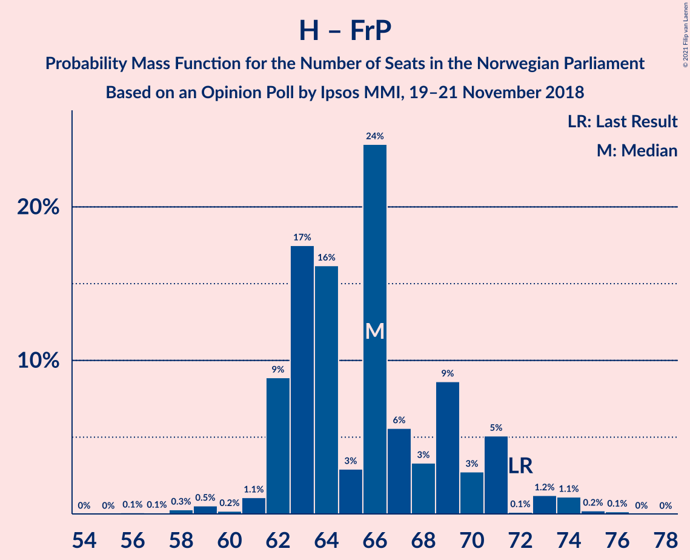

| Number of Seats | Probability | Accumulated | Special Marks |
|:---------------:|:-----------:|:-----------:|:-------------:|
| 56 | 0.1% | 100% |  |
| 57 | 0.1% | 99.9% |  |
| 58 | 0.3% | 99.8% |  |
| 59 | 0.5% | 99.5% |  |
| 60 | 0.2% | 99.0% |  |
| 61 | 1.1% | 98.8% |  |
| 62 | 9% | 98% |  |
| 63 | 17% | 89% |  |
| 64 | 16% | 71% |  |
| 65 | 3% | 55% |  |
| 66 | 24% | 52% | Median |
| 67 | 6% | 28% |  |
| 68 | 3% | 23% |  |
| 69 | 9% | 19% |  |
| 70 | 3% | 11% |  |
| 71 | 5% | 8% |  |
| 72 | 0.1% | 3% | Last Result |
| 73 | 1.2% | 3% |  |
| 74 | 1.1% | 1.5% |  |
| 75 | 0.2% | 0.4% |  |
| 76 | 0.1% | 0.2% |  |
| 77 | 0% | 0% |  |

### Høyre – Venstre – Kristelig Folkeparti

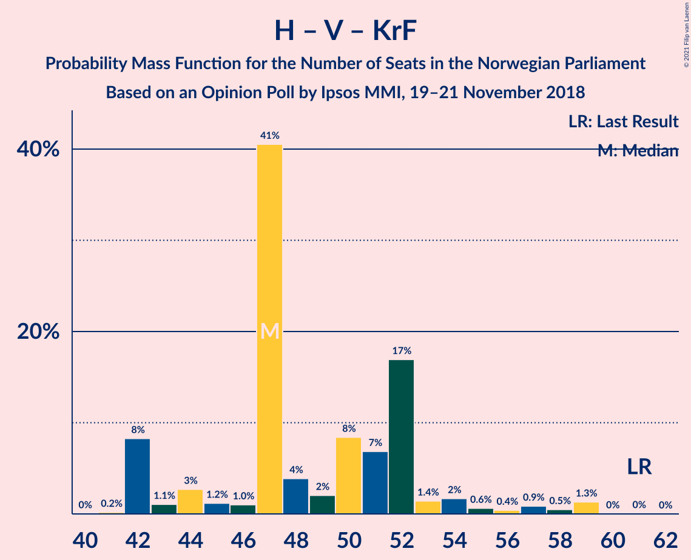

| Number of Seats | Probability | Accumulated | Special Marks |
|:---------------:|:-----------:|:-----------:|:-------------:|
| 41 | 0.2% | 100% |  |
| 42 | 8% | 99.8% |  |
| 43 | 1.1% | 91% |  |
| 44 | 3% | 90% |  |
| 45 | 1.2% | 88% |  |
| 46 | 1.0% | 87% | Median |
| 47 | 41% | 86% |  |
| 48 | 4% | 45% |  |
| 49 | 2% | 41% |  |
| 50 | 8% | 39% |  |
| 51 | 7% | 31% |  |
| 52 | 17% | 24% |  |
| 53 | 1.4% | 7% |  |
| 54 | 2% | 5% |  |
| 55 | 0.6% | 4% |  |
| 56 | 0.4% | 3% |  |
| 57 | 0.9% | 3% |  |
| 58 | 0.5% | 2% |  |
| 59 | 1.3% | 1.4% |  |
| 60 | 0% | 0.1% |  |
| 61 | 0% | 0.1% | Last Result |
| 62 | 0% | 0% |  |

### Senterpartiet – Venstre – Kristelig Folkeparti

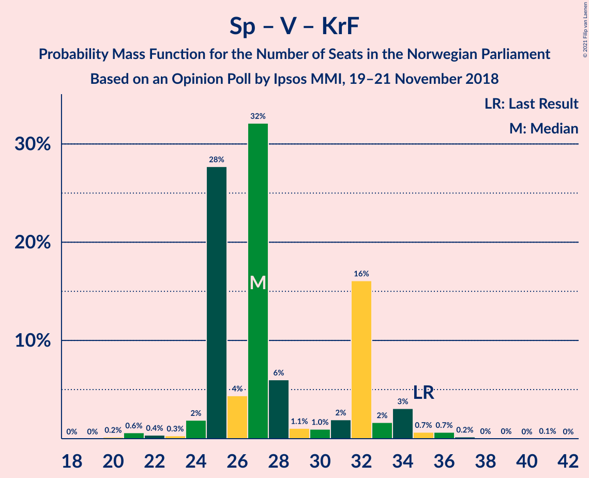

| Number of Seats | Probability | Accumulated | Special Marks |
|:---------------:|:-----------:|:-----------:|:-------------:|
| 20 | 0.2% | 100% |  |
| 21 | 0.6% | 99.8% |  |
| 22 | 0.4% | 99.2% |  |
| 23 | 0.3% | 98.8% |  |
| 24 | 2% | 98.5% |  |
| 25 | 28% | 97% |  |
| 26 | 4% | 69% | Median |
| 27 | 32% | 65% |  |
| 28 | 6% | 32% |  |
| 29 | 1.1% | 26% |  |
| 30 | 1.0% | 25% |  |
| 31 | 2% | 24% |  |
| 32 | 16% | 22% |  |
| 33 | 2% | 6% |  |
| 34 | 3% | 5% |  |
| 35 | 0.7% | 2% | Last Result |
| 36 | 0.7% | 1.0% |  |
| 37 | 0.2% | 0.3% |  |
| 38 | 0% | 0.2% |  |
| 39 | 0% | 0.1% |  |
| 40 | 0% | 0.1% |  |
| 41 | 0.1% | 0.1% |  |
| 42 | 0% | 0% |  |

## Technical Information

### Opinion Poll

+ **Polling firm:** Ipsos MMI
+ **Commissioner(s):** —
+ **Fieldwork period:** 19–21 November 2018

### Calculations

+ **Sample size:** 917
+ **Simulations done:** 131,072
+ **Error estimate:** 1.01%

