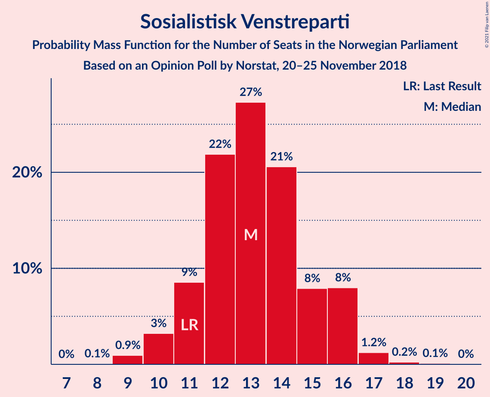
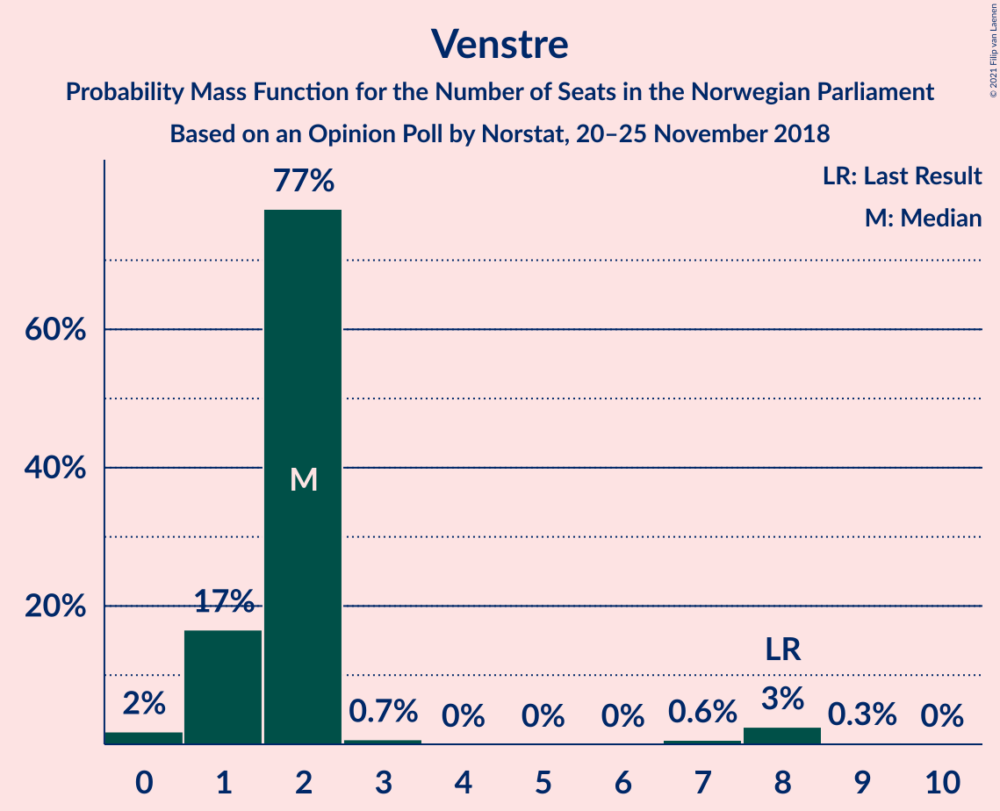
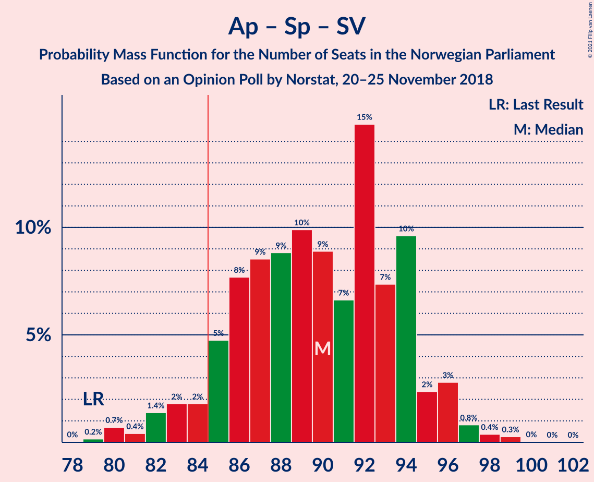
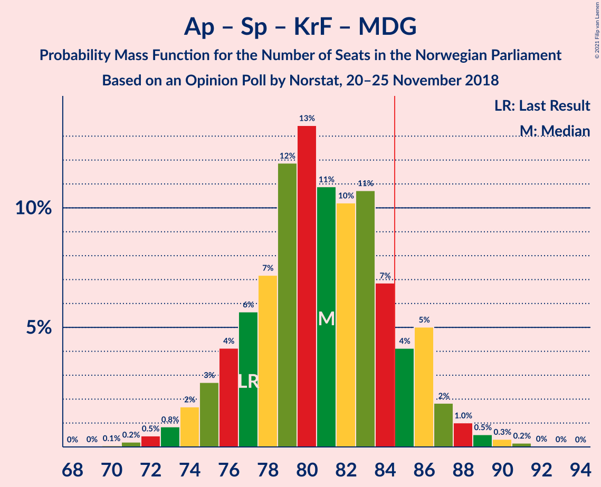
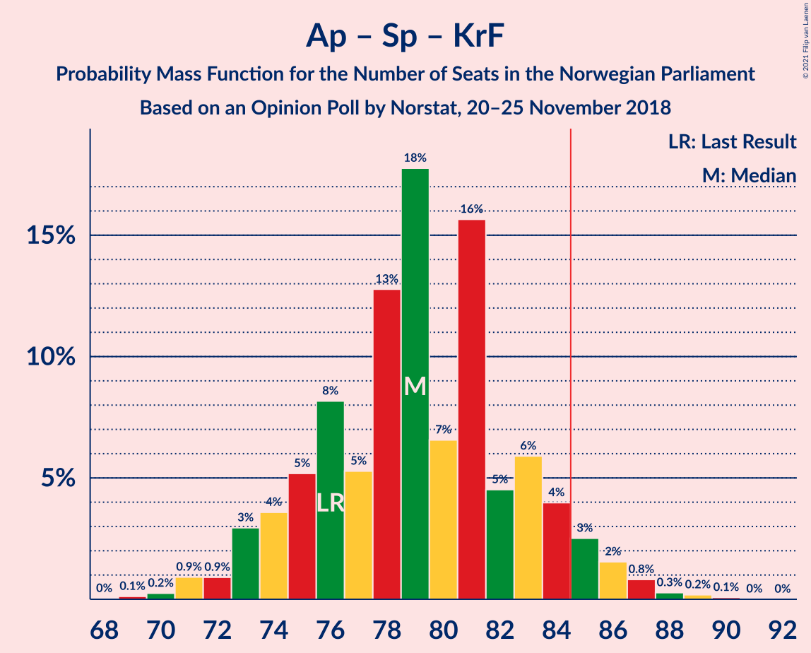
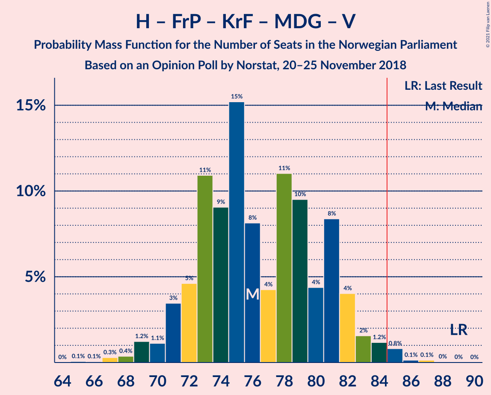
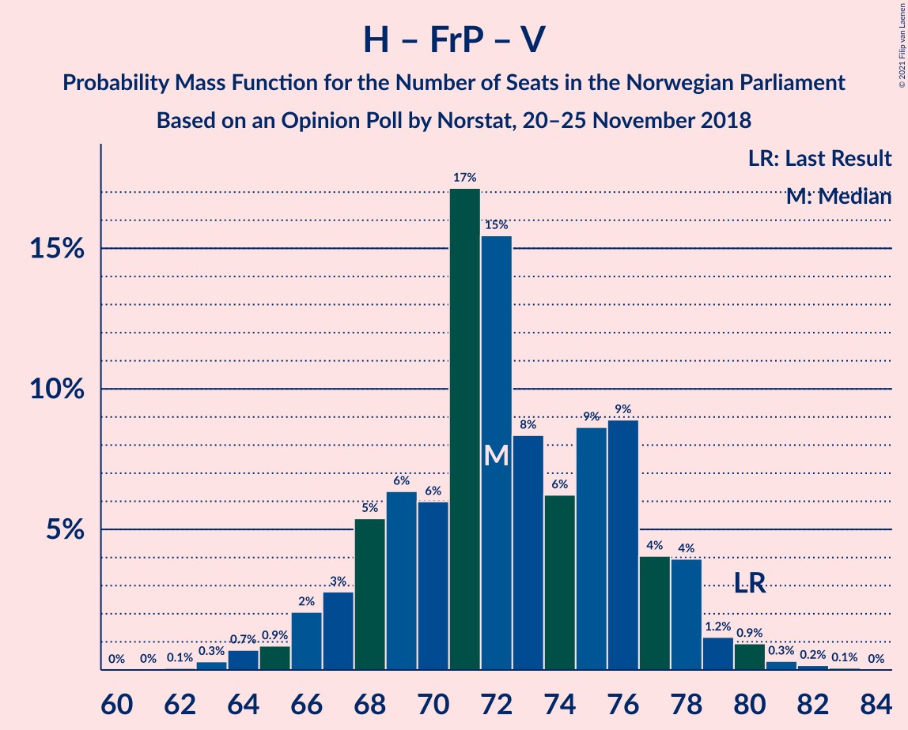

# Opinion Poll by Norstat, 20–25 November 2018

<a href="#voting-intentions">Voting Intentions</a> | <a href="#seats">Seats</a> | <a href="#coalitions">Coalitions</a> | <a href="#technical-information">Technical Information</a>

## Voting Intentions

### Confidence Intervals

| Party | Last Result | Poll Result | 80% Confidence Interval | 90% Confidence Interval | 95% Confidence Interval | 99% Confidence Interval |
|:-----:|:-----------:|:-----------:|:-----------------------:|:-----------------------:|:-----------------------:|:-----------------------:|
| Arbeiderpartiet | 27.4% | 29.7% | 27.8–31.7% |27.3–32.2% |26.8–32.7% |26.0–33.7% |
| Høyre | 25.0% | 24.7% | 22.9–26.5% |22.4–27.1% |22.0–27.5% |21.2–28.4% |
| Fremskrittspartiet | 15.2% | 13.1% | 11.8–14.6% |11.4–15.0% |11.1–15.4% |10.5–16.2% |
| Senterpartiet | 10.3% | 11.4% | 10.1–12.8% |9.8–13.2% |9.5–13.6% |8.9–14.3% |
| Sosialistisk Venstreparti | 6.0% | 7.0% | 6.0–8.2% |5.7–8.5% |5.5–8.8% |5.1–9.4% |
| Rødt | 2.4% | 3.3% | 2.7–4.2% |2.5–4.5% |2.3–4.7% |2.1–5.2% |
| Kristelig Folkeparti | 4.2% | 3.2% | 2.6–4.1% |2.4–4.3% |2.3–4.6% |2.0–5.0% |
| Miljøpartiet De Grønne | 3.2% | 2.8% | 2.2–3.6% |2.0–3.9% |1.9–4.1% |1.7–4.5% |
| Venstre | 4.4% | 2.8% | 2.2–3.6% |2.0–3.9% |1.9–4.1% |1.7–4.5% |

*Note:* The poll result column reflects the actual value used in the calculations. Published results may vary slightly, and in addition be rounded to fewer digits.

## Seats

### Confidence Intervals

| Party | Last Result | Median | 80% Confidence Interval | 90% Confidence Interval | 95% Confidence Interval | 99% Confidence Interval |
|:-----:|:-----------:|:------:|:-----------------------:|:-----------------------:|:-----------------------:|:-----------------------:|
| <a href="#arbeiderpartiet">Arbeiderpartiet</a> | 49 | 55 | 52–59 |51–60 |50–61 |49–63 |
| <a href="#høyre">Høyre</a> | 45 | 47 | 43–51 |41–51 |40–51 |39–53 |
| <a href="#fremskrittspartiet">Fremskrittspartiet</a> | 27 | 25 | 22–27 |21–27 |21–28 |20–29 |
| <a href="#senterpartiet">Senterpartiet</a> | 19 | 22 | 18–23 |18–24 |17–25 |16–25 |
| <a href="#sosialistisk-venstreparti">Sosialistisk Venstreparti</a> | 11 | 12 | 11–15 |10–16 |10–16 |9–17 |
| <a href="#rødt">Rødt</a> | 1 | 2 | 1–7 |1–8 |1–8 |1–9 |
| <a href="#kristelig-folkeparti">Kristelig Folkeparti</a> | 8 | 1 | 1–7 |1–8 |0–8 |0–9 |
| <a href="#miljøpartiet-de-grønne">Miljøpartiet De Grønne</a> | 1 | 1 | 1–2 |1–2 |0–3 |0–8 |
| <a href="#venstre">Venstre</a> | 8 | 2 | 1–2 |1–2 |0–3 |0–8 |

### Arbeiderpartiet

*For a full overview of the results for this party, see the [Arbeiderpartiet](party-arbeiderpartiet.html) page.*

| Number of Seats | Probability | Accumulated | Special Marks |
|:---------------:|:-----------:|:-----------:|:-------------:|
| 46 | 0% | 100% |  |
| 47 | 0.1% | 99.9% |  |
| 48 | 0.1% | 99.8% |  |
| 49 | 2% | 99.7% | Last Result |
| 50 | 3% | 98% |  |
| 51 | 1.3% | 95% |  |
| 52 | 6% | 94% |  |
| 53 | 5% | 87% |  |
| 54 | 9% | 82% |  |
| 55 | 43% | 73% | Median |
| 56 | 5% | 30% |  |
| 57 | 5% | 26% |  |
| 58 | 7% | 20% |  |
| 59 | 7% | 14% |  |
| 60 | 3% | 7% |  |
| 61 | 2% | 4% |  |
| 62 | 1.3% | 2% |  |
| 63 | 0.3% | 0.7% |  |
| 64 | 0.3% | 0.3% |  |
| 65 | 0% | 0% |  |

### Høyre

*For a full overview of the results for this party, see the [Høyre](party-høyre.html) page.*

| Number of Seats | Probability | Accumulated | Special Marks |
|:---------------:|:-----------:|:-----------:|:-------------:|
| 37 | 0.1% | 100% |  |
| 38 | 0.2% | 99.9% |  |
| 39 | 0.5% | 99.7% |  |
| 40 | 2% | 99.3% |  |
| 41 | 3% | 97% |  |
| 42 | 2% | 94% |  |
| 43 | 6% | 92% |  |
| 44 | 9% | 86% |  |
| 45 | 3% | 77% | Last Result |
| 46 | 15% | 74% |  |
| 47 | 9% | 59% | Median |
| 48 | 5% | 50% |  |
| 49 | 31% | 45% |  |
| 50 | 4% | 14% |  |
| 51 | 8% | 10% |  |
| 52 | 1.1% | 2% |  |
| 53 | 1.0% | 1.1% |  |
| 54 | 0.1% | 0.2% |  |
| 55 | 0.1% | 0.1% |  |
| 56 | 0% | 0% |  |

### Fremskrittspartiet

*For a full overview of the results for this party, see the [Fremskrittspartiet](party-fremskrittspartiet.html) page.*

| Number of Seats | Probability | Accumulated | Special Marks |
|:---------------:|:-----------:|:-----------:|:-------------:|
| 18 | 0.2% | 100% |  |
| 19 | 0.2% | 99.8% |  |
| 20 | 2% | 99.6% |  |
| 21 | 6% | 98% |  |
| 22 | 9% | 93% |  |
| 23 | 18% | 83% |  |
| 24 | 12% | 66% |  |
| 25 | 34% | 54% | Median |
| 26 | 4% | 20% |  |
| 27 | 12% | 16% | Last Result |
| 28 | 3% | 4% |  |
| 29 | 1.0% | 1.1% |  |
| 30 | 0.1% | 0.2% |  |
| 31 | 0.1% | 0.1% |  |
| 32 | 0% | 0% |  |

### Senterpartiet

*For a full overview of the results for this party, see the [Senterpartiet](party-senterpartiet.html) page.*

| Number of Seats | Probability | Accumulated | Special Marks |
|:---------------:|:-----------:|:-----------:|:-------------:|
| 16 | 0.5% | 100% |  |
| 17 | 3% | 99.5% |  |
| 18 | 13% | 96% |  |
| 19 | 8% | 83% | Last Result |
| 20 | 9% | 76% |  |
| 21 | 13% | 67% |  |
| 22 | 16% | 53% | Median |
| 23 | 29% | 37% |  |
| 24 | 3% | 8% |  |
| 25 | 4% | 5% |  |
| 26 | 0.3% | 0.5% |  |
| 27 | 0.1% | 0.1% |  |
| 28 | 0% | 0% |  |

### Sosialistisk Venstreparti

*For a full overview of the results for this party, see the [Sosialistisk Venstreparti](party-sosialistiskvenstreparti.html) page.*

| Number of Seats | Probability | Accumulated | Special Marks |
|:---------------:|:-----------:|:-----------:|:-------------:|
| 9 | 2% | 100% |  |
| 10 | 3% | 98% |  |
| 11 | 9% | 95% | Last Result |
| 12 | 38% | 85% | Median |
| 13 | 13% | 47% |  |
| 14 | 19% | 34% |  |
| 15 | 5% | 15% |  |
| 16 | 7% | 9% |  |
| 17 | 2% | 2% |  |
| 18 | 0.2% | 0.3% |  |
| 19 | 0.1% | 0.1% |  |
| 20 | 0% | 0% |  |

### Rødt

*For a full overview of the results for this party, see the [Rødt](party-rødt.html) page.*

| Number of Seats | Probability | Accumulated | Special Marks |
|:---------------:|:-----------:|:-----------:|:-------------:|
| 1 | 37% | 100% | Last Result |
| 2 | 48% | 63% | Median |
| 3 | 0% | 14% |  |
| 4 | 0% | 14% |  |
| 5 | 0% | 14% |  |
| 6 | 0% | 14% |  |
| 7 | 5% | 14% |  |
| 8 | 8% | 10% |  |
| 9 | 2% | 2% |  |
| 10 | 0.4% | 0.5% |  |
| 11 | 0.1% | 0.1% |  |
| 12 | 0% | 0% |  |

### Kristelig Folkeparti

*For a full overview of the results for this party, see the [Kristelig Folkeparti](party-kristeligfolkeparti.html) page.*

| Number of Seats | Probability | Accumulated | Special Marks |
|:---------------:|:-----------:|:-----------:|:-------------:|
| 0 | 4% | 100% |  |
| 1 | 48% | 96% | Median |
| 2 | 15% | 48% |  |
| 3 | 22% | 33% |  |
| 4 | 0% | 11% |  |
| 5 | 0% | 11% |  |
| 6 | 0% | 11% |  |
| 7 | 1.5% | 11% |  |
| 8 | 7% | 9% | Last Result |
| 9 | 2% | 2% |  |
| 10 | 0.1% | 0.1% |  |
| 11 | 0% | 0% |  |

### Miljøpartiet De Grønne

*For a full overview of the results for this party, see the [Miljøpartiet De Grønne](party-miljøpartietdegrønne.html) page.*

| Number of Seats | Probability | Accumulated | Special Marks |
|:---------------:|:-----------:|:-----------:|:-------------:|
| 0 | 4% | 100% |  |
| 1 | 52% | 96% | Last Result, Median |
| 2 | 40% | 43% |  |
| 3 | 2% | 3% |  |
| 4 | 0% | 1.5% |  |
| 5 | 0% | 1.4% |  |
| 6 | 0% | 1.4% |  |
| 7 | 0.5% | 1.4% |  |
| 8 | 0.7% | 1.0% |  |
| 9 | 0.3% | 0.3% |  |
| 10 | 0% | 0% |  |

### Venstre

*For a full overview of the results for this party, see the [Venstre](party-venstre.html) page.*

| Number of Seats | Probability | Accumulated | Special Marks |
|:---------------:|:-----------:|:-----------:|:-------------:|
| 0 | 3% | 100% |  |
| 1 | 11% | 97% |  |
| 2 | 83% | 86% | Median |
| 3 | 2% | 3% |  |
| 4 | 0% | 1.3% |  |
| 5 | 0% | 1.3% |  |
| 6 | 0% | 1.3% |  |
| 7 | 0.3% | 1.3% |  |
| 8 | 0.8% | 0.9% | Last Result |
| 9 | 0.1% | 0.2% |  |
| 10 | 0% | 0% |  |

## Coalitions

### Confidence Intervals

| Coalition | Last Result | Median | Majority? | 80% Confidence Interval | 90% Confidence Interval | 95% Confidence Interval | 99% Confidence Interval |
|:---------:|:-----------:|:------:|:---------:|:-----------------------:|:-----------------------:|:-----------------------:|:-----------------------:|
| Høyre – Fremskrittspartiet – Senterpartiet – Kristelig Folkeparti – Venstre | 107 | 97 | 100% | 90–100 | 89–102 | 88–102 | 86–104 |
| Arbeiderpartiet – Senterpartiet – Sosialistisk Venstreparti – Rødt – Miljøpartiet De Grønne | 81 | 92 | 99.7% | 91–99 | 89–100 | 88–101 | 86–104 |
| Arbeiderpartiet – Senterpartiet – Sosialistisk Venstreparti – Kristelig Folkeparti – Miljøpartiet De Grønne | 88 | 92 | 99.4% | 91–98 | 89–99 | 87–101 | 84–102 |
| Arbeiderpartiet – Senterpartiet – Sosialistisk Venstreparti – Rødt | 80 | 91 | 99.1% | 89–97 | 88–98 | 87–100 | 84–102 |
| Arbeiderpartiet – Senterpartiet – Sosialistisk Venstreparti – Miljøpartiet De Grønne | 80 | 91 | 96% | 88–95 | 86–97 | 84–99 | 82–100 |
| Arbeiderpartiet – Senterpartiet – Sosialistisk Venstreparti | 79 | 90 | 95% | 87–93 | 84–95 | 82–97 | 81–99 |
| Arbeiderpartiet – Senterpartiet – Kristelig Folkeparti – Miljøpartiet De Grønne | 77 | 80 | 11% | 77–85 | 75–87 | 74–89 | 73–90 |
| Arbeiderpartiet – Senterpartiet – Kristelig Folkeparti | 76 | 79 | 7% | 75–83 | 74–85 | 72–87 | 71–89 |
| Arbeiderpartiet – Senterpartiet | 68 | 77 | 2% | 72–80 | 72–82 | 69–83 | 68–85 |
| Høyre – Fremskrittspartiet – Kristelig Folkeparti – Miljøpartiet De Grønne – Venstre | 89 | 78 | 0.9% | 72–80 | 71–81 | 69–82 | 67–85 |
| Høyre – Fremskrittspartiet – Kristelig Folkeparti – Venstre | 88 | 77 | 0.3% | 70–78 | 69–80 | 68–81 | 65–83 |
| Høyre – Fremskrittspartiet – Venstre | 80 | 75 | 0% | 68–76 | 66–76 | 66–78 | 63–80 |
| Høyre – Fremskrittspartiet | 72 | 73 | 0% | 65–74 | 64–75 | 64–77 | 62–79 |
| Arbeiderpartiet – Sosialistisk Venstreparti | 60 | 67 | 0% | 65–72 | 64–73 | 63–76 | 61–78 |
| Høyre – Kristelig Folkeparti – Venstre | 61 | 52 | 0% | 47–54 | 46–55 | 45–56 | 43–59 |
| Senterpartiet – Kristelig Folkeparti – Venstre | 35 | 26 | 0% | 23–29 | 22–32 | 21–33 | 20–35 |

### Høyre – Fremskrittspartiet – Senterpartiet – Kristelig Folkeparti – Venstre

| Number of Seats | Probability | Accumulated | Special Marks |
|:---------------:|:-----------:|:-----------:|:-------------:|
| 85 | 0.1% | 100% | Majority |
| 86 | 0.4% | 99.9% |  |
| 87 | 0.3% | 99.5% |  |
| 88 | 2% | 99.2% |  |
| 89 | 4% | 97% |  |
| 90 | 5% | 94% |  |
| 91 | 3% | 89% |  |
| 92 | 2% | 86% |  |
| 93 | 3% | 84% |  |
| 94 | 4% | 82% |  |
| 95 | 7% | 78% |  |
| 96 | 14% | 71% |  |
| 97 | 8% | 57% | Median |
| 98 | 3% | 49% |  |
| 99 | 11% | 46% |  |
| 100 | 26% | 35% |  |
| 101 | 3% | 9% |  |
| 102 | 4% | 5% |  |
| 103 | 0.3% | 1.3% |  |
| 104 | 0.5% | 1.0% |  |
| 105 | 0.2% | 0.5% |  |
| 106 | 0.3% | 0.3% |  |
| 107 | 0% | 0% | Last Result |

### Arbeiderpartiet – Senterpartiet – Sosialistisk Venstreparti – Rødt – Miljøpartiet De Grønne

| Number of Seats | Probability | Accumulated | Special Marks |
|:---------------:|:-----------:|:-----------:|:-------------:|
| 81 | 0% | 100% | Last Result |
| 82 | 0% | 100% |  |
| 83 | 0.1% | 100% |  |
| 84 | 0.1% | 99.8% |  |
| 85 | 0.2% | 99.7% | Majority |
| 86 | 0.9% | 99.5% |  |
| 87 | 0.2% | 98.6% |  |
| 88 | 1.2% | 98% |  |
| 89 | 3% | 97% |  |
| 90 | 3% | 94% |  |
| 91 | 14% | 91% |  |
| 92 | 41% | 77% | Median |
| 93 | 4% | 36% |  |
| 94 | 3% | 32% |  |
| 95 | 4% | 30% |  |
| 96 | 8% | 26% |  |
| 97 | 3% | 18% |  |
| 98 | 4% | 15% |  |
| 99 | 3% | 11% |  |
| 100 | 4% | 9% |  |
| 101 | 3% | 4% |  |
| 102 | 0.1% | 1.2% |  |
| 103 | 0.5% | 1.1% |  |
| 104 | 0.3% | 0.6% |  |
| 105 | 0.3% | 0.3% |  |
| 106 | 0% | 0% |  |

### Arbeiderpartiet – Senterpartiet – Sosialistisk Venstreparti – Kristelig Folkeparti – Miljøpartiet De Grønne

| Number of Seats | Probability | Accumulated | Special Marks |
|:---------------:|:-----------:|:-----------:|:-------------:|
| 83 | 0% | 100% |  |
| 84 | 0.5% | 99.9% |  |
| 85 | 0.4% | 99.4% | Majority |
| 86 | 0.6% | 99.1% |  |
| 87 | 2% | 98% |  |
| 88 | 1.2% | 97% | Last Result |
| 89 | 2% | 96% |  |
| 90 | 0.7% | 93% |  |
| 91 | 12% | 92% | Median |
| 92 | 39% | 81% |  |
| 93 | 8% | 42% |  |
| 94 | 5% | 34% |  |
| 95 | 9% | 28% |  |
| 96 | 2% | 19% |  |
| 97 | 7% | 17% |  |
| 98 | 4% | 11% |  |
| 99 | 2% | 6% |  |
| 100 | 0.4% | 5% |  |
| 101 | 3% | 4% |  |
| 102 | 1.3% | 2% |  |
| 103 | 0.1% | 0.3% |  |
| 104 | 0.1% | 0.2% |  |
| 105 | 0% | 0% |  |

### Arbeiderpartiet – Senterpartiet – Sosialistisk Venstreparti – Rødt

| Number of Seats | Probability | Accumulated | Special Marks |
|:---------------:|:-----------:|:-----------:|:-------------:|
| 80 | 0% | 100% | Last Result |
| 81 | 0.1% | 100% |  |
| 82 | 0.2% | 99.9% |  |
| 83 | 0.1% | 99.7% |  |
| 84 | 0.4% | 99.6% |  |
| 85 | 0.7% | 99.1% | Majority |
| 86 | 0.5% | 98% |  |
| 87 | 2% | 98% |  |
| 88 | 2% | 95% |  |
| 89 | 14% | 93% |  |
| 90 | 7% | 79% |  |
| 91 | 38% | 72% | Median |
| 92 | 3% | 34% |  |
| 93 | 5% | 31% |  |
| 94 | 7% | 26% |  |
| 95 | 5% | 20% |  |
| 96 | 4% | 15% |  |
| 97 | 3% | 11% |  |
| 98 | 4% | 9% |  |
| 99 | 2% | 5% |  |
| 100 | 1.3% | 3% |  |
| 101 | 0.7% | 1.2% |  |
| 102 | 0.3% | 0.6% |  |
| 103 | 0% | 0.3% |  |
| 104 | 0.3% | 0.3% |  |
| 105 | 0% | 0% |  |

### Arbeiderpartiet – Senterpartiet – Sosialistisk Venstreparti – Miljøpartiet De Grønne

| Number of Seats | Probability | Accumulated | Special Marks |
|:---------------:|:-----------:|:-----------:|:-------------:|
| 80 | 0% | 100% | Last Result |
| 81 | 0.1% | 99.9% |  |
| 82 | 0.5% | 99.8% |  |
| 83 | 0.9% | 99.4% |  |
| 84 | 2% | 98% |  |
| 85 | 0.6% | 96% | Majority |
| 86 | 1.1% | 95% |  |
| 87 | 3% | 94% |  |
| 88 | 4% | 92% |  |
| 89 | 15% | 87% |  |
| 90 | 16% | 73% | Median |
| 91 | 30% | 56% |  |
| 92 | 3% | 26% |  |
| 93 | 4% | 23% |  |
| 94 | 8% | 19% |  |
| 95 | 1.0% | 11% |  |
| 96 | 4% | 10% |  |
| 97 | 2% | 5% |  |
| 98 | 0.8% | 4% |  |
| 99 | 2% | 3% |  |
| 100 | 1.1% | 1.3% |  |
| 101 | 0% | 0.2% |  |
| 102 | 0% | 0.1% |  |
| 103 | 0.1% | 0.1% |  |
| 104 | 0% | 0% |  |

### Arbeiderpartiet – Senterpartiet – Sosialistisk Venstreparti

| Number of Seats | Probability | Accumulated | Special Marks |
|:---------------:|:-----------:|:-----------:|:-------------:|
| 78 | 0% | 100% |  |
| 79 | 0.1% | 99.9% | Last Result |
| 80 | 0.2% | 99.9% |  |
| 81 | 0.5% | 99.7% |  |
| 82 | 2% | 99.2% |  |
| 83 | 1.4% | 97% |  |
| 84 | 0.7% | 96% |  |
| 85 | 2% | 95% | Majority |
| 86 | 3% | 93% |  |
| 87 | 15% | 90% |  |
| 88 | 8% | 75% |  |
| 89 | 15% | 67% | Median |
| 90 | 29% | 52% |  |
| 91 | 3% | 23% |  |
| 92 | 7% | 20% |  |
| 93 | 3% | 12% |  |
| 94 | 4% | 9% |  |
| 95 | 1.4% | 5% |  |
| 96 | 0.7% | 4% |  |
| 97 | 2% | 3% |  |
| 98 | 0.4% | 1.5% |  |
| 99 | 1.0% | 1.1% |  |
| 100 | 0% | 0.1% |  |
| 101 | 0% | 0.1% |  |
| 102 | 0.1% | 0.1% |  |
| 103 | 0% | 0% |  |

### Arbeiderpartiet – Senterpartiet – Kristelig Folkeparti – Miljøpartiet De Grønne

| Number of Seats | Probability | Accumulated | Special Marks |
|:---------------:|:-----------:|:-----------:|:-------------:|
| 71 | 0% | 100% |  |
| 72 | 0.4% | 99.9% |  |
| 73 | 2% | 99.5% |  |
| 74 | 1.4% | 98% |  |
| 75 | 2% | 96% |  |
| 76 | 2% | 95% |  |
| 77 | 7% | 92% | Last Result |
| 78 | 11% | 86% |  |
| 79 | 10% | 75% | Median |
| 80 | 28% | 65% |  |
| 81 | 12% | 38% |  |
| 82 | 5% | 26% |  |
| 83 | 4% | 21% |  |
| 84 | 5% | 16% |  |
| 85 | 3% | 11% | Majority |
| 86 | 2% | 8% |  |
| 87 | 2% | 6% |  |
| 88 | 2% | 4% |  |
| 89 | 2% | 3% |  |
| 90 | 0.6% | 0.8% |  |
| 91 | 0.2% | 0.2% |  |
| 92 | 0% | 0% |  |

### Arbeiderpartiet – Senterpartiet – Kristelig Folkeparti

| Number of Seats | Probability | Accumulated | Special Marks |
|:---------------:|:-----------:|:-----------:|:-------------:|
| 69 | 0% | 100% |  |
| 70 | 0.1% | 99.9% |  |
| 71 | 2% | 99.9% |  |
| 72 | 1.0% | 98% |  |
| 73 | 2% | 97% |  |
| 74 | 2% | 95% |  |
| 75 | 8% | 94% |  |
| 76 | 11% | 86% | Last Result |
| 77 | 2% | 75% |  |
| 78 | 11% | 73% | Median |
| 79 | 30% | 62% |  |
| 80 | 11% | 32% |  |
| 81 | 4% | 21% |  |
| 82 | 5% | 17% |  |
| 83 | 3% | 12% |  |
| 84 | 2% | 9% |  |
| 85 | 2% | 7% | Majority |
| 86 | 1.1% | 5% |  |
| 87 | 3% | 4% |  |
| 88 | 0.4% | 1.1% |  |
| 89 | 0.6% | 0.6% |  |
| 90 | 0% | 0% |  |

### Arbeiderpartiet – Senterpartiet

| Number of Seats | Probability | Accumulated | Special Marks |
|:---------------:|:-----------:|:-----------:|:-------------:|
| 65 | 0% | 100% |  |
| 66 | 0.1% | 99.9% |  |
| 67 | 0.2% | 99.9% |  |
| 68 | 2% | 99.7% | Last Result |
| 69 | 0.7% | 98% |  |
| 70 | 0.9% | 97% |  |
| 71 | 0.5% | 96% |  |
| 72 | 8% | 96% |  |
| 73 | 15% | 88% |  |
| 74 | 2% | 73% |  |
| 75 | 6% | 72% |  |
| 76 | 5% | 66% |  |
| 77 | 11% | 61% | Median |
| 78 | 27% | 50% |  |
| 79 | 7% | 23% |  |
| 80 | 9% | 16% |  |
| 81 | 2% | 7% |  |
| 82 | 0.7% | 5% |  |
| 83 | 2% | 4% |  |
| 84 | 0.3% | 2% |  |
| 85 | 1.2% | 2% | Majority |
| 86 | 0.2% | 0.5% |  |
| 87 | 0.3% | 0.3% |  |
| 88 | 0% | 0% |  |

### Høyre – Fremskrittspartiet – Kristelig Folkeparti – Miljøpartiet De Grønne – Venstre

| Number of Seats | Probability | Accumulated | Special Marks |
|:---------------:|:-----------:|:-----------:|:-------------:|
| 65 | 0.3% | 100% |  |
| 66 | 0% | 99.7% |  |
| 67 | 0.3% | 99.7% |  |
| 68 | 0.7% | 99.4% |  |
| 69 | 1.3% | 98.7% |  |
| 70 | 2% | 97% |  |
| 71 | 4% | 95% |  |
| 72 | 3% | 91% |  |
| 73 | 4% | 89% |  |
| 74 | 5% | 85% |  |
| 75 | 7% | 80% |  |
| 76 | 5% | 73% | Median |
| 77 | 3% | 69% |  |
| 78 | 38% | 66% |  |
| 79 | 7% | 28% |  |
| 80 | 14% | 21% |  |
| 81 | 2% | 7% |  |
| 82 | 2% | 5% |  |
| 83 | 0.5% | 2% |  |
| 84 | 0.7% | 2% |  |
| 85 | 0.4% | 0.9% | Majority |
| 86 | 0.1% | 0.4% |  |
| 87 | 0.2% | 0.3% |  |
| 88 | 0.1% | 0.1% |  |
| 89 | 0% | 0% | Last Result |

### Høyre – Fremskrittspartiet – Kristelig Folkeparti – Venstre

| Number of Seats | Probability | Accumulated | Special Marks |
|:---------------:|:-----------:|:-----------:|:-------------:|
| 64 | 0.3% | 100% |  |
| 65 | 0.3% | 99.7% |  |
| 66 | 0.5% | 99.4% |  |
| 67 | 0.2% | 98.9% |  |
| 68 | 3% | 98.7% |  |
| 69 | 4% | 96% |  |
| 70 | 3% | 91% |  |
| 71 | 4% | 89% |  |
| 72 | 3% | 85% |  |
| 73 | 8% | 82% |  |
| 74 | 4% | 74% |  |
| 75 | 3% | 70% | Median |
| 76 | 4% | 68% |  |
| 77 | 41% | 64% |  |
| 78 | 14% | 23% |  |
| 79 | 3% | 9% |  |
| 80 | 3% | 6% |  |
| 81 | 1.2% | 3% |  |
| 82 | 0.2% | 2% |  |
| 83 | 0.9% | 1.4% |  |
| 84 | 0.2% | 0.5% |  |
| 85 | 0.1% | 0.3% | Majority |
| 86 | 0.1% | 0.2% |  |
| 87 | 0% | 0% |  |
| 88 | 0% | 0% | Last Result |

### Høyre – Fremskrittspartiet – Venstre

| Number of Seats | Probability | Accumulated | Special Marks |
|:---------------:|:-----------:|:-----------:|:-------------:|
| 60 | 0% | 100% |  |
| 61 | 0% | 99.9% |  |
| 62 | 0.1% | 99.9% |  |
| 63 | 0.5% | 99.8% |  |
| 64 | 1.0% | 99.3% |  |
| 65 | 0.7% | 98% |  |
| 66 | 5% | 98% |  |
| 67 | 3% | 93% |  |
| 68 | 3% | 90% |  |
| 69 | 6% | 87% |  |
| 70 | 3% | 81% |  |
| 71 | 7% | 79% |  |
| 72 | 7% | 72% |  |
| 73 | 5% | 65% |  |
| 74 | 8% | 61% | Median |
| 75 | 13% | 53% |  |
| 76 | 35% | 39% |  |
| 77 | 1.3% | 5% |  |
| 78 | 1.0% | 3% |  |
| 79 | 1.4% | 2% |  |
| 80 | 0.6% | 0.9% | Last Result |
| 81 | 0% | 0.3% |  |
| 82 | 0.1% | 0.3% |  |
| 83 | 0.1% | 0.1% |  |
| 84 | 0% | 0% |  |

### Høyre – Fremskrittspartiet

| Number of Seats | Probability | Accumulated | Special Marks |
|:---------------:|:-----------:|:-----------:|:-------------:|
| 58 | 0% | 100% |  |
| 59 | 0% | 99.9% |  |
| 60 | 0.1% | 99.9% |  |
| 61 | 0.3% | 99.8% |  |
| 62 | 0.9% | 99.5% |  |
| 63 | 1.0% | 98.7% |  |
| 64 | 6% | 98% |  |
| 65 | 2% | 91% |  |
| 66 | 3% | 90% |  |
| 67 | 5% | 87% |  |
| 68 | 3% | 82% |  |
| 69 | 6% | 79% |  |
| 70 | 3% | 72% |  |
| 71 | 6% | 69% |  |
| 72 | 12% | 63% | Last Result, Median |
| 73 | 12% | 52% |  |
| 74 | 34% | 40% |  |
| 75 | 3% | 6% |  |
| 76 | 0.4% | 3% |  |
| 77 | 2% | 3% |  |
| 78 | 0.7% | 1.4% |  |
| 79 | 0.4% | 0.6% |  |
| 80 | 0.1% | 0.3% |  |
| 81 | 0.1% | 0.1% |  |
| 82 | 0% | 0% |  |

### Arbeiderpartiet – Sosialistisk Venstreparti

| Number of Seats | Probability | Accumulated | Special Marks |
|:---------------:|:-----------:|:-----------:|:-------------:|
| 59 | 0.1% | 100% |  |
| 60 | 0.2% | 99.9% | Last Result |
| 61 | 0.6% | 99.7% |  |
| 62 | 1.0% | 99.1% |  |
| 63 | 2% | 98% |  |
| 64 | 4% | 96% |  |
| 65 | 6% | 92% |  |
| 66 | 4% | 86% |  |
| 67 | 32% | 82% | Median |
| 68 | 8% | 50% |  |
| 69 | 15% | 42% |  |
| 70 | 11% | 27% |  |
| 71 | 6% | 16% |  |
| 72 | 4% | 10% |  |
| 73 | 1.5% | 6% |  |
| 74 | 1.0% | 5% |  |
| 75 | 1.0% | 4% |  |
| 76 | 1.3% | 3% |  |
| 77 | 0.9% | 2% |  |
| 78 | 0.5% | 0.6% |  |
| 79 | 0% | 0.1% |  |
| 80 | 0.1% | 0.1% |  |
| 81 | 0% | 0% |  |

### Høyre – Kristelig Folkeparti – Venstre

| Number of Seats | Probability | Accumulated | Special Marks |
|:---------------:|:-----------:|:-----------:|:-------------:|
| 41 | 0% | 100% |  |
| 42 | 0.3% | 99.9% |  |
| 43 | 0.4% | 99.6% |  |
| 44 | 0.2% | 99.3% |  |
| 45 | 4% | 99.1% |  |
| 46 | 4% | 95% |  |
| 47 | 2% | 92% |  |
| 48 | 8% | 90% |  |
| 49 | 3% | 81% |  |
| 50 | 5% | 78% | Median |
| 51 | 19% | 74% |  |
| 52 | 26% | 55% |  |
| 53 | 9% | 28% |  |
| 54 | 12% | 19% |  |
| 55 | 2% | 6% |  |
| 56 | 2% | 4% |  |
| 57 | 0.9% | 2% |  |
| 58 | 0.2% | 1.1% |  |
| 59 | 0.4% | 0.8% |  |
| 60 | 0.3% | 0.4% |  |
| 61 | 0% | 0.1% | Last Result |
| 62 | 0% | 0.1% |  |
| 63 | 0.1% | 0.1% |  |
| 64 | 0% | 0% |  |

### Senterpartiet – Kristelig Folkeparti – Venstre

| Number of Seats | Probability | Accumulated | Special Marks |
|:---------------:|:-----------:|:-----------:|:-------------:|
| 19 | 0.1% | 100% |  |
| 20 | 0.8% | 99.8% |  |
| 21 | 3% | 99.0% |  |
| 22 | 5% | 96% |  |
| 23 | 20% | 91% |  |
| 24 | 7% | 71% |  |
| 25 | 13% | 64% | Median |
| 26 | 31% | 50% |  |
| 27 | 4% | 20% |  |
| 28 | 4% | 16% |  |
| 29 | 3% | 12% |  |
| 30 | 0.6% | 9% |  |
| 31 | 3% | 8% |  |
| 32 | 3% | 6% |  |
| 33 | 2% | 3% |  |
| 34 | 0.7% | 2% |  |
| 35 | 0.7% | 0.9% | Last Result |
| 36 | 0.1% | 0.1% |  |
| 37 | 0% | 0% |  |

## Technical Information

### Opinion Poll

+ **Polling firm:** Norstat
+ **Commissioner(s):** —
+ **Fieldwork period:** 20–25 November 2018

### Calculations

+ **Sample size:** 933
+ **Simulations done:** 131,072
+ **Error estimate:** 1.46%

