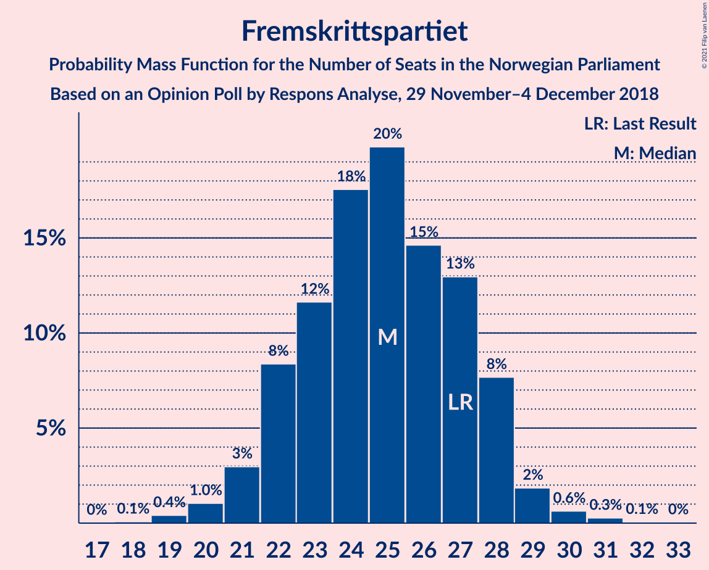
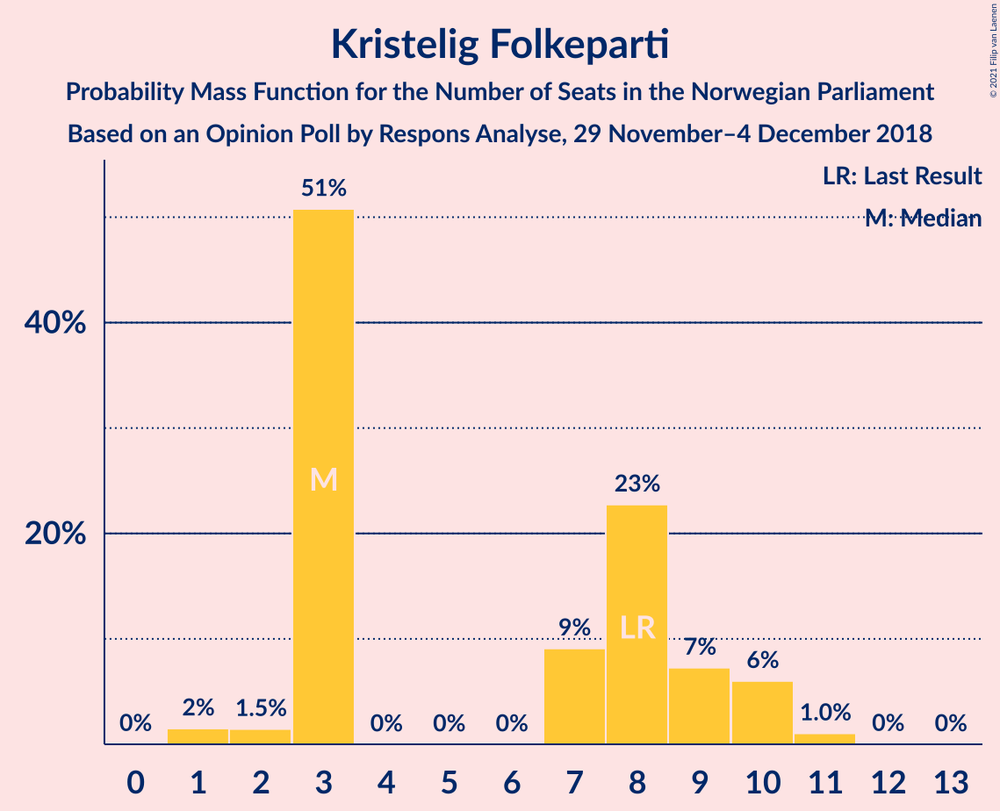
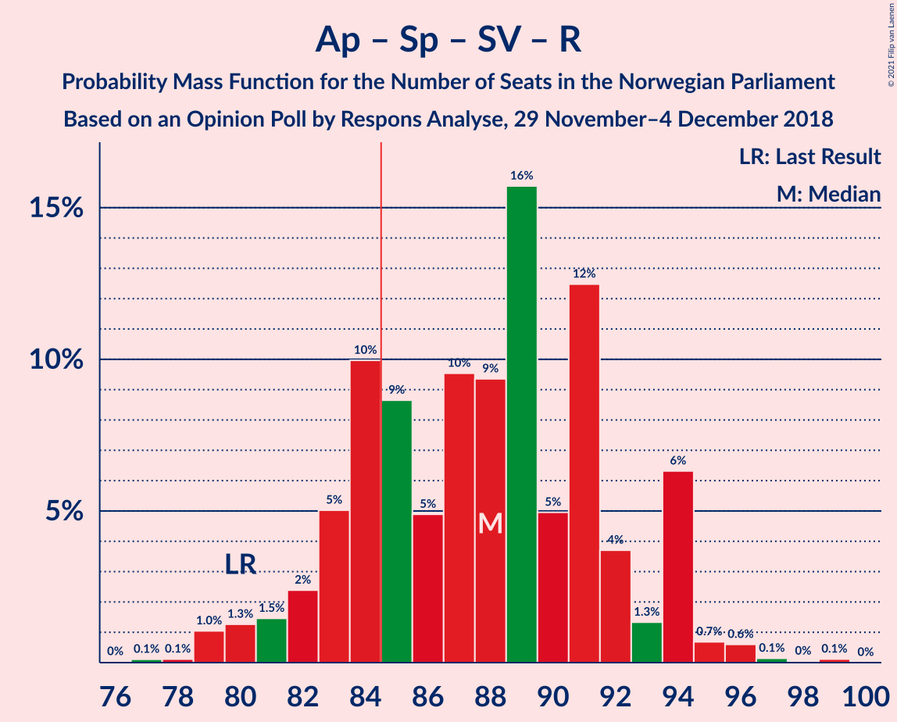
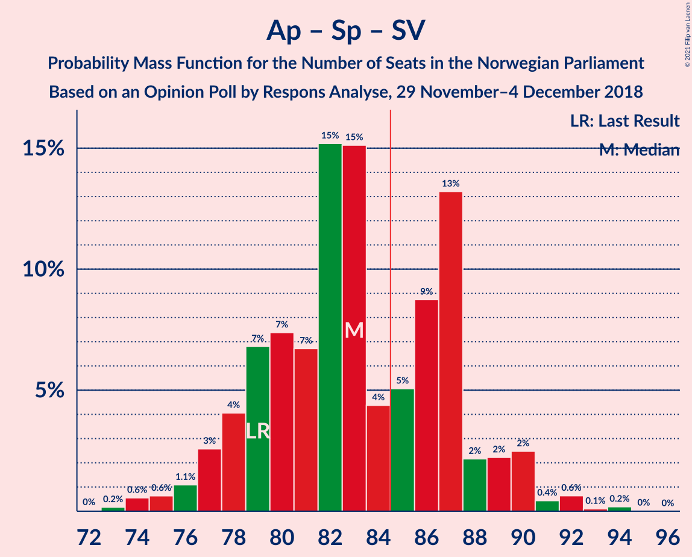
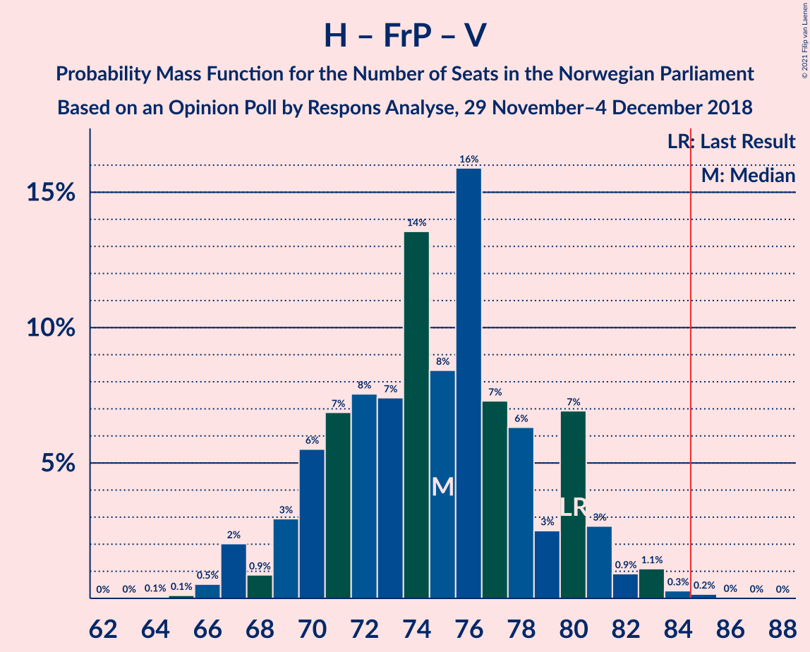
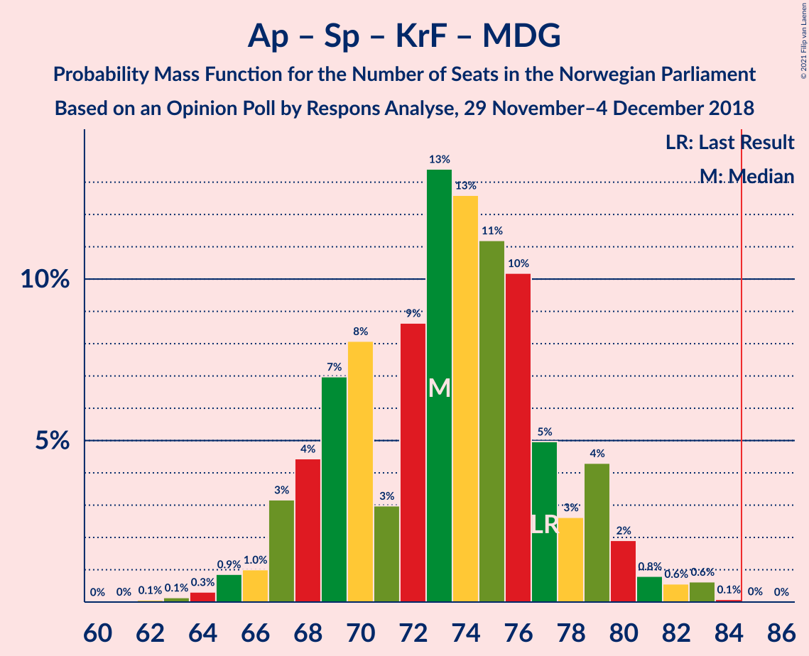
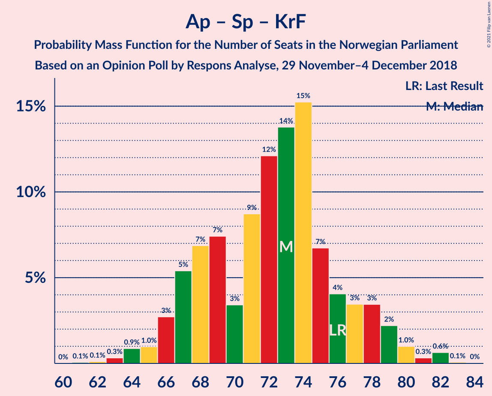
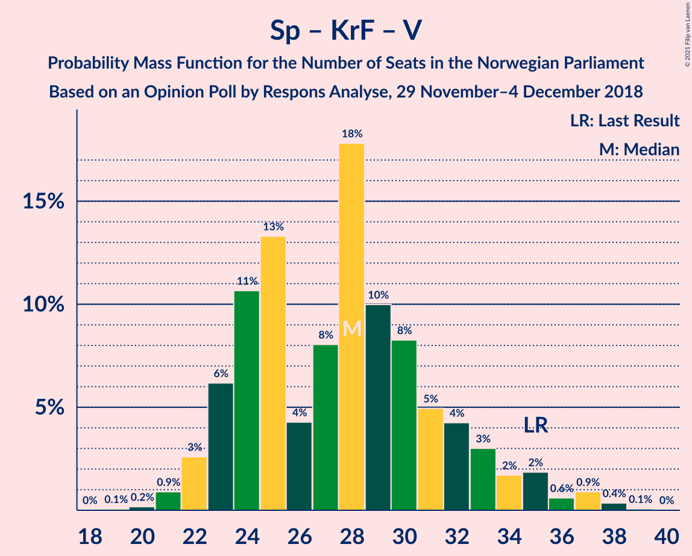

# Opinion Poll by Respons Analyse, 29 November–4 December 2018

<a href="#voting-intentions">Voting Intentions</a> | <a href="#seats">Seats</a> | <a href="#coalitions">Coalitions</a> | <a href="#technical-information">Technical Information</a>

## Voting Intentions

### Confidence Intervals

| Party | Last Result | Poll Result | 80% Confidence Interval | 90% Confidence Interval | 95% Confidence Interval | 99% Confidence Interval |
|:-----:|:-----------:|:-----------:|:-----------------------:|:-----------------------:|:-----------------------:|:-----------------------:|
| Arbeiderpartiet | 27.4% | 26.0% | 24.3–27.8% |23.8–28.4% |23.4–28.8% |22.6–29.7% |
| Høyre | 25.0% | 25.7% | 24.0–27.5% |23.5–28.1% |23.1–28.5% |22.3–29.4% |
| Fremskrittspartiet | 15.2% | 13.5% | 12.2–15.0% |11.8–15.4% |11.5–15.8% |10.9–16.5% |
| Senterpartiet | 10.3% | 10.5% | 9.3–11.8% |9.0–12.2% |8.7–12.6% |8.2–13.2% |
| Sosialistisk Venstreparti | 6.0% | 8.8% | 7.7–10.1% |7.4–10.4% |7.2–10.7% |6.7–11.4% |
| Kristelig Folkeparti | 4.2% | 4.1% | 3.4–5.0% |3.2–5.3% |3.0–5.5% |2.7–6.0% |
| Rødt | 2.4% | 3.9% | 3.2–4.8% |3.0–5.1% |2.9–5.3% |2.6–5.8% |
| Venstre | 4.4% | 3.4% | 2.8–4.3% |2.6–4.5% |2.4–4.7% |2.2–5.2% |
| Miljøpartiet De Grønne | 3.2% | 2.4% | 1.9–3.2% |1.7–3.4% |1.6–3.6% |1.4–3.9% |

*Note:* The poll result column reflects the actual value used in the calculations. Published results may vary slightly, and in addition be rounded to fewer digits.

## Seats

### Confidence Intervals

| Party | Last Result | Median | 80% Confidence Interval | 90% Confidence Interval | 95% Confidence Interval | 99% Confidence Interval |
|:-----:|:-----------:|:------:|:-----------------------:|:-----------------------:|:-----------------------:|:-----------------------:|
| <a href="#arbeiderpartiet">Arbeiderpartiet</a> | 49 | 47 | 44–52 |43–53 |42–53 |41–56 |
| <a href="#høyre">Høyre</a> | 45 | 47 | 43–51 |43–52 |42–52 |40–54 |
| <a href="#fremskrittspartiet">Fremskrittspartiet</a> | 27 | 25 | 22–28 |22–28 |21–29 |19–30 |
| <a href="#senterpartiet">Senterpartiet</a> | 19 | 19 | 17–22 |16–23 |16–23 |15–25 |
| <a href="#sosialistisk-venstreparti">Sosialistisk Venstreparti</a> | 11 | 16 | 14–18 |14–19 |13–20 |12–21 |
| <a href="#kristelig-folkeparti">Kristelig Folkeparti</a> | 8 | 3 | 3–9 |3–10 |2–10 |1–11 |
| <a href="#rødt">Rødt</a> | 1 | 2 | 2–9 |2–9 |1–10 |1–10 |
| <a href="#venstre">Venstre</a> | 8 | 2 | 2–8 |2–8 |1–9 |1–9 |
| <a href="#miljøpartiet-de-grønne">Miljøpartiet De Grønne</a> | 1 | 1 | 0–2 |0–2 |0–2 |0–3 |

### Arbeiderpartiet

*For a full overview of the results for this party, see the [Arbeiderpartiet](party-arbeiderpartiet.html) page.*

| Number of Seats | Probability | Accumulated | Special Marks |
|:---------------:|:-----------:|:-----------:|:-------------:|
| 40 | 0.2% | 100% |  |
| 41 | 0.5% | 99.8% |  |
| 42 | 2% | 99.3% |  |
| 43 | 3% | 97% |  |
| 44 | 10% | 94% |  |
| 45 | 9% | 84% |  |
| 46 | 11% | 75% |  |
| 47 | 22% | 64% | Median |
| 48 | 12% | 42% |  |
| 49 | 9% | 31% | Last Result |
| 50 | 4% | 21% |  |
| 51 | 6% | 18% |  |
| 52 | 6% | 12% |  |
| 53 | 4% | 6% |  |
| 54 | 0.6% | 2% |  |
| 55 | 0.3% | 1.3% |  |
| 56 | 0.9% | 1.0% |  |
| 57 | 0.1% | 0.1% |  |
| 58 | 0% | 0% |  |

### Høyre

*For a full overview of the results for this party, see the [Høyre](party-høyre.html) page.*

| Number of Seats | Probability | Accumulated | Special Marks |
|:---------------:|:-----------:|:-----------:|:-------------:|
| 38 | 0% | 100% |  |
| 39 | 0.2% | 99.9% |  |
| 40 | 0.5% | 99.8% |  |
| 41 | 0.9% | 99.3% |  |
| 42 | 3% | 98% |  |
| 43 | 8% | 95% |  |
| 44 | 10% | 88% |  |
| 45 | 10% | 78% | Last Result |
| 46 | 10% | 68% |  |
| 47 | 19% | 59% | Median |
| 48 | 6% | 40% |  |
| 49 | 10% | 34% |  |
| 50 | 12% | 24% |  |
| 51 | 5% | 11% |  |
| 52 | 4% | 6% |  |
| 53 | 2% | 2% |  |
| 54 | 0.6% | 0.8% |  |
| 55 | 0.1% | 0.2% |  |
| 56 | 0.1% | 0.2% |  |
| 57 | 0% | 0% |  |

### Fremskrittspartiet

*For a full overview of the results for this party, see the [Fremskrittspartiet](party-fremskrittspartiet.html) page.*

| Number of Seats | Probability | Accumulated | Special Marks |
|:---------------:|:-----------:|:-----------:|:-------------:|
| 18 | 0.1% | 100% |  |
| 19 | 0.4% | 99.9% |  |
| 20 | 1.0% | 99.5% |  |
| 21 | 3% | 98% |  |
| 22 | 8% | 95% |  |
| 23 | 12% | 87% |  |
| 24 | 18% | 75% |  |
| 25 | 20% | 58% | Median |
| 26 | 15% | 38% |  |
| 27 | 13% | 23% | Last Result |
| 28 | 8% | 11% |  |
| 29 | 2% | 3% |  |
| 30 | 0.6% | 1.0% |  |
| 31 | 0.3% | 0.4% |  |
| 32 | 0.1% | 0.1% |  |
| 33 | 0% | 0% |  |

### Senterpartiet

*For a full overview of the results for this party, see the [Senterpartiet](party-senterpartiet.html) page.*

| Number of Seats | Probability | Accumulated | Special Marks |
|:---------------:|:-----------:|:-----------:|:-------------:|
| 14 | 0.2% | 100% |  |
| 15 | 1.1% | 99.8% |  |
| 16 | 4% | 98.7% |  |
| 17 | 11% | 95% |  |
| 18 | 15% | 83% |  |
| 19 | 26% | 69% | Last Result, Median |
| 20 | 20% | 43% |  |
| 21 | 8% | 23% |  |
| 22 | 6% | 15% |  |
| 23 | 8% | 9% |  |
| 24 | 0.7% | 1.3% |  |
| 25 | 0.5% | 0.5% |  |
| 26 | 0% | 0.1% |  |
| 27 | 0% | 0% |  |

### Sosialistisk Venstreparti

*For a full overview of the results for this party, see the [Sosialistisk Venstreparti](party-sosialistiskvenstreparti.html) page.*

| Number of Seats | Probability | Accumulated | Special Marks |
|:---------------:|:-----------:|:-----------:|:-------------:|
| 11 | 0.2% | 100% | Last Result |
| 12 | 0.9% | 99.7% |  |
| 13 | 3% | 98.8% |  |
| 14 | 10% | 95% |  |
| 15 | 18% | 86% |  |
| 16 | 25% | 68% | Median |
| 17 | 18% | 43% |  |
| 18 | 16% | 25% |  |
| 19 | 5% | 9% |  |
| 20 | 3% | 4% |  |
| 21 | 0.3% | 0.6% |  |
| 22 | 0.3% | 0.3% |  |
| 23 | 0% | 0% |  |

### Kristelig Folkeparti

*For a full overview of the results for this party, see the [Kristelig Folkeparti](party-kristeligfolkeparti.html) page.*

| Number of Seats | Probability | Accumulated | Special Marks |
|:---------------:|:-----------:|:-----------:|:-------------:|
| 1 | 2% | 100% |  |
| 2 | 1.5% | 98% |  |
| 3 | 51% | 97% | Median |
| 4 | 0% | 46% |  |
| 5 | 0% | 46% |  |
| 6 | 0% | 46% |  |
| 7 | 9% | 46% |  |
| 8 | 23% | 37% | Last Result |
| 9 | 7% | 14% |  |
| 10 | 6% | 7% |  |
| 11 | 1.0% | 1.1% |  |
| 12 | 0% | 0.1% |  |
| 13 | 0% | 0% |  |

### Rødt

*For a full overview of the results for this party, see the [Rødt](party-rødt.html) page.*

| Number of Seats | Probability | Accumulated | Special Marks |
|:---------------:|:-----------:|:-----------:|:-------------:|
| 1 | 3% | 100% | Last Result |
| 2 | 53% | 97% | Median |
| 3 | 0% | 43% |  |
| 4 | 0% | 43% |  |
| 5 | 0% | 43% |  |
| 6 | 0% | 43% |  |
| 7 | 7% | 43% |  |
| 8 | 25% | 36% |  |
| 9 | 9% | 12% |  |
| 10 | 3% | 3% |  |
| 11 | 0.3% | 0.3% |  |
| 12 | 0% | 0% |  |

### Venstre

*For a full overview of the results for this party, see the [Venstre](party-venstre.html) page.*

| Number of Seats | Probability | Accumulated | Special Marks |
|:---------------:|:-----------:|:-----------:|:-------------:|
| 1 | 3% | 100% |  |
| 2 | 82% | 97% | Median |
| 3 | 0.8% | 15% |  |
| 4 | 0% | 14% |  |
| 5 | 0% | 14% |  |
| 6 | 0% | 14% |  |
| 7 | 3% | 14% |  |
| 8 | 8% | 11% | Last Result |
| 9 | 2% | 3% |  |
| 10 | 0.2% | 0.2% |  |
| 11 | 0% | 0% |  |

### Miljøpartiet De Grønne

*For a full overview of the results for this party, see the [Miljøpartiet De Grønne](party-miljøpartietdegrønne.html) page.*

| Number of Seats | Probability | Accumulated | Special Marks |
|:---------------:|:-----------:|:-----------:|:-------------:|
| 0 | 10% | 100% |  |
| 1 | 77% | 90% | Last Result, Median |
| 2 | 12% | 13% |  |
| 3 | 0.3% | 0.7% |  |
| 4 | 0% | 0.4% |  |
| 5 | 0% | 0.4% |  |
| 6 | 0% | 0.4% |  |
| 7 | 0.2% | 0.4% |  |
| 8 | 0.1% | 0.1% |  |
| 9 | 0% | 0% |  |

## Coalitions

### Confidence Intervals

| Coalition | Last Result | Median | Majority? | 80% Confidence Interval | 90% Confidence Interval | 95% Confidence Interval | 99% Confidence Interval |
|:---------:|:-----------:|:------:|:---------:|:-----------------------:|:-----------------------:|:-----------------------:|:-----------------------:|
| Høyre – Fremskrittspartiet – Senterpartiet – Kristelig Folkeparti – Venstre | 107 | 100 | 100% | 95–104 | 94–105 | 93–106 | 91–109 |
| Arbeiderpartiet – Senterpartiet – Sosialistisk Venstreparti – Kristelig Folkeparti – Miljøpartiet De Grønne | 88 | 90 | 90% | 85–94 | 83–95 | 83–96 | 80–98 |
| Arbeiderpartiet – Senterpartiet – Sosialistisk Venstreparti – Rødt – Miljøpartiet De Grønne | 81 | 89 | 88% | 84–93 | 83–95 | 82–95 | 80–97 |
| Arbeiderpartiet – Senterpartiet – Sosialistisk Venstreparti – Rødt | 80 | 88 | 79% | 83–92 | 82–94 | 80–94 | 79–96 |
| Arbeiderpartiet – Senterpartiet – Sosialistisk Venstreparti – Miljøpartiet De Grønne | 80 | 84 | 41% | 80–89 | 79–90 | 77–91 | 75–93 |
| Arbeiderpartiet – Senterpartiet – Sosialistisk Venstreparti | 79 | 83 | 35% | 79–87 | 77–89 | 76–90 | 74–92 |
| Høyre – Fremskrittspartiet – Kristelig Folkeparti – Venstre – Miljøpartiet De Grønne | 89 | 81 | 21% | 77–86 | 75–87 | 75–89 | 73–90 |
| Høyre – Fremskrittspartiet – Kristelig Folkeparti – Venstre | 88 | 80 | 12% | 76–85 | 74–86 | 74–87 | 72–89 |
| Høyre – Fremskrittspartiet – Venstre | 80 | 75 | 0.2% | 70–80 | 69–81 | 67–82 | 66–84 |
| Arbeiderpartiet – Senterpartiet – Kristelig Folkeparti – Miljøpartiet De Grønne | 77 | 73 | 0% | 68–78 | 67–79 | 67–80 | 64–83 |
| Arbeiderpartiet – Senterpartiet – Kristelig Folkeparti | 76 | 73 | 0% | 67–77 | 66–78 | 66–79 | 63–82 |
| Høyre – Fremskrittspartiet | 72 | 72 | 0% | 68–76 | 66–78 | 65–79 | 64–81 |
| Arbeiderpartiet – Sosialistisk Venstreparti – Rødt – Miljøpartiet De Grønne | 62 | 69 | 0% | 65–74 | 64–75 | 63–76 | 60–78 |
| Arbeiderpartiet – Senterpartiet | 68 | 66 | 0% | 63–71 | 62–72 | 61–74 | 59–75 |
| Arbeiderpartiet – Sosialistisk Venstreparti | 60 | 63 | 0% | 60–68 | 59–69 | 58–70 | 56–71 |
| Høyre – Kristelig Folkeparti – Venstre | 61 | 55 | 0% | 51–60 | 50–62 | 49–63 | 48–65 |
| Senterpartiet – Kristelig Folkeparti – Venstre | 35 | 28 | 0% | 24–32 | 23–34 | 22–35 | 21–37 |

### Høyre – Fremskrittspartiet – Senterpartiet – Kristelig Folkeparti – Venstre

| Number of Seats | Probability | Accumulated | Special Marks |
|:---------------:|:-----------:|:-----------:|:-------------:|
| 88 | 0% | 100% |  |
| 89 | 0% | 99.9% |  |
| 90 | 0.2% | 99.9% |  |
| 91 | 0.2% | 99.7% |  |
| 92 | 2% | 99.5% |  |
| 93 | 2% | 98% |  |
| 94 | 3% | 96% |  |
| 95 | 5% | 92% |  |
| 96 | 10% | 88% | Median |
| 97 | 11% | 78% |  |
| 98 | 6% | 67% |  |
| 99 | 10% | 61% |  |
| 100 | 11% | 50% |  |
| 101 | 7% | 39% |  |
| 102 | 8% | 32% |  |
| 103 | 9% | 23% |  |
| 104 | 6% | 15% |  |
| 105 | 4% | 8% |  |
| 106 | 2% | 5% |  |
| 107 | 1.2% | 2% | Last Result |
| 108 | 0.8% | 1.3% |  |
| 109 | 0.4% | 0.5% |  |
| 110 | 0.1% | 0.1% |  |
| 111 | 0% | 0.1% |  |
| 112 | 0% | 0% |  |

### Arbeiderpartiet – Senterpartiet – Sosialistisk Venstreparti – Kristelig Folkeparti – Miljøpartiet De Grønne

| Number of Seats | Probability | Accumulated | Special Marks |
|:---------------:|:-----------:|:-----------:|:-------------:|
| 78 | 0% | 100% |  |
| 79 | 0.1% | 99.9% |  |
| 80 | 0.5% | 99.9% |  |
| 81 | 0.3% | 99.4% |  |
| 82 | 1.0% | 99.0% |  |
| 83 | 4% | 98% |  |
| 84 | 4% | 94% |  |
| 85 | 2% | 90% | Majority |
| 86 | 3% | 88% | Median |
| 87 | 15% | 84% |  |
| 88 | 8% | 69% | Last Result |
| 89 | 6% | 62% |  |
| 90 | 12% | 56% |  |
| 91 | 16% | 44% |  |
| 92 | 9% | 27% |  |
| 93 | 4% | 18% |  |
| 94 | 8% | 14% |  |
| 95 | 3% | 7% |  |
| 96 | 2% | 4% |  |
| 97 | 0.5% | 2% |  |
| 98 | 1.3% | 2% |  |
| 99 | 0.3% | 0.4% |  |
| 100 | 0.1% | 0.1% |  |
| 101 | 0% | 0% |  |

### Arbeiderpartiet – Senterpartiet – Sosialistisk Venstreparti – Rødt – Miljøpartiet De Grønne

| Number of Seats | Probability | Accumulated | Special Marks |
|:---------------:|:-----------:|:-----------:|:-------------:|
| 77 | 0% | 100% |  |
| 78 | 0.1% | 99.9% |  |
| 79 | 0.1% | 99.8% |  |
| 80 | 1.0% | 99.7% |  |
| 81 | 1.1% | 98.8% | Last Result |
| 82 | 2% | 98% |  |
| 83 | 3% | 96% |  |
| 84 | 5% | 93% |  |
| 85 | 10% | 88% | Median, Majority |
| 86 | 9% | 79% |  |
| 87 | 7% | 70% |  |
| 88 | 9% | 64% |  |
| 89 | 8% | 55% |  |
| 90 | 13% | 46% |  |
| 91 | 7% | 34% |  |
| 92 | 14% | 27% |  |
| 93 | 4% | 13% |  |
| 94 | 2% | 10% |  |
| 95 | 6% | 8% |  |
| 96 | 0.9% | 2% |  |
| 97 | 0.7% | 1.0% |  |
| 98 | 0.1% | 0.3% |  |
| 99 | 0.1% | 0.2% |  |
| 100 | 0.1% | 0.1% |  |
| 101 | 0% | 0% |  |

### Arbeiderpartiet – Senterpartiet – Sosialistisk Venstreparti – Rødt

| Number of Seats | Probability | Accumulated | Special Marks |
|:---------------:|:-----------:|:-----------:|:-------------:|
| 76 | 0% | 100% |  |
| 77 | 0.1% | 99.9% |  |
| 78 | 0.1% | 99.8% |  |
| 79 | 1.0% | 99.7% |  |
| 80 | 1.3% | 98.7% | Last Result |
| 81 | 1.5% | 97% |  |
| 82 | 2% | 96% |  |
| 83 | 5% | 94% |  |
| 84 | 10% | 89% | Median |
| 85 | 9% | 79% | Majority |
| 86 | 5% | 70% |  |
| 87 | 10% | 65% |  |
| 88 | 9% | 55% |  |
| 89 | 16% | 46% |  |
| 90 | 5% | 30% |  |
| 91 | 12% | 25% |  |
| 92 | 4% | 13% |  |
| 93 | 1.3% | 9% |  |
| 94 | 6% | 8% |  |
| 95 | 0.7% | 2% |  |
| 96 | 0.6% | 0.9% |  |
| 97 | 0.1% | 0.3% |  |
| 98 | 0% | 0.2% |  |
| 99 | 0.1% | 0.1% |  |
| 100 | 0% | 0% |  |

### Arbeiderpartiet – Senterpartiet – Sosialistisk Venstreparti – Miljøpartiet De Grønne

| Number of Seats | Probability | Accumulated | Special Marks |
|:---------------:|:-----------:|:-----------:|:-------------:|
| 73 | 0.1% | 100% |  |
| 74 | 0.1% | 99.9% |  |
| 75 | 0.6% | 99.8% |  |
| 76 | 0.7% | 99.2% |  |
| 77 | 2% | 98.5% |  |
| 78 | 2% | 97% |  |
| 79 | 4% | 95% |  |
| 80 | 8% | 91% | Last Result |
| 81 | 7% | 83% |  |
| 82 | 6% | 76% |  |
| 83 | 14% | 70% | Median |
| 84 | 16% | 57% |  |
| 85 | 5% | 41% | Majority |
| 86 | 5% | 35% |  |
| 87 | 8% | 30% |  |
| 88 | 10% | 22% |  |
| 89 | 5% | 12% |  |
| 90 | 2% | 6% |  |
| 91 | 2% | 4% |  |
| 92 | 0.4% | 1.4% |  |
| 93 | 0.5% | 1.0% |  |
| 94 | 0.2% | 0.4% |  |
| 95 | 0.2% | 0.2% |  |
| 96 | 0% | 0% |  |

### Arbeiderpartiet – Senterpartiet – Sosialistisk Venstreparti

| Number of Seats | Probability | Accumulated | Special Marks |
|:---------------:|:-----------:|:-----------:|:-------------:|
| 72 | 0% | 100% |  |
| 73 | 0.2% | 99.9% |  |
| 74 | 0.6% | 99.8% |  |
| 75 | 0.6% | 99.2% |  |
| 76 | 1.1% | 98.6% |  |
| 77 | 3% | 97% |  |
| 78 | 4% | 95% |  |
| 79 | 7% | 91% | Last Result |
| 80 | 7% | 84% |  |
| 81 | 7% | 77% |  |
| 82 | 15% | 70% | Median |
| 83 | 15% | 55% |  |
| 84 | 4% | 40% |  |
| 85 | 5% | 35% | Majority |
| 86 | 9% | 30% |  |
| 87 | 13% | 21% |  |
| 88 | 2% | 8% |  |
| 89 | 2% | 6% |  |
| 90 | 2% | 4% |  |
| 91 | 0.4% | 1.4% |  |
| 92 | 0.6% | 0.9% |  |
| 93 | 0.1% | 0.3% |  |
| 94 | 0.2% | 0.2% |  |
| 95 | 0% | 0% |  |

### Høyre – Fremskrittspartiet – Kristelig Folkeparti – Venstre – Miljøpartiet De Grønne

| Number of Seats | Probability | Accumulated | Special Marks |
|:---------------:|:-----------:|:-----------:|:-------------:|
| 70 | 0.1% | 100% |  |
| 71 | 0% | 99.9% |  |
| 72 | 0.1% | 99.8% |  |
| 73 | 0.6% | 99.7% |  |
| 74 | 0.7% | 99.1% |  |
| 75 | 6% | 98% |  |
| 76 | 1.3% | 92% |  |
| 77 | 4% | 91% |  |
| 78 | 12% | 87% | Median |
| 79 | 5% | 75% |  |
| 80 | 16% | 70% |  |
| 81 | 9% | 54% |  |
| 82 | 10% | 45% |  |
| 83 | 5% | 35% |  |
| 84 | 9% | 30% |  |
| 85 | 10% | 21% | Majority |
| 86 | 5% | 11% |  |
| 87 | 2% | 6% |  |
| 88 | 1.5% | 4% |  |
| 89 | 1.3% | 3% | Last Result |
| 90 | 1.0% | 1.3% |  |
| 91 | 0.1% | 0.3% |  |
| 92 | 0.1% | 0.2% |  |
| 93 | 0% | 0.1% |  |
| 94 | 0% | 0% |  |

### Høyre – Fremskrittspartiet – Kristelig Folkeparti – Venstre

| Number of Seats | Probability | Accumulated | Special Marks |
|:---------------:|:-----------:|:-----------:|:-------------:|
| 69 | 0.1% | 100% |  |
| 70 | 0.1% | 99.9% |  |
| 71 | 0.1% | 99.8% |  |
| 72 | 0.7% | 99.7% |  |
| 73 | 0.9% | 99.0% |  |
| 74 | 6% | 98% |  |
| 75 | 2% | 92% |  |
| 76 | 4% | 90% |  |
| 77 | 14% | 87% | Median |
| 78 | 7% | 73% |  |
| 79 | 13% | 66% |  |
| 80 | 8% | 54% |  |
| 81 | 9% | 45% |  |
| 82 | 7% | 36% |  |
| 83 | 9% | 30% |  |
| 84 | 10% | 21% |  |
| 85 | 5% | 12% | Majority |
| 86 | 3% | 7% |  |
| 87 | 2% | 4% |  |
| 88 | 1.1% | 2% | Last Result |
| 89 | 1.0% | 1.2% |  |
| 90 | 0.1% | 0.3% |  |
| 91 | 0.1% | 0.2% |  |
| 92 | 0% | 0.1% |  |
| 93 | 0% | 0% |  |

### Høyre – Fremskrittspartiet – Venstre

| Number of Seats | Probability | Accumulated | Special Marks |
|:---------------:|:-----------:|:-----------:|:-------------:|
| 64 | 0.1% | 100% |  |
| 65 | 0.1% | 99.9% |  |
| 66 | 0.5% | 99.8% |  |
| 67 | 2% | 99.3% |  |
| 68 | 0.9% | 97% |  |
| 69 | 3% | 96% |  |
| 70 | 6% | 93% |  |
| 71 | 7% | 88% |  |
| 72 | 8% | 81% |  |
| 73 | 7% | 74% |  |
| 74 | 14% | 66% | Median |
| 75 | 8% | 53% |  |
| 76 | 16% | 44% |  |
| 77 | 7% | 28% |  |
| 78 | 6% | 21% |  |
| 79 | 3% | 15% |  |
| 80 | 7% | 12% | Last Result |
| 81 | 3% | 5% |  |
| 82 | 0.9% | 3% |  |
| 83 | 1.1% | 2% |  |
| 84 | 0.3% | 0.5% |  |
| 85 | 0.2% | 0.2% | Majority |
| 86 | 0% | 0.1% |  |
| 87 | 0% | 0% |  |

### Arbeiderpartiet – Senterpartiet – Kristelig Folkeparti – Miljøpartiet De Grønne

| Number of Seats | Probability | Accumulated | Special Marks |
|:---------------:|:-----------:|:-----------:|:-------------:|
| 62 | 0.1% | 100% |  |
| 63 | 0.1% | 99.9% |  |
| 64 | 0.3% | 99.8% |  |
| 65 | 0.9% | 99.5% |  |
| 66 | 1.0% | 98.6% |  |
| 67 | 3% | 98% |  |
| 68 | 4% | 94% |  |
| 69 | 7% | 90% |  |
| 70 | 8% | 83% | Median |
| 71 | 3% | 75% |  |
| 72 | 9% | 72% |  |
| 73 | 13% | 63% |  |
| 74 | 13% | 50% |  |
| 75 | 11% | 37% |  |
| 76 | 10% | 26% |  |
| 77 | 5% | 16% | Last Result |
| 78 | 3% | 11% |  |
| 79 | 4% | 8% |  |
| 80 | 2% | 4% |  |
| 81 | 0.8% | 2% |  |
| 82 | 0.6% | 1.3% |  |
| 83 | 0.6% | 0.8% |  |
| 84 | 0.1% | 0.1% |  |
| 85 | 0% | 0% | Majority |

### Arbeiderpartiet – Senterpartiet – Kristelig Folkeparti

| Number of Seats | Probability | Accumulated | Special Marks |
|:---------------:|:-----------:|:-----------:|:-------------:|
| 61 | 0.1% | 100% |  |
| 62 | 0.1% | 99.9% |  |
| 63 | 0.3% | 99.8% |  |
| 64 | 0.9% | 99.5% |  |
| 65 | 1.0% | 98.6% |  |
| 66 | 3% | 98% |  |
| 67 | 5% | 95% |  |
| 68 | 7% | 90% |  |
| 69 | 7% | 83% | Median |
| 70 | 3% | 75% |  |
| 71 | 9% | 72% |  |
| 72 | 12% | 63% |  |
| 73 | 14% | 51% |  |
| 74 | 15% | 37% |  |
| 75 | 7% | 22% |  |
| 76 | 4% | 15% | Last Result |
| 77 | 3% | 11% |  |
| 78 | 3% | 8% |  |
| 79 | 2% | 4% |  |
| 80 | 1.0% | 2% |  |
| 81 | 0.3% | 1.1% |  |
| 82 | 0.6% | 0.7% |  |
| 83 | 0.1% | 0.1% |  |
| 84 | 0% | 0% |  |

### Høyre – Fremskrittspartiet

| Number of Seats | Probability | Accumulated | Special Marks |
|:---------------:|:-----------:|:-----------:|:-------------:|
| 60 | 0.1% | 100% |  |
| 61 | 0% | 99.9% |  |
| 62 | 0.1% | 99.9% |  |
| 63 | 0.2% | 99.8% |  |
| 64 | 0.7% | 99.5% |  |
| 65 | 3% | 98.8% |  |
| 66 | 1.3% | 96% |  |
| 67 | 4% | 95% |  |
| 68 | 7% | 91% |  |
| 69 | 8% | 84% |  |
| 70 | 9% | 75% |  |
| 71 | 8% | 67% |  |
| 72 | 16% | 59% | Last Result, Median |
| 73 | 8% | 43% |  |
| 74 | 16% | 35% |  |
| 75 | 6% | 19% |  |
| 76 | 5% | 13% |  |
| 77 | 2% | 8% |  |
| 78 | 3% | 7% |  |
| 79 | 2% | 3% |  |
| 80 | 0.1% | 1.0% |  |
| 81 | 0.8% | 0.9% |  |
| 82 | 0.1% | 0.2% |  |
| 83 | 0.1% | 0.1% |  |
| 84 | 0% | 0% |  |

### Arbeiderpartiet – Sosialistisk Venstreparti – Rødt – Miljøpartiet De Grønne

| Number of Seats | Probability | Accumulated | Special Marks |
|:---------------:|:-----------:|:-----------:|:-------------:|
| 58 | 0% | 100% |  |
| 59 | 0.1% | 99.9% |  |
| 60 | 0.4% | 99.9% |  |
| 61 | 0.8% | 99.5% |  |
| 62 | 1.2% | 98.7% | Last Result |
| 63 | 2% | 98% |  |
| 64 | 4% | 95% |  |
| 65 | 6% | 92% |  |
| 66 | 9% | 85% | Median |
| 67 | 8% | 77% |  |
| 68 | 7% | 68% |  |
| 69 | 11% | 61% |  |
| 70 | 10% | 50% |  |
| 71 | 6% | 39% |  |
| 72 | 11% | 33% |  |
| 73 | 10% | 22% |  |
| 74 | 5% | 12% |  |
| 75 | 3% | 8% |  |
| 76 | 2% | 4% |  |
| 77 | 2% | 2% |  |
| 78 | 0.2% | 0.5% |  |
| 79 | 0.2% | 0.3% |  |
| 80 | 0% | 0.1% |  |
| 81 | 0% | 0.1% |  |
| 82 | 0% | 0% |  |

### Arbeiderpartiet – Senterpartiet

| Number of Seats | Probability | Accumulated | Special Marks |
|:---------------:|:-----------:|:-----------:|:-------------:|
| 57 | 0% | 100% |  |
| 58 | 0.2% | 99.9% |  |
| 59 | 0.4% | 99.7% |  |
| 60 | 1.2% | 99.3% |  |
| 61 | 3% | 98% |  |
| 62 | 4% | 95% |  |
| 63 | 6% | 91% |  |
| 64 | 10% | 86% |  |
| 65 | 11% | 76% |  |
| 66 | 18% | 64% | Median |
| 67 | 4% | 46% |  |
| 68 | 10% | 42% | Last Result |
| 69 | 10% | 32% |  |
| 70 | 7% | 22% |  |
| 71 | 8% | 15% |  |
| 72 | 2% | 7% |  |
| 73 | 2% | 5% |  |
| 74 | 1.5% | 3% |  |
| 75 | 0.9% | 1.4% |  |
| 76 | 0.2% | 0.4% |  |
| 77 | 0.2% | 0.3% |  |
| 78 | 0.1% | 0.1% |  |
| 79 | 0% | 0% |  |

### Arbeiderpartiet – Sosialistisk Venstreparti

| Number of Seats | Probability | Accumulated | Special Marks |
|:---------------:|:-----------:|:-----------:|:-------------:|
| 54 | 0% | 100% |  |
| 55 | 0.3% | 99.9% |  |
| 56 | 0.4% | 99.6% |  |
| 57 | 1.0% | 99.3% |  |
| 58 | 2% | 98% |  |
| 59 | 2% | 96% |  |
| 60 | 8% | 93% | Last Result |
| 61 | 9% | 85% |  |
| 62 | 8% | 76% |  |
| 63 | 19% | 68% | Median |
| 64 | 14% | 49% |  |
| 65 | 7% | 36% |  |
| 66 | 9% | 29% |  |
| 67 | 6% | 20% |  |
| 68 | 8% | 14% |  |
| 69 | 2% | 6% |  |
| 70 | 2% | 4% |  |
| 71 | 2% | 2% |  |
| 72 | 0.1% | 0.3% |  |
| 73 | 0.1% | 0.2% |  |
| 74 | 0% | 0.1% |  |
| 75 | 0% | 0% |  |

### Høyre – Kristelig Folkeparti – Venstre

| Number of Seats | Probability | Accumulated | Special Marks |
|:---------------:|:-----------:|:-----------:|:-------------:|
| 45 | 0% | 100% |  |
| 46 | 0.1% | 99.9% |  |
| 47 | 0.2% | 99.8% |  |
| 48 | 0.9% | 99.6% |  |
| 49 | 3% | 98.7% |  |
| 50 | 4% | 96% |  |
| 51 | 6% | 91% |  |
| 52 | 15% | 86% | Median |
| 53 | 3% | 71% |  |
| 54 | 13% | 68% |  |
| 55 | 9% | 54% |  |
| 56 | 9% | 45% |  |
| 57 | 8% | 37% |  |
| 58 | 9% | 28% |  |
| 59 | 5% | 19% |  |
| 60 | 7% | 15% |  |
| 61 | 2% | 7% | Last Result |
| 62 | 3% | 6% |  |
| 63 | 1.4% | 3% |  |
| 64 | 0.9% | 2% |  |
| 65 | 0.5% | 0.9% |  |
| 66 | 0.2% | 0.3% |  |
| 67 | 0.1% | 0.1% |  |
| 68 | 0% | 0.1% |  |
| 69 | 0% | 0% |  |

### Senterpartiet – Kristelig Folkeparti – Venstre

| Number of Seats | Probability | Accumulated | Special Marks |
|:---------------:|:-----------:|:-----------:|:-------------:|
| 19 | 0.1% | 100% |  |
| 20 | 0.2% | 99.9% |  |
| 21 | 0.9% | 99.7% |  |
| 22 | 3% | 98.8% |  |
| 23 | 6% | 96% |  |
| 24 | 11% | 90% | Median |
| 25 | 13% | 79% |  |
| 26 | 4% | 66% |  |
| 27 | 8% | 62% |  |
| 28 | 18% | 54% |  |
| 29 | 10% | 36% |  |
| 30 | 8% | 26% |  |
| 31 | 5% | 18% |  |
| 32 | 4% | 13% |  |
| 33 | 3% | 9% |  |
| 34 | 2% | 6% |  |
| 35 | 2% | 4% | Last Result |
| 36 | 0.6% | 2% |  |
| 37 | 0.9% | 1.4% |  |
| 38 | 0.4% | 0.5% |  |
| 39 | 0.1% | 0.1% |  |
| 40 | 0% | 0% |  |

## Technical Information

### Opinion Poll

+ **Polling firm:** Respons Analyse
+ **Commissioner(s):** —
+ **Fieldwork period:** 29 November–4 December 2018

### Calculations

+ **Sample size:** 1000
+ **Simulations done:** 1,048,576
+ **Error estimate:** 3.11%

